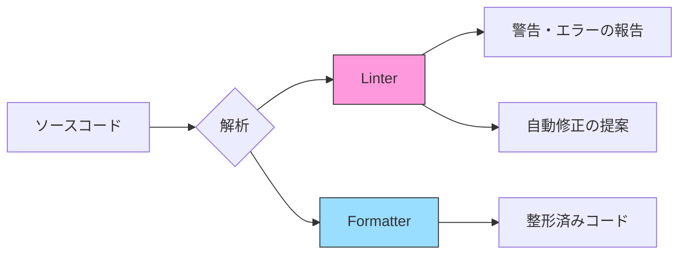
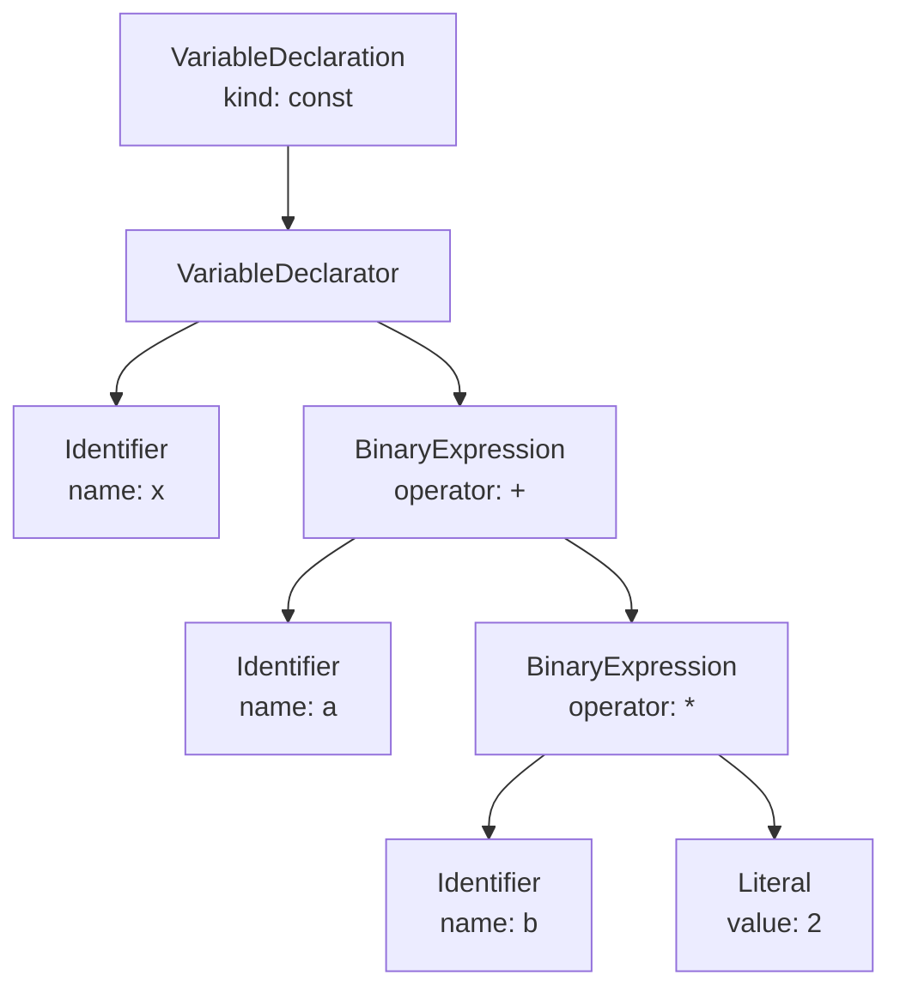
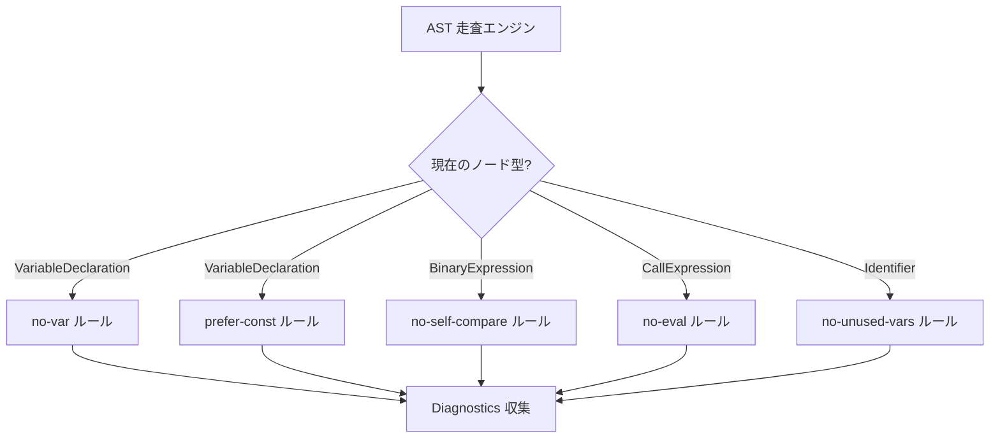
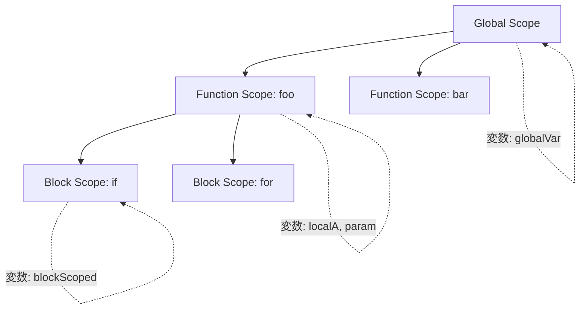
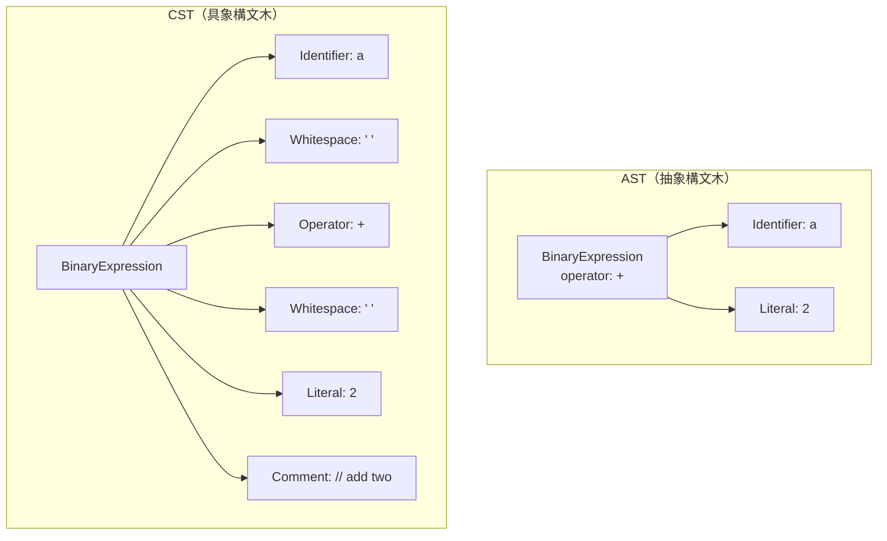
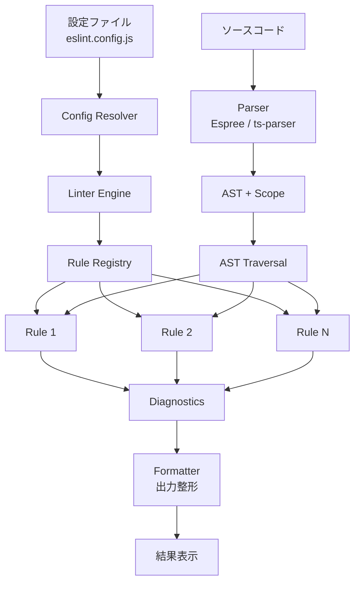
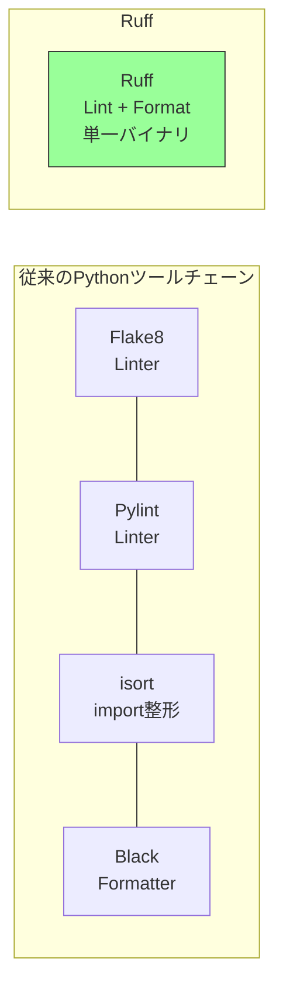

# Linter / Formatter の設計思想（AST変換, ルールエンジン）

## 1. 背景と動機

### 1.1 なぜコードの品質と一貫性が問題になるのか

ソフトウェア開発において、コードは書かれる回数よりも読まれる回数のほうが圧倒的に多い。チームで開発を行う場合、各メンバーが異なるコーディングスタイルを持ち込むと、コードベース全体の可読性が著しく低下する。インデントの幅、括弧の配置、変数名の命名規則、空白行の使い方——これらの些細に見える差異が積み重なると、コードレビューの議論がスタイルの瑣末な問題に費やされ、本来議論すべき設計やロジックの問題が見過ごされる。

さらに深刻な問題として、コードの中には人間の目では見落としやすいバグのパターンが存在する。未使用の変数、到達不能なコード、暗黙的な型変換、`==` と `===` の混同——これらは文法的には正しいためコンパイラやインタプリタはエラーを報告しないが、実行時に予期しない動作を引き起こす可能性がある。

この二つの問題——**スタイルの不統一**と**潜在的なバグの検出**——を自動的に解決するために生まれたのが、Linter と Formatter である。

### 1.2 Linter と Formatter の本質的な役割

Linter と Formatter は、しばしば一括りに語られるが、その役割は本質的に異なる。

**Linter** は、ソースコードを静的に解析し、潜在的なバグ、スタイル違反、ベストプラクティスからの逸脱を検出するツールである。Linter の出力は「指摘」であり、開発者に対して「このコードには問題がある可能性がある」と報告する。修正するかどうかの判断は開発者に委ねられる場合もあれば、自動修正（auto-fix）が提供される場合もある。

**Formatter** は、ソースコードの意味（セマンティクス）を変えずに、一貫したスタイルでコードを再整形するツールである。Formatter の出力は「整形済みのコード」そのものであり、スタイルに関する議論の余地を排除することが目的である。



この区別を理解することは極めて重要である。Linter はコードの**正しさ**に関わり、Formatter はコードの**見た目**に関わる。両者は直交する関心事であり、相補的に機能する。

## 2. 歴史的経緯

### 2.1 lint の誕生

Linter の歴史は1978年にまで遡る。ベル研究所の Stephen C. Johnson が、C言語のコンパイラでは検出されない潜在的なバグやポータビリティの問題を報告するツール「lint」を開発した。この名称は、洗濯乾燥機のフィルターに溜まる「糸くず（lint）」に由来する——コードの中の小さな問題を拾い上げるという比喩である。

当時のC言語コンパイラは非常に寛容であり、型の不一致や未使用変数などを警告なしに通過させていた。lint はコンパイラの外部に位置する追加の検査ツールとして、コードの品質向上に大きく貢献した。

### 2.2 言語固有の Linter の発展

lint の成功を受けて、多くの言語で同様のツールが開発されていった。

| 年代 | ツール | 言語 | 特筆すべき点 |
|------|--------|------|------------|
| 1978 | lint | C | 最初の Linter |
| 2002 | Checkstyle | Java | XML ベースのルール定義 |
| 2006 | Pylint | Python | 高度な静的解析 |
| 2009 | JSHint | JavaScript | JSLint の後継、設定可能 |
| 2013 | ESLint | JavaScript | プラグインアーキテクチャ |
| 2015 | RuboCop | Ruby | 自動修正機能 |
| 2018 | clippy | Rust | コンパイラ統合型 |
| 2022 | Ruff | Python | Rust実装による高速化 |

### 2.3 Formatter の台頭

コードフォーマッタの歴史はさらに古く、1970年代の `indent`（C言語用）や `cb`（C beautifier）にまで遡る。しかし、Formatter が開発ワークフローの中核に据えられるようになったのは、Go 言語の `gofmt`（2009年）の登場以降である。

`gofmt` は「フォーマットに関する議論は不要である。`gofmt` のスタイルは誰の好みでもないが、`gofmt` は全員の好みである」という哲学を打ち出した。この「opinionated（主張のある）」アプローチは、設定項目を最小限に絞り、スタイルに関する自転車置き場の議論（bikeshedding）を根絶することを目指した。

この思想は 2016年に登場した Prettier（JavaScript/TypeScript用）に引き継がれ、Web 開発の世界に大きな影響を与えた。

## 3. Linter の内部構造

### 3.1 処理パイプライン

Linter の処理は、大きく以下の段階に分けられる。


1. **字句解析（Lexical Analysis）**: ソースコードのテキストをトークン列に分解する。各トークンは種別（keyword, identifier, literal, operator 等）と位置情報（行番号、列番号）を持つ。

2. **構文解析（Parsing）**: トークン列を言語の文法に従って解析し、抽象構文木（AST）を構築する。

3. **ルールの適用**: 構築された AST を走査しながら、登録された各ルールを適用し、問題を検出する。

4. **レポート出力**: 検出された問題を、ファイル名・行番号・列番号・重大度・メッセージとともに出力する。

### 3.2 抽象構文木（AST）の表現

AST はソースコードの構文構造を木構造で表現したものである。ソースコードのテキスト表現から、意味に関係しない情報（空白、コメント、括弧の一部）を除去し、プログラムの論理構造のみを保持する。

例えば、以下の JavaScript コードを考える。

```javascript
const x = a + b * 2;
```

このコードは、次のような AST に変換される。



ESTree 仕様に基づく JSON 表現では、この AST は以下のようになる。

```json
{
  "type": "VariableDeclaration",
  "kind": "const",
  "declarations": [
    {
      "type": "VariableDeclarator",
      "id": { "type": "Identifier", "name": "x" },
      "init": {
        "type": "BinaryExpression",
        "operator": "+",
        "left": { "type": "Identifier", "name": "a" },
        "right": {
          "type": "BinaryExpression",
          "operator": "*",
          "left": { "type": "Identifier", "name": "b" },
          "right": { "type": "Literal", "value": 2 }
        }
      }
    }
  ]
}
```

AST のノード型は言語仕様に対応しており、JavaScript の場合は ESTree 仕様、Python の場合は `ast` モジュール、Rust の場合は `syn` クレートなど、言語ごとに標準的な AST 表現が定義されている。

### 3.3 AST の走査（Traversal）

AST を走査する方法には、大きく二つのアプローチがある。

**深さ優先走査（Depth-First Traversal）** が最も一般的であり、各ノードを訪問する際に「enter」と「exit」の二つのタイミングでコールバックを呼び出す。

```
enter VariableDeclaration
  enter VariableDeclarator
    enter Identifier (x)
    exit  Identifier (x)
    enter BinaryExpression (+)
      enter Identifier (a)
      exit  Identifier (a)
      enter BinaryExpression (*)
        enter Identifier (b)
        exit  Identifier (b)
        enter Literal (2)
        exit  Literal (2)
      exit  BinaryExpression (*)
    exit  BinaryExpression (+)
  exit  VariableDeclarator
exit  VariableDeclaration
```

この走査パターンは Visitor パターンとして体系化されており、Linter のルールエンジンの基盤となっている。

## 4. ルールエンジンのアーキテクチャ

### 4.1 Visitor パターン

Linter のルールエンジンの中核は Visitor パターンである。各ルールは「どのノード型に関心があるか」を宣言し、AST の走査中にそのノード型が出現したときにコールバックが呼び出される。

ESLint のルール定義を例に取ると、以下のような構造になる。

```javascript
// Rule: no-var
module.exports = {
  meta: {
    type: "suggestion",
    docs: {
      description: "Require let or const instead of var",
    },
    fixable: "code",
    schema: [],
  },
  create(context) {
    return {
      // Called when a VariableDeclaration node is encountered
      VariableDeclaration(node) {
        if (node.kind === "var") {
          context.report({
            node,
            message: "Unexpected var, use let or const instead.",
            fix(fixer) {
              return fixer.replaceTextRange(
                [node.range[0], node.range[0] + 3],
                "let"
              );
            },
          });
        }
      },
    };
  },
};
```

このルールは `VariableDeclaration` ノードにのみ関心を持ち、`kind` が `"var"` である場合に警告を報告する。`fix` 関数を提供することで、`--fix` オプション使用時に自動修正が可能になる。

### 4.2 ルールの合成とイベント駆動

Linter のルールエンジンが優れている点は、**複数のルールを独立に定義し、単一の AST 走査で同時に適用できる**ことである。これは以下のように実現される。



内部的には、ルールエンジンは各ルールの関心のあるノード型を事前に収集し、ノード型をキーとするマップ（イベントリスナーの登録テーブル）を構築する。AST の走査中に特定のノード型に遭遇すると、そのノード型に対応するすべてのルールのコールバックが呼び出される。

この設計はイベント駆動（event-driven）アーキテクチャであり、パブリッシュ・サブスクライブ（pub/sub）パターンに類似している。各ルールは特定のノード型イベントを「購読」し、走査エンジンがイベントを「発行」する。

```javascript
// Simplified rule engine implementation
class RuleEngine {
  constructor() {
    // Map from node type to list of listener functions
    this.listeners = new Map();
  }

  registerRule(rule, context) {
    const visitors = rule.create(context);
    for (const [nodeType, handler] of Object.entries(visitors)) {
      if (!this.listeners.has(nodeType)) {
        this.listeners.set(nodeType, []);
      }
      this.listeners.get(nodeType).push(handler);
    }
  }

  traverse(node) {
    const type = node.type;
    // Notify all listeners for this node type (enter phase)
    const handlers = this.listeners.get(type) || [];
    for (const handler of handlers) {
      handler(node);
    }
    // Recursively traverse child nodes
    for (const child of getChildren(node)) {
      this.traverse(child);
    }
    // Exit phase handlers (e.g., "VariableDeclaration:exit")
    const exitHandlers =
      this.listeners.get(`${type}:exit`) || [];
    for (const handler of exitHandlers) {
      handler(node);
    }
  }
}
```

### 4.3 スコープ解析とデータフロー

単純な AST パターンマッチングだけでは検出できない問題も多い。例えば「未使用変数」を検出するには、変数が定義されたスコープ内で参照されているかどうかを追跡する必要がある。

ESLint はこのために `eslint-scope` というライブラリを使用し、スコープチェーンの構築と変数参照の解決を行う。



スコープ解析では、各スコープにおける変数の定義（declarations）と参照（references）を記録し、定義はあるが参照がない変数を「未使用」として検出する。これは単純な文字列検索やパターンマッチングでは実現できない、構造的な解析である。

### 4.4 ルールの設定と重大度

Linter のルールは通常、以下の重大度レベルで設定される。

- **off**（0）: ルールを無効化する
- **warn**（1）: 警告として報告するが、終了コードには影響しない
- **error**（2）: エラーとして報告し、終了コードを非ゼロにする

さらに、多くのルールはオプションを受け取ることができる。例えば ESLint の `indent` ルールは、インデント幅（2, 4, "tab"）やスイッチケースのインデントなど、詳細な設定が可能である。

## 5. Formatter の内部構造

### 5.1 Formatter と Linter の根本的な違い

Linter がコードの問題を「指摘する」のに対し、Formatter はコードを「書き換える」。この違いは技術的に大きな意味を持つ。Formatter はソースコードのセマンティクスを完全に保持しつつ、テキスト表現のみを変更しなければならない。つまり、Formatter の入力と出力を同じパーサーで解析した場合、同一の AST が得られなければならない。

### 5.2 CST（Concrete Syntax Tree）と空白情報の保持

AST は空白やコメントの情報を捨象するため、Formatter が AST だけを使ってコードを再構築しようとすると、元のコードに存在していたコメントの位置が失われてしまう。

この問題を解決するために、多くの Formatter は **CST（Concrete Syntax Tree）** あるいは AST にトリビア（trivia: 空白、コメント、改行）情報を付加したデータ構造を使用する。



CST はソースコードの全情報を保持するため、元のテキストを完全に再構築できる。いわゆる「ロスレス」な構文木表現であり、Rust の `rowan`（rust-analyzer が使用）や `tree-sitter` が代表的な実装である。

### 5.3 Pretty Printing アルゴリズム

Formatter の中核は Pretty Printing アルゴリズムである。これは、構造化されたデータを人間が読みやすい形式で出力する手法であり、長い歴史を持つ研究分野である。

#### Oppen のアルゴリズム（1980年）

Derek Oppen は1980年に、線形時間で動作する Pretty Printing アルゴリズムを発表した。このアルゴリズムは、以下の基本的な概念に基づいている。

- **Group**: 可能であれば一行に収め、収まらなければ改行するテキストの塊
- **Break**: 改行の候補位置。Group が一行に収まる場合は空白として出力され、収まらない場合は改行として出力される
- **Indent**: インデントレベルの制御

#### Wadler-Lindig アルゴリズム

Philip Wadler（1998年, 2003年）と Christian Lindig（2000年）は、Oppen のアルゴリズムを関数型プログラミングの観点から再定式化した。このアルゴリズムでは、ドキュメントを以下のプリミティブから構成される代数的データ型として表現する。

```
Doc ::= Nil                    -- empty document
      | Text(string)           -- literal text
      | Line                   -- newline or space (when flattened)
      | Nest(indent, Doc)      -- increase indentation
      | Group(Doc)             -- try to flatten into single line
      | Concat(Doc, Doc)       -- concatenation
```

`Group` が鍵となる構造である。`Group` の内部のドキュメントが指定された行幅に収まる場合、すべての `Line` を空白に置換して一行に出力する。収まらない場合、`Line` を改行として出力する。

この判断は再帰的に行われるため、ネストした `Group` によって複雑なレイアウト決定が可能になる。

```
// Input document structure (simplified)
Group(
  Concat(
    Text("function foo("),
    Nest(2,
      Group(
        Concat(Text("param1,"), Line, Text("param2,"), Line, Text("param3"))
      )
    ),
    Text(") {}")
  )
)

// If it fits in one line (line width >= 40):
function foo(param1, param2, param3) {}

// If it doesn't fit:
function foo(
  param1,
  param2,
  param3
) {}
```

### 5.4 Prettier の中間表現（IR）

Prettier は Wadler-Lindig アルゴリズムの変種を使用している。ソースコードを解析した後、言語固有の AST を Prettier 独自の中間表現（IR）に変換し、その IR を Pretty Printer が処理する。


Prettier の IR は以下のようなコマンドで構成される。

| IR コマンド | 意味 |
|------------|------|
| `group` | 一行に収まればフラット化、収まらなければ展開 |
| `indent` | インデントレベルを増加 |
| `line` | フラットモードでは空白、展開モードでは改行 |
| `softline` | フラットモードでは空文字、展開モードでは改行 |
| `hardline` | 常に改行 |
| `fill` | テキストをワードラップ的に配置 |
| `ifBreak` | 展開されたかどうかで出力を変える |

この設計の利点は、**言語固有の処理と整形ロジックの完全な分離**にある。新しい言語をサポートする際には、その言語の Parser と、AST から IR への変換ロジック（Printer）を実装すればよい。Pretty Printing アルゴリズム自体は再利用される。

## 6. ESLint のアーキテクチャ

### 6.1 設計哲学

ESLint は2013年に Nicholas C. Zakas によって開発された。その設計哲学は以下の原則に基づいている。

1. **すべてがプラグイン**: コアルールも内部的にはプラグインと同じ仕組みで動作する
2. **パーサーの交換可能性**: デフォルトの Espree 以外にも、TypeScript 用の `@typescript-eslint/parser` や Babel 用の `@babel/eslint-parser` など、任意のパーサーを使用できる
3. **ルールの独立性**: 各ルールは他のルールに依存せず、単独で動作する

### 6.2 アーキテクチャの全体像



### 6.3 Flat Config（フラット設定）

ESLint v9 以降では、従来のカスケード型の設定（`.eslintrc`）に代わり、Flat Config と呼ばれる新しい設定方式が標準となった。

従来の設定方式では、`.eslintrc` ファイルがディレクトリ階層に沿ってカスケード的にマージされ、`extends` による設定の継承が行われた。この方式は柔軟である一方、最終的にどの設定が適用されるかを理解するのが困難であった。

Flat Config は、設定を単一の配列として表現する。各要素は独立した設定オブジェクトであり、上から順に適用される。この方式は「何が適用されるか」が一目瞭然であり、設定のデバッグが容易である。

```javascript
// eslint.config.js
import js from "@eslint/js";
import tseslint from "typescript-eslint";

export default [
  // Base configuration for all files
  js.configs.recommended,

  // TypeScript-specific configuration
  ...tseslint.configs.recommended,

  // Project-specific overrides
  {
    files: ["src/**/*.ts"],
    rules: {
      "no-console": "warn",
      "@typescript-eslint/no-unused-vars": [
        "error",
        { argsIgnorePattern: "^_" },
      ],
    },
  },

  // Test files have different rules
  {
    files: ["**/*.test.ts"],
    rules: {
      "no-console": "off",
    },
  },
];
```

### 6.4 プラグインシステム

ESLint のプラグインは、以下の要素を提供できる。

- **ルール**: 新しい検査ルール
- **プロセッサ**: Markdown ファイル内のコードブロックなど、非標準的なファイルからコードを抽出する
- **設定**: プリセットされたルール設定
- **パーサー**: 言語固有のパーサー

プラグインの API は明確に定義されており、サードパーティの開発者が容易にルールを追加できる。この拡張性が ESLint の生態系を豊かにし、`eslint-plugin-react`、`eslint-plugin-import`、`@typescript-eslint/eslint-plugin` など、多数のプラグインが開発されている。

## 7. Prettier のアプローチ

### 7.1 Opinionated（主張のある）設計

Prettier の最も重要な設計判断は、**設定項目を極力少なくする**ことである。Prettier が提供するオプションは、行幅（`printWidth`）、タブ幅（`tabWidth`）、セミコロンの有無（`semi`）、クォートの種類（`singleQuote`）など、ごくわずかに限られる。

この設計判断の背景には、「スタイルに関する議論に終止符を打つ」という明確な意図がある。設定項目が多ければ多いほど、チーム内でどの設定を選ぶかという新たな議論が生まれる。Prettier は設定の余地を最小化することで、この問題を構造的に解消しようとした。

### 7.2 処理の流れ

Prettier の処理は以下のステップで行われる。

1. **Parse**: ソースコードを言語固有のパーサーで解析し、AST を生成する
2. **Print**: AST を Prettier の中間表現（Doc IR）に変換する
3. **Render**: Doc IR を、指定された行幅に基づいてテキストに変換する

重要な特徴として、Prettier は**元のコードの整形を完全に無視する**。入力コードがどのように整形されていようと、出力は常に同じになる。つまり、Prettier は冪等（idempotent）であり、`prettier(prettier(code)) === prettier(code)` が成り立つ。

### 7.3 行幅とレイアウト決定

Prettier の整形の核心は、`printWidth`（デフォルト80文字）に基づくレイアウト決定である。

```
// printWidth: 40 の場合

// 短い配列: 一行に収まる
const a = [1, 2, 3];

// 長い配列: 展開される
const b = [
  "very long string one",
  "very long string two",
  "very long string three",
];
```

この判断は、前述の `group` と `line` の IR コマンドによって制御される。`group` の内容が `printWidth` に収まるかどうかを評価し、収まらない場合は `line` を改行に展開する。

### 7.4 コメントの処理

コメントの処理は、あらゆる Formatter にとって最も困難な課題の一つである。AST 上ではコメントはノードとノードの「隙間」に位置するため、コメントをどのノードに「紐づける」かを決定するヒューリスティクスが必要になる。

Prettier は、コメントの直前・直後のノードとの位置関係に基づいて、コメントを leading（先行）、trailing（後続）、dangling（浮遊）のいずれかに分類する。

```javascript
// leading comment: attached to the next node
const x = 1;

const y = 2; // trailing comment: attached to the previous node

function foo(
  // dangling comment: no adjacent node in the same level
) {}
```

この分類に基づいて、整形後もコメントが適切な位置に配置される。しかし、コメントの配置はエッジケースが多く、Prettier の issue tracker でも最も議論が多いトピックの一つである。

## 8. Linter と Formatter の関係

### 8.1 直交する関心事

Linter と Formatter は異なる問題を解決するツールであり、本質的に直交する関心事を扱う。

| 観点 | Linter | Formatter |
|------|--------|-----------|
| 目的 | バグの検出、ベストプラクティスの強制 | コードスタイルの統一 |
| 出力 | 警告・エラーのリスト | 整形済みのソースコード |
| 判断基準 | コードの正しさ・品質 | コードの見た目・一貫性 |
| 設定の粒度 | ルールごとに詳細設定可能 | 最小限（opinionated） |
| 適用タイミング | CI、エディタ保存時、pre-commit | エディタ保存時、pre-commit |

### 8.2 役割の重複と分離

歴史的に、ESLint は整形に関するルール（`indent`、`semi`、`quotes` など）も提供してきた。しかし、Prettier の台頭により、整形に関する処理は Formatter に任せ、Linter はコード品質に関するルールに集中するという役割分担が確立された。

ESLint v8.53.0 以降、整形関連のルールは非推奨（deprecated）となり、`@stylistic/eslint-plugin` に移管された。この決定は、Linter と Formatter の役割分離を公式に認めたものと言える。

現代的なワークフローでは、以下のような構成が一般的である。


この構成では、まず Prettier がコードを整形し、次に ESLint がコードの品質を検査する。ESLint の `eslint-config-prettier` を使用することで、Prettier と競合する ESLint のルールを自動的に無効化できる。

## 9. 自動修正（Auto-Fix）とコード変換

### 9.1 Auto-Fix の仕組み

ESLint の Auto-Fix は、ルールが問題を報告する際に `fix` 関数を提供することで実現される。`fix` 関数は `fixer` オブジェクトを受け取り、テキストレベルの置換操作を返す。

```javascript
context.report({
  node,
  message: "Use === instead of ==",
  fix(fixer) {
    // Replace the operator text
    return fixer.replaceTextRange(
      [node.range[0] + leftLength, node.range[0] + leftLength + 2],
      "==="
    );
  },
});
```

複数のルールが同一の範囲に対して Fix を提案した場合、競合が発生する。ESLint はこの問題を以下の方法で解決する。

1. 各 Fix のテキスト範囲を比較する
2. 範囲が重複する Fix は競合として扱い、一方のみを適用する
3. 適用されなかった Fix は次のパスで適用される可能性がある
4. 最大10回のパスを繰り返し、すべての Fix が適用されるまで試行する

### 9.2 Suggestions（提案）

一部のルールでは、自動修正ではなく「提案（suggestion）」を提供する。提案は自動的には適用されないが、エディタの UI を通じて開発者が選択的に適用できる。

提案は、自動修正が安全でない場合に使用される。例えば、`no-unsafe-negation` ルールが `!a instanceof B` を検出した場合、これを `!(a instanceof B)` に修正すべきか `(!a) instanceof B` に修正すべきかは文脈に依存するため、自動修正ではなく提案として両方の選択肢を提示する。

### 9.3 コードモッド（Codemod）との関係

Linter の Auto-Fix 機能を拡張すると、コードモッド（codemod）の領域に入る。コードモッドは、コードベース全体にわたる大規模な自動リファクタリングを行うツールであり、Facebook が開発した jscodeshift が代表的である。

jscodeshift は AST を直接操作する API を提供し、AST ノードの追加・削除・置換を行った後、修正された AST からソースコードを再生成する。

```javascript
// jscodeshift example: convert require to import
export default function transformer(file, api) {
  const j = api.jscodeshift;
  return j(file.source)
    .find(j.CallExpression, {
      callee: { name: "require" },
    })
    .forEach((path) => {
      const parent = path.parent.node;
      if (parent.type === "VariableDeclarator") {
        const importDecl = j.importDeclaration(
          [j.importDefaultSpecifier(parent.id)],
          path.node.arguments[0]
        );
        j(path.parent.parent).replaceWith(importDecl);
      }
    })
    .toSource();
}
```

Linter の Auto-Fix とコードモッドの違いは、主にスコープと目的にある。Auto-Fix は個々のルール違反を修正する局所的な操作であるのに対し、コードモッドはコードベース全体にわたるパターンの変換を行う大域的な操作である。

## 10. 次世代ツール：パフォーマンスの追求

### 10.1 従来ツールの性能限界

ESLint と Prettier は JavaScript（Node.js）で実装されている。これは JavaScript エコシステムとの親和性が高い一方、パフォーマンス面での制約がある。大規模なコードベース（数千ファイル、数十万行）では、lint と整形に数分を要することがあり、開発者体験の障害となっていた。

パフォーマンスのボトルネックは主に以下の点にある。

- **JavaScript のシングルスレッド性**: Node.js はイベントループベースのシングルスレッドモデルであり、CPU バウンドな処理の並列化が困難
- **GC のオーバーヘッド**: 大量の AST ノードを生成するため、GC（ガベージコレクション）の負荷が高い
- **パーサーの速度**: JavaScript で実装されたパーサーは、ネイティブコードのパーサーに比べて桁違いに遅い

### 10.2 Rust/Go による再実装

これらの性能課題を解決するために、Linter と Formatter をシステムプログラミング言語で再実装する動きが活発化している。

#### Biome（旧 Rome）

Biome は、Linter と Formatter の両方の機能を単一のツールに統合した Rust 実装のツールである。以下の特徴を持つ。

- **統合ツールチェーン**: Linter、Formatter、（将来的には）バンドラ、テストランナーを一つのバイナリに統合
- **高速なパーサー**: Rust で実装された独自のパーサーにより、Espree の数十倍の速度で解析
- **並列処理**: Rayon（Rust の並列処理ライブラリ）を使用し、複数ファイルを並列に処理
- **ゼロ設定**: Prettier 互換の整形をデフォルトで提供

#### oxlint

oxlint は、oxc（Oxidation Compiler）プロジェクトの一部として開発された Rust 実装の Linter である。ESLint のルールの Rust による再実装を目指しており、ESLint の50〜100倍の速度を達成するケースもある。

#### Ruff

Ruff は Python 用の Linter / Formatter であり、Rust で実装されている。Pylint、Flake8、isort、Black などの機能を単一のツールに統合し、従来ツールの10〜100倍の速度で動作する。



### 10.3 パフォーマンスの差異

ネイティブ実装ツールが達成するパフォーマンス向上は、単なる定数倍の高速化ではない。以下の要因が複合的に作用している。

1. **ネイティブコードの実行効率**: JIT コンパイルを経由する JavaScript に対し、AOT（Ahead-Of-Time）コンパイルされたネイティブコードは予測可能で高速な実行を実現する
2. **メモリ管理**: GC のない言語（Rust）では、メモリの確保と解放が決定的に行われ、GC ポーズによるレイテンシの変動がない
3. **並列処理**: ファイル単位の並列処理が容易であり、マルチコア CPU の性能を最大限活用できる
4. **データ構造の最適化**: Arena アロケーションやインターニング（interning）など、低レベルのメモリ最適化が可能

### 10.4 エコシステムとの互換性

ネイティブ実装ツールが直面する最大の課題は、既存エコシステムとの互換性である。ESLint は数千のサードパーティプラグインを擁しており、これらのプラグインは JavaScript で記述されている。ネイティブ実装ツールでは、これらのプラグインをそのまま利用することはできない。

この問題に対する現時点でのアプローチは二つある。

1. **互換レイヤーの提供**: ESLint のプラグイン API を模倣する互換レイヤーを提供し、既存プラグインをネイティブツール上で動作させる。ただし、JavaScript ランタイムの埋め込みが必要となり、パフォーマンスの利点が減殺される。

2. **コアルールの再実装**: 最も広く使用されているルール群をネイティブで再実装し、プラグインのエコシステムは段階的に移行する。oxlint や Ruff はこのアプローチを採用している。

## 11. 設計上のトレードオフと考察

### 11.1 AST vs CST：何を保持するか

Linter と Formatter の設計における重要な選択の一つが、ソースコードの表現形式である。

**AST** は意味的構造のみを保持し、空白やコメントの情報を破棄する。このアプローチは解析が単純であり、ルールの記述が容易であるが、整形やコード変換の際にコメントの位置が失われるという問題がある。

**CST** はソースコードの全情報を保持する。整形やコード変換の精度が向上するが、木構造が複雑になり、ルールの記述コストが増大する。

Biome は CST を採用しており、これにより Linter と Formatter を統一的なデータ構造上で動作させることが可能になっている。一方、ESLint は AST を使用しつつ、コメントやトークンの位置情報を別途保持するハイブリッドなアプローチを採用している。

### 11.2 Opinionated vs Configurable

Formatter の設計において、「どの程度の設定自由度を提供するか」は根本的な設計判断である。

**Opinionated（主張のある）アプローチ**（Prettier、gofmt、Black）は、設定項目を最小限にし、ツールが「正しい」スタイルを決定する。利点は、スタイルに関する議論を排除できること。欠点は、特定のスタイルの好みに合わない場合に不満が生じること。

**Configurable（設定可能な）アプローチ**（ESLint のスタイルルール、clang-format）は、豊富な設定項目を提供し、チームの好みに合わせたカスタマイズを可能にする。利点は柔軟性。欠点は、設定の決定に時間がかかり、設定自体がメンテナンスの対象になること。

実際のところ、現代の開発現場ではopinionated なアプローチが主流になりつつある。これは、設定に費やす時間のコストが、スタイルの好みによる不満のコストを上回るという認識が広まったためである。

### 11.3 増分解析（Incremental Parsing）

大規模プロジェクトでは、ファイルを保存するたびにプロジェクト全体を再解析することは非効率である。増分解析は、変更された部分のみを再解析することで、応答時間を劇的に短縮する。

tree-sitter は増分解析をサポートする代表的なパーサーライブラリである。前回の解析結果（木構造）と編集操作（位置と内容の変更）を受け取り、変更の影響を受けるノードのみを再解析する。

```
// Before edit
function foo() {
  const x = 1;     // Only this line is edited
  const y = 2;
}

// After edit (x = 1 → x = 42)
function foo() {
  const x = 42;    // tree-sitter re-parses only this subtree
  const y = 2;
}
```

増分解析は、エディタ統合において特に重要である。Language Server Protocol（LSP）を通じて Linter をエディタに統合する場合、ユーザーがキーストロークするたびに解析をトリガーする必要がある。増分解析なしでは、このリアルタイム解析は実用的でない。

## 12. まとめ

Linter と Formatter は、現代のソフトウェア開発において不可欠なツールである。その設計思想を理解することは、単にツールを「使う」だけでなく、ツールの能力と限界を正しく把握し、開発ワークフローに適切に組み込むために重要である。

**Linter** の設計の要点は以下の通りである。

- ソースコードを AST に変換し、Visitor パターンによってルールを適用する
- ルールはイベント駆動で動作し、単一の AST 走査で複数のルールを同時に適用できる
- スコープ解析やデータフロー解析により、構造的な問題を検出できる
- Auto-Fix 機能により、検出した問題の一部を自動的に修正できる

**Formatter** の設計の要点は以下の通りである。

- Pretty Printing アルゴリズム（Wadler-Lindig 等）に基づいて、行幅に応じたレイアウト決定を行う
- 中間表現（IR）を介することで、言語固有の処理と整形ロジックを分離する
- コメントの処理が最も困難な課題であり、ヒューリスティクスに依存する部分が多い
- Opinionated な設計により、スタイルに関する議論を構造的に排除する

**次世代ツール** は、Rust や Go による再実装により桁違いの高速化を達成しているが、既存エコシステムとの互換性という課題を抱えている。Biome、oxlint、Ruff といったツールは、パフォーマンスと互換性のバランスを模索しながら急速に進化している。

Linter と Formatter の歴史は、ソフトウェアエンジニアリングにおける二つの根本的な洞察を示している。第一に、コードの品質は個人の自制心ではなくツールによる自動化で担保すべきであるということ。第二に、スタイルに関する議論は技術的な問題ではなく社会的な問題であり、技術的な解決策（opinionated なツール）で構造的に解消できるということである。
