# Linuxコンテナの基盤 — NamespaceとCgroupsによるプロセス隔離

## 1. 背景と動機 — なぜコンテナ技術が生まれたのか

### 1.1 仮想マシンの時代

サーバー仮想化の歴史は、1960年代のIBM CP-40やCP/CMSにまで遡る。しかし、x86アーキテクチャにおける仮想化が実用的になったのは、2000年代にVMware ESXやXenが登場してからである。仮想マシン（VM）は、ハイパーバイザー上にゲストOS全体を載せることで、物理サーバーの統合率を高め、運用コストを劇的に削減した。

VMの隔離モデルは強力である。各VMは独自のカーネルを持ち、ハイパーバイザーがハードウェアリソースの仮想化と隔離を担う。あるVMがクラッシュしても、他のVMやホストには影響が及ばない。この「完全な隔離」は、マルチテナント環境やセキュリティが重視される場面で大きな価値を持つ。

しかし、VMには本質的なオーバーヘッドが存在する。

```
仮想マシンのスタック:

+-------------------+  +-------------------+
|   アプリケーション  |  |   アプリケーション  |
+-------------------+  +-------------------+
|   ライブラリ       |  |   ライブラリ       |
+-------------------+  +-------------------+
|   ゲストOS         |  |   ゲストOS         |
|   (カーネル含む)    |  |   (カーネル含む)    |
+-------------------+  +-------------------+
|          ハイパーバイザー                   |
+-------------------------------------------+
|          ホストOS / ハードウェア             |
+-------------------------------------------+
```

各VMがゲストOSを丸ごと含むため、メモリ消費量が数百MB〜数GBに達する。起動に数十秒〜数分かかり、ディスクイメージも数GB単位になる。「Webアプリケーションのプロセスを1つ動かすだけなのに、OS全体を起動しなければならない」という非効率さは、マイクロサービスのように小さなプロセスを大量に動かすアーキテクチャとの相性が悪い。

### 1.2 コンテナの着想 — カーネルの共有

コンテナ技術のアイデアは、発想の転換から生まれた。

> **ゲストOS全体を仮想化する必要はない。ホストのカーネルを共有しつつ、プロセスの「見え方」と「使えるリソース量」を隔離すればよい。**

この考え方の原型は古く、1979年のUnix V7における `chroot` にまで遡る。`chroot` は、プロセスのルートディレクトリを変更してファイルシステムの一部だけを見せる仕組みである。2000年にはFreeBSDのJailsが `chroot` を拡張し、ネットワークやプロセステーブルの隔離を実現した。2004年にはSolaris Zonesが登場し、より洗練されたOS レベルの仮想化を提供した。

Linuxにおいては、2002年の Mount Namespace から始まり、段階的にカーネルに隔離機構が追加されていった。2006年にGoogleのエンジニアがProcess Containers（のちにcgroupsと改名）を提案し、リソース制限の仕組みが整った。2008年にはLXC（Linux Containers）が登場し、Namespaceとcgroupsを組み合わせた初の統合的なコンテナソリューションとなった。そして2013年、DockerがLXCの上に使いやすいUXとイメージフォーマットを構築したことで、コンテナ技術は爆発的に普及した。

```
コンテナのスタック:

+------------+  +------------+  +------------+
| アプリ A    |  | アプリ B    |  | アプリ C    |
+------------+  +------------+  +------------+
| ライブラリ   |  | ライブラリ   |  | ライブラリ   |
+------------+  +------------+  +------------+
|       コンテナランタイム（runc等）           |
+-------------------------------------------+
|       ホストOS カーネル（共有）              |
+-------------------------------------------+
|       ハードウェア                          |
+-------------------------------------------+
```

### 1.3 VMとコンテナの本質的な違い

VMとコンテナの違いを、隔離の「何を」「どこで」実現しているかという観点で整理する。

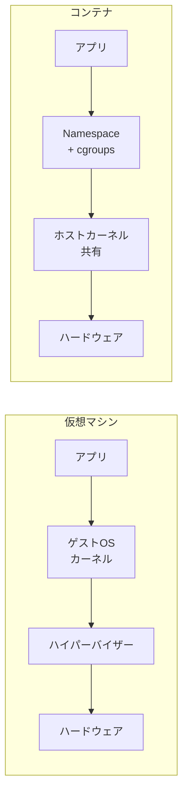

| 特性 | 仮想マシン | コンテナ |
|:---|:---|:---|
| 隔離の粒度 | ハードウェアレベル | OSレベル（プロセス） |
| カーネル | 各VMが独自カーネル | ホストカーネルを共有 |
| 起動時間 | 数十秒〜数分 | 数十ミリ秒〜数秒 |
| メモリオーバーヘッド | 数百MB〜数GB | 数MB〜数十MB |
| イメージサイズ | 数GB〜数十GB | 数十MB〜数百MB |
| セキュリティ境界 | 強い（ハイパーバイザー） | 弱い（カーネル共有） |
| 密度 | 1ホストに数十VM | 1ホストに数百〜数千コンテナ |

コンテナの軽量さは、カーネルを共有するという設計から直接的に導かれる。しかし、この設計はセキュリティ上のトレードオフを伴う。カーネルの脆弱性は全コンテナに影響し、Namespaceやcgroupsの設定ミスは隔離の破壊に直結する。本記事では、この隔離を実現するカーネル機構を一つずつ詳細に解説する。

## 2. Linux Namespace — プロセスの「見え方」を隔離する

### 2.1 Namespaceの概念

Namespaceは、Linuxカーネルが提供するグローバルリソースの抽象化レイヤーである。通常、Linuxのグローバルリソース（プロセスID、ネットワークインターフェース、ファイルシステムのマウントポイントなど）はシステム全体で共有されている。Namespaceは、これらのリソースを分割し、Namespace内のプロセスからはそのNamespace内のリソースだけが見えるようにする。

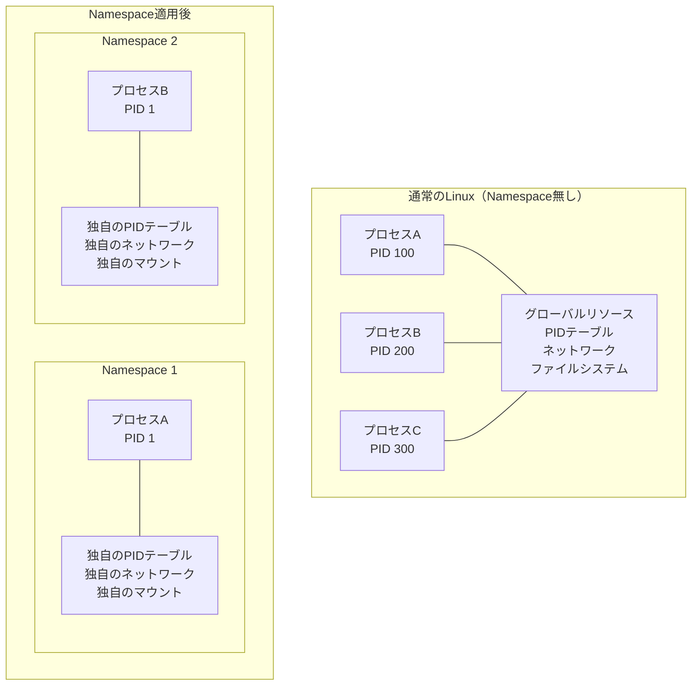

Namespaceは階層構造を持つ。新しいNamespaceは既存のNamespaceの「子」として作成され、親Namespaceからは子Namespaceのリソースが見えるが、子から親は見えない（PID Namespaceの場合）。この非対称性がコンテナの隔離の基盤となる。

Namespaceの操作には、主に3つのシステムコールが使用される。

| システムコール | 役割 |
|:---|:---|
| `clone()` | 新しいプロセスを作成する際に、新しいNamespaceを同時に作成する |
| `unshare()` | 呼び出しプロセスを既存のNamespaceから切り離し、新しいNamespaceに移動する |
| `setns()` | 既存のNamespaceにプロセスを参加させる |

### 2.2 Namespaceの全種類

2026年現在、Linuxカーネルは8種類のNamespaceを提供している。それぞれのNamespaceが導入された時期を見ると、コンテナ技術の発展と密接に対応していることがわかる。

| Namespace | cloneフラグ | 導入カーネル | 隔離対象 |
|:---|:---|:---|:---|
| Mount | `CLONE_NEWNS` | 2.4.19 (2002) | マウントポイント |
| UTS | `CLONE_NEWUTS` | 2.6.19 (2006) | ホスト名・ドメイン名 |
| IPC | `CLONE_NEWIPC` | 2.6.19 (2006) | System V IPC, POSIX MQ |
| PID | `CLONE_NEWPID` | 2.6.24 (2008) | プロセスID |
| Network | `CLONE_NEWNET` | 2.6.29 (2009) | ネットワークスタック |
| User | `CLONE_NEWUSER` | 3.8 (2013) | UID/GID マッピング |
| Cgroup | `CLONE_NEWCGROUP` | 4.6 (2016) | Cgroupルートディレクトリ |
| Time | `CLONE_NEWTIME` | 5.6 (2020) | `CLOCK_MONOTONIC` / `CLOCK_BOOTTIME` |

最初に導入されたのが Mount Namespace であり、cloneフラグが`CLONE_NEWNS`（「New Namespace」の略。当時はNamespaceの種類がこの1つだけだった）という汎用的な名前になっているのは歴史的経緯による。

## 3. 各Namespaceの詳細な動作

### 3.1 PID Namespace — プロセスIDの隔離

PID Namespaceは、プロセスIDの空間を分離する。新しいPID Namespaceを作成すると、その中で最初に実行されるプロセスがPID 1を取得する。これはLinuxにおいて特別な意味を持つ。PID 1のプロセスは**initプロセス**として扱われ、以下の責任を負う。

- 孤児プロセス（親が終了したプロセス）の引き取り
- シグナルのデフォルトハンドリングの特殊な挙動（`SIGKILL`と`SIGSTOP`以外のシグナルに対してハンドラが登録されていない場合、シグナルが無視される）

```
PID Namespaceの階層構造:

ホスト PID Namespace (初期Namespace)
├── PID 1 (systemd)
├── PID 1234 (containerd)
├── PID 5678 (コンテナA のエントリーポイント)
│   ├── PID Namespace A
│   │   ├── PID 1 (= ホストでのPID 5678)
│   │   └── PID 2 (= ホストでのPID 5679)
│   └── ...
└── PID 8901 (コンテナB のエントリーポイント)
    └── PID Namespace B
        └── PID 1 (= ホストでのPID 8901)
```

PID Namespaceは入れ子にできる。親Namespaceからは子Namespace内のプロセスが見えるが、子Namespace内のプロセスからは親Namespace内の他のプロセスは見えない。この単方向の可視性により、ホストからはすべてのコンテナプロセスを管理できるが、コンテナからはホストの情報にアクセスできない。

```c
// Create a new PID namespace
#define _GNU_SOURCE
#include <sched.h>
#include <stdio.h>
#include <stdlib.h>
#include <unistd.h>
#include <sys/wait.h>

static int child_fn(void *arg) {
    // In the new PID namespace, getpid() returns 1
    printf("Child PID in new namespace: %d\n", getpid());
    // Execute a shell
    execlp("/bin/sh", "sh", NULL);
    return 1;
}

int main() {
    // Stack for the child process
    char *stack = malloc(1024 * 1024);
    if (!stack) { perror("malloc"); exit(1); }

    // Create child in new PID namespace
    pid_t pid = clone(child_fn, stack + 1024 * 1024,
                      CLONE_NEWPID | SIGCHLD, NULL);
    if (pid == -1) { perror("clone"); exit(1); }

    printf("Child PID in parent namespace: %d\n", pid);
    waitpid(pid, NULL, 0);
    free(stack);
    return 0;
}
```

### 3.2 Network Namespace — ネットワークスタックの隔離

Network Namespaceは、ネットワークスタック全体を隔離する。各Network Namespaceは独立した以下のリソースを持つ。

- ネットワークインターフェース（lo, eth0 など）
- IPアドレスとルーティングテーブル
- iptables / nftables ルール
- ソケット
- `/proc/net` の内容

新しいNetwork Namespaceを作成した直後は、ループバックインターフェース（lo）のみが存在し、それも `DOWN` 状態である。外部と通信するためには、**veth（Virtual Ethernet）ペア**を作成してNamespace間を接続する。

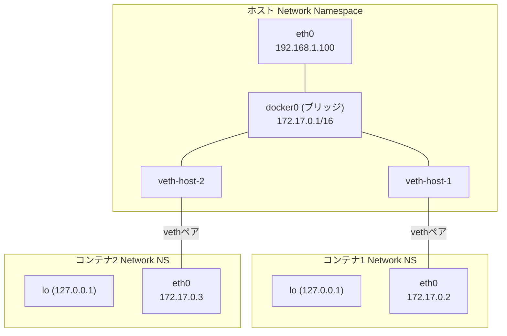

Dockerのデフォルトネットワーキングは、この仕組みを利用している。`docker0`ブリッジにvethペアの一端を接続し、もう一端をコンテナのNetwork Namespace内に配置する。コンテナ間通信はブリッジを経由し、外部通信にはNAT（iptablesのMASQUERADE）が使用される。

```bash
# Create a new network namespace
ip netns add container1

# Create a veth pair
ip link add veth-host type veth peer name veth-ct

# Move one end into the namespace
ip link set veth-ct netns container1

# Configure the host side
ip addr add 172.17.0.1/24 dev veth-host
ip link set veth-host up

# Configure the container side
ip netns exec container1 ip addr add 172.17.0.2/24 dev veth-ct
ip netns exec container1 ip link set veth-ct up
ip netns exec container1 ip link set lo up

# Add default route inside the namespace
ip netns exec container1 ip route add default via 172.17.0.1
```

### 3.3 Mount Namespace — ファイルシステムの隔離

Mount Namespaceは、各プロセスグループに独自のマウントポイントの集合を提供する。Linuxで最初に実装されたNamespaceであり、コンテナのファイルシステム隔離の基盤を担う。

Mount Namespaceの重要な概念として**マウントの伝搬（mount propagation）**がある。新しいMount Namespaceは、作成時に親のマウントテーブルのコピーを受け取る。その後のマウント操作が他のNamespaceにどう影響するかは、伝搬タイプによって制御される。

| 伝搬タイプ | 動作 |
|:---|:---|
| `shared` | マウントイベントが双方向に伝搬する |
| `slave` | 親→子のみ伝搬する（子→親は伝搬しない） |
| `private` | 伝搬しない（デフォルト） |
| `unbindable` | 伝搬せず、bind mountもできない |

コンテナランタイムは通常、コンテナ内のマウントを `private` または `slave` に設定して、コンテナ内でのマウント操作がホストに影響しないようにする。

```bash
# Create a new mount namespace
unshare --mount /bin/bash

# In the new namespace, mount a tmpfs
# This mount is invisible from the host
mount -t tmpfs tmpfs /mnt

# Mount a new root filesystem (pivot_root)
mount --bind /path/to/rootfs /mnt/newroot
cd /mnt/newroot
pivot_root . old_root
umount -l /old_root
rmdir /old_root
```

`pivot_root` は `chroot` よりもセキュリティ上安全な手法である。`chroot` はファイルシステムの参照ポイントを変えるだけで、適切な権限があれば脱出可能であるのに対し、`pivot_root` はMount Namespace内のルートファイルシステム自体を置き換えるため、脱出が困難になる。

### 3.4 UTS Namespace — ホスト名の隔離

UTS（Unix Time-Sharing）Namespaceは、ホスト名とNISドメイン名を隔離する。一見すると単純な機能であるが、コンテナが独自のホスト名を持てることは、ネットワークサービスの識別やログ出力において実用上重要である。

```bash
# Create a new UTS namespace and set hostname
unshare --uts /bin/bash
hostname container-web-01
hostname  # shows "container-web-01"

# On the host, hostname remains unchanged
```

Dockerの `--hostname` フラグやKubernetesのPod specにおける `hostname` フィールドは、この仕組みを利用している。

### 3.5 IPC Namespace — プロセス間通信の隔離

IPC Namespaceは、System V IPC オブジェクト（共有メモリセグメント、セマフォ、メッセージキュー）とPOSIXメッセージキューを隔離する。異なるIPC Namespaceに属するプロセスは、互いのIPCオブジェクトにアクセスできない。

これが重要な理由は、System V IPCオブジェクトがグローバルなキーによって識別されるためである。IPC Namespaceがなければ、コンテナ内のプロセスがホスト上の他のプロセスのIPCオブジェクトに干渉する可能性がある。

```bash
# Create a new IPC namespace
unshare --ipc /bin/bash

# List IPC objects (empty in new namespace)
ipcs
# ------ Message Queues --------
# ------ Shared Memory Segments --------
# ------ Semaphore Arrays --------
```

### 3.6 User Namespace — UID/GIDのマッピング

User Namespaceは、コンテナセキュリティにおいて最も重要なNamespaceの一つである。UID（User ID）とGID（Group ID）のマッピングを実現し、コンテナ内のroot（UID 0）をホスト上の非特権ユーザーに対応付けることができる。

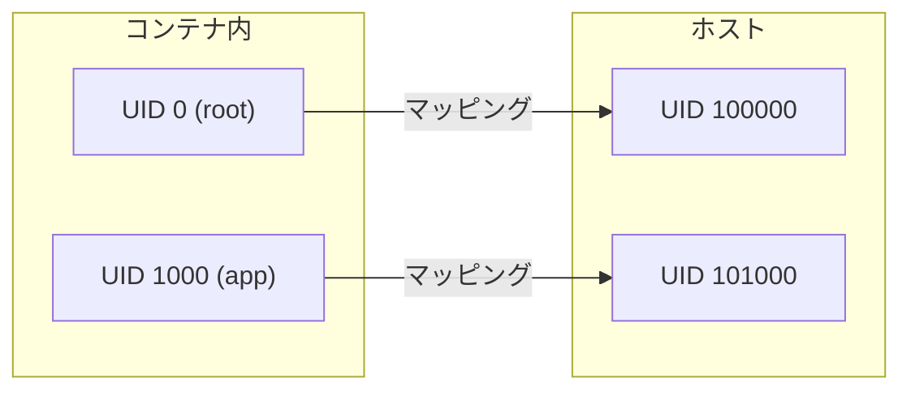

User Namespaceのマッピングは、`/proc/<pid>/uid_map` と `/proc/<pid>/gid_map` に書き込むことで設定される。

```bash
# uid_map format: <ns_uid> <host_uid> <count>
# Map container UID 0 to host UID 100000, with a range of 65536
echo "0 100000 65536" > /proc/<pid>/uid_map
echo "0 100000 65536" > /proc/<pid>/gid_map
```

この仕組みにより、コンテナ内ではrootとして振る舞えるが、万が一コンテナから脱出した場合、ホスト上では非特権ユーザー（UID 100000）としてしか動作できない。これは**Rootless Container**（後述）の基盤技術である。

User Namespaceにはもう一つ重要な性質がある。User Namespaceを新しく作成したプロセスは、その新しいUser Namespace内で全てのCapabilities（後述）を持つ。これにより、非特権ユーザーでもUser Namespaceを作成し、その中でMount Namespaceなどの他のNamespaceを作成できる。

### 3.7 Cgroup Namespace — Cgroup階層の隔離

Cgroup Namespaceは比較的新しいNamespaceで、プロセスが見るcgroupの階層構造を隔離する。Cgroup Namespaceがない場合、コンテナ内から `/proc/self/cgroup` を読むと、ホスト上のcgroupパスが完全に見えてしまう。

```
# Cgroup Namespaceなし
$ cat /proc/self/cgroup
0::/docker/abc123def456/system.slice/my-service

# Cgroup Namespaceあり
$ cat /proc/self/cgroup
0::/
```

Cgroup Namespaceにより、コンテナからはホストのcgroup階層構造が隠蔽され、自身のcgroupルートが `/` に見える。これは情報漏洩の防止に貢献する。

### 3.8 Time Namespace — 時刻の隔離

Time Namespace は Linux 5.6（2020年）で導入された最も新しいNamespaceである。`CLOCK_MONOTONIC` と `CLOCK_BOOTTIME` の2つのクロックにオフセットを適用でき、コンテナが独自のシステムブート時刻を持てるようになる。

この機能は、コンテナのライブマイグレーションやチェックポイント/リストア（CRIU）において重要である。コンテナを別のホストに移動した場合、ホストのブート時刻が異なるため、`CLOCK_BOOTTIME` の値が不連続になりアプリケーションが誤動作する可能性がある。Time Namespaceにより、移動先でも元のホストと同じ相対時刻を維持できる。

> [!NOTE]
> `CLOCK_REALTIME`（壁時計時刻）はTime Namespaceの対象外である。壁時計時刻をコンテナごとに変えることは、NTPとの整合性やログの時刻の問題を引き起こすため、意図的に除外されている。

## 4. Cgroups — リソースの「使用量」を制限する

### 4.1 Cgroupsの概念

Namespace がリソースの「見え方」を制御するのに対し、Cgroups（Control Groups）はリソースの「使用量」を制御する。Namespaceだけでは、コンテナが CPU やメモリをホストの限界まで消費することを防げない。Cgroupsは、プロセスのグループに対してリソースの上限を設定し、使用状況を監視し、優先度を制御する仕組みである。

Cgroupsは2006年にGoogleのエンジニアPaul Menage と Rohit Seth によって提案された。当時のGoogleは、数万台のサーバーで大量のサービスを同時に稼働させており、プロセスのリソース管理は切実な課題だった。

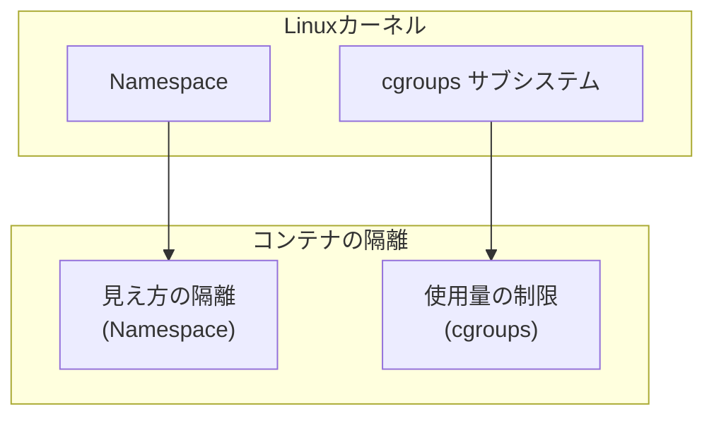

### 4.2 Cgroups v1 vs v2

Cgroupsには v1 と v2 の2つのバージョンが存在する。v1は2008年にLinux 2.6.24で導入され、v2は2016年にLinux 4.5で正式リリースされた。2026年現在、主要なコンテナランタイムやオーケストレーターは v2 をデフォルトとしている。

#### Cgroups v1 の設計

v1は、各リソースコントローラー（CPU、メモリ、I/Oなど）がそれぞれ独立した階層（hierarchy）を持つ設計であった。

```
cgroups v1 の構造:

/sys/fs/cgroup/
├── cpu/
│   ├── docker/
│   │   ├── container-abc/
│   │   │   ├── cpu.shares          # CPU 配分の重み
│   │   │   ├── cpu.cfs_quota_us    # CPU 上限（マイクロ秒）
│   │   │   └── cpu.cfs_period_us   # CPU 周期（マイクロ秒）
│   │   └── container-def/
│   └── ...
├── memory/
│   ├── docker/
│   │   ├── container-abc/
│   │   │   ├── memory.limit_in_bytes
│   │   │   └── memory.usage_in_bytes
│   │   └── container-def/
│   └── ...
├── blkio/
│   └── ...
└── pids/
    └── ...
```

v1の問題点は以下の通りである。

1. **複数の階層構造**: 各コントローラーが独立した階層を持つため、プロセスが属するcgroupの管理が複雑になる。あるプロセスのCPU制限とメモリ制限が異なるcgroup階層上の異なるノードに分散することがある。

2. **内部ノードの問題**: v1では、中間ノード（ディレクトリ）にもプロセスを配置できた。これにより、親cgroupのリソース制限と子cgroupのリソース制限の関係が曖昧になり、予期しない挙動を引き起こす場合があった。

3. **委任の困難さ**: cgroupの管理権限を非特権ユーザーに安全に委任する仕組みが不十分だった。

#### Cgroups v2 の設計

v2は、v1の反省を踏まえて再設計された。最大の変更点は**統一階層構造（unified hierarchy）**の採用である。

```
cgroups v2 の構造:

/sys/fs/cgroup/                     # ルートcgroup
├── cgroup.controllers              # 利用可能なコントローラー一覧
├── cgroup.subtree_control          # 子cgroupで有効化するコントローラー
├── system.slice/                   # systemd のスライス
│   └── ...
└── docker/                         # コンテナ用
    ├── container-abc/
    │   ├── cgroup.controllers
    │   ├── cgroup.procs            # 所属プロセス一覧
    │   ├── cpu.max                 # CPU制限 (quota period)
    │   ├── cpu.weight              # CPU重み (1-10000)
    │   ├── memory.max             # メモリ上限
    │   ├── memory.current         # 現在のメモリ使用量
    │   ├── io.max                 # I/O制限
    │   └── pids.max               # プロセス数上限
    └── container-def/
        └── ...
```

v2の主な改善点を以下に示す。

| 特性 | v1 | v2 |
|:---|:---|:---|
| 階層構造 | コントローラーごとに独立 | 統一された単一の階層 |
| プロセスの配置 | 中間ノードにも可 | リーフノード（末端）のみ |
| コントローラーの有効化 | 階層ごとに自動 | `cgroup.subtree_control`で明示的に制御 |
| 委任 | 非公式 | 公式にサポート |
| PSI（Pressure Stall Information） | なし | あり |
| スレッド粒度の制御 | なし | threaded cgroupで対応 |

v2の「リーフノードのみにプロセスを配置」というルール（no internal process constraint）は重要である。これにより、リソース分配の計算が明確になる。中間ノードは純粋にリソース分配のためのグルーピングノードとなり、実際のプロセスはすべて末端ノードに存在する。

### 4.3 PSI（Pressure Stall Information）

v2で追加された注目すべき機能がPSI（Pressure Stall Information）である。PSIは、CPU・メモリ・I/Oの各リソースにおいて、プロセスがリソース不足のために待たされている時間の割合を定量的に報告する。

```bash
$ cat /sys/fs/cgroup/docker/container-abc/cpu.pressure
some avg10=4.67 avg60=2.31 avg300=1.85 total=123456789
full avg10=0.00 avg60=0.00 avg300=0.00 total=0

$ cat /sys/fs/cgroup/docker/container-abc/memory.pressure
some avg10=12.50 avg60=8.33 avg300=5.12 total=987654321
full avg10=3.20 avg60=1.80 avg300=0.95 total=456789012
```

- **some**: 少なくとも1つのプロセスがリソース不足で待たされている時間の割合
- **full**: 全てのプロセスがリソース不足で待たされている時間の割合

PSIは、従来のCPU使用率やメモリ使用量だけでは捉えきれない「リソース圧迫の度合い」を可視化し、コンテナのオートスケーリングやOOM（Out Of Memory）発生前の予防的対応に活用される。

## 5. リソース制御の詳細

### 5.1 CPU制限

Cgroupsによる CPU 制限には、**重み付け（weight/shares）**と**ハードリミット（quota）**の2種類がある。

#### CPU重み付け（Proportional Sharing）

CPUが競合状態にあるとき、各cgroupに割り当てるCPU時間の比率を決定する。CPU に空きがある場合、重みに関係なくCPU を使用できる。

```bash
# cgroups v2: cpu.weight (1-10000, default 100)
echo 200 > /sys/fs/cgroup/docker/container-abc/cpu.weight

# cgroups v1: cpu.shares (default 1024)
echo 2048 > /sys/fs/cgroup/cpu/docker/container-abc/cpu.shares
```

例えば、コンテナAの weight が200、コンテナBの weight が100の場合、CPUが競合する状況では A:B = 2:1 の比率で CPU 時間が配分される。

#### CPUハードリミット（Bandwidth Control）

一定期間内に使用できる CPU 時間の絶対的な上限を設定する。

```bash
# cgroups v2: cpu.max (quota period)
# 100ms の周期（period）あたり最大 50ms の CPU 時間を許可 = 0.5 CPU
echo "50000 100000" > /sys/fs/cgroup/docker/container-abc/cpu.max

# cgroups v1: cpu.cfs_quota_us / cpu.cfs_period_us
echo 50000 > /sys/fs/cgroup/cpu/docker/container-abc/cpu.cfs_quota_us
echo 100000 > /sys/fs/cgroup/cpu/docker/container-abc/cpu.cfs_period_us
```

CPUハードリミットは、CFS（Completely Fair Scheduler）のBandwidth Control機能によって実装されている。period の間に quota 分の CPU 時間を消費すると、プロセスはスロットリングされ、次の period まで実行されない。

```mermaid
gantt
    title CPU Bandwidth Control (quota=50ms, period=100ms)
    dateFormat X
    axisFormat %L

    section コンテナA
    実行      :a1, 0, 50
    スロットル  :crit, a2, 50, 100
    実行      :a3, 100, 150
    スロットル  :crit, a4, 150, 200
```

::: warning
CPUスロットリングは「見えないレイテンシ」の原因となる。CPU使用率のメトリクスでは制限の50%しか使っていないように見えても、短期的なバーストがquotaを消費し、period末期にスロットリングが発生してレスポンスタイムが悪化するケースがある。`cpu.stat`の `nr_throttled` と `throttled_usec` を監視することが重要である。
:::

#### CPUピニング（cpuset）

特定のCPUコアにプロセスを固定する cpuset コントローラーも存在する。NUMAアーキテクチャにおいて、特定のCPUコアとそれに近いメモリノードにプロセスを固定することで、メモリアクセスレイテンシを最小化できる。

```bash
# cgroups v2
echo "0-3" > /sys/fs/cgroup/docker/container-abc/cpuset.cpus
echo "0" > /sys/fs/cgroup/docker/container-abc/cpuset.mems
```

### 5.2 メモリ制限

メモリコントローラーは、プロセスグループが使用できるメモリの上限を設定し、OOM（Out Of Memory）キラーとの連携を行う。

```bash
# cgroups v2
echo 536870912 > /sys/fs/cgroup/docker/container-abc/memory.max   # 512MB hard limit
echo 268435456 > /sys/fs/cgroup/docker/container-abc/memory.high  # 256MB soft limit

# memory.high を超えるとリクレーム圧が高まる（スロットリング）
# memory.max を超えると OOM killer が発動
```

v2では、メモリ制限に `memory.high`（ソフトリミット）と `memory.max`（ハードリミット）の2段階がある。

```
メモリ使用量の推移:

使用量
  ^
  |                              OOM killer 発動
  |                              ↓
  |  memory.max ─────────────── +-----------
  |                            /
  |  memory.high ────────── +--  ← スロットリング開始
  |                        /      (リクレーム圧増大)
  |                      /
  |                    /
  |                  /
  |                /
  +──────────────────────────────→ 時間
```

`memory.high` を超えると、カーネルはそのcgroupのプロセスに対するメモリリクレーム（ページキャッシュの回収やスワップアウト）を積極的に行い、メモリ割り当ての速度を低下させる。これにより、アプリケーションは緩やかに減速するが、突然のOOMキルは回避される。`memory.max` は絶対的な上限であり、これを超えようとするメモリ割り当てが失敗するか、OOMキラーがプロセスを終了させる。

```bash
# Monitor memory usage
cat /sys/fs/cgroup/docker/container-abc/memory.current   # current usage
cat /sys/fs/cgroup/docker/container-abc/memory.stat      # detailed statistics

# memory.stat includes:
# anon     - anonymous memory (heap, stack)
# file     - page cache
# slab     - kernel slab allocator
# sock     - TCP/UDP socket buffers
# ...
```

### 5.3 I/O制限

I/Oコントローラーは、ブロックデバイスへの I/O 帯域幅を制限する。

```bash
# cgroups v2: io.max
# Format: <major>:<minor> rbps=<bytes> wbps=<bytes> riops=<ops> wiops=<ops>
# Limit reads to 10MB/s and writes to 5MB/s on device 8:0
echo "8:0 rbps=10485760 wbps=5242880" > /sys/fs/cgroup/docker/container-abc/io.max

# Weight-based I/O scheduling
echo "8:0 200" > /sys/fs/cgroup/docker/container-abc/io.weight
```

v2のI/Oコントローラーは、v1のblkioコントローラーと比較してダイレクトI/OだけでなくBuffered I/Oにも効果がある（writeback制御をcgroup-awareにしたため）。v1では、Buffered I/O（ページキャッシュ経由の書き込み）に対するI/O制限が実質的に機能しないという深刻な制約があった。

### 5.4 プロセス数制限（pids コントローラー）

pidsコントローラーは、cgroup内で生成できるプロセス（タスク）数に上限を設ける。フォーク爆弾（fork bomb）攻撃への防御として機能する。

```bash
# Limit to 100 processes
echo 100 > /sys/fs/cgroup/docker/container-abc/pids.max

# Check current count
cat /sys/fs/cgroup/docker/container-abc/pids.current
```

## 6. Union Filesystem — コンテナイメージのレイヤー構造

### 6.1 なぜUnion Filesystemが必要なのか

コンテナ技術におけるもう一つの重要な要素が、ファイルシステムのレイヤー構造である。Namespaceとcgroupsがプロセスの隔離とリソース制御を担うのに対し、Union Filesystemはコンテナのファイルシステムの効率的な構成を実現する。

コンテナイメージは、ベースOS、ライブラリ、アプリケーションコードなどが層（レイヤー）として積み重なった構造をしている。Union Filesystemは、これらのレイヤーを一つのディレクトリツリーとして透過的に結合する技術である。

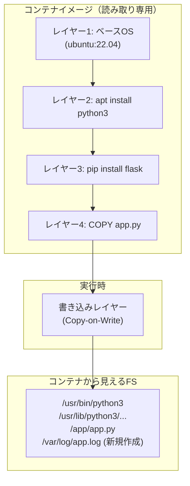

### 6.2 OverlayFS

現在のLinuxコンテナで主流のUnion FilesystemはOverlayFS（overlay2ドライバー）である。OverlayFSはLinuxカーネル 3.18で本体にマージされ、追加のカーネルモジュールなしで利用できる。

OverlayFSは以下の4つのディレクトリで構成される。

| ディレクトリ | 役割 |
|:---|:---|
| `lowerdir` | 読み取り専用のベースレイヤー（複数指定可能） |
| `upperdir` | 書き込み可能なレイヤー |
| `workdir` | OverlayFSの内部作業用ディレクトリ |
| `merged` | lower + upper が統合されたマウントポイント |

```bash
# OverlayFS mount example
mount -t overlay overlay \
  -o lowerdir=/image/layer3:/image/layer2:/image/layer1,\
     upperdir=/container/upper,\
     workdir=/container/work \
  /container/merged
```

#### Copy-on-Write の動作

OverlayFSのCopy-on-Write（CoW）動作は以下の通りである。

1. **ファイルの読み取り**: upperdirにファイルがあればそれを返す。なければlowerdirのファイルを返す。
2. **ファイルの書き込み（既存ファイル）**: lowerdirのファイルをupperdirにコピーしてから変更する（copy-up）。
3. **ファイルの新規作成**: upperdirに直接作成する。
4. **ファイルの削除**: upperdirに**whiteoutファイル**（character device 0,0）を作成して、lowerdirのファイルを「隠す」。

```
OverlayFS の動作例:

lowerdir (読み取り専用):
├── /etc/
│   ├── hosts
│   └── resolv.conf
├── /usr/bin/python3
└── /app/app.py

upperdir (書き込み可能):
├── /etc/
│   └── resolv.conf   ← copy-up で変更
├── /var/log/
│   └── app.log       ← 新規作成
└── /tmp/
    └── .wh.cache     ← whiteout: lowerdir の /tmp/cache を削除

merged (コンテナから見える):
├── /etc/
│   ├── hosts          ← lowerdir から
│   └── resolv.conf    ← upperdir から（変更済み）
├── /usr/bin/python3   ← lowerdir から
├── /app/app.py        ← lowerdir から
└── /var/log/
    └── app.log        ← upperdir から（新規）
# /tmp/cache は見えない（whiteout で隠されている）
```

このレイヤー構造により、同じベースイメージを使用する複数のコンテナが lowerdir を共有し、ディスク使用量を大幅に削減できる。例えば100個のコンテナが同じ ubuntu:22.04 イメージを使用していても、ベースレイヤーはディスク上で1コピーしか存在しない。

## 7. コンテナランタイムの仕組み — これらをどう組み合わせるか

### 7.1 コンテナランタイムの階層構造

コンテナの実行は、複数の層に分かれたランタイムスタックによって行われる。

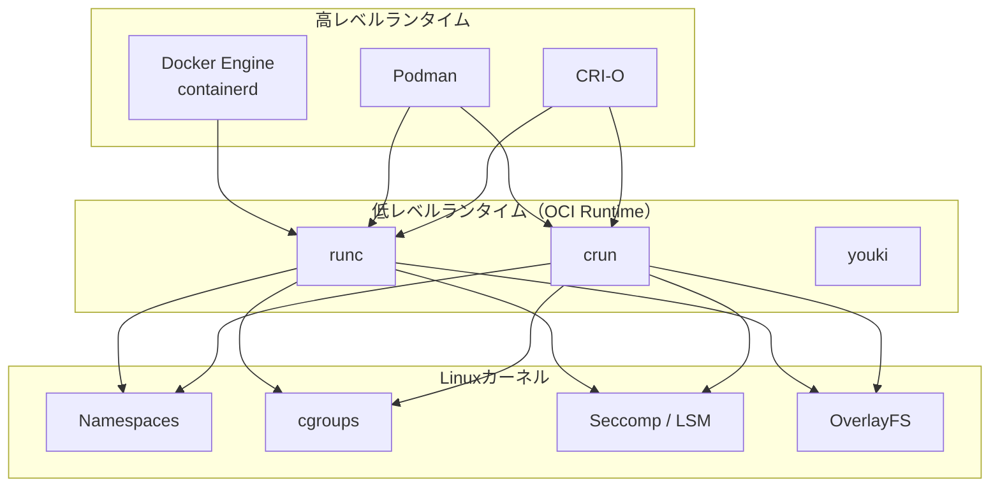

低レベルランタイム（OCI Runtime）が実際にカーネル機能を呼び出してコンテナを作成する。最も広く使われている runc を例に、コンテナ起動の流れを詳細に追う。

### 7.2 runc によるコンテナ起動の流れ

runc がコンテナを起動する際の処理を順に示す。

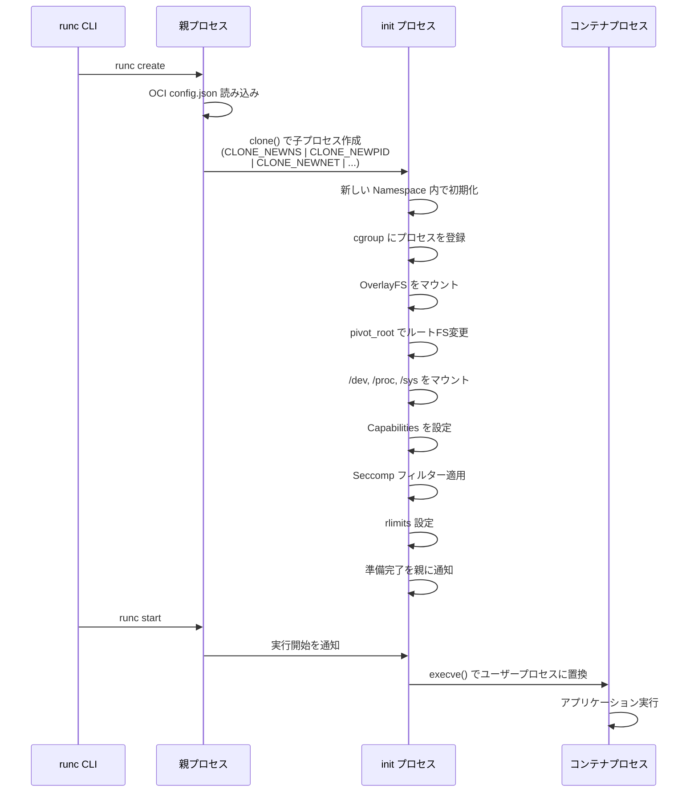

この流れを、OCI（Open Container Initiative）の runtime-spec で定義される `config.json` の構造と対応付けて見ると理解が深まる。

```json
{
  "ociVersion": "1.0.2",
  "process": {
    "terminal": false,
    "user": { "uid": 0, "gid": 0 },
    "args": ["/app/server", "--port", "8080"],
    "env": ["PATH=/usr/local/sbin:/usr/local/bin:/usr/sbin:/usr/bin"],
    "cwd": "/app",
    "capabilities": {
      "bounding": ["CAP_NET_BIND_SERVICE"],
      "effective": ["CAP_NET_BIND_SERVICE"]
    },
    "rlimits": [
      { "type": "RLIMIT_NOFILE", "hard": 1024, "soft": 1024 }
    ]
  },
  "root": {
    "path": "rootfs",
    "readonly": true
  },
  "mounts": [
    { "destination": "/proc", "type": "proc", "source": "proc" },
    { "destination": "/dev", "type": "tmpfs", "source": "tmpfs" }
  ],
  "linux": {
    "namespaces": [
      { "type": "pid" },
      { "type": "network" },
      { "type": "ipc" },
      { "type": "uts" },
      { "type": "mount" },
      { "type": "cgroup" }
    ],
    "resources": {
      "memory": { "limit": 536870912 },
      "cpu": { "quota": 50000, "period": 100000 }
    },
    "seccomp": {
      "defaultAction": "SCMP_ACT_ERRNO",
      "architectures": ["SCMP_ARCH_X86_64"],
      "syscalls": [
        {
          "names": ["read", "write", "open", "close", "stat", "fstat", "mmap", "exit_group"],
          "action": "SCMP_ACT_ALLOW"
        }
      ]
    }
  }
}
```

## 8. セキュリティの考慮

### 8.1 Linux Capabilities — root権限の分解

伝統的なUnixのセキュリティモデルでは、プロセスは「特権（root, UID 0）」か「非特権」かの二者択一であった。root権限を持つプロセスはシステム上のあらゆる操作が可能であり、これは最小権限の原則に反する。

Linux Capabilities は、root権限を約40個の細かな権限（Capability）に分解し、プロセスに必要な権限だけを付与できるようにする仕組みである。

主要なCapabilitiesの例を示す。

| Capability | 許可される操作 |
|:---|:---|
| `CAP_NET_BIND_SERVICE` | 1024未満のポートにバインド |
| `CAP_NET_RAW` | RAWソケットの使用（ping等） |
| `CAP_NET_ADMIN` | ネットワーク設定の変更 |
| `CAP_SYS_ADMIN` | mount, sethostname 等の管理操作 |
| `CAP_SYS_PTRACE` | ptrace（デバッガ等）の使用 |
| `CAP_DAC_OVERRIDE` | ファイルのパーミッションチェックをバイパス |
| `CAP_CHOWN` | ファイルのUID/GIDを変更 |
| `CAP_SETUID` | プロセスのUIDを変更 |
| `CAP_MKNOD` | デバイスファイルの作成 |

Dockerはデフォルトで、コンテナに対して限定的なCapabilitiesのみを付与する。`CAP_SYS_ADMIN`（最も危険なCapability）はデフォルトで除外されている。

```bash
# Check capabilities of a running container
docker exec my-container cat /proc/1/status | grep Cap

# Docker default capabilities (as of 2026):
# CAP_CHOWN, CAP_DAC_OVERRIDE, CAP_FSETID, CAP_FOWNER,
# CAP_MKNOD, CAP_NET_RAW, CAP_SETGID, CAP_SETUID,
# CAP_SETFCAP, CAP_SETPCAP, CAP_NET_BIND_SERVICE,
# CAP_SYS_CHROOT, CAP_KILL, CAP_AUDIT_WRITE

# Run container with specific capabilities
docker run --cap-drop ALL --cap-add NET_BIND_SERVICE my-app
```

::: tip
セキュリティのベストプラクティスは「`--cap-drop ALL` で全てのCapabilitiesを削除してから、必要なものだけを `--cap-add` で追加する」である。
:::

### 8.2 Seccomp — システムコールのフィルタリング

Seccomp（Secure Computing Mode）は、プロセスが発行できるシステムコールを制限するカーネル機能である。Linuxカーネルは約400以上のシステムコールを持つが、一般的なWebアプリケーションが必要とするのはそのうちの数十種類程度である。使用しないシステムコールを禁止することで、カーネルの脆弱性が悪用されるリスクを大幅に低減する。

Seccompには2つのモードがある。

1. **strict mode**: `read()`, `write()`, `_exit()`, `sigreturn()` の4つのシステムコールのみ許可。実用性が低い。
2. **filter mode（seccomp-bpf）**: BPF（Berkeley Packet Filter）プログラムでシステムコールをフィルタリング。各システムコールに対して許可、拒否、ログ、トレースなどのアクションを設定できる。

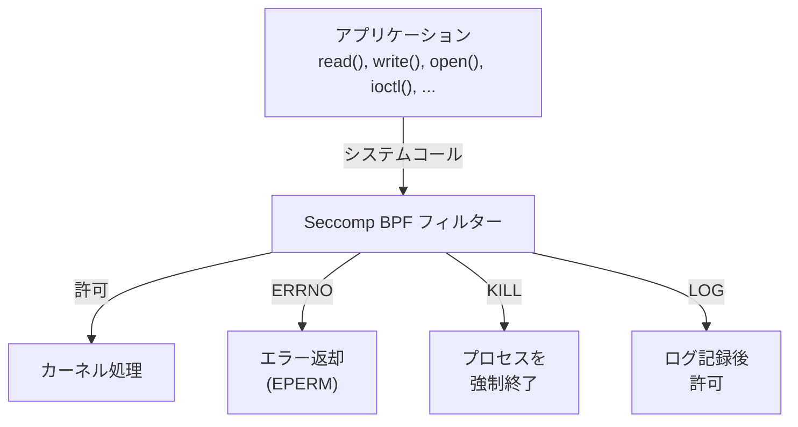

Dockerのデフォルトのseccompプロファイルは、約50個の危険なシステムコールをブロックする。ブロックされる代表的なシステムコールの例を示す。

| ブロックされるシステムコール | 理由 |
|:---|:---|
| `mount` / `umount2` | ファイルシステムの変更はコンテナ外に影響しうる |
| `reboot` | ホスト全体を再起動してしまう |
| `kexec_load` | 新しいカーネルのロード |
| `ptrace` | 他プロセスのメモリ読み書き |
| `keyctl` | カーネルキーリングの操作 |
| `unshare` | 新たなNamespaceの作成 |
| `bpf` | BPFプログラムのロード |

### 8.3 LSM — AppArmor と SELinux

Linux Security Modules（LSM）は、カーネルにフック可能なセキュリティフレームワークを提供する。代表的な実装としてAppArmorとSELinuxがあり、いずれもMAC（Mandatory Access Control：強制アクセス制御）を実現する。

**AppArmor**はパスベースの制御を行い、プロファイルによってプログラムがアクセスできるファイルやネットワーク操作を定義する。Ubuntu系のディストリビューションでデフォルト採用されている。

```
# Docker default AppArmor profile (simplified)
profile docker-default flags=(attach_disconnected,mediate_deleted) {
  # Allow typical container operations
  file,
  network,
  capability,

  # Deny write access to sensitive paths
  deny /proc/sys/** w,
  deny /sys/** w,
  deny /proc/kcore rw,
  deny mount,
  deny umount,
}
```

**SELinux**はラベルベースの制御を行い、すべてのファイル、プロセス、ポートにセキュリティラベルを付与し、ラベル間の許可されたアクセスをポリシーで定義する。RHEL/Fedora系で採用されている。

```bash
# SELinux context for a container process
# system_u:system_r:container_t:s0:c1,c2

# The container_t type restricts:
# - File access to container_file_t labeled files
# - Network access based on port labels
# - IPC with other container_t processes
```

### 8.4 多層防御のまとめ

コンテナのセキュリティは、単一の仕組みに依存するのではなく、複数の防御レイヤーを重ねることで実現される。

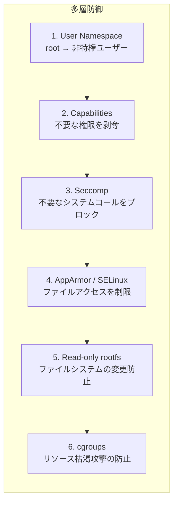

## 9. Rootless Container — 非特権ユーザーによるコンテナ実行

### 9.1 なぜRootlessが必要なのか

従来のコンテナランタイム（Docker daemon など）はroot権限で動作していた。これは、Namespace の作成、cgroupの操作、ネットワークの設定など、多くのカーネル操作に特権が必要だったためである。しかし、rootで動作するデーモンが侵害された場合、ホスト全体が危険にさらされる。

Rootless Container は、コンテナの作成・実行・管理のすべてを非特権ユーザーの権限で行う技術である。

### 9.2 Rootless を実現する技術的基盤

Rootless Container は、以下の技術の組み合わせで実現される。

1. **User Namespace**: 非特権ユーザーでも User Namespace を作成でき、その内部で他のNamespaceを作成する権限を得る。

2. **Subordinate UID/GID**: `/etc/subuid` と `/etc/subgid` で、各ユーザーに使用可能なUID/GID範囲を割り当てる。

```
# /etc/subuid
user1:100000:65536    # user1 は UID 100000-165535 を使用可能

# /etc/subgid
user1:100000:65536    # user1 は GID 100000-165535 を使用可能
```

3. **slirp4netns / pasta**: User Namespaceではネットワークインターフェースの作成が制限されるため、ユーザー空間のネットワークスタックが使用される。slirp4netns はユーザー空間でTCP/IPスタックをエミュレートし、pasta（passt）はより高性能な代替手段を提供する。

4. **Rootless cgroupsの委任**: systemdのcgroup v2委任機能により、非特権ユーザーが自身のcgroup配下のリソース制限を設定できる。

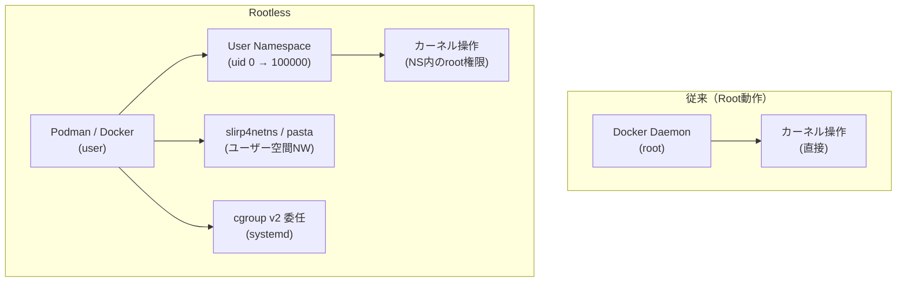

### 9.3 Rootless の制限事項

Rootless Container にはいくつかの制限がある。

- **ネットワーク性能**: slirp4netns はユーザー空間でパケット処理を行うため、ネイティブのvethペアと比較して帯域幅とレイテンシが劣る。pasta はより高性能だが、まだ完全にはカーネルネイティブの性能には及ばない。
- **特権ポートのバインド**: 1024未満のポートにバインドするには、`sysctl net.ipv4.ip_unprivileged_port_start` を0に設定する必要がある。
- **OverlayFS**: カーネル5.11以降でUser Namespace内のOverlayFSマウントがサポートされたが、古いカーネルでは fuse-overlayfs を使用する必要がある。
- **cgroup v1**: Rootless Container は基本的にcgroups v2を前提とする。v1ではリソース制限が制約される。

## 10. 実践 — 手動でコンテナを作る

### 10.1 unshare と nsenter

Namespaceの操作を理解するために、Docker等のコンテナランタイムを使わずに、カーネル機能を直接操作して「コンテナのようなもの」を手動で作成する。

`unshare` はプロセスを新しいNamespaceで実行するコマンドであり、`nsenter` は既存のNamespaceに入るコマンドである。

```bash
# First, prepare a minimal root filesystem
mkdir -p /tmp/container/rootfs
# Using debootstrap to create a minimal Debian rootfs
debootstrap --variant=minbase bookworm /tmp/container/rootfs
```

### 10.2 ステップバイステップでコンテナを構築

以下の手順で、Namespace と cgroups を手動で設定してプロセスを隔離する。

#### ステップ1: 新しいNamespaceでシェルを起動

```bash
# Create new PID, mount, UTS, IPC, and network namespaces
sudo unshare --pid --mount --uts --ipc --net --fork /bin/bash

# At this point, we are in new namespaces but still see the host filesystem
```

#### ステップ2: ホスト名を設定（UTS Namespace）

```bash
# Inside the new namespace
hostname my-container
hostname  # shows "my-container"
```

#### ステップ3: マウントの隔離

```bash
# Make all mounts private to prevent propagation to host
mount --make-rprivate /

# Mount the new root filesystem
mount --bind /tmp/container/rootfs /tmp/container/rootfs

# Enter the new root
cd /tmp/container/rootfs

# Mount essential filesystems
mount -t proc proc proc/
mount -t sysfs sysfs sys/
mount -t tmpfs tmpfs tmp/
mount -t tmpfs tmpfs dev/

# Create minimal device nodes
mknod -m 666 dev/null c 1 3
mknod -m 666 dev/zero c 1 5
mknod -m 666 dev/random c 1 8
mknod -m 666 dev/urandom c 1 9

# Switch to the new root filesystem
pivot_root . old_root
umount -l /old_root
rmdir /old_root
```

#### ステップ4: cgroupsでリソース制限（別ターミナルから）

```bash
# Create a new cgroup for the container (cgroups v2)
CGROUP_PATH="/sys/fs/cgroup/my-container"
mkdir -p $CGROUP_PATH

# Enable controllers
echo "+cpu +memory +pids" > /sys/fs/cgroup/cgroup.subtree_control

# Set resource limits
echo "50000 100000" > $CGROUP_PATH/cpu.max    # 0.5 CPU
echo 268435456 > $CGROUP_PATH/memory.max      # 256MB
echo 100 > $CGROUP_PATH/pids.max              # max 100 processes

# Add the container process to this cgroup
# (replace <PID> with the actual PID of the unshare'd process)
echo <PID> > $CGROUP_PATH/cgroup.procs
```

#### ステップ5: ネットワークの設定（別ターミナルから）

```bash
# Find the PID of the container process
CONTAINER_PID=$(pgrep -f "unshare")

# Create a veth pair
ip link add veth-host type veth peer name veth-ct

# Move one end into the container's network namespace
ip link set veth-ct netns $CONTAINER_PID

# Configure host side
ip addr add 10.0.0.1/24 dev veth-host
ip link set veth-host up

# Configure container side
nsenter --target $CONTAINER_PID --net ip addr add 10.0.0.2/24 dev veth-ct
nsenter --target $CONTAINER_PID --net ip link set veth-ct up
nsenter --target $CONTAINER_PID --net ip link set lo up
nsenter --target $CONTAINER_PID --net ip route add default via 10.0.0.1

# Enable IP forwarding and NAT on the host
sysctl -w net.ipv4.ip_forward=1
iptables -t nat -A POSTROUTING -s 10.0.0.0/24 -j MASQUERADE
```

#### ステップ6: 動作確認

```bash
# Inside the container namespace
ps aux        # Only processes in this PID namespace are visible
hostname      # Shows "my-container"
ip addr       # Shows only veth-ct and lo
cat /proc/self/cgroup  # Shows cgroup membership
```

### 10.3 nsenter — 既存のNamespaceに入る

`nsenter` は、稼働中のコンテナのNamespaceに入って調査やデバッグを行うための強力なツールである。

```bash
# Enter all namespaces of a running container
# Find container's init PID
CONTAINER_PID=$(docker inspect --format '{{.State.Pid}}' my-container)

# Enter the container's namespaces
nsenter --target $CONTAINER_PID \
  --pid --net --mount --uts --ipc \
  /bin/bash

# You can also enter specific namespaces only
# Enter only the network namespace
nsenter --target $CONTAINER_PID --net ip addr

# Enter via namespace file descriptors in /proc
nsenter --pid=/proc/$CONTAINER_PID/ns/pid \
        --net=/proc/$CONTAINER_PID/ns/net \
        /bin/bash
```

`/proc/<pid>/ns/` ディレクトリには、プロセスが所属する各Namespaceへのシンボリックリンクが存在する。

```bash
$ ls -la /proc/$CONTAINER_PID/ns/
lrwxrwxrwx 1 root root 0 ... cgroup -> 'cgroup:[4026532519]'
lrwxrwxrwx 1 root root 0 ... ipc -> 'ipc:[4026532516]'
lrwxrwxrwx 1 root root 0 ... mnt -> 'mnt:[4026532514]'
lrwxrwxrwx 1 root root 0 ... net -> 'net:[4026532518]'
lrwxrwxrwx 1 root root 0 ... pid -> 'pid:[4026532517]'
lrwxrwxrwx 1 root root 0 ... time -> 'time:[4026531834]'
lrwxrwxrwx 1 root root 0 ... user -> 'user:[4026531837]'
lrwxrwxrwx 1 root root 0 ... uts -> 'uts:[4026532515]'
```

各リンクの指す inode 番号（角括弧内の数値）が同じプロセスは、同じNamespaceに属している。

## 11. まとめ — コンテナの全体像

本記事で解説した技術要素が、コンテナというシステムの中でどのように組み合わさっているかを最終的に整理する。

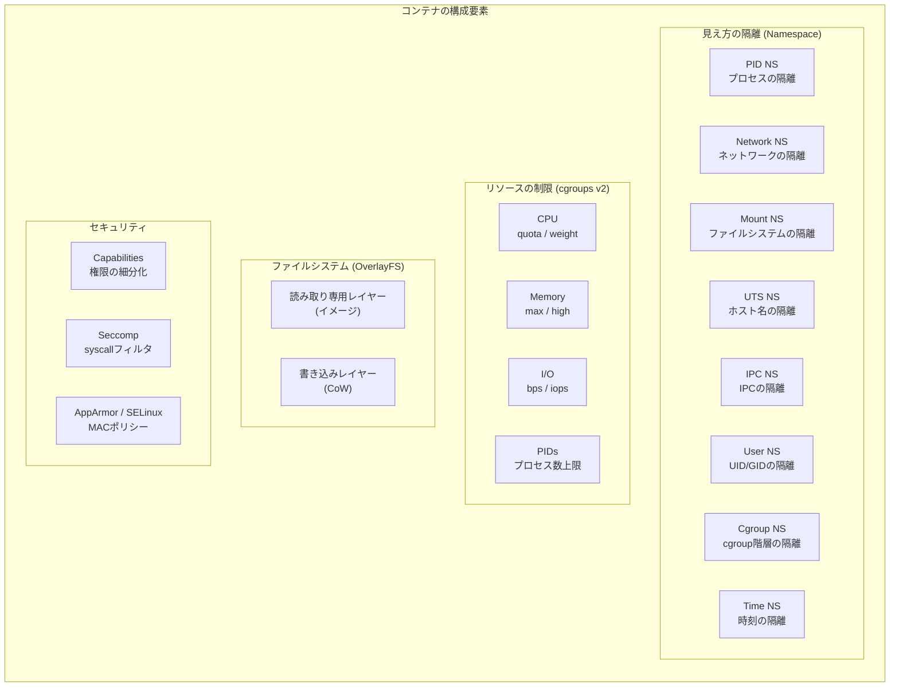

コンテナは「軽量な仮想マシン」ではない。Linuxカーネルが提供する複数の独立した機構 — Namespace、cgroups、Union Filesystem、Capabilities、Seccomp、LSM — を巧みに組み合わせて構築された、**プロセスの隔離環境**である。

この理解は、以下の場面で直接的に役立つ。

- **トラブルシューティング**: コンテナの問題を診断する際、どのレイヤーの問題なのか（Namespace の不備か、cgroup の制限か、seccomp によるブロックか）を切り分けられる。
- **セキュリティ設計**: 多層防御の各レイヤーを理解し、自組織のセキュリティ要件に応じた適切な設定を行える。
- **パフォーマンスチューニング**: CPU スロットリング、メモリ制限、I/O 帯域制限の仕組みを理解し、適切なリソース配分を設計できる。
- **アーキテクチャ選定**: コンテナの隔離強度を正しく評価し、VMや MicroVM（Firecracker等）との使い分けを判断できる。

コンテナ技術は、これらのカーネル機構の上に構築された抽象化レイヤーに過ぎない。その基盤を理解することが、コンテナを「ブラックボックス」ではなく「透明なツール」として活用するための鍵となる。
