# Linux I/O スタック

## はじめに ── なぜ I/O スタックを理解すべきか

アプリケーションが `write()` を呼んでからデータが永続ストレージに到達するまでに、Linux カーネル内部では驚くほど多くのレイヤーが関与する。VFS（Virtual File System）による抽象化、ページキャッシュによるバッファリング、I/O スケジューラによるリクエスト並べ替え、ブロックレイヤーによる bio 処理、そしてデバイスドライバによるハードウェア制御 ── これらのレイヤーが協調することで、ユーザー空間のプログラムはストレージの物理的な特性を意識せずに済む。

しかしこの抽象化は「ブラックボックス」であり続けると、パフォーマンス問題の原因を特定できない、データ整合性に関する誤解が生まれる、最新の高速ストレージデバイスの性能を引き出せない、といった問題を引き起こす。データベースエンジン、ログ基盤、分散ストレージなど I/O 集約的なシステムを設計・運用する上で、I/O スタックの全体像を把握することは不可欠である。

本記事では Linux の I/O スタック全体を俯瞰し、各レイヤーの設計思想・内部構造・相互作用を詳細に解説する。

## Linux I/O スタックの全体像

Linux I/O スタックは、ユーザー空間からハードウェアまで多層に構成されている。以下の図は、ユーザー空間からストレージデバイスまでの主要なレイヤーとデータの流れを示す。

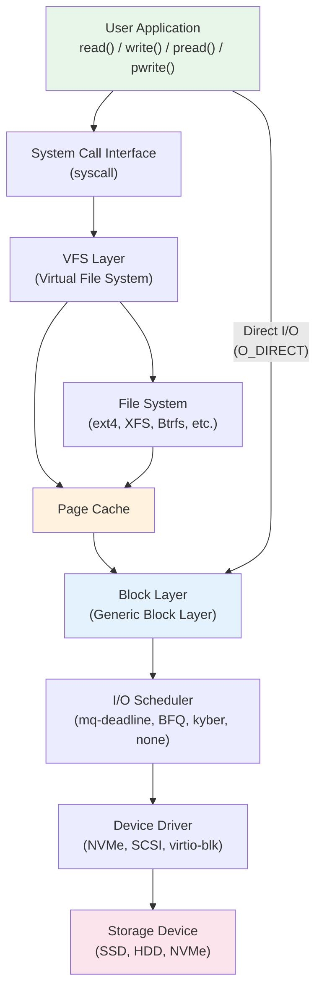

各レイヤーの役割を簡潔にまとめると以下のようになる。

| レイヤー | 主な責務 |
|---------|---------|
| **VFS** | ファイルシステムの統一インターフェースを提供 |
| **ファイルシステム** | 論理的なファイル構造を物理ブロックにマッピング |
| **ページキャッシュ** | ディスクデータのメモリ上でのキャッシュ |
| **ブロックレイヤー** | bio の生成・分割・マージ、I/O スケジューリング |
| **I/O スケジューラ** | I/O リクエストの並べ替え・マージによる効率化 |
| **デバイスドライバ** | ハードウェア固有の制御 |

## VFS（Virtual File System）レイヤー

### VFS の設計思想

VFS は Linux カーネルのファイルシステム抽象化レイヤーであり、アプリケーションが `open()`、`read()`、`write()` といったシステムコールを使って、どのようなファイルシステム（ext4、XFS、Btrfs、tmpfs、procfs など）にも統一的にアクセスできるようにする仕組みである。

VFS の存在意義は「ポリモーフィズム」にある。C 言語で書かれた Linux カーネルにおいて、関数ポインタのテーブルを使って実質的なオブジェクト指向のディスパッチを実現している。

### VFS の主要データ構造

VFS は4つの基本的なオブジェクトで構成されている。

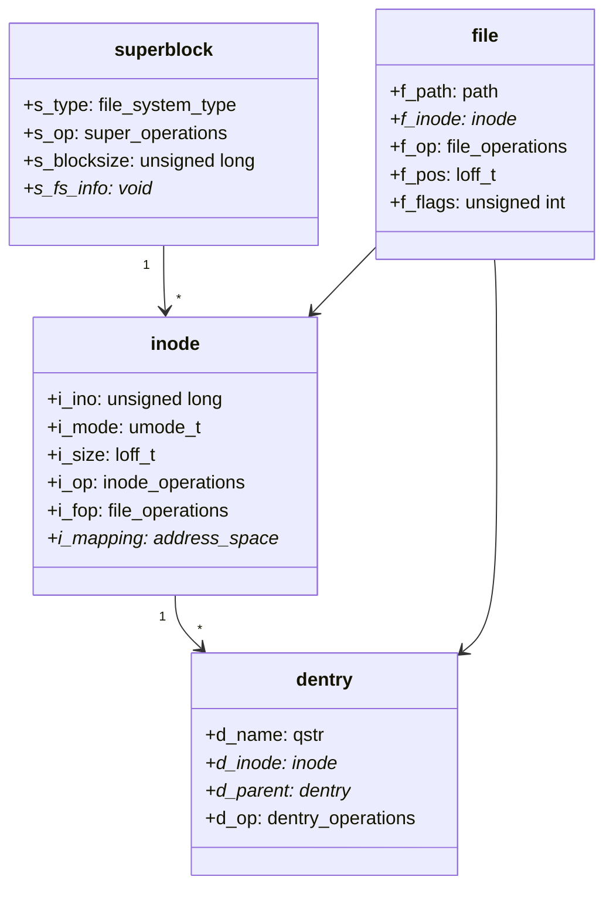

**superblock** はマウントされたファイルシステム全体を表す。ブロックサイズ、最大ファイルサイズ、ファイルシステム固有の操作（`super_operations`）などの情報を保持する。

**inode** はファイルやディレクトリのメタデータ（パーミッション、サイズ、タイムスタンプ、データブロックへのポインタなど）を表す。重要な点として、inode はファイル名を持たない。同一ファイルに複数のハードリンクが存在し得るためである。

**dentry**（directory entry）はファイル名と inode を結びつける。dentry キャッシュ（dcache）により、パス解決（`/home/user/data.txt` のような文字列をたどって対応する inode を見つける処理）が高速化される。

**file** はプロセスがオープンしたファイルを表す。ファイルディスクリプタと対応し、現在のファイルオフセット（`f_pos`）やアクセスモードを保持する。

### VFS の操作テーブル

各データ構造には対応する操作テーブル（関数ポインタの構造体）が存在する。

```c
// file_operations: VFS -> filesystem dispatch table
struct file_operations {
    loff_t (*llseek)(struct file *, loff_t, int);
    ssize_t (*read)(struct file *, char __user *, size_t, loff_t *);
    ssize_t (*write)(struct file *, const char __user *, size_t, loff_t *);
    ssize_t (*read_iter)(struct kiocb *, struct iov_iter *);
    ssize_t (*write_iter)(struct kiocb *, struct iov_iter *);
    int (*mmap)(struct file *, struct vm_area_struct *);
    int (*open)(struct inode *, struct file *);
    int (*fsync)(struct file *, loff_t, loff_t, int datasync);
    // ...
};
```

新しいファイルシステムを Linux に追加するには、これらの操作テーブルを実装して VFS に登録すればよい。VFS は適切なファイルシステムの関数を呼び出すディスパッチャとして機能する。

### read() システムコールの流れ

ユーザー空間の `read()` がカーネル内部でどのように処理されるかを追跡すると、VFS の役割が明確になる。

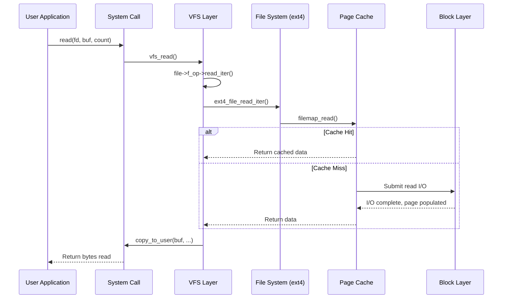

この流れでは、まず VFS がファイルディスクリプタから `file` 構造体を取得し、そこに登録された `read_iter` 関数を呼び出す。ext4 の場合は `ext4_file_read_iter()` が呼ばれ、内部で `filemap_read()` を通じてページキャッシュにアクセスする。キャッシュヒットすればメモリからデータをコピーするだけで済み、ディスク I/O は発生しない。

## ページキャッシュとバッファキャッシュ

### ページキャッシュの概要

ページキャッシュ（Page Cache）は Linux カーネルの中核的なサブシステムであり、ディスクから読み込んだデータや、書き込み予定のデータをメモリ上にキャッシュする。物理メモリの大部分はページキャッシュとして活用されており、`free` コマンドで表示される `buff/cache` の大半がこれに該当する。

ページキャッシュの基本単位はメモリページ（通常 4KB）であり、ファイルの内容がページ単位でキャッシュされる。

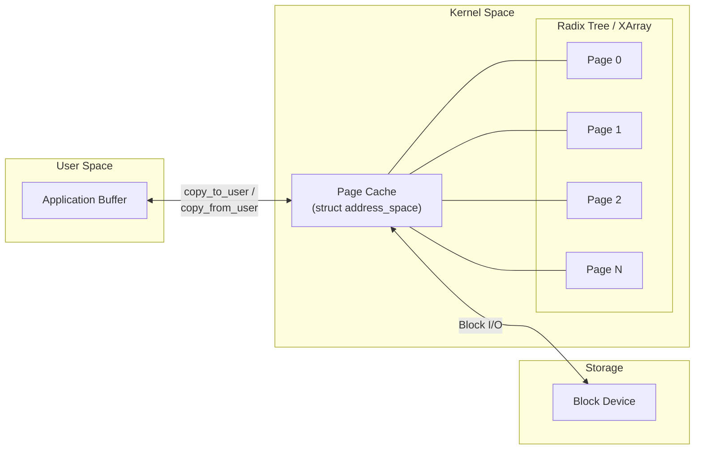

### address_space とページの管理

ページキャッシュの管理単位は `address_space` 構造体であり、各 inode に1つ対応する。`address_space` は XArray（旧 Radix Tree）を使ってファイルオフセットからページへの高速検索を実現している。

```c
struct address_space {
    struct inode        *host;       // owning inode
    struct xarray       i_pages;     // page lookup structure
    atomic_t            i_mmap_writable; // writable mmap count
    const struct address_space_operations *a_ops;
    unsigned long       nrpages;     // total number of pages
    // ...
};
```

`address_space_operations` にはページの読み書きに関する関数ポインタが定義されている。

```c
struct address_space_operations {
    int (*read_folio)(struct file *, struct folio *);
    int (*writepages)(struct address_space *, struct writeback_control *);
    bool (*dirty_folio)(struct address_space *, struct folio *);
    // ...
};
```

::: tip folio とは
Linux 5.16 以降、ページキャッシュの管理単位は `struct page` から `struct folio` に移行しつつある。folio は1つ以上の連続したページをまとめた単位で、Huge Page との統一的な扱いやコードの簡素化を目的として導入された。folio は「このページは compound page のテールではない」ことを型システムで保証するものであり、ページキャッシュのコード全体をシンプルにする。
:::

### Write-Back と Dirty Page

ページキャッシュは Write-Back 方式を採用している。`write()` システムコールはデータをページキャッシュに書き込み、該当ページを dirty（変更済み）としてマークした時点でアプリケーションに制御を返す。実際のディスク書き込みは後で非同期に行われる。

dirty ページのフラッシュは以下のタイミングで発生する。

1. **定期フラッシュ**: `dirty_writeback_centisecs`（デフォルト 5 秒）ごとにカーネルスレッド（`flush-X:Y` ワーカー）が dirty ページを書き出す
2. **dirty 比率の閾値到達**: `dirty_ratio`（デフォルト 20%）を超えると、write を呼んだプロセス自身がブロックされて書き出しを行う
3. **dirty_background_ratio の到達**: `dirty_background_ratio`（デフォルト 10%）を超えると、バックグラウンドでフラッシュが開始される
4. **明示的な同期**: `fsync()`、`fdatasync()`、`sync()` の呼び出し

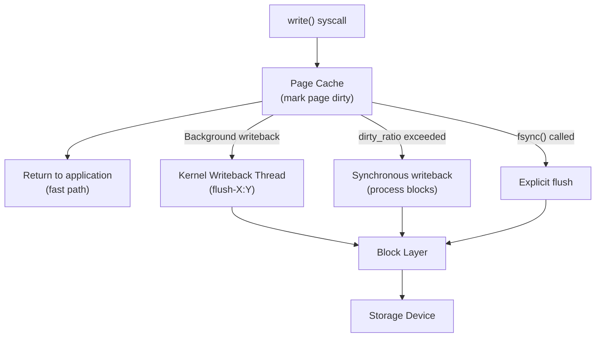

::: warning データ消失のリスク
ページキャッシュに書いた時点で `write()` は成功を返すが、dirty ページがディスクにフラッシュされる前に電源断が発生するとデータが失われる。データの永続性を保証するには `fsync()` または `fdatasync()` を明示的に呼ぶ必要がある。データベースエンジンが WAL（Write-Ahead Logging）で `fsync()` を使うのはこのためである。
:::

### バッファキャッシュとの関係

歴史的に Linux にはページキャッシュとバッファキャッシュの2つが存在していた。バッファキャッシュはブロックデバイスのデータをブロック単位でキャッシュするもの、ページキャッシュはファイルの内容をページ単位でキャッシュするものであった。

Linux 2.4 以降、バッファキャッシュはページキャッシュに統合された。現在ではバッファヘッド（`buffer_head`）はページキャッシュ内のページとブロックデバイス上のブロックの対応を管理する補助的なデータ構造として残っているが、主要な役割はページキャッシュが担っている。ブロックサイズがページサイズより小さい場合（例: 1KB ブロックに対して 4KB ページ）、1つのページに複数のバッファヘッドが対応する。

### ページの回収（Reclaim）

物理メモリが不足すると、カーネルは LRU（Least Recently Used）ベースのアルゴリズムでページキャッシュのページを回収する。Linux は active list と inactive list の2つのリストを使い、ページのアクセス頻度に応じてリスト間を移動させることで、頻繁にアクセスされるページが回収されにくくしている。

dirty ページを回収するにはまずディスクに書き出す必要があるため、clean ページに比べて回収コストが高い。このため、dirty ページの比率を適切に制御することがシステムの応答性に影響する。

## ブロックレイヤーと bio 構造体

### ブロックレイヤーの役割

ブロックレイヤー（Generic Block Layer）は、ファイルシステムからの I/O リクエストを受け取り、デバイスドライバに渡すまでの中間レイヤーである。その主な責務は以下の通りである。

1. **bio の管理**: I/O リクエストの基本単位である `struct bio` の生成と処理
2. **リクエストのマージ**: 隣接するセクタへの I/O をまとめて効率化
3. **I/O スケジューリング**: デバイス特性に合わせた I/O の並べ替え
4. **Plug/Unplug 機構**: 小さな I/O をバッチ化

### bio 構造体

`struct bio` はブロック I/O の基本単位であり、1つの連続した I/O 操作を表す。

```c
struct bio {
    struct bio          *bi_next;    // next bio in list
    struct block_device *bi_bdev;    // target block device
    unsigned int        bi_opf;      // operation and flags (REQ_OP_READ, etc.)
    sector_t            bi_iter.bi_sector;  // starting sector
    struct bio_vec      *bi_io_vec;  // array of (page, offset, len) segments
    unsigned short      bi_vcnt;     // number of bio_vec entries
    bio_end_io_t        *bi_end_io;  // completion callback
    void                *bi_private; // private data for callback
    // ...
};

struct bio_vec {
    struct page *bv_page;   // page containing the data
    unsigned int bv_len;    // length of data in this segment
    unsigned int bv_offset; // offset within the page
};
```

`bio` はスキャッタ/ギャザ I/O をサポートしており、メモリ上で不連続な複数のページ領域を1つの I/O 操作としてまとめることができる。`bi_io_vec` 配列の各エントリ（`bio_vec`）がメモリ上の1つのセグメント（ページ、オフセット、長さ）を指す。

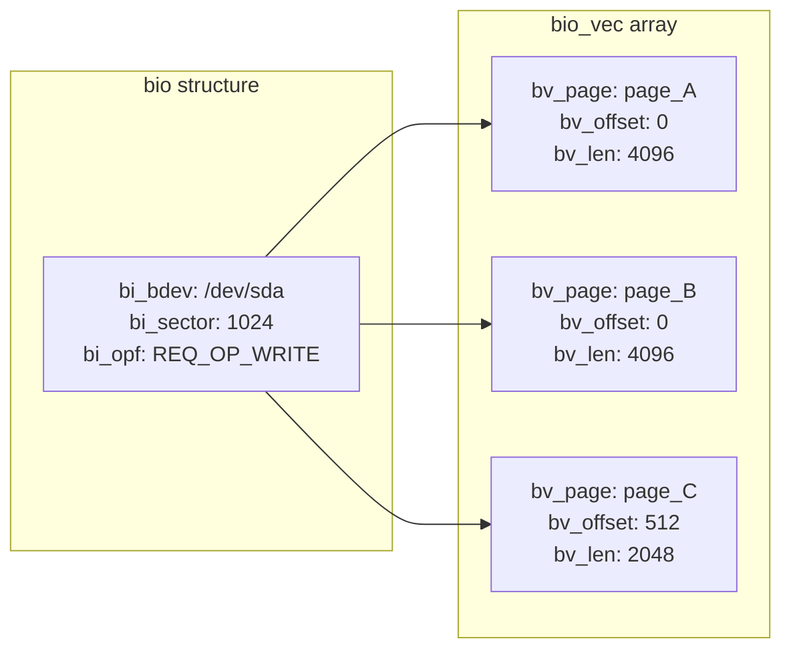

### bio のライフサイクル

bio はファイルシステムやページキャッシュの writeback 処理で生成され、ブロックレイヤーを経由してデバイスドライバに到達し、I/O 完了後にコールバック（`bi_end_io`）が呼ばれて解放される。

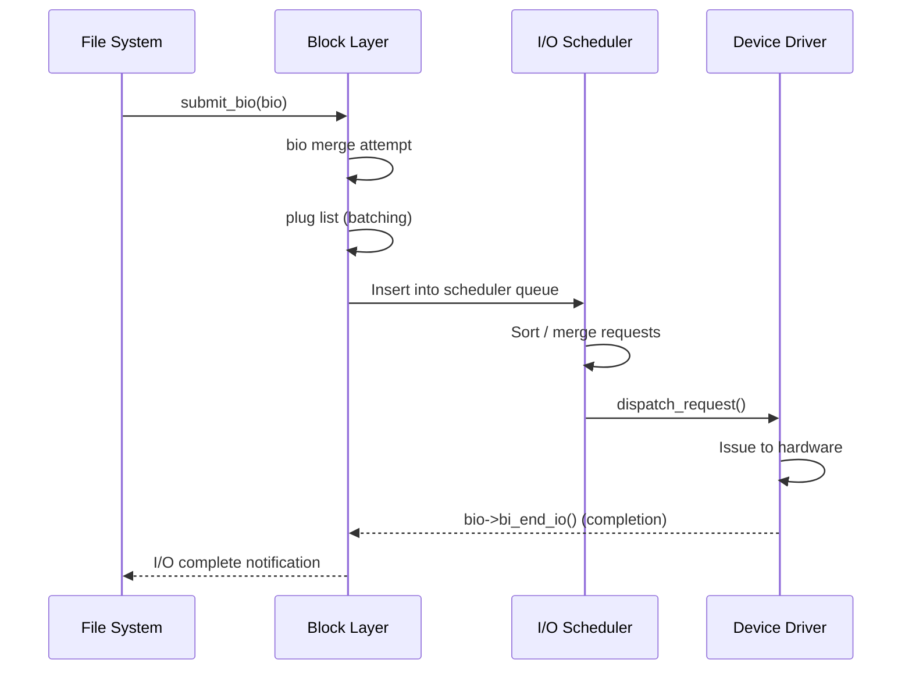

### Multi-Queue Block Layer (blk-mq)

従来のシングルキューブロックレイヤーは、高速な NVMe デバイスに対してスケーラビリティのボトルネックとなっていた。CPU ごとのソフトウェアキュー（submit queue）からハードウェアキューにマッピングする際に、単一のロックに起因する競合が問題であった。

Linux 3.13 で導入された blk-mq（Multi-Queue Block Layer）は、この問題を解決するために設計された。

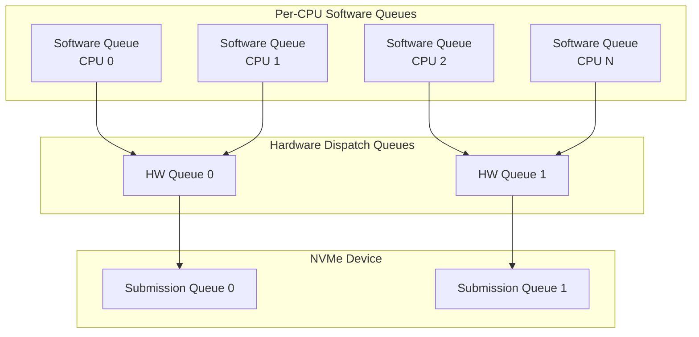

blk-mq の特徴は以下の通りである。

- **CPU ごとのソフトウェアキュー**: 各 CPU が専用のキューを持つことでロック競合を排除
- **複数のハードウェアキュー**: NVMe のように複数の Submission Queue を持つデバイスに直接マッピング可能
- **タグベースのリクエスト管理**: 各リクエストにユニークなタグを割り当て、I/O 完了時の高速なルックアップを実現
- **ポーリングモード**: 割り込みの代わりにポーリングで完了を検出する `io_poll` をサポート（低レイテンシ環境向け）

## I/O スケジューラ

### I/O スケジューラの目的

I/O スケジューラはブロックレイヤー内で I/O リクエストの並べ替え・マージを行い、ストレージデバイスの特性に合わせてスループットやレイテンシを最適化する。HDD ではシーク時間を最小化するための並べ替えが重要だが、SSD や NVMe ではランダムアクセスのコストが低いため、スケジューラの役割は異なる。

### 歴史的なスケジューラ

#### CFQ（Completely Fair Queuing）

CFQ は Linux 2.6.18 からデフォルトスケジューラとして長く使われていた。プロセスごとにキューを持ち、ラウンドロビン方式で各プロセスに公平に I/O 帯域を分配する。

- 各プロセスに同期キューを割り当て、タイムスライスで制御
- アイドリング機能: プロセスが次の I/O を発行するまで短時間待機し、シーケンシャルアクセスの連続性を維持
- I/O 優先度（`ionice`）をサポート

CFQ は HDD 環境で公平性を保つのに適していたが、SSD 環境では不要なオーバーヘッドとなるため、blk-mq への移行に伴い Linux 5.0 で削除された。

#### Deadline

Deadline スケジューラは、各リクエストにデッドライン（期限）を設定し、期限が迫ったリクエストを優先的に処理する。

- Read と Write それぞれにソート済みキュー（セクタ順）とデッドラインキュー（期限順）を持つ
- デフォルトの期限: Read は 500ms、Write は 5s
- Read を Write より優先することで、対話型のレイテンシを改善

### 現在のスケジューラ（blk-mq 対応）

blk-mq 環境で利用可能なスケジューラは以下の通りである。

#### mq-deadline

Deadline スケジューラの blk-mq 版である。基本的な設計は同じだが、blk-mq のマルチキュー構造に適応している。

- HDD と SSD の両方で良好なパフォーマンスを発揮
- 多くのディストリビューションでデフォルトとして採用
- Read 優先、デッドラインベースのスケジューリング

#### BFQ（Budget Fair Queuing）

BFQ はプロセスに「バジェット」（I/O リクエスト数またはセクタ数の予算）を割り当て、バジェットの消費率に基づいてスケジューリングを行う。

- 低速デバイス（HDD、SD カード、USB メモリ）での応答性を重視
- インタラクティブなプロセスの I/O を優先
- デスクトップ環境で体感的な応答性が向上するが、高速 NVMe デバイスでは CPU オーバーヘッドが問題になり得る

#### kyber

kyber は高速デバイス向けの軽量スケジューラである。

- Read と Write の2つのキューのみを持つシンプルな設計
- トークンベースの制御: 各キューにトークン数を割り当て、キューの深さを動的に調整
- NVMe などの高速デバイスに適しているが、公平性の保証は弱い

#### none（noop）

スケジューリングを行わず、リクエストをそのままデバイスに発行する。

- NVMe デバイスのように内部に高度なスケジューリング機構を持つデバイスに最適
- カーネル側のオーバーヘッドが最小
- ハードウェアが十分に高速な場合に最もスループットが高い

### スケジューラの選択指針

| デバイス種別 | 推奨スケジューラ | 理由 |
|------------|----------------|------|
| NVMe SSD | none | 内部スケジューリングが十分。カーネルオーバーヘッド最小 |
| SATA SSD | mq-deadline | 適度な並べ替えとデッドライン制御 |
| HDD | mq-deadline / BFQ | シーク最小化とデッドライン保証 |
| デスクトップ | BFQ | インタラクティブな応答性の向上 |
| 仮想化ゲスト（virtio） | mq-deadline / none | ホスト側でスケジューリング済みの場合は none |

スケジューラの確認と変更は以下のコマンドで行える。

```bash
# Check current scheduler (brackets indicate active scheduler)
cat /sys/block/nvme0n1/queue/scheduler
# Example output: [none] mq-deadline kyber bfq

# Change scheduler
echo "mq-deadline" > /sys/block/nvme0n1/queue/scheduler
```

## デバイスドライバと NVMe

### デバイスドライバの役割

デバイスドライバはブロックレイヤーから受け取ったリクエストをハードウェア固有のコマンドに変換し、ストレージデバイスを制御する。Linux では SCSI サブシステムが長年にわたって中心的な役割を果たしてきたが、NVMe の登場により状況は変わりつつある。

### SCSI サブシステム

SCSI サブシステムは Linux のストレージスタックの基盤として、HDD（SATA/SAS）のほか、USB ストレージや iSCSI も扱う。SCSI コマンドセット（CDB: Command Descriptor Block）を使ってデバイスに I/O コマンドを発行し、SCSI mid-layer がデバイス固有の LLD（Low Level Driver）にディスパッチする。

SATA デバイスは libata を通じて SCSI サブシステムに統合されているため、SATA HDD/SSD も `/dev/sdX` としてアクセスできる。

### NVMe ドライバ

NVMe（Non-Volatile Memory Express）は SSD のために一から設計されたプロトコルであり、SCSI/AHCI の制約を取り払っている。

NVMe の特徴的なアーキテクチャ:

- **複数の Submission Queue / Completion Queue ペア**: 最大 64K 個のキューペアをサポート。CPU コアごとにキューを割り当てることで、ロック競合なしに I/O を発行可能
- **コマンドの直接発行**: SCSI mid-layer のような中間レイヤーを介さず、PCIe BAR にマッピングされた Doorbell レジスタを叩いてコマンドを投入
- **MSI-X 割り込み**: コア単位の割り込みによりキャッシュラインバウンスを回避

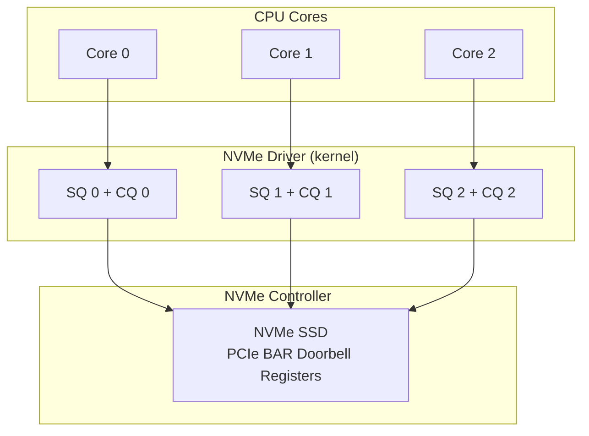

NVMe の性能上の優位性は、SCSI スタックの階層をバイパスできることにある。blk-mq と NVMe の組み合わせにより、数百万 IOPS の性能を引き出すことが可能になった。

### virtio-blk と仮想化環境

仮想化環境では virtio-blk が標準的なブロックデバイスドライバとして使われる。virtio は準仮想化 I/O フレームワークであり、ゲスト OS とホスト OS の間で共有メモリ（vring）を介して効率的にデータを転送する。

virtio-blk は実際の物理デバイスをエミュレートするのではなく、ゲストとホスト間の抽象化されたインターフェースを提供するため、完全エミュレーション（IDE/AHCI エミュレーション）に比べて大幅に高性能である。

## Direct I/O vs Buffered I/O

### Buffered I/O

通常のファイル I/O はすべてページキャッシュを経由する。これが Buffered I/O であり、以下の利点がある。

- **読み込みの高速化**: 頻繁にアクセスされるデータがメモリに保持される
- **書き込みの高速化**: ディスク書き込みを待たずにアプリケーションに制御が返る
- **Read-ahead**: 先読みにより逐次アクセスが高速化される

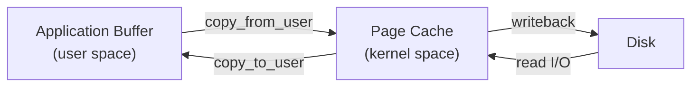

### Direct I/O

`O_DIRECT` フラグでファイルを開くと、ページキャッシュをバイパスして直接ブロックレイヤーに I/O を発行する。

```c
// Open a file with Direct I/O
int fd = open("/data/myfile", O_RDWR | O_DIRECT);

// Buffer must be aligned to block size (typically 512 or 4096 bytes)
void *buf;
posix_memalign(&buf, 4096, 4096);

// Read bypasses page cache
pread(fd, buf, 4096, 0);
```

Direct I/O の制約:
- ユーザーバッファがブロックサイズにアラインされている必要がある
- I/O サイズがブロックサイズの倍数でなければならない
- ファイルオフセットもブロックサイズにアラインされている必要がある

### なぜ Direct I/O を使うのか

Buffered I/O が万能に見えるが、以下のようなユースケースでは Direct I/O が適している。

**データベースエンジン**: MySQL InnoDB や PostgreSQL は自前のバッファプールを持っており、ページキャッシュと合わせて「二重バッファリング」になることを避けたい。Direct I/O を使うことで、データベースエンジン自身がキャッシュ管理を完全に制御できる。

**大量データの逐次処理**: ログファイルのフラッシュやバックアップ処理のように、一度書いたデータを再度読まない場合、ページキャッシュに載せる意味がない。むしろ他のワーキングセットをページキャッシュから追い出してしまう。

**低レイテンシ要件**: ページキャッシュを経由するコピーのオーバーヘッドを回避し、アプリケーションバッファから直接デバイスに書き込む。

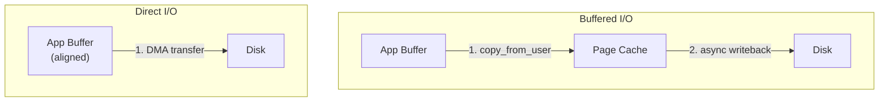

### O_DSYNC と O_SYNC

Direct I/O と混同されやすいのが同期 I/O フラグである。

- `O_SYNC`: 書き込みデータとメタデータの両方がデバイスに永続化されるまで `write()` がブロックする
- `O_DSYNC`: 書き込みデータ（とデータアクセスに必要なメタデータのみ）が永続化されるまでブロックする
- `O_DIRECT` + `O_DSYNC`: ページキャッシュをバイパスしつつ、永続性を保証する

データベースの WAL 書き込みでは、`O_DIRECT | O_DSYNC` の組み合わせがよく使われる。

## io_uring

### 従来の非同期 I/O の限界

Linux にはこれまでも非同期 I/O（AIO: Asynchronous I/O）の仕組みが存在した。POSIX AIO（libaio ベース）は `io_submit()` と `io_getevents()` を使って非同期にブロック I/O を発行できるが、以下の問題があった。

- Direct I/O のみ対応（Buffered I/O は非サポート）
- システムコールのオーバーヘッドが大きい（毎回コンテキストスイッチ）
- ネットワーク I/O やその他のシステムコールとの統一的なインターフェースがない

### io_uring の設計

io_uring は Linux 5.1 で Jens Axboe によって導入された、完全に新しい非同期 I/O フレームワークである。その中核的なアイデアは、**カーネルとユーザー空間の間で共有メモリ上のリングバッファを使うことで、システムコールのオーバーヘッドを最小化する**ことにある。

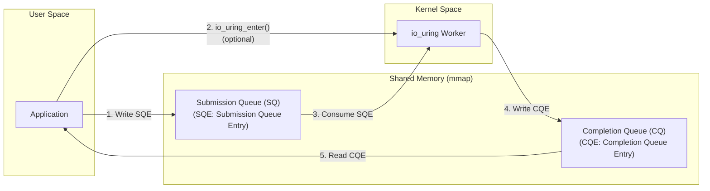

io_uring は3つのシステムコールで構成される。

1. **`io_uring_setup()`**: リングバッファの初期化
2. **`io_uring_enter()`**: SQE のサブミットと CQE のウェイト
3. **`io_uring_register()`**: バッファやファイルの事前登録

### リングバッファの仕組み

SQ（Submission Queue）と CQ（Completion Queue）はカーネルとユーザー空間の間で `mmap()` により共有されるリングバッファである。

```c
// SQE: Submission Queue Entry
struct io_uring_sqe {
    __u8    opcode;     // IORING_OP_READ, IORING_OP_WRITE, etc.
    __u8    flags;      // IOSQE_FIXED_FILE, IOSQE_IO_LINK, etc.
    __u16   ioprio;     // I/O priority
    __s32   fd;         // file descriptor
    __u64   off;        // file offset
    __u64   addr;       // user buffer address
    __u32   len;        // buffer length
    __u64   user_data;  // application-defined data (for matching CQE)
    // ...
};

// CQE: Completion Queue Entry
struct io_uring_cqe {
    __u64   user_data;  // copied from SQE
    __s32   res;        // result (bytes transferred or error)
    __u32   flags;      // flags
};
```

ユーザー空間のアプリケーションは SQE を SQ に書き込み、カーネルは処理完了後に CQE を CQ に書き込む。このやり取りにはロックが不要で、メモリバリアのみで同期を行う。

### io_uring の高度な機能

**SQPOLL モード**: カーネルスレッドが SQ を定期的にポーリングし、SQE が見つかったら自動的に処理する。これにより `io_uring_enter()` のシステムコールすら不要になり、ゼロシステムコール I/O が実現する。ただし CPU を常時消費するため、I/O が頻繁に発生する環境でのみ有効である。

**Fixed Files / Fixed Buffers**: ファイルディスクリプタやバッファを事前に登録することで、I/O ごとのファイルルックアップやバッファマッピングのオーバーヘッドを排除する。

**I/O Linking**: 複数の SQE をチェーン（リンク）することで、前の I/O が完了してから次の I/O を発行する依存関係を表現できる。

**マルチショットオペレーション**: 1つの SQE で複数の CQE を生成する。例えば `accept()` のマルチショットでは、接続が来るたびに CQE が生成される。

### io_uring の実用例

```c
#include <liburing.h>

// Initialize io_uring with 256 entries
struct io_uring ring;
io_uring_queue_init(256, &ring, 0);

// Prepare a read SQE
struct io_uring_sqe *sqe = io_uring_get_sqe(&ring);
io_uring_prep_read(sqe, fd, buf, buf_size, offset);
io_uring_sqe_set_data(sqe, user_data); // tag for matching completion

// Submit all queued SQEs
io_uring_submit(&ring);

// Wait for completion
struct io_uring_cqe *cqe;
io_uring_wait_cqe(&ring, &cqe);

// Process result
if (cqe->res < 0) {
    // handle error
} else {
    // cqe->res contains bytes read
}
io_uring_cqe_seen(&ring, cqe);

// Cleanup
io_uring_queue_exit(&ring);
```

### io_uring の性能特性

io_uring は特に以下の条件で大きな性能向上をもたらす。

- **高 IOPS ワークロード**: NVMe デバイスに対して数百万 IOPS のスループットを達成
- **多数の小さな I/O**: システムコールオーバーヘッドの削減が顕著
- **混在ワークロード**: ファイル I/O とネットワーク I/O を統一的に処理

::: tip io_uring のセキュリティ
io_uring はその強力さゆえに、過去に複数のカーネル脆弱性の原因となった。このため Google は本番環境の一部で io_uring を無効化し、一部のコンテナランタイムでもデフォルトで制限されている。セキュリティと性能のトレードオフを検討する必要がある。
:::

## I/O パスの詳細 ── write() の旅路

ここまで各レイヤーを個別に解説してきたが、実際の I/O がどのようにスタック全体を通過するかを `write()` を例に追跡してみよう。

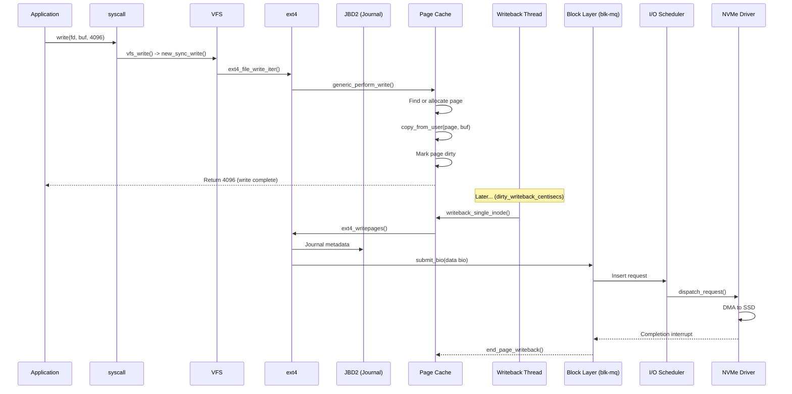

この図から分かるように、通常の `write()` はページキャッシュへのコピーと dirty マーキングの時点でアプリケーションに制御が返る。実際のディスク書き込みは後でバックグラウンドで行われる。

`fsync()` が呼ばれた場合は、dirty ページがすべてディスクに書き出され、さらにデバイスのライトキャッシュがフラッシュ（FUA コマンドまたは FLUSH コマンド）されるまでブロックする。

## パフォーマンスチューニング

### ページキャッシュ関連パラメータ

```bash
# Percentage of total memory that can be dirty before processes block
cat /proc/sys/vm/dirty_ratio            # default: 20

# Percentage at which background writeback starts
cat /proc/sys/vm/dirty_background_ratio # default: 10

# Writeback interval in centiseconds (1/100 sec)
cat /proc/sys/vm/dirty_writeback_centisecs # default: 500 (= 5 sec)

# How long dirty pages can remain before forced writeback (centiseconds)
cat /proc/sys/vm/dirty_expire_centisecs    # default: 3000 (= 30 sec)
```

`dirty_ratio` を小さくすると dirty ページが溜まりにくくなりデータ消失リスクが減るが、書き込みがブロックされやすくなる。逆に大きくすると書き込みの burst をバッファリングできるが、フラッシュ時の latency spike が大きくなる。

### Read-ahead の調整

```bash
# Check current read-ahead value (in 512-byte sectors)
cat /sys/block/nvme0n1/queue/read_ahead_kb  # default: 128 KB

# Increase for sequential workloads
echo 2048 > /sys/block/nvme0n1/queue/read_ahead_kb

# Disable for random workloads (e.g., database random reads)
echo 0 > /sys/block/nvme0n1/queue/read_ahead_kb
```

シーケンシャルな読み込みが中心のワークロード（ログ解析、ETL 処理など）では read-ahead を大きくすることで、I/O の発行回数を減らしスループットを向上できる。一方、データベースのようなランダムアクセスが中心のワークロードでは、不要なデータの読み込みを防ぐために read-ahead を小さくするか無効にする。

### キュー深度の調整

```bash
# Check maximum queue depth for the device
cat /sys/block/nvme0n1/queue/nr_requests  # default: varies

# NVMe device queue depth (hardware limit)
cat /sys/block/nvme0n1/queue/hw_sector_size
```

NVMe デバイスは深いキュー深度をサポートしており、多数の I/O を並列にフライトさせることで性能を最大化できる。しかし、キュー深度が深すぎると個々のリクエストのレイテンシが増加するため、ワークロードに応じたチューニングが必要である。

### fio によるベンチマーク

I/O パフォーマンスのベンチマークには fio（Flexible I/O Tester）が広く使われている。

```ini
; fio configuration: 4K random read with io_uring
[random-read-4k]
ioengine=io_uring
direct=1
bs=4k
rw=randread
numjobs=4
iodepth=128
size=10G
filename=/dev/nvme0n1
runtime=60
time_based=1
group_reporting=1
```

```bash
# Run fio benchmark
fio random-read-4k.fio

# Key metrics to observe:
# - IOPS (I/O operations per second)
# - BW (bandwidth in MB/s)
# - lat (latency: avg, p50, p99, p99.9)
# - clat (completion latency)
# - slat (submission latency)
```

fio の ioengine パラメータで I/O 方式を切り替えられる。

| ioengine | 特徴 |
|----------|------|
| `sync` | 同期 I/O（`read()`/`write()`） |
| `psync` | 位置指定同期 I/O（`pread()`/`pwrite()`） |
| `libaio` | Linux AIO（非同期、Direct I/O のみ） |
| `io_uring` | io_uring（非同期、Buffered/Direct 両対応） |
| `mmap` | メモリマップド I/O |

### iostat によるモニタリング

```bash
# Monitor I/O statistics every 1 second
iostat -xz 1

# Key columns:
# r/s, w/s       - reads/writes per second
# rkB/s, wkB/s   - read/write throughput
# avgqu-sz       - average queue depth
# await           - average I/O latency (ms)
# r_await, w_await - read/write latency separately
# %util           - device utilization
```

`%util` が 100% に近い場合、デバイスが飽和している可能性があるが、NVMe のような並列処理可能なデバイスでは `%util` だけでは飽和状態を正確に判断できない。`avgqu-sz`（平均キュー深度）と `await`（平均レイテンシ）の組み合わせで判断する方が適切である。

### blktrace による詳細なトレース

```bash
# Trace block I/O events
blktrace -d /dev/nvme0n1 -o trace

# Analyze trace output
blkparse -i trace

# Key event types:
# Q - queued (bio queued in block layer)
# G - get request (request allocated)
# I - inserted into scheduler
# D - dispatched to driver
# C - completed
```

blktrace を使うと、I/O リクエストがブロックレイヤーの各段階をどのように通過するかをマイクロ秒単位で追跡できる。Q2C（Queue to Complete）時間の内訳を分析することで、ボトルネックがスケジューラにあるのか、デバイスにあるのかを特定できる。

### BPF/bcc ツールによる深層分析

eBPF を活用した bcc（BPF Compiler Collection）ツール群も I/O 解析に強力である。

```bash
# Show I/O latency histogram by disk
biolatency -D

# Trace block I/O with details
biotop

# Show I/O snoop (every I/O event)
biosnoop

# File system latency
ext4slower 10   # show ext4 operations slower than 10ms
```

これらのツールはカーネル内部のトレースポイントに直接フックするため、パフォーマンスへの影響が最小限でありながら、非常に詳細な情報を取得できる。

## 最新の動向と将来展望

### io_uring の進化

io_uring は登場以来急速に進化を続けている。ファイル I/O だけでなく、ネットワーク I/O（`accept`、`recv`、`send`）、タイマー、シグナルなど、あらゆる非同期操作を統一的に扱えるフレームワークへと拡張されている。

将来的には、io_uring がユーザー空間ネットワーキングやカーネルバイパスの新たな基盤となる可能性がある。

### NVMe over Fabrics（NVMe-oF）

NVMe over Fabrics は NVMe プロトコルをネットワーク（RDMA、TCP、Fibre Channel）越しに拡張する技術である。ローカルの NVMe デバイスにアクセスするのと同じプロトコルでリモートストレージにアクセスでき、分散ストレージの設計を根本的に変える可能性がある。

Linux カーネルは NVMe-oF のホスト（イニシエータ）とターゲットの両方をサポートしている。

### Zoned Namespace（ZNS）

ZNS は NVMe の拡張仕様であり、SSD の内部構造（消去ブロック）に対応した「ゾーン」をホストに公開する。ホスト側が書き込み順序を制御することで、SSD 内部の GC（Garbage Collection）を軽減し、書き込み増幅（Write Amplification）を削減する。

ZNS をサポートするファイルシステム（Btrfs、F2FS）やアプリケーション（RocksDB の Zenfs プラグイン）が登場しており、アプリケーションとストレージデバイスの協調が進んでいる。

### CXL と Compute Express Link

CXL（Compute Express Link）は PCIe ベースのインターコネクト規格であり、CPU、メモリ、アクセラレータ間のメモリセマンティクスでの通信を実現する。CXL Type 3 デバイスはメモリ拡張を提供し、ストレージと DRAM の中間的な性能特性を持つ新しいメモリ階層を形成する。

Linux カーネルでは CXL サブシステムの開発が進んでおり、将来的にはこの新しいメモリ/ストレージ階層が I/O スタックの設計にも影響を与えることが予想される。

## まとめ

Linux I/O スタックは、ユーザー空間のシンプルな `read()`/`write()` から始まり、VFS による抽象化、ページキャッシュによるバッファリング、ブロックレイヤーによるリクエスト管理、I/O スケジューラによる最適化、デバイスドライバによるハードウェア制御という多層構造を通じて、ストレージデバイスとの通信を実現している。

各レイヤーには明確な設計思想があり、それぞれが独立して進化してきた。

- **VFS** は関数ポインタテーブルによるポリモーフィズムでファイルシステムの多様性を吸収する
- **ページキャッシュ** は Write-Back 方式でアプリケーションのレイテンシを隠蔽しつつ、dirty 比率の制御でメモリ管理と協調する
- **blk-mq** はマルチキューアーキテクチャで NVMe 時代の並列性を活用する
- **I/O スケジューラ** はデバイス特性に合わせた複数のアルゴリズムを提供する
- **io_uring** はカーネル/ユーザー空間のリングバッファによるゼロコピー・ゼロシステムコール I/O を実現する

ストレージ技術の急速な進化 ── NVMe の普及、ZNS、CXL、永続メモリ ── に伴い、Linux I/O スタックもまた進化を続けている。これらの変化を理解し追いかけ続けることが、高性能なストレージシステムの設計と運用に不可欠である。
