# Linuxネットワークスタック — パケット処理の全体像

## はじめに

Linux カーネルのネットワークスタックは、NIC（ネットワークインターフェースカード）がパケットを受信した瞬間からアプリケーションの `read()` システムコールがデータを返すまで、あるいはアプリケーションの `write()` から実際にワイヤ上にパケットが送出されるまでの間に、驚くほど多くの処理を行っている。このスタックは 1990 年代初頭の Linux 1.0 から継続的に進化を重ね、現在では毎秒数百万パケットを処理できる高性能な実装となっている。

本記事では、Linux ネットワークスタックにおけるパケット処理の全体像を、受信（RX）パスを中心に解説する。NAPI によるポーリングメカニズム、`sk_buff` 構造体によるパケット表現、Netfilter によるフィルタリング、TC（Traffic Control）によるトラフィック制御、TCP/IP プロトコル処理、GRO/GSO によるオフロード最適化、そしてパフォーマンスチューニングの実践まで、カーネル内部の仕組みを体系的に理解することを目指す。

なぜこの知識が重要なのか。高負荷なネットワークサービスを運用する際、ボトルネックがアプリケーションにあるのかカーネルにあるのか NIC にあるのかを切り分ける能力は不可欠である。また、`iptables` や `tc` のルールがパケット処理のどの段階で適用されるかを正確に理解していなければ、意図しない動作やパフォーマンス劣化を招くことになる。

## 1. 受信パケットの処理フロー

パケットが NIC からアプリケーションに届くまでの全体像を最初に把握しよう。

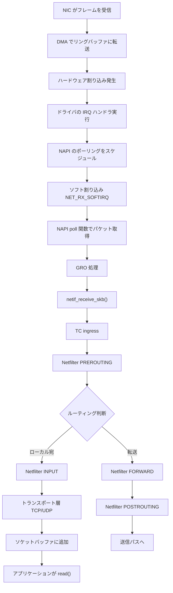

### 1.1 NIC とリングバッファ

現代の NIC は DMA（Direct Memory Access）を使って、CPU を介さずにパケットデータを直接メインメモリに書き込む。NIC とドライバの間のインターフェースとなるのが **リングバッファ**（ディスクリプタリング）である。

リングバッファは循環キューとして実装されており、各エントリ（ディスクリプタ）にはメモリ上のバッファへのポインタとメタデータが含まれる。NIC はパケットを受信するとディスクリプタの所有権を「NIC → ドライバ」に移し、割り込みで CPU に通知する。

```c
// Simplified ring buffer descriptor
struct rx_descriptor {
    __le64 buffer_addr;   // Physical address of the receive buffer
    __le64 status_length; // Status flags and packet length
};
```

リングバッファのサイズはパフォーマンスに直結する。小さすぎればパケットドロップが発生し、大きすぎればメモリを浪費しレイテンシが増大する。`ethtool -g` でサイズを確認し、`ethtool -G` で変更できる。

### 1.2 ハードウェア割り込みからソフト割り込みへ

NIC がパケットを受信すると、まずハードウェア割り込み（ハード IRQ）が発生する。ハード IRQ ハンドラは最小限の処理だけを行い、速やかに制御を返す必要がある。具体的には以下の処理を行う：

1. NIC の割り込みを無効化する
2. NAPI のポーリングをスケジュールする（`napi_schedule()`）
3. ハード IRQ から復帰する

その後、ソフト割り込み `NET_RX_SOFTIRQ` のコンテキストで実際のパケット処理が行われる。この **割り込みの二段階処理**（top half / bottom half）は、割り込みコンテキストで長時間 CPU を占有することを避けるための古典的な設計パターンである。

### 1.3 マルチキューとRSS

現代の NIC は複数の受信キュー（RX キュー）を持ち、**RSS（Receive Side Scaling）** によってパケットを異なるキューに分散させる。各キューは異なる CPU コアの割り込みに関連付けられるため、パケット処理を複数コアに並列化できる。

RSS のハッシュ関数は通常、パケットの 5-tuple（送信元 IP、宛先 IP、送信元ポート、宛先ポート、プロトコル）に基づいてキューを選択する。これにより、同一フローのパケットは常に同じ CPU で処理され、キャッシュ効率とパケット順序が保たれる。

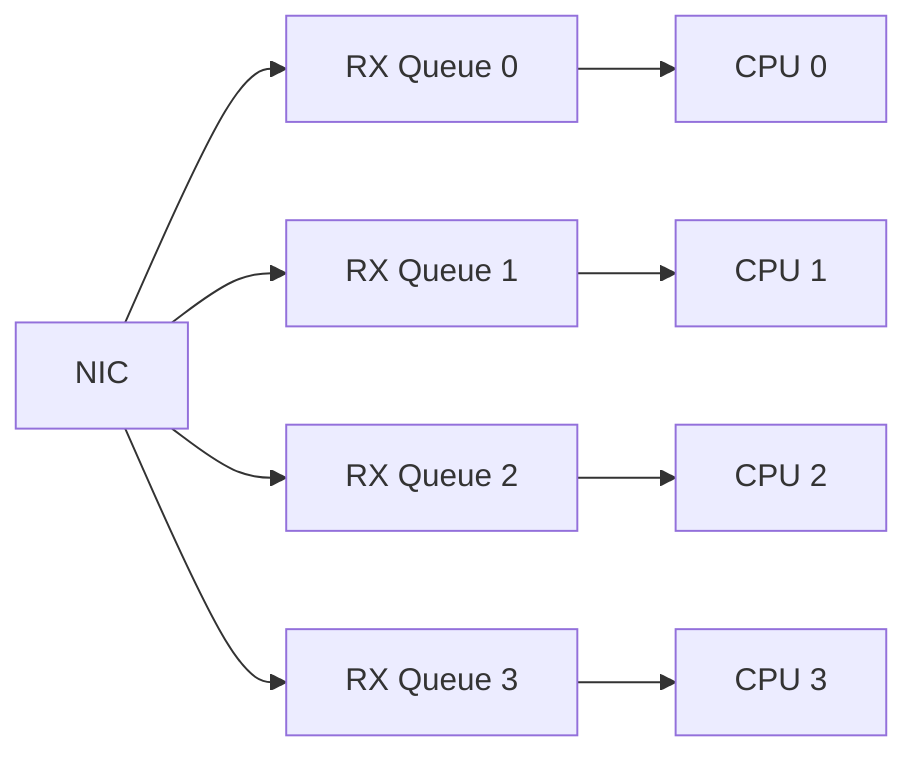

RSS のほかに、ソフトウェア側で同様の分散を行う **RPS（Receive Packet Steering）** と、ソケットに対する CPU アフィニティを考慮してキューイングを行う **RFS（Receive Flow Steering）** も利用できる。RSS 非対応のNIC や、NIC のキュー数が CPU コア数より少ない場合に有用である。

## 2. NAPI（New API）

### 2.1 NAPI が解決する問題

初期の Linux ネットワークスタックでは、パケットが到着するたびにハードウェア割り込みが発生していた。低トラフィック時にはこれで問題ないが、高トラフィック時には割り込み処理のオーバーヘッドが支配的になり、パケット処理能力が頭打ちになるか、最悪の場合 **割り込みライブストーム**（livelock）に陥る。すなわち、CPU が割り込み処理だけで忙殺され、実際のパケット処理やアプリケーション処理が一切進まなくなる。

### 2.2 NAPI の動作原理

NAPI は **割り込み駆動** と **ポーリング** のハイブリッドモデルである。

1. 最初のパケットでハードウェア割り込みが発生する
2. ドライバは NIC の割り込みを無効化し、NAPI をスケジュールする
3. ソフト割り込みコンテキストで NAPI の `poll()` 関数が呼ばれる
4. `poll()` 関数はリングバッファからパケットをバッチで取り出す
5. budget（1回のポーリングで処理する最大パケット数）を使い切るか、リングバッファが空になるまで処理を続ける
6. リングバッファが空になったら割り込みを再有効化し、割り込み駆動モードに戻る

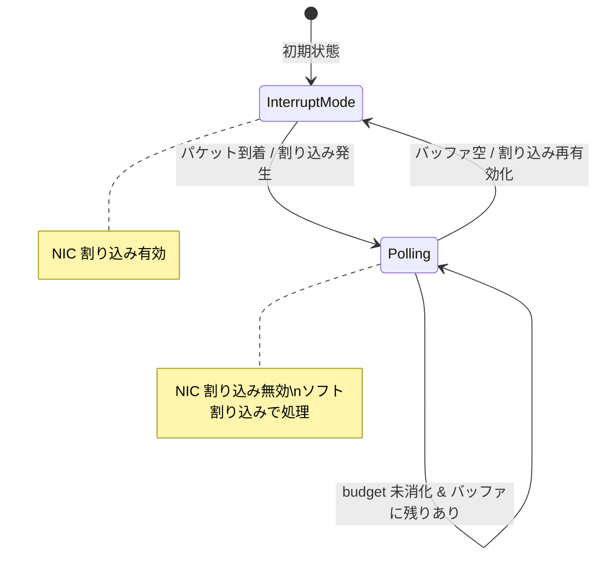

この設計により、低トラフィック時は割り込み駆動で低レイテンシを維持し、高トラフィック時はポーリングで効率的にバッチ処理を行うという、両方のメリットを享受できる。

### 2.3 NAPI の budget と weight

NAPI には 2 つの重要なパラメータがある：

- **weight**: 個々の NAPI インスタンスが 1 回の `poll()` 呼び出しで処理できる最大パケット数。通常 64 に設定される。
- **budget**: `net.core.netdev_budget` で設定される、1 回のソフト割り込みサイクルで全 NAPI インスタンスが処理する合計パケット数の上限。デフォルトは 300。

`poll()` 関数が weight 分のパケットを処理しきれなかった（つまりまだバッファにパケットがある）場合、NAPI は再スケジュールされ、次のソフト割り込みサイクルで再びポーリングが行われる。

```c
// Simplified NAPI poll loop (kernel internal)
static int driver_poll(struct napi_struct *napi, int budget)
{
    int work_done = 0;

    while (work_done < budget) {
        struct sk_buff *skb = fetch_from_ring_buffer();
        if (!skb)
            break;

        napi_gro_receive(napi, skb);
        work_done++;
    }

    if (work_done < budget) {
        napi_complete_done(napi, work_done);
        enable_irq();  // Re-enable hardware interrupts
    }

    return work_done;
}
```

### 2.4 Busy Polling

通常の NAPI ポーリングはソフト割り込みコンテキストで行われるが、**Busy Polling** を有効にすると、アプリケーションの `recv()` / `poll()` / `epoll_wait()` のコンテキストで直接 NIC のキューをポーリングできる。これにより、ソフト割り込みのスケジューリング遅延を回避し、レイテンシをさらに削減できる。

```bash
# Enable busy polling (microseconds to poll before blocking)
sysctl -w net.core.busy_poll=50
sysctl -w net.core.busy_read=50
```

ただし、Busy Polling は CPU 使用率の増大と引き換えにレイテンシを削減するトレードオフであるため、レイテンシに極めて敏感なアプリケーション（金融取引システムなど）でのみ検討すべきである。

## 3. sk_buff 構造体

### 3.1 sk_buff の役割

`sk_buff`（socket buffer）は Linux ネットワークスタックにおけるパケットの中心的なデータ構造である。カーネル内でパケットが生成されてから消滅するまでのライフサイクル全体を通じて使用される。

`sk_buff` の設計思想は以下の要件を満たすことにある：

- プロトコル階層を上下する際に、データのコピーを最小限にする
- ヘッダの追加・削除を効率的に行う
- メタデータ（到着時刻、入力デバイス、プロトコル情報など）を保持する
- メモリ割り当てのオーバーヘッドを低減する

### 3.2 sk_buff の構造

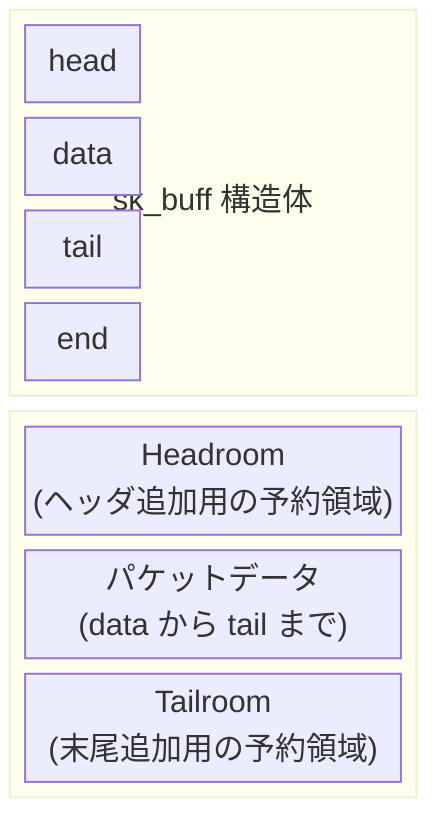

`sk_buff` 構造体は実際には非常に大きく、200 バイトを超える。主要なフィールドを以下に示す。

```c
// Simplified sk_buff structure (actual definition is much larger)
struct sk_buff {
    struct sk_buff      *next;      // List linkage
    struct sk_buff      *prev;

    struct sock         *sk;        // Owning socket
    struct net_device   *dev;       // Ingress/egress device

    unsigned char       *head;      // Start of allocated buffer
    unsigned char       *data;      // Start of packet data
    unsigned char       *tail;      // End of packet data
    unsigned char       *end;       // End of allocated buffer

    unsigned int        len;        // Total data length
    unsigned int        data_len;   // Length of paged data (fragments)

    __u16               protocol;   // L3 protocol (ETH_P_IP, etc.)
    __u16               transport_header;
    __u16               network_header;
    __u16               mac_header;

    // ... many more fields
};
```

### 3.3 ヘッダ操作

パケットがプロトコルスタックを上昇する際（受信時）には `skb_pull()` でヘッダを剥がし、下降する際（送信時）には `skb_push()` でヘッダを追加する。これらの操作は `data` ポインタを移動するだけで、実際のデータコピーは発生しない。

```c
// Receiving: strip Ethernet header to reveal IP header
skb_pull(skb, ETH_HLEN);
// Now skb->data points to the IP header

// Sending: prepend IP header
skb_push(skb, sizeof(struct iphdr));
// Now skb->data points to the new IP header space
```

この設計は `head` と `end` の間に十分な headroom/tailroom を事前に確保しておくことで成立する。headroom が不足した場合は `skb_cow_head()` や `pskb_expand_head()` で再割り当てが必要になり、パフォーマンスに影響する。

### 3.4 sk_buff のライフサイクル

1. **割り当て**: ドライバが `netdev_alloc_skb()` や `napi_alloc_skb()` でバッファを確保
2. **受信パス**: NIC → ドライバ → GRO → プロトコル処理 → ソケットバッファ
3. **送信パス**: ソケットバッファ → プロトコル処理 → TC → ドライバ → NIC
4. **解放**: `kfree_skb()` または `consume_skb()` で参照カウントをデクリメントし、0 になったら解放

`sk_buff` は参照カウントで管理されており、`skb_get()` で参照を増やし、`kfree_skb()` で減らす。クローン（`skb_clone()`）はヘッダ部分のみをコピーし、データ部分は共有する軽量な複製を作成できる。

## 4. Netfilter フレームワーク

### 4.1 Netfilter の概要

Netfilter は Linux カーネルにおけるパケットフィルタリングと操作のフレームワークである。パケット処理パスの決められたポイント（フック）にコールバック関数を登録し、通過するパケットに対して許可・拒否・変更・追跡などの操作を行う。

ユーザースペースのツールである `iptables`、`ip6tables`、`nftables` は、このカーネル内の Netfilter フレームワークの上に構築されている。

### 4.2 Netfilter フック

IPv4 の場合、5 つのフックポイントが定義されている。

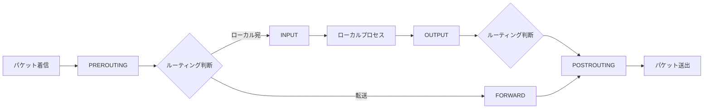

各フックの役割は以下の通りである：

| フック | タイミング | 主な用途 |
|--------|-----------|---------|
| `NF_INET_PRE_ROUTING` | ルーティング前 | DNAT、conntrack |
| `NF_INET_LOCAL_IN` | ローカル宛パケット | 入力フィルタリング |
| `NF_INET_FORWARD` | 転送パケット | フォワードフィルタリング |
| `NF_INET_LOCAL_OUT` | ローカル発パケット | 出力フィルタリング |
| `NF_INET_POST_ROUTING` | ルーティング後 | SNAT、マスカレード |

### 4.3 コネクショントラッキング（conntrack）

Netfilter の重要な機能の 1 つがコネクショントラッキングである。これはステートフルファイアウォールの基盤であり、各パケットがどの接続に属するかを追跡する。

conntrack はパケットを以下の状態に分類する：

- **NEW**: 新しい接続の最初のパケット（TCP SYN など）
- **ESTABLISHED**: 確立された接続に属するパケット
- **RELATED**: 既存の接続に関連する新しい接続（FTP データ接続など）
- **INVALID**: どの接続にも属さない不正なパケット

conntrack テーブルはハッシュテーブルで実装されており、そのサイズは `net.netfilter.nf_conntrack_max` で制御される。大量の同時接続を処理するサーバーでは、この値を適切に設定することが重要である。テーブルが溢れると新規接続がドロップされ、ログに `nf_conntrack: table full, dropping packet` というメッセージが出力される。

```bash
# Check conntrack table usage
conntrack -C
cat /proc/sys/net/netfilter/nf_conntrack_count
cat /proc/sys/net/netfilter/nf_conntrack_max

# Increase conntrack table size
sysctl -w net.netfilter.nf_conntrack_max=262144
```

### 4.4 iptables と nftables

`iptables` は長年 Linux のファイアウォール管理ツールとして使われてきたが、後継の `nftables` への移行が進んでいる。`nftables` は以下の点で優れている：

- テーブル・チェーンの構造がより柔軟
- ルールの更新がアトミック（一括適用）
- バイトコード仮想マシンによる効率的なルール評価
- IPv4/IPv6/ARP/ブリッジの統一的な処理
- セット（集合）やマップによる高速なマッチング

ただし、内部的にはどちらも Netfilter フックを利用しており、パケット処理パス上の位置は同一である。

### 4.5 Netfilter のパフォーマンス影響

Netfilter のルール数が増えると、パケットあたりの処理コストが線形に増大する（`iptables` の場合）。`nftables` のセット機能を使えば O(1) のルックアップが可能だが、それでもフック自体のオーバーヘッドは存在する。

高パフォーマンスが要求される環境では、以下のアプローチが検討される：

- conntrack を不要な場合は無効化（`-j NOTRACK` / `nft notrack`）
- `ipset` や `nftables` のセットによるルール集約
- XDP（eXpress Data Path）による Netfilter バイパス

## 5. TC（Traffic Control）サブシステム

### 5.1 TC の概要

TC（Traffic Control）は Linux カーネルにおけるトラフィック制御サブシステムである。パケットのキューイング、スケジューリング、シェーピング、ポリシング、分類を行い、ネットワークトラフィックの品質を管理する。

TC は主に **送信（egress）パス** で使用されるが、**ingress** 方向のフィルタリングとポリシングも可能である。ingress TC は Netfilter の PREROUTING よりも前の段階で実行される点が重要である。

### 5.2 TC のコンポーネント

TC は 3 つの主要コンポーネントで構成される：

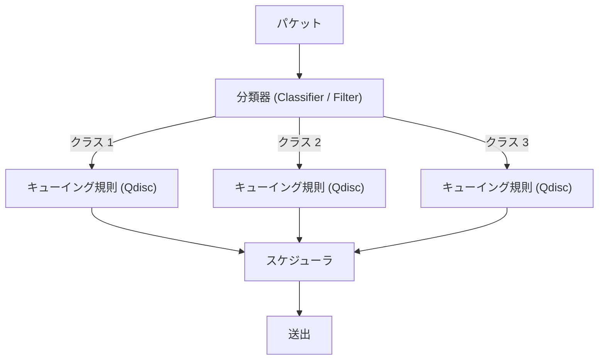

- **Qdisc（Queueing Discipline）**: パケットのキューイングとスケジューリングのアルゴリズム。クラスレス（`pfifo_fast`, `fq`, `fq_codel` など）とクラスフル（`htb`, `hfsc`, `cbq` など）に分類される。
- **クラス（Class）**: クラスフル Qdisc において、トラフィックを階層的に分類するための入れ物。帯域幅の割り当てなどのパラメータを持つ。
- **フィルタ（Filter / Classifier）**: パケットをどのクラスに振り分けるかを決定するルール。`u32`, `flower`, `bpf` などのマッチングモジュールがある。

### 5.3 主要な Qdisc

#### pfifo_fast

Linux のデフォルト Qdisc（かつての）。3 つのバンド（優先度帯）を持つ単純な FIFO キュー。パケットの ToS フィールドに基づいてバンドを選択する。

#### fq_codel（Fair Queuing Controlled Delay）

現代の Linux ディストリビューションで広く採用されているデフォルト Qdisc。フロー単位の公平なキューイングと、**CoDel**（Controlled Delay）アルゴリズムによる AQM（Active Queue Management）を組み合わせている。

CoDel は **bufferbloat** 問題に対処するために設計された。従来のテールドロップ方式では、バッファが満杯になるまでパケットをキューに積み続け、大きなレイテンシが生じていた。CoDel はキュー内の滞留時間を監視し、閾値（デフォルト 5ms）を超えるパケットを能動的にドロップすることで、レイテンシを低く保つ。

```bash
# Set fq_codel as the qdisc for eth0
tc qdisc replace dev eth0 root fq_codel

# Check current qdisc
tc qdisc show dev eth0

# View statistics
tc -s qdisc show dev eth0
```

#### HTB（Hierarchical Token Bucket）

クラスフル Qdisc の中で最も広く使われるもの。トークンバケットアルゴリズムに基づき、階層的な帯域幅制御を実現する。各クラスに `rate`（保証帯域）と `ceil`（最大帯域）を設定でき、余剰帯域を親子クラス間で柔軟に共有できる。

```bash
# Create an HTB qdisc
tc qdisc add dev eth0 root handle 1: htb default 30

# Create a root class with 100Mbps total
tc class add dev eth0 parent 1: classid 1:1 htb rate 100mbit ceil 100mbit

# Create child classes
tc class add dev eth0 parent 1:1 classid 1:10 htb rate 50mbit ceil 80mbit
tc class add dev eth0 parent 1:1 classid 1:20 htb rate 30mbit ceil 60mbit
tc class add dev eth0 parent 1:1 classid 1:30 htb rate 20mbit ceil 40mbit

# Classify traffic by destination port
tc filter add dev eth0 parent 1: protocol ip u32 \
  match ip dport 80 0xffff flowid 1:10
tc filter add dev eth0 parent 1: protocol ip u32 \
  match ip dport 443 0xffff flowid 1:20
```

### 5.4 TC ingress と eBPF

TC の ingress フックは、受信パケットに対してフィルタリングやリダイレクトを行うために使用される。近年では **eBPF**（extended Berkeley Packet Filter）を TC のフィルタとして使用するケースが増えている。

eBPF を TC フィルタとして使用すると、Netfilter を経由せずに高速なパケット処理が可能になる。コンテナネットワーキング（Cilium など）やロードバランシングでの活用が代表的である。

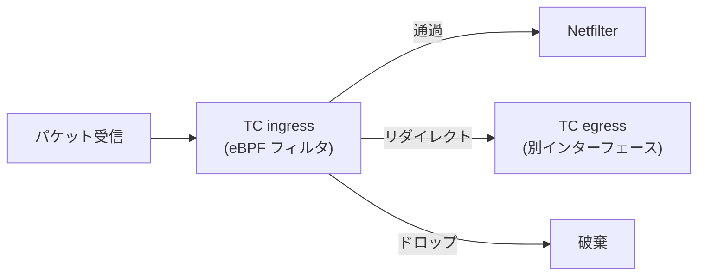

## 6. ソケットバッファ

### 6.1 ソケットとソケットバッファの関係

アプリケーションがネットワーク通信を行う際、カーネルはソケットという抽象を提供する。各ソケットには受信バッファ（receive buffer）と送信バッファ（send buffer）が関連付けられている。

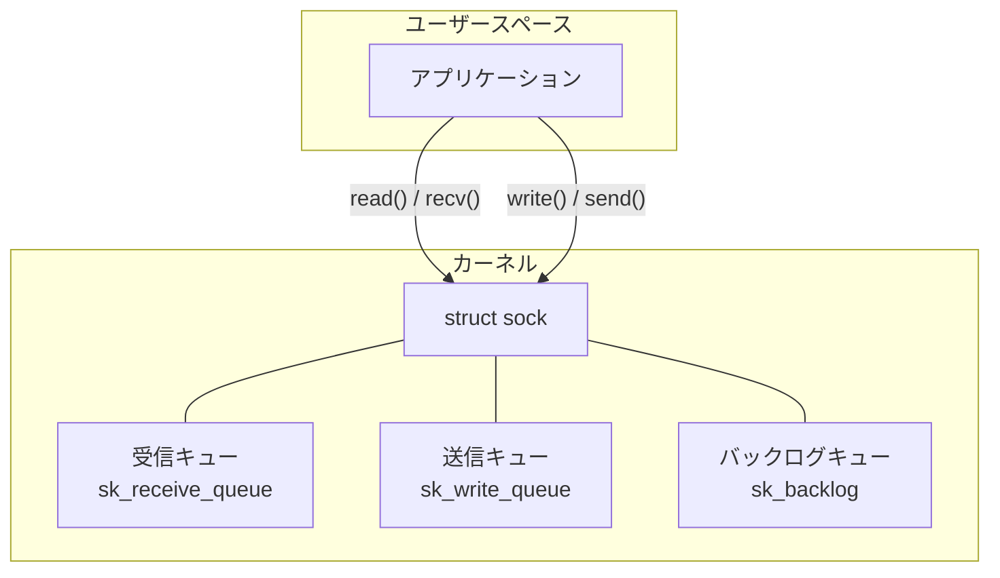

### 6.2 受信バッファ

TCP 接続の場合、プロトコル処理を経たデータは `sk_receive_queue` に追加される。アプリケーションが `read()` や `recv()` を呼ぶと、このキューからデータが取り出される。

受信バッファのサイズは `SO_RCVBUF` ソケットオプションで設定できるが、カーネルはデフォルトで **TCP メモリ自動チューニング** を行い、接続の状況に応じてバッファサイズを動的に調整する。

```bash
# TCP receive buffer: min, default, max (bytes)
sysctl net.ipv4.tcp_rmem
# Typical: 4096  131072  6291456

# TCP send buffer: min, default, max (bytes)
sysctl net.ipv4.tcp_wmem
# Typical: 4096  16384  4194304

# Total TCP memory limits (pages)
sysctl net.ipv4.tcp_mem
```

`tcp_rmem` の 3 つの値はそれぞれ以下を意味する：

- **min**: ソケットあたりの最小バッファサイズ。メモリ圧迫時でもこの値は保証される。
- **default**: ソケット作成時のデフォルトバッファサイズ。
- **max**: 自動チューニングで到達できる最大バッファサイズ。

### 6.3 バックログキュー

パケットがソケットに到着した際、そのソケットがロックされていた場合（別の CPU がそのソケットを処理中など）、パケットは **バックログキュー** に追加される。ソケットのロックが解放された際にバックログが処理される。

この仕組みにより、ソケットのロック競合時にもパケットをドロップすることなく処理を遅延させることができる。ただし、バックログキューが溢れた場合はパケットがドロップされる。

### 6.4 ソケットと epoll

大量の接続を効率的に処理するために、Linux は `epoll` というイベント通知メカニズムを提供する。パケットがソケットバッファに到着すると、カーネルは `epoll` の wait キューに通知を送り、アプリケーションは準備ができたソケットだけを効率的に処理できる。

`epoll` はソケット側に準備完了コールバックを登録する方式（`ep_poll_callback`）を採用しており、`select()` や `poll()` のようにソケット一覧を毎回スキャンする必要がない。このため、数万〜数十万の同時接続を扱うサーバーでは `epoll` が事実上の標準となっている。

## 7. TCP/IP スタック

### 7.1 受信パスの詳細

IP 層からトランスポート層（TCP）に至る受信パスの詳細を追ってみよう。

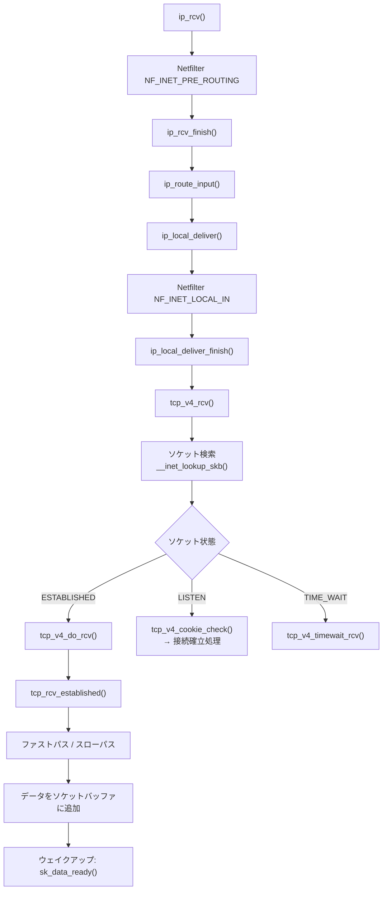

### 7.2 TCP のファストパスとスローパス

`tcp_rcv_established()` には 2 つの処理パスがある：

- **ファストパス（fast path）**: 予測されたシーケンス番号を持つ、順序通りのデータパケットを高速に処理する。ほとんどのバルクデータ転送はこのパスを通る。ヘッダの予測（`tp->pred_flags`）を使って、複雑な状態遷移やオプション処理をスキップする。
- **スローパス（slow path）**: 順序の乱れ、再送、ウィンドウ更新、タイムスタンプ処理など、特殊なケースを処理する。

ファストパスが使える条件は以下である：
- 受信ウィンドウが開いている
- 期待されるシーケンス番号と一致する
- TCP ヘッダフラグが予測と一致する（通常は ACK のみ）

### 7.3 TCP 輻輳制御

Linux は複数の TCP 輻輳制御アルゴリズムをサポートしており、動的に切り替えることができる。

| アルゴリズム | 特徴 |
|-------------|------|
| **Reno** | 古典的な AIMD（Additive Increase Multiplicative Decrease） |
| **CUBIC** | Linux のデフォルト。三次関数ベースのウィンドウ増加 |
| **BBR** | Google 開発。帯域幅とRTTのモデルに基づく |
| **DCTCP** | データセンター向け。ECN を活用 |

```bash
# Check available congestion control algorithms
sysctl net.ipv4.tcp_available_congestion_control

# Set default congestion control
sysctl -w net.ipv4.tcp_congestion_control=bbr

# Per-socket setting (in application code)
# setsockopt(fd, IPPROTO_TCP, TCP_CONGESTION, "bbr", 3);
```

BBR（Bottleneck Bandwidth and Round-trip propagation time）は従来のロスベースのアルゴリズムとは異なり、ネットワークのボトルネック帯域幅と RTT を推定してペーシングレートを決定する。バッファが深い環境（bufferbloat のあるネットワーク）で特に効果を発揮する。

### 7.4 TCP タイマー

TCP は複数のタイマーを使用してプロトコルの正確な動作を保証する。

- **再送タイマー（RTO）**: ACK が返ってこないセグメントを再送する。RTO はスムージングされた RTT（SRTT）から動的に計算される。
- **遅延 ACK タイマー**: 即座に ACK を返す代わりに、少し待ってデータと ACK をまとめて送る（通常 40ms 以内）。
- **Keepalive タイマー**: アイドル接続が生存しているか確認する。デフォルトは 2 時間。
- **TIME_WAIT タイマー**: 接続クローズ後に 2MSL（通常 60 秒）間ソケットを保持し、遅延パケットを適切に処理する。

## 8. GRO/GSO

### 8.1 GRO（Generic Receive Offload）

GRO は受信側のパフォーマンス最適化技術である。同一フローに属する複数の小さなパケットをカーネル内で結合し、より大きな 1 つのパケットとしてプロトコルスタックに渡す。

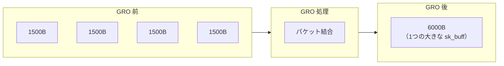

GRO の利点：
- プロトコルスタックの処理がパケット数に比例するため、結合によりオーバーヘッドが削減される
- ロック取得回数の削減
- ソケットバッファへのキューイング回数の削減

GRO は NAPI の `poll()` 関数内で `napi_gro_receive()` を通じて呼び出される。同一フローの判定は、L3/L4 ヘッダの情報（送信元/宛先 IP、ポート番号、プロトコル）に基づいて行われる。

```bash
# Check GRO status
ethtool -k eth0 | grep generic-receive-offload

# Enable/disable GRO
ethtool -K eth0 gro on
ethtool -K eth0 gro off
```

### 8.2 LRO と GRO の違い

GRO の前身として **LRO（Large Receive Offload）** がある。LRO はハードウェア（NIC）で実行され、TCP セグメントを結合するが、以下の問題があった：

- IP ヘッダの情報（TTL、TOS など）が結合時に失われる可能性がある
- ルーティング/ブリッジングを行うシステムでは、結合されたパケットを正しく転送できない

GRO はこれらの問題を解決するソフトウェアベースの実装であり、プロトコルごとに正確な結合ルールを適用できる。転送が必要なパケットは結合対象から除外される。

### 8.3 GSO（Generic Segmentation Offload）

GSO は送信側の最適化技術で、GRO と対をなす。アプリケーションが大きなデータを送信する際、プロトコルスタック内では MTU を超えるサイズの「巨大パケット」として処理し、NIC ドライバに渡す直前（またはNICのTSOで）にセグメント分割を行う。

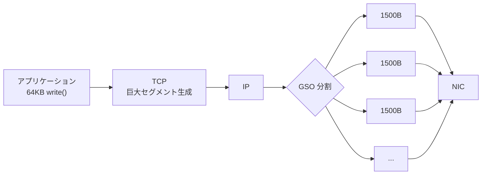

GSO は以下のように動作する：

1. TCP が MTU を超えるセグメントを生成する（最大 64KB）
2. `sk_buff` の `gso_size` フィールドに本来の MSS を記録する
3. パケットが NIC ドライバに渡される直前に `dev_hard_start_xmit()` 内で分割が行われる
4. NIC が TSO（TCP Segmentation Offload）をサポートしている場合は、分割を NIC に委譲する

### 8.4 TSO（TCP Segmentation Offload）

TSO はハードウェアによるセグメンテーションオフロードで、GSO の一部をNICにオフロードしたものと理解できる。カーネルが大きな TCP セグメントをそのまま NIC に渡し、NIC のハードウェアが MSS サイズに分割して送出する。

TSO を使うと、CPU のセグメンテーション処理負荷が大幅に軽減される。ただし、TSO は TC の Qdisc と相互作用があり、パケットサイズに基づくトラフィック制御の精度に影響を与える場合がある。

```bash
# Check TSO/GSO status
ethtool -k eth0 | grep -E "tcp-segmentation|generic-segmentation"

# Enable TSO
ethtool -K eth0 tso on

# Enable GSO
ethtool -K eth0 gso on
```

## 9. パフォーマンスチューニング

### 9.1 チューニングの前提

パフォーマンスチューニングは「計測してから最適化する」が鉄則である。盲目的にパラメータを変更しても、効果がないばかりか逆効果になりかねない。まずはボトルネックを特定し、仮説を立てて検証するアプローチが重要である。

### 9.2 ボトルネックの特定

#### パケットドロップの確認

```bash
# Check interface statistics
ip -s link show eth0

# Check detailed NIC statistics
ethtool -S eth0 | grep -i drop

# Check protocol statistics
nstat -a | grep -i drop

# Check softnet statistics (per-CPU)
cat /proc/net/softnet_stat
```

`/proc/net/softnet_stat` の各行は CPU ごとの統計で、各列の意味は以下の通りである：

| 列 | 意味 |
|----|------|
| 1列目 | 処理したパケット数 |
| 2列目 | ドロップしたパケット数（バックログ溢れ） |
| 3列目 | time_squeeze（budget/時間切れで処理中断した回数） |

2列目が増加している場合は `net.core.netdev_max_backlog` の増加を検討し、3列目が増加している場合は `net.core.netdev_budget` や `net.core.netdev_budget_usecs` の増加を検討する。

#### CPU 使用率の分析

```bash
# Check per-CPU softirq usage
cat /proc/softirqs | grep NET_RX

# Monitor interrupt distribution
watch -n 1 cat /proc/interrupts
```

ソフト割り込みが特定の CPU に偏っている場合は、RSS/RPS の設定を見直す必要がある。

### 9.3 カーネルパラメータのチューニング

#### ネットワークバッファ

```bash
# Increase socket buffer defaults and maximums
sysctl -w net.core.rmem_default=262144
sysctl -w net.core.rmem_max=16777216
sysctl -w net.core.wmem_default=262144
sysctl -w net.core.wmem_max=16777216

# TCP buffer auto-tuning range
sysctl -w net.ipv4.tcp_rmem="4096 87380 16777216"
sysctl -w net.ipv4.tcp_wmem="4096 65536 16777216"
```

#### バックログとキュー

```bash
# Increase the input packet backlog queue
sysctl -w net.core.netdev_max_backlog=5000

# Increase NAPI budget
sysctl -w net.core.netdev_budget=600
sysctl -w net.core.netdev_budget_usecs=8000

# Increase the listen backlog
sysctl -w net.core.somaxconn=4096
sysctl -w net.ipv4.tcp_max_syn_backlog=8192
```

#### TCP 最適化

```bash
# Enable TCP window scaling
sysctl -w net.ipv4.tcp_window_scaling=1

# Enable TCP timestamps
sysctl -w net.ipv4.tcp_timestamps=1

# Enable TCP selective acknowledgments
sysctl -w net.ipv4.tcp_sack=1

# Reduce TIME_WAIT sockets
sysctl -w net.ipv4.tcp_tw_reuse=1

# Enable TCP Fast Open
sysctl -w net.ipv4.tcp_fastopen=3
```

### 9.4 NIC レベルのチューニング

#### リングバッファサイズ

```bash
# Check current and maximum ring buffer size
ethtool -g eth0

# Increase ring buffer
ethtool -G eth0 rx 4096 tx 4096
```

#### 割り込みコアレッシング

NIC が割り込みを発行する頻度を制御する。コアレッシング（結合）を増やすとスループットは向上するが、レイテンシは増大する。

```bash
# Check current coalescing settings
ethtool -c eth0

# Set adaptive coalescing
ethtool -C eth0 adaptive-rx on adaptive-tx on

# Or set fixed coalescing
ethtool -C eth0 rx-usecs 50 rx-frames 64
```

#### RSS / RPS / RFS の設定

```bash
# Check number of NIC queues
ethtool -l eth0

# Set RPS CPU mask (distribute to all CPUs on a 4-core system)
echo f > /sys/class/net/eth0/queues/rx-0/rps_cpus

# Enable RFS
echo 32768 > /proc/sys/net/core/rps_sock_flow_entries
echo 4096 > /sys/class/net/eth0/queues/rx-0/rps_flow_cnt
```

### 9.5 XDP（eXpress Data Path）

XDP はドライバレベルでパケット処理を行うフレームワークで、通常のネットワークスタックを経由する前にパケットを処理できる。eBPF プログラムを NIC ドライバのフックポイントにアタッチし、極めて低いオーバーヘッドでパケットのドロップ、転送、書き換えを行う。

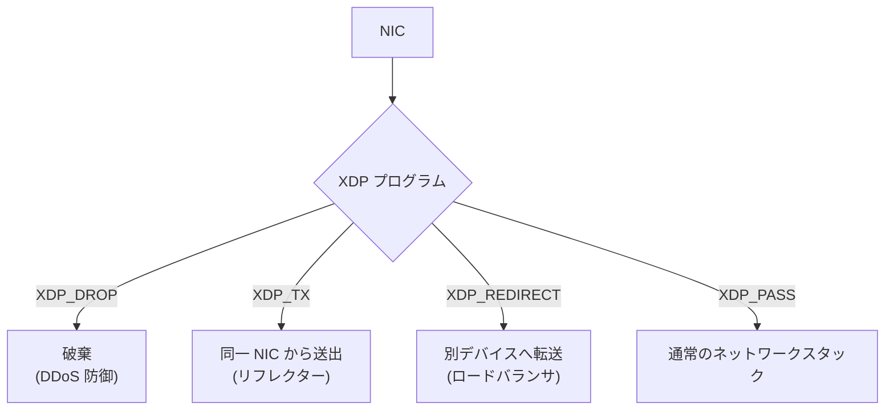

XDP の主な利用例：

- **DDoS 防御**: 攻撃パケットをスタック到達前にドロップ
- **ロードバランシング**: Facebook の Katran のような L4 ロードバランサ
- **モニタリング**: パケットキャプチャやフロー統計の収集

XDP は `sk_buff` を割り当てる前にパケットを処理するため、`sk_buff` の割り当て・初期化コストを回避できる。このため、毎秒数千万パケットの処理が単一コアで可能になる場合がある。

### 9.6 AF_XDP

AF_XDP は XDP をユーザースペースに拡張したソケットタイプである。XDP プログラムが `XDP_REDIRECT` でパケットを AF_XDP ソケットにリダイレクトし、ユーザースペースのアプリケーションがゼロコピーでパケットを処理できる。

DPDK（Data Plane Development Kit）のような完全なカーネルバイパスとは異なり、AF_XDP はカーネルのネットワークスタックと共存できる。一部のトラフィックを XDP で高速処理し、残りを通常のスタックで処理するといった使い分けが可能である。

## まとめ

Linux ネットワークスタックは、数十年にわたる進化の結果、非常に複雑でありながら高い性能と柔軟性を両立した実装となっている。本記事で解説した内容を整理すると以下のようになる。

1. **受信フロー**: NIC → DMA → リングバッファ → ハード IRQ → ソフト IRQ → プロトコル処理 → ソケットバッファ → アプリケーションという一連の処理パスを持つ
2. **NAPI**: 割り込みとポーリングのハイブリッドモデルにより、高トラフィック時の効率と低トラフィック時のレイテンシを両立する
3. **sk_buff**: ポインタ操作だけでヘッダの追加・削除を行う効率的なパケット表現を提供する
4. **Netfilter**: 5 つのフックポイントにおけるパケットフィルタリングと NAT の基盤であり、conntrack によるステートフル処理を実現する
5. **TC**: Qdisc、クラス、フィルタの 3 層構造により、柔軟なトラフィック制御を実現する
6. **ソケットバッファ**: カーネルとアプリケーション間のデータ受け渡しを仲介し、TCP の自動チューニングと連携する
7. **TCP/IP スタック**: ファストパスによる高速処理と、複数の輻輳制御アルゴリズムのサポートを備える
8. **GRO/GSO**: パケットの結合・分割をソフトウェアで行い、プロトコル処理のオーバーヘッドを削減する
9. **パフォーマンスチューニング**: 計測に基づいたカーネルパラメータ、NIC 設定、XDP の活用により、大幅な性能向上が可能である

これらの仕組みは独立して存在するのではなく、互いに密接に連携している。例えば、GRO で結合されたパケットが Netfilter を通過し、TC で帯域制御され、TCP の輻輳制御と連動してソケットバッファに到達するまでの一連の流れを理解することが、真のネットワークパフォーマンスチューニングの出発点となる。

近年では XDP や eBPF の台頭により、従来のネットワークスタックをバイパスする選択肢も現実的になってきた。しかし、XDP でさえカーネルのネットワークスタックと共存して動作するものであり、基盤となるスタックの理解は引き続き重要である。
