# 大規模言語モデル（LLM）のアーキテクチャと学習

## 1. はじめに：LLM とは何か

大規模言語モデル（Large Language Model, LLM）とは、膨大なテキストデータを用いて事前学習（Pre-training）された、数十億から数千億のパラメータを持つニューラルネットワークモデルの総称である。GPT-4、Claude、Gemini、LLaMA、Mistral など、現在の生成AIの中核技術はすべてLLMに基づいている。

LLMの本質は、**次のトークンを予測する**という極めてシンプルなタスクを、途方もない規模で実行することにある。この一見単純な目的関数が、言語理解、推論、コード生成、翻訳、要約といった多様なタスクを解決できる汎用的な能力を生み出すという事実は、深層学習における最も驚くべき発見のひとつである。

### なぜ今 LLM を理解すべきか

LLMは単なる流行の技術ではなく、コンピュータサイエンスの複数の分野が交差する地点に位置している。

- **アーキテクチャ設計**: Transformer の原理をどのように大規模化するか
- **最適化理論**: 数千億パラメータの損失関数をいかに効率的に最小化するか
- **分散システム**: 数千台の GPU を協調させてモデルを訓練する方法
- **情報理論**: 言語のエントロピーとモデルの表現能力の関係
- **ハードウェア**: GPU/TPU のメモリ帯域とFLOPSがモデル設計をどう制約するか

本記事では、LLMのアーキテクチャ、事前学習、ファインチューニング、アラインメント、推論効率化まで、体系的に解説する。前提知識として、[Transformer と Self-Attention](/transformer) の基本的な理解があることを想定する。

## 2. LLM の歴史的発展

LLMの歴史は、モデルのスケーリングと、それに伴う能力の質的変化の歴史でもある。

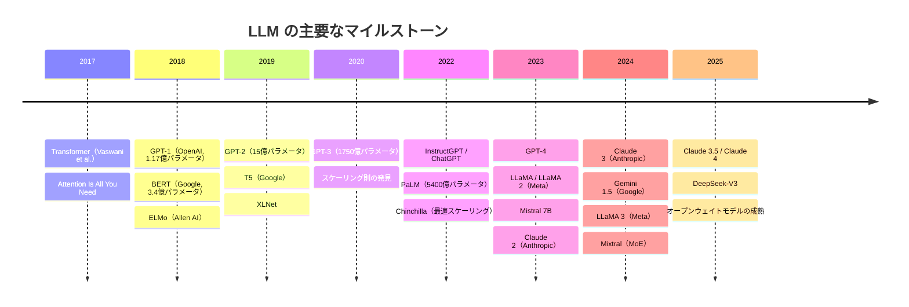

### GPT-1からGPT-3へ：スケーリングの実証

2018年にOpenAIが発表したGPT-1（Generative Pre-trained Transformer）は、「教師なし事前学習 + 教師ありファインチューニング」という2段階学習パラダイムを提示した。1.17億パラメータという当時としては中規模のモデルが、事前学習によって得た言語知識を下流タスクに転移できることを実証した。

同年、Googleが発表したBERT（Bidirectional Encoder Representations from Transformers）は、双方向のコンテキストを利用するマスク言語モデリング（MLM）により、文の理解タスクで圧倒的な性能を示した。GPTが「左から右への生成」に特化したのに対し、BERTは「文の理解」に特化したアプローチである。

GPT-2（15億パラメータ）は、ファインチューニングなしでも多くのタスクをこなせる「ゼロショット」能力を示し始めた。そしてGPT-3（1750億パラメータ）は、**In-Context Learning**（文脈内学習）という新しいパラダイムを開拓した。プロンプトに少数の例を含めるだけで、明示的な重み更新なしにタスクを実行できるという能力は、スケーリングがもたらした質的変化の象徴である。

### Chinchilla と最適スケーリング

2022年にDeepMindが発表したChinchillaの研究は、LLMの訓練における重要な転換点となった。それまでの「とにかくモデルを大きくする」というアプローチに対し、**計算予算が一定のとき、モデルサイズとデータサイズを均等にスケーリングすべき**という知見を提供した。この研究により、モデルの設計哲学は「パラメータ数至上主義」から「計算効率の最適化」へと移行していく。

## 3. アーキテクチャの詳細

### Decoder-Only アーキテクチャ

現代のLLMの大半は、Transformer の **Decoder-Only** アーキテクチャを採用している。元々のTransformerはEncoder-Decoder構造であったが、GPTシリーズ以降、言語生成に特化したDecoder-Only構造が主流となった。

```mermaid
graph TD
    subgraph "Decoder-Only Transformer"
        Input["入力トークン列"] --> Emb["トークン埋め込み<br/>+ 位置エンコーディング"]
        Emb --> L1["Decoder Layer 1"]
        L1 --> L2["Decoder Layer 2"]
        L2 --> Ldots["..."]
        Ldots --> LN["Decoder Layer N"]
        LN --> Norm["Layer Normalization"]
        Norm --> Head["言語モデルヘッド<br/>（線形変換 + Softmax）"]
        Head --> Output["次トークンの確率分布"]
    end

    subgraph "各 Decoder Layer の構造"
        DIn["入力"] --> CAN["Causal Self-Attention<br/>（因果的自己注意）"]
        CAN --> Add1["残差結合 + LayerNorm"]
        Add1 --> FFN["Feed-Forward Network"]
        FFN --> Add2["残差結合 + LayerNorm"]
        Add2 --> DOut["出力"]
    end

    style Input fill:#4a90d9,stroke:#333,color:#fff
    style Output fill:#e74c3c,stroke:#333,color:#fff
    style CAN fill:#f39c12,stroke:#333,color:#fff
    style FFN fill:#2ecc71,stroke:#333,color:#fff
```

Decoder-Only アーキテクチャが主流となった理由は複数ある。

1. **統一的なインターフェース**: すべてのタスクを「テキスト入力 → テキスト出力」の形式に統一できる
2. **スケーリング効率**: Encoder を省略することでパラメータ効率が向上する
3. **In-Context Learning との親和性**: 自己回帰的な生成プロセスが、プロンプトベースの推論と自然に適合する
4. **KV Cache の効率**: 推論時のキャッシュ戦略がシンプルになる

### Causal Self-Attention（因果的自己注意）

LLM における Self-Attention は、標準的な Self-Attention とは異なり、**因果的マスク**（Causal Mask）が適用される。各トークンは、自身以前の位置のトークンのみを参照でき、未来のトークンの情報にはアクセスできない。

位置 $i$ のトークンから位置 $j$ のトークンへの Attention スコアは、以下のように計算される。

$$
\text{Attention}(Q, K, V) = \text{softmax}\left(\frac{QK^T}{\sqrt{d_k}} + M\right)V
$$

ここで $M$ は因果的マスク行列であり、以下のように定義される。

$$
M_{ij} = \begin{cases} 0 & \text{if } j \leq i \\ -\infty & \text{if } j > i \end{cases}
$$

$-\infty$ の値は softmax を通すと $0$ になるため、未来のトークンからの情報が完全に遮断される。この因果的構造により、学習時に**系列内のすべての位置で同時に次トークン予測を行える**（Teacher Forcing）ため、訓練の効率が極めて高い。

```python
import torch
import torch.nn.functional as F

def causal_self_attention(x, W_q, W_k, W_v, d_k):
    """
    Causal self-attention implementation.
    x: (batch_size, seq_len, d_model)
    """
    Q = x @ W_q  # (batch_size, seq_len, d_k)
    K = x @ W_k
    V = x @ W_v

    # Compute attention scores
    scores = Q @ K.transpose(-2, -1) / (d_k ** 0.5)

    # Apply causal mask: prevent attending to future positions
    seq_len = x.size(1)
    causal_mask = torch.triu(
        torch.ones(seq_len, seq_len, dtype=torch.bool, device=x.device),
        diagonal=1
    )
    scores = scores.masked_fill(causal_mask, float('-inf'))

    # Softmax and weighted sum
    attn_weights = F.softmax(scores, dim=-1)
    output = attn_weights @ V
    return output
```

### 位置エンコーディングの進化

Transformer の元論文では、三角関数に基づく固定的な位置エンコーディング（Sinusoidal Positional Encoding）が使われていた。しかし、現代の LLM ではより洗練された手法が採用されている。

#### Rotary Position Embedding（RoPE）

RoPE は、2021年に Su らによって提案された手法で、現在最も広く使われている位置エンコーディングである。LLaMA、Mistral、Qwen など多くのモデルが採用している。

RoPEの核心的なアイデアは、**Query と Key のベクトルに対して位置に依存した回転を適用する**ことにある。$d$ 次元のベクトルを2次元ずつのペアに分割し、各ペアを位置 $m$ に応じた角度 $m\theta_i$ だけ回転させる。

$$
\text{RoPE}(x_m, m) = \begin{pmatrix} x_m^{(1)} \cos m\theta_1 - x_m^{(2)} \sin m\theta_1 \\ x_m^{(1)} \sin m\theta_1 + x_m^{(2)} \cos m\theta_1 \\ x_m^{(3)} \cos m\theta_2 - x_m^{(4)} \sin m\theta_2 \\ x_m^{(4)} \sin m\theta_2 + x_m^{(4)} \cos m\theta_2 \\ \vdots \end{pmatrix}
$$

ここで $\theta_i = 10000^{-2i/d}$ である。

RoPEの最も重要な性質は、**2つの位置 $m$, $n$ のトークン間の内積が相対位置 $m - n$ のみに依存する**ことである。

$$
\langle \text{RoPE}(q, m), \text{RoPE}(k, n) \rangle = g(q, k, m - n)
$$

この相対位置の性質により、学習時に見なかった長い系列に対しても一定の汎化が可能になる。さらに、RoPE は「NTK-aware scaling」や「YaRN」といった手法によるコンテキスト長の外挿にも対応しやすいという利点がある。

#### ALiBi（Attention with Linear Biases）

ALiBi は、位置エンコーディングを入力埋め込みに加えるのではなく、Attention スコアに直接線形バイアスを加える手法である。

$$
\text{softmax}\left(\frac{QK^T}{\sqrt{d_k}} - m \cdot |i - j|\right)
$$

ここで $m$ はヘッドごとに固定された傾き（学習不要）であり、$|i - j|$ は相対距離である。距離が離れるほど Attention スコアにペナルティが課されるため、近接するトークンに注意が集中しやすくなる。ALiBi はシンプルさと外挿性能のバランスに優れている。

### Feed-Forward Network（FFN）の設計

各 Transformer レイヤーの Feed-Forward Network は、Self-Attention で集約した情報を**非線形変換**する役割を担う。元の Transformer では2層の全結合層と ReLU 活性化関数が使われていたが、現代の LLM ではより高性能なバリエーションが採用されている。

#### SwiGLU

LLaMA をはじめとする多くの現代 LLM では、**SwiGLU** 活性化関数が標準的に使われている。SwiGLU は、Swish 活性化関数と Gated Linear Unit（GLU）を組み合わせたものである。

$$
\text{SwiGLU}(x) = \text{Swish}(xW_1) \otimes (xW_2)
$$

$$
\text{Swish}(x) = x \cdot \sigma(x) = x \cdot \frac{1}{1 + e^{-x}}
$$

ここで $W_1, W_2 \in \mathbb{R}^{d_{\text{model}} \times d_{\text{ff}}}$ は別個の重み行列であり、$\otimes$ は要素ごとの乗算、$\sigma$ はシグモイド関数である。ゲート機構により、情報の流れを動的に制御できる。

従来のReLU FFN は $\max(0, xW_1)W_2$ であったが、SwiGLU では3つ目の重み行列が追加されるため、同じ計算量を維持するには $d_{\text{ff}}$ を縮小する調整が必要になる。一般的には $d_{\text{ff}} = \frac{8}{3} d_{\text{model}}$ 程度に設定されることが多い。

### 正規化手法

#### RMSNorm

元の Transformer では Layer Normalization が使われていたが、現代のLLMでは**RMSNorm**（Root Mean Square Layer Normalization）が広く採用されている。

Layer Normalization は平均と分散の両方で正規化するのに対し、RMSNorm は平均のシフトを省略し、RMS のみで正規化する。

$$
\text{RMSNorm}(x) = \frac{x}{\sqrt{\frac{1}{d}\sum_{i=1}^{d} x_i^2 + \epsilon}} \odot \gamma
$$

ここで $\gamma$ は学習可能なスケールパラメータ、$\epsilon$ は数値安定性のための微小定数である。RMSNorm は Layer Normalization と同等の性能を発揮しつつ、平均の計算が不要な分わずかに高速である。

#### Pre-Norm vs Post-Norm

正規化の適用位置にも重要な設計選択がある。

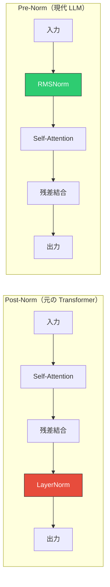

現代のLLMでは**Pre-Norm**（正規化をサブレイヤーの前に適用）がほぼ標準である。Pre-Normの利点は以下のとおりである。

- **学習の安定性**: 勾配の流れが残差接続を通じて直接的に伝搬するため、深いモデルでも安定して学習できる
- **学習率の感度低下**: ハイパーパラメータの調整が容易になる
- **ウォームアップの緩和**: 学習率のウォームアップが短くて済む

### Grouped-Query Attention（GQA）

標準的な Multi-Head Attention（MHA）では、各 Attention ヘッドが独立した Q, K, V の投影を持つ。しかし、推論時に K と V をキャッシュする**KV Cache** のメモリコストは、ヘッド数に比例して増大する。

これに対処するために考案された手法が Grouped-Query Attention（GQA）である。GQA は、Multi-Query Attention（MQA、全ヘッドが K, V を共有）と MHA の中間に位置する設計で、**複数の Query ヘッドが1組の Key-Value ヘッドを共有する**。

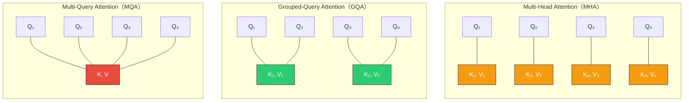

| 手法 | KV ヘッド数 | KV Cache サイズ | 品質 |
|------|------------|----------------|------|
| MHA | $h$ | $2 \times L \times h \times d_k \times s$ | 最高 |
| GQA | $g$（$1 < g < h$） | $2 \times L \times g \times d_k \times s$ | MHAに近い |
| MQA | $1$ | $2 \times L \times 1 \times d_k \times s$ | やや低下 |

ここで $h$ はヘッド数、$g$ はグループ数、$L$ はレイヤー数、$d_k$ はヘッドの次元、$s$ はシーケンス長である。LLaMA 2 の70Bモデル以降、GQA は多くのモデルで標準的に採用されている。

### Mixture of Experts（MoE）

Mixture of Experts（MoE）は、モデルの総パラメータ数を大幅に増やしつつ、推論時に活性化されるパラメータ数を抑えることで、**計算コストを増やさずにモデルの容量を拡大する**手法である。

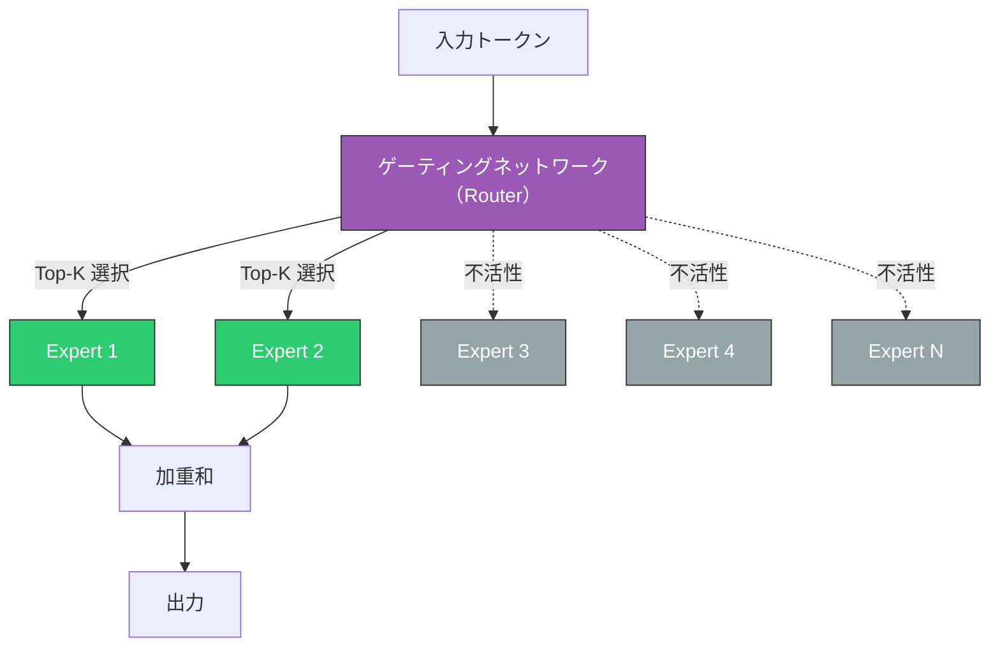

MoE の基本的な仕組みは以下のとおりである。

1. 各 Transformer レイヤーの FFN を $N$ 個の**Expert**（それぞれ独立した FFN）に置き換える
2. **Router**（ゲーティングネットワーク）が各トークンに対して、どの Expert を活性化するかを決定する
3. 一般的には Top-$K$（$K = 1$ or $2$）の Expert のみが活性化され、その出力を重み付きで合算する

Router の出力は以下のように計算される。

$$
G(x) = \text{TopK}(\text{softmax}(xW_g + \epsilon))
$$

ここで $W_g$ は Router の重み行列、$\epsilon$ は負荷分散のためのノイズである。

Mixtral 8x7B は、8個の Expert を持ち各トークンに対して2個の Expert を活性化する MoE モデルである。総パラメータ数は約47Bだが、推論時に活性化されるのは約13B相当であり、密なモデルの13Bと同等の計算コストで47B相当の容量を利用できる。

::: warning MoE の課題
- **負荷の不均衡（Load Imbalance）**: 特定の Expert にトークンが集中し、他の Expert が十分に活用されない問題。補助損失（Auxiliary Loss）で緩和するのが一般的
- **メモリ使用量**: 全 Expert のパラメータを各デバイスに保持する必要があるため、メモリ効率はモデル並列なしでは改善されない
- **通信コスト**: Expert が異なるデバイスに配置される場合、All-to-All 通信が発生する
:::

### 主要モデルのアーキテクチャ比較

| 特徴 | LLaMA 2 (70B) | Mistral 7B | Mixtral 8x7B | GPT-3 (175B) |
|------|---------------|------------|--------------|---------------|
| レイヤー数 | 80 | 32 | 32 | 96 |
| 隠れ層次元 | 8192 | 4096 | 4096 | 12288 |
| ヘッド数 | 64 | 32 | 32 | 96 |
| KV ヘッド数 | 8 (GQA) | 8 (GQA) | 8 (GQA) | 96 (MHA) |
| 位置エンコーディング | RoPE | RoPE | RoPE | 学習可能 |
| 正規化 | Pre-RMSNorm | Pre-RMSNorm | Pre-RMSNorm | Pre-LayerNorm |
| 活性化関数 | SwiGLU | SwiGLU | SwiGLU | GELU |
| コンテキスト長 | 4096 | 32768 | 32768 | 2048 |
| MoE | No | No | Yes (8 Experts) | No |
| 語彙サイズ | 32000 | 32000 | 32000 | 50257 |

## 4. 事前学習（Pre-training）

### 目的関数：次トークン予測

LLM の事前学習の目的関数は、**因果言語モデリング**（Causal Language Modeling, CLM）である。テキスト系列 $x_1, x_2, \ldots, x_T$ に対して、各位置 $t$ で過去のトークンが与えられたときの次のトークンの対数尤度を最大化する。

$$
\mathcal{L}(\theta) = -\sum_{t=1}^{T} \log P_\theta(x_t \mid x_1, x_2, \ldots, x_{t-1})
$$

これは**交差エントロピー損失**と等価であり、モデルの予測分布と真のトークンとの間のKLダイバージェンスを最小化することに対応する。

::: tip なぜ次トークン予測がうまくいくのか
次トークン予測というシンプルな目的関数が多様な能力を獲得できる理由は、言語の持つ統計的構造にある。正確に次のトークンを予測するためには、モデルは文法、意味論、論理的推論、世界知識など、言語に関するあらゆる側面を内部に符号化する必要がある。Ilya Sutskever は「十分に優れた次トークン予測器は、汎用的な知能に近づく」と主張した。
:::

### トークナイゼーション

テキストをモデルに入力する前に、文字列を**トークン**の列に変換する必要がある。現代のLLMでは、**Byte Pair Encoding（BPE）** やその変形が標準的に使われている。

BPE の基本的なアルゴリズムは以下のとおりである。

1. テキストをバイト（または文字）の列として初期化する
2. 隣接するペアの出現頻度を計数する
3. 最も頻繁に出現するペアを新しいトークンとしてマージする
4. 目標の語彙サイズに達するまで 2-3 を繰り返す

```
// BPE example
// Initial: ["l", "o", "w", " ", "l", "o", "w", "e", "r"]
// Step 1: Merge most frequent pair ("l", "o") -> "lo"
//         ["lo", "w", " ", "lo", "w", "e", "r"]
// Step 2: Merge ("lo", "w") -> "low"
//         ["low", " ", "low", "e", "r"]
// Step 3: Merge ("e", "r") -> "er"
//         ["low", " ", "low", "er"]
// ...
```

語彙サイズは一般的に32,000〜128,000程度であり、頻出する単語は1トークンに、稀な単語は複数のサブワードに分割される。この設計により、**開放語彙**（任意の文字列を表現可能）と**効率的な符号化**（頻出パターンを短く表現）のバランスが実現される。

### 学習データ

LLMの性能はデータの質と量に大きく依存する。

#### データソース

典型的な学習データには以下のソースが含まれる。

- **Webクロール**: Common Crawl などの大規模Webデータ（最大のデータ源だがノイズが多い）
- **書籍**: Books3, Project Gutenberg など
- **コード**: GitHub のリポジトリ
- **学術論文**: arXiv, Semantic Scholar
- **Wikipedia**: 高品質な百科事典的知識
- **対話データ**: フォーラム、Q&Aサイト

#### データ処理パイプライン


データの品質管理は LLM の性能に直結する。特に重要なのが以下の処理である。

- **重複排除**（Deduplication）: 同一または類似するドキュメントの除去。重複データは過学習の原因となり、特定のパターンを不当に強化する
- **品質フィルタリング**: パープレキシティベースのフィルタ（学習済みの小規模モデルで品質を推定）、ルールベースのフィルタ（最低文字数、特殊文字の割合など）
- **データミックス**: ドメインごとの比率調整。コードデータの割合を増やすとプログラミング能力が向上するが、自然言語の能力が低下する可能性がある

### スケーリング則（Scaling Laws）

LLMの研究における最も重要な発見のひとつが**スケーリング則**である。Kaplan ら（2020年）は、モデルの性能（テスト損失 $L$）がパラメータ数 $N$、データサイズ $D$、計算量 $C$ のべき乗則に従うことを示した。

$$
L(N) \propto N^{-\alpha_N}, \quad L(D) \propto D^{-\alpha_D}, \quad L(C) \propto C^{-\alpha_C}
$$

ここで $\alpha_N \approx 0.076$、$\alpha_D \approx 0.095$、$\alpha_C \approx 0.050$ である（具体的な値は測定条件により異なる）。

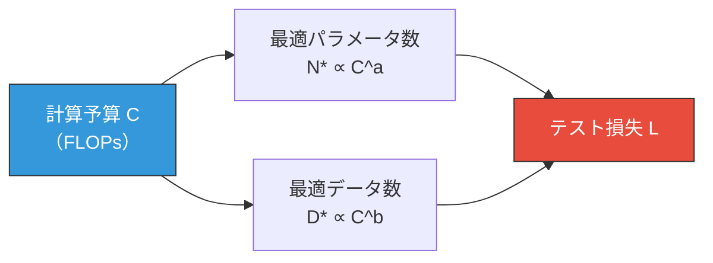

#### Chinchilla 最適スケーリング

Hoffman ら（2022年, Chinchilla論文）は、計算予算 $C$ が与えられたとき、モデルサイズ $N$ とデータサイズ $D$ を**均等にスケーリングすべき**であることを実験的に示した。具体的には以下の関係が最適に近い。

$$
N^* \approx 0.6 \times C^{0.5}, \quad D^* \approx 0.6 \times C^{0.5}
$$

つまり、計算予算が $10$ 倍になった場合、モデルサイズとデータサイズをそれぞれ $\sqrt{10} \approx 3.16$ 倍にするのが最適である。

この知見は実務に大きな影響を与えた。GPT-3（175B パラメータ、300Bトークン）は Chinchilla の基準ではデータが不足しており、同じ計算予算で70Bパラメータ・1.4Tトークンのモデル（Chinchilla）のほうが高性能であることが示された。

::: details スケーリング則の限界
スケーリング則は強力な指針を提供するが、万能ではない。
- 特定のベンチマークでは、スケーリングに従わない「急激な能力の出現」（Emergent Abilities）が観察されることがある
- データの質が変化すると、スケーリング曲線の係数が変わる
- 推論時のコスト（学習時のコストとは独立）は考慮されていない
- 下流タスクの性能とテスト損失の関係は必ずしも単調でない
:::

### 学習の安定化技術

数百〜数千GPUでの大規模学習は、数値的な不安定性との闘いでもある。

#### 混合精度学習（Mixed Precision Training）

学習の高速化とメモリ節約のため、**FP16**（半精度浮動小数点）や**BF16**（bfloat16）を活用する混合精度学習が標準的に使われている。

$$
\text{FP32: } \underbrace{1}_{\text{sign}} \underbrace{8}_{\text{exponent}} \underbrace{23}_{\text{mantissa}} \quad \text{BF16: } \underbrace{1}_{\text{sign}} \underbrace{8}_{\text{exponent}} \underbrace{7}_{\text{mantissa}}
$$

BF16 は FP32 と同じ指数部を持つため表現可能な値の範囲が同等であり、LLM の学習において FP16 より数値的に安定する傾向がある。

混合精度学習の典型的なフローは以下のとおりである。

1. **FP32 のマスターウェイト**を保持する
2. Forward と Backward は BF16 で計算する
3. 勾配を FP32 に変換してオプティマイザの更新を FP32 で行う
4. 更新後の FP32 ウェイトを BF16 にキャストして次のイテレーションへ

#### 勾配クリッピング

勾配爆発を防ぐため、**勾配のグローバルノルムをクリッピング**する。

$$
g \leftarrow g \cdot \min\left(1, \frac{\text{max\_norm}}{\|g\|_2}\right)
$$

一般的には $\text{max\_norm} = 1.0$ が使われることが多い。

#### 学習率スケジュール

LLM の学習では、**コサインスケジュール**に**線形ウォームアップ**を組み合わせた学習率スケジュールが一般的である。

$$
\eta(t) = \begin{cases} \eta_{\text{max}} \cdot \frac{t}{T_{\text{warmup}}} & \text{if } t < T_{\text{warmup}} \\ \eta_{\text{min}} + \frac{1}{2}(\eta_{\text{max}} - \eta_{\text{min}})\left(1 + \cos\left(\frac{t - T_{\text{warmup}}}{T - T_{\text{warmup}}} \pi\right)\right) & \text{otherwise} \end{cases}
$$

ウォームアップ期間は一般的に全学習ステップの0.1〜1%程度である。初期の学習率を低く抑えることで、ランダムに初期化された重みによる大きな勾配が学習を不安定にすることを防ぐ。

## 5. ファインチューニング

事前学習済みモデルを特定のタスクや目的に適応させるプロセスが**ファインチューニング**（Fine-tuning）である。

### Supervised Fine-Tuning（SFT）

SFT は、人間が作成した高品質な（命令, 応答）ペアのデータセットを用いて、モデルを「指示に従う」ように訓練する。

$$
\mathcal{L}_{\text{SFT}} = -\sum_{t=1}^{T} \mathbb{1}[t \in \text{response}] \log P_\theta(x_t \mid x_{<t})
$$

ここで損失はプロンプト部分ではなく、**応答部分のトークンに対してのみ計算される**点に注意する。プロンプトのトークンに対する損失をマスクすることで、モデルは「与えられた指示に対してどのように応答すべきか」を学習する。

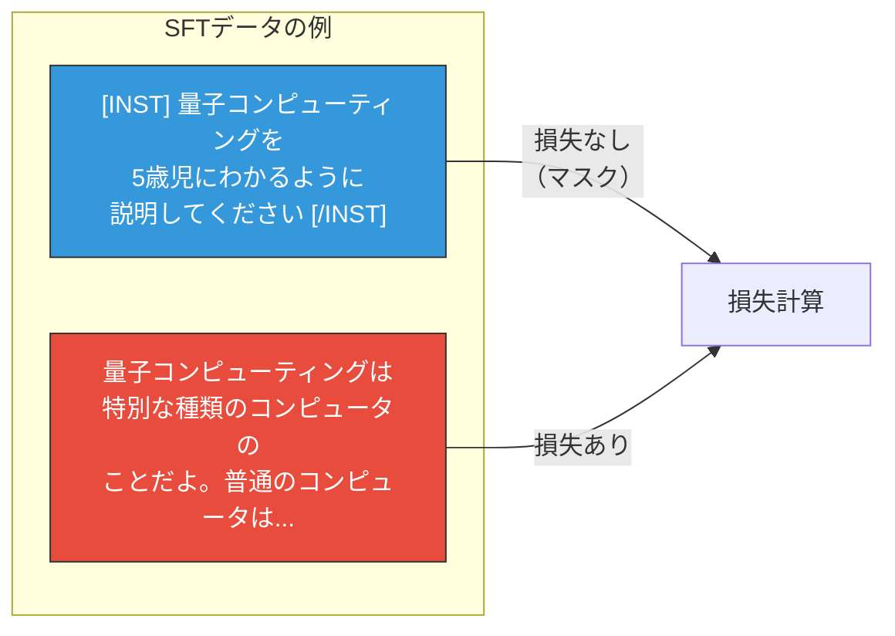

SFT データの品質は量よりも重要である。数千〜数万の高品質なデータでも十分な効果があることが多い（LIMA: Less Is More for Alignment の知見）。

### Parameter-Efficient Fine-Tuning（PEFT）

全パラメータのファインチューニングは計算コストが高く、タスクごとにモデル全体のコピーが必要になる。これに対し、パラメータ効率の良いファインチューニング手法が研究されている。

#### LoRA（Low-Rank Adaptation）

LoRA は、事前学習済みの重み行列を凍結し、低ランクの更新行列を追加する手法である。

重み行列 $W_0 \in \mathbb{R}^{d \times k}$ に対して、以下のように低ランク分解された更新を加える。

$$
W = W_0 + \Delta W = W_0 + BA
$$

ここで $B \in \mathbb{R}^{d \times r}$, $A \in \mathbb{R}^{r \times k}$, $r \ll \min(d, k)$ である。学習するパラメータ数は $r(d + k)$ であり、元の $dk$ に比べて大幅に削減される。

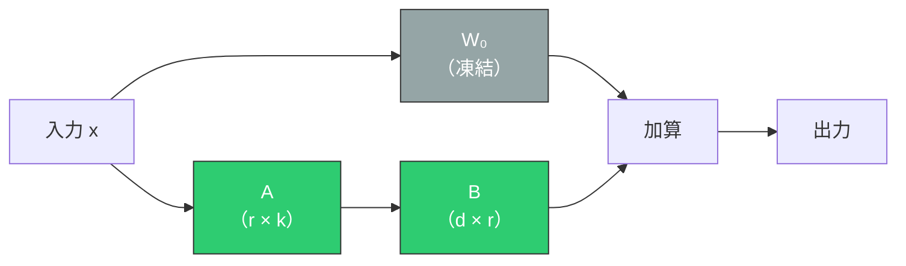

LoRA の設計には以下のハイパーパラメータがある。

- **ランク $r$**: 一般的に 4〜64 程度。大きいほど表現力が増すが、パラメータ数も増加する
- **$\alpha$（スケーリング係数）**: $\Delta W = \frac{\alpha}{r} BA$ のようにスケーリングする。一般的には $\alpha = 2r$ 程度が使われる
- **適用対象**: 一般的に Attention の $W_Q$, $W_V$ に適用するが、$W_K$, $W_O$, FFN にも適用するとさらに性能が向上することがある

::: tip LoRA の利点
- 学習パラメータ数が全パラメータの0.1%〜1%程度で済む
- 推論時に $W_0 + BA$ をマージすれば追加の遅延はゼロ
- タスクごとに小さな LoRA アダプタのみを保存すればよく、ストレージ効率が高い
- 同一の基盤モデルに対して複数のアダプタを動的に切り替えられる
:::

#### QLoRA

QLoRA は LoRA をさらに押し進め、**基盤モデルを4ビットに量子化した状態で LoRA ファインチューニングを行う**手法である。これにより、70B パラメータのモデルでも単一の48GB GPUでファインチューニングが可能になる。

QLoRA の核心的な技術要素は以下のとおりである。

- **4-bit NormalFloat（NF4）**: 正規分布に最適化された4ビット量子化データ型
- **二重量子化**: 量子化定数自体も量子化してメモリを節約
- **ページドオプティマイザ**: GPU メモリが不足した場合に CPU メモリへ自動的にページアウト

## 6. RLHF とアラインメント

事前学習とSFTだけでは、モデルが安全で有益な応答を一貫して生成するとは限らない。**アラインメント**（Alignment）は、モデルの振る舞いを人間の意図や価値観に沿わせるための技術群の総称である。

### RLHF（Reinforcement Learning from Human Feedback）

RLHFは、InstructGPT / ChatGPT の成功の鍵となった手法であり、人間のフィードバックを強化学習のシグナルとして利用する。

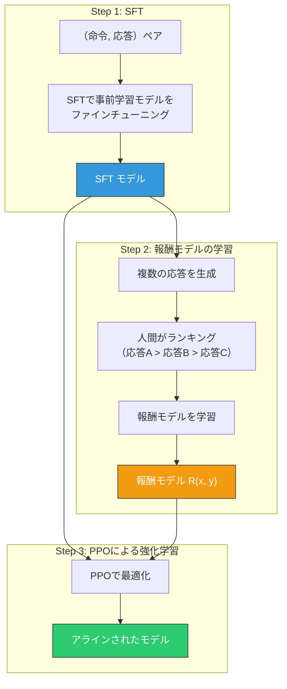

#### Step 1: Supervised Fine-Tuning

前述のSFTにより、モデルを指示に従うように訓練する。

#### Step 2: 報酬モデル（Reward Model）の学習

人間のアノテーターが、同一プロンプトに対する複数の応答をランキングする。このランキングデータを用いて、応答の品質を予測する**報酬モデル** $R_\phi(x, y)$ を学習する。

Bradley-Terryモデルに基づくと、応答 $y_w$（勝ち）が応答 $y_l$（負け）より好まれる確率は以下のように定式化される。

$$
P(y_w \succ y_l \mid x) = \sigma(R_\phi(x, y_w) - R_\phi(x, y_l))
$$

報酬モデルの損失関数は以下のとおりである。

$$
\mathcal{L}_{\text{RM}}(\phi) = -\mathbb{E}_{(x, y_w, y_l) \sim \mathcal{D}} [\log \sigma(R_\phi(x, y_w) - R_\phi(x, y_l))]
$$

#### Step 3: PPO による方策最適化

報酬モデルを報酬信号として、**Proximal Policy Optimization（PPO）**により言語モデルの方策 $\pi_\theta$ を最適化する。最適化の目的関数は以下のとおりである。

$$
\max_\theta \mathbb{E}_{x \sim \mathcal{D}, y \sim \pi_\theta(y|x)} \left[ R_\phi(x, y) - \beta \cdot \text{KL}(\pi_\theta(y|x) \| \pi_{\text{ref}}(y|x)) \right]
$$

ここで $\pi_{\text{ref}}$ は SFT モデル（参照方策）であり、$\beta$ は KL ペナルティの強さを制御するハイパーパラメータである。KL ペナルティは、学習されたモデルが参照方策から過度に逸脱すること（**報酬ハッキング**：報酬モデルの弱点を突いて高スコアを得る不自然な応答を生成すること）を防ぐ役割を果たす。

### DPO（Direct Preference Optimization）

RLHFは強力だが、**報酬モデルの学習 → PPOによる強化学習**という2段階のパイプラインが複雑であり、PPOの学習は不安定になりやすい。DPO は、報酬モデルを明示的に学習せず、**選好データから直接方策を最適化する**手法である。

DPO の核心的な洞察は、RLHF の最適方策が報酬関数と参照方策から解析的に導出できるという点にある。

$$
\pi^*(y|x) = \frac{1}{Z(x)} \pi_{\text{ref}}(y|x) \exp\left(\frac{1}{\beta} R(x, y)\right)
$$

この関係を逆に解くと、暗黙の報酬は以下のように表される。

$$
R(x, y) = \beta \log \frac{\pi_\theta(y|x)}{\pi_{\text{ref}}(y|x)} + \beta \log Z(x)
$$

これを Bradley-Terry モデルに代入すると、$Z(x)$ がキャンセルされ、以下の損失関数が得られる。

$$
\mathcal{L}_{\text{DPO}}(\theta) = -\mathbb{E}_{(x, y_w, y_l)} \left[\log \sigma\left(\beta \log \frac{\pi_\theta(y_w|x)}{\pi_{\text{ref}}(y_w|x)} - \beta \log \frac{\pi_\theta(y_l|x)}{\pi_{\text{ref}}(y_l|x)}\right)\right]
$$

DPO は報酬モデルの学習も PPO も不要で、通常の教師あり学習と同様のパイプラインで最適化できるため、実装が大幅にシンプルになる。

::: details RLHF vs DPO の比較

| 特性 | RLHF (PPO) | DPO |
|------|-----------|-----|
| 報酬モデル | 必要 | 不要（暗黙的） |
| 学習の安定性 | PPOの調整が困難 | 比較的安定 |
| 実装の複雑さ | 高い（3段階パイプライン） | 低い（SFT + DPO） |
| 計算コスト | 高い（複数モデルの同時保持） | 中程度 |
| オンライン学習 | 可能（新しい応答を生成して評価） | オフラインが基本 |
| 報酬のオーバーフィッティング | 報酬ハッキングのリスク | 暗黙の報酬が制約される |

:::

### Constitutional AI（CAI）

Anthropic が提案した Constitutional AI は、人間のフィードバックの代わりに**AI自身のフィードバック**（AI Feedback, AIF）を活用するアプローチである。

1. モデルに一連の「原則」（Constitution）を与える
2. モデル自身が生成した応答を、その原則に基づいて自己批評・修正する
3. 修正された応答を用いて SFT と RLAIF（RL from AI Feedback）を行う

この手法により、大量の人間アノテーターへの依存を減らしつつ、原則に一貫したアラインメントを実現できる。

## 7. 推論の効率化

学習済みモデルの推論を効率化することは、LLM の実用化において極めて重要である。

### KV Cache

自己回帰的な生成では、各ステップで過去のすべてのトークンに対する Key と Value を再計算する必要がある。KV Cache は、過去のステップで計算された K, V をキャッシュすることで、この冗長な計算を排除する。

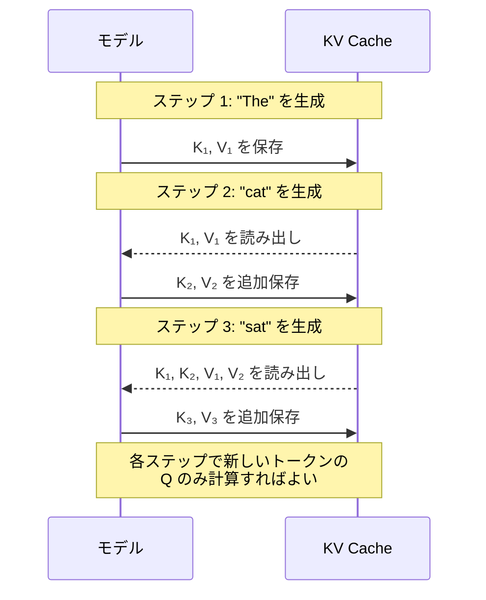

KV Cache のメモリ使用量は以下のように計算される。

$$
\text{KV Cache Memory} = 2 \times L \times n_{\text{kv\_heads}} \times d_{\text{head}} \times s \times b_{\text{dtype}}
$$

ここで $L$ はレイヤー数、$n_{\text{kv\_heads}}$ は KV ヘッド数、$d_{\text{head}}$ はヘッドの次元、$s$ はシーケンス長、$b_{\text{dtype}}$ はデータ型のバイト数である。たとえば LLaMA 2 70B（$L=80, n_{\text{kv\_heads}}=8, d_{\text{head}}=128$）で BF16 を使用し、シーケンス長 4096 の場合、KV Cache のサイズは約1.3GBとなる。バッチサイズを増やすとこれがバッチ数倍になるため、長いコンテキストや大バッチでは KV Cache が推論のメモリボトルネックになる。

### 量子化（Quantization）

モデルの重みを低ビット精度で表現することで、メモリ使用量と推論速度を改善する。

#### 量子化の種類

| 手法 | ビット数 | 精度劣化 | 速度改善 | メモリ削減 |
|------|---------|---------|---------|----------|
| FP32 | 32 | なし（ベースライン） | 1x | 1x |
| BF16/FP16 | 16 | 微小 | 約2x | 2x |
| INT8 | 8 | 小 | 約2-3x | 4x |
| INT4 (GPTQ/AWQ) | 4 | 中程度 | 約3-4x | 8x |
| GGUF (Q4_K_M等) | 4-6混合 | 小〜中 | 約3x | 5-6x |

#### GPTQ と AWQ

**GPTQ**（GPT-Quantized）は、学習後量子化（Post-Training Quantization）の手法で、少量のキャリブレーションデータを用いて各重み列を最適に量子化する。Optimal Brain Quantization（OBQ）に基づき、量子化誤差を他の重みで補償する。

**AWQ**（Activation-aware Weight Quantization）は、活性化の大きさに基づいて重要な重みチャネルを特定し、それらのチャネルをより高い精度で保持する手法である。すべての重みを均一に量子化するのではなく、モデルの出力に大きな影響を与える重みを優先的に保護する。

### FlashAttention

標準的な Self-Attention の実装では、$QK^T$ の結果として $O(n^2)$ の中間行列（Attention スコア行列）を GPU のHBM（High Bandwidth Memory）に書き出す。シーケンス長が長くなると、このメモリの読み書きがボトルネックになる。

**FlashAttention** は、**タイリング**（tiling）と **オンライン softmax** の技法を用いて、Attention の計算を SRAM（オンチップメモリ）内で完結させることで、HBM へのアクセスを大幅に削減する。

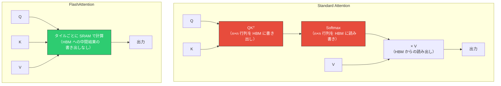

FlashAttention の主な利点は以下のとおりである。

- **メモリ使用量**: $O(n^2)$ → $O(n)$（中間行列を保持しない）
- **速度**: 壁時計時間で2〜4倍の高速化（メモリ帯域がボトルネックの場合）
- **完全に正確**: 近似ではなく、数学的に同一の結果を返す

### スペキュレーティブデコーディング（Speculative Decoding）

自己回帰的な生成は本質的に逐次的であり、各トークンの生成に大規模モデルのフルフォワードパスが必要である。スペキュレーティブデコーディングは、**小型のドラフトモデル**を用いて複数のトークンを投機的に生成し、**大型の検証モデル**で一括検証することで、スループットを向上させる。

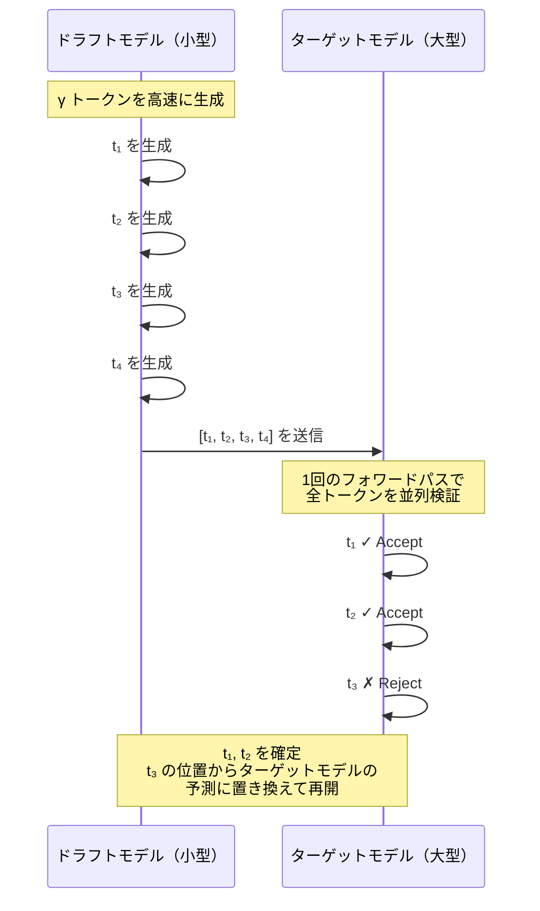

ドラフトモデルの予測がターゲットモデルと一致する確率を $\alpha$ とすると、$\gamma$ トークン分の投機生成において、期待される受理トークン数は以下のとおりである。

$$
\mathbb{E}[\text{accepted tokens}] = \frac{1 - \alpha^{\gamma+1}}{1 - \alpha}
$$

$\alpha$ が高いほど（ドラフトモデルの品質が高いほど）、スペキュレーティブデコーディングの効果は大きくなる。一般的に 2〜3 倍のスループット改善が報告されている。

重要な性質として、適切な受理・棄却のスキーム（修正された棄却サンプリング）を用いると、**出力分布はターゲットモデルのみを使った場合と完全に一致する**。つまり、品質を一切犠牲にせずに速度を向上できる。

### Continuous Batching

従来の静的バッチ処理では、バッチ内の全リクエストが完了するまで、早く終わったリクエストもGPUリソースを占有し続ける。**Continuous Batching**（動的バッチング）は、リクエストの完了・追加を動的に管理することで、GPUの利用効率を大幅に向上させる。

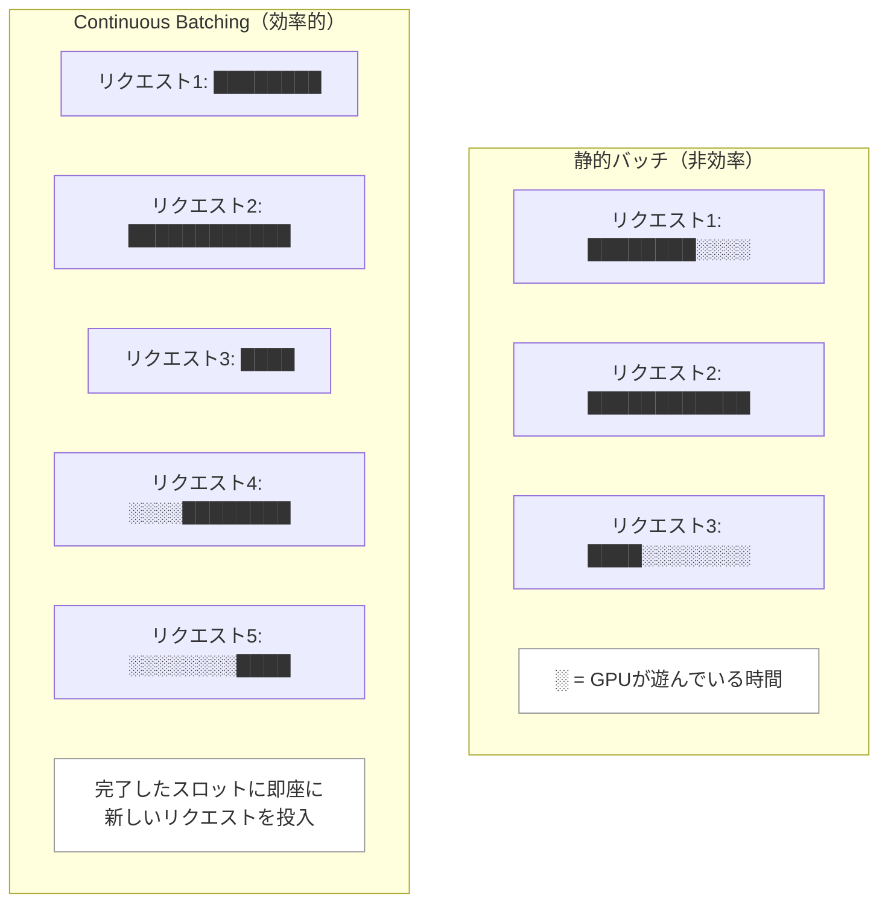

vLLM や TensorRT-LLM などの推論フレームワークでは、Continuous Batching が標準的に実装されている。

### PagedAttention

vLLM が導入した **PagedAttention** は、KV Cache のメモリ管理をOSの仮想メモリのページング機構にならって設計したものである。

従来の KV Cache 管理では、各リクエストに対して最大シーケンス長分のメモリを事前に確保する必要があり、実際の使用量との差がメモリの無駄（内部フラグメンテーション）を生む。PagedAttention では、KV Cache を固定サイズの**ブロック**（ページ）に分割し、必要に応じて動的に割り当てる。

これにより以下の利点が得られる。

- **メモリの無駄を削減**: フラグメンテーションが大幅に減少する
- **より多くのリクエストを同時処理**: メモリ効率の向上によりバッチサイズを増やせる
- **プレフィックス共有**: 共通のプロンプトを持つリクエスト間で KV Cache のページを共有できる

## 8. 長いコンテキストへの対応

LLM のコンテキスト長を拡張することは、実用上きわめて重要な課題である。

### コンテキスト長の制約

Self-Attention の計算量とメモリ使用量はシーケンス長 $n$ の2乗に比例する。

$$
\text{計算量} = O(n^2 \cdot d), \quad \text{メモリ} = O(n^2)
$$

128K〜1Mトークンのコンテキストを扱うためには、この2乗のコストをどう管理するかが核心的な課題となる。

### コンテキスト長の外挿手法

#### RoPEのスケーリング

RoPE ベースのモデルでは、学習時のコンテキスト長を超える入力に対して、周波数のスケーリングにより対応できる。

- **Position Interpolation**: 位置インデックスを $\frac{L_{\text{train}}}{L_{\text{target}}}$ 倍にスケールダウンする。つまり、すべての位置を学習時の範囲に「圧縮」する
- **NTK-aware Scaling**: 低周波成分は外挿し、高周波成分は内挿する。RoPEの基底周波数 $\theta$ を拡大することで実現する
- **YaRN**: NTK-aware Scaling に温度スケーリングとアテンションスケーリングを追加し、外挿性能をさらに改善する

#### Sliding Window Attention

Mistral が採用した手法で、各トークンが固定幅のウィンドウ $W$ 内のトークンのみに注意を向ける。計算量は $O(nW)$ に削減されるが、複数レイヤーを通じて情報が伝搬するため、実効的な受容野はウィンドウサイズの $L$ 倍（$L$ はレイヤー数）に達する。

### Ring Attention

超長いコンテキストを複数のデバイスで分散処理するための手法である。シーケンスをブロックに分割して各デバイスに配置し、KV ブロックをリング状に送受信しながら Attention を計算する。これにより、シーケンス長を事実上デバイス数に比例して拡張できる。

## 9. 今後の展望と課題

### 推論時間スケーリング（Inference-Time Scaling）

従来のスケーリング則は学習時の計算量に焦点を当てていたが、**推論時にも計算量をスケールさせる**ことでモデルの性能を向上させるアプローチが注目されている。OpenAI の o1 や o3 モデルは、Chain-of-Thought（CoT）推論を長く行うことで、数学やコーディングなどの問題で大幅な性能向上を示した。

### マルチモーダルLLM

テキストだけでなく、画像、音声、動画などの複数のモダリティを統合的に扱う LLM の研究が急速に進んでいる。GPT-4V、Gemini、Claude のビジョン機能はその代表例である。視覚情報をトークン列として言語モデルに統合する手法が主流であり、ViT（Vision Transformer）で画像を埋め込み、プロジェクション層を通じて言語モデルのトークン空間にマッピングするアプローチが多い。

### エージェントとツール使用

LLM をツール呼び出し、コード実行、Web検索などの外部システムと統合する**エージェント**の研究が活発化している。モデルが自律的に計画を立て、複数のツールを組み合わせてタスクを遂行する能力は、LLM の適用範囲を大幅に拡大する。

### 未解決の課題

- **ハルシネーション**: モデルが事実と異なる情報を自信を持って生成する問題。根本的な解決策は未だ見つかっていない
- **推論能力の限界**: LLM の「推論」が、真の論理的推論なのか、それともパターンマッチングの高度な形態なのかという議論が続いている
- **評価の困難さ**: LLM の能力を正確に評価するベンチマークの設計が難しく、コンタミネーション（学習データへのベンチマークの混入）の問題も深刻である
- **エネルギー効率**: 学習と推論の両方で膨大なエネルギーを消費する。計算効率の改善は環境的にも経済的にも重要な課題である
- **データの枯渇**: Webから利用可能な高品質テキストデータには限りがある。合成データ（Synthetic Data）の活用が解決策のひとつとして模索されている

## 10. まとめ

大規模言語モデルは、Transformer アーキテクチャの大規模化、大量データでの事前学習、人間の選好に基づくアラインメントという3つの柱の上に成り立っている。

本記事で解説した技術要素を整理すると以下のようになる。

| フェーズ | 主要技術 | 目的 |
|---------|---------|------|
| アーキテクチャ | Decoder-Only, RoPE, GQA, SwiGLU, RMSNorm, MoE | 効率的でスケーラブルなモデル構造 |
| 事前学習 | 次トークン予測, BPE, スケーリング則, 混合精度学習 | 汎用的な言語知識の獲得 |
| ファインチューニング | SFT, LoRA, QLoRA | タスク特化とパラメータ効率 |
| アラインメント | RLHF, DPO, Constitutional AI | 安全性と有益性の確保 |
| 推論効率化 | KV Cache, 量子化, FlashAttention, Speculative Decoding | 実用的な速度とコスト |
| コンテキスト拡張 | RoPEスケーリング, Sliding Window, Ring Attention | 長い入力への対応 |

LLMの進化は依然として急速であり、アーキテクチャ、学習手法、推論効率化のすべての面で新しい手法が次々と提案されている。しかし、その根底にある原理——Transformerの Self-Attention、自己回帰的な言語モデリング、スケーリングによる能力の創発——は比較的安定しており、本記事で解説した基盤的な知識は、今後の発展を理解するための確かな土台となるだろう。
