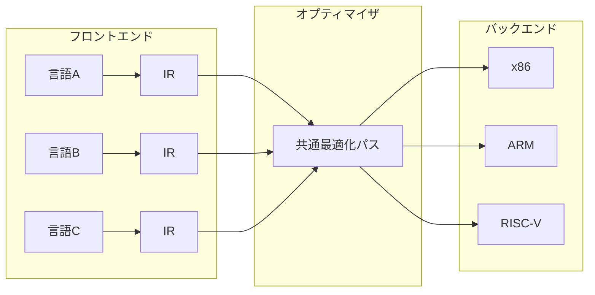
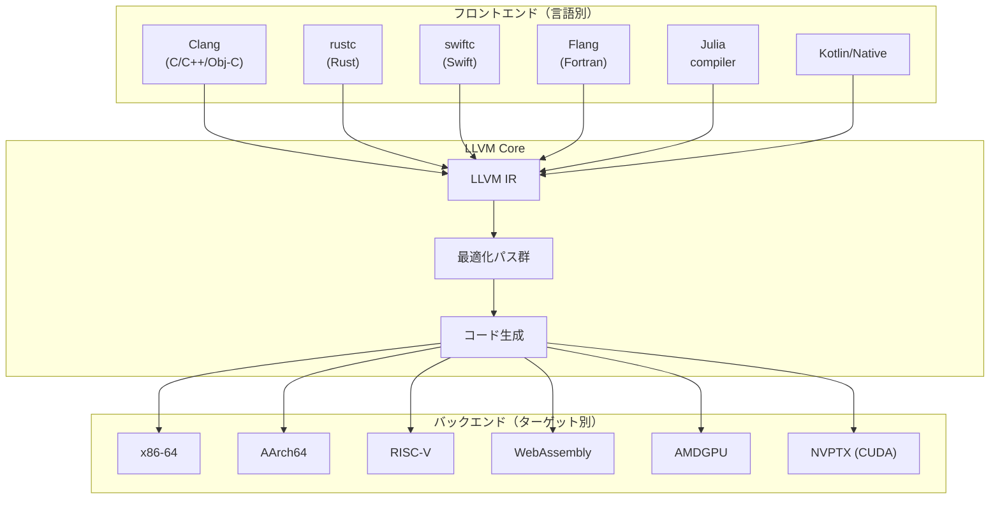
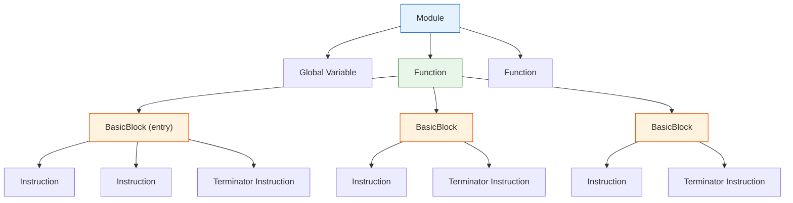
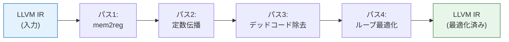
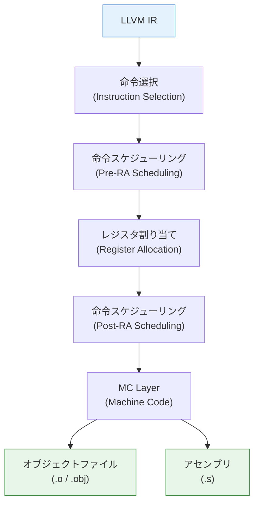
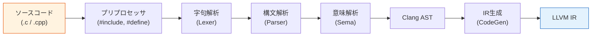
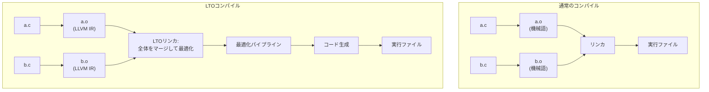
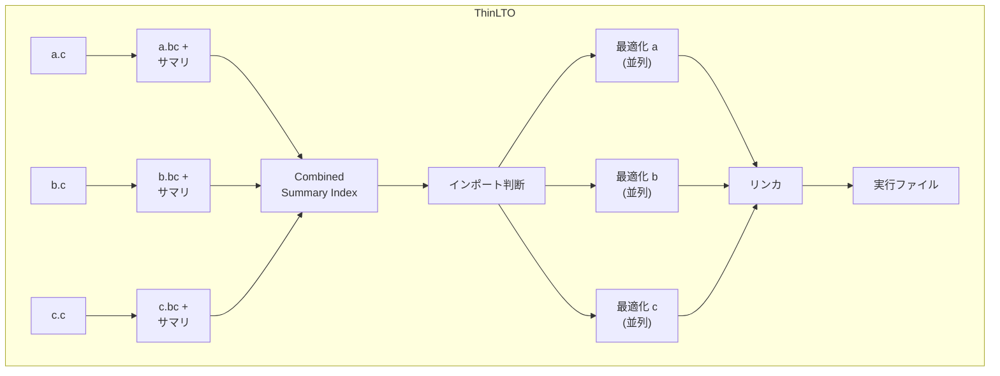
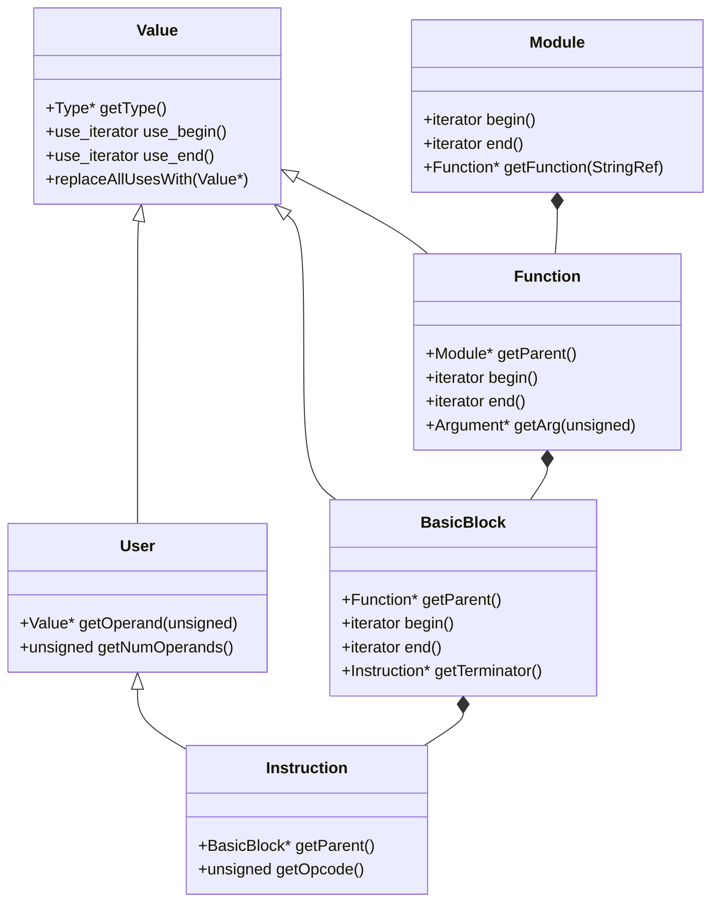
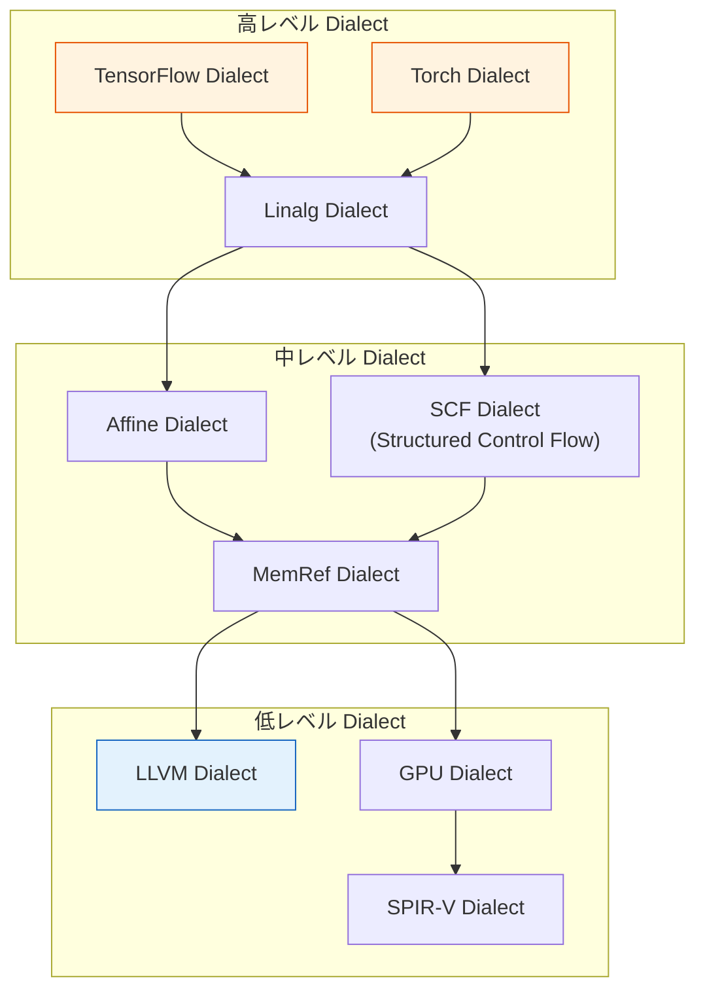

# LLVMアーキテクチャ

## 1. 背景と動機：なぜLLVMが生まれたか

### 1.1 従来のコンパイラの課題

コンパイラの歴史を振り返ると、長らく各言語・各ターゲットごとに独立したコンパイラが開発されてきた。C言語にはGCC、JavaにはjavacとHotSpot、Fortranには専用のコンパイラ——という具合である。この「言語ごと・ターゲットごとに独立」というモデルには、根本的な問題がある。

$M$ 種類のプログラミング言語と $N$ 種類のターゲットアーキテクチャを考えたとき、素朴に実装すれば $M \times N$ 個のコンパイラが必要になる。

```
言語A ──→ ターゲット1 用コンパイラ
言語A ──→ ターゲット2 用コンパイラ
言語B ──→ ターゲット1 用コンパイラ
言語B ──→ ターゲット2 用コンパイラ
  ...          ...
```

この組み合わせ爆発に加えて、もう一つの深刻な問題がある。**最適化の再利用ができない**ことである。定数畳み込み、デッドコード除去、ループ最適化——これらの変換は本来、言語やターゲットに依存しない汎用的な処理であるにもかかわらず、各コンパイラで個別に実装されていた。

### 1.2 三段階コンパイラの理想

この問題に対する古典的な解決策は、コンパイラを**フロントエンド**・**オプティマイザ**・**バックエンド**の三段階に分離し、それらの間を共通の**中間表現（Intermediate Representation, IR）**で接続するという設計である。



この設計により、$M + N$ 個のコンポーネントだけで $M \times N$ の組み合わせをカバーできる。新しい言語を追加するにはフロントエンドを書くだけで済み、新しいターゲットに対応するにはバックエンドを追加すればよい。最適化パスは全言語・全ターゲットで共有される。

しかし、この理想は長い間、理想のままだった。GCCは名目上この三段階構造を採用していたが、実際にはフロントエンド・ミドルエンド・バックエンドの間に強い結合があり、各フェーズの中間表現は統一されておらず、独立したコンポーネントとして再利用することが困難だった。

### 1.3 LLVMの誕生

**LLVM（Low Level Virtual Machine）**は、2000年にイリノイ大学アーバナ・シャンペーン校の **Chris Lattner** が修士課程の研究プロジェクトとして開始したものである。指導教員は **Vikram Adve** であった。Lattnerの目標は、三段階コンパイラの理想を**現実のものとする**ことだった。

::: tip LLVMの名称
LLVMはもともと「Low Level Virtual Machine」の頭字語であったが、プロジェクトの範囲が仮想マシンをはるかに超えて拡大したため、現在では頭字語としての意味は持たず、**LLVM**それ自体が固有名詞として使われている。公式にも「The name "LLVM" itself is not an acronym; it is the full name of the project.」と明記されている。
:::

LLVMが従来のコンパイラ基盤と一線を画した点は以下の通りである。

1. **明確に定義された中間表現（LLVM IR）**: 型付き、SSA形式の中間言語が、プロジェクト全体の基盤として厳密に仕様化されている
2. **ライブラリとしてのモジュール設計**: コンパイラの各機能が独立したライブラリとして実装され、任意に組み合わせて利用できる
3. **寛容なライセンス**: 当初はイリノイ大学ライセンス（BSD系）、2019年からはApache License 2.0 with LLVM Exceptionsを採用し、商用利用が容易

2005年、LattnerはAppleに入社し、LLVMはAppleの強力な支援を受けてmacOSとiOSのデフォルトコンパイラ基盤となった。同時期にLattnerが設計した **Clang**（C/C++/Objective-Cフロントエンド）がGCCの代替として急速に普及し、LLVMのエコシステムを一気に拡大させた。

### 1.4 現在のLLVMエコシステム

現在のLLVMは、単一のコンパイラではなく、**コンパイラ基盤（compiler infrastructure）**として幅広く利用されている。



Rust、Swift、Julia、Kotlin/Native、Zig、Haskell（GHCのバックエンド）など、多数の現代的なプログラミング言語がLLVMをバックエンドとして採用している。GPUコンパイラ（AMD、NVIDIAのCUDA）やWebAssemblyのツールチェーンもLLVM上に構築されている。

## 2. LLVM IRの設計

LLVM IRは、LLVMアーキテクチャの心臓部であり、プロジェクト全体の設計を規定する最も重要な要素である。

### 2.1 三つの等価な表現形式

LLVM IRには三つの等価な表現形式がある。

| 形式 | 用途 | 特徴 |
|------|------|------|
| **テキスト形式（.ll）** | 人間が読み書きする | アセンブリ言語に似た表記 |
| **ビットコード形式（.bc）** | 効率的な保存・転送 | 密なバイナリ表現 |
| **インメモリ表現** | コンパイラ内部処理 | C++ APIで操作するオブジェクト群 |

三つの形式は完全に等価であり、相互に損失なく変換できる。これはLLVM IRの重要な設計上の特徴である。

```bash
# C source -> LLVM IR (text)
clang -emit-llvm -S -o example.ll example.c

# LLVM IR (text) -> bitcode
llvm-as example.ll -o example.bc

# bitcode -> LLVM IR (text)
llvm-dis example.bc -o example.ll
```

### 2.2 LLVM IRの基本構造

LLVM IRはモジュール・関数・基本ブロック・命令という階層構造を持つ。



- **Module**: コンパイル単位。グローバル変数、関数、メタデータを含む
- **Function**: 関数定義。引数リストと基本ブロックの列で構成される
- **BasicBlock**: 基本ブロック。命令の直線的な列で、最後は必ず分岐・リターン等の**ターミネータ命令**で終わる。制御フローの入口は先頭のみ、出口はターミネータのみ
- **Instruction**: 個々の命令。演算、メモリアクセス、型変換など

以下は具体的なLLVM IRの例である。簡単なC言語の関数をIRに変換したものを示す。

::: code-group
```c [C source]
int add(int a, int b) {
    return a + b;
}

int main() {
    int result = add(3, 4);
    return result;
}
```

```llvm [LLVM IR]
; Module-level information
define i32 @add(i32 %a, i32 %b) {
entry:
  %sum = add i32 %a, %b
  ret i32 %sum
}

define i32 @main() {
entry:
  %result = call i32 @add(i32 3, i32 4)
  ret i32 %result
}
```
:::

### 2.3 SSA形式

LLVM IRは**静的単一代入（Static Single Assignment, SSA）形式**を採用している。SSA形式では、すべての変数（レジスタ）は**一度だけ定義**される。これはコンパイラの最適化にとって極めて重要な性質である。

SSAの基本規則は以下の通りである。

1. 各変数は正確に一度だけ定義される
2. 各使用は正確に一つの定義に対応する
3. 制御フローの合流点では**phi命令**を使って値を選択する

::: code-group
```c [C source]
int abs_val(int x) {
    int result;
    if (x >= 0) {
        result = x;
    } else {
        result = -x;
    }
    return result;
}
```

```llvm [LLVM IR (SSA)]
define i32 @abs_val(i32 %x) {
entry:
  %cmp = icmp sge i32 %x, 0
  br i1 %cmp, label %if.then, label %if.else

if.then:
  br label %if.end

if.else:
  %neg = sub i32 0, %x
  br label %if.end

if.end:
  ; phi selects value based on predecessor block
  %result = phi i32 [ %x, %if.then ], [ %neg, %if.else ]
  ret i32 %result
}
```
:::

`phi`命令は「どの基本ブロックから来たかに応じて、対応する値を選択する」擬似命令である。上の例では、`%if.then`から来た場合は`%x`を、`%if.else`から来た場合は`%neg`を`%result`として選択する。

::: warning SSA形式とphi命令
SSA形式が最適化にとって有用な理由は、**定義-使用（def-use）の関係が自明になる**ことにある。通常のコードでは変数が何度も再代入されるため、ある時点でどの代入が「生きている」かを解析する必要がある。SSA形式ではこの問題が構造的に解消される。phi命令は実際のハードウェア命令には対応せず、レジスタ割り当ての際に除去される。
:::

### 2.4 型システム

LLVM IRは強い静的型付けを持つ。これはソースレベルの型システムとは異なり、低レベルのデータレイアウトを正確に記述するためのものである。

主要な型を以下にまとめる。

| カテゴリ | 型 | 例 |
|----------|-----|-----|
| 整数型 | `iN` (任意のビット幅) | `i1`, `i8`, `i32`, `i64`, `i128` |
| 浮動小数点型 | `float`, `double`, `half`, `fp128` | `float`, `double` |
| ポインタ型 | `ptr` (LLVM 15以降、不透明ポインタ) | `ptr` |
| ベクトル型 | `<N x T>` | `<4 x float>`, `<8 x i32>` |
| 配列型 | `[N x T]` | `[10 x i32]`, `[3 x [4 x float]]` |
| 構造体型 | `{ T1, T2, ... }` | `{ i32, float, ptr }` |
| 関数型 | `T (T1, T2, ...)` | `i32 (i32, i32)` |
| void型 | `void` | 戻り値なしを表す |

> [!NOTE]
> LLVM 15以降では、従来の型付きポインタ（`i32*`, `%struct.foo*`など）から**不透明ポインタ（opaque pointer, `ptr`）**への移行が完了した。これにより、ポインタ型は「何を指しているか」の型情報を持たなくなり、ロード・ストア命令側で操作対象の型を指定する方式になった。この変更は、ポインタのビットキャストが事実上noop（無操作）であること、GEP命令が既にソース要素型を持っていたことなどから、型付きポインタが実質的に冗長であったために行われた。

### 2.5 主要な命令カテゴリ

LLVM IRの命令は、RISC風の設計に基づいて以下のカテゴリに分類される。

**算術・論理演算命令:**

```llvm
%a = add i32 %x, %y          ; addition
%b = sub i32 %x, %y          ; subtraction
%c = mul i32 %x, %y          ; multiplication
%d = sdiv i32 %x, %y         ; signed division
%e = and i32 %x, %y          ; bitwise AND
%f = or i32 %x, %y           ; bitwise OR
%g = xor i32 %x, %y          ; bitwise XOR
%h = shl i32 %x, 2           ; shift left
%i = fadd float %p, %q       ; floating-point add
```

**メモリ操作命令:**

```llvm
%ptr = alloca i32             ; stack allocation
store i32 42, ptr %ptr        ; store value to memory
%val = load i32, ptr %ptr     ; load value from memory
%elem = getelementptr i32, ptr %arr, i64 5  ; address calculation
```

`getelementptr`（GEP）命令は、構造体のフィールドや配列の要素のアドレスを計算する。ポインタ演算の安全性を保つうえで極めて重要な命令であり、LLVM IR独特の設計である。GEP自体はメモリアクセスを行わず、アドレスの計算のみを行う。

**制御フロー命令（ターミネータ）:**

```llvm
br i1 %cond, label %true, label %false  ; conditional branch
br label %next                            ; unconditional branch
ret i32 %val                              ; return
switch i32 %val, label %default [         ; switch
  i32 0, label %case0
  i32 1, label %case1
]
unreachable                               ; undefined behavior marker
```

**変換命令:**

```llvm
%a = trunc i64 %x to i32       ; truncation
%b = zext i32 %x to i64        ; zero extension
%c = sext i32 %x to i64        ; sign extension
%d = fptoui float %x to i32    ; float to unsigned int
%e = sitofp i32 %x to float    ; signed int to float
%f = bitcast <4 x i8> %x to i32  ; bitwise reinterpretation
%g = ptrtoint ptr %p to i64    ; pointer to integer
%h = inttoptr i64 %n to ptr    ; integer to pointer
```

## 3. パスマネージャと最適化パイプライン

### 3.1 パスの概念

LLVMの最適化は、**パス（pass）**と呼ばれる独立した変換単位で構成される。各パスは特定の最適化や解析を担当し、LLVM IRを入力として受け取り、変換された（あるいは解析結果を付加された）IRを出力する。



パスは以下のように分類される。

| パスの種類 | 操作対象 | 説明 | 例 |
|------------|----------|------|----|
| **Module Pass** | Module全体 | グローバルな変換・解析 | 未使用グローバル変数除去, インターナライズ |
| **Function Pass** | 個々のFunction | 関数単位の変換 | mem2reg, SROA, ループ最適化 |
| **Loop Pass** | 個々のLoop | ループ構造に特化した変換 | ループアンローリング, LICM |
| **Analysis Pass** | 各種 | 情報を計算するが変換しない | Dominator Tree, Alias Analysis |

### 3.2 レガシーパスマネージャと新パスマネージャ

LLVMのパスマネージャは歴史的に二つのバージョンが存在する。

**レガシーパスマネージャ（Legacy Pass Manager）:**

LLVMの初期から使われていた仕組みで、パス間の依存関係を自動的に管理する。各パスは`getAnalysisUsage`メソッドで必要な解析パスを宣言し、パスマネージャがそれらの実行順序を自動的に決定する。しかし、解析結果のキャッシュ管理が粗粒度で、不要な再計算が発生しやすいという問題があった。

**新パスマネージャ（New Pass Manager, NPM）:**

LLVM 13でデフォルトとなった新しいパスマネージャは、解析結果の管理を**AnalysisManager**に委譲し、細粒度のキャッシュ制御を実現する。パスの依存関係が明示的になり、パイプラインの構築が柔軟になった。

```cpp
// New Pass Manager API example
FunctionPassManager FPM;
FPM.addPass(SimplifyCFGPass());
FPM.addPass(SROAPass());
FPM.addPass(EarlyCSEPass());
FPM.addPass(InstCombinePass());

ModulePassManager MPM;
MPM.addPass(createModuleToFunctionPassAdaptor(std::move(FPM)));
MPM.addPass(GlobalDCEPass());

// Run the pipeline
MPM.run(Module, MAM);
```

### 3.3 主要な最適化パス

LLVMには数百の最適化パスが含まれているが、特に重要なものを紹介する。

**mem2reg（Promote Memory to Register）:**

`alloca`命令で確保されたスタックメモリを、SSAレジスタに変換する。フロントエンドは変数を単純に`alloca`として生成すればよく、SSA形式への変換はmem2regが担当する。これにより、フロントエンドの実装が大幅に簡素化される。

::: code-group
```llvm [Before mem2reg]
define i32 @example(i32 %x) {
  %tmp = alloca i32
  store i32 %x, ptr %tmp
  %val = load i32, ptr %tmp
  %result = add i32 %val, 1
  ret i32 %result
}
```

```llvm [After mem2reg]
define i32 @example(i32 %x) {
  %result = add i32 %x, 1
  ret i32 %result
}
```
:::

**SROA（Scalar Replacement of Aggregates）:**

構造体や配列を個々のスカラー変数に分解する。mem2regの上位互換とも言える最適化で、集約型のデータをレジスタに載せることができる。

**InstCombine（Instruction Combining）:**

パターンマッチングにより、複数の命令を等価だがより効率的な命令列に置き換える。1,000以上のパターンが実装されている。

```llvm
; Before: x * 2
%r = mul i32 %x, 2
; After: x << 1 (shift is cheaper than multiplication)
%r = shl i32 %x, 1
```

**GVN（Global Value Numbering）:**

同じ値を計算する冗長な式を特定し、一つに統合する。

**LICM（Loop Invariant Code Motion）:**

ループ内で不変な計算をループの外に移動する。

```llvm
; Before
loop:
  %len = call i64 @strlen(ptr %s)  ; invariant!
  ...
  br i1 %cond, label %loop, label %exit

; After
preheader:
  %len = call i64 @strlen(ptr %s)  ; hoisted out
  br label %loop
loop:
  ...
  br i1 %cond, label %loop, label %exit
```

**ループアンローリング（Loop Unrolling）:**

ループの反復をコピーして展開し、ループのオーバーヘッド（分岐、カウンタ更新）を削減する。

**インライン化（Inlining）:**

関数呼び出しを、呼び出し先の関数本体で置き換える。関数呼び出しのオーバーヘッドを除去するだけでなく、インライン化によって他の最適化（定数伝播、デッドコード除去など）の機会が生まれるため、コンパイラ最適化の中で最も効果が高いパスの一つである。

### 3.4 最適化レベル

`clang`や`opt`で指定する最適化レベルは、実行するパスの組み合わせと各パスのパラメータを制御する。

| レベル | 説明 | パスの方針 |
|--------|------|------------|
| `-O0` | 最適化なし | デバッグ用。ほぼ変換しない |
| `-O1` | 軽い最適化 | コンパイル時間を抑えつつ基本的な最適化を実行 |
| `-O2` | 標準的な最適化 | 多くの最適化パスを実行。一般的な選択肢 |
| `-O3` | 積極的な最適化 | ループアンローリング拡大、ベクトル化等を追加 |
| `-Os` | サイズ最適化 | コードサイズを最小化。インライン化を控えめに |
| `-Oz` | 極限のサイズ最適化 | `-Os`よりもさらにサイズを優先 |

## 4. バックエンド：コード生成パイプライン

LLVMのバックエンドは、ターゲット非依存のLLVM IRを、特定のハードウェアアーキテクチャ向けの機械語に変換する。このプロセスは複数の段階を経て行われる。

### 4.1 コード生成の全体像



### 4.2 SelectionDAGによる命令選択

命令選択は、LLVM IRの命令をターゲット固有の機械命令に変換するプロセスである。LLVMでは**SelectionDAG**（選択DAG）と呼ばれる有向非巡回グラフを用いてこの変換を行う。

SelectionDAGでの命令選択は以下の段階で進行する。

1. **DAG構築**: LLVM IRの基本ブロックをDAGに変換する
2. **型の合法化（Type Legalization）**: ターゲットがサポートしない型を、サポートする型に変換する（例：i128をi64のペアに分割）
3. **操作の合法化（Operation Legalization）**: ターゲットがサポートしない操作を、サポートする操作の組み合わせに変換する
4. **命令選択（Instruction Selection）**: DAGのパターンをターゲット命令にマッチさせる
5. **スケジューリングとDAG → 命令列への変換**: DAGをシリアライズして命令列にする

命令選択のパターンマッチングでは、**TableGen**で記述されたターゲット記述ファイルから自動生成されたマッチングテーブルが使用される。

::: details GlobalISel：次世代の命令選択フレームワーク
SelectionDAGに代わる新しい命令選択フレームワークとして**GlobalISel**の開発が進んでいる。SelectionDAGが基本ブロック単位で動作するのに対し、GlobalISelは関数全体を通して命令選択を行うことができ、以下の利点がある。

- **コンパイル速度**: SelectionDAGの複雑なDAG構築・分解を避け、直接的に命令を変換する
- **グローバルな視点**: 基本ブロックをまたいだ最適化が可能
- **段階的な合法化**: 型と操作の合法化をより柔軟に制御できる

AArch64では既にGlobalISelがデフォルトで使用されるケースが増えている。
:::

### 4.3 レジスタ割り当て

レジスタ割り当ては、無限個の仮想レジスタを有限個の物理レジスタにマッピングするプロセスである。物理レジスタに収まらない仮想レジスタは**スピル（spill）**としてスタックメモリに退避される。

LLVMのデフォルトのレジスタ割り当てアルゴリズムは**Greedy Register Allocator**である。これは、ライブレンジの分割（live range splitting）を積極的に活用し、スピルを最小化する高度なアルゴリズムである。

レジスタ割り当ての概要は以下の通りである。

1. **ライブ区間の計算**: 各仮想レジスタが「生きている」（使用される可能性がある）範囲を計算する
2. **干渉グラフの構築**: 同時に生きている仮想レジスタの関係を記録する
3. **レジスタの割り当て**: 優先度に基づいて物理レジスタを割り当てる
4. **スピルの処理**: 割り当てられなかった仮想レジスタをスタックに退避し、ロード・ストア命令を挿入する

### 4.4 MC Layer

**MC Layer（Machine Code Layer）**は、LLVMのバックエンドにおける最下層で、機械語レベルの表現を統一的に扱うフレームワークである。

MC Layerの主要な役割は以下の通りである。

- **MCInst**: 個々の機械命令を表現する
- **MCStreamer**: 命令列のシリアライズを抽象化する（アセンブリテキスト出力とオブジェクトファイル出力を統一的に扱う）
- **MCAssembler**: アセンブリをオブジェクトファイルに変換する（LLVMの統合アセンブラ）

MC Layerにより、LLVMは外部のアセンブラ（GNU as など）に依存せず、内部で直接オブジェクトファイルを生成できる。

### 4.5 TableGenによるターゲット記述

LLVMのバックエンドでは、各ターゲットアーキテクチャの情報（命令セット、レジスタ、スケジューリングモデルなど）を**TableGen**というドメイン固有言語で宣言的に記述する。

```
// TableGen example: AArch64 add instruction
def ADDWrr : I<(outs GPR32:$Rd),
               (ins GPR32:$Rn, GPR32:$Rm),
               "add\t$Rd, $Rn, $Rm",
               [(set GPR32:$Rd, (add GPR32:$Rn, GPR32:$Rm))]>;
```

この記述から、命令選択のパターンマッチテーブル、アセンブラ/ディスアセンブラ、命令エンコーディングなどが自動生成される。TableGenにより、ターゲット固有のコードの大部分が宣言的に記述され、新しいターゲットの追加が体系的に行えるようになっている。

## 5. Clang：C/C++フロントエンド

### 5.1 Clangの設計思想

**Clang**は、LLVMプロジェクトの一部として開発されたC/C++/Objective-Cフロントエンドである。GCCのフロントエンドが持つ以下の問題を解決するために設計された。

| 課題 | GCCの問題 | Clangの解決策 |
|------|-----------|---------------|
| **エラーメッセージ** | 曖昧で理解しにくい | ソース位置を正確に示し、修正候補を提案する |
| **コンパイル速度** | 大規模プロジェクトで遅い | プリコンパイルヘッダ、モジュールにより高速化 |
| **ライブラリとしての利用** | モノリシックで再利用困難 | `libclang`, `libtooling`としてAPI提供 |
| **ライセンス** | GPLv3（商用利用に制約） | Apache 2.0 with LLVM Exceptions |
| **診断情報** | 限定的 | 豊富なfix-hintとnote |

### 5.2 Clangのコンパイルパイプライン



Clangの内部処理は以下のフェーズで構成される。

1. **プリプロセス**: `#include`の展開、マクロの置換、条件付きコンパイル
2. **字句解析（Lexing）**: ソースコードをトークン列に分解する
3. **構文解析（Parsing）**: トークン列からAST（抽象構文木）を構築する
4. **意味解析（Sema）**: 型チェック、名前解決、テンプレートのインスタンス化
5. **IR生成（CodeGen）**: Clang ASTからLLVM IRを生成する

### 5.3 Clang ASTとツーリング

Clang ASTは、ソースコードの完全な構造情報を保持する。通常のコンパイラのASTと異なり、マクロの展開位置、暗黙の型変換、テンプレートのインスタンス化情報など、ソースレベルの詳細情報を保持している。これにより、以下のような開発ツールを構築できる。

- **clang-tidy**: 静的解析・コーディング規約チェックツール
- **clang-format**: コード整形ツール
- **clangd**: Language Server Protocol（LSP）サーバ。IDEの補完・定義ジャンプ・リファクタリングを提供
- **clang-include-fixer**: 不足しているインクルードを自動的に追加する

```bash
# AST dump example
clang -Xclang -ast-dump -fsyntax-only example.c
```

## 6. リンク時最適化（LTO）

### 6.1 LTOの動機

通常のコンパイルでは、各翻訳単位（.cファイル）が個別にコンパイルされ、最適化はファイル単位で行われる。しかし、関数のインライン化やグローバルな定数伝播など、**翻訳単位をまたいだ最適化**は非常に効果が高い。

**リンク時最適化（Link-Time Optimization, LTO）**は、リンカがオブジェクトファイルを結合する段階でLLVM IRレベルの最適化を実行する仕組みである。



### 6.2 Full LTOとThinLTO

LLVMは二つのLTOモードを提供している。

**Full LTO:**

すべての翻訳単位のLLVM IRを一つのモジュールにマージし、プログラム全体に対して最適化を実行する。最も積極的な最適化が可能だが、メモリ消費量が大きく、並列化が困難である。

**ThinLTO:**

2016年に導入されたThinLTOは、Full LTOのスケーラビリティの問題を解決する。各翻訳単位のIRを個別に保持しつつ、関数のサマリ情報を使ってクロスモジュールの最適化判断を行う。



ThinLTOの利点は以下の通りである。

- **並列化**: 各翻訳単位を独立して最適化できるため、マルチコアを活用できる
- **メモリ効率**: プログラム全体を同時にメモリに載せる必要がない
- **インクリメンタル**: 変更のあったファイルだけを再最適化できる
- **実用性**: ChromiumやLinuxカーネルなど、大規模プロジェクトで実用的な速度で動作する

```bash
# Full LTO
clang -flto -O2 a.c b.c -o program

# ThinLTO
clang -flto=thin -O2 a.c b.c -o program
```

## 7. サニタイザ：動的バグ検出

LLVMベースのコンパイラ（Clang）は、コンパイル時のコード挿入（instrumentation）によって、実行時に各種のバグを検出する**サニタイザ**機能を提供する。

### 7.1 AddressSanitizer（ASan）

メモリ安全性に関するバグ（バッファオーバーフロー、use-after-free、スタックバッファオーバーフローなど）を検出する。

仕組みの概要は以下の通りである。

1. メモリ空間を**シャドウメモリ**にマッピングする（アプリケーションメモリの1/8のサイズ）
2. 各バイトのアクセス可能性をシャドウメモリに記録する
3. `malloc`/`free`をインターセプトし、解放済みメモリを「中毒（poisoned）」とマークする
4. すべてのメモリアクセスの前に、シャドウメモリをチェックするコードを挿入する

```bash
clang -fsanitize=address -g example.c -o example
./example  # violations are reported at runtime
```

### 7.2 その他のサニタイザ

| サニタイザ | 検出対象 | フラグ |
|-----------|----------|--------|
| **ThreadSanitizer (TSan)** | データ競合 | `-fsanitize=thread` |
| **MemorySanitizer (MSan)** | 未初期化メモリの読み取り | `-fsanitize=memory` |
| **UndefinedBehaviorSanitizer (UBSan)** | 未定義動作（整数オーバーフロー、nullポインタ参照等） | `-fsanitize=undefined` |

これらのサニタイザは、LLVM IRレベルでの計装（instrumentation）パスとして実装されている。コンパイラの中間表現を操作するというLLVMのアーキテクチャが、このような強力なツールを構築する基盤を提供している。

## 8. LLVMを活用するプロジェクト

### 8.1 Rustコンパイラ（rustc）

Rustコンパイラは、独自のフロントエンド（構文解析、型チェック、借用チェック）を持ち、**MIR（Mid-level IR）**と呼ばれる中間表現を経て、最終的にLLVM IRを生成する。


RustがLLVMを採用した理由は、ゼロコスト抽象化を実現するために高度な最適化が不可欠であり、それを一から実装するのは非現実的だからである。LLVMの最適化パイプライン（インライン化、ベクトル化、LTOなど）を活用することで、C/C++に匹敵する実行時性能を達成している。

一方で、LLVMへの依存は**コンパイル速度の問題**を引き起こしている。LLVM IRの生成とバックエンドの処理がコンパイル時間の大部分を占めるため、Rustコミュニティでは **Cranelift** という代替バックエンドの開発が進められている。Craneliftはデバッグビルドでの高速コンパイルを目指し、最適化の質よりもコンパイル速度を優先する設計となっている。

### 8.2 Swiftコンパイラ

Swiftコンパイラは、独自の高レベルIRである**SIL（Swift Intermediate Language）**を持つ。SILはSwiftの型システムや参照カウント（ARC）の意味を保持したIRであり、Swiftに特化した最適化（ARC最適化、devirtualization、ジェネリックの特殊化など）をSILレベルで実行した後、LLVM IRに降下（lower）する。

### 8.3 JuliaコンパイラとJIT

Julia言語は、LLVM のJITコンパイル基盤である **ORC JIT** を活用し、実行時にLLVM IRを生成・最適化・機械語化する。科学計算に特化した高性能を、動的言語のインタラクティブ性と両立させている。

### 8.4 GPU コンパイラ

**AMD GPU**: AMDの**ROCm**プラットフォームは、LLVMベースのコンパイラ（`amdgpu`バックエンド）を使用してHIPおよびOpenCLプログラムをコンパイルする。

**NVIDIA GPU**: NVIDIAの**CUDA**ツールチェーンもLLVMベースの`nvptx`バックエンドを活用し、PTX中間コードを生成する。`nvcc`コンパイラの内部でLLVMが使用されている。

## 9. LLVMの内部構造：C++ APIと設計パターン

### 9.1 LLVM IRのC++ API

LLVM IRは、C++のクラス階層としてモデル化されている。主要なクラスの関係を以下に示す。



特に重要なのは**Value**クラスと**Use-Def Chain**の設計である。LLVMでは、すべての命令結果、関数引数、定数が`Value`として統一的に扱われる。各`Value`は自分が使用されている箇所（`Use`）のリストを保持しており、`replaceAllUsesWith`メソッドにより、ある値のすべての使用箇所を一括で別の値に置換できる。この設計がSSA形式の操作を効率的にしている。

### 9.2 IRBuilderによるIR生成

プログラム的にLLVM IRを生成する際は、**IRBuilder**を使用する。

```cpp
#include "llvm/IR/IRBuilder.h"
#include "llvm/IR/LLVMContext.h"
#include "llvm/IR/Module.h"

// Create a function: int add(int a, int b) { return a + b; }
LLVMContext Context;
Module *M = new Module("example", Context);
IRBuilder<> Builder(Context);

// Create function type: i32 (i32, i32)
FunctionType *FT = FunctionType::get(
    Type::getInt32Ty(Context),
    {Type::getInt32Ty(Context), Type::getInt32Ty(Context)},
    false);

// Create function
Function *F = Function::Create(
    FT, Function::ExternalLinkage, "add", M);

// Create entry basic block
BasicBlock *BB = BasicBlock::Create(Context, "entry", F);
Builder.SetInsertPoint(BB);

// Generate instructions
auto Args = F->arg_begin();
Value *A = &*Args++;
Value *B = &*Args;
A->setName("a");
B->setName("b");

Value *Sum = Builder.CreateAdd(A, B, "sum");
Builder.CreateRet(Sum);
```

### 9.3 カスタム最適化パスの実装

新パスマネージャのAPIを使って、独自の最適化パスを実装する例を示す。

```cpp
#include "llvm/IR/PassManager.h"
#include "llvm/Passes/PassBuilder.h"
#include "llvm/Passes/PassPlugin.h"

namespace {

// Custom pass: count instructions in each function
struct InstructionCountPass
    : public llvm::PassInfoMixin<InstructionCountPass> {

  llvm::PreservedAnalyses
  run(llvm::Function &F,
      llvm::FunctionAnalysisManager &AM) {
    unsigned Count = 0;
    for (auto &BB : F)
      for (auto &I : BB)
        ++Count;
    llvm::errs() << "Function " << F.getName()
                 << ": " << Count << " instructions\n";
    // This pass does not modify IR
    return llvm::PreservedAnalyses::all();
  }
};

} // namespace

// Register the pass as a plugin
llvm::PassPluginLibraryInfo getPluginInfo() {
  return {LLVM_PLUGIN_API_VERSION, "InstructionCount", "v0.1",
          [](llvm::PassBuilder &PB) {
            PB.registerPipelineParsingCallback(
                [](llvm::StringRef Name,
                   llvm::FunctionPassManager &FPM,
                   llvm::ArrayRef<llvm::PassBuilder::PipelineElement>) {
                  if (Name == "instruction-count") {
                    FPM.addPass(InstructionCountPass());
                    return true;
                  }
                  return false;
                });
          }};
}

extern "C" LLVM_ATTRIBUTE_WEAK ::llvm::PassPluginLibraryInfo
llvmGetPassPluginInfo() {
  return getPluginInfo();
}
```

```bash
# Build and run the custom pass
clang++ -shared -o InstrCount.so InstrCount.cpp \
  $(llvm-config --cxxflags --ldflags --libs)
opt -load-pass-plugin=./InstrCount.so \
  -passes="instruction-count" input.ll
```

## 10. MLIR：マルチレベル中間表現

### 10.1 MLIRの背景

**MLIR（Multi-Level Intermediate Representation）**は、2019年にGoogleが公開し、LLVMプロジェクトに統合された新しいコンパイラ基盤である。LLVM IRが「一つの抽象度レベル」の中間表現であるのに対し、MLIRは**複数の抽象度レベルの中間表現を統一的なフレームワークで扱う**ことを目指している。

MLIRが必要とされた背景には、機械学習コンパイラ（TensorFlow, PyTorchなど）における**IRの増殖問題**がある。TensorFlowだけでも、TF Graph → XLA HLO → LLVM IR → 機械語と複数のIRを経由し、さらにGPU向け、TPU向け、モバイル向けにそれぞれ異なるIRが存在していた。これらのIR間の変換を体系的に管理するフレームワークが求められていた。

### 10.2 Dialectによる拡張性

MLIRの中核的な設計は**Dialect（ダイアレクト）**の仕組みである。Dialectは、特定の抽象度レベルや問題領域に対応する型・操作・属性の集合であり、ユーザが自由に定義できる。



各Dialectは段階的に**下位のDialect**へ変換（lowering）される。最終的にLLVM Dialectに変換されれば、そこからLLVM IRへの変換は機械的に行える。

::: tip MLIRとLLVMの関係
MLIRはLLVM IRを置き換えるものではなく、LLVM IRの**上位に位置するフレームワーク**である。高レベルの抽象化をMLIRで扱い、最終的にLLVM IRへと降下させることで、LLVMの成熟した最適化パイプラインとバックエンドを活用する。つまり、MLIRはLLVMのフロントエンド側の拡張と捉えることができる。
:::

### 10.3 MLIRの応用分野

MLIRは、機械学習コンパイラ以外にも多くの分野で活用されている。

- **機械学習**: TensorFlow（XLA）、PyTorch（torch-mlir）、ONNX（onnx-mlir）
- **ハードウェア設計**: CIRCT（Circuit IR Compilers and Tools）プロジェクトで、ハードウェア記述言語のコンパイラを構築
- **高性能計算**: Polyhedralモデルに基づくループ最適化（Affine Dialect）
- **量子コンピューティング**: 量子回路の表現と最適化
- **ドメイン固有言語（DSL）**: カスタムDSLのコンパイラを迅速に構築するための基盤

## 11. LLVMのビルドとデバッグ

### 11.1 ビルド構成

LLVMのビルドにはCMakeが使用される。主要なビルドオプションを以下に示す。

```bash
# Typical development build
cmake -G Ninja \
  -DLLVM_ENABLE_PROJECTS="clang;lld" \
  -DCMAKE_BUILD_TYPE=Release \
  -DLLVM_TARGETS_TO_BUILD="X86;AArch64" \
  -DLLVM_ENABLE_ASSERTIONS=ON \
  ../llvm-project/llvm

ninja
```

| オプション | 説明 |
|-----------|------|
| `LLVM_ENABLE_PROJECTS` | ビルドするサブプロジェクト（clang, lld, mlir等） |
| `CMAKE_BUILD_TYPE` | Debug, Release, RelWithDebInfo |
| `LLVM_TARGETS_TO_BUILD` | ビルドするバックエンド（不要なターゲットを省略してビルド時間を短縮） |
| `LLVM_ENABLE_ASSERTIONS` | アサーションチェックの有効化（開発時はON推奨） |
| `LLVM_USE_LINKER` | 使用するリンカ（lld推奨。リンク時間を大幅に短縮） |

### 11.2 デバッグ手法

LLVM IRの生成・変換過程をデバッグするための主要なツールと手法を紹介する。

```bash
# View LLVM IR at each optimization pass
opt -print-after-all -O2 input.ll -o /dev/null

# View specific pass output
opt -print-after=instcombine -O2 input.ll -o /dev/null

# View pass execution order and timing
opt -time-passes -O2 input.ll -o /dev/null

# View SelectionDAG during instruction selection
llc -view-dag-combine1-dags input.ll  # generates .dot file

# Dump machine IR (MIR) after register allocation
llc -stop-after=greedy -o - input.ll
```

`-print-after-all`オプションは、各最適化パスの適用後のIRを出力するため、どのパスがどのような変換を行ったかを追跡するのに非常に有用である。

## 12. LLVMの設計思想とトレードオフ

### 12.1 モジュール性の徹底

LLVMの最大の設計上の特徴は、**コンパイラの各機能を再利用可能なライブラリとして提供する**という思想である。GCCが「コンパイラ」というモノリシックなアプリケーションであるのに対し、LLVMは「コンパイラを構築するための部品群」である。

この設計により、以下のような利用形態が可能になっている。

- **組み込みコンパイラ**: ゲームエンジンやDBMSが、シェーダやクエリのJITコンパイルにLLVMを組み込む
- **カスタムツールチェーン**: 特定のドメインに特化したコンパイラを、LLVMの部品を組み合わせて構築する
- **言語実装**: 新しいプログラミング言語の実装者が、フロントエンドだけを書けばよい

### 12.2 トレードオフと批判

LLVMにも限界とトレードオフが存在する。

**コンパイル速度:**

LLVMの最適化パイプラインは強力だが、その分コンパイル時間がかかる。特にRustのような言語では、LLVMバックエンドがコンパイル時間のボトルネックとなっている。`-O0`でもLLVM IRの生成と最低限のコード生成は避けられず、GCCの`-O0`と比較して遅い場合がある。

**IRの抽象度:**

LLVM IRはCに近い抽象度で設計されているため、以下のような高レベルの情報が失われやすい。

- 例外処理のセマンティクス（言語によって大きく異なる）
- ガベージコレクションとの統合
- オブジェクト指向の仮想ディスパッチ
- 並行性モデル

これらの高レベル最適化は、ソース言語に特化したIR（RustのMIR、SwiftのSILなど）で行う必要がある。MLIRはこの問題への体系的な回答の一つである。

**ビルドの複雑さ:**

LLVM自体のビルドには数十分から数時間かかり、数GBのディスク空間を消費する。言語処理系がLLVMに依存すると、ビルド環境の構築が困難になる場合がある。

### 12.3 GCCとの比較

LLVMとGCCは、しばしば比較される二大コンパイラ基盤である。

| 観点 | LLVM/Clang | GCC |
|------|-----------|-----|
| **ライセンス** | Apache 2.0 (permissive) | GPLv3 (copyleft) |
| **アーキテクチャ** | ライブラリとして設計 | モノリシックなコンパイラ |
| **中間表現** | LLVM IR（明確に仕様化） | GIMPLE/RTL（内部表現） |
| **対応言語** | C/C++/Obj-C (Clang) + 外部フロントエンド | C/C++/Fortran/Ada/Go等 |
| **対応アーキテクチャ** | 主要アーキテクチャ | 非常に広い（組み込み含む） |
| **エラーメッセージ** | 優れている | 改善中 |
| **最適化の質** | 同程度（ワークロードによる） | 同程度（ワークロードによる） |
| **サニタイザ** | ASan, TSan, MSan, UBSan | ASan, TSan, UBSan |
| **LTO** | Full LTO, ThinLTO | LTO |
| **拡張性** | プラグインパス、libTooling | プラグイン（制限あり） |

最適化の質に関しては、ベンチマークや対象ドメインによってどちらが優位になるかが変わり、絶対的な優劣はつけがたい。GCCはレガシーアーキテクチャのサポートや一部のFortranワークロードで優位であり、LLVMはツーリングエコシステムと新しい言語の統合で優位である。

## 13. まとめと展望

### 13.1 LLVMの本質的な貢献

LLVMがコンパイラ技術にもたらした最大の貢献は、**三段階コンパイラの理想を現実のものとした**ことである。明確に定義されたIR、ライブラリとしてのモジュール設計、寛容なライセンス——これらの組み合わせにより、プログラミング言語の実装者は「最適化とコード生成」という巨大な問題を解決する必要がなくなった。

この貢献の大きさは、LLVMを採用した言語の数を見れば明らかである。Rust、Swift、Julia、Kotlin/Native、Zig、Crystal、Haskell（GHCバックエンド）——これらの言語はすべて、LLVMなしには実現が極めて困難であったか、あるいは実現までに遥かに長い時間を要したであろう。

### 13.2 今後の方向性

LLVMプロジェクトは、以下の方向で発展を続けている。

**MLIR の成熟と普及:**
MLIRは、機械学習コンパイラだけでなく、ハードウェア設計、高性能計算、ドメイン固有言語など、幅広い領域でコンパイラ基盤として採用が進んでいる。LLVMエコシステムの次世代の中核となることが期待されている。

**GlobalISelの完成:**
SelectionDAGに代わるGlobalISelの開発が継続しており、全ターゲットでのデフォルト化が目標とされている。

**新しいターゲットアーキテクチャ:**
RISC-Vバックエンドの成熟、新しいGPUアーキテクチャへの対応が進行中である。

**コンパイル速度の改善:**
Clang自体のコンパイル速度改善に加え、C++20モジュールの本格的なサポートにより、大規模C++プロジェクトのビルド時間の劇的な削減が期待されている。

LLVMは、20年以上にわたる継続的な開発を経て、現代のソフトウェア開発基盤の不可欠な部分となった。一つのコンパイラではなく、コンパイラを構築するためのインフラストラクチャ——この設計思想は、今後も新しい言語、新しいハードウェア、新しい計算パラダイムの登場に対して、柔軟かつ強力な基盤を提供し続けるであろう。
