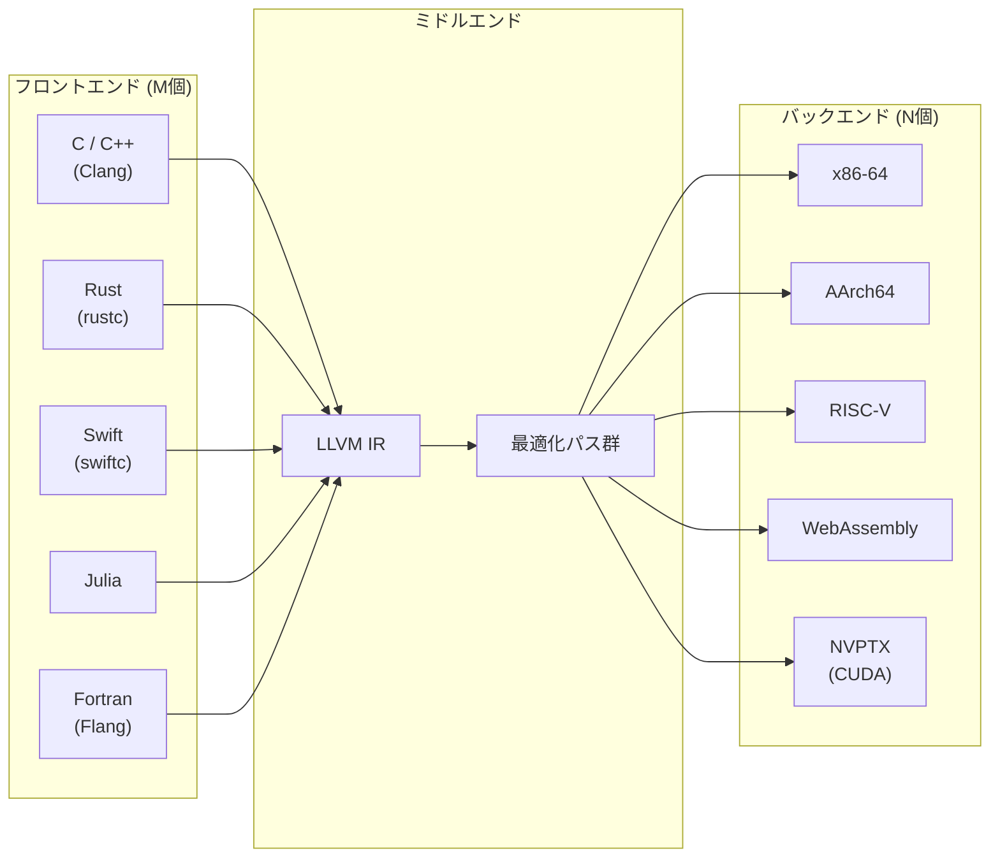
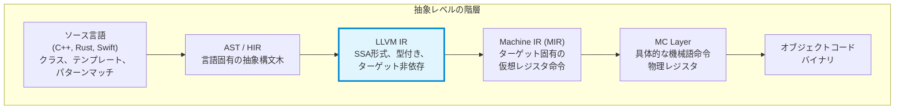
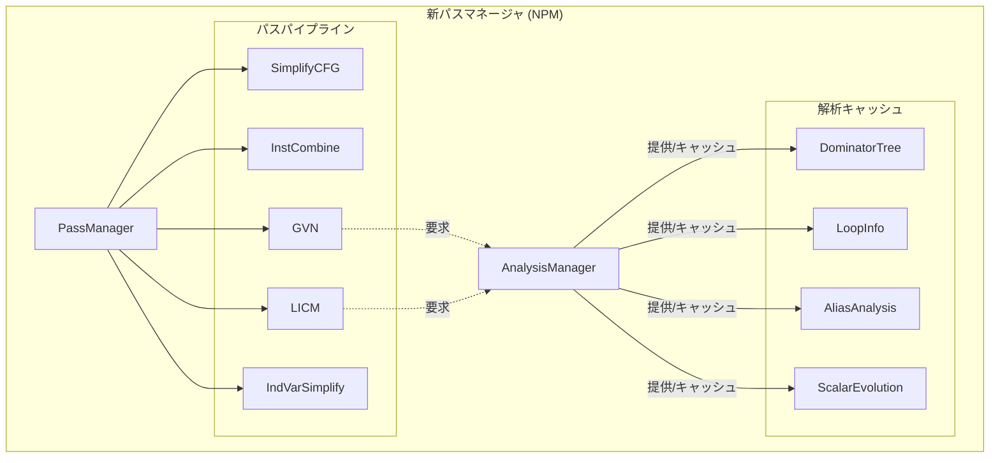
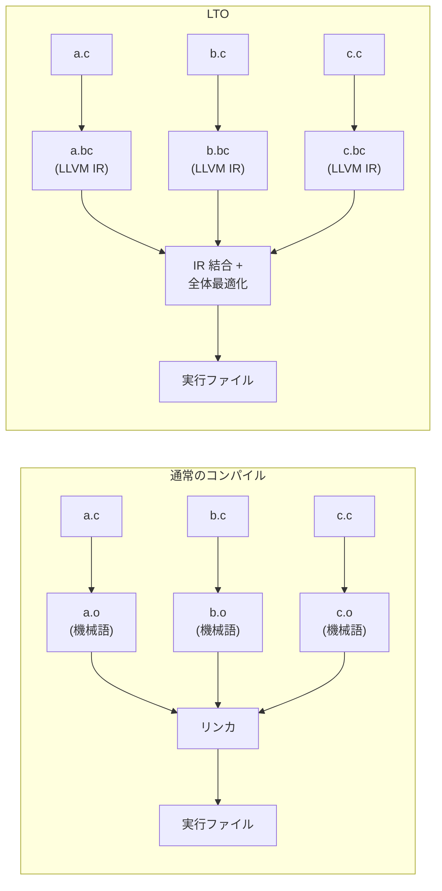
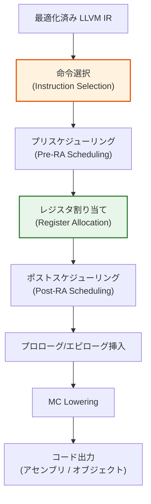
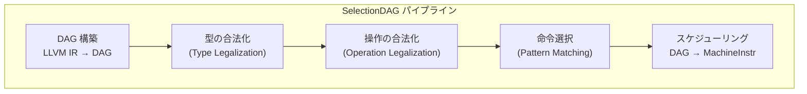
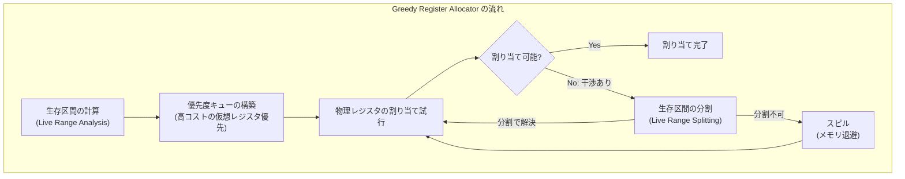
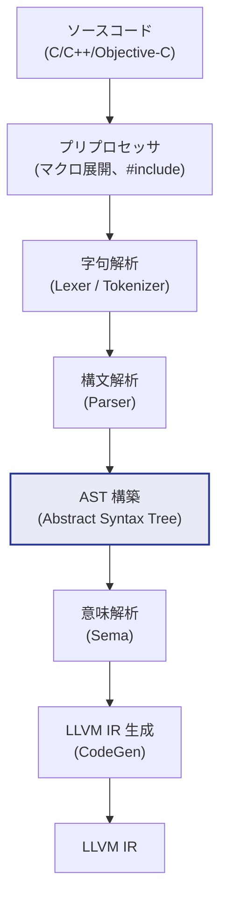
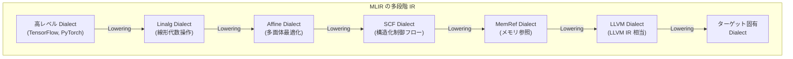

# LLVM アーキテクチャ

## 1. LLVM プロジェクトの歴史

### 1.1 誕生 — Chris Lattner の修士論文

2000年、イリノイ大学アーバナ・シャンペーン校（UIUC）の大学院生であった Chris Lattner は、既存のコンパイラ基盤が抱える構造的な問題に着目した。当時のコンパイラは、GCC に代表されるように巨大なモノリシック構造を持ち、フロントエンド（構文解析・意味解析）、最適化、コード生成が密結合していた。新しいプログラミング言語を作りたい研究者が高品質な最適化やコード生成を利用するには、GCC の内部に深く手を入れるか、すべてをゼロから書き直すかの二択であった。

Lattner は 2002年の修士論文 "LLVM: An Infrastructure for Multi-Stage Optimization" において、コンパイラの各段階をモジュール化し、共通の中間表現（Intermediate Representation, IR）を介して疎結合に接続するアーキテクチャを提案した。当初 "Low Level Virtual Machine" の略称とされていたが、プロジェクトの射程が仮想マシンの域をはるかに超えたため、現在では **LLVM はそれ自体が固有名詞** として扱われている。

### 1.2 Apple による採用と商用化

2005年、Lattner は Apple に入社した。Apple は当時 GCC をシステムコンパイラとして使用していたが、GCC の GPL v3 ライセンスへの移行、Objective-C サポートの改善要求への GCC コミュニティの消極的対応、そしてツーリング統合の困難さから、代替を模索していた。LLVM の BSD 風許諾ライセンスと高いモジュール性は Apple のニーズに完全に合致し、Lattner は Apple 内で LLVM の開発を本格化させた。

この時期に Clang プロジェクトが始動し、2009年には Clang がセルフホスト（自身をコンパイルできる状態）を達成した。2012年の Xcode 4.2 以降、Apple は GCC から完全に LLVM/Clang へ移行した。

### 1.3 コミュニティの拡大とエコシステムの成熟

Apple 以外にも、Google、ARM、Intel、AMD、NVIDIA、Qualcomm、Sony、Microsoft など多数の企業が LLVM に投資するようになった。年次カンファレンス「LLVM Developers' Meeting」は世界中から参加者を集め、LLVM は事実上のコンパイラ基盤のデファクトスタンダードとなっている。

以下は LLVM の主要なマイルストーンである。

| 年 | 出来事 |
|------|------|
| 2000 | Chris Lattner が UIUC で LLVM プロジェクトを開始 |
| 2002 | 修士論文として LLVM を発表 |
| 2003 | LLVM 1.0 リリース |
| 2005 | Lattner が Apple に入社、Clang プロジェクト開始 |
| 2009 | Clang がセルフホストを達成 |
| 2011 | LLVM 3.0 リリース（LLVM IR の安定化） |
| 2012 | Apple が GCC から LLVM/Clang に完全移行 |
| 2015 | Rust 1.0 リリース（LLVM バックエンド） |
| 2019 | MLIR が LLVM プロジェクトに統合 |
| 2022 | LLVM が新しいバージョニング（LLVM 15 以降） |
| 2025 | LLVM 20 リリース |

### 1.4 ライセンスと開発体制

LLVM は長らく "University of Illinois/NCSA Open Source License"（BSD 系）のもとで開発されてきたが、2019年に **Apache License 2.0 with LLVM Exceptions** へ移行した。この "LLVM Exceptions" は、LLVM ランタイムライブラリをリンクしたバイナリにライセンス上の義務を波及させないための条項であり、プロプライエタリソフトウェアの開発にも LLVM を自由に利用できることを保証している。

開発は GitHub 上の `llvm/llvm-project` モノリポジトリで行われ、数千人のコントリビュータが参加している。コードレビューは Phabricator から GitHub Pull Requests へ移行し、CI には Buildbot が利用されている。

## 2. フロントエンド・ミドルエンド・バックエンドの分離

### 2.1 伝統的コンパイラの課題

コンパイラは一般に、ソースコードから機械語への変換を行うソフトウェアである。この変換プロセスは本質的に複雑であり、以下の相互に独立な関心事が絡み合う。

1. **ソース言語の構文と意味**（フロントエンドの関心事）
2. **ターゲットに依存しない最適化**（ミドルエンドの関心事）
3. **ターゲットアーキテクチャ固有の命令選択とレジスタ割り当て**（バックエンドの関心事）

M 個の言語と N 個のターゲットをサポートするコンパイラ群を構築する場合、素朴には M × N 個のコンパイラが必要になる。しかし共通の中間表現を導入すれば、M 個のフロントエンドと N 個のバックエンドを独立に開発でき、合計 M + N のモジュールで済む。



### 2.2 LLVM におけるモジュール分離

LLVM はこの M + N アーキテクチャを徹底的に実現している。各層の責務は以下の通りである。

**フロントエンド** は、特定のソース言語を解析し、LLVM IR を生成する。Clang（C/C++/Objective-C）、rustc（Rust）、swiftc（Swift）、Flang（Fortran）などがこの役割を担う。フロントエンドは言語固有の型検査、名前解決、テンプレート展開（C++の場合）などを行った上で、言語に依存しない LLVM IR を出力する。

**ミドルエンド（LLVM Optimizer）** は、LLVM IR に対してターゲット非依存の最適化を適用する。定数伝播、デッドコード除去、ループ最適化、インライン展開、エイリアス解析など数百の最適化パスが用意されている。

**バックエンド（LLVM Code Generator）** は、最適化された LLVM IR をターゲット固有の機械語に変換する。命令選択、レジスタ割り当て、命令スケジューリング、フレームレイアウトなどを担当する。

### 2.3 ライブラリベース設計の利点

LLVM の決定的な特徴は、これらすべてが **再利用可能なライブラリ** として提供されていることである。GCC がモノリシックな実行ファイルとして構築されるのに対し、LLVM はライブラリの集合体であり、必要なコンポーネントだけを組み合わせて独自のツールを構築できる。

たとえば、JIT（Just-In-Time）コンパイラを組み込みたいデータベースエンジンは、LLVM のコード生成ライブラリだけをリンクして利用できる。静的解析ツールは、Clang のフロントエンドライブラリだけを使ってソースコードの AST（抽象構文木）を操作できる。この柔軟性が、LLVM がコンパイラ以外の領域でも広く採用される理由である。

## 3. LLVM IR の設計

### 3.1 LLVM IR とは何か

LLVM IR（Intermediate Representation）は LLVM のアーキテクチャにおける中核的な抽象化であり、フロントエンドとバックエンドを接続するためのインターフェースである。LLVM IR は以下の3つの等価な形式を持つ。

1. **テキスト形式（`.ll` ファイル）** — 人間が読み書きできる形式
2. **ビットコード形式（`.bc` ファイル）** — 効率的なバイナリシリアライズ形式
3. **インメモリ表現** — コンパイラ内部で操作される C++ オブジェクトとしての形式

これら3つは情報的に等価であり、相互に変換できる。テキスト形式からビットコードへの変換は `llvm-as`、逆方向は `llvm-dis` で行う。

### 3.2 LLVM IR のテキスト形式

LLVM IR のテキスト形式は、擬似的なアセンブリ言語に似た外観を持つ。以下に簡単な例を示す。

```llvm
; Function to compute factorial
define i64 @factorial(i64 %n) {
entry:
  %cmp = icmp eq i64 %n, 0
  br i1 %cmp, label %base, label %recurse

base:
  ret i64 1

recurse:
  %n_minus_1 = sub i64 %n, 1
  %result = call i64 @factorial(i64 %n_minus_1)
  %final = mul i64 %n, %result
  ret i64 %final
}
```

この例から LLVM IR の重要な設計上の特徴が見て取れる。

### 3.3 SSA（Static Single Assignment）形式

LLVM IR は **SSA 形式** を採用している。SSA とは、すべての変数（LLVM IR では「値」と呼ぶ）がプログラム中でちょうど一回だけ定義される形式である。上の例で `%cmp`、`%n_minus_1`、`%result`、`%final` は、それぞれ一度しか代入されない。

SSA 形式は多くの最適化アルゴリズムを劇的に単純化する。たとえば、ある値がどこで定義されているかを調べるには、その値の定義箇所を見るだけでよい（定義は一箇所しかないため）。定数伝播、デッドコード除去、共通部分式除去などの古典的な最適化は、SSA 形式上では自然で効率的なアルゴリズムが知られている。

制御フローの合流点では **phi 命令** を使って、どの前任ブロックから来たかに応じて値を選択する。

```llvm
; Computing GCD using phi nodes
define i32 @gcd(i32 %a, i32 %b) {
entry:
  br label %loop

loop:
  %x = phi i32 [ %a, %entry ], [ %y.curr, %loop ]
  %y.curr = phi i32 [ %b, %entry ], [ %rem, %loop ]
  %rem = urem i32 %x, %y.curr
  %done = icmp eq i32 %rem, 0
  br i1 %done, label %exit, label %loop

exit:
  ret i32 %y.curr
}
```

`phi` 命令は「このブロックに `%entry` から来た場合は `%a` を使い、`%loop` から来た場合は `%y.curr` を使う」という意味であり、SSA 形式においてループ変数を表現する標準的な手法である。

### 3.4 型システム

LLVM IR は明示的な型システムを持つ。主要な型は以下の通りである。

| 型 | 例 | 説明 |
|---|---|---|
| 整数型 | `i1`, `i8`, `i32`, `i64` | 任意ビット幅の整数 |
| 浮動小数点型 | `float`, `double`, `half` | IEEE 754 準拠 |
| ポインタ型 | `ptr` | 不透明ポインタ（opaque pointer） |
| ベクトル型 | `<4 x float>` | SIMD 演算向け |
| 配列型 | `[10 x i32]` | 固定長配列 |
| 構造体型 | `{ i32, float, ptr }` | 複合型 |
| 関数型 | `i32 (i32, i32)` | 関数のシグネチャ |
| void 型 | `void` | 戻り値なし |

注目すべきは、LLVM 15 以降で導入された**不透明ポインタ（opaque pointer）** である。従来は `i32*`、`float*` のように型付きポインタを使用していたが、現在はすべてのポインタが単に `ptr` 型となった。この変更により、ポインタ型の不要なビットキャストが排除され、IR の簡素化とコンパイル時間の改善が実現した。

### 3.5 LLVM IR の抽象レベル

LLVM IR は、ソース言語の高レベルな意味論とターゲットマシンの低レベルな詳細の間に位置する「ちょうど良い」抽象レベルを提供するよう設計されている。

- **ソース言語よりも低レベル**: クラス、例外処理の構文、パターンマッチといった高レベル概念は、より基本的な操作に分解されている
- **機械語よりも高レベル**: 具体的なレジスタや命令エンコーディングは抽象化されている。無限個の仮想レジスタを使用でき、ターゲット固有の制約は含まれない



### 3.6 メタデータとデバッグ情報

LLVM IR は、最適化に影響する追加情報を**メタデータ**として付与できる。メタデータは IR の意味論を変えないが、最適化パスにヒントを提供する。

```llvm
; Example with metadata
%val = load i32, ptr %p, !tbaa !0

!0 = !{!1, !1, i64 0}
!1 = !{!"int", !2, i64 0}
!2 = !{!"omnipotent char", !3, i64 0}
!3 = !{!"Simple C/C++ TBAA"}
```

この例の `!tbaa`（Type-Based Alias Analysis）メタデータは、ポインタのエイリアス関係をコンパイラに伝え、より積極的な最適化を可能にする。

デバッグ情報も LLVM IR のメタデータとして表現される。DWARF や CodeView といったデバッグ情報フォーマットへの変換は、バックエンドが担当する。これにより、最適化を施したバイナリでもソースレベルのデバッグが可能となる。

## 4. パスマネージャと最適化パス

### 4.1 パス（Pass）の概念

LLVM の最適化基盤は **パス** と呼ばれるモジュール単位で構成される。各パスは LLVM IR に対して特定の解析または変換を行う小さな独立したモジュールである。この設計により、最適化ロジックが明確に分離され、個別にテスト・開発・組み合わせが可能になる。

パスは大きく2種類に分類される。

- **解析パス（Analysis Pass）**: IR を読み取って情報を計算するが、IR 自体は変更しない。例: ドミネータツリー解析、ループ解析、エイリアス解析
- **変換パス（Transformation Pass）**: IR を書き換えて最適化を施す。例: 定数伝播、デッドコード除去、ループアンローリング

変換パスは解析パスの結果に依存することが多い。たとえば、ループ不変コード移動（LICM: Loop Invariant Code Motion）は、ループ解析の結果とエイリアス解析の結果の両方を必要とする。

### 4.2 レガシーパスマネージャと新パスマネージャ

LLVM は歴史的に2つのパスマネージャを持つ。

**レガシーパスマネージャ（Legacy Pass Manager）** は LLVM の初期から存在し、長年にわたって使用されてきた。パスの粒度として Module Pass、Function Pass、Loop Pass などを定義し、パスの依存関係をクラス継承で表現していた。しかし、解析結果のキャッシュと無効化のメカニズムが不十分であり、パイプラインの構成が静的で柔軟性に欠けていた。

**新パスマネージャ（New Pass Manager, NPM）** は、これらの問題を解決するために開発され、LLVM 14 以降デフォルトとなっている。新パスマネージャの主な改善点は以下の通りである。

1. **明示的な解析結果の管理**: 解析結果は `AnalysisManager` によって管理され、必要に応じてキャッシュ・無効化される
2. **パイプラインの柔軟な構成**: テキストベースでパイプラインを記述でき、`opt` コマンドに `-passes=` オプションで指定可能
3. **テンプレートベースの設計**: 仮想関数のオーバーヘッドを排除し、コンパイル時のポリモーフィズムを活用



### 4.3 主要な最適化パス

LLVM には数百の最適化パスが存在するが、特に重要なものを紹介する。

**Mem2Reg（Memory to Register Promotion）**: `alloca` 命令で確保されたスタック変数を SSA レジスタに昇格させる。フロントエンドは通常、すべてのローカル変数を `alloca` で確保した形の IR を生成するため、Mem2Reg は本格的な最適化の前段階として必須のパスである。

```llvm
; Before Mem2Reg
define i32 @add(i32 %a, i32 %b) {
  %a.addr = alloca i32
  %b.addr = alloca i32
  store i32 %a, ptr %a.addr
  store i32 %b, ptr %b.addr
  %0 = load i32, ptr %a.addr
  %1 = load i32, ptr %b.addr
  %2 = add i32 %0, %1
  ret i32 %2
}

; After Mem2Reg
define i32 @add(i32 %a, i32 %b) {
  %0 = add i32 %a, %b
  ret i32 %0
}
```

**InstCombine（Instruction Combining）**: 複数の命令を等価なより単純な命令に置き換える。代数的な簡約（`x * 1 → x`、`x + 0 → x` など）や、ビット演算のパターンマッチングなど、数千のパターンを認識する。

**GVN（Global Value Numbering）**: 冗長な計算を検出して除去する。同じ値を計算する複数の式がある場合、1つだけを残して他を置き換える。

**LICM（Loop Invariant Code Motion）**: ループの繰り返しに依存しない計算をループの外に移動させる。

**ループアンローリング（Loop Unrolling）**: ループの反復回数が少ない場合や、アンローリングが有利と推定される場合にループ本体を展開する。分岐オーバーヘッドの削減とパイプラインの活用を促進する。

**インライン展開（Inlining）**: 関数呼び出しを呼び出し先のコードで置き換える。関数呼び出しのオーバーヘッドを排除するだけでなく、呼び出し先のコードがインライン化された文脈でさらに最適化される機会を生む。コスト・ベネフィット分析に基づいてインライン化の判断が行われる。

**SROA（Scalar Replacement of Aggregates）**: 構造体や配列をスカラ変数に分解し、個別に最適化可能にする。

**SLP Vectorizer（Superword Level Parallelism Vectorizer）**: 独立したスカラ操作を SIMD 命令に自動的にベクトル化する。

### 4.4 最適化レベル

`opt` コマンドや Clang の `-O` フラグで指定する最適化レベルは、実際にはパスパイプラインの構成を選択するものである。

| レベル | 説明 | 主な用途 |
|---|---|---|
| `-O0` | 最適化なし。Mem2Reg も適用されない場合がある | デバッグビルド |
| `-O1` | 基本的な最適化。コンパイル時間への影響を抑制 | 開発中のビルド |
| `-O2` | 標準的な最適化。ほとんどの変換パスを適用 | リリースビルド（一般的） |
| `-O3` | 積極的な最適化。ループアンローリング等を強化 | パフォーマンス重視のリリース |
| `-Os` | サイズ最適化。コードサイズを縮小 | 組み込み・モバイル |
| `-Oz` | 最小サイズ最適化。`-Os` よりさらにサイズ優先 | 極小バイナリ |

### 4.5 LTO（Link Time Optimization）

通常のコンパイルでは、各翻訳単位（ソースファイル）が個別に最適化され、オブジェクトファイルとしてリンカに渡される。この場合、翻訳単位をまたぐ最適化の機会が失われる。

**LTO（Link Time Optimization）** は、リンク時にすべてのモジュールの LLVM IR を結合し、プログラム全体に対して最適化を適用する手法である。翻訳単位をまたぐインライン展開、グローバルなデッドコード除去、プロファイルガイド最適化（PGO）の精度向上などが可能になる。



LLVM は **ThinLTO** と呼ばれる軽量 LTO も提供している。ThinLTO はモジュール間のサマリ情報のみを共有し、実際のコード生成は並列に行う。Full LTO に近い最適化効果を得ながら、コンパイル時間の増加を大幅に抑制できる。Google は Chrome や Android のビルドで ThinLTO を広く活用している。

## 5. SelectionDAG と命令選択

### 5.1 バックエンドの全体像

LLVM バックエンドは、最適化された LLVM IR からターゲット固有の機械語を生成する。このプロセスは複数のフェーズに分かれている。



### 5.2 SelectionDAG による命令選択

命令選択は、LLVM IR の各命令をターゲットマシンの命令に対応付けるプロセスである。LLVM の主要な命令選択アルゴリズムは **SelectionDAG** に基づいている。

SelectionDAG の処理は以下の段階で進む。

1. **DAG の構築**: 基本ブロック内の LLVM IR 命令を有向非巡回グラフ（DAG）に変換する。ノードは操作を、辺はデータ依存関係を表す
2. **型の合法化（Type Legalization）**: ターゲットがネイティブにサポートしない型を、サポートされる型に変換する（例: `i128` を `i64` のペアに分割）
3. **操作の合法化（Operation Legalization）**: ターゲットがネイティブにサポートしない操作を、サポートされる操作の組み合わせに展開する
4. **命令選択（Instruction Selection）**: 合法化された DAG ノードをターゲット固有の命令にマッチさせる。TableGen で記述されたパターンマッチングルールが使用される
5. **スケジューリングとレジスタ割り当て準備**: DAG を線形化し、MachineInstr のシーケンスに変換する



### 5.3 TableGen と命令定義

LLVM のバックエンド開発の特徴的な要素が **TableGen** である。TableGen は、ターゲットアーキテクチャの命令セット、レジスタファイル、命令選択パターン、スケジューリングモデルなどを宣言的に記述するための DSL（Domain Specific Language）である。

以下は、x86 の加算命令を TableGen で定義する例の簡略版である。

```tablegen
// Simplified example of x86 ADD instruction definition
def ADD32rr : I<0x01, MRMDestReg,
                (outs GR32:$dst),
                (ins GR32:$src1, GR32:$src2),
                "add{l}\t{$src2, $dst|$dst, $src2}",
                [(set GR32:$dst, EFLAGS,
                  (X86add_flag GR32:$src1, GR32:$src2))]>;
```

この定義は、オペコード、オペランド、アセンブリ構文、そして **SelectionDAG パターン**（最後の `[...]` 部分）を一つの宣言にまとめている。パターンマッチングにより、LLVM IR の `add` 操作が自動的にこの x86 命令に対応付けられる。

TableGen の利点は、命令定義を一箇所に集約し、そこからコード生成器、アセンブラ、逆アセンブラ、命令スケジューラのテーブルなど、複数のコンポーネントが必要とするデータを自動生成できることである。

### 5.4 GlobalISel — 次世代の命令選択

SelectionDAG は成熟した命令選択フレームワークであるが、基本ブロック単位でしか動作しない制約や、DAG 構築・破棄のオーバーヘッドがある。**GlobalISel（Global Instruction Selector）** は、これらの制限を克服するために開発された次世代の命令選択フレームワークである。

GlobalISel の主な特徴は以下の通りである。

- 関数全体をスコープとした命令選択が可能
- LLVM IR から直接 MachineInstr に変換し、中間的な DAG を構築しない
- 段階的な合法化（Legalizer）、レジスタバンク選択（RegBankSelect）、命令選択（InstructionSelect）のパイプライン
- `-O0` コンパイルでの高速化に特に効果的

AArch64 バックエンドでは GlobalISel がデフォルトで使用されるようになっており、他のターゲットへの展開も進んでいる。

## 6. レジスタ割り当て

### 6.1 レジスタ割り当て問題

LLVM IR では無限個の仮想レジスタを自由に使用できるが、実際のハードウェアには有限個の物理レジスタしかない。レジスタ割り当て（Register Allocation）とは、仮想レジスタを物理レジスタに対応付け、物理レジスタが不足する場合にはスタックメモリへの退避（スピル）を挿入するプロセスである。

レジスタ割り当ては、理論的にはグラフ彩色問題に帰着できることが知られており、NP完全問題である。そのため、実用的なコンパイラではヒューリスティクスを用いた近似アルゴリズムが使用される。

### 6.2 LLVM のレジスタ割り当てアルゴリズム

LLVM は複数のレジスタ割り当てアルゴリズムを提供しており、最適化レベルに応じて使い分けられる。

**Fast Register Allocator（`-O0` で使用）**: 基本ブロック単位で動作する極めて高速なアロケータ。各基本ブロックの終端ですべての仮想レジスタをスピルするため、生成コードの品質は低いが、コンパイル速度は最速である。

**Greedy Register Allocator（`-O2` 以上で使用）**: LLVM のデフォルトレジスタ割り当てアルゴリズム。Live Range Splitting を積極的に活用し、仮想レジスタの生存区間を分割してスピルのコストを最小化する。優先度キューを用いて、最もコストの高い仮想レジスタから順に割り当てを行う。



### 6.3 レジスタ割り当ての実際

レジスタ割り当てが実際に行う処理を具体的に見てみよう。以下のような仮想レジスタを使った MachineIR があったとする。

```
%vreg0 = LOAD [stack_slot_0]
%vreg1 = LOAD [stack_slot_1]
%vreg2 = ADD %vreg0, %vreg1
%vreg3 = MUL %vreg2, %vreg0
STORE %vreg3, [stack_slot_2]
```

この例では `%vreg0` は ADD と MUL の両方で使用されるため、生存区間が長い。x86-64 のような汎用レジスタが16個あるアーキテクチャでは、この程度の仮想レジスタ数であればスピルは発生しない。しかし、ループ内で多数の値が同時に生存する場合、レジスタ圧が高まりスピルが必要になることがある。

Greedy Allocator は、スピルのコスト（頻度 × ループ深度で重み付け）を最小化するよう生存区間を分割する。ループ内で使用される値はレジスタに保持し、ループ外でのみスピルするなどの判断が行われる。

## 7. Clang

### 7.1 Clang の設計思想

Clang は LLVM プロジェクトの公式 C/C++/Objective-C フロントエンドである。GCC の代替として設計され、以下の点で差別化されている。

1. **ライブラリベース設計**: Clang のすべての機能（字句解析、構文解析、意味解析、コード生成）が C++ ライブラリとして提供され、他のツールから再利用可能
2. **優れたエラーメッセージ**: ソースコードの該当箇所をハイライトし、修正提案（Fix-it hints）を提示する
3. **高速なコンパイル**: GCC と比較して、特に C++ の大規模プロジェクトで顕著にコンパイルが速い
4. **GCC 互換性**: GCC のコマンドラインオプションとの高い互換性により、既存のビルドシステムから容易に移行可能

### 7.2 Clang のコンパイルパイプライン

Clang のコンパイルパイプラインは以下のように進む。



特筆すべきは、Clang の AST が **忠実に構文構造を保持する** 点である。GCC の内部表現は最適化のために早期に情報を捨象するが、Clang の AST はソースコードのほぼ完全な構造情報を保持する。これにより、リファクタリングツール、静的解析ツール、IDE の補完機能などが Clang の AST を直接利用できる。

### 7.3 Clang ベースのツールエコシステム

Clang のライブラリベース設計は、豊富なツールエコシステムを生み出した。

**clang-tidy**: C++ の静的解析ツール。コーディング規約の違反検出、パフォーマンス上の問題指摘、モダン C++ への移行支援などを行う。

**clang-format**: C/C++/Java/JavaScript/Objective-C のコードフォーマッタ。Clang のパーサーを使用しているため、構文を理解した正確なフォーマットが可能。

**clangd**: Language Server Protocol（LSP）に対応したC/C++ 用言語サーバー。コード補完、定義へのジャンプ、リファクタリングなどの IDE 機能を提供する。

**Clang Static Analyzer**: パス感度のある（path-sensitive）静的解析エンジン。メモリリーク、null ポインタの参照解除、未初期化変数の使用などを検出する。シンボリック実行に基づいた高度な解析を行う。

**LibTooling**: Clang ベースのツールを開発するためのフレームワーク。AST マッチャーを使って、特定のコードパターンを検出・変換するツールを容易に作成できる。

### 7.4 Address Sanitizer をはじめとするサニタイザ群

Clang/LLVM は強力なランタイム検査ツール群（サニタイザ）を提供している。

| サニタイザ | 検出対象 | コンパイルオプション |
|---|---|---|
| AddressSanitizer (ASan) | バッファオーバーフロー、use-after-free、メモリリーク | `-fsanitize=address` |
| ThreadSanitizer (TSan) | データ競合 | `-fsanitize=thread` |
| MemorySanitizer (MSan) | 未初期化メモリの読み取り | `-fsanitize=memory` |
| UndefinedBehaviorSanitizer (UBSan) | 未定義動作（整数オーバーフロー等） | `-fsanitize=undefined` |

これらのサニタイザは、コンパイル時にメモリアクセスの前後にチェックコードを挿入する LLVM パスとして実装されている。ASan は Google 内部で開発され、Chrome や Android のテストで大量のバグ検出に貢献したことで知られる。

## 8. MLIR

### 8.1 MLIR の動機 — IR の断片化問題

2019年、Google の Chris Lattner（LLVM の創始者）を中心に、**MLIR（Multi-Level Intermediate Representation）** が LLVM プロジェクトに統合された。MLIR の動機は、コンパイラ・ドメイン固有言語（DSL）・機械学習フレームワークの世界で IR の断片化が深刻化していたことである。

TensorFlow には独自の計算グラフ IR がある。XLA には HLO（High Level Optimizer）IR がある。各ハードウェアベンダーは独自の低レベル IR を持つ。LLVM IR はこれらの高レベルな抽象化を表現するには低レベルすぎる。結果として、各プロジェクトが独自の IR を再発明し、最適化パスフレームワーク、パス管理、デバッグインフラなどを個別に実装するという非効率が生じていた。

### 8.2 MLIR の設計 — Dialect システム

MLIR の核心的なアイデアは、**Dialect（方言）** と呼ばれる拡張可能な IR の名前空間を導入し、異なる抽象レベルの操作を単一のフレームワーク内で共存させることである。



各 Dialect は独自の操作（Operation）、型（Type）、属性（Attribute）を定義できる。たとえば、`linalg` Dialect は行列積を一つの操作として表現し、`affine` Dialect はアフィンループネストを表現する。これらの Dialect は、**段階的な下降（Progressive Lowering）** によって、より低レベルな Dialect へと変換されていく。

以下は MLIR の具体的な表現例である。

```mlir
// High-level tensor operation
%result = "tf.MatMul"(%a, %b) {
  transpose_a = false,
  transpose_b = false
} : (tensor<4x8xf32>, tensor<8x16xf32>) -> tensor<4x16xf32>

// After lowering to linalg dialect
%result = linalg.matmul
  ins(%a, %b : memref<4x8xf32>, memref<8x16xf32>)
  outs(%c : memref<4x16xf32>)
```

### 8.3 MLIR の適用領域

MLIR は当初、機械学習コンパイラのために設計されたが、その汎用性から多くの領域に適用されている。

**機械学習**: TensorFlow、JAX、PyTorch/Torch-MLIR が MLIR を活用している。高レベルなテンソル操作から、GPU カーネルや TPU 命令への段階的なコンパイルを実現する。

**ハードウェア設計**: CIRCT（Circuit IR Compilers and Tools）プロジェクトは、MLIR 上にハードウェア記述言語（Chisel, FIRRTL）のコンパイラを構築している。

**量子コンピューティング**: 量子回路の表現と最適化のための Dialect が開発されている。

**高性能コンピューティング**: Fortran コンパイラ Flang は、MLIR の FIR（Fortran IR）Dialect を活用している。

### 8.4 MLIR と LLVM IR の関係

MLIR は LLVM IR を置き換えるものではなく、**補完する** ものである。MLIR の LLVM Dialect は LLVM IR と等価な操作を提供し、最終的に LLVM IR へ変換される。MLIR は「LLVM IR の上位に位置する多段階 IR フレームワーク」として機能し、ソース言語の高レベル意味論と LLVM IR の間のギャップを埋める役割を果たす。

## 9. LLVM ベースの言語

### 9.1 Rust

Rust は Mozilla Research によって開発されたシステムプログラミング言語であり、**メモリ安全性をコンパイル時に保証する** という野心的な目標を持つ。Rust コンパイラ `rustc` は LLVM をバックエンドとして使用している。

Rust のコンパイルパイプラインは以下のようになっている。


Rust が LLVM を採用したことの意義は大きい。新しいシステムプログラミング言語が、C/C++ に匹敵するネイティブコード品質を初日から得られたのは、LLVM の成熟した最適化基盤があったからである。一方で、Rust コミュニティ内では LLVM への依存に伴う課題も認識されている。

- **コンパイル時間**: Rust のコンパイルが遅い一因は、LLVM の最適化パスが重いことにある
- **Cranelift**: デバッグビルドで LLVM の代わりに使用できる軽量コード生成器として Cranelift が開発されている。Cranelift は最適化品質では LLVM に劣るが、コード生成速度で大幅に上回る
- **GCC バックエンド**: `rustc_codegen_gcc` プロジェクトにより、GCC をバックエンドとして使用する選択肢も進行中である

### 9.2 Swift

Swift は Apple が 2014年に発表したプログラミング言語であり、Chris Lattner 自身が設計を主導した。Swift は LLVM との緊密な統合を前提に設計された言語であり、LLVM の能力を最大限に引き出すよう設計されている。

Swift コンパイラは **SIL（Swift Intermediate Language）** という独自の高レベル IR を持つ。SIL は LLVM IR よりも高レベルであり、Swift 固有の概念（参照カウント、プロトコルウィットネステーブル、値型のコピーセマンティクス）を直接表現できる。SIL レベルで Swift 固有の最適化（ARC 最適化、ジェネリック特殊化、デビジュアライゼーションなど）が行われた後、LLVM IR に変換される。


### 9.3 Julia

Julia は科学計算・数値計算に特化した動的型付け言語であり、「2言語問題」（プロトタイプは Python で書くが、性能が必要な部分は C で書き直す）を解決することを目標としている。

Julia の革新的な点は、LLVM の **JIT コンパイル** 能力を前面に活用していることである。Julia は関数が最初に呼ばれた際に、引数の型に特殊化（specialize）された LLVM IR を生成し、LLVM の最適化パスを通して機械語にコンパイルする。

```julia
# Julia code
function saxpy(a, x, y)
    # Compiled to optimized native code via LLVM JIT
    @inbounds @simd for i in eachindex(x)
        y[i] += a * x[i]
    end
end
```

Julia は `@code_llvm` マクロで、任意の関数呼び出しに対して生成される LLVM IR を直接確認できる。これにより、開発者はパフォーマンスチューニングの際に LLVM レベルでの最適化状況を検査できる。

Julia が LLVM の JIT 基盤を採用したことで、動的型付け言語でありながら、多くのベンチマークで C や Fortran に匹敵する実行性能を達成している。

### 9.4 その他の LLVM ベース言語・ツール

LLVM は上記以外にも多数のプロジェクトで使用されている。

| プロジェクト | 用途 |
|---|---|
| **Flang** | Fortran コンパイラ（LLVM 公式） |
| **Zig** | システムプログラミング言語 |
| **Crystal** | Ruby 風の静的型付け言語 |
| **Haskell (GHC)** | GHC の LLVM バックエンド |
| **Kotlin/Native** | Kotlin のネイティブコンパイル |
| **Emscripten** | C/C++ → WebAssembly コンパイラ |
| **PostgreSQL** | JIT によるクエリ実行の高速化 |
| **Mesa (OpenGL)** | GPU シェーダーコンパイラ |
| **Android NDK** | Android ネイティブ開発のデフォルトコンパイラ |

## 10. LLVM の設計思想とトレードオフ

### 10.1 ライブラリベース設計の功罪

LLVM のライブラリベース設計は、コンパイラ技術の民主化をもたらした。新しい言語の開発者は、字句解析器と構文解析器、そして LLVM IR への変換ロジックさえ書けば、成熟した最適化基盤と多数のターゲットアーキテクチャへのコード生成を「ただで」利用できる。

一方で、LLVM の API は巨大で変化が速い。LLVM はセマンティックバージョニングを保証しておらず、メジャーバージョン間で C++ API が破壊的に変更されることが珍しくない。これは LLVM をバックエンドとして使用する言語（Rust、Swift など）にとって継続的なメンテナンスコストとなっている。

### 10.2 LLVM IR の表現力の限界

LLVM IR は「ちょうど良い」抽象レベルを目指しているが、すべてのソース言語の意味論を効率的に表現できるわけではない。

- **例外処理**: C++ や Swift の例外は LLVM IR の `invoke` / `landingpad` / `resume` 命令で表現されるが、ゼロコスト例外の実装はターゲット依存の複雑な処理を伴う
- **コルーチン**: LLVM はコルーチンのサポートを追加しているが（C++20 コルーチン、Swift の async/await）、設計は複雑である
- **ガベージコレクション**: GC を持つ言語のスタックマップ生成は、`gc.statepoint` / `gc.relocate` 組み込み関数で対応しているが、GC 戦略ごとの微調整が必要

これらのギャップを埋めるのが前述の MLIR やソース言語固有の中間表現（SIL、MIR など）であり、LLVM エコシステム全体として多段階の IR 階層で対処している。

### 10.3 GCC との比較

LLVM と GCC は長年にわたって競争と相互影響の関係にある。

| 観点 | LLVM/Clang | GCC |
|---|---|---|
| ライセンス | Apache 2.0 + LLVM Exceptions | GPL v3 |
| 設計 | ライブラリベース、モジュラー | モノリシック実行ファイル |
| 言語サポート | C/C++/Obj-C（Clang）+ 多数の外部フロントエンド | C/C++/Fortran/Ada/Go/D/Rust（公式） |
| エラーメッセージ | 高品質、Fix-it hints | 改善中だが Clang に追随 |
| ターゲット | 主要アーキテクチャを広くカバー | より多くのニッチなターゲットをサポート |
| 最適化品質 | ほぼ同等、ワークロードにより優劣が異なる | ほぼ同等、特定のケースで優位 |
| コンパイル速度 | C++ で一般的に高速 | 大規模プロジェクトでやや遅い傾向 |
| JIT サポート | ORCJIT による本格的な JIT 基盤 | libgccjit（限定的） |

両者は互いの進歩を刺激し合い、コンパイラ技術全体のレベルを押し上げている。

## 11. LLVM の将来展望

### 11.1 RISC-V エコシステムの拡大

RISC-V は命令セットアーキテクチャ（ISA）のオープン規格であり、LLVM は RISC-V の主要なコンパイラ基盤として機能している。RISC-V のベクトル拡張（RVV）やカスタム拡張への対応が活発に進められている。

### 11.2 AI/ML コンパイラとしての進化

MLIR を基盤として、AI アクセラレータ（GPU、TPU、NPU、カスタム ASIC）向けのコンパイラ開発が急速に進んでいる。Triton（NVIDIA GPU 向けの ML コンパイラ言語）や IREE（ML モデルのランタイムコンパイル）など、MLIR ベースのプロジェクトが台頭している。

### 11.3 形式検証と正当性保証

Alive2 プロジェクトは、LLVM の最適化パスの正当性を SMT ソルバーを用いて自動検証する取り組みであり、これまでに多数のミスコンパイルバグを発見している。コンパイラの正当性をより体系的に保証する方向への研究が続いている。

### 11.4 セキュリティ強化

Control Flow Integrity（CFI）、Shadow Call Stack、Memory Tagging Extension（MTE）への対応など、ハードウェアベースのセキュリティ機能をコンパイラレベルでサポートする取り組みが強化されている。

## 12. まとめ

LLVM は、コンパイラの各段階をモジュール化し、共通の中間表現で接続するというシンプルながら強力な設計思想に基づいて構築されたコンパイラ基盤である。2000年の Chris Lattner の修士論文に端を発し、四半世紀を経た現在では、システムプログラミング言語から機械学習フレームワーク、ハードウェア設計ツールに至るまで、コンピューティングの広範な領域で利用される基盤技術となっている。

LLVM の成功の本質は、以下の設計判断にある。

1. **M + N アーキテクチャ**: フロントエンドとバックエンドの分離により、言語とターゲットの組み合わせ爆発を回避した
2. **LLVM IR**: SSA 形式の型付き中間表現が、言語に依存しない最適化の共通基盤を提供した
3. **ライブラリベース設計**: コンパイラの構成要素を再利用可能なライブラリとして提供し、多様なユースケースへの適用を可能にした
4. **許容的なライセンス**: BSD 系（現 Apache 2.0）ライセンスにより、商用利用を含む幅広い採用を促進した

MLIR の統合により、LLVM のアーキテクチャは単一レベルの IR から多段階の IR フレームワークへと進化し、より多様な問題領域に対応できるようになった。LLVM は今後も、コンパイラ技術とプログラミング言語の進化を支える中核的な基盤であり続けるだろう。
