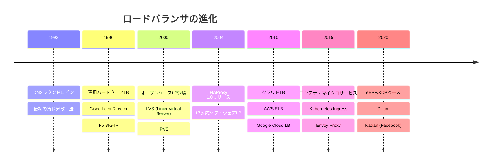
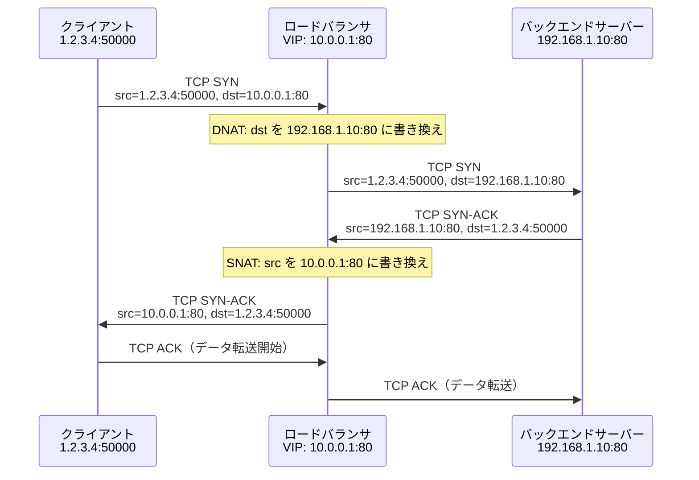
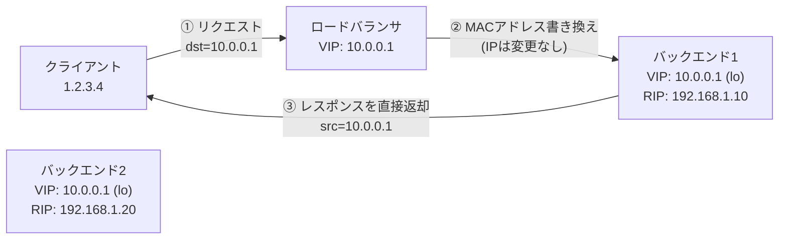
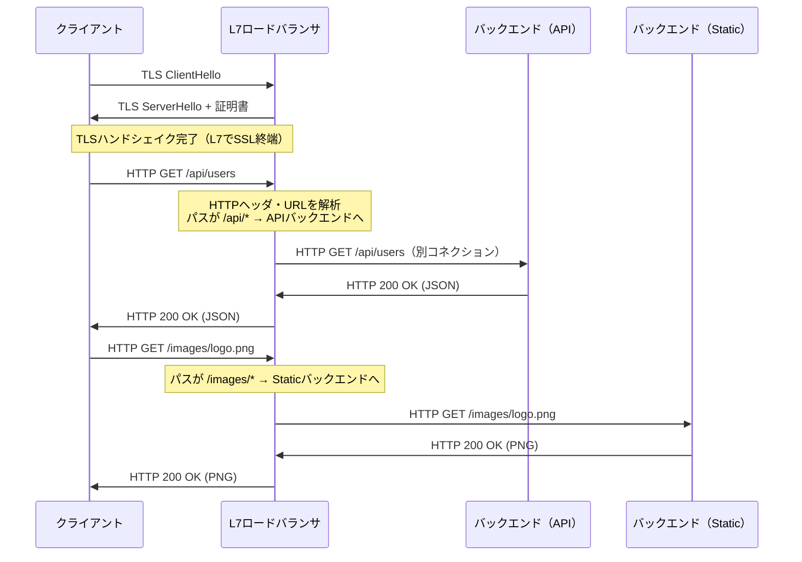
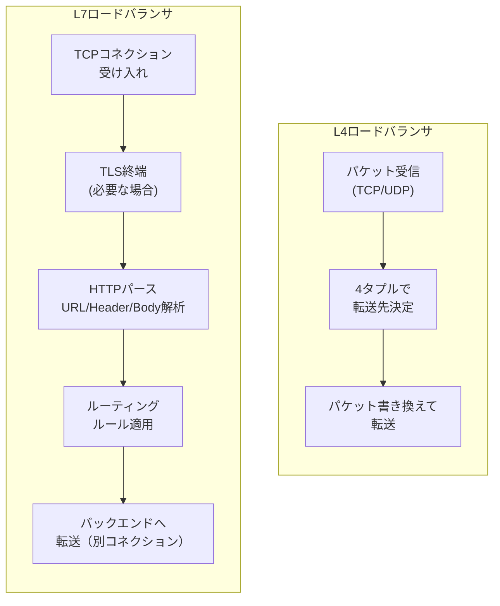
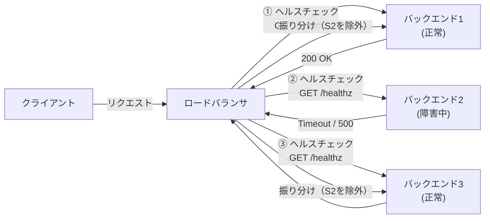
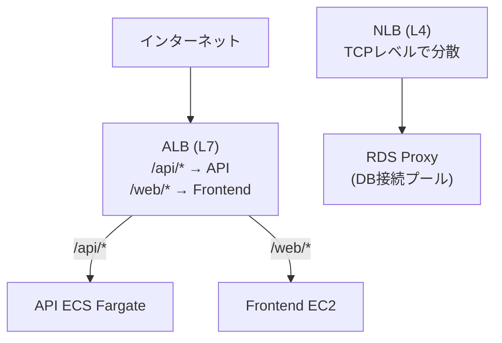
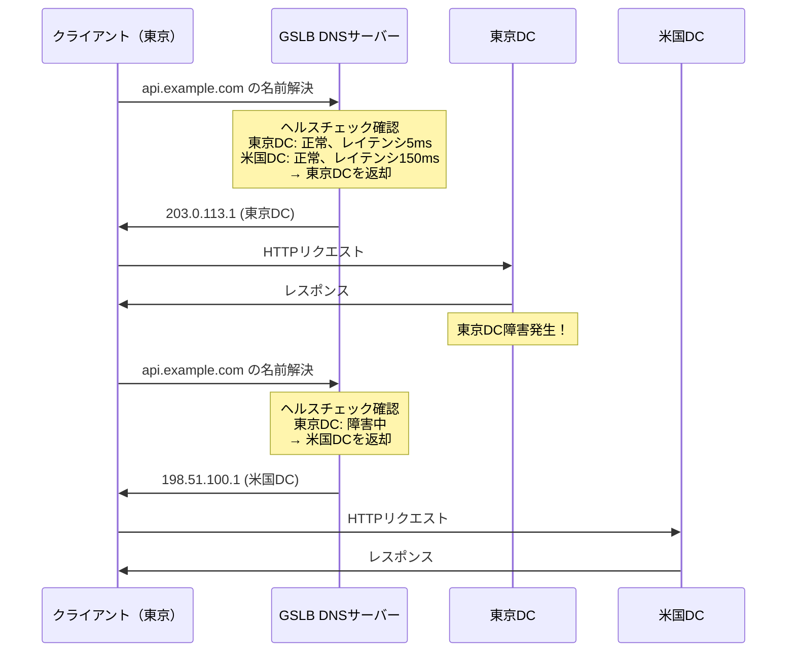
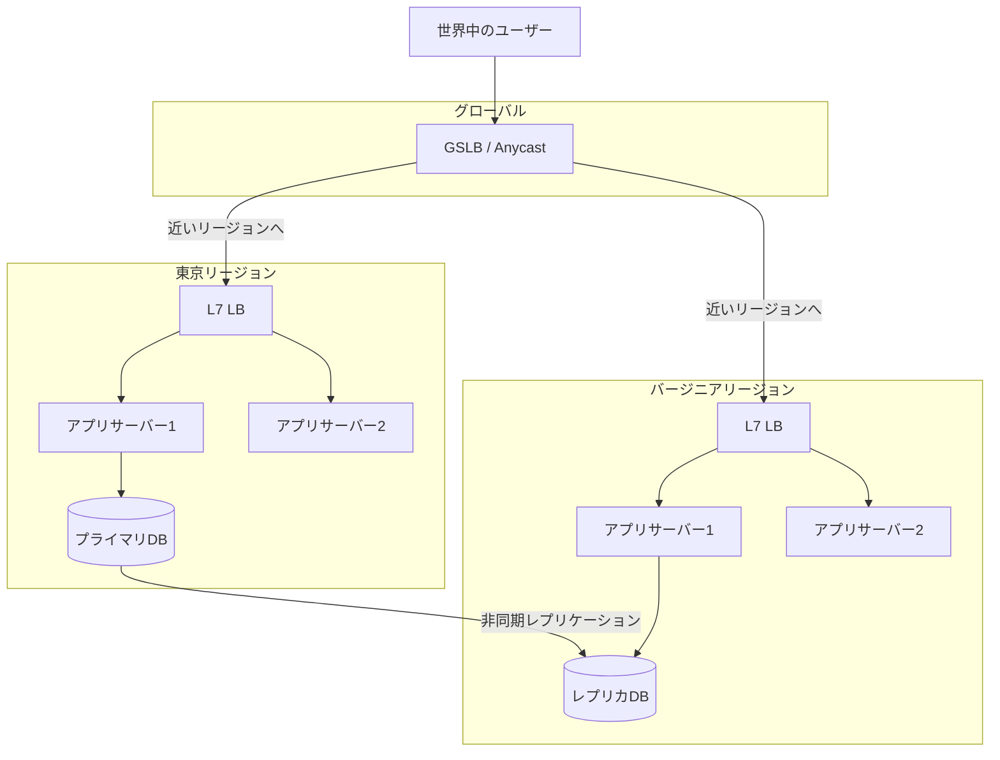

# ロードバランシング（L4/L7）

## 1. 歴史的背景：スケールアウトの必要性

### 単一サーバーの限界

インターネットが商業化され始めた1990年代初頭、Webサービスは単一の強力なサーバー（スケールアップ）で全てのリクエストをさばく構成が一般的だった。しかしWorld Wide Webの爆発的な普及とともに、単一サーバーのアーキテクチャは根本的な限界に直面することになる。

スケールアップには物理的な上限がある。CPUのクロック数、搭載可能なメモリ量、ネットワークインターフェースのスループット、いずれも際限なく増やすことはできない。また、単一サーバーはSPOF（Single Point of Failure）でもある。ハードウェア障害やOS障害が発生した瞬間、サービス全体が停止する。

1995年前後、Yahoo!やAmazonのような先駆的なWebサービスは、複数台のサーバーにリクエストを振り分ける「スケールアウト」のアーキテクチャへと移行し始めた。このとき登場したのがロードバランサ（負荷分散装置）の概念である。

### ロードバランサの登場

最初期のロードバランシングはDNSラウンドロビンで実現されていた。同一のドメイン名に複数のIPアドレスを関連付け、DNSサーバーが問い合わせのたびに異なるIPアドレスを返すという手法だ。シンプルで追加コストも不要だが、障害検知ができない、セッション維持が困難、TTLの制約で素早いフェイルオーバーができないなど、本格的な用途には多くの欠点があった。

これを解決すべく、1990年代中盤からCisco、F5 Networks、Radwareといった専業ベンダーが専用ハードウェアのロードバランサを提供し始めた。Cisco LocalDirectorやF5 BIG-IPはその代表例だ。これらはOSIモデルのトランスポート層（L4）でパケットを処理し、高スループットと低レイテンシを実現した。

2000年代に入ると、HAProxyやNginxのようなソフトウェアロードバランサが登場し、OSIモデルのアプリケーション層（L7）でリクエストの内容を解析して振り分ける高度なルーティングが可能になった。ハードウェアに比べてコストが大幅に下がり、設定の柔軟性も高い。

2010年代以降はAWS ELB、Google Cloud Load Balancing、Azure Load Balancerのようなクラウドマネージドロードバランサが普及し、インフラ管理の煩雑さがさらに軽減された。そして現在はKubernetesのIngressやService Meshの文脈で、L7ロードバランシングはアプリケーション基盤の不可欠な要素となっている。



---

## 2. L4ロードバランシング

### OSIモデルにおける位置づけ

L4ロードバランシングはOSIモデルの**第4層（トランスポート層）**で動作する。処理の対象はTCPセグメントまたはUDPデータグラムのヘッダ情報、具体的には送信元IP、送信先IP、送信元ポート番号、送信先ポート番号の4つのタプル（4タプル）だ。

HTTPのヘッダやボディ、URLパス、Cookieといった上位レイヤの情報は一切参照しない。これにより、プロトコルに依存しない汎用性の高い負荷分散が実現できる。TLS/SSLの暗号化通信も「TCPの通信」として素通りさせることができ、ロードバランサ自身が証明書を持つ必要がない。

### パケット転送の仕組み

L4ロードバランサのコアとなるのは**接続テーブル（コネクションテーブル）**の管理だ。クライアントからTCP SYNパケットが届くと、ロードバランサはアルゴリズムに従ってバックエンドサーバー（アップストリーム）を選択し、そのマッピングをテーブルに記録する。同じコネクションの後続パケットは全て同じバックエンドに転送される（接続の固定性＝スティッキネス）。

転送方式には主に2種類ある。

#### NAT（Network Address Translation）方式

最も一般的な方式。ロードバランサがパケットのIPヘッダを書き換える。



NAT方式では全ての上り・下りトラフィックがロードバランサを通過する。シンプルで実装しやすい反面、下りトラフィック（レスポンス）もロードバランサを経由するためボトルネックになりやすい。バックエンドサーバーはクライアントのIPアドレスを直接知ることができないため、ログ収集やアクセス制御で追加の工夫が必要になる。

#### DSR（Direct Server Return）方式

下りトラフィックをロードバランサ経由にしない方式。上りトラフィックのみロードバランサが処理し、バックエンドサーバーがクライアントに直接レスポンスを返す。



DSRでは各バックエンドサーバーのループバックインターフェース（lo）にVIPを設定し、ARP応答を抑制する。ロードバランサはMACアドレスの書き換えのみ行い（L2レベルの操作）、IPアドレスは変更しない。バックエンドはVIPを持つので、VIPをsrcとしてクライアントに直接返信できる。

Web配信やビデオストリーミングのように下りデータ量が圧倒的に多いワークロードで特に有効だ。下りトラフィックがロードバランサを経由しないため、スループットの上限が飛躍的に向上する。

#### トンネリング方式

DSRの変形。バックエンドサーバーがロードバランサと同一L2セグメントにない場合に使用する。IP-in-IPカプセル化やGREトンネルでパケットをバックエンドに届け、バックエンドがカプセルを解除してクライアントに直接レスポンスを返す。

### L4ロードバランシングの特性

| 特性 | 説明 |
|---|---|
| 処理レイヤ | OSI L4（TCP/UDP） |
| 参照情報 | IP、ポート番号のみ |
| SSL終端 | 不可（通信を素通し） |
| プロトコル非依存 | HTTP以外のTCP/UDPも対応 |
| スループット | 非常に高い |
| リソース消費 | 少ない（パケット書き換えのみ） |
| コンテンツルーティング | 不可 |

---

## 3. L7ロードバランシング

### アプリケーション層での処理

L7ロードバランシングはOSIモデルの**第7層（アプリケーション層）**で動作する。HTTPリクエストのURL、HTTPメソッド、Host ヘッダ、Cookie、リクエストボディ、さらにはgRPCのサービス名やメソッド名まで、アプリケーションプロトコルの情報を完全に解析した上で振り分け先を決定できる。

処理の流れはL4とは根本的に異なる。L7ロードバランサはクライアントとの間でTCPコネクション（HTTPSならTLSセッションも）を**終端（terminate）**し、アプリケーション層のデータを完全にパースしてから、バックエンドへの別コネクションを確立してリクエストを転送する。



### コンテンツベースルーティング

L7ロードバランサの最大の特長が、リクエストの内容に基づいた高度なルーティングだ。

**パスベースルーティング**の例：

```
/api/v1/*   → APIサーバークラスター
/admin/*    → 管理サーバークラスター
/static/*   → CDN またはオブジェクトストレージ
/*          → フロントエンドサーバークラスター
```

**ホストベースルーティング（バーチャルホスティング）**の例：

```
api.example.com      → APIクラスター
admin.example.com    → 管理クラスター
www.example.com      → フロントエンドクラスター
```

**ヘッダベースルーティング**の例（カナリアデプロイや A/Bテスト）：

```
X-Canary: true  → 新バージョンクラスター（10%のリクエスト）
それ以外        → 安定バージョンクラスター（90%のリクエスト）
```

### SSL/TLS終端

L7ロードバランサはTLSハンドシェイクをクライアントとの間で処理し（SSL終端、SSL Termination）、バックエンドへはHTTPで転送することが多い。これにより：

1. **証明書の集中管理**：バックエンドに証明書を配布する必要がなく、Let's Encryptなどの自動更新も一か所で行える
2. **暗号化・復号の負荷分散**：TLS処理はCPU負荷が高い。バックエンドを暗号処理から解放することでスループットが向上する
3. **リクエスト内容の検査**：暗号化を解除することで、WAF（Web Application Firewall）機能との統合が容易になる

バックエンドへの転送時にもHTTPSを使う構成（SSL再暗号化、SSL Re-encryption）も選択可能で、セキュリティ要件の高い環境ではこちらを採用する。

クライアントの元IPアドレスはTCPコネクションの終端によって失われるため、`X-Forwarded-For` や `X-Real-IP` といったHTTPヘッダでバックエンドに伝達するのが慣例だ。

### HTTP/2とgRPCのサポート

L7ロードバランサはHTTP/2のマルチプレクスを活用できる。クライアントとの接続にHTTP/2を使い、バックエンドとの接続では複数のHTTP/2ストリームを一本のTCPコネクションに束ねることで、コネクション数を大幅に削減できる。

gRPCはHTTP/2上で動作するRPCフレームワークであり、L7ロードバランサでのサポートが重要だ。gRPCはコネクションを長期間維持するため、L4ロードバランサでは最初のコネクション確立時に振り分け先が固定されてしまい、長時間稼働するgRPCクライアントのリクエストが特定のバックエンドに集中するという問題が起きる。L7ロードバランサはRPCの個々のリクエスト（ストリーム）単位で振り分けを行えるため、この問題を解消できる。

### L4 vs L7 比較



| 特性 | L4 | L7 |
|---|---|---|
| 動作レイヤ | TCP/UDP | HTTP/gRPC/WebSocket |
| ルーティング基準 | IP/ポート | URL/Header/Cookie/Body |
| SSL終端 | 不可 | 可能 |
| 処理レイテンシ | マイクロ秒オーダー | ミリ秒オーダー |
| スループット | 極めて高い | 高い（L4より低い） |
| メモリ使用量 | 少ない | 多い（コネクション状態保持） |
| プロトコル依存 | なし | あり（HTTP系） |
| コネクション透過性 | あり（DSRで直接返送可） | なし（必ず中継） |
| WAF統合 | 不可 | 可能 |
| gRPCストリーム分散 | 不可 | 可能 |

---

## 4. 負荷分散アルゴリズム

### ラウンドロビン（Round Robin）

最もシンプルなアルゴリズム。バックエンドサーバーを順番に選択し、最後まで到達したら先頭に戻る。

```
リクエスト1 → Server A
リクエスト2 → Server B
リクエスト3 → Server C
リクエスト4 → Server A（先頭に戻る）
```

実装が極めて単純で処理が高速。全バックエンドのスペックが均一で、各リクエストの処理時間が類似している場合に有効。しかし、リクエストの処理時間にばらつきがある場合、すでに重いリクエストを処理中のサーバーに新たなリクエストが振られることで偏りが生じる。

### 重み付きラウンドロビン（Weighted Round Robin）

バックエンドサーバーに重み（weight）を割り当て、重みに比例してリクエストを振り分ける。高性能なサーバーに大きな重みを設定する。

```
Server A: weight=3
Server B: weight=2
Server C: weight=1

振り分け順: A, A, A, B, B, C, A, A, A, B, B, C, ...
```

スペックの異なる複数台のサーバーが混在する環境で有効。段階的なスケールアウトや、一部サーバーのメンテナンス前の段階的なトラフィック絞り込みにも使える。

### 最小コネクション（Least Connections）

現在アクティブなコネクション数が最も少ないサーバーを選択する。各サーバーの負荷をリアルタイムに追跡し、過負荷を避ける動的なアルゴリズムだ。

```
Server A: 100 active connections → 選択されにくい
Server B:  20 active connections
Server C:   5 active connections → 選択されやすい
```

リクエストの処理時間がバラバラな場合（短時間で完了するAPIもあれば、ファイルアップロードで数秒かかるものもある）に特に効果的。ラウンドロビンより実装のコストは上がるが、より公平な負荷分散を実現する。

### 重み付き最小コネクション（Weighted Least Connections）

最小コネクションにサーバー性能の重みを組み合わせたアルゴリズム。スコアを `active_connections / weight` で計算し、スコアが最小のサーバーを選択する。

### IPハッシュ（IP Hash）

クライアントのIPアドレスをハッシュ化し、その値でバックエンドを決定する。同一IPからのリクエストは常に同一のバックエンドに振り向けられる（スティッキーセッション）。

セッション情報をサーバー側で管理している古いアーキテクチャで多用された。ただし、NAT環境では多数のクライアントが同一のIPに見え、特定サーバーへの集中が起きる問題がある。現代的なアーキテクチャでは、セッション情報をRedisなどの共有ストアに保存することでこの問題を回避する。

### コンシステントハッシュ（Consistent Hashing）

分散システム、特にキャッシュ系のワークロードで重要なアルゴリズム。バックエンドサーバーの追加・削除があっても、影響を受けるキーの割合を最小限に抑えることができる。

通常のハッシュ（`server = hash(key) % N`）ではN（サーバー台数）が変わると全てのキーの割り当てが変わってしまう。コンシステントハッシュではリング状の仮想空間にサーバーとキーをマッピングし、キーは時計回りで最も近いサーバーに割り当てられる。


```
リング（0〜360度）上のイメージ:

         0度（=360度）
              ↑
    Key-D ●  |  ● Server-A (45度)
              |
Key-C ●      |      ● Key-A
              |
270度 ─────────────── 90度
              |
              |  ● Server-B (135度)
              |
Key-B ●      |
              |  ● Server-C (225度)
              ↓
             180度

Key-A → Server-B（時計回りで最近のサーバー）
Key-B → Server-C
Key-C → Server-A
Key-D → Server-A
```

サーバーが1台追加・削除されても、影響を受けるキーは隣接するサーバーのキーだけで、期待値は `1/N` に留まる。Nginxのupstream consistent hashや、CassandraやDynamoDBの内部でも使われている。

### ランダム（Random）

完全にランダムにバックエンドを選択する。理論上は大量のリクエストがあれば均等に分散するが（大数の法則）、ラウンドロビンより収束が遅い。シンプルさが求められる場合や、Power of Two Choices（後述）の基礎として使われる。

### Power of Two Choices

ランダムに2台のサーバーを選んでから、その2台のうち負荷の低い方を選択する。完全な最小コネクションに比べて全サーバーの状態を把握する必要がなく、スケーラビリティと性能のバランスに優れる。大規模分散システム（Nginx Plus、Envoy proxy）での採用例がある。

---

## 5. ヘルスチェックとフェイルオーバー

ロードバランサの本質的な役割のひとつが、障害のあるバックエンドを自動的に検知して切り離し、健全なバックエンドのみにトラフィックを振り向けることだ。

### ヘルスチェックの種類

**TCPヘルスチェック（L4レベル）**

指定ポートへのTCPコネクション確立を試みる。接続できればOK、接続拒否やタイムアウトならNGとみなす。最もシンプルで処理コストも低い。ただし、TCPポートが開いていてもアプリケーション自体がクラッシュしているケースを検知できない。

**HTTPヘルスチェック（L7レベル）**

専用のヘルスチェックエンドポイント（`/healthz`、`/health`、`/ping`など）にHTTP GETリクエストを送り、200番台のステータスコードが返ればOKとみなす。アプリケーション層の障害まで検知でき、最も広く使われている。

```
GET /healthz HTTP/1.1
Host: backend-1.internal

HTTP/1.1 200 OK
{"status": "ok", "db": "connected", "cache": "connected"}
```

ヘルスチェックのエンドポイントはデータベース接続やキャッシュ接続など、依存サービスの死活状態も確認するよう実装することが多い。

**能動的（Active）ヘルスチェックと受動的（Passive）ヘルスチェック**

- **能動的**：ロードバランサが定期的にバックエンドにリクエストを送信して確認する
- **受動的**：実際のトラフィックに対するバックエンドのレスポンスを監視し、エラーレートや遅延で判断する



### フェイルオーバーの仕組み

ヘルスチェックが連続して失敗すると、ロードバランサはそのバックエンドをプールから除外する（Unhealthy/Down状態）。誤検知によるフラッピングを防ぐため、通常は「N回連続失敗でDown」「M回連続成功でUp」という閾値が設けられる。

HAProxyの設定例：

```
backend web_servers
    balance roundrobin
    # Health check: every 2s, 3 consecutive failures = down, 2 successes = up
    option httpchk GET /healthz
    default-server inter 2s fall 3 rise 2
    server web1 192.168.1.10:80 check
    server web2 192.168.1.20:80 check
    server web3 192.168.1.30:80 check
```

### セッションドレイニング（Graceful Shutdown）

バックエンドをメンテナンスで停止させる際、進行中のリクエストを強制終了させるとユーザー体験が損なわれる。セッションドレイニングでは：

1. ロードバランサに対象サーバーを「ドレイニング中」と設定
2. 新規リクエストはそのサーバーに振り向けない
3. 進行中のリクエストが完了するのを待つ
4. タイムアウト後（設定値、例えば30秒）に残存コネクションを強制切断
5. サーバーを安全に停止

Kubernetes のローリングアップデートではこの仕組みが自動的に行われる。Podが終了するとき、まずReadiness ProbeをFailさせてロードバランサのプールから外し、既存のコネクションが終了するのを待ってからPodを終了する。

---

## 6. 実装：主要なロードバランサソフトウェア

### HAProxy

HAProxyはC言語で書かれた高性能なオープンソースロードバランサ。L4/L7の両方に対応し、安定性と性能の高さから最も広く使われているソフトウェアロードバランサの一つだ。

HAProxyはイベント駆動型のシングルスレッドアーキテクチャ（後に複数スレッド対応）で、1コアで数万〜数十万のコネクションを処理できる。設定ファイルは宣言的で、フロントエンド（クライアント側）とバックエンド（サーバー側）を明確に分けて記述する。

```
# HAProxy configuration example
global
    maxconn 50000
    log stdout format raw local0

defaults
    mode http
    timeout connect 5s
    timeout client  30s
    timeout server  30s
    log global

# Frontend: accept client connections
frontend http_in
    bind *:80
    bind *:443 ssl crt /etc/ssl/certs/site.pem

    # Route /api/* to API backend
    acl is_api path_beg /api/
    use_backend api_servers if is_api

    # Default: frontend backend
    default_backend web_servers

# Backend: API servers
backend api_servers
    balance leastconn
    option httpchk GET /healthz
    server api1 192.168.1.10:8080 check weight 10
    server api2 192.168.1.11:8080 check weight 10
    server api3 192.168.1.12:8080 check weight 5

# Backend: Web servers
backend web_servers
    balance roundrobin
    option httpchk GET /healthz
    server web1 192.168.1.20:80 check
    server web2 192.168.1.21:80 check
```

HAProxyの統計ダッシュボードはWebブラウザでリアルタイムに監視できる。ゼロダウンタイムでのリロード（`haproxy -sf`）も可能で、設定変更が本番環境に即座に反映できる。

### Nginx

NginxはもともとWebサーバーとして設計されたが、リバースプロキシ・ロードバランサとして広く使われている。HAProxyに比べて設定の柔軟性は若干劣るが、静的ファイル配信やSSL終端、キャッシュとの一体化など、Webサーバー機能との統合が容易だ。

```nginx
# Nginx upstream configuration
upstream api_backend {
    least_conn;  # Least connections algorithm
    keepalive 64;  # Maintain 64 persistent connections per worker

    server 192.168.1.10:8080 weight=10 max_fails=3 fail_timeout=30s;
    server 192.168.1.11:8080 weight=10 max_fails=3 fail_timeout=30s;
    server 192.168.1.12:8080 weight=5  max_fails=3 fail_timeout=30s;
}

server {
    listen 443 ssl;
    server_name api.example.com;

    ssl_certificate     /etc/ssl/certs/api.crt;
    ssl_certificate_key /etc/ssl/private/api.key;

    location /api/ {
        proxy_pass http://api_backend;
        proxy_set_header Host $host;
        proxy_set_header X-Real-IP $remote_addr;
        proxy_set_header X-Forwarded-For $proxy_add_x_forwarded_for;
        proxy_set_header X-Forwarded-Proto $scheme;
    }
}
```

Nginx Plusは商用版で、能動的ヘルスチェック、動的な設定リロード（API経由）、高度な監視機能などを提供する。

### IPVS（IP Virtual Server）

IPVSはLinuxカーネルに組み込まれたL4ロードバランサ。Netfilterフレームワーク上に実装されており、カーネル空間で動作するため極めて高速だ。Linuxの`ipvsadm`コマンドで設定する。

```bash
# Add virtual service (VIP:port)
ipvsadm -A -t 10.0.0.1:80 -s rr

# Add real servers
ipvsadm -a -t 10.0.0.1:80 -r 192.168.1.10:80 -m  # NAT mode (-m)
ipvsadm -a -t 10.0.0.1:80 -r 192.168.1.11:80 -m
ipvsadm -a -t 10.0.0.1:80 -r 192.168.1.12:80 -g  # DSR mode (-g)

# Show current state
ipvsadm -Ln
```

Kubernetesの`kube-proxy`がIPVSモードで動作する場合、クラスタ内のServiceへのトラフィック分散にIPVSを使用する。iptablesモードより高速でスケーラビリティが高い。

### クラウドロードバランサ

#### AWS Elastic Load Balancing

AWSはタイプの異なる3種類のロードバランサを提供している：

- **ALB（Application Load Balancer）**：L7。HTTP/HTTPS、WebSocket、HTTP/2対応。パスベース・ホストベースルーティング、gRPC対応
- **NLB（Network Load Balancer）**：L4。極めて高スループット（数百万コネクション/秒）、静的IP、TLS終端オプション、クライアントIPの保持
- **CLB（Classic Load Balancer）**：旧世代。新規での利用は非推奨



#### Google Cloud Load Balancing

Google Cloudのロードバランサは、単一のグローバルAnycast IPアドレスを使ってワールドワイドに分散できる点が特徴だ。Google独自のネットワークインフラを活用し、ユーザーに最も近いエッジでSSL終端を行う。

- **External HTTP(S) Load Balancer**：グローバルL7、Anycast IP、Cloud CDN統合
- **Internal HTTP(S) Load Balancer**：VPC内L7、Envoyベースのプロキシ
- **External TCP/UDP Network Load Balancer**：リージョナルL4、パスフルー型

### Envoy Proxy

Envoyはlyft社が開発し、Cloud Native Computing Foundation（CNCF）にホストされているL7プロキシ。サービスメッシュ（Istio、Consul Connect）のデータプレーンとして広く採用されている。

特徴：

- **動的設定**：xDS API（gRPCベース）でリアルタイムに設定変更可能。再起動不要
- **豊富なメトリクス**：レイテンシの分位数（P50/P99/P999）、エラーレートなどを標準で収集
- **サーキットブレーカー**：バックエンドの過負荷時に接続を自動的に遮断
- **リトライ**：失敗したリクエストの自動リトライ（冪等性のあるリクエストに限り有効）
- **gRPCトランスコーディング**：gRPCとHTTP/JSONの相互変換

---

## 7. グローバルロードバランシング（GSLB）

### データセンター障害への備え

単一データセンター内のロードバランシングではリージョン全体の障害（停電、自然災害、ネットワーク障害）には対応できない。GSLB（Global Server Load Balancing）は複数の地理的に分散したデータセンター間でトラフィックを分散する仕組みだ。

### DNSベースのGSLB

最も一般的なGSLB手法はDNSを使ったものだ。クライアントがDNS問い合わせを行うと、GSLB対応のDNSサーバーが各データセンターの死活状態、負荷、クライアントとの地理的距離を考慮して最適なIPアドレスを返す。



Cloudflare、AWS Route53、Akamai GTM（Global Traffic Management）などがこの仕組みを提供している。

DNSベースGSLBの課題：DNSのキャッシュ（TTL）があるため、障害発生からフェイルオーバー完了まで最大TTL分（数十秒〜数分）の時間がかかる。

### Anycastによるグローバル分散

AnanycastはIPルーティングの仕組みを利用し、同一のIPアドレスを複数のロケーションから広報する。クライアントのパケットはBGPルーティングによって最も近い（BGPのパス属性上で）ロケーションに自動的に届く。

CloudflareやGoogleがこの手法を多用している。DNSのTTL問題がなく、障害時にはBGPルーティングが自動的に近隣ロケーションへ切り替える。レイテンシの削減とジオ冗長化を同時に実現する非常に強力な手法だ。

### マルチリージョンアーキテクチャのパターン



---

## 8. ヘルスチェック詳細と可観測性

### 段階的なヘルスチェック戦略

本番環境でのヘルスチェック設計では、チェックの深さとコストのトレードオフを考慮する。

**シャローチェック（Shallow Check）**

アプリケーションプロセスが生きているかだけを確認する。依存サービスは確認しない。ロードバランサのヘルスチェックエンドポイントとしてよく使われる。

```python
# Shallow health check endpoint
@app.route('/healthz')
def healthz():
    # Just confirm the process is alive
    return {'status': 'ok'}, 200
```

**ディープチェック（Deep Check）**

依存サービス（DB、キャッシュ、外部API）の接続確認まで行う。問題の早期発見ができるが、依存サービスの一時的な不調でロードバランサのプールから外れるリスクがある。

```python
# Deep health check endpoint
@app.route('/healthz/deep')
def healthz_deep():
    checks = {}

    # Check database connection
    try:
        db.execute('SELECT 1')
        checks['database'] = 'ok'
    except Exception as e:
        checks['database'] = f'error: {e}'

    # Check Redis connection
    try:
        redis_client.ping()
        checks['cache'] = 'ok'
    except Exception as e:
        checks['cache'] = f'error: {e}'

    is_healthy = all(v == 'ok' for v in checks.values())
    status_code = 200 if is_healthy else 503
    return {'status': checks}, status_code
```

### メトリクスと可観測性

ロードバランサは以下のメトリクスを収集・公開することが重要だ：

| メトリクス | 説明 | アラート例 |
|---|---|---|
| アクティブコネクション数 | 現在処理中のコネクション | 急激な増加（DDoS等） |
| リクエストレート（RPS） | 1秒あたりのリクエスト数 | 閾値超過 |
| レスポンスレイテンシ（P50/P95/P99） | パーセンタイルレイテンシ | P99 > 1000ms |
| エラーレート（4xx/5xx） | HTTPエラー割合 | 5xx > 1% |
| バックエンドの健全性 | 各バックエンドの状態 | Unhealthyバックエンド発生 |
| SSL証明書の期限 | 証明書の残り有効期間 | 30日以内 |

---

## 9. 将来の展望

### eBPF/XDPによる高性能L4ロードバランシング

従来のLinuxネットワークスタックはカーネル内で多くのレイヤを通過するため、高速パス処理にはオーバーヘッドがあった。eBPF（Extended Berkeley Packet Filter）とXDP（eXpress Data Path）は、NICドライバレベルでパケットを処理することでこのオーバーヘッドを劇的に削減する。

FacebookのKatran、CiliumのeBPFベースロードバランサがこの技術を採用。従来のipvs/iptablesと比べて数倍〜十数倍のスループット向上を実現している。

### QUIC/HTTP/3への対応

QUIC（Quick UDP Internet Connections）はGoogleが開発し、HTTP/3の基盤となるUDPベースのトランスポートプロトコルだ。TCPのHoL（Head-of-Line）ブロッキング問題を解決し、接続の再確立が高速化される。

ロードバランサはQUICのコネクションIDをもとにスティッキネスを実現する必要があるなど、従来のTCPベースの仕組みとは異なるアプローチが必要だ。主要なL7ロードバランサは既にQUIC対応を進めている。

### サービスメッシュとの統合

マイクロサービスアーキテクチャの普及に伴い、サービス間通信のロードバランシングはIstio、Linkerd、Consul Connectのようなサービスメッシュが担う場面が増えている。各Podにサイドカーとして注入されたEnvoyプロキシがL7のロードバランシングを行う。

従来のロードバランサ（エッジのみ）からサービスメッシュ（クラスタ内全サービス間）へと、ロードバランシングの適用範囲が拡大している。

### AIによる動的負荷分散

機械学習モデルがリクエストの特性（バックエンドの処理コスト予測）を学習し、動的に振り分けを最適化する研究が進んでいる。Google DeepMindとGoogle CloudのDCIA（Data Center Infrastructure Administration）の研究では、強化学習でデータセンターの冷却効率を最適化した例がある。ロードバランシングへの応用も活発に研究されている。

### ゼロトラストネットワークとの統合

ゼロトラストセキュリティモデルでは、内部ネットワークも信頼しない原則をとる。L7ロードバランサがIDプロバイダと統合し、リクエストごとに認証・認可を行う「認証ゲートウェイ」として機能する役割が拡大している。Cloudflare Access、BeyondCorp（Google）がこのアーキテクチャの先進事例だ。

---

## まとめ

ロードバランシングはスケールアウトアーキテクチャの要であり、単純な負荷分散を超えて高可用性、セキュリティ、観測可能性の基盤を提供する技術だ。

L4とL7の選択は「処理速度か機能の豊富さか」というトレードオフだが、実際の大規模システムでは両者を組み合わせる。エッジにNLBを置いてDDoSのTCPフラッドを吸収しつつ、その背後にALBを配置してHTTPルーティングとSSL終端を行うような2層構成が典型的だ。

アルゴリズムの選択はワークロードの特性に依存する。リクエスト処理時間が均一ならラウンドロビン、変動が大きければ最小コネクション、キャッシュ系ならコンシステントハッシュが適切だ。

ヘルスチェックとフェイルオーバーは障害発生時の自動回復の要であり、適切なチェック頻度・閾値の設定がサービス可用性を左右する。

そしてeBPF/XDP、QUIC、サービスメッシュといった新技術によって、ロードバランシングの実装と適用範囲は今もなお進化し続けている。

---

## 参考資料

- [HAProxy Documentation](https://www.haproxy.org/download/2.8/doc/configuration.txt)
- [Nginx Load Balancing Guide](https://docs.nginx.com/nginx/admin-guide/load-balancer/)
- [Linux Virtual Server (IPVS)](http://www.linuxvirtualserver.org/)
- [Consistent Hashing and Random Trees – Karger et al., 1997](https://dl.acm.org/doi/10.1145/258533.258660)
- [Facebook Katran: A High-Performance Layer 4 Load Balancer](https://engineering.fb.com/2018/05/22/open-source/open-sourcing-katran-a-scalable-network-load-balancer/)
- [Google Maglev: A Fast and Reliable Software Network Load Balancer](https://www.usenix.org/conference/nsdi16/technical-sessions/presentation/eisenbud)
- [Envoy Proxy Documentation](https://www.envoyproxy.io/docs/envoy/latest/)
