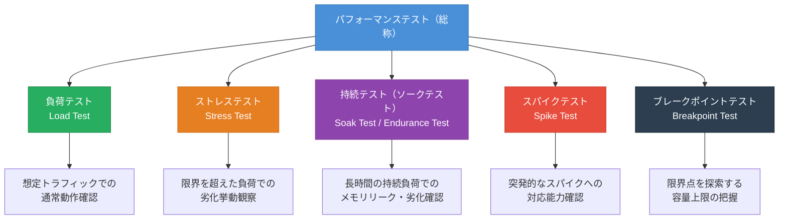
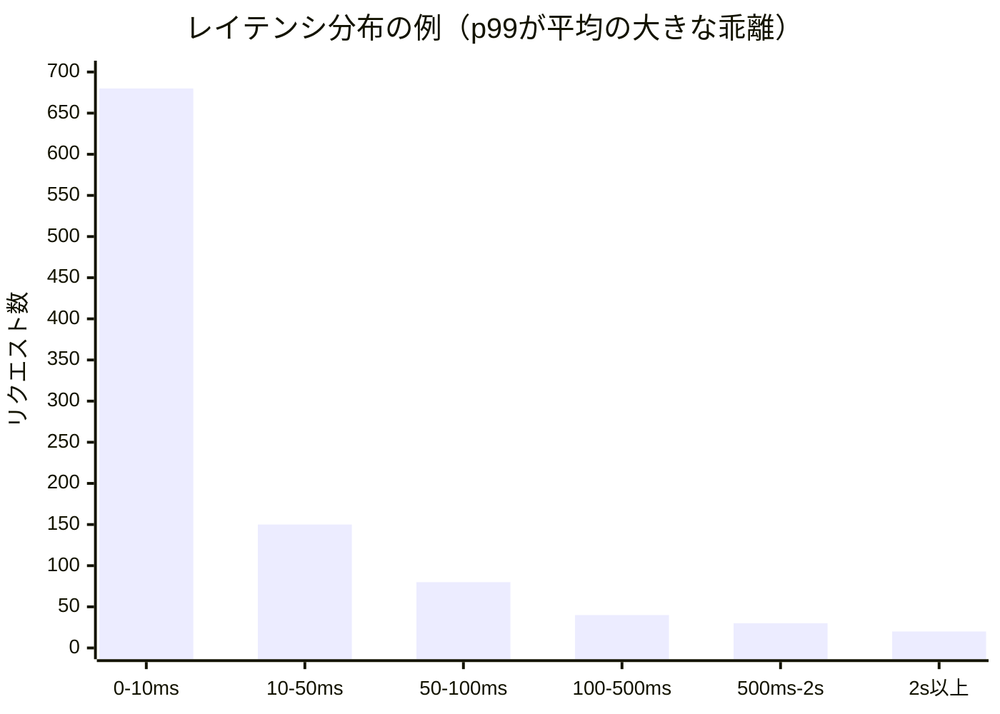
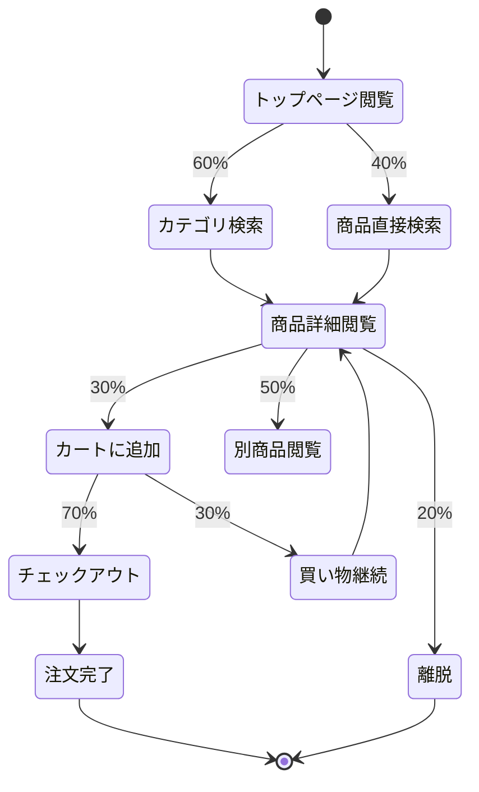
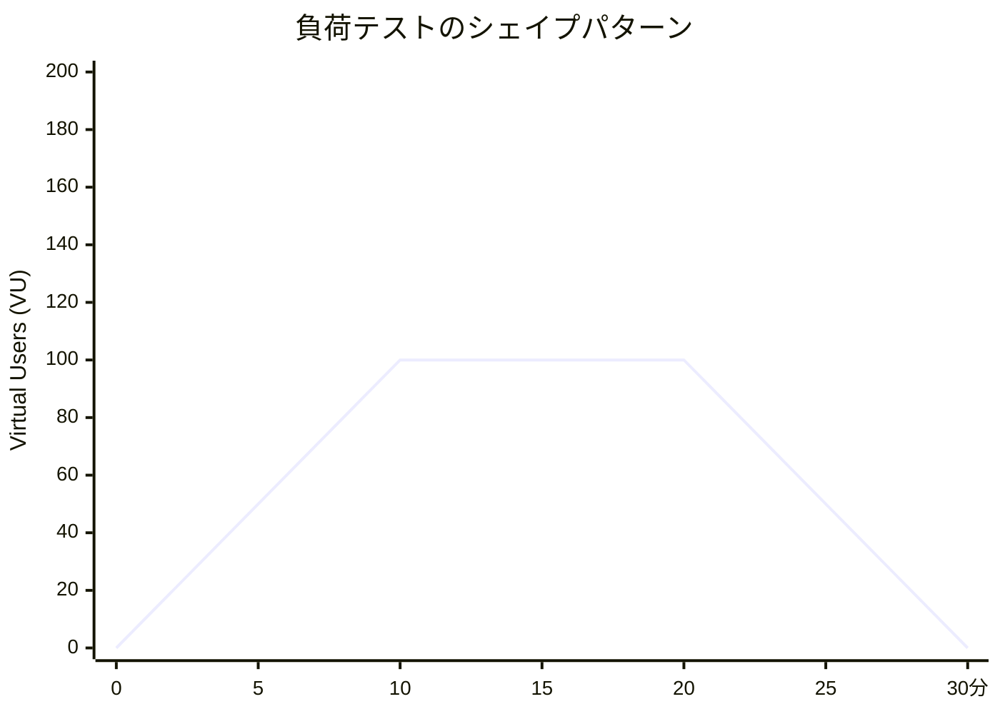
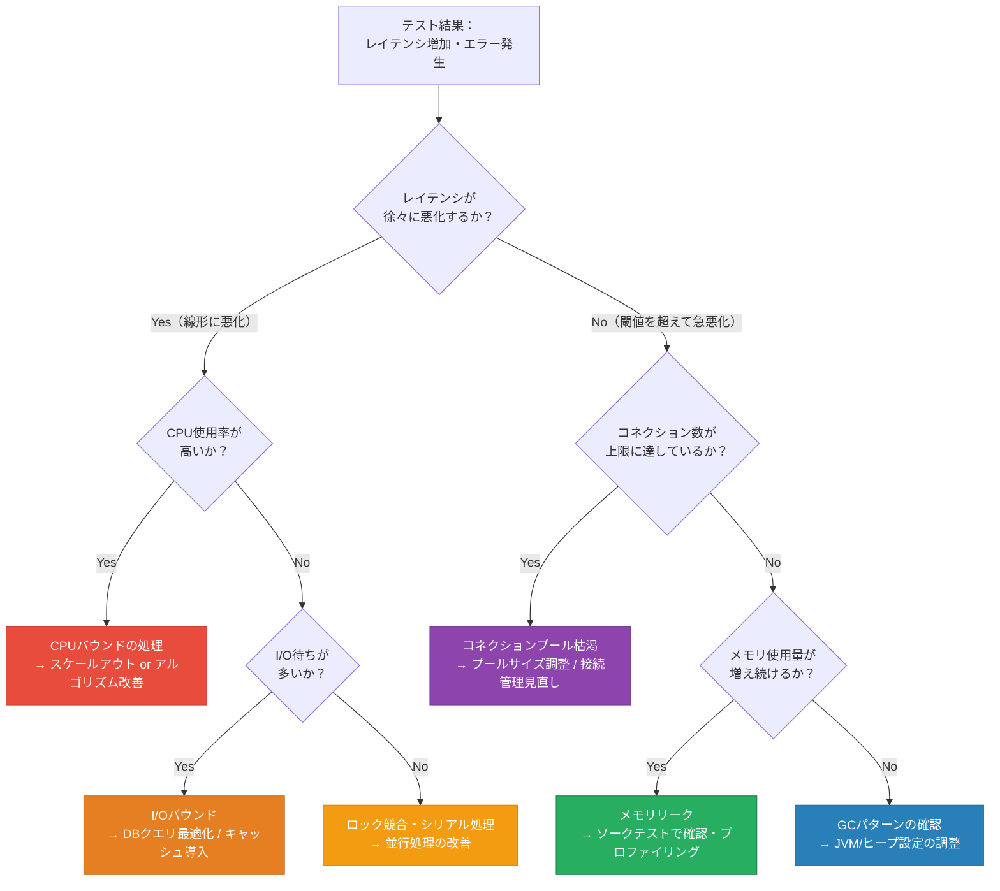
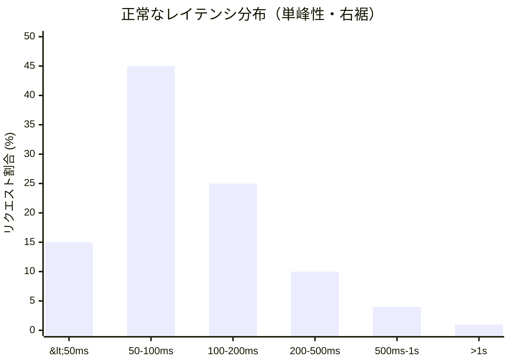
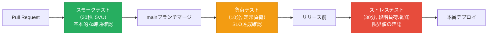
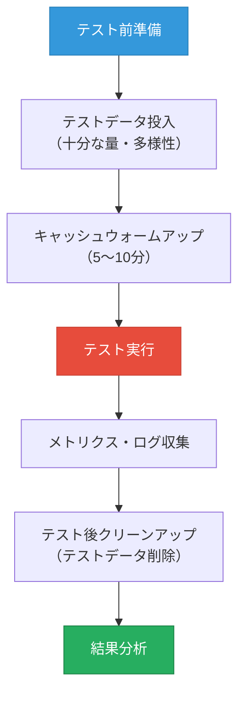

# 負荷テストの設計と実施（k6, Locust, シナリオ設計）

## 1. 負荷テストとは何か — 目的と位置づけ

### 1.1 なぜパフォーマンスを測定する必要があるのか

ソフトウェアシステムが「動く」ことと「本番の規模で動く」ことは根本的に異なる問題である。開発環境で問題なく動作するアプリケーションが、本番環境の実際のトラフィックにさらされた瞬間に応答時間が10倍になったり、メモリリークが発現してサービスが落ちたりする事例は枚挙にいとまがない。

2021年に発生したAmazon Prime Videoの事例、2016年のポケモンGOのサービス障害、2020年のNintendo Switch Onlineの混雑問題——これらはいずれも「機能的には正しく動く」システムが、実負荷に耐えられなかったことで引き起こされた問題である。

負荷テストは、本番で起きる可能性のある問題を事前に制御された環境で再現し、システムの挙動を観察・測定する実践である。これは単なる品質保証の一環ではなく、キャパシティプランニング、SLO（Service Level Objective）の設定、アーキテクチャ上の意思決定を支える根拠となるデータを生成する活動である。

### 1.2 パフォーマンステストの全体像

「負荷テスト」という言葉は広義には複数の異なるテスト手法を包含する。これらは目的・規模・観察対象が異なり、それぞれを適切に使い分ける必要がある。



**負荷テスト（Load Test）** は、想定されるピーク負荷またはその近傍でシステムを動かし、応答時間・エラーレート・スループットが許容範囲内に収まるかを検証する。SLO達成の確認が主な目的である。

**ストレステスト（Stress Test）** は、想定を超える負荷をかけてシステムの「破綻点」を観察する。どの時点でエラーが増加し始めるか、どのリソースがボトルネックになるか、過負荷状態から回復できるかを確認する。

**ソークテスト（Soak Test / Endurance Test）** は、中程度の負荷を長時間（数時間〜数十時間）継続してかけ続ける。メモリリーク、コネクションプールの枯渇、ガベージコレクションの劣化、外部リソースの漏洩など、「時間経過」によってのみ顕在化する問題を発見することが目的である。

**スパイクテスト（Spike Test）** は、通常負荷から突発的に数倍〜数十倍のトラフィックが流れ込む状況をシミュレートする。フラッシュセール、ニュース掲載、DDoSに近い瞬間的集中などの状況に対するシステムの挙動を検証する。

**ブレークポイントテスト（Breakpoint Test）** は、負荷を段階的に増加させ続けながら、どの時点でシステムがその限界（スループットの頭打ち、エラーレートの急増）に達するかを探索する。スケーリング戦略の立案とキャパシティプランニングに直結する情報を提供する。

## 2. 基礎概念と指標

### 2.1 測定すべき指標

負荷テストの結果を正しく解釈するには、計測対象となる指標の意味を正確に理解する必要がある。

**スループット（Throughput）** は、単位時間あたりに処理されたリクエスト数である。一般に RPS（Requests Per Second）または RPM（Requests Per Minute）で表現される。スループットはシステムが「どれだけの仕事をこなせるか」を示す。

**レイテンシ（Latency）** は、リクエストを送信してからレスポンスを受け取るまでの時間である。「応答時間」と呼ばれることも多い。ミリ秒（ms）単位で計測される。

**エラーレート（Error Rate）** は、全リクエストに占める失敗したリクエストの割合（%）である。HTTP 4xx/5xx、タイムアウト、コネクションエラーなどが含まれる。

**並行ユーザー数（Concurrent Users / Virtual Users）** は、同時に動作しているユーザーセッションの数である。これはシステムへの同時接続数とほぼ対応する。

### 2.2 パーセンタイルによるレイテンシ分析

レイテンシの分析において、平均値（Average）は極めて不適切な指標である。これは負荷テストの実践において最も重要な認識の一つである。

| 指標 | 意味 | 問題点 |
|------|------|--------|
| **平均値 (avg)** | 全リクエストの合計時間 / リクエスト数 | 外れ値（遅いリクエスト）の影響を隠蔽する |
| **中央値 (p50)** | 50%のリクエストがこの値以下 | ユーザーの「半分」の体験を示すが、遅いユーザーを無視する |
| **p95** | 95%のリクエストがこの値以下 | 多くのユーザーが体験する上限 |
| **p99** | 99%のリクエストがこの値以下 | ほとんどのユーザーが体験する上限 |
| **最大値 (max)** | 最も遅かったリクエスト | 単一の外れ値に影響されやすい |

例えば、1000件のリクエストのうち950件が10ms以内に完了し、50件が2000ms以上かかっているシステムを考える。平均値は約110ms程度に見えるが、p95は既に2000msを超える。ユーザーの20人に1人が2秒以上待たされているにもかかわらず、「平均100ms台の良いシステム」と誤解する危険がある。

SLOの設定においては `p99 < 500ms` のようなパーセンタイルベースの目標値を設定することが業界標準である。Googleの SRE 書籍でも、p99やp99.9を指標として使うことを推奨している。



### 2.3 Little's Law

負荷テストの設計において、キューイング理論の基礎的な法則である **Little's Law** は直感的な理解を助ける。

$$L = \lambda \cdot W$$

- $L$：システム内の平均リクエスト数（並行ユーザー数に対応）
- $\lambda$：単位時間あたりの到着率（スループット）
- $W$：リクエストがシステムにいる平均時間（レイテンシ）

例えば、スループットが 100 RPS でレイテンシが 200ms（= 0.2秒）のシステムでは、システム内には常に平均 $100 \times 0.2 = 20$ のリクエストが同時に存在している計算になる。

この関係式は、負荷テストのパラメータ設計に直接活用できる。「1000人の同時接続を想定するシステムで、平均レイテンシを500msに抑えたい」という目標がある場合、必要なスループットは $1000 / 0.5 = 2000 \text{ RPS}$ となる。

## 3. テスト計画とシナリオ設計

### 3.1 テスト計画の策定

負荷テストは「ツールを動かす」ことではなく「問いに答える」ことである。テスト開始前に以下の問いに答えておく必要がある。

**What（何を測るか）**：
- 対象のエンドポイントやユースケースは何か
- 測定すべきKPIは何か（スループット、レイテンシ、エラーレート）
- どのコンポーネントが観察対象か（APIサーバー、データベース、キャッシュ）

**When（どんな条件で）**：
- 想定する通常負荷・ピーク負荷はどの程度か
- テスト期間はどれくらいか（スプリント時間、長時間安定性テスト）
- どのシナリオタイプ（負荷テスト、ストレステスト等）を実施するか

**Who（誰のシナリオか）**：
- ユーザーは何をするか（ユーザー行動モデリング）
- トラフィックの比率はどうか（読み取り70%、書き込み30%など）
- 認証済みユーザーか匿名ユーザーか

**How（どう測定するか）**：
- テスト環境は本番と同等か（インフラ構成、データ量）
- どのツールを使うか
- 結果の合否基準（Acceptance Criteria）は何か

### 3.2 ユーザー行動モデリング

現実的な負荷テストは、実際のユーザーの行動パターンを模倣する必要がある。これを「ユーザー行動モデリング」と呼ぶ。

ECサイトを例に考えると、実際のユーザーは以下のような行動フローを取る。



このような状態遷移モデルに基づいてシナリオを設計すると、実際のトラフィックに近い負荷パターンが得られる。特に重要なのは「思考時間（Think Time）」の挿入である。実際のユーザーはページを読んでから次のアクションを取るため、リクエスト間には一定の待機時間がある。この待機時間なしにリクエストを連続送信すると、現実とかけ離れた「機械的な」トラフィックになってしまう。

### 3.3 ランプアップとシェイプ

負荷テストの「形状」はテスト目的によって異なる。主要なシェイプパターンを示す。



**定常負荷パターン**：ランプアップ後に一定負荷を維持する最も基本的なパターン。SLOの達成確認に使う。

**階段状パターン**：負荷を段階的に増やしながら各ステップで安定状態を確認する。ブレークポイントテストや容量計画に適している。

**スパイクパターン**：通常負荷から急激に負荷を上げ、また元に戻す。フラッシュセールや突発的なトラフィック急増への対応能力を測る。

## 4. k6 — JavaScriptによる負荷テスト

### 4.1 k6の概要と特徴

**k6** は、Grafana Labsが開発するオープンソースの負荷テストツールである。2017年にリリースされ、2021年にGrafana Labsによる買収を経て、現在も活発に開発が続いている。

k6の最大の特徴は、テストスクリプトを **JavaScript（ES2015+サブセット）** で記述できる点である。多くの開発者がすでにJavaScriptに親しんでいるため、学習コストが低い。ただし、k6はNode.jsではなく、GoのランタイムにGoja（GoベースのJavaScriptエンジン）を組み込んだ独自環境で動作する。このため、Node.jsのエコシステム（npm、Expressなど）はそのままでは使えない。

k6の主要な特徴を整理する。

- **軽量・高パフォーマンス**: Go製のコアにより、単一マシンで数十万VUのシミュレーションが可能
- **開発者フレンドリー**: JavaScriptベースのDSL、CLIでの実行、CI/CD統合の容易さ
- **豊富な出力先**: Grafana、InfluxDB、Prometheus、DatadogなどへのメトリクスエクスポートをOSS版でもサポート
- **拡張性**: k6 Extensions（xk6）によるGo製カスタム拡張

### 4.2 基本的なスクリプト構造

k6のスクリプトは、**default export** された関数を各VU（Virtual User）が繰り返し実行する構造を取る。

```javascript
import http from "k6/http";
import { check, sleep } from "k6";

// Test configuration
export const options = {
  vus: 50,        // number of virtual users
  duration: "30s", // test duration
};

// Default function executed by each VU in a loop
export default function () {
  // Send GET request
  const res = http.get("https://api.example.com/products");

  // Validate response
  check(res, {
    "status is 200": (r) => r.status === 200,
    "response time < 500ms": (r) => r.timings.duration < 500,
    "has products array": (r) => JSON.parse(r.body).products !== undefined,
  });

  // Think time: simulate user reading the page
  sleep(1);
}
```

`check()` 関数は、条件が真かどうかを検証し、結果を k6 の集計メトリクスに記録する。`check()` はテストを即座に失敗させるのではなく、成功・失敗の比率として記録する点が重要である。テストを失敗させたい場合は `thresholds`（後述）を使う。

### 4.3 ライフサイクル関数

k6 スクリプトには、VU ループ以外にいくつかのライフサイクル関数がある。

```javascript
import http from "k6/http";
import { check, sleep } from "k6";

// Runs once before the test starts (not per VU)
export function setup() {
  // Obtain a token for authenticated requests
  const loginRes = http.post("https://api.example.com/auth/login", {
    username: "testuser",
    password: "password123",
  });
  const token = JSON.parse(loginRes.body).token;
  return { token }; // passed to default() and teardown()
}

// Main VU loop
export default function (data) {
  const headers = { Authorization: `Bearer ${data.token}` };

  const res = http.get("https://api.example.com/orders", { headers });
  check(res, { "orders loaded": (r) => r.status === 200 });

  sleep(Math.random() * 2 + 0.5); // random think time 0.5–2.5s
}

// Runs once after the test ends
export function teardown(data) {
  // Cleanup: revoke test tokens, delete test data, etc.
  http.del(`https://api.example.com/auth/token/${data.token}`);
}
```

`setup()` の戻り値は `default()` と `teardown()` に引数として渡される。認証トークンの取得、テストデータの準備、フィクスチャの投入などに利用する。

### 4.4 シナリオとステージ

k6 では `stages` を使ってランプアップ・ランプダウンを含む負荷プロファイルを定義できる。

```javascript
import http from "k6/http";
import { sleep } from "k6";

export const options = {
  stages: [
    { duration: "2m", target: 100 },  // ramp up to 100 VUs over 2 min
    { duration: "5m", target: 100 },  // hold at 100 VUs for 5 min
    { duration: "2m", target: 200 },  // ramp up to 200 VUs (stress phase)
    { duration: "5m", target: 200 },  // hold at 200 VUs
    { duration: "2m", target: 0 },    // ramp down to 0
  ],
};

export default function () {
  http.get("https://api.example.com/health");
  sleep(1);
}
```

より精緻な制御が必要な場合は、`scenarios` オプションを使う。複数のワークロードを並行実行したり、到着率ベース（Open Model）の制御が可能になる。

```javascript
export const options = {
  scenarios: {
    // Scenario 1: Simulate 50 concurrent users browsing
    browse: {
      executor: "constant-vus",
      vus: 50,
      duration: "10m",
      exec: "browse", // calls the browse() function
    },
    // Scenario 2: Constant arrival rate of 10 checkouts/sec
    checkout: {
      executor: "constant-arrival-rate",
      rate: 10,              // 10 iterations per second
      timeUnit: "1s",
      duration: "10m",
      preAllocatedVUs: 20,   // pre-allocated VUs
      maxVUs: 50,            // maximum VUs allowed
      exec: "checkout",
    },
  },
};

// Browse scenario function
export function browse() {
  http.get("https://api.example.com/products");
  sleep(2);
}

// Checkout scenario function
export function checkout() {
  http.post("https://api.example.com/orders", JSON.stringify({
    productId: "prod_123",
    quantity: 1,
  }), { headers: { "Content-Type": "application/json" } });
  sleep(1);
}
```

**Executor の種類と使い分け**：

| Executor | 概念 | 用途 |
|----------|------|------|
| `constant-vus` | 固定VU数で実行（Closed Model） | 同時接続数を制御したい場合 |
| `ramping-vus` | VU数を段階的に変化させる | ランプアップ・ダウンを含む負荷テスト |
| `constant-arrival-rate` | 一定の到着率でリクエストを送信（Open Model） | RPSを制御したい場合 |
| `ramping-arrival-rate` | 到着率を段階的に変化させる | ブレークポイントテスト |
| `per-vu-iterations` | 各VUが指定回数繰り返す | 固定量の処理をこなすシナリオ |

**Closed Model と Open Model の違い**は重要である。Closed Model（VU固定）では、前のリクエストが完了するまで次のリクエストが始まらない。システムが遅くなるとスループットが自然に下がり、負荷が「自己調整」される。Open Model（到着率固定）では、システムの応答速度に関わらず一定の速度でリクエストが到着する。実際のインターネットトラフィックはOpen Modelに近く、システムが遅くなっても外部からのリクエストは止まらない。

### 4.5 Thresholds — 合否基準の設定

`thresholds` は、テストの合否を定義する仕組みである。しきい値を超えた場合、k6は終了コード1で終了し、CI/CDパイプラインでのテスト失敗として扱われる。

```javascript
export const options = {
  thresholds: {
    // 95% of requests must complete below 500ms
    "http_req_duration": ["p(95)<500"],
    // 99% of requests must complete below 1500ms
    "http_req_duration": ["p(95)<500", "p(99)<1500"],
    // Error rate must stay below 1%
    "http_req_failed": ["rate<0.01"],
    // Specific endpoint threshold using tags
    "http_req_duration{endpoint:checkout}": ["p(99)<2000"],
    // Custom metric threshold
    "checks": ["rate>0.99"], // 99% of checks must pass
  },
};
```

タグを使うと、エンドポイントごとに異なるしきい値を設定できる。

```javascript
import http from "k6/http";
import { check } from "k6";

export const options = {
  thresholds: {
    "http_req_duration{type:api}": ["p(95)<300"],
    "http_req_duration{type:static}": ["p(95)<100"],
  },
};

export default function () {
  // Tag API requests
  http.get("https://api.example.com/data", {
    tags: { type: "api" },
  });

  // Tag static asset requests
  http.get("https://cdn.example.com/bundle.js", {
    tags: { type: "static" },
  });
}
```

### 4.6 カスタムメトリクス

k6 の組み込みメトリクス（http_req_duration, http_req_failed など）に加え、ビジネスロジックに関連するカスタムメトリクスを定義できる。

```javascript
import http from "k6/http";
import { Counter, Gauge, Rate, Trend } from "k6/metrics";

// Define custom metrics
const cartAddDuration = new Trend("cart_add_duration");
const orderSuccess = new Rate("order_success_rate");
const activeOrders = new Gauge("active_orders_count");
const totalOrdersPlaced = new Counter("total_orders_placed");

export default function () {
  const startTime = Date.now();

  const res = http.post("https://api.example.com/cart/add", JSON.stringify({
    productId: "prod_456",
    quantity: 2,
  }), { headers: { "Content-Type": "application/json" } });

  // Record custom metric values
  cartAddDuration.add(Date.now() - startTime);
  orderSuccess.add(res.status === 200);

  if (res.status === 200) {
    totalOrdersPlaced.add(1);
    activeOrders.add(JSON.parse(res.body).activeOrders);
  }
}
```

## 5. Locust — Pythonによる分散負荷テスト

### 5.1 Locustの概要と特徴

**Locust** は、Pythonで書かれたオープンソースの負荷テストツールである。2011年に誕生し、Python エコシステムの豊富なライブラリを活用できること、Webベースのリアルタイムダッシュボードを標準搭載していること、分散実行が比較的容易なことが特徴である。

Locustの設計哲学は「コードとしてのテスト」である。テストシナリオをPythonの通常のコードとして記述でき、複雑なユーザー行動モデルを実装するために任意のPythonライブラリが使える。データベースに接続してテストデータを動的に生成したり、外部APIを呼び出してトークンを取得したりすることが容易である。

**k6 vs Locust の比較**：

| 項目 | k6 | Locust |
|------|----|----|
| 言語 | JavaScript (ES2015+) | Python |
| 実行エンジン | Go + Goja | Python (gevent/asyncio) |
| 最大同時VU | 非常に高い（Go製コア） | 中程度（Pythonのオーバーヘッド） |
| UIダッシュボード | CLIのみ（Grafana連携別途） | 組み込みWeb UI |
| 分散実行 | k6 Cloud or マニュアル | 組み込みMaster/Worker |
| ライブラリ利用 | k6 Extensions（限定的） | 任意のPythonライブラリ |
| 学習コスト | 低（JS知識で即利用可） | 中程度（Pythonの非同期を理解要） |

### 5.2 基本的なLocustfileの構造

Locust のテストは `locustfile.py` というファイルに記述する。`HttpUser` クラスを継承し、`@task` デコレータでタスクを定義する。

```python
from locust import HttpUser, task, between

class ECommerceUser(HttpUser):
    # Wait time between tasks: 1-3 seconds (think time)
    wait_time = between(1, 3)

    @task(3)  # weight: this task runs 3x more often than weight-1 tasks
    def view_products(self):
        """Browse the product catalog."""
        self.client.get("/api/products", name="/api/products")

    @task(1)
    def view_product_detail(self):
        """View a specific product."""
        product_id = "prod_123"
        # Use 'name' parameter to group URLs with dynamic segments
        self.client.get(
            f"/api/products/{product_id}",
            name="/api/products/[id]"
        )

    @task(1)
    def add_to_cart(self):
        """Add a product to the cart."""
        with self.client.post(
            "/api/cart/items",
            json={"productId": "prod_123", "quantity": 1},
            catch_response=True,  # manually control success/failure
        ) as response:
            if response.status_code == 200:
                response.success()
            else:
                response.failure(f"Unexpected status: {response.status_code}")
```

`@task` の引数は重みであり、複数のタスクに異なる重みを設定することでトラフィック比率を制御できる。`name` パラメータは重要で、`/api/products/123` や `/api/products/456` といった動的URLを同一グループとして集計するために使う。

### 5.3 ライフサイクルとセッション管理

実際のシナリオでは、ユーザーのログイン状態やセッション管理が必要になる。Locust では `on_start` と `on_stop` を使う。

```python
import json
from locust import HttpUser, task, between, events

class AuthenticatedUser(HttpUser):
    wait_time = between(1, 5)

    def on_start(self):
        """Called when a user starts. Perform login here."""
        response = self.client.post("/api/auth/login", json={
            "username": f"testuser_{self.user_id}",
            "password": "test_password",
        })
        if response.status_code == 200:
            data = response.json()
            # Store token in session headers
            self.client.headers.update({
                "Authorization": f"Bearer {data['token']}"
            })
            self.user_data = data["userProfile"]
        else:
            raise Exception(f"Login failed: {response.status_code}")

    def on_stop(self):
        """Called when a user stops. Perform logout here."""
        self.client.post("/api/auth/logout")

    @task(5)
    def view_dashboard(self):
        self.client.get("/api/dashboard")

    @task(2)
    def view_orders(self):
        self.client.get("/api/orders", name="/api/orders")

    @task(1)
    def place_order(self):
        self.client.post("/api/orders", json={
            "items": [{"productId": "prod_001", "quantity": 1}],
            "shippingAddressId": self.user_data.get("defaultAddressId"),
        })
```

### 5.4 分散実行

Locust は組み込みの Master/Worker モデルで分散実行をサポートしている。

```bash
# Start master node (manages workers, shows Web UI)
locust -f locustfile.py --master --host=https://api.example.com

# Start worker nodes (each handles a share of virtual users)
locust -f locustfile.py --worker --master-host=localhost

# Headless (no UI) run with multiple workers
locust -f locustfile.py \
  --headless \
  --users 1000 \
  --spawn-rate 50 \
  --run-time 10m \
  --host https://api.example.com \
  --master &

locust -f locustfile.py --worker --master-host=localhost &
locust -f locustfile.py --worker --master-host=localhost &
```

Kubernetes 環境での分散実行は以下のような構成になる。

```yaml
# Locust master deployment
apiVersion: apps/v1
kind: Deployment
metadata:
  name: locust-master
spec:
  replicas: 1
  selector:
    matchLabels:
      app: locust-master
  template:
    metadata:
      labels:
        app: locust-master
    spec:
      containers:
      - name: locust-master
        image: locustio/locust:latest
        args:
          - -f
          - /mnt/locust/locustfile.py
          - --master
          - --host=https://api.example.com
        ports:
        - containerPort: 8089  # Web UI
        - containerPort: 5557  # Master communication
---
# Locust worker deployment
apiVersion: apps/v1
kind: Deployment
metadata:
  name: locust-worker
spec:
  replicas: 10  # scale out workers
  template:
    spec:
      containers:
      - name: locust-worker
        image: locustio/locust:latest
        args:
          - -f
          - /mnt/locust/locustfile.py
          - --worker
          - --master-host=locust-master
```

## 6. 結果の分析と解釈

### 6.1 標準的なメトリクスの読み方

k6 テスト完了後のサマリー出力を例に、各指標の読み方を解説する。

```
     ✓ status is 200
     ✓ response time < 500ms

     checks.........................: 98.32% ✓ 29496   ✗ 501
     data_received..................: 45 MB  750 kB/s
     data_sent......................: 8.2 MB 137 kB/s
     http_req_blocked...............: avg=1.2ms    min=2µs    med=5µs   max=3.2s   p(90)=9µs    p(95)=12µs
     http_req_connecting............: avg=0.5ms    min=0µs    med=0µs   max=1.8s   p(90)=0µs    p(95)=0µs
   ✓ http_req_duration..............: avg=98ms     min=12ms   med=72ms  max=8.3s   p(90)=195ms  p(95)=285ms
       { expected_response:true }...: avg=96ms     min=12ms   med=70ms  max=5.1s   p(90)=190ms  p(95)=280ms
   ✓ http_req_failed................: 1.67%  ✓ 501     ✗ 29496
     http_req_receiving.............: avg=0.8ms    min=15µs   med=0.3ms max=120ms  p(90)=1.8ms  p(95)=3.1ms
     http_req_sending...............: avg=0.1ms    min=8µs    med=48µs  max=45ms   p(90)=0.2ms  p(95)=0.3ms
     http_req_tls_handshaking.......: avg=0.5ms    min=0µs    med=0µs   max=1.2s   p(90)=0µs    p(95)=0µs
     http_req_waiting...............: avg=97ms     min=11ms   med=71ms  max=8.2s   p(90)=193ms  p(95)=283ms
     http_reqs......................: 30000  500.0/s
     iteration_duration.............: avg=1.1s     min=1.01s  med=1.07s max=9.3s   p(90)=1.2s   p(95)=1.3s
     iterations.....................: 30000  500.0/s
     vus............................: 50     min=50     max=50
     vus_max........................: 50     min=50     max=50
```

この出力から読み取れる重要な点を解析する。

**正常系の観察**：
- `http_reqs: 30000, 500.0/s` — テスト期間中 500 RPS を達成している
- `http_req_duration: med=72ms, p(95)=285ms` — 中央値 72ms は良好だが、p95 が 285ms に到達している

**問題の兆候**：
- `http_req_duration: max=8.3s` — 最大 8.3秒のリクエストが存在する
- `http_req_blocked: max=3.2s` — 一部のリクエストがコネクション確立で大幅に待たされている。コネクションプールの枯渇が疑われる
- `http_req_failed: 1.67%` — エラーレートが 1.67% であり、閾値 1% を超えている

このような場合、次のステップとして APM ツール（Datadog、New Relic など）やアプリケーションログと突き合わせ、どのエンドポイントで遅延が発生しているか、エラーの種類（DB接続タイムアウト、メモリ不足など）を特定する。

### 6.2 ボトルネックの特定パターン

負荷テスト結果からボトルネックを特定する際の典型的なパターンを示す。



### 6.3 レイテンシ分布の可視化と解釈

パーセンタイルの数値だけを見るのではなく、レイテンシ分布のヒストグラムを確認することが重要である。



正常なシステムでは上記のような「右裾を持つ単峰性の分布」になる。問題があるシステムでは以下のような異常パターンが現れることがある。

- **二峰性分布**：高速なキャッシュヒットと低速なキャッシュミスが混在している可能性
- **長い右裾**：タイムアウト待ちや再試行によるロングテール
- **階段状の分布**：固定タイムアウト値による人工的なクリフ（例：全リクエストの5%がちょうど5000msで失敗）

## 7. CI/CDへの統合

### 7.1 パイプラインへの組み込み戦略

負荷テストは CI/CD パイプラインに組み込むことで、パフォーマンスリグレッションを継続的に検出できる。ただし、完全な負荷テストをすべてのコミットで実行するのは現実的ではない。以下のような段階的な戦略が一般的である。



**スモークテスト（Smoke Test）** は最も軽量で、少数のVU（3〜5）を30秒程度実行し、基本的なエンドポイントが正常に応答することを確認する。すべてのPRで実行し、「壊れていない」ことの最低限の確認を行う。

**定常負荷テスト** はmainブランチへのマージ時またはスプリント終了時に実行する。想定ピーク負荷の70〜80%程度で10〜20分間、SLOが達成されているかを検証する。

**ストレステスト・ブレークポイントテスト** はリリース前の重要なマイルストーンで実行する。時間がかかるため、頻繁には実行しない。

### 7.2 GitHub Actions での k6 統合例

```yaml
name: Performance Tests

on:
  push:
    branches: [main]
  pull_request:
    branches: [main]

jobs:
  smoke-test:
    runs-on: ubuntu-latest
    steps:
      - uses: actions/checkout@v4

      - name: Run k6 smoke test
        uses: grafana/k6-action@v0.3.1
        with:
          filename: tests/load/smoke.js
        env:
          K6_API_BASE_URL: ${{ secrets.STAGING_API_URL }}

  load-test:
    runs-on: ubuntu-latest
    # Only run on main branch pushes
    if: github.ref == 'refs/heads/main'
    needs: smoke-test
    steps:
      - uses: actions/checkout@v4

      - name: Run k6 load test
        uses: grafana/k6-action@v0.3.1
        with:
          filename: tests/load/load_test.js
          flags: --out json=results.json
        env:
          K6_API_BASE_URL: ${{ secrets.STAGING_API_URL }}

      - name: Upload results
        uses: actions/upload-artifact@v4
        if: always()
        with:
          name: k6-results
          path: results.json
```

スモークテスト用スクリプト（`tests/load/smoke.js`）の例：

```javascript
import http from "k6/http";
import { check } from "k6";

const BASE_URL = __ENV.K6_API_BASE_URL || "http://localhost:3000";

// Minimal smoke test: just verify endpoints respond correctly
export const options = {
  vus: 3,
  duration: "30s",
  thresholds: {
    http_req_failed: ["rate<0.01"],       // < 1% errors
    http_req_duration: ["p(95)<1000"],    // p95 under 1s
  },
};

export default function () {
  const res = http.get(`${BASE_URL}/api/health`);
  check(res, {
    "health check ok": (r) => r.status === 200,
  });
}
```

### 7.3 パフォーマンスリグレッションの検出

テスト結果を時系列で比較することで、コード変更によるパフォーマンス低下を自動検出できる。

```javascript
// Load test with performance regression detection
export const options = {
  thresholds: {
    // Absolute threshold
    "http_req_duration": ["p(95)<500"],
    // Custom metric: compare against baseline
    "http_req_duration{expected_response:true}": [
      { threshold: "p(95)<500", abortOnFail: true }, // abort if exceeded
    ],
  },
};
```

InfluxDB + Grafana、または Grafana Cloud k6 を使うと、過去のテスト実行と現在の結果を時系列でダッシュボード上に比較表示できる。パフォーマンスが一定割合以上劣化した場合にアラートを発火させる設定も可能である。

## 8. クラウド環境での分散負荷テスト

### 8.1 分散実行が必要になる規模

単一マシンから発生させられるトラフィックには上限がある。k6 は Go 製で効率的だが、それでも1台のマシンから安定して発生させられる最大負荷は概ね数万 RPS 程度が現実的な上限である。より大規模な負荷テスト（数十万〜数百万 RPS、グローバルな地理分散）が必要な場合は分散実行が必要になる。

また、CDN や BGP anycast を使うサービスは、単一 IP からのトラフィックと複数地域から分散されたトラフィックでは挙動が大きく異なる。実際のグローバルユーザーを模したテストには地理分散が不可欠である。

### 8.2 Kubernetes 上での k6 分散実行

k6 operator を使うことで、Kubernetes 上に k6 テストジョブを分散実行できる。

```yaml
apiVersion: k6.io/v1alpha1
kind: TestRun
metadata:
  name: load-test-distributed
spec:
  parallelism: 10  # run 10 k6 pods in parallel
  script:
    configMap:
      name: load-test-script
      file: load_test.js
  arguments: --vus 1000 --duration 10m
  # Each pod handles 1000/10 = 100 VUs
```

k6 operator は Kubernetes のジョブとして各 Pod を起動し、それぞれが独立して対象システムに負荷をかける。結果は operator が集約し、統合されたメトリクスとして出力する。

### 8.3 Grafana Cloud k6 によるクラウドネイティブな実行

**Grafana Cloud k6**（旧称：k6 Cloud）は、SaaS として提供されるマネージドな k6 実行環境である。スクリプトをアップロードするだけで、Grafana のグローバルインフラ上で分散実行が可能になる。

```bash
# Install k6 and login to Grafana Cloud
k6 login cloud --token $K6_CLOUD_TOKEN

# Run test in cloud (automatically distributed)
k6 cloud load_test.js
```

クラウド実行の主なメリット：
- 最大500,000 VU の実行が可能
- 複数の地理ロケーション（米国東部、欧州、アジアなど）から同時にトラフィックを発生
- 結果のダッシュボード・分析・チーム共有が SaaS として提供

### 8.4 Locust の大規模分散実行

Locust の分散実行を大規模に行う場合、AWS ECS や Kubernetes を活用する。以下は Terraform を使った AWS ECS での Locust 分散クラスター構築の概略である。

```hcl
# Terraform: Locust master task definition
resource "aws_ecs_task_definition" "locust_master" {
  family                   = "locust-master"
  requires_compatibilities = ["FARGATE"]
  network_mode             = "awsvpc"
  cpu                      = 2048
  memory                   = 4096

  container_definitions = jsonencode([{
    name  = "locust-master"
    image = "locustio/locust:latest"
    command = [
      "-f", "/mnt/locust/locustfile.py",
      "--master",
      "--host", "https://api.example.com",
      "--headless",
      "--users", "5000",
      "--spawn-rate", "100",
      "--run-time", "30m"
    ]
    # Mount EFS volume containing locustfile.py
    mountPoints = [{
      sourceVolume  = "locust-scripts"
      containerPath = "/mnt/locust"
    }]
  }])
}

# Worker service: scale out for distributed load generation
resource "aws_ecs_service" "locust_workers" {
  name            = "locust-workers"
  cluster         = aws_ecs_cluster.load_test.id
  task_definition = aws_ecs_task_definition.locust_worker.arn
  desired_count   = 20  # 20 worker tasks
  launch_type     = "FARGATE"
}
```

## 9. 高度なシナリオ設計テクニック

### 9.1 相関データとデータ駆動テスト

実際のユーザー行動では、あるリクエストのレスポンスに含まれる値（セッションID、商品ID、注文番号など）を次のリクエストで使用する「相関（Correlation）」が頻繁に発生する。

```javascript
// k6: data correlation example
import http from "k6/http";
import { check } from "k6";

export default function () {
  // Step 1: Create a cart, get cart ID from response
  const cartRes = http.post("https://api.example.com/cart", "{}");
  check(cartRes, { "cart created": (r) => r.status === 201 });

  const cartId = JSON.parse(cartRes.body).cartId; // extract dynamic ID

  // Step 2: Add item using the dynamic cart ID
  const addRes = http.post(
    `https://api.example.com/cart/${cartId}/items`,
    JSON.stringify({ productId: "prod_789", quantity: 1 }),
    { headers: { "Content-Type": "application/json" } }
  );
  check(addRes, { "item added": (r) => r.status === 200 });

  // Step 3: Checkout with the cart
  const orderRes = http.post(`https://api.example.com/cart/${cartId}/checkout`);
  check(orderRes, { "order placed": (r) => r.status === 201 });
}
```

データ駆動テストでは、CSVやJSONファイルから読み込んだデータを使ってリクエストパラメータを変化させる。

```javascript
// k6: data-driven test using SharedArray
import http from "k6/http";
import { SharedArray } from "k6/data";

// Load test data once and share across VUs (memory-efficient)
const users = new SharedArray("test users", function () {
  return JSON.parse(open("./testdata/users.json"));
});

export default function () {
  // Each VU picks a different user from the array
  const user = users[__VU % users.length];

  const res = http.post("https://api.example.com/auth/login", JSON.stringify({
    username: user.email,
    password: user.password,
  }), { headers: { "Content-Type": "application/json" } });
}
```

`SharedArray` は、複数のVUがデータを共有してメモリ効率よくアクセスできる仕組みである。VU数が多い場合に特に有効である。

### 9.2 カスタムタグを使ったセグメント分析

本番環境のトラフィックには複数のユーザー種別（無料ユーザー・有料ユーザー・管理者など）が混在する。k6のタグを使って、各セグメントのパフォーマンスを個別に計測できる。

```javascript
import http from "k6/http";
import { group, check } from "k6";

export const options = {
  thresholds: {
    // Separate thresholds for free and premium users
    "http_req_duration{userType:free}": ["p(95)<800"],
    "http_req_duration{userType:premium}": ["p(95)<300"],
  },
};

export default function () {
  // Premium user scenario
  group("premium user flow", function () {
    http.get("https://api.example.com/dashboard", {
      tags: { userType: "premium", flow: "dashboard" },
      headers: { Authorization: "Bearer premium_token" },
    });
  });

  // Free user scenario
  group("free user flow", function () {
    http.get("https://api.example.com/dashboard", {
      tags: { userType: "free", flow: "dashboard" },
      headers: { Authorization: "Bearer free_token" },
    });
  });
}
```

### 9.3 思考時間のモデリング

思考時間（Think Time）の分布はランダム性を持たせることが重要である。一定の固定値を使うと、すべてのVUが同期して同タイミングでリクエストを送信する「ヒットエフェクト」が生じ、現実離れしたトラフィックパターンになる。

```javascript
import { sleep } from "k6";

// Uniform distribution: random value between min and max
function uniformSleep(min, max) {
  return sleep(Math.random() * (max - min) + min);
}

// Exponential distribution: models real user think time more accurately
function exponentialSleep(mean) {
  return sleep(-Math.log(Math.random()) * mean);
}

export default function () {
  // Page view with realistic think time (exponential with mean 2s)
  http.get("https://api.example.com/page");
  exponentialSleep(2);
}
```

指数分布は、「多くのユーザーは短い思考時間で次のアクションを取るが、一部のユーザーは長時間考える」という実際のユーザー行動に近い分布を生成する。

## 10. 観測可能性との統合

### 10.1 メトリクスのエクスポート

負荷テスト単体のメトリクスだけでなく、テスト実行中のシステム側のメトリクス（CPU、メモリ、DB接続数、GCの頻度など）を同時に収集・比較することが、ボトルネック特定に不可欠である。

k6 は複数のバックエンドへのメトリクスエクスポートをサポートしている。

```javascript
// k6 with InfluxDB output
// Run with: k6 run --out influxdb=http://localhost:8086/k6 script.js

export const options = {
  // Grafana Cloud k6 output configuration
  cloud: {
    projectID: 12345,
    name: "Production Load Test",
  },
};
```

```bash
# Export to InfluxDB (then visualize in Grafana)
k6 run --out influxdb=http://localhost:8086/k6 load_test.js

# Export to Prometheus remote write
k6 run --out experimental-prometheus-rw load_test.js

# Export to JSON for custom analysis
k6 run --out json=results.json load_test.js
```

### 10.2 分散トレーシングとの連携

負荷テスト中にリクエストに trace ID を付与することで、遅延の原因をシステム内のどのコンポーネントに帰因させるかを特定できる。

```javascript
import http from "k6/http";
import { uuidv4 } from "https://jslib.k6.io/k6-utils/1.4.0/index.js";

export default function () {
  // Inject trace ID for distributed tracing correlation
  const traceId = uuidv4().replace(/-/g, "");
  const res = http.get("https://api.example.com/orders", {
    headers: {
      "X-Request-ID": traceId,
      "traceparent": `00-${traceId}-${uuidv4().replace(/-/g, "").slice(0, 16)}-01`,
    },
  });
}
```

テスト中の遅延スパイクのタイムスタンプを記録しておき、同期間のJaegerやZipkinのトレースを参照することで、どのサービス・どのDB呼び出しが遅延を引き起こしているかを特定できる。

## 11. アンチパターンと注意点

### 11.1 よくある失敗パターン

> [!WARNING]
> 以下のアンチパターンは、負荷テストの結果を無効にしたり、本番環境に悪影響を与える可能性がある。

**本番環境への直接テスト**：初めから本番環境に大量の負荷をかけることは危険である。ステージング環境が本番と同等のインフラ構成であることを確認した上でテストを行い、本番テストは綿密な計画のもとで実施する。

**思考時間なしのテスト**：sleep なしでリクエストをループさせると、実際のトラフィックの数十倍の同時接続数が発生し、「現実にはありえない」システム崩壊シナリオになる。

**キャッシュのウォームアップ忘れ**：テスト開始直後はキャッシュが空の状態のため、通常運用より著しく遅い結果が出る。テスト前に十分なウォームアップ期間を設けるか、結果の分析時にウォームアップ期間を除外する。

**テスト環境のインフラ差異**：ステージング環境が本番環境の 1/10 のリソースであれば、結果は本番の参考にならない。インフラ構成・データ量・ネットワークレイテンシを可能な限り本番に近づける。

**単一エンドポイントのみのテスト**：特定のエンドポイントのみをテストすると、実際の本番トラフィックでは別のエンドポイントがボトルネックになることがある。実際のトラフィック比率を反映した複合シナリオでテストする。

### 11.2 テスト環境のデータ管理



テストデータは現実的な量・多様性を持たせる必要がある。商品テーブルが10件しかない状態でのテストは、インデックスの効率・ページネーションの処理・フルテーブルスキャンの発生などが本番と大きく異なる。本番相当のデータ量（数百万〜数千万レコード）でテストすることが重要である。

## 12. 負荷テストの文化的定着

### 12.1 シフトレフトとしての負荷テスト

負荷テストは「リリース前の最終確認」ではなく、開発プロセスの早い段階から行う「シフトレフト」の考え方が重要である。

::: tip シフトレフトの実践
- **スプリント内でのスモークテスト**：新機能追加のPRごとに軽量な負荷テストをCIで実行する
- **パフォーマンスバジェット**：機能要件と同様に、エンドポイントのレイテンシ目標値（例: `GET /products` は p95 < 200ms）をチケット・PRのAcceptance Criteriaに含める
- **定期的なブレークポイントテスト**：月次または四半期ごとに限界値テストを実施し、スケーリング計画を更新する
:::

### 12.2 負荷テスト結果を活用した意思決定

負荷テストの結果は単なる数値の羅列ではなく、アーキテクチャの意思決定・インフラコストの最適化・SLOの根拠となるデータである。

**キャパシティプランニング**：ブレークポイントテストで「1インスタンスで500 RPSが限界」と分かれば、ピーク1500 RPSに備えて最低3インスタンスが必要と計算できる。オートスケーリングのしきい値設定にも活用する。

**SLOの設定根拠**：「p99 < 500ms」というSLOは、テストデータに基づく達成可能な目標値でなければならない。負荷テストなしでSLOを設定すると、根拠のない数値になる。

**技術的負債の可視化**：新機能追加のたびにp99が少しずつ悪化している傾向を数値で示せれば、「パフォーマンス改善スプリント」への投資を経営陣に説明する材料になる。

## まとめ

負荷テストは、ソフトウェアシステムが本番環境の実際の負荷に耐えられるかを検証するための不可欠な実践である。

テストツールの選択（k6 の軽量・高性能・JS DSL vs Locust の Python エコシステム・組み込みUI）よりも、**何を測りたいか**を明確にすること、**現実的なユーザー行動をモデリング**すること、**thresholds/acceptance criteria で合否を定義**することが本質的に重要である。

p50/p95/p99 によるパーセンタイルベースの分析、ボトルネックを体系的に特定するためのサーバーサイドメトリクスとの相関分析、CI/CDパイプラインへの段階的な統合（スモーク→負荷→ストレス）——これらを組み合わせることで、負荷テストはアドホックな作業から継続的なエンジニアリングプラクティスへと昇華する。

「本番で初めて分かる」パフォーマンス問題は、その修正コストが開発段階の数十倍に達することが知られている。負荷テストへの投資は、ユーザー体験の保護とエンジニアリングの安心感の両方をもたらす。
