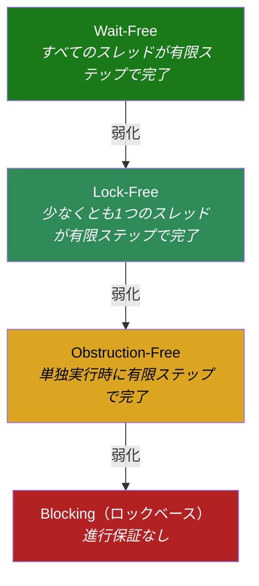
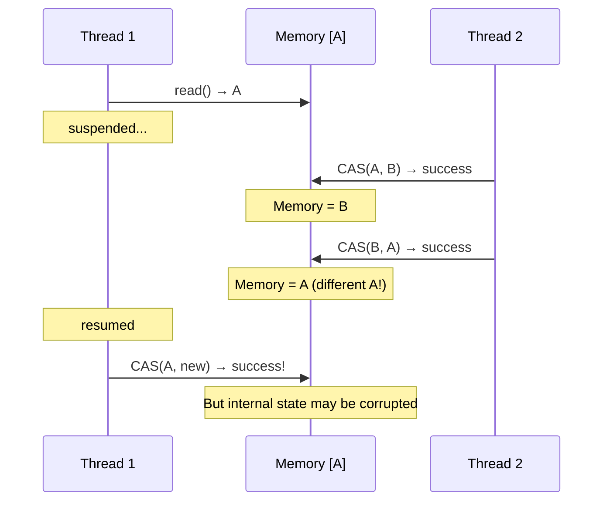
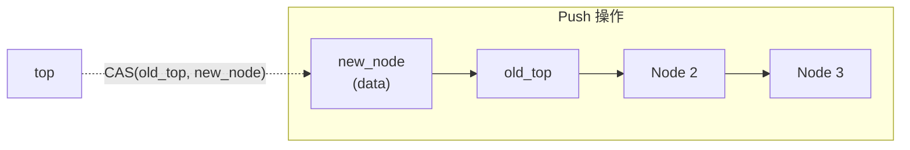
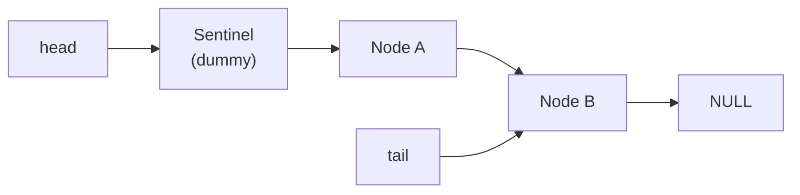
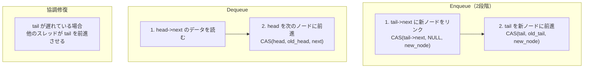
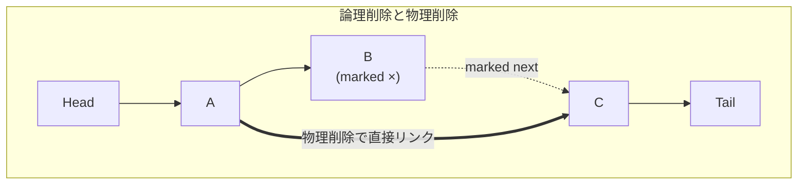
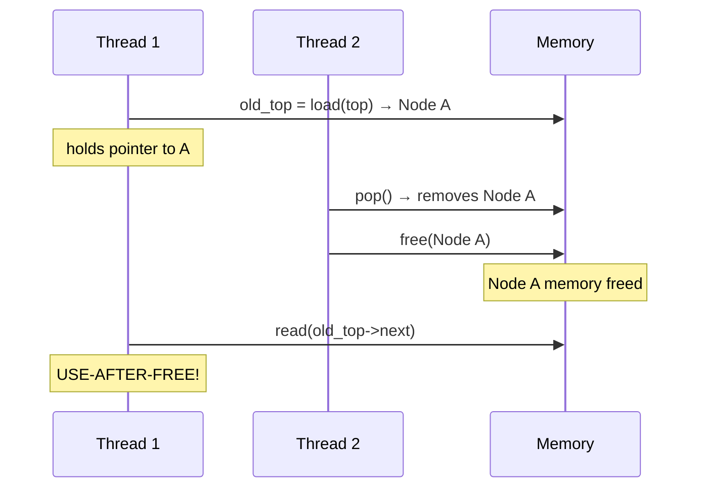
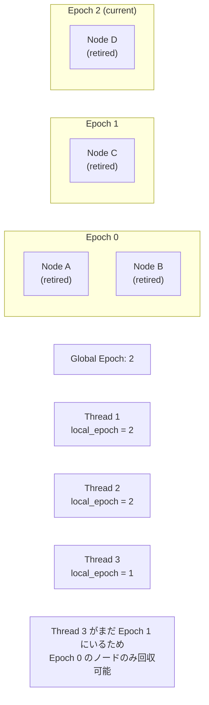
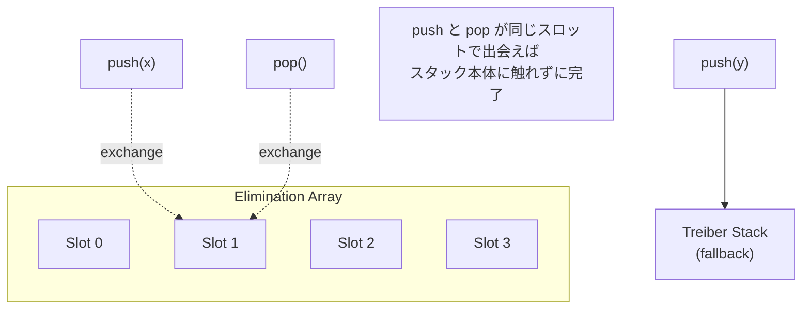
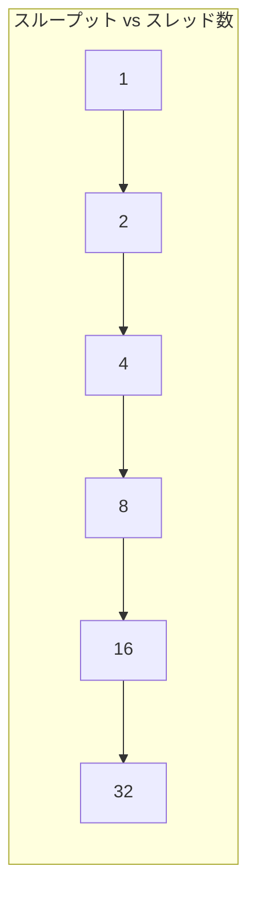

# ロックフリーデータ構造 — CAS, Treiber Stack, Michael-Scott Queue, Harris List

## 1. 背景と動機 — なぜロックフリーが必要なのか

マルチスレッドプログラミングにおいて、共有データへの安全なアクセスを保証する最も一般的な手段はロック（Mutex）である。ロックは正しく使えば相互排他を実現できるが、以下のような本質的な問題を抱えている。

1. **優先度逆転（Priority Inversion）**: 低優先度のスレッドがロックを保持している間に高優先度のスレッドがブロックされ、システム全体のレイテンシが悪化する。Mars Pathfinder の事例（1997年）はこの問題が実際のミッションクリティカルシステムで発生した有名な例である
2. **コンボイ効果（Convoy Effect）**: ロックを保持するスレッドがOSによってプリエンプトされると、そのロックを待つすべてのスレッドが連鎖的にブロックされる
3. **デッドロック**: 複数のロックを異なる順序で取得しようとするスレッドが互いにブロックし合い、永遠に進行しなくなる
4. **スケーラビリティの限界**: ロックの競合が増えるほどスループットが低下し、コア数を増やしてもスケールしない

これらの問題に対する根本的なアプローチとして、**ロックを使わずに共有データ構造への並行アクセスを安全に実現する**手法が研究されてきた。これが**ロックフリーデータ構造（Lock-Free Data Structures）** である。

### 1.1 歴史的背景

ロックフリーアルゴリズムの歴史は、1970年代の Lamport による研究にまで遡る。しかし、実用的なロックフリーデータ構造が提案されるようになったのは1980年代後半から1990年代にかけてである。

- **1986年**: Treiber がロックフリースタックを発表
- **1996年**: Michael と Scott がロックフリーキューを発表（Michael-Scott Queue）
- **2001年**: Harris がロックフリー連結リストを発表（Harris List）
- **2002年**: Michael が Hazard Pointers を提案し、メモリ安全回収の基盤を築いた
- **2004年**: Fraser が Epoch-Based Reclamation を提案

これらの研究は、現代の並行データ構造ライブラリ（Java の `java.util.concurrent`、Rust の `crossbeam`、C++ の `libcds` など）の理論的基盤となっている。

## 2. 進行保証の階層 — Wait-Free, Lock-Free, Obstruction-Free

ロックフリーデータ構造を理解するうえで最も重要な概念は、**進行保証（Progress Guarantee）** の階層である。並行アルゴリズムは、どの程度の進行を保証するかによって分類される。

### 2.1 Wait-Free（ウェイトフリー）

**定義**: すべてのスレッドが、他のスレッドの動作に関係なく、有限ステップ以内に自身の操作を完了できる。

Wait-Free は最も強い進行保証である。どのスレッドもスターベーション（飢餓状態）に陥ることがなく、各操作の最悪計算量に上限がある。リアルタイムシステムにおいて最も望ましい性質だが、実装は非常に複雑でオーバーヘッドも大きくなる傾向がある。

Wait-Free アルゴリズムの例としては、Herlihy の Universal Construction がある。これは任意の逐次データ構造を Wait-Free に変換する汎用的な手法だが、実用的なオーバーヘッドが大きいため、多くの場合は特化型のアルゴリズムが用いられる。

### 2.2 Lock-Free（ロックフリー）

**定義**: 少なくとも1つのスレッドが、有限ステップ以内に自身の操作を完了できる。個々のスレッドはスターベーションに陥る可能性があるが、システム全体としては常に進行する。

Lock-Free は Wait-Free より弱い保証だが、実装が比較的シンプルで性能も良いため、実用的なデータ構造の多くはこの保証レベルで設計されている。典型的なパターンは、CAS による楽観的な更新を試み、失敗したらリトライするというループである。

```
// Lock-free update pattern (pseudocode)
loop {
    old_value = read(shared_variable)
    new_value = compute(old_value)
    if CAS(shared_variable, old_value, new_value) {
        return success
    }
    // CAS failed, another thread made progress — retry
}
```

あるスレッドの CAS が失敗するということは、別のスレッドの CAS が成功したことを意味する。したがって、個々のスレッドがリトライを繰り返す可能性はあるが、システム全体としては常に前進している。

### 2.3 Obstruction-Free（オブストラクションフリー）

**定義**: あるスレッドが**他のすべてのスレッドが停止している状態で**単独で実行された場合、有限ステップ以内に操作を完了できる。

これは最も弱い非ブロッキング保証であり、ライブロック（複数のスレッドが互いに干渉し合って誰も進行できない状態）の可能性を排除しない。コンテンション・マネージャ（Contention Manager）と組み合わせることで実用的になる。Software Transactional Memory（STM）の一部の実装がこの保証レベルを採用している。

### 2.4 進行保証の階層図



| 保証レベル | スターベーション耐性 | 実装難易度 | 性能 | 代表例 |
|---|---|---|---|---|
| Wait-Free | あり | 非常に高い | 最悪ケースで良好 | Wait-Free Queue (Kogan-Petrank) |
| Lock-Free | なし（システム全体は進行） | 高い | 平均的に良好 | Treiber Stack, MS-Queue |
| Obstruction-Free | なし | 中程度 | コンテンション依存 | STM |
| Blocking | なし | 低い | 競合時に低下 | Mutex, RWLock |

## 3. CAS（Compare-And-Swap）操作

### 3.1 CAS の定義

**Compare-And-Swap（CAS）** は、ロックフリーアルゴリズムの基盤となるアトミック操作である。CAS は以下の操作を**不可分に（atomically）** 実行する。

```
CAS(address, expected, desired):
    if *address == expected:
        *address = desired
        return true   // success
    else:
        return false  // failure
```

メモリ上のある位置の値が期待値（expected）と一致する場合にのみ、新しい値（desired）を書き込む。一致しなければ何もせず、失敗を返す。この操作全体がハードウェアレベルで不可分に実行されるため、複数のスレッドが同時に CAS を実行しても、成功するのは正確に1つだけである。

### 3.2 ハードウェアでの実装

CAS はプロセッサの命令として直接サポートされている。

| アーキテクチャ | 命令 | 特徴 |
|---|---|---|
| x86/x86-64 | `CMPXCHG` | 直接的な CAS 命令。`LOCK` プレフィックスで bus lock またはキャッシュロックを使用 |
| ARM (v8.1+) | `CAS` / `CASA` / `CASAL` | LSE（Large System Extensions）で追加された直接的な CAS 命令 |
| ARM (v8.0) | `LDXR` / `STXR` | LL/SC（Load-Linked / Store-Conditional）ペアで CAS を構築 |
| RISC-V | `LR` / `SC` | LL/SC 方式 |

x86 の `CMPXCHG` は直接的な CAS 命令であり、実装が最も単純である。一方、ARM や RISC-V では LL/SC（Load-Linked / Store-Conditional）方式を採用している。LL/SC は CAS よりも柔軟で、ABA 問題を一部回避できるという利点があるが、**偽の失敗（spurious failure）** が発生する可能性がある。

### 3.3 CAS ループ — 楽観的並行制御

CAS は失敗する可能性があるため、通常は**CAS ループ（CAS loop）** として使用される。

```c
// Atomic increment using CAS loop
void atomic_increment(atomic_int *counter) {
    int old_val, new_val;
    do {
        old_val = atomic_load(counter);  // read current value
        new_val = old_val + 1;           // compute new value
    } while (!atomic_compare_exchange_weak(counter, &old_val, new_val));
    // weak CAS may fail spuriously on LL/SC architectures
}
```

この楽観的アプローチは、**競合が少ない場合**に非常に効率的である。ほとんどの場合 CAS は1回で成功し、ロックの取得・解放に伴うオーバーヘッドを回避できる。しかし、競合が激しい場合には多数のリトライが発生し、性能が悪化する。この問題を緩和するために、**指数バックオフ（Exponential Backoff）** を組み合わせることがある。

### 3.4 CAS の制約と Fetch-And-Add

CAS は汎用的だが、単純なカウンタのインクリメントのような操作には `Fetch-And-Add（FAA）` の方が効率的である。FAA は必ず成功するため CAS ループが不要であり、ハードウェアレベルで最適化されている。x86 では `LOCK XADD` 命令として実装される。

```c
// FAA is more efficient for simple increments
int old = atomic_fetch_add(&counter, 1);  // always succeeds
```

一般に、特化型のアトミック操作（FAA, Fetch-And-Or, Atomic Exchange など）が使える場面では CAS よりもそちらを使う方が効率的である。CAS は「汎用的だが万能ではない」ツールであることを認識しておくべきである。

## 4. ABA 問題

### 4.1 ABA 問題の定義

**ABA 問題** は、CAS ベースのアルゴリズムに特有の微妙なバグである。以下のシナリオで発生する。

1. スレッド T1 がメモリ位置から値 A を読み取る
2. T1 が一時停止される
3. スレッド T2 が値を A から B に変更する
4. スレッド T2（または他のスレッド）が値を B から A に戻す
5. T1 が再開し、CAS(address, A, new_value) を実行する
6. **CAS は成功する** — 値は依然として A だからである。しかし、その A は元の A とは意味的に異なる可能性がある



### 4.2 具体例 — ロックフリースタックでの ABA

ABA 問題が最も深刻な影響を及ぼすのは、ポインタベースのデータ構造である。ロックフリースタックの `pop` 操作を考えよう。

初期状態: `top → A → B → C`

1. スレッド T1 が `pop` を開始。`old_top = A`, `new_top = B` を読み取る
2. T1 が中断される
3. スレッド T2 が A を pop し、B を pop する。状態: `top → C`
4. T2 が A を再利用して push する（メモリアロケータが同じアドレスを返す可能性がある）。状態: `top → A → C`
5. T1 が再開し、`CAS(top, A, B)` を実行。CAS は成功する（top は確かに A を指している）
6. しかし B は既に解放されており、**top は解放済みメモリを指す** ── Use-After-Free バグである

### 4.3 ABA 問題の対策

#### タグ付きポインタ（Tagged Pointer / Double-Width CAS）

ポインタにバージョンカウンタ（タグ）を付加し、ポインタとカウンタを同時に CAS で更新する。

```c
typedef struct {
    Node *ptr;
    uint64_t tag;  // monotonically increasing counter
} TaggedPointer;

// Use double-width CAS (CMPXCHG16B on x86-64)
bool tagged_cas(TaggedPointer *addr,
                TaggedPointer expected,
                TaggedPointer desired) {
    // Atomically compare and swap 128 bits
    return __sync_bool_compare_and_swap_16(
        (__int128 *)addr,
        *(__int128 *)&expected,
        *(__int128 *)&desired
    );
}
```

x86-64 では `CMPXCHG16B` 命令により 128 ビットの CAS が可能であり、64 ビットのポインタと 64 ビットのカウンタを同時に更新できる。カウンタは単調増加するため、同じポインタ値であってもカウンタが異なれば CAS は失敗する。

この方式は実装が比較的単純で広く使われているが、カウンタがオーバーフローする理論上の可能性がある（64 ビットカウンタの場合、実用上は問題にならない）。

#### LL/SC による回避

ARM や RISC-V の LL/SC（Load-Linked / Store-Conditional）方式は、ABA 問題の影響を受けにくい。SC は、LL で読み取ったメモリ位置に**いかなる書き込み**が行われた場合にも失敗する。値が A → B → A と変化した場合、途中の書き込みを検知して SC は失敗する。ただし、LL/SC にも「偽の失敗」や「LL/SC ペア間でのメモリアクセス制約」といった独自の課題がある。

#### メモリ安全回収による根本解決

ABA 問題の根本原因は、解放されたメモリが再利用されることにある。したがって、**あるスレッドが参照している可能性のあるメモリを安全に回収する仕組み**があれば、ABA 問題は本質的に解消される。この観点から、Hazard Pointers や Epoch-Based Reclamation（後述）は ABA 問題の対策としても機能する。

## 5. ロックフリースタック — Treiber Stack

### 5.1 設計原理

**Treiber Stack**（1986年、R. Kent Treiber）は、最も単純なロックフリーデータ構造の1つであり、CAS を用いたロックフリーアルゴリズムの教科書的な例である。

スタックは LIFO（Last-In, First-Out）のデータ構造であり、`push` と `pop` の2つの操作を持つ。Treiber Stack は、単方向連結リストの先頭ポインタ（`top`）を CAS で更新することで、ロックなしに並行操作を実現する。

### 5.2 データ構造

```c
typedef struct Node {
    void *data;
    struct Node *next;
} Node;

typedef struct {
    _Atomic(Node *) top;  // atomic pointer to top of stack
} TreiberStack;
```

### 5.3 Push 操作

```c
void push(TreiberStack *stack, void *data) {
    Node *new_node = malloc(sizeof(Node));
    new_node->data = data;

    Node *old_top;
    do {
        old_top = atomic_load(&stack->top);
        new_node->next = old_top;
    } while (!atomic_compare_exchange_weak(&stack->top, &old_top, new_node));
}
```



**動作**: 新しいノードを作成し、その `next` を現在の `top` に向ける。そして CAS で `top` を新しいノードに更新する。CAS が失敗した場合（他のスレッドが先に `top` を変更した場合）、`top` を再読み取りしてリトライする。

### 5.4 Pop 操作

```c
void *pop(TreiberStack *stack) {
    Node *old_top;
    Node *new_top;
    do {
        old_top = atomic_load(&stack->top);
        if (old_top == NULL) {
            return NULL;  // stack is empty
        }
        new_top = old_top->next;
    } while (!atomic_compare_exchange_weak(&stack->top, &old_top, new_top));

    void *data = old_top->data;
    // NOTE: Cannot free old_top here in a lock-free context!
    // Must use safe memory reclamation (Hazard Pointers, EBR, etc.)
    return data;
}
```

**動作**: 現在の `top` を読み取り、`top->next` を新しい `top` として CAS で更新する。CAS が失敗したらリトライする。

**重要な注意**: `pop` で取得した `old_top` をすぐに `free` することはできない。他のスレッドがまだ `old_top` を参照している可能性があるからである（`new_top = old_top->next` を読み取っている途中かもしれない）。安全なメモリ回収については第 8 章で詳述する。

### 5.5 Treiber Stack の正しさ

Treiber Stack が Lock-Free であることは以下のように確認できる。

- `push` または `pop` の CAS が失敗するのは、**別のスレッドの CAS が成功した場合に限られる**。したがって、CAS が失敗したスレッドがリトライする一方で、成功したスレッドは確実に前進している
- 任意の実行において、少なくとも1つのスレッドの操作が有限ステップ以内に完了する

ただし、Treiber Stack は前述の ABA 問題の影響を受ける。実用的な実装では、タグ付きポインタまたは安全なメモリ回収手法を組み合わせる必要がある。

## 6. ロックフリーキュー — Michael-Scott Queue

### 6.1 キューの課題

キュー（FIFO: First-In, First-Out）はスタックよりもロックフリー化が難しい。スタックでは操作対象が `top` の一箇所だけだが、キューでは `head`（先頭、dequeue 側）と `tail`（末尾、enqueue 側）の**2箇所**を管理しなければならない。これら2つのポインタを原子的に更新する必要があるが、通常の CAS は1箇所しか更新できない。

### 6.2 Michael-Scott Queue の設計

**Michael-Scott Queue**（1996年、Maged M. Michael と Michael L. Scott）は、この課題を巧みに解決したロックフリーキューである。Java の `ConcurrentLinkedQueue` の理論的基盤となっている。

核心的なアイデアは以下の2点である。

1. **ダミーノード（Sentinel Node）**: キューの先頭にダミーノードを配置し、空のキューでも `head` と `tail` が常に有効なノードを指すようにする。これにより、空キューの特殊処理を回避する
2. **遅延 tail 更新**: `enqueue` 操作を2つの CAS に分割する。まず新しいノードを `tail->next` にリンクし、その後 `tail` を前進させる。`tail` の更新が遅れることを許容し、他のスレッドがこの遅れを検知して協調的に修復する

### 6.3 データ構造

```c
typedef struct Node {
    void *data;
    _Atomic(struct Node *) next;
} Node;

typedef struct {
    _Atomic(Node *) head;
    _Atomic(Node *) tail;
} MSQueue;

void init(MSQueue *queue) {
    Node *sentinel = malloc(sizeof(Node));
    sentinel->data = NULL;
    atomic_store(&sentinel->next, NULL);
    atomic_store(&queue->head, sentinel);
    atomic_store(&queue->tail, sentinel);
}
```



### 6.4 Enqueue 操作

```c
void enqueue(MSQueue *queue, void *data) {
    Node *new_node = malloc(sizeof(Node));
    new_node->data = data;
    atomic_store(&new_node->next, NULL);

    Node *tail, *next;
    while (true) {
        tail = atomic_load(&queue->tail);
        next = atomic_load(&tail->next);

        if (tail == atomic_load(&queue->tail)) {  // consistency check
            if (next == NULL) {
                // tail is pointing to the last node
                if (atomic_compare_exchange_weak(&tail->next, &next, new_node)) {
                    // Successfully linked new node
                    // Try to advance tail (may fail if another thread helps)
                    atomic_compare_exchange_weak(&queue->tail, &tail, new_node);
                    return;
                }
            } else {
                // tail is NOT pointing to the last node
                // Help advance tail (cooperative)
                atomic_compare_exchange_weak(&queue->tail, &tail, next);
            }
        }
    }
}
```

**ポイント**: `tail->next != NULL` の場合、`tail` が最後のノードを指していない（他のスレッドがノードを追加したが `tail` の更新がまだ完了していない）ことを意味する。この場合、現在のスレッドは**自分の操作を中断して `tail` を前進させる手助け**をする。この協調的な修復メカニズムが、Michael-Scott Queue の Lock-Free 性を保証する鍵である。

### 6.5 Dequeue 操作

```c
void *dequeue(MSQueue *queue) {
    Node *head, *tail, *next;
    while (true) {
        head = atomic_load(&queue->head);
        tail = atomic_load(&queue->tail);
        next = atomic_load(&head->next);

        if (head == atomic_load(&queue->head)) {  // consistency check
            if (head == tail) {
                // Queue appears empty or tail is lagging
                if (next == NULL) {
                    return NULL;  // queue is empty
                }
                // tail is lagging; help advance it
                atomic_compare_exchange_weak(&queue->tail, &tail, next);
            } else {
                // Read data before CAS, otherwise another
                // dequeue might free the node
                void *data = next->data;
                if (atomic_compare_exchange_weak(&queue->head, &head, next)) {
                    // Successfully dequeued
                    // head (old sentinel) can be retired
                    // Use safe memory reclamation for head
                    return data;
                }
            }
        }
    }
}
```

**注意すべき点**: `dequeue` ではデータの読み取り（`next->data`）を CAS の**前**に行う必要がある。CAS が成功した後に読み取ると、その間に他のスレッドがノードを回収してしまう可能性がある。

### 6.6 Michael-Scott Queue の全体像



## 7. ロックフリー連結リスト — Harris List

### 7.1 リストの課題 — 挿入と削除の並行性

ソート済み連結リストにおけるロックフリーな挿入と削除は、スタックやキューよりもさらに複雑な課題を提起する。特に、**隣接する2つのノードの同時削除**や、**削除と挿入の並行実行**を正しく処理する必要がある。

考えてみよう。ノード B を削除するために `A->next` を C に変更する CAS を実行するとき、同時に別のスレッドが B と C の間に新しいノード D を挿入しようとすると何が起こるか。B の削除が成功すると、D は到達不能なノードになってしまう。

### 7.2 Harris の論理削除方式

**Harris List**（2001年、Timothy L. Harris）は、この問題を**論理削除（Logical Deletion）** という手法で解決した。

核心的なアイデアは、削除を2段階に分けることである。

1. **論理削除（Mark）**: 削除対象ノードの `next` ポインタにマークビットを立てる。これにより、そのノードは「削除予定」であることが宣言される
2. **物理削除（Unlink）**: マークされたノードを実際にリストから切り離す

マークされたノードへの挿入は CAS が失敗するため、前述の「削除と挿入の競合」問題は自然に解決される。

### 7.3 マークビットの実装

64ビットシステムでは、ポインタの下位ビットはアライメントにより常に0であるため、最下位ビットをマークビットとして流用できる。

```c
#define MARKED_BIT    0x1UL
#define IS_MARKED(p)  ((uintptr_t)(p) & MARKED_BIT)
#define MARK(p)       ((Node *)((uintptr_t)(p) | MARKED_BIT))
#define UNMARK(p)     ((Node *)((uintptr_t)(p) & ~MARKED_BIT))
```

この手法により、ポインタとマークビットを**同一の CAS 操作で原子的に更新**できる。追加のメモリも不要である。

### 7.4 操作の詳細

#### Search（探索）

リストを先頭から走査し、目的のキーを持つノードを探す。走査中にマーク済みノードを発見した場合、そのノードを物理的にリストから除去する（クリーンアップ）。

```c
// Returns the left node (predecessor) and right node
// that bracket the search key
bool search(HarrisList *list, int key, Node **left, Node **right) {
retry:
    Node *left_next;
    Node *t = atomic_load(&list->head);
    Node *t_next = atomic_load(&t->next);

    // Traverse, physically removing marked nodes
    do {
        if (!IS_MARKED(t_next)) {
            *left = t;
            left_next = t_next;
        }
        t = UNMARK(t_next);
        if (t == list->tail) break;
        t_next = atomic_load(&t->next);
    } while (IS_MARKED(t_next) || t->key < key);

    *right = t;

    // Check if left_next is right (no marked nodes between them)
    if (left_next == *right) {
        return (*right != list->tail && (*right)->key == key);
    }

    // Physically remove marked nodes between left and right
    if (!atomic_compare_exchange_weak(&(*left)->next, &left_next, *right)) {
        goto retry;
    }

    return (*right != list->tail && (*right)->key == key);
}
```

#### Insert（挿入）

```c
bool insert(HarrisList *list, int key) {
    Node *new_node = malloc(sizeof(Node));
    new_node->key = key;

    Node *left, *right;
    while (true) {
        if (search(list, key, &left, &right)) {
            free(new_node);
            return false;  // key already exists
        }
        new_node->next = right;
        if (atomic_compare_exchange_weak(&left->next, &right, new_node)) {
            return true;
        }
    }
}
```

#### Delete（削除）

```c
bool delete(HarrisList *list, int key) {
    Node *left, *right, *right_next;
    while (true) {
        if (!search(list, key, &left, &right)) {
            return false;  // key not found
        }

        right_next = atomic_load(&right->next);
        if (!IS_MARKED(right_next)) {
            // Step 1: Logical deletion — mark the node
            if (atomic_compare_exchange_weak(
                    &right->next, &right_next, MARK(right_next))) {
                break;
            }
        }
    }

    // Step 2: Physical deletion — try to unlink
    if (!atomic_compare_exchange_weak(&left->next, &right, right_next)) {
        // If physical deletion fails, search will clean up
        search(list, key, &left, &right);
    }
    return true;
}
```

### 7.5 Harris List の正しさの直感

Harris List が正しく動作する鍵は、**マーク済みノードの `next` ポインタに対する CAS は必ず失敗する**という性質にある。

- 削除: ノードをマークすることで、そのノードへの挿入を防ぐ
- 挿入: マーク済みノードの後に挿入しようとする CAS は失敗し、リトライにより正しい位置を再探索する
- 物理削除: `search` のたびにマーク済みノードをクリーンアップするため、リストは段階的にクリーンアップされる



## 8. メモリ管理の課題 — 安全なメモリ回収

### 8.1 問題の本質

ロックフリーデータ構造における最も困難な課題の1つが**安全なメモリ回収（Safe Memory Reclamation, SMR）** である。

ロックベースのデータ構造では、ノードを削除してロックを解放した時点で、他のスレッドはそのノードにアクセスしていないことが保証される。しかしロックフリーデータ構造では、あるスレッドがノードを論理的に削除した後でも、**他のスレッドがまだそのノードのポインタを保持し、参照している可能性がある**。



この問題を解決するために、複数のメモリ回収手法が提案されている。

### 8.2 Hazard Pointers

**Hazard Pointers**（2004年、Maged M. Michael）は、各スレッドが「現在参照しているポインタ」を公開する仕組みである。

#### 仕組み

1. 各スレッドは固定数の **Hazard Pointer スロット**を持つ
2. ノードにアクセスする前に、そのノードのアドレスを自分の Hazard Pointer に書き込む
3. ノードへのアクセスが完了したら Hazard Pointer をクリアする
4. ノードを回収しようとするスレッドは、**全スレッドの Hazard Pointer を走査**し、そのノードがどの Hazard Pointer にも登録されていないことを確認してから解放する

```c
// Per-thread hazard pointer slots
typedef struct {
    _Atomic(void *) hp[MAX_HP_PER_THREAD];
} HazardPointerRecord;

// Global array of hazard pointer records
HazardPointerRecord hp_records[MAX_THREADS];

// Protect a pointer before accessing the node
void *protect(int thread_id, int slot, _Atomic(void *) *source) {
    void *ptr;
    do {
        ptr = atomic_load(source);
        atomic_store(&hp_records[thread_id].hp[slot], ptr);
        // Re-read to ensure the pointer hasn't changed
        // after we published our hazard pointer
    } while (ptr != atomic_load(source));
    return ptr;
}

// Retire a node for later reclamation
void retire(int thread_id, void *node) {
    // Add to per-thread retired list
    add_to_retired_list(thread_id, node);

    // If retired list is large enough, try to reclaim
    if (retired_count(thread_id) >= THRESHOLD) {
        scan(thread_id);
    }
}

// Scan all hazard pointers and reclaim safe nodes
void scan(int thread_id) {
    // Collect all active hazard pointers
    Set *protected_set = new_set();
    for (int i = 0; i < MAX_THREADS; i++) {
        for (int j = 0; j < MAX_HP_PER_THREAD; j++) {
            void *hp = atomic_load(&hp_records[i].hp[j]);
            if (hp != NULL) {
                set_add(protected_set, hp);
            }
        }
    }

    // Reclaim nodes not in the protected set
    for_each(retired_list(thread_id), node) {
        if (!set_contains(protected_set, node)) {
            free(node);
        } else {
            keep_in_retired_list(node);
        }
    }
}
```

#### Hazard Pointers の特性

| 特性 | 説明 |
|---|---|
| メモリ使用量 | O(スレッド数 x Hazard Pointer 数) — bounded |
| 回収の遅延 | 最大で O(スレッド数^2) のノードが未回収 |
| オーバーヘッド | 各ノードアクセスで Hazard Pointer の publish が必要 |
| スレッド管理 | スレッドの最大数を事前に決める必要がある（あるいは動的登録が必要） |
| 進行保証 | Lock-Free（scan 操作自体が Lock-Free） |

### 8.3 Epoch-Based Reclamation（EBR）

**Epoch-Based Reclamation**（2004年、Keir Fraser）は、Hazard Pointers よりもオーバーヘッドが小さい手法である。

#### 仕組み

1. グローバルなエポックカウンタ（0, 1, 2 の3つの値を巡回）を管理する
2. 各スレッドは、データ構造にアクセスする際に**現在のエポックに参加**する
3. ノードを退避（retire）する際、現在のエポック番号を記録する
4. **すべてのスレッドが少なくとも1回エポックの境界を越えた**とき、古いエポックに属するノードを安全に回収できる



```c
// Global epoch (cycles through 0, 1, 2)
_Atomic(uint64_t) global_epoch = 0;

// Per-thread state
typedef struct {
    _Atomic(uint64_t) local_epoch;
    _Atomic(bool) active;         // currently in a critical section
    Node *retired[3];             // retired lists per epoch
} ThreadState;

// Enter a critical section
void pin(int thread_id) {
    atomic_store(&threads[thread_id].active, true);
    atomic_thread_fence(memory_order_seq_cst);
    uint64_t ge = atomic_load(&global_epoch);
    atomic_store(&threads[thread_id].local_epoch, ge);
}

// Leave a critical section
void unpin(int thread_id) {
    atomic_store(&threads[thread_id].active, false);
}

// Try to advance the global epoch
void try_advance(int thread_id) {
    uint64_t ge = atomic_load(&global_epoch);

    // Check if all active threads have caught up
    for (int i = 0; i < MAX_THREADS; i++) {
        if (atomic_load(&threads[i].active) &&
            atomic_load(&threads[i].local_epoch) != ge) {
            return;  // some thread is still in an old epoch
        }
    }

    // All active threads are in the current epoch; advance
    if (atomic_compare_exchange_strong(&global_epoch, &ge, ge + 1)) {
        // Reclaim nodes from two epochs ago
        uint64_t old_epoch = (ge + 1) % 3;
        reclaim_all(threads[thread_id].retired[old_epoch]);
    }
}
```

#### EBR の特性

| 特性 | 説明 |
|---|---|
| オーバーヘッド | 非常に小さい（エポック更新のみ） |
| メモリ使用量 | unbounded — 1つでもスレッドが停止すると全ノードが回収不能 |
| 適用条件 | スレッドが長時間停止しないことが前提 |
| 進行保証 | Lock-Free ではない（停止したスレッドがエポック進行を阻害） |

### 8.4 回収手法の比較

| 手法 | メモリ上限 | 操作オーバーヘッド | 耐スレッド停止 | 実装例 |
|---|---|---|---|---|
| Hazard Pointers | bounded | 高い | 強い | libcds, Folly |
| Epoch-Based Reclamation | unbounded | 低い | 弱い | crossbeam-epoch |
| QSBR (Quiescent-State) | unbounded | 最小 | 弱い | liburcu |
| Reference Counting | bounded | 高い（原子的更新） | 強い | `Arc` (Rust) |
| GC (Garbage Collection) | 自動管理 | 停止時間あり | 強い | Java, Go |

Java や Go のようにガベージコレクションがある言語では、メモリ回収の問題は言語ランタイムが解決する。これはロックフリーデータ構造の実装を大幅に簡素化する大きな利点である。

## 9. メモリオーダリングとの関係

### 9.1 なぜメモリオーダリングが重要なのか

ロックフリーデータ構造は、メモリオーダリング（メモリの順序付け）と密接に関連している。現代のプロセッサとコンパイラは、性能向上のためにメモリ操作の順序を入れ替える（リオーダリング）ことがある。ロックを使う場合、ロックの取得と解放が暗黙的にメモリバリアとして機能するため、プログラマがメモリオーダリングを意識する必要は少ない。しかし、ロックフリーデータ構造ではメモリオーダリングを**明示的に**制御しなければならない。

### 9.2 C/C++ のメモリオーダリング

C11/C++11 で導入されたメモリモデルは、アトミック操作に対して以下のメモリオーダリングオプションを提供する。

| オーダリング | 保証 | 用途 |
|---|---|---|
| `memory_order_relaxed` | 原子性のみ、順序保証なし | カウンタ、統計情報 |
| `memory_order_acquire` | この操作以降の読み書きが、この操作の前にリオーダされない | ロック取得、データ読み取り |
| `memory_order_release` | この操作以前の読み書きが、この操作の後にリオーダされない | ロック解放、データ公開 |
| `memory_order_acq_rel` | acquire + release | CAS 操作 |
| `memory_order_seq_cst` | 全スレッドから見て単一の全順序が存在する | デフォルト（最も安全、最もコストが高い） |

### 9.3 ロックフリーデータ構造でのメモリオーダリング

Treiber Stack の `push` 操作を例にとり、適切なメモリオーダリングを考える。

```c
void push_optimized(TreiberStack *stack, void *data) {
    Node *new_node = malloc(sizeof(Node));
    new_node->data = data;

    Node *old_top = atomic_load_explicit(&stack->top, memory_order_relaxed);
    do {
        new_node->next = old_top;
    } while (!atomic_compare_exchange_weak_explicit(
        &stack->top, &old_top, new_node,
        memory_order_release,  // success: publish new node
        memory_order_relaxed   // failure: just retry
    ));
}

void *pop_optimized(TreiberStack *stack) {
    Node *old_top = atomic_load_explicit(&stack->top, memory_order_acquire);
    Node *new_top;
    do {
        if (old_top == NULL) return NULL;
        new_top = old_top->next;
    } while (!atomic_compare_exchange_weak_explicit(
        &stack->top, &old_top, new_top,
        memory_order_acquire,  // success: need to see node data
        memory_order_acquire   // failure: need to re-read next
    ));
    return old_top->data;
}
```

- **`push` での `release`**: 新しいノードのデータ（`data`, `next`）の書き込みが、CAS による公開より前に完了していることを保証する。これがないと、他のスレッドが新しいノードを見えるが、そのデータがまだ書き込まれていない、という状況が起こり得る
- **`pop` での `acquire`**: `top` の読み取り以降に、ノードのデータ読み取りが順序付けられることを保証する

### 9.4 x86 の TSO モデル

x86 プロセッサは **Total Store Order（TSO）** というメモリモデルを採用しており、store → load のリオーダのみが発生する（store → store, load → load, load → store のリオーダは発生しない）。このため、x86 上では `memory_order_acquire` と `memory_order_release` は追加の命令なしで実現でき、`memory_order_seq_cst` のみが `MFENCE` 命令を必要とする。

一方、ARM は**弱いメモリモデル**を採用しており、あらゆるリオーダが発生し得る。そのため、ARM 上のロックフリーコードではメモリバリア命令（`DMB`, `DSB`）が明示的に挿入される。

この違いから、**メモリオーダリングのバグは x86 上ではテストで発見しにくく、ARM に移植したときに初めて顕在化する**という危険がある。

## 10. 実装上の注意点

### 10.1 偽共有（False Sharing）

キャッシュラインは通常 64 バイトの単位でプロセッサ間を転送される。異なるスレッドが異なる変数にアクセスしていても、それらが同じキャッシュラインに載っていると、**キャッシュコヒーレンスプロトコル** により不要なキャッシュラインの無効化と転送が発生する。これを**偽共有（False Sharing）** と呼ぶ。

ロックフリーデータ構造では、`head` と `tail` のような頻繁に更新される変数は、**別々のキャッシュラインに配置**すべきである。

```c
typedef struct {
    _Atomic(Node *) head;
    char padding[64 - sizeof(Node *)];  // pad to cache line boundary
    _Atomic(Node *) tail;
} MSQueue;  // head and tail on separate cache lines
```

C++17 では `std::hardware_destructive_interference_size` や `alignas` を使って、より移植性の高い方法でパディングを行える。

### 10.2 バックオフ戦略

CAS の競合が激しい場合、全スレッドが同時にリトライすることで競合がさらに悪化するという悪循環に陥る。これを緩和するために、CAS 失敗時にランダムな時間待機する**指数バックオフ（Exponential Backoff）** を導入する。

```c
void push_with_backoff(TreiberStack *stack, void *data) {
    Node *new_node = malloc(sizeof(Node));
    new_node->data = data;

    int backoff = MIN_BACKOFF;
    Node *old_top;
    do {
        old_top = atomic_load(&stack->top);
        new_node->next = old_top;
        if (atomic_compare_exchange_weak(&stack->top, &old_top, new_node)) {
            return;
        }
        // Exponential backoff on failure
        for (volatile int i = 0; i < backoff; i++) {}
        backoff = min(backoff * 2, MAX_BACKOFF);
    } while (true);
}
```

### 10.3 Elimination Array — スタックの高速化

Treiber Stack は `top` への CAS が1つのホットスポットになるため、スケーラビリティに限界がある。**Elimination Array**（Shavit と Touitou, 1997）は、`push` と `pop` を直接マッチングさせることで、スタック本体へのアクセスを回避する手法である。



`push` と `pop` が Elimination Array 上で出会えば、データを直接交換してスタック本体に触れない。出会えなかった場合のみ、通常の Treiber Stack 操作にフォールバックする。

### 10.4 テストとデバッグ

ロックフリーデータ構造のバグは、従来の単体テストでは発見が極めて困難である。有用なツールと手法を以下に挙げる。

- **ThreadSanitizer（TSan）**: データ競合を検出するランタイムツール。GCC/Clang に統合されている
- **AddressSanitizer（ASan）**: Use-After-Free を検出する。メモリ回収のバグ発見に有効
- **Relacy Race Detector**: C++ のロックフリーアルゴリズムに特化した検証ツール。すべての可能なスレッドインタリーブを網羅的にテストする
- **TLA+ / SPIN**: モデル検査（Model Checking）ツール。アルゴリズムの正しさを形式的に検証する
- **Linearizability テスト**: 並行操作の結果が、何らかの逐次実行と等価であることを検証する

## 11. 性能特性とトレードオフ

### 11.1 ロックフリー vs ロックベースの性能比較

ロックフリーデータ構造が常にロックベースの実装より高速であるとは限らない。以下の要因を考慮する必要がある。

**ロックフリーが有利な場面**:
- スレッド数がコア数を大幅に超える場合（スレッドのプリエンプションによるコンボイ効果の回避）
- 低レイテンシが要求される場合（ロック待ちによるテールレイテンシの増大を回避）
- リアルタイムシステムで優先度逆転を避けたい場合
- 読み取りが支配的で、書き込みが稀な場合

**ロックベースが有利な場面**:
- 競合が低い場合（ロックの取得・解放のオーバーヘッドは CAS と同程度）
- 操作が複雑で、CAS 1回では実現できない場合
- メモリ回収のオーバーヘッドが支配的になる場合（GC のない言語）
- 実装の正しさとメンテナンス性を重視する場合

### 11.2 スケーラビリティの特性



一般的な傾向として、スレッド数が増加するにつれて以下のような挙動を示す。

| スレッド数 | ロックベース | ロックフリー |
|---|---|---|
| 少数（1-4） | 低オーバーヘッド、高スループット | CAS 成功率高く良好 |
| 中程度（4-16） | ロック競合で飽和開始 | CAS リトライ増加だがスケール |
| 多数（16+） | スループット低下 | スケールするが CAS 競合増大 |

### 11.3 レイテンシ分布

ロックフリーデータ構造の最大の利点は、**テールレイテンシ（99パーセンタイルレイテンシ）** の改善にある。ロックベースの実装ではロック保持者のプリエンプションにより数ミリ秒のスパイクが発生し得るが、ロックフリー実装ではこのようなスパイクが原理的に発生しない。

ただし、ロックフリーの**平均レイテンシ**はロックベースと同程度か、場合によってはやや悪化する。CAS リトライや Hazard Pointer の管理オーバーヘッドがあるためである。

### 11.4 メモリオーバーヘッド

ロックフリーデータ構造は、ロックベースの実装と比較してメモリオーバーヘッドが大きくなる傾向がある。

- **タグ付きポインタ**: ポインタサイズが倍になる（128ビット CAS）
- **Hazard Pointers**: スレッドごとの Hazard Pointer 配列
- **EBR**: エポックごとの退避リスト
- **遅延回収**: 即座に解放できないノードがメモリに滞留する

## 12. 実世界での採用例

### 12.1 Java: ConcurrentLinkedQueue

Java の `java.util.concurrent.ConcurrentLinkedQueue` は、Michael-Scott Queue の実装である。Java のガベージコレクションがメモリ回収の問題を解決するため、実装は比較的シンプルになっている。

```java
// Simplified view of ConcurrentLinkedQueue internals
public class ConcurrentLinkedQueue<E> {
    private volatile Node<E> head;
    private volatile Node<E> tail;

    // Uses sun.misc.Unsafe for CAS operations
    // GC handles memory reclamation automatically
}
```

Java の `java.util.concurrent` パッケージには他にも以下のロックフリー実装が含まれる。

- `ConcurrentLinkedDeque`: ロックフリー両端キュー
- `ConcurrentSkipListMap`: ロックフリースキップリストベースのソートマップ
- `AtomicReference`: CAS をサポートする参照型
- `AtomicStampedReference`: タグ付き参照（ABA 問題対策）

### 12.2 Rust: crossbeam

Rust の `crossbeam` クレートは、ロックフリーデータ構造の実用的な実装を提供するデファクトスタンダードのライブラリである。

```rust
use crossbeam_queue::ArrayQueue;
use crossbeam_epoch::{self as epoch, Atomic, Owned};

// Lock-free bounded queue
let queue = ArrayQueue::new(100);
queue.push(42).unwrap();
let val = queue.pop().unwrap();

// Epoch-based memory reclamation
let guard = epoch::pin();  // enter critical section
// ... perform lock-free operations ...
drop(guard);               // leave critical section
```

`crossbeam` は以下のコンポーネントを提供する。

- `crossbeam-epoch`: Epoch-Based Reclamation の実装。`Guard` オブジェクトによるスコープベースの API を提供
- `crossbeam-deque`: ワークスティーリング用の並行デキュー（Chase-Lev Deque ベース）
- `crossbeam-queue`: `ArrayQueue`（bounded）と `SegQueue`（unbounded）
- `crossbeam-skiplist`: ロックフリースキップリスト

Rust の所有権システムは、メモリ安全性をコンパイル時に保証する。`crossbeam-epoch` の `Guard` はライフタイムにより、保護されたポインタが `Guard` より長生きしないことを型レベルで保証する。

### 12.3 C++: libcds と Folly

C++ では以下のライブラリがロックフリーデータ構造を提供する。

- **libcds**: 学術的に裏付けられた並行データ構造のコレクション。Hazard Pointers, EBR, RCU など複数のメモリ回収手法をサポート
- **Folly（Facebook）**: `folly::MPMCQueue`（Multiple Producer, Multiple Consumer Queue）、`folly::AtomicHashMap` などを含む

### 12.4 Linux カーネル: RCU

Linux カーネルの **RCU（Read-Copy-Update）** は、読み取りが圧倒的に多いデータ構造（ルーティングテーブル、ファイルシステムのキャッシュなど）に最適化された同期機構である。RCU は読み取り側のオーバーヘッドがゼロに近く（メモリバリアすら不要な場合がある）、書き込み側は古いデータのコピーを作成して更新する。

RCU はメモリ回収に **QSBR（Quiescent-State-Based Reclamation）** を使用する。カーネルスレッドがスケジューラに制御を返すタイミング（quiescent state）を利用して、安全にメモリを回収する。

### 12.5 データベース: Lock-Free Skip List

多くのデータベースエンジンがロックフリーデータ構造を内部で使用している。

- **MemSQL（現 SingleStore）**: ロックフリースキップリストをインメモリインデックスとして使用
- **LevelDB / RocksDB**: Memtable にスキップリストを使用（ただし strict lock-free ではなく、concurrent insert をサポートする形式）
- **WiredTiger（MongoDB）**: 一部のインメモリ構造にロックフリー手法を採用

## 13. まとめ — ロックフリーの適切な使いどころ

ロックフリーデータ構造は、並行プログラミングにおける強力なツールであるが、万能薬ではない。以下の指針を踏まえて適切に使い分けることが重要である。

**ロックフリーを検討すべき場合**:
- テールレイテンシの要件が厳しいリアルタイムシステム
- スレッド数が多く、ロック競合がボトルネックになっている場合
- 特定のパターン（スタック、キュー、カウンタ）に該当し、実績のある実装が利用可能な場合

**ロックフリーを避けるべき場合**:
- 操作が複雑で、既存のロックフリーアルゴリズムに直接マッピングできない場合
- プロファイリングにより、ロック競合がボトルネックでないことが明らかな場合
- チームにロックフリーアルゴリズムの専門知識がなく、カスタム実装が必要な場合

最も実用的なアプローチは、**自分で実装するのではなく、検証済みのライブラリを使う**ことである。Java の `java.util.concurrent`、Rust の `crossbeam`、C++ の `folly` や `libcds` など、十分にテストされたライブラリが存在する。ロックフリーアルゴリズムの正しい実装は、一見すると単純に見えるが、ABA 問題、メモリ回収、メモリオーダリングなど、多数の微妙な問題を正しく処理する必要があり、独自実装にはバグを埋め込むリスクが非常に高い。

ロックフリーデータ構造の理論的理解は、たとえ直接実装しない場合であっても、並行プログラミングの深い理解に貢献する。CAS の仕組み、進行保証の階層、メモリオーダリングの重要性を知ることは、より良いマルチスレッドプログラムを書くための基盤となる。

## 参考文献

- Herlihy, M., & Shavit, N. (2012). *The Art of Multiprocessor Programming*. Morgan Kaufmann.
- Treiber, R. K. (1986). *Systems Programming: Coping with Parallelism*. IBM Almaden Research Center.
- Michael, M. M., & Scott, M. L. (1996). "Simple, Fast, and Practical Non-Blocking and Blocking Concurrent Queue Algorithms." *PODC '96*.
- Harris, T. L. (2001). "A Pragmatic Implementation of Non-Blocking Linked-Lists." *DISC '01*.
- Michael, M. M. (2004). "Hazard Pointers: Safe Memory Reclamation for Lock-Free Objects." *IEEE Transactions on Parallel and Distributed Systems*.
- Fraser, K. (2004). "Practical Lock-Freedom." *PhD thesis, University of Cambridge*.
