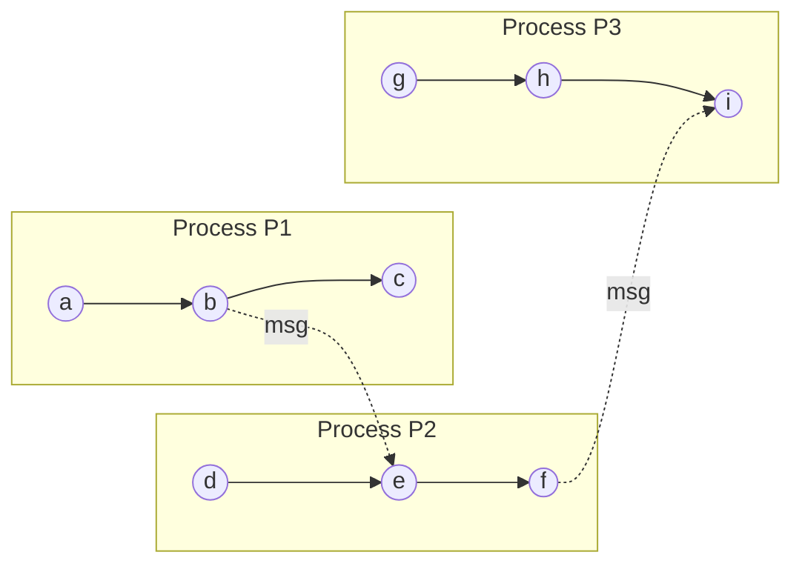
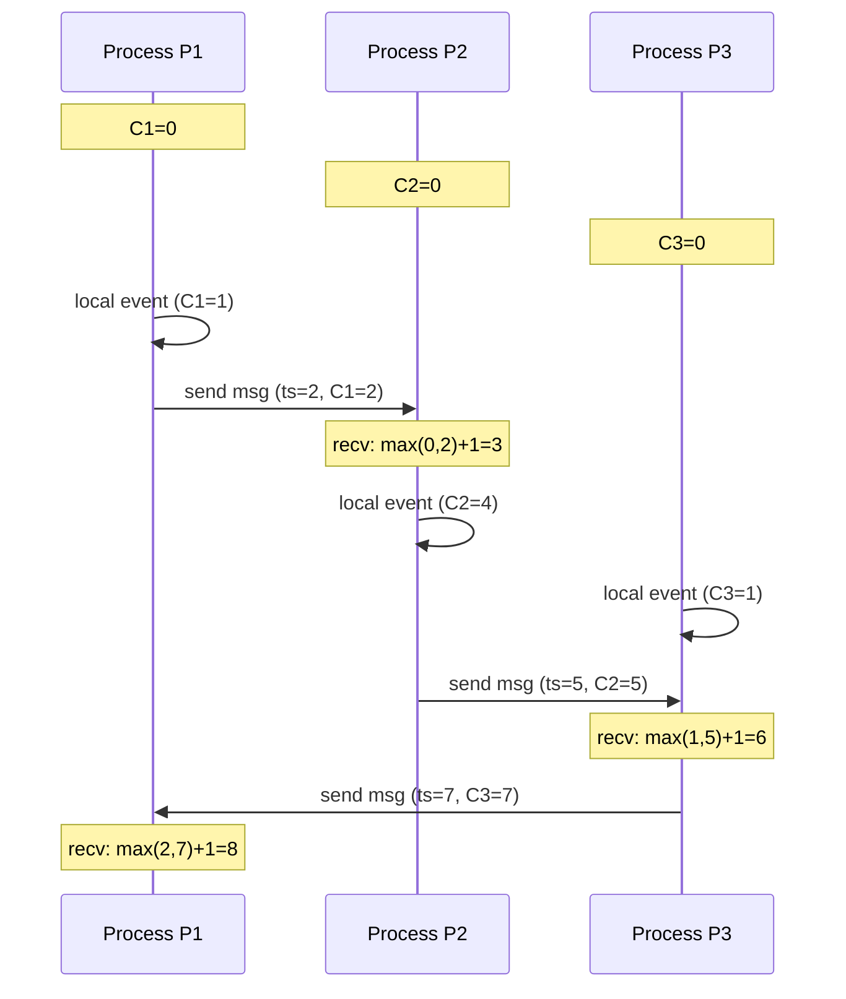
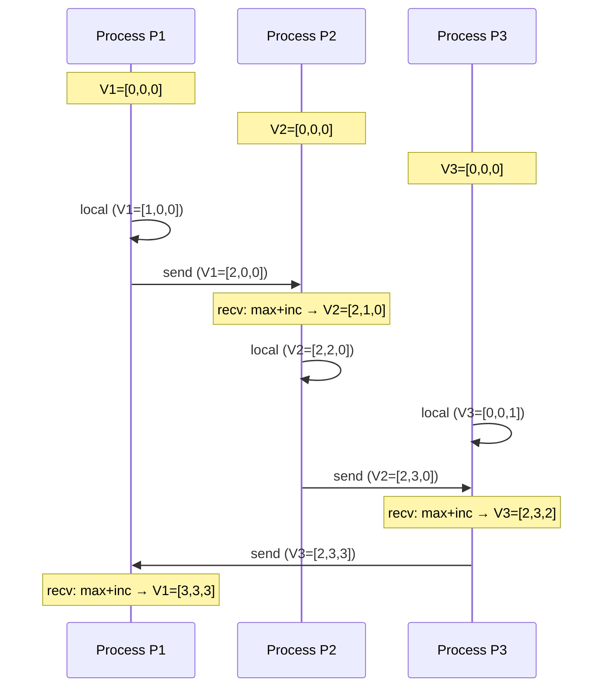
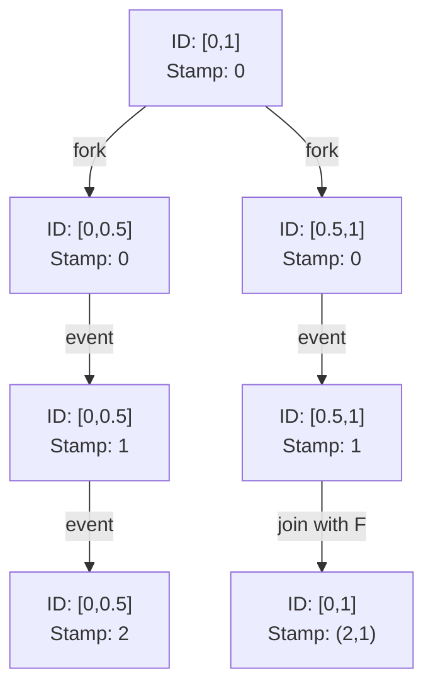
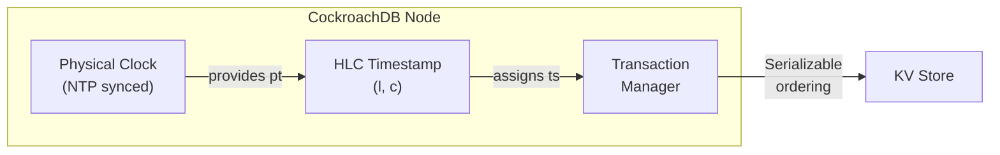
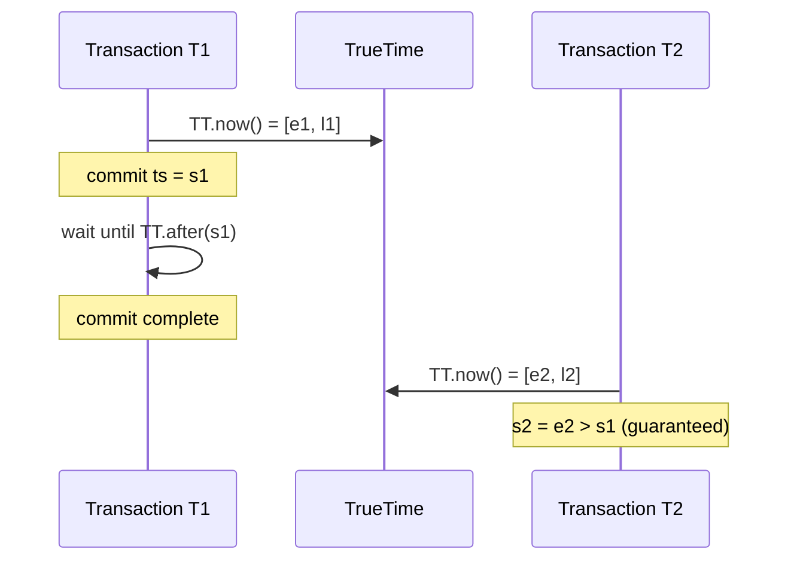
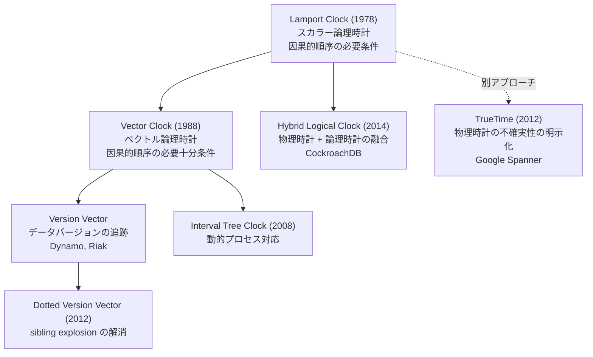

# 論理時計 — Lamport ClockとVector Clockによる因果順序の追跡

## 1. 背景と動機：なぜ物理時計では不十分なのか

分散システムにおいて「いつ何が起きたか」を正確に把握することは、一見すると単純な問題に思える。各ノードに時計があり、イベントにタイムスタンプを付ければよいだけではないか。しかし、この素朴なアプローチは分散環境では根本的に破綻する。

### 1.1 物理時計の限界

現実の物理時計には、以下のような本質的な問題がある。

**クロックドリフト（Clock Drift）**：水晶発振子の周波数は温度や電圧によって微妙に変動する。一般的なサーバーのクロックドリフトは $10^{-6}$ から $10^{-5}$ 秒/秒程度であり、これは1日あたり約86ミリ秒から860ミリ秒のずれに相当する。高精度のアトミッククロックでさえ、$10^{-12}$ 秒/秒程度のドリフトは避けられない。

**クロックスキュー（Clock Skew）**：異なるノード間で時計がどれだけずれているかを示す値である。NTP（Network Time Protocol）による同期を行っても、インターネット上では数十ミリ秒、同一データセンター内でもマイクロ秒オーダーのスキューが残る。

**時刻の非単調性**：NTP同期やうるう秒の挿入により、ノードの時計が**巻き戻る**ことがある。これは壊滅的な問題を引き起こしうる。例えば、あるデータベースが「タイムスタンプが大きい書き込みが新しい」という前提で動作している場合、時計の巻き戻りは古い値で新しい値を上書きする事態を招く。

### 1.2 相対性理論からの洞察

物理学は、時間が絶対的なものではないことを教えてくれる。アインシュタインの特殊相対性理論によれば、空間的に隔たった二つの事象について「どちらが先に起きたか」は、観測者の慣性系に依存する。光速という情報伝達の上限が存在する以上、空間的に離れた地点の間で「同時」を定義することは原理的に不可能である。

分散システムにおいても、ネットワーク遅延がメッセージ伝達の上限として機能し、異なるノード上のイベントについて「どちらが先に起きたか」を絶対的に決定することはできない。この物理的な制約を認めたうえで、イベント間の**因果関係**のみを正確に追跡しようとするのが、論理時計のアプローチである。

### 1.3 分散システムが時間に求めるもの

分散システムにおいて重要なのは、イベントの絶対的な発生時刻ではない。重要なのは**イベント間の順序関係**、特に**因果的な順序**である。

例えば、分散データベースにおいて以下のシナリオを考える。

1. ノードAがキー `x` に値 `1` を書き込む
2. ノードBがキー `x` の値を読み取り、`1` を得る
3. ノードBがキー `x` に値 `2` を書き込む

この場合、操作1は操作3の**原因**である。操作1の結果を操作2で読み取り、それに基づいて操作3を実行しているからだ。システムが正しく動作するためには、操作1が操作3より前であることをすべてのノードが合意できなければならない。この因果関係を、物理時計に頼らずに追跡する仕組みが論理時計である。

## 2. 因果関係と「happens-before」関係

### 2.1 Lamportの画期的な論文（1978年）

1978年、Leslie Lamportは論文「Time, Clocks, and the Ordering of Events in a Distributed System」を発表した。この論文は、分散システムの理論的基盤を確立した歴史的に最も重要な論文のひとつであり、2025年時点で18,000回以上引用されている。

Lamportの洞察の核心は、以下の認識にある。

> 物理時計の精度を高めるのではなく、イベント間の因果関係そのものを追跡すべきである。

この認識に基づいて、Lamportは**happens-before関係**（因果的先行関係）を形式的に定義した。

### 2.2 happens-before関係の定義

分散システムを、メッセージを介して通信するプロセスの集合としてモデル化する。各プロセスはイベントの列を生成し、イベントは以下の3種類に分類される。

- **ローカルイベント**：プロセス内部の計算
- **送信イベント**：メッセージの送信
- **受信イベント**：メッセージの受信

happens-before関係 $\rightarrow$ は、以下の3つの規則によって定義される。

> **定義**（happens-before関係）：
> 1. **プロセス内順序**：同一プロセス内で、イベント $a$ がイベント $b$ より前に発生した場合、$a \rightarrow b$
> 2. **メッセージ因果**：あるメッセージの送信イベント $a$ と、そのメッセージの受信イベント $b$ について、$a \rightarrow b$
> 3. **推移律**：$a \rightarrow b$ かつ $b \rightarrow c$ ならば、$a \rightarrow c$

この定義は極めて自然なものである。同一プロセス内では順序が明確であり、メッセージの送信は必ず受信に先行し、因果関係は推移的に伝播する。

### 2.3 並行イベント

happens-before関係の重要な帰結として、**並行イベント**（concurrent events）の概念がある。

> **定義**（並行性）：
> 二つのイベント $a, b$ について、$a \rightarrow b$ でも $b \rightarrow a$ でもないとき、$a$ と $b$ は**並行**であるといい、$a \| b$ と表記する。

並行とは「同時に起きた」という意味ではない。**因果的に無関係**であるという意味である。並行な二つのイベントは、互いに影響を及ぼし合うことが不可能であり、したがってどちらが先に起きたかを問うこと自体に意味がない。

以下の時空間図で、happens-before関係と並行性を視覚化する。



この図において、以下の関係が成り立つ。

- $a \rightarrow b \rightarrow c$（P1のプロセス内順序）
- $b \rightarrow e$（メッセージ因果）
- $a \rightarrow e$（推移律：$a \rightarrow b$、$b \rightarrow e$）
- $a \| d$（並行：因果的無関係）
- $a \| g$（並行：因果的無関係）
- $c \| e$（並行：どちらも他方の原因ではない）

### 2.4 因果的順序の重要性

なぜ因果的順序が重要なのかを、具体例で示す。

ソーシャルメディアにおいて、ユーザーAが投稿し、ユーザーBがその投稿にコメントするケースを考える。因果的順序が保証されない場合、あるユーザーの画面には「コメントだけが表示されているが、元の投稿がまだ見えない」という不自然な状態が生じうる。因果的順序の保証とは、**原因となったイベントを観測せずに、その結果だけを観測することはない**という保証である。

## 3. Lamport Clock（スカラー論理時計）

### 3.1 アルゴリズム

Lamport Clockは、happens-before関係をスカラー値（単一の整数）で近似する手法である。各プロセス $P_i$ は、非負整数のカウンタ $C_i$ を保持する。

> **Lamport Clockアルゴリズム**：
> 1. **初期化**：各プロセスのカウンタを $C_i = 0$ に設定する
> 2. **ローカルイベント**：プロセス $P_i$ がイベントを実行する前に、$C_i \leftarrow C_i + 1$ とする
> 3. **メッセージ送信**：プロセス $P_i$ がメッセージを送信するとき、カウンタを増加させ（$C_i \leftarrow C_i + 1$）、メッセージに現在のカウンタ値 $C_i$ をタイムスタンプとして付加する
> 4. **メッセージ受信**：プロセス $P_j$ がタイムスタンプ $t$ のメッセージを受信したとき、$C_j \leftarrow \max(C_j, t) + 1$ とする

このアルゴリズムは極めて単純であるが、重要な性質を保証する。

### 3.2 擬似コード

```python
class LamportClock:
    def __init__(self):
        self.counter = 0

    def local_event(self):
        # Increment before any local event
        self.counter += 1
        return self.counter

    def send(self):
        # Increment and return timestamp to attach to message
        self.counter += 1
        return self.counter

    def receive(self, msg_timestamp):
        # Take max and increment
        self.counter = max(self.counter, msg_timestamp) + 1
        return self.counter
```

### 3.3 具体例

以下に、3つのプロセス間での Lamport Clock の動作例を示す。



この例から、因果的に関連するイベントの順序がカウンタ値に正しく反映されていることがわかる。P1の最初のイベント（C=1）はP2のメッセージ受信（C=3）に因果的に先行しており、カウンタ値もそれを反映している。

### 3.4 Lamport Clockの基本定理

Lamport Clockが保証する性質は、以下の定理として述べられる。

> **定理**（Clock Condition）：
> 任意のイベント $a, b$ について、$a \rightarrow b$ ならば $C(a) < C(b)$

**証明**：happens-before関係の定義に基づく3つのケースを検証する。

**ケース1**（プロセス内順序）：同一プロセス内で $a$ が $b$ に先行する場合、各イベントでカウンタは少なくとも1増加するため、$C(a) < C(b)$ が成り立つ。

**ケース2**（メッセージ因果）：$a$ がメッセージ送信イベント、$b$ がそのメッセージの受信イベントの場合、送信時のタイムスタンプを $t = C(a)$ とすると、受信側では $C(b) = \max(C_j, t) + 1 \geq t + 1 > t = C(a)$ となる。

**ケース3**（推移律）：$a \rightarrow b$ かつ $b \rightarrow c$ のとき、ケース1・2により $C(a) < C(b)$ かつ $C(b) < C(c)$、よって $C(a) < C(c)$。$\square$

### 3.5 全順序の構築

Lamport Clockを用いて、分散システム上のすべてのイベントに**全順序**（total order）を与えることができる。同じタイムスタンプを持つイベントが存在しうるため、プロセスIDを使ってタイブレイクを行う。

> **定義**（全順序 $\Rightarrow$）：
> イベント $a$（プロセス $P_i$）とイベント $b$（プロセス $P_j$）について、
> $$a \Rightarrow b \iff C(a) < C(b) \text{、または } C(a) = C(b) \text{ かつ } i < j$$

この全順序は、happens-before関係と整合する。すなわち、$a \rightarrow b$ ならば $a \Rightarrow b$ である。この性質は、分散相互排除（distributed mutual exclusion）などの問題を解くために利用できる。Lamportの原論文では、この全順序を用いた分散相互排除アルゴリズムが示されている。

## 4. Lamport Clockの限界：並行イベントの区別不可

### 4.1 逆は成り立たない

Lamport Clockの最も重要な限界は、**逆が成り立たない**ことである。

> $C(a) < C(b)$ であっても、$a \rightarrow b$ とは限らない。

すなわち、Lamport Clockのタイムスタンプの大小関係からは、二つのイベントが因果的に関連しているのか、それとも単に並行なのかを区別できない。

具体例を示す。プロセスP1がローカルイベントを実行し $C(a) = 1$ となり、独立にプロセスP2もローカルイベントを実行し $C(b) = 1$ となったとする。さらにP2がもう一つローカルイベントを実行し $C(c) = 2$ となる。

このとき、$C(a) < C(c)$ であるが、$a$ と $c$ は並行である（因果的に無関係）。Lamport Clockからは $a \rightarrow c$ なのか $a \| c$ なのかを判定できない。

### 4.2 この限界がもたらす実際の問題

Lamport Clockで判定できるのは、以下のみである。

$$C(a) \geq C(b) \implies a \not\rightarrow b$$

すなわち、「$b$ は $a$ に因果的に先行しない」ことのみが確実に判定できる。この制約は、**因果的一貫性**（causal consistency）を要求するシステムでは不十分である。

例えば、分散Key-Valueストアにおいて、並行な書き込みを検出して競合解決を行いたい場合を考える。

1. クライアントAがキー `x` に値 `1` を書き込む（Lamport timestamp = 3）
2. クライアントBがキー `x` に値 `2` を書き込む（Lamport timestamp = 5）

この2つの書き込みが並行なのか（競合として処理すべき）、それとも因果的に順序づけられるのか（後の書き込みで上書きすべき）を、Lamport Clockだけでは判定できない。

::: tip Lamport Clockの特性まとめ
- **保証するもの**: $a \rightarrow b \implies C(a) < C(b)$（因果的先行なら小さい）
- **保証しないもの**: $C(a) < C(b) \implies a \rightarrow b$（小さいからといって因果的先行とは限らない）
- **判定可能**: $C(a) \geq C(b) \implies a \not\rightarrow b$（反例判定のみ）
- **判定不可能**: $a \| b$ かどうか（並行性の検出）
:::

## 5. Vector Clock（ベクトル論理時計）

### 5.1 着想

Lamport Clockの限界を克服するために、1988年にColin FidgeとFriedemann Matternが独立に提案したのがVector Clockである。

Lamport Clockが単一のスカラー値を保持していたのに対し、Vector Clockは**各プロセスが全プロセスのカウンタをベクトルとして保持**する。$n$ プロセスのシステムにおいて、各プロセス $P_i$ は長さ $n$ の整数ベクトル $V_i[1..n]$ を保持する。$V_i[j]$ は「プロセス $P_i$ が知っている、プロセス $P_j$ の最新のカウンタ値」を表す。

このアイデアにより、各プロセスは自分が観測した因果的履歴の全体像を保持することになる。

### 5.2 アルゴリズム

> **Vector Clockアルゴリズム**（$n$ プロセスのシステム）：
> 1. **初期化**：各プロセス $P_i$ のベクトルを $V_i = [0, 0, \ldots, 0]$ に設定する
> 2. **ローカルイベント**：プロセス $P_i$ がイベントを実行する前に、$V_i[i] \leftarrow V_i[i] + 1$ とする
> 3. **メッセージ送信**：プロセス $P_i$ がメッセージを送信するとき、$V_i[i] \leftarrow V_i[i] + 1$ としてから、ベクトル $V_i$ 全体をメッセージに付加する
> 4. **メッセージ受信**：プロセス $P_j$ がベクトル $V_{msg}$ 付きのメッセージを受信したとき、各 $k$ について $V_j[k] \leftarrow \max(V_j[k], V_{msg}[k])$ とし、その後 $V_j[j] \leftarrow V_j[j] + 1$ とする

### 5.3 擬似コード

```python
class VectorClock:
    def __init__(self, process_id, num_processes):
        self.pid = process_id
        self.vector = [0] * num_processes

    def local_event(self):
        # Increment own component
        self.vector[self.pid] += 1
        return self.vector.copy()

    def send(self):
        # Increment own component and return vector for message
        self.vector[self.pid] += 1
        return self.vector.copy()

    def receive(self, msg_vector):
        # Point-wise max, then increment own component
        for k in range(len(self.vector)):
            self.vector[k] = max(self.vector[k], msg_vector[k])
        self.vector[self.pid] += 1
        return self.vector.copy()

    @staticmethod
    def happens_before(va, vb):
        """Check if va -> vb (va causally precedes vb)"""
        # va <= vb (component-wise) and va != vb
        leq = all(a <= b for a, b in zip(va, vb))
        neq = any(a < b for a, b in zip(va, vb))
        return leq and neq

    @staticmethod
    def concurrent(va, vb):
        """Check if va || vb (concurrent events)"""
        return (not VectorClock.happens_before(va, vb) and
                not VectorClock.happens_before(vb, va))
```

### 5.4 具体例

3つのプロセスによるVector Clockの動作例を示す。



この例で、いくつかの比較を行ってみる。

- P1の最初のイベント $[1,0,0]$ とP2のメッセージ受信後のイベント $[2,1,0]$：$[1,0,0] \leq [2,1,0]$ かつ等しくないため、$[1,0,0] \rightarrow [2,1,0]$（因果的先行）
- P1の最初のイベント $[1,0,0]$ とP3の最初のイベント $[0,0,1]$：$1 > 0$ だが $0 < 1$ であり、どちらの方向も成り立たないため、$[1,0,0] \| [0,0,1]$（並行）
- P2の2番目のイベント $[2,2,0]$ とP3の最初のイベント $[0,0,1]$：同様に並行

### 5.5 ベクトルの比較演算

Vector Clock間の比較は、以下のように定義される。

> **定義**（ベクトル比較）：
> - $V_a \leq V_b \iff \forall k: V_a[k] \leq V_b[k]$
> - $V_a < V_b \iff V_a \leq V_b \text{ かつ } V_a \neq V_b$
> - $V_a \| V_b \iff V_a \not\leq V_b \text{ かつ } V_b \not\leq V_a$

この比較演算は**半順序**（partial order）を定義する。全順序と異なり、比較不能な要素のペア（並行なイベント）が存在しうる点が本質的な特徴である。

## 6. Vector Clockの性質と証明

### 6.1 必要十分条件の定理

Vector Clockの最も重要な性質は、以下の定理で述べられる。

> **定理**（Vector Clockの正確性）：
> 任意のイベント $a, b$ について、
> $$a \rightarrow b \iff V(a) < V(b)$$

これはLamport Clockの $a \rightarrow b \implies C(a) < C(b)$ と比較して、**同値条件**（if and only if）になっている点が決定的に異なる。Vector Clockは因果的順序を完全に特徴づける。

**証明**：

$(\Rightarrow)$ $a \rightarrow b \implies V(a) < V(b)$：

Lamport Clockの場合と同様に、happens-before関係の3つのケースについて帰納法で証明する。

**ケース1**（プロセス内順序）：プロセス $P_i$ 内で $a$ が $b$ に先行するとき、$V_i[i]$ は各イベントで増加し、他の成分は非減少であるため、$V(a) < V(b)$。

**ケース2**（メッセージ因果）：$a$ がプロセス $P_i$ の送信イベント、$b$ がプロセス $P_j$ の受信イベントのとき、受信時に $V_j[k] \leftarrow \max(V_j[k], V_{msg}[k])$ を行うため、すべての成分について $V(a)[k] \leq V(b)[k]$ が成り立つ。さらに $V_j[j]$ を増加させるため、$V(a)[j] < V(b)[j]$（送信時のベクトルには受信側の増分が含まれないため）。よって $V(a) < V(b)$。

**ケース3**（推移律）：$V(a) < V(b)$ かつ $V(b) < V(c)$ ならば、すべての成分について $V(a)[k] \leq V(b)[k] \leq V(c)[k]$ であり、少なくとも一つの成分で $V(a)[k] < V(c)[k]$。よって $V(a) < V(c)$。

$(\Leftarrow)$ $V(a) < V(b) \implies a \rightarrow b$：

対偶を証明する。すなわち、$a \not\rightarrow b \implies V(a) \not< V(b)$ を示す。

$a \not\rightarrow b$ を仮定する。$a$ がプロセス $P_i$ のイベントであるとき、$P_i$ 上の $a$ 以降のイベントから $b$ への因果経路は存在しない（存在すれば推移律により $a \rightarrow b$ となり矛盾）。

$a$ の時点で $V(a)[i]$ の値は、$P_i$ がそれまでに実行したイベント数に等しい。$b$ のベクトル $V(b)[i]$ は、$b$ に因果的に先行する $P_i$ のイベントの最大カウンタ値以下である。$a \not\rightarrow b$ であるから、$a$ のカウンタ値は $V(b)[i]$ に反映される保証がない。具体的には、$V(b)[i]$ は $a$ 以前の $P_i$ のイベントまでしか反映していない可能性があるため、$V(a)[i] > V(b)[i]$ が成り立ちうる。この場合、$V(a) \not\leq V(b)$ であり、$V(a) \not< V(b)$ となる。$\square$

### 6.2 系：並行性の判定

上の定理から、並行性の判定条件が直ちに得られる。

> **系**：
> $$a \| b \iff V(a) \not\leq V(b) \text{ かつ } V(b) \not\leq V(a)$$

すなわち、ベクトルの成分を比較するだけで、二つのイベントが並行かどうかを正確に判定できる。これがVector Clockの最大の強みであり、Lamport Clockにはない能力である。

### 6.3 Lamport Clock vs Vector Clock の比較

| 性質 | Lamport Clock | Vector Clock |
|------|:---:|:---:|
| 空間計算量（per event） | $O(1)$ | $O(n)$ |
| メッセージオーバーヘッド | $O(1)$ | $O(n)$ |
| $a \rightarrow b \implies C(a) < C(b)$ | 保証 | 保証 |
| $C(a) < C(b) \implies a \rightarrow b$ | **不保証** | **保証** |
| 並行性の検出 | 不可能 | 可能 |
| 因果的順序の完全な特徴づけ | 不可能 | 可能 |

$n$ はシステム内のプロセス数を表す。

## 7. 実用上の課題：ベクトルサイズの増大

### 7.1 スケーラビリティの問題

Vector Clockの理論的な優美さにもかかわらず、実用上は深刻なスケーラビリティの問題がある。プロセス数 $n$ に比例してベクトルサイズが増大するため、大規模システムでは以下の問題が生じる。

**メモリ消費**：各イベントに $O(n)$ のベクトルを保持する必要がある。$n = 10,000$ ノードのシステムで64ビット整数を使用する場合、1つのベクトルに80KBが必要となる。すべてのデータ項目にVector Clockを付与すると、メタデータのサイズがデータ本体を凌駕しかねない。

**ネットワーク帯域**：すべてのメッセージに $O(n)$ のベクトルを付加する必要がある。高頻度の通信を行うシステムでは、ベクトル自体がネットワークの帯域を圧迫する。

**比較コスト**：2つのベクトルの比較に $O(n)$ の時間がかかる。

### 7.2 ベクトルの刈り込みと圧縮

実用システムでは、いくつかの手法でVector Clockのサイズを削減する。

**エントリの刈り込み（Pruning）**：長期間更新されていないエントリを削除する。Amazon Dynamoの初期実装ではこの手法が用いられたが、因果関係の正確な追跡が損なわれるリスクがある。

**ハッシュベースの圧縮**：プロセスIDをハッシュ化してベクトルのサイズを固定長に圧縮する手法。衝突により精度が低下するが、実用上は許容可能な場合がある。

しかし、これらの手法はいずれもVector Clockの理論的保証を犠牲にするものであり、完全な解決策とは言い難い。

### 7.3 動的なプロセス参加・離脱

固定の $n$ プロセスを前提とするVector Clockは、プロセスの動的な参加・離脱を扱うことが本質的に困難である。クラウドネイティブなシステムでは、ノードの追加・削除が日常的に発生するため、この制約は深刻な実用上の問題となる。

## 8. Dotted Version Vector と Interval Tree Clock

### 8.1 Version Vector

Vector Clockの実用上の変種として、**Version Vector**がある。Version VectorはVector Clockと同じ構造を持つが、使用されるコンテキストが異なる。Vector Clockがイベントの因果順序を追跡するのに対し、Version Vectorは**データオブジェクトのバージョンの因果順序**を追跡する。

分散Key-Valueストアにおいて、あるキーに対する書き込みの履歴を追跡するために使われる。Version Vectorにより、並行な書き込み（コンフリクト）を検出し、適切な競合解決を行うことができる。

### 8.2 Dotted Version Vector（DVV）

**Dotted Version Vector**は、Version Vectorの改良版であり、2012年にNuno PreguicaとCarlos Baqueroらによって提案された。通常のVersion Vectorでは、サーバーがクライアントの代理として書き込みを行う場合に**sibling explosion**（兄弟バージョンの爆発的増加）が発生しうるという問題があった。

DVVは、ベースとなるVersion Vectorに加えて、最新の書き込みを表す「ドット」（プロセスID、カウンタのペア）を保持する。これにより、正確な因果関係の追跡を維持しつつ、不要な兄弟バージョンの生成を抑制する。

> **DVVの構造**：
> $$DVV = (\text{dot}, \text{version\_vector})$$
> ここで、$\text{dot} = (i, n)$ は「プロセス $P_i$ の $n$ 番目のイベント」を表す。

Riakは、Version VectorからDotted Version Vectorへの移行を行い、大規模な並行書き込みシナリオでのパフォーマンスを改善した。

### 8.3 Interval Tree Clock（ITC）

**Interval Tree Clock**は、2008年にPaulo AlmeidaとCarlos Baqueroらによって提案された、動的なプロセス参加・離脱に対応する論理時計である。Vector Clockが固定サイズのベクトルを使用するのに対し、ITCは**イベントとIDの木構造**を使用する。

ITCの基本的なアイデアは以下の通りである。

- **ID**：各プロセスは区間 $[0, 1]$ の部分区間をIDとして持つ
- **fork操作**：プロセスが分裂するとき、自分のIDを二分割して子プロセスに渡す
- **join操作**：プロセスが合流するとき、IDを統合する
- **event操作**：イベント発生時にスタンプを更新する



ITCの主な利点は以下の通りである。

- プロセス数を事前に知る必要がない
- プロセスの動的な参加・離脱に自然に対応できる
- ベクトルサイズがアクティブなプロセス数に適応的に変化する

ただし、ITCの実装はVector Clockに比べて複雑であり、広く普及するには至っていない。

## 9. Hybrid Logical Clock（HLC）

### 9.1 物理時計と論理時計の統合

**Hybrid Logical Clock（HLC）** は、2014年にKulkarni、Demirbas、Madeppa、Avva、Lionettiによって提案された手法である。HLCは、物理時計の実時間性と論理時計の因果的順序の保証を**両立**させることを目指す。

HLCの設計動機は以下の通りである。

- Lamport Clockは因果順序を保証するが、実時間との対応がない（タイムスタンプが「2024年3月1日」のような意味を持たない）
- 物理時計は実時間を提供するが、因果順序を保証しない
- 両者の良い性質を兼ね備えた時計が欲しい

### 9.2 HLCのアルゴリズム

HLCは各プロセスにおいて、以下の2つの値を保持する。

- $l$：物理時計の近似値（logical component）
- $c$：同一の $l$ 値内での論理カウンタ（capture causality within the same $l$）

物理時計の値を $pt$ とする。

> **HLCアルゴリズム**：
>
> **ローカルイベントまたは送信イベント**：
> $$l' = \max(l, pt)$$
> $$c' = \begin{cases} c + 1 & \text{if } l' = l \\ 0 & \text{if } l' > l \end{cases}$$
> $$(l, c) \leftarrow (l', c')$$
>
> **受信イベント**（受信メッセージのタイムスタンプを $(l_m, c_m)$ とする）：
> $$l' = \max(l, l_m, pt)$$
> $$c' = \begin{cases} \max(c, c_m) + 1 & \text{if } l' = l = l_m \\ c + 1 & \text{if } l' = l \neq l_m \\ c_m + 1 & \text{if } l' = l_m \neq l \\ 0 & \text{if } l' = pt > l \text{ かつ } l' > l_m \end{cases}$$
> $$(l, c) \leftarrow (l', c')$$

### 9.3 擬似コード

```python
class HybridLogicalClock:
    def __init__(self, physical_clock):
        self.pt = physical_clock  # callable that returns current time
        self.l = 0
        self.c = 0

    def local_event(self):
        """Handle local or send event"""
        pt_now = self.pt()
        l_old = self.l
        self.l = max(self.l, pt_now)
        if self.l == l_old:
            self.c += 1
        else:
            self.c = 0
        return (self.l, self.c)

    def send(self):
        """Same as local_event; return timestamp for message"""
        return self.local_event()

    def receive(self, msg_l, msg_c):
        """Handle receive event"""
        pt_now = self.pt()
        l_old = self.l
        self.l = max(self.l, msg_l, pt_now)
        if self.l == l_old and self.l == msg_l:
            self.c = max(self.c, msg_c) + 1
        elif self.l == l_old:
            self.c = self.c + 1
        elif self.l == msg_l:
            self.c = msg_c + 1
        else:
            self.c = 0
        return (self.l, self.c)
```

### 9.4 HLCの性質

HLCは以下の重要な性質を持つ。

**性質1**（因果的順序の保証）：$a \rightarrow b \implies (l_a, c_a) < (l_b, c_b)$（辞書式順序で比較）。これはLamport Clockと同じ保証である。

**性質2**（物理時計との近接性）：任意のイベント $e$ について、$l_e$ は物理時計の値 $pt_e$ 以上であり、かつ $l_e - pt_e$ は有界である。すなわち、HLCのタイムスタンプは物理時計から大きく乖離しない。

**性質3**（空間効率）：HLCのタイムスタンプは $(l, c)$ の2つの値のみで構成される。$c$ の値は通常小さい（物理時計の粒度以内で発生するイベント数に制限される）ため、64ビットのタイムスタンプ内に $l$ と $c$ を格納することが可能である。

::: warning HLCの限界
HLCはLamport Clockと同様の限界を持つ。すなわち、$a \rightarrow b \implies HLC(a) < HLC(b)$ は成り立つが、逆は成り立たない。並行イベントの正確な検出にはVector Clockが必要である。ただし、多くの実用シナリオでは、因果的順序の保証と実時間の近似があれば十分である。
:::

### 9.5 NTP依存からの脱却

HLCの重要な実用上の利点は、物理時計の精度にそれほど依存しないことである。物理時計がずれていても（NTP同期が不完全でも）、HLCは因果的順序を正しく保証する。物理時計は「ヒント」として利用されるだけであり、因果的順序の正確性を物理時計の精度に依存しない。

これにより、NTPの精度が十分でない環境や、クロックスキューが大きい環境でも、安全に使用できる。

## 10. 実世界での応用

### 10.1 Amazon DynamoDB

Amazon DynamoDBの原型となったDynamo（2007年）は、Vector Clock（Version Vector）を競合検出に使用した。

Dynamoのアーキテクチャでは、書き込みが複数のレプリカに分散され、ネットワーク分断時には並行な書き込みが発生しうる。Vector Clockにより、以下のことが可能となる。

- 因果的に順序づけられる書き込みは、後の書き込みで自動的に上書き
- 並行な書き込みは「コンフリクト」として検出し、アプリケーション層（または最終書き込み勝ち: Last-Writer-Wins）で解決

ただし、Dynamoの論文でも報告されているように、Vector Clockのサイズ増大が問題となった。多数のクライアントが同じキーに書き込む場合、ベクトルのサイズが際限なく増加する。Dynamoでは古いエントリの刈り込みで対処したが、これは因果関係の追跡精度を犠牲にする。

現在のDynamoDBは、より単純なLast-Writer-Wins戦略にシフトしており、Vector Clockは使用していないとされる。

### 10.2 Riak

Riakは、Dynamoの設計思想に基づくKey-Valueストアであり、当初はVector Clock、後にDotted Version Vectorを使用して因果的順序を追跡した。

Riakの実装における具体的な課題と対策は以下の通りである。

**sibling explosion問題**：通常のVersion Vectorでは、サーバーがクライアントの代理として書き込みを行うとき、並行バージョン（sibling）が爆発的に増加する場合があった。Dotted Version Vectorの導入により、この問題は大幅に緩和された。

**ベクトルサイズの管理**：Riakでは、ベクトルのエントリ数に上限を設定し、一定期間更新されていないエントリを刈り込むことで、実用的なサイズを維持した。

### 10.3 CockroachDB

CockroachDBは、Google Spannerに触発された分散SQLデータベースであり、Hybrid Logical Clock（HLC）を使用している。

CockroachDBにおけるHLCの使用は、以下の点で巧みである。

**トランザクションのタイムスタンプ管理**：各トランザクションにHLCのタイムスタンプが割り当てられ、Serializableなトランザクション分離レベルを実現するために使用される。HLCにより、因果的順序が保証されると同時に、タイムスタンプが実時間に近い値を持つため、read timestamp selection（読み取りタイムスタンプの選択）が効率的に行える。

**クロックスキューへの対処**：CockroachDBは、ノード間のクロックスキューを監視し、スキューが一定の閾値を超えるノードはクラスタから排除される。HLCは因果的順序を保証するが、リアルタイム順序の保証にはクロックスキューの制御が必要である。

**不確実性ウィンドウ**：CockroachDBは、読み取り操作において「不確実性ウィンドウ」（uncertainty window）を設けている。ある読み取りのHLCタイムスタンプが $t$ のとき、$[t, t + \text{max\_offset}]$ の範囲の書き込みは「順序が不確実」として扱い、必要に応じてトランザクションを再開する。これにより、物理時計の不正確さを安全に吸収する。



### 10.4 Google Spanner と TrueTime

Google Spannerは、論理時計とは異なるアプローチで時間の問題に取り組んでいる。SpannerのTrueTime APIは、**物理時計の不確実性を明示的に公開**する。

TrueTime APIは、現在時刻を単一の値ではなく、**区間** $[earliest, latest]$ として返す。この区間は、原子時計とGPS受信機を組み合わせたインフラにより、通常数ミリ秒以内に制御される。

$$TT.now() = [earliest, latest]$$

Spannerのcommit waitプロトコルは、以下のように動作する。

1. トランザクションにコミットタイムスタンプ $s$ を割り当てる
2. $TT.after(s) = \text{true}$（すなわち $earliest > s$）となるまで待機する
3. 待機後にコミットを完了する

この待機により、**外部一貫性**（external consistency）が保証される。すなわち、トランザクション $T_1$ がコミットした後にトランザクション $T_2$ が開始した場合、$T_2$ のタイムスタンプは必ず $T_1$ のタイムスタンプより大きくなる。



::: details TrueTimeと論理時計の比較

| 性質 | TrueTime | Lamport Clock | HLC | Vector Clock |
|------|:---:|:---:|:---:|:---:|
| 外部一貫性 | 保証 | 不保証 | 不保証 | 不保証 |
| 因果的順序 | 保証 | 保証 | 保証 | 保証 |
| 並行性の検出 | 不可能 | 不可能 | 不可能 | 可能 |
| 実時間対応 | 高精度 | なし | 近似 | なし |
| 特殊HW依存 | 原子時計/GPS | なし | NTP | なし |
| コミット遅延 | あり（数ms） | なし | なし | なし |

TrueTimeは最も強い保証を提供するが、原子時計とGPS受信機という特殊なハードウェアインフラに依存する。これはGoogle規模の企業でなければ実現が困難であり、この制約が他のアプローチの存在意義を生んでいる。

:::

### 10.5 分散デバッグとトレーシング

論理時計は、分散システムのデバッグやトレーシングにも応用される。

**因果的ログの統合**：各ノードのログにVector Clockを付与することで、分散システム全体のイベント列を因果的に正しい順序で再構成できる。これは、障害の根本原因分析（root cause analysis）において極めて有用である。

**分散スナップショット**：Chandy-Lamportのスナップショットアルゴリズムは、論理時計の概念と密接に関連している。グローバルに整合のとれたスナップショットを、物理時計の同期なしに取得できる。

**データ競合の検出**：Vector Clockを用いた happens-before 解析により、分散システムにおけるデータ競合（並行な書き込み）を検出できる。ThreadSanitizerなどのツールは、この原理をマルチスレッドプログラムに適用している。

## 11. まとめ：論理時計の系譜と選択指針

### 11.1 論理時計の発展の流れ

論理時計の発展は、分散システムにおける「時間とは何か」という根本的な問いに対する、50年近くにわたる探求の歴史である。



### 11.2 選択指針

実際のシステム設計において、どの時計メカニズムを選択すべきかは、要件に応じて異なる。

**Lamport Clockが適切な場合**：

- 全順序のみが必要で、並行性の検出は不要
- 空間効率が最優先
- 分散相互排除、分散ロックなどの問題

**Vector Clockが適切な場合**：

- 並行な更新の検出と競合解決が必要
- プロセス数が比較的少ない（数十〜数百）
- 因果的一貫性の厳密な保証が求められる

**HLCが適切な場合**：

- 因果的順序の保証に加えて、実時間との対応が必要
- タイムスタンプをユーザーに表示したり、時間ベースのクエリを行う
- 空間効率が重要（Vector Clockのサイズが許容できない）

**TrueTimeが適切な場合**：

- 外部一貫性（external consistency）が必須
- 原子時計・GPS受信機のインフラを構築できる
- 数ミリ秒のコミット遅延が許容できる

### 11.3 残された課題

論理時計の分野には、依然として多くの未解決課題がある。

**大規模システムへの適応**：数万〜数十万ノードのシステムにおいて、因果的順序を効率的に追跡する手法は確立されていない。Interval Tree Clockは理論的には解決策を提供するが、実用システムでの採用はまだ限定的である。

**因果的一貫性の実現コスト**：因果的一貫性は直感的に自然なモデルであるが、その実現には依然として大きなオーバーヘッドが伴う。因果的順序を追跡するメタデータのサイズと、システムの拡張性の間のトレードオフは、根本的に解消されていない。

**物理時計技術の進化**：Chip-Scale Atomic Clock（CSAC）やPrecision Time Protocol（PTP）など、高精度な時刻同期技術の進化は、物理時計ベースのアプローチの適用範囲を広げつつある。将来的には、論理時計と物理時計の境界はさらに曖昧になっていくかもしれない。

分散システムにおける時間の問題は、物理学の教えるところと同様に、見かけよりもはるかに深遠である。Lamportが1978年に切り拓いた因果的順序の概念は、半世紀近くが経過した現在もなお、分散システムの設計と実装における中心的な概念であり続けている。
