# ログインセキュリティの実践 — ブルートフォース対策・アカウントロックアウト・不正ログイン検知

## 1. ログインに対する脅威の全体像

### 1.1 なぜログインが最大の攻撃対象なのか

Webアプリケーションにおいて、ログイン機能は最も集中的に攻撃される箇所である。その理由は明快で、ログインの突破がシステム全体への侵入の入り口となるからだ。どれほど堅牢なファイアウォールや暗号化を施しても、攻撃者が正規のユーザー資格情報を入手してしまえば、それらの防御はすべて無力化される。

ログインに対する攻撃は、年々高度化・自動化が進んでいる。2020年代のインターネットでは、大規模なデータ漏洩によって流出した数十億件のメールアドレスとパスワードの組み合わせがダークウェブで売買されており、攻撃者はこれらをボットネットを通じて大量のサービスに自動的に試行する。もはやログインセキュリティは「パスワードを複雑にすれば十分」という時代ではない。

### 1.2 主要な脅威の分類

ログインに対する脅威は、大きく以下のカテゴリに分類される。

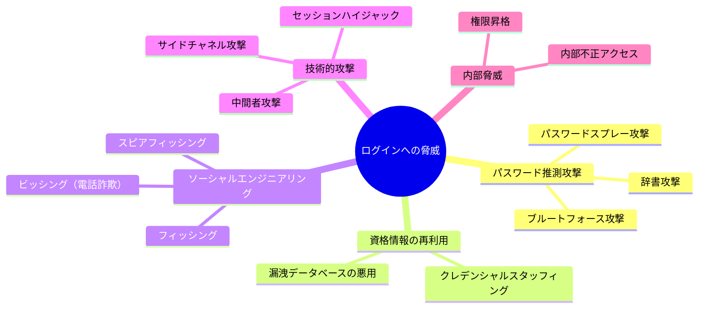

#### ブルートフォース攻撃

最も原始的だが依然として有効な手法である。攻撃者は考えられるすべてのパスワードの組み合わせを順に試行する。8文字の英小文字のみのパスワードであれば、$26^8 \approx 2.09 \times 10^{11}$ 通りであり、高速なハードウェアを使えば現実的な時間で全探索が可能である。

#### 辞書攻撃

ブルートフォースの効率化版である。人間が使いがちなパスワード（`password123`、`qwerty`、`letmein` など）のリストを優先的に試行する。実際のパスワード漏洩データの分析によれば、上位1000個のパスワードだけでユーザーの数パーセントをカバーできてしまうことが知られている。

#### クレデンシャルスタッフィング

他のサービスから漏洩したメールアドレスとパスワードの組み合わせを、別のサービスに対してそのまま試行する手法である。パスワードの使い回しが蔓延しているため、成功率は驚くほど高い。Akamai の報告では、金融サービスに対するログイン試行の実に大半がクレデンシャルスタッフィングによるものであるとされている。

#### パスワードスプレー攻撃

従来のブルートフォースが「1つのアカウントに対して多数のパスワードを試す」のに対し、パスワードスプレーは「多数のアカウントに対して少数の一般的なパスワードを試す」手法である。アカウントロックアウトを回避しつつ、統計的に一定の成功を得られる点が特徴である。

### 1.3 攻撃のコスト構造

現代の攻撃は高度に経済合理的である。攻撃者はROI（投資対効果）を計算し、最もコストパフォーマンスの高い手法を選択する。

| 攻撃手法 | 初期コスト | 実行コスト | 成功率 | 対策難易度 |
|---------|----------|----------|-------|----------|
| クレデンシャルスタッフィング | 低（漏洩DB購入） | 低（自動化容易） | 0.1〜2% | 高 |
| パスワードスプレー | 低 | 低 | 0.5〜5% | 中 |
| フィッシング | 中（サイト構築） | 中 | 5〜30% | 高 |
| ブルートフォース | 低 | 高（計算資源） | 状況依存 | 低 |
| 辞書攻撃 | 低 | 中 | 1〜10% | 中 |

防御側は、これらの攻撃のコストを引き上げることで攻撃を抑止する。本記事では、その具体的な手法を体系的に解説する。

## 2. パスワードハッシュ — 最後の砦

### 2.1 なぜハッシュが必要か

パスワードを平文で保存することは、現代のセキュリティにおいて最も重大な過ちの一つである。データベースが侵害された場合、すべてのユーザーのパスワードが即座に露出するためだ。

しかし、単純な暗号学的ハッシュ関数（SHA-256など）を使うだけでは不十分である。理由は2つある。

1. **レインボーテーブル攻撃**: 事前計算されたハッシュ値のテーブルと照合することで、ハッシュ値から元のパスワードを逆引きできる。
2. **高速すぎる計算**: SHA-256は本来高速に動作するよう設計されており、GPU を使えば1秒間に数十億のハッシュを計算できる。

パスワードハッシュに求められるのは、**意図的に遅い**ハッシュ関数である。

### 2.2 ソルトの役割

ソルト（salt）は、パスワードごとにランダムに生成される値で、ハッシュ計算時にパスワードと結合される。

```
hash = H(password + salt)
```

ソルトの目的は以下の2つである。

1. **レインボーテーブルの無効化**: 同じパスワードでもソルトが異なればハッシュ値が異なるため、事前計算テーブルが使えなくなる。
2. **同一パスワードの区別**: 複数のユーザーが同じパスワードを使っていても、異なるハッシュ値が保存される。

ソルトはハッシュ値とともにデータベースに保存される。ソルト自体は秘密である必要はない。攻撃者がソルトを知っていても、パスワードごとに個別にブルートフォースを行う必要があり、攻撃の並列化が困難になる。

### 2.3 bcrypt

bcrypt は1999年に Niels Provos と David Mazieres によって設計された、パスワードハッシュ専用のアルゴリズムである。Blowfish暗号をベースとしており、以下の特徴を持つ。

- **コストファクター（work factor）**: 計算コストを2のべき乗で調整可能。ハードウェアの進化に応じてコストを引き上げられる。
- **組み込みソルト**: 128ビットのソルトが自動的に生成・管理される。
- **固定長出力**: 出力は常に60文字の文字列（アルゴリズム識別子、コスト、ソルト、ハッシュを含む）。

bcrypt の出力形式は以下のようになる。

```
$2b$12$LJ3m4ys3Lk0TSwMvnKi/fuMYIkOqDVGBMGPcFnNOqR3GWsPCi7bZi
 │  │  │                     │
 │  │  │                     └── ハッシュ値（31文字）
 │  │  └── ソルト（22文字、Base64）
 │  └── コストファクター（2^12 = 4096回の反復）
 └── アルゴリズム識別子（2b = bcrypt）
```

実装例を示す。

```python
import bcrypt

# Hash a password
password = b"user_password_here"
salt = bcrypt.gensalt(rounds=12)  # cost factor = 12
hashed = bcrypt.hashpw(password, salt)

# Verify a password
if bcrypt.checkpw(password, hashed):
    print("Password matches")
```

bcrypt の制限として、入力が72バイトに切り詰められる点がある。これは通常のパスワードでは問題にならないが、パスフレーズを使う場合には注意が必要である。

### 2.4 Argon2

Argon2 は2015年のPassword Hashing Competition（PHC）で優勝したアルゴリズムであり、現在最も推奨されるパスワードハッシュ関数である。bcrypt の「計算コストの調整」に加え、**メモリ使用量**と**並列度**も調整可能にした点が革新的である。

Argon2 には3つのバリアントがある。

| バリアント | 特徴 | 用途 |
|----------|------|------|
| Argon2d | データ依存のメモリアクセスパターン。GPU攻撃に強い | サーバーサイドでのパスワードハッシュ |
| Argon2i | データ独立のメモリアクセスパターン。サイドチャネル攻撃に強い | クライアントサイド、鍵導出 |
| Argon2id | Argon2d と Argon2i のハイブリッド | **推奨**: 一般的なパスワードハッシュ |

Argon2id のパラメータ構成は以下の3つである。

1. **メモリコスト（m）**: 使用するメモリ量（KiB単位）。大きいほどGPU/ASICによる並列攻撃が困難になる。
2. **時間コスト（t）**: 反復回数。大きいほど計算時間が増加する。
3. **並列度（p）**: 使用するスレッド数。

```python
from argon2 import PasswordHasher

ph = PasswordHasher(
    time_cost=3,       # 3 iterations
    memory_cost=65536,  # 64 MiB
    parallelism=4,     # 4 threads
)

# Hash a password
hashed = ph.hash("user_password_here")

# Verify a password
try:
    ph.verify(hashed, "user_password_here")
    print("Password matches")
except Exception:
    print("Password does not match")
```

OWASP は Argon2id を第一の推奨としており、推奨パラメータは以下の通りである。

- メモリ: 19 MiB 以上（理想的には 64 MiB 以上）
- 反復回数: 2回以上
- 並列度: 1
- ハッシュ計算時間: 500ms 程度を目標

### 2.5 bcrypt vs Argon2 の選択指針

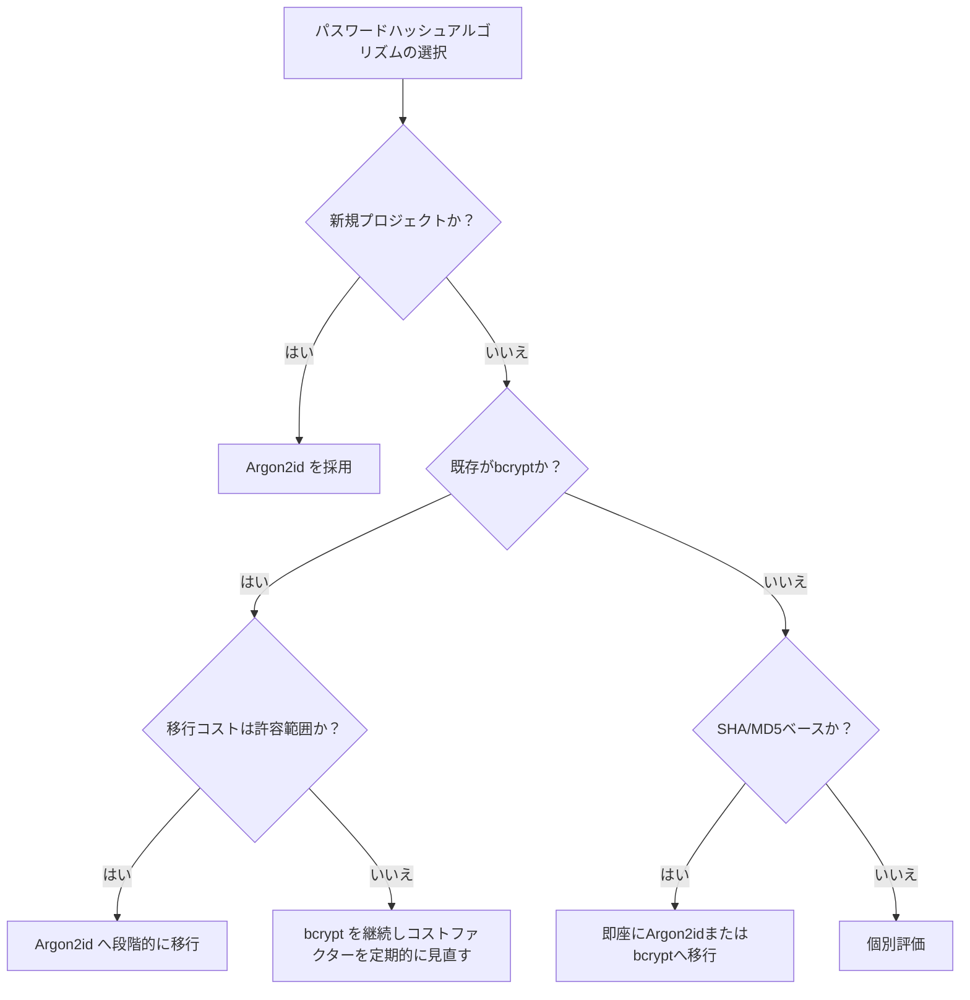

新規開発では Argon2id が推奨されるが、bcrypt も依然として十分な安全性を提供する。重要なのは、どちらを選ぶにしても適切なパラメータを設定し、ハードウェアの進化に応じてパラメータを定期的に見直すことである。

### 2.6 ペッパー（Pepper）

ソルトに加えて、**ペッパー**と呼ばれるシステム全体で共有される秘密値を導入する手法がある。ペッパーはデータベースには保存せず、環境変数やHSM（Hardware Security Module）に格納する。

```
hash = H(password + salt + pepper)
```

データベースが侵害されてもペッパーが漏洩しなければ、攻撃者はハッシュをクラックできない。ただし、ペッパーの管理（ローテーション、バックアップ）には追加の運用コストが伴う。

## 3. ブルートフォース対策

### 3.1 Rate Limiting（レート制限）

Rate Limiting は、一定時間内に許容されるリクエスト数を制限する最も基本的な防御手法である。

#### 設計上の考慮点

Rate Limiting を実装する際には、何を「キー」として制限をかけるかが重要である。

| キー | 利点 | 欠点 |
|------|------|------|
| IPアドレス | 実装が容易 | NATやプロキシ配下の正規ユーザーに影響 |
| ユーザー名（メールアドレス） | ユーザー単位の保護 | ユーザー列挙攻撃の手がかりになりうる |
| IPアドレス + ユーザー名 | バランスが良い | 実装がやや複雑 |
| デバイスフィンガープリント | IPの偽装に耐性 | フィンガープリントの偽装が可能 |

実務上は、**複数のレイヤーでRate Limiting を組み合わせる**のが効果的である。

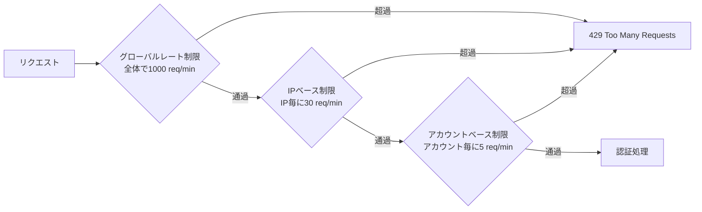

#### トークンバケットアルゴリズム

Rate Limiting の代表的なアルゴリズムがトークンバケットである。バケットには一定のレートでトークンが補充され、リクエストのたびにトークンが消費される。バケットが空の場合はリクエストが拒否される。

```python
import time
import redis

class TokenBucket:
    def __init__(self, redis_client, key, max_tokens, refill_rate):
        self.redis = redis_client
        self.key = key
        self.max_tokens = max_tokens
        self.refill_rate = refill_rate  # tokens per second

    def allow_request(self):
        # Lua script for atomic token bucket operation
        lua_script = """
        local key = KEYS[1]
        local max_tokens = tonumber(ARGV[1])
        local refill_rate = tonumber(ARGV[2])
        local now = tonumber(ARGV[3])

        local bucket = redis.call('HMGET', key, 'tokens', 'last_refill')
        local tokens = tonumber(bucket[1]) or max_tokens
        local last_refill = tonumber(bucket[2]) or now

        -- Refill tokens
        local elapsed = now - last_refill
        tokens = math.min(max_tokens, tokens + elapsed * refill_rate)

        if tokens >= 1 then
            tokens = tokens - 1
            redis.call('HMSET', key, 'tokens', tokens, 'last_refill', now)
            redis.call('EXPIRE', key, 3600)
            return 1
        else
            redis.call('HMSET', key, 'tokens', tokens, 'last_refill', now)
            redis.call('EXPIRE', key, 3600)
            return 0
        end
        """
        result = self.redis.eval(
            lua_script, 1, self.key,
            self.max_tokens, self.refill_rate, time.time()
        )
        return result == 1
```

#### 指数バックオフ

連続する失敗に対して、待機時間を指数的に増加させる手法も有効である。

| 連続失敗回数 | 待機時間 |
|------------|---------|
| 1 | 0秒 |
| 2 | 1秒 |
| 3 | 2秒 |
| 4 | 4秒 |
| 5 | 8秒 |
| 6 | 16秒 |
| 7 | 32秒 |
| 8以上 | 60秒（上限） |

この方式は、正規ユーザーが1〜2回パスワードを間違えた程度ではほぼ影響を与えず、ブルートフォース攻撃のスループットを劇的に低下させる。

### 3.2 CAPTCHA

CAPTCHA（Completely Automated Public Turing test to tell Computers and Humans Apart）は、リクエストが人間によるものかボットによるものかを判別する仕組みである。

#### CAPTCHA の進化

| 世代 | 方式 | 利点 | 欠点 |
|------|------|------|------|
| 第1世代 | 歪んだ文字の読み取り | 実装が容易 | OCR技術の進歩により突破率が向上 |
| 第2世代 | 画像認識（信号機、横断歩道の選択） | 視覚的に直感的 | ユーザー体験の低下、AIによる突破 |
| 第3世代 | 行動分析（reCAPTCHA v3） | ユーザー操作が不要 | プライバシーの懸念 |
| 第4世代 | Cloudflare Turnstile等 | プライバシー重視、低摩擦 | 比較的新しく実績が限定的 |

#### reCAPTCHA v3 の統合

reCAPTCHA v3 はユーザーの操作なしにスコア（0.0〜1.0）を返す。スコアが高いほど人間である可能性が高い。

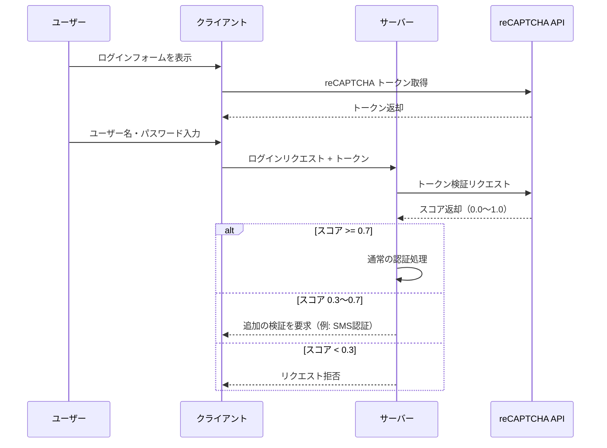

#### CAPTCHA 導入のタイミング

すべてのログイン試行にCAPTCHAを要求するのは、ユーザー体験を著しく損なう。推奨されるアプローチは、**段階的な導入**である。

1. **初回〜2回目の失敗**: CAPTCHAなし
2. **3回目〜5回目の失敗**: 透過的なCAPTCHA（reCAPTCHA v3）で低スコアの場合のみ表示
3. **6回目以降**: 明示的なCAPTCHA必須

### 3.3 Proof of Work

CAPTCHA の代替として、クライアントに計算コストを課す Proof of Work（PoW）方式がある。サーバーがチャレンジを発行し、クライアントが一定の計算を行って解を返す。正規ユーザーのブラウザでは数秒で完了するが、大量の自動化された試行には計算コストが積み重なり、攻撃を非効率にする。

## 4. アカウントロックアウト

### 4.1 ロックアウトの基本設計

アカウントロックアウトは、一定回数のログイン失敗後にアカウントを一時的にロックする仕組みである。直感的でわかりやすい防御手法だが、設計を誤ると**サービス妨害（DoS）の手段として悪用される**リスクがある。

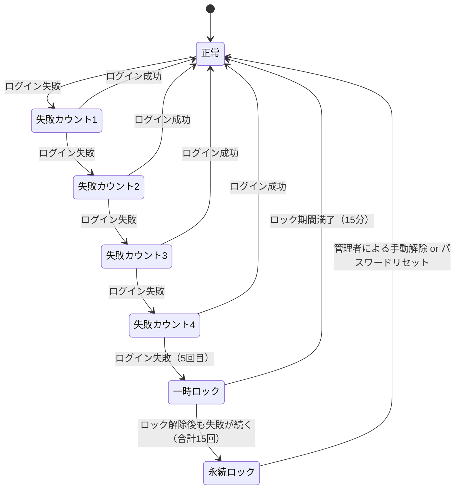

### 4.2 ロックアウトポリシーの設計

#### 一時ロック vs 永続ロック

| 方式 | 設計 | 利点 | リスク |
|------|------|------|-------|
| 一時ロック | N回失敗後、M分間ロック | 正規ユーザーへの影響が限定的 | 攻撃者がロック解除を待って再試行可能 |
| 永続ロック | N回失敗後、管理者解除まで永続ロック | ブルートフォースを完全に阻止 | DoS攻撃の手段になる |
| 段階的ロック | 失敗回数に応じてロック時間を延長 | バランスが良い | 実装がやや複雑 |

**推奨**: 段階的ロックが最もバランスが良い。

```python
def calculate_lockout_duration(failed_attempts):
    """Calculate lockout duration based on failed attempts."""
    if failed_attempts < 5:
        return 0  # no lockout
    elif failed_attempts < 8:
        return 60  # 1 minute
    elif failed_attempts < 12:
        return 300  # 5 minutes
    elif failed_attempts < 15:
        return 900  # 15 minutes
    else:
        return 3600  # 1 hour (maximum)
```

### 4.3 DoS攻撃としてのロックアウト悪用への対策

攻撃者が標的ユーザーのアカウント名を知っている場合、意図的にログイン失敗を繰り返してアカウントをロックさせるという嫌がらせが可能になる。これを防ぐための対策を以下に示す。

1. **IPベースの制限を併用**: 同一IPからの大量の失敗のみをカウントし、異なるIPからの失敗は別途評価する。
2. **ロック解除の多様な手段の提供**: メールによるロック解除、SMS認証、セキュリティ質問など、ユーザーが自力で回復できる手段を複数用意する。
3. **ソフトロック**: アカウントを完全にロックするのではなく、追加の認証（CAPTCHA、MFA）を要求する。
4. **ユーザーへの通知**: ロックが発生した場合にメールで通知し、不正な試行であればパスワード変更を促す。

### 4.4 パスワードスプレーへの対応

アカウントロックアウトは、1つのアカウントへの集中的な攻撃には有効だが、パスワードスプレー攻撃（多数のアカウントに少数のパスワードを試す手法）には無力である。各アカウントの失敗回数がロックアウト閾値に達しないためだ。

パスワードスプレー対策には、以下のようなシステム全体を見渡すアプローチが必要である。

- **グローバルな失敗率の監視**: システム全体でのログイン失敗率が急増した場合にアラートを発する。
- **共通パスワードの拒否**: ユーザー登録・パスワード変更時に、漏洩パスワードリスト（Have I Been Pwned の API など）との照合を行い、一般的なパスワードの使用を禁止する。
- **MFA の強制**: パスワードだけでは突破できない追加の認証要素を必須にする。

## 5. 多要素認証（MFA）

### 5.1 認証の3要素

認証には3つの要素（factor）がある。多要素認証とは、これらのうち**2つ以上の異なる要素**を組み合わせて認証を行う方式である。

| 要素 | 説明 | 例 |
|------|------|-----|
| 知識（Something you know） | ユーザーが知っている情報 | パスワード、PIN、セキュリティ質問 |
| 所持（Something you have） | ユーザーが持っている物理的なもの | スマートフォン、セキュリティキー、ICカード |
| 生体（Something you are） | ユーザーの身体的特徴 | 指紋、虹彩、顔、声紋 |

重要なのは、**同じ要素を2つ使っても多要素認証にはならない**という点である。例えば「パスワード＋セキュリティ質問」は、両方とも「知識」要素であるため、二段階認証ではあっても多要素認証ではない。

### 5.2 TOTP（Time-based One-Time Password）

TOTP は RFC 6238 で定義された時刻ベースのワンタイムパスワード方式であり、Google Authenticator 等のアプリで広く使われている。

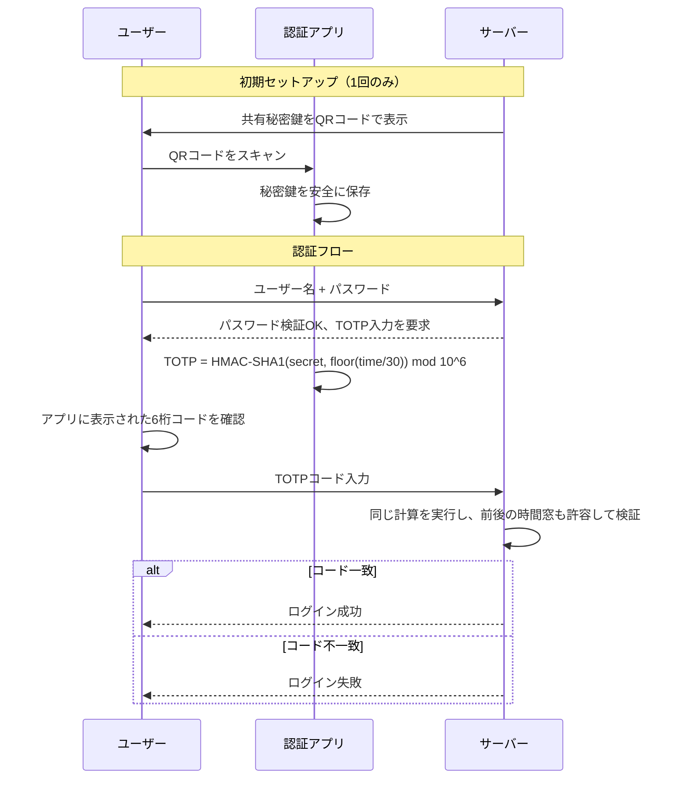

TOTP の計算式は以下の通りである。

$$
\text{TOTP}(K, T) = \text{HMAC-SHA-1}(K, \lfloor T / T_0 \rfloor) \mod 10^d
$$

ここで $K$ は共有秘密鍵、$T$ は現在のUnixタイムスタンプ、$T_0$ はタイムステップ（通常30秒）、$d$ はコードの桁数（通常6桁）である。

### 5.3 FIDO2 / WebAuthn

FIDO2（Fast Identity Online 2）は、パスワードレス認証やMFAを実現するための標準規格であり、W3CのWebAuthn仕様とFIDOアライアンスのCTAP（Client to Authenticator Protocol）から構成される。

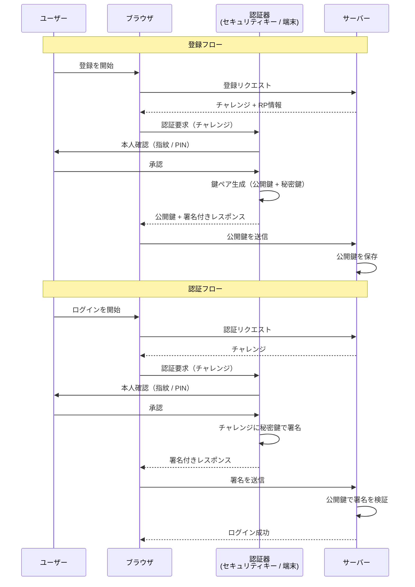

FIDO2 の最大の利点は、**秘密情報がネットワーク上を流れない**点である。認証器内で生成された秘密鍵は認証器の外に出ることがなく、フィッシング耐性が極めて高い。さらに、Relying Party ID（RPのドメイン）がブラウザによって自動的に検証されるため、偽サイトでの認証は物理的に成功しない。

### 5.4 MFA の運用上の課題

MFA は強力な防御手法だが、以下の運用課題を伴う。

- **リカバリ手段の設計**: MFAデバイスの紛失・故障時にアカウントにアクセスできなくなる。リカバリコード（バックアップコード）の提供が必須だが、これ自体が攻撃対象になりうる。
- **ユーザー体験への影響**: 毎回のログインでMFAを要求すると利便性が低下する。信頼されたデバイスの記憶（Remember this device）機能でバランスを取る。
- **SMS OTP の脆弱性**: SIMスワップ攻撃やSS7の脆弱性を突いた傍受が報告されている。NIST SP 800-63B では SMS OTP を「制限付き」（restricted）の認証手段と位置づけている。可能であれば TOTP やハードウェアキーへの移行が望ましい。

## 6. セッション管理の安全性

### 6.1 セッションIDの生成

認証に成功した後、サーバーはセッションIDを発行してユーザーの認証状態を維持する。セッションIDの品質がセッション管理全体のセキュリティを左右する。

セッションIDに求められる要件は以下の通りである。

1. **十分なエントロピー**: 128ビット以上のランダム性が推奨される。暗号論的に安全な乱数生成器（CSPRNG）を使用すること。
2. **予測不可能性**: 過去のセッションIDから将来のセッションIDを推測できてはならない。
3. **十分な長さ**: ブルートフォースで有効なセッションIDを見つけられないだけの長さが必要。

```python
import secrets

def generate_session_id():
    # Generate 256-bit cryptographically secure random session ID
    return secrets.token_hex(32)  # 64-character hex string
```

### 6.2 セッションCookieの保護

セッションIDをCookieで管理する場合、以下の属性を適切に設定する必要がある。

```
Set-Cookie: session_id=abc123def456;
    HttpOnly;
    Secure;
    SameSite=Lax;
    Path=/;
    Max-Age=3600;
    Domain=example.com
```

| 属性 | 目的 |
|------|------|
| `HttpOnly` | JavaScriptからのアクセスを禁止し、XSSによるセッションID窃取を防ぐ |
| `Secure` | HTTPS接続でのみCookieを送信し、中間者攻撃による傍受を防ぐ |
| `SameSite=Lax` | クロスサイトリクエストでのCookie送信を制限し、CSRFを軽減する |
| `Path=/` | Cookieの送信範囲を指定する |
| `Max-Age` | セッションの有効期限を設定する |

### 6.3 セッション固定攻撃の防止

セッション固定攻撃（Session Fixation）は、攻撃者がログイン前にセッションIDを被害者に強制し、ログイン後もそのセッションIDが維持されることを利用する攻撃である。

対策は単純で、**認証成功時にセッションIDを必ず再生成する**ことである。

```python
def login(request):
    username = request.POST['username']
    password = request.POST['password']

    user = authenticate(username, password)
    if user:
        # Regenerate session ID after successful authentication
        request.session.regenerate_id()
        request.session['user_id'] = user.id
        return redirect('/dashboard')
    else:
        return render_login_page(error="Invalid credentials")
```

### 6.4 セッションのライフサイクル管理

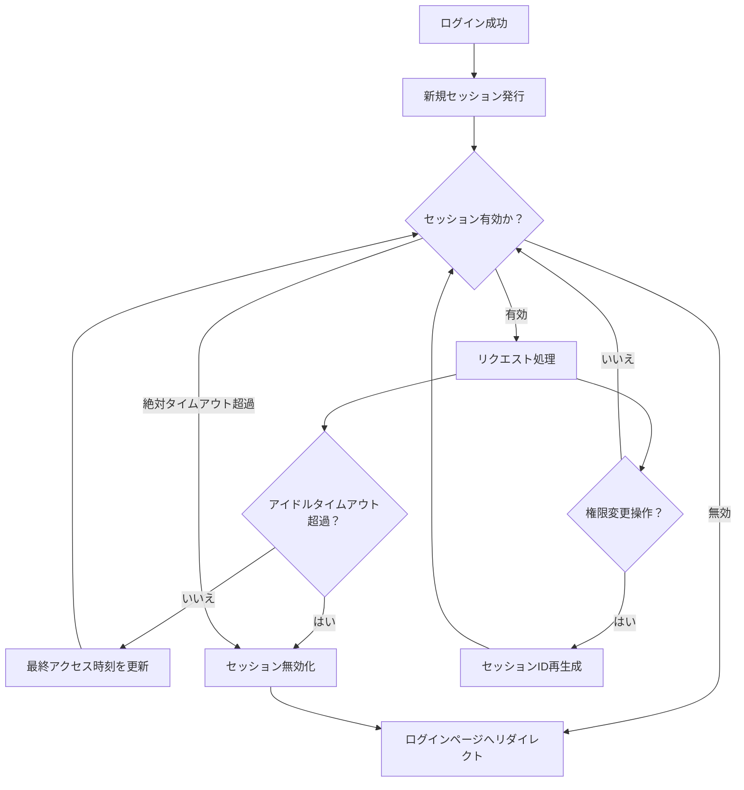

セッションのタイムアウトは2種類設定すべきである。

1. **アイドルタイムアウト**: 最後のアクティビティから一定時間（例: 30分）経過でセッションを失効させる。
2. **絶対タイムアウト**: セッション作成から一定時間（例: 24時間）経過でセッションを強制失効させる。これにより、セッションが永続的に有効であり続けるリスクを排除する。

### 6.5 同時セッションの管理

セキュリティ要件に応じて、以下のポリシーを検討する。

- **無制限**: ユーザーは任意の数のデバイスからログイン可能（一般的なWebサービス）。
- **最大N個**: 同時に有効なセッション数を制限（例: 最大5デバイス）。
- **新規ログインで旧セッション無効化**: 新しいログインが発生すると、既存のセッションがすべて無効化される（銀行系）。
- **ユーザーによるセッション管理**: 「ログイン中のデバイス」一覧を表示し、ユーザーが個別にセッションを終了できる。

## 7. 不正ログイン検知

### 7.1 検知の基本アプローチ

不正ログイン検知は、通常とは異なるログインパターンを検出して、不正アクセスの可能性がある操作にフラグを立てるシステムである。ルールベースのシンプルな手法から、機械学習を活用した高度な手法まで、様々なアプローチがある。

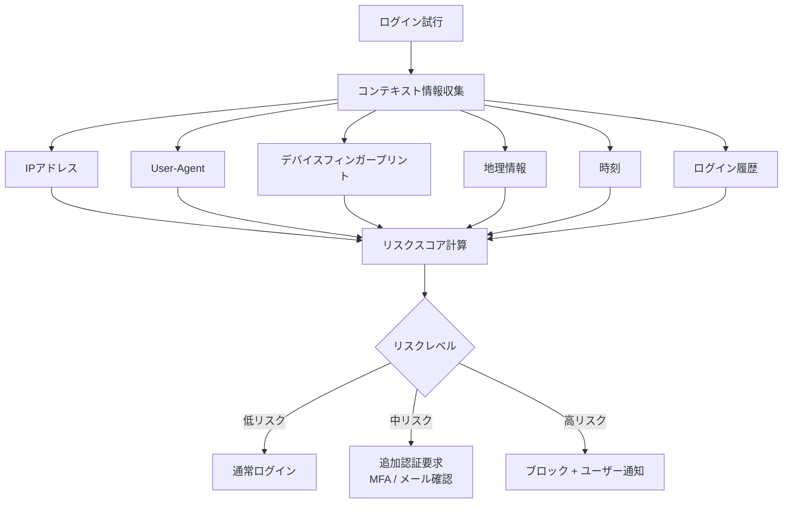

### 7.2 IPアドレスベースの検知

#### IPレピュテーション

IPアドレスに基づく評判（レピュテーション）を利用して、リスクを評価する。

- **既知の悪意あるIP**: 脅威インテリジェンスフィード（AbuseIPDB、Spamhaus等）との照合。
- **TORの出口ノード**: 匿名化ネットワークからのアクセスはリスクが高い可能性がある。
- **VPN/プロキシの検出**: 商用VPNやオープンプロキシからのアクセスは追加の検証が必要な場合がある。
- **データセンターIP**: 一般消費者向けサービスにおいて、データセンターからのログインは異常な可能性がある。

#### Geo-velocity（地理的速度）チェック

ユーザーの前回のログイン場所と今回の場所を比較し、物理的に移動不可能な速度での場所の変化を検出する。

```python
from math import radians, sin, cos, sqrt, atan2

def haversine_distance(lat1, lon1, lat2, lon2):
    """Calculate distance between two points on Earth in km."""
    R = 6371  # Earth's radius in km
    dlat = radians(lat2 - lat1)
    dlon = radians(lon2 - lon1)
    a = sin(dlat/2)**2 + cos(radians(lat1)) * cos(radians(lat2)) * sin(dlon/2)**2
    c = 2 * atan2(sqrt(a), sqrt(1-a))
    return R * c

def check_geo_velocity(user_id, current_login):
    """Detect impossible travel based on geo-velocity."""
    previous_login = get_last_login(user_id)
    if not previous_login:
        return "normal"

    distance_km = haversine_distance(
        previous_login.latitude, previous_login.longitude,
        current_login.latitude, current_login.longitude
    )

    time_diff_hours = (
        current_login.timestamp - previous_login.timestamp
    ).total_seconds() / 3600

    if time_diff_hours == 0:
        return "suspicious"

    speed_kmh = distance_km / time_diff_hours

    # Commercial aircraft max speed is ~900 km/h
    if speed_kmh > 1000:
        return "impossible_travel"
    elif speed_kmh > 500:
        return "suspicious"
    else:
        return "normal"
```

例えば、10分前に東京からログインしたユーザーが突然ニューヨークからログインした場合、約10,800kmの距離を10分で移動したことになり、物理的に不可能であると判断できる。

### 7.3 デバイスフィンガープリント

デバイスフィンガープリントは、ブラウザやデバイスの特徴を収集・分析して、個々のデバイスを識別する技術である。

#### 収集可能な情報

| カテゴリ | 属性例 |
|---------|-------|
| ブラウザ | User-Agent、言語設定、Cookie有効/無効、Do Not Track |
| 画面 | 解像度、色深度、ピクセル比 |
| プラグイン | インストール済みプラグイン一覧 |
| フォント | 利用可能なフォント一覧 |
| Canvas | Canvas描画結果のハッシュ |
| WebGL | GPUレンダラー情報、WebGL描画結果のハッシュ |
| オーディオ | AudioContext のフィンガープリント |
| ハードウェア | CPU コア数、デバイスメモリ |
| タイムゾーン | タイムゾーンオフセット |
| ネットワーク | 接続タイプ、RTT |

これらの情報を組み合わせることで、Cookieに依存しないデバイス識別が可能になる。

#### フィンガープリントの活用方法

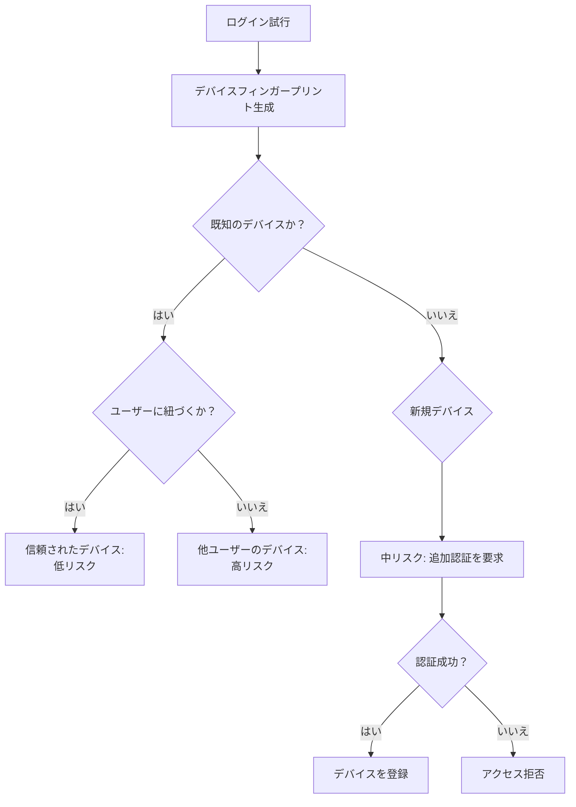

ただし、デバイスフィンガープリントには以下の限界がある。

- **プライバシーの懸念**: ユーザーの同意なく詳細なデバイス情報を収集することは、GDPRやeプライバシー指令に抵触する可能性がある。
- **ブラウザの対策強化**: Safari の Intelligent Tracking Prevention（ITP）や Firefox の Enhanced Tracking Protection など、フィンガープリントを制限するブラウザ機能が普及している。
- **偽装可能性**: 高度な攻撃者はフィンガープリントを偽装できる。

### 7.4 行動分析

ユーザーの行動パターンそのものを分析して不正を検出する手法である。

#### タイピングダイナミクス

キーストローク間の時間間隔、キーの押下時間、タイピングリズムなどの特徴は個人によって異なる。これらのパターンを学習し、ログイン時の入力パターンが通常と大きく異なる場合にフラグを立てる。

#### ログイン時間帯の分析

ユーザーが通常ログインする時間帯を学習し、異常な時間帯でのログインをリスクとして評価する。例えば、平日の日中にしかログインしないユーザーが深夜3時にログインした場合、追加の検証を要求する。

#### マウス操作パターン

ログインフォームでのマウスの動き、クリックの位置と速度、スクロールのパターンなども、人間とボットの識別に活用できる。ボットは通常、直線的で機械的な動きを示す。

### 7.5 ログイン試行の監視と通知

不正ログイン検知で最も重要なのは、ユーザーへの適切な通知である。

- **新しいデバイスからのログイン**: 「新しいデバイスからログインしました。心当たりがない場合は、パスワードを変更してください。」
- **異常な場所からのログイン**: 「普段と異なる場所からのログインを検出しました。」
- **連続するログイン失敗**: 「お客様のアカウントへのログインが複数回失敗しました。」

通知にはログインの時刻、場所（おおよその地域）、デバイス情報を含め、ユーザーが自身のアカウントの状態を把握できるようにする。

## 8. パスワードレス認証

### 8.1 パスワードの限界

パスワードには本質的な問題がある。

1. **人間の記憶力の限界**: 強力なパスワードは覚えにくく、弱いパスワードは推測されやすい。
2. **使い回しの蔓延**: 多数のサービスに対して異なる強力なパスワードを管理するのは事実上不可能であり、パスワードの使い回しが常態化している。
3. **フィッシングへの脆弱性**: どれほど複雑なパスワードでも、偽サイトに入力してしまえば無力である。
4. **管理コスト**: パスワードリセット処理はヘルプデスクの業務の大きな割合を占めるとされている。

こうした背景から、パスワードに依存しない認証方式への移行が進んでいる。

### 8.2 マジックリンク

ユーザーがメールアドレスを入力すると、一時的なログインリンクがメールで送信される方式。

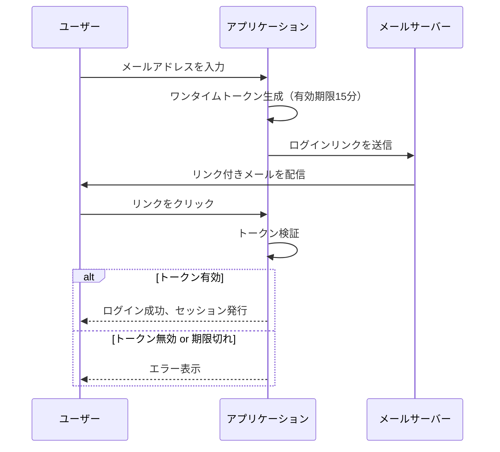

マジックリンクの利点は実装のシンプルさとユーザー体験の良さだが、メールアカウントのセキュリティに依存する点、リアルタイム性に欠ける点が課題である。

### 8.3 Passkeys

Passkeys は FIDO2/WebAuthn をベースとした、次世代のパスワードレス認証方式である。Apple、Google、Microsoft の3社が2022年に共同で推進を発表し、急速に普及が進んでいる。

従来のFIDO2では認証器に保存された秘密鍵がデバイス間で同期されなかったが、Passkeys ではプラットフォームベンダーのクラウド（iCloud Keychain、Google Password Manager 等）を通じて秘密鍵がデバイス間で同期される。

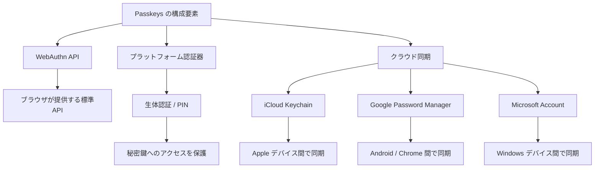

Passkeys の主要な利点は以下の通りである。

- **フィッシング耐性**: RP IDがブラウザによって自動検証されるため、偽サイトでは認証が成功しない。
- **パスワード不要**: 記憶する必要がなく、使い回しの問題が存在しない。
- **ユーザー体験の向上**: 指紋認証や顔認証でログインでき、パスワード入力より高速。
- **デバイス間同期**: プラットフォームのクラウド同期により、複数デバイスで利用可能。

### 8.4 パスワードレスへの移行戦略

多くのサービスにとって、パスワードを即座に廃止することは現実的ではない。段階的な移行戦略が求められる。

1. **フェーズ1**: パスワード + MFA を推奨。Passkeys をオプションとして提供。
2. **フェーズ2**: 新規ユーザーにはデフォルトで Passkeys を設定。既存ユーザーにはPasskeys の登録を積極的に促す。
3. **フェーズ3**: パスワードのみでのログインを段階的に制限（例: 新しいデバイスではPasskeys必須）。
4. **フェーズ4**: パスワードをフォールバック手段に格下げし、将来的に廃止。

## 9. リスクベース認証

### 9.1 リスクベース認証とは

リスクベース認証（Risk-Based Authentication、RBA）は、ログイン試行ごとにリスクスコアを動的に算出し、リスクレベルに応じて認証の強度を変化させる適応型の認証方式である。

低リスクのログイン（いつものデバイス、いつもの場所、いつもの時間帯）ではパスワードのみで通し、高リスクのログイン（未知のデバイス、見慣れない場所、異常な時間帯）では追加の認証を要求する。これにより、セキュリティと利便性のバランスを動的に最適化する。

### 9.2 リスクスコアの計算

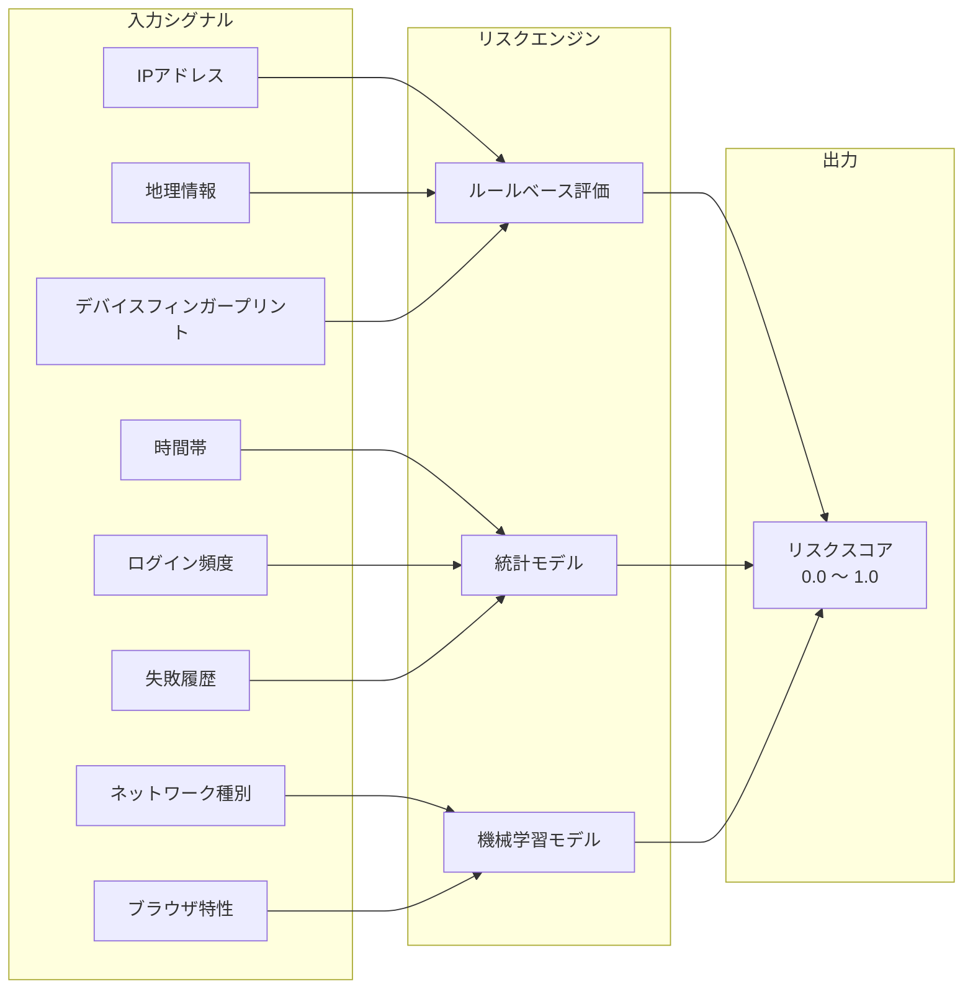

#### ルールベースのリスク評価例

```python
def calculate_risk_score(login_context, user_history):
    """Calculate risk score based on multiple signals."""
    score = 0.0

    # Device recognition
    if login_context.device_fingerprint in user_history.known_devices:
        score += 0.0  # known device, no added risk
    else:
        score += 0.3  # unknown device

    # Geolocation
    if login_context.country != user_history.usual_country:
        score += 0.2
    if login_context.city != user_history.usual_city:
        score += 0.1

    # Impossible travel detection
    geo_result = check_geo_velocity(user_history.last_login, login_context)
    if geo_result == "impossible_travel":
        score += 0.4
    elif geo_result == "suspicious":
        score += 0.2

    # Time of day
    if is_unusual_hour(login_context.timestamp, user_history.login_hours):
        score += 0.1

    # Recent failed attempts
    recent_failures = count_recent_failures(
        login_context.user_id, hours=1
    )
    if recent_failures > 3:
        score += 0.2
    elif recent_failures > 0:
        score += 0.1

    # IP reputation
    if is_tor_exit_node(login_context.ip):
        score += 0.3
    elif is_datacenter_ip(login_context.ip):
        score += 0.2
    elif is_known_vpn(login_context.ip):
        score += 0.1

    # Cap score at 1.0
    return min(score, 1.0)
```

### 9.3 リスクレベルに応じた認証フロー

| リスクスコア | レベル | 認証要件 | 例 |
|------------|--------|---------|-----|
| 0.0 〜 0.2 | 低 | パスワードのみ | 常用デバイス、通常の場所と時間帯 |
| 0.2 〜 0.5 | 中 | パスワード + ソフトチャレンジ | 新しいブラウザ、近隣都市からのアクセス |
| 0.5 〜 0.7 | 高 | パスワード + MFA必須 | 未知のデバイス、異なる国からのアクセス |
| 0.7 〜 1.0 | 極高 | ブロック + ユーザーへの通知 | 不可能な移動速度、既知の悪意あるIP |

### 9.4 機械学習によるリスク評価

大規模なサービスでは、ルールベースの評価に加えて機械学習モデルを活用する。

#### 教師あり学習アプローチ

過去のログインデータに「正常」「不正」のラベルを付与して学習する。

- **特徴量**: IPアドレスの地理情報、デバイスフィンガープリント、ログイン時刻、セッション持続時間、リクエストパターンなど
- **モデル**: 勾配ブースティング（XGBoost、LightGBM）、ランダムフォレスト、ニューラルネットワーク
- **課題**: 不正ログインの事例は全体のごく一部であるため、クラス不均衡問題への対処が必要

#### 教師なし学習アプローチ

ユーザーごとの「正常な行動パターン」を学習し、そこからの逸脱を異常として検出する。

- **手法**: Isolation Forest、Autoencoder、クラスタリング
- **利点**: ラベル付きデータが不要で、未知の攻撃パターンも検出可能
- **課題**: 偽陽性（正常なログインを不正と判定）が多くなりがち

### 9.5 リスクベース認証の実装上の考慮点

1. **透明性**: ユーザーになぜ追加の認証が求められたかを説明する。「新しいデバイスからのアクセスを検出しました」のようなメッセージを表示する。
2. **フィードバックループ**: ユーザーから「これは自分です」「これは自分ではありません」のフィードバックを収集し、モデルの精度を継続的に改善する。
3. **偽陽性の管理**: 正規ユーザーを頻繁にブロックすると、ユーザー体験が著しく低下し、サービスの離反につながる。偽陽性率のモニタリングと閾値の調整が不可欠である。
4. **法規制への対応**: リスク評価に使用するデータ（IP、位置情報、デバイス情報）の収集・処理について、GDPR等のプライバシー規制を遵守する必要がある。

## 10. 防御の全体アーキテクチャ

### 10.1 多層防御の構成

ログインセキュリティは単一の技術で実現するものではない。複数の防御レイヤーを組み合わせた多層防御（Defense in Depth）が不可欠である。

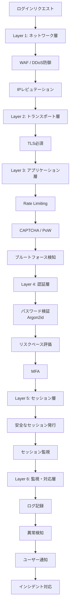

### 10.2 ログイン関連のログ戦略

セキュリティ監視のために、以下のイベントをすべて記録すべきである。

| イベント | 記録すべき情報 |
|---------|-------------|
| ログイン成功 | ユーザーID、タイムスタンプ、IP、User-Agent、デバイスFP |
| ログイン失敗 | 入力されたユーザー名、タイムスタンプ、IP、User-Agent、失敗理由 |
| アカウントロック | ユーザーID、タイムスタンプ、トリガーとなったIP群 |
| MFA成功/失敗 | ユーザーID、MFA方式、タイムスタンプ |
| パスワード変更 | ユーザーID、タイムスタンプ、IP |
| セッション終了 | ユーザーID、終了理由（ログアウト、タイムアウト、強制終了） |

::: warning
パスワード自体をログに記録してはならない。また、ログ内のユーザー名も、ユーザー列挙攻撃の情報源にならないよう、適切なアクセス制御を施すこと。
:::

### 10.3 インシデント対応計画

ログインセキュリティに関するインシデントが発生した場合の対応フローも事前に策定しておく必要がある。

1. **検知**: 異常なログインパターンの自動検知、ユーザーからの報告。
2. **封じ込め**: 該当アカウントの一時的なロック、攻撃元IPのブロック。
3. **調査**: ログの分析、侵害範囲の特定、侵入経路の特定。
4. **復旧**: パスワードの強制リセット、セッションの全無効化、MFAの再設定。
5. **通知**: 影響を受けたユーザーへの通知、規制当局への報告（必要な場合）。
6. **事後分析**: 根本原因の分析、再発防止策の策定と実施。

## 11. まとめと今後の展望

### 11.1 本記事の要点

ログインセキュリティは、以下の要素を組み合わせた多層的な取り組みである。

1. **パスワードハッシュ**: Argon2id を第一選択とし、適切なパラメータで保存する。
2. **ブルートフォース対策**: Rate Limiting、指数バックオフ、CAPTCHA を段階的に導入する。
3. **アカウントロックアウト**: 段階的なロック方式を採用し、DoS悪用のリスクに対処する。
4. **多要素認証**: TOTP やハードウェアキーを推奨し、SMS OTP からの移行を進める。
5. **セッション管理**: 安全なセッションID生成、適切なCookie属性、タイムアウト管理。
6. **不正ログイン検知**: IP、地理情報、デバイスフィンガープリント、行動分析を組み合わせる。
7. **パスワードレス認証**: Passkeys への段階的な移行を計画する。
8. **リスクベース認証**: 動的なリスク評価により、セキュリティと利便性を両立する。

### 11.2 今後の展望

ログインセキュリティの未来は、パスワードからの脱却に向かっている。Passkeys の普及により、パスワードが主要な認証手段でなくなる日は遠くないかもしれない。しかし、それまでの移行期間においては、本記事で述べたような多層防御の実践が引き続き重要である。

また、AIの進化は攻撃と防御の両面に影響を与えている。ディープフェイクによる生体認証の突破、LLMを活用した高度なフィッシングなど、新たな脅威が登場する一方で、AIを活用した異常検知や行動分析は防御の精度を飛躍的に向上させている。

重要なのは、ログインセキュリティを**設計段階から組み込む**ことである。後付けのセキュリティ対策はコストが高く、漏れが生じやすい。認証システムの設計時に、本記事で述べた脅威モデルと防御手法を体系的に検討することが、堅牢なシステム構築への第一歩となる。
