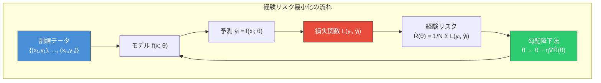
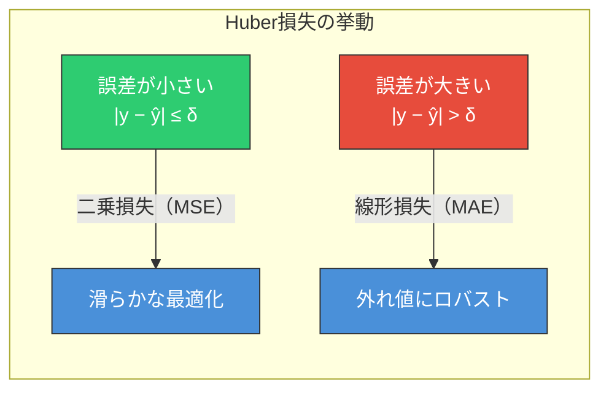
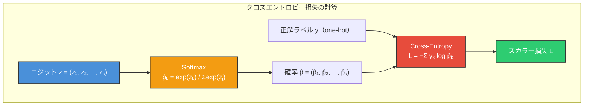
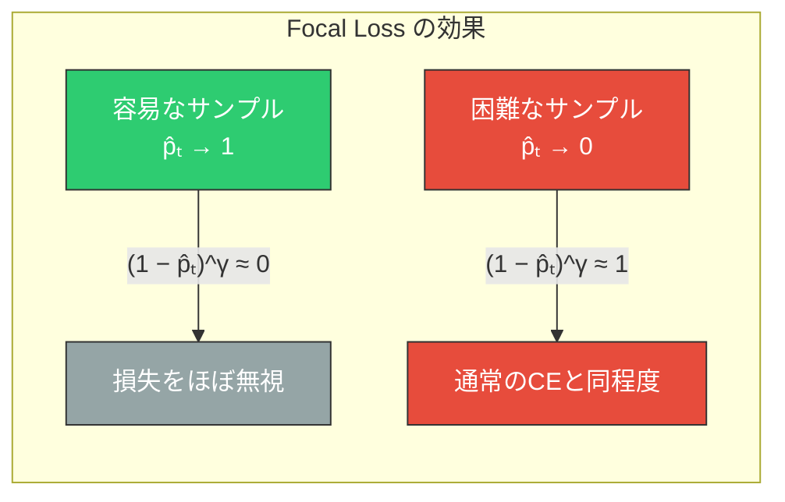
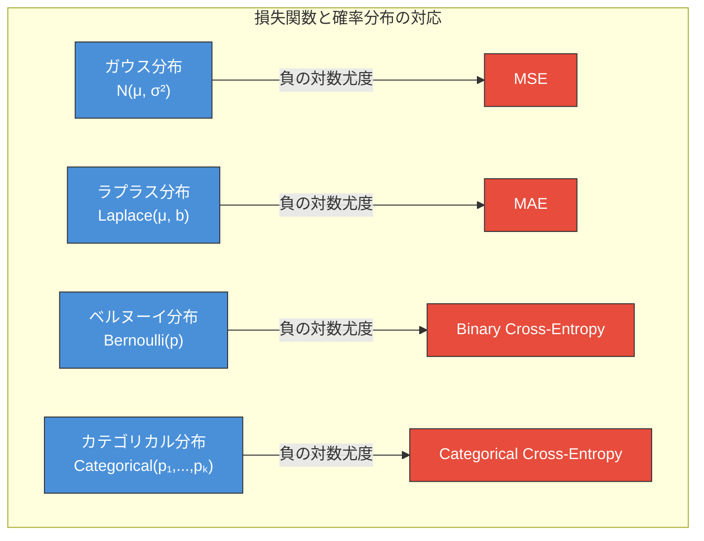
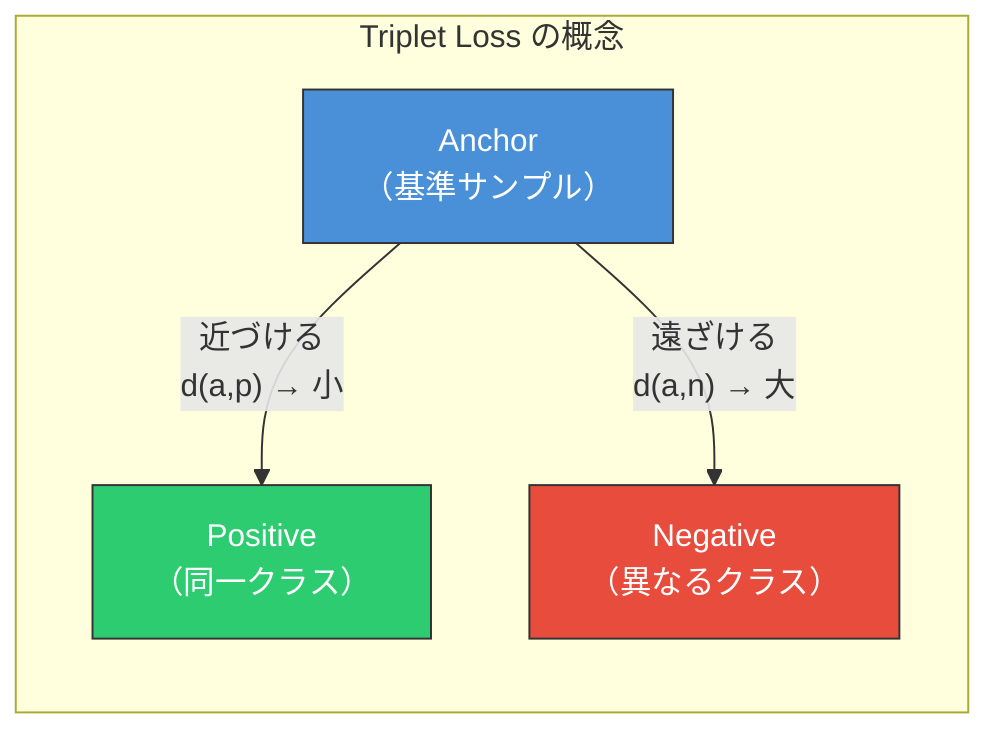
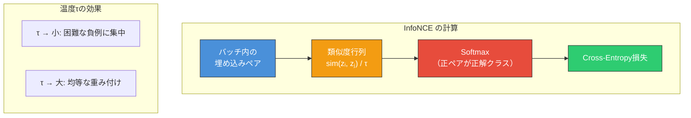
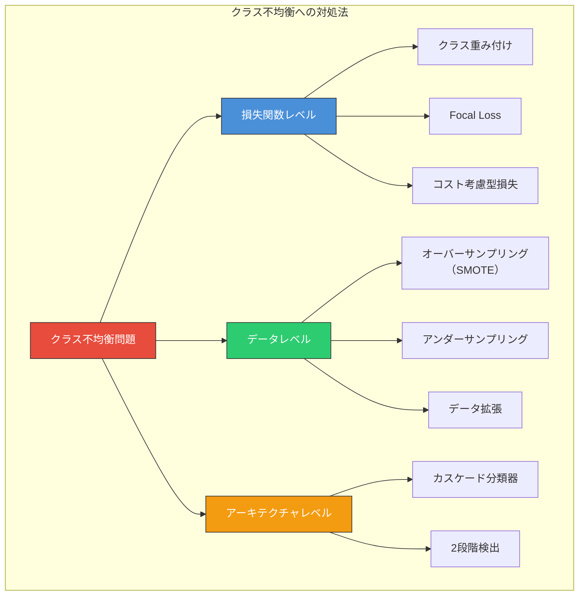
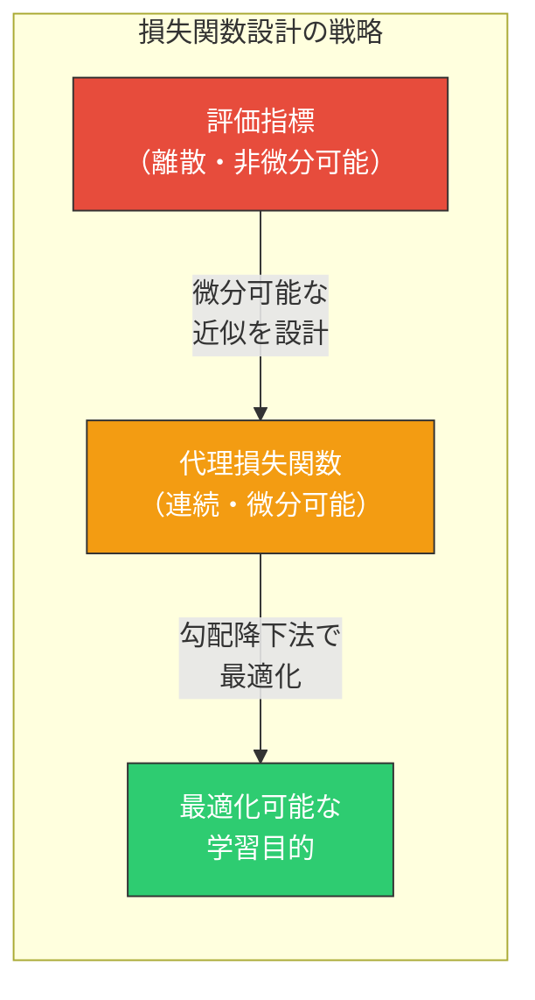
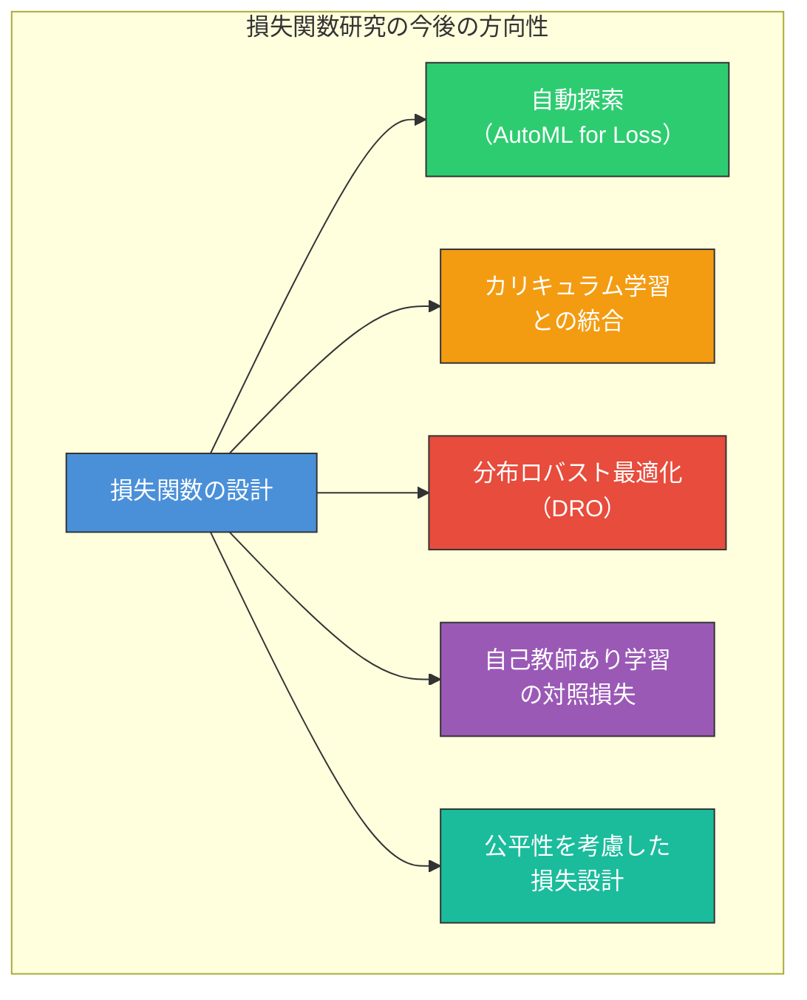

# 損失関数の設計

## 1. 背景と動機 — 損失関数はなぜ重要なのか

機械学習モデルの学習とは、本質的には**最適化問題**を解くことである。モデルのパラメータ $\boldsymbol{\theta}$ を調整して、ある目的関数を最小化（または最大化）する。この目的関数の中核をなすのが**損失関数（loss function）**であり、モデルの予測 $\hat{y}$ と真のラベル $y$ との「ずれ」を定量化する数学的な関数である。

損失関数の選択は、モデルが「何を最適化しようとしているのか」を直接的に規定する。同じアーキテクチャのニューラルネットワークであっても、損失関数を変えるだけで学習の振る舞いは劇的に変化する。例えば、外れ値に対してロバストであるべきか、特定のクラスの検出漏れを絶対に避けるべきか、といった問題固有の要件は、損失関数の設計を通じてモデルに伝達される。

### 経験リスク最小化

統計的学習理論において、モデルの真の性能は**期待リスク（expected risk）**で定義される。

$$
R(\boldsymbol{\theta}) = \mathbb{E}_{(x, y) \sim P_{\text{data}}} \left[ L(y, f(x; \boldsymbol{\theta})) \right]
$$

ここで $L$ は損失関数、$f(x; \boldsymbol{\theta})$ はモデルの予測、$P_{\text{data}}$ はデータの真の分布である。しかし、真の分布 $P_{\text{data}}$ は未知であるため、期待リスクを直接計算することはできない。そこで実際には、手元の訓練データ $\{(x_i, y_i)\}_{i=1}^{N}$ を用いた**経験リスク（empirical risk）**を最小化する。

$$
\hat{R}(\boldsymbol{\theta}) = \frac{1}{N} \sum_{i=1}^{N} L(y_i, f(x_i; \boldsymbol{\theta}))
$$

この枠組みを**経験リスク最小化（Empirical Risk Minimization, ERM）**と呼ぶ。ERMは機械学習の学習アルゴリズムの理論的基盤であり、損失関数 $L$ の選択がその出発点となる。



### 損失関数に求められる性質

良い損失関数が満たすべき条件は、タスクの性質によって異なるが、一般的に以下の性質が重要である。

1. **微分可能性**: 勾配降下法で最適化するためには、損失関数が（ほぼ至る所で）微分可能であることが望ましい。
2. **凸性**: 凸損失関数は局所最適解が大域最適解と一致するため、最適化が容易である。ただし深層学習では非凸な損失面を扱うことが一般的である。
3. **タスクとの整合性**: 最終的に評価したい指標（精度、F1スコアなど）と、損失関数が最小化する対象との間に矛盾がないこと。
4. **数値的安定性**: 浮動小数点演算で計算する際にオーバーフローやアンダーフロー、0除算が生じにくいこと。
5. **外れ値へのロバスト性**: タスクによっては、少数の異常値に引きずられない頑健さが必要である。

## 2. 回帰の損失関数

回帰タスクでは、モデルの予測 $\hat{y} \in \mathbb{R}$ と真の値 $y \in \mathbb{R}$ との差を測定する損失関数を使用する。

### 2.1 平均二乗誤差（MSE: Mean Squared Error）

最も広く使われる回帰損失であり、予測と正解の差の二乗を取る。

$$
L_{\text{MSE}}(y, \hat{y}) = (y - \hat{y})^2
$$

データ全体の経験リスクは以下のようになる。

$$
\hat{R}_{\text{MSE}} = \frac{1}{N} \sum_{i=1}^{N} (y_i - \hat{y}_i)^2
$$

**特徴と性質:**

- **微分**: $\frac{\partial L}{\partial \hat{y}} = -2(y - \hat{y})$。誤差に比例した勾配が得られるため、大きな誤差ほど強い更新信号を生む。
- **凸性**: $\hat{y}$ に関して厳密に凸であり、最適化が容易である。
- **確率的解釈**: 真の値 $y$ がガウスノイズ $\epsilon \sim \mathcal{N}(0, \sigma^2)$ を伴う場合、MSEの最小化は**最尤推定**と等価である（後述）。
- **外れ値への敏感さ**: 二乗によって大きな誤差が過度に強調されるため、外れ値に対して脆弱である。これはMSEの最大の弱点でもある。

### 2.2 平均絶対誤差（MAE: Mean Absolute Error）

予測と正解の差の絶対値を取る。

$$
L_{\text{MAE}}(y, \hat{y}) = |y - \hat{y}|
$$

**特徴と性質:**

- **微分**: $\frac{\partial L}{\partial \hat{y}} = -\text{sign}(y - \hat{y})$。誤差の大きさに関わらず勾配の絶対値は常に1であり、外れ値に対してロバストである。
- **$\hat{y} = y$ での非微分性**: 原点で微分不可能であるが、実用上はサブグラディエントを用いることで問題なく最適化できる。
- **確率的解釈**: $y$ がラプラス分布に従うノイズを伴う場合のMAEの最小化は最尤推定に対応する。
- **収束の遅さ**: 最適解付近でも勾配の大きさが一定のため、MSEと比較して収束が遅い傾向がある。

### 2.3 MSE vs MAE の比較

```
損失
 ^
 |        MSE
 |       /   \
 |      /     \        MAE
 |     /       \      / \
 |    /         \    /   \
 |   /           \  /     \
 |  /             \/       \
 | /              /\        \
 |/              /  \        \
 +------+-------+----+---------> 誤差 (y − ŷ)
       -2      -1    0    1    2
```

| 性質 | MSE | MAE |
|------|-----|-----|
| 外れ値への感度 | 高い（二乗で増幅） | 低い（線形） |
| 最適解付近の収束 | 速い（勾配→0） | 遅い（勾配=定数） |
| 微分可能性 | 至る所で微分可能 | 原点で非微分 |
| 最適化の容易さ | 凸かつ滑らか | 凸だが非滑らか |
| 確率的解釈 | ガウスノイズ | ラプラスノイズ |

### 2.4 Huber損失

MSEとMAEの「いいとこ取り」を目指した損失関数であり、パラメータ $\delta$ を境界として、小さな誤差には二乗、大きな誤差には絶対値を適用する。

$$
L_{\delta}(y, \hat{y}) = \begin{cases}
\frac{1}{2}(y - \hat{y})^2 & \text{if } |y - \hat{y}| \leq \delta \\
\delta |y - \hat{y}| - \frac{1}{2}\delta^2 & \text{otherwise}
\end{cases}
$$

**特徴と性質:**

- $|y - \hat{y}| \leq \delta$ の領域ではMSEと同じ挙動を示し、滑らかな最適化が可能。
- $|y - \hat{y}| > \delta$ の領域ではMAEと同じ線形成長を示し、外れ値に対してロバスト。
- $\delta \to \infty$ でMSEに収束し、$\delta \to 0$ でMAEに収束する。
- **至る所で連続微分可能**であり、MSEとMAEの両方の長所を兼ね備える。
- $\delta$ はハイパーパラメータであり、タスクの誤差スケールに応じて調整が必要である。



### 2.5 Quantile損失（分位点損失）

回帰タスクにおいて、予測の**条件付き分位点**を推定したい場合に用いる。例えば、「90パーセンタイルの売上予測」のような需要予測で重要となる。

分位点 $\tau \in (0, 1)$ に対して、Quantile損失は以下で定義される。

$$
L_{\tau}(y, \hat{y}) = \begin{cases}
\tau (y - \hat{y}) & \text{if } y \geq \hat{y} \\
(1 - \tau)(\hat{y} - y) & \text{if } y < \hat{y}
\end{cases}
$$

これは以下のように一行で書くこともできる。

$$
L_{\tau}(y, \hat{y}) = \max\left(\tau(y - \hat{y}),\; (1 - \tau)(\hat{y} - y)\right)
$$

**特徴と性質:**

- $\tau = 0.5$ のとき、MAEと等価になる（中央値の推定に対応）。
- $\tau > 0.5$ のとき、過小評価（$\hat{y} < y$）に大きなペナルティを与える。
- $\tau < 0.5$ のとき、過大評価（$\hat{y} > y$）に大きなペナルティを与える。
- 複数の分位点 $\tau$ に対する予測を組み合わせることで、**予測区間（prediction interval）**を構成できる。

## 3. 分類の損失関数

分類タスクでは、モデルの出力をクラスの確率として解釈し、正解ラベルとの不一致を測定する。

### 3.1 バイナリクロスエントロピー（Binary Cross-Entropy / Log Loss）

二値分類において最も標準的な損失関数であり、モデルの出力 $\hat{p} = \sigma(z)$（$\sigma$ はシグモイド関数、$z$ はロジット）と正解ラベル $y \in \{0, 1\}$ に対して定義される。

$$
L_{\text{BCE}}(y, \hat{p}) = -\left[ y \log \hat{p} + (1 - y) \log (1 - \hat{p}) \right]
$$

**特徴と性質:**

- $y = 1$ のとき $\hat{p} \to 0$ で損失は $\to \infty$、$\hat{p} \to 1$ で損失は $\to 0$。予測が正解から離れるほど、損失は対数的に急増する。
- **確率的解釈**: ベルヌーイ分布の負の対数尤度に等しく、BCEの最小化はベルヌーイ尤度の最大化と等価である。
- ロジット $z$ に対する勾配は $\hat{p} - y$ という極めて簡潔な形をとる。

### 3.2 カテゴリカルクロスエントロピー（Categorical Cross-Entropy）

$K$ クラスの多値分類へバイナリクロスエントロピーを一般化した損失関数である。正解ラベルをワンホットベクトル $\mathbf{y} = (y_1, \ldots, y_K)$ とし、モデルの出力をソフトマックス確率 $\hat{\mathbf{p}} = (\hat{p}_1, \ldots, \hat{p}_K)$ とすると、損失は以下のようになる。

$$
L_{\text{CE}}(\mathbf{y}, \hat{\mathbf{p}}) = -\sum_{k=1}^{K} y_k \log \hat{p}_k
$$

正解クラスが $c$ のとき（$y_c = 1$、それ以外は0）、これは単に $-\log \hat{p}_c$ に等しい。



**ソフトマックス関数とクロスエントロピーの結合:**

実装上は、数値安定性のためにソフトマックスとクロスエントロピーを分離せず、ロジットから直接損失を計算する**LogSumExp トリック**が用いられる（後述の実装考慮事項を参照）。

### 3.3 ヒンジ損失（Hinge Loss）

サポートベクタマシン（SVM）で使用される損失関数であり、正解ラベル $y \in \{-1, +1\}$ とモデルの出力 $z = f(x)$ に対して定義される。

$$
L_{\text{hinge}}(y, z) = \max(0, 1 - y \cdot z)
$$

**特徴と性質:**

- $y \cdot z \geq 1$ のとき損失は0となる。すなわち、正しく分類され、かつ決定境界から十分なマージンがある場合には勾配が消失する。
- 確率出力を生成しない点がクロスエントロピーとの本質的な違いである。SVMの目的は**マージン最大化**であり、確率推定ではない。
- 0-1損失（正しければ0、誤りなら1）の**凸上界（convex surrogate）**として位置づけられる。

### 3.4 クロスエントロピーとヒンジ損失の比較

| 性質 | クロスエントロピー | ヒンジ損失 |
|------|-------------------|-----------|
| 確率出力 | あり（Softmax/Sigmoid） | なし |
| 正解時の勾配 | 0にならない（常に改善を促す） | 0（マージン達成で停止） |
| スパース解 | 得られない | 得られる（サポートベクタ） |
| 凸性 | 凸 | 凸 |
| 深層学習での使用 | 標準 | まれ |

### 3.5 Focal Loss

Lin et al. (2017) がオブジェクト検出タスクにおけるクラス不均衡の問題に対処するために提案した損失関数である。RetinaNetとともに導入され、**容易なサンプルの損失を下方修正する（down-weight）**ことで、困難なサンプルに学習を集中させる。

$$
L_{\text{focal}}(y, \hat{p}) = -\alpha_t (1 - \hat{p}_t)^\gamma \log(\hat{p}_t)
$$

ここで $\hat{p}_t$ は正解クラスの予測確率、$\alpha_t$ はクラスバランスの重み、$\gamma \geq 0$ はフォーカシングパラメータである。

**特徴と性質:**

- $\gamma = 0$ のとき、標準のクロスエントロピーに退化する。
- $\gamma > 0$ のとき、予測が正しい（$\hat{p}_t \to 1$）サンプルの寄与が $(1 - \hat{p}_t)^\gamma$ 倍に抑制される。
- 元論文では $\gamma = 2$ が最も良い結果を示した。
- 一般的にオブジェクト検出（背景 vs 前景の極端な不均衡）で大きな効果を発揮するが、他のクラス不均衡タスクにも適用可能。



以下にFocal Lossの実装例を示す。

```python
import torch
import torch.nn.functional as F

def focal_loss(logits: torch.Tensor, targets: torch.Tensor,
               alpha: float = 0.25, gamma: float = 2.0) -> torch.Tensor:
    """
    Compute focal loss for binary classification.

    Args:
        logits: Raw model outputs (before sigmoid), shape (N,)
        targets: Ground truth labels {0, 1}, shape (N,)
        alpha: Balancing factor for positive class
        gamma: Focusing parameter
    Returns:
        Scalar focal loss
    """
    # Compute binary cross-entropy without reduction
    bce = F.binary_cross_entropy_with_logits(logits, targets, reduction='none')

    # Compute predicted probability for the true class
    p_t = torch.exp(-bce)

    # Apply focusing modulation
    focal_weight = (1 - p_t) ** gamma

    # Apply class balancing
    alpha_t = alpha * targets + (1 - alpha) * (1 - targets)

    loss = alpha_t * focal_weight * bce
    return loss.mean()
```

## 4. 最尤推定との関係 — 損失関数の確率的解釈

損失関数の多くは、適切な確率モデルの下での**負の対数尤度（negative log-likelihood）**として解釈できる。この対応関係は、損失関数の選択に理論的な根拠を与えるとともに、新しい損失関数を設計する際の指針となる。

### 4.1 ガウスノイズとMSE

観測モデルが $y = f(x; \boldsymbol{\theta}) + \epsilon$、$\epsilon \sim \mathcal{N}(0, \sigma^2)$ であるとき、$y$ の尤度は次のようになる。

$$
p(y \mid x, \boldsymbol{\theta}) = \frac{1}{\sqrt{2\pi\sigma^2}} \exp\left( -\frac{(y - f(x; \boldsymbol{\theta}))^2}{2\sigma^2} \right)
$$

データ全体の対数尤度は以下のとおりである。

$$
\log p(\mathbf{y} \mid \mathbf{X}, \boldsymbol{\theta}) = -\frac{N}{2}\log(2\pi\sigma^2) - \frac{1}{2\sigma^2} \sum_{i=1}^{N} (y_i - f(x_i; \boldsymbol{\theta}))^2
$$

$\boldsymbol{\theta}$ に関して最大化する際、定数項は無関係であるから、**対数尤度の最大化はMSEの最小化と等価**である。

### 4.2 ラプラスノイズとMAE

$\epsilon$ がラプラス分布 $\text{Laplace}(0, b)$ に従うとき、尤度は以下のようになる。

$$
p(y \mid x, \boldsymbol{\theta}) = \frac{1}{2b} \exp\left( -\frac{|y - f(x; \boldsymbol{\theta})|}{b} \right)
$$

対数尤度の最大化は $\sum_i |y_i - f(x_i; \boldsymbol{\theta})|$ の最小化、すなわち**MAEの最小化と等価**である。ラプラス分布はガウス分布よりも裾が重い（heavy-tailed）ため、MAEが外れ値にロバストであることの確率的な裏付けとなっている。

### 4.3 ベルヌーイ分布とバイナリクロスエントロピー

二値分類において、$y \in \{0, 1\}$ がベルヌーイ分布 $y \sim \text{Bernoulli}(\hat{p})$ に従うとき、尤度は以下のようになる。

$$
p(y \mid x, \boldsymbol{\theta}) = \hat{p}^{y}(1 - \hat{p})^{1-y}
$$

負の対数尤度を取ると、バイナリクロスエントロピーが得られる。

$$
-\log p(y \mid x, \boldsymbol{\theta}) = -\left[ y \log \hat{p} + (1 - y) \log(1 - \hat{p}) \right]
$$

### 4.4 カテゴリカル分布とカテゴリカルクロスエントロピー

$K$ クラスの分類において、正解クラスが $c$ のとき、カテゴリカル分布の尤度は $p(y = c \mid x, \boldsymbol{\theta}) = \hat{p}_c$ であり、負の対数尤度は $-\log \hat{p}_c$ となる。これはカテゴリカルクロスエントロピーそのものである。



この確率的解釈には、以下の重要な実用上の意味がある。

1. **ノイズの性質の仮定が損失関数を決定する**: データのノイズ分布について事前知識がある場合、対応する損失関数を選択することが理論的に正当化される。
2. **ベイズ推論への拡張**: 最尤推定にパラメータの事前分布を組み合わせると**MAP推定（Maximum A Posteriori）**となり、正則化項の理論的根拠が得られる。例えば、ガウス事前分布は L2 正則化に、ラプラス事前分布は L1 正則化に対応する。
3. **不確実性の推定**: 確率モデルとして定式化することで、予測値だけでなく予測の不確実性も推定できる。

## 5. 距離学習の損失関数

距離学習（metric learning）では、入力データを**埋め込み空間（embedding space）**にマッピングし、意味的に類似するサンプル同士が近くなり、異なるサンプル同士が離れるような表現を学習する。顔認証、画像検索、自然言語処理の文埋め込みなど、幅広い応用がある。

### 5.1 Contrastive Loss

Hadsell et al. (2006) が提案した損失関数で、正ペア（類似）と負ペア（非類似）からなるペア入力に対して定義される。

$$
L_{\text{contrastive}}(y, \mathbf{z}_1, \mathbf{z}_2) = y \cdot d(\mathbf{z}_1, \mathbf{z}_2)^2 + (1 - y) \cdot \max(0, m - d(\mathbf{z}_1, \mathbf{z}_2))^2
$$

ここで $\mathbf{z}_1, \mathbf{z}_2$ は埋め込みベクトル、$d(\cdot, \cdot)$ はユークリッド距離、$y = 1$ は正ペア（類似）、$y = 0$ は負ペア（非類似）、$m > 0$ はマージンである。

**動作原理:**

- 正ペア（$y = 1$）: 距離 $d$ が大きいほど損失が増加し、埋め込みを近づける方向に学習が進む。
- 負ペア（$y = 0$）: 距離 $d$ がマージン $m$ 以上であれば損失は0。$d < m$ であれば損失が生じ、埋め込みを遠ざける方向に学習が進む。

### 5.2 Triplet Loss

Schroff et al. (2015) がFaceNetで使用した損失関数であり、アンカー（anchor）、正例（positive）、負例（negative）の三つ組を入力とする。

$$
L_{\text{triplet}}(\mathbf{z}_a, \mathbf{z}_p, \mathbf{z}_n) = \max\left(0,\; \|\mathbf{z}_a - \mathbf{z}_p\|^2 - \|\mathbf{z}_a - \mathbf{z}_n\|^2 + m\right)
$$

ここで $\mathbf{z}_a$ はアンカー、$\mathbf{z}_p$ は同一クラスの正例、$\mathbf{z}_n$ は異なるクラスの負例、$m > 0$ はマージンである。



**Triplet Miningの重要性:**

Triplet Lossの学習効率は、三つ組の選び方に大きく依存する。

- **Easy triplet**: $\|\mathbf{z}_a - \mathbf{z}_n\|^2 > \|\mathbf{z}_a - \mathbf{z}_p\|^2 + m$。損失が0であり、学習に寄与しない。
- **Hard triplet**: $\|\mathbf{z}_a - \mathbf{z}_n\|^2 < \|\mathbf{z}_a - \mathbf{z}_p\|^2$。負例がアンカーに正例よりも近い。学習信号は強いが、ノイズに弱い。
- **Semi-hard triplet**: $\|\mathbf{z}_a - \mathbf{z}_p\|^2 < \|\mathbf{z}_a - \mathbf{z}_n\|^2 < \|\mathbf{z}_a - \mathbf{z}_p\|^2 + m$。適度な難易度であり、安定した学習に最も効果的。

ミニバッチ内でのオンラインマイニング戦略が広く用いられ、全てのサンプルの埋め込みを計算した上で有効な三つ組を選択する。

### 5.3 InfoNCE（Noise Contrastive Estimation）

van den Oord et al. (2018) がContrastive Predictive Coding（CPC）で提案し、その後SimCLR、MoCo、CLIPなどの自己教師あり学習や対照学習フレームワークで広く採用されている損失関数である。

正ペア $(\mathbf{z}_i, \mathbf{z}_i^+)$ と $N-1$ 個の負ペアに対して、InfoNCEは以下のように定義される。

$$
L_{\text{InfoNCE}} = -\log \frac{\exp(\text{sim}(\mathbf{z}_i, \mathbf{z}_i^+) / \tau)}{\sum_{j=1}^{N} \exp(\text{sim}(\mathbf{z}_i, \mathbf{z}_j) / \tau)}
$$

ここで $\text{sim}(\cdot, \cdot)$ はコサイン類似度などの類似度関数、$\tau > 0$ は温度パラメータである。

**特徴と性質:**

- 形式的にはソフトマックスクロスエントロピーと同じ構造をしており、正ペアを $N$ 個の候補から識別する $N$ クラスの分類問題として解釈できる。
- **温度パラメータ $\tau$** は分布の鋭さを制御する。$\tau$ が小さいほど、類似度の差が強調され、困難な負例に集中する。$\tau$ が大きいほど、分布が滑らかになり、全ての負例を均等に扱う。
- バッチサイズを大きくすることで負例の数が増え、学習の質が向上する傾向がある。
- InfoNCEの最小化は、埋め込み間の**相互情報量（mutual information）**の下界を最大化することに対応することが示されている。



### 距離学習損失の比較

| 損失関数 | 入力 | マージン | 負例の数 | 代表的応用 |
|---------|------|---------|---------|-----------|
| Contrastive | ペア | 固定マージン $m$ | 1 | Siamese Network |
| Triplet | 三つ組 | 固定マージン $m$ | 1 | FaceNet |
| InfoNCE | 1正例 + $N$負例 | 温度 $\tau$ | $N-1$ | SimCLR, CLIP |

## 6. 実装考慮事項

損失関数の数学的定義はシンプルでも、浮動小数点演算での実装には多くの落とし穴がある。このセクションでは、実装時に注意すべき主要な問題を取り上げる。

### 6.1 数値安定性

#### LogSumExpトリック

ソフトマックスとクロスエントロピーを組み合わせて計算する際、ナイーブな実装では数値的に不安定になる。ロジット $\mathbf{z} = (z_1, \ldots, z_K)$ に対するソフトマックスは以下のとおりである。

$$
\hat{p}_k = \frac{\exp(z_k)}{\sum_{j=1}^{K} \exp(z_j)}
$$

$z_k$ が大きい場合、$\exp(z_k)$ はオーバーフローする。これを防ぐために、$c = \max_j z_j$ を引く定数シフトを適用する。

$$
\hat{p}_k = \frac{\exp(z_k - c)}{\sum_{j=1}^{K} \exp(z_j - c)}
$$

さらに、クロスエントロピー $-\log \hat{p}_c$ を直接計算する場合、ソフトマックスの出力が極めて小さい値になると $\log$ の引数が0に近づき、アンダーフローが生じる。そこで、ロジットから直接損失を計算する LogSumExp トリックを使用する。

$$
-\log \hat{p}_c = -z_c + \log \sum_{j=1}^{K} \exp(z_j) = -z_c + c + \log \sum_{j=1}^{K} \exp(z_j - c)
$$

この形式では、$\exp$ の引数が全て非正（$z_j - c \leq 0$）であるため、オーバーフローが起きない。

```python
import torch
import torch.nn.functional as F

def stable_cross_entropy(logits: torch.Tensor, targets: torch.Tensor) -> torch.Tensor:
    """
    Numerically stable cross-entropy loss from logits.

    In practice, use F.cross_entropy which already applies this trick.
    This implementation illustrates the LogSumExp stabilization.

    Args:
        logits: Raw model outputs, shape (N, K)
        targets: Class indices, shape (N,)
    Returns:
        Scalar loss
    """
    # Subtract max for numerical stability
    c = logits.max(dim=1, keepdim=True).values  # (N, 1)
    shifted = logits - c  # (N, K)

    # LogSumExp
    log_sum_exp = torch.log(torch.exp(shifted).sum(dim=1))  # (N,)

    # Gather logits for correct class
    correct_logits = logits.gather(1, targets.unsqueeze(1)).squeeze(1)  # (N,)

    # Loss = -z_c + c + log(sum(exp(z_j - c)))
    loss = -correct_logits + c.squeeze(1) + log_sum_exp
    return loss.mean()

# In practice, simply use:
# loss = F.cross_entropy(logits, targets)
```

#### Sigmoid + BCEの数値安定性

バイナリクロスエントロピーにおいても、$\hat{p} = \sigma(z)$ を先に計算してから $\log$ を取るナイーブな実装は不安定である。PyTorchの `F.binary_cross_entropy_with_logits` は、ロジット $z$ から直接安定に計算する。

$$
L = \max(z, 0) - z \cdot y + \log(1 + \exp(-|z|))
$$

この式は、$z$ が大きくても小さくても数値的に安定である。

### 6.2 クラス不均衡への対処

実世界のデータセットでは、クラス間のサンプル数に大きな偏りがあることが一般的である（例: 不正検知、疾病診断）。クラス不均衡に対処する主な戦略を以下にまとめる。



#### クラス重み付き損失

クラス $k$ のサンプル数を $n_k$、全サンプル数を $N$ とすると、逆頻度に基づくクラス重み $w_k$ は以下のように計算される。

$$
w_k = \frac{N}{K \cdot n_k}
$$

重み付きクロスエントロピーは以下のようになる。

$$
L_{\text{weighted}} = -\sum_{k=1}^{K} w_k \cdot y_k \log \hat{p}_k
$$

```python
import torch
import torch.nn as nn

def compute_class_weights(labels: torch.Tensor, num_classes: int) -> torch.Tensor:
    """
    Compute inverse-frequency class weights.

    Args:
        labels: All training labels, shape (N,)
        num_classes: Number of classes K
    Returns:
        Weight tensor, shape (K,)
    """
    counts = torch.bincount(labels, minlength=num_classes).float()
    # Avoid division by zero for absent classes
    counts = torch.clamp(counts, min=1.0)
    weights = labels.shape[0] / (num_classes * counts)
    return weights

# Usage example
# weights = compute_class_weights(train_labels, num_classes=10)
# criterion = nn.CrossEntropyLoss(weight=weights)
```

#### Effective Number of Samples

Cui et al. (2019) は、クラス $k$ のサンプル数 $n_k$ に対して、**有効サンプル数（effective number）** $E_k$ を以下のように定義した。

$$
E_k = \frac{1 - \beta^{n_k}}{1 - \beta}, \quad \beta \in [0, 1)
$$

この有効サンプル数の逆数を重みとして使用する。$\beta \to 1$ で逆頻度重みに近づき、$\beta = 0$ で全クラス均等重みになる。

### 6.3 ラベルスムージング

ラベルスムージング（label smoothing）は、ワンホットラベルをソフトラベルに変換する正則化手法である。正解クラスの確率を $1 - \epsilon$、それ以外のクラスに $\epsilon / (K - 1)$ を割り当てる。

$$
y_k^{\text{smooth}} = \begin{cases}
1 - \epsilon & \text{if } k = c \\
\frac{\epsilon}{K - 1} & \text{otherwise}
\end{cases}
$$

スムージングされたラベルに対するクロスエントロピーは以下のようになる。

$$
L_{\text{smooth}} = (1 - \epsilon)(-\log \hat{p}_c) + \frac{\epsilon}{K - 1} \sum_{k \neq c} (-\log \hat{p}_k)
$$

**効果:**

- モデルが過度に自信のある（overconfident）予測を出すことを防ぐ。
- ロジットの大きさを制限する効果があり、暗黙的な正則化として機能する。
- Transformerベースのモデルでは広く採用されている（元のAttention Is All You Need論文でも使用）。

## 7. カスタム損失関数の設計指針

標準的な損失関数では対処できないタスク固有の要件が存在する場合、カスタム損失関数の設計が必要になる。以下に設計上の原則と実践的な指針をまとめる。

### 7.1 設計原則

#### (1) 評価指標との整合性

最終的に最適化したい評価指標（accuracy、F1、BLEU、mAPなど）が直接的に微分可能でないことが多い。その場合、評価指標の**微分可能なプロキシ（代理）**を損失関数として設計する。



例えば、IoU（Intersection over Union）はオブジェクト検出で標準的な評価指標だが、そのままでは微分不可能である。これに対し、Generalized IoU Loss、Distance IoU Loss などの微分可能な代理が提案されている。

#### (2) 勾配の質

損失関数の勾配の性質が学習の安定性と効率に直結する。

- **勾配消失**: 予測が大きく外れているにもかかわらず勾配が小さい場合、学習が停滞する。例えば、MSEをシグモイド出力と組み合わせると、出力が飽和領域にあるときに勾配消失が起きやすい。
- **勾配爆発**: 損失の勾配が極端に大きくなると、パラメータが発散する。勾配クリッピングなどの対策が必要になることがある。
- **有益な勾配方向**: 勾配がパラメータをどの方向に更新するかが、直感的にタスクの目的と整合していることを確認する。

#### (3) 構成可能性

複数の損失関数を組み合わせるマルチタスク学習やマルチ目的最適化は一般的なアプローチである。

$$
L_{\text{total}} = \lambda_1 L_1 + \lambda_2 L_2 + \cdots + \lambda_n L_n
$$

重み $\lambda_i$ の設定は非自明であり、以下のアプローチが知られている。

- **手動調整**: ハイパーパラメータ探索で最適な重みを見つける。
- **不確実性に基づく重み付け**: Kendall et al. (2018) のHomoscedastic uncertaintyに基づく手法。各タスクのノイズの大きさ（不確実性）を学習パラメータとして扱い、自動的に重みを調整する。
- **GradNorm**: Chen et al. (2018) の勾配正規化に基づく手法。各タスクの勾配ノルムが均等になるように重みを動的に調整する。

### 7.2 実践的なチェックリスト

カスタム損失関数を設計・実装する際には、以下の点を確認するとよい。

1. **勾配の正しさ**: 自動微分の結果を数値微分（有限差分法）と比較して、勾配が正しく計算されていることを検証する。

```python
import torch

def check_gradient(loss_fn, *inputs, eps=1e-5):
    """
    Verify analytical gradients against numerical gradients.

    Args:
        loss_fn: Loss function to check
        inputs: Input tensors (must have requires_grad=True)
        eps: Finite difference step size
    """
    for i, inp in enumerate(inputs):
        if not inp.requires_grad:
            continue
        analytical = torch.autograd.grad(
            loss_fn(*inputs), inp, retain_graph=True
        )[0]
        numerical = torch.zeros_like(inp)
        for idx in range(inp.numel()):
            inp_flat = inp.view(-1)
            orig = inp_flat[idx].item()

            inp_flat[idx] = orig + eps
            loss_plus = loss_fn(*inputs).item()

            inp_flat[idx] = orig - eps
            loss_minus = loss_fn(*inputs).item()

            inp_flat[idx] = orig
            numerical.view(-1)[idx] = (loss_plus - loss_minus) / (2 * eps)

        max_diff = (analytical - numerical).abs().max().item()
        print(f"Input {i}: max gradient difference = {max_diff:.2e}")
```

2. **数値安定性のテスト**: 極端な入力値（非常に大きい/小さいロジット、0に近い確率）でNaNやInfが発生しないことを確認する。
3. **スケーリングの一貫性**: バッチサイズの変更に対して損失のスケールが適切であること。`mean` リダクションと `sum` リダクションの選択が学習率と整合していること。
4. **境界条件の確認**: 完璧な予測（損失 = 0）と最悪の予測での損失値が期待どおりであること。

### 7.3 実例: Dice Loss（セグメンテーション向け）

医療画像セグメンテーションなどで用いられるDice Lossは、Dice係数（F1スコアに相当）を直接最適化する損失関数である。

$$
L_{\text{Dice}} = 1 - \frac{2 \sum_{i} p_i g_i + \epsilon}{\sum_{i} p_i + \sum_{i} g_i + \epsilon}
$$

ここで $p_i$ は予測確率、$g_i$ はグラウンドトゥルース（バイナリマスク）、$\epsilon$ はゼロ除算防止の小さな定数である。

**利点:**

- ピクセル単位のクロスエントロピーと比較して、クラス不均衡（前景が極めて少ない場合）に対してロバストである。
- 領域全体の重なりを直接最適化するため、セグメンテーションの評価指標との整合性が高い。

**注意点:**

- 勾配が不安定になることがあり、クロスエントロピーとの併用（$L = L_{\text{CE}} + L_{\text{Dice}}$）が一般的である。
- 小さな領域のセグメンテーションでは、バッチ単位での計算により勾配のノイズが大きくなることがある。

## 8. 今後の方向性

損失関数の研究は、機械学習の発展とともに進化を続けている。以下に、現在活発に研究されている方向性をまとめる。

### 8.1 損失関数の自動探索

Neural Architecture Search（NAS）の成功に触発され、損失関数自体を自動的に探索する**AutoML for Loss Functions**の研究が進んでいる。Li et al. (2020) のAutoLossや、Gonzalez et al. (2021) のLoss Function Discoveryなどが、タスクに最適な損失関数を進化的アルゴリズムや強化学習で探索する手法を提案している。

### 8.2 カリキュラム学習との統合

学習の進行に応じて損失関数の性質を動的に変化させるアプローチが注目されている。Focal Lossの $\gamma$ パラメータを学習中に調整するスケジューリングや、Self-Pacedラーニングにおいて損失の重みをカリキュラムに基づいて変化させる手法がある。

### 8.3 分布ロバスト最適化（DRO）

Distributionally Robust Optimization（DRO）は、訓練データの分布からの偏りに対してロバストなモデルを学習する枠組みである。最悪ケースの分布に対する期待リスクを最小化することで、分布シフトへの頑健性を獲得する。

$$
\min_{\boldsymbol{\theta}} \sup_{Q \in \mathcal{Q}} \mathbb{E}_{(x, y) \sim Q} \left[ L(y, f(x; \boldsymbol{\theta})) \right]
$$

ここで $\mathcal{Q}$ は訓練分布の近傍に制限された分布の集合（不確実性集合）である。Group DROやWasserstein DROなどの実用的な手法が提案されている。

### 8.4 自己教師あり学習と対照損失の発展

自己教師あり学習の急速な発展に伴い、対照損失の改良が活発に研究されている。

- **非対称な損失**: BYOL、SimSiamのように、負例を使用しない手法が登場し、表現崩壊（representation collapse）を防ぐメカニズムの理論的理解が進んでいる。
- **マスク言語モデルの損失**: BERTのMLM損失やGPTの自己回帰損失は、テキスト表現学習における事実上の標準であり、さらに効率的な事前学習損失の探索が続いている。
- **マルチモーダル対照損失**: CLIPのように、異なるモダリティ（テキストと画像）間の対応を学習する対照損失が、基盤モデル（foundation model）の構築に不可欠な要素となっている。

### 8.5 公平性を考慮した損失関数

機械学習モデルの公平性（fairness）への関心の高まりに伴い、損失関数レベルで公平性制約を組み込む研究が増えている。特定のグループに対する損失のバランスを明示的に制御する公平性正則化や、最悪グループの損失を最小化する手法が提案されている。



## まとめ

損失関数は、機械学習モデルが「何を最適化するか」を定義する根幹的な要素であり、その選択はモデルの性能とふるまいに直接的な影響を与える。本記事で取り上げた要点を振り返る。

1. **回帰の損失関数**: MSEはガウスノイズの仮定の下で最尤推定に対応し、MAEは外れ値にロバストであるがラプラスノイズを仮定する。Huber損失は両者のバランスを取り、Quantile損失は分位点の推定を可能にする。

2. **分類の損失関数**: クロスエントロピーは確率的に明確な解釈を持ち、深層学習の標準である。ヒンジ損失はマージン最大化を目指すSVMの中核であり、Focal Lossはクラス不均衡への実用的な対処法である。

3. **確率的解釈**: 損失関数と確率分布の対応関係を理解することで、タスクの性質に適した損失関数を理論的に選択できる。

4. **距離学習**: Contrastive Loss、Triplet Loss、InfoNCEは、埋め込み空間の構造を学習するための基本的なビルディングブロックであり、自己教師あり学習の成功を支えている。

5. **実装上の注意**: LogSumExpトリック、クラス重み付け、ラベルスムージングなどの技法は、損失関数を安全かつ効果的に実装するために不可欠である。

6. **カスタム設計**: 評価指標との整合性、勾配の質、構成可能性を考慮しつつ、勾配の正しさと数値安定性を検証する体系的なアプローチが重要である。

損失関数は単なる「パーツ」ではなく、モデルとタスクの間の**契約**である。適切な損失関数を選択し、必要に応じて設計・改良する能力は、機械学習実践者にとって本質的なスキルの一つと言える。
