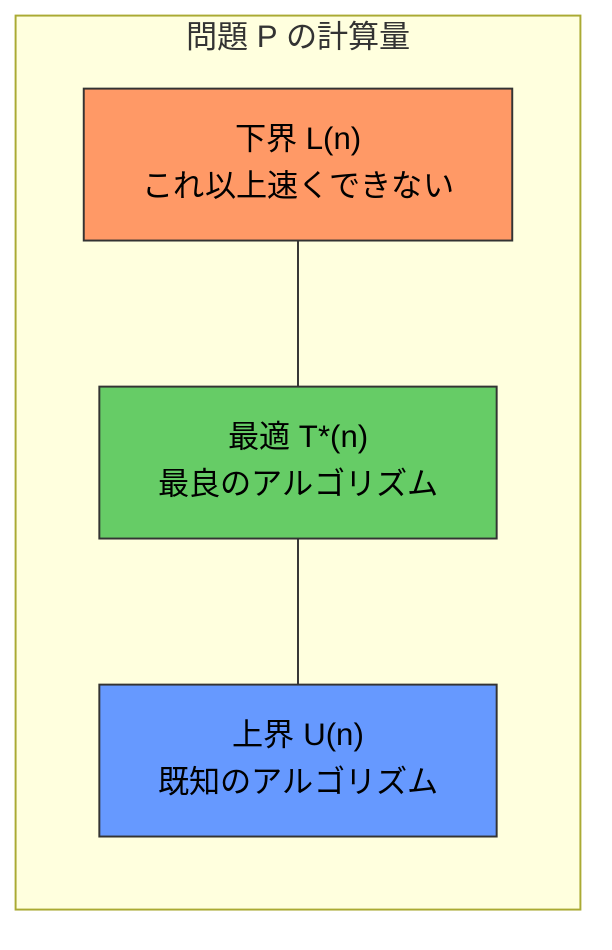
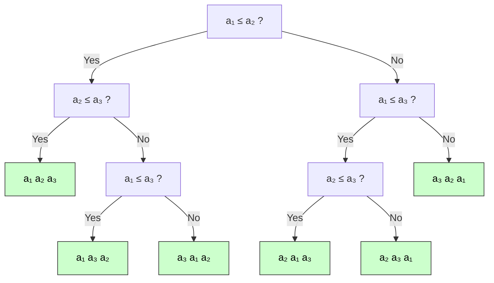
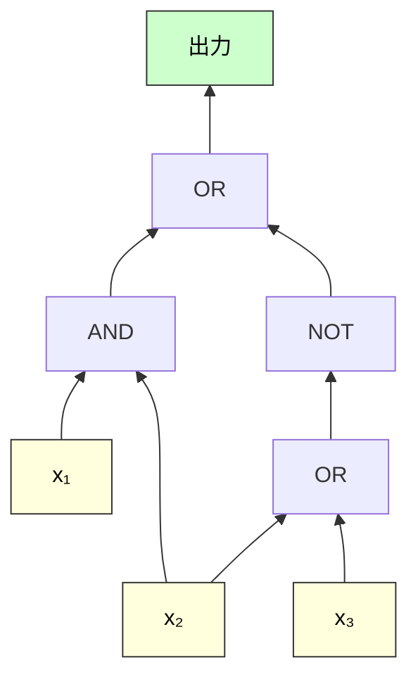
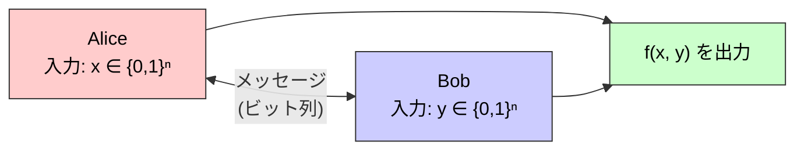
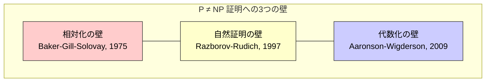
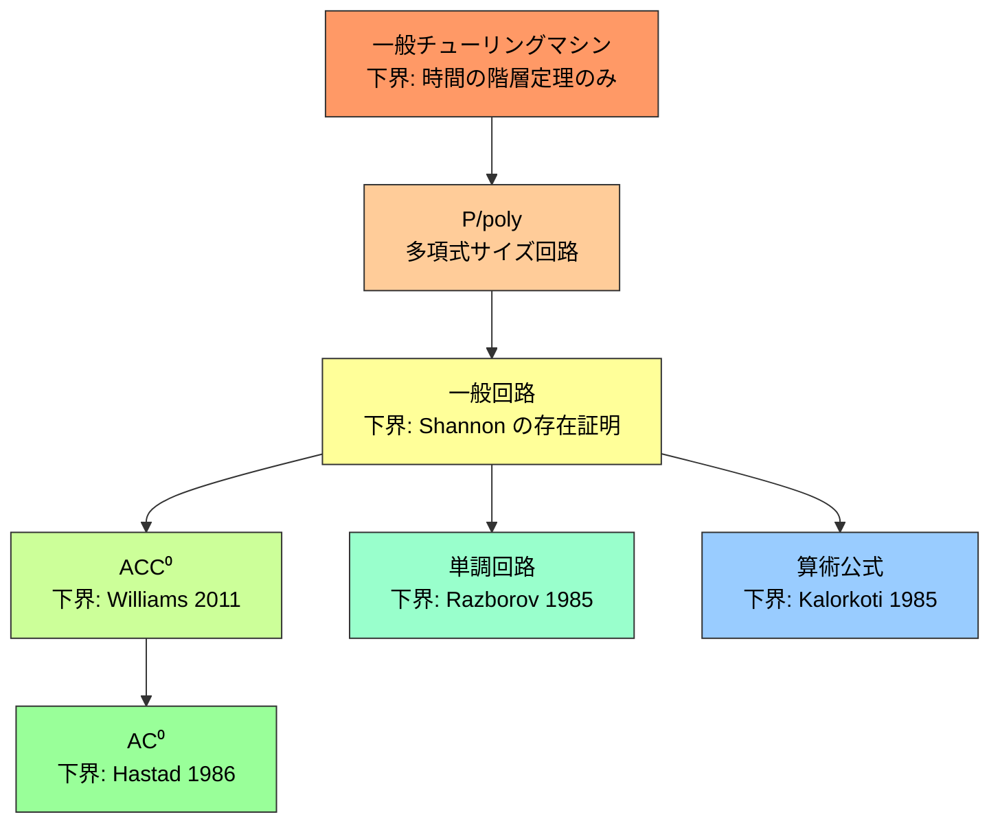

# 計算量の下界 — なぜこれ以上速くできないのか

## 1. 下界証明の意義：アルゴリズムの限界を知る

計算機科学におけるアルゴリズム設計は、常に「より速い解法」を追い求める営みである。ソートを $O(n^2)$ で行うバブルソートに対してマージソートが $O(n \log n)$ を達成し、行列乗算を $O(n^3)$ で行う素朴な方法に対して Strassen のアルゴリズムが $O(n^{2.807})$ を達成した。しかし、ここで自然な疑問が生じる。

> **この問題を解くのに、本当にこれ以上速い方法は存在しないのか？**

この問いに答えるのが**計算量の下界（lower bound）**の理論である。上界（upper bound）がある具体的なアルゴリズムの計算量を表すのに対し、下界は**いかなるアルゴリズムを用いても、ある問題を解くのにこれだけの計算資源が必要である**ことを主張する。上界は一つのアルゴリズムを提示すれば証明できるが、下界は**あらゆる可能なアルゴリズム**を同時に排除しなければならない。この本質的な非対称性が、下界証明を計算機科学で最も困難な課題の一つにしている。

### 1.1 上界と下界の関係

ある問題 $P$ に対して、最良のアルゴリズムの計算量を $T^*(n)$ とする。上界 $U(n)$ は「$T^*(n) \le U(n)$ である」という主張であり、具体的なアルゴリズムの存在によって証明される。下界 $L(n)$ は「$T^*(n) \ge L(n)$ である」という主張であり、あらゆるアルゴリズムに対して成り立つことを示さなければならない。

$$
L(n) \le T^*(n) \le U(n)
$$

上界と下界が一致するとき、すなわち $L(n) = \Theta(U(n))$ であるとき、その問題の計算量は**漸近的に最適**（asymptotically tight）に決定されたことになる。このとき、現在のアルゴリズムの計算量をこれ以上改善する余地がないことが保証される。

### 1.2 下界証明の難しさ

なぜ下界証明はこれほど困難なのか。上界の証明では、一つのアルゴリズムを構成すれば十分である。しかし、下界の証明では「考えうるあらゆるアルゴリズム」——まだ発見されていない、想像を超えた天才的な手法をも含めて——のすべてが、一定の計算量を要することを示さなければならない。

この困難さは、計算モデルの選択とも密接に関わる。チューリングマシン上の下界は、RAMモデル上の下界とは異なりうる。量子コンピュータを許せばさらに事情は変わる。下界は常に「ある計算モデルの中での」限界であり、モデルが変われば下界も変わりうる。

歴史的に見て、無条件の下界（unconditional lower bound）が証明できた例は限られている。比較ベースのソート、回路計算量の一部、通信計算量など、特定の枠組みの中でのみ、強い下界が知られている。一般的な計算モデルにおける下界証明は、$P \ne NP$ 問題に代表されるように、現代の計算量理論における最大の未解決問題群と直結している。

### 1.3 下界証明の主要な手法

下界を証明するために、計算機科学者たちは多様な手法を開発してきた。本記事では、以下の主要なアプローチを順に解説する。

1. **情報理論的下界**：出力を決定するために必要な情報量から下界を導く
2. **敵対者論法（adversary argument）**：どんなアルゴリズムに対しても最悪のケースを構築する
3. **回路計算量**：ブール回路のサイズやゲート数に関する下界
4. **通信計算量**：分散環境における通信ビット数の下界
5. **代数的計算量**：代数的計算モデルにおける演算回数の下界

## 2. 比較ソートの下界 $\Omega(n \log n)$

下界証明の最も美しく、最も教育的な例が、**比較ベースのソートアルゴリズム**に対する $\Omega(n \log n)$ の下界である。この結果は、マージソートやヒープソートが漸近的に最適であることを保証する。

### 2.1 比較モデルとは

まず、計算モデルを明確に定義する。**比較ベースのソートアルゴリズム**とは、入力要素に対して行える操作が「2つの要素の大小比較」のみであるアルゴリズムを指す。すなわち、任意の2要素 $a_i$ と $a_j$ に対して $a_i \le a_j$ かどうかを問い合わせ、その結果に基づいて次の比較を決定し、最終的に正しいソート順を出力する。

この定義は重要な制約を含んでいる。比較ベースのアルゴリズムは、入力要素の**値そのもの**を利用することができない。基数ソート（radix sort）やバケットソート（bucket sort）のように、要素の数値的な性質を直接利用するアルゴリズムはこのモデルの範囲外であり、したがってこの下界は適用されない。

### 2.2 決定木モデル

比較ベースのソートアルゴリズムは、**決定木（decision tree）**として自然にモデル化できる。決定木の各内部ノードは一回の比較 $a_i \le a_j$ に対応し、左の子が「はい」、右の子が「いいえ」の結果に対応する。各葉ノードは、入力列のある順列（permutation）に対応する。

$n$ 個の要素をソートするアルゴリズムの決定木は、$n!$ 個以上の葉を持たなければならない。なぜなら、$n$ 個の異なる要素の順列は $n!$ 通りあり、アルゴリズムはそれぞれを区別して正しいソート結果を出力できなければならないからである。

上の決定木は $n = 3$ の場合を示している。$3! = 6$ 個の葉があり、3要素の全順列に対応している。

### 2.3 下界の証明

**定理**: 比較ベースのソートアルゴリズムの最悪時の比較回数は $\Omega(n \log n)$ である。

**証明**: 比較ベースのソートアルゴリズムを決定木 $T$ でモデル化する。$T$ の葉の数を $\ell$ とすると、$\ell \ge n!$ でなければならない（$n$ 要素の全順列を区別する必要があるため）。

二分木の高さ $h$ と葉の数 $\ell$ の間には $\ell \le 2^h$ という関係が成り立つ。したがって、

$$
2^h \ge \ell \ge n!
$$

両辺の対数を取ると、

$$
h \ge \log_2(n!)
$$

ここで **Stirling の近似** $n! \approx \sqrt{2\pi n} \left(\frac{n}{e}\right)^n$ を用いると、

$$
\log_2(n!) = \log_2\left(\sqrt{2\pi n} \left(\frac{n}{e}\right)^n\right) = n \log_2 n - n \log_2 e + \frac{1}{2}\log_2(2\pi n)
$$

したがって、

$$
h \ge n \log_2 n - n \log_2 e + O(\log n) = \Omega(n \log n)
$$

決定木の高さは最悪時の比較回数に対応するので、**いかなる比較ベースのソートアルゴリズムも、最悪の場合 $\Omega(n \log n)$ 回の比較を必要とする**ことが示された。$\blacksquare$

### 2.4 最適性の意味

マージソートは最悪の場合 $O(n \log n)$ 回の比較でソートを行う。下界が $\Omega(n \log n)$ であるから、マージソートは比較回数に関して**漸近的に最適**である。

ただし、この結果にはいくつかの注意点がある。

1. **定数係数の問題**: 下界は漸近的なものであり、$n \log_2 n - 1.4427n + O(\log n)$ という、より精密な下界が知られている。一方、マージソートの比較回数は約 $n \log_2 n - n + 1$ であり、Ford-Johnson のアルゴリズム（merge-insertion sort）は定数係数のレベルでさらに改善する。
2. **平均時の計算量**: 上の証明は最悪時の下界であるが、ランダムな入力に対する平均時の下界も $\Omega(n \log n)$ であることが同様の議論で示せる（$n!$ 個の順列が等確率で現れるとき、二分木の平均的な葉までの深さは $\log_2(n!)$ 以上）。
3. **比較モデルの制約外**: 基数ソートは $O(nk)$（$k$ は桁数）でソートでき、入力が一様分布のとき期待 $O(n)$ 時間のバケットソートも存在する。これらは比較を行わないため、$\Omega(n \log n)$ の下界には縛られない。

## 3. 情報理論的下界

比較ソートの下界証明は、より一般的な原理——**情報理論的下界（information-theoretic lower bound）**——の特殊な場合と見なすことができる。この手法は、問題を解くために必要な**情報量**から下界を導出する。

### 3.1 基本原理

ある問題が $N$ 個の可能な出力のうちの一つを特定しなければならないとする。アルゴリズムが各ステップで得られる情報が高々 $b$ ビットであるなら、出力を一意に決定するためには少なくとも

$$
\frac{\log_2 N}{b}
$$

ステップが必要である。これが情報理論的下界の基本原理である。

比較ソートの場合、$N = n!$（可能な順列の数）、各比較で得られる情報は $b = 1$ ビット（yes/no）であるから、

$$
\frac{\log_2(n!)}{1} = \Omega(n \log n)
$$

となり、先の結果と一致する。

### 3.2 探索問題への適用

**ソート済み配列からの探索**: $n$ 個のソート済み要素の中から特定の値を探す問題を考える。可能な答えは $n + 1$ 通り（$n$ 個の要素のいずれかの位置、または「見つからない」）である。各比較で得られる情報は高々1ビットなので、

$$
\lceil \log_2(n + 1) \rceil = \Omega(\log n)
$$

回の比較が必要である。二分探索（binary search）はこれを達成するので、漸近的に最適である。

**ソートされていない配列からの探索**: $n$ 個のソートされていない要素の中から特定の値を探す場合、比較の結果（等しいかどうか）は1ビットの情報しか与えない。最悪の場合、$n - 1$ 回の比較が「不一致」を返した後に初めて答えが確定するので、$\Omega(n)$ の下界が得られる。線形探索はこれを達成する。

### 3.3 数え上げ論法（counting argument）

情報理論的下界のもう一つの表現形式が**数え上げ論法**である。これは以下の原理に基づく。

> アルゴリズムの実行パスが $P$ 個しかないとき、区別できる入力は高々 $P$ 個である。したがって、$N$ 個の異なる入力を区別しなければならないなら、$P \ge N$ でなければならない。

具体的には、アルゴリズムが $T$ ステップ実行し、各ステップで $k$ 通りの分岐が可能であるなら、実行パスは高々 $k^T$ 個である。したがって、

$$
k^T \ge N \implies T \ge \log_k N
$$

### 3.4 データ構造の問合せ下界

情報理論的下界はデータ構造の性能限界にも適用できる。$n$ 要素に対して $q$ 通りの問合せ結果がありうるとき、各問合せが $O(1)$ 時間で行えるデータ構造は、少なくとも $\Omega(\log q)$ ビットの空間を使用しなければならない。これは、データ構造の状態数が少なくとも $q$ 個なければならないことから導かれる。

Cell-probe モデルにおけるより洗練された議論では、メモリセルの読み出し回数と空間使用量のトレードオフを示す**セルプローブ下界（cell-probe lower bound）**が知られている。Patrascu や Demaine らの研究により、動的データ構造の操作時間と空間使用量の間の精密な下界が多数証明されている。

## 4. 敵対者論法（Adversary Argument）

**敵対者論法**は、下界を証明するための強力かつ直観的な手法である。アルゴリズムに対して「最悪の敵（adversary）」を設定し、その敵がアルゴリズムの各クエリに対して巧妙に応答することで、アルゴリズムが多くのクエリを発行せざるを得ないことを示す。

### 4.1 基本的な考え方

敵対者論法の構造は以下の通りである。

1. アルゴリズム $A$ が問題を解くために、何らかのオラクル（oracle）に問合せを行う
2. 敵対者は、まだ入力を確定しておらず、$A$ の問合せに対して矛盾しない範囲で回答を選ぶ
3. 敵対者は $A$ にとって「最も不利な」回答を選ぶことで、$A$ が答えを確定するまでに必要な問合せ回数を最大化する
4. 敵対者が $A$ に $T$ 回の問合せを強制できれば、$T$ がその問題の下界となる

重要なのは、敵対者の戦略は問題のすべてのアルゴリズムに対して有効でなければならないという点である。特定のアルゴリズムに対する敵対者を構成するだけでは下界にはならない——**任意の**アルゴリズムに対して機能する一般的な戦略が必要である。

### 4.2 最大値探索の下界

最も基本的な例として、$n$ 個の異なる要素の中から最大値を見つける問題を考える。

**定理**: $n$ 個の異なる要素の最大値を見つけるには、少なくとも $n - 1$ 回の比較が必要である。

**証明（敵対者論法）**: 各要素について、「この要素がまだ最大値である可能性が残っている」かどうかを追跡する。初期状態では、$n$ 個すべての要素が最大値の候補である。

一回の比較 $a_i \le a_j$ の結果、「はい」ならば $a_i$ は最大値の候補から外れるが、$a_j$ の候補資格は保たれる。「いいえ」ならば $a_j$ が候補から外れる。いずれの場合も、一回の比較で候補から外れる要素は**高々1つ**である。

最大値を確定するためには、候補をちょうど1つにまで絞り込まなければならない。初期状態で $n$ 個の候補があるので、少なくとも $n - 1$ 回の比較で $n - 1$ 個の候補を排除する必要がある。

したがって、最大値の探索には少なくとも $n - 1$ 回の比較が必要である。$\blacksquare$

この下界はトーナメント方式（各比較で敗者を1つ排除する）で達成されるため、漸近的に最適であるだけでなく、正確に最適でもある。

### 4.3 2番目に大きい要素の探索

より興味深い例として、$n$ 個の異なる要素の中から**2番目に大きい要素**を見つける問題を考える。

素朴な方法では、まず最大値を見つけ（$n - 1$ 回の比較）、残りの要素から再び最大値を見つける（$n - 2$ 回の比較）ことで、合計 $2n - 3$ 回の比較で2番目に大きい要素を見つけられる。しかし、もっと良い方法がある。

**定理**（Kislitsyn, 1964）: 2番目に大きい要素を見つけるために必要な比較回数は $n + \lceil \log_2 n \rceil - 2$ 回である。

**下界の証明のアイデア**: トーナメント方式で最大値を見つける過程で、最大値と直接比較した要素の集合を追跡する。2番目に大きい要素は、必ずこの集合の中にある（なぜなら、2番目に大きい要素が負けるのは最大値との比較のみだから）。トーナメントの深さが $\lceil \log_2 n \rceil$ であることから、最大値と直接比較する要素は $\lceil \log_2 n \rceil$ 個あり、その中から最大値を見つけるのに $\lceil \log_2 n \rceil - 1$ 回の比較が追加で必要となる。合計で $n - 1 + \lceil \log_2 n \rceil - 1 = n + \lceil \log_2 n \rceil - 2$ 回である。

下界がこの値に一致することの厳密な証明は、敵対者論法を精緻に適用して「最大値と直接比較する要素の数を最小化できない」ことを示す必要があるが、ここでは省略する。

### 4.4 量子計算における敵対者論法

敵対者論法は量子計算においても極めて重要な役割を果たしている。Ambainis（2000）は**量子敵対者法（quantum adversary method）**を導入し、量子アルゴリズムのクエリ計算量に対する下界を系統的に証明する手法を確立した。

量子敵対者法の基本的な考え方は、古典的な敵対者論法を量子状態の区別可能性に拡張したものである。2つの入力 $x$ と $y$ に対して、量子アルゴリズムがそれぞれの入力上で生成する量子状態の重ね合わせが $t$ 回のクエリの後にどの程度区別可能になるかを追跡する。

具体的には、**重み付き敵対者行列（weighted adversary matrix）** $\Gamma$ を構成し、以下の量を評価する。

$$
Q(f) \ge \frac{\|\Gamma\|}{\max_i \|\Gamma \circ D_i\|}
$$

ここで $\|\cdot\|$ はスペクトルノルム、$D_i$ は $i$ 番目の変数が異なる入力対を示す行列、$\circ$ は Hadamard 積（要素ごとの積）である。

Reichardt（2009, 2011）は、この量子敵対者法が実は**漸近的にタイト**であること——すなわち、量子クエリ計算量を多項式因子の範囲内で正確に特徴づけること——を証明した。これは「一般敵対者法（general adversary bound）」として知られ、量子クエリ計算量の理論における画期的な成果である。

## 5. 回路計算量の下界

**回路計算量（circuit complexity）**は、ブール関数を計算する回路のサイズ（ゲート数）に関する計算量を研究する分野である。回路計算量における下界は、$P \ne NP$ 問題に密接に関連しており、計算量理論の中でも最も野心的な研究プログラムの一つである。

### 5.1 ブール回路の基本

**ブール回路（Boolean circuit）**は、AND、OR、NOT ゲートを組み合わせた有向非巡回グラフ（DAG）である。$n$ 本の入力 $x_1, x_2, \ldots, x_n$ を受け取り、1本の出力を生成する。回路の**サイズ**はゲートの総数、**深さ**は入力から出力までの最長パスの長さである。

$n$ 変数のブール関数は $2^{2^n}$ 個存在する（各入力の組合せ $2^n$ 個に対して出力が0か1かを独立に選べるため）。一方、サイズ $s$ の回路は高々 $(c \cdot n \cdot s)^s$ 個程度しか存在しない（各ゲートの入力の選び方とゲートの種類の組合せ）。数え上げ論法（counting argument）により、**ほとんどすべての**ブール関数を計算するには $\Omega(2^n / n)$ サイズの回路が必要であることが示せる。

**定理**（Shannon, 1949）: ほとんどすべての $n$ 変数ブール関数を計算する回路のサイズは $\Omega(2^n / n)$ である。

この結果は非構成的であり、具体的にどの関数が大きな回路を必要とするかは教えてくれない。NP の中の具体的な問題について超多項式の回路下界を証明することは、現在でも未解決である。

### 5.2 単調回路の下界

回路に制限を加えると、より強い下界が証明可能になる。**単調回路（monotone circuit）**は NOT ゲートを含まない回路であり、AND と OR のみで構成される。単調回路は**単調ブール関数**（入力の任意のビットを0から1に変えたとき、出力が1から0に変わらない関数）のみを計算できる。

Razborov（1985）は、**クリーク問題（clique problem）**の判定を行う単調ブール関数に対して、指数的な単調回路下界を証明した。

**定理**（Razborov, 1985）: $n$ 頂点のグラフにサイズ $k$ のクリークが存在するかを判定する単調ブール関数に対して、$k$ が適切な範囲にあるとき、単調回路のサイズは $n^{\Omega(k)}$ である。

Razborov の証明は**近似法（method of approximations）**と呼ばれる手法を用いる。回路内の各ゲートの出力を、より単純な関数（「近似関数」）で置き換え、この近似が回路全体を通じてどの程度の誤差を蓄積するかを追跡する。近似が良好であれば、小さな回路では目的の関数を計算できないことが結論づけられる。

### 5.3 制限付き回路クラス $AC^0$ の下界

計算量の回路クラスの中でも特に重要なのが $AC^0$ である。$AC^0$ は、多項式サイズ・定数深さで、ファンイン無制限の AND、OR、NOT ゲートから構成される回路のクラスである。

**定理**（Furst-Saxe-Sipser, 1984; Ajtai, 1983; Hastad, 1986）: パリティ関数（PARITY）、すなわち $n$ ビットの入力のうち1であるビット数が奇数かどうかを判定する関数は、$AC^0$ には属さない。

Hastad（1986）は、**スイッチング補題（Switching Lemma）**を用いて最も強い形のこの結果を証明した。深さ $d$ の $AC^0$ 回路で PARITY を計算するには $2^{\Omega(n^{1/(d-1)})}$ サイズが必要である。

$$
\text{Size}(C) \ge 2^{\Omega(n^{1/(d-1)})}
$$

ここで $C$ は深さ $d$ の PARITY を計算する回路である。この結果は、定数深さの回路ではパリティのような「大域的な」性質を捉えることが本質的に困難であることを示している。

::: tip スイッチング補題の直観
スイッチング補題の核心的なアイデアは次の通りである。ランダムに入力変数の一部を固定（restriction）すると、小さな CNF（積和標準形）は高い確率で小さな DNF（和積標準形）に「スイッチ」できる。この性質を回路の各層に繰り返し適用することで、定数深さの回路が計算できる関数に制限を与える。PARITY はこのような制限に強く耐性があるため、大きな回路が必要となる。
:::

### 5.4 回路下界の限界：自然証明の壁

回路下界の証明は1980年代に大きな進展があったが、その後停滞した。この停滞の理由を説明する重要な結果が、Razborov と Rudich（1997）による**自然証明の壁（natural proofs barrier）**である。

「自然証明（natural proof）」とは、以下の2つの性質を持つ下界証明手法を指す。

1. **構成性（constructiveness）**: 関数が「困難」であるかどうかを多項式時間で判定できる
2. **大きさ（largeness）**: ランダムな関数の大部分が「困難」と判定される

Razborov と Rudich は、**片方向関数（one-way function）が存在するならば**、自然証明は $P/\mathrm{poly}$（多項式サイズの回路で計算可能なクラス）に対する下界を証明できないことを示した。片方向関数の存在は暗号理論の基本的な仮定であり、多くの研究者がこれを信じている。

この結果は、既知の下界証明手法（ランダム制限法、近似法など）がすべて自然証明の枠組みに収まることから、これらの手法の延長線上では $P \ne NP$ を証明できない可能性を示唆する。新たなブレークスルーには、自然証明の壁を回避する非自然な証明手法が必要である。

## 6. 通信計算量

**通信計算量（communication complexity）**は、Yao（1979）によって導入された計算モデルであり、分散環境における計算の本質的な通信コストを研究する。通信計算量における下界は、データ構造、回路計算量、オークション設計など、計算機科学の多くの分野に応用されている。

### 6.1 通信計算量モデル

2人のプレイヤー、Alice と Bob がいるとする。Alice は入力 $x \in \{0, 1\}^n$ を、Bob は入力 $y \in \{0, 1\}^n$ を持っている。二人は共同で関数 $f(x, y)$ の値を計算したい。二人は交互にメッセージを送り合い（各自のプロトコルに従って）、最終的に $f(x, y)$ を出力する。

通信計算量 $D(f)$ は、$f$ を正しく計算するための最悪時の総通信ビット数の最小値である。

### 6.2 等号関数の通信計算量

最も基本的な問題は**等号関数（equality function）** $\mathrm{EQ}(x, y) = [x = y]$ の通信計算量である。

**定理**: $\mathrm{EQ}$ の決定的通信計算量は $D(\mathrm{EQ}) = n + 1$ ビットである。

**下界の証明**: 通信プロトコルを**通信行列（communication matrix）**の観点から分析する。$\mathrm{EQ}$ の通信行列は $2^n \times 2^n$ の単位行列（対角成分が1、他が0）である。

通信プロトコルは、通信行列を**単色矩形（monochromatic rectangle）**に分割する。各矩形は $R \times C$（$R \subseteq \{0,1\}^n$, $C \subseteq \{0,1\}^n$）の形で、矩形内のすべてのエントリが同じ値（0または1）を持つ。

$\mathrm{EQ}$ の通信行列で値が1の単色矩形はすべてサイズ $1 \times 1$ である（なぜなら、$x_1 \ne x_2$ かつ $y_1 \ne y_2$ のとき、矩形 $\{x_1, x_2\} \times \{y_1, y_2\}$ には $(x_1, y_2)$ と $(x_2, y_1)$ が含まれ、$\mathrm{EQ}(x_1, y_2) = 0$ となるため）。したがって、$2^n$ 個の1エントリを被覆するために少なくとも $2^n$ 個の矩形が必要であり、

$$
D(\mathrm{EQ}) \ge \log_2(2^n) + 1 = n + 1
$$

ここで $+1$ は出力ビットに対応する。$\blacksquare$

興味深いことに、**確率的通信計算量**では劇的な改善が可能である。ランダム化プロトコルを許せば、$O(\log n)$ ビットの通信で $\mathrm{EQ}$ を高確率で正しく計算できる。Alice が $x$ のランダムなハッシュ値を送り、Bob がそれを $y$ のハッシュ値と比較すればよい。

### 6.3 通信計算量の下界手法

通信計算量の下界を証明するための主要な手法をいくつか紹介する。

**ランク下界（rank lower bound）**: 通信行列 $M_f$ の実数上のランクを $\mathrm{rank}(M_f)$ とすると、

$$
D(f) \ge \log_2(\mathrm{rank}(M_f))
$$

これは、$c$ ビットのプロトコルが通信行列を高々 $2^c$ 個の単色矩形に分割し、各単色矩形はランク1の行列であることから導かれる。

**愚者集合法（fooling set method）**: 入力対の集合 $S = \{(x_1, y_1), \ldots, (x_t, y_t)\}$ が**愚者集合（fooling set）**であるとは、(1) すべての $(x_i, y_i)$ で $f$ の値が同じであり、(2) $i \ne j$ に対して $f(x_i, y_j)$ または $f(x_j, y_i)$ が異なる値を持つことを言う。サイズ $t$ の愚者集合が存在するなら、

$$
D(f) \ge \log_2 t
$$

**情報計算量（information complexity）**: 通信計算量のより精密な下界を与える手法として、Bar-Yossef, Jayram, Kumar, Sivakumar（2004）およびBarak, Braverman, Chen, Rao（2010）らにより**情報計算量（information complexity）**が発展した。これは、プロトコルの各メッセージが伝達する情報量（相互情報量の意味で）を計測し、より漸近的にタイトな下界を与える。

### 6.4 通信計算量の応用

通信計算量の下界は、以下のような多くの分野に応用されている。

- **ストリーミングアルゴリズム**: データストリーム上でのアルゴリズムの空間下界は、通信計算量の下界に帰着できることが多い。例えば、データストリーム中の異なる要素の数を近似する問題の空間下界は、$\mathrm{DISJ}$（集合交叉関数）の通信計算量の下界から導かれる。
- **データ構造**: 動的データ構造の問合せ時間と更新時間のトレードオフは、通信計算量の議論で分析できる。
- **分散計算**: 分散環境での関数計算に必要なラウンド数やメッセージサイズの下界。

::: details 集合交叉問題（DISJ）の重要性
集合交叉関数 $\mathrm{DISJ}(x, y) = \neg \bigvee_{i=1}^n (x_i \wedge y_i)$ は通信計算量の理論において中心的な問題である。Kalyanasundaram-Schnitger（1992）およびRazborov（1992）は、$\mathrm{DISJ}$ のランダム化通信計算量が $\Omega(n)$ であることを証明した。この結果は、ストリーミングアルゴリズムやデータ構造の下界において最も頻繁に使われる道具の一つである。
:::

## 7. $P \ne NP$ 問題の位置付け

計算量の下界理論における最大の未解決問題は、言うまでもなく **$P \ne NP$ 問題**である。この問題は、計算量理論のみならず、数学、暗号理論、最適化、人工知能など、計算機科学の広範な分野に甚大な影響を与える。

### 7.1 問題の定式化

**$P$** は決定性チューリングマシンで多項式時間に解ける問題のクラス、**$NP$** は非決定性チューリングマシンで多項式時間に解ける問題のクラス（同値な定義として、「解の検証が多項式時間で行える問題のクラス」）である。

$P \ne NP$ の主張は、**NP 完全問題**（SAT、クリーク、ハミルトン閉路など）に対して多項式時間アルゴリズムが存在しない、という主張と等価である。これは、これらの問題の計算量に対する**超多項式の下界**を証明することに帰着される。

$$
P \ne NP \iff \exists L \in NP,\ \forall \text{ poly-time TM } M,\ M \text{ does not decide } L
$$

### 7.2 なぜ $P \ne NP$ の証明は困難か：3つの壁

$P \ne NP$ の証明が困難な理由を説明する、3つの有名な**壁（barrier）**が知られている。

**相対化の壁（relativization barrier）**: Baker, Gill, Solovay（1975）は、あるオラクル $A$ に対して $P^A = NP^A$ となり、別のオラクル $B$ に対して $P^B \ne NP^B$ となることを示した。したがって、オラクルの存在に影響されない証明手法（相対化する証明）では $P \ne NP$ を証明できない。対角線論法やシミュレーション論法の多くは相対化する。

**自然証明の壁**: 前述の通り、Razborov-Rudich（1997）は、片方向関数が存在するという暗号理論的仮定の下で、「自然な」回路下界証明手法では $P/\mathrm{poly}$ に対する超多項式下界を証明できないことを示した。$P \ne NP$ を証明するには $P/\mathrm{poly}$ の下界も示す必要がある（Karp-Lipton の定理の対偶より）ため、これは深刻な障壁である。

**代数化の壁（algebrization barrier）**: Aaronson, Wigderson（2009）は、相対化の壁を拡張した「代数化」の概念を導入した。代数化された証明手法では、$P \ne NP$ だけでなく、$\mathsf{NEXP} \not\subseteq P/\mathrm{poly}$ のような結果も証明できない。既知の対話的証明系の結果（$\mathsf{IP} = \mathsf{PSPACE}$ など）は代数化しないため、代数化の壁は相対化の壁よりも厳しい。

### 7.3 壁を越える試み

これらの壁にもかかわらず、$P \ne NP$ の解決に向けた有望なアプローチがいくつか存在する。

**幾何学的計算量理論（Geometric Complexity Theory, GCT）**: Mulmuley と Sohoni（2001）が提案したプログラムで、代数幾何学と表現論を用いて回路下界を証明しようとする。GCT は、自然証明の壁と代数化の壁の両方を回避できる可能性があるとされている。具体的には、行列式と行列の永久式（permanent）の間の計算量の差を、対称群の表現論の言葉で特徴づけようとする。

**Ryan Williams のアプローチ**: Williams（2011）は、「回路上界から回路下界を導く」という驚くべき結果を証明した。具体的には、$\mathsf{NEXP} \not\subseteq ACC^0$ であること——すなわち、$\mathsf{NEXP}$ の問題で $ACC^0$ 回路（定数深さ、多項式サイズ、MOD ゲートを含む）では計算できないものが存在すること——を示した。この結果は、上界の改善（$ACC^0$ 回路の SAT アルゴリズムの改善）から下界を導くという新しいパラダイムを開拓した。

### 7.4 無条件の下界：既知の結果

$P \ne NP$ は未証明であるが、いくつかの**無条件の**（unproven assumptions に依存しない）下界が知られている。

- **$\mathsf{EXPTIME} \ne \mathsf{P}$**: 時間の階層定理（time hierarchy theorem）より、指数時間で解ける問題の中には多項式時間では解けないものがある。
- **$\mathsf{NEXP} \not\subseteq ACC^0$**: Williams（2011）の前述の結果。
- **$\mathsf{PARITY} \notin AC^0$**: 前述の Hastad の結果。

これらは重要な成果であるが、$P \ne NP$ の証明には遠く及ばない。$NP$ の中の具体的な問題について、チューリングマシンの計算ステップ数に関する超多項式の無条件下界は、いまだ証明されていない。

## 8. 代数的計算量と下界

**代数的計算量（algebraic complexity theory）**は、多項式や行列の計算に必要な代数演算（加算、乗算）の回数に関する計算量を研究する。代数的な設定では、ブール回路の場合よりも強い下界が知られている。

### 8.1 算術回路

**算術回路（arithmetic circuit）**は、入力変数 $x_1, \ldots, x_n$ と定数に対して、加算ゲート（$+$）と乗算ゲート（$\times$）を適用して多項式を計算する回路である。回路のサイズはゲートの総数である。

ブール回路と異なり、算術回路は体（field）$\mathbb{F}$ 上で動作する。入力と中間値はすべて $\mathbb{F}$ の元であり、最終的に $\mathbb{F}[x_1, \ldots, x_n]$ の多項式を計算する。

### 8.2 行列乗算の下界

$n \times n$ 行列の乗算は、計算機科学で最も基本的な演算の一つである。素朴なアルゴリズムは $O(n^3)$ 回の乗算を行う。Strassen（1969）は $O(n^{2.807})$ のアルゴリズムを発見し、以後、指数は徐々に改善されてきた。2024年現在の最良の上界は $O(n^{2.371552})$（Duan, Wu, Zhou, 2023）である。

一方、下界はどうか。行列乗算の出力は $n^2$ 個の要素を含むので、明らかに $\Omega(n^2)$ の下界がある。しかし、$\omega(n^2)$（$n^2$ を真に超える）の下界は現在でも証明されていない。これは代数的計算量における主要な未解決問題の一つである。

行列乗算の最適な指数 $\omega$ の値は、

$$
2 \le \omega \le 2.371552\ldots
$$

であり、$\omega = 2$ が達成可能かどうかは未知である。

### 8.3 行列式と永久式

代数的計算量における最も重要な問題の一つが、**行列式（determinant）**と**永久式（permanent）**の計算量の差である。

$n \times n$ 行列 $A = (a_{ij})$ に対して、

$$
\det(A) = \sum_{\sigma \in S_n} \mathrm{sgn}(\sigma) \prod_{i=1}^n a_{i,\sigma(i)}
$$

$$
\mathrm{perm}(A) = \sum_{\sigma \in S_n} \prod_{i=1}^n a_{i,\sigma(i)}
$$

行列式と永久式は、定義としては符号 $\mathrm{sgn}(\sigma)$ の有無だけが異なる。しかし、計算量の観点からは天と地ほどの差がある。行列式は $O(n^3)$ で計算可能（ガウスの消去法）であるのに対し、永久式は $\#P$-完全であり、多項式時間アルゴリズムの存在は $P = \#P$ を意味する。

Valiant（1979）は**代数的 $VP$ vs $VNP$ 問題**を定式化した。これは $P$ vs $NP$ の代数的類似であり、行列式多項式のクラス $VP$ と永久式多項式のクラス $VNP$ が等しいかを問う。

**定理**（Valiant, 1979）: 永久式を行列式の射影（projection）として表現するとき、行列式のサイズは $2^{\Omega(n)}$ でなければならない。

より正確には、Mignon-Ressayre（2004）は、$\mathrm{perm}_n$ を $m \times m$ 行列の行列式として表現するには $m = 2^{\Omega(\sqrt{n})}$ が必要であることを示した（ただし、行列のエントリが入力変数のアフィン関数に制限される場合）。

### 8.4 テンソルランクと下界

行列乗算の計算量は**テンソルランク（tensor rank）**の概念と深く関連している。$n \times n$ 行列の乗算は、$n^2 \times n^2 \times n^2$ のテンソル $T = \langle n, n, n \rangle$ として表現でき、このテンソルのランク $R(T)$ が行列乗算に必要な乗算の回数に対応する。

$2 \times 2$ 行列の乗算テンソルのランクが7であること（Strassen のアルゴリズムに対応）は、以下のように示される。上界はStrassen のアルゴリズムの構成により7回の乗算で十分であることを示し、下界は Winograd（1971）により7回の乗算が必要であることが証明された。

テンソルランクの下界を示す主要な手法には、以下がある。

- **置換ランク法（substitution method）**: テンソルの変数を特殊な値に置換して、得られる行列のランクを評価する。
- **レーザー法（laser method）**: Strassen（1987）とCoppersmith-Winograd（1990）によって開発された、テンソルの漸近的ランクを評価する手法。現在の行列乗算の上界の多くはこの手法の変種に基づいている。

### 8.5 多項式の計算量に関する下界

特定の多項式族の算術回路サイズに関する下界もいくつか知られている。

**定理**（Baur-Strassen, 1983）: 次数 $d$ の $n$ 変数多項式 $f$ を計算する算術回路が、$f$ のすべての偏微分 $\frac{\partial f}{\partial x_i}$（$i = 1, \ldots, n$）も計算できるようにした場合、回路のサイズは $\Omega(n + d)$ である。

この結果の系として、以下が得られる。

**系**（Baur-Strassen, 1983）: 次数 $n$ の $n$ 変数の「すべての基本対称多項式」を同時に計算する算術回路のサイズは $\Omega(n \log n)$ である。

また、**算術公式（arithmetic formula）**（各ゲートの出力が高々1つのゲートの入力にしか使えない回路、すなわち木構造の回路）に対しては、より強い下界が知られている。

**定理**（Kalorkoti, 1985; Nisan-Wigderson, 1997 の系）: 行列式 $\det_n$ を計算する算術公式のサイズは $n^{\Omega(\log n)}$ である。

これは超多項式の下界であるが、指数的下界には届かない。算術公式に対して指数的下界を証明することは、重要な未解決問題である。

## 9. 下界証明の全体像と今後の展望

### 9.1 既知の下界のまとめ

これまでに解説した下界を、計算モデルの制限の強さと下界の強さの観点で整理する。

| 計算モデル | 問題 | 下界 | 証明者 |
|---|---|---|---|
| 比較ベースソート | ソート | $\Omega(n \log n)$ | 情報理論的議論 |
| 比較ベース探索 | 探索 | $\Omega(\log n)$ | 情報理論的議論 |
| 単調回路 | クリーク | $n^{\Omega(k)}$ | Razborov, 1985 |
| $AC^0$ 回路 | PARITY | $2^{\Omega(n^{1/(d-1)})}$ | Hastad, 1986 |
| $ACC^0$ 回路 | $\mathsf{NEXP}$ の問題 | 超多項式 | Williams, 2011 |
| 一般ブール回路 | 大部分の関数 | $\Omega(2^n/n)$ | Shannon, 1949 |
| 算術公式 | 行列式 | $n^{\Omega(\log n)}$ | Kalorkoti, 1985 |
| 通信計算量 | $\mathrm{EQ}$ | $\Omega(n)$ | 決定的通信 |
| 通信計算量 | $\mathrm{DISJ}$ | $\Omega(n)$ | Razborov, 1992 |

一般的な傾向として、計算モデルに強い制限を課すほど強い下界が証明可能であり、制限が弱くなるほど下界の証明は困難になる。一般的なチューリングマシンに対する超多項式の下界は、$NP$ の問題についてはいまだ証明されていない。

### 9.2 計算モデル間の関係

### 9.3 下界証明の壁を越えるために

現在、下界証明における主要な研究方向をいくつか紹介する。

**代数幾何学的アプローチ**: Mulmuley-Sohoni の GCT プログラムは、対称群の表現論と代数幾何学を用いて、永久式と行列式の計算量の差を特徴づけようとする。このアプローチは、自然証明の壁を回避できる可能性がある（永久式の特殊な代数的構造を利用するため）。

**上界から下界へ**: Williams のアプローチは、「もしある計算モデルで効率的な SAT アルゴリズムが存在するなら、そのモデルに対する下界が存在する」という帰結を利用する。この「アルゴリズムの設計が下界証明に変換される」というパラダイムは、今後さらに発展する可能性がある。

**証明計算量（proof complexity）**: 命題論理の証明の長さに関する下界は、$P \ne NP$ 問題と深く関連している。特定の証明体系（Resolution、Cutting Planes、Frege 系など）における証明の長さの下界は多数知られており、これらの結果を強化・統合することで、より一般的な下界に近づく可能性がある。

**ファイングレインド計算量（fine-grained complexity）**: 近年、SETH（Strong Exponential Time Hypothesis）や他の精緻な仮定を用いた**条件付き下界（conditional lower bound）**が急速に発展している。これは「$P \ne NP$ が証明できないならば、より弱い帰結を仮定から導こう」という実用的なアプローチであり、多くの具体的な問題の計算量を精密に理解するための枠組みを提供している。

例えば、SETH は「$k$-SAT は $O(2^{(1-\epsilon)n})$ 時間では解けない（任意の $\epsilon > 0$ と十分大きな $k$ に対して）」という仮定であり、この仮定の下で、編集距離（edit distance）が真に $O(n^2)$ 未満の時間では計算できないことなどが示されている。

### 9.4 結語

計算量の下界は、計算機科学における最も深遠な問題群の中心に位置している。「この問題をこれ以上速く解くことは不可能である」という主張を証明することは、一つのアルゴリズムを構成するよりも遥かに困難であり、しばしば全く新しい数学的手法の開発を要求する。

比較ソートの $\Omega(n \log n)$ 下界のような美しい完成された結果がある一方で、$P \ne NP$ 問題のように、半世紀以上にわたって未解決のまま残されている問題もある。自然証明の壁、相対化の壁、代数化の壁は、既存の手法の限界を明確にしたが、同時に「壁を越える」ための新しい道筋——GCT、上界からの下界、ファイングレインド計算量——を切り開く契機ともなった。

下界の研究は、「計算とは何か」「何が本質的に困難なのか」という根源的な問いに挑み続ける、計算機科学の知的冒険の最前線である。その進展は、アルゴリズム設計、暗号理論、最適化、さらには数学の基礎そのものに対する我々の理解を深化させ続けている。
