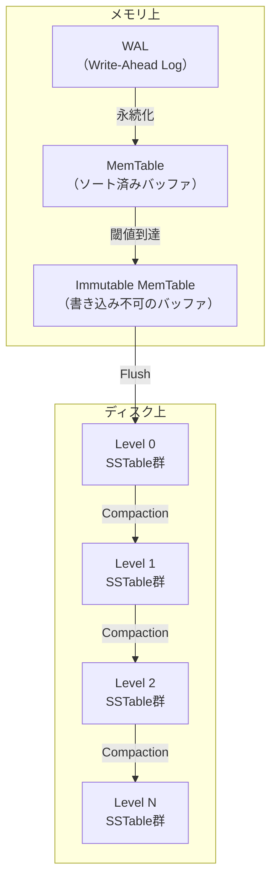
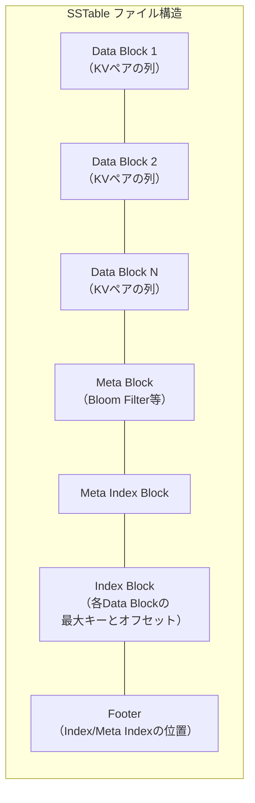
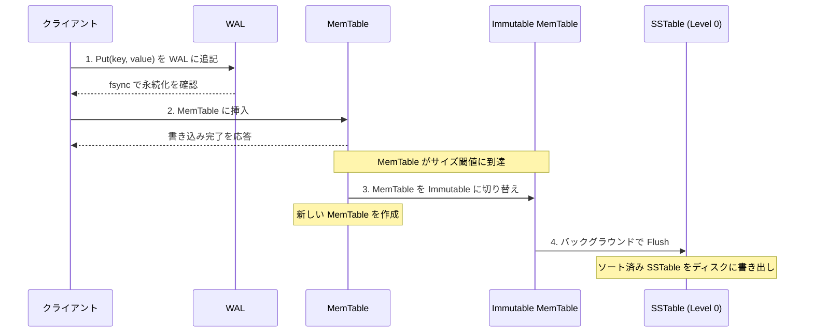
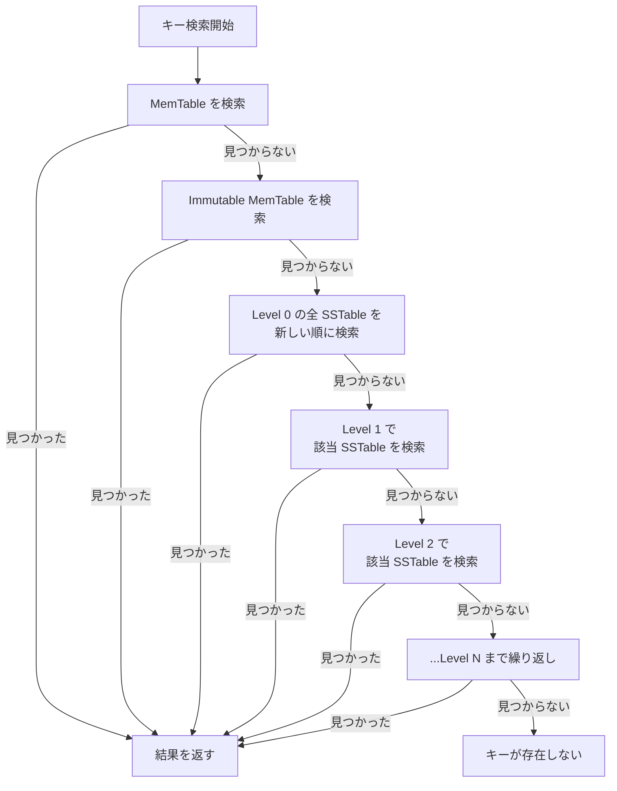
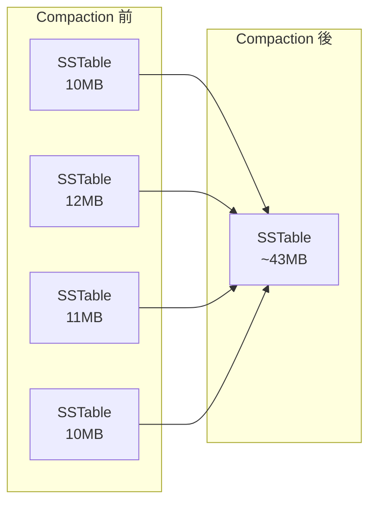
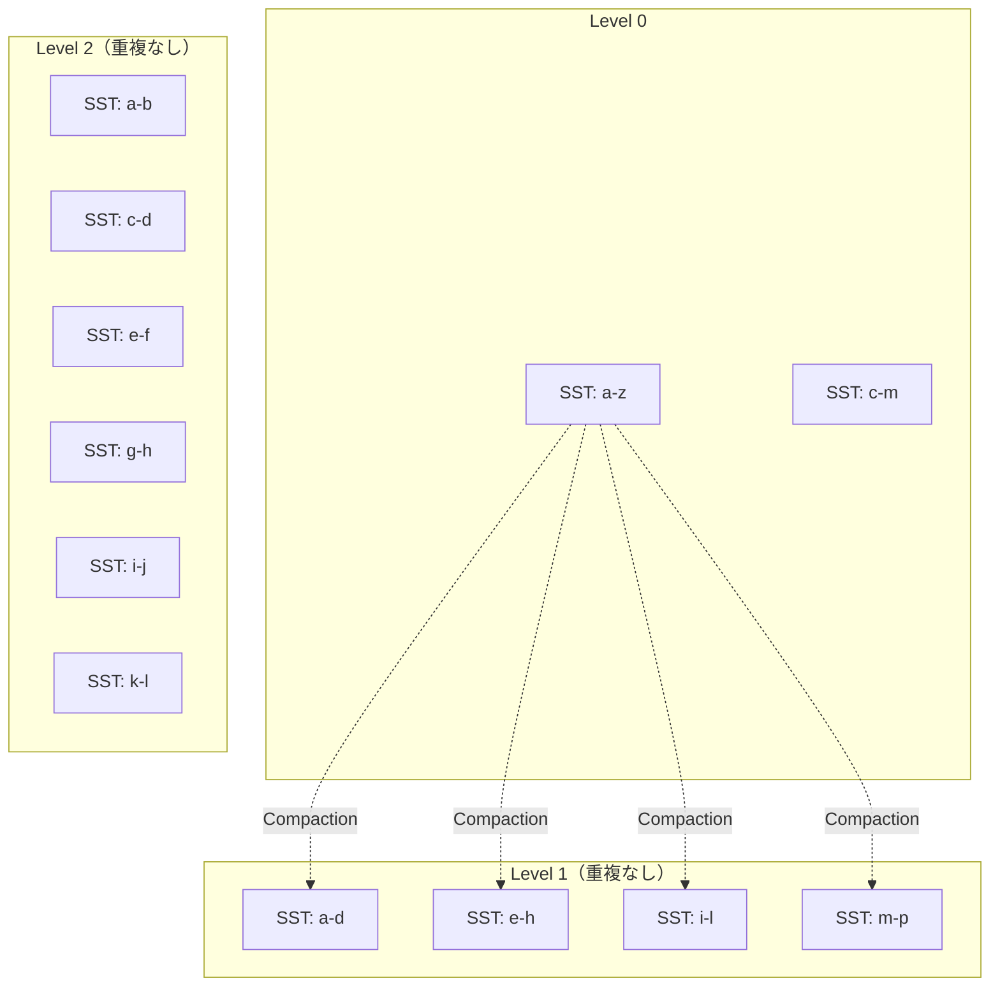
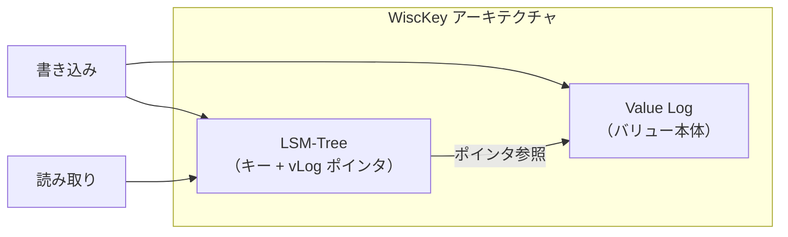

# LSM-Tree — 書き込み最適化ストレージの設計思想

## 1. はじめに：書き込みヘビーなワークロードの課題

データベースのストレージエンジンにとって、書き込み性能は永遠の課題である。ユーザーのアクティビティログ、IoTセンサーデータ、金融取引の記録、メッセージングシステムの履歴——現代のアプリケーションは膨大な量のデータを絶え間なく生成する。こうした**書き込みヘビー（write-heavy）**なワークロードに対して、従来のB-Treeベースのストレージエンジンは構造的な弱点を抱えている。

B-Treeは読み取り性能に優れたデータ構造であるが、書き込みの際には**ランダムI/O**が発生する。新しいキーを挿入するたびに、ツリー内の適切なリーフノードを探し出し、そのページをディスクから読み込み、更新し、書き戻す必要がある。データがツリー全体に散在している場合、これらのI/Oはディスク上の離れた位置に対して行われる。HDDの場合、ランダムI/Oの性能はシーケンシャルI/Oの100〜1000分の1程度であり、SSDにおいてもランダム書き込みはシーケンシャル書き込みの数分の1の性能にとどまる。

さらに、B-Treeでは1バイトのデータを更新するためにも、少なくとも1ページ（通常4KB〜16KB）をまるごと書き換える必要がある。この現象は**書き込み増幅（write amplification）**と呼ばれ、ストレージデバイスの寿命を縮め、全体のスループットを低下させる。

こうした課題に対する根本的な解決策として登場したのが、**LSM-Tree（Log-Structured Merge-Tree）**である。LSM-Treeは、すべての書き込みを**シーケンシャルI/O**に変換することで、書き込みスループットを劇的に向上させる。その代償として読み取り性能にいくらかのコストを払うが、Bloom Filterなどの補助データ構造によってこのコストを実用上十分なレベルまで低減できる。

本記事では、LSM-Treeの設計思想、内部アーキテクチャ、各種Compaction戦略、増幅のトレードオフ、そして実世界での採用事例と最新の研究動向を詳しく解説する。

## 2. 歴史的背景

### 2.1 起源：O'Neilらの論文

LSM-Treeの概念は、1996年にPatrick O'Neil、Edward Cheng、Dieter Gawlick、Elizabeth O'Neilによって発表された論文 **"The Log-Structured Merge-Tree (LSM-Tree)"** で初めて提案された。この論文は、当時のデータベースシステムが直面していたトランザクションログの書き込みボトルネックを解消することを目的としていた。

O'Neilらの洞察は明快であった。ディスクへのランダム書き込みが遅いならば、**すべての書き込みをシーケンシャルに行い、バックグラウンドでデータを整理（マージ）すればよい**。この考え方は、1988年にRosenblumとOusterhoutが提案した**Log-Structured File System（LFS）**からも影響を受けている。LFSはファイルシステムレベルでシーケンシャル書き込みを活用する設計であり、LSM-Treeはこのアイデアをデータベースのインデックス構造に適用したものと言える。

### 2.2 論文からプロダクトへ

LSM-Treeの概念が論文として発表されてから、実際に広く使われるプロダクトに採用されるまでには約10年の歳月がかかった。転機となったのは、2006年にGoogleが発表した **Bigtable** の論文である。Bigtableの内部ストレージエンジンは、LSM-Treeに基づく設計を採用しており、MemTableとSSTableという概念が明確に定義された。

その後、Bigtableの設計に影響を受けたオープンソースプロジェクトが次々と登場した：

- **HBase**（2008年〜）：Apache Hadoopエコシステム上で動作するBigtableクローン
- **Cassandra**（2008年〜）：Facebook社内で開発され、後にApacheプロジェクトとなった分散データベース
- **LevelDB**（2011年）：Googleが開発したシングルノード向けの組み込みKey-Valueストア
- **RocksDB**（2012年〜）：FacebookがLevelDBをフォークし、性能を大幅に改善したストレージエンジン

現在では、RocksDBが事実上のLSM-Tree実装の標準となっており、MySQL（MyRocks）、MariaDB、CockroachDB、TiDB、YugabyteDBなど、多くのデータベースシステムのストレージバックエンドとして採用されている。

## 3. LSM-Treeの基本アーキテクチャ

LSM-Treeの全体像を理解するために、まずその構成要素を俯瞰しよう。

### 3.1 MemTable：メモリ上のソート済みバッファ

**MemTable**は、書き込みデータを一時的に保持するメモリ上のデータ構造である。MemTableの内部実装には、**スキップリスト（Skip List）**や**赤黒木（Red-Black Tree）**などのソート済みデータ構造が使われる。LevelDBとRocksDBはスキップリストを採用している。

スキップリストが選ばれる主な理由は以下の通りである：

- **並行書き込みの効率**：ロックフリーまたは細粒度ロックによる並行挿入が容易
- **範囲スキャンの効率**：ソート済みであるため、イテレータによるシーケンシャルアクセスが高速
- **実装の簡潔さ**：赤黒木と比較して実装がシンプル

MemTableには上限サイズ（たとえばRocksDBのデフォルトでは64MB）が設定されており、この閾値に達すると**Immutable MemTable**に変換される。Immutable MemTableは新たな書き込みを受け付けず、バックグラウンドスレッドによってディスク上のSSTableとしてフラッシュされる。フラッシュが進行している間も、新しいMemTableが作成され書き込みを受け付けるため、書き込み処理がブロックされることはない。

### 3.2 SSTable：ソート済み文字列テーブル

**SSTable（Sorted String Table）**は、キーでソートされたKey-Valueペアを格納するイミュータブル（不変）なファイルである。一度書き込まれたSSTableは決して更新されず、Compactionによって新しいSSTableが生成されるだけである。

SSTableの典型的な内部構造は以下の通りである：

- **Data Block**：ソート済みのKey-Valueペアを格納する。ブロック内ではプレフィックス圧縮が適用され、共通プレフィックスを省略することでサイズを削減する
- **Index Block**：各Data Blockの最終キーとファイル内オフセットを記録する。特定のキーを検索する際に、まずIndex Blockを参照してバイナリサーチで対象のData Blockを特定する
- **Meta Block**：Bloom Filterや統計情報を格納する
- **Footer**：Index BlockとMeta Index Blockのオフセットを記録する。ファイルの末尾に固定長で配置される

SSTableのイミュータビリティ（不変性）は、LSM-Treeの設計において極めて重要な性質である。ファイルが不変であるため、ロックなしで並行読み取りが可能であり、キャッシュ戦略も単純化される。

### 3.3 レベル構造

LSM-Treeでは、ディスク上のSSTableが複数の**レベル（Level）**に階層的に整理される。一般的に、各レベルの容量は前のレベルの**10倍**（この倍率を**ファンアウト**と呼ぶ）に設定される。

| レベル | 容量（ファンアウト10倍の場合） | 特徴 |
|--------|-------------------------------|------|
| Level 0 | 数百MB | MemTableから直接フラッシュされる。キー範囲が重複可能 |
| Level 1 | 数GB | Level 0のSSTableがマージされる。キー範囲は重複しない |
| Level 2 | 数十GB | Level 1からマージされる。キー範囲は重複しない |
| Level N | 数TB | 最下位レベル。データの大部分がここに集中する |

Level 0は特殊であり、複数のSSTableのキー範囲が重複し得る。これは、MemTableからフラッシュされたSSTableがそのままLevel 0に配置されるためである。Level 1以降では、Compactionによってキー範囲の重複が排除される（Leveled Compactionの場合）。

## 4. 書き込みパス

LSM-Treeにおけるデータ書き込みの流れを、ステップごとに詳しく見ていく。

### 4.1 Step 1：WALへの追記

クライアントから書き込みリクエストを受け取ると、最初に**WAL（Write-Ahead Log）**にデータを追記する。WALはディスク上のシーケンシャルなログファイルであり、追記のみの操作であるためI/O効率が高い。

WALの役割は**耐障害性**の確保である。MemTableはメモリ上のデータ構造であるため、プロセスクラッシュや電源障害が発生するとデータが失われる。WALがあれば、障害後にWALを先頭から再生することでMemTableの状態を復元できる。

WALへの書き込み後、`fsync`システムコールを呼び出してデータがディスクに永続化されたことを確認する。この`fsync`のコストは書き込みレイテンシに直接影響するため、一部の実装では**グループコミット（group commit）**を採用し、複数の書き込みの`fsync`をまとめて発行することでオーバーヘッドを削減している。

### 4.2 Step 2：MemTableへの挿入

WALへの書き込みが成功したら、同じデータをMemTableに挿入する。スキップリストへの挿入は $O(\log n)$ の時間計算量であり、メモリ操作であるため非常に高速である。

この時点で書き込みは完了とみなされ、クライアントに成功応答を返す。つまり、LSM-Treeにおける書き込み操作は以下の2ステップだけで完結する：

1. WALへのシーケンシャル追記
2. メモリ上のデータ構造への挿入

B-Treeのようにディスク上のページを探索・読み込み・更新する必要がないため、書き込みレイテンシが大幅に低減される。

### 4.3 Step 3：MemTableからImmutable MemTableへの切り替え

MemTableのサイズが閾値に達すると、現在のMemTableは**Immutable MemTable**（不変MemTable）に変換され、新しい空のMemTableが作成される。この切り替えはポインタの差し替えだけで完了するため、ほぼゼロコストで行われる。

Immutable MemTableは読み取り専用であり、書き込みリクエストはすべて新しいMemTableに向けられる。RocksDBでは、複数のImmutable MemTableを同時に保持できる設定（`max_write_buffer_number`）があり、フラッシュが追いつかない場合のバッファとして機能する。

### 4.4 Step 4：SSTableへのフラッシュ

バックグラウンドスレッドが、Immutable MemTableのデータをディスク上のSSTableとして書き出す。MemTable内のデータはすでにソート済みであるため、SSTableの生成はシーケンシャル書き込みだけで完了する。

フラッシュ時には以下の処理が行われる：

1. ソート済みのKey-ValueペアをData Blockに分割して書き出す
2. 各Data Blockに対応するインデックスエントリを生成する
3. Bloom Filterを構築してMeta Blockに格納する
4. Index BlockとFooterを書き出す
5. ファイルを`fsync`で永続化する
6. 対応するWALファイルを削除する（このSSTableに含まれるデータのWALエントリは不要になるため）

フラッシュが完了すると、新しいSSTableはLevel 0に配置される。

### 4.5 削除の処理：Tombstone

LSM-Treeではデータのインプレース削除は行わない。削除リクエストは、対象キーに対する**Tombstone（墓標）**マーカーを書き込むことで表現される。Tombstoneは通常の書き込みと同様にWAL → MemTable → SSTableの経路を辿る。

読み取り時にTombstoneが検出されると、そのキーは「存在しない」として扱われる。Tombstoneは、Compactionの過程で対象キーがすべてのレベルからマージされた時点で初めて物理的に除去される。

この設計は直感に反するかもしれないが、SSTableのイミュータビリティを維持しつつ削除をサポートするための合理的な手法である。ただし、Tombstoneが蓄積すると空間効率が低下するため、定期的なCompactionが不可欠となる。

## 5. 読み取りパス

LSM-Treeの読み取りは、書き込みパスと比較するとやや複雑である。目的のキーが複数の場所（MemTable、各レベルのSSTable）に存在し得るため、新しいデータから順に探索する必要がある。

### 5.1 ポイントクエリ（単一キー検索）

特定のキーを検索する場合、以下の順序で探索が行われる：

1. **MemTable**を検索する（$O(\log n)$）
2. **Immutable MemTable**があれば検索する
3. **Level 0**のSSTableを新しい順に検索する。Level 0ではキー範囲が重複し得るため、すべてのSSTableを確認する必要がある
4. **Level 1以降**では、各レベルのSSTable間でキー範囲が重複しないため、バイナリサーチで対象のSSTableを1つだけ特定し検索する
5. 最初に見つかった値が最新の値である（上位レベルほど新しいデータを保持するため）

最悪ケースでは、すべてのレベルのSSTableを検索する必要があり、レベル数を $L$、Level 0のSSTable数を $T$ とすると、最大 $T + L - 1$ 回のSSTable検索が発生する。

### 5.2 Bloom Filter：存在しないキーの高速排除

上述の探索プロセスでは、目的のキーが含まれないSSTableも検索してしまう可能性がある。特に、存在しないキーを検索する場合（ネガティブルックアップ）、すべてのレベルを無駄に走査することになる。

この問題を解決するのが**Bloom Filter**である。Bloom Filterは、集合のメンバーシップを確率的に判定するデータ構造で、以下の特性を持つ：

- **偽陽性（false positive）**が発生し得る：「含まれている」と判定されたが、実際には含まれていない場合がある
- **偽陰性（false negative）**は発生しない：「含まれていない」と判定された場合、確実に含まれていない

各SSTableにはBloom Filterが付随しており、キー検索時にまずBloom Filterを照会する。Bloom Filterが「含まれていない」と判定すれば、そのSSTableのData Blockを読み込む必要がない。

Bloom Filterのビット数を $m$、ハッシュ関数の数を $k$、格納要素数を $n$ とすると、偽陽性率は近似的に以下で表される：

$$
p \approx \left(1 - e^{-kn/m}\right)^k
$$

1キーあたり10ビット（約1.25バイト）を割り当てると、偽陽性率は約1%に抑えられる。つまり、100回の検索のうち99回は不要なディスクI/Oを回避できる。

### 5.3 範囲スキャン

特定のキー範囲のデータを取得する範囲スキャンでは、MemTableと各レベルのSSTableからイテレータを取得し、**マージソート**によって統合する。これは、すべてのソースからのデータをソート順に読み出し、同一キーの場合は最新（最上位レベル）の値を採用する処理である。

範囲スキャンはLSM-Treeの弱点の一つである。複数のSSTableをまたいでデータを読み取る必要があり、特にLevel 0でキー範囲が重複している場合はI/O効率が低下する。Compactionによってキー範囲の重複を減らすことが、範囲スキャン性能の改善に直結する。

### 5.4 ブロックキャッシュ

読み取り性能を向上させるために、頻繁にアクセスされるSSTableのData BlockやIndex Blockをメモリ上にキャッシュする**ブロックキャッシュ**が使用される。RocksDBでは、LRU（Least Recently Used）方式やClock方式のキャッシュが提供されている。

Bloom Filterとブロックキャッシュの組み合わせにより、多くの読み取り操作はディスクI/Oを発生させずにメモリ上で完結する。

## 6. Compaction戦略

Compactionは、LSM-Treeのバックグラウンドで実行される最も重要なプロセスである。複数のSSTableをマージして新しいSSTableを生成し、古いSSTableを削除する。Compactionの目的は以下の通りである：

- **重複キーの排除**：同一キーに対する複数のバージョンを、最新の値だけに集約する
- **Tombstoneの除去**：削除されたキーのTombstoneを物理的に除去する
- **読み取り性能の維持**：SSTableの数とキー範囲の重複を制限する
- **空間の回収**：不要になったデータを削除し、ディスク空間を解放する

Compaction戦略の選択は、LSM-Treeの性能特性を大きく左右する。主な戦略を以下に解説する。

### 6.1 Size-Tiered Compaction（STCS）

**Size-Tiered Compaction**は、最もシンプルなCompaction戦略である。同程度のサイズのSSTableが一定数（たとえば4つ）蓄積すると、それらをマージして1つの大きなSSTableを生成する。

**特徴：**
- 書き込み増幅が比較的小さい
- 同一キーの複数バージョンが長期間残存するため、空間増幅が大きい
- キー範囲の重複が残るため、読み取り増幅が大きい

**採用例：** Apache Cassandraのデフォルト戦略（旧バージョン）

### 6.2 Leveled Compaction（LCS）

**Leveled Compaction**は、LevelDBが導入した戦略であり、現在最も広く使われている。各レベルのSSTable間でキー範囲の重複を許さない（Level 0を除く）という制約を維持しながらCompactionを行う。

Compactionの手順は以下の通りである：

1. Level $L$ のSSTableを1つ選択する
2. 選択したSSTableとキー範囲が重複するLevel $L+1$ のSSTableをすべて特定する
3. これらのSSTableをマージソートし、新しいSSTableを生成してLevel $L+1$ に配置する
4. 古いSSTableを削除する

**特徴：**
- Level 1以降でキー範囲の重複がないため、ポイントクエリは各レベルで最大1つのSSTableを検索するだけで済む
- 空間増幅が小さい（最大で約10%程度の余剰空間）
- 書き込み増幅が大きい（レベル間のファンアウトが10倍の場合、最悪で10倍の書き込み増幅が各レベルで発生する）

**採用例：** LevelDB、RocksDBのデフォルト

### 6.3 FIFO Compaction

**FIFO Compaction**は、最もシンプルな戦略であり、古いSSTableをそのまま削除するだけである。データにTTL（Time To Live）が設定されている場合に有効で、期限切れのデータを含むSSTableを丸ごと削除する。

**特徴：**
- Compactionのコストがほぼゼロ
- 時系列データやキャッシュデータなど、古いデータを保持する必要がないワークロードに適する
- データの永続性は保証されない

### 6.4 Universal Compaction（Hybrid）

RocksDBが提供する**Universal Compaction**は、Size-Tiered CompactionとLeveled Compactionのハイブリッドである。書き込み増幅を抑えつつ、空間増幅も制御可能な柔軟な戦略を提供する。

SSTableをサイズ順にソートし、以下のルールに基づいてCompactionを実行する：

- 小さいSSTableの合計サイズが大きいSSTableの一定割合を超えた場合、それらをマージする
- 空間増幅が閾値を超えた場合、全体的なCompactionを実行する

この戦略は、Size-Tiered Compactionの書き込み効率とLeveled Compactionの読み取り効率のバランスを柔軟に調整できる。

## 7. 増幅のトレードオフ

LSM-Treeの性能評価において、**3つの増幅**の概念を理解することが不可欠である。これらの増幅はトレードオフの関係にあり、すべてを同時に最小化することはできない。

### 7.1 書き込み増幅（Write Amplification）

**書き込み増幅**とは、ユーザーが1バイトのデータを書き込んだとき、実際にディスクに書き込まれる総バイト数の比率である。

$$
\text{Write Amplification} = \frac{\text{ディスクへの実際の書き込みバイト数}}{\text{ユーザーが書き込んだバイト数}}
$$

Leveled Compactionにおいて、レベル間のファンアウトを $T$ 、レベル数を $L$ とすると、最悪ケースの書き込み増幅は以下のように見積もられる：

$$
WA \approx T \times L
$$

ファンアウトが10、レベル数が5の場合、書き込み増幅は最大で約50倍となる。これは、1GBのデータを書き込むために、実際には50GBのディスクI/Oが発生し得ることを意味する。

書き込み増幅はSSDの寿命に直接影響するため、SSD上でLSM-Treeを運用する場合には特に注意が必要である。

### 7.2 読み取り増幅（Read Amplification）

**読み取り増幅**とは、1つのキーを読み取るために実際に必要なディスクI/O回数（またはバイト数）の比率である。

$$
\text{Read Amplification} = \frac{\text{実際のディスク読み取り回数}}{\text{論理的な読み取り回数}}
$$

Leveled Compactionの場合、Level 0の $T_0$ 個のSSTableと、Level 1以降の $L-1$ 個のレベルで各1回のSSTable検索が必要になるため：

$$
RA \leq T_0 + (L - 1)
$$

Bloom Filterによって、各SSTableの検索はほとんどの場合メモリ内で完結する。Bloom Filterの偽陽性率を $p$ とすると、実際のディスクI/O回数は $p \times (T_0 + L - 1)$ 程度に削減される。

### 7.3 空間増幅（Space Amplification）

**空間増幅**とは、実際のデータサイズに対して、ディスク上で使用される総容量の比率である。

$$
\text{Space Amplification} = \frac{\text{ディスク上の総使用容量}}{\text{実データサイズ}}
$$

空間増幅の要因には以下がある：

- **重複キー**：同一キーの古いバージョンがまだCompactionされていない
- **Tombstone**：削除されたキーのマーカーが残存している
- **一時ファイル**：Compaction中に古いSSTableと新しいSSTableが同時に存在する

Leveled Compactionは空間増幅が最も小さく、Size-Tiered Compactionは最も大きい。

### 7.4 トレードオフの全体像

これらの増幅のトレードオフを以下の表にまとめる：

| 戦略 | 書き込み増幅 | 読み取り増幅 | 空間増幅 |
|------|------------|------------|---------|
| Size-Tiered | **小** | 大 | **大** |
| Leveled | **大** | **小** | **小** |
| FIFO | **最小** | 大 | 大 |
| Universal | 中 | 中 | 中 |

この表が示すように、3つの増幅をすべて同時に最小化することは不可能であり、ワークロードの特性に応じて適切なバランスを選択する必要がある。この関係は「**RUM予想（Read-Update-Memory Conjecture）**」として知られ、どのストレージエンジンも読み取り・更新・メモリの3要素のうち、最大で2つしか最適化できないとされている。

## 8. 実装例

### 8.1 LevelDB

**LevelDB**はGoogleが2011年に公開した組み込みKey-Valueストアであり、LSM-Treeの教科書的な実装として広く知られている。C++で実装されており、コードベースは約2万行と比較的コンパクトである。

主な特徴：
- Leveled Compactionのみをサポート
- シングルスレッドでのCompaction
- スナップショットによるMVCC（Multi-Version Concurrency Control）
- 圧縮にSnappyを使用

LevelDBはシンプルさを優先した設計であり、教育目的やプロトタイピングに適している。ただし、マルチスレッド対応やトランザクションサポートがないため、プロダクション環境ではRocksDBが推奨される。

### 8.2 RocksDB

**RocksDB**はFacebookがLevelDBをフォークして開発したストレージエンジンであり、プロダクション環境での利用に耐えうる数多くの最適化と拡張が施されている。

LevelDBからの主な改善点：

- **マルチスレッドCompaction**：複数のCompaction処理を並行実行
- **複数のCompaction戦略**：Leveled、Universal、FIFOから選択可能
- **Column Family**：論理的に独立した名前空間を1つのDBインスタンス内で管理
- **トランザクション**：Optimistic/Pessimistic Concurrency Control
- **Rate Limiter**：CompactionのI/O帯域幅を制限し、フォアグラウンドのI/Oへの影響を抑制
- **Statistics & Monitoring**：詳細な内部メトリクスの公開
- **Block-based Table Format**：Bloom Filterの粒度やData Blockサイズの柔軟な設定
- **Compression**：Snappy、LZ4、Zstd、Zlib など多様な圧縮アルゴリズムに対応

RocksDBは現在、LSM-Treeベースのストレージエンジンの事実上の標準であり、以下のような大規模システムのバックエンドとして採用されている：

- **MyRocks**：MySQL上でRocksDBをストレージエンジンとして使用するプロジェクト（Facebook内部で運用）
- **CockroachDB**：分散SQLデータベースのストレージレイヤー（Pebble移行中）
- **TiKV / TiDB**：分散トランザクションKey-Valueストアおよび分散SQLデータベース
- **YugabyteDB**：PostgreSQL互換の分散SQLデータベース

### 8.3 Apache Cassandra

**Cassandra**は分散データベースであり、各ノードのローカルストレージにLSM-Treeを採用している。Cassandraは当初Size-Tiered Compactionのみをサポートしていたが、後にLeveled CompactionやTime-Window Compactionなどの戦略が追加された。

Cassandraのストレージ実装の特徴として、**Commit Log**（WALに相当）とMemTable/SSTableの分離がある。Commit Logはノード全体で1つのシーケンシャルファイルとして管理され、複数のテーブルへの書き込みが1つのログに集約される。

### 8.4 Apache HBase

**HBase**はHadoopエコシステム上で動作する分散データベースであり、GoogleのBigtable論文に忠実な実装である。HDFS（Hadoop Distributed File System）上にSSTable（HBaseでは**HFile**と呼ばれる）を格納する。

HBaseの特徴的な設計として、**Region**という単位でデータを分割し、各Regionが独立したLSM-Treeを持つ。Regionのサイズが閾値を超えると自動的に分割（split）される。

## 9. B-Treeとの比較

LSM-TreeとB-Treeは、データベースのストレージエンジンとして最も広く使われている2つのデータ構造である。それぞれの特性を正しく理解し、ワークロードに応じた使い分けが重要である。

### 9.1 構造の違い

| 項目 | B-Tree | LSM-Tree |
|------|--------|----------|
| 書き込み方式 | インプレース更新 | 追記型（append-only） |
| ディスクI/Oパターン | ランダムI/O | シーケンシャルI/O |
| データの整理 | 書き込み時にソート位置を決定 | バックグラウンドCompactionで整理 |
| 並行制御 | ラッチ/ロックが必要 | イミュータブルなSSTableで簡素化 |
| 空間利用効率 | ページ分割により約50-70% | Compactionにより変動 |

### 9.2 ワークロード別の適性

**B-Treeが有利なケース：**
- 読み取り中心のワークロード（OLTP系の参照が多いアプリケーション）
- ポイントクエリの低レイテンシが求められる場合
- 安定した応答時間が重要な場合（CompactionによるI/O変動がない）
- トランザクション分離レベルの厳密な制御が必要な場合

**LSM-Treeが有利なケース：**
- 書き込みヘビーなワークロード（ログ、メトリクス、IoTデータ）
- 書き込みスループットの最大化が求められる場合
- 圧縮効率が重要な場合（LSM-Treeは連続したデータを圧縮するため効率が高い）
- SSDの書き込み寿命を考慮する場合（B-Treeのほうが書き込み増幅が大きい場合がある）

### 9.3 性能の定量的比較

一般的に以下のような性能差が報告されている（具体的な数値はハードウェアやワークロードに大きく依存する）：

- **ランダム書き込みスループット**：LSM-Treeが B-Treeの**3〜10倍**
- **ランダム読み取りレイテンシ**：B-Treeが LSM-Treeの**1.5〜3倍**高速
- **範囲スキャン**：データがCompaction済みであれば同等、そうでなければB-Treeが有利
- **空間効率**：LSM-Tree（Leveled Compaction）のほうが一般にコンパクト

近年では、SSDの普及によりランダムI/Oのコストが低下しており、B-TreeとLSM-Treeの性能差は縮まりつつある。一方、SSDの書き込み寿命への配慮から、書き込み増幅の小ささがより重要視されるようになっている。

## 10. 最新の発展

### 10.1 WiscKey（2016年）

**WiscKey**はウィスコンシン大学の研究チームが提案した手法で、SSD上でのLSM-Treeの性能を大幅に改善する。核心的なアイデアは**Key-Valueの分離**である。

従来のLSM-Treeでは、キーとバリューがSSTable内に一緒に格納される。Compaction時にはキーだけでなくバリューも読み書きされるため、バリューサイズが大きい場合に書き込み増幅が深刻化する。

WiscKeyでは、キーのみをLSM-Treeに格納し、バリューは別の**Value Log（vLog）**にシーケンシャルに追記する。LSM-Tree内のバリューはvLog内のオフセットへのポインタに置き換えられる。

**メリット：**
- Compaction時にバリューを読み書きする必要がなく、書き込み増幅が劇的に低減する
- LSM-Treeが小さくなるため、Compactionが高速化する
- SSD上でのランダム読み取りが高速なため、ポインタ経由の読み取りコストが許容範囲内

**デメリット：**
- 範囲スキャンの性能が低下する（バリューが連続して格納されていないため）
- Value Logのガベージコレクションが追加の複雑さをもたらす

WiscKeyのアイデアは、RocksDBの**BlobDB**機能やBadger（Go言語のKey-Valueストア）に取り入れられている。

### 10.2 Dostoevsky（2018年）

**Dostoevsky**はハーバード大学の研究チームが提案した**Lazy Leveling**と呼ばれるCompaction戦略である。Leveled CompactionとSize-Tiered Compactionのハイブリッドであり、最下位レベル以外にSize-Tiered Compactionを適用し、最下位レベルのみLeveled Compactionを適用する。

この設計の根拠は、データの大部分（約90%）が最下位レベルに集中するという事実にある。最下位レベル以外でのCompaction頻度を下げることで書き込み増幅を削減しつつ、最下位レベルでキー範囲の重複をなくすことで読み取り性能を維持する。

Dostoevskyの分析によると、Lazy Levelingは以下の条件下で最適である：

- ポイントクエリの割合が中程度
- 範囲スキャンの割合が低い
- 書き込みの割合が高い

### 10.3 PebblesDB（2017年）

**PebblesDB**はテキサス大学オースティン校の研究チームが提案した手法で、**Fragmented Log-Structured Merge-Tree（FLSM）**という構造を導入した。

従来のLeveled Compactionでは、Level $L$ のSSTableをLevel $L+1$ のSSTableとマージする際、Level $L+1$ の既存SSTableを読み込んで再書き込みする必要がある。PebblesDBでは、各レベル内に**Guard**と呼ばれるキー範囲の分割点を設定し、Guard内ではSSTableの重複を許容する。

この設計により、CompactionはLevel $L$ のSSTableをLevel $L+1$ の適切なGuard位置に配置するだけで済み、Level $L+1$ の既存SSTableを読み書きする必要がない。結果として、書き込み増幅が大幅に削減される。

### 10.4 その他の最新動向

- **Monkey（2017年）**：Bloom Filterのビット割り当てをレベルごとに最適化し、一定のメモリ予算内でポイントクエリの性能を最大化する手法
- **SifrDB（2018年）**：マルチコアCPUとNVMeの特性を活かしたLSM-Treeの並列Compaction
- **MatrixKV（2020年）**：NVM（Non-Volatile Memory）上にMemTableを配置することでWALを不要化し、書き込みレイテンシを改善する手法
- **SILK（2019年）**：I/Oスケジューラレベルでフォアグラウンド操作とCompactionの優先度を制御し、テールレイテンシを改善する手法

## 11. まとめ

LSM-Treeは、書き込みヘビーなワークロードに対して極めて効率的なストレージエンジンのデータ構造である。その核心的な設計思想は以下の3点に集約される：

1. **シーケンシャルI/Oの徹底活用**：すべての書き込みをWALへの追記とSSTableの生成というシーケンシャル操作に変換する
2. **イミュータビリティの活用**：SSTableを不変とすることで、並行制御を簡素化しキャッシュ効率を高める
3. **バックグラウンドCompactionによるデータ整理**：フォアグラウンドの書き込み性能を犠牲にせず、読み取り性能と空間効率を維持する

一方で、LSM-Treeは万能ではない。書き込み増幅、読み取り増幅、空間増幅のトレードオフは避けられず、ワークロードの特性に応じたCompaction戦略の選択とチューニングが不可欠である。

LSM-Treeの研究は現在も活発に進められている。Key-Value分離（WiscKey）、ハイブリッドCompaction（Dostoevsky）、新しいストレージメディアへの適応（NVMe、NVM）など、さまざまなアプローチが提案されている。ストレージ技術の進化とともに、LSM-Treeもまた進化を続けるだろう。

データベースのストレージエンジンを選択する際には、B-TreeとLSM-Treeのどちらか一方が常に優れているわけではないことを理解し、**自分のワークロードの読み書き比率、レイテンシ要件、空間効率の要件**に基づいて、最適なエンジンを選択することが重要である。
