# マネージドコンテナサービス（ECS, Cloud Run, Fargate）

## 1. 歴史的背景

### 1.1 仮想マシンからコンテナへ

コンピューティングのデプロイ形態は、物理サーバー、仮想マシン（VM）、コンテナという大きな変遷を経てきた。2000年代のVMware ESXiやXenの普及により、一台の物理サーバー上で複数のOSを同時に稼働させるハードウェア仮想化が標準的なインフラ構築手法となった。仮想マシンは強力なハードウェアレベルの隔離を提供する一方で、ゲストOS全体をブートする必要があるため、起動時間が数十秒から数分にわたり、メモリやディスクのオーバーヘッドも大きかった。

2013年にDockerが登場すると、状況は一変した。DockerはLinuxカーネルのNamespaceとcgroupsを活用し、ゲストOSなしでプロセスレベルの隔離を実現した。コンテナイメージという再現可能なパッケージング形式により、「開発環境では動くが本番では動かない」という問題を根本的に解決し、「Build once, run anywhere」というパラダイムを確立した。コンテナの起動は数百ミリ秒で完了し、VMに比べてリソース効率が飛躍的に向上した。

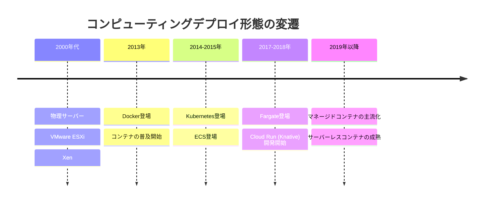

### 1.2 コンテナオーケストレーションの課題

コンテナ技術の普及に伴い、数十から数百、時には数千のコンテナを管理する必要性が生まれた。個々のコンテナの起動・停止、ヘルスチェック、スケーリング、サービスディスカバリ、ローリングアップデートといった運用タスクを手作業で行うことは非現実的であり、コンテナオーケストレーションツールが求められるようになった。

2014年にGoogleがKubernetesをオープンソースとして公開し、コンテナオーケストレーションのデファクトスタンダードとなった。Kubernetesは極めて柔軟で拡張性に優れた基盤だが、その運用は決して容易ではない。

::: warning Kubernetes運用の複雑さ
Kubernetesを自前で運用する場合、以下のような幅広い専門知識と継続的な運用負荷が発生する。

- **コントロールプレーンの管理**: etcdクラスターのバックアップ・復旧、API Serverの可用性確保、証明書のローテーション
- **ノード管理**: ワーカーノードのOSパッチ適用、カーネルアップデート、ノードのスケーリング
- **ネットワーキング**: CNIプラグインの選定・設定（Calico, Cilium, Flannelなど）、NetworkPolicyの管理
- **ストレージ**: CSIドライバーの導入、PersistentVolumeの管理
- **セキュリティ**: RBACの設計、PodSecurityStandards、Admission Controllerの設定
- **バージョンアップ**: Kubernetesの3ヶ月ごとのマイナーリリースへの追従
:::

こうした運用負荷を軽減するために、クラウドプロバイダーはマネージドKubernetesサービス（AWS EKS、Google GKE、Azure AKS）を提供した。しかし、マネージドKubernetesであってもノード管理やKubernetesの概念理解は依然として必要であり、すべてのユースケースに対してKubernetesが最適解とは限らない。

### 1.3 マネージドコンテナサービスの台頭

「コンテナを実行したいだけなのに、なぜクラスターを管理しなければならないのか」という問いに対する回答として、マネージドコンテナサービスが登場した。これらのサービスは、コンテナの実行基盤を完全に抽象化し、開発者がアプリケーションのコンテナイメージを指定するだけでデプロイ・運用できる環境を提供する。

主要なマネージドコンテナサービスとして、以下の3つが代表的である。

| サービス | プロバイダー | 初期リリース | 基盤技術 |
|---------|------------|------------|---------|
| Amazon ECS | AWS | 2014年 | 独自オーケストレーター |
| AWS Fargate | AWS | 2017年 | ECS/EKSのサーバーレスコンピュートエンジン |
| Google Cloud Run | Google Cloud | 2019年（GA） | Knativeベース |

これらのサービスはそれぞれ異なる設計思想と抽象化レベルを持ち、ユースケースに応じた使い分けが求められる。本記事では、各サービスのアーキテクチャを深く掘り下げ、実装手法、運用の実際、そして将来展望を包括的に解説する。

## 2. アーキテクチャ

### 2.1 Amazon ECS（Elastic Container Service）

#### 設計思想

Amazon ECSは、AWSが2014年に提供を開始した独自のコンテナオーケストレーションサービスである。Kubernetesとは異なる独自のAPIと概念体系を持ち、AWSの他サービスとの深い統合を設計の中核に据えている。ECSの設計思想は「AWSエコシステム内でのシンプルなコンテナ実行」であり、Kubernetesの汎用性・拡張性よりも、AWSネイティブな運用体験を優先している。

#### コアコンポーネント

ECSのアーキテクチャは、4つのコアコンポーネントで構成される。

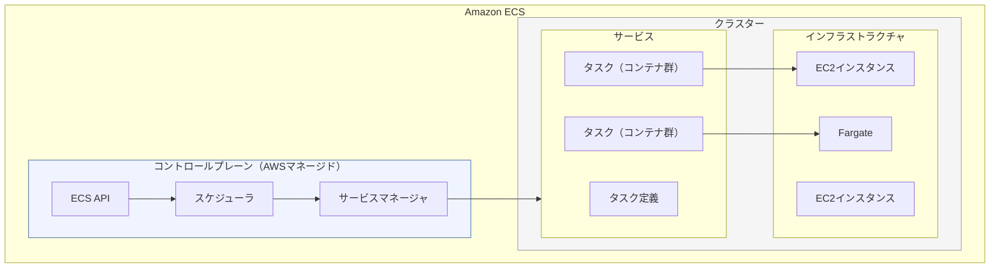

**クラスター（Cluster）** は、タスクやサービスを論理的にグループ化する最上位の単位である。クラスターは一つ以上のコンピュートリソース（EC2インスタンスまたはFargate）を束ね、リソースの境界を定義する。一つのAWSアカウント内に複数のクラスターを作成でき、環境（開発・ステージング・本番）やチームごとに分離するのが一般的な構成である。

**タスク定義（Task Definition）** は、コンテナの実行仕様を宣言的に定義するJSON形式のテンプレートである。コンテナイメージ、CPU・メモリ割り当て、環境変数、ポートマッピング、ボリュームマウント、ログ設定、IAMロールなどを指定する。タスク定義はイミュータブルであり、変更するたびに新しいリビジョンが作成される。

```json
{
  "family": "web-app",
  "networkMode": "awsvpc",
  "requiresCompatibilities": ["FARGATE"],
  "cpu": "256",
  "memory": "512",
  "containerDefinitions": [
    {
      "name": "app",
      "image": "123456789012.dkr.ecr.ap-northeast-1.amazonaws.com/web-app:latest",
      "portMappings": [
        {
          "containerPort": 8080,
          "protocol": "tcp"
        }
      ],
      "logConfiguration": {
        "logDriver": "awslogs",
        "options": {
          "awslogs-group": "/ecs/web-app",
          "awslogs-region": "ap-northeast-1",
          "awslogs-stream-prefix": "ecs"
        }
      }
    }
  ]
}
```

**タスク（Task）** は、タスク定義に基づいて実際に起動されたコンテナの実行単位である。一つのタスクは一つ以上のコンテナで構成され、同一タスク内のコンテナはlocalhostを介して通信できる。KubernetesにおけるPodに相当する概念である。

**サービス（Service）** は、指定された数のタスクを常に維持するための長期実行型のオーケストレーション機構である。タスクが異常終了した場合、サービスは自動的に新しいタスクを起動して希望数を維持する。ロードバランサーとの統合、ローリングアップデート、オートスケーリングもサービスレベルで管理される。

> [!NOTE]
> ECSには「サービス」以外に、バッチジョブなど一度きりの実行を行う「スタンドアロンタスク」という実行形態もある。サービスは常時稼働のWebサーバーやAPIサーバー向け、スタンドアロンタスクはバッチ処理やデータ移行などの用途に使い分ける。

#### 起動タイプ

ECSでは、タスクを実行するインフラストラクチャとして2つの起動タイプを選択できる。

**EC2起動タイプ** では、ユーザーが管理するEC2インスタンスのクラスター上でコンテナが実行される。ECSエージェント（コンテナとして各EC2上で稼働）がコントロールプレーンと通信し、タスクの配置と管理を行う。GPUインスタンスの利用、カスタムAMI、ホストレベルのカスタマイズが必要な場合に選択される。

**Fargate起動タイプ** では、インフラストラクチャの管理が完全にAWSに委譲される。これについては次節で詳述する。

### 2.2 AWS Fargate

#### 設計思想

AWS Fargateは、2017年のre:Inventで発表されたサーバーレスコンテナコンピュートエンジンである。FargateはECSやEKSの「起動タイプ」として機能し、コンテナの実行に必要なインフラストラクチャ（VM、OS、コンテナランタイム）を完全に抽象化する。開発者はCPUとメモリの組み合わせを指定するだけでよく、EC2インスタンスの選定、プロビジョニング、パッチ適用といった作業は一切不要になる。

::: tip Fargateの位置づけ
Fargateは独立したサービスではなく、ECSおよびEKSのコンピュートエンジンとして機能する。ECSの文脈では「Fargate起動タイプ」、EKSの文脈では「Fargate Profile」として利用する。いずれの場合も、ノード管理が不要になるという本質的な価値は同じである。
:::

#### アーキテクチャの詳細

Fargateのアーキテクチャは、セキュリティとリソース隔離を重視した設計となっている。

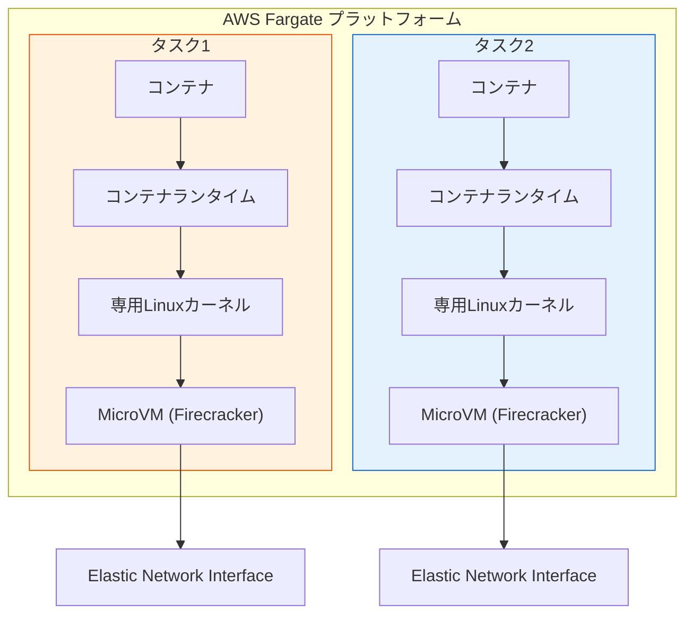

Fargateの各タスクは、AWSが開発したオープンソースのマイクロVM技術である **Firecracker** 上で実行される。Firecrackerは、最小限のデバイスモデルだけを備えた軽量なVMMで、125ms以下でマイクロVMを起動できる。各タスクが独立したマイクロVMで実行されるため、カーネルレベルでの強力な隔離が実現される。これは通常のコンテナ（カーネル共有）よりも高いセキュリティを提供する。

各Fargateタスクには専用のElastic Network Interface（ENI）が割り当てられ、VPC内のプライベートIPアドレスを持つ。これにより、セキュリティグループによるネットワーク制御がタスク単位で適用できる。

#### リソースモデル

Fargateでは、vCPUとメモリの組み合わせを事前に定義されたサイズから選択する。

| vCPU | メモリ（GB） |
|------|------------|
| 0.25 | 0.5, 1, 2 |
| 0.5 | 1 - 4（1GB刻み） |
| 1 | 2 - 8（1GB刻み） |
| 2 | 4 - 16（1GB刻み） |
| 4 | 8 - 30（1GB刻み） |
| 8 | 16 - 60（4GB刻み） |
| 16 | 32 - 120（8GB刻み） |

::: warning リソース割り当ての注意点
Fargateでは割り当てたリソースに対して課金が発生するため、アプリケーションの実際のリソース使用量に基づいて適切なサイズを選択することが重要である。EC2起動タイプのようにインスタンス上に複数タスクを詰め込んで効率化するといったアプローチは取れないため、リソースの過剰割り当ては直接的にコスト増につながる。
:::

### 2.3 Google Cloud Run

#### 設計思想

Google Cloud Runは、2019年にGA（一般提供）となったフルマネージドのサーバーレスコンテナプラットフォームである。Cloud Runの設計思想は「任意のコンテナを、インフラストラクチャを意識せずに実行する」ことにあり、開発者体験のシンプルさを最優先に設計されている。

Cloud Runは内部的にKnativeの技術を基盤としている。KnativeはKubernetes上でサーバーレスワークロードを実行するためのオープンソースプラットフォームであり、Cloud RunはこのKnativeの概念をGoogle Cloud上でフルマネージドに提供するサービスである。

#### コアコンセプト

Cloud Runのアーキテクチャは、サービス、リビジョン、インスタンスという3つの概念を中心に構成される。

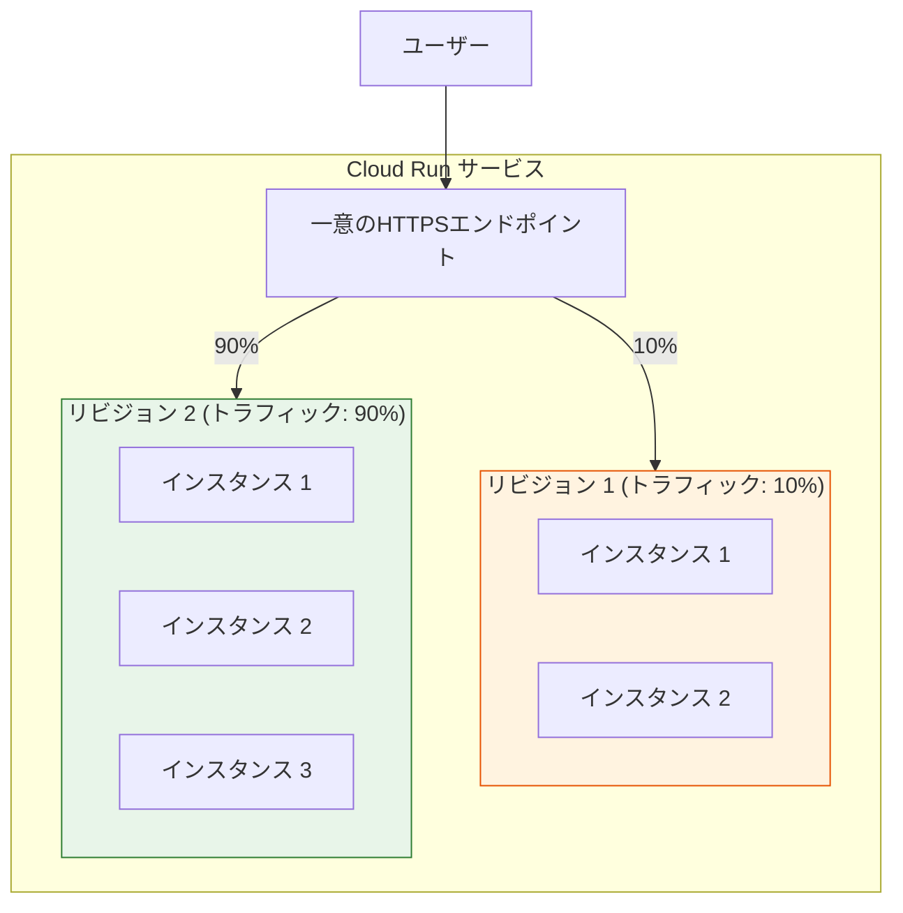

**サービス（Service）** は、Cloud Runにおける最上位のリソースである。各サービスには一意のHTTPSエンドポイントが自動的に割り当てられ、TLS証明書のプロビジョニングと更新もCloud Runが自動で行う。サービスは一つのコンテナイメージとその設定をデプロイの単位として管理する。

**リビジョン（Revision）** は、サービスのイミュータブルなスナップショットである。コンテナイメージ、環境変数、メモリ・CPU設定、同時実行数上限などの設定を変更するたびに新しいリビジョンが作成される。複数のリビジョンが同時に存在でき、トラフィック分割によりカナリアリリースやブルーグリーンデプロイメントを実現できる。

**インスタンス（Instance）** は、コンテナが実際に実行される単位である。Cloud Runは受信リクエスト量に応じてインスタンスを自動的にスケールアップ・ダウンし、リクエストがなければインスタンス数をゼロにまでスケールダウンする（スケールトゥゼロ）。

#### リクエストベースの実行モデル

Cloud Runの最大の特徴は、リクエスト駆動の実行モデルである。コンテナインスタンスはHTTPリクエスト（またはgRPCリクエスト、イベント）を処理するために起動され、リクエストの処理が完了しアイドル状態が続くとインスタンスが停止される。課金もリクエスト処理中のCPU・メモリ使用に対してのみ発生する（デフォルト設定）。

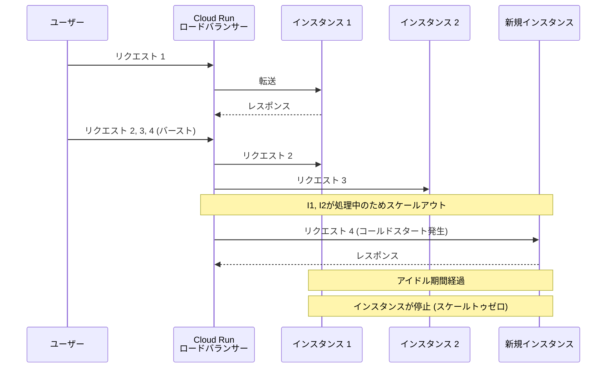

> [!NOTE]
> Cloud Runでは「always-on CPU allocation」を選択することもできる。この設定では、インスタンスがリクエストを処理していないアイドル時間中もCPUが割り当てられ、バックグラウンド処理やWebSocketの維持が可能になる。ただし課金体系も変わり、インスタンスの起動時間全体に対して課金される。

#### 同時実行モデル

Cloud Runの各インスタンスは、複数のリクエストを同時に処理できる（最大1,000同時リクエスト、デフォルトは80）。この点は、1リクエスト=1インスタンスのモデルとは異なり、リソース効率を大幅に向上させる。

```
同時実行数 = 1 の場合:
  100 req/sec → 100 インスタンスが必要

同時実行数 = 80 の場合:
  100 req/sec → 2 インスタンスで処理可能
  （各リクエストの処理時間が十分短い場合）
```

同時実行数の設定は、アプリケーションの特性に応じて慎重に検討する必要がある。スレッドセーフでないアプリケーションや、リクエストごとに大量のメモリを消費するアプリケーションでは、同時実行数を低く設定する必要がある。

### 2.4 3サービスのアーキテクチャ比較

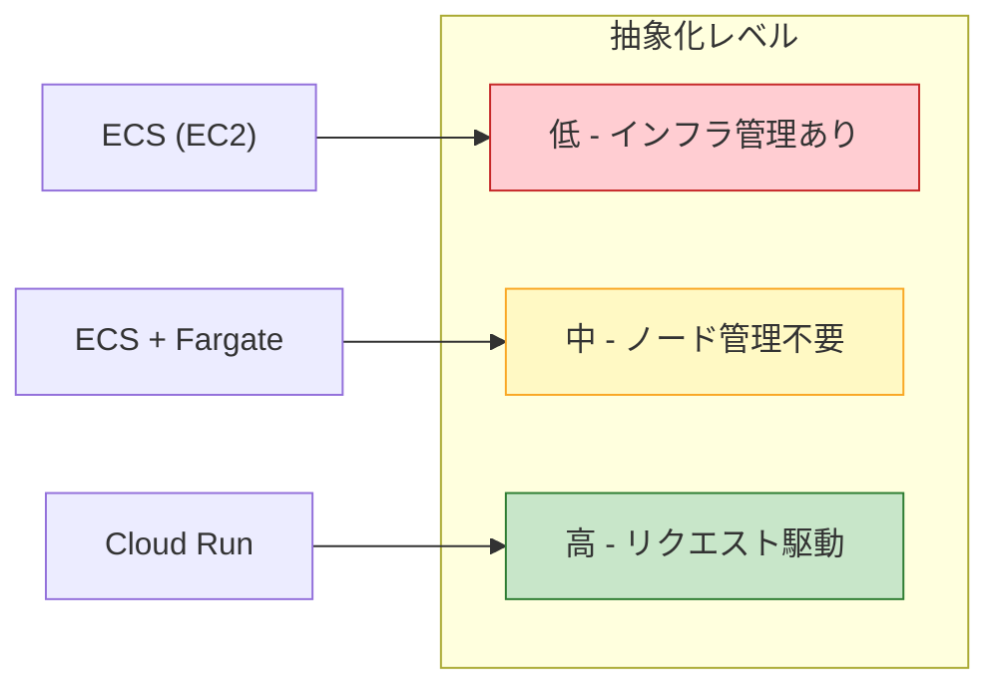

| 項目 | ECS (EC2) | ECS + Fargate | Cloud Run |
|-----|-----------|---------------|-----------|
| インフラ管理 | EC2の管理が必要 | 不要 | 不要 |
| スケーリング | Auto Scaling Group | タスク数ベース | リクエストベース（自動） |
| スケールトゥゼロ | 不可 | 不可 | 可能 |
| 課金単位 | EC2インスタンス時間 | vCPU秒 + メモリGB秒 | リクエスト + vCPU秒 + メモリGB秒 |
| ネットワーク | VPC統合（フル制御） | VPC統合（ENI per Task） | VPC統合（オプション）/自動HTTPS |
| ステートフルワークロード | 対応可 | 限定的 | 非推奨 |
| GPUサポート | あり | 限定的 | あり |
| 最大タスク実行時間 | 無制限 | 無制限 | デフォルト60分（最大24時間） |
| コールドスタート | なし（常時起動） | やや発生 | 発生する可能性あり |

## 3. 実装手法

### 3.1 タスクとサービスの定義

#### ECS + Fargateの場合

ECSでサービスをデプロイする際の基本的な流れは、タスク定義の作成、サービスの作成、ロードバランサーの設定である。AWS CLIを用いた例を示す。

```bash
# Create a task definition
aws ecs register-task-definition \
  --family web-app \
  --network-mode awsvpc \
  --requires-compatibilities FARGATE \
  --cpu 512 \
  --memory 1024 \
  --execution-role-arn arn:aws:iam::123456789012:role/ecsTaskExecutionRole \
  --task-role-arn arn:aws:iam::123456789012:role/ecsTaskRole \
  --container-definitions '[
    {
      "name": "app",
      "image": "123456789012.dkr.ecr.ap-northeast-1.amazonaws.com/web-app:v1.0",
      "portMappings": [{"containerPort": 8080, "protocol": "tcp"}],
      "healthCheck": {
        "command": ["CMD-SHELL", "curl -f http://localhost:8080/health || exit 1"],
        "interval": 30,
        "timeout": 5,
        "retries": 3,
        "startPeriod": 60
      },
      "logConfiguration": {
        "logDriver": "awslogs",
        "options": {
          "awslogs-group": "/ecs/web-app",
          "awslogs-region": "ap-northeast-1",
          "awslogs-stream-prefix": "ecs"
        }
      }
    }
  ]'
```

```bash
# Create a service with ALB integration
aws ecs create-service \
  --cluster my-cluster \
  --service-name web-app-service \
  --task-definition web-app:1 \
  --desired-count 3 \
  --launch-type FARGATE \
  --network-configuration '{
    "awsvpcConfiguration": {
      "subnets": ["subnet-abc123", "subnet-def456"],
      "securityGroups": ["sg-xyz789"],
      "assignPublicIp": "DISABLED"
    }
  }' \
  --load-balancers '[
    {
      "targetGroupArn": "arn:aws:elasticloadbalancing:ap-northeast-1:123456789012:targetgroup/web-app-tg/1234567890",
      "containerName": "app",
      "containerPort": 8080
    }
  ]' \
  --deployment-configuration '{
    "maximumPercent": 200,
    "minimumHealthyPercent": 100,
    "deploymentCircuitBreaker": {
      "enable": true,
      "rollback": true
    }
  }'
```

::: details ECSのIAMロール構成
ECSのタスクには2種類のIAMロールが関連する。

**タスク実行ロール（Execution Role）**: ECSエージェントがタスクの起動時に使用するロール。ECRからのイメージプル、CloudWatch Logsへのログ送信、Secrets Managerからのシークレット取得に必要な権限を含む。

**タスクロール（Task Role）**: タスク内で実行されるアプリケーションコードが使用するロール。S3へのアクセス、DynamoDBの読み書きなど、アプリケーション固有の権限を付与する。

この分離により、最小権限の原則に従ったアクセス制御が実現される。
:::

#### Cloud Runの場合

Cloud Runのデプロイは、gcloud CLIを用いて非常にシンプルに行える。

```bash
# Deploy a service from a container image
gcloud run deploy web-app \
  --image gcr.io/my-project/web-app:v1.0 \
  --platform managed \
  --region asia-northeast1 \
  --port 8080 \
  --memory 512Mi \
  --cpu 1 \
  --min-instances 0 \
  --max-instances 100 \
  --concurrency 80 \
  --timeout 300 \
  --set-env-vars "ENV=production,LOG_LEVEL=info" \
  --service-account web-app-sa@my-project.iam.gserviceaccount.com \
  --allow-unauthenticated
```

Cloud Runの注目すべき点は、このワンコマンドでHTTPSエンドポイント、TLS証明書、ロードバランシング、オートスケーリングがすべて自動的に構成されることである。ECSでは、ALB、ターゲットグループ、リスナー、セキュリティグループなどを個別に設定する必要があるのに対し、Cloud Runではこれらが完全に抽象化されている。

#### トラフィック分割によるカナリアリリース

Cloud Runでは、リビジョン間のトラフィック分割が組み込み機能として提供されている。

```bash
# Deploy a new revision with a tag (no traffic)
gcloud run deploy web-app \
  --image gcr.io/my-project/web-app:v2.0 \
  --tag canary \
  --no-traffic

# Gradually shift traffic to the new revision
gcloud run services update-traffic web-app \
  --to-tags canary=10

# After verification, shift all traffic
gcloud run services update-traffic web-app \
  --to-tags canary=100
```

ECSの場合は、CodeDeployとの統合やALBの加重ターゲットグループを利用してカナリアリリースを実現する。設定はより複雑になるが、きめ細かな制御が可能である。

### 3.2 オートスケーリング

#### ECS + Fargateのオートスケーリング

ECSのオートスケーリングは、AWS Application Auto Scalingを利用して実現する。スケーリングポリシーとして、ターゲット追跡スケーリング、ステップスケーリング、スケジュールドスケーリングの3種類が利用可能である。

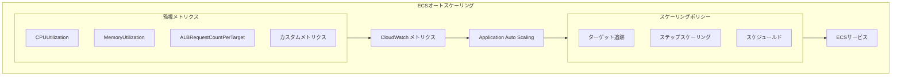

```bash
# Register a scalable target
aws application-autoscaling register-scalable-target \
  --service-namespace ecs \
  --resource-id service/my-cluster/web-app-service \
  --scalable-dimension ecs:service:DesiredCount \
  --min-capacity 2 \
  --max-capacity 20

# Create a target tracking scaling policy (CPU-based)
aws application-autoscaling put-scaling-policy \
  --service-namespace ecs \
  --resource-id service/my-cluster/web-app-service \
  --scalable-dimension ecs:service:DesiredCount \
  --policy-name cpu-target-tracking \
  --policy-type TargetTrackingScaling \
  --target-tracking-scaling-policy-configuration '{
    "TargetValue": 70.0,
    "PredefinedMetricSpecification": {
      "PredefinedMetricType": "ECSServiceAverageCPUUtilization"
    },
    "ScaleInCooldown": 300,
    "ScaleOutCooldown": 60
  }'
```

::: tip スケーリングのベストプラクティス
- **ScaleOutCooldown（スケールアウトのクールダウン）は短く設定する**: 負荷急増に素早く対応するため、60秒程度が推奨される。
- **ScaleInCooldown（スケールインのクールダウン）は長めに設定する**: 頻繁なスケールイン・アウトの繰り返し（フラッピング）を防ぐため、300秒程度が推奨される。
- **最小タスク数は2以上に設定する**: 可用性確保のため、マルチAZ構成で最低2タスクを維持する。
:::

#### Cloud Runのオートスケーリング

Cloud Runのオートスケーリングは完全に自動化されている。設定可能なパラメータは主に以下の3つである。

- **最小インスタンス数（min-instances）**: コールドスタートを回避するために常時起動しておくインスタンス数。0を指定するとスケールトゥゼロが有効になる。
- **最大インスタンス数（max-instances）**: コスト制御のための上限。
- **同時実行数（concurrency）**: 各インスタンスが同時に処理するリクエスト数の上限。

Cloud Runのスケーリングアルゴリズムは、受信リクエストのキューイング状況とインスタンスの同時実行数をリアルタイムに監視し、必要に応じてインスタンスを追加する。このアルゴリズムはユーザーが直接制御するものではなく、Cloud Runプラットフォームによって最適化される。

### 3.3 ネットワーキング

#### ECSのネットワーキング（awsvpcモード）

Fargateで利用される `awsvpc` ネットワークモードでは、各タスクにVPC内のプライベートIPアドレスが割り当てられる。これにより、セキュリティグループをタスク単位で適用でき、VPC内の他のリソース（RDS、ElastiCacheなど）と同じネットワーク上で直接通信が可能である。

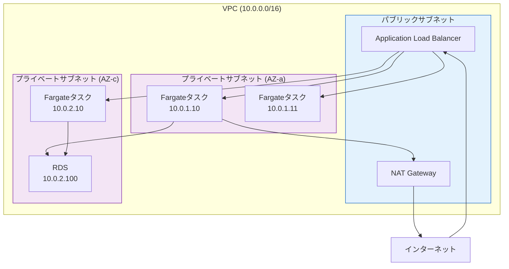

::: warning プライベートサブネットとNAT Gateway
Fargateタスクをプライベートサブネットに配置する場合、ECRからのイメージプルやCloudWatch Logsへのログ送信にはインターネットアクセスが必要である。NAT Gatewayを経由するか、VPCエンドポイント（PrivateLink）を設定してインターネット経由なしでAWSサービスにアクセスする構成が推奨される。VPCエンドポイントはNAT Gatewayよりもデータ転送コストを抑えられることが多い。
:::

#### ECSサービスディスカバリ

ECSは AWS Cloud Map と統合したサービスディスカバリ機能を提供する。各タスクのIPアドレスがDNSレコードとして自動的に登録・更新され、マイクロサービス間の通信をDNSベースで解決できる。

```bash
# Create a service with service discovery
aws ecs create-service \
  --cluster my-cluster \
  --service-name api-service \
  --task-definition api:1 \
  --desired-count 3 \
  --launch-type FARGATE \
  --service-registries '[
    {
      "registryArn": "arn:aws:servicediscovery:ap-northeast-1:123456789012:service/srv-abc123",
      "containerName": "api",
      "containerPort": 8080
    }
  ]' \
  --network-configuration '{
    "awsvpcConfiguration": {
      "subnets": ["subnet-abc123"],
      "securityGroups": ["sg-xyz789"]
    }
  }'
```

これにより、他のサービスからは `api-service.my-namespace.local` のようなDNS名でアクセスできる。

#### Cloud Runのネットワーキング

Cloud Runのネットワーキングは、デフォルトではインターネットからアクセス可能なHTTPSエンドポイントとして公開される。VPCとの接続が必要な場合は、VPCコネクタまたはDirect VPC Egress（ダイレクトVPCエグレス）を構成する。

```bash
# Create a VPC connector for Cloud Run
gcloud compute networks vpc-access connectors create my-connector \
  --region asia-northeast1 \
  --subnet my-subnet \
  --min-instances 2 \
  --max-instances 10

# Deploy with VPC connector
gcloud run deploy web-app \
  --image gcr.io/my-project/web-app:v1.0 \
  --vpc-connector my-connector \
  --vpc-egress all-traffic
```

Cloud Run間の内部通信では、IAMベースの認証が推奨される。サービスAからサービスBを呼び出す場合、サービスAのサービスアカウントにサービスBの `run.invoker` ロールを付与することで、認証済みのサービス間通信が実現される。

### 3.4 ログと監視

#### ECSの監視体制

ECSの監視は、CloudWatch を中心としたAWSネイティブなツールチェーンで構築する。

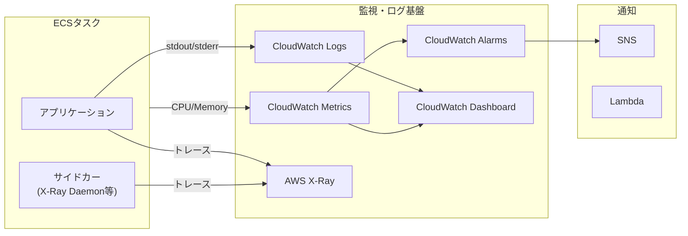

ECSはデフォルトで以下のメトリクスをCloudWatchに送信する。

- **サービスレベル**: CPUUtilization、MemoryUtilization、RunningTaskCount、DesiredTaskCount
- **クラスターレベル**: 全体のCPU/メモリ使用率、登録済みインスタンス数

Container Insights を有効にすることで、タスクレベルおよびコンテナレベルのより詳細なメトリクスが取得可能になる。

```bash
# Enable Container Insights on a cluster
aws ecs update-cluster-settings \
  --cluster my-cluster \
  --settings name=containerInsights,value=enabled
```

#### Cloud Runの監視体制

Cloud Runは、Google Cloudのオペレーションスイート（旧Stackdriver）と自動統合されている。以下のメトリクスがデフォルトで収集される。

- **リクエストメトリクス**: リクエスト数、レイテンシー（p50, p95, p99）、エラー率
- **インスタンスメトリクス**: インスタンス数、CPU使用率、メモリ使用率
- **コンテナメトリクス**: コンテナ起動レイテンシー（コールドスタート時間）、ビラビリティ（請求可能時間）

```bash
# View logs for a Cloud Run service
gcloud logging read "resource.type=cloud_run_revision \
  AND resource.labels.service_name=web-app" \
  --limit 100 \
  --format json

# Create an alerting policy for error rate
gcloud alpha monitoring policies create \
  --display-name "Cloud Run Error Rate" \
  --condition-display-name "Error rate > 5%" \
  --condition-filter 'resource.type="cloud_run_revision" AND metric.type="run.googleapis.com/request_count" AND metric.labels.response_code_class="5xx"' \
  --condition-threshold-value 0.05 \
  --condition-threshold-comparison COMPARISON_GT
```

> [!TIP]
> Cloud Runの構造化ログ機能を活用すると、アプリケーションからJSON形式でログを出力するだけで、自動的にCloud Logging上でフィルタリングやグルーピングが可能になる。特に `severity` フィールドを含めることで、ログレベルに基づいたアラートの設定が容易になる。

## 4. 運用の実際

### 4.1 サービスの使い分け基準

マネージドコンテナサービスの選択は、ワークロードの特性、チームのスキルセット、既存のクラウドインフラとの整合性に基づいて判断する。以下に、代表的なユースケースと推奨サービスの対応を示す。

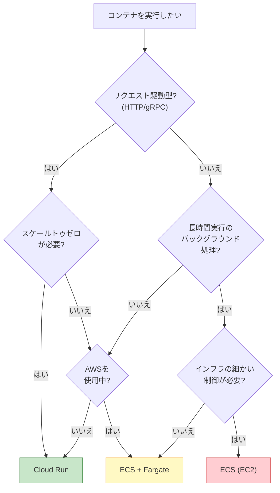

#### Cloud Runが適するケース

- **HTTPベースのWebアプリケーション・APIサーバー**: Cloud Runのリクエスト駆動モデルと自動HTTPS、スケールトゥゼロは、典型的なWebサービスに最適である。
- **イベント駆動処理**: Pub/SubやCloud Storageのイベントをトリガーとした非同期処理。
- **マイクロサービスの迅速なプロトタイピング**: 最小限の設定で即座にデプロイ可能であり、開発の初期段階に適している。
- **トラフィックの変動が大きいワークロード**: アイドル時のコストをゼロにできるため、アクセスパターンが予測しにくいサービスに有効である。

#### ECS + Fargateが適するケース

- **AWSエコシステムに深く統合されたアプリケーション**: RDS、ElastiCache、SQSなどAWSサービスとの連携が多いシステムで、VPC内での直接通信やIAMロールの活用が重要な場合。
- **常時稼働のバックグラウンドワーカー**: SQSからのメッセージ消費など、リクエスト駆動ではない常時稼働型のワークロード。
- **長時間実行タスク**: バッチ処理やデータパイプラインなど、実行時間の制約が許容できないワークロード。
- **サイドカーパターン**: ログ収集、プロキシ、モニタリングエージェントなど、複数のコンテナで構成されるタスク。

#### ECS（EC2起動タイプ）が適するケース

- **GPUワークロード**: 機械学習の推論や動画エンコードなど、GPUインスタンスが必要な場合。
- **大量の小さなタスク**: Fargateのタスクごとのオーバーヘッド（起動時間、ENI割り当て）がコスト・レイテンシー面で問題になる場合。
- **ホストレベルのカスタマイズ**: カスタムカーネルパラメータ、特定のストレージドライバ、ホストレベルのモニタリングが必要な場合。

### 4.2 コスト比較

マネージドコンテナサービスのコスト構造は、それぞれ大きく異なる。以下に、典型的なWebアプリケーション（2 vCPU、4GB RAM、月間稼働）を想定したコスト比較を示す。

::: details コスト比較の計算前提
- リージョン: 東京（ap-northeast-1 / asia-northeast1）
- 2026年3月時点の公開価格に基づく概算
- データ転送費、ストレージ費は除外
- 価格は予告なく変更される可能性がある
:::

| 構成 | 月額コスト概算 | 備考 |
|------|--------------|------|
| ECS (EC2): t3.medium x 2 | 約 $60-80 | リザーブドインスタンスで大幅削減可能 |
| ECS + Fargate: 2vCPU/4GB x 2タスク 常時起動 | 約 $140-170 | EC2比で割高だが管理不要 |
| Cloud Run: 2vCPU/4GB、常時CPU割り当て | 約 $120-150 | 常時トラフィックありの場合 |
| Cloud Run: 2vCPU/4GB、リクエスト時のみ | 約 $10-50 | トラフィックが少ない場合に大幅削減 |

> [!CAUTION]
> 上記のコスト比較はあくまで概算である。実際のコストはリクエスト数、データ転送量、ストレージ使用量、ネットワーク構成（NAT Gateway、VPCエンドポイント）など多くの要因に依存する。特にECS + Fargateでは、NAT Gatewayのデータ処理料金が予想外に大きくなるケースがある。本番環境での採用前には、AWS Pricing CalculatorやGoogle Cloud Pricing Calculatorで詳細な見積もりを行うことを強く推奨する。

#### コスト最適化のポイント

**ECS + Fargate向け**:
- **Fargate Spot** を活用する。Fargate Spotはオンデマンド価格に対して最大70%の割引を提供するが、キャパシティが不足した場合に2分前の通知でタスクが中断される可能性がある。ステートレスなWebサーバーやワーカーでは、一部のタスクをFargate Spotで実行することでコストを大幅に削減できる。
- **Savings Plans** を検討する。Compute Savings Plansは1年または3年のコミットメントで最大50%の割引を提供し、Fargateにも適用される。

**Cloud Run向け**:
- **スケールトゥゼロ** を積極的に活用する。アイドル時のコストがゼロになるため、社内ツールや低トラフィックのAPIには極めて有効である。
- **最小インスタンス数** を最小限に保つ。コールドスタートの許容度に応じて、最小インスタンス数は0または1に設定する。
- **同時実行数** を適切に設定する。同時実行数を高く設定すると、少ないインスタンス数でより多くのリクエストを処理でき、インスタンス起動コストを抑えられる。

### 4.3 マイグレーション戦略

#### VMからマネージドコンテナへの移行

既存のVM上で稼働するアプリケーションをマネージドコンテナに移行する際の典型的なアプローチを示す。

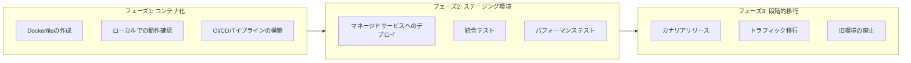

**フェーズ1: コンテナ化**

まず、アプリケーションのコンテナ化を行う。この段階では実行環境の移行は行わず、Dockerfileの作成とローカル環境での動作確認に集中する。

コンテナ化の際に注意すべきポイントは以下の通りである。

- **設定の外部化**: ファイルベースの設定を環境変数やシークレットマネージャーに移行する。
- **ログ出力先**: ファイルへのログ出力からstdout/stderrへの出力に変更する。マネージドコンテナサービスはstdout/stderrを自動的に収集する。
- **ヘルスチェックエンドポイント**: HTTP GETに応答するヘルスチェックエンドポイントを実装する。
- **グレースフルシャットダウン**: SIGTERMシグナルを受信した際に、処理中のリクエストを完了してからプロセスを終了する仕組みを実装する。

**フェーズ2: ステージング環境でのテスト**

ステージング環境でマネージドコンテナサービスにデプロイし、機能テスト、負荷テスト、セキュリティテストを実施する。特に以下の点を検証する。

- コールドスタートのレイテンシーがSLOに収まるか
- オートスケーリングが期待通りに動作するか
- VPC内の既存リソース（DB、キャッシュ）との接続性
- シークレット管理の動作確認

**フェーズ3: 段階的な本番移行**

DNS加重ルーティングやロードバランサーのトラフィック分割を利用して、段階的にトラフィックを新環境に移行する。問題発生時には即座に旧環境にロールバックできるよう、旧環境は一定期間維持する。

#### Kubernetesからの移行

KubernetesからECSやCloud Runへの移行を検討する場合、Kubernetesのどの機能を利用しているかの棚卸しが重要である。

::: details Kubernetes機能とマネージドサービスの対応
| Kubernetes機能 | ECS対応 | Cloud Run対応 |
|---------------|---------|-------------|
| Deployment / ReplicaSet | ECSサービス | Cloud Runサービス |
| Pod（複数コンテナ） | タスク定義（複数コンテナ） | サイドカーコンテナ（限定的） |
| Service (ClusterIP) | サービスディスカバリ | サービス間IAM認証 |
| Ingress | ALB | 自動HTTPSエンドポイント |
| ConfigMap | SSM Parameter Store | 環境変数 / Secret Manager |
| Secret | Secrets Manager | Secret Manager |
| HPA | Application Auto Scaling | 自動スケーリング |
| CronJob | EventBridge + ECSタスク | Cloud Scheduler + Cloud Run Jobs |
| DaemonSet | 対応なし | 対応なし |
| StatefulSet | 限定的（EBSボリューム） | 対応なし |
| NetworkPolicy | セキュリティグループ | Ingress設定 / IAM |
| CustomResourceDefinition | 対応なし | 対応なし |
:::

DaemonSet、StatefulSet、Custom Resource Definition（CRD）などのKubernetes固有の機能に強く依存している場合、マネージドコンテナサービスへの移行は困難であり、マネージドKubernetes（EKS、GKE）が適切な選択肢となる。

### 4.4 Kubernetesとの比較

マネージドコンテナサービスとKubernetes（マネージドKubernetesを含む）の選択は、多くの組織にとって重要な意思決定である。

```mermaid
graph TB
    subgraph K8S["Kubernetes (EKS/GKE)"]
        K_PRO["利点"]
        K_CON["課題"]
    end

    subgraph MANAGED["マネージドコンテナ (ECS/Cloud Run)"]
        M_PRO["利点"]
        M_CON["課題"]
    end

    K_PRO --- K1["高い拡張性と柔軟性"]
    K_PRO --- K2["豊富なエコシステム"]
    K_PRO --- K3["マルチクラウドポータビリティ"]
    K_PRO --- K4["コミュニティとツールの充実"]

    K_CON --- K5["運用の複雑さ"]
    K_CON --- K6["学習コストの高さ"]
    K_CON --- K7["小規模利用時のオーバーヘッド"]

    M_PRO --- M1["運用負荷の大幅な削減"]
    M_PRO --- M2["迅速なデプロイ"]
    M_PRO --- M3["低い学習コスト"]
    M_PRO --- M4["従量課金の柔軟性"]

    M_CON --- M5["カスタマイズの制限"]
    M_CON --- M6["ベンダーロックイン"]
    M_CON --- M7["高度なネットワーク制御の制約"]

    style K8S fill:#e3f2fd,stroke:#1565c0
    style MANAGED fill:#e8f5e9,stroke:#2e7d32
```

#### Kubernetesを選ぶべきケース

- **大規模なマイクロサービスアーキテクチャ**: 数十以上のサービスが複雑に連携するシステムでは、Kubernetesのサービスメッシュ（Istio、Linkerd）、高度なトラフィック制御、CRDによる拡張が強力な武器となる。
- **マルチクラウド・ハイブリッドクラウド戦略**: Kubernetesは事実上のポータビリティレイヤーであり、オンプレミスとクラウドの間でワークロードを移動可能にする。
- **高度なステートフルワークロード**: StatefulSet、Operator Pattern、CSIによる動的プロビジョニングが必要なデータベースやメッセージブローカーの運用。
- **チームにKubernetes専門知識がある場合**: 既存のスキルセットと運用ツールチェーンを活かせる。

#### マネージドコンテナサービスを選ぶべきケース

- **小〜中規模のサービス**: 数個から数十個程度のサービス構成であれば、Kubernetesの複雑さは不要であることが多い。
- **運用チームが小さい場合**: インフラ専任のチームがいない組織では、マネージドコンテナサービスの運用負荷の低さが大きなメリットとなる。
- **迅速な市場投入が重要な場合**: セットアップとデプロイの容易さにより、プロトタイプから本番環境までの時間を短縮できる。
- **コスト感度の高いワークロード**: スケールトゥゼロ（Cloud Run）やFargate Spotにより、低トラフィック時のコストを最小化できる。

## 5. 将来展望

### 5.1 WebAssembly（WASM）とコンテナの融合

WebAssembly（WASM）は、もともとブラウザ内でネイティブに近い速度でコードを実行するために設計されたバイナリ命令フォーマットだが、近年ではサーバーサイドでの利用が急速に進んでいる。WASI（WebAssembly System Interface）の標準化により、WASMモジュールはファイルシステムやネットワークソケットといったOSの機能にアクセスできるようになった。

WASMベースのコンテナ（WASMコンテナ）は、以下の特性において従来のLinuxコンテナよりも優れている。

- **超高速起動**: WASMモジュールはミリ秒単位で起動可能であり、Linuxコンテナの数百ミリ秒〜数秒に対して桁違いに速い。これはコールドスタート問題を根本的に解決する可能性がある。
- **軽量フットプリント**: WASMモジュールは数MB程度のサイズであり、数百MBに及ぶコンテナイメージに比べて極めてコンパクトである。
- **サンドボックスによるセキュリティ**: WASMは仕様レベルでサンドボックス化されており、ケイパビリティベースのセキュリティモデルにより、明示的に許可されたリソースのみにアクセスできる。
- **ポータビリティ**: WASMはCPUアーキテクチャ非依存であり、ARM、x86、RISC-Vなど任意のプラットフォームで動作する。

> [!NOTE]
> Docker自身もWASMサポートを実験的に導入しており、containerdのWASMシムを通じてWASMワークロードをLinuxコンテナと同じように管理できるようになりつつある。Cloud RunのようなサーバーレスコンテナプラットフォームがネイティブにWASMをサポートすれば、コールドスタート時間が劇的に改善される可能性がある。

ただし、WASMがLinuxコンテナを完全に置き換えるとは考えにくい。既存のアプリケーションエコシステム、カーネル機能への依存、成熟したツールチェーンなど、Linuxコンテナの優位性は依然として大きい。WASMは特定のユースケース（エッジコンピューティング、プラグインシステム、超低レイテンシーが要求されるサーバーレス関数）で活躍する補完技術として位置づけるのが現実的である。

### 5.2 マルチクラウドコンテナ戦略

特定のクラウドプロバイダーへのロックインを回避し、マルチクラウド戦略を採用する組織が増加している。マネージドコンテナサービスは本質的にプロバイダー固有のAPIを持つため、マルチクラウドでの運用には追加の考慮が必要である。

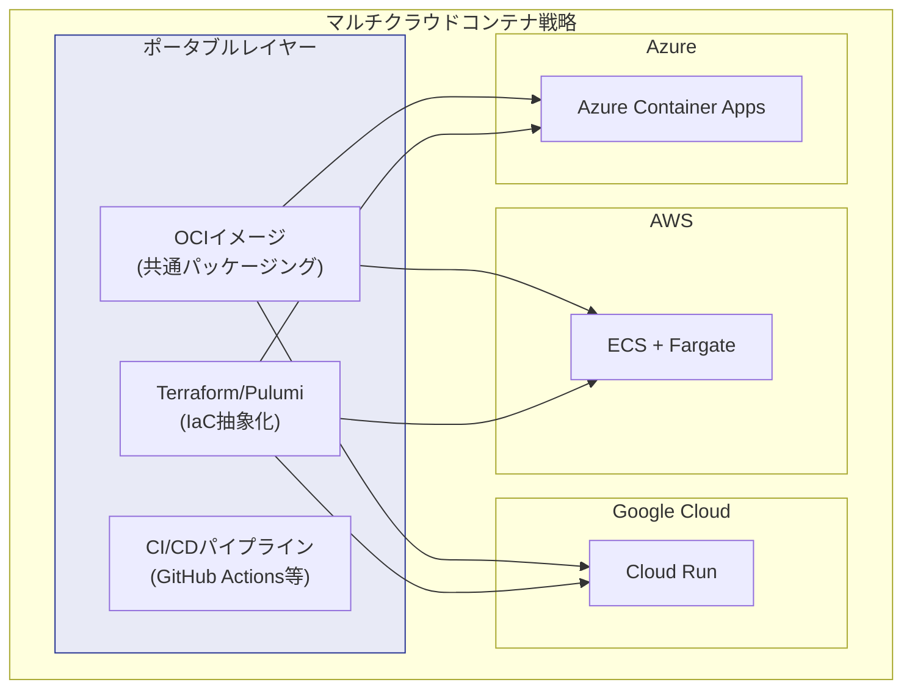

マルチクラウドコンテナを実現するためのアプローチとしては、以下が挙げられる。

- **OCIイメージ標準への統一**: コンテナイメージのフォーマットはOCI（Open Container Initiative）標準に統一されており、どのクラウドプロバイダーでも同じイメージを利用可能である。
- **Infrastructure as Code（IaC）による抽象化**: TerraformやPulumiを用いて、プロバイダー固有のリソース定義を管理する。異なるクラウドへのデプロイが宣言的に行える。
- **アプリケーションレベルのポータビリティ**: アプリケーションコードをクラウド固有のSDKに依存させず、標準的なプロトコル（HTTP、gRPC、AMQP）と環境変数による設定を徹底する。

### 5.3 サーバーレスコンテナの収束

マネージドコンテナサービスは、異なるアプローチから出発しながらも、機能面での収束が進んでいる。

**ECS + Fargateの進化**: FargateはECSの一起動タイプとして始まったが、Fargate Spot、EphemeralStorage、Graviton（ARM）サポートなど、継続的に機能を拡充してきた。EKS on Fargateの登場により、KubernetesのエコシステムとFargateのサーバーレス性が融合した。

**Cloud Runの進化**: Cloud Runは当初、HTTPリクエスト駆動のステートレスサービスに限定されていたが、Cloud Run Jobsによるバッチ処理対応、always-on CPU allocationによるWebSocket・ストリーミング対応、GPU対応、マルチコンテナ（サイドカー）対応など、ユースケースの幅を急速に広げている。

**Azure Container Appsの登場**: MicrosoftはAzure Container Apps（ACA）を2022年にGAとし、Daprベースのマイクロサービスプラットフォームとして位置づけている。KnativeのスケールトゥゼロとDaprの分散アプリケーション機能を組み合わせたACAは、マネージドコンテナサービスの第三の選択肢として存在感を増している。

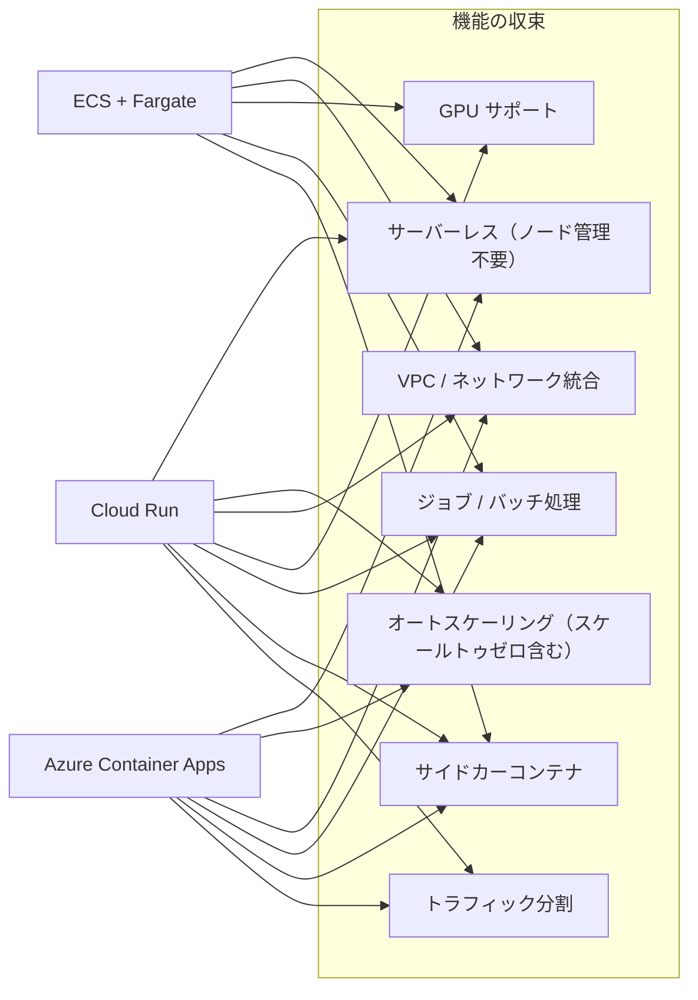

将来的には、これらのサービスの差異はさらに縮小し、「コンテナイメージを提供するだけで、あらゆる種類のワークロード（HTTP、バッチ、ストリーミング、GPU）をシームレスに実行できるプラットフォーム」という共通のビジョンに向かって進化していくと考えられる。

### 5.4 AIワークロードとマネージドコンテナ

2024年以降、生成AIの普及に伴い、GPUを用いたモデル推論ワークロードの需要が急速に増加している。マネージドコンテナサービスもこの潮流に対応を進めている。

Cloud RunはNVIDIA L4 GPUのサポートを提供しており、コンテナ化されたAIモデルのサーバーレス推論が可能である。リクエストがない時間帯にはGPUインスタンスもスケールダウンできるため、GPUリソースのコスト効率を高められる。

ECSではEC2起動タイプを通じて従来からGPUインスタンスが利用可能であった。FargateでもAMD GPUの限定的なサポートが提供されつつあり、GPUワークロードのサーバーレス化が進んでいる。

AIワークロードにおけるマネージドコンテナの課題としては、大規模なモデルファイル（数十GB〜数百GB）のロード時間がコールドスタートに直結する点がある。モデルキャッシュ、遅延ロード、モデルの量子化といった最適化手法の重要性が増しており、各プラットフォームもコンテナイメージの事前キャッシュやボリュームマウントの最適化を進めている。

## まとめ

マネージドコンテナサービスは、コンテナ技術の恩恵を最大限に享受しつつ、インフラストラクチャ管理の複雑さを大幅に軽減するソリューションである。

Amazon ECSは、AWSエコシステムとの深い統合とEC2/Fargateの柔軟な起動タイプ選択を特徴とし、AWSを主要クラウドとして利用する組織に適している。AWS Fargateは、FirecrackerベースのマイクロVM技術によりセキュアかつ管理不要なコンテナ実行を実現する。Google Cloud Runは、Knativeベースのフルマネージドプラットフォームとしてリクエスト駆動のスケーリング（スケールトゥゼロを含む）を提供し、開発者体験のシンプルさにおいて突出している。

サービス選択にあたっては、ワークロードの特性（リクエスト駆動か常時稼働か）、必要な制御レベル（ネットワーク、ストレージ、GPU）、コスト構造、チームのスキルセットを総合的に評価することが重要である。

将来的には、WASMによる超高速起動の実現、マルチクラウドポータビリティの向上、サーバーレスコンテナ機能の収束、AIワークロードへの対応強化が進み、「コンテナイメージさえあれば何でも動く」というビジョンがさらに現実に近づいていくだろう。
