# マネージドメッセージング（SQS, SNS, EventBridge, Pub/Sub）

## 1. 歴史的背景 — なぜマネージドメッセージングが必要なのか

### 1.1 メッセージキューの本質的な価値

分散システムにおいて、コンポーネント間の通信は最も根本的な課題の一つである。サービスAがサービスBに処理を依頼する最も素朴な方法は、同期的なHTTPリクエストを送ることだ。しかし、この方式には本質的な問題がある。

**時間的結合**: サービスBがダウンしていると、サービスAの処理も失敗する。両者が同時に稼働していなければ通信が成立しない。

**負荷の伝播**: サービスAに突発的なトラフィックが発生すると、その負荷がそのままサービスBに伝わる。サービスBの処理能力を超えたリクエストはすべてエラーになる。

**再試行の困難さ**: 一時的なネットワーク障害やサービスBの過負荷で失敗した場合、サービスA側で再試行ロジックを実装しなければならない。その間、サービスAの処理も滞留する。

メッセージキューはこれらの問題を解決する中間層として機能する。送信側はメッセージをキューに投入するだけでよく、受信側は自分のペースでキューからメッセージを取り出して処理する。これにより、時間的結合の解消、負荷の平準化、信頼性の高いメッセージ配信が実現される。

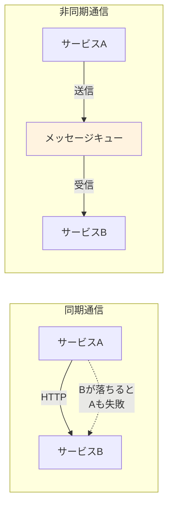

この概念自体は新しいものではない。IBMのMQSeries（現IBM MQ）は1993年から提供されており、エンタープライズの世界ではメッセージ指向ミドルウェア（MOM: Message-Oriented Middleware）として長い歴史を持つ。

### 1.2 自前運用の課題 — RabbitMQとKafkaの例

2000年代後半から2010年代にかけて、オープンソースのメッセージングシステムが広く普及した。代表的なものがRabbitMQ（2007年リリース）とApache Kafka（2011年にLinkedInからオープンソース化）である。

これらは優れたソフトウェアだが、自前で運用するには相当な専門知識と運用コストが必要となる。

**RabbitMQの運用課題**:

- Erlang VM上で動作するため、Erlangのランタイム管理が必要
- クラスタリング構成でのネットワーク分断（split-brain）対策
- メモリ使用量の監視とフロー制御の調整
- キューのミラーリングにおけるパフォーマンスと耐久性のトレードオフ
- バージョンアップグレード時のクラスタローリングアップデート

**Apache Kafkaの運用課題**:

- ZooKeeper（またはKRaft）クラスタの管理
- ブローカーのディスク容量監視とパーティション再割り当て
- ISR（In-Sync Replicas）の管理とレプリケーション遅延の監視
- コンシューマグループのリバランス時のパフォーマンス劣化
- トピックのパーティション数の事前設計（後から増やすとキー順序が崩れる）

::: warning 運用コストの現実
中規模のKafkaクラスタ（3〜5ブローカー）の運用には、専任のインフラエンジニアが少なくとも1名は必要とされる。ブローカー障害、ディスクフル、コンシューマーラグの監視、パーティション再配置など、日常的なオペレーションだけでも相当な工数がかかる。
:::

### 1.3 マネージドサービスの登場

このような自前運用の課題を背景に、クラウドプロバイダーがマネージドメッセージングサービスを提供し始めた。

AWSは2004年にAmazon SQS（Simple Queue Service）をベータ提供し、2006年に正式リリースした。これはAWSの中で最も古いサービスの一つであり、S3やEC2と並んでAWSの基盤を形成するサービスである。その後、2010年にAmazon SNS（Simple Notification Service）、2019年にAmazon EventBridgeが登場した。

Google Cloudは2015年にCloud Pub/Subを一般提供（GA）した。Pub/SubはGoogle内部で使われていたメッセージングインフラ（Googleの論文で言及されるような大規模分散メッセージングシステム）を外部向けにサービス化したものである。

これらのマネージドサービスの共通する価値は以下のとおりである。

- **インフラ管理の不要化**: サーバーのプロビジョニング、パッチ適用、スケーリングがすべて自動化される
- **高い可用性**: 複数のアベイラビリティゾーンにまたがるレプリケーションが標準で提供される
- **従量課金**: 実際に送受信したメッセージ数に基づく課金で、アイドル時のコストを最小化できる
- **他のクラウドサービスとの統合**: Lambda、Cloud Functions、Step Functionsなどとのネイティブな統合

本記事では、これらのマネージドメッセージングサービスのアーキテクチャ、実装手法、運用の実際、そして将来展望について深く掘り下げていく。

## 2. アーキテクチャ

### 2.1 Amazon SQS — フルマネージドメッセージキュー

Amazon SQSは、ポイントツーポイント（Point-to-Point）型のメッセージキューサービスである。プロデューサーがメッセージをキューに送信し、コンシューマーがキューからメッセージを受信して処理するという、最もシンプルなメッセージングパターンを提供する。

#### 2.1.1 StandardキューとFIFOキュー

SQSには2種類のキュータイプが存在する。それぞれの設計思想と特性は大きく異なる。

**Standardキュー**:

Standardキューは「最大限のスループット」を設計目標としている。内部的には、メッセージは複数のサーバーに冗長に保存され、配信もベストエフォートで順序付けされる。

- **スループット**: 事実上無制限（API呼び出しレートの制限はあるが、キュー自体のスループット上限はない）
- **配信保証**: At-Least-Once（最低1回配信）。まれにメッセージが2回以上配信されることがある
- **順序**: ベストエフォート。送信順とは異なる順序でメッセージが配信される可能性がある

**FIFOキュー**:

FIFOキューは「厳密な順序保証と正確に1回の処理」を設計目標としている。

- **スループット**: 1秒あたり最大300メッセージ（バッチ処理なし）、または最大3,000メッセージ（バッチ処理あり）。高スループットモードを有効にすると、メッセージグループIDごとに上記制限が適用される
- **配信保証**: Exactly-Once Processing（正確に1回の処理）。重複排除IDに基づいて5分間の重複排除ウィンドウ内で同一メッセージの再送を防ぐ
- **順序**: 同一メッセージグループID内で厳密なFIFO（先入先出）順序を保証

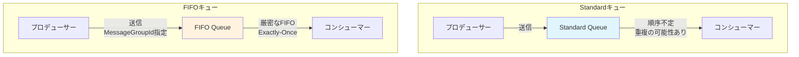

::: tip StandardキューとFIFOキューの選択基準
多くのユースケースではStandardキューで十分である。重複メッセージの処理を冪等に設計できるのであれば、Standardキューのスループットの高さと低コストは大きな利点になる。FIFOキューが真に必要なのは、金融取引の順序保証や、ステートマシンの状態遷移のように順序が意味を持つ場合に限られる。
:::

#### 2.1.2 可視性タイムアウト（Visibility Timeout）

SQSの最も重要な概念の一つが可視性タイムアウトである。これは「メッセージの処理中に他のコンシューマーがそのメッセージを受信しないようにする仕組み」である。

コンシューマーがメッセージを受信すると、そのメッセージはキューから削除されるのではなく、「不可視」の状態になる。可視性タイムアウトの期間内にコンシューマーが処理を完了してDeleteMessage APIを呼び出せば、メッセージは正式にキューから削除される。しかし、タイムアウト期間内に削除されなかった場合（コンシューマーがクラッシュした場合など）、メッセージは再び「可視」となり、他のコンシューマーが受信できるようになる。

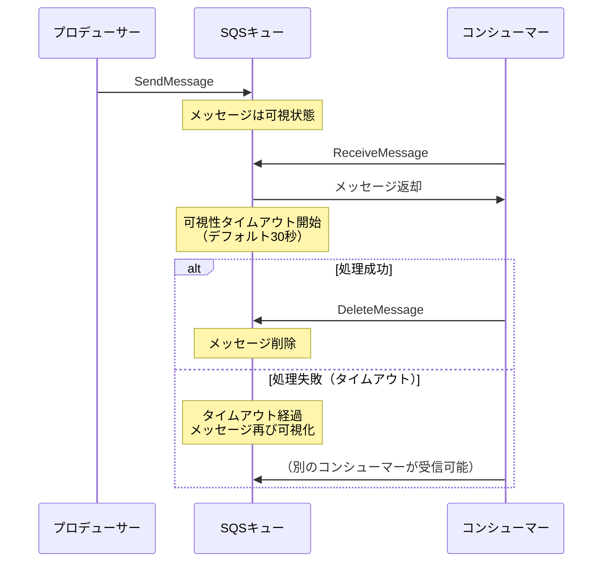

可視性タイムアウトのデフォルト値は30秒で、0秒から12時間まで設定できる。この値の設定は運用上重要であり、処理時間より短すぎるとメッセージが二重処理され、長すぎると障害時のリカバリが遅くなる。

処理に想定以上の時間がかかる場合、コンシューマーはChangeMessageVisibility APIを使って可視性タイムアウトを延長できる。これにより、長時間実行される処理でもメッセージの重複受信を防ぐことが可能となる。

#### 2.1.3 デッドレターキュー（DLQ）

デッドレターキュー（Dead Letter Queue）は、正常に処理できなかったメッセージを隔離するためのキューである。SQSでは、ソースキューにリドライブポリシー（Redrive Policy）を設定することで、指定した回数（maxReceiveCount）だけ受信されても削除されなかったメッセージを自動的にDLQに移動させる。

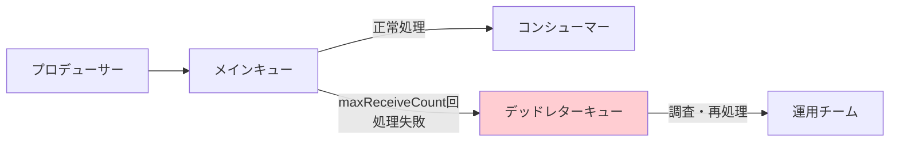

DLQに到達したメッセージは、以下の理由で処理に失敗した可能性がある。

- メッセージのフォーマットが不正（スキーマ変更の未反映など）
- 処理に必要な外部サービスが長時間ダウンしている
- コンシューマーのバグにより特定条件のメッセージで例外が発生する
- 可視性タイムアウトが処理時間に対して短すぎる

> [!CAUTION]
> DLQに移動されたメッセージにも保持期間（Message Retention Period）が適用される。デフォルトは4日間、最大14日間である。この期間を過ぎるとメッセージは永久に失われるため、DLQの監視とアラートの設定は必須である。

2021年にリリースされたDLQリドライブ機能により、DLQに滞留したメッセージを元のキューに戻すことが可能になった。これにより、バグ修正後にDLQのメッセージを再処理するワークフローが大幅に簡素化された。

#### 2.1.4 ロングポーリング

SQSはプル型のメッセージ取得モデルを採用している。コンシューマーがReceiveMessage APIを呼び出してメッセージを取得する方式である。

ショートポーリング（デフォルト）では、SQSはサーバーのサブセットにのみ問い合わせを行い、メッセージがなければ即座に空のレスポンスを返す。これでは、メッセージが存在するにもかかわらず空のレスポンスが返される可能性があり、また頻繁なポーリングによるAPI呼び出しコストが無駄になる。

ロングポーリングでは、WaitTimeSecondsパラメータ（最大20秒）を指定することで、メッセージが到着するかタイムアウトするまでコネクションを保持する。これにより、空のレスポンスが減り、メッセージの即座な検出とAPI呼び出しコストの削減が同時に実現される。

### 2.2 Amazon SNS — Pub/Subとファンアウト

Amazon SNS（Simple Notification Service）は、Publish/Subscribe（Pub/Sub）パターンを実装するサービスである。SQSがポイントツーポイントの1対1通信であるのに対し、SNSは1対多の通信を実現する。

#### 2.2.1 トピックとサブスクリプション

SNSの中核概念は「トピック」と「サブスクリプション」である。パブリッシャーはトピックにメッセージを発行し、そのトピックをサブスクライブしているすべてのエンドポイントにメッセージが配信される。

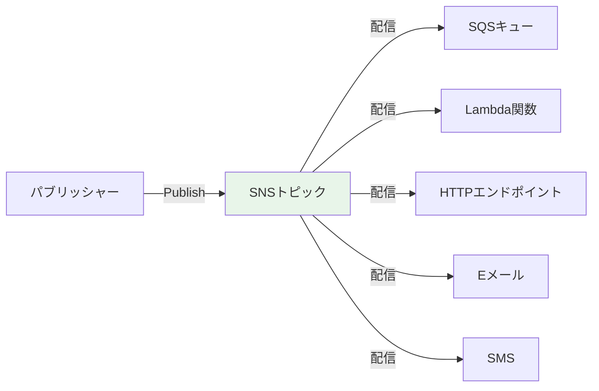

サポートされるサブスクリプションプロトコルは以下のとおりである。

| プロトコル | 用途 |
|-----------|------|
| SQS | キューへのメッセージ配信（最も一般的） |
| Lambda | サーバーレス関数の直接呼び出し |
| HTTP/HTTPS | Webhookエンドポイントへの配信 |
| Email / Email-JSON | メール通知 |
| SMS | ショートメッセージ通知 |
| Kinesis Data Firehose | ストリーミングデータの配信 |
| Platform Application | モバイルプッシュ通知（APNs, FCM） |

#### 2.2.2 ファンアウトパターン

SNSの最も強力なユースケースが「ファンアウト」パターンである。1つのイベントを複数の異なる処理系統に同時に配信する。

たとえば、ECサイトで注文が確定したとき、以下の処理を並行して実行したいケースを考える。

1. 在庫管理サービスに在庫の引き当てを依頼
2. 決済サービスに課金処理を依頼
3. 通知サービスにユーザーへの確認メール送信を依頼
4. 分析サービスに注文データを送信

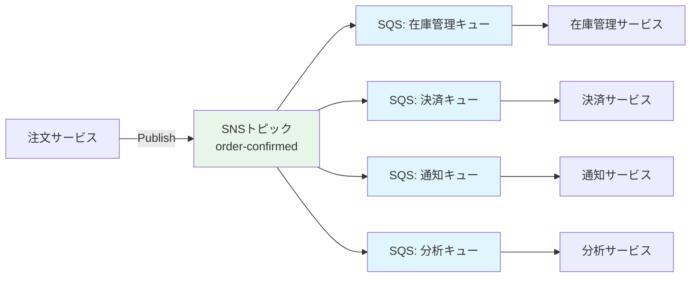

このパターンでは、注文サービスは各下流サービスの存在を知る必要がない。新しい処理系統を追加したい場合は、SNSトピックに新しいサブスクリプションを追加するだけでよい。注文サービスのコードを一切変更する必要がない。これは**疎結合**の典型的な実現方法である。

#### 2.2.3 メッセージフィルタリング

SNSのサブスクリプションフィルターポリシーを使用すると、サブスクライバーは自分が関心のあるメッセージだけを受信できる。フィルタリングはメッセージ属性（Message Attributes）またはメッセージ本文（Message Body）に対して適用される。

フィルターポリシーの例を以下に示す。

```json
{
  "event_type": ["order_placed", "order_cancelled"],
  "order_value": [{"numeric": [">=", 10000]}],
  "region": [{"anything-but": "test"}]
}
```

この例では、`event_type`が`order_placed`または`order_cancelled`であり、`order_value`が10,000以上で、`region`が`test`以外のメッセージだけがこのサブスクライバーに配信される。

フィルタリングがない場合、すべてのメッセージがすべてのサブスクライバーに配信され、各サブスクライバー側で不要なメッセージを破棄するロジックが必要になる。SNS側でフィルタリングすることで、不要なメッセージの転送コストとコンシューマー側の処理負荷を削減できる。

#### 2.2.4 Standard SNSとFIFO SNS

SQSと同様に、SNSにもStandardとFIFOの2種類がある。FIFO SNSトピックはFIFO SQSキューとの組み合わせでのみ使用でき、メッセージの順序保証と重複排除を提供する。

### 2.3 Amazon EventBridge — イベント駆動のルーティングエンジン

Amazon EventBridge（旧CloudWatch Events）は、SQSやSNSとは根本的に異なる設計思想を持つサービスである。EventBridgeは「イベントバス」というコンセプトに基づき、イベントのルーティング、フィルタリング、変換を中心に据えたサービスである。

#### 2.3.1 イベントバスとルール

EventBridgeの中核アーキテクチャは、イベントバス、ルール、ターゲットの3つの概念で構成される。

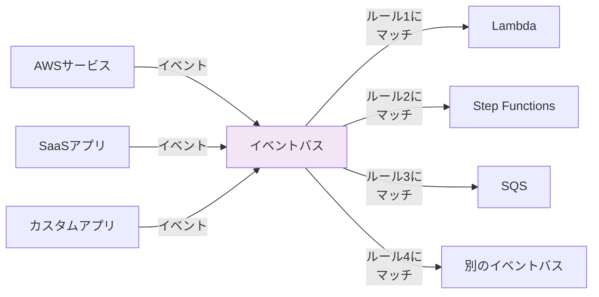

**イベントバス**: イベントを受信するパイプラインである。AWSアカウントにはデフォルトのイベントバスが存在し、AWSサービスからのイベント（EC2インスタンスの状態変更、S3バケットへのオブジェクトアップロードなど）が自動的に流れ込む。カスタムイベントバスを作成して、アプリケーション固有のイベントを送信することも可能である。

**ルール**: イベントパターンに基づいてイベントをフィルタリングする条件定義である。ルールは JSON パターンマッチングで記述され、イベントの任意のフィールドに対して条件を指定できる。

**ターゲット**: ルールにマッチしたイベントの送信先である。1つのルールに最大5つのターゲットを設定できる。

EventBridgeのイベントは以下のような標準化されたJSON構造を持つ。

```json
{
  "version": "0",
  "id": "12345678-1234-1234-1234-123456789012",
  "detail-type": "Order Placed",
  "source": "com.mycompany.orders",
  "account": "123456789012",
  "time": "2026-03-01T12:00:00Z",
  "region": "ap-northeast-1",
  "resources": [],
  "detail": {
    "order_id": "ORD-001",
    "customer_id": "CUST-123",
    "total_amount": 15000,
    "items": [
      {"product_id": "PROD-A", "quantity": 2}
    ]
  }
}
```

イベントパターンの例を以下に示す。

```json
{
  "source": ["com.mycompany.orders"],
  "detail-type": ["Order Placed"],
  "detail": {
    "total_amount": [{"numeric": [">=", 10000]}]
  }
}
```

このパターンは「com.mycompany.ordersソースからのOrder Placedイベントで、合計金額が10,000以上のもの」にマッチする。

#### 2.3.2 スキーマレジストリ

EventBridgeのスキーマレジストリは、イベントの構造（スキーマ）を自動的に検出・管理する機能である。イベントバスに流れるイベントのスキーマを自動推論し、レジストリに登録する。これにより以下の利点が得られる。

- イベントのスキーマを中央集権的に管理・参照できる
- スキーマからコードバインディング（Java, Python, TypeScript）を自動生成できる
- スキーマのバージョン管理が可能になる

スキーマレジストリは、マイクロサービス間のイベント契約を明確にする上で重要な役割を果たす。イベントのフォーマットが暗黙的な知識のままだと、プロデューサーがイベント構造を変更した際にコンシューマーが破壊されるリスクがある。

#### 2.3.3 EventBridgeの設計思想 — SNSとの違い

EventBridgeとSNSは一見似ているように見えるが、設計思想が根本的に異なる。

| 観点 | SNS | EventBridge |
|------|-----|-------------|
| モデル | Pub/Sub | イベントバス + ルールベースルーティング |
| フィルタリング | メッセージ属性ベース | イベント本文の任意フィールド |
| イベントソース | アプリケーションのみ | AWSサービス + SaaSパートナー + アプリケーション |
| スキーマ管理 | なし | スキーマレジストリ |
| 変換 | なし | Input Transformer |
| アーカイブ/リプレイ | なし | イベントのアーカイブとリプレイ |
| スループット | 非常に高い | リージョンごとのレートリミットあり |

SNSは「メッセージを多数の宛先に届ける」というシンプルなファンアウトに最適化されている。一方、EventBridgeは「イベントの内容に基づいて適切な処理先にルーティングする」というインテリジェントなルーティングに最適化されている。

::: details EventBridge Schedulerについて
EventBridge Schedulerは、cron式やrate式に基づいてイベントやAPIコールをスケジュール実行する機能である。従来のCloudWatch Events（スケジュール式ルール）の後継にあたり、ワンタイムスケジュール（特定の日時に1回だけ実行）やタイムゾーン指定をサポートする。最大数百万のスケジュールを管理でき、大量の予約処理（予約リマインダー、購読更新通知など）に適している。
:::

### 2.4 Google Cloud Pub/Sub — グローバルメッセージング

Google Cloud Pub/Subは、Googleのグローバルインフラストラクチャ上に構築されたメッセージングサービスである。AWSの個別サービス（SQS + SNS）に相当する機能を単一のサービスで提供するという設計になっている。

#### 2.4.1 トピックとサブスクリプション

Cloud Pub/Subのアーキテクチャは、トピック（Topic）とサブスクリプション（Subscription）の2つの主要概念で構成される。

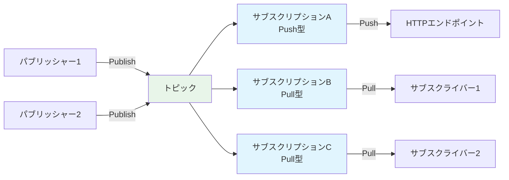

重要なのは、1つのトピックに複数のサブスクリプションを紐づけることで、SNSのファンアウトと同等の機能が実現されることである。また、1つのサブスクリプションに複数のサブスクライバーが接続すると、SQSと同等のロードバランシング（コンペティングコンシューマーパターン）が実現される。

つまり、AWSではSQS（ポイントツーポイント）とSNS（Pub/Sub）を組み合わせて実現するパターンが、Cloud Pub/Subでは単一サービスのトピックとサブスクリプションの組み合わせで表現できる。

#### 2.4.2 Ack期限（Acknowledgement Deadline）

Cloud Pub/SubのAck期限は、SQSの可視性タイムアウトに相当する概念である。サブスクライバーがメッセージを受信した後、Ack期限内にAck（確認応答）を返さなければ、メッセージは再配信される。

デフォルトのAck期限は10秒で、最大600秒（10分）まで設定できる。さらに、クライアントライブラリはストリーミングPull接続を通じてAck期限を動的に延長する仕組みを内蔵しており、処理時間が予測しにくい場合でも適切に動作する。

この動的延長は、SQSのChangeMessageVisibility APIに相当するが、Cloud Pub/Subのクライアントライブラリではこれが自動的に行われるため、アプリケーションコードで明示的に管理する必要がない。

#### 2.4.3 Ordering Key（順序キー）

Cloud Pub/Subは、Ordering Keyを使用してメッセージの順序保証を提供する。同一のOrdering Keyを持つメッセージは、パブリッシュされた順序で配信されることが保証される。異なるOrdering Keyを持つメッセージ間の順序は保証されない。

この仕組みは、SQSのFIFOキューにおけるMessageGroupIdと概念的に同等である。ただし、以下の点で違いがある。

- Cloud Pub/Subでは、Ordering Keyの使用はサブスクリプション単位で有効にする必要がある
- 順序付きメッセージの配信に失敗した場合、後続のメッセージの配信がブロックされる（順序を崩さないため）
- ブロックされた配信を再開するには、失敗したメッセージを明示的にAckする必要がある

#### 2.4.4 Exactly-Once配信

Cloud Pub/Subは2022年にExactly-Once配信機能をGAとしてリリースした。これにより、サブスクリプション単位でExactly-Once配信を有効にすると、同一のメッセージがサブスクライバーに2回以上配信されることが防がれる。

ただし、「Exactly-Once配信」と「Exactly-Once処理」は異なる概念であることに注意が必要である。Exactly-Once配信はメッセージングインフラが保証するものであり、サブスクライバー側の処理が冪等であることは依然として推奨される。ネットワーク障害やクライアントの再起動により、Ackがサービス側に到達しない場合にはメッセージが再配信される可能性があるためである。

> [!NOTE]
> Exactly-Once配信を有効にするとレイテンシが若干増加する。これは重複検出のためにサーバー側で追加の処理が必要になるためである。パフォーマンスと配信保証のトレードオフを考慮して使用する必要がある。

## 3. 実装手法

### 3.1 SQS + Lambda統合

AWS Lambdaは、SQSキューをイベントソースとして直接設定できる。Lambda側がSQSをポーリングし、メッセージを取得してLambda関数を呼び出す仕組みである。

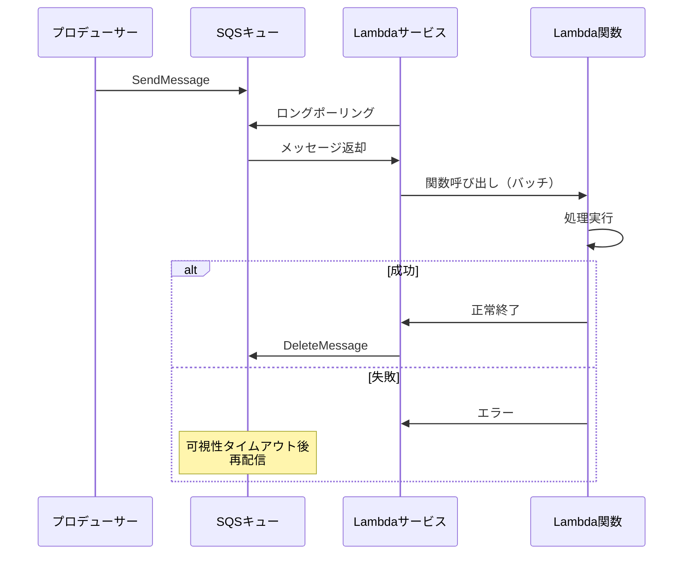

この統合における重要な設定パラメータを以下に示す。

```typescript
// AWS CDK example
import * as cdk from "aws-cdk-lib";
import * as sqs from "aws-cdk-lib/aws-sqs";
import * as lambda from "aws-cdk-lib/aws-lambda";
import * as lambdaEventSources from "aws-cdk-lib/aws-lambda-event-sources";

const queue = new sqs.Queue(this, "ProcessingQueue", {
  visibilityTimeout: cdk.Duration.seconds(300), // Lambda timeout x 6
  receiveMessageWaitTimeSeconds: 20, // Long polling
  retentionPeriod: cdk.Duration.days(14),
});

const dlq = new sqs.Queue(this, "DLQ", {
  retentionPeriod: cdk.Duration.days(14),
});

// Redrive policy for DLQ
const mainQueue = new sqs.Queue(this, "MainQueue", {
  deadLetterQueue: {
    queue: dlq,
    maxReceiveCount: 3, // Move to DLQ after 3 failures
  },
});

const fn = new lambda.Function(this, "Processor", {
  runtime: lambda.Runtime.NODEJS_20_X,
  handler: "index.handler",
  code: lambda.Code.fromAsset("lambda"),
  timeout: cdk.Duration.seconds(50), // Must be < visibility timeout
});

fn.addEventSource(
  new lambdaEventSources.SqsEventSource(mainQueue, {
    batchSize: 10, // Process up to 10 messages at a time
    maxBatchingWindow: cdk.Duration.seconds(5), // Wait up to 5s to fill batch
    reportBatchItemFailures: true, // Partial batch failure reporting
  })
);
```

::: warning 可視性タイムアウトとLambdaタイムアウトの関係
SQSの可視性タイムアウトは、Lambda関数のタイムアウトの少なくとも6倍に設定することがAWSの公式ドキュメントで推奨されている。これは、Lambda関数が最大限のリトライを試みた後でも可視性タイムアウトが切れないようにするためである。たとえば、Lambda関数のタイムアウトが50秒であれば、可視性タイムアウトは300秒以上に設定する。
:::

#### 3.1.1 部分バッチ失敗レポート

Lambda + SQS統合の重要な機能として「部分バッチ失敗レポート」がある。これはバッチ内の一部のメッセージだけが処理に失敗した場合に、失敗したメッセージだけをキューに戻す機能である。

この機能がない場合、バッチ内の1つのメッセージが失敗すると、バッチ全体が失敗として扱われ、すべてのメッセージが再処理される。これは冪等でない処理において問題を引き起こす。

部分バッチ失敗レポートを使用するには、Lambda関数が以下のレスポンス形式を返す必要がある。

```typescript
// Lambda handler with partial batch failure reporting
export const handler = async (event: SQSEvent): Promise<SQSBatchResponse> => {
  const batchItemFailures: SQSBatchItemFailure[] = [];

  for (const record of event.Records) {
    try {
      await processMessage(record);
    } catch (error) {
      // Report only the failed message
      batchItemFailures.push({
        itemIdentifier: record.messageId,
      });
    }
  }

  return { batchItemFailures };
};
```

### 3.2 SNS → SQS ファンアウトパターン

SNSとSQSを組み合わせたファンアウトパターンは、AWSにおけるイベント駆動アーキテクチャの最も基本的なビルディングブロックである。

このパターンの利点は以下のとおりである。

1. **バッファリング**: SNSから直接Lambdaを呼び出すと、突発的なイベントの増加がそのままLambdaの同時実行数に反映される。SQSを間に挟むことで、処理速度を制御できる
2. **再試行の粒度**: SNS → Lambdaの場合、SNSのリトライポリシーに従うが、制御の幅が限られる。SQS経由であれば、可視性タイムアウトやDLQを活用した柔軟なリトライ戦略が取れる
3. **独立したスケーリング**: 各SQSキューのコンシューマーは独立してスケーリングできる

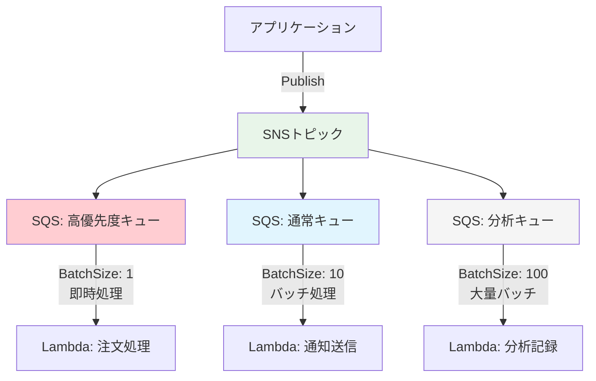

SNSトピックにSQSキューをサブスクライブする場合、SQSキュー側のアクセスポリシーでSNSトピックからのメッセージ送信を許可する必要がある。

```json
{
  "Version": "2012-10-17",
  "Statement": [
    {
      "Effect": "Allow",
      "Principal": {
        "Service": "sns.amazonaws.com"
      },
      "Action": "sqs:SendMessage",
      "Resource": "arn:aws:sqs:ap-northeast-1:123456789012:my-queue",
      "Condition": {
        "ArnEquals": {
          "aws:SourceArn": "arn:aws:sns:ap-northeast-1:123456789012:my-topic"
        }
      }
    }
  ]
}
```

### 3.3 EventBridge Pipes

EventBridge Pipes（2022年リリース）は、イベントソースからターゲットへのポイントツーポイントの統合をシンプルに構築するサービスである。従来、SQS → Lambda → EventBridgeのような中間処理にLambda関数が必要だった箇所を、コードなしで実現できる。

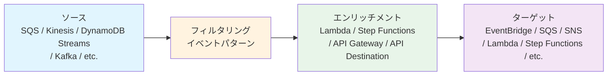

Pipesの典型的なユースケースを以下に示す。

**DynamoDB StreamsからEventBridgeへの連携**:

DynamoDBテーブルへの書き込みをイベントとしてEventBridgeに流す場合、従来はLambda関数を書いてDynamoDB Streamsを読み取り、イベントを整形してEventBridgeにPutEventsする必要があった。Pipesを使えば、この処理がコードなしで実現できる。

```json
{
  "Source": "aws.dynamodb",
  "DetailType": "DynamoDB Stream Event",
  "FilterCriteria": {
    "Filters": [
      {
        "Pattern": "{\"eventName\": [\"INSERT\", \"MODIFY\"]}"
      }
    ]
  },
  "InputTransformation": {
    "InputTemplate": "{\"order_id\": <$.dynamodb.NewImage.orderId.S>, \"status\": <$.dynamodb.NewImage.status.S>}"
  }
}
```

### 3.4 FIFO保証の仕組み

SQS FIFOキューの順序保証がどのように実現されているかを理解することは、正しい設計判断に不可欠である。

#### 3.4.1 メッセージグループIDと順序保証

FIFOキューの順序保証は「メッセージグループID」単位で行われる。同一のメッセージグループIDを持つメッセージは、送信された順序で配信される。異なるメッセージグループIDを持つメッセージ間の順序は保証されない。

これは重要な設計上のインプリケーションを持つ。すべてのメッセージに同一のメッセージグループIDを設定すると、キュー全体で厳密なFIFO順序が保証されるが、スループットは1つのメッセージグループの上限に制約される。一方、メッセージグループIDを適切に分割すれば（たとえば顧客IDごと）、各グループ内での順序保証を維持しつつ、グループ間では並行処理が可能になる。

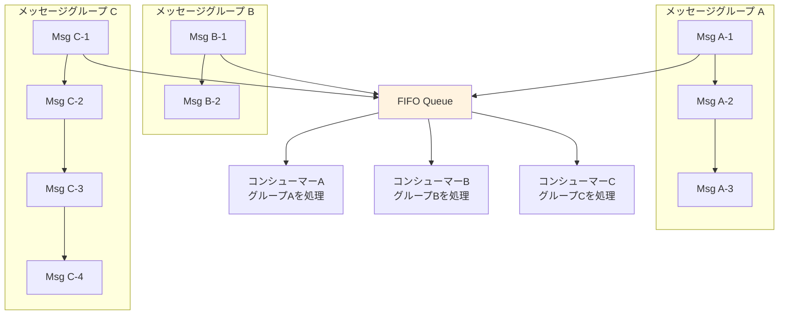

#### 3.4.2 重複排除

FIFOキューには2つの重複排除方式がある。

**コンテンツベースの重複排除**: メッセージ本文のSHA-256ハッシュを使用して重複を検出する。キューの`ContentBasedDeduplication`を有効にすることで利用できる。同一の本文を持つメッセージが5分以内に送信されると、2番目以降のメッセージは破棄される。

**メッセージ重複排除ID**: 送信時に明示的に`MessageDeduplicationId`を指定する。これにより、メッセージ本文が異なっていても同一の重複排除IDを持つメッセージは5分以内には1つしか受け入れられない。

> [!TIP]
> コンテンツベースの重複排除は手軽だが、同一の内容を意図的に2回送信するケース（たとえば同一商品の2回注文）では問題になる。このようなケースでは、明示的な重複排除IDを使用し、注文IDなどの業務キーを指定するのが適切である。

### 3.5 メッセージフィルタリングの実装パターン

メッセージフィルタリングは、不要なメッセージの処理を避けるための重要な機能であり、SNSとEventBridgeでそれぞれ異なるアプローチを取る。

#### 3.5.1 SNSのサブスクリプションフィルタ

SNSでは、サブスクリプションごとにフィルターポリシーを設定する。フィルターポリシーは「メッセージ属性」または「メッセージ本文」に対して適用できる。

メッセージ属性ベースのフィルタリングは、メッセージ本文を解析する必要がないためパフォーマンスが高い。ただし、メッセージ属性として送信時に明示的に設定する必要がある。

メッセージ本文ベースのフィルタリング（2022年リリース）は、JSONメッセージの任意のフィールドに対してフィルタリングを適用できる。既存のメッセージフォーマットを変更せずにフィルタリングを追加できる利点があるが、メッセージ本文の解析コストが発生する。

#### 3.5.2 EventBridgeのイベントパターン

EventBridgeのイベントパターンは、SNSのフィルターポリシーよりも強力な条件指定が可能である。以下のような演算子をサポートする。

| 演算子 | 説明 | 例 |
|--------|------|-----|
| 完全一致 | 値の完全一致 | `"source": ["myapp"]` |
| prefix | 前方一致 | `"source": [{"prefix": "com."}]` |
| suffix | 後方一致 | `"source": [{"suffix": ".orders"}]` |
| numeric | 数値比較 | `"detail.amount": [{"numeric": [">", 100]}]` |
| exists | フィールドの存在確認 | `"detail.discount": [{"exists": true}]` |
| anything-but | 否定 | `"detail.env": [{"anything-but": "test"}]` |
| cidr | IP範囲 | `"detail.ip": [{"cidr": "10.0.0.0/8"}]` |

## 4. 運用の実際

### 4.1 サービス選択の判断基準

AWS上でメッセージングを構築する際、SQS、SNS、EventBridgeのどれを選ぶかは頻出の設計判断である。以下にガイドラインを示す。

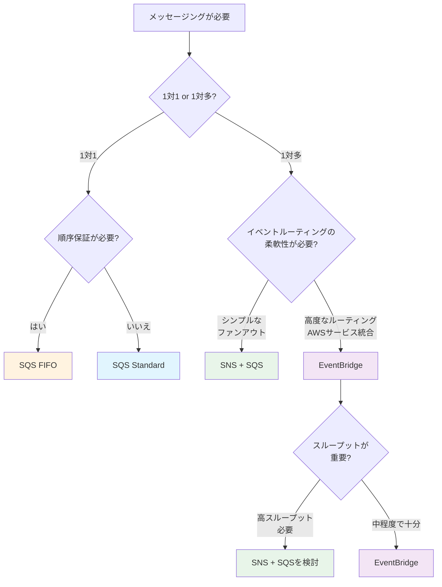

**SQSを選ぶべきケース**:
- ワーカーによるジョブキュー処理（画像変換、メール送信など）
- 処理速度の異なるサービス間のバッファリング
- 順序保証が必要な場合（FIFOキュー）
- コンシューマーが自分のペースでメッセージを処理したい場合

**SNSを選ぶべきケース**:
- 1つのイベントを複数のサービスにファンアウトする場合
- 高スループットが要求される場合
- モバイルプッシュ通知やSMS送信が必要な場合
- シンプルなPub/Subパターンで十分な場合

**EventBridgeを選ぶべきケース**:
- AWSサービスのイベント（EC2状態変更、S3アップロードなど）に反応する場合
- SaaSアプリケーション（Zendesk, Datadog, Auth0など）からのイベントを処理する場合
- イベントの内容に基づく高度なルーティングが必要な場合
- イベントのアーカイブとリプレイが必要な場合
- スキーマ管理によるイベント契約の形式化が求められる場合

::: tip 組み合わせの活用
実際のシステムでは、これらのサービスを組み合わせて使うことが多い。典型的な構成として「EventBridgeでイベントを受信しルーティング → SNSでファンアウト → SQSでバッファリング → Lambdaで処理」というパイプラインがある。各サービスの強みを活かした組み合わせが、マネージドメッセージングの真の力を発揮する。
:::

### 4.2 デッドレターキュー（DLQ）の運用

DLQは設定するだけでなく、適切に運用しなければ意味がない。以下にDLQ運用のベストプラクティスを示す。

#### 4.2.1 監視とアラート

DLQにメッセージが到着したことは、何らかの問題が発生していることを示す。CloudWatch Alarmを設定し、DLQの`ApproximateNumberOfMessagesVisible`メトリクスが0より大きくなった場合にアラートを発報するのが基本的な運用である。

```typescript
// AWS CDK - DLQ monitoring
import * as cloudwatch from "aws-cdk-lib/aws-cloudwatch";
import * as actions from "aws-cdk-lib/aws-cloudwatch-actions";
import * as sns from "aws-cdk-lib/aws-sns";

const alarm = new cloudwatch.Alarm(this, "DLQAlarm", {
  metric: dlq.metricApproximateNumberOfMessagesVisible(),
  threshold: 0,
  comparisonOperator:
    cloudwatch.ComparisonOperator.GREATER_THAN_THRESHOLD,
  evaluationPeriods: 1,
  treatMissingData: cloudwatch.TreatMissingData.NOT_BREACHING,
  alarmDescription: "Messages detected in DLQ - investigation required",
});

// Notify operations team
const alertTopic = new sns.Topic(this, "AlertTopic");
alarm.addAlarmAction(new actions.SnsAction(alertTopic));
```

#### 4.2.2 DLQメッセージの調査と再処理

DLQに到達したメッセージを調査する際は、以下の手順を取る。

1. **原因の特定**: DLQのメッセージ属性（送信元、タイムスタンプ、エラー回数）を確認し、コンシューマーのログと突き合わせて失敗原因を特定する
2. **修正の実施**: バグ修正、設定変更、依存サービスの復旧などの対応を行う
3. **再処理**: SQSのDLQリドライブ機能を使って、DLQのメッセージを元のキューに戻す。あるいは、DLQからメッセージを読み取って整形し、元のキューに再送信するスクリプトを実行する

#### 4.2.3 DLQ設計の注意点

- **DLQにもDLQを設定しない**: DLQの処理が失敗してさらにDLQに移動するような構成は、問題を複雑化させるだけである
- **保持期間の設定**: DLQの保持期間は元のキューと同じか、それ以上に設定する。元のキューの保持期間が経過していると、DLQに移動された時点ですでにTTLが迫っている可能性がある
- **DLQのメッセージ数を定期的に確認する**: たとえアラートを設定していても、長期間放置されたDLQメッセージは保持期間の経過により失われるリスクがある

### 4.3 冪等性の担保

Standardキューでは「At-Least-Once」配信が保証されており、同一メッセージが複数回配信される可能性がある。また、FIFOキューやExactly-Once配信を使用していても、ネットワーク障害やアプリケーションの再起動により、処理済みのメッセージが再度処理される可能性はゼロではない。したがって、メッセージ処理の冪等性を確保することは、メッセージングシステムにおける最も重要な設計原則の一つである。

#### 4.3.1 冪等性の実装パターン

**パターン1: 冪等性キーとデータベース**

メッセージに一意のID（冪等性キー）を含め、処理済みのIDをデータベースに記録する。

```typescript
async function processMessage(message: SQSRecord): Promise<void> {
  const idempotencyKey = message.messageId;

  // Check if already processed
  const existing = await db.get({
    TableName: "ProcessedMessages",
    Key: { idempotencyKey },
  });

  if (existing.Item) {
    console.log(`Message ${idempotencyKey} already processed, skipping`);
    return;
  }

  // Process the message
  await performBusinessLogic(JSON.parse(message.body));

  // Record as processed (with TTL for cleanup)
  await db.put({
    TableName: "ProcessedMessages",
    Item: {
      idempotencyKey,
      processedAt: Date.now(),
      ttl: Math.floor(Date.now() / 1000) + 7 * 24 * 60 * 60, // 7 days
    },
    ConditionExpression: "attribute_not_exists(idempotencyKey)",
  });
}
```

**パターン2: 条件付き書き込み**

データベースの条件付き更新を使用して、処理の冪等性を保証する。

```sql
-- Only update if the current version matches
UPDATE orders
SET status = 'shipped', version = version + 1
WHERE order_id = 'ORD-001' AND version = 3;
-- If version has already been incremented, this update affects 0 rows
```

**パターン3: AWS Lambda Powertoolsの冪等性ユーティリティ**

AWS Lambda Powertoolsには、冪等性を透過的に実装するためのユーティリティが提供されている。DynamoDBを冪等性ストアとして使用し、デコレータ（Python）やミドルウェア（TypeScript）で関数全体または個別の処理を冪等にできる。

```typescript
import { IdempotencyConfig } from "@aws-lambda-powertools/idempotency";
import { DynamoDBPersistenceLayer } from "@aws-lambda-powertools/idempotency/dynamodb";
import { makeIdempotent } from "@aws-lambda-powertools/idempotency";

const persistenceStore = new DynamoDBPersistenceLayer({
  tableName: "IdempotencyTable",
});

const config = new IdempotencyConfig({
  expiresAfterSeconds: 3600,
  eventKeyJmesPath: "messageId",
});

export const handler = makeIdempotent(
  async (event: SQSEvent) => {
    // This function will only execute once per unique messageId
    await processOrder(event);
  },
  {
    persistenceStore,
    config,
  }
);
```

### 4.4 コスト比較

マネージドメッセージングサービスのコストは、主にリクエスト数とデータ転送量に基づく。以下は東京リージョン（ap-northeast-1）における概算比較である（2026年時点の参考値、最新の料金は公式ドキュメントを確認すること）。

| サービス | 料金モデル | 概算コスト |
|---------|-----------|-----------|
| SQS Standard | リクエスト単位 | 100万リクエストあたり約$0.40 |
| SQS FIFO | リクエスト単位 | 100万リクエストあたり約$0.50 |
| SNS | メッセージ発行 + 配信 | 100万発行あたり約$0.50、HTTP配信100万あたり約$0.60 |
| EventBridge | イベント単位 | 100万イベントあたり約$1.00 |
| Cloud Pub/Sub | データボリューム | メッセージ配信10GBまで無料、以降$40/TB |

> [!NOTE]
> 上記は概算であり、実際のコストはリクエストサイズ、リージョン、データ転送（クロスAZ、クロスリージョン）、追加機能の使用状況により異なる。特にSQSでは、1リクエストあたり最大256KBのメッセージを送受信でき、64KBごとに1リクエストとしてカウントされる点に注意が必要である。

**コスト最適化のポイント**:

- **バッチ処理の活用**: SQSのSendMessageBatch（最大10メッセージ）やSNSのPublishBatch（最大10メッセージ）を使用すると、1回のAPIコールで複数メッセージを処理でき、リクエスト数を最大10分の1に削減できる
- **ロングポーリング**: SQSでロングポーリングを使用すると、空のレスポンスが減りリクエスト数が削減される
- **メッセージフィルタリング**: SNSのサブスクリプションフィルタやEventBridgeのルールフィルタを活用し、不要なメッセージの配信・処理を避ける
- **ペイロードの外部化**: 大きなメッセージはS3に保存し、メッセージにはS3のキーだけを含める。SQS Extended Client Libraryはこのパターンを自動化する

### 4.5 Kafka / Amazon MSKとの使い分け

マネージドメッセージングサービスとApache Kafka（またはそのマネージド版であるAmazon MSK）は、異なるユースケースに適している。

#### 4.5.1 根本的なアーキテクチャの違い

SQS/SNS/EventBridgeは「メッセージを消費したら消える」モデルである。コンシューマーがメッセージを処理して確認応答を送ると、メッセージはキューから削除される。

一方、Kafkaは「イミュータブルなログ」モデルである。メッセージ（レコード）はトピックのパーティションに追加され、保持期間が経過するまで削除されない。複数のコンシューマーグループが同一のトピックを独立したオフセットで読み取ることができる。

```mermaid
graph TB
    subgraph SQSモデル（消費型）
        P1[プロデューサー] --> Q1[キュー]
        Q1 -->|メッセージ消費<br/>→ 削除| C1[コンシューマー]
    end

    subgraph Kafkaモデル（ログ型）
        P2[プロデューサー] --> T1[トピック<br/>イミュータブルログ]
        T1 -->|オフセット5から読む| CG1[コンシューマーグループA]
        T1 -->|オフセット3から読む| CG2[コンシューマーグループB]
        T1 -->|オフセット8から読む| CG3[コンシューマーグループC]
    end

    style Q1 fill:#e1f5fe
    style T1 fill:#fff3e0
```

#### 4.5.2 選択基準

**SQS/SNS/EventBridgeが適するケース**:
- サーバーレスアーキテクチャとの統合
- AWSサービス間のイベント連携
- 運用負荷を最小限にしたい場合
- メッセージの再処理が基本的に不要な場合
- スモールスタートで始めたい場合

**Kafka / MSKが適するケース**:
- イベントソーシングパターン（イベントの永続化と再読み取り）
- ストリーム処理（Kafka Streams, Apache Flink との統合）
- 非常に高いスループット（数百万メッセージ/秒）が必要な場合
- 複数のコンシューマーグループが同一データを異なる速度で読み取る場合
- メッセージの巻き戻し（過去のオフセットからの再処理）が必要な場合

::: warning MSKの運用コスト
Amazon MSKはKafkaのマネージドサービスだが、SQS/SNSほどフルマネージドではない。ブローカーインスタンスの選定、ストレージの管理、パーティションの設計など、Kafkaの運用知識は依然として必要である。MSK Serverlessモードではこの負担が軽減されるが、パーティション数やスループットの制約がある。
:::

#### 4.5.3 Amazon MSK vs 自前Kafka

Amazon MSKを選択する場合でも、プロビジョンドモードとサーバーレスモードの選択がある。

| 観点 | MSK Provisioned | MSK Serverless |
|------|-----------------|----------------|
| ブローカー管理 | インスタンスタイプの選択が必要 | 不要 |
| スケーリング | 手動（ブローカー追加） | 自動 |
| パーティション設計 | 柔軟 | 制約あり |
| コスト | 常時稼働コスト | 従量課金 |
| 運用負荷 | 中程度 | 低い |

## 5. 将来展望

### 5.1 EventBridgeの進化

EventBridgeは、AWSのメッセージング/イベントサービスの中で最も急速に進化しているサービスである。2019年の登場以降、スキーマレジストリ、アーカイブ/リプレイ、Pipes、Schedulerなどの機能が次々と追加されてきた。

今後の方向性として、以下のような進化が見込まれる。

**イベント品質の向上**: スキーマレジストリの強化により、イベントの型安全性がさらに高まることが予想される。スキーマの互換性チェック（前方互換性、後方互換性）の自動化や、スキーマ違反のイベントの自動検出と拒否などの機能が加わることで、イベント駆動アーキテクチャの信頼性が向上する。

**クロスアカウント・クロスリージョンの強化**: 現在もクロスアカウントのイベントバスはサポートされているが、組織規模でのイベントメッシュの構築をさらに容易にする機能が期待される。複数のAWSアカウントにまたがるイベントバスの統合管理、イベントの自動ルーティング、グローバルなイベントカタログの提供などが考えられる。

**AI/MLとの統合**: イベントパターンの自動推薦や、異常イベントの自動検出、イベントフローの最適化提案など、機械学習を活用した運用支援機能が追加される可能性がある。

### 5.2 イベント駆動アーキテクチャの浸透

マネージドメッセージングサービスの成熟に伴い、イベント駆動アーキテクチャ（EDA: Event-Driven Architecture）の採用がさらに広がっている。

#### 5.2.1 EDAの標準化の動き

CloudEvents仕様（CNCF: Cloud Native Computing Foundation のプロジェクト）は、イベントの共通メタデータフォーマットを定義するオープンスタンダードである。CloudEventsは、イベントの`source`、`type`、`id`、`time`などの共通フィールドを標準化し、異なるメッセージングシステム間でのイベントの相互運用性を向上させる。

EventBridgeのイベント構造はCloudEventsと類似しているが、完全な互換性はない。将来的には、CloudEventsのネイティブサポートや、CloudEvents形式とEventBridge形式の自動変換が提供される可能性がある。

#### 5.2.2 イベントメッシュ

大規模な組織では、複数のチームが独立してイベントを発行・消費する「イベントメッシュ」パターンが注目されている。これは、サービスメッシュがサービス間の同期通信を抽象化するのと同様に、イベントメッシュがサービス間の非同期通信を抽象化する概念である。

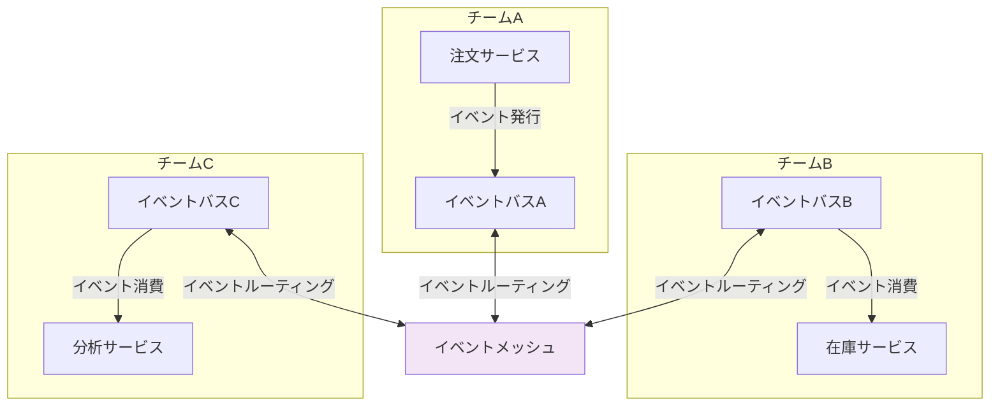

イベントメッシュの実現には、イベントカタログ（どのようなイベントが存在し、誰が発行し、どのようなスキーマを持つか）の管理が不可欠であり、EventBridgeのスキーマレジストリはその基盤となる技術である。

### 5.3 サーバーレスとの統合深化

マネージドメッセージングサービスは、サーバーレスコンピューティングとの統合がますます深まっている。

#### 5.3.1 イベントソースマッピングの進化

AWS Lambdaのイベントソースマッピング（ESM: Event Source Mapping）は、SQS、Kinesis、DynamoDB Streams、MSKなどのイベントソースからLambdaを呼び出す仕組みである。ESMは継続的に改善されており、以下のような機能が追加されてきた。

- **バッチウィンドウ**: メッセージが一定数に達するか、一定時間が経過するまで待ってからLambdaを呼び出す
- **フィルタリング**: ESMレベルでイベントをフィルタリングし、不要なLambda呼び出しを削減する
- **最大同時実行数**: Lambda関数の同時実行数の上限を設定し、下流サービスへの負荷を制御する
- **部分バッチ失敗レポート**: 前述のとおり、バッチ内の個別メッセージレベルでの成功/失敗報告

#### 5.3.2 Step Functionsとの統合

AWS Step Functions（ステートマシンベースのワークフローオーケストレーション）は、メッセージングサービスとの統合を強化している。Step FunctionsからSQSへのメッセージ送信、SNSへのPublish、EventBridgeへのイベント送信をSDK統合（AWS SDK Integration）で直接実行でき、Lambda関数を介する必要がない。

特にEventBridge Pipesとの組み合わせにより、「イベントの受信 → フィルタリング → エンリッチメント → ワークフロー実行」という一連の処理を、最小限のカスタムコードで構築できるようになっている。

#### 5.3.3 クラウドネイティブな非同期処理の標準化

将来的には、メッセージの送受信、フィルタリング、変換、ルーティングといった処理が、よりインフラに近いレイヤーで透過的に提供されるようになると考えられる。開発者はビジネスロジックの実装に集中し、メッセージングの配管工事（plumbing）はクラウドプラットフォームが自動的に最適化する世界が近づいている。

EventBridge PipesやStep Functionsの進化は、この方向性を示している。「イベントが発生したら、このビジネスロジックを実行する」という宣言的な定義だけで、信頼性の高い非同期処理パイプラインが構築できる未来は、すでに実現しつつある。

## まとめ

マネージドメッセージングサービスは、分散システムにおける非同期通信の課題を解決するための重要なインフラストラクチャである。本記事で見てきたように、各サービスは異なる設計思想と強みを持っている。

- **SQS**: シンプルで信頼性の高いポイントツーポイントのメッセージキュー。ジョブキュー、バッファリング、順序保証（FIFO）のユースケースに最適
- **SNS**: 1対多のPub/Subパターンを実現するファンアウトサービス。イベントの広範な配信に最適
- **EventBridge**: イベントの内容に基づくインテリジェントなルーティングエンジン。AWSサービスやSaaSとの統合、高度なイベント駆動アーキテクチャに最適
- **Cloud Pub/Sub**: Google Cloudのメッセージングサービス。SQSとSNSの機能を統合した設計で、グローバルなメッセージングに最適

どのサービスを選択するかは、ユースケース、スループット要件、順序保証の必要性、コスト、そして既存のアーキテクチャとの統合を総合的に考慮して判断する必要がある。

重要なのは、マネージドメッセージングサービスを使うことで「メッセージングの問題がすべて解決する」わけではないということだ。冪等性の担保、DLQの運用、メッセージスキーマの管理、コスト最適化など、アプリケーションレベルで取り組むべき課題は依然として存在する。マネージドサービスはインフラ層の運用負荷を劇的に削減するが、メッセージング設計の本質的な複雑さは開発者の責任であり続ける。
