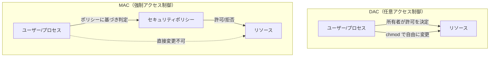
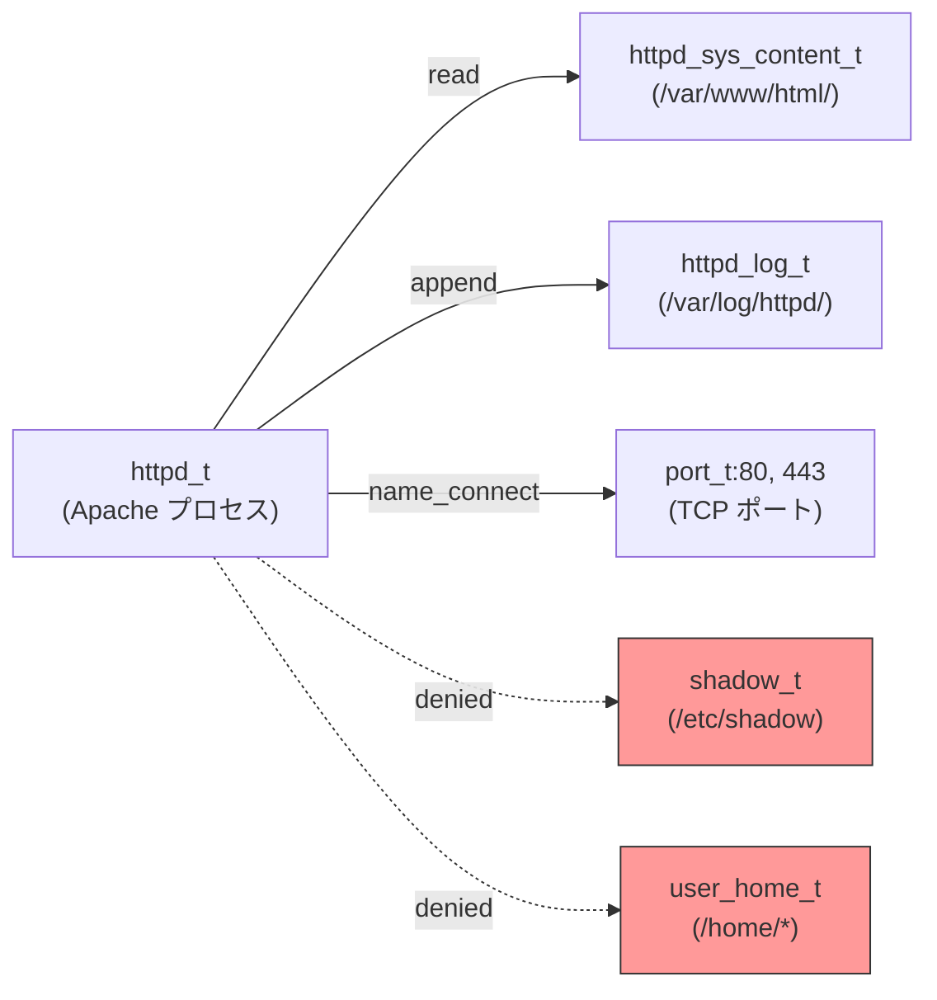
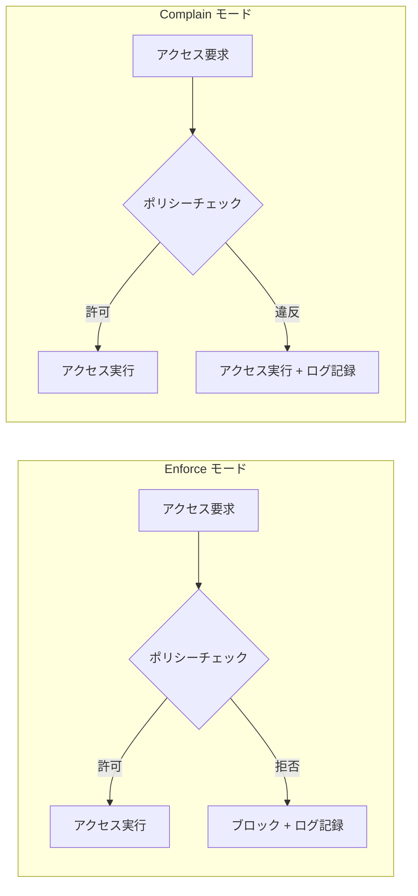
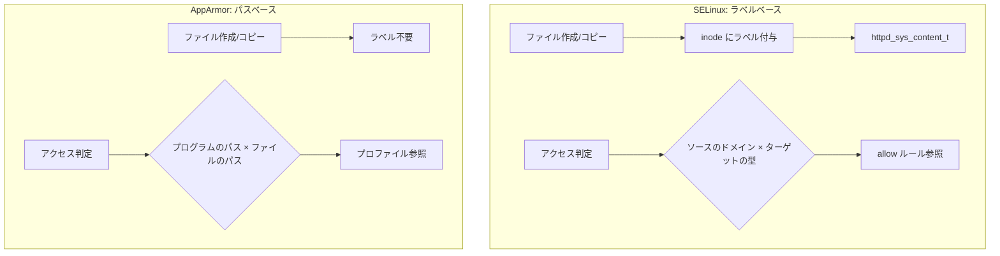

# 強制アクセス制御（MAC）— SELinux・AppArmorによるLinuxセキュリティの深層

## 1. 背景と動機

### 1.1 なぜアクセス制御が必要なのか

マルチユーザーOSにおいて、「誰が何にアクセスできるか」を制御する仕組みはセキュリティの根幹である。プロセスが任意のファイルを読み書きでき、任意のネットワークポートに接続できるシステムでは、一つのプロセスが侵害された瞬間にシステム全体が危険にさらされる。

歴史的に、UNIX系OSは**任意アクセス制御（DAC: Discretionary Access Control）**を採用してきた。ファイルの所有者がパーミッションを自由に設定でき、`chmod`、`chown`によってアクセス権を制御する。この仕組みはシンプルで理解しやすいが、重大な構造的欠陥を抱えている。

### 1.2 DACの限界

DACの根本的な問題は、**リソースの所有者がアクセス権を自由に変更できる**点にある。

```
+------------------+     chmod 777     +------------------+
| 一般ユーザー     | ───────────────→  | /home/user/secret |
| (ファイル所有者) |                   | rw-r--r-- → rwxrwxrwx |
+------------------+                   +------------------+
         ↑
     所有者が自由に
     パーミッション変更可能
```

具体的な問題点を挙げる。

**権限昇格の連鎖**: root権限で動作するプロセスが一つでも侵害されると、DACによる保護は完全に無効化される。rootはすべてのパーミッションチェックをバイパスできるため、攻撃者はシステム全体を掌握できる。

**情報フローの制御不能**: DACはファイルへの直接アクセスは制御できるが、プロセス間の情報の流れを制御できない。プロセスAが機密ファイルを読み取り、その内容をプロセスBに渡すことを防止する手段がない。

**setuidプログラムのリスク**: `passwd`コマンドのように、一般ユーザーが実行してもroot権限で動作するsetuidプログラムに脆弱性があると、任意のコード実行が可能になる。DACだけでは、このようなプログラムの動作範囲を制限できない。

**Webサーバーの例**: Apache HTTPDがroot権限で起動し、ポート80をバインドした後にwww-dataユーザーに降格するケースを考える。もしApacheに脆弱性があり、www-dataの権限でシェルを取られた場合、DACだけではwww-dataがアクセスできるすべてのファイルが危険にさらされる。`/tmp`への書き込み、他のサービスの設定ファイルの読み取り、不要なネットワーク接続の確立など、Webサーバーの本来の役割とは無関係な操作が可能になってしまう。

### 1.3 MACという解答

これらの問題に対する解答が**強制アクセス制御（MAC: Mandatory Access Control）**である。MACでは、システム管理者（またはセキュリティポリシー）がアクセスルールを定義し、**個々のユーザーやプロセスがそのルールを変更することはできない**。たとえrootであっても、MACポリシーによって制限された操作は実行できない。



MACの本質は「最小権限の原則（Principle of Least Privilege）」の強制的な適用である。各プロセスには、その業務に必要な最小限のアクセス権だけが与えられ、侵害されても影響範囲が限定される。

## 2. Linux Security Modules（LSM）フレームワーク

### 2.1 LSMの誕生

2001年、Linuxカーネルにセキュリティ機能を追加する統一的な手段が必要とされた。当時、SELinuxをはじめとする複数のセキュリティモジュールがカーネルへの統合を目指していたが、それぞれが独自のパッチをカーネルに適用する形であり、保守性や互換性に問題があった。

Linus Torvaldsは、特定のセキュリティモデルをカーネルに直接組み込むことに反対し、代わりに**汎用的なフレームワーク**の開発を求めた。こうして2002年、Linux 2.6カーネルに**LSM（Linux Security Modules）**が導入された。

### 2.2 LSMのアーキテクチャ

LSMはカーネル内のセキュリティ判定ポイントに**フック（hook）**を挿入するフレームワークである。システムコールが実行されると、通常のDACチェックに加えて、LSMフックが呼び出され、登録されたセキュリティモジュールがアクセスの許可/拒否を判定する。

```
ユーザー空間
─────────────────────────────────────────────
カーネル空間

  システムコール (open, read, write, connect, ...)
         │
         ▼
  通常のDAC チェック (パーミッション、UID/GID)
         │
         ├── 拒否 → エラー返却
         │
         ▼ (DACが許可)
  LSM フック呼び出し
         │
         ▼
  セキュリティモジュール判定
  (SELinux / AppArmor / Smack / TOMOYO)
         │
         ├── 拒否 → エラー返却 (EACCES)
         │
         ▼ (許可)
  カーネル処理の続行
```

重要な点は、LSMは**追加の制限**のみを行うということである。DACが許可したアクセスをさらに制限することはできるが、DACが拒否したアクセスを許可することはできない。つまり、MACはDACの上に積み重なる追加の防御層である。

### 2.3 主要なLSMモジュール

LSMフレームワーク上に実装された主要なセキュリティモジュールには以下がある。

| モジュール | 開発元 | アプローチ | 主な採用ディストリビューション |
|-----------|--------|-----------|----------------------------|
| SELinux | NSA / Red Hat | ラベルベース（Type Enforcement） | RHEL, CentOS, Fedora, Amazon Linux |
| AppArmor | Canonical / SUSE | パスベース | Ubuntu, Debian, openSUSE |
| Smack | Casey Schaufler | シンプルなラベルベース | Tizen（Samsung）, Automotive Linux |
| TOMOYO | NTTデータ | パスベース（学習モード重視） | 一部の組み込みシステム |

Linux 5.1以降、**LSMスタッキング**が部分的にサポートされ、複数のLSMを同時に有効化できるようになった。ただし、SELinuxとAppArmorを同時に使用することは一般的ではなく、通常はディストリビューションがどちらか一方をデフォルトとして採用している。

## 3. SELinux — ラベルベースの強制アクセス制御

### 3.1 歴史的背景

SELinux（Security-Enhanced Linux）は、**米国国家安全保障局（NSA）**が開発し、2000年にオープンソースとして公開したセキュリティモジュールである。その背景には、1990年代に米国国防総省が進めた「Trusted OS」研究がある。

NSAは、従来のUNIXのアクセス制御では軍事・政府レベルのセキュリティ要件を満たせないと認識していた。特に、**多段階セキュリティ（MLS: Multi-Level Security）**——機密情報のレベル（Unclassified、Confidential、Secret、Top Secret）に応じて情報の流れを制御する仕組み——は、DACだけでは実現不可能だった。

SELinuxの開発は、FluxアーキテクチャやFlask（Flux Advanced Security Kernel）などの先行研究に基づいている。2003年にLinux 2.6カーネルにマージされ、Red Hat Enterprise Linux 4（2005年）でデフォルト有効となった。

### 3.2 SELinuxの基本概念：セキュリティコンテキスト

SELinuxでは、システム上のすべてのオブジェクト（ファイル、プロセス、ポート、ソケットなど）に**セキュリティコンテキスト（ラベル）**が付与される。コンテキストは以下の4つの要素で構成される。

```
user:role:type:level

例：
system_u:system_r:httpd_t:s0
unconfined_u:unconfined_r:unconfined_t:s0-s0:c0.c1023
```

| 要素 | 説明 | 例 |
|------|------|-----|
| user | SELinuxユーザー（Linuxユーザーとは別） | `system_u`, `unconfined_u`, `user_u` |
| role | RBAC（Role-Based Access Control）用のロール | `system_r`, `unconfined_r`, `object_r` |
| type | Type Enforcementで使用される型（最重要） | `httpd_t`, `var_log_t`, `etc_t` |
| level | MLS/MCSのセキュリティレベル | `s0`, `s0-s0:c0.c1023` |

ファイルやプロセスのコンテキストは以下のコマンドで確認できる。

```bash
# ファイルのセキュリティコンテキストを表示
ls -Z /var/www/html/index.html
# 出力例: system_u:object_r:httpd_sys_content_t:s0 /var/www/html/index.html

# プロセスのセキュリティコンテキストを表示
ps -eZ | grep httpd
# 出力例: system_u:system_r:httpd_t:s0  1234 ?  00:00:01 httpd

# 現在のユーザーのコンテキストを表示
id -Z
# 出力例: unconfined_u:unconfined_r:unconfined_t:s0-s0:c0.c1023
```

### 3.3 Type Enforcement（TE）

SELinuxの最も重要なメカニズムが**Type Enforcement**である。これは、プロセスの「型（ドメイン）」とリソースの「型」の組み合わせに対して、許可する操作を明示的に定義する仕組みである。



TEポリシーは`allow`文で記述される。

```
# httpd_t ドメインのプロセスが httpd_sys_content_t タイプのファイルを読める
allow httpd_t httpd_sys_content_t:file { read open getattr };

# httpd_t ドメインのプロセスが httpd_log_t タイプのファイルに追記できる
allow httpd_t httpd_log_t:file { append open getattr };
```

明示的に`allow`されていない操作は**すべて拒否される**。これが「デフォルト拒否（default deny）」の原則であり、SELinuxの堅牢さの根幹をなす。

### 3.4 MLS（Multi-Level Security）とMCS（Multi-Category Security）

**MLS**は、軍事・政府機関で必要とされる多段階セキュリティモデルを実装する。Bell-LaPadulaモデルに基づき、以下の2つの原則を強制する。

- **No Read Up（Simple Security Property）**: 低いセキュリティレベルの主体が、高いレベルの客体を読むことはできない
- **No Write Down（*-property）**: 高いセキュリティレベルの主体が、低いレベルの客体に書き込むことはできない

```
セキュリティレベル:

  Top Secret (s3)     ┌──────────────┐
                      │ 読み取り可    │ ← 書き込み可
  Secret (s2)         ├──────────────┤
                      │ 読み取り可    │ ← 書き込み可
  Confidential (s1)   ├──────────────┤
                      │ 読み取り可    │ ← 書き込み可
  Unclassified (s0)   └──────────────┘
                            ↑
                      プロセス (s1)
                      ・s0, s1 のデータを読める
                      ・s1 以上にのみ書き込める
                      ・s2, s3 のデータは読めない
```

**MCS（Multi-Category Security）**は、MLSを簡略化した仕組みで、カテゴリ（c0～c1023）を使ってリソースを分類する。同じセキュリティレベルでも、異なるカテゴリに属するリソースを分離できる。MCSは特にコンテナセキュリティで重要な役割を果たしており、後述するコンテナ環境での活用で詳しく説明する。

### 3.5 ポリシータイプ

SELinuxには主に3つのポリシータイプがある。

#### targeted（標準）

最も広く使われているポリシーで、RHEL/CentOS/Fedoraのデフォルトである。特定のネットワークサービス（httpd、sshd、namedなど）を個別のドメインに閉じ込め（confine）、それ以外のプロセスは`unconfined_t`ドメインで動作させる。

```bash
# targetedポリシーの確認
sestatus
# 出力例:
# SELinux status:                 enabled
# SELinuxfs mount:                /sys/fs/selinux
# SELinux root directory:         /etc/selinux
# Loaded policy name:             targeted
# Current mode:                   enforcing
# Mode from config file:          enforcing
# Policy MLS status:              enabled
# Policy deny_unknown status:     allowed
# Memory protection checking:     actual (secure)
# Max kernel policy version:      33
```

targetedポリシーの設計思想は「**重要なサービスを保護しつつ、ユーザーの利便性を損なわない**」というバランスにある。一般ユーザーのプロセスはunconfined（非制限）で動作するため、SELinuxが有効であることをほとんど意識せずに使える。

#### strict

すべてのプロセスをSELinuxドメインに閉じ込めるポリシーである。セキュリティは最も高いが、ポリシーの管理が極めて複雑になるため、軍事・政府機関や高セキュリティ環境でのみ使用される。現在のRHEL系ディストリビューションでは、strictポリシーはtargetedに統合されており、個別のプロセスをconfined/unconfinedに設定できる。

#### mls

MLS（Multi-Level Security）を完全に実装するポリシーである。Bell-LaPadulaモデルに基づくセキュリティレベルの強制が行われ、LSPP（Labeled Security Protection Profile）などの政府認定に必要な機能を提供する。

### 3.6 SELinuxの動作モード

SELinuxには3つの動作モードがある。

```bash
# 現在のモードを確認
getenforce
# 出力: Enforcing / Permissive / Disabled

# 一時的にPermissiveに変更（再起動で元に戻る）
sudo setenforce 0  # Permissive
sudo setenforce 1  # Enforcing

# 恒久的に設定を変更する場合
sudo vi /etc/selinux/config
# SELINUX=enforcing | permissive | disabled
```

| モード | 動作 | 用途 |
|--------|------|------|
| Enforcing | ポリシーを強制し、違反をブロック＆ログ記録 | 本番環境 |
| Permissive | ポリシー違反をログに記録するが、ブロックしない | デバッグ・ポリシー開発 |
| Disabled | SELinuxを完全に無効化 | 非推奨（ラベルが消失する） |

**注意**: `Disabled`から`Enforcing`に戻す際には、ファイルシステム全体のラベル付け直し（relabeling）が必要である。これは大規模なシステムでは数十分から数時間かかる場合がある。

```bash
# ファイルシステムの再ラベル付けをスケジュール
sudo touch /.autorelabel
sudo reboot
```

### 3.7 SELinux Boolean

SELinux Booleanは、ポリシーの一部を動的にオン/オフするための仕組みである。ポリシーファイルを直接編集することなく、よく使われる設定を簡単に変更できる。

```bash
# すべてのBooleanを一覧表示
getsebool -a

# 特定のBooleanの状態を確認
getsebool httpd_can_network_connect
# 出力: httpd_can_network_connect --> off

# Booleanを有効にする（-P で永続化）
sudo setsebool -P httpd_can_network_connect on

# httpdに関連するBooleanを検索
getsebool -a | grep httpd
# 出力例:
# httpd_can_network_connect --> off
# httpd_can_network_connect_db --> off
# httpd_can_sendmail --> off
# httpd_enable_cgi --> on
# httpd_enable_homedirs --> off
# httpd_use_nfs --> off
```

よく使われるBooleanの例を挙げる。

| Boolean | デフォルト | 説明 |
|---------|----------|------|
| `httpd_can_network_connect` | off | Apacheが外部ネットワークに接続可能にする |
| `httpd_can_network_connect_db` | off | ApacheがDBサーバーに接続可能にする |
| `httpd_enable_homedirs` | off | Apacheがユーザーのホームディレクトリにアクセス可能にする |
| `samba_enable_home_dirs` | off | Sambaがホームディレクトリを共有可能にする |
| `ftp_home_dir` | off | FTPでホームディレクトリへのアクセスを許可 |

### 3.8 ファイルコンテキストの管理

SELinuxでは、ファイルのセキュリティコンテキスト（ラベル）が正しく設定されていることが極めて重要である。ラベルが不正な場合、正当なアクセスがブロックされることがある。

```bash
# ファイルのコンテキストを確認
ls -Z /var/www/html/
# 出力例: system_u:object_r:httpd_sys_content_t:s0 index.html

# ファイルのコンテキストを一時的に変更
sudo chcon -t httpd_sys_content_t /var/www/html/newfile.html

# ファイルのコンテキストをデフォルトに戻す（restorecon）
sudo restorecon -Rv /var/www/html/
# 出力例: Relabeled /var/www/html/newfile.html from
#         unconfined_u:object_r:default_t:s0 to
#         system_u:object_r:httpd_sys_content_t:s0

# カスタムのファイルコンテキストルールを追加
sudo semanage fcontext -a -t httpd_sys_content_t "/srv/myapp(/.*)?"
sudo restorecon -Rv /srv/myapp/

# 現在のファイルコンテキストルールを確認
sudo semanage fcontext -l | grep /var/www
```

よくある問題として、`cp`コマンドでファイルをコピーするとコピー先のデフォルトコンテキストが付与されるが、`mv`コマンドで移動すると元のコンテキストが維持される点がある。

```bash
# cp: コピー先のデフォルトコンテキストが付与される
cp /home/user/index.html /var/www/html/
ls -Z /var/www/html/index.html
# → httpd_sys_content_t （正しい）

# mv: 元のコンテキストが維持される
mv /home/user/index.html /var/www/html/
ls -Z /var/www/html/index.html
# → user_home_t （不正！Apacheがアクセスできない）

# 修正
sudo restorecon -v /var/www/html/index.html
```

### 3.9 トラブルシューティング：audit2allowとsealert

SELinuxによるアクセス拒否は、`/var/log/audit/audit.log`に記録される。しかし、生のauditログは読みにくいため、解析ツールが用意されている。

```bash
# auditログからSELinux拒否を検索
sudo ausearch -m AVC,USER_AVC -ts recent

# 出力例:
# type=AVC msg=audit(1709312400.123:456): avc:  denied  { read }
# for  pid=1234 comm="httpd" name="config.yml"
# dev="sda1" ino=567890
# scontext=system_u:system_r:httpd_t:s0
# tcontext=unconfined_u:object_r:user_home_t:s0
# tclass=file permissive=0
```

**sealert**（`setroubleshoot`パッケージ）は、AVC拒否を人間が読みやすい形で表示し、修正方法を提案してくれる。

```bash
# setroubleshootのインストール
sudo dnf install setroubleshoot-server

# sealertでログを解析
sudo sealert -a /var/log/audit/audit.log

# 出力例:
# SELinux is preventing httpd from read access on the file config.yml.
#
# *****  Plugin restorecon (99.5 confidence) suggests   ************************
#
# If you want to fix the label.
# /var/www/html/config.yml default label should be httpd_sys_content_t.
# Then you can run restorecon. The access attempt may have been stopped
# due to insufficient permissions to access a parent directory in which
# case try to change the following command accordingly.
# Do
# # /sbin/restorecon -v /var/www/html/config.yml
```

**audit2allow**は、AVC拒否メッセージからSELinuxポリシーモジュールを自動生成するツールである。

```bash
# 直近の拒否から許可ルールを生成（確認のみ）
sudo ausearch -m AVC -ts recent | audit2allow

# ポリシーモジュールを生成してインストール
sudo ausearch -m AVC -ts recent | audit2allow -M mypolicy
sudo semodule -i mypolicy.pp

# 生成されたポリシーの内容を確認
sudo ausearch -m AVC -ts recent | audit2allow -m mypolicy
# 出力例:
# module mypolicy 1.0;
#
# require {
#     type httpd_t;
#     type user_home_t;
#     class file read;
# }
#
# #============= httpd_t ==============
# allow httpd_t user_home_t:file read;
```

**注意**: `audit2allow`は便利だが、安易にすべての拒否を許可するポリシーを作成すると、SELinuxの保護を骨抜きにしてしまう。生成されたポリシーの内容を必ず確認し、本当に必要な許可だけを適用すべきである。特に`audit2allow -M`で`allow *`のような広範な許可が生成された場合は、根本的な問題（ファイルコンテキストの不正など）を修正すべきである。

### 3.10 SELinuxでよくある問題と対処法

SELinuxを運用する上で頻繁に遭遇する問題とその対処法をまとめる。

**問題1: Webサーバーがコンテンツを配信できない**

```bash
# 原因: ファイルのコンテキストが不正
ls -Z /var/www/html/
# user_home_t が付いている場合

# 対処: コンテキストを修正
sudo restorecon -Rv /var/www/html/
```

**問題2: ApacheがリバースプロキシとしてバックエンドAPIに接続できない**

```bash
# 原因: httpd_can_network_connect が無効
# 対処: Booleanを有効化
sudo setsebool -P httpd_can_network_connect on
```

**問題3: カスタムポートでサービスを起動できない**

```bash
# SELinuxが管理するポートの一覧
sudo semanage port -l | grep http
# 出力: http_port_t tcp 80, 81, 443, 488, 8008, 8009, 8443, 9000

# カスタムポートを追加
sudo semanage port -a -t http_port_t -p tcp 3000
```

**問題4: NFS/CIFS上のファイルにサービスがアクセスできない**

```bash
# 対処: 適切なBooleanを有効化
sudo setsebool -P httpd_use_nfs on
sudo setsebool -P httpd_use_cifs on
```

## 4. AppArmor — パスベースの強制アクセス制御

### 4.1 AppArmorの概要と設計思想

AppArmor（Application Armor）は、Immunix社が開発し、現在はCanonical（Ubuntu）とSUSEが主に保守しているMACシステムである。AppArmorは、SELinuxとは根本的に異なるアプローチを採用しており、**ファイルパスに基づいて**アクセス制御を行う。

SELinuxがファイルに付与されたラベルを基に判定するのに対し、AppArmorはファイルのパス名そのものを基に判定する。この設計は以下の利点と欠点をもたらす。

**利点**:
- ポリシーが直感的で読みやすい（パス名がそのまま記述される）
- 既存のファイルシステムにラベルを付与する必要がない
- 学習曲線が緩やかで、導入のハードルが低い

**欠点**:
- ハードリンクで同じファイルに異なるパスからアクセスすると、異なるポリシーが適用される可能性がある
- ファイルの移動やリネームでポリシーの適用が変わる
- ラベルベースに比べて、きめ細かい制御が難しい場合がある

### 4.2 AppArmorのプロファイル

AppArmorでは、各プログラムに対する制御ルールを**プロファイル**として定義する。プロファイルは`/etc/apparmor.d/`ディレクトリに配置される。

```bash
# 現在ロードされているプロファイルの確認
sudo aa-status
# 出力例:
# apparmor module is loaded.
# 56 profiles are loaded.
# 19 profiles are in enforce mode.
#    /snap/snapd/21759/usr/lib/snapd/snap-confine
#    /usr/bin/evince
#    /usr/sbin/cups-browsed
#    /usr/sbin/cupsd
#    /usr/sbin/ntpd
#    ...
# 37 profiles are in complain mode.
#    ...
# 3 processes have profiles defined.
# 3 processes are in enforce mode.
#    /usr/sbin/cupsd (1234)
#    /usr/sbin/cups-browsed (1235)
#    ...
```

プロファイルの例として、Nginxのプロファイルを示す。

```
# /etc/apparmor.d/usr.sbin.nginx

#include <tunables/global>

/usr/sbin/nginx {
  #include <abstractions/base>
  #include <abstractions/nameservice>
  #include <abstractions/openssl>

  # Binary itself
  /usr/sbin/nginx mr,

  # Configuration
  /etc/nginx/** r,
  /etc/ssl/** r,

  # Logs
  /var/log/nginx/** w,
  /var/log/nginx/ r,

  # Web content (read only)
  /var/www/** r,
  /srv/www/** r,

  # PID and socket files
  /run/nginx.pid rw,
  /run/nginx/ r,
  /run/nginx/** rw,

  # Temp files
  /var/lib/nginx/tmp/** rw,
  /var/lib/nginx/body/** rw,
  /var/lib/nginx/proxy/** rw,
  /var/lib/nginx/fastcgi/** rw,

  # Network
  network inet stream,
  network inet6 stream,

  # Capabilities
  capability net_bind_service,
  capability setuid,
  capability setgid,
  capability dac_override,

  # Deny everything else implicitly
}
```

プロファイル内の権限指定子の意味は以下の通りである。

| 指定子 | 意味 |
|--------|------|
| `r` | 読み取り |
| `w` | 書き込み |
| `a` | 追記 |
| `m` | メモリマップ（実行可能） |
| `k` | ファイルロック |
| `l` | リンク |
| `ix` | 子プロセスを同じプロファイルで実行 |
| `px` | 子プロセスを別のプロファイルで実行 |
| `ux` | 子プロセスをプロファイルなしで実行（非推奨） |
| `cx` | 子プロセスをサブプロファイルで実行 |

### 4.3 EnforceモードとComplainモード

AppArmorのプロファイルは2つのモードで動作する。



```bash
# プロファイルをEnforceモードに設定
sudo aa-enforce /etc/apparmor.d/usr.sbin.nginx
# または
sudo aa-enforce /usr/sbin/nginx

# プロファイルをComplainモードに設定
sudo aa-complain /etc/apparmor.d/usr.sbin.nginx

# プロファイルを無効化（unload）
sudo aa-disable /etc/apparmor.d/usr.sbin.nginx

# プロファイルを再読み込み
sudo apparmor_parser -r /etc/apparmor.d/usr.sbin.nginx
```

Complainモードは、新しいプロファイルを開発する際や、既存のアプリケーションにプロファイルを適用する前のテスト段階で非常に有用である。ポリシー違反をブロックせずにログに記録するため、アプリケーションの正常な動作を妨げることなく、必要な権限を把握できる。

### 4.4 aa-genprofによるプロファイル生成

AppArmorの大きな利点の一つが、**対話的なプロファイル生成ツール**`aa-genprof`の存在である。これにより、アプリケーションの実際の動作を観察しながらプロファイルを自動生成できる。

```bash
# aa-genprofの使い方
sudo aa-genprof /usr/sbin/nginx

# 手順:
# 1. aa-genprof が対象プログラムをComplainモードに設定
# 2. 別のターミナルで対象プログラムを通常通り操作
# 3. aa-genprof に戻り "S" (Scan) を押してログを解析
# 4. 各アクセスに対して Allow / Deny / Glob / etc. を選択
# 5. "F" (Finish) でプロファイルを保存

# 出力例:
# Setting /usr/sbin/nginx to complain mode.
#
# [(S)can system log for AppArmor events] / (F)inish
# Reading log entries from /var/log/syslog.
#
# Profile:  /usr/sbin/nginx
# Path:     /etc/nginx/nginx.conf
# Mode:     r
#
#  [1 - /etc/nginx/nginx.conf]
# (A)llow / [(D)eny] / (G)lob / Glob w/(E)xt / (N)ew / Abo(r)t / (F)inish
```

類似のツールとして、既存のログからプロファイルを更新する`aa-logprof`もある。

```bash
# 既存のプロファイルをログに基づいて更新
sudo aa-logprof
```

### 4.5 AppArmorのログ解析

AppArmorの拒否ログは、syslogまたはauditログに記録される。

```bash
# syslogからAppArmorのログを検索
sudo journalctl -k | grep "apparmor.*DENIED"

# 出力例:
# audit: type=1400 audit(1709312400.123:456):
# apparmor="DENIED" operation="open"
# profile="/usr/sbin/nginx" name="/etc/ssl/private/key.pem"
# pid=1234 comm="nginx" requested_mask="r" denied_mask="r"
# fsuid=0 ouid=0

# dmesgからもAppArmorのログを確認できる
dmesg | grep apparmor
```

## 5. SELinux vs AppArmor：詳細比較

### 5.1 設計思想の比較

SELinuxとAppArmorは、同じ問題（MACの実現）に対して根本的に異なるアプローチを取っている。



| 比較項目 | SELinux | AppArmor |
|---------|---------|----------|
| **アプローチ** | ラベル（型）ベース | パスベース |
| **ポリシーの粒度** | 非常に細かい | 中程度 |
| **学習曲線** | 急峻 | 緩やか |
| **ポリシーの可読性** | 低い（型名の理解が必要） | 高い（パスが直接記述される） |
| **ファイルシステム要件** | 拡張属性（xattr）が必要 | 不要 |
| **ネットワーク制御** | ポートごとに型を割り当て可能 | 基本的なネットワーク制御のみ |
| **MLS対応** | フルサポート | 非対応 |
| **ハードリンク** | ラベルで追跡（安全） | パスが変わると制御が変わる（注意が必要） |
| **ツール** | semanage, audit2allow, sealert | aa-genprof, aa-logprof, aa-status |
| **デフォルト採用** | RHEL, CentOS, Fedora, Amazon Linux | Ubuntu, Debian, openSUSE, SLES |
| **カーネルへの統合時期** | 2003年（Linux 2.6） | 2006年（Linux 2.6.36） |
| **政府認定** | Common Criteria EAL4+ | 一部の認定のみ |

### 5.2 ポリシーの具体的な比較

同じ目的（Nginxの制限）をSELinuxとAppArmorで記述した場合の比較を示す。

**SELinux（Type Enforcementポリシーの一部）**:

```
# httpd_t がコンテンツを読む許可
allow httpd_t httpd_sys_content_t:file { read open getattr };
allow httpd_t httpd_sys_content_t:dir { search getattr open read };

# httpd_t がログに書き込む許可
allow httpd_t httpd_log_t:file { append open getattr create };
allow httpd_t httpd_log_t:dir { search getattr open };

# httpd_t がHTTP/HTTPSポートをバインドする許可
allow httpd_t http_port_t:tcp_socket { name_bind };

# ファイルコンテキストの定義
/var/www(/.*)?           system_u:object_r:httpd_sys_content_t:s0
/var/log/nginx(/.*)?     system_u:object_r:httpd_log_t:s0
```

**AppArmor（プロファイル）**:

```
/usr/sbin/nginx {
  /var/www/** r,
  /var/log/nginx/** w,
  /etc/nginx/** r,
  network inet stream,
  capability net_bind_service,
}
```

AppArmorのプロファイルの方が明らかに簡潔で直感的であることがわかる。一方で、SELinuxの型ベースのアプローチは、ファイルがどのパスに配置されても一貫した制御を提供できる。

### 5.3 選択の指針

どちらを選ぶべきかは、以下の要因に依存する。

- **ディストリビューション**: 最も現実的な選択基準。使用するディストリビューションのデフォルトに従うのが最善
- **セキュリティ要件**: MLS/政府認定が必要ならSELinux、一般的なサーバー保護ならどちらでも十分
- **チームのスキル**: SELinuxの運用にはより深い知識が必要
- **既存環境との統合**: Red Hat系の環境ならSELinux、Debian/Ubuntu系ならAppArmor

実際のところ、多くの組織では「ディストリビューションのデフォルトをそのまま使う」のが最善の選択である。どちらのシステムも、適切に設定すれば十分なセキュリティを提供できる。重要なのは、**MACを無効にしないこと**である。

## 6. Smack — シンプルな強制アクセス制御

### 6.1 Smackの概要

**Smack（Simplified Mandatory Access Control Kernel）**は、Casey Schauflerが開発したLSMモジュールで、2008年にLinux 2.6.25でカーネルに統合された。SELinuxの複雑さに対するアンチテーゼとして設計されており、「シンプルなラベルベースのMAC」を志向している。

Smackの特徴は以下の通りである。

- **極めてシンプルなルール体系**: 「主体のラベル」「客体のラベル」「アクセス種別」の3つ組だけでルールを定義
- **学習コストの低さ**: SELinuxのような複雑な型階層やロールベースの制御がない
- **組み込み向け**: リソースが限られたデバイスでも動作する軽量さ

```
# Smackのルール例
# 形式: subject_label object_label access
Web     Data    r       # Web ラベルのプロセスが Data ラベルのファイルを読める
Web     Log     rwa     # Web ラベルのプロセスが Log ラベルのファイルに読み書き追記できる
Admin   _       rwxa    # Admin ラベルのプロセスは全ラベルのリソースにフルアクセス
```

Smackは**Samsung Tizen OS**で採用されており、スマートテレビ、ウェアラブルデバイス、IoTデバイスなどで広く利用されている。また、**Automotive Grade Linux（AGL）**でも採用されており、車載システムのセキュリティに貢献している。

## 7. 実運用環境での採用状況

### 7.1 RHEL/CentOS/Fedora — SELinux

Red Hat Enterprise Linux（RHEL）とその派生ディストリビューション（CentOS、AlmaLinux、Rocky Linux）、およびFedoraでは、SELinuxがデフォルトで有効（Enforcing）になっている。

Red Hatは、SELinuxのポリシー開発とツール整備に多大な投資を行っており、`selinux-policy-targeted`パッケージには数千のルールが含まれている。RHEL 9時点で、約200以上のサービスに対するconfined domainが用意されている。

```bash
# RHEL/CentOS でのSELinux状態確認
sestatus

# ポリシーパッケージの確認
rpm -qa | grep selinux-policy
# 出力例:
# selinux-policy-38.1.35-2.el9_3.noarch
# selinux-policy-targeted-38.1.35-2.el9_3.noarch

# confinedされているドメインの数を確認
sudo seinfo -t | grep -c _t
```

**Amazon Linux 2023**もSELinuxをデフォルトで採用しており（Permissiveモードだが）、AWSでのクラウドワークロードにおけるSELinuxの重要性が増している。

### 7.2 Ubuntu/Debian — AppArmor

UbuntuはLinux 2.6.36以降、AppArmorをデフォルトで有効にしている。Ubuntu Serverでは、主要なサービス（MySQL、PostgreSQL、CUPS、libvirtなど）に対するAppArmorプロファイルが標準で提供されている。

```bash
# UbuntuでのAppArmor状態確認
sudo aa-status

# AppArmor関連パッケージ
dpkg -l | grep apparmor
# 出力例:
# apparmor                    - user-space parser utility
# apparmor-profiles           - experimental profiles
# apparmor-utils              - utilities for controlling AppArmor
# libapparmor1                - changehat AppArmor library
```

**openSUSE/SLES（SUSE Linux Enterprise Server）**もAppArmorをデフォルトで採用している。SUSEはAppArmorの元々の商用サポート提供者であり、YaSTからAppArmorを管理するためのGUIツールも提供している。

### 7.3 Android — SELinux

AndroidはAndroid 4.3（2013年）からSELinuxを採用し、Android 5.0（2014年）以降はEnforcingモードがデフォルトとなっている。Androidでは、各アプリケーションが独自のSELinuxドメインで動作し、他のアプリのデータへのアクセスが制限される。

```
# Androidでの典型的なSELinuxドメイン
untrusted_app    # サードパーティアプリ
platform_app     # プラットフォームアプリ
system_app       # システムアプリ
mediaserver      # メディアサーバー
surfaceflinger   # 画面描画サービス
```

### 7.4 現実的な運用上の課題

MACの最大の課題は、**「無効にされがちである」**ということである。特にSELinuxは、その複雑さゆえに、トラブルシューティングの最初のステップとして`setenforce 0`が実行されることが少なくない。

```bash
# やってはいけないこと（しかし頻繁に行われる）
sudo setenforce 0  # "とりあえずSELinux無効にしよう"
```

この行為は、SELinuxが提供するすべての保護を無効化する。正しいアプローチは以下の通りである。

1. まずauditログを確認して拒否の原因を特定する
2. ファイルコンテキストの不正ならrestoreconで修正する
3. Booleanで解決できるなら有効にする
4. カスタムポリシーが必要なら、最小限の許可を追加する
5. **決してSELinuxを無効にしない**

Red Hatの公式見解でも、SELinuxをDisabledにすることは非推奨であり、Permissiveモードでのデバッグが推奨されている。

## 8. コンテナセキュリティとMAC

### 8.1 コンテナの分離とMACの役割

コンテナ技術（Docker、Podman、Kubernetes）は、namespaceとcgroupsによるプロセスの分離を基盤としている。しかし、これらの分離メカニズムだけでは、コンテナからホストへの脱出（container escape）を完全に防ぐことはできない。MACは、コンテナセキュリティの追加的な防御層として重要な役割を果たす。

```
+-------------------------------------------------------+
|                     ホスト OS                           |
|                                                       |
|  +------------------+    +------------------+         |
|  | コンテナ A        |    | コンテナ B        |         |
|  | namespace 分離    |    | namespace 分離    |         |
|  | cgroup 制限       |    | cgroup 制限       |         |
|  | SELinux/AppArmor  |    | SELinux/AppArmor  |         |
|  | ドメイン制限       |    | ドメイン制限       |         |
|  +------------------+    +------------------+         |
|                                                       |
|  LSM (SELinux / AppArmor) によるカーネルレベルの制御     |
+-------------------------------------------------------+
```

### 8.2 SELinuxとコンテナ

RHEL系のコンテナランタイム（Podman、CRI-O）は、SELinuxと緊密に統合されている。各コンテナは自動的に固有のMCSカテゴリを割り当てられ、コンテナ間の分離が強化される。

```bash
# Podmanでコンテナを起動し、SELinuxコンテキストを確認
podman run --rm -it fedora:latest bash -c "id -Z"
# 出力例: system_u:system_r:container_t:s0:c123,c456

# 各コンテナに異なるMCSカテゴリが割り当てられる
podman run --rm -it fedora:latest bash -c "id -Z"
# 出力例: system_u:system_r:container_t:s0:c789,c101

# コンテナAのカテゴリ c123,c456 のファイルに
# コンテナBのカテゴリ c789,c101 のプロセスはアクセスできない
```

`container_t`ドメインは、コンテナ内のプロセスに対して以下の制限を強制する。

- ホストのファイルシステムへのアクセス制限
- カーネルモジュールのロード禁止
- ホストのネットワーク設定の変更禁止
- 他のコンテナのプロセスやファイルへのアクセス禁止（MCSによる分離）

ボリュームマウント時には、SELinuxラベルの設定が必要である。

```bash
# :z オプション: 共有ボリューム（複数コンテナからアクセス可能）
podman run -v /data:/data:z myapp

# :Z オプション: プライベートボリューム（そのコンテナ専用）
podman run -v /data:/data:Z myapp

# :z は svirt_sandbox_file_t でラベル付けし共有カテゴリを設定
# :Z は svirt_sandbox_file_t でラベル付けしプライベートカテゴリを設定
```

### 8.3 AppArmorとコンテナ

DockerはデフォルトでAppArmorプロファイル（`docker-default`）を適用する。このプロファイルは、コンテナ内のプロセスに対して一般的な制限を行う。

```bash
# Dockerのデフォルトプロファイルの確認
docker run --rm -it ubuntu:latest cat /proc/1/attr/current
# 出力例: docker-default (enforce)

# カスタムプロファイルを指定してコンテナを起動
docker run --security-opt apparmor=my-custom-profile nginx

# AppArmorを無効にしてコンテナを起動（非推奨）
docker run --security-opt apparmor=unconfined nginx
```

Dockerのデフォルトプロファイルは以下のような制限を含む。

```
# docker-default プロファイルの概要
profile docker-default flags=(attach_disconnected,mediate_deleted) {
  # ネットワーク: すべて許可
  network,

  # ファイルシステム: 基本的にすべて許可（コンテナのrootfs内）
  file,

  # 拒否されるもの
  deny mount,                    # マウント操作
  deny /sys/firmware/** rwklx,   # ファームウェア情報
  deny /sys/kernel/security/** rwklx,  # セキュリティ設定
  deny /proc/kcore rwklx,       # カーネルメモリ
  deny /proc/sysrq-trigger rwklx,  # SysRqトリガー

  # capability の制限
  deny @{PROC}/sys/kernel/{?,??,[^s][^h][^m]**} wklx,
}
```

### 8.4 KubernetesにおけるMAC

Kubernetesでは、PodのセキュリティコンテキストでSELinuxまたはAppArmorの設定を指定できる。

```yaml
# SELinuxの設定例
apiVersion: v1
kind: Pod
metadata:
  name: secure-pod
spec:
  securityContext:
    seLinuxOptions:
      level: "s0:c123,c456"
  containers:
  - name: app
    image: myapp:latest
    securityContext:
      seLinuxOptions:
        type: "container_t"
```

```yaml
# AppArmorの設定例
apiVersion: v1
kind: Pod
metadata:
  name: secure-pod
  annotations:
    container.apparmor.security.beta.kubernetes.io/app: localhost/my-custom-profile
spec:
  containers:
  - name: app
    image: myapp:latest
```

Kubernetes 1.30以降では、AppArmorのサポートがannotationからフィールドベースに移行しつつある。

```yaml
# Kubernetes 1.30+ での AppArmor 設定
apiVersion: v1
kind: Pod
metadata:
  name: secure-pod
spec:
  containers:
  - name: app
    image: myapp:latest
    securityContext:
      appArmorProfile:
        type: Localhost
        localhostProfile: my-custom-profile
```

## 9. MACの今後の展望

### 9.1 eBPFとセキュリティ

近年、**eBPF（extended Berkeley Packet Filter）**を活用したセキュリティ監視・制御が注目を集めている。eBPFは、カーネル内でサンドボックス化されたプログラムを実行する技術であり、従来のLSMフックよりも柔軟なセキュリティポリシーの実装を可能にする。

**KRSI（Kernel Runtime Security Instrumentation）**は、LSMフックにeBPFプログラムをアタッチする仕組みであり、Linux 5.7で導入された。これにより、カスタムのセキュリティポリシーをカーネルモジュールとしてではなく、eBPFプログラムとして動的にロードできるようになる。

### 9.2 コンテナとマイクロサービスへの対応

クラウドネイティブ環境の普及に伴い、MACの適用範囲も変化している。従来のホストベースのポリシーに加えて、コンテナやPodレベルでの動的なポリシー管理が求められるようになっている。

**SELinux**はMCS（Multi-Category Security）によるコンテナ分離において優れた実績を持ち、Podman/CRI-Oとの統合が進んでいる。**AppArmor**もKubernetesとの統合が改善されつつあり、プロファイルの自動生成やポリシーの動的更新が研究されている。

### 9.3 ユーザビリティの改善

MACの最大の課題であるユーザビリティについても、改善が進んでいる。

- **udica**: SELinuxポリシーをコンテナイメージから自動生成するツール（Red Hat開発）
- **oci-seccomp-bpf-hook**: コンテナの実行時動作からseccompプロファイルを自動生成
- **aa-genprof の改良**: AppArmorのプロファイル生成の精度向上
- **Security Profiles Operator**: Kubernetes上でセキュリティプロファイル（SELinux、AppArmor、seccomp）を管理するオペレーター

```bash
# udicaによるSELinuxポリシーの自動生成
podman inspect mycontainer | sudo udica my-container-policy
# 出力: Policy my-container-policy created!
# 使い方: semodule -i my-container-policy.cil /usr/share/udica/templates/{base_container.cil,...}

sudo semodule -i my-container-policy.cil \
  /usr/share/udica/templates/base_container.cil
```

## 10. まとめ

強制アクセス制御（MAC）は、従来の任意アクセス制御（DAC）の構造的な限界を補い、Linuxシステムのセキュリティを根本的に強化する技術である。

**SELinux**は、NSAの研究に端を発するラベルベースのMACシステムであり、Type Enforcementによるきめ細かいアクセス制御、MLSによる多段階セキュリティ、MCSによるコンテナ分離など、高度なセキュリティ機能を提供する。その代償として学習曲線は急峻だが、RHEL系ディストリビューションでのツールとポリシーの充実により、実用的な運用が可能となっている。

**AppArmor**は、パスベースのアプローチにより直感的なポリシー記述を実現し、`aa-genprof`による対話的なプロファイル生成を通じて導入のハードルを下げている。Ubuntu/SUSE系ディストリビューションでのデフォルト採用により、広く普及している。

どちらのシステムを選択するかは、使用するディストリビューション、セキュリティ要件、チームのスキルセットに依存するが、最も重要な原則は**MACを無効にしないこと**である。DACだけのシステムでは、一つの脆弱性がシステム全体の侵害につながる。MACは、侵害の影響範囲を限定し、防御の深度（Defense in Depth）を実現するための不可欠な技術である。

コンテナやクラウドネイティブ環境の普及に伴い、MACの重要性はますます高まっている。SELinuxのMCSによるコンテナ分離、AppArmorのDockerデフォルトプロファイル、Kubernetesとの統合——これらはすべて、現代のインフラストラクチャにおいてMACが果たす役割の拡大を示している。
