# MapReduce — 大規模データ処理の設計思想

## 1. 背景と動機

### 1.1 Google が直面した大規模データ処理の課題

2000年代初頭、Google はインターネット上のWebページをクロールし、そのインデックスを構築するという途方もない規模のデータ処理に取り組んでいた。当時のGoogle では、転置インデックスの構築、Webグラフの解析、各種統計情報の集計など、テラバイトからペタバイト規模のデータを扱う計算が日常的に必要とされていた。

これらの処理は、個々のロジック自体はそれほど複雑ではない場合が多い。たとえば「すべてのWebページから単語の出現回数を数える」「URLのリンク関係を集計する」といった処理は、アルゴリズムとしては単純である。しかし問題は**スケール**にあった。数十億のWebページに対してこれらの処理を実行するには、数千台のマシンで並列に計算を行い、マシン障害が発生しても処理を継続し、ネットワークを介したデータのやり取りを効率的に管理する必要がある。

当時のエンジニアたちは、こうした分散処理のたびに以下のような課題に個別に対処していた。

- **データの分割（パーティショニング）**: 入力データをどのように分割して各マシンに配るか
- **並列実行の管理**: 数千のタスクをどのようにスケジューリングし、進捗を監視するか
- **障害への対処**: マシンが故障した場合、処理中のデータをどう再処理するか
- **中間データの転送**: マシン間でデータを効率的にやり取りするにはどうするか
- **結果の集約**: 各マシンの部分結果をどのように統合するか

問題は、これらの分散処理の「インフラ部分」が、本来の計算ロジックよりもはるかに複雑で、かつ毎回似たようなコードを書かなければならないということだった。エンジニアの時間の大部分が、ビジネスロジックではなく分散処理の配管工事（plumbing）に費やされていた。

### 1.2 抽象化への着想

Google のエンジニアである Jeffrey Dean と Sanjay Ghemawat は、社内で繰り返し書かれている分散処理のパターンを分析した結果、ある重要な共通構造に気づいた。多くの処理は次の2つのフェーズに分解できる。

1. **各レコードに対する変換処理**: 入力データの各要素に関数を適用し、中間的なキーと値のペアを生成する
2. **同一キーに対する集約処理**: 同じキーを持つ中間データをまとめて、最終結果を生成する

この2つのフェーズは、関数型プログラミングにおける `map` と `reduce`（あるいは `fold`）操作に対応している。Lisp をはじめとする関数型言語では、リストの各要素に関数を適用する `map` と、リストの要素を畳み込んで単一の値を得る `reduce` は基本的な高階関数として知られていた。

Dean と Ghemawat は、この関数型プログラミングの抽象化を分散処理のフレームワークとして適用すれば、エンジニアは **Map 関数と Reduce 関数だけを実装すればよく、分散処理・障害耐性・データ転送といった複雑な処理はフレームワークが担う** という設計が可能であると考えた。

### 1.3 2004年の論文

2004年、Dean と Ghemawat は OSDI（Operating Systems Design and Implementation）にて論文 *"MapReduce: Simplified Data Processing on Large Clusters"* を発表した。この論文はコンピューターサイエンス史上もっとも影響力のある論文の一つとなり、その後のデータ処理の世界を根本的に変えることになる。

論文の核心的な主張は次の通りである。

> プログラマは `map` と `reduce` の2つの関数を書くだけでよい。データの分割、並列実行、障害回復、負荷分散はすべてフレームワークが自動的に処理する。

この抽象化により、分散システムの専門知識を持たないエンジニアでも、数千台規模のクラスタ上で大規模データ処理を実行できるようになった。

## 2. MapReduce のプログラミングモデル

### 2.1 基本的な型

MapReduce のプログラミングモデルは、極めてシンプルな型シグネチャで表現できる。

```
map    : (K1, V1)       → list(K2, V2)
reduce : (K2, list(V2)) → list(V3)
```

- **Map 関数**: 入力としてキーと値のペア `(K1, V1)` を受け取り、中間キーと値のペアのリスト `list(K2, V2)` を出力する
- **Reduce 関数**: 中間キー `K2` と、そのキーに紐づくすべての値のリスト `list(V2)` を受け取り、最終結果のリスト `list(V3)` を出力する

ここで重要なのは、Map 関数と Reduce 関数は**ステートレス**であるという点である。各関数呼び出しは独立しており、他の呼び出しの結果に依存しない。この性質が並列実行を可能にする根本的な理由である。

### 2.2 Map 関数

Map 関数は、入力データの各レコードに対して独立に適用される。その役割は、入力を解析し、後続の集約処理に必要な中間キーと値のペアを生成することである。

たとえば、文書中の単語出現回数を数える（Word Count）問題の場合、Map 関数は以下のようになる。

```python
def map(document_name, document_content):
    # Split document into words and emit (word, 1) for each
    for word in document_content.split():
        emit(word, 1)
```

この Map 関数は、文書名と文書内容を受け取り、文書中に出現する各単語に対して `(word, 1)` というキーと値のペアを出力する。同じ単語が複数回出現すれば、その数だけペアが出力される。

Map 関数の設計上の特徴は以下の通りである。

- **入力の各レコードに対して独立に実行される**: レコード間の順序や依存関係を気にする必要がない
- **0個以上の中間ペアを出力できる**: フィルタリング（条件に合わないレコードからは何も出力しない）や展開（1レコードから複数のペアを出力する）が可能
- **出力のキーは入力のキーとは異なる型でよい**: たとえば入力キーがファイル名で、出力キーが単語というように、データの「切り口」を変換できる

### 2.3 Reduce 関数

Reduce 関数は、Map フェーズで生成された中間ペアのうち、同一のキーを持つものをすべてまとめて処理する。その役割は、集約・統合処理を行い、最終結果を生成することである。

Word Count の Reduce 関数は以下のようになる。

```python
def reduce(word, counts):
    # Sum up all counts for this word
    total = 0
    for count in counts:
        total += count
    emit(word, total)
```

この Reduce 関数は、単語とその出現カウントのリスト（たとえば `[1, 1, 1, 1, 1]`）を受け取り、合計値を計算して出力する。

Reduce 関数の設計上の特徴は以下の通りである。

- **同一キーに対する全データを入力として受け取る**: フレームワークがグルーピングを保証する
- **結果として0個以上の値を出力できる**: 集約結果が不要な場合は何も出力しないこともできる
- **値のリストは非常に大きくなりうる**: イテレータとしてストリーミング的に処理することが重要

### 2.4 Word Count の全体像

Word Count を例に、MapReduce の処理の全体像を Mermaid 図で示す。

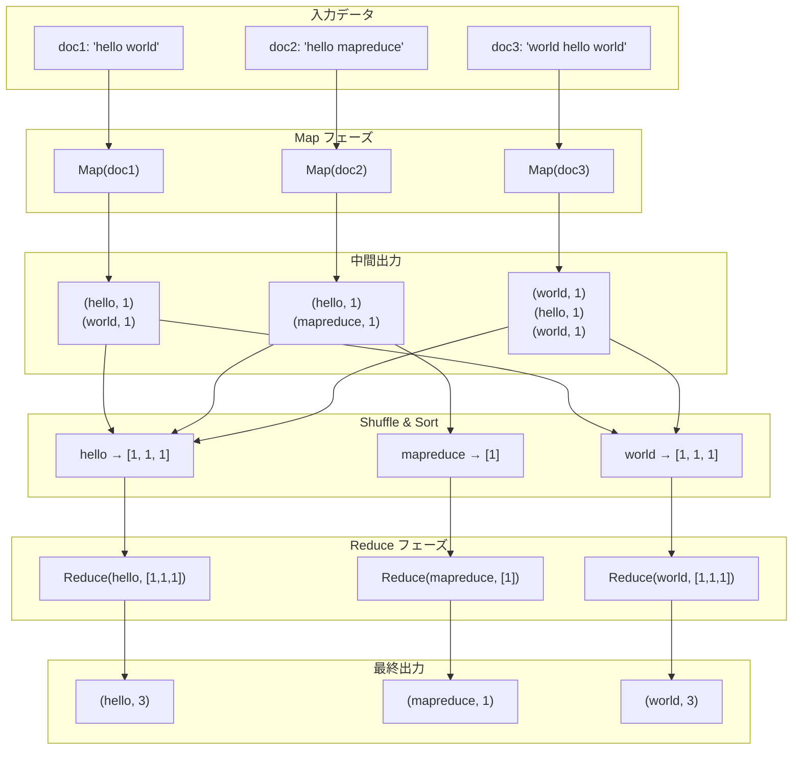

### 2.5 多様な応用例

MapReduce のプログラミングモデルは、Word Count 以外にも驚くほど多様な計算に適用できる。

| 応用例 | Map 関数の出力 | Reduce 関数の処理 |
|---|---|---|
| 分散grep | マッチする行を `(行番号, 行内容)` として出力 | そのまま出力（恒等Reduce） |
| URL アクセス頻度 | `(URL, 1)` を出力 | 同一URLのカウントを合計 |
| 転置インデックス | `(単語, 文書ID)` を出力 | 同一単語の文書IDリストを生成 |
| Web リンクグラフ | `(リンク先URL, ソースURL)` を出力 | 各URLへの被リンク一覧を生成 |
| 分散ソート | `(ソートキー, レコード)` を出力 | そのまま出力（Partitionerでソートを実現） |

この汎用性こそが MapReduce の強みであり、一つの抽象化で多種多様なデータ処理をカバーできるという設計の優雅さを示している。

## 3. 実行フロー

MapReduce フレームワークは、ユーザーが定義した Map 関数と Reduce 関数を受け取り、以下のフローで分散実行する。

### 3.1 全体アーキテクチャ

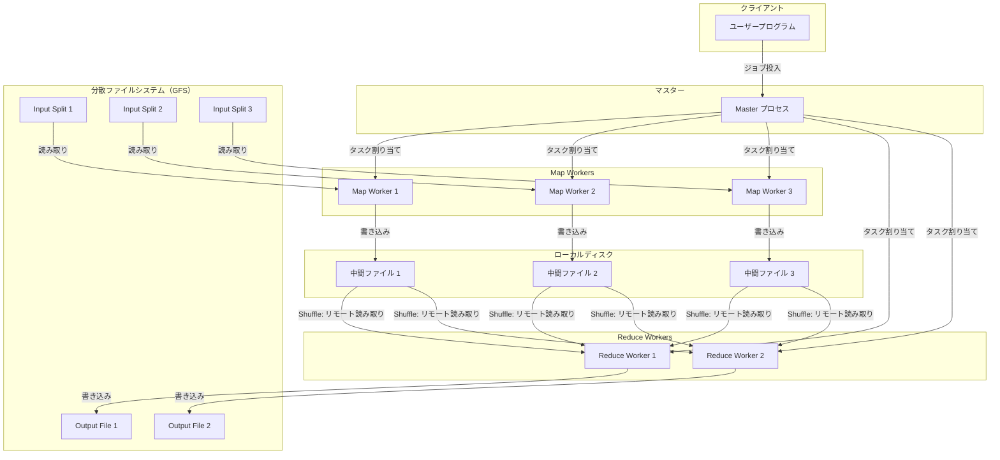

MapReduce の実行は Master/Worker アーキテクチャに基づく。1つの Master プロセスがジョブ全体を管理し、複数の Worker プロセスが実際のMap/Reduce タスクを実行する。

### 3.2 Split（入力分割）

MapReduce の実行は、入力データの分割から始まる。入力データ（通常は分散ファイルシステム上のファイル）は、複数の**入力スプリット（Input Split）** に分割される。Google のオリジナル実装では、GFS（Google File System）上のファイルを64MBのブロック単位で分割していた。

各スプリットは1つの Map タスクに対応する。スプリット数が Map タスクの並列度を決定するため、スプリットサイズの選択はパフォーマンスに直結する。

- **スプリットが小さすぎる場合**: タスクのスケジューリングオーバーヘッドが大きくなる
- **スプリットが大きすぎる場合**: 並列度が下がり、特定のワーカーへの負荷が偏る

一般的には、分散ファイルシステムのブロックサイズ（64MB〜128MB程度）をスプリットサイズとすることで、データのローカリティを最大限に活用できる。Master はスプリットの格納場所を考慮して、データが存在するマシン、あるいは同一ラック内のマシンに Map タスクを割り当てる。これにより、ネットワーク越しのデータ転送を最小化する。

### 3.3 Map フェーズ

Map Worker は割り当てられたスプリットを読み込み、入力フォーマットに従ってキーと値のペアを生成する。たとえばテキストファイルの場合、行オフセットをキーに、行内容を値にするのが一般的である。

各入力ペアに対してユーザーの Map 関数が呼び出され、中間キーと値のペアが生成される。生成された中間ペアはメモリ上のバッファに蓄積される。バッファが一定サイズに達すると、Partitioner 関数（後述）によって Reduce タスクごとにパーティショニングされ、Map Worker のローカルディスクに書き出される。

### 3.4 Shuffle/Sort フェーズ

Shuffle/Sort は MapReduce の中でもっとも複雑かつ性能に影響するフェーズである。このフェーズの役割は、すべての Map タスクの出力から、各 Reduce タスクが処理すべきデータを正しく集約することである。

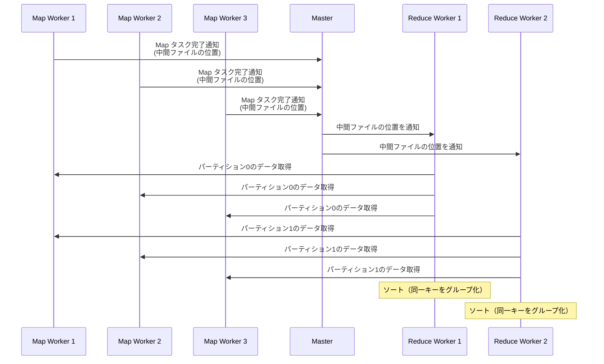

Shuffle/Sort の詳細なステップは以下の通りである。

1. **パーティショニング**: Map フェーズの終了時に、各中間ペアは Partitioner 関数（デフォルトでは `hash(key) mod R`、`R` は Reduce タスク数）によってパーティションに分類される。同じキーは必ず同じパーティション（＝同じ Reduce タスク）に送られることが保証される

2. **Map 側のローカルソート**: 各パーティション内で、中間ペアがキーの順でソートされる。これにより、後続のマージ処理が効率化される

3. **データ転送（Shuffle）**: Reduce Worker は、すべての Map Worker から自分のパーティションに対応するデータをHTTP経由で取得する。Master が各 Map タスクの中間ファイルの位置を管理しており、Reduce Worker に通知する

4. **マージソート**: Reduce Worker は取得した複数の中間ファイルをマージソートし、キーの順序で統合する。これにより、同一キーのすべての値が連続して並ぶ

このフェーズがネットワーク帯域の主要な消費者であり、MapReduce ジョブの総実行時間の大きな割合を占める。

### 3.5 Reduce フェーズ

ソート済みの中間データに対して、Reduce Worker はキーの順にグループ化しながらユーザーの Reduce 関数を呼び出す。同一のキーに対するすべての値がイテレータとして Reduce 関数に渡される。

Reduce 関数の出力は、最終的な出力ファイルとして分散ファイルシステムに書き込まれる。各 Reduce タスクが1つの出力ファイルを生成するため、Reduce タスク数 `R` 個の出力ファイルが最終結果となる。

### 3.6 Output（出力）

Reduce フェーズが完了すると、`R` 個の出力ファイルが分散ファイルシステム上に生成される。これらのファイルは通常そのまま別の MapReduce ジョブの入力として使用されるか、あるいは最終結果として利用される。

出力ファイルをマージして1つのファイルにする必要は通常ない。むしろ、複数ファイルに分かれていることで、次のパイプラインステージで並列に読み込むことができるため、分散処理との親和性が高い。

## 4. 障害耐性

MapReduce が大規模クラスタで実用的に機能するためには、障害耐性（fault tolerance）が不可欠である。数千台のマシンから構成されるクラスタでは、ハードウェア障害は例外ではなく日常である。Google の論文によれば、1,800台のマシンで構成されたクラスタでは、MapReduce ジョブの実行中に複数台のマシンが障害を起こすことは珍しくなかった。

### 4.1 Worker 障害

Master は、各 Worker に対して定期的にハートビート（heartbeat）を送信し、応答がないWorker を障害と判定する。

**Map Worker の障害**:

障害が発生した Map Worker 上で実行中だったタスク、および既に完了していたタスクは、すべて**再実行の対象**となる。完了済みのタスクまで再実行する理由は、Map の出力が Worker のローカルディスクに保存されているため、Worker の障害によりアクセス不能になるからである。再実行は別の正常な Worker 上で行われる。

Map タスクが再実行された場合、その出力を読み取る必要がある Reduce Worker にも通知が行われ、まだ読み取りが完了していないデータは新しい Worker から取得される。

**Reduce Worker の障害**:

実行中のタスクのみが再実行の対象となる。完了済みの Reduce タスクは再実行する必要がない。これは、Reduce の出力が分散ファイルシステム（GFS）に書き込まれており、Worker の障害とは独立にアクセス可能だからである。

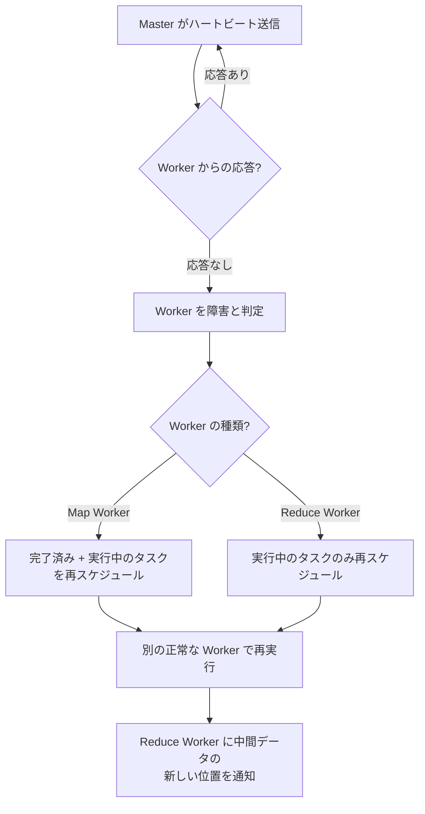

### 4.2 Master 障害

Google のオリジナル論文では、Master 障害への対処は比較的シンプルに扱われていた。Master は単一のプロセスであり、障害が発生した場合は MapReduce ジョブ全体が中止される。クライアントは必要に応じてジョブを再投入する。

論文では、Master の状態を定期的にチェックポイントとして保存し、障害から復旧する方式も言及されているが、Master 障害は稀なイベントであるため、ジョブの再実行で対応することが実用上は十分であるとされている。

::: tip 冪等性の重要性
MapReduce の障害耐性は、Map 関数と Reduce 関数が**決定的（deterministic）** であることに依存している。同じ入力に対して同じ出力を返す関数であれば、タスクを何度再実行しても最終結果は変わらない。これはアトミックなコミットの仕組みによっても保証されており、タスクの出力はすべての処理が完了した後にアトミックにリネームされる。
:::

### 4.3 セマンティクスの保証

MapReduce は、Map 関数と Reduce 関数が決定的である場合、障害が発生しても障害なしで逐次実行した場合と**同一の結果**を保証する。この保証は以下の仕組みによって実現されている。

- **Map タスクの出力のアトミックコミット**: Map タスクが完了すると、Worker は Master にファイル名を報告する。Master はすでに完了したタスクの報告を無視することで、重複実行による問題を防ぐ
- **Reduce タスクの出力のアトミックリネーム**: Reduce タスクは一時ファイルに出力を書き込み、完了時にアトミックリネームで最終出力ファイルに置き換える。基盤となるファイルシステムのアトミックリネームがこの正確性を保証する

非決定的な Map/Reduce 関数の場合（たとえば乱数を使う場合）、MapReduce はより弱い保証を提供する。具体的には、各 Reduce タスクの出力は、非決定的な逐次実行のいずれかの結果と一致するが、異なる Reduce タスク間で一貫した実行からの結果であるとは限らない。

## 5. 最適化技術

基本的な MapReduce の実行フローに加えて、パフォーマンスを大幅に向上させるためのいくつかの重要な最適化技術が存在する。

### 5.1 Combiner

Combiner は、Map フェーズの出力に対してローカルに集約を行う仕組みである。MapReduce の最大のボトルネックの一つはShuffle フェーズにおけるネットワーク転送であるが、Combiner を使用することで転送すべきデータ量を大幅に削減できる。

Word Count の例で考えてみよう。Map 関数が `(hello, 1)` を1,000回出力した場合、Combiner なしではこの1,000個のペアがネットワークを経由して Reduce Worker に送られる。しかし Combiner を適用すれば、Map Worker 上で事前に集約され、`(hello, 1000)` という1つのペアだけが転送される。

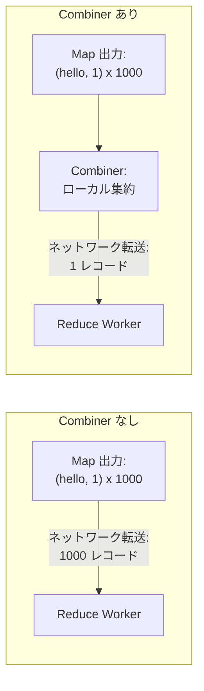

Combiner 関数は多くの場合、Reduce 関数と同一のロジックで実装できる。ただし、Combiner を適用できるのは Reduce 関数が**結合的（associative）** かつ**可換（commutative）** である場合に限られる。たとえば合計や最大値の計算は Combiner に適しているが、平均値の計算はそのままでは Combiner に適さない（合計と件数を別々に管理する必要がある）。

::: warning Combiner は最適化であり保証ではない
Combiner はフレームワークによって0回、1回、あるいは複数回適用される可能性がある。したがって、Combiner の適用有無によって最終結果が変わるような実装はバグとなる。Combiner はあくまでも性能の最適化であり、正確性に影響を与えてはならない。
:::

### 5.2 Partitioner

Partitioner は、Map フェーズの出力をどの Reduce タスクに送るかを決定する関数である。デフォルトの Partitioner はハッシュベースのパーティショニング（`hash(key) mod R`）を使用するが、ユーザーはカスタム Partitioner を定義して、データの分布に応じた最適な振り分けを行うことができる。

カスタム Partitioner が有用な典型的な例は、URL の処理である。URL をキーとする処理で、同じホスト名に属するURLを同一の Reduce タスクで処理したい場合、次のような Partitioner を定義する。

```python
def partition(key, num_reduce_tasks):
    # Group URLs by hostname
    hostname = extract_hostname(key)
    return hash(hostname) % num_reduce_tasks
```

Partitioner の設計が適切でないと、特定の Reduce タスクに処理が集中する**データスキュー（data skew）** が発生し、全体の処理時間が大幅に延びる。たとえば、キーの分布が偏っている場合（Zipf の法則に従う自然言語データなど）、単純なハッシュパーティショニングではホットキーの問題が生じうる。

### 5.3 Speculative Execution（投機的実行）

大規模クラスタでは、特定のマシンが何らかの理由（ディスクの劣化、メモリ不足、ネットワークの問題など）で通常より遅く動作することがある。MapReduce ジョブ全体の完了時間は最も遅いタスクによって律速されるため、このような**ストラグラー（straggler）** が全体の性能を大きく損なう。

Speculative Execution は、この問題に対処するための仕組みである。MapReduce ジョブの終盤において、まだ完了していないタスクのバックアップ実行を別の Worker で開始する。オリジナルのタスクとバックアップのうち、先に完了した方の結果を採用する。

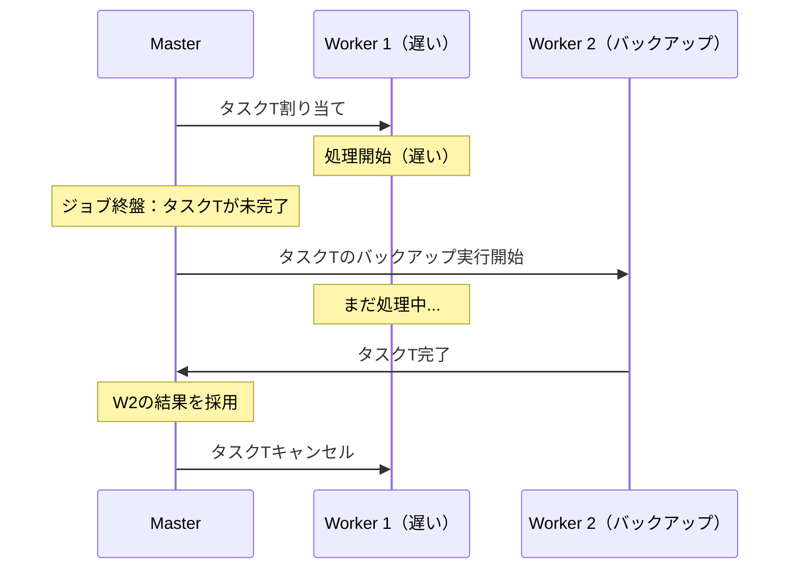

Google の論文によれば、Speculative Execution を無効にした場合、大規模なソートジョブの実行時間が44%増加したと報告されている。これは、ストラグラーの問題がいかに深刻であるかを示している。

### 5.4 データのローカリティ

MapReduce は、ネットワーク帯域が比較的貴重なリソースであるという前提に基づいて設計されている。このため、可能な限りデータが存在するマシン上で計算を行い、ネットワーク転送を最小化する**データローカリティ**の最適化を積極的に行う。

Master は GFS から入力データのレプリカの位置情報を取得し、以下の優先順位で Map タスクをスケジューリングする。

1. **ノードローカル（node-local）**: データが存在するマシン上で Map タスクを実行する（ネットワーク転送なし）
2. **ラックローカル（rack-local）**: データが存在するマシンと同じネットワークラック内のマシンで実行する（ラック内のネットワーク転送のみ）
3. **オフラック（off-rack）**: 上記が不可能な場合、任意のマシンで実行する（ラック間のネットワーク転送が発生）

Google の報告によれば、大規模な MapReduce ジョブにおいて、Map タスクの入力データの大部分がローカルディスクから読み取られていた。

### 5.5 その他の最適化

**スキップ不良レコード（Skipping Bad Records）**: 特定の入力レコードでMap/Reduce関数がクラッシュする場合、そのレコードをスキップして処理を継続するオプションが用意されている。大規模データ処理では、わずかなデータの欠損よりも処理全体の完了が重要となる場合が多い。

**カウンターの仕組み**: MapReduce フレームワークは、ジョブの実行中にユーザー定義のカウンターを集計する仕組みを提供している。たとえば処理レコード数、エラー数、特定条件を満たすレコード数などを監視するために使用される。

**入出力フォーマットの拡張性**: テキストファイル以外にも、バイナリ形式やデータベースなど、カスタムの入出力フォーマットをプラグイン的に利用できる設計となっている。

## 6. Hadoop MapReduce の実装

### 6.1 Apache Hadoop の誕生

Google の MapReduce 論文と GFS 論文に触発され、Doug Cutting と Mike Cafarella は2005年頃からオープンソースでの実装に着手した。これが **Apache Hadoop** の始まりである。当初は Yahoo! の検索インデックス構築のための分散処理基盤として開発され、後に Apache Software Foundation のトップレベルプロジェクトとなった。

Hadoop は2つの主要コンポーネントから構成される。

- **HDFS（Hadoop Distributed File System）**: Google の GFS に相当する分散ファイルシステム
- **Hadoop MapReduce**: Google の MapReduce に相当する分散処理フレームワーク

Hadoop の登場は、大規模データ処理の民主化において決定的な役割を果たした。それまでは Google のような巨大企業だけが利用可能だった分散処理技術が、オープンソースとして誰でも利用可能になったのである。

### 6.2 HDFS のアーキテクチャ

HDFS は、MapReduce の基盤となる分散ファイルシステムである。GFS と同様のアーキテクチャを採用しており、Master/Slave 構成で動作する。

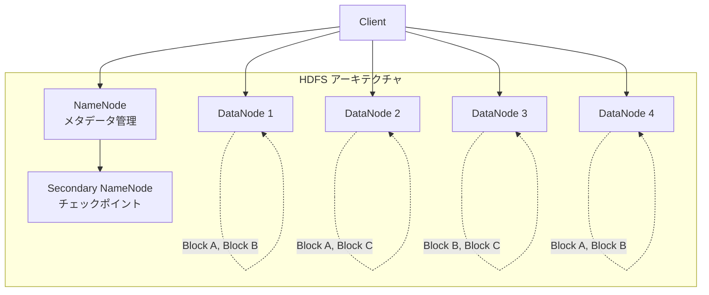

- **NameNode**: ファイルシステムのメタデータ（ファイル名、ディレクトリ構造、ブロックの配置情報）を管理するマスターサーバー
- **DataNode**: 実際のデータブロックを格納するワーカーサーバー。各ブロックはデフォルトで3つのレプリカが異なる DataNode に保存される

HDFS のデフォルトブロックサイズは128MB（初期は64MB）であり、これは従来のファイルシステムのブロックサイズ（4KB〜64KB）と比較して桁違いに大きい。これは、大規模なシーケンシャルリードに最適化し、かつ NameNode が管理するメタデータ量を抑制するための設計判断である。

### 6.3 Hadoop MapReduce の実行モデル

Hadoop MapReduce の実行モデルは、世代によって異なるアーキテクチャを採用している。

**MRv1（Hadoop 1.x）** では、MapReduce 専用のリソース管理機構を持っていた。

- **JobTracker**: ジョブのスケジューリングとリソース管理を行う単一のマスターデーモン
- **TaskTracker**: 各ノード上で Map/Reduce タスクを実行するワーカーデーモン

**MRv2 / YARN（Hadoop 2.x以降）** では、リソース管理と計算フレームワークが分離された。

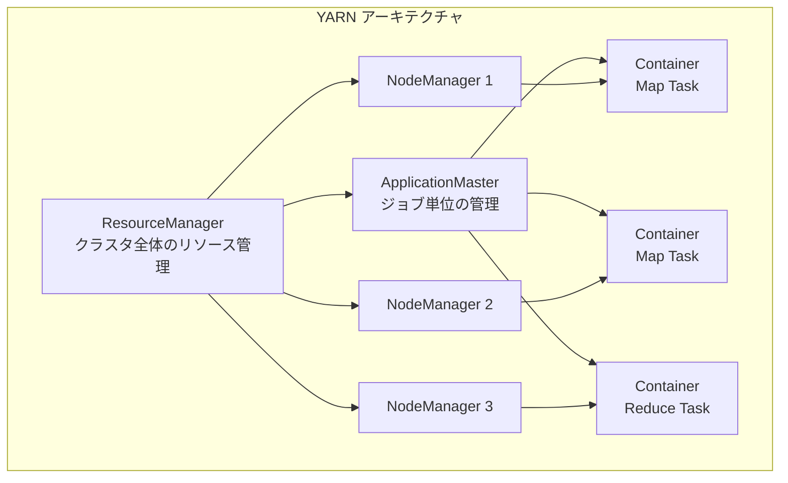

- **ResourceManager**: クラスタ全体のリソース（CPU、メモリ）を管理する。MapReduce に限らず、任意の分散アプリケーションのリソース管理が可能
- **NodeManager**: 各ノード上でコンテナ（計算リソースの単位）を管理するデーモン
- **ApplicationMaster**: 各 MapReduce ジョブに1つ生成され、ジョブ内のタスクのスケジューリングと監視を行う

YARN の導入により、Hadoop クラスタ上で MapReduce 以外の計算フレームワーク（Spark、Tez など）も並行して実行できるようになった。

### 6.4 Hadoop エコシステム

Hadoop を中心として、大規模データ処理のためのエコシステムが形成された。

| ツール | 役割 |
|---|---|
| **Hive** | SQL ライクなクエリ言語（HiveQL）で MapReduce ジョブを記述 |
| **Pig** | データフロー言語（Pig Latin）で複雑な ETL パイプラインを記述 |
| **HBase** | HDFS 上のカラム指向 NoSQL データベース |
| **ZooKeeper** | 分散アプリケーションの協調サービス |
| **Oozie** | MapReduce ジョブのワークフロースケジューラ |
| **Sqoop** | RDBMS と HDFS 間のデータ転送 |
| **Flume** | ログデータの収集と集約 |

このエコシステムの形成により、Hadoop は単なる MapReduce の実装ではなく、データ処理プラットフォーム全体を指す言葉となった。

## 7. MapReduce の限界

MapReduce は画期的なフレームワークであったが、利用が広がるにつれてその限界も明らかになっていった。

### 7.1 反復処理の非効率性

MapReduce の最も深刻な限界の一つは、**反復的なアルゴリズム**に対する非効率性である。機械学習の勾配降下法やグラフアルゴリズムの PageRank 計算のように、同じデータセットに対して繰り返し処理を行うユースケースでは、MapReduce は極めて非効率になる。

その理由は、MapReduce の各ジョブが独立しており、ジョブ間でデータを共有する仕組みがないことにある。反復処理の各ステップは個別の MapReduce ジョブとして実行され、各ジョブの入出力はすべてディスク（HDFS）を経由する。

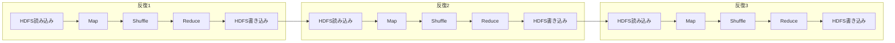

たとえば PageRank を10回の反復で計算する場合、10個の MapReduce ジョブが逐次実行され、毎回のジョブで以下のオーバーヘッドが発生する。

- HDFS への書き込みとレプリケーション（3重複製）
- HDFS からの読み込み
- ジョブの初期化とスケジューリング
- Shuffle によるネットワーク転送

各反復で変化するデータは全体のごく一部であるにもかかわらず、データセット全体を毎回ディスクに読み書きするため、膨大な I/O が無駄に発生する。

### 7.2 リアルタイム性の欠如

MapReduce はバッチ処理モデルであり、すべての入力データが揃った状態で処理を開始し、すべての処理が完了するまで結果が得られない。このため、リアルタイムに近い低レイテンシの処理には本質的に不向きである。

MapReduce ジョブの起動自体にも数十秒のオーバーヘッドがあり、小規模なデータの処理であっても分単位の遅延が生じる。ストリーミングデータの処理（たとえばクリックストリームのリアルタイム分析やセンサーデータの異常検知）は、MapReduce の設計思想の範囲外である。

### 7.3 DAG 実行の不自由さ

MapReduce のプログラミングモデルは Map と Reduce の2段階の固定構造であり、複雑なデータ処理パイプラインを表現するには複数の MapReduce ジョブを連鎖させる必要がある。

たとえば、典型的なETLパイプラインでは以下のような処理ステップが必要になる。

1. データのクレンジングとフィルタリング
2. 複数データソースの結合（Join）
3. 集約処理
4. 結果のフォーマット変換

MapReduce でこれを実装すると、各ステップが個別の MapReduce ジョブとなり、中間結果は毎回 HDFS に書き出される。本来は DAG（Directed Acyclic Graph）として表現すれば、中間データをパイプラインで直接渡せるステップも、すべてディスクを経由することになる。

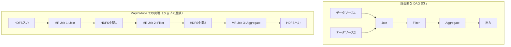

### 7.4 プログラミングモデルの硬直性

Map と Reduce の2つの関数だけでは表現しにくい処理パターンが多数存在する。

- **Join 操作**: 2つのデータセットの結合は MapReduce で実現可能だが、非常に煩雑なコードになる（Reduce-side Join や Map-side Join の手動実装が必要）
- **複数の入力/出力**: 複数の入力ソースを扱ったり、複数の形式で出力したりするには追加のコードが必要
- **ウィンドウ処理**: 時系列データに対するスライディングウィンドウ処理は、MapReduce では自然に表現できない

### 7.5 高レイテンシのジョブ起動

MapReduce ジョブは JVM の起動、クラスのロード、入力スプリットの計算、タスクのスケジューリングなど、実際の計算処理の前に多くの初期化処理が必要である。このため、ジョブの起動に数十秒から数分かかることがあり、小規模なデータ処理やインタラクティブな分析には不向きである。

## 8. 後継技術との比較

MapReduce の限界を克服するために、いくつかの重要な後継技術が登場した。

### 8.1 Apache Spark

Apache Spark は2009年にUC BerkeleyのAMPLabで開発され、MapReduce の最も成功した後継者となった。Spark の核心的なイノベーションは **RDD（Resilient Distributed Dataset）** という抽象化である。

RDDは、分散されたイミュータブルなデータコレクションであり、メモリ上にキャッシュすることができる。これにより、反復処理において毎回ディスクを経由する必要がなくなり、劇的な性能向上が実現された。

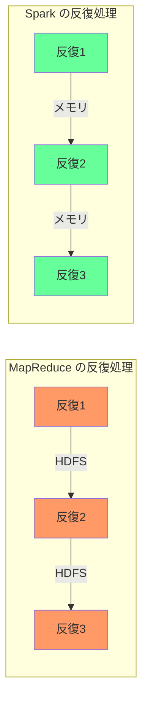

Spark が MapReduce に対して優れている主要な点は以下の通りである。

| 特性 | MapReduce | Spark |
|---|---|---|
| 中間データの扱い | ディスク（HDFS） | メモリ（キャッシュ可能） |
| プログラミングモデル | Map + Reduce の2段階 | 豊富な変換（map, filter, join, groupBy等） |
| 実行モデル | ジョブ単位 | DAG 全体を最適化 |
| 反復処理の性能 | 各反復でディスクI/O | メモリ上のデータを再利用 |
| レイテンシ | 高い（ジョブ起動コスト） | 低い（常駐プロセス） |
| API | Java 中心 | Scala, Java, Python, R, SQL |

Spark は論文によれば、特定のワークロード（反復的な機械学習アルゴリズムなど）では MapReduce の**10倍から100倍**の性能を達成したとされている。ただし、大量のデータを1回だけスキャンするような単純なバッチ処理では、性能差はそれほど大きくない。

### 8.2 Apache Tez

Apache Tez は、Hadoop エコシステム内で MapReduce を置き換えることを目的として開発された汎用 DAG 実行エンジンである。Hortonworks 社が中心となって開発し、Hive や Pig のバックエンドとして利用されている。

Tez の主要な特徴は以下の通りである。

- **汎用 DAG 実行**: Map と Reduce の固定構造ではなく、任意の DAG として処理パイプラインを表現できる
- **中間データの効率的な転送**: 不要なディスク書き込みを削減し、パイプライン的にデータを転送できる
- **YARN との密接な統合**: Hadoop の YARN 上でネイティブに動作し、既存の Hadoop インフラストラクチャをそのまま活用できる
- **コンテナの再利用**: JVM の起動コストを削減するため、タスク間でコンテナを再利用する

Tez は、既存の Hive クエリの実行速度を MapReduce バックエンドと比較して数倍から数十倍改善した事例が報告されている。

### 8.3 Apache Flink

Apache Flink は、ストリーム処理を第一級の概念として設計されたフレームワークである。Flink の核心的な設計思想は「バッチはストリームの特殊なケースである」という考え方であり、ストリーム処理エンジンの上にバッチ処理を構築している。


Flink が MapReduce に対して根本的に異なる点は以下の通りである。

- **真のストリーム処理**: レコードが到着次第、即座に処理が開始される（MapReduceのようにすべてのデータが揃うのを待たない）
- **イベントタイムセマンティクス**: データ生成時刻に基づいた処理が可能であり、遅延データにも対応できる
- **Exactly-Once セマンティクス**: チェックポイントメカニズムにより、障害発生時にもExactly-Onceの処理保証を提供する
- **低レイテンシ**: ミリ秒オーダーのレイテンシでの処理が可能

### 8.4 後継技術の位置づけ

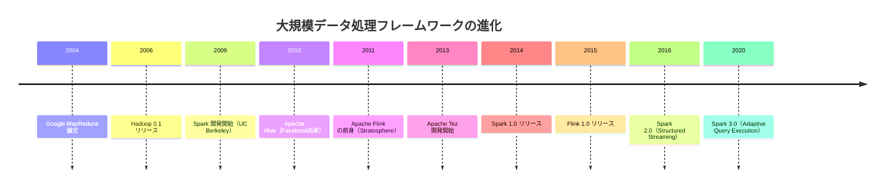

## 9. MapReduce の遺産と現代への影響

### 9.1 分散処理の民主化

MapReduce の最大の功績は、大規模分散処理を**一般的なエンジニアが利用可能な技術**にしたことである。それ以前の分散処理は、MPI（Message Passing Interface）のような低レベルの並列プログラミングモデルに基づいており、高度な専門知識が必要であった。

MapReduce は、プログラマに対して「Map 関数と Reduce 関数を書けばよい」という極めてシンプルなインターフェースを提供することで、分散処理のエントリーバリアを劇的に下げた。この設計哲学は、その後のすべての分散処理フレームワークに継承されている。

### 9.2 「データは移動させず、計算を持っていく」

MapReduce が確立した重要な設計原則の一つが **「データは移動させず、計算を持っていく（Moving computation to data, not data to computation）」** という考え方である。

大規模データ処理において、テラバイト規模のデータをネットワーク経由で移動させることは現実的ではない。代わりに、データが存在するマシン上でコンピュテーションを実行し、ネットワーク転送を最小限にするという発想は、MapReduce 以降のほぼすべての分散処理システムに影響を与えている。

### 9.3 障害を前提とした設計

MapReduce のもう一つの重要な貢献は、**障害を例外ではなく常態として設計する**というアプローチを広めたことである。数千台のコモディティハードウェアから構成されるクラスタでは、マシン障害は日常的に発生する。MapReduce は、障害からの自動回復をフレームワークのレベルで提供することで、エンジニアが障害処理のコードを書く必要をなくした。

この設計哲学は、その後のクラウドネイティブアーキテクチャ、マイクロサービス、Kubernetes などに受け継がれている。

### 9.4 データ指向のコンピューティングへの転換

MapReduce 論文以前のコンピューティングは、主に**計算中心**の考え方に基づいていた。すなわち、高性能なマシンで効率的なアルゴリズムを実行するという発想である。MapReduce は、これを**データ中心**の考え方に転換した。すなわち、大量のデータを大量のコモディティマシンで処理するという発想である。

この転換は「ビッグデータ」時代の幕開けと密接に関連している。MapReduce の論文は、データの量そのものが価値を持つという認識を広め、その後のデータサイエンス、機械学習、AI の爆発的な発展の基盤を築いた。

### 9.5 Map と Reduce の抽象化の普遍性

MapReduce が提示した「Map（変換）→ Shuffle（再分配）→ Reduce（集約）」というパターンは、後継のフレームワークでも形を変えて生き続けている。

- **Spark** の `map`, `reduceByKey`, `groupByKey` は MapReduce の直接的な後継
- **Flink** の `map`, `keyBy`, `reduce` も同じパターンを踏襲
- **SQL** の `SELECT ... GROUP BY ... HAVING` は本質的に Map + Shuffle + Reduce と等価
- **Pandas** や **dplyr** の `group_by` + `summarize` も同じ抽象化に基づく

つまり MapReduce のプログラミングモデルは、特定のフレームワークの消長を超えて、**データ処理の基本的な思考パターン**として定着している。

### 9.6 現代における MapReduce の位置づけ

2026年現在、Google 社内では MapReduce は既に非推奨となり、後継システムに置き換えられている。Hadoop MapReduce も、Spark に主役の座を譲って久しい。しかし、MapReduce の設計思想は現代のデータ処理の隅々にまで浸透している。

MapReduce が現代のエンジニアにとって重要である理由は、その実装を使うためではなく、**分散データ処理の基本原理を理解するため**である。スプリット、シャッフル、パーティショニング、障害耐性、データローカリティ、投機的実行――これらの概念は、Spark を使おうと Flink を使おうと、大規模データ処理に携わる上で理解しておくべき基礎知識である。

MapReduce は、分散コンピューティングの歴史において、それ以前とそれ以後を分ける分水嶺であった。その技術的貢献だけでなく、「複雑な問題を美しい抽象化で解決する」というコンピューターサイエンスの理想を体現した点において、永続的な価値を持つ研究成果である。
