# メモリアロケータ

## 1. メモリアロケータの役割 — なぜ OS のページ単位割り当てだけでは不十分なのか

### 1.1 カーネルが提供するメモリ管理インターフェース

現代のオペレーティングシステムは**仮想メモリ**を通じてプロセスごとに独立したアドレス空間を提供する。カーネルはメモリをページ（通常 4 KiB）単位で管理しており、ユーザー空間に対してもページ単位のインターフェースを提供する。Linux であれば `brk`/`sbrk` でヒープ領域を伸縮させるか、`mmap` で新たな仮想メモリ領域を確保するかの二択になる。

```c
// Kernel-level allocation: always page-aligned, page-sized
void *p = mmap(NULL, 4096, PROT_READ | PROT_WRITE,
               MAP_PRIVATE | MAP_ANONYMOUS, -1, 0);
```

しかし、実際のアプリケーションが必要とするメモリサイズは極めて多様である。Web サーバーが HTTP リクエストを処理する際には数十バイトの文字列バッファから数メガバイトのレスポンスボディまで、さまざまなサイズの割り当てが短い時間内に大量に発生する。ページ単位でこれらを管理すると、16 バイトの確保に 4 KiB を消費するという途方もない無駄が生じる。

### 1.2 ユーザー空間アロケータの必要性

この問題を解決するのが**ユーザー空間メモリアロケータ（user-space memory allocator）** である。アロケータはカーネルから大きな単位でメモリを取得し、それをアプリケーションの要求サイズに合わせて細分化して提供する。C 言語の `malloc`/`free`、C++ の `new`/`delete` の裏側では、このアロケータが動作している。

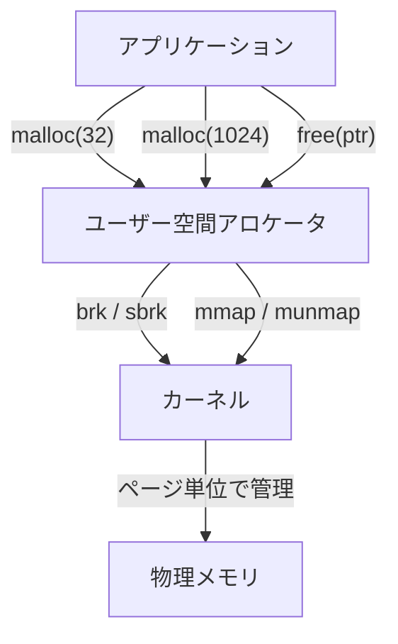

アロケータに求められる要件は主に以下の4つである。

| 要件 | 説明 |
|------|------|
| **速度** | `malloc`/`free` は極めて高頻度に呼ばれるため、1回あたりのオーバーヘッドは数十ナノ秒以下に抑えたい |
| **空間効率** | 内部断片化（確保した領域の未使用部分）と外部断片化（小さな隙間の累積）を最小化する |
| **スケーラビリティ** | マルチスレッド環境でロック競合を最小化し、コア数に比例した性能を実現する |
| **堅牢性** | ダブルフリーやバッファオーバーフローの検出、セキュリティ対策を行う |

### 1.3 アロケータの歴史的変遷

メモリアロケータの設計は、コンピュータアーキテクチャの進化と密接に関連している。

```
1960年代  First-fit / Best-fit のフリーリスト管理
    ↓
1970年代  Buddy System の考案（Knuth, 1973）
    ↓
1980年代  Slab Allocator（SunOS / Solaris カーネル, Bonwick 1994）
    ↓
1990年代  dlmalloc（Doug Lea, 1996）— 汎用アロケータの標準形
    ↓
2000年代  ptmalloc2（glibc に採用）— マルチスレッド対応
           jemalloc（Jason Evans, 2006）— FreeBSD / Firefox
    ↓
2010年代  TCMalloc（Google, 2007〜）— スレッドキャッシュ重視
           mimalloc（Microsoft Research, 2019）— コンパクト設計
    ↓
2020年代  Scudo（Android / LLVM）— セキュリティ重視
           snmalloc（Microsoft Research）— メッセージパッシング型
```

この記事では、基盤となるアルゴリズム（buddy system, slab allocator）から、主要な実装（ptmalloc, jemalloc, mimalloc, TCMalloc）までを体系的に解説する。

## 2. Buddy System — 2のべき乗で分割するシンプルなアルゴリズム

### 2.1 基本原理

Buddy System は 1963 年に Harry Markowitz が提案し、1973 年に Donald Knuth が *The Art of Computer Programming* で体系化したメモリ管理アルゴリズムである。Linux カーネルのページフレームアロケータ（ゾーンアロケータ）の基盤として今日も広く使われている。

基本的なアイデアは極めてシンプルだ。メモリ全体を 2 のべき乗サイズのブロックとして管理し、要求に応じてブロックを半分に分割し、解放時に隣接する「バディ（相棒）」と結合する。

### 2.2 アルゴリズムの詳細

#### 割り当て

1. 要求サイズ `n` を 2 のべき乗に切り上げる（例: 12 → 16）
2. そのサイズのフリーブロックがあれば返す
3. なければ、より大きなブロックを半分に分割（split）して再帰的に探す

#### 解放

1. ブロックを解放する
2. バディブロック（アドレス的に隣接する同サイズのブロック）がフリーかチェック
3. フリーならバディと結合（coalesce）してより大きなブロックにする
4. 結合を再帰的に繰り返す


具体例で見てみよう。64 バイトのメモリプールから 8 バイトを確保する場合:

```
初期状態:
[            64B (free)              ]

ステップ1: 64B → 32B + 32B に分割
[    32B (free)    |    32B (free)    ]

ステップ2: 32B → 16B + 16B に分割
[16B (free)|16B (free)|    32B (free)    ]

ステップ3: 16B → 8B + 8B に分割
[8B(free)|8B(free)|16B (free)|    32B (free)    ]

ステップ4: 8B を割り当て
[8B(used)|8B(free)|16B (free)|    32B (free)    ]
```

### 2.3 バディの特定方法

Buddy System の美しい特徴は、バディのアドレスをビット演算一発で求められることである。ブロックサイズが `size` のとき、アドレス `addr` のバディは以下で求まる。

$$
\text{buddy\_addr} = \text{addr} \oplus \text{size}
$$

ここで $\oplus$ は XOR（排他的論理和）演算である。

```c
// Calculate buddy address using XOR
static inline uintptr_t buddy_of(uintptr_t addr, size_t order) {
    return addr ^ (1UL << order);
}
```

例えば、最小ブロックサイズが 8 バイトのとき:
- アドレス `0x0000` のサイズ 8 ブロックのバディは `0x0000 ^ 0x0008 = 0x0008`
- アドレス `0x0008` のサイズ 8 ブロックのバディは `0x0008 ^ 0x0008 = 0x0000`
- アドレス `0x0000` のサイズ 16 ブロックのバディは `0x0000 ^ 0x0010 = 0x0010`

### 2.4 データ構造

各オーダー（サイズクラス）ごとにフリーリストを持つのが典型的な実装である。

```c
#define MAX_ORDER 11  // up to 2^10 * PAGE_SIZE = 4 MiB

struct free_area {
    struct list_head free_list;
    unsigned long nr_free;
};

struct zone {
    struct free_area free_area[MAX_ORDER];
    // ...
};
```

Linux カーネルでは `MAX_ORDER` がデフォルトで 11 に設定されており、最大 $2^{10} \times 4\text{KiB} = 4\text{MiB}$ の連続ページを管理できる。

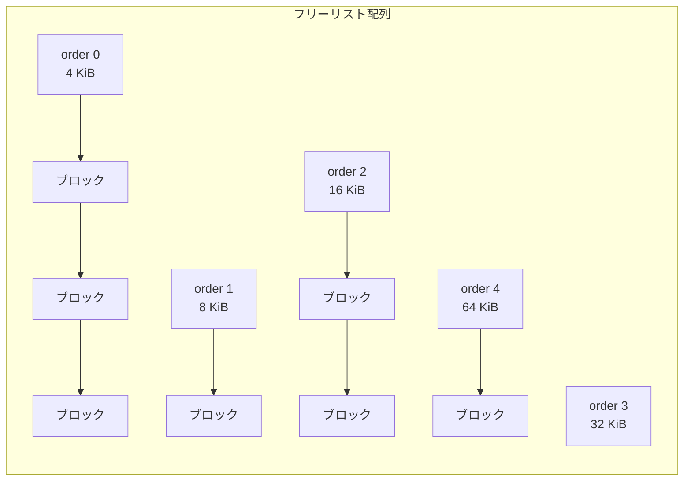

### 2.5 メリットとデメリット

**メリット:**

- 結合判定がビット演算で $O(1)$、割り当て・解放ともに最悪 $O(\log N)$ と高速
- 外部断片化が起きにくい（同サイズのブロックが必ず隣接し、結合可能）
- 実装がシンプル

**デメリット:**

- **内部断片化**が深刻になりやすい。例えば 33 バイトの要求に対して 64 バイトのブロックが割り当てられ、約 48% が無駄になる
- 小さな割り当てが大量に発生するユーザー空間アプリケーションには不向き

この内部断片化の問題を解決するために登場したのが、次に説明する Slab Allocator である。

## 3. Slab Allocator — カーネルオブジェクトの高速割り当て

### 3.1 Buddy System の限界と Slab の動機

Buddy System はページ単位の管理には優れているが、カーネル内部では `struct inode`（数百バイト）や `struct task_struct`（数キロバイト）といった固定サイズのオブジェクトが頻繁に割り当て・解放される。これらを buddy system で直接管理すると、内部断片化と初期化コストが深刻になる。

1994 年、Sun Microsystems の Jeff Bonwick が Solaris カーネル向けに **Slab Allocator** を設計した。その後 Linux カーネルにも採用され、現在も `SLAB`、`SLUB`（2007年〜、デフォルト）、`SLOB`（組み込み向け）の3つのバリアントが存在する。

### 3.2 基本設計

Slab Allocator の核心的なアイデアは、**同一型のオブジェクトを専用のキャッシュでプールする**ことである。

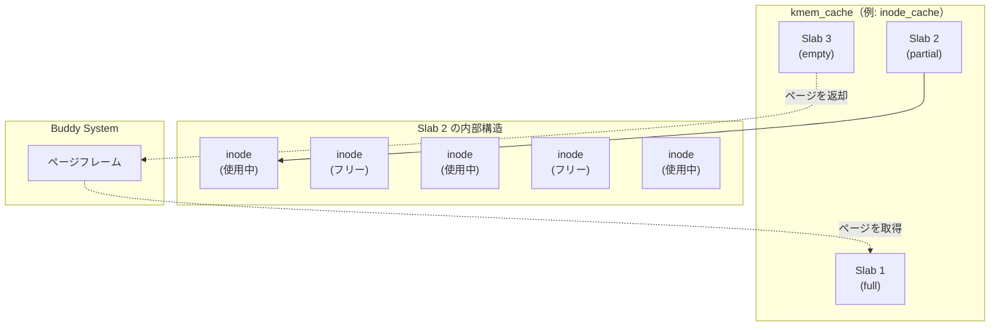

各構成要素の役割は以下の通りである。

| 構成要素 | 説明 |
|----------|------|
| **キャッシュ（kmem_cache）** | 特定の型（例: `inode`）専用のアロケータ。オブジェクトサイズ、アラインメント、コンストラクタ/デストラクタを保持 |
| **スラブ（slab）** | buddy system から取得した1つ以上の連続ページ。同一サイズのオブジェクトを格納する物理的な器 |
| **オブジェクト** | スラブ内に配置された個々のメモリブロック |

### 3.3 オブジェクトの状態管理

スラブ内のフリーオブジェクトは**フリーリスト**で管理される。古典的な SLAB 実装ではスラブのメタデータ領域にフリーリストの配列を持っていたが、SLUB 実装ではオブジェクト自体の先頭にフリーリストのポインタを埋め込む（フリーな間はオブジェクトの中身が不要であるため）。

```c
// SLUB: free object embeds the next pointer in the object itself
struct kmem_cache {
    struct kmem_cache_cpu __percpu *cpu_slab;  // per-CPU slab
    unsigned int size;          // object size including metadata
    unsigned int object_size;   // actual object size
    unsigned int offset;        // free pointer offset within object
    // ...
};
```

### 3.4 カラーリング（Coloring）

キャッシュラインの衝突を軽減するために、Slab Allocator は**カラーリング**という技法を使う。各スラブの先頭に異なるオフセット（色）を付けることで、同じキャッシュのオブジェクトが異なるキャッシュラインにマッピングされるようにする。

```
スラブ1: [color=0 ][obj][obj][obj][obj][unused]
スラブ2: [color=64][obj][obj][obj][obj][unused]
スラブ3: [color=128][obj][obj][obj][obj][unused]
```

これにより、複数のスラブから取得したオブジェクトが CPU キャッシュ上で同じセットを奪い合う確率が下がり、キャッシュ効率が向上する。

### 3.5 SLUB — Linux の現在のデフォルト

2007 年に Christoph Lameter が導入した SLUB（the Unqueued Slab Allocator）は、SLAB の複雑なキュー管理を簡素化した後継実装である。主な改善点は以下の通りだ。

- **Per-CPU フリーリスト**を導入し、大半の割り当てをロックフリーに
- スラブのメタデータをページ構造体（`struct page`）に統合し、メモリオーバーヘッドを削減
- キューの3段階管理（full/partial/empty）を廃止し、partial リストのみを維持

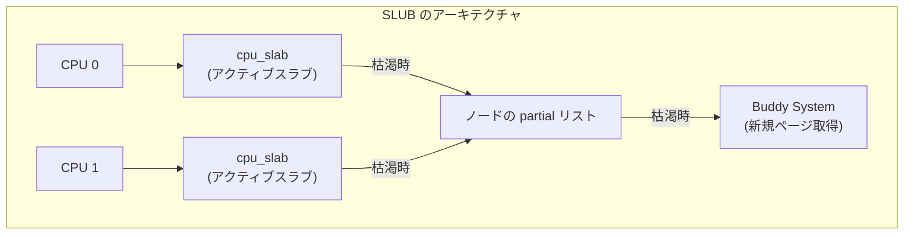

SLUB の割り当てパスは、最も高速なケースでは `cmpxchg` 命令1つで完了する。これは数ナノ秒のオーダーであり、`malloc` の内部で呼ばれるユーザー空間アロケータよりもさらに高速である。

## 4. glibc malloc (ptmalloc2) — 最も広く使われている汎用アロケータ

### 4.1 歴史と背景

C 標準ライブラリの `malloc`/`free` は仕様で定義されたインターフェースであり、その実装はプラットフォームによって異なる。Linux の標準 C ライブラリである glibc では、**ptmalloc2** が `malloc` の実装として使われている。

ptmalloc2 は Doug Lea が開発した **dlmalloc** をベースに、Wolfram Gloger がマルチスレッド対応を追加したものである。dlmalloc は 1996 年の発表以来、最も影響力のある汎用アロケータとして知られ、多くの後続アロケータの設計に影響を与えた。

### 4.2 チャンクの構造

ptmalloc2 ではメモリブロックを**チャンク（chunk）** と呼ぶ。各チャンクにはヘッダが付き、サイズ情報とフリーリストのリンクが格納される。

```
割り当て済みチャンク:
+----------------------------------+
| prev_size (前のチャンクがフリーの場合のみ有効) |  8 bytes
+----------------------------------+
| size        | A | M | P |        |  8 bytes (下位3ビットはフラグ)
+----------------------------------+
|                                  |
|         ユーザーデータ            |
|                                  |
+----------------------------------+

フリーチャンク:
+----------------------------------+
| prev_size                        |  8 bytes
+----------------------------------+
| size        | A | M | P |        |  8 bytes
+----------------------------------+
| fd (forward pointer)             |  8 bytes
+----------------------------------+
| bk (backward pointer)            |  8 bytes
+----------------------------------+
|         (未使用領域)              |
+----------------------------------+
```

フラグビットの意味は以下の通りである。

| ビット | 名前 | 意味 |
|--------|------|------|
| A | `NON_MAIN_ARENA` | メインアリーナ以外に所属するチャンク |
| M | `IS_MMAPPED` | `mmap` で確保されたチャンク |
| P | `PREV_INUSE` | 前のチャンクが使用中 |

`malloc` が返すポインタはユーザーデータの先頭を指す。つまり、チャンクヘッダのサイズ（64ビット環境で 16 バイト）が各割り当てのオーバーヘッドとなる。

### 4.3 ビンによるフリーチャンクの管理

フリーチャンクはサイズに応じて異なる**ビン（bin）** に格納される。ptmalloc2 には以下の4種類のビンがある。

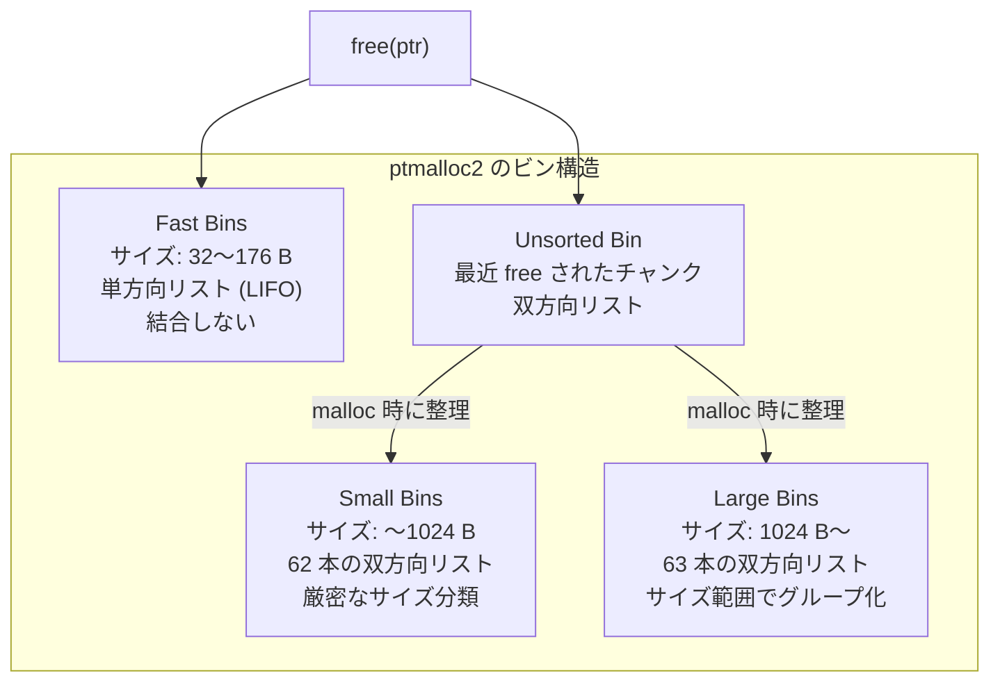

#### Fast Bins

小さなチャンク（デフォルトで 176 バイト以下）専用の高速キャッシュである。以下の特徴を持つ:

- **単方向リスト（LIFO）** で管理。`free` は先頭に追加、`malloc` は先頭から取得
- **隣接チャンクとの結合を行わない**。これにより `free` が非常に高速（ポインタの付け替え1回）
- サイズごとに独立したビンを持つ（16 バイト刻み）

```c
// Fast bin allocation (simplified)
void *malloc_fast(size_t size) {
    int idx = fastbin_index(size);
    mfastbinptr *fb = &fastbin(av, idx);
    mchunkptr victim = *fb;
    if (victim != NULL) {
        *fb = victim->fd;  // pop from singly-linked list
        return chunk2mem(victim);
    }
    // Fall through to small bin / unsorted bin path
}
```

#### Unsorted Bin

`free` されたチャンク（fast bin に入らないもの）は、まず unsorted bin に投入される。次の `malloc` 呼び出し時に unsorted bin を走査し、適切なサイズであればそのまま返し、そうでなければ対応する small bin / large bin に振り分ける。これは一種の**遅延分類（lazy sorting）** であり、連続する `malloc`/`free` パターンで同じチャンクが再利用される確率を高める。

#### Small Bins と Large Bins

Small bins は 1024 バイト以下のチャンクを 16 バイト刻みで 62 本の双方向リスト（FIFO）で管理する。各ビンには厳密に同一サイズのチャンクのみが格納されるため、検索は $O(1)$ である。

Large bins は 1024 バイトを超えるチャンクを管理する。各ビンには一定範囲のサイズのチャンクが格納され、サイズ降順にソートされる。best-fit でチャンクを選ぶため、検索には $O(\log N)$ 程度のコストがかかる。

### 4.4 アリーナ（Arena）とマルチスレッド対応

ptmalloc2 のマルチスレッド対応の核心は**アリーナ（arena）** である。アリーナはそれぞれ独立したビン群とヒープ領域を持つ。

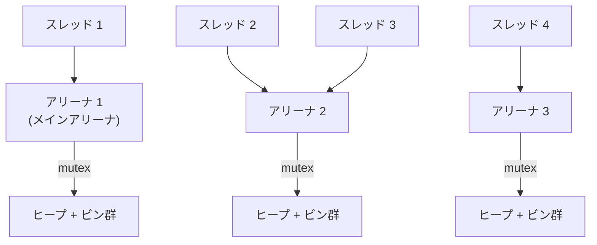

- **メインアリーナ**: `brk`/`sbrk` でヒープを伸縮する。プロセス起動時に1つ作られる
- **非メインアリーナ**: `mmap` で独立したヒープ領域を確保する。スレッド数に応じて動的に作られる

アリーナの数は CPU コア数の `8 * cores`（64ビット環境）に制限される。スレッドが `malloc` を呼ぶと、まず前回使用したアリーナの mutex を `trylock` し、取れなければ他のアリーナを試す。これにより、ロック競合を**緩和**する。

### 4.5 ptmalloc2 の問題点

ptmalloc2 は汎用性が高い一方で、いくつかの既知の問題を抱えている。

1. **アリーナ間でメモリを共有しない**: あるアリーナに大量のフリーチャンクがあっても、別のアリーナから利用できない。マルチスレッドアプリケーションでメモリ使用量が膨張する原因になる
2. **ロック競合**: アリーナ数が固定上限に達すると、複数スレッドが同じアリーナの mutex を取り合う
3. **false sharing**: 異なるスレッドが同じキャッシュラインに属するメモリを操作すると、CPU キャッシュの無効化が頻発する
4. **断片化**: 長時間稼働するサーバープロセスでは、メモリ断片化によって RSS（Resident Set Size）が増大する傾向がある

これらの問題を解決するために、jemalloc、TCMalloc、mimalloc といった代替アロケータが開発された。

## 5. jemalloc — FreeBSD とFirefox の高性能アロケータ

### 5.1 設計思想と歴史

**jemalloc** は 2005 年に Jason Evans が FreeBSD のデフォルトアロケータとして開発したもので、その名前は "Jason Evans' malloc" に由来する。その後 Facebook（現 Meta）が積極的に開発に関わり、大規模サーバーアプリケーション向けの最適化が進められた。Redis、Android Bionic（一時期）、Facebook の多くのサービスで採用されている。

jemalloc の設計哲学は以下の2点に集約される:

1. **断片化の最小化**: 長時間稼働するサーバープロセスで RSS の膨張を防ぐ
2. **マルチスレッドのスケーラビリティ**: ロック競合を可能な限り排除する

### 5.2 アーキテクチャの全体像

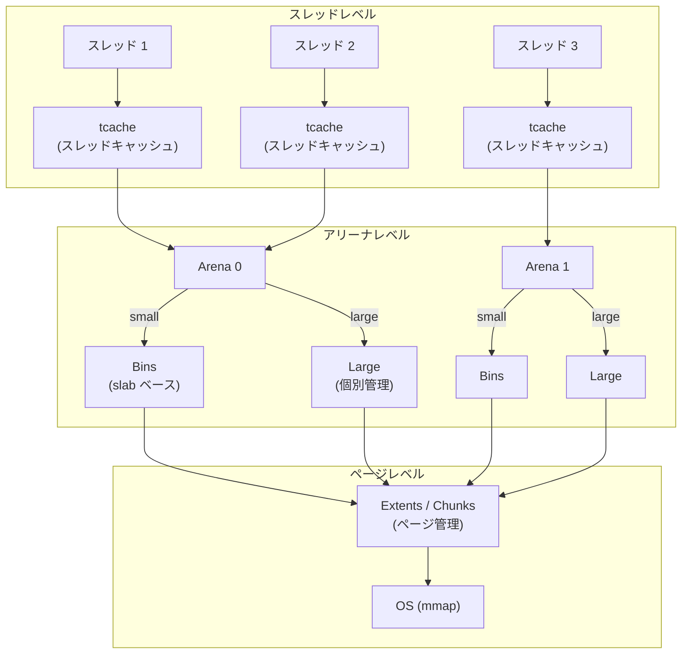

### 5.3 サイズクラスの分類

jemalloc はメモリ割り当てを3つのカテゴリに分類する。

| カテゴリ | サイズ範囲 | 管理方法 |
|----------|-----------|----------|
| **Small** | 8 B 〜 14 KiB | Slab（ビン）で管理。サイズクラスに丸めて固定サイズで配分 |
| **Large** | 16 KiB 〜（chunk サイズ） | ページ単位で個別管理。extent で追跡 |
| **Huge** | chunk サイズ超 | 専用の `mmap` で確保 |

Small クラスのサイズクラスは、2のべき乗に加えて中間サイズ（例: 48, 80, 112, ...）を用意することで内部断片化を抑えている。具体的には、各サイズクラスの内部断片化が最大でも約 20% に収まるように設計されている。

### 5.4 スレッドキャッシュ（tcache）

jemalloc の高速性の鍵は**スレッドキャッシュ（tcache）** である。各スレッドはスレッドローカルストレージ（TLS）にサイズクラスごとのキャッシュを保持する。

```c
// Thread-cache structure (simplified)
struct tcache_s {
    tcache_bin_t bins_small[NBINS];   // small size classes
    tcache_bin_t bins_large[NSIZES];  // large size classes
};

struct tcache_bin_s {
    void **avail;       // stack of cached pointers
    unsigned ncached;   // current count
    unsigned lg_fill_div; // refill rate control
};
```

`malloc` の最速パスは以下のようになる:

1. サイズクラスを決定
2. tcache の対応するビンから pop（アトミック操作不要、ロック不要）
3. tcache が空の場合のみアリーナのビンにフォールバック

tcache によって、大半の `malloc`/`free` は**完全にロックフリー**で完了する。

### 5.5 アリーナとビン

jemalloc のアリーナは ptmalloc2 のアリーナよりも洗練された設計になっている。

- アリーナ数はデフォルトで CPU コア数の4倍（ptmalloc2 は8倍）
- スレッドはラウンドロビンでアリーナに割り当てられる（ptmalloc2 のような trylock ベースではない）
- 各アリーナ内のビンは**個別の mutex** を持つ。つまり、異なるサイズクラスの `malloc` は同一アリーナ内でも並行実行可能

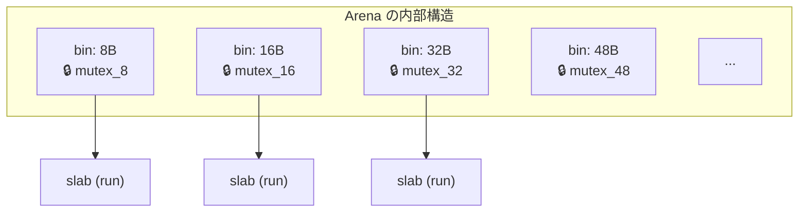

各ビンは slab（jemalloc 5.x 以降では extent ベース）を管理しており、slab 内のフリーオブジェクトはビットマップで追跡される。ビットマップの使用により、slab allocator の典型的なフリーリストよりもキャッシュ効率が良い。

### 5.6 Extent と仮想メモリ管理

jemalloc 5.x で導入された **extent** は、連続するページ群を表す抽象化である。extent はページヒープ（page heap）で管理され、アドレス順にソートされたデータ構造（pairing heap や radix tree）で高速な検索・結合が可能になっている。

この設計により、大きなアロケーションのためにページを結合する操作や、OS にメモリを返却する操作が効率的に行える。jemalloc は `madvise(MADV_DONTNEED)` や `madvise(MADV_FREE)` を積極的に使い、使わないページを OS に返す**dirty page purging** をバックグラウンドで行う。

### 5.7 統計とプロファイリング

jemalloc の大きな特徴の一つは、内蔵の統計・プロファイリング機能である。

- `malloc_stats_print()` で詳細なメモリ使用状況を出力
- サンプリングベースのヒーププロファイリング（`prof.active` で有効化）
- `mallctl` API で実行時にパラメータを動的に変更可能

```c
// Enable heap profiling via mallctl
bool active = true;
mallctl("prof.active", NULL, NULL, &active, sizeof(active));

// Dump heap profile
mallctl("prof.dump", NULL, NULL, NULL, 0);
```

## 6. mimalloc — Microsoft Research 発のコンパクトアロケータ

### 6.1 設計哲学

**mimalloc**（"mi" は "Microsoft" から）は 2019 年に Microsoft Research の Daan Leijen らが発表したアロケータである。論文 *"mimalloc: Free List Sharding in Action"* で詳述されており、以下の設計目標を掲げている:

1. **シンプルさ**: コードベースを小さく保ち（約 8,000 行）、理解・保守を容易に
2. **汎用的な高性能**: 特定のワークロードに偏らず、幅広いベンチマークで高い性能
3. **セキュリティ**: フリーリストの改竄を防ぐ仕組みを内蔵

### 6.2 フリーリストシャーディング

mimalloc の核心的な技術は**フリーリストシャーディング（free list sharding）** である。従来のアロケータでは、1つのページ（またはスラブ）に対して1つのフリーリストが存在したが、mimalloc は1つのページに対して3つのフリーリストを維持する。

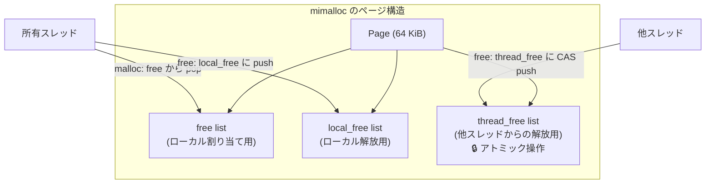

この3つのフリーリストの役割は以下の通りである:

| フリーリスト | 用途 | 同期 |
|------------|------|------|
| `free` | 割り当て時に使用。所有スレッドのみがアクセス | 不要 |
| `local_free` | 所有スレッドが `free` したオブジェクトを一時保管 | 不要 |
| `thread_free` | 他のスレッドが `free` したオブジェクトを受け取る | アトミック CAS |

割り当て時、`free` リストが空になると `local_free` リストと入れ替える。`local_free` も空なら `thread_free` リストを取得する。この設計により:

- **割り当てパスでのアトミック操作がゼロ**: `free` リストからの pop は単純なポインタ読み書き
- **解放パスでの競合が最小限**: 他スレッドからの解放のみがアトミック操作を必要とし、所有スレッド内の解放はロックフリー

### 6.3 ページとセグメント

mimalloc はメモリを以下の階層で管理する。

```
セグメント (Segment): 4 MiB
├── ページ (Page): 64 KiB（small オブジェクト用）
│   ├── オブジェクト: 固定サイズ（サイズクラスごと）
│   ├── オブジェクト
│   └── ...
├── ページ
├── ...
└── ページ (large): セグメント全体を1ページとして使用
```

- **セグメント**: OS から `mmap` で取得する 4 MiB の連続領域。内部にページを配置
- **ページ**: セグメント内の固定サイズ領域（デフォルト 64 KiB）。1つのサイズクラス専用
- **スレッドごとにヒープ**: 各スレッドは TLS にヒープ構造体を持ち、サイズクラスごとの「現在のページ」へのポインタを保持

### 6.4 割り当てのファストパス

mimalloc の割り当てのファストパスは驚くほどシンプルである。

```c
// mimalloc fast path (simplified)
void *mi_malloc(size_t size) {
    mi_page_t *page = mi_heap_get_page(heap, size); // O(1) lookup
    mi_block_t *block = page->free;
    if (block != NULL) {
        page->free = block->next;   // simple pointer update
        page->used++;
        return block;
    }
    return mi_malloc_slow(size);    // slow path
}
```

ファストパスでは分岐予測が効きやすく、キャッシュミスも少ない。ベンチマークによっては `malloc` 1回あたり10ナノ秒を切る性能を示す。

### 6.5 セキュリティ機能

mimalloc はオプションでセキュリティ強化モード（`MI_SECURE`）を提供する。

- **フリーリストのエンコーディング**: フリーリストのポインタをランダムキーで XOR エンコードし、ヒープオーバーフローによる改竄を検出
- **ページのランダム化**: ページ内のオブジェクトの初期順序をランダム化し、アロケータの予測可能性を低下させる
- **guard pages**: セグメント境界にガードページを配置し、バッファオーバーフローを検出

```c
// Encoded free list pointer (simplified)
static inline mi_block_t *mi_block_next(const mi_page_t *page,
                                         const mi_block_t *block) {
    uintptr_t next = block->next;
    // Decode with page-specific key
    next ^= page->keys[0];
    next ^= (uintptr_t)block >> 13;
    return (mi_block_t *)next;
}
```

## 7. TCMalloc — Google のスレッドキャッシュ重視アロケータ

### 7.1 概要と設計方針

**TCMalloc**（Thread-Caching Malloc）は Google が開発し、gperftools（旧 google-perftools）の一部として公開しているアロケータである。名前の通り、**スレッドごとのキャッシュ**を重視した設計が特徴で、Google の大規模サーバーインフラで広く使用されている。

2020 年以降、TCMalloc は大幅にリファクタリングされ、**新しい TCMalloc**（`tcmalloc` リポジトリ）として再設計された。本節では新しいバージョンの設計を中心に解説する。

### 7.2 3層アーキテクチャ

TCMalloc は3つの層で構成される。

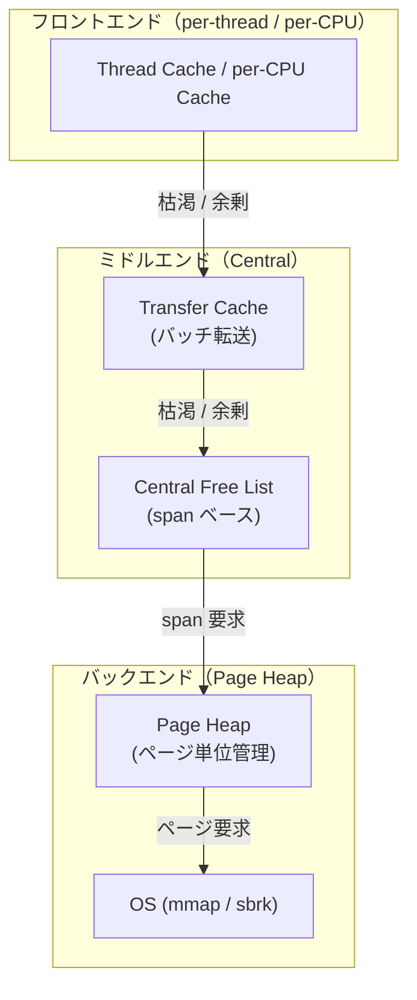

#### フロントエンド

フロントエンドは最も高速なパスを提供する。2つのモードがある:

- **Per-thread mode（従来型）**: 各スレッドが TLS にサイズクラスごとのフリーリストを持つ
- **Per-CPU mode（新型）**: 各 CPU コアごとにキャッシュを持つ。`rseq`（Restartable Sequences）を使い、スレッドがどの CPU で動作しているかをアトミック操作なしで判定する

Per-CPU モードでは、スレッド数が CPU コア数を超える場合でもキャッシュの総メモリ使用量が抑えられる。Google の内部ベンチマークでは、per-CPU モードの方が per-thread モードよりメモリ効率が良いと報告されている。

#### ミドルエンド

フロントエンドのキャッシュが枯渇した場合、ミドルエンドに問い合わせる。

- **Transfer Cache**: フロントエンドとセントラルフリーリストの間のバッファ。バッチ単位（通常数十オブジェクト）でオブジェクトを受け渡す。これにより、セントラルフリーリストのロック取得回数を削減する
- **Central Free List**: サイズクラスごとにスパン（連続ページ）を管理。スパン内のフリーオブジェクトをビットマップで追跡

#### バックエンド（Page Heap）

ページ単位のメモリ管理を担当する。空きページの結合、大きな割り当てへの対応、OS へのメモリ返却（`madvise(MADV_DONTNEED)`）を行う。

### 7.3 サイズクラスの設計

TCMalloc は 100 以上のサイズクラスを定義しており、内部断片化が最大で約 12.5% に収まるように設計されている。これは ptmalloc2（最大 50% 程度）や jemalloc（最大 20% 程度）より優れている。

```
サイズクラスの例（一部）:
  8,  16,  32,  48,  64,  80,  96,  112,  128,
  144, 160, 176, 192, 208, 224, 240, 256,
  288, 320, 352, 384, ...
```

各サイズクラスに対して、スパンに何個のオブジェクトを配置するか、バッチ転送のサイズはいくつにするかが事前に計算されている。

### 7.4 Huge Pages への対応

TCMalloc は**Huge Pages**（2 MiB）の活用に積極的である。Huge Pages を使うと TLB（Translation Lookaside Buffer）ミスが減少し、大規模ワークロードで数パーセントのスループット向上が報告されている。

TCMalloc のバックエンドには **HugePageAwareAllocator** があり、以下の最適化を行う:

- 割り当てを Huge Page 境界に揃える
- Huge Page をフルに活用できるようオブジェクトの配置を最適化
- 部分的にしか使われていない Huge Page の解放を遅延させ、再利用の機会を高める

### 7.5 GWP-ASan

TCMalloc には **GWP-ASan**（Google's "sampling" allocator for ASan）という軽量なバグ検出機構が組み込まれている。全ての割り当てのうち極小の割合（例: 10万回に1回）をガードページ付きの特別な領域に割り当てることで、use-after-free やバッファオーバーフローを本番環境で検出できる。

オーバーヘッドは無視できるレベル（CPU 数パーセント以下）であり、Google は全てのプロダクションバイナリで GWP-ASan を有効にしていると報告している。

## 8. フラグメンテーション対策 — メモリアロケータ永遠の課題

### 8.1 フラグメンテーションの分類

メモリの断片化（フラグメンテーション）はアロケータが本質的に抱える課題であり、以下の2種類に分類される。

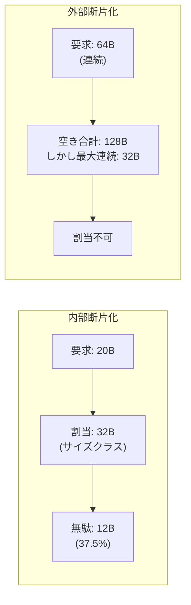

**内部断片化（Internal Fragmentation）**: 割り当てられたブロックのサイズが要求サイズより大きく、余剰部分が無駄になる現象。サイズクラス方式のアロケータでは、要求サイズがサイズクラスの境界に丸められることで発生する。

**外部断片化（External Fragmentation）**: フリーメモリの合計は十分だが、連続した空き領域が確保できない現象。割り当てと解放が繰り返されることで、メモリ上に小さな空き領域が散在する。

### 8.2 内部断片化の対策

#### サイズクラスの最適化

各アロケータはサイズクラスの選び方を工夫して内部断片化を抑えている。

```
ptmalloc2:  16B 刻み（〜512B）、以降は対数的に増加
jemalloc:   2のべき乗 + 中間サイズ（約20%以内の無駄）
TCMalloc:   100以上のクラス（約12.5%以内の無駄）
mimalloc:   jemalloc に類似したサイズクラス
```

サイズクラスを細かくすると内部断片化は減るが、管理するフリーリストの数が増え、キャッシュ効率の低下やメタデータのオーバーヘッドが増大するトレードオフがある。

#### usable_size の活用

`malloc_usable_size(ptr)` を使うと、実際に利用可能なサイズ（サイズクラスのサイズ）を取得できる。アプリケーション側がこの情報を活用すれば、`realloc` の呼び出しを減らしてオーバーヘッドを削減できる。

### 8.3 外部断片化の対策

#### コンパクション

GC（ガベージコレクション）を持つ言語ランタイム（Java, Go など）では、ヒープコンパクションによってオブジェクトを再配置し、外部断片化を解消できる。しかし、C/C++ のようにポインタを直接操作する言語ではコンパクションは不可能であり、アロケータ側で対策する必要がある。

#### Slab / サイズクラス方式

同一サイズのオブジェクトを同じページに配置する slab 方式は、外部断片化を構造的に防ぐ。ページ内には同じサイズのオブジェクトしか存在しないため、1つのオブジェクトが解放されればそのスロットは必ず再利用可能である。

```
サイズクラス 32B のページ:
[32B][32B][32B][32B][32B][32B][32B][32B]
  ↑使用  ↑free  ↑使用  ↑free  ↑使用  ↑free  ↑使用  ↑free

→ free スロットはどれも 32B の要求に即座に対応可能
→ 外部断片化が発生しない
```

#### ページの返却

長時間稼働するプロセスでは、使用頻度が低下したページを OS に返却することが重要である。各アロケータの対応は以下の通り。

| アロケータ | 返却方法 | タイミング |
|-----------|---------|-----------|
| ptmalloc2 | `madvise(MADV_DONTNEED)` | `malloc_trim()` 呼び出し時 |
| jemalloc | `madvise(MADV_DONTNEED/FREE)` | バックグラウンドの decay メカニズム |
| TCMalloc | `madvise(MADV_DONTNEED)` | release rate に基づく周期的な返却 |
| mimalloc | `madvise` / `mmap` reset | セグメント解放時 |

jemalloc の **decay** メカニズムは特に洗練されており、直近のメモリ使用パターンに基づいて指数関数的にページを返却する。`dirty_decay_ms` と `muzzy_decay_ms` の2段階で制御でき、アプリケーションの特性に応じた調整が可能である。

### 8.4 断片化の測定

断片化の程度を定量的に評価する指標は以下が一般的である。

$$
\text{fragmentation ratio} = \frac{\text{RSS (実メモリ使用量)}}{\text{活きているオブジェクトの合計サイズ}}
$$

理想的にはこの比率が 1.0 に近いが、実際のアプリケーションでは 1.2〜2.0 程度になることが多い。この比率が時間とともに増大していく場合、アロケータの変更やアプリケーション側のメモリ使用パターンの見直しが必要である。

## 9. 選定指針とベンチマーク — 正しいアロケータの選び方

### 9.1 ワークロード特性による選定

アロケータの選定は「最速のものを選ぶ」という単純な話ではない。ワークロードの特性を分析し、最も重要な要件に合致するアロケータを選ぶ必要がある。

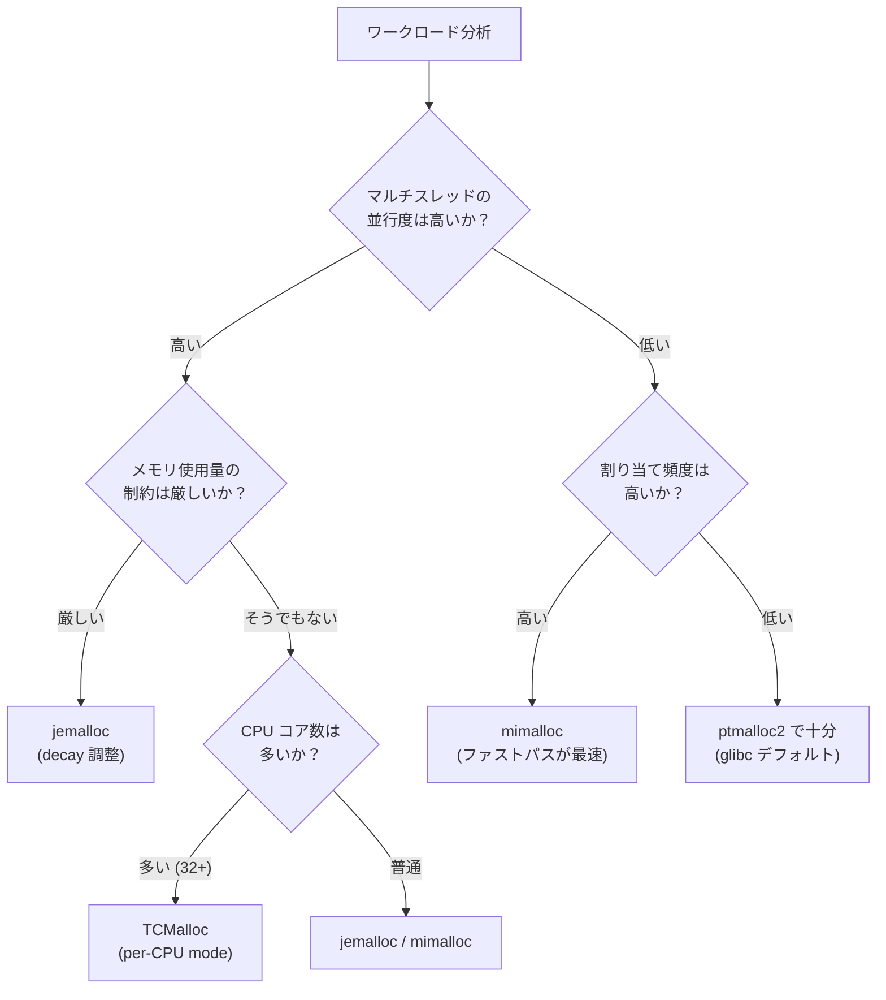

### 9.2 各アロケータの比較

以下に主要なアロケータの特性比較を示す。

| 特性 | ptmalloc2 | jemalloc | TCMalloc | mimalloc |
|------|-----------|----------|----------|----------|
| **デフォルト採用** | Linux (glibc) | FreeBSD, Rust | — | — |
| **マルチスレッド方式** | アリーナ + mutex | アリーナ + per-bin lock | per-CPU cache | per-thread heap |
| **サイズクラス粒度** | 粗い | 中程度 | 細かい | 中程度 |
| **最大内部断片化** | 〜50% | 〜20% | 〜12.5% | 〜20% |
| **メモリ返却** | 手動 (`malloc_trim`) | 自動 (decay) | 自動 (release rate) | 自動 |
| **プロファイリング** | なし | 内蔵 | 内蔵 (pprof) | 限定的 |
| **セキュリティ機能** | 基本的 | 基本的 | GWP-ASan | MI_SECURE |
| **コードサイズ** | 大 | 大 | 大 | 小 (〜8K行) |
| **導入の容易さ** | デフォルト | `LD_PRELOAD` | `LD_PRELOAD` | `LD_PRELOAD` |

### 9.3 ベンチマークの考え方

アロケータのベンチマークは、マイクロベンチマークとマクロベンチマークの両方が必要である。

#### マイクロベンチマーク

代表的なマイクロベンチマークツールとして以下がある:

- **mimalloc-bench**: mimalloc の論文で使用されたベンチマークスイート。多様なパターンを含む
- **malloc-large**: 大きなサイズの割り当て・解放を繰り返す
- **cache-scratch**: スレッド間で割り当て・解放を行い、false sharing の影響を測定
- **cache-thrash**: キャッシュの効率を測定

::: warning マイクロベンチマークの限界
マイクロベンチマークはアロケータの特定の側面（例: 小さな割り当ての速度）を測定するには有用だが、実際のアプリケーションの性能を予測するには不十分である。必ず実アプリケーションでの測定を行うべきである。
:::

#### マクロベンチマーク

実際のアプリケーションまたは代表的なワークロードでの測定が最も信頼性が高い。

```bash
# LD_PRELOAD でアロケータを差し替えてベンチマーク
# jemalloc
LD_PRELOAD=/usr/lib/x86_64-linux-gnu/libjemalloc.so.2 ./my_server

# TCMalloc
LD_PRELOAD=/usr/lib/x86_64-linux-gnu/libtcmalloc.so.4 ./my_server

# mimalloc
LD_PRELOAD=/usr/lib/x86_64-linux-gnu/libmimalloc.so ./my_server
```

測定すべき指標は以下の4つである:

1. **スループット**: 単位時間あたりの処理量（例: リクエスト/秒）
2. **レイテンシ**: p50, p99, p99.9 の応答時間（tail latency が重要）
3. **RSS**: 実メモリ使用量の推移（特に長時間稼働時の傾向）
4. **CPU 使用率**: アロケータ自体のオーバーヘッド（`perf` で `malloc`/`free` の CPU 時間を計測）

### 9.4 実際のベンチマーク傾向

公開されているベンチマーク結果から、一般的な傾向をまとめる。ただし、結果はワークロードに大きく依存するため、あくまで参考値である。

**シングルスレッドの小さな割り当て:**
mimalloc のファストパスが最も高速。ptmalloc2 と jemalloc もほぼ同等。

**マルチスレッドの高並行ワークロード:**
TCMalloc（per-CPU mode）が最もスケーラブル。jemalloc も良好。ptmalloc2 はアリーナの mutex 競合で性能が頭打ちになりやすい。

**メモリ効率（RSS）:**
jemalloc が最も優れる傾向。decay メカニズムにより未使用ページを効率的に返却する。ptmalloc2 は最もメモリ効率が悪い傾向がある。

**長時間稼働のサーバー:**
jemalloc が最も安定。ptmalloc2 はメモリ断片化の影響を受けやすい。

### 9.5 導入時の注意点

#### LD_PRELOAD の罠

`LD_PRELOAD` でアロケータを差し替える場合、以下に注意が必要である:

- **静的リンクされたライブラリ**: `LD_PRELOAD` は動的リンクの `malloc` シンボルのみ置換する。静的リンクされたコードは元の `malloc` を使い続ける
- **C++ の `new`/`delete`**: 通常は `malloc`/`free` にフォールバックするが、独自の実装を持つライブラリがあると混在する
- **fork 後の挙動**: `fork` するとアリーナの状態がコピーされるが、スレッドは複製されない。アロケータの内部状態が不整合になる可能性がある

#### コンパイル時リンク

本格的な導入では、`LD_PRELOAD` ではなくコンパイル時にリンクする方が安全である。

```bash
# Link jemalloc at compile time
gcc -o my_server my_server.c -ljemalloc

# Link mimalloc at compile time
gcc -o my_server my_server.c -lmimalloc
```

#### チューニングパラメータの例

```bash
# jemalloc: decay time, number of arenas, background thread
export MALLOC_CONF="dirty_decay_ms:5000,muzzy_decay_ms:10000,narenas:4,background_thread:true"

# TCMalloc: per-CPU mode, release rate
export TCMALLOC_PER_CPU_CACHES=1
export TCMALLOC_RELEASE_RATE=10.0

# mimalloc: secure mode, verbose stats
export MIMALLOC_SECURE=1
export MIMALLOC_VERBOSE=1
```

## 10. まとめ — メモリアロケータの本質

### 10.1 設計空間の理解

メモリアロケータの設計は、以下のトレードオフ空間の中で最適解を探す作業である。

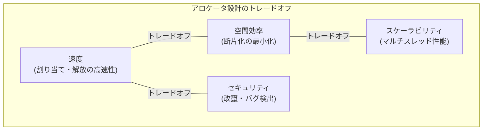

すべてを同時に最適化することはできない。各アロケータは異なるポイントでバランスを取っている:

- **ptmalloc2**: 汎用性と互換性を最優先。性能は「十分」だが最適ではない
- **jemalloc**: メモリ効率とスケーラビリティのバランスが最も良い。長時間稼働サーバーに最適
- **TCMalloc**: スケーラビリティを最優先。大規模 Google インフラのニーズに最適化
- **mimalloc**: シンプルさと汎用的な高速性。コードの理解・改変が容易

### 10.2 現代のトレンド

メモリアロケータの設計は今なお活発に研究・開発が続いている。現代のトレンドとして以下が挙げられる:

1. **Per-CPU アーキテクチャ**: スレッド数がコア数を大幅に超える環境では、per-thread よりも per-CPU のキャッシュが効率的。TCMalloc の `rseq` ベースの per-CPU cache がこの方向の先駆け
2. **セキュリティ強化**: Android の Scudo、Chrome の PartitionAlloc など、セキュリティを第一に考えたアロケータが増えている。use-after-free や heap overflow の緩和が主目的
3. **Huge Pages の活用**: TLB ミスの削減が大規模ワークロードで顕著な性能向上をもたらす。TCMalloc の HugePageAwareAllocator が先行
4. **NUMA 対応**: NUMA アーキテクチャでリモートメモリアクセスを最小化する設計。メモリの「所有ノード」を意識した配置
5. **ハードウェア支援**: ARM の Memory Tagging Extension（MTE）を活用したアロケータが登場しつつある。ハードウェアレベルでのメモリ安全性の実現

### 10.3 アロケータを学ぶ意義

メモリアロケータは、コンピュータサイエンスの複数の領域が交差する興味深い分野である。

- **データ構造とアルゴリズム**: フリーリスト、ビットマップ、radix tree、buddy system
- **オペレーティングシステム**: 仮想メモリ、ページング、システムコール
- **コンピュータアーキテクチャ**: キャッシュライン、TLB、NUMA、アトミック操作
- **並行プログラミング**: ロックフリーデータ構造、CAS、メモリオーダリング
- **セキュリティ**: ヒープ攻撃、ASLR、ガードページ

アロケータの内部を理解することは、高性能なシステムを設計する上で不可欠な知識であり、これらの領域を横断的に学ぶ格好の題材でもある。
