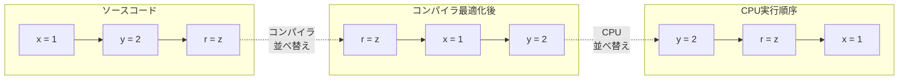
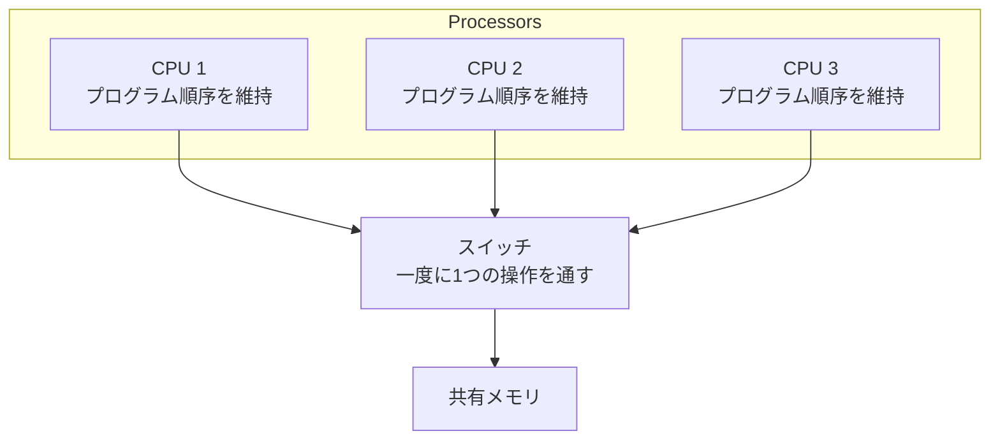
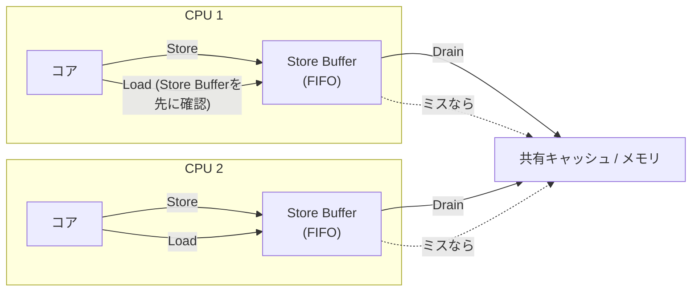
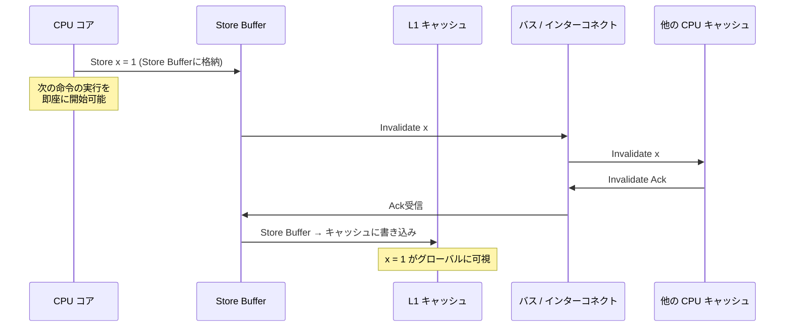
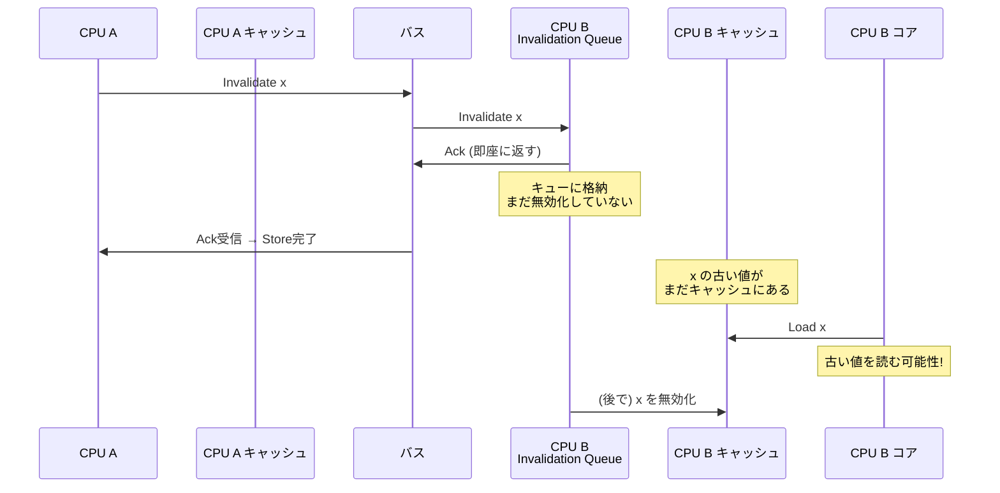
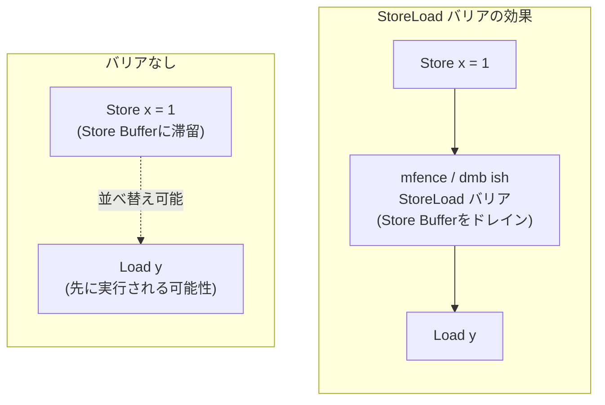
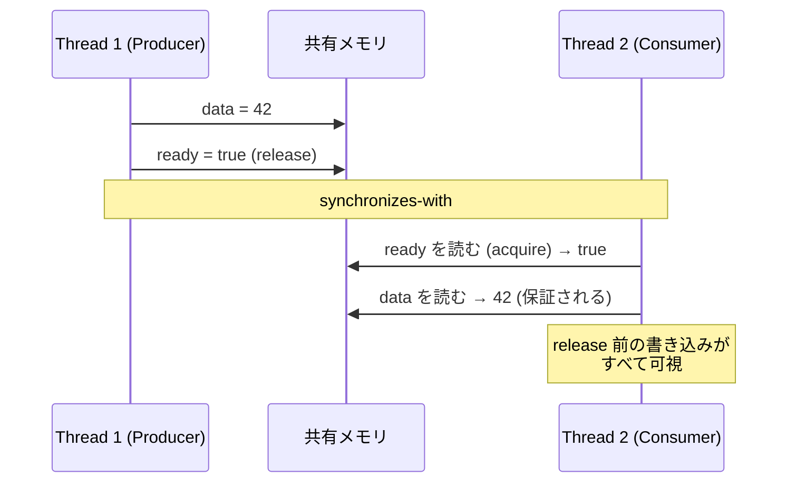
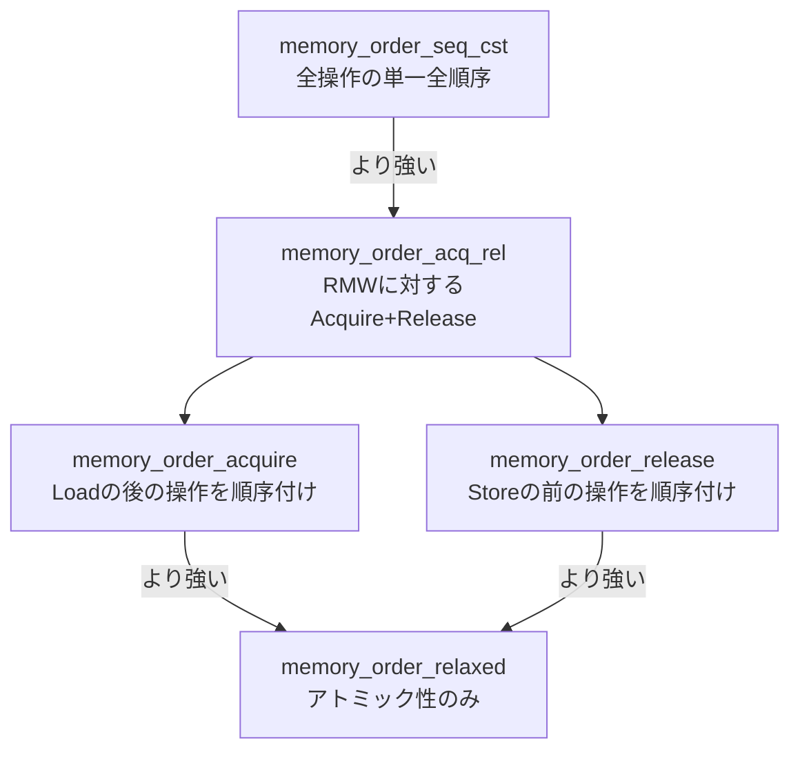
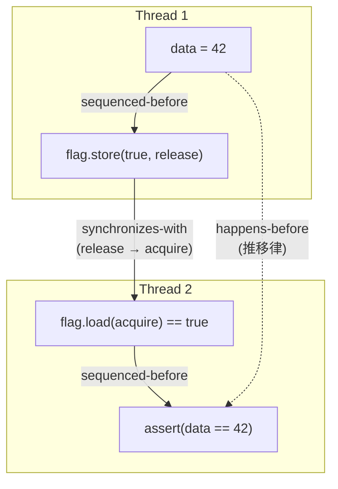
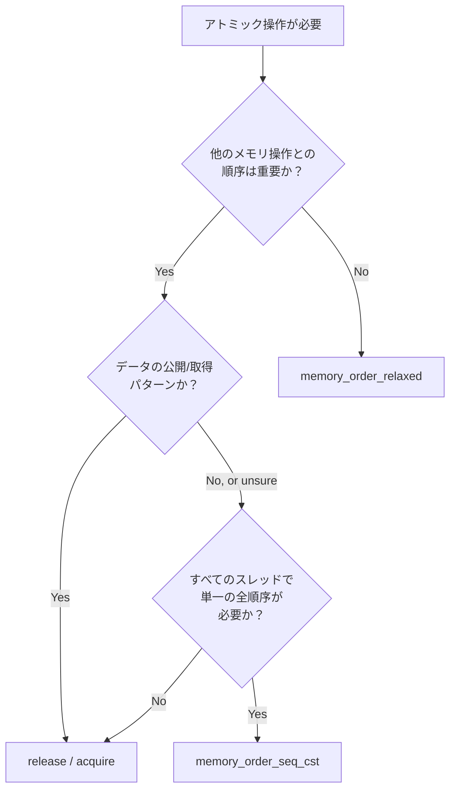

# メモリオーダリングとメモリモデル

## 1. 背景と動機 — なぜメモリオーダリングを理解すべきか

### 1.1 直感に反する世界

マルチスレッドプログラミングにおいて、ほとんどのプログラマは「コードに書いた順序どおりにメモリ操作が実行される」と暗黙に仮定している。しかし、この仮定は**現代のコンピュータにおいて成り立たない**。コンパイラとCPUの両方が、性能向上のためにメモリアクセスの順序を並べ替える（reorder）ことがあるからだ。

シングルスレッドのプログラムでは、この並べ替えは観測不可能である。コンパイラもCPUも、「単一スレッドから見た実行結果が変わらない」範囲でのみ並べ替えを行う。しかし、複数のスレッドが共有メモリを介して通信する場合、あるスレッドで行った書き込みが、別のスレッドから**期待と異なる順序で観測される**ことがある。

以下の典型的な例を考えてみよう。

```c
// Thread 1                    // Thread 2
x = 1;                         y = 1;
r1 = y;                        r2 = x;
```

初期状態で `x = 0`, `y = 0` とする。直感的には、実行完了後に `r1 == 0 && r2 == 0` という結果はありえないように見える。Thread 1 が `r1 = y` を読んだ時点で `y` がまだ `0` であるなら、Thread 2 はまだ `y = 1` を実行していないはずで、したがって `r2 = x` の時点では Thread 1 の `x = 1` がまだ実行されていないことになる。しかし、Thread 2 が `r2 = x` を読んだ時点で `x` がまだ `0` なら、Thread 1 は `x = 1` を実行していないはずで...という循環的な推論になる。

しかし、実際のハードウェア（特に x86 以外のアーキテクチャ）では、この**ありえないはずの結果が観測される**ことがある。これがメモリオーダリングの問題の核心である。

### 1.2 並べ替えの2つの源泉

メモリアクセスの並べ替えは、2つの異なるレイヤーで発生する。

**コンパイラによる並べ替え（Compiler Reordering）**

コンパイラは、最適化の一環としてメモリアクセスの順序を変更する。たとえば、命令のスケジューリング（レジスタの利用効率を上げるため）、ループの最適化、共通部分式の除去などの過程で、ソースコードに書かれた順序とは異なる順序の機械語を生成することがある。

```c
// Source code
a = 1;
b = 2;
c = 3;

// Compiler may emit (if it determines the reordering is beneficial):
// mov [c], 3
// mov [a], 1
// mov [b], 2
```

**CPUによる並べ替え（Hardware Reordering）**

CPUは、コンパイラが生成した機械語命令の順序すらも守らないことがある。アウトオブオーダー実行（Out-of-Order Execution）により、命令をプログラム順序とは異なる順序で実行する。さらに、Store Buffer や Invalidation Queue などのマイクロアーキテクチャ上のバッファが、メモリ操作の**可視性の順序**を変化させる。



### 1.3 メモリモデルとは何か

**メモリモデル（Memory Model）** とは、マルチスレッドプログラムにおいて「あるスレッドによるメモリ書き込みが、他のスレッドからどのような順序で観測されうるか」を規定する仕様である。メモリモデルは以下の3つのレベルで定義される。

1. **ハードウェアメモリモデル**: CPUアーキテクチャが保証するメモリアクセスの順序規則（x86-TSO, ARM, RISC-V など）
2. **言語メモリモデル**: プログラミング言語が規定する抽象的な順序規則（C/C++ Memory Model, Java Memory Model など）
3. **仮想マシン / ランタイムメモリモデル**: JVMやCLRが規定する順序規則

メモリモデルが必要な根本的理由は、**コンパイラやハードウェアに最適化の余地を与えつつ、プログラマに正しいプログラムを書くための保証を提供する**ことにある。最適化の余地が大きいほどハードウェアやコンパイラの性能は向上するが、プログラマが理解すべきルールは複雑になる。このトレードオフの中で、各メモリモデルは異なるバランス点を選択している。

## 2. Sequential Consistency（逐次一貫性）

### 2.1 理想的なモデル

Sequential Consistency（SC）は、1979年に Leslie Lamport が定義したメモリモデルであり、マルチプロセッサシステムにおける最も直感的な一貫性モデルである。

> **Sequential Consistency の定義**: マルチプロセッサシステムの実行結果が、すべてのプロセッサの操作をある単一の逐次的な順序にインターリーブしたものと同一であり、かつ各プロセッサの操作がプログラムで指定された順序で現れる場合、そのシステムは Sequential Consistency を満たす。

直感的には、SC は以下のモデルに相当する。すべてのプロセッサが、単一の共有メモリに対して、一度に1つの操作だけを実行するスイッチで接続されている。どのプロセッサの操作が次に実行されるかは非決定的だが、各プロセッサの操作はプログラム順序を維持する。



### 2.2 SC の下での推論

SC の下では、先ほどの例（Store Buffering）について以下のように推論できる。

```
// Thread 1: x = 1; r1 = y;
// Thread 2: y = 1; r2 = x;
```

SC ではすべての操作が単一の全順序に並ぶため、可能なインターリーブを列挙すると以下のようになる（各スレッド内の順序は維持される）。

| 実行順序 | r1 | r2 |
|---|---|---|
| x=1, r1=y, y=1, r2=x | 0 | 1 |
| x=1, y=1, r1=y, r2=x | 1 | 1 |
| x=1, y=1, r2=x, r1=y | 1 | 1 |
| y=1, r2=x, x=1, r1=y | 1 | 0 |
| y=1, x=1, r2=x, r1=y | 1 | 1 |
| y=1, x=1, r1=y, r2=x | 1 | 1 |

いずれの場合も `r1 == 0 && r2 == 0` は発生しない。SC はこの直感的な結果を保証する。

### 2.3 SC のコスト

SC は理解しやすく推論しやすいが、ハードウェアの性能を大きく制約する。SC を厳密に実装するには、各メモリ操作が**グローバルに可視**になるまで次の操作を開始できない。これは、Store Buffer のような性能に不可欠なマイクロアーキテクチャ機構の活用を著しく制限する。

実際、現代のプロセッサで SC をそのまま実装しているものは**存在しない**。すべてのプロセッサは、何らかの形で SC よりも弱い保証を提供し、その代わりに高い性能を実現している。

## 3. ハードウェアメモリモデル

### 3.1 x86-TSO（Total Store Order）

x86 アーキテクチャ（Intel, AMD）は、**TSO（Total Store Order）** と呼ばれるメモリモデルを採用している。TSO は SC に比較的近い強いモデルであり、許容される並べ替えの種類が限定されている。

TSO が SC と異なる唯一の点は、**Store-Load の並べ替え**を許容することである。つまり、あるプロセッサがストア（書き込み）を行った後のロード（読み出し）が、ストアがグローバルに可視になる前に実行されうる。

| 並べ替えの種類 | x86-TSO | 許容される？ |
|---|---|---|
| Store → Load | ストアの後のロードが先に完了 | **許容** |
| Load → Load | ロードの後のロードが先に完了 | 禁止 |
| Store → Store | ストアの後のストアが先に完了 | 禁止 |
| Load → Store | ロードの後のストアが先に完了 | 禁止 |

この動作は、各プロセッサに**FIFO の Store Buffer** が存在するモデルで説明できる。



ストアは即座にメモリに書き込まれるのではなく、まず Store Buffer に格納される。ロードは、まず自身の Store Buffer を確認し（Store Buffer Forwarding）、そこになければキャッシュ / メモリから読む。Store Buffer 内のストアは FIFO 順で排出（drain）されるため、Store → Store の順序は維持される。

しかし、あるプロセッサのストアが Store Buffer にある間に同じプロセッサが別のアドレスからロードを行うと、そのロードはストアがメモリに書き込まれる前に完了する。これが**Store-Load の並べ替え**である。

先ほどの Store Buffering の例で、x86-TSO では `r1 == 0 && r2 == 0` が**発生しうる**。Thread 1 の `x = 1` が Store Buffer にある間に `r1 = y` がメモリから `0` を読み、同様に Thread 2 の `y = 1` が Store Buffer にある間に `r2 = x` がメモリから `0` を読むことができるからだ。

### 3.2 ARM / RISC-V（弱いメモリモデル）

ARM や RISC-V は、x86 よりもはるかに**弱い（weak / relaxed）メモリモデル**を採用している。これらのアーキテクチャでは、上記4種類の並べ替えが**すべて許容される**。

| 並べ替えの種類 | ARM / RISC-V |
|---|---|
| Store → Load | 許容 |
| Load → Load | **許容** |
| Store → Store | **許容** |
| Load → Store | **許容** |

さらに、ARM の弱いメモリモデルでは、**マルチコピーアトミック性（Multi-Copy Atomicity）** すら保証されない場合がある。マルチコピーアトミック性とは、あるプロセッサによるストアが、すべての他のプロセッサに同時に可視になる性質である。ARM（ARMv8 以前の一部の実装）では、ストアが一部のプロセッサには見えているが他のプロセッサにはまだ見えていないという状況が発生しうる。

> [!WARNING]
> ARMv8 以降は「Other-Multi-Copy Atomicity」を保証している。これは、ストアがストア元のプロセッサ以外の全プロセッサに同時に可視になる（ただしストア元プロセッサは Store Buffer Forwarding により早期に見える）という性質である。完全なマルチコピーアトミック性よりは弱いが、多くの実用的なアルゴリズムにとって十分な保証を提供する。

### 3.3 アーキテクチャ間の比較

以下の表は、主要アーキテクチャのメモリモデルの強さを比較したものである。

| 特性 | x86-TSO | ARMv8 | RISC-V (RVWMO) |
|---|---|---|---|
| Store → Load 並べ替え | 許容 | 許容 | 許容 |
| Load → Load 並べ替え | 禁止 | 許容 | 許容 |
| Store → Store 並べ替え | 禁止 | 許容 | 許容 |
| Load → Store 並べ替え | 禁止 | 許容 | 許容 |
| マルチコピーアトミック | 保証 | Other-Multi-Copy | Other-Multi-Copy |
| モデルの強さ | 強い | 弱い | 弱い |
| 性能最適化の余地 | 限定的 | 広い | 広い |

弱いメモリモデルを採用するアーキテクチャの方が、ハードウェアの最適化の余地が大きい。ARM プロセッサが省電力で高性能を実現できる理由の一つは、この弱いメモリモデルによる最適化の自由度にある。一方、プログラマ（特にロックフリーアルゴリズムの実装者）は、より多くのメモリバリアを明示的に挿入する必要がある。

## 4. Store Buffer と Invalidation Queue

### 4.1 Store Buffer の役割と影響

Store Buffer は、ストア命令の実行結果を一時的に保持するCPU内部のバッファである。ストア命令が実行されると、データはまず Store Buffer に書き込まれ、キャッシュコヒーレンスプロトコル（MESI など）による処理が完了した後に、キャッシュラインに書き込まれる。

Store Buffer が存在する理由は、ストア命令のレイテンシを隠蔽するためである。キャッシュコヒーレンスプロトコルでは、ストアを行う前にそのキャッシュラインの排他的所有権（Exclusive / Modified 状態）を獲得する必要がある。他のプロセッサがそのキャッシュラインを保持している場合、Invalidate メッセージを送信して応答を待つ必要があり、これには数十〜数百サイクルのレイテンシがかかる。

Store Buffer がなければ、プロセッサはこのレイテンシの間ストールし、他の命令を実行できない。Store Buffer があれば、ストアデータを Store Buffer に書き込んだ時点でプロセッサは次の命令の実行を開始できる。



### 4.2 Invalidation Queue の影響

キャッシュコヒーレンスプロトコルにおいて、あるプロセッサがキャッシュラインの排他的所有権を獲得するために Invalidate メッセージを送信すると、他のプロセッサはそのメッセージを受信して該当するキャッシュラインを無効化する必要がある。

**Invalidation Queue** は、受信した Invalidate メッセージをキューに格納し、即座に Ack（確認応答）を返すことで、Invalidate 処理のレイテンシを削減する機構である。Ack を即座に返した時点では、実際のキャッシュラインの無効化はまだ完了していない。



この機構により、CPU B が CPU A のストアをまだ反映していないキャッシュから古い値を読んでしまうことがある。これは**Load の並べ替え**として観測される。Invalidation Queue は、弱いメモリモデルを持つアーキテクチャ（ARM など）で Load → Load や Store → Load の並べ替えが発生するメカニズムの一つである。

### 4.3 Store Buffer Forwarding

Store Buffer には**フォワーディング**の機能がある。プロセッサが Load を行う際、まず自身の Store Buffer を確認し、同じアドレスへの保留中のストアがあれば、メモリやキャッシュにアクセスする代わりに Store Buffer 内の値を直接使用する。

これにより、プロセッサは自身が書き込んだ値を即座に読み返すことができる。しかし、他のプロセッサからは Store Buffer 内の値は見えない。この非対称性が、Store → Load の並べ替えとして観測される現象の根本原因である。

## 5. メモリバリア / メモリフェンス

### 5.1 メモリバリアとは

**メモリバリア（Memory Barrier / Fence）** は、メモリアクセスの並べ替えを制限する命令（またはコンパイラディレクティブ）である。バリアの前後でメモリ操作の順序が保証され、バリアを超えた並べ替えが禁止される。

メモリバリアは大きく2つに分類される。

1. **コンパイラバリア**: コンパイラによる並べ替えのみを禁止する。CPUの並べ替えは制限しない。
2. **ハードウェアバリア**: CPUによる並べ替えを禁止する（通常、コンパイラバリアの機能も含む）。

### 5.2 バリアの種類

一般的なメモリバリアは以下の4種類に分類される。

**LoadLoad バリア**: このバリアの前のすべての Load が、バリアの後のすべての Load より先に完了することを保証する。

```
Load A
--- LoadLoad Barrier ---
Load B
// A の読み出しが B の読み出しより先に完了する
```

**StoreStore バリア**: このバリアの前のすべての Store が、バリアの後のすべての Store より先にグローバルに可視になることを保証する。

```
Store A
--- StoreStore Barrier ---
Store B
// A の書き込みが B の書き込みより先に他のプロセッサから可視になる
```

**LoadStore バリア**: このバリアの前のすべての Load が、バリアの後のすべての Store より先に完了することを保証する。

**StoreLoad バリア**: このバリアの前のすべての Store がグローバルに可視になった後に、バリアの後のすべての Load が実行されることを保証する。これは最もコストの高いバリアであり、通常 Store Buffer のドレイン（排出）を伴う。



### 5.3 アーキテクチャ固有のバリア命令

| バリアの種類 | x86 | ARM (ARMv8) | RISC-V |
|---|---|---|---|
| Full Barrier | `mfence` | `dmb ish` | `fence rw, rw` |
| StoreStore | 不要（TSOで保証） | `dmb ishst` | `fence w, w` |
| LoadLoad | 不要（TSOで保証） | `dmb ishld` | `fence r, r` |
| StoreLoad | `mfence` | `dmb ish` | `fence rw, rw` |
| Acquire semantics | 不要（Loadに暗黙） | `ldar` | `fence r, rw` / `lw; fence r, rw` |
| Release semantics | 不要（Storeに暗黙*） | `stlr` | `fence rw, w` / `fence rw, w; sw` |

> [!NOTE]
> x86 では TSO により Load → Load, Store → Store, Load → Store の並べ替えがすでに禁止されているため、多くのバリアが不要である。明示的なバリアが必要なのは Store → Load の並べ替えを防ぐ場合（`mfence` や `lock` プレフィックス付き命令）のみである。

## 6. C/C++ メモリモデル（C++11 以降）

### 6.1 設計哲学

C++11 で導入されたメモリモデルは、言語レベルでマルチスレッドプログラミングの意味を定義した画期的なものである。それ以前の C/C++ 標準にはスレッドの概念がなく、マルチスレッドプログラムの動作はすべて「未定義」であった。

C++11 メモリモデルの設計哲学は以下の通りである。

1. **ハードウェアの抽象化**: プログラマが特定のCPUアーキテクチャのメモリモデルを知らなくても、正しいマルチスレッドプログラムを書けるようにする
2. **最適化の余地**: コンパイラとハードウェアに可能な限り最適化の自由度を与える
3. **段階的な制約**: プログラマが必要な順序保証のレベルを選択できるようにする（強い保証ほどコストが高い）

### 6.2 `std::atomic` とメモリオーダリングオプション

C++11 では、`std::atomic<T>` テンプレートを通じてアトミック操作を提供し、各操作に**メモリオーダリング**を指定できる。

#### `memory_order_seq_cst`（Sequential Consistency）

最も強い保証。すべての `seq_cst` 操作が、すべてのスレッドから見て単一の全順序に並ぶことを保証する。デフォルトのメモリオーダリングであり、最も推論しやすいが、最もコストが高い。

```cpp
std::atomic<int> x{0}, y{0};

// Thread 1
x.store(1, std::memory_order_seq_cst);
int r1 = y.load(std::memory_order_seq_cst);

// Thread 2
y.store(1, std::memory_order_seq_cst);
int r2 = x.load(std::memory_order_seq_cst);

// r1 == 0 && r2 == 0 is impossible under seq_cst
```

x86 では、`seq_cst` の Store は `MOV` + `MFENCE`（または `XCHG`）にコンパイルされる。ARM では `STLR` + `DMB ISH`（または同等のシーケンス）にコンパイルされる。

#### `memory_order_acquire` と `memory_order_release`

**Release-Acquire** ペアは、「データの公開（publish）」パターンに対応する最も重要なメモリオーダリングである。

- **Release Store**: このストアの前のすべてのメモリ操作が、このストアより前に完了する（他のスレッドから可視になる）ことを保証する
- **Acquire Load**: このロードの後のすべてのメモリ操作が、このロードより後に実行されることを保証する

Release Store で書き込んだ値を Acquire Load で読んだとき、Release Store の前のすべてのメモリ操作の結果が、Acquire Load の後で可視になる。これを **synchronizes-with** 関係と呼ぶ。

```cpp
std::atomic<bool> ready{false};
int data = 0;

// Thread 1 (Producer)
data = 42;                                          // (a)
ready.store(true, std::memory_order_release);       // (b) release store

// Thread 2 (Consumer)
while (!ready.load(std::memory_order_acquire)) {}   // (c) acquire load
assert(data == 42);                                 // (d) guaranteed to see 42
```



x86 では、Release Store は通常の `MOV` 命令にコンパイルされる（TSO がすでに Store → Store の順序を保証するため）。Acquire Load も通常の `MOV` 命令にコンパイルされる（TSO がすでに Load → Load の順序を保証するため）。つまり、x86 では Release-Acquire は**追加コストなし**で実現できる。

ARM では、Release Store は `STLR`（Store-Release）命令に、Acquire Load は `LDAR`（Load-Acquire）命令にコンパイルされる。これらは通常のストア / ロードよりもコストが高い。

#### `memory_order_relaxed`

最も弱い保証。アトミック性（操作の不可分性）のみを保証し、順序の保証を一切提供しない。同じアトミック変数に対する操作の変更順序（modification order）は全スレッドで一致するが、異なるアトミック変数間の順序は保証されない。

```cpp
std::atomic<int> counter{0};

// Thread 1
counter.fetch_add(1, std::memory_order_relaxed);

// Thread 2
counter.fetch_add(1, std::memory_order_relaxed);

// Final value is guaranteed to be 2 (atomicity is preserved)
// But no ordering guarantees for other memory operations
```

Relaxed は、単純なカウンタの更新や、統計情報の収集など、他のメモリ操作との順序が重要でない場合に使用する。すべてのアーキテクチャで最もコストの低いアトミック操作にコンパイルされる。

#### `memory_order_acq_rel`

Read-Modify-Write（RMW）操作（`compare_exchange`, `fetch_add` など）に使用する。操作の Load 部分に Acquire セマンティクスを、Store 部分に Release セマンティクスを同時に適用する。

```cpp
std::atomic<int> x{0};

// Acquire-Release on RMW operation
int old = x.fetch_add(1, std::memory_order_acq_rel);
// All prior memory operations are visible to threads that
// subsequently acquire-load this atomic variable.
// All memory operations after this are ordered after this operation.
```

#### `memory_order_consume`

`acquire` の弱いバリエーションで、ロードした値に**データ依存**のある操作に対してのみ順序を保証する。理論的には `acquire` より効率的だが、実際にはほとんどのコンパイラが `consume` を `acquire` と同じように実装している。C++17 の時点でもその状況は変わっておらず、使用は推奨されない。

### 6.3 各メモリオーダリングの強さの比較



## 7. Java Memory Model

### 7.1 happens-before 関係

Java Memory Model（JMM）は、Java 5（JSR-133, 2004年）で大幅に改訂された。JMM の中核概念は **happens-before** 関係である。

操作 A が操作 B に対して happens-before であるとき（A happens-before B、記法: A ≺<sub>hb</sub> B）、A の結果は B から可視であることが保証される。happens-before 関係は以下のルールで定義される。

1. **プログラム順序規則**: 同一スレッド内で、プログラム順序で先行する操作は、後続する操作に対して happens-before である
2. **モニターロック規則**: モニターのアンロックは、同じモニターの後続するロックに対して happens-before である
3. **volatile 変数規則**: volatile 変数への書き込みは、同じ変数の後続する読み出しに対して happens-before である
4. **スレッド開始規則**: `Thread.start()` の呼び出しは、開始されたスレッドのすべての操作に対して happens-before である
5. **スレッド終了規則**: スレッドのすべての操作は、`Thread.join()` の完了に対して happens-before である
6. **推移律**: A happens-before B かつ B happens-before C ならば、A happens-before C である

### 7.2 volatile の意味

Java の `volatile` キーワードは、C/C++ の `memory_order_seq_cst` に相当する強い保証を提供する（Java 5 以降）。

```java
// Typical "publication" pattern using volatile
class DataPublisher {
    private int data;
    private volatile boolean ready;

    // Writer thread
    public void publish(int value) {
        data = value;     // (1)
        ready = true;     // (2) volatile write — release semantics
    }

    // Reader thread
    public int read() {
        if (ready) {      // (3) volatile read — acquire semantics
            return data;  // (4) guaranteed to see the value from (1)
        }
        return -1;
    }
}
```

`volatile` への書き込みは Release セマンティクスを持ち、読み出しは Acquire セマンティクスを持つ。さらに、すべての `volatile` 操作は単一の全順序に並ぶ（Sequential Consistency）。

### 7.3 JMM と C++ メモリモデルの比較

| 特性 | Java Memory Model | C++ Memory Model |
|---|---|---|
| デフォルトの保証 | `volatile` で SC | `seq_cst`（デフォルト） |
| 弱いオーダリング | 提供しない | `relaxed`, `acquire`, `release` |
| データ競合 | 定義された動作（ただし値の保証なし） | **未定義動作** |
| 設計哲学 | 安全性重視 | 性能と制御の柔軟性重視 |

Java は `relaxed` や `acquire/release` に相当する低レベルなメモリオーダリングを言語レベルで提供しない（`java.lang.invoke.VarHandle` を通じた一部のサポートは Java 9 以降で追加された）。これは Java が安全性を重視し、プログラマによる低レベルな制御よりも「正しさのデフォルト」を優先する設計哲学の表れである。

一方、C++ はデータ競合（Data Race）を**未定義動作**とする。これは、データ競合のないプログラムにおいてコンパイラが最大限の最適化を行えるようにするためだが、データ競合が存在するプログラムの動作は一切保証されない。

## 8. happens-before と synchronizes-with の形式的理解

### 8.1 C++ における順序関係

C++11 メモリモデルは、以下の順序関係を定義している。

**sequenced-before**: 同一スレッド内で、ある式の評価が別の式の評価より先に行われる関係。基本的にはプログラム順序に対応する。

**synchronizes-with**: スレッド間の同期関係。Release Store が書き込んだ値を Acquire Load が読んだとき、この関係が成立する。

**happens-before**: sequenced-before と synchronizes-with の推移的閉包。A が B に対して happens-before であれば、A の副作用（メモリ書き込みの結果）は B から可視であることが保証される。



### 8.2 Release Sequence

synchronizes-with 関係は、Release Store の値を直接 Acquire Load で読んだ場合だけでなく、その間にアトミックな Read-Modify-Write（RMW）操作が介在する場合にも成立する。これを **Release Sequence** と呼ぶ。

```cpp
std::atomic<int> count{0};
int data = 0;

// Thread 1 (Producer)
data = 42;
count.store(1, std::memory_order_release);  // release store

// Thread 2 (Intermediate)
count.fetch_add(1, std::memory_order_relaxed);  // RMW (part of release sequence)

// Thread 3 (Consumer)
while (count.load(std::memory_order_acquire) < 2) {}  // acquire load
// Thread 3 sees data == 42, because the release sequence
// from Thread 1's store through Thread 2's RMW to Thread 3's load
// establishes a synchronizes-with relationship.
```

## 9. 実際の並行バグ事例

### 9.1 Double-Checked Locking の破綻

Double-Checked Locking（DCL）パターンは、シングルトンの遅延初期化を効率的に行うために広く使われてきたパターンである。しかし、メモリオーダリングを考慮しないナイーブな実装は**破綻する**。

```cpp
// BROKEN: Double-Checked Locking without proper memory ordering
class Singleton {
    static Singleton* instance;
    static std::mutex mtx;

public:
    static Singleton* getInstance() {
        if (instance == nullptr) {          // (1) first check (no synchronization)
            std::lock_guard<std::mutex> lock(mtx);
            if (instance == nullptr) {      // (2) second check (under lock)
                instance = new Singleton(); // (3) construction + assignment
            }
        }
        return instance;
    }
};
```

問題は (3) にある。`new Singleton()` は以下の3つのステップに分解される。

1. メモリを確保する
2. コンストラクタを実行して初期化する
3. 確保したメモリのアドレスを `instance` に代入する

コンパイラやCPUは、ステップ 2 と 3 を並べ替えることがある。その場合、あるスレッドが (1) で `instance != nullptr` を確認した時点で、`Singleton` オブジェクトの初期化がまだ完了していない可能性がある。そのスレッドは初期化途中のオブジェクトにアクセスすることになる。

正しい実装は、`std::atomic` と適切なメモリオーダリングを使用する。

```cpp
// CORRECT: Double-Checked Locking with proper memory ordering
class Singleton {
    static std::atomic<Singleton*> instance;
    static std::mutex mtx;

public:
    static Singleton* getInstance() {
        Singleton* p = instance.load(std::memory_order_acquire);  // acquire load
        if (p == nullptr) {
            std::lock_guard<std::mutex> lock(mtx);
            p = instance.load(std::memory_order_relaxed);
            if (p == nullptr) {
                p = new Singleton();
                instance.store(p, std::memory_order_release);     // release store
            }
        }
        return p;
    }
};
```

Release Store により、`new Singleton()` の初期化が `instance` へのポインタ代入より前に完了することが保証される。Acquire Load により、`instance` から非 null のポインタを読んだスレッドは、初期化済みのオブジェクトを確実に参照できる。

### 9.2 Relaxed オーダリングの誤用

以下は、Relaxed オーダリングの誤った使用例である。

```cpp
std::atomic<int> x{0}, y{0};

// Thread 1
void producer() {
    x.store(1, std::memory_order_relaxed);  // (a)
    y.store(1, std::memory_order_relaxed);  // (b)
}

// Thread 2
void consumer() {
    while (y.load(std::memory_order_relaxed) != 1) {}  // (c)
    assert(x.load(std::memory_order_relaxed) == 1);    // (d) CAN FAIL!
}
```

`memory_order_relaxed` は操作間の順序を保証しないため、Thread 2 が (c) で `y == 1` を観測しても、(d) で `x == 1` を観測する保証はない。Thread 1 における (a) と (b) の順序が、Thread 2 から見て並べ替えられる可能性があるからだ。

正しくは Release-Acquire を使用する。

```cpp
// Thread 1
void producer() {
    x.store(1, std::memory_order_relaxed);  // (a)
    y.store(1, std::memory_order_release);  // (b) release
}

// Thread 2
void consumer() {
    while (y.load(std::memory_order_acquire) != 1) {}  // (c) acquire
    assert(x.load(std::memory_order_relaxed) == 1);    // (d) guaranteed!
}
```

### 9.3 Flag を使った同期の失敗

以下は、x86 では動作するが ARM では失敗する可能性のあるコードの例である。

```cpp
// Works on x86 (TSO), BROKEN on ARM (weak memory model)
int data = 0;
bool ready = false;  // not atomic!

// Thread 1
data = 42;
ready = true;

// Thread 2
while (!ready) {}
printf("%d\n", data);  // may print 0 on ARM!
```

このコードには2つの問題がある。

1. `ready` がアトミック変数ではないため、データ競合（data race）が発生し、C++ では**未定義動作**となる
2. メモリオーダリングの保証がないため、`data` と `ready` の書き込み順序が保証されない

x86 では TSO が Store → Store の並べ替えを禁止するため、偶然正しく動作する。しかし ARM では Store → Store の並べ替えが許容されるため、`ready = true` が `data = 42` より先にグローバルに可視になる可能性がある。

このようなバグは、x86 上でのテストでは発見されず、ARM（スマートフォンや Apple Silicon Mac）への移植時に初めて顕在化する。メモリオーダリングに関するバグが特に厄介な理由の一つである。

### 9.4 Seqlock のメモリオーダリング

Seqlock（Sequential Lock）は、Linux カーネルで時刻管理などに使用される軽量な同期機構である。Writer はロックを取得し、Reader はロックフリーで読み取りを試みる。Reader はシーケンス番号を確認し、読み取り中に Writer が介入した場合はリトライする。

```cpp
struct Seqlock {
    std::atomic<unsigned> seq{0};
    // Protected data
    int data1, data2;

    void write(int d1, int d2) {
        unsigned s = seq.load(std::memory_order_relaxed);
        seq.store(s + 1, std::memory_order_relaxed);  // odd = writing
        std::atomic_thread_fence(std::memory_order_release);

        data1 = d1;
        data2 = d2;

        std::atomic_thread_fence(std::memory_order_release);
        seq.store(s + 2, std::memory_order_release);  // even = stable
    }

    bool read(int& d1, int& d2) {
        unsigned s1 = seq.load(std::memory_order_acquire);
        if (s1 & 1) return false;  // writer is active

        std::atomic_thread_fence(std::memory_order_acquire);
        d1 = data1;
        d2 = data2;
        std::atomic_thread_fence(std::memory_order_acquire);

        unsigned s2 = seq.load(std::memory_order_acquire);
        return s1 == s2;  // true if no writer intervened
    }
};
```

Seqlock の正しさは、メモリフェンスの適切な配置に完全に依存する。Acquire フェンスにより、シーケンス番号の読み取りの後にデータの読み取りが行われることが保証される。Release フェンスにより、データの書き込みの後にシーケンス番号の更新が行われることが保証される。

## 10. 実践的なガイドライン

### 10.1 メモリオーダリングの選択指針

メモリオーダリングの選択は、以下の判断フローに従う。



**原則 1: 迷ったら `seq_cst` を使う**

Sequential Consistency は最も強い保証を提供し、推論が最も容易である。性能が問題にならない限り、`seq_cst` を使用するのが最も安全である。

**原則 2: Release-Acquire はデータの公開パターンに使う**

「あるスレッドがデータを準備し、フラグを立てて公開する。別のスレッドがフラグを確認し、データを読む」というパターンは、Release-Acquire が最適である。多くの同期パターンはこの形に帰着できる。

**原則 3: Relaxed は単独で完結する操作に使う**

カウンタのインクリメント、統計情報の更新など、他のメモリ操作との順序が一切重要でない場合にのみ Relaxed を使用する。

**原則 4: Relaxed + フェンスよりも Release/Acquire を優先する**

`memory_order_relaxed` とスタンドアロンの `atomic_thread_fence` の組み合わせは、Release/Acquire よりも理解しにくく、バグの温床になりやすい。特別な理由がない限り、Release/Acquire を直接使用する方が望ましい。

### 10.2 テストとデバッグ

メモリオーダリングのバグには以下の特徴がある。

1. **非決定的**: タイミングに依存するため、同じコードでも実行ごとに結果が異なる
2. **アーキテクチャ依存**: x86 では発生しないバグが ARM で発生する
3. **負荷依存**: 低負荷時には発生せず、高負荷時にのみ発生することがある
4. **観測による消失**: デバッグ出力やブレークポイントを追加すると消失する（メモリバリアの効果が追加されるため）

これらの特性のため、従来のテスト手法では発見が困難である。以下のアプローチが有効である。

**ThreadSanitizer（TSan）**: Clang / GCC が提供するデータ競合検出ツール。コンパイル時にインストルメンテーションを挿入し、実行時にデータ競合を検出する。メモリオーダリングのバグのすべてを検出できるわけではないが、データ競合の検出に有効である。

```bash
# Compile with ThreadSanitizer
g++ -fsanitize=thread -g -O1 program.cpp -o program
./program
```

**モデルチェッカー**: CDSChecker や GenMC などのツールは、C/C++ メモリモデルの下で可能なすべてのインターリーブと並べ替えを体系的に探索し、バグを検出する。小規模なアルゴリズムの検証には非常に有効である。

**弱いメモリモデルのエミュレーション**: x86 上で開発する場合でも、ARM でのテストを行うことが重要である。QEMU による ARM エミュレーションや、クロスコンパイル + 実機テストが有効である。

### 10.3 よくある誤解

**誤解 1: 「`volatile` はスレッドセーフにする」（C/C++の場合）**

C/C++ の `volatile` はコンパイラの最適化（レジスタへのキャッシュ）を抑制するが、アトミック性もメモリオーダリングも保証しない。Java の `volatile` とは全く異なる意味であることに注意が必要である。C/C++ でスレッド間通信には `std::atomic` を使用すべきである。

**誤解 2: 「x86 では並べ替えを気にしなくてよい」**

x86 の TSO は比較的強い保証を提供するが、Store-Load の並べ替えは許容される。`seq_cst` が必要な場面では `mfence` が必要であり、コストも無視できない。また、コンパイラの並べ替えは x86 でも発生する。`std::atomic` を使用しない限り、コンパイラバリアすら存在しない。

**誤解 3: 「`memory_order_relaxed` で十分な場面は多い」**

実際には、`relaxed` だけで正しく動作するパターンは限られている。カウンタのインクリメントや、順序が重要でない統計値の更新程度である。他の変数との関係がある場合は、ほぼ確実に `acquire/release` 以上が必要になる。

## 11. RISC-V のメモリモデル（RVWMO）

RISC-V は **RVWMO（RISC-V Weak Memory Ordering）** と呼ばれる弱いメモリモデルを採用している。RVWMO は ARM のメモリモデルに近いが、より形式的に定義されており、いくつかの重要な違いがある。

RISC-V のフェンス命令 `fence` は、パラメータとして前後のメモリ操作の種類を指定できる。

```
fence   r, r      // LoadLoad barrier
fence   w, w      // StoreStore barrier
fence   r, rw     // LoadLoad + LoadStore barrier (acquire-like)
fence   rw, w     // StoreLoad + StoreStore barrier (release-like)
fence   rw, rw    // Full barrier
fence.tso         // TSO-compatible barrier (Store → Load only)
```

`fence.tso` は特に注目に値する。これは x86-TSO と同等の順序保証を提供する軽量なフェンスであり、x86 から移植されたコードを効率的に実行するために設計されている。

RISC-V はまた、**Acquire/Release 拡張（Ztso 拡張）** として、TSO をデフォルトのメモリモデルとするオプションも提供している。Ztso 拡張が有効な場合、すべてのロードは暗黙的に Acquire セマンティクスを、すべてのストアは暗黙的に Release セマンティクスを持ち、x86 互換のメモリモデルとなる。

## 12. 実際のハードウェアにおける並べ替えの観測

### 12.1 litmus テスト

メモリモデルの動作を検証するために、**litmus テスト**と呼ばれる小さなマルチスレッドプログラムが使用される。litmus テストは、特定の並べ替えパターンが実際のハードウェアで観測されるかを確認するためのベンチマークである。

代表的な litmus テストには以下がある。

**SB（Store Buffering）**:

```
// Initial: x = 0, y = 0
// Thread 1: x = 1; r1 = y;
// Thread 2: y = 1; r2 = x;
// Can r1 == 0 && r2 == 0?
// x86: Yes (Store-Load reordering)
// SC: No
```

**MP（Message Passing）**:

```
// Initial: x = 0, flag = 0
// Thread 1: x = 42; flag = 1;
// Thread 2: r1 = flag; r2 = x;
// Can r1 == 1 && r2 == 0?
// ARM: Yes (Store-Store or Load-Load reordering)
// x86: No (TSO prevents this)
```

**LB（Load Buffering）**:

```
// Initial: x = 0, y = 0
// Thread 1: r1 = x; y = 1;
// Thread 2: r2 = y; x = 1;
// Can r1 == 1 && r2 == 1?
// ARM: Yes
// x86: No (but allowed by C++ relaxed)
```

**IRIW（Independent Reads of Independent Writes）**:

```
// Initial: x = 0, y = 0
// Thread 1: x = 1;
// Thread 2: y = 1;
// Thread 3: r1 = x; r2 = y;
// Thread 4: r3 = y; r4 = x;
// Can r1 == 1 && r2 == 0 && r3 == 1 && r4 == 0?
// This would mean Thread 3 sees x before y,
// but Thread 4 sees y before x.
// ARM (some): Yes (non-multi-copy-atomic)
// x86: No (multi-copy-atomic)
```

### 12.2 実測結果の例

以下は、各アーキテクチャにおける litmus テストの典型的な結果である。

| テスト | 並べ替えの種類 | x86 | ARM | RISC-V |
|---|---|---|---|---|
| SB | Store → Load | 観測される | 観測される | 観測される |
| MP | Store → Store / Load → Load | 観測されない | 観測される | 観測される |
| LB | Load → Store | 観測されない | 観測される | 観測される |
| IRIW | 非マルチコピーアトミック | 観測されない | 理論上可能 | 理論上可能 |

これらの結果は、メモリモデルの仕様上の保証を実際のハードウェアで確認するものであり、ロックフリーアルゴリズムの移植性を検証する上で重要な情報である。

## 13. まとめ — メモリオーダリングの本質

メモリオーダリングの問題は、以下の根本的なトレードオフから生じる。

**性能 vs 直感性**: 直感的な Sequential Consistency を厳密に実装すると、CPUの性能が大幅に低下する。現代のハードウェアは、Store Buffer, Invalidation Queue, アウトオブオーダー実行などの機構により高い性能を実現しているが、これらはすべてメモリ操作の順序を（プログラマの直感に反する形で）変化させる。

**最適化の自由度 vs プログラマの負担**: 弱いメモリモデルはハードウェアとコンパイラに大きな最適化の自由度を与えるが、プログラマはメモリバリアの適切な配置という高度な知識を要求される。C++11 のメモリモデルは、`relaxed` から `seq_cst` までの段階的な選択肢を提供することで、このトレードオフのバランスを取っている。

**移植性**: x86 の強いメモリモデル（TSO）に暗黙的に依存したコードは、ARM や RISC-V に移植すると破綻する。近年の ARM ベースのサーバー（AWS Graviton, Ampere Altra）やデスクトップ（Apple Silicon）の普及により、この問題は一層重要になっている。

メモリオーダリングは、並行プログラミングにおいて最も微妙で間違えやすい領域の一つである。しかし、ロックフリーデータ構造やハイパフォーマンスな並行システムを構築するためには避けて通れない。重要なのは、「迷ったら強い保証（`seq_cst`）を使い、性能が問題になった場合にのみプロファイリングに基づいて弱いオーダリングを検討する」というプラグマティックなアプローチである。
