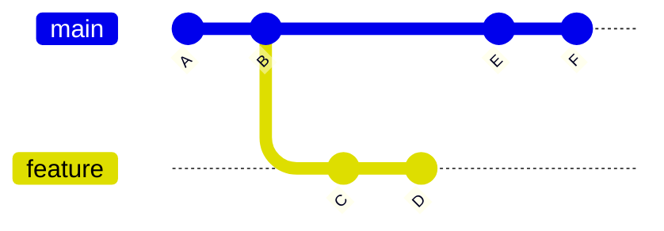
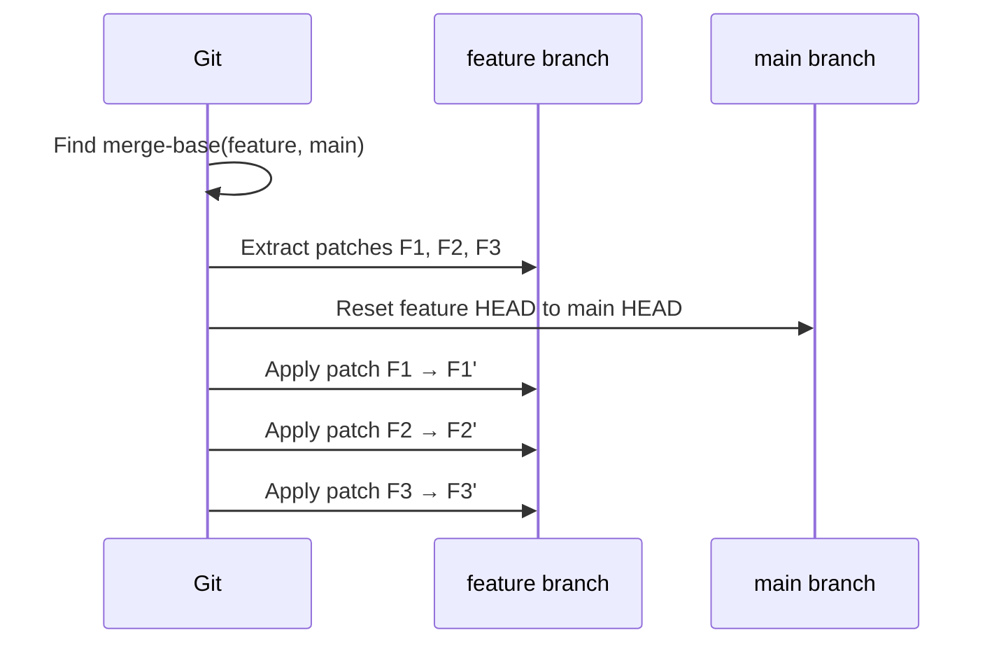
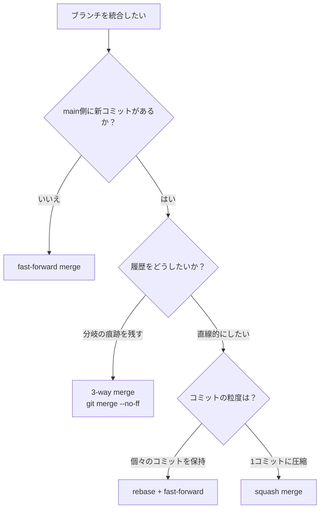
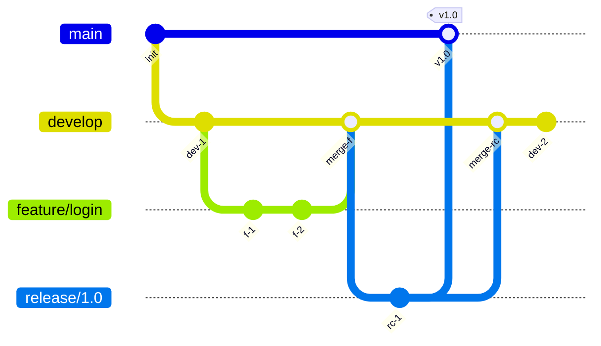

# マージ戦略（3-way merge, rebase, squash）

## 1. はじめに：なぜマージ戦略が重要なのか

ソフトウェア開発において、複数の開発者が同時に異なる機能やバグ修正に取り組むことは日常的である。バージョン管理システム（VCS）の本質的な役割は、こうした**並行開発の成果を安全に統合する**ことにある。

しかし、統合の方法は一通りではない。統合の仕方によって、コミット履歴の可読性、コンフリクト発生時のリスク、チームのコラボレーション効率が大きく変わる。これが「マージ戦略」を理解することの意義である。

```
開発者A:   o---o---o  (feature-a)
          /
main: o---o---o---o
          \
開発者B:   o---o  (feature-b)
```

上図のように、`main` ブランチから分岐した複数のブランチが存在するとき、これらをどのように統合するかが問題となる。単純に見える操作だが、以下のような複雑な問題が潜んでいる。

- **同一ファイルの同一行を複数人が編集した場合**、どちらの変更を採用するか
- **統合後の履歴**をどのように構成するか（並行開発の痕跡を残すか、直線的に整理するか）
- **問題が発生した場合**に、原因となるコミットをどの程度容易に特定できるか

本記事では、Git を中心としたマージ戦略の理論と実践を体系的に解説する。3-way merge のアルゴリズムから始め、fast-forward merge、recursive merge、rebase、squash merge の各手法を比較し、実際のブランチ運用モデルとの関係まで踏み込む。

## 2. 2-way merge と 3-way merge

### 2.1 2-way merge の限界

最も素朴な統合方法は、2つのファイルを直接比較する **2-way merge** である。しかし、この方法には根本的な限界がある。

```
ファイルA:       ファイルB:
1: int x = 1;    1: int x = 1;
2: int y = 2;    2: int y = 3;   ← 異なる
3: int z = 3;    3: int z = 3;
```

2行目が異なることはわかるが、**どちらが変更した側なのか**を判定できない。ファイルAが元のままでファイルBが変更したのか、ファイルBが元のままでファイルAが変更したのか、あるいは両方が異なる変更を加えたのか——2つのファイルだけでは区別がつかない。

### 2.2 3-way merge の原理

3-way merge は、2つのファイルに加えて**共通祖先（Common Ancestor / Base）**を用いることで、この問題を解決する。

```
Base（共通祖先）:  ファイルA:       ファイルB:
1: int x = 1;      1: int x = 1;    1: int x = 1;
2: int y = 2;      2: int y = 2;    2: int y = 3;
3: int z = 3;      3: int z = 3;    3: int z = 3;
```

共通祖先と比較することで、以下の判定が可能になる。

| Base | A | B | 判定 |
|------|---|---|------|
| 同じ | 同じ | 同じ | 変更なし → そのまま採用 |
| 同じ | **変更** | 同じ | Aのみ変更 → Aを採用 |
| 同じ | 同じ | **変更** | Bのみ変更 → Bを採用 |
| 同じ | **変更** | **変更（同じ内容）** | 両者同じ変更 → どちらかを採用 |
| 同じ | **変更** | **変更（異なる内容）** | **コンフリクト** → 手動解決が必要 |

この判定アルゴリズムにより、**自動的に統合できる範囲が大幅に広がる**。コンフリクトが発生するのは、両者が同一箇所を異なる内容に変更した場合のみである。

### 2.3 共通祖先の特定

Git における共通祖先の特定は、有向非巡回グラフ（DAG）上での **Lowest Common Ancestor（LCA）** 問題として定式化される。



上の例では、`main` の最新コミット `F` と `feature` の最新コミット `D` をマージする場合、共通祖先は `B` となる。Git は `git merge-base` コマンドでこの計算を行う。

```bash
# Find the common ancestor of two branches
git merge-base main feature
```

しかし、ブランチが複雑に分岐・統合を繰り返すと、共通祖先が一意に定まらない場合がある。この問題に対処するのが後述する recursive merge 戦略である。

## 3. fast-forward merge

### 3.1 fast-forward の仕組み

fast-forward merge は、厳密にはマージ操作ではない。統合先ブランチの HEAD が、統合元ブランチの祖先である場合に適用される。

```
Before:
main:    o---o---o (HEAD)
                  \
feature:           o---o---o

After (fast-forward):
main:    o---o---o---o---o---o (HEAD)
```

統合先（main）の HEAD を統合元（feature）の先頭に移動するだけで、**新しいコミットは生成されない**。ブランチの分岐元以降に `main` 側で新しいコミットが行われていない場合にのみ成立する。

### 3.2 Git における操作

```bash
# Default behavior: fast-forward if possible
git checkout main
git merge feature

# Force fast-forward only (fail if not possible)
git merge --ff-only feature

# Force creating a merge commit even when fast-forward is possible
git merge --no-ff feature
```

### 3.3 `--no-ff` の意義

fast-forward merge は履歴がシンプルになるが、**フィーチャーブランチの境界が消える**という欠点がある。`--no-ff` オプションを使うと、fast-forward が可能な場合でも明示的にマージコミットを作成する。

```
fast-forward:
main: o---o---o---o---o---o
      (feature commits are indistinguishable)

--no-ff:
main: o---o---o-----------M
                \         /
feature:         o---o---o
```

`--no-ff` により、フィーチャーブランチの開始点と終了点が明確になり、`git log --first-parent` で main の履歴のみを追いかけやすくなる。Git Flow ではこの `--no-ff` が推奨されている。

## 4. recursive merge 戦略

### 4.1 複数の共通祖先問題

criss-cross merge と呼ばれるパターンでは、2つのブランチ間に複数の共通祖先が存在しうる。

```
      o---M1--o---o  (branch-a)
     / \ /
o---o   X
     \ / \
      o---M2--o---o  (branch-b)
```

上の例では、`branch-a` と `branch-b` が互いの変更を部分的にマージし合った結果、共通祖先の候補が複数存在する。このとき、どの共通祖先を base とするかで 3-way merge の結果が変わる可能性がある。

### 4.2 recursive 戦略のアルゴリズム

Git のデフォルトマージ戦略である **recursive**（Git 2.34 以降は `ort`）は、この問題を以下のように解決する。

1. 2つのブランチの共通祖先を列挙する
2. 共通祖先が複数ある場合、それらを**仮想的にマージ**して単一の仮想祖先を生成する
3. この仮想祖先を使って 3-way merge を行う
4. 仮想祖先のマージにも共通祖先が複数ある場合は、**再帰的に**同じ処理を繰り返す

```
共通祖先候補: CA1, CA2

Step 1: CA1 と CA2 を 3-way merge → Virtual Base (VB)
Step 2: VB を共通祖先として、branch-a と branch-b を 3-way merge
```

この再帰的なアプローチにより、複雑な分岐パターンでも一貫した結果が得られる。

### 4.3 ort 戦略

Git 2.34（2021年11月リリース）から、デフォルトのマージ戦略が `recursive` から **`ort`**（Ostensibly Recursive's Twin）に変更された。ort は recursive と同じアルゴリズムの再実装であり、以下の改善を含む。

- パフォーマンスの大幅な向上（特に大規模リポジトリ）
- リネーム検出の精度向上
- メモリ使用量の最適化
- エッジケースでのバグ修正

`ort` は内部的には `recursive` と互換性のある結果を返すことを目標として設計されており、ユーザーが意識的に使い分ける必要はほとんどない。

## 5. rebase — 履歴の書き換えによる直線化

### 5.1 rebase の基本概念

**rebase** は、あるブランチのコミットを別のブランチの先端に「付け替える」操作である。概念的には、分岐元を変更し、コミット履歴を直線的にする。

```
Before:
main:    o---o---M1---M2
                  \
feature:           F1---F2---F3

After rebase:
main:    o---o---M1---M2
                       \
feature:                F1'---F2'---F3'
```

重要な点は、rebase によって生成されるコミット `F1'`、`F2'`、`F3'` は**元のコミットとは異なるオブジェクト**であるということである。コミットの内容（diff）は同じだが、親コミットが異なるため、コミットハッシュも異なる。

### 5.2 rebase の内部動作

rebase の内部動作を段階的に見ると、以下のようになる。

1. `feature` ブランチと `main` ブランチの共通祖先を見つける
2. 共通祖先から `feature` の HEAD までの各コミットの diff（パッチ）を抽出する
3. `feature` の HEAD を `main` の最新コミットに移動する
4. 抽出した各パッチを**順番に適用**する（cherry-pick の繰り返し）



### 5.3 rebase のメリットとリスク

**メリット：**

- **直線的な履歴**が得られ、`git log` が読みやすくなる
- **bisect が効率的**に機能する（直線的な履歴では二分探索が容易）
- マージコミットが不要になり、ノイズが減る

**リスク：**

- **公開済みのコミットを rebase すると、他の開発者の作業を破壊する**。rebase はコミットハッシュを変更するため、他の開発者がその古いコミットに基づいて作業している場合、push 時にコンフリクトが多発する
- **コンフリクト解決の反復**。マージでは一度だけ解決すれば済むコンフリクトが、rebase ではコミットごとに繰り返し発生する場合がある

::: warning rebase の黄金律
**公開済み（push済み）のブランチを rebase してはならない。** ローカルでのみ行い、他の開発者と共有する前のコミットに対してのみ rebase を適用する。これは Git コミュニティで広く共有されている原則である。
:::

### 5.4 Git における操作

```bash
# Rebase feature branch onto main
git checkout feature
git rebase main

# If conflicts occur during rebase
git rebase --continue   # after resolving conflicts
git rebase --abort       # cancel the entire rebase
git rebase --skip        # skip the current commit

# Rebase onto a specific commit
git rebase --onto new-base old-base feature
```

`--onto` は高度な使い方であり、ブランチの付け替え先を細かく制御できる。例えば、あるブランチから派生したサブブランチを、別のブランチに移植する場合に使用する。

```
Before:
main:      o---o---o
                \
feature-a:       A1---A2---A3
                          \
feature-b:                 B1---B2

git rebase --onto main feature-a feature-b

After:
main:      o---o---o
                \   \
feature-a:  A1-A2-A3 \
                      B1'---B2' (feature-b)
```

## 6. interactive rebase — コミット履歴の編集

### 6.1 interactive rebase の概要

**interactive rebase** (`git rebase -i`) は、rebase の過程で各コミットに対する操作を対話的に指定できる機能である。これにより、コミット履歴を柔軟に編集できる。

```bash
# Interactive rebase for the last 3 commits
git rebase -i HEAD~3
```

実行すると、テキストエディタが開き、以下のようなリストが表示される。

```
pick abc1234 Add user authentication
pick def5678 Fix typo in login form
pick ghi9012 Add password validation

# Rebase xyz..ghi9012 onto xyz (3 commands)
#
# Commands:
# p, pick   = use commit as is
# r, reword = use commit, but edit the commit message
# e, edit   = use commit, but stop for amending
# s, squash = use commit, but meld into previous commit
# f, fixup  = like "squash", but discard this commit's log message
# d, drop   = remove commit
```

### 6.2 主要なコマンド

| コマンド | 効果 | ユースケース |
|----------|------|------------|
| `pick` | コミットをそのまま使用 | デフォルト（変更不要のコミット） |
| `reword` | コミットメッセージを変更 | タイポの修正、メッセージの改善 |
| `edit` | コミットで停止し修正を許可 | コミット内容の部分的な変更 |
| `squash` | 前のコミットに統合（メッセージ結合） | 関連する小さなコミットの集約 |
| `fixup` | 前のコミットに統合（メッセージ破棄） | 修正コミットの吸収 |
| `drop` | コミットを削除 | 不要なコミットの除去 |

### 6.3 実践的な使い方：コミットの整理

開発中は試行錯誤の過程で多くの小さなコミットが生まれることがある。プルリクエスト作成前に、これらを論理的な単位にまとめることは、レビューアの負担を軽減する。

```
# Before: messy development history
pick a1b2c3d WIP: start working on search
pick e4f5g6h Fix search query bug
pick i7j8k9l Add search results display
pick m0n1o2p Fix CSS for search results
pick q3r4s5t Oops, forgot to add test file
pick u6v7w8x Add search tests

# After: clean logical units
pick a1b2c3d Implement search query engine
fixup e4f5g6h Fix search query bug
pick i7j8k9l Add search results UI
fixup m0n1o2p Fix CSS for search results
pick u6v7w8x Add search tests
fixup q3r4s5t Oops, forgot to add test file
```

::: tip autosquash の活用
`git commit --fixup=<commit>` でコミットを作成し、後で `git rebase -i --autosquash` を実行すると、fixup コミットが自動的に対象コミットの直後に移動し `fixup` に設定される。これにより、整理作業が大幅に簡略化される。

```bash
# Create a fixup commit targeting a specific commit
git commit --fixup=abc1234

# Later, autosquash will arrange fixups automatically
git rebase -i --autosquash main
```
:::

### 6.4 コミットの順序変更

interactive rebase では、エディタ上の行の順序を変更するだけで**コミットの適用順序を変更**できる。ただし、コミット間に依存関係がある場合（後のコミットが前のコミットで作成されたファイルを編集している場合など）、コンフリクトが発生する。

## 7. squash merge — フィーチャーブランチの凝縮

### 7.1 squash merge の仕組み

**squash merge** は、フィーチャーブランチの全コミットを1つのコミットに圧縮してメインブランチに統合する手法である。

```bash
git checkout main
git merge --squash feature
git commit -m "Add user search feature"
```

```
Before:
main:    o---o---o
                  \
feature:           F1---F2---F3---F4---F5

After squash merge:
main:    o---o---o---S
```

コミット `S` には `F1` から `F5` までの全変更が含まれるが、**マージコミットではない**（親は1つだけ）。また、**feature ブランチとの関連は記録されない**。

### 7.2 squash merge のメリットとデメリット

**メリット：**

- **main の履歴が極めてクリーン**になる。各コミットが1つの論理的な変更単位に対応する
- フィーチャーブランチ内の試行錯誤の痕跡が消える
- `git bisect` が効率的に機能する（各コミットが完結した変更）
- `git revert` で機能単位の取り消しが容易

**デメリット：**

- **個々のコミットの粒度が失われる**。大きなフィーチャーの場合、詳細な変更履歴が追えなくなる
- **マージの親子関係が記録されない**ため、`git log --all --graph` でブランチの由来を追跡できない
- feature ブランチを squash merge した後、同じブランチから再度マージしようとすると問題が発生する（Git がすでにマージ済みであることを認識できない）

### 7.3 squash merge と rebase + fast-forward の違い

一見似ている2つの操作だが、重要な違いがある。

| 観点 | squash merge | rebase + fast-forward |
|------|-------------|----------------------|
| コミット数 | 常に1つ | 元のコミット数を保持 |
| 履歴の粒度 | 粗い | 細かい |
| interactive rebase との組み合わせ | 不要（常に1コミット） | 可能（好きな粒度に調整） |
| 適用タイミング | マージ時 | マージ前 |

## 8. マージ戦略の比較

### 8.1 3つの主要戦略の比較



### 8.2 詳細比較表

| 特性 | merge (--no-ff) | rebase + ff | squash merge |
|------|----------------|-------------|--------------|
| マージコミット | 作成される | 作成されない | 作成されない |
| 履歴の形状 | 非線形（DAG） | 線形 | 線形 |
| 元コミットの保持 | すべて保持 | すべて保持（ハッシュは変わる） | 1つに圧縮 |
| コンフリクト解決 | 1回 | コミットごと | 1回 |
| 公開ブランチへの適用 | 安全 | 危険 | 安全 |
| bisect の効率 | 中程度 | 高い | 高い |
| revert の粒度 | マージ全体 | 個別コミット | 機能全体 |
| ブランチの由来追跡 | 容易 | 困難 | 困難 |

### 8.3 使い分けの指針

**merge（`--no-ff`）が適切な場合：**
- 長期間のフィーチャーブランチ
- 複数人が同じブランチで作業している場合
- ブランチの履歴（誰が何をいつ作ったか）を重視する場合
- リリースブランチの統合

**rebase が適切な場合：**
- ローカルでの短期的な作業
- コミットの粒度を維持しつつ直線的な履歴が欲しい場合
- プルリクエスト作成前の履歴整理
- 上流ブランチの変更を取り込む場合（`git pull --rebase`）

**squash merge が適切な場合：**
- main ブランチの各コミットが1つの完結した変更であることを重視する場合
- フィーチャーブランチのコミット粒度が荒い場合（WIP コミットが多いなど）
- プルリクエスト単位で履歴を管理したい場合

## 9. マージコンフリクトと解決戦略

### 9.1 コンフリクトの発生条件

コンフリクトは、3-way merge の結果として、同一領域に対する競合する変更が検出された場合に発生する。具体的には以下のパターンがある。

1. **内容の衝突（Content conflict）**: 同一ファイルの同一行を両者が異なる内容に変更
2. **修正/削除の衝突（Modify/delete conflict）**: 一方がファイルを修正し、他方が削除
3. **リネームの衝突（Rename conflict）**: 両者が同一ファイルを異なる名前にリネーム
4. **リネーム/削除の衝突**: 一方がリネームし、他方が削除

### 9.2 コンフリクトマーカー

内容の衝突が発生すると、Git はファイル内にコンフリクトマーカーを挿入する。

```
<<<<<<< HEAD
// current branch's version
function validate(input) {
    return input.length > 0 && input.length < 100;
}
=======
// incoming branch's version
function validate(input) {
    if (!input) return false;
    return input.trim().length > 0;
}
>>>>>>> feature-branch
```

`<<<<<<< HEAD` から `=======` までが現在のブランチの内容、`=======` から `>>>>>>> feature-branch` までが統合元ブランチの内容である。開発者はこの領域を手動で編集し、正しい最終形に整える必要がある。

### 9.3 コンフリクト解決の手法

**手動解決：**

コンフリクトマーカーを含むファイルを直接編集し、望ましい最終状態にする。

```bash
# After manually editing conflicted files
git add resolved-file.txt
git merge --continue    # or: git commit
```

**ours / theirs 戦略：**

一方の変更を全面的に採用する場合に使用する。

```bash
# Accept current branch's version for all conflicts
git checkout --ours .
git add .

# Accept incoming branch's version for all conflicts
git checkout --theirs .
git add .

# Per-file basis
git checkout --ours path/to/file
git checkout --theirs path/to/file
```

**マージツールの使用：**

```bash
# Open configured merge tool
git mergetool
```

### 9.4 rerere（Reuse Recorded Resolution）

Git の **rerere**（Reuse Recorded Resolution）機能は、一度解決したコンフリクトのパターンを記録し、同じパターンのコンフリクトが再発した場合に自動的に同じ解決を適用する。

```bash
# Enable rerere globally
git config --global rerere.enabled true
```

rerere は rebase のワークフローで特に有用である。rebase ではコミットごとにコンフリクトが発生する可能性があるが、rerere を有効にしておけば、一度解決したパターンは次回以降自動的に処理される。

::: tip rerere の仕組み
rerere は、コンフリクト発生時の「Before」状態と解決後の「After」状態をペアとして `.git/rr-cache/` に保存する。新たなコンフリクトが発生すると、保存済みの「Before」パターンと照合し、一致する場合は対応する「After」を自動適用する。
:::

## 10. 実際のブランチ運用モデル

マージ戦略は、チームが採用するブランチ運用モデル（branching model）と密接に関連している。ここでは、代表的な3つのモデルを概観する。

### 10.1 Git Flow

2010年に Vincent Driessen が提唱したモデルであり、明確なブランチの役割分担を特徴とする。



**ブランチの種類：**

| ブランチ | 目的 | 寿命 |
|----------|------|------|
| `main` | プロダクション用 | 永続 |
| `develop` | 開発統合用 | 永続 |
| `feature/*` | 機能開発 | 一時的 |
| `release/*` | リリース準備 | 一時的 |
| `hotfix/*` | 緊急修正 | 一時的 |

**マージ戦略**: すべてのマージに `--no-ff` を使用し、マージコミットを明示的に残す。

**利点**: リリースプロセスが厳密に管理できる。大規模チームや明確なリリースサイクルを持つプロジェクトに適している。

**欠点**: ブランチの管理が複雑。継続的デリバリーとの相性が悪い。多くのプロジェクトではオーバーエンジニアリングとなりうる。

### 10.2 GitHub Flow

GitHub 社が実践しているシンプルなモデルであり、`main` ブランチと短命のフィーチャーブランチのみで構成される。

```
main:       o---o---o---M---o---M---o
                \       /       /
feature-a:       o---o-+       /
                    \         /
feature-b:           o---o---o
```

**ルール：**

1. `main` は常にデプロイ可能な状態を保つ
2. 新しい作業はすべて `main` からブランチを作成して行う
3. ブランチ名は説明的なものにする（例：`fix-login-timeout`）
4. Pull Request を作成してレビューを受ける
5. レビュー後に `main` にマージしてデプロイする

**マージ戦略**: チームの方針により、merge commit、squash merge、rebase のいずれも使用できる。GitHub の UI では3つすべてが選択可能である。

**利点**: シンプルで理解しやすい。継続的デリバリーに適している。

**欠点**: リリースの管理が暗黙的になる。複数バージョンの並行保守が難しい。

### 10.3 Trunk-Based Development

**すべての開発者が直接（または非常に短命のブランチを通じて）単一の trunk（main）にコミットする**モデルである。Google、Facebook（現Meta）などの大規模テック企業で採用されている。

```
main: o---o---o---o---o---o---o---o---o
         \   /       \   /
          o-+         o-+
      (short-lived branches, < 1 day)
```

**特徴：**

- ブランチの寿命は数時間から最大1〜2日
- Feature Flag を使用して未完成の機能をメインブランチに統合
- CI/CD パイプラインが強力に整備されていることが前提
- 大きな変更は Branch by Abstraction パターンで段階的に導入

**マージ戦略**: squash merge または rebase が主流。短命ブランチのため、コンフリクトの発生頻度が低い。

**利点**: 統合の遅延（integration debt）が最小化される。マージコンフリクトが小さくなる。

**欠点**: 高度な CI/CD 基盤と Feature Flag の仕組みが必要。開発者の規律が求められる。

### 10.4 ブランチモデルとマージ戦略の関係

| ブランチモデル | 推奨マージ戦略 | 理由 |
|---------------|---------------|------|
| Git Flow | `merge --no-ff` | ブランチの由来を明確に記録する必要がある |
| GitHub Flow | squash merge or merge | チームの好みによる。squash が人気 |
| Trunk-Based | squash merge or rebase | 短命ブランチのため直線的な履歴が自然 |

## 11. 高度なトピック

### 11.1 octopus merge

Git は3つ以上のブランチを同時にマージする **octopus merge** をサポートしている。

```bash
# Merge multiple branches at once
git merge branch-a branch-b branch-c
```

octopus merge はコンフリクトが発生しない場合にのみ成功する。Linux カーネルの開発では、リリース前に多数のサブシステムブランチを統合する際に使用されている。

### 11.2 subtree merge

別リポジトリのコードをサブディレクトリとして統合する戦略である。Git submodule の代替として使用される場合がある。

```bash
# Merge external project as a subdirectory
git merge -s subtree external-project/main
```

### 11.3 cherry-pick との関係

**cherry-pick** は特定のコミットの変更だけを現在のブランチに適用する操作であり、部分的な rebase と見なすことができる。

```bash
# Apply a specific commit to current branch
git cherry-pick abc1234
```

rebase が「ブランチ全体の付け替え」であるのに対し、cherry-pick は「特定コミットの選択的な移植」である。hotfix を複数のブランチに適用する場合や、リリースブランチに特定の修正のみを取り込む場合に有用である。

ただし、cherry-pick を多用すると同一の変更が異なるコミットとして複数のブランチに存在することになり、後のマージ時にコンフリクトの原因となる可能性がある。

### 11.4 マージにおけるリネーム検出

Git のマージアルゴリズムは**リネーム検出**を行い、ファイルが移動・リネームされた場合でも適切にマージする。

```
Base:      src/utils.js
Branch A:  src/helpers/utils.js  (renamed)
Branch B:  src/utils.js          (content modified)

Merge result: src/helpers/utils.js (renamed + content modified)
```

リネーム検出は、ファイル間の類似度を計算し、閾値（デフォルトは50%）以上の類似度を持つファイルをリネームと判定する。この閾値は `merge.renameLimit` や `-X rename-threshold` で調整可能である。

## 12. 実践的なガイドライン

### 12.1 チームでの合意形成

マージ戦略はチーム内で統一すべきである。以下の点について事前に合意を形成することを推奨する。

1. **デフォルトのマージ方法**（merge, squash, rebase のいずれか）
2. **コミットメッセージの規約**（Conventional Commits など）
3. **ブランチの命名規則**
4. **main ブランチの保護ルール**（必須レビュー数、CI の通過条件など）

GitHub や GitLab では、リポジトリの設定で許可するマージ方法を制限できる。これにより、チームの合意を技術的に強制することが可能である。

### 12.2 よくある落とし穴

**1. rebase + force push による他者の作業の破壊**

```bash
# DANGEROUS: Never do this on shared branches
git rebase main
git push --force  # Overwrites remote history
```

共有ブランチで force push が必要な場合は、`--force-with-lease` を使用すると安全性が向上する。このオプションは、リモートの状態が最後に fetch した時点から変更されていないことを確認してから push する。

```bash
# Safer alternative
git push --force-with-lease
```

**2. squash merge 後のブランチ再利用**

squash merge は元のコミットとの関連を記録しないため、squash merge 後に元のブランチから再度マージしようとすると、すべての変更が新規変更として検出される。squash merge したブランチは必ず削除する。

**3. マージコミットの revert**

マージコミットを revert する場合、どちらの親を「メインライン」とするかを明示的に指定する必要がある。

```bash
# Revert a merge commit, keeping parent 1 (usually main)
git revert -m 1 <merge-commit-hash>
```

さらに、revert したマージの変更を再度取り込みたい場合は、revert の revert が必要になるという複雑な状況が生じる。これは merge commit の revert が「変更を打ち消す新しいコミット」を作成するためであり、Git は元のマージ自体はすでに統合済みと見なすからである。

## 13. まとめ

マージ戦略の選択は、単なる技術的な決定ではなく、チームの開発文化やワークフローに深く関わる設計判断である。

**3-way merge** は、共通祖先を利用することで、並行開発の変更を安全かつ自動的に統合する基盤技術である。この仕組みを理解することは、コンフリクトの本質を理解することに直結する。

**rebase** は直線的な履歴を重視する場合に強力だが、履歴の書き換えという性質上、共有ブランチでの使用には注意が必要である。**squash merge** はメインブランチの履歴をクリーンに保つが、詳細な変更履歴と引き換えである。

最終的に重要なのは、チーム全体で一貫した戦略を採用し、その戦略のメリットとデメリットを全員が理解していることである。完璧なマージ戦略は存在しない——プロジェクトの規模、チームの習熟度、リリースプロセスの要件に応じて、最適な選択は異なる。

Git が提供する柔軟なマージ機構は、多様な開発スタイルを支える道具である。道具の特性を深く理解した上で、自分たちのワークフローに最も適した使い方を見つけていくことが、健全なソフトウェア開発の土台となる。
