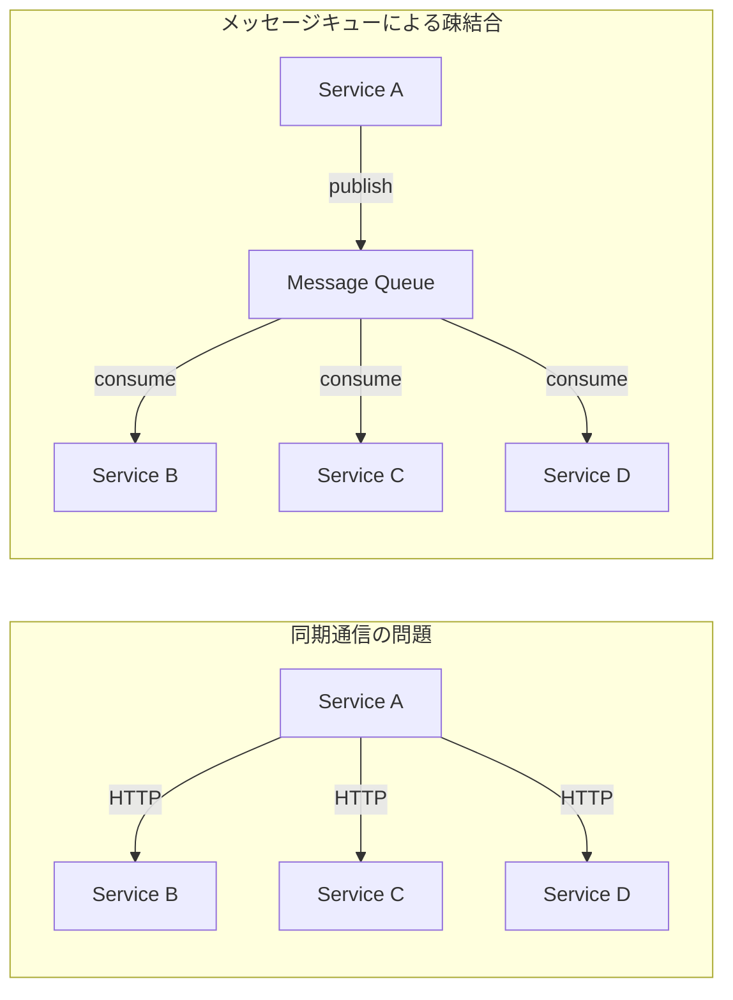
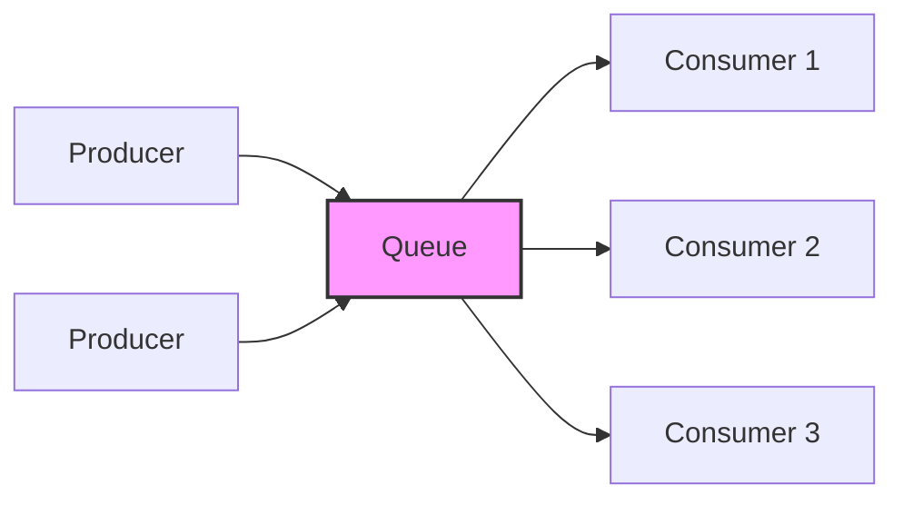
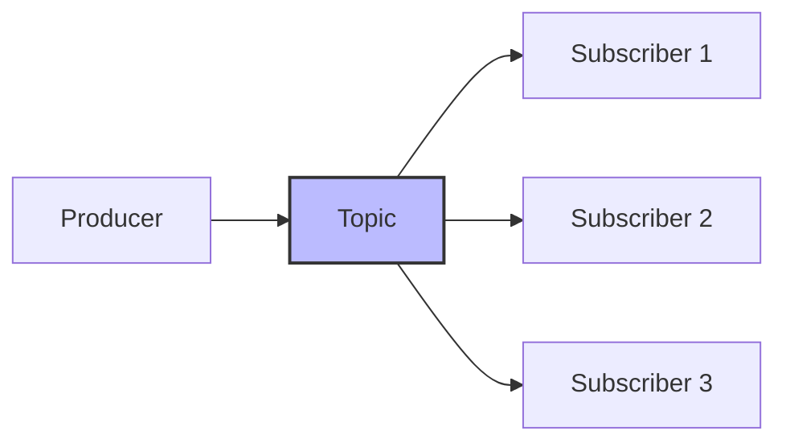
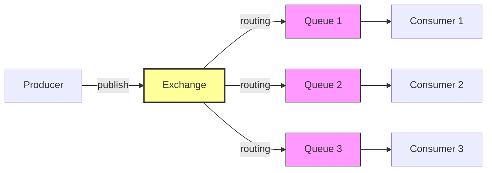
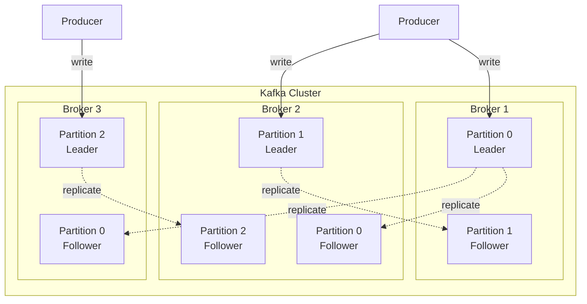
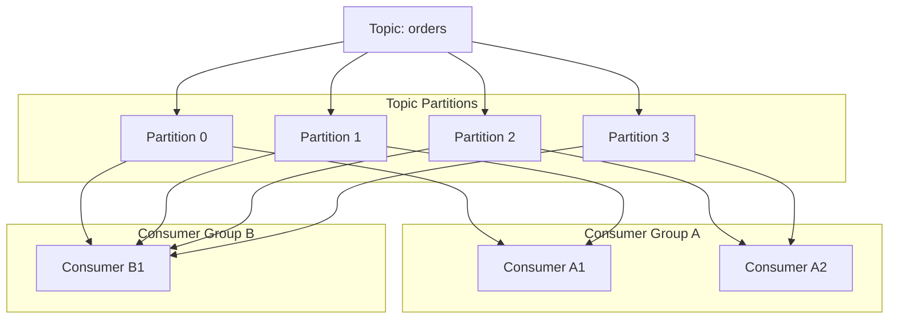
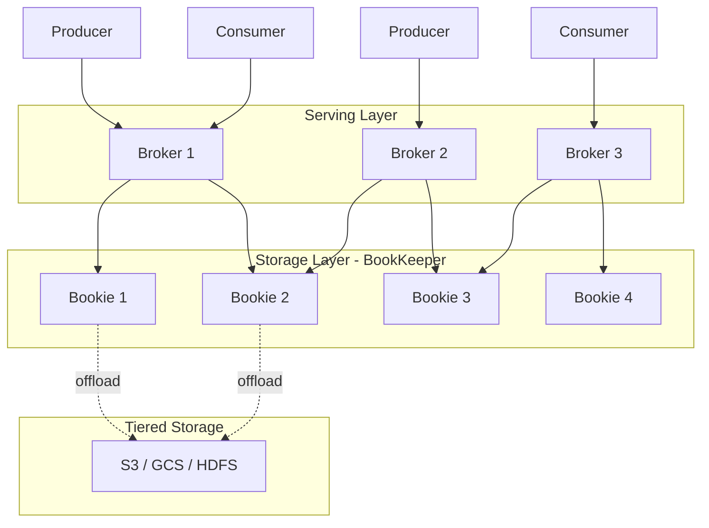

# メッセージキュー — Kafka, RabbitMQ, Pulsar の設計思想と比較

## 1. はじめに：なぜメッセージキューが必要か

現代のソフトウェアシステムは、単一のモノリシックなアプリケーションで完結することはほとんどない。マイクロサービスアーキテクチャの普及により、数十から数百のサービスが協調して動作するのが一般的になった。このような環境で、サービス間の通信をすべて同期的な HTTP リクエストで行うと、以下のような深刻な問題が生じる。

**密結合（Tight Coupling）**: サービス A がサービス B に HTTP リクエストを送る場合、B がダウンしていれば A も失敗する。依存先のサービスが増えるほど、システム全体の可用性は掛け算的に低下する。

**スケーラビリティの制約**: 同期通信ではリクエストの送信側が応答を待つ必要があるため、処理のスループットが応答時間に依存する。下流のサービスが遅いだけで、上流のサービス全体がボトルネックになる。

**負荷の不均一性**: ECサイトのセール開始時や、ニュース速報の配信時など、トラフィックは時間的に大きく変動する。同期通信のみのシステムでは、ピーク時に合わせてすべてのサービスをプロビジョニングする必要がある。

メッセージキュー（Message Queue）は、これらの問題を根本から解決するインフラストラクチャである。プロデューサー（送信者）とコンシューマー（受信者）の間にキューという中間層を置くことで、**非同期処理**、**疎結合**、**負荷平滑化**を実現する。



メッセージキューの導入により、サービス A はメッセージをキューに投入するだけで処理を完了でき、下流のサービスの状態に依存しなくなる。下流のサービスは自分のペースでメッセージを取り出して処理できるため、負荷の平滑化も自然に実現される。

## 2. メッセージングの基本パターン

メッセージングシステムには、大きく分けて2つの基本パターンがある。この分類を理解することは、後述する各プロダクトの設計思想を理解する上で不可欠である。

### 2.1 Point-to-Point（キューイングモデル）

Point-to-Point モデルでは、1つのメッセージは1つのコンシューマーにのみ配信される。複数のコンシューマーがキューを監視している場合、メッセージは競合的に分配される（Competing Consumers パターン）。



このパターンは、タスクの並列処理に適している。注文処理、画像のリサイズ、メール送信など、各メッセージを1回だけ処理すればよいワークロードで利用される。コンシューマーの数を増減させることで、処理能力を柔軟にスケールできる。

### 2.2 Publish/Subscribe（Pub/Sub モデル）

Pub/Sub モデルでは、1つのメッセージが複数のサブスクライバーに配信される。プロデューサーはトピック（Topic）にメッセージを発行し、そのトピックを購読しているすべてのサブスクライバーがメッセージのコピーを受け取る。



このパターンは、イベントの通知やデータの配信に適している。ユーザーの注文イベントを、在庫管理サービス、配送サービス、分析サービスの3つに同時に通知するような場面で使われる。

### 2.3 ハイブリッドパターン

実際の多くのメッセージングシステムは、この2つのパターンを組み合わせて利用できる。Kafka のコンシューマグループは、グループ間では Pub/Sub、グループ内では Point-to-Point として動作する。RabbitMQ も Exchange の種類によって両方のパターンを実現できる。

## 3. RabbitMQ — AMQP モデルの実装

### 3.1 歴史と設計思想

RabbitMQ は 2007 年に Rabbit Technologies（後に VMware、さらに Pivotal を経て現在は Broadcom 傘下）によって開発された。Erlang/OTP で実装されており、AMQP（Advanced Message Queuing Protocol）0-9-1 を主要プロトコルとしてサポートしている。

RabbitMQ の設計思想の中核は「スマートブローカー、ダムコンシューマー」である。ブローカーがメッセージのルーティング、フィルタリング、配信管理の責任を持ち、コンシューマーはメッセージを受け取って処理するだけでよい。この設計は、複雑なルーティングロジックが必要なエンタープライズ統合パターン（Enterprise Integration Patterns）の実装に特に適している。

### 3.2 AMQP モデルの構成要素

RabbitMQ のメッセージングモデルは、以下の構成要素から成り立つ。



**Exchange（交換機）**: プロデューサーからメッセージを受け取り、バインディングルールに基づいてキューにルーティングする。Exchange 自体はメッセージを保存しない。

**Queue（キュー）**: メッセージを保存するバッファ。コンシューマーが接続し、メッセージを取得する。キューは FIFO（First In, First Out）の順序でメッセージを保持する。

**Binding（バインディング）**: Exchange とキューを接続するルール。ルーティングキーやパターンに基づいて、どのメッセージがどのキューに配信されるかを定義する。

### 3.3 Exchange の種類

RabbitMQ は4種類の Exchange を提供しており、これによって柔軟なルーティングが可能になる。

**Direct Exchange**: ルーティングキーが完全に一致するキューにメッセージを配信する。最もシンプルなルーティング。

**Fanout Exchange**: バインドされたすべてのキューにメッセージをブロードキャストする。ルーティングキーは無視される。Pub/Sub パターンの実現に使われる。

**Topic Exchange**: ルーティングキーのパターンマッチングを行う。`*`（1語に一致）と `#`（0語以上に一致）のワイルドカードを使える。例えば、`order.*.created` は `order.jp.created` にマッチする。

**Headers Exchange**: メッセージのヘッダー属性に基づいてルーティングする。ルーティングキーではなく、ヘッダーの値でマッチングを行う。

```python
import pika

connection = pika.BlockingConnection(pika.ConnectionParameters('localhost'))
channel = connection.channel()

# Declare a topic exchange
channel.exchange_declare(exchange='events', exchange_type='topic')

# Declare and bind queues
channel.queue_declare(queue='order_notifications')
channel.queue_bind(
    exchange='events',
    queue='order_notifications',
    routing_key='order.*.created'  # match all order creation events
)

# Publish a message
channel.basic_publish(
    exchange='events',
    routing_key='order.jp.created',
    body='{"order_id": "12345", "region": "jp"}'
)
```

### 3.4 メッセージの確認応答（Acknowledgement）

RabbitMQ はメッセージの確実な配信を保証するために、確認応答（ACK）メカニズムを提供する。コンシューマーがメッセージを処理した後に ACK を送信することで、ブローカーはそのメッセージをキューから安全に削除できる。

**手動 ACK**: コンシューマーが明示的に ACK を送信する。処理が失敗した場合は NACK（Negative Acknowledgement）を送信し、メッセージを再キューに戻すことができる。

**自動 ACK**: メッセージがコンシューマーに配信された時点で自動的に ACK される。処理の失敗時にメッセージが失われるリスクがあるが、スループットは向上する。

### 3.5 RabbitMQ の長所と短所

**長所**:
- 柔軟なルーティング（Exchange + Binding の組み合わせ）
- 成熟したエコシステムと豊富なプラグイン
- 管理 UI（Management Plugin）が優秀
- 多様なプロトコルをサポート（AMQP, MQTT, STOMP）
- メッセージ優先度のサポート

**短所**:
- メッセージが消費されると削除されるため、再処理が困難
- 大量のメッセージが滞留するとパフォーマンスが劣化する
- Kafka に比べてスループットが低い（特に永続化時）
- クラスタリングの設定と運用が複雑になりがち

## 4. Apache Kafka — ログベースメッセージング

### 4.1 歴史と設計思想

Apache Kafka は 2011 年に LinkedIn で開発され、その後 Apache Software Foundation に寄贈された。Jay Kreps、Neha Narkhede、Jun Rao の3名が中心的な開発者である。現在は Confluent が商用サポートを提供している。

Kafka の設計思想は RabbitMQ と根本的に異なる。Kafka は「ダムブローカー、スマートコンシューマー」のモデルを採用している。ブローカーはメッセージ（正確には「レコード」）を追記専用のログとして保存するだけで、どのコンシューマーがどこまで読んだかの管理はコンシューマー側の責任となる。

この設計の背景には、LinkedIn が直面していた「大量のデータパイプラインを統一的に管理したい」という課題がある。ユーザーのアクティビティログ、システムメトリクス、データベースの変更通知など、多種多様なデータを一元的に収集し、リアルタイムとバッチの両方で処理する基盤が必要だった。

### 4.2 アーキテクチャ

Kafka のアーキテクチャは、以下の要素で構成される。



**トピック（Topic）**: メッセージのカテゴリー。RabbitMQ のキューとは異なり、トピックは論理的な概念であり、実際のデータは複数のパーティションに分散して保存される。

**パーティション（Partition）**: トピックを構成する物理的な単位。各パーティションは追記専用のログファイルとして実装される。パーティション内のメッセージには連番のオフセット（offset）が付与され、順序が保証される。

**ブローカー（Broker）**: Kafka クラスタを構成するサーバー。各ブローカーは複数のパーティションのリーダーまたはフォロワーとして機能する。

**レプリカ（Replica）**: 各パーティションは複数のブローカーにレプリケーションされる。リーダーレプリカがすべての読み書きを処理し、フォロワーレプリカはリーダーからデータを複製する。リーダーが障害を起こした場合、フォロワーの1つが新しいリーダーに昇格する。

### 4.3 パーティションとオフセット

Kafka の核心はパーティションの概念にある。パーティションは不変の追記専用ログであり、各メッセージにはパーティション内で一意のオフセットが割り当てられる。

```
Partition 0:
┌─────┬─────┬─────┬─────┬─────┬─────┬─────┬─────┐
│  0  │  1  │  2  │  3  │  4  │  5  │  6  │  7  │ ← offset
└─────┴─────┴─────┴─────┴─────┴─────┴─────┴─────┘
                              ↑              ↑
                         Consumer A     Latest offset
                         (offset 4)

Partition 1:
┌─────┬─────┬─────┬─────┬─────┐
│  0  │  1  │  2  │  3  │  4  │ ← offset
└─────┴─────┴─────┴─────┴─────┘
                    ↑
               Consumer A
               (offset 3)
```

コンシューマーは自分が読んだ位置（オフセット）を記録しており、任意のオフセットからメッセージを再読み込みできる。これにより、以下の利点が生まれる。

- **メッセージの再処理**: バグ修正後にメッセージを最初から再処理できる
- **複数のコンシューマーが独立して読める**: あるコンシューマーの進捗が他に影響しない
- **タイムトラベル**: 過去の任意の時点からデータを読み直せる

### 4.4 コンシューマグループ

コンシューマグループは、Kafka が Point-to-Point と Pub/Sub の両方のパターンを実現するための仕組みである。



同じコンシューマグループに属するコンシューマーは、パーティションを分担して処理する（Point-to-Point）。異なるコンシューマグループは、同じメッセージを独立して読むことができる（Pub/Sub）。

パーティション数がコンシューマー数の上限となる点は重要な制約である。4つのパーティションを持つトピックに対して、1つのコンシューマグループに5つのコンシューマーを追加しても、1つは何も処理しないアイドル状態になる。したがって、パーティション数の設計はスケーラビリティの上限を決定する。

### 4.5 プロデューサーの動作

Kafka プロデューサーは、メッセージをどのパーティションに書き込むかを決定する。パーティショニング戦略は以下のいずれかが一般的である。

- **キーベース**: メッセージキーのハッシュ値に基づいてパーティションを決定する。同じキーのメッセージは必ず同じパーティションに書き込まれるため、キー単位の順序が保証される。
- **ラウンドロビン**: キーが指定されない場合、パーティションに均等に分配する。
- **スティッキーパーティショニング**: バッチ効率を上げるため、同じバッチ内のメッセージを同じパーティションに集める。

```java
// Java producer example
Properties props = new Properties();
props.put("bootstrap.servers", "kafka1:9092,kafka2:9092");
props.put("key.serializer", "org.apache.kafka.common.serialization.StringSerializer");
props.put("value.serializer", "org.apache.kafka.common.serialization.StringSerializer");
props.put("acks", "all"); // wait for all replicas

Producer<String, String> producer = new KafkaProducer<>(props);

// Key-based partitioning: same user_id always goes to same partition
producer.send(new ProducerRecord<>(
    "orders",           // topic
    "user_12345",       // key
    "{\"item\": \"book\", \"qty\": 1}"  // value
));
```

### 4.6 Kafka の長所と短所

**長所**:
- 圧倒的なスループット（数百万メッセージ/秒）
- メッセージの永続化と再読み込みが標準機能
- ストリーム処理との統合（Kafka Streams, ksqlDB）
- コンシューマグループによる柔軟なスケーリング
- 大規模な実績（LinkedIn, Netflix, Uber など）

**短所**:
- 運用の複雑さ（ZooKeeper 依存、パーティション管理）
  - KRaft モードの導入により ZooKeeper 依存は解消されつつある
- 単一メッセージのルーティングの柔軟性が低い
- パーティション数の変更が困難（リバランスの影響）
- レイテンシは RabbitMQ に比べて高い傾向がある
- 小規模なユースケースにはオーバースペックになりがち

## 5. Apache Pulsar — マルチテナントと階層化ストレージ

### 5.1 歴史と設計思想

Apache Pulsar は 2012 年頃に Yahoo!（現 Verizon Media）で開発が始まり、2016 年にオープンソース化、2018 年に Apache のトップレベルプロジェクトとなった。現在は StreamNative がコミュニティの中心的な推進力となっている。

Pulsar は、Kafka と RabbitMQ の両方の長所を取り込みつつ、クラウドネイティブ環境での大規模マルチテナント運用を想定して設計された。その最大の特徴は、**コンピュートとストレージの分離**である。

### 5.2 アーキテクチャ

Pulsar のアーキテクチャは、他のメッセージングシステムとは根本的に異なる。ブローカー（サービングレイヤー）とストレージレイヤー（Apache BookKeeper）が完全に分離されている。



**ブローカー（Broker）**: ステートレスなサービングレイヤー。メッセージの受信とディスパッチを担当するが、データを永続的に保存しない。これにより、ブローカーの追加・削除が容易になる。

**BookKeeper（Bookie）**: 分散ログストレージシステム。メッセージの永続化を担当する。各 Ledger（ログの単位）は複数の Bookie にまたがって書き込まれ、耐障害性を確保する。

**階層化ストレージ（Tiered Storage）**: 古いデータを S3 や GCS などのオブジェクトストレージにオフロードできる。これにより、ストレージコストを大幅に削減しつつ、長期間のデータ保持が可能になる。

### 5.3 トピックの構造

Pulsar のトピックは、テナント、ネームスペース、トピック名の階層構造を持つ。

```
persistent://tenant/namespace/topic-name
```

この階層構造により、マルチテナント環境でのリソース管理が容易になる。テナントごとにストレージクォータ、レート制限、認証ポリシーを設定できる。

### 5.4 サブスクリプションモデル

Pulsar は、1つのトピックに対して複数のサブスクリプションモードを同時にサポートする。

- **Exclusive**: 1つのコンシューマーのみがサブスクリプションに接続できる
- **Failover**: 1つのアクティブなコンシューマーと、障害時に切り替わるスタンバイコンシューマー
- **Shared**: メッセージがラウンドロビンで複数のコンシューマーに分配される（Point-to-Point）
- **Key_Shared**: メッセージキーに基づいて特定のコンシューマーにルーティングされる

この柔軟性は、RabbitMQ のようなキューイングモデルと Kafka のようなストリーミングモデルの両方を1つのシステムで実現することを可能にする。

### 5.5 Pulsar の長所と短所

**長所**:
- コンピュートとストレージの分離によるスケーラビリティ
- マルチテナントのネイティブサポート
- 階層化ストレージによるコスト最適化
- 柔軟なサブスクリプションモデル
- Geo-replication のネイティブサポート
- Kafka 互換 API の提供

**短所**:
- Kafka に比べてコミュニティとエコシステムが小さい
- 運用の複雑さ（Broker + BookKeeper + ZooKeeper の3コンポーネント管理）
- 成熟度で Kafka に劣る部分がある
- 一部のベンチマークでスループットが Kafka を下回る
- 学習曲線が急（独自概念が多い）

## 6. 配信保証

メッセージングシステムにおける配信保証（Delivery Guarantees）は、メッセージが送信元から受信先にどの程度確実に届けられるかを定義する。3つのレベルが存在する。

### 6.1 At-most-once（最大1回）

メッセージは最大1回配信される。つまり、メッセージが失われる可能性があるが、重複配信は発生しない。

**実現方法**: プロデューサーがメッセージを送信した後、ACK を待たずに次のメッセージを送信する。ネットワーク障害でメッセージが失われても再送しない。

**ユースケース**: メトリクスの収集、ログの転送など、一部のデータが欠落しても問題のないワークロード。

### 6.2 At-least-once（最低1回）

メッセージは少なくとも1回は配信される。メッセージが失われることはないが、重複配信が発生する可能性がある。

**実現方法**: プロデューサーは送信後に ACK を待ち、ACK が返らなければメッセージを再送する。コンシューマーは処理完了後に ACK を送信する。

**ユースケース**: 多くの業務システム。コンシューマー側で冪等性を確保すれば、重複配信の影響を排除できる。

### 6.3 Exactly-once（正確に1回）

メッセージは正確に1回だけ配信される。メッセージの欠落も重複も発生しない。

これは理論的に最も望ましい保証であるが、分散システムにおいては実現が極めて困難である（Two Generals Problem）。Kafka の Idempotent Producer と Transactional API、Pulsar のメッセージ重複排除など、各システムが独自のアプローチでこの課題に取り組んでいる。詳細は別記事「Exactly-Once セマンティクス」で解説する。

## 7. バックプレッシャーとフロー制御

コンシューマーの処理速度がプロデューサーの送信速度に追いつかない場合、メッセージがシステム内に蓄積され続ける。この問題に対処するメカニズムがバックプレッシャー（Backpressure）とフロー制御（Flow Control）である。

### 7.1 RabbitMQ のフロー制御

RabbitMQ は複数レベルのフロー制御を実装している。

**メモリベースのフロー制御**: ブローカーのメモリ使用量が閾値（デフォルトは物理メモリの40%）を超えると、すべてのプロデューサーからのメッセージ受信を一時的にブロックする。

**ディスクベースのフロー制御**: ディスクの空き容量が閾値を下回ると、同様にメッセージ受信をブロックする。

**コンシューマーの prefetch**: `basic.qos` で prefetch count を設定することで、コンシューマーが一度に受け取るメッセージ数を制限できる。これにより、処理が遅いコンシューマーにメッセージが過剰に配信されることを防ぐ。

### 7.2 Kafka のフロー制御

Kafka はプルベース（Pull-based）のモデルを採用しているため、バックプレッシャーは自然に実現される。コンシューマーは自分のペースで `poll()` を呼び出してメッセージを取得するため、処理が追いつかなければ取得頻度を下げるだけでよい。

ただし、これはメッセージがブローカーに蓄積されることを意味する。Kafka はメッセージをディスクに永続化するため、メモリ枯渇のリスクは低いが、ディスク容量の監視は必要である。retention policy（保持期間や保持サイズ）を適切に設定することが重要となる。

プロデューサー側では、`buffer.memory` や `max.block.ms` の設定によって、内部バッファが一杯になった場合の挙動を制御できる。

### 7.3 Pulsar のフロー制御

Pulsar は、コンシューマーの `receiverQueueSize` パラメータによって、ブローカーからプリフェッチするメッセージ数を制御する。また、ブローカーレベルでは、トピックごとのバックログクォータを設定でき、バックログが閾値を超えた場合のアクション（プロデューサーのブロック、古いメッセージの削除など）を指定できる。

## 8. 選定基準と比較表

### 8.1 比較表

| 観点 | RabbitMQ | Apache Kafka | Apache Pulsar |
|------|----------|-------------|---------------|
| **設計思想** | スマートブローカー | ダムブローカー | コンピュートとストレージの分離 |
| **プロトコル** | AMQP, MQTT, STOMP | 独自プロトコル | 独自プロトコル（Kafka 互換あり） |
| **メッセージモデル** | キュー中心 | ログ中心 | ログ中心 + キュー |
| **スループット** | 数万 msg/s | 数百万 msg/s | 数十万〜数百万 msg/s |
| **レイテンシ** | 低い（ミリ秒単位） | 中程度 | 低い（ミリ秒単位） |
| **メッセージ保持** | 消費後に削除 | 設定期間保持 | 設定期間保持 + 階層化 |
| **ルーティング** | 非常に柔軟 | パーティションベース | パーティションベース |
| **スケーラビリティ** | 中程度 | 高い | 非常に高い |
| **マルチテナント** | 限定的 | 限定的 | ネイティブサポート |
| **Geo-replication** | プラグイン | MirrorMaker | ネイティブサポート |
| **運用難易度** | 中程度 | 高い | 非常に高い |
| **エコシステム** | 成熟 | 非常に成熟 | 成長中 |

### 8.2 選定のガイドライン

**RabbitMQ を選ぶべき場合**:
- 複雑なルーティングロジックが必要（ヘッダーベース、パターンマッチ）
- タスクキューとしての利用が主目的
- 既存のシステムとの統合に AMQP や MQTT が必要
- 小〜中規模のメッセージ量
- 低レイテンシの個別メッセージ配信が重要

**Kafka を選ぶべき場合**:
- 大量のイベントストリーミング
- イベントの再処理（リプレイ）が必要
- ストリーム処理パイプラインの構築
- イベントソーシングのイベントストアとして利用
- 高スループットが最優先

**Pulsar を選ぶべき場合**:
- マルチテナント環境での運用
- キューイングとストリーミングの両方のワークロードを1つのシステムで管理したい
- 長期間のメッセージ保持がコスト効率よく必要
- Geo-replication がネイティブに必要
- コンピュートとストレージを独立してスケールしたい

### 8.3 最近の動向

メッセージキューの領域は急速に進化している。以下は注目すべき最近の動向である。

**Kafka の KRaft モード**: ZooKeeper への依存を解消し、Kafka 自身でメタデータ管理を行う KRaft（Kafka Raft）モードが本番環境で利用可能になった。これにより、運用の複雑さが大幅に軽減される。

**RabbitMQ Streams**: RabbitMQ 3.9 以降で導入された Streams 機能は、Kafka のようなログベースのメッセージングを RabbitMQ 上で実現する。従来のキューモデルとログモデルを同一システム内で使い分けられるようになった。

**クラウドマネージドサービス**: Amazon MSK（Kafka）、Amazon MQ（RabbitMQ）、Confluent Cloud（Kafka）、StreamNative Cloud（Pulsar）など、マネージドサービスの充実により、運用負担なくこれらのシステムを利用できる環境が整ってきている。

## 9. まとめ

メッセージキューは、現代の分散システムにおいて不可欠なインフラストラクチャである。RabbitMQ、Kafka、Pulsar はそれぞれ異なる設計思想に基づいており、適切な選択はユースケースに大きく依存する。

RabbitMQ は伝統的なメッセージブローカーとして、柔軟なルーティングと成熟したエコシステムを提供する。Kafka はログベースのアーキテクチャにより、大規模なイベントストリーミングと再処理を実現する。Pulsar はコンピュートとストレージの分離により、クラウドネイティブ環境での効率的な運用を可能にする。

重要なのは、「最良のメッセージキュー」は存在しないということである。プロジェクトの要件、チームのスキルセット、運用環境、将来の成長予測を総合的に判断し、最適なツールを選択する必要がある。また、メッセージキューの導入は、配信保証、冪等性、順序保証、監視・アラートなど、多くの設計上の考慮点を伴う。これらを十分に理解した上で、システムに組み込むことが求められる。
