# メタプログラミングとマクロ — コードを生成するコードの技法

## 1. メタプログラミングとは

### 1.1 定義と本質

**メタプログラミング（metaprogramming）** とは、プログラムを操作・生成・変換の対象として扱うプログラミング技法の総称である。通常のプログラムがデータを操作するのに対し、メタプログラムは「プログラムそのもの」をデータとして操作する。この「プログラムについてのプログラム」という再帰的な構造が、メタプログラミングの本質である。

メタプログラミングが解決する根本的な問題は **繰り返しの排除** と **抽象化の壁の突破** である。通常の関数やクラスといった抽象化機構では表現しきれないパターン——たとえば、構造体の全フィールドに対してシリアライズ処理を自動生成する、特定の規約に従うボイラープレートコードを排除する——を、メタプログラミングは解決できる。

### 1.2 メタプログラミングの分類

メタプログラミングはその実行タイミングと手法によって大きく分類できる。

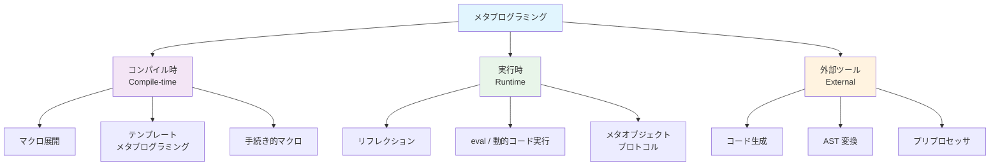

| 分類 | タイミング | 代表例 | 型安全性 |
|------|-----------|--------|---------|
| プリプロセッサマクロ | コンパイル前 | C/C++ `#define` | 低い |
| Lisp マクロ | コンパイル時 / マクロ展開時 | Common Lisp `defmacro`, Scheme `syntax-rules` | 言語依存 |
| テンプレートメタプログラミング | コンパイル時 | C++ テンプレート | 高い |
| 手続き的マクロ | コンパイル時 | Rust `proc_macro` | 高い |
| リフレクション | 実行時 | Java, C#, Python | 動的 |
| コード生成 | ビルド前 | `go generate`, Protocol Buffers | 生成コードに依存 |
| AST 変換 | コンパイル時 / ビルド時 | Babel プラグイン, Scala マクロ | 変換器に依存 |

### 1.3 歴史的背景

メタプログラミングの歴史は 1958 年の Lisp にまで遡る。John McCarthy が設計した Lisp は **ホモイコニシティ（homoiconicity）**——コードとデータが同じ表現形式（S式）を持つ性質——を備えており、プログラム自身がプログラムを生成・変換することが自然にできた。この「コードはデータであり、データはコードである」という哲学は、以降のメタプログラミングの発展に決定的な影響を与えた。

1970年代には C 言語のプリプロセッサが登場し、テキスト置換に基づく素朴なマクロ機構が広く普及した。1990年代に入ると、C++ テンプレートがチューリング完全であることが発見され、コンパイル時計算という新たなパラダイムが開かれた。2000年代以降は、Rust の `proc_macro`、Scala のマクロ、Zig の `comptime` など、より安全で表現力の高いメタプログラミング機構が各言語に導入されている。

## 2. C/C++ プリプロセッサマクロ

### 2.1 仕組みと基本

C/C++ のプリプロセッサマクロは、メタプログラミングの最も原始的な形態の一つである。コンパイルの前段階でソースコードに対して **テキスト置換** を行う仕組みであり、構文解析以前に処理が完了する。


プリプロセッサは `#` で始まるディレクティブを処理する。最も基本的なものは `#define` によるオブジェクト形式マクロと関数形式マクロである。

```c
// Object-like macro — simple constant substitution
#define MAX_BUFFER_SIZE 1024

// Function-like macro — parameterized text substitution
#define SQUARE(x) ((x) * (x))

// Stringification operator
#define STRINGIFY(x) #x

// Token pasting operator
#define CONCAT(a, b) a##b
```

### 2.2 条件付きコンパイル

プリプロセッサマクロの実用的な用途の一つが、条件付きコンパイルによるプラットフォーム抽象化である。

```c
// Platform-specific code selection
#if defined(_WIN32)
    #include <windows.h>
    #define SLEEP_MS(ms) Sleep(ms)
#elif defined(__linux__)
    #include <unistd.h>
    #define SLEEP_MS(ms) usleep((ms) * 1000)
#elif defined(__APPLE__)
    #include <unistd.h>
    #define SLEEP_MS(ms) usleep((ms) * 1000)
#else
    #error "Unsupported platform"
#endif
```

### 2.3 典型的な落とし穴

プリプロセッサマクロはテキスト置換に過ぎないため、C/C++ の構文や型システムを一切理解しない。これが多くの深刻な問題を引き起こす。

**多重評価問題**：

```c
#define MAX(a, b) ((a) > (b) ? (a) : (b))

int x = 1, y = 2;
// Expands to: ((x++) > (y++) ? (x++) : (y++))
// x and y are incremented multiple times!
int result = MAX(x++, y++);
```

この例では `MAX(x++, y++)` というマクロ呼び出しが展開されると、`x++` と `y++` がそれぞれ複数回評価されてしまう。関数呼び出しであれば引数は一度だけ評価されるため、この問題は発生しない。

**スコープの欠如**：

```c
// Dangerous: no scope isolation
#define SWAP(a, b) { int tmp = a; a = b; b = tmp; }

// This breaks if the variable is named 'tmp'
int tmp = 10, y = 20;
SWAP(tmp, y); // Expands with name collision on 'tmp'
```

マクロには独立したスコープがないため、マクロ内部で使用する一時変数が外部の変数名と衝突する可能性がある。これは **変数キャプチャ（variable capture）** 問題と呼ばれ、Lisp の衛生的マクロが解決を試みた歴史的な問題でもある。

**型安全性の欠如**：

```c
#define ABS(x) ((x) < 0 ? -(x) : (x))

// Compiles without warning, but semantically wrong for unsigned types
unsigned int u = 5;
int result = ABS(u); // Unsigned comparison with 0 is always false
```

マクロは型を認識しないため、意図しない型の値が渡されても警告すら出ない。C++ では `constexpr` 関数やテンプレートがこの問題を解決する手段を提供している。

### 2.4 X-Macro テクニック

プリプロセッサマクロの高度なテクニックとして **X-Macro** がある。これはデータ定義を一箇所に集約し、そこから複数の異なるコード断片を生成するパターンである。

```c
// Define data once using X-macro pattern
#define ERROR_LIST \
    X(ERR_NONE,       0, "No error") \
    X(ERR_NOT_FOUND,  1, "Not found") \
    X(ERR_TIMEOUT,    2, "Timeout") \
    X(ERR_PERMISSION, 3, "Permission denied")

// Generate enum
typedef enum {
    #define X(name, code, desc) name = code,
    ERROR_LIST
    #undef X
} ErrorCode;

// Generate string lookup function
const char* error_to_string(ErrorCode err) {
    switch (err) {
        #define X(name, code, desc) case name: return desc;
        ERROR_LIST
        #undef X
        default: return "Unknown error";
    }
}
```

X-Macro は DRY（Don't Repeat Yourself）原則に従い、列挙型とその文字列表現の同期を自動化する。しかし可読性が低く、デバッグが困難であるという欠点がある。

## 3. Lisp マクロと衛生的マクロ

### 3.1 ホモイコニシティとマクロの力

Lisp のマクロシステムは、メタプログラミングの歴史において最も影響力のある発明の一つである。Lisp の強みは **ホモイコニシティ** にある。Lisp のコードは S 式（リスト構造）として表現され、これは Lisp のデータ構造そのものである。つまり、コードを操作するプログラムを書くことが、リストを操作するプログラムを書くことと同義になる。

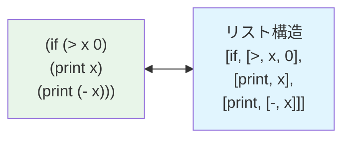

Lisp マクロは関数とは根本的に異なる。関数は **値** を受け取り **値** を返すが、マクロは **コード（S式）** を受け取り **コード（S式）** を返す。マクロはコンパイル時（またはマクロ展開時）に実行され、返されたコードが元のマクロ呼び出しの位置に挿入される。

```lisp
;; Common Lisp macro example: unless
(defmacro unless (condition &body body)
  `(if (not ,condition)
       (progn ,@body)))

;; Usage
(unless (> x 0)
  (format t "x is not positive~%")
  (setf x 0))

;; Expands to:
;; (if (not (> x 0))
;;     (progn
;;       (format t "x is not positive~%")
;;       (setf x 0)))
```

バッククォート（`` ` ``）構文は **準引用（quasiquote）** と呼ばれ、テンプレートのようにコードの骨格を記述しつつ、カンマ（`,`）で展開する部分を指定できる。`,@` はリストをスプライスする（展開して埋め込む）ための構文である。

### 3.2 マクロの展開プロセス

Lisp のマクロ展開は多段階で行われる。マクロが別のマクロを呼び出す場合、外側から順に（または処理系の方針に従って）再帰的に展開される。

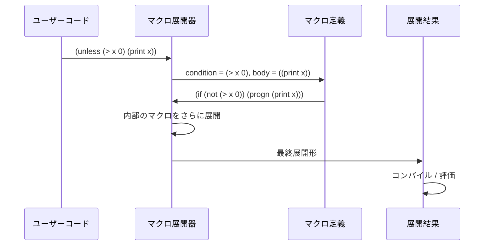

### 3.3 変数キャプチャ問題

Common Lisp のマクロには **変数キャプチャ** という深刻な問題がある。マクロが内部で導入する変数名が、マクロ呼び出し側の変数名と衝突する可能性がある。

```lisp
;; Broken macro: variable capture problem
(defmacro swap! (a b)
  `(let ((tmp ,a))
     (setf ,a ,b)
     (setf ,b tmp)))

;; This works fine
(let ((x 1) (y 2))
  (swap! x y))

;; But this fails! 'tmp' clashes with the macro's internal 'tmp'
(let ((tmp 1) (y 2))
  (swap! tmp y))
;; Expands to:
;; (let ((tmp tmp))  ; tmp refers to itself!
;;   (setf tmp y)
;;   (setf y tmp))
```

Common Lisp ではこの問題を `gensym`（一意なシンボルの生成）で回避する。

```lisp
;; Safe macro using gensym
(defmacro swap! (a b)
  (let ((tmp (gensym "TMP")))
    `(let ((,tmp ,a))
       (setf ,a ,b)
       (setf ,b ,tmp))))
```

`gensym` はプログラム中で絶対に衝突しない一意なシンボルを生成するため、変数キャプチャを確実に防止する。

### 3.4 衛生的マクロ（Hygienic Macros）

Scheme は変数キャプチャ問題に対して、より根本的な解決策を提供した。**衛生的マクロ（hygienic macros）** は、マクロが導入する束縛が呼び出し側のスコープを汚染しないことを **言語レベルで保証** する仕組みである。

Scheme の `syntax-rules` はパターンマッチに基づく衛生的マクロシステムである。

```scheme
;; Scheme hygienic macro using syntax-rules
(define-syntax swap!
  (syntax-rules ()
    ((swap! a b)
     (let ((tmp a))
       (set! a b)
       (set! b tmp)))))

;; This is safe even with a variable named 'tmp'
(let ((tmp 1) (y 2))
  (swap! tmp y)
  ;; tmp = 2, y = 1 — correct!
  )
```

衛生的マクロの実装では、マクロ定義時のスコープとマクロ使用時のスコープを区別するために、識別子にスコープ情報（**染色情報**）を付加する。これにより、同じ名前の変数であってもどのスコープに属するかが明確に区別される。

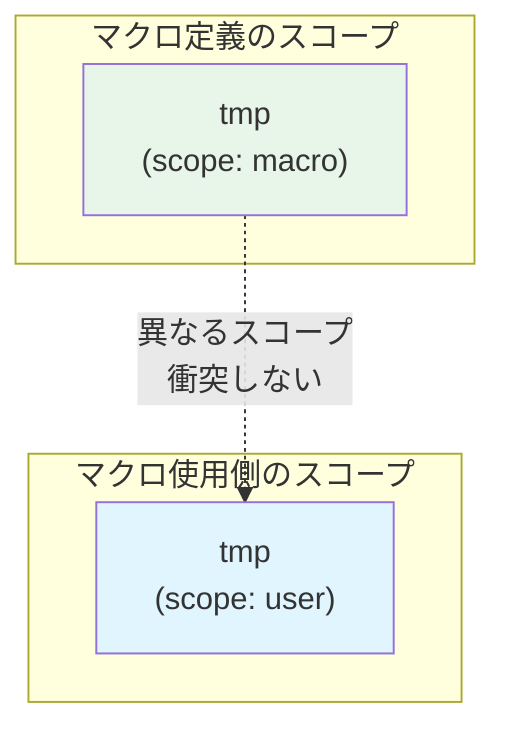

Racket（Scheme の後継）はさらに進化した `syntax-parse` を提供し、パターンマッチの表現力とエラーメッセージの品質を大幅に向上させている。

### 3.5 Lisp マクロの実践的用途

Lisp マクロは単なるシンタックスシュガーにとどまらず、ドメイン固有言語（DSL）の構築に威力を発揮する。

```lisp
;; DSL for HTML generation
(defmacro html (&body body)
  `(with-output-to-string (*standard-output*)
     ,@(mapcar #'html-expand body)))

(defmacro tag (name attrs &body body)
  `(progn
     (format t "<~a~a>" ',name ,(attrs-to-string attrs))
     ,@body
     (format t "</~a>" ',name)))

;; Usage: looks like a declarative HTML template
(html
  (tag div (:class "container")
    (tag h1 () "Hello, World!")
    (tag p (:id "content") "This is Lisp.")))
```

このように Lisp マクロを使えば、ホスト言語の構文を拡張して、特定のドメインに最適化された記述法を実現できる。

## 4. Rust の proc_macro

### 4.1 Rust のマクロシステム概観

Rust は 2 種類のマクロシステムを提供している。

1. **宣言的マクロ（Declarative Macros）**：`macro_rules!` で定義するパターンマッチベースのマクロ
2. **手続き的マクロ（Procedural Macros）**：`proc_macro` クレートを使い、Rust コードでトークンストリームを変換するマクロ

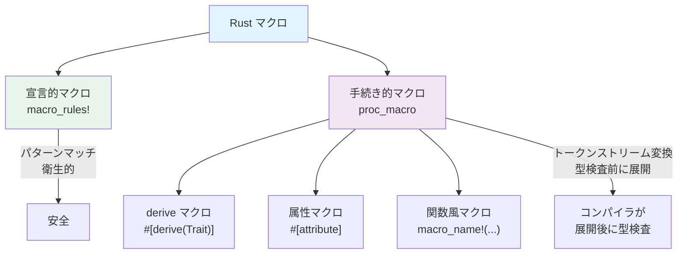

### 4.2 宣言的マクロ（macro_rules!）

`macro_rules!` は Scheme の `syntax-rules` に着想を得たパターンマッチベースのマクロシステムである。

```rust
// Declarative macro for creating a HashMap
macro_rules! hashmap {
    // Base case: empty map
    () => {
        ::std::collections::HashMap::new()
    };
    // Recursive case: key-value pairs
    ($($key:expr => $value:expr),+ $(,)?) => {
        {
            let mut map = ::std::collections::HashMap::new();
            $(map.insert($key, $value);)+
            map
        }
    };
}

// Usage
let scores = hashmap! {
    "Alice" => 95,
    "Bob" => 87,
    "Charlie" => 92,
};
```

`macro_rules!` は **部分的に衛生的** である。マクロ内で導入されるローカル変数はマクロ展開のスコープで隔離されるが、型名やトレイト名などの一部の識別子はスコープを越えてアクセスされる。

### 4.3 手続き的マクロ（proc_macro）

`proc_macro` は Rust のメタプログラミングの中核を担う機能である。手続き的マクロは独立したクレート（`proc-macro = true` を指定したライブラリクレート）として実装され、コンパイラのトークンストリームを入力として受け取り、変換されたトークンストリームを出力する。


最も広く使われている手続き的マクロの形態が **derive マクロ** である。以下は `Debug` のような自動実装を行う derive マクロの例である。

```rust
// proc-macro crate: my_derive/src/lib.rs
use proc_macro::TokenStream;
use quote::quote;
use syn::{parse_macro_input, DeriveInput, Data, Fields};

#[proc_macro_derive(Describe)]
pub fn derive_describe(input: TokenStream) -> TokenStream {
    let input = parse_macro_input!(input as DeriveInput);
    let name = &input.ident;

    // Extract field names
    let field_descriptions = match &input.data {
        Data::Struct(data) => match &data.fields {
            Fields::Named(fields) => {
                let descs: Vec<_> = fields.named.iter().map(|f| {
                    let fname = &f.ident;
                    let ftype = &f.ty;
                    quote! {
                        format!("  {}: {}", stringify!(#fname), stringify!(#ftype))
                    }
                }).collect();
                quote! { vec![#(#descs),*] }
            }
            _ => quote! { vec![] },
        },
        _ => quote! { vec![] },
    };

    // Generate implementation
    let expanded = quote! {
        impl #name {
            pub fn describe() -> String {
                let fields = #field_descriptions;
                format!("{} {{\n{}\n}}", stringify!(#name), fields.join("\n"))
            }
        }
    };

    TokenStream::from(expanded)
}
```

```rust
// Usage in application code
#[derive(Describe)]
struct User {
    name: String,
    age: u32,
    email: String,
}

fn main() {
    println!("{}", User::describe());
    // Output:
    // User {
    //   name: String
    //   age: u32
    //   email: String
    // }
}
```

### 4.4 syn と quote エコシステム

Rust の `proc_macro` エコシステムは、2つの重要なクレートに支えられている。

- **`syn`**：トークンストリームを Rust の AST（抽象構文木）にパースする
- **`quote`**：Rust コードのテンプレートからトークンストリームを生成する

`syn` は `TokenStream` を `DeriveInput`、`ItemFn`、`Expr` などの構造化された AST ノードに変換し、`quote` の `quote!` マクロは逆に Rust コードの断片をトークンストリームに変換する。`#variable` 構文でRustの値を生成コード内に埋め込むことができる。

### 4.5 属性マクロの例

属性マクロは任意のアイテム（関数、構造体、モジュールなど）に適用でき、アイテム全体を変換する。Web フレームワークの Axum や Actix-web で多用されている。

```rust
// Attribute macro example: timing decorator
#[proc_macro_attribute]
pub fn timed(_attr: TokenStream, item: TokenStream) -> TokenStream {
    let input = parse_macro_input!(item as syn::ItemFn);
    let fn_name = &input.sig.ident;
    let fn_block = &input.block;
    let fn_sig = &input.sig;
    let fn_vis = &input.vis;

    let expanded = quote! {
        #fn_vis #fn_sig {
            let _start = ::std::time::Instant::now();
            let _result = (|| #fn_block)();
            let _elapsed = _start.elapsed();
            eprintln!("[timed] {} took {:?}", stringify!(#fn_name), _elapsed);
            _result
        }
    };

    TokenStream::from(expanded)
}

// Usage
#[timed]
fn compute_heavy() -> u64 {
    (0..1_000_000).sum()
}
```

## 5. テンプレートメタプログラミング（C++）

### 5.1 意図せぬ発見

C++ テンプレートメタプログラミング（Template Metaprogramming, TMP）の歴史は興味深い。C++ テンプレートは本来、型パラメータを持つ汎用的なコードを書くための機構（ジェネリクス）として設計された。しかし 1994 年に Erwin Unruh が C++ の標準化委員会で、コンパイラのエラーメッセージに素数列を出力するプログラムを発表したことで、テンプレートシステムが **チューリング完全** であることが明らかになった。つまり、C++ のコンパイラ自体が一種の計算機として機能するのである。

### 5.2 基本原理：再帰的テンプレート特殊化

テンプレートメタプログラミングの基本的な手法は、テンプレートの特殊化（specialization）を使った再帰的な計算である。

```cpp
// Compile-time factorial using template metaprogramming
template <int N>
struct Factorial {
    static constexpr int value = N * Factorial<N - 1>::value;
};

// Base case: specialization for N = 0
template <>
struct Factorial<0> {
    static constexpr int value = 1;
};

// Usage: computed entirely at compile time
static_assert(Factorial<5>::value == 120);
static_assert(Factorial<10>::value == 3628800);
```

この計算はすべてコンパイル時に実行される。`Factorial<5>::value` はコンパイル後のバイナリにはリテラル `120` として埋め込まれ、実行時のオーバーヘッドはゼロである。

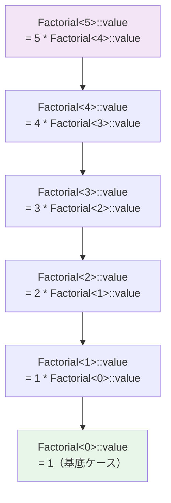

### 5.3 SFINAE と型特性

**SFINAE（Substitution Failure Is Not An Error）** は C++ テンプレートの重要な原則であり、テンプレートパラメータの置換に失敗した場合、それをエラーとせず候補から除外するだけにとどめるというルールである。この性質を活用して、型の特性に基づくコンパイル時の条件分岐が可能になる。

```cpp
#include <type_traits>

// SFINAE: enable only for integral types
template <typename T>
typename std::enable_if<std::is_integral<T>::value, T>::type
safe_divide(T a, T b) {
    if (b == 0) throw std::runtime_error("Division by zero");
    return a / b;
}

// SFINAE: enable only for floating-point types
template <typename T>
typename std::enable_if<std::is_floating_point<T>::value, T>::type
safe_divide(T a, T b) {
    if (b == T(0)) return std::numeric_limits<T>::infinity();
    return a / b;
}
```

### 5.4 constexpr と consteval（モダン C++）

C++11 で導入された `constexpr`、さらに C++20 の `consteval` は、テンプレートメタプログラミングの複雑さを大幅に緩和した。通常の関数構文でコンパイル時計算を記述できるようになったのである。

```cpp
// C++17 constexpr: readable compile-time computation
constexpr int factorial(int n) {
    int result = 1;
    for (int i = 2; i <= n; ++i) {
        result *= i;
    }
    return result;
}

static_assert(factorial(5) == 120);

// C++20 consteval: guaranteed compile-time evaluation
consteval int compile_time_only(int n) {
    return n * n;
}

int x = compile_time_only(5); // OK: computed at compile time
// int y = compile_time_only(runtime_value); // Error: must be compile-time
```

`constexpr` は「コンパイル時に評価可能」であることを示し、`consteval` は「必ずコンパイル時に評価される」ことを強制する。この区別により、意図しない実行時計算へのフォールバックを防止できる。

### 5.5 C++20 Concepts

C++20 で導入された **Concepts** は、テンプレートパラメータに対する制約を明示的に記述する仕組みである。従来の SFINAE に比べて、意図が明確で、エラーメッセージも格段に改善される。

```cpp
#include <concepts>

// Define a concept
template <typename T>
concept Numeric = std::integral<T> || std::floating_point<T>;

// Use concept as constraint
template <Numeric T>
T safe_add(T a, T b) {
    // Overflow check for integral types
    if constexpr (std::integral<T>) {
        if (a > 0 && b > std::numeric_limits<T>::max() - a) {
            throw std::overflow_error("Integer overflow");
        }
    }
    return a + b;
}
```

## 6. リフレクション

### 6.1 リフレクションとは

**リフレクション（reflection）** とは、プログラムが実行時に自身の構造（型、メソッド、フィールド、アノテーションなど）を調査・操作する能力である。コンパイル時メタプログラミングが「生成」に重点を置くのに対し、リフレクションは「内省（introspection）」と「動的操作」に重点を置く。

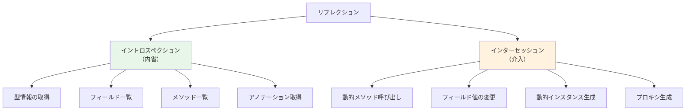

### 6.2 Java のリフレクション

Java のリフレクション API（`java.lang.reflect` パッケージ）は、最も広く知られたリフレクション機構の一つである。JVM がクラスのメタデータを保持しているため、実行時に型情報を完全に取得できる。

```java
import java.lang.reflect.*;

public class ReflectionDemo {
    public static void printClassInfo(Class<?> clazz) {
        System.out.println("Class: " + clazz.getName());

        // List all declared fields
        for (Field f : clazz.getDeclaredFields()) {
            System.out.printf("  Field: %s %s%n",
                f.getType().getSimpleName(), f.getName());
        }

        // List all declared methods
        for (Method m : clazz.getDeclaredMethods()) {
            System.out.printf("  Method: %s %s(%s)%n",
                m.getReturnType().getSimpleName(),
                m.getName(),
                Arrays.stream(m.getParameterTypes())
                    .map(Class::getSimpleName)
                    .collect(Collectors.joining(", ")));
        }
    }

    // Dynamic method invocation
    public static Object invokeByName(Object obj, String methodName,
                                       Object... args) throws Exception {
        Class<?>[] paramTypes = Arrays.stream(args)
            .map(Object::getClass)
            .toArray(Class<?>[]::new);
        Method method = obj.getClass().getMethod(methodName, paramTypes);
        return method.invoke(obj, args);
    }
}
```

Java のリフレクションは、Spring Framework の DI（依存性注入）、JPA/Hibernate の O/R マッピング、Jackson の JSON シリアライズなど、Java エコシステムの根幹を支える技術である。

::: warning リフレクションのパフォーマンスコスト
Java のリフレクションによるメソッド呼び出しは、通常のメソッド呼び出しに比べて数倍〜数十倍遅い。JVM はリフレクション呼び出しを一定回数（デフォルト15回）以上繰り返すとバイトコードを動的生成してインライン化を試みるが、それでも通常の呼び出しには及ばない。性能が重要な箇所では `MethodHandle`（Java 7+）や `invokedynamic` の利用を検討すべきである。
:::

### 6.3 C# のリフレクションと式木

C# は Java と同様に充実したリフレクション API を持つが、さらに **式木（Expression Trees）** という独自の機構を提供している。式木はコードをデータ構造として表現し、実行時に解析・変換・コンパイルすることができる。

```csharp
using System.Linq.Expressions;

// Build an expression tree: (x, y) => x + y
var x = Expression.Parameter(typeof(int), "x");
var y = Expression.Parameter(typeof(int), "y");
var add = Expression.Add(x, y);
var lambda = Expression.Lambda<Func<int, int, int>>(add, x, y);

// Compile and execute
Func<int, int, int> compiled = lambda.Compile();
Console.WriteLine(compiled(3, 4)); // Output: 7
```

式木は LINQ to SQL や Entity Framework の中核技術であり、C# のラムダ式を SQL クエリに変換する際に使用される。`IQueryable<T>` に対する LINQ クエリは、式木として解析され、データベースのクエリ言語に翻訳される。

### 6.4 Python のリフレクションとメタクラス

Python はリフレクションが言語設計の中心に据えられた言語である。すべてのオブジェクトは `__dict__` 属性を持ち、属性へのアクセスは `__getattr__`、`__setattr__` でカスタマイズできる。

```python
import inspect

class AutoRepr:
    """Metaclass-like mixin that auto-generates __repr__"""
    def __repr__(self):
        cls = type(self)
        fields = vars(self)
        field_str = ", ".join(f"{k}={v!r}" for k, v in fields.items())
        return f"{cls.__name__}({field_str})"

class User(AutoRepr):
    def __init__(self, name: str, age: int):
        self.name = name
        self.age = age

user = User("Alice", 30)
print(user)  # User(name='Alice', age=30)

# Introspection
print(type(user))              # <class '__main__.User'>
print(inspect.getmembers(user)) # List all attributes and methods
print(inspect.getsource(User))  # Get source code of the class
```

Python の **メタクラス（metaclass）** は、クラスの生成過程をカスタマイズする強力な仕組みである。クラスもオブジェクトであるという Python の原則に基づき、クラスを生成する「クラスのクラス」を定義できる。

```python
class ValidatedMeta(type):
    """Metaclass that enforces type annotations at __init__"""
    def __call__(cls, *args, **kwargs):
        instance = super().__call__(*args, **kwargs)
        hints = getattr(cls.__init__, '__annotations__', {})
        for attr, expected_type in hints.items():
            if attr == 'return':
                continue
            value = getattr(instance, attr, None)
            if value is not None and not isinstance(value, expected_type):
                raise TypeError(
                    f"{attr} must be {expected_type.__name__}, "
                    f"got {type(value).__name__}"
                )
        return instance

class Config(metaclass=ValidatedMeta):
    def __init__(self, host: str, port: int, debug: bool):
        self.host = host
        self.port = port
        self.debug = debug

config = Config("localhost", 8080, True)   # OK
# Config("localhost", "8080", True)         # TypeError: port must be int
```

Python 3.7 以降ではデコレータの `@dataclasses.dataclass` がメタプログラミングの実践例として広く使われている。これはクラス定義を解析し、`__init__`、`__repr__`、`__eq__` などのメソッドを自動生成する。

```python
from dataclasses import dataclass, field
from typing import List

@dataclass
class Article:
    title: str
    author: str
    tags: List[str] = field(default_factory=list)
    published: bool = False

    # __init__, __repr__, __eq__ are auto-generated
```

### 6.5 リフレクションの型安全性問題

リフレクションの最大の課題は **型安全性の喪失** である。リフレクションを通じたフィールドアクセスやメソッド呼び出しは、コンパイラの型検査を迂回する。フィールド名やメソッド名を文字列で指定するため、タイプミスやシグネチャの変更がコンパイル時に検出されず、実行時エラーとなる。

```java
// Dangerous: bypasses type safety
Field field = obj.getClass().getDeclaredField("nane"); // Typo!
field.setAccessible(true);
field.set(obj, "value"); // Runtime: NoSuchFieldException
```

この問題に対して、各言語・フレームワークは以下のようなアプローチで緩和を図っている。

- **アノテーションプロセッサ**（Java）：コンパイル時にアノテーションを解析してコードを生成し、リフレクションの使用を最小化する
- **Source Generators**（C#）：コンパイル時にソースコードを自動生成する仕組み
- **コンパイル時リフレクション**（Zig, 将来の C++）：実行時ではなくコンパイル時に型情報を取得し、静的にコードを生成する

## 7. コード生成

### 7.1 コード生成とは

**コード生成（code generation）** は、メタプログラミングの中でも最も直接的な手法である。何らかの入力（スキーマ定義、インターフェース記述、設定ファイルなど）からソースコードを自動的に生成し、それを通常のコンパイルプロセスに組み込む。

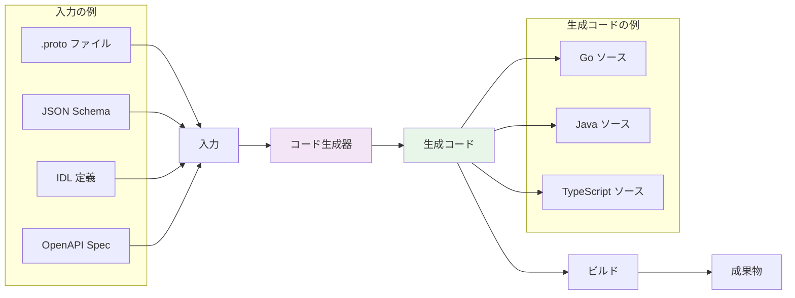

コード生成の大きな利点は、**生成されたコードが通常のコードと同じ型検査やコンパイルを受ける** ことである。リフレクションのような実行時の型安全性の喪失がなく、IDE のコード補完やリファクタリング支援も通常通り機能する。

### 7.2 go generate

Go 言語はリフレクションの機能が限定的であり、ジェネリクスも長らくサポートされていなかった（Go 1.18 で導入）。そのため、Go のエコシステムではコード生成が重要な役割を果たしている。`go generate` は Go ツールチェインに組み込まれたコード生成の仕組みである。

```go
// types.go
package models

//go:generate stringer -type=Color
type Color int

const (
    Red Color = iota
    Green
    Blue
    Yellow
)
```

`go generate` を実行すると、ソースファイル中の `//go:generate` コメントに記述されたコマンドが実行される。上の例では `stringer` ツールが `Color` 型の `String()` メソッドを自動生成する。

```go
// color_string.go (auto-generated)
// Code generated by "stringer -type=Color"; DO NOT EDIT.

package models

import "strconv"

func _() {
    // An "invalid array index" compiler error signifies
    // that the constant values have changed.
    var x [1]struct{}
    _ = x[Red-0]
    _ = x[Green-1]
    _ = x[Blue-2]
    _ = x[Yellow-3]
}

const _Color_name = "RedGreenBlueYellow"

var _Color_index = [...]uint8{0, 3, 8, 12, 18}

func (i Color) String() string {
    if i < 0 || i >= Color(len(_Color_index)-1) {
        return "Color(" + strconv.FormatInt(int64(i), 10) + ")"
    }
    return _Color_name[_Color_index[i]:_Color_index[i+1]]
}
```

### 7.3 Protocol Buffers

**Protocol Buffers（protobuf）** は Google が開発したインターフェース定義言語（IDL）とシリアライゼーションフレームワークであり、コード生成の代表的な成功例である。

```protobuf
// user.proto
syntax = "proto3";

package example;

message User {
  string name = 1;
  int32 age = 2;
  repeated string tags = 3;
}

service UserService {
  rpc GetUser(GetUserRequest) returns (User);
  rpc ListUsers(ListUsersRequest) returns (stream User);
}
```

この `.proto` ファイルから `protoc` コンパイラが Go、Java、Python、C++ など多数の言語のコードを生成する。生成されたコードにはシリアライズ / デシリアライズのロジック、gRPC のサーバー / クライアントスタブが含まれ、すべて型安全である。

### 7.4 OpenAPI / Swagger

REST API の世界では **OpenAPI（旧 Swagger）** 仕様が広く採用されている。API 仕様書から各言語のクライアント SDK やサーバースタブを自動生成でき、API の型安全性とドキュメントの同期を保証する。

コード生成のアプローチは「コードファースト」と「スキーマファースト」に大別される。

| アプローチ | 説明 | 利点 | 欠点 |
|-----------|------|------|------|
| スキーマファースト | スキーマ/仕様からコードを生成 | API 設計の一貫性、複数言語対応 | 生成コードのカスタマイズが制限的 |
| コードファースト | コードからスキーマ/仕様を生成 | 開発速度、柔軟性 | 仕様とコードの乖離リスク |

## 8. AST 変換

### 8.1 AST とは

**抽象構文木（Abstract Syntax Tree, AST）** は、ソースコードの構造を木構造で表現したものである。AST 変換によるメタプログラミングは、ソースコードをパースして AST を構築し、その木構造を操作（ノードの追加・削除・変換）した上で、再びソースコードまたはバイトコードに変換するという手法である。

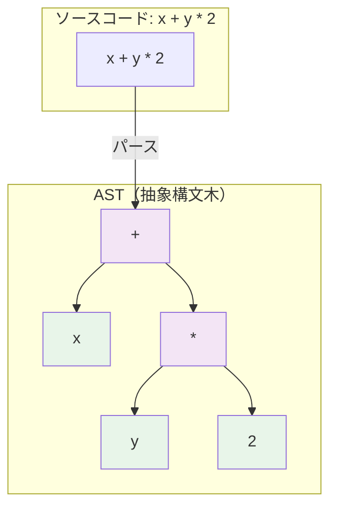

### 8.2 Babel プラグインによる JavaScript の AST 変換

JavaScript エコシステムでは **Babel** が AST 変換の中心的なツールである。Babel は JavaScript / TypeScript のコードをパースして AST に変換し、プラグインによる変換パイプラインを経て、目的のコードを出力する。


Babel プラグインは **Visitor パターン** に基づいて AST ノードを走査・変換する。

```javascript
// Babel plugin: transform console.log to include file and line info
module.exports = function ({ types: t }) {
  return {
    visitor: {
      CallExpression(path) {
        const callee = path.get("callee");
        // Match console.log calls
        if (
          callee.isMemberExpression() &&
          callee.get("object").isIdentifier({ name: "console" }) &&
          callee.get("property").isIdentifier({ name: "log" })
        ) {
          const { line, column } = path.node.loc.start;
          const filename = this.filename || "unknown";

          // Prepend location string to arguments
          const locationArg = t.stringLiteral(
            `[${filename}:${line}:${column}]`
          );
          path.node.arguments.unshift(locationArg);
        }
      },
    },
  };
};

// Before transformation:
// console.log("hello");
// After transformation:
// console.log("[src/index.js:5:0]", "hello");
```

### 8.3 Elixir のマクロと AST 操作

Elixir は Lisp の伝統を受け継ぎ、AST をファーストクラスのデータ構造として扱うマクロシステムを備えている。Elixir の AST は `{atom, metadata, arguments}` という 3 要素タプルで表現される。

```elixir
# Elixir AST representation
quote do
  1 + 2
end
# => {:+, [context: Elixir, imports: [{1, Kernel}]], [1, 2]}

# Simple macro example
defmodule MyMacros do
  defmacro unless(condition, do: block) do
    quote do
      if !unquote(condition) do
        unquote(block)
      end
    end
  end
end

# Usage
require MyMacros
MyMacros.unless false do
  IO.puts("This will be printed")
end
```

Elixir のマクロシステムは **衛生的** であり、マクロ内部で導入される変数は呼び出し側のスコープとは隔離される。意図的にスコープを突破したい場合は `var!(variable)` を使用する。

### 8.4 AST 変換の応用例

AST 変換は多様な場面で活用されている。

- **トランスパイル**：TypeScript から JavaScript への変換、JSX から `React.createElement` 呼び出しへの変換
- **最適化**：デッドコードの除去、定数畳み込み、ツリーシェイキング
- **計装（Instrumentation）**：テストカバレッジの測定（Istanbul/nyc）、パフォーマンスプロファイリング
- **構文拡張**：デコレータ構文、オプショナルチェイニング（`?.`）の古い環境向けの変換
- **静的解析**：ESLint によるコード品質チェック、セキュリティ脆弱性の検出

## 9. メタプログラミングの利点とリスク

### 9.1 利点

**ボイラープレートの削減**

メタプログラミングの最も直接的な利点は、反復的なコードの自動生成による生産性の向上である。Rust の `#[derive(Debug, Clone, PartialEq)]` は数行のアノテーションで数十行のコードを自動生成し、Java の Lombok は `@Data` 一つでゲッター、セッター、`equals`、`hashCode`、`toString` を生成する。

**抽象化レベルの向上**

通常の関数やクラスでは表現できない抽象化をメタプログラミングは可能にする。たとえば、「すべてのパブリックメソッドの実行前後にログを出力する」という横断的関心事は、通常のオブジェクト指向の手法だけでは困難だが、AOP（アスペクト指向プログラミング）のバイトコード変換やプロキシ生成によって実現できる。

**型安全なコード生成**

Protocol Buffers や gRPC のコード生成は、スキーマから型安全なコードを自動生成し、異なる言語間の通信プロトコルの一貫性を保証する。手書きのシリアライゼーションコードに比べて、バグの混入リスクが大幅に低減する。

**ドメイン固有言語（DSL）の構築**

メタプログラミングにより、特定のドメインに最適化された記述法を実現できる。Elixir の Ecto（データベースクエリ DSL）、Ruby の RSpec（テスト DSL）、Gradle のビルドスクリプトなどが好例である。

### 9.2 リスク

**複雑性の増大**

メタプログラミングはコードの理解を困難にする。マクロが展開されたコードを頭の中で追跡する必要があり、デバッグ時にはマクロ展開の各段階を理解しなければならない。「コードを読んでも、実際に実行されるコードがわからない」という状態は、メンテナンスコストを大幅に増加させる。

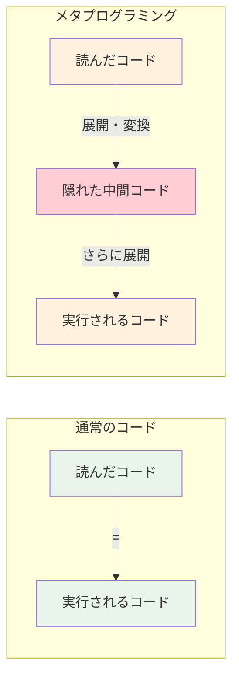

**デバッグの困難さ**

マクロによって生成されたコードでエラーが発生した場合、エラーメッセージが生成前のコードの位置を正しく指さないことがある。特に C++ テンプレートのエラーメッセージは、テンプレートの深いインスタンス化チェインを表示するため、数百行に及ぶ難解なメッセージとなることがある。

**コンパイル時間の増大**

テンプレートメタプログラミングや大規模なマクロ展開は、コンパイル時間を劇的に増加させる。C++ では Boost ライブラリのヘッダーをインクルードするだけで数秒のコンパイル時間が追加されることがある。Rust の `proc_macro` も、`syn` クレートによる完全な AST パースを行うため、コンパイル時間への影響が無視できない。

**ツール対応の限界**

IDE のコード補完、静的解析、リファクタリング支援は、マクロによって生成されるコードを完全には理解できないことがある。rust-analyzer は `proc_macro` の展開結果を解析する機能を持っているが、すべてのマクロに対して完璧に動作するわけではない。

**安全性の懸念**

`proc_macro` クレートはコンパイル時に任意の Rust コードを実行できるため、悪意のあるマクロがビルド時にファイルシステムへのアクセスやネットワーク通信を行う可能性がある。これはサプライチェーン攻撃のリスクとなる。

### 9.3 メタプログラミングの設計指針

メタプログラミングを効果的に活用するための指針をまとめる。

**1. まず通常の抽象化を試みる**

関数、ジェネリクス、トレイト / インターフェース、高階関数——これらの通常の抽象化機構で問題を解決できないかを最初に検討する。メタプログラミングは通常の抽象化では不十分な場合の「最後の手段」として位置づけるべきである。

**2. 展開結果を可視化可能にする**

マクロやコード生成を使用する場合、展開・生成結果を簡単に確認できる手段を用意する。Rust の `cargo expand`、C のプリプロセッサ出力（`gcc -E`）、Babel の AST Explorer などが有用である。

**3. エラーメッセージの品質を重視する**

マクロの利用者が不正な入力を行った場合に、理解しやすいエラーメッセージを提供する。Rust の `proc_macro` では `compile_error!` マクロ、`syn` の `Error` 型を使って適切なスパン情報付きのエラーを生成できる。

**4. ドキュメントを充実させる**

マクロが何を生成するのか、どのような制約があるのかを明確にドキュメント化する。展開例を含めることで、利用者がマクロの動作を直感的に理解できるようにする。

**5. テストを書く**

マクロ自体のテスト（展開結果が期待通りかの検証）と、マクロを使用するコードのテストの両方を書く。Rust の `trybuild` クレートは、コンパイルエラーが期待通りに発生するかを検証するテストフレームワークであり、`proc_macro` のテストに有用である。

## 10. まとめと今後の展望

メタプログラミングは、「コードを書くコード」という再帰的な発想に基づく強力な技法群である。C のプリプロセッサから Lisp のマクロ、C++ のテンプレート、Rust の `proc_macro`、各言語のリフレクション、外部コード生成に至るまで、その形態は多様であるが、根底にあるのは「繰り返しを排除し、より高い抽象度でプログラムを記述したい」という共通の動機である。

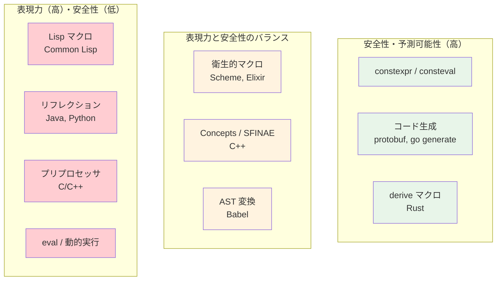

今後の方向性として注目すべきトレンドがいくつかある。

**コンパイル時計算の充実**：Zig の `comptime` は、通常の関数構文でコンパイル時計算を記述できる革新的なアプローチであり、テンプレートメタプログラミングの複雑さを排除しつつ同等の表現力を実現している。C++ の `constexpr` / `consteval` も同様の方向に進化を続けている。

**コンパイル時リフレクション**：C++26 で提案されている静的リフレクション機能（P2996）は、実行時リフレクションのパフォーマンスコストなしに型情報をコンパイル時に取得・操作できるようにするものであり、テンプレートメタプログラミングの多くのユースケースを置き換える可能性がある。

**型安全なマクロシステムの普及**：Rust の `proc_macro` が示したように、型システムと統合されたマクロシステムへの需要が高まっている。Swift のマクロシステム（Swift 5.9）も、型安全性を重視した設計となっている。

**AI によるコード生成**：大規模言語モデル（LLM）によるコード生成は、従来のメタプログラミングとは異なるアプローチで「コードを書くコード」を実現している。ただし、型安全性の保証や決定論的な動作という点では、従来のメタプログラミング技法に及ばない。両者は競合するものではなく、それぞれの強みを生かして補完的に使われていくと考えられる。

メタプログラミングは強力であるがゆえに、濫用のリスクも大きい。その適用に際しては、「この複雑さは、得られる利益に見合うか」を常に問い続ける姿勢が求められる。適切に使えばコードベースの品質と生産性を劇的に向上させるが、不適切に使えばメンテナンス不能な「魔法のコード」を生み出す。メタプログラミングの真の習熟とは、その力を **使わない** 判断ができることでもある。
