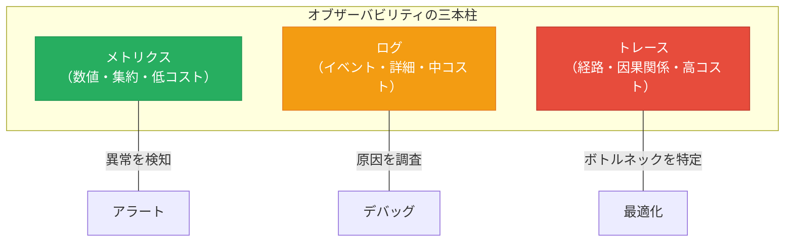
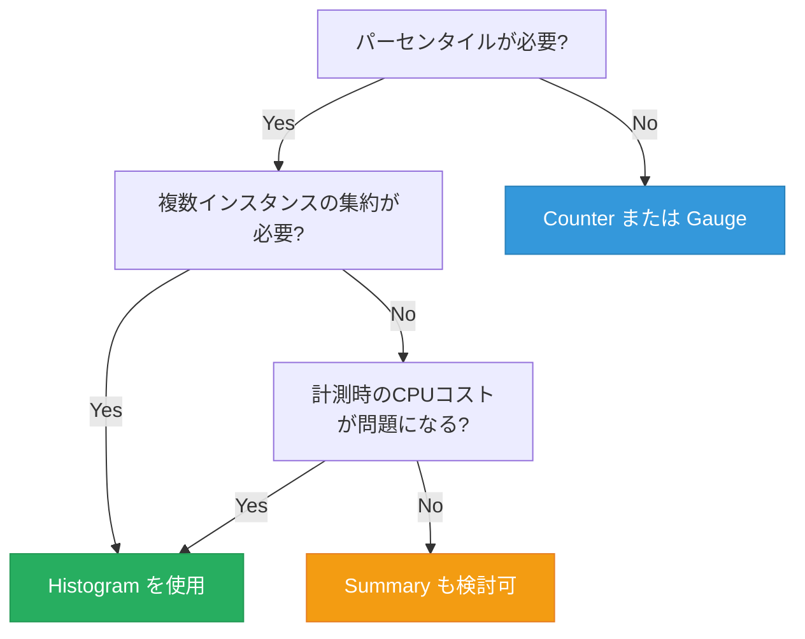
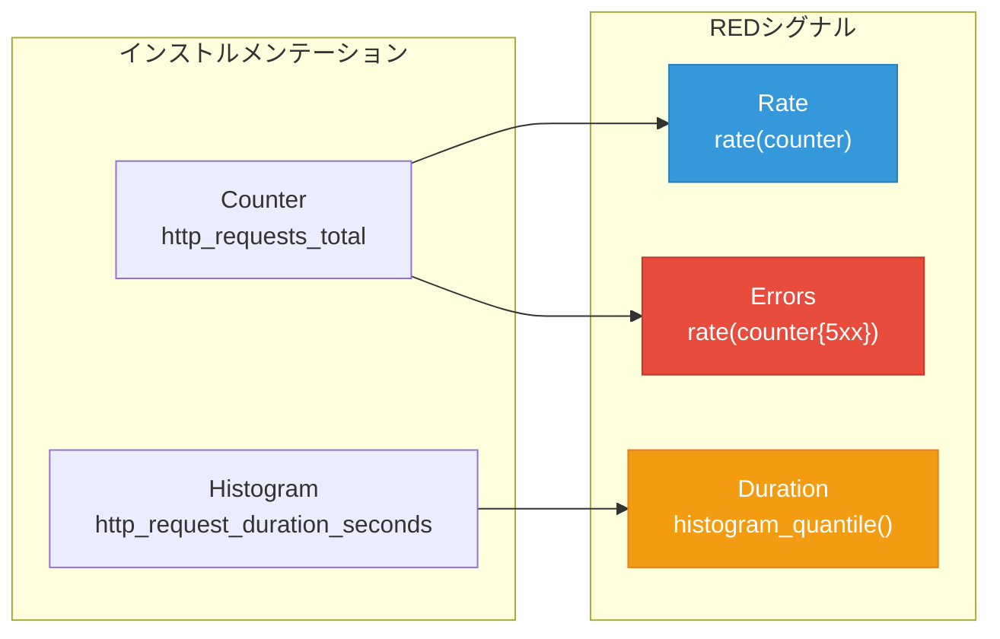
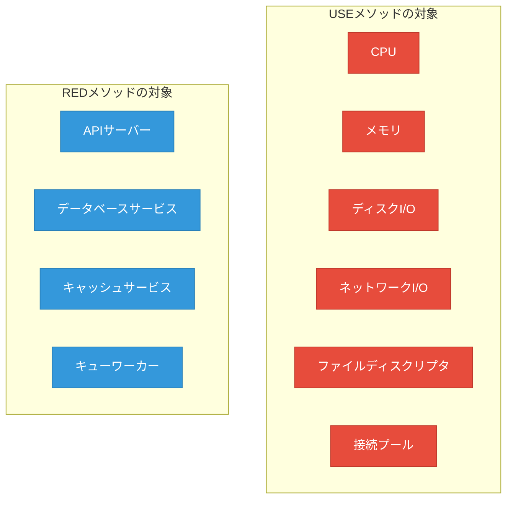
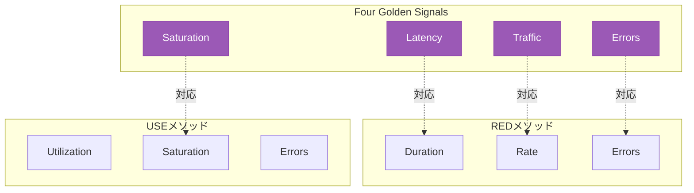
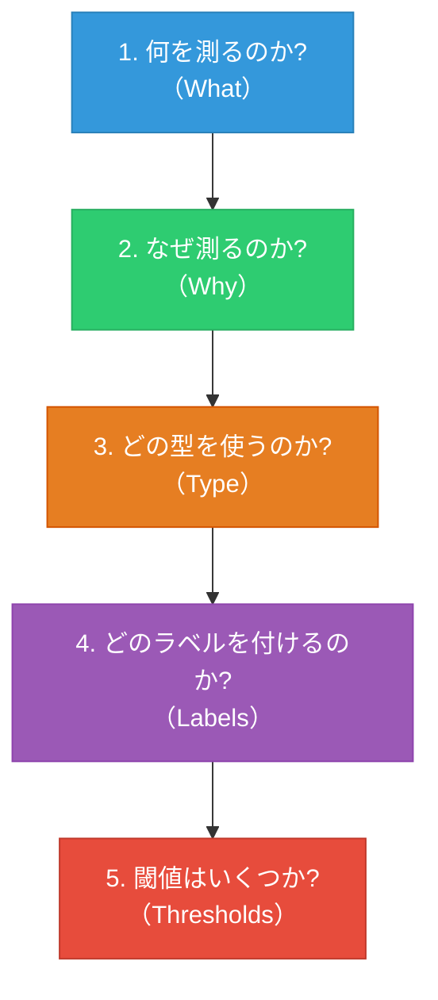
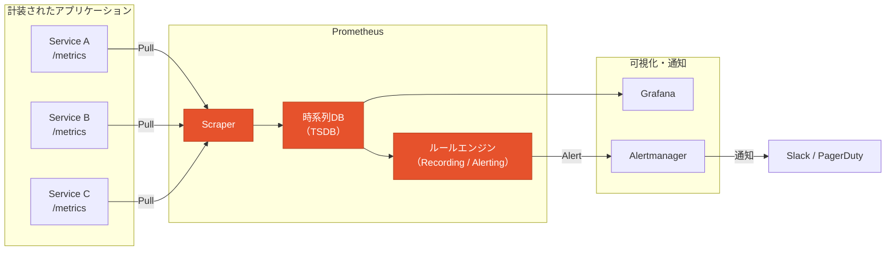
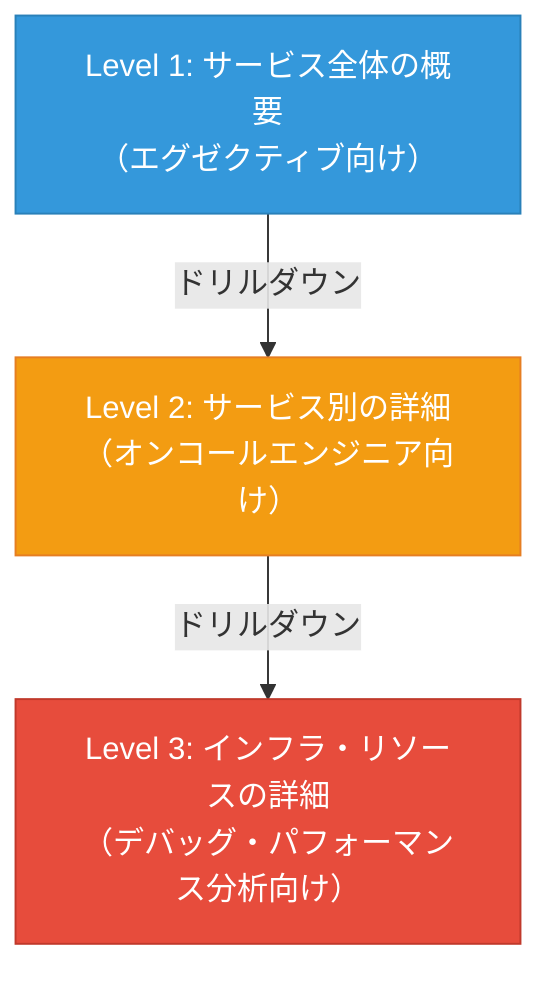

# メトリクス設計（RED/USEメソッド, カスタムメトリクス）

## 1. メトリクスの基本概念 — なぜ「測る」のか

### 1.1 オブザーバビリティの三本柱とメトリクスの位置づけ

現代のソフトウェアシステム運用において、「オブザーバビリティ（Observability）」は不可欠な概念となっている。オブザーバビリティは一般に三つの柱で構成される。

1. **メトリクス（Metrics）**: 時系列の数値データ。システムの状態を定量的に表現する
2. **ログ（Logs）**: 離散的なイベントの記録。特定の出来事の詳細を保持する
3. **トレース（Traces）**: リクエストがシステムを横断する際の経路と所要時間の記録

この三つの中で、メトリクスは最もコスト効率に優れたシグナルである。ログは1リクエストごとに数十〜数百バイトのデータを生成するが、メトリクスは数千リクエストの情報を一つの数値（例：「過去1分間のリクエスト数 = 1,234」）に集約できる。ストレージコスト、クエリ速度、アラート設定の容易さのいずれにおいても、メトリクスはシステム監視の第一選択肢となる。



### 1.2 メトリクスとは何か

メトリクスとは、ある時点におけるシステムの状態を数値で表現したものである。メトリクスは本質的に以下の要素で構成される。

- **メトリクス名**: 何を測っているかを示す識別子（例：`http_requests_total`）
- **ラベル（タグ）**: メトリクスの次元を表すキーバリューペア（例：`method="GET"`, `status="200"`）
- **値**: 数値そのもの（例：`42,857`）
- **タイムスタンプ**: いつ測定されたかを示す時刻

この構造は、Prometheusをはじめとする多くの時系列データベースで採用されている基本モデルである。

```
# Prometheus format example
http_requests_total{method="GET", path="/api/users", status="200"} 42857 1709308800000
```

### 1.3 良いメトリクスとは何か

メトリクスは「測れるものを測る」のではなく、「測るべきものを測る」必要がある。良いメトリクスの条件は以下の通りである。

1. **行動可能（Actionable）**: そのメトリクスの値が変化したとき、何らかのアクション（調査、スケーリング、アラート）につながる
2. **理解可能（Understandable）**: チームの誰もが、そのメトリクスの意味を直感的に理解できる
3. **因果関係が明確（Causal）**: システムの振る舞いとの因果関係が明確である（相関ではなく因果）
4. **比較可能（Comparable）**: 時間軸での比較（昨日 vs 今日）や、コンポーネント間での比較が可能である

逆に、悪いメトリクスの典型例としては、「何を意味するかは分からないが、一応取得しておいた」という虚栄メトリクス（Vanity Metrics）がある。例えば「合計ページビュー数」は単調増加するだけであり、システムの健全性について何も教えてくれない。これを「1分あたりのページビュー数」に変換して初めて、意味のあるメトリクスとなる。

::: tip メトリクス設計の黄金律
メトリクスを追加する前に、「このメトリクスの値が異常になったとき、私は何をするか？」と自問せよ。答えられなければ、そのメトリクスはノイズでしかない。
:::

## 2. メトリクスの型 — Counter, Gauge, Histogram, Summary

メトリクスの設計において最初に決定すべきは、その「型」である。Prometheusが定義する4つの基本型は、事実上の業界標準となっており、OpenTelemetry、Datadog、CloudWatch などの他のシステムでも同等の概念が存在する。

### 2.1 Counter（カウンター）

Counterは**単調増加する累積値**を表す。リセット（プロセス再起動時にゼロに戻ること）以外では、値が減少することはない。

**使いどころ**: リクエスト数、エラー数、送信バイト数など、「これまでに何回起きたか」を数える場面

```python
from prometheus_client import Counter

# Define a counter for total HTTP requests
http_requests_total = Counter(
    'http_requests_total',
    'Total number of HTTP requests',
    ['method', 'path', 'status']
)

# Increment the counter
def handle_request(method, path, status):
    http_requests_total.labels(
        method=method,
        path=path,
        status=str(status)
    ).inc()
```

Counterの生の値（累積値）自体にはあまり意味がない。有用なのは**レート（単位時間あたりの変化量）**である。Prometheusでは `rate()` や `irate()` 関数でレートを算出する。

```promql
# Requests per second over the last 5 minutes
rate(http_requests_total[5m])

# Error rate as a percentage
rate(http_requests_total{status=~"5.."}[5m])
  / rate(http_requests_total[5m])
```

::: warning Counter の注意点
Counterをリクエストの「現在の同時接続数」のような増減する値に使ってはならない。Counterは累積専用であり、値が減少する可能性があるものにはGaugeを使う。また、プロセス再起動時にCounterはゼロにリセットされるため、`rate()` 関数はこのリセットを自動的に検出して補正する。
:::

### 2.2 Gauge（ゲージ）

Gaugeは**任意に増減する瞬間値**を表す。温度計やスピードメーターのように、「今現在の状態」を表現する。

**使いどころ**: 現在の接続数、キューの深さ、メモリ使用量、CPU使用率など

```python
from prometheus_client import Gauge

# Define a gauge for current active connections
active_connections = Gauge(
    'active_connections',
    'Number of currently active connections',
    ['service']
)

# Track connection lifecycle
def on_connect(service):
    active_connections.labels(service=service).inc()

def on_disconnect(service):
    active_connections.labels(service=service).dec()

# Or set directly
cpu_usage = Gauge('cpu_usage_percent', 'Current CPU usage percentage')
cpu_usage.set(73.5)
```

Gaugeの特徴は、任意の時点でその値だけを見て意味があることだ。「現在の接続数が500」という情報は、それ自体で判断の材料になる。一方でCounterの「リクエスト数が100万」という情報は、前回の値と比較しなければ意味がない。

### 2.3 Histogram（ヒストグラム）

Histogramは**値の分布**を記録する。あらかじめ定義されたバケット（区間）ごとにカウントを保持することで、パーセンタイル（中央値、95パーセンタイル、99パーセンタイルなど）の近似計算を可能にする。

**使いどころ**: レスポンスタイム、リクエストサイズ、バッチ処理時間など

```python
from prometheus_client import Histogram

# Define a histogram for request duration
request_duration_seconds = Histogram(
    'http_request_duration_seconds',
    'HTTP request latency in seconds',
    ['method', 'path'],
    # Custom bucket boundaries (in seconds)
    buckets=[0.005, 0.01, 0.025, 0.05, 0.1, 0.25, 0.5, 1.0, 2.5, 5.0, 10.0]
)

# Observe a duration value
def handle_request(method, path):
    start = time.time()
    try:
        process_request()
    finally:
        duration = time.time() - start
        request_duration_seconds.labels(
            method=method,
            path=path
        ).observe(duration)
```

Histogramは内部的に以下の3種類の時系列を生成する。

- `http_request_duration_seconds_bucket{le="0.1"}`: 0.1秒以下のリクエスト数（累積）
- `http_request_duration_seconds_sum`: 全リクエストの合計レイテンシ
- `http_request_duration_seconds_count`: 全リクエスト数

これらを組み合わせることで、パーセンタイルや平均値を計算できる。

```promql
# 95th percentile latency
histogram_quantile(0.95, rate(http_request_duration_seconds_bucket[5m]))

# Average latency
rate(http_request_duration_seconds_sum[5m])
  / rate(http_request_duration_seconds_count[5m])
```

::: details Histogramのバケット設計の重要性
バケットの境界値の設計は、Histogramの精度を大きく左右する。SLOの閾値（例えば「300ms以下」）がバケット境界に含まれていなければ、SLI/SLOの正確な計算ができない。Prometheusのデフォルトバケットは汎用的だが、サービスの特性に合わせたカスタマイズが推奨される。

例えば、APIサーバーのレスポンスタイムであれば、5ms〜10秒の範囲でログスケール的に配置するのが一般的だ。一方、バッチ処理のジョブ実行時間であれば、1秒〜1時間の範囲に設定する必要がある。
:::

### 2.4 Summary（サマリー）

Summaryは Histogram と同様に分布を記録するが、サーバーサイドでパーセンタイルを計算する点が異なる。事前にパーセンタイル値（例：0.5, 0.9, 0.99）を指定しておき、クライアント側でストリーミングアルゴリズムを使って計算する。

```python
from prometheus_client import Summary

# Define a summary for request duration
request_duration_seconds = Summary(
    'http_request_duration_seconds',
    'HTTP request latency in seconds',
    ['method'],
)

# Usage is identical to Histogram
request_duration_seconds.labels(method='GET').observe(0.042)
```

### 2.5 Histogram vs Summary の使い分け

| 特性 | Histogram | Summary |
|------|-----------|---------|
| **パーセンタイル計算** | サーバーサイド（PromQL） | クライアントサイド |
| **集約可能性** | 複数インスタンスを集約可能 | 集約不可（数学的に無意味） |
| **精度** | バケット境界に依存 | 高精度（指定したパーセンタイル） |
| **計算コスト** | クエリ時に計算 | 計測時に計算 |
| **SLO計算** | 適している | 不向き |

実務上の選択基準は明確である。**ほとんどの場合、Histogramを使うべきだ**。理由は以下の通りである。

1. 複数インスタンスからのメトリクスを集約できる（マイクロサービス環境では必須）
2. SLOの閾値をあとから変更できる（Summaryは計測時のパーセンタイル設定が固定）
3. `histogram_quantile()` による柔軟なクエリが可能

Summaryが有利なのは、単一インスタンスで高精度のパーセンタイルが必要な限定的なケースのみである。



## 3. REDメソッド — マイクロサービスのためのメトリクス設計

### 3.1 REDメソッドの起源と哲学

REDメソッドは、Weaveworks（後にGrafana Labsに買収）のTom Wilkieが2015年頃に提唱したメトリクス設計フレームワークである。Tom Wilkieは Google の SRE 本に記載された「Four Golden Signals」（後述）に影響を受けつつ、マイクロサービスの文脈に特化させたものとしてREDメソッドを定式化した。

REDの名前は以下の三つのシグナルの頭文字に由来する。

- **R**ate: 単位時間あたりのリクエスト数
- **E**rrors: 失敗したリクエストの数（または割合）
- **D**uration: リクエストの処理にかかった時間の分布

REDメソッドの核心思想は、**「すべてのサービスについてこの3つを測れば、サービスの健全性は把握できる」**というものである。これは驚くほどシンプルだが、実際にはこの3つのシグナルで大多数のインシデントの初動対応に必要な情報を得ることができる。

### 3.2 Rate（レート）

Rateは「1秒あたりのリクエスト処理数（RPS: Requests Per Second）」として表現されることが多い。これはシステムの負荷状態を直接反映する。

```promql
# Overall request rate
sum(rate(http_requests_total[5m]))

# Request rate by service
sum by (service) (rate(http_requests_total[5m]))

# Request rate by endpoint
sum by (path) (rate(http_requests_total[5m]))
```

Rateの急激な変化は、以下のいずれかを意味する。

- **急増**: トラフィックスパイク、DDoS攻撃、クライアント側のリトライストーム
- **急減**: 上流サービスの障害、DNSの問題、ロードバランサーの設定ミス

::: tip Rate の解釈
Rate がゼロになることは、「エラーが起きていない」のではなく「リクエストが到達していない」可能性を示す。Rate の急落は、Error の急増よりも深刻な事態を示すことがある。
:::

### 3.3 Errors（エラー）

Errorsは失敗したリクエストの数または割合を表す。エラーの定義はサービスによって異なるが、一般的には以下の分類が用いられる。

- **明示的エラー**: HTTPステータスコード5xx、gRPCステータスコードのINTERNAL/UNAVAILABLEなど
- **暗黙的エラー**: ステータスコードは200だが、レスポンスボディにエラー情報が含まれている
- **タイムアウト**: 規定時間内にレスポンスが返らなかった場合

```promql
# Error rate (percentage)
sum(rate(http_requests_total{status=~"5.."}[5m]))
  / sum(rate(http_requests_total[5m])) * 100

# Error rate by endpoint
sum by (path) (rate(http_requests_total{status=~"5.."}[5m]))
  / sum by (path) (rate(http_requests_total[5m])) * 100
```

エラー率は SLO と直接結びつく。例えば「可用性 99.9%」という SLO は「エラー率 0.1% 以下」と同義である。

### 3.4 Duration（デュレーション）

Durationはリクエストの処理時間の分布を表す。**平均値ではなくパーセンタイルで評価する**ことが極めて重要である。

なぜ平均値が危険なのか。以下のシナリオを考えてみよう。

| リクエスト | レイテンシ |
|-----------|-----------|
| 1〜99 | 10ms |
| 100 | 10,000ms（10秒） |
| **平均** | **109ms** |
| **p50** | **10ms** |
| **p99** | **10,000ms** |

平均値は109msであり、一見問題なさそうに見える。しかしp99（99パーセンタイル）は10,000msであり、100人に1人が10秒待たされている。大規模サービスでは、1%のユーザーが体験するレイテンシでも、絶対数としては膨大なユーザー数になる。

```promql
# Median latency (p50)
histogram_quantile(0.50, sum by (le) (rate(http_request_duration_seconds_bucket[5m])))

# 95th percentile latency
histogram_quantile(0.95, sum by (le) (rate(http_request_duration_seconds_bucket[5m])))

# 99th percentile latency
histogram_quantile(0.99, sum by (le) (rate(http_request_duration_seconds_bucket[5m])))
```

::: warning レイテンシの「平均値」の罠
平均値は分布の形状を隠蔽する。正規分布でない場合（レイテンシは典型的にロングテール分布である）、平均値は代表値として機能しない。p50（中央値）、p95、p99 の三つのパーセンタイルを標準的に計測すべきである。
:::

### 3.5 REDメトリクスの実装パターン

REDメソッドの3つのシグナルを実装する場合、実は2つのメトリクスだけで十分である。

```python
from prometheus_client import Counter, Histogram

# These two metrics cover all of RED
http_requests_total = Counter(
    'http_requests_total',
    'Total HTTP requests',
    ['method', 'path', 'status']
)

http_request_duration_seconds = Histogram(
    'http_request_duration_seconds',
    'HTTP request duration in seconds',
    ['method', 'path'],
    buckets=[0.005, 0.01, 0.025, 0.05, 0.1, 0.25, 0.5, 1.0, 2.5, 5.0, 10.0]
)

# Middleware example (Flask-like pseudocode)
def metrics_middleware(request, response):
    # Rate: derived from rate(http_requests_total[5m])
    # Errors: derived from rate(http_requests_total{status=~"5.."}[5m])
    http_requests_total.labels(
        method=request.method,
        path=request.path,
        status=str(response.status_code)
    ).inc()

    # Duration: derived from http_request_duration_seconds
    http_request_duration_seconds.labels(
        method=request.method,
        path=request.path
    ).observe(request.duration)
```

この設計の優雅さは、**最小限のインストルメンテーション（計装）で最大限の情報を得られる**点にある。Rate は Counter の `rate()` から、Errors は Counter をステータスコードでフィルタした `rate()` から、Duration は Histogram から得られる。



## 4. USEメソッド — インフラストラクチャのためのメトリクス設計

### 4.1 USEメソッドの起源

USEメソッドは、Brendan Gregg（Netflix のパフォーマンスエンジニア、『Systems Performance』の著者）が提唱した手法である。USEは以下の3つの指標の頭文字に由来する。

- **U**tilization: リソースの使用率
- **S**aturation: リソースの飽和度（キューに溜まっている仕事の量）
- **E**rrors: エラーイベントの数

USEメソッドの適用対象はREDとは明確に異なる。**REDは「サービス」に対して適用し、USEは「リソース」に対して適用する。**

### 4.2 REDとUSEの適用領域の違い



この区別は重要である。REDメソッドでAPIサーバーのレイテンシ増加を検知した後に、USEメソッドでインフラリソースのボトルネックを特定する——という流れが、典型的なトラブルシューティングのパターンとなる。

### 4.3 Utilization（使用率）

Utilizationは、リソースが仕事を処理するために使われている時間の割合、またはリソースの容量に対する使用量の割合を表す。

```promql
# CPU utilization (percentage)
100 - (avg by (instance) (rate(node_cpu_seconds_total{mode="idle"}[5m])) * 100)

# Memory utilization (percentage)
(1 - node_memory_MemAvailable_bytes / node_memory_MemTotal_bytes) * 100

# Disk utilization (percentage of time busy)
rate(node_disk_io_time_seconds_total[5m]) * 100

# Connection pool utilization
active_connections / max_connections * 100
```

Utilizationが100%に近づくこと自体は必ずしも問題ではない。CPUが100%で利用されていても、キューが詰まっていなければ（Saturationがゼロであれば）、単にリソースを効率的に使っているだけである。問題は、Utilizationの高さが**Saturationの増加**と結びつく場合である。

### 4.4 Saturation（飽和度）

Saturationは、リソースが処理しきれずに溜まっている仕事の量を表す。Utilizationが「今どれだけ使っているか」を示すのに対し、Saturationは「どれだけ待たされているか」を示す。

```promql
# CPU saturation: run queue length
node_load1  # 1-minute load average

# Memory saturation: swap usage
node_memory_SwapFree_bytes / node_memory_SwapTotal_bytes

# Disk saturation: I/O queue depth
node_disk_io_time_weighted_seconds_total

# Network saturation: dropped packets
rate(node_network_receive_drop_total[5m])
```

Saturationは、**パフォーマンス問題の最も直接的な指標**である。レイテンシの増加は多くの場合、いずれかのリソースのSaturationの増加に起因する。キューの長さが増加し始めたら、そのリソースがボトルネックになりつつあることを意味する。

::: tip Saturation の重要性
Utilizationだけを見ていると、「CPU使用率50%だから余裕がある」と誤判断しがちである。しかし、マルチコア環境では1コアが100%で飽和していても、全体のCPU使用率は低く表示される。Saturation（ロードアベレージやrun queue length）を併せて確認することで、この盲点を回避できる。
:::

### 4.5 Errors（エラー）

USEメソッドにおけるErrorsは、リソースレベルのエラーイベントを指す。REDのErrorsがアプリケーションレベルのエラー（HTTPステータスコードなど）を対象とするのに対し、USEのErrorsはより低レベルである。

```promql
# Disk errors
rate(node_disk_io_errors_total[5m])

# Network errors
rate(node_network_receive_errs_total[5m]) + rate(node_network_transmit_errs_total[5m])

# ECC memory errors
node_edac_correctable_errors_total

# NVMe media errors
node_nvme_media_errors_total
```

リソースレベルのエラーは、ハードウェア障害の前兆であることが多い。ECCメモリのcorrectable errorが増加している場合、近いうちにuncorrectable error（システムクラッシュ）が発生する可能性がある。

### 4.6 USEメソッドの適用チェックリスト

Brendan Greggは、USEメソッドを体系的に適用するために、以下のようなチェックリストを推奨している。

| リソース | Utilization | Saturation | Errors |
|---------|-------------|------------|--------|
| **CPU** | CPU使用率（全体・コア別） | ロードアベレージ、run queue | - |
| **メモリ** | 使用率 | スワップ使用量、OOMイベント | ECCエラー |
| **ディスクI/O** | I/Oビジー率 | I/Oキュー長、I/O待ち時間 | デバイスエラー |
| **ネットワーク** | 帯域幅使用率 | ドロップパケット、TCP再送 | インターフェースエラー |
| **ファイルディスクリプタ** | 使用数/上限 | - | EMFILE/ENFILEエラー |
| **接続プール** | アクティブ接続数/上限 | 待ちスレッド数 | 接続タイムアウト |

このチェックリストをリソースごとに順番に埋めていくことで、**ボトルネックの見落としを防止**できる。これがUSEメソッドの最大の価値である。

## 5. Four Golden Signals — Googleの知見

### 5.1 起源と位置づけ

Four Golden Signalsは、Googleの『Site Reliability Engineering』（通称SRE本、2016年出版）の第6章「Monitoring Distributed Systems」で紹介された概念である。4つのシグナルは以下の通りである。

1. **Latency**: リクエストの処理にかかる時間
2. **Traffic**: システムに対する需要の量
3. **Errors**: 失敗したリクエストの割合
4. **Saturation**: システムがどれだけ「満杯」に近いか

### 5.2 REDメソッド・USEメソッドとの関係

Four Golden Signalsは、REDメソッドとUSEメソッドの両方と重なりを持つ、より包括的なフレームワークである。



この関係から分かるように、Four Golden Signalsは「REDのDuration/Rate/Errors + USEのSaturation」という組み合わせに近い。Tom Wilkie自身も、REDメソッドはFour Golden Signalsを「マイクロサービスの文脈で実践しやすくしたもの」と位置づけている。

### 5.3 使い分けのガイドライン

実務では、以下のように使い分けるのが一般的である。

| 対象 | 推奨フレームワーク | 理由 |
|------|-------------------|------|
| リクエスト駆動型サービス（API、Web） | REDメソッド | Rate/Errors/Durationがそのまま適用できる |
| インフラリソース（CPU、メモリ、ディスク） | USEメソッド | リソースの使用率・飽和度が直接的な指標 |
| 包括的なモニタリング設計 | Four Golden Signals | REDとUSEの両方をカバーする |
| バッチ処理・ストリーム処理 | カスタム（後述） | 定型のフレームワークでは捉えきれない |

::: tip 実務での組み合わせ
多くの組織では、REDメソッドとUSEメソッドを「両方」適用している。サービスレベルにはRED、インフラレベルにはUSEを適用し、Four Golden Signalsはその全体像を俯瞰する枠組みとして参照する——これが最も実践的なアプローチである。
:::

## 6. メトリクスの命名規則

### 6.1 なぜ命名規則が重要なのか

メトリクスの命名規則は、コードの命名規則と同じ理由で重要である。一貫した命名規則は、チーム全体でのメトリクスの発見性・理解性を大きく向上させる。逆に、命名規則がない場合、同じ概念に対して複数の名前が乱立し（`request_count`、`num_requests`、`http_reqs`）、ダッシュボードの作成やアラートの設定が著しく困難になる。

### 6.2 Prometheusの命名規則

Prometheusのドキュメントでは、以下の命名規則が公式に推奨されている。

**基本フォーマット**:
```
<namespace>_<name>_<unit>_<suffix>
```

**具体的なルール**:

1. **スネークケース**を使用する（キャメルケースやケバブケースは使わない）
2. **単位をサフィックスに含める**：`_seconds`、`_bytes`、`_total` など
3. **基本単位を使用する**：`milliseconds` ではなく `seconds`、`kilobytes` ではなく `bytes`
4. **Counterには `_total` サフィックスを付ける**
5. **ラベルは次元を分離するために使う**（メトリクス名に値を埋め込まない）

```python
# Good naming examples
http_requests_total                    # Counter: total requests
http_request_duration_seconds          # Histogram: request duration in seconds
node_memory_usage_bytes                # Gauge: memory usage in bytes
process_open_fds                       # Gauge: open file descriptors

# Bad naming examples
httpRequestCount                       # camelCase, no unit, no suffix
request_latency_ms                     # non-base unit (ms instead of seconds)
requests_by_method                     # dimension in metric name
http_200_requests_total                # label value in metric name
```

### 6.3 ラベル設計のベストプラクティス

ラベルはメトリクスの次元を表すが、過度なラベルの使用は「カーディナリティ爆発」を引き起こす。

**カーディナリティ**とは、あるメトリクスが生成する時系列の数を指す。例えば、`http_requests_total` に `method`（5種類）、`path`（100種類）、`status`（10種類）のラベルを付けると、最大 5 x 100 x 10 = 5,000 の時系列が生成される。

```python
# Good: bounded cardinality
http_requests_total.labels(
    method="GET",          # ~5 values
    status="200",          # ~10 values
    service="user-api"     # ~20 values
)
# Cardinality: 5 * 10 * 20 = 1,000 time series

# Bad: unbounded cardinality (DO NOT DO THIS)
http_requests_total.labels(
    method="GET",
    user_id="user_12345",  # Millions of values!
    request_id="abc-123"   # Unique per request!
)
# Cardinality: unbounded -> Prometheus OOM
```

::: danger カーディナリティ爆発の危険性
ユーザーIDやリクエストIDのような無制限にユニークな値をラベルに使ってはならない。これは Prometheus のメモリ使用量を際限なく増加させ、最終的にOOM（Out of Memory）でクラッシュさせる。原則として、1つのメトリクスのカーディナリティは10,000以下に抑えるべきである。ユーザーごとの分析が必要な場合は、ログやトレースを使う。
:::

### 6.4 命名規則のチートシート

| 種別 | パターン | 例 |
|------|---------|-----|
| Counter | `<namespace>_<action>_total` | `http_requests_total` |
| Gauge（数量） | `<namespace>_<subject>_<unit>` | `node_memory_usage_bytes` |
| Gauge（個数） | `<namespace>_<subject>` | `process_open_fds` |
| Histogram | `<namespace>_<subject>_<unit>` | `http_request_duration_seconds` |
| Info | `<namespace>_<subject>_info` | `node_os_info` |

## 7. カスタムメトリクスの設計

### 7.1 なぜカスタムメトリクスが必要なのか

RED/USEメソッドは強力な出発点だが、すべてのシステムをカバーできるわけではない。以下のようなケースでは、ビジネスロジックやドメイン固有のメトリクス（カスタムメトリクス）が必要になる。

- **ビジネスKPI**: 注文処理数、決済成功率、ユーザー登録率
- **ドメイン固有の状態**: キューの滞留メッセージ数、キャッシュヒット率、サーキットブレーカーの状態
- **バッチ処理**: ジョブの完了率、処理レコード数、最終実行時刻
- **SLI**: エラーバジェットの消費率、SLO達成率

### 7.2 カスタムメトリクス設計のフレームワーク

カスタムメトリクスを設計する際には、以下の5つの問いに答えるプロセスが有効である。



**1. 何を測るのか（What）**: 測定対象を明確に定義する。「パフォーマンス」のような曖昧な定義ではなく、「外部APIへのリクエストのレイテンシ」のように具体的に。

**2. なぜ測るのか（Why）**: そのメトリクスが変化したとき、どのようなアクションにつながるのかを明確にする。アクションにつながらないメトリクスは不要。

**3. どの型を使うのか（Type）**: 値の性質に基づいて型を選択する。

| 値の性質 | 適切な型 | 例 |
|---------|---------|-----|
| 累積的（単調増加） | Counter | 処理リクエスト数 |
| 瞬間値（増減する） | Gauge | キューの深さ |
| 分布（パーセンタイルが必要） | Histogram | レイテンシ |
| 0/1の状態 | Gauge | サーキットブレーカーの状態 |

**4. どのラベルを付けるのか（Labels）**: カーディナリティを考慮しつつ、必要な分析軸をラベルとして定義する。

**5. 閾値はいくつか（Thresholds）**: アラート閾値やSLOの目標値を定義する。

### 7.3 カスタムメトリクスの実装例

#### 例1: キャッシュのパフォーマンス

```python
from prometheus_client import Counter, Gauge, Histogram

# Cache hit/miss counter
cache_operations_total = Counter(
    'cache_operations_total',
    'Total cache operations',
    ['operation', 'result']  # operation: get/set, result: hit/miss
)

# Cache size
cache_entries = Gauge(
    'cache_entries',
    'Current number of entries in cache',
    ['cache_name']
)

# Cache operation latency
cache_operation_duration_seconds = Histogram(
    'cache_operation_duration_seconds',
    'Cache operation latency',
    ['operation'],
    buckets=[0.0001, 0.0005, 0.001, 0.005, 0.01, 0.05, 0.1]
)

def cache_get(key):
    start = time.time()
    value = internal_cache.get(key)
    duration = time.time() - start

    result = 'hit' if value is not None else 'miss'
    cache_operations_total.labels(operation='get', result=result).inc()
    cache_operation_duration_seconds.labels(operation='get').observe(duration)

    return value
```

```promql
# Cache hit rate
sum(rate(cache_operations_total{operation="get", result="hit"}[5m]))
  / sum(rate(cache_operations_total{operation="get"}[5m])) * 100
```

#### 例2: バッチ処理のモニタリング

```python
from prometheus_client import Counter, Gauge, Histogram
import time

# Job completion counter
batch_jobs_completed_total = Counter(
    'batch_jobs_completed_total',
    'Total completed batch jobs',
    ['job_name', 'result']  # result: success/failure
)

# Records processed
batch_records_processed_total = Counter(
    'batch_records_processed_total',
    'Total records processed by batch jobs',
    ['job_name']
)

# Job duration
batch_job_duration_seconds = Histogram(
    'batch_job_duration_seconds',
    'Batch job execution duration',
    ['job_name'],
    buckets=[1, 5, 10, 30, 60, 300, 600, 1800, 3600]
)

# Last successful run timestamp
batch_job_last_success_timestamp = Gauge(
    'batch_job_last_success_timestamp',
    'Unix timestamp of last successful job completion',
    ['job_name']
)

def run_batch_job(job_name, records):
    start = time.time()
    try:
        processed = process_records(records)
        batch_jobs_completed_total.labels(
            job_name=job_name, result='success'
        ).inc()
        batch_records_processed_total.labels(
            job_name=job_name
        ).inc(processed)
        batch_job_last_success_timestamp.labels(
            job_name=job_name
        ).set(time.time())
    except Exception:
        batch_jobs_completed_total.labels(
            job_name=job_name, result='failure'
        ).inc()
        raise
    finally:
        duration = time.time() - start
        batch_job_duration_seconds.labels(
            job_name=job_name
        ).observe(duration)
```

バッチ処理のモニタリングで特に重要なのは `batch_job_last_success_timestamp` である。このGaugeは「最後にジョブが成功した時刻」を記録しており、以下のようなアラートに使える。

```promql
# Alert if job hasn't succeeded in the last 2 hours
time() - batch_job_last_success_timestamp{job_name="daily_report"} > 7200
```

#### 例3: サーキットブレーカーの状態

```python
from prometheus_client import Gauge, Counter

# Circuit breaker state (0=closed, 1=open, 2=half-open)
circuit_breaker_state = Gauge(
    'circuit_breaker_state',
    'Current state of circuit breaker (0=closed, 1=open, 2=half-open)',
    ['target_service']
)

# State transition counter
circuit_breaker_transitions_total = Counter(
    'circuit_breaker_transitions_total',
    'Total circuit breaker state transitions',
    ['target_service', 'from_state', 'to_state']
)

class CircuitBreaker:
    CLOSED = 0
    OPEN = 1
    HALF_OPEN = 2

    def __init__(self, target_service):
        self.target = target_service
        self.state = self.CLOSED
        circuit_breaker_state.labels(
            target_service=target_service
        ).set(self.CLOSED)

    def transition(self, new_state):
        old_state = self.state
        self.state = new_state
        # Update gauge
        circuit_breaker_state.labels(
            target_service=self.target
        ).set(new_state)
        # Record transition
        circuit_breaker_transitions_total.labels(
            target_service=self.target,
            from_state=str(old_state),
            to_state=str(new_state)
        ).inc()
```

### 7.4 ビジネスメトリクスの設計

技術メトリクスとは別に、ビジネスメトリクスを計測することも重要である。ビジネスメトリクスは、技術的な問題がビジネスに与える影響を定量化する。

```python
# Business metrics examples

# Order processing
orders_created_total = Counter(
    'orders_created_total',
    'Total orders created',
    ['payment_method', 'region']
)

orders_completed_total = Counter(
    'orders_completed_total',
    'Total orders successfully completed',
    ['payment_method', 'region']
)

order_value_dollars = Histogram(
    'order_value_dollars',
    'Order value in dollars',
    buckets=[10, 25, 50, 100, 250, 500, 1000, 5000]
)

# User engagement
active_users = Gauge(
    'active_users',
    'Number of currently active users',
    ['platform']  # web, ios, android
)

# Feature adoption
feature_usage_total = Counter(
    'feature_usage_total',
    'Feature usage events',
    ['feature_name', 'action']  # action: viewed/clicked/completed
)
```

::: tip ビジネスメトリクスの価値
「CPU使用率が90%です」よりも「決済成功率が95%に低下しました（通常は99.8%）」の方が、ビジネスステークホルダーにインシデントの深刻度を伝えやすい。技術メトリクスとビジネスメトリクスを組み合わせることで、インシデントのビジネスインパクトを即座に定量化できる。
:::

## 8. Prometheusによる実装の実際

### 8.1 Prometheusのアーキテクチャ

Prometheusは、Cloud Native Computing Foundation（CNCF）のgraduatedプロジェクトであり、メトリクス収集・保存・クエリのデファクトスタンダードとなっている。



Prometheusの特徴的な設計は**Pull型**のメトリクス収集である。アプリケーションがメトリクスをPushするのではなく、Prometheusがアプリケーションの `/metrics` エンドポイントを定期的にスクレイピングする。この設計には以下の利点がある。

1. **監視対象の追加が容易**: Prometheusの設定にターゲットを追加するだけ
2. **障害時の挙動が明確**: スクレイプが失敗すれば「up」メトリクスが0になる
3. **開発環境での利便性**: ブラウザで `/metrics` にアクセスするだけで現在のメトリクスを確認できる

### 8.2 アプリケーションの計装（Go言語の例）

Go言語でのPrometheusメトリクス計装の実装例を示す。

```go
package main

import (
    "net/http"
    "time"

    "github.com/prometheus/client_golang/prometheus"
    "github.com/prometheus/client_golang/prometheus/promauto"
    "github.com/prometheus/client_golang/prometheus/promhttp"
)

var (
    // RED metrics
    httpRequestsTotal = promauto.NewCounterVec(
        prometheus.CounterOpts{
            Name: "http_requests_total",
            Help: "Total number of HTTP requests",
        },
        []string{"method", "path", "status"},
    )

    httpRequestDuration = promauto.NewHistogramVec(
        prometheus.HistogramOpts{
            Name:    "http_request_duration_seconds",
            Help:    "HTTP request duration in seconds",
            Buckets: []float64{0.005, 0.01, 0.025, 0.05, 0.1, 0.25, 0.5, 1, 2.5, 5, 10},
        },
        []string{"method", "path"},
    )

    // Custom business metric
    activeUsers = promauto.NewGauge(
        prometheus.GaugeOpts{
            Name: "active_users",
            Help: "Number of currently active users",
        },
    )
)

// Middleware to instrument HTTP handlers
func metricsMiddleware(next http.Handler) http.Handler {
    return http.HandlerFunc(func(w http.ResponseWriter, r *http.Request) {
        start := time.Now()

        // Wrap ResponseWriter to capture status code
        wrapped := &statusRecorder{ResponseWriter: w, statusCode: http.StatusOK}
        next.ServeHTTP(wrapped, r)

        duration := time.Since(start).Seconds()
        status := http.StatusText(wrapped.statusCode)

        httpRequestsTotal.WithLabelValues(
            r.Method, r.URL.Path, status,
        ).Inc()

        httpRequestDuration.WithLabelValues(
            r.Method, r.URL.Path,
        ).Observe(duration)
    })
}

type statusRecorder struct {
    http.ResponseWriter
    statusCode int
}

func (r *statusRecorder) WriteHeader(code int) {
    r.statusCode = code
    r.ResponseWriter.WriteHeader(code)
}

func main() {
    mux := http.NewServeMux()
    mux.HandleFunc("/api/users", handleUsers)

    // Expose /metrics endpoint for Prometheus scraping
    mux.Handle("/metrics", promhttp.Handler())

    // Wrap all handlers with metrics middleware
    http.ListenAndServe(":8080", metricsMiddleware(mux))
}
```

### 8.3 Recording Rulesによるクエリの最適化

頻繁に使用するクエリは、Recording Rulesとして事前に計算結果を保存しておくことで、ダッシュボードのクエリ速度を大幅に向上させる。

```yaml
# prometheus-rules.yml
groups:
  - name: red_metrics
    interval: 30s
    rules:
      # Pre-computed request rate per service
      - record: service:http_requests:rate5m
        expr: sum by (service) (rate(http_requests_total[5m]))

      # Pre-computed error rate per service
      - record: service:http_errors:ratio_rate5m
        expr: |
          sum by (service) (rate(http_requests_total{status=~"5.."}[5m]))
            / sum by (service) (rate(http_requests_total[5m]))

      # Pre-computed p99 latency per service
      - record: service:http_request_duration_seconds:p99_5m
        expr: |
          histogram_quantile(0.99,
            sum by (service, le) (rate(http_request_duration_seconds_bucket[5m]))
          )

  - name: use_metrics
    interval: 30s
    rules:
      # CPU utilization per instance
      - record: instance:cpu_utilization:ratio
        expr: |
          1 - avg by (instance) (rate(node_cpu_seconds_total{mode="idle"}[5m]))

      # Memory utilization per instance
      - record: instance:memory_utilization:ratio
        expr: |
          1 - node_memory_MemAvailable_bytes / node_memory_MemTotal_bytes
```

### 8.4 Alerting Rulesの設計

アラートはメトリクスの最も重要な出力の一つである。良いアラートの条件は「症状ベース（symptom-based）」であり、「原因ベース（cause-based）」ではない。

```yaml
# alerting-rules.yml
groups:
  - name: service_alerts
    rules:
      # Symptom-based: high error rate (SLO violation)
      - alert: HighErrorRate
        expr: |
          service:http_errors:ratio_rate5m > 0.001
        for: 5m
        labels:
          severity: critical
        annotations:
          summary: "High error rate on {{ $labels.service }}"
          description: |
            Error rate is {{ $value | humanizePercentage }}
            (threshold: 0.1%) for service {{ $labels.service }}.

      # Symptom-based: high latency
      - alert: HighLatency
        expr: |
          service:http_request_duration_seconds:p99_5m > 1.0
        for: 5m
        labels:
          severity: warning
        annotations:
          summary: "High p99 latency on {{ $labels.service }}"
          description: |
            p99 latency is {{ $value | humanizeDuration }}
            for service {{ $labels.service }}.

      # Saturation alert
      - alert: HighMemoryUtilization
        expr: |
          instance:memory_utilization:ratio > 0.9
        for: 10m
        labels:
          severity: warning
        annotations:
          summary: "High memory utilization on {{ $labels.instance }}"
```

::: warning 原因ベース vs 症状ベースのアラート
「CPU使用率が80%を超えた」は原因ベースのアラートである。CPU使用率が80%でもサービスが正常に動いていれば、このアラートは不要なノイズになる。「エラー率が0.1%を超えた」「p99レイテンシが1秒を超えた」といった症状ベースのアラートの方が、実際のユーザー影響と直結しており、アクションに結びつきやすい。
:::

## 9. ダッシュボード設計

### 9.1 ダッシュボードの階層構造

効果的なダッシュボードは、単一の画面にすべての情報を詰め込むのではなく、階層的に構成される。



**Level 1（サービス全体の概要）**: 全サービスのSLO達成状況、エラーバジェットの残量、重大インシデントの有無を一覧で表示する。「今、何か問題があるか？」に即座に答えられるダッシュボードである。

**Level 2（サービス別の詳細）**: REDメトリクスを中心に、特定サービスの健全性を詳細に表示する。Rate、Errors、Durationのグラフに加え、主要なエンドポイント別の内訳を含む。

**Level 3（インフラ・リソースの詳細）**: USEメトリクスを中心に、CPU、メモリ、ディスク、ネットワークの使用率・飽和度・エラーを表示する。

### 9.2 REDダッシュボードの設計パターン

REDダッシュボードの典型的なレイアウトは以下の通りである。

```
┌─────────────────────────────────────────────────────────────┐
│                    Service: user-api                         │
├──────────────────┬──────────────────┬───────────────────────┤
│   Request Rate   │   Error Rate     │   Duration (p50/p99)  │
│   [graph]        │   [graph]        │   [graph]             │
│   1,234 req/s    │   0.05%          │   p50: 12ms           │
│                  │                  │   p99: 145ms          │
├──────────────────┴──────────────────┴───────────────────────┤
│              Request Rate by Endpoint                        │
│   [stacked graph]                                           │
│   GET /api/users: 800 req/s                                 │
│   POST /api/users: 200 req/s                                │
│   GET /api/users/:id: 234 req/s                             │
├─────────────────────────────────────────────────────────────┤
│              Error Rate by Endpoint                          │
│   [stacked graph]                                           │
├─────────────────────────────────────────────────────────────┤
│              Latency Heatmap                                 │
│   [heatmap: time x latency bucket, color = count]           │
└─────────────────────────────────────────────────────────────┘
```

各パネルに対応するPromQLクエリの例を示す。

```promql
# Request Rate (top-left panel)
sum(rate(http_requests_total{service="user-api"}[5m]))

# Error Rate (top-center panel)
sum(rate(http_requests_total{service="user-api", status=~"5.."}[5m]))
  / sum(rate(http_requests_total{service="user-api"}[5m])) * 100

# Duration p50 (top-right panel)
histogram_quantile(0.50,
  sum by (le) (rate(http_request_duration_seconds_bucket{service="user-api"}[5m]))
)

# Duration p99 (top-right panel)
histogram_quantile(0.99,
  sum by (le) (rate(http_request_duration_seconds_bucket{service="user-api"}[5m]))
)

# Request Rate by Endpoint (middle panel)
sum by (path) (rate(http_requests_total{service="user-api"}[5m]))
```

### 9.3 USEダッシュボードの設計パターン

USEダッシュボードは、リソースごとにUtilization、Saturation、Errorsの3列を配置するのが標準的である。

```
┌──────────────────────────────────────────────────────────────┐
│                   Instance: web-server-01                     │
├────────────────┬──────────────────┬──────────────────────────┤
│  Utilization   │   Saturation     │   Errors                 │
├────────────────┼──────────────────┼──────────────────────────┤
│ CPU: 45%       │ Load Avg: 2.1    │ -                        │
│ [gauge]        │ [graph]          │                          │
├────────────────┼──────────────────┼──────────────────────────┤
│ Memory: 72%    │ Swap: 0 MB       │ ECC errors: 0            │
│ [gauge]        │ [graph]          │ [counter]                │
├────────────────┼──────────────────┼──────────────────────────┤
│ Disk I/O: 30%  │ I/O Queue: 0.5   │ Device errors: 0         │
│ [gauge]        │ [graph]          │ [counter]                │
├────────────────┼──────────────────┼──────────────────────────┤
│ Network: 15%   │ Drops: 0 pps     │ Interface errors: 0      │
│ [gauge]        │ [graph]          │ [counter]                │
└────────────────┴──────────────────┴──────────────────────────┘
```

### 9.4 ダッシュボード設計のアンチパターン

**1. 「ウォールオブグラフ」**: 数十個のグラフを一画面に詰め込み、何を見るべきか分からないダッシュボード。情報は階層化し、最上位には最も重要な数個の指標のみを表示すべきである。

**2. 虚栄メトリクスの表示**: 「合計リクエスト数（累計）」のような単調増加するグラフは、判断の材料にならない。Rateに変換してから表示する。

**3. コンテキストの欠如**: メトリクスの現在値だけを表示し、過去の傾向やベースラインとの比較がない。「現在のエラー率が0.5%」は、通常が0.01%であれば深刻だが、通常が0.4%であれば軽微な変化に過ぎない。

**4. 過度なリアルタイム性**: 1秒ごとにリフレッシュするダッシュボードは、ノイズが多く判断を誤りやすい。通常は30秒〜1分のリフレッシュ間隔で十分である。

## 10. 実践的なメトリクス戦略

### 10.1 段階的な導入アプローチ

メトリクスの導入は、一度にすべてを計装するのではなく、段階的に進めるべきである。

**Phase 1: 基本的なREDメトリクス**

まずはすべてのサービスにREDメトリクスを導入する。HTTPミドルウェアやgRPCインターセプターを使えば、アプリケーションコードを変更せずに計装できることが多い。

**Phase 2: インフラのUSEメトリクス**

Node Exporter（Linux）やWindows Exporter を導入し、インフラレベルのメトリクスを収集する。Kubernetes環境では kube-state-metrics やcAdvisorが標準的な選択肢である。

**Phase 3: カスタムメトリクスとビジネスメトリクス**

サービス固有のメトリクスとビジネスKPIを追加する。この段階では、SLI/SLOの定義と連携させることが重要である。

**Phase 4: 高度な分析**

Recording Rulesの最適化、長期保存（Thanos や Cortex）の導入、異常検知の自動化などに取り組む。


### 10.2 メトリクスとSLI/SLOの連携

メトリクスの真の価値は、SLI/SLOと結びつくことで発揮される。メトリクスがSLIの計算に使われ、SLIがSLOの達成度として評価され、SLOの違反がエラーバジェットの消費として追跡される——この一連のフローが、メトリクス設計の到達点である。

```promql
# SLI: Availability (derived from RED metrics)
sum(rate(http_requests_total{status!~"5.."}[30d]))
  / sum(rate(http_requests_total[30d]))

# SLI: Latency (derived from RED metrics)
sum(rate(http_request_duration_seconds_bucket{le="0.3"}[30d]))
  / sum(rate(http_request_duration_seconds_count[30d]))

# Error budget remaining
1 - (
  (1 - (sum(rate(http_requests_total{status!~"5.."}[30d]))
        / sum(rate(http_requests_total[30d]))))
  / (1 - 0.999)  # SLO target: 99.9%
)
```

### 10.3 メトリクスの衛生管理

メトリクスは追加するだけでなく、定期的に棚卸しする必要がある。使われていないメトリクスはストレージコストとクエリパフォーマンスの両面でコストになる。

**定期的に確認すべき点**:

- **使われていないメトリクス**: ダッシュボードやアラートルールから参照されていないメトリクスは削除を検討する
- **カーディナリティの異常増加**: ラベルの値が想定以上に増えていないか確認する
- **命名規則の逸脱**: 新しく追加されたメトリクスが命名規則に従っているか確認する
- **バケット境界の妥当性**: サービスの特性が変化していれば、Histogramのバケット境界も見直す

```promql
# Find high-cardinality metrics (Prometheus TSDB status)
# Access via Prometheus UI: Status > TSDB Status

# Count time series per metric
count by (__name__) ({__name__=~".+"})
```

### 10.4 OpenTelemetryとの関係

OpenTelemetry（OTel）は、メトリクス、ログ、トレースの計装を統一するCNCFプロジェクトである。Prometheusクライアントライブラリと並んで、OpenTelemetry SDKを使ってメトリクスを計装するアプローチも普及が進んでいる。

OpenTelemetryのメトリクスAPIは、Prometheusの型と概念的に互換であり、Counter、UpDownCounter（Gaugeに相当）、Histogramの3つの基本型を提供する。OpenTelemetry CollectorのPrometheus Exporterを使えば、OTelで計装されたメトリクスをPrometheusでスクレイピングすることが可能である。

実務上の選択基準は以下の通りである。

| 要件 | 推奨ツール |
|------|-----------|
| Prometheusのみを使用 | Prometheus クライアントライブラリ |
| マルチバックエンド（Prometheus + Datadog など） | OpenTelemetry SDK |
| 既存のPrometheusメトリクスとの共存 | 段階的にOTelへ移行 |

## 11. まとめ — メトリクス設計の原則

メトリクス設計は、「何を測るか」と「どう測るか」の両方において、明確な設計思想を持つべき技術領域である。本記事で解説した内容を総括する。

**フレームワークの使い分け**:
- **REDメソッド**: リクエスト駆動型サービスの健全性を把握する（Rate, Errors, Duration）
- **USEメソッド**: インフラリソースのボトルネックを特定する（Utilization, Saturation, Errors）
- **Four Golden Signals**: 上記を包括する概念的フレームワーク

**メトリクスの型の選択**:
- 累積値にはCounter、瞬間値にはGauge、分布にはHistogram
- 迷ったらHistogramを選ぶ（Summaryよりも汎用性が高い）

**命名規則とラベル設計**:
- スネークケース、基本単位の使用、`_total` サフィックス
- カーディナリティは1万以下に抑える

**カスタムメトリクスの設計**:
- 「このメトリクスが異常になったとき、何をするか？」を常に自問する
- ビジネスメトリクスは技術メトリクスと同じ基盤で計測する

**ダッシュボードとアラート**:
- ダッシュボードは階層的に構成する
- アラートは症状ベースで設計する

メトリクスは、システムの振る舞いを「数字」に変換する技術である。適切に設計されたメトリクスは、障害の早期発見、パフォーマンスの最適化、そしてビジネス価値の定量化を可能にする。過不足なく、意図を持って「何を測るか」を選択することが、メトリクス設計の本質である。
