# Micro Frontends

## 1. 動機と背景

### 1.1 フロントエンドのモノリス問題

バックエンドにおいてマイクロサービスアーキテクチャが普及する一方で、フロントエンドは依然として巨大なモノリシックアプリケーションとして存在し続けることが多い。複数のバックエンドサービスをすっきり分割しても、それらを呼び出すフロントエンドが単一の巨大なコードベースのままであれば、組織のスケーラビリティに限界が生じる。

典型的なモノリシックフロントエンドの問題点を整理すると次のようになる。

**デプロイの結合**：決済UIの軽微なバグ修正であっても、商品一覧・ユーザー設定・管理画面を含むアプリケーション全体を再ビルド・再デプロイしなければならない。リリース頻度を上げたい機能と、慎重に扱うべき機能が一つのデプロイサイクルに縛られる。

**チームの競合**：複数のフロントエンドチームが同じコードベース・同じnpmパッケージのバージョン・同じビルドパイプラインを共有する。頻繁なマージコンフリクト、依存パッケージのバージョン不一致、リリース調整のオーバーヘッドが開発速度を蝕む。

**技術的ロックイン**：アプリケーション全体が一つのフレームワーク（例: AngularJS）に縛られるため、新しい技術への移行は大規模な書き換えを意味する。

**認知負荷の爆発**：コードベースが成長し続けることで、新しいメンバーがシステム全体を理解することがほぼ不可能になる。

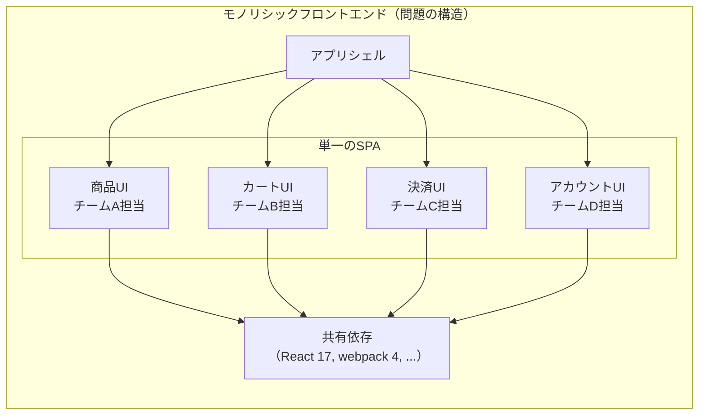

### 1.2 Micro Frontendsの定義

**Micro Frontends**（マイクロフロントエンド）とは、マイクロサービスの考え方をフロントエンドに適用し、Webアプリケーションを独立してデプロイ可能な複数の小さなフロントエンドに分割するアーキテクチャスタイルである。

Cam Jacksonが2019年にmartinfowler.comで発表した記事「Micro Frontends」が概念を広く普及させた。その本質を一言で表すなら、**「エンドツーエンドでビジネス機能を所有するクロスファンクショナルチームを実現するための、フロントエンドの垂直分割」**である。

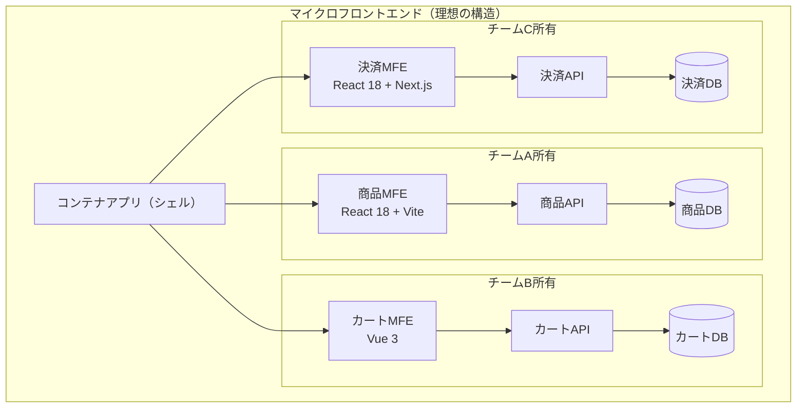

この構造において各チームはUIからAPIからデータベースまで、機能全体の完全な所有権を持つ。バックエンドのマイクロサービスと同様に「You build it, you run it」の原則が適用される。

### 1.3 Micro Frontendsが解決する問題の核心

Micro Frontendsが真に解決しようとする問題は技術的なものだけではない。コンウェイの法則（Conway's Law）が示すように、ソフトウェアの構造は組織の構造を反映する。フロントエンドのモノリスは、組織がスケールしたときに開発速度のボトルネックとなる。

::: tip Micro Frontendsの主要な利点
- **独立したデプロイ**: 各MFEを独自のCI/CDパイプラインで個別にリリースできる
- **チームの自律性**: 各チームがフレームワーク、ライブラリ、デプロイ方針を独立して決定できる
- **段階的な移行**: レガシーアプリケーションを一括書き換えすることなく、機能単位で新技術へ移行できる
- **障害の分離**: 一つのMFEの障害が他のMFEに波及しにくい
:::

---

## 2. 統合パターン

Micro Frontendsを実現するための統合方法は大きく3種類に分類される。それぞれに異なるトレードオフがあり、要件に応じた選択が必要である。

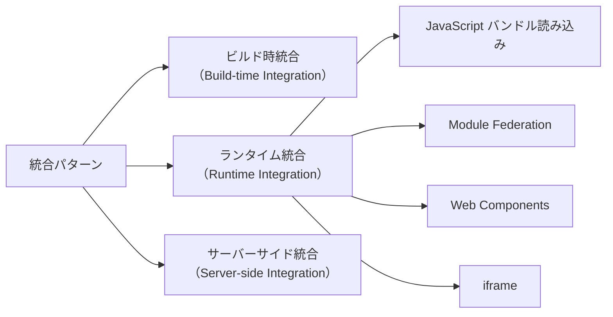

### 2.1 ビルド時統合（Build-time Integration）

各MFEをnpmパッケージとして公開し、コンテナアプリケーションがビルド時に依存関係として取り込む方式である。

```json
{
  "name": "container-app",
  "dependencies": {
    "@company/product-mfe": "^2.1.0",
    "@company/cart-mfe": "^1.5.3",
    "@company/checkout-mfe": "^3.0.1"
  }
}
```

```javascript
// container/src/App.jsx
import ProductWidget from "@company/product-mfe";
import CartWidget from "@company/cart-mfe";

export default function App() {
  return (
    <div>
      <ProductWidget />
      <CartWidget />
    </div>
  );
}
```

::: warning ビルド時統合の致命的な問題
この方式は**独立したデプロイ**という最も重要な利点を失わせる。`@company/cart-mfe` を更新するたびにコンテナアプリケーション全体を再ビルド・再デプロイする必要がある。これはモノリスに戻ることと本質的に変わらない。一見シンプルに見えるが、Micro Frontendsの真の目的から逸脱している。採用は原則として避けるべきである。
:::

### 2.2 ランタイム統合 — JavaScriptバンドルの動的ロード

各MFEがJavaScriptバンドルを静的ホスティング（CDNなど）に配置し、コンテナアプリケーションが実行時にそのバンドルを動的に読み込む方式である。

```javascript
// container/src/loadMfe.js
async function loadMfe(name, url) {
  // dynamically inject a <script> tag to load the MFE bundle
  await new Promise((resolve, reject) => {
    const script = document.createElement("script");
    script.src = url;
    script.onload = resolve;
    script.onerror = reject;
    document.head.appendChild(script);
  });

  // the MFE exposes itself on the global window object
  return window[name];
}

// usage
const ProductMFE = await loadMfe(
  "ProductMFE",
  "https://cdn.example.com/product-mfe/v2.1.0/bundle.js"
);
ProductMFE.mount(document.getElementById("product-container"));
```

各MFEは自身をグローバル変数として公開するか、後述のModule Federationを使って公開する。このアプローチはシンプルだが、依存関係の重複（Reactが複数回読み込まれるなど）や、バージョン管理の複雑さを伴う。

### 2.3 サーバーサイド統合（SSI / Edge Side Includes）

各MFEがHTMLフラグメントを生成するエンドポイントを持ち、コンテナがサーバーサイドでそれらを合成してクライアントに返す方式である。最も古典的なアプローチで、**Zalando**社が大規模に採用しているProject Mosaic（Tailor）が有名な実装例である。

```nginx
# Nginx SSI configuration
location / {
    ssi on;
    ssi_silent_errors on;
    proxy_pass http://container-service;
}
```

```html
<!-- container template (SSI) -->
<!DOCTYPE html>
<html>
<head>
  <!--# include virtual="/header-mfe/head-assets" -->
</head>
<body>
  <!--# include virtual="/navigation-mfe/nav" -->
  <main>
    <!--# include virtual="/product-mfe/product-list" -->
  </main>
  <!--# include virtual="/footer-mfe/footer" -->
</body>
</html>
```

SSIの優れた点はJavaScriptに依存しないため、初期表示が高速であり、SEOにも有利なことである。一方、動的なインタラクションには各MFEがクライアントサイドのJavaScriptも提供する必要があり、ハイドレーションの設計が複雑になる。

---

## 3. Module Federation

### 3.1 概念と設計思想

**Module Federation**は、webpack 5（2020年リリース）に組み込まれたプラグインシステムであり、Micro Frontendsの実装における最も重要な技術革新の一つである。Rspack（Rustベースのwebpack互換バンドラー）も同機能をサポートしている。

Module Federationが解決する核心的な問題は「**ランタイムでの安全なコード共有**」である。従来、別々にビルドされたJavaScriptバンドル間でコードを共有するためには、グローバル変数やスクリプトタグ経由の読み込みに頼らざるを得なかった。Module Federationはこれをモジュールシステムのレベルで解決する。

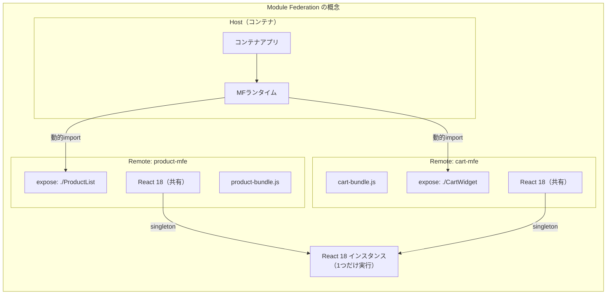

### 3.2 webpack 5 Module Federationの設定

Module Federationは、**Host**（コンシューマ）と**Remote**（プロバイダ）という役割に分かれる。一つのアプリケーションが同時にHostとRemoteになることも可能である。

**Remote側（product-mfe）の設定:**

```javascript
// product-mfe/webpack.config.js
const { ModuleFederationPlugin } = require("webpack").container;

module.exports = {
  output: {
    // globally unique name for this remote
    uniqueName: "productMfe",
    publicPath: "auto",
  },
  plugins: [
    new ModuleFederationPlugin({
      name: "productMfe",
      filename: "remoteEntry.js",
      // modules exposed to other applications
      exposes: {
        "./ProductList": "./src/components/ProductList",
        "./ProductDetail": "./src/components/ProductDetail",
      },
      // shared dependencies (avoid duplicate React instances)
      shared: {
        react: {
          singleton: true,
          requiredVersion: "^18.0.0",
        },
        "react-dom": {
          singleton: true,
          requiredVersion: "^18.0.0",
        },
      },
    }),
  ],
};
```

**Host側（コンテナ）の設定:**

```javascript
// container/webpack.config.js
const { ModuleFederationPlugin } = require("webpack").container;

module.exports = {
  plugins: [
    new ModuleFederationPlugin({
      name: "container",
      // declare remote MFEs
      remotes: {
        productMfe:
          "productMfe@https://cdn.example.com/product-mfe/remoteEntry.js",
        cartMfe: "cartMfe@https://cdn.example.com/cart-mfe/remoteEntry.js",
      },
      shared: {
        react: { singleton: true, requiredVersion: "^18.0.0" },
        "react-dom": { singleton: true, requiredVersion: "^18.0.0" },
      },
    }),
  ],
};
```

**Host側（コンテナ）でのRemoteコンポーネントの利用:**

```javascript
// container/src/App.jsx
import React, { Suspense, lazy } from "react";

// dynamically import from the remote MFE
const ProductList = lazy(() => import("productMfe/ProductList"));
const CartWidget = lazy(() => import("cartMfe/CartWidget"));

export default function App() {
  return (
    <div>
      <Suspense fallback={<div>Loading Product...</div>}>
        <ProductList />
      </Suspense>
      <Suspense fallback={<div>Loading Cart...</div>}>
        <CartWidget />
      </Suspense>
    </div>
  );
}
```

### 3.3 共有依存の管理

Module Federationの最も強力な特徴の一つが**共有依存（shared dependencies）**の仕組みである。`singleton: true` を指定することで、ReactやReact DOMなどのライブラリが複数のMFEから参照されても、ブラウザ上で一つのインスタンスのみが実行される。

これはReactの重複インスタンス問題（Hooks APIがグローバル状態に依存するため、複数のReactインスタンスが混在するとエラーが発生する）を解決する上で不可欠である。

| 設定オプション | 説明 |
|---|---|
| `singleton: true` | アプリケーション全体で一つのインスタンスのみ使用 |
| `requiredVersion` | 互換性のあるバージョン範囲を指定 |
| `strictVersion: true` | バージョン不一致時にエラーをスロー |
| `eager: true` | 非同期チャンクではなくエントリポイントに含める |

### 3.4 Rspackでの利用

Rspackは、Meta（Facebook）出身のエンジニアらが開発したRustベースのバンドラーで、webpackとの高い互換性を持つ。Module Federationも`@module-federation/enhanced`パッケージを通じてサポートされており、webpackと同等の設定でMicro Frontendsを構築できる。

```javascript
// product-mfe/rspack.config.js
const {
  ModuleFederationPlugin,
} = require("@module-federation/enhanced/rspack");

module.exports = {
  plugins: [
    new ModuleFederationPlugin({
      name: "productMfe",
      filename: "remoteEntry.js",
      exposes: {
        "./ProductList": "./src/components/ProductList",
      },
      shared: {
        react: { singleton: true, requiredVersion: "^18.0.0" },
        "react-dom": { singleton: true, requiredVersion: "^18.0.0" },
      },
    }),
  ],
};
```

ビルド速度がwebpackと比較して大幅に向上する（プロジェクト規模によっては5〜10倍）ため、大規模なMicro Frontends環境でのCI/CD時間短縮に貢献する。

---

## 4. Single-SPA

### 4.1 概要

**Single-SPA**は、複数のJavaScriptアプリケーション（異なるフレームワークを含む）を単一のページアプリケーションとして統合するためのJavaScriptフレームワークである。Module Federationよりも歴史が長く（2016年〜）、フレームワーク非依存なMicro Frontendsを実現できる点が特徴である。

Single-SPAはMicro Frontendsを**ライフサイクル関数**（bootstrap、mount、unmount）の観点で捉える。各MFEはこれら3つの関数をエクスポートし、Single-SPAルータがURLに基づいて適切なMFEをアクティブ化・非アクティブ化する。

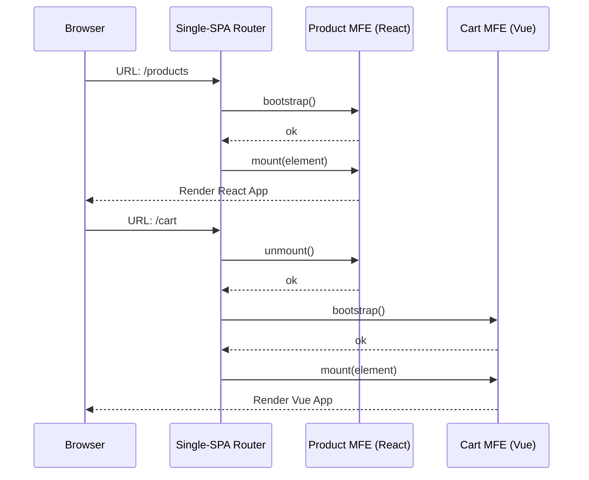

### 4.2 コンテナアプリケーションの設定

```javascript
// container/src/root-config.js
import { registerApplication, start } from "single-spa";

// register each MFE with its activation function (when to show it)
registerApplication({
  name: "@company/product-mfe",
  app: () =>
    System.import(
      "https://cdn.example.com/product-mfe/product-mfe.js"
    ),
  // activate when URL starts with /products
  activeWhen: ["/products"],
});

registerApplication({
  name: "@company/cart-mfe",
  app: () =>
    System.import("https://cdn.example.com/cart-mfe/cart-mfe.js"),
  activeWhen: ["/cart"],
});

registerApplication({
  name: "@company/checkout-mfe",
  app: () =>
    System.import(
      "https://cdn.example.com/checkout-mfe/checkout-mfe.js"
    ),
  activeWhen: (location) => location.pathname.startsWith("/checkout"),
});

start({ urlRerouteOnly: true });
```

### 4.3 MFE側のライフサイクル実装（React）

```javascript
// product-mfe/src/product-mfe.js
import React from "react";
import ReactDOM from "react-dom/client";
import singleSpaReact from "single-spa-react";
import ProductApp from "./ProductApp";

const lifecycles = singleSpaReact({
  React,
  ReactDOM,
  rootComponent: ProductApp,
  // error boundary for graceful degradation
  errorBoundary(err, info, props) {
    return <div>Product MFE failed to load</div>;
  },
});

// export the three lifecycle functions Single-SPA requires
export const { bootstrap, mount, unmount } = lifecycles;
```

### 4.4 SystemJS との連携

Single-SPAは伝統的に**SystemJS**というモジュールローダーと組み合わせて使用される。SystemJSはブラウザ上でAMD、CommonJS、ESMなどの形式のモジュールを動的にロードできるローダーであり、Import Mapsと連携して使用できる。

```html
<!-- container/index.html -->
<script type="systemjs-importmap">
  {
    "imports": {
      "single-spa": "https://cdn.jsdelivr.net/npm/single-spa@5.9.0/lib/system/single-spa.min.js",
      "react": "https://cdn.jsdelivr.net/npm/react@18/umd/react.production.min.js",
      "react-dom": "https://cdn.jsdelivr.net/npm/react-dom@18/umd/react-dom.production.min.js",
      "@company/root-config": "https://cdn.example.com/root-config/root-config.js"
    }
  }
</script>
<script src="https://cdn.jsdelivr.net/npm/systemjs/dist/system.min.js"></script>
<script src="https://cdn.jsdelivr.net/npm/systemjs/dist/extras/amd.min.js"></script>
<script>
  System.import("@company/root-config");
</script>
```

---

## 5. iframe統合

### 5.1 iframeの特性とMicro Frontendsへの適用

**iframe**は最も古くから存在するWeb技術の一つであり、強力な分離特性を持つ。各iframeは独立したブラウジングコンテキスト（独自のDOM、独自のJavaScriptグローバルスコープ、独自のCSSスコープ）を持つため、MFE間の干渉が物理的に不可能である。

```html
<!-- container/index.html -->
<div class="page-layout">
  <nav>
    <iframe
      id="nav-mfe"
      src="https://nav.example.com/navbar"
      style="border: none; width: 100%; height: 60px;"
    ></iframe>
  </nav>
  <main>
    <iframe
      id="product-mfe"
      src="https://product.example.com/list"
      style="border: none; width: 100%; height: 100vh;"
    ></iframe>
  </main>
</div>
```

### 5.2 iframe間通信

iframeはデフォルトで親ページから完全に分離されているが、`postMessage` APIを使用することでクロスオリジン通信が可能である。

```javascript
// product-mfe (inside iframe): send a message to the parent
window.parent.postMessage(
  {
    type: "ADD_TO_CART",
    payload: { productId: "123", quantity: 1 },
  },
  "https://www.example.com" // target origin (security critical)
);
```

```javascript
// container (parent page): receive messages from iframes
window.addEventListener("message", (event) => {
  // always verify the origin of the message
  if (event.origin !== "https://product.example.com") return;

  if (event.data.type === "ADD_TO_CART") {
    // forward to cart MFE
    const cartIframe = document.getElementById("cart-mfe");
    cartIframe.contentWindow.postMessage(
      {
        type: "PRODUCT_ADDED",
        payload: event.data.payload,
      },
      "https://cart.example.com"
    );
  }
});
```

### 5.3 iframeのメリットとデメリット

::: tip iframeが真に適する場面
- セキュリティ隔離が最優先要件である場合（例: 金融機関、医療システム）
- レガシーアプリケーションをほぼ変更なく既存システムに組み込む場合
- サードパーティコンテンツの埋め込み（外部ダッシュボードウィジェットなど）
:::

::: warning iframeの主要な課題
- **UXの制約**: URLの同期が困難（ブラウザの戻るボタンがiframe内のナビゲーションに対応しない）、印刷・アクセシビリティに問題が生じやすい
- **パフォーマンス**: 各iframeが独立したブラウジングコンテキストを持つため、メモリ消費が大きい。JavaScriptランタイムも独立して起動する
- **レスポンシブデザインの困難**: iframeのサイズを内コンテンツに合わせて動的に調整するには追加の実装が必要
- **SEOへの影響**: 検索エンジンがiframe内コンテンツをメインコンテンツとして扱わない場合がある
:::

---

## 6. Web Components

### 6.1 Web Componentsによるフレームワーク非依存のMFE

**Web Components**は、ブラウザネイティブのカスタム要素を定義するための一連の標準仕様（Custom Elements、Shadow DOM、HTML Templates）の総称である。特定のJavaScriptフレームワークに依存しないため、異なるフレームワークで実装されたMFEを統一インターフェースで統合するのに適している。

```javascript
// product-mfe/src/ProductListElement.js

class ProductListElement extends HTMLElement {
  // observed attributes trigger attributeChangedCallback
  static get observedAttributes() {
    return ["category", "page-size"];
  }

  constructor() {
    super();
    // create a shadow DOM to isolate styles
    this.attachShadow({ mode: "open" });
  }

  connectedCallback() {
    // called when the element is added to the DOM
    this.render();
    this.fetchProducts();
  }

  disconnectedCallback() {
    // called when the element is removed — cleanup here
    this.cleanup();
  }

  attributeChangedCallback(name, oldValue, newValue) {
    if (oldValue !== newValue) {
      this.render();
    }
  }

  async fetchProducts() {
    const category = this.getAttribute("category") || "all";
    const response = await fetch(`/api/products?category=${category}`);
    const products = await response.json();
    this.renderProducts(products);
  }

  renderProducts(products) {
    this.shadowRoot.innerHTML = `
      <style>
        /* scoped styles within shadow DOM */
        .product-grid {
          display: grid;
          grid-template-columns: repeat(auto-fill, minmax(200px, 1fr));
          gap: 16px;
        }
      </style>
      <div class="product-grid">
        ${products.map((p) => `<div class="product-card">${p.name}</div>`).join("")}
      </div>
    `;
  }
}

// register the custom element
customElements.define("product-list", ProductListElement);
```

**コンテナ側での利用:**

```html
<!-- container/index.html — framework-agnostic usage -->
<product-list category="electronics" page-size="20"></product-list>
```

ReactやVueなど、どのフレームワークで実装されたコンテナからでも同じHTML要素として利用できる。

### 6.2 ReactコンポーネントをWeb Componentsとしてラップ

既存のReactコンポーネントをWeb Componentsとして公開することで、フレームワーク非依存のMFEを実現できる。

```javascript
// product-mfe/src/wrapReactAsWebComponent.js
import React from "react";
import { createRoot } from "react-dom/client";
import ProductList from "./components/ProductList";

class ProductListWebComponent extends HTMLElement {
  connectedCallback() {
    this._mountPoint = document.createElement("div");
    this.attachShadow({ mode: "open" }).appendChild(this._mountPoint);

    const props = {
      category: this.getAttribute("category"),
      pageSize: parseInt(this.getAttribute("page-size"), 10) || 20,
    };

    this._root = createRoot(this._mountPoint);
    this._root.render(<ProductList {...props} />);
  }

  disconnectedCallback() {
    // cleanup React tree when element is removed from DOM
    this._root.unmount();
  }
}

customElements.define("product-list-mfe", ProductListWebComponent);
```

---

## 7. ルーティングと状態共有

### 7.1 ルーティング戦略

Micro Frontendsにおけるルーティングは、**コンテナレベルのルーティング**と**MFE内部のルーティング**の2層で考える必要がある。

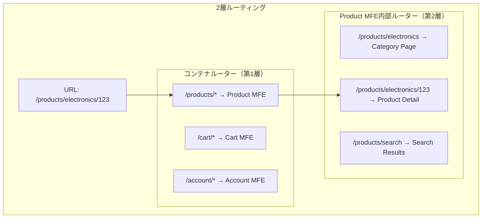

コンテナはURLのプレフィックスに基づいてどのMFEをマウントするかを決定し、そのMFEが残りのURL部分を解釈して内部ルーティングを行う。

```javascript
// container/src/router.js
// each MFE owns a URL prefix
const mfeRoutes = [
  { prefix: "/products", mfe: "product-mfe" },
  { prefix: "/cart", mfe: "cart-mfe" },
  { prefix: "/checkout", mfe: "checkout-mfe" },
  { prefix: "/account", mfe: "account-mfe" },
];

function getCurrentMfe(pathname) {
  return mfeRoutes.find((route) => pathname.startsWith(route.prefix));
}
```

### 7.2 MFE間の状態共有

Micro Frontendsにおける最も難しい設計課題の一つが状態共有である。各MFEが独立して動作することが原則だが、ユーザー認証情報やショッピングカートの内容など、複数のMFEが必要とする状態も存在する。

**方針: 状態共有を最小化する**

MFE間の状態共有は、MFE間の結合度を高める。可能な限り各MFEが必要な情報をAPIから直接取得する設計を優先すべきである。

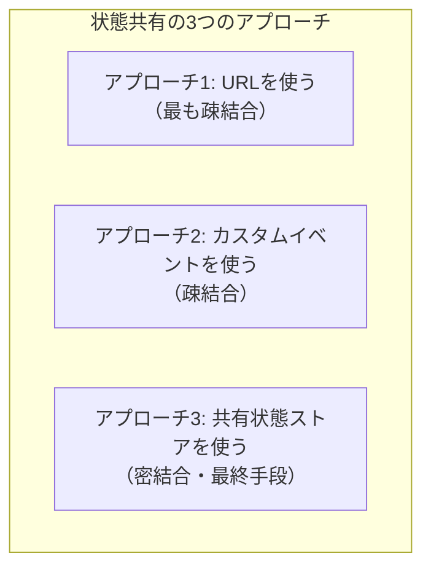

**アプローチ1: URLを状態として使う**

```javascript
// product-mfe: navigate with state encoded in URL
function openProductDetail(productId) {
  // URL carries the state — other MFEs can read it
  history.pushState(null, "", `/products/${productId}?ref=list`);
}
```

**アプローチ2: カスタムイベントによるMFE間通信**

```javascript
// product-mfe: dispatch a custom event
function addToCart(product) {
  // dispatch on window so all MFEs can listen
  window.dispatchEvent(
    new CustomEvent("mfe:cart:add", {
      detail: { productId: product.id, quantity: 1 },
      bubbles: true,
    })
  );
}
```

```javascript
// cart-mfe: listen for events from other MFEs
window.addEventListener("mfe:cart:add", (event) => {
  const { productId, quantity } = event.detail;
  cartStore.addItem(productId, quantity);
});
```

**アプローチ3: 共有状態ストア（最終手段）**

```javascript
// shared/mfe-event-bus.js
// a minimal shared event bus — keep this as simple as possible
class MfeEventBus {
  constructor() {
    this._subscribers = new Map();
  }

  publish(event, data) {
    const handlers = this._subscribers.get(event) || [];
    handlers.forEach((handler) => handler(data));
  }

  subscribe(event, handler) {
    if (!this._subscribers.has(event)) {
      this._subscribers.set(event, []);
    }
    this._subscribers.get(event).push(handler);

    // return unsubscribe function
    return () => {
      const handlers = this._subscribers.get(event);
      const index = handlers.indexOf(handler);
      if (index > -1) handlers.splice(index, 1);
    };
  }
}

// expose on window for cross-MFE access
window.__MFE_EVENT_BUS__ = window.__MFE_EVENT_BUS__ || new MfeEventBus();
export const eventBus = window.__MFE_EVENT_BUS__;
```

::: warning 共有状態ストアのリスク
共有状態ストアはMFE間に強い結合を生む。ストアのスキーマ変更が全MFEに影響するため、「独立したデプロイ」という利点が失われ始める。認証トークンのような読み取り専用のグローバル情報に限定し、書き込み可能な状態の共有は極力避けるべきである。
:::

---

## 8. デザイン一貫性の課題

### 8.1 デザインシステムの重要性

異なるチームが独立して開発するMicro Frontendsは、UIの見た目・操作感の不一致という深刻な問題を抱えやすい。ボタンのスタイル、フォントサイズ、余白の基準がMFEごとに異なれば、ユーザーは一つのWebサービスを使っているとは感じられない。

この問題の根本的な解決策は**デザインシステム**の構築と維持である。

```mermaid
graph TB
    DS["デザインシステム<br/>（共有ライブラリ）"]
    subgraph "デザイントークン"
        Colors["カラーパレット<br/>--color-primary: #0057FF"]
        Typography["タイポグラフィ<br/>--font-size-lg: 1.125rem"]
        Spacing["スペーシング<br/>--space-4: 1rem"]
    end

    subgraph "コンポーネントライブラリ"
        Button["<Button>"]
        Input["<Input>"]
        Modal["<Modal>"]
    end

    DS --> Colors
    DS --> Typography
    DS --> Spacing
    DS --> Button
    DS --> Input
    DS --> Modal

    MFE_A["Product MFE"] -->|uses| DS
    MFE_B["Cart MFE"] -->|uses| DS
    MFE_C["Checkout MFE"] -->|uses| DS
```

### 8.2 デザインシステムのバージョン管理問題

デザインシステムをnpmパッケージとして公開する方式は一般的だが、Micro Frontendsとの組み合わせでは**バージョン不一致**という問題が生じやすい。

```
Product MFE    → @company/design-system@2.5.0
Cart MFE       → @company/design-system@3.0.0  ← Breaking change
Checkout MFE   → @company/design-system@2.8.1
```

これを解決するアプローチは複数ある。

**アプローチ1: デザイントークンをCSS変数として配布**

CSS Custom Propertiesを使い、デザイントークンをJavaScriptとは独立して配布する。

```css
/* design-system/tokens.css */
:root {
  --color-primary-500: #0057ff;
  --color-neutral-900: #111827;
  --space-1: 0.25rem;
  --space-2: 0.5rem;
  --space-4: 1rem;
  --border-radius-md: 0.375rem;
  --font-size-sm: 0.875rem;
  --font-size-base: 1rem;
}
```

CSS変数はShadow DOMの境界を越えて継承されるため、Web Componentsを使うMFEにも適用できる。

**アプローチ2: コンポーネントのバージョンロックポリシー**

デザインシステムにセマンティックバージョニングを厳格に適用し、メジャーバージョンの更新期限をチーム間で合意する運用ルールを設ける。

---

## 9. CSS隔離戦略

### 9.1 なぜCSSの隔離が必要か

複数のMFEが一つのページに共存するとき、あるMFEのCSSが別のMFEのUIを意図せず変更するという問題（CSSリーク）が発生する。

```css
/* product-mfe/styles.css — unintended global pollution */
.button {
  background-color: blue; /* This affects cart-mfe's .button too! */
}

* {
  box-sizing: border-box; /* This is actually fine, but illustrates the risk */
}
```

### 9.2 CSS隔離の主要な戦略

**戦略1: CSSモジュール（CSS Modules）**

ビルド時にクラス名にハッシュを付与し、スコープを限定する。最も普及している手法の一つ。

```css
/* ProductList.module.css */
.container {
  padding: 16px;
}
.productCard {
  border: 1px solid #e5e7eb;
}
```

```jsx
// ProductList.jsx
import styles from "./ProductList.module.css";

export function ProductList() {
  // compiled to: class="ProductList_container_3xK2a"
  return <div className={styles.container}>...</div>;
}
```

**戦略2: CSS-in-JS**

スタイルをJavaScriptに埋め込むことで、コンポーネントスコープのスタイルを実現する。styled-componentsやEmotion、stylex（Meta製）が代表例。

```javascript
// styled-components example
import styled from "styled-components";

// generates a unique class name at runtime
const ProductCard = styled.div`
  border: 1px solid #e5e7eb;
  border-radius: 8px;
  padding: 16px;

  &:hover {
    box-shadow: 0 4px 8px rgba(0, 0, 0, 0.1);
  }
`;
```

**戦略3: Shadow DOM（Web Components）**

Shadow DOMはネイティブのCSSスコープ機構を提供する。Shadow DOMの内部スタイルは外部に漏れず、外部スタイルもデフォルトでは内部に影響しない。

```javascript
class ProductCard extends HTMLElement {
  constructor() {
    super();
    // shadow DOM creates a true CSS boundary
    const shadow = this.attachShadow({ mode: "open" });
    shadow.innerHTML = `
      <style>
        /* these styles are completely isolated */
        .card { border: 1px solid #e5e7eb; }
        h2 { font-size: 1.25rem; }
      </style>
      <div class="card">
        <h2><slot name="title"></slot></h2>
      </div>
    `;
  }
}
```

**戦略4: CSS名前空間プレフィックス**

シンプルだが効果的。各MFEにユニークなCSSクラス名プレフィックスを設けるルールを設ける。

```css
/* product-mfe: all classes prefixed with "prd-" */
.prd-container { ... }
.prd-card { ... }
.prd-button { ... }

/* cart-mfe: all classes prefixed with "crt-" */
.crt-container { ... }
.crt-item-list { ... }
```

| 戦略 | 隔離の強さ | SSR対応 | パフォーマンス | 採用のしやすさ |
|---|---|---|---|---|
| CSS Modules | 中 | 良好 | 良好 | 容易 |
| CSS-in-JS (runtime) | 中 | 要設定 | 注意が必要 | 中程度 |
| Shadow DOM | 強 | 要工夫 | 良好 | 中程度 |
| 名前空間プレフィックス | 弱〜中 | 良好 | 最良 | 容易 |

---

## 10. パフォーマンスへの影響と最適化

### 10.1 Micro Frontendsが引き起こすパフォーマンス問題

Micro Frontendsアーキテクチャは、適切に設計しないと深刻なパフォーマンス劣化を招く。

**問題1: 依存ライブラリの重複ロード**

各MFEがそれぞれ独立してバンドルされると、Reactや日付処理ライブラリなどが複数のバンドルに重複して含まれ、合計ダウンロードサイズが爆発的に増大する。

```
product-mfe.bundle.js (500KB) → includes React (40KB) + ReactDOM (130KB)
cart-mfe.bundle.js    (400KB) → includes React (40KB) + ReactDOM (130KB)
checkout-mfe.bundle.js(300KB) → includes React (40KB) + ReactDOM (130KB)
                                 ^^^^^^^^^^^^^^^^^^^^^^^^^^^^^^^^^^^^^^^^^
                                 Same code downloaded 3 times! (510KB waste)
```

**解決策: Module Federationの共有依存（前述）またはImport Mapsを活用する**

```html
<!-- share React via CDN / Import Maps -->
<script type="importmap">
  {
    "imports": {
      "react": "https://cdn.example.com/react@18.3.0/react.production.min.js",
      "react-dom": "https://cdn.example.com/react-dom@18.3.0/react-dom.production.min.js"
    }
  }
</script>
```

**問題2: ウォーターフォール的なリソースロード**

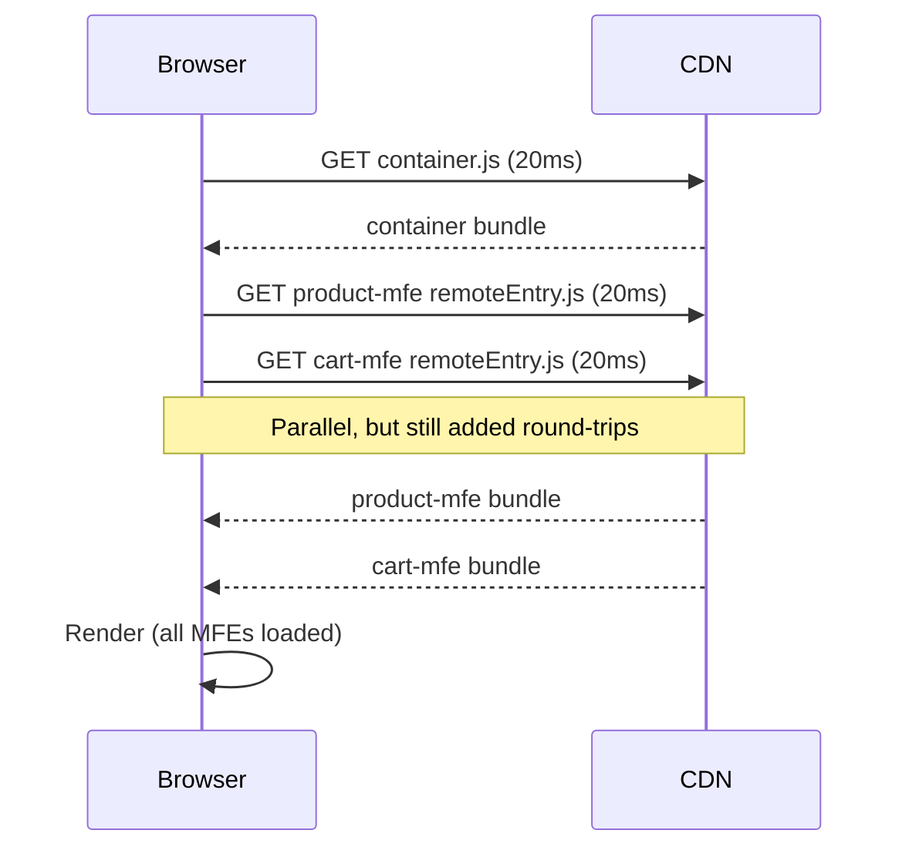

コンテナのロードが完了してから各MFEのロードが始まるため、追加のネットワークラウンドトリップが発生する。

**解決策: プリロードヒントの活用**

```html
<head>
  <!-- preload critical MFE bundles -->
  <link
    rel="modulepreload"
    href="https://cdn.example.com/product-mfe/v2/remoteEntry.js"
  />
  <link
    rel="modulepreload"
    href="https://cdn.example.com/cart-mfe/v1/remoteEntry.js"
  />
</head>
```

### 10.2 Code Splittingと遅延ロード

ビューポート外のMFEや、条件付きで表示されるMFEは遅延ロードすることで初期表示を高速化できる。

```javascript
// container/src/App.jsx
import React, { Suspense, lazy, useState } from "react";

const ProductList = lazy(() => import("productMfe/ProductList"));

// load checkout MFE only when user proceeds to checkout
const CheckoutFlow = lazy(() => import("checkoutMfe/CheckoutFlow"));

export default function App() {
  const [showCheckout, setShowCheckout] = useState(false);

  return (
    <div>
      <Suspense fallback={<ProductSkeleton />}>
        <ProductList />
      </Suspense>
      {showCheckout && (
        <Suspense fallback={<CheckoutSkeleton />}>
          <CheckoutFlow />
        </Suspense>
      )}
    </div>
  );
}
```

### 10.3 キャッシュ戦略

各MFEは独立してバージョニングされるため、効果的なキャッシュ戦略が重要である。

```
// Recommended cache headers for MFE bundles

// 1. remoteEntry.js — short cache or no-cache
//    (This is the entry point that tells the host which chunk to load)
Cache-Control: no-cache

// 2. content-hashed chunks — long cache
//    (product-mfe.a3f7b9.chunk.js — immutable content)
Cache-Control: public, max-age=31536000, immutable
```

`remoteEntry.js`は常に最新バージョンを指し示すマニフェストファイルとして機能し、実際のコードは内容に基づくハッシュで長期キャッシュされる。

---

## 11. チーム組織との関係

### 11.1 コンウェイの法則とMicro Frontends

Micro Frontendsを最大限に活かすには、技術的なアーキテクチャだけでなく、組織構造の設計も重要である。コンウェイの法則（*Any organization that designs a system will produce a design whose structure is a copy of the organization's communication structure.*）を逆用し、望ましいシステム構造に合わせてチームを編成する「逆コンウェイ戦略（Inverse Conway Maneuver）」が有効である。

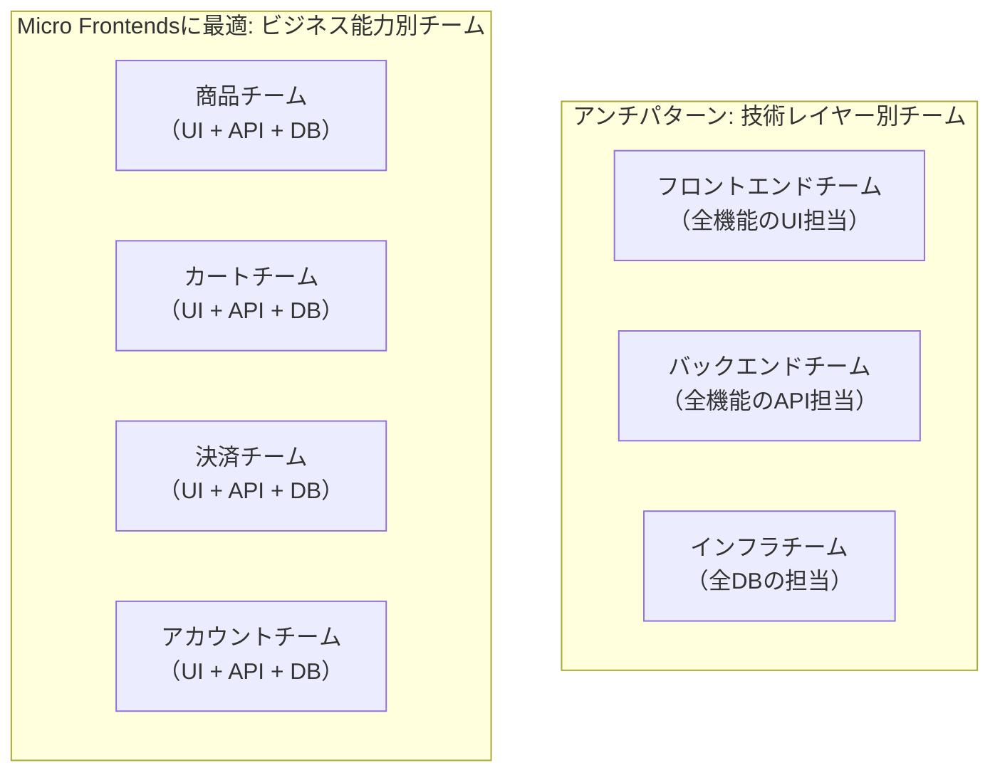

ビジネス能力別のクロスファンクショナルチームは、機能のリリースにあたって他チームとの調整を最小限に抑えられる。フロントエンドからバックエンド、データベースまでを一つのチームが所有することで、真の意味での「独立したデプロイ」が実現する。

### 11.2 プラットフォームチームの役割

個々の機能チームが自律的に動ける基盤を整備するためには、**プラットフォームチーム**（インフラチーム、プラットフォームエンジニアリングチームとも呼ばれる）の存在が重要である。

プラットフォームチームの主な責務は以下の通りである。

- **デザインシステムの構築と維持**: 全MFEが使用するUIコンポーネントライブラリとデザイントークン
- **MFEスキャフォールディング**: 新しいMFEを素早く立ち上げるためのテンプレートとCLIツール
- **CI/CDパイプラインの標準化**: 各チームが共通のデプロイフローを利用できる基盤
- **コンテナアプリケーションの管理**: MFEの統合を担うシェルアプリケーション
- **共通ライブラリの提供**: 認証処理、エラーバウンダリ、ログ送信などの横断的関心事

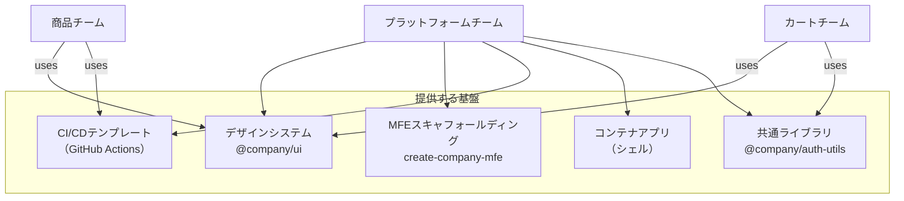

### 11.3 Micro Frontendsを採用すべき状況・避けるべき状況

::: tip Micro Frontendsが効果的な状況
- **複数の独立したチームがある**: フロントエンドを担当するチームが3つ以上あり、それぞれが独自のリリースサイクルを持つ場合
- **レガシーの段階的移行**: モノリシックなフロントエンドを少しずつ新技術に移行したい場合（Strangler Figパターンの適用）
- **異なる技術スタックの混在**: 企業買収などで取得した異なるフレームワークで実装されたアプリケーションを統合する必要がある場合
- **機能ごとに大きく異なるデプロイ頻度**: 毎日更新が必要な機能と、数ヶ月に一度しか変わらない機能が混在する場合
:::

::: danger Micro Frontendsが過剰設計になる状況
- **小規模チーム**: フロントエンド開発者が5名以下の場合、Micro Frontendsの運用オーバーヘッドがメリットを上回る
- **密結合なビジネスロジック**: ページをまたぐデータフローが非常に複雑で、MFE間の状態共有が頻繁に必要な場合
- **パフォーマンスが最優先**: 追加のネットワークラウンドトリップが許容できない超低レイテンシ要件がある場合
- **SEOが最重要**: サーバーサイドレンダリングをMicro Frontendsと組み合わせるには追加の複雑さが伴う
:::

---

## 12. 実装パターンの比較と選択指針

各統合アプローチのトレードオフを整理する。

| 統合方式 | 独立デプロイ | フレームワーク独立 | CSS隔離 | パフォーマンス | 実装複雑度 | SSR対応 |
|---|---|---|---|---|---|---|
| ビルド時統合 | ✗ | △ | △ | 最良 | 低 | 容易 |
| Module Federation | ◎ | △（同フレームワーク推奨） | △ | 良好 | 中 | 要工夫 |
| Single-SPA | ◎ | ◎ | △ | 良好 | 高 | 要工夫 |
| iframe | ◎ | ◎ | ◎（完全） | 低〜中 | 低 | 困難 |
| Web Components | ◎ | ◎ | ◎（Shadow DOM使用時） | 良好 | 中 | 要工夫 |
| SSI / Edge | ◎ | ◎ | ◎ | 最良 | 中 | ◎ |

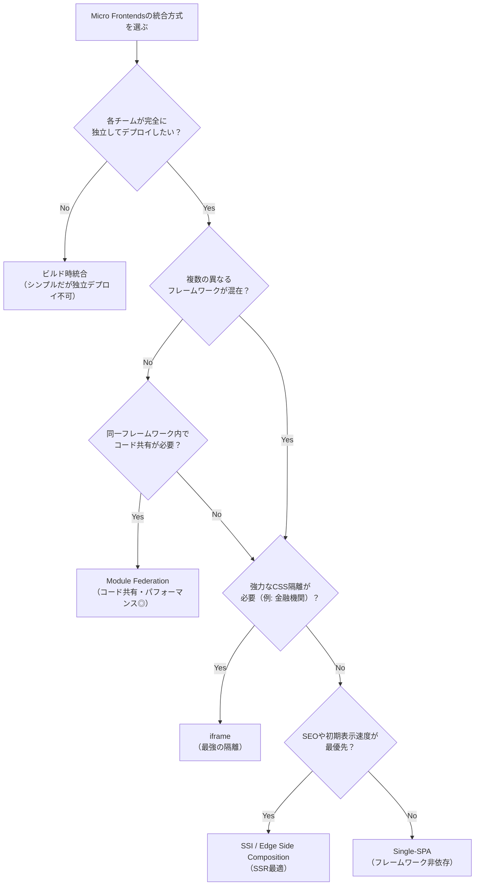

---

## 13. まとめ

Micro Frontendsは、フロントエンドのモノリスが抱える「チームのスケーラビリティ問題」に対する有力な解決策である。バックエンドのマイクロサービスと同様に、組織の成長に合わせてフロントエンド開発を独立したチームに分割し、それぞれが自律的に開発・デプロイできる環境を実現する。

しかし、Micro Frontendsは銀の弾丸ではない。技術的な複雑性（依存ライブラリの重複、CSS隔離、状態共有、ルーティング協調など）は現実的なコストであり、チームが小規模であったり、ビジネスロジックが密結合であったりする場合は、過剰設計となりやすい。

実践において重要な原則を挙げるならば次の通りである。

1. **独立したデプロイを最優先の判断軸とする**: 独立したデプロイが実現しないなら、それはMicro Frontendsの最大の利点を失っている。ビルド時統合はMicro Frontendsと呼んでも本質は変わらない
2. **MFEの境界はビジネス能力に従う**: UIの技術的な分割（ヘッダーMFE、フッターMFE、サイドバーMFE）ではなく、ビジネス機能（商品MFE、カートMFE、決済MFE）で分割する
3. **状態共有を最小化する**: MFE間の状態共有はURLとカスタムイベントで済む範囲にとどめ、共有ストアは最終手段とする
4. **デザインシステムへの投資は惜しまない**: UIの一貫性を保つためのデザインシステムなしに、Micro Frontendsは「バラバラなUIの集合体」になる
5. **プラットフォームチームへの投資を忘れない**: 各機能チームが自律的に動くためのインフラ整備は、見えにくいが不可欠な投資である

最終的に、Micro Frontendsが提供する価値は技術的なものよりも組織的なものが大きい。アーキテクチャの選択は常に「自チームの組織構造と規模に対して、このコストに見合う価値があるか」という問いへの誠実な回答に基づくべきである。
