# マイクロサービスアーキテクチャ — モノリスの限界を超える分散システム設計

## 1. 歴史的背景 — モノリスからの進化

### 1.1 モノリシックアーキテクチャの時代

ソフトウェアアーキテクチャの歴史において、最も長く支配的な地位にあったのは**モノリシックアーキテクチャ（Monolithic Architecture）**である。モノリスとは、アプリケーションのすべての機能が単一のプロセス、単一のデプロイ単位としてまとめられた構造を指す。ユーザーインターフェース、ビジネスロジック、データアクセス層がすべて一つのコードベースに含まれ、一つのアーティファクト（WAR、JAR、単一バイナリなど）としてビルド・デプロイされる。

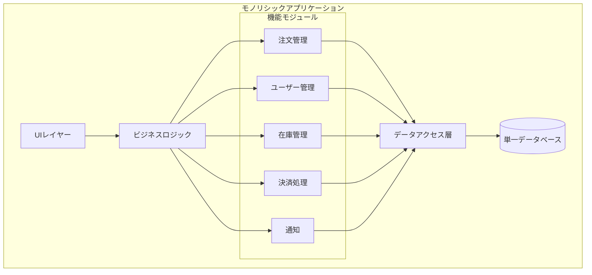

モノリスには明確な利点がある。開発の初期段階ではシンプルで理解しやすく、IDE内でのコード間のナビゲーションも容易である。関数呼び出しでモジュール間通信が完結するため、ネットワーク遅延やシリアライゼーションのオーバーヘッドが存在しない。トランザクション管理もACID特性を持つ単一データベースで完結するため、データ整合性の担保が容易である。

しかし、アプリケーションが成長し、チームが拡大するにつれて、モノリスは深刻な問題を引き起こすようになる。

### 1.2 モノリスの限界

モノリスが抱える根本的な課題は以下の通りである。

**デプロイの困難さ**：小さな変更であっても、アプリケーション全体を再デプロイしなければならない。決済モジュールの軽微なバグ修正のために、注文管理、ユーザー管理、在庫管理を含むアプリケーション全体をリリースする必要がある。リリースサイクルが長大になり、リリースごとのリスクが増大する。

**スケーリングの非効率性**：特定の機能だけにアクセスが集中する場合でも、アプリケーション全体をスケールアウトしなければならない。CPU集約型の画像処理とI/O集約型のデータ検索が同じプロセスで動作するため、リソースの最適化が困難である。

**技術的負債の蓄積**：コードベースが巨大化すると、モジュール間の境界が曖昧になり、意図しない依存関係が生まれる。ある機能の変更が予期しない箇所に影響を与え、リグレッションの温床となる。

**チームのスケーラビリティの限界**：コンウェイの法則（Conway's Law）が示す通り、ソフトウェアの構造は組織の構造を反映する。単一のコードベースに多数のチームが関与すると、マージコンフリクトの頻発、リリース調整のオーバーヘッド、責任範囲の曖昧さといった問題が生じる。

**技術的ロックイン**：モノリス内の全モジュールが同じプログラミング言語、フレームワーク、ライブラリバージョンに縛られる。新しい技術の導入は、アプリケーション全体に影響を及ぼすリスクがあるため、保守的にならざるを得ない。

### 1.3 SOA（Service-Oriented Architecture）の登場と教訓

2000年代、モノリスの限界を克服するために**SOA（サービス指向アーキテクチャ）**が登場した。SOAはアプリケーションを複数のサービスに分解し、それらを**ESB（Enterprise Service Bus）**と呼ばれる中央集権的なメッセージングインフラで接続するアプローチである。

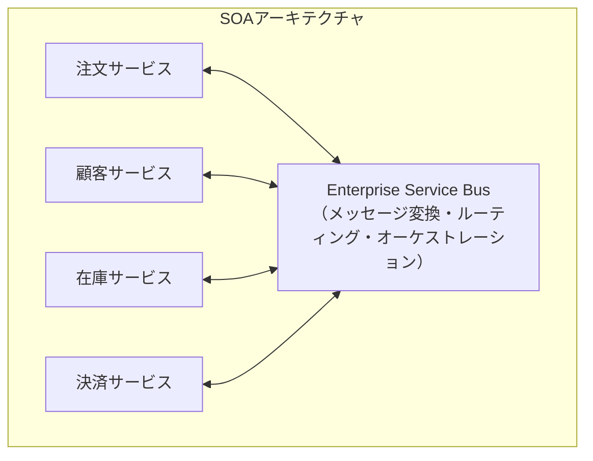

SOAの理念は正しかった。サービスの再利用性、疎結合、標準化されたインターフェースといった概念は、現代のマイクロサービスにも引き継がれている。しかし、SOAの実践は多くの場合、期待通りには進まなかった。

::: warning SOAが抱えた実践上の問題
- **ESBの肥大化**：ビジネスロジックがESBに集中し、ESB自体が単一障害点かつボトルネックとなった（"Smart pipes, dumb endpoints"の逆転）
- **過度な標準化**：SOAP、WSDL、WS-*仕様群などの重厚な標準は、開発の俊敏性を損なった
- **ベンダーロックイン**：商用ESB製品への依存が、柔軟性とコストの両面で問題を生んだ
- **粒度の問題**：サービスの境界が曖昧で、巨大なサービス（実質的なモノリス）が生まれることが多かった
:::

### 1.4 マイクロサービスの台頭

2011年、ベネチアで開催されたソフトウェアアーキテクトのワークショップで「マイクロサービス」という用語が初めて使われた。その後、2014年にJames LewisとMartin Fowlerが発表した論文「Microservices: a definition of this new architectural term」が、この概念を広く普及させた。

マイクロサービスはSOAの教訓を踏まえ、以下の点で明確に差別化された。

- ESBのような中央集権的インフラを避け、**"Smart endpoints and dumb pipes"**を原則とした
- SOAP/WSDLのような重厚なプロトコルではなく、**軽量なHTTP/RESTやメッセージング**を採用した
- サービスの粒度をより小さく、**ビジネス能力（Business Capability）**に沿って分割した
- 各サービスが**独立してデプロイ可能**であることを最も重要な特性とした

NetflixやAmazon、Spotifyといった大規模インターネット企業が先行してマイクロサービスを採用し、その成功事例が業界全体に影響を与えた。特にAmazonでは、2002年にJeff Bezosが発した「APIマンデート」（すべてのチームはサービスインターフェースを通じてのみデータを公開しなければならない）が、マイクロサービス的な文化の先駆けとなった。

## 2. マイクロサービスの特徴と原則

### 2.1 定義

マイクロサービスアーキテクチャとは、アプリケーションを**小さな自律的なサービスの集合体**として構築するアーキテクチャスタイルである。各サービスは以下の特性を持つ。

- 単一のビジネス能力に焦点を当てている
- 独立してデプロイ可能である
- 自身のデータストアを所有する
- 軽量なメカニズムで他のサービスと通信する
- 小規模なチームによって開発・運用される

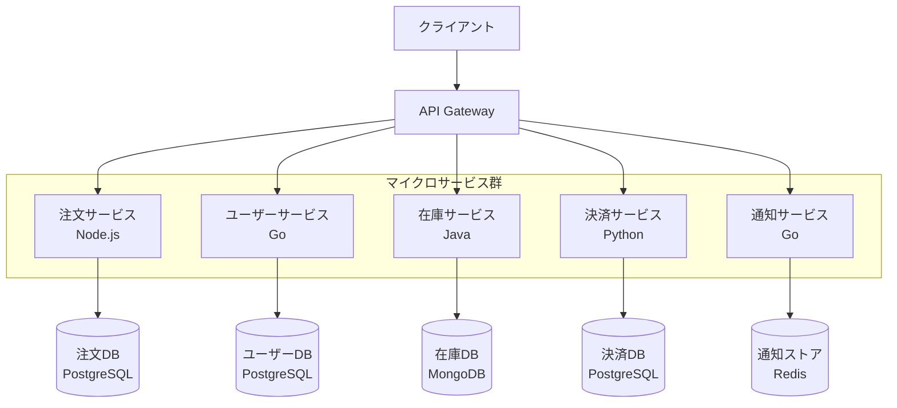

### 2.2 九つの特性

Martin Fowlerの定義に基づく、マイクロサービスの九つの特性を整理する。

**1. サービスによるコンポーネント化（Componentization via Services）**

ライブラリではなくサービスとしてコンポーネント化する。サービスはプロセス外のコンポーネントであり、明示的なリモートインターフェースを通じてのみアクセスされる。これにより、コンポーネントの独立したデプロイが可能になる。

**2. ビジネス能力に基づく組織化（Organized around Business Capabilities）**

技術レイヤー（UI、ロジック、データ）ではなく、ビジネス能力（注文管理、在庫管理、決済処理など）に沿ってチームとサービスを編成する。これはコンウェイの法則を逆手にとったアプローチである。

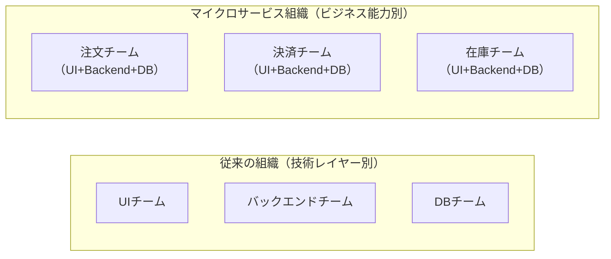

**3. プロジェクトではなくプロダクト（Products not Projects）**

サービスを「完成したら別チームに引き渡す」プロジェクトではなく、チームがライフサイクル全体（開発、運用、保守）に責任を持つプロダクトとして扱う。Amazonの「You build it, you run it」の精神である。

**4. スマートエンドポイントとダムパイプ（Smart Endpoints and Dumb Pipes）**

ビジネスロジックはサービス内に閉じ込め、通信インフラは単純なものを使う。RESTful HTTPやシンプルなメッセージキュー（RabbitMQ、Apache Kafkaなど）がこれに該当する。SOAのESBのように、通信インフラにロジックを載せることを避ける。

**5. 分散統治（Decentralized Governance）**

中央の技術標準を押し付けるのではなく、各チームがサービスごとに最適な技術スタックを選択する自由を持つ。ある問題にはGoが最適であり、別の問題にはPythonが最適かもしれない。この自由を**ポリグロット（多言語）アーキテクチャ**と呼ぶ。

**6. 分散データ管理（Decentralized Data Management）**

各サービスが自身のデータストアを所有し、他のサービスのデータベースに直接アクセスすることを禁止する。これを**Database per Service**パターンと呼ぶ。データの整合性は結果整合性（Eventual Consistency）で担保する。

**7. インフラの自動化（Infrastructure Automation）**

マイクロサービスの運用には、CI/CDパイプライン、コンテナオーケストレーション、インフラのコード化（Infrastructure as Code）が不可欠である。手動オペレーションでは、数十から数百のサービスを管理することは不可能である。

**8. 障害のための設計（Design for Failure）**

分散システムでは障害は避けられない。各サービスは、依存先サービスの障害に耐えられるよう設計されなければならない。サーキットブレーカー、タイムアウト、リトライ、フォールバックなどの障害対策パターンが必須となる。

**9. 進化的設計（Evolutionary Design）**

サービスは置換可能であるべきである。ビジネス要件の変化に応じて、サービスの分割・統合・廃止が容易に行えるように設計する。

### 2.3 ドメイン駆動設計（DDD）との関係

マイクロサービスの境界を適切に定義する上で、Eric Evansが提唱した**ドメイン駆動設計（Domain-Driven Design, DDD）**の概念が極めて重要である。特に以下の概念がマイクロサービスの設計と密接に関連する。

- **境界づけられたコンテキスト（Bounded Context）**：特定のドメインモデルが有効な範囲を明確に区切る概念。マイクロサービスの境界は、この境界づけられたコンテキストに一致させるのが理想的である
- **ユビキタス言語（Ubiquitous Language）**：コンテキスト内で統一された用語体系。同じ「顧客」という概念でも、注文コンテキストでは「注文者」、配送コンテキストでは「届け先」として異なるモデルを持ち得る
- **集約（Aggregate）**：トランザクション整合性の単位。サービス内のデータ操作は集約単位で行う

::: tip サービス境界の決定指針
サービスの粒度を決めるときに最も重要なのは「独立してデプロイ可能か」という問いである。あるサービスを変更してデプロイする際に、常に別のサービスも同時にデプロイしなければならないのであれば、それらは本来一つのサービスであるべきだ。
:::

## 3. アーキテクチャパターン

### 3.1 API Gateway パターン

マイクロサービスアーキテクチャにおいて、クライアントが個々のサービスのエンドポイントを直接呼び出すのは非効率的であり、セキュリティ上も問題がある。**API Gateway**は、クライアントと内部サービス群の間に位置するリバースプロキシであり、以下の責務を担う。

- **リクエストルーティング**：クライアントのリクエストを適切なサービスに転送する
- **APIコンポジション**：複数のサービスの応答を集約して単一のレスポンスを返す
- **認証・認可**：トークン検証、レート制限などの横断的関心事を一箇所で処理する
- **プロトコル変換**：外部HTTP/RESTと内部gRPCの変換など
- **ロードバランシング**：サービスインスタンス間のトラフィック分散

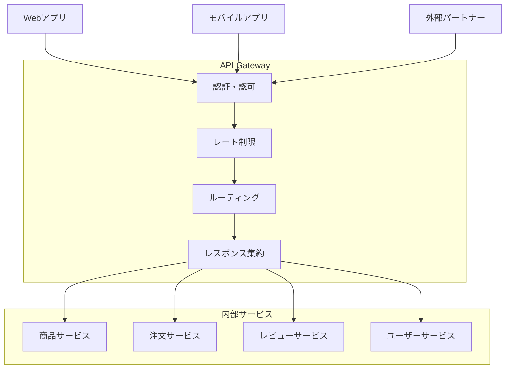

::: details BFF（Backend for Frontend）パターン
クライアントの種類（Web、モバイル、IoTなど）ごとに異なるAPI Gatewayを設けるパターンをBFF（Backend for Frontend）と呼ぶ。Webアプリケーションは詳細なデータを必要とする一方、モバイルアプリはバッテリー消費とデータ通信量を抑えるために最小限のデータを要求する。BFFを導入することで、各クライアントに最適化されたAPIを提供できる。
:::

代表的なAPI Gateway実装には、Kong、NGINX、AWS API Gateway、Envoy Proxy（Istio内で使用）、Spring Cloud Gatewayなどがある。

### 3.2 Service Discovery パターン

マイクロサービス環境では、サービスのインスタンスが動的に増減する。コンテナオーケストレーションにより、サービスのIPアドレスやポートは常に変動する。あるサービスが別のサービスを呼び出すとき、接続先をどのように見つけるかが問題となる。これを解決するのが**Service Discovery**である。

Service Discoveryには大きく分けて**クライアントサイドディスカバリ**と**サーバーサイドディスカバリ**の二つのアプローチがある。

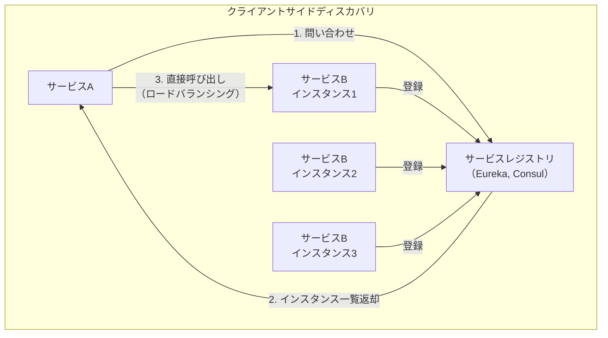

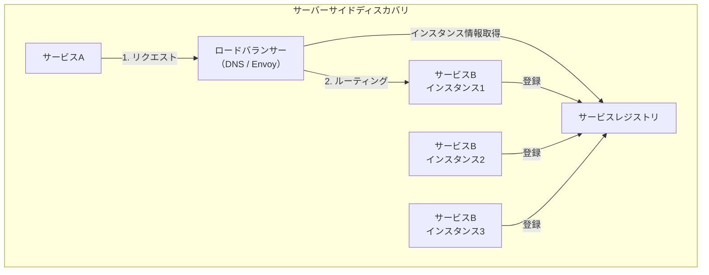

Kubernetesでは、サーバーサイドディスカバリが標準である。KubernetesのServiceリソースが内部DNSとロードバランシングを提供し、クライアントはサービス名（例：`order-service.default.svc.cluster.local`）で宛先を解決する。

### 3.3 サービス間通信

マイクロサービス間の通信は、**同期通信**と**非同期通信**に大別される。どちらを選択するかは、ユースケースの要件によって決まる。

#### 同期通信（Request-Response）

同期通信では、呼び出し側が応答を待つ。代表的なプロトコルはHTTP/RESTとgRPCである。

| 特性 | HTTP/REST | gRPC |
|---|---|---|
| プロトコル | HTTP/1.1 or HTTP/2 | HTTP/2 |
| データ形式 | JSON（テキスト） | Protocol Buffers（バイナリ） |
| パフォーマンス | 比較的低い | 高い（バイナリ+HTTP/2ストリーミング） |
| 型安全性 | スキーマはオプション（OpenAPI） | .protoファイルで強制 |
| ブラウザサポート | ネイティブ | gRPC-Webが必要 |
| 人間可読性 | 高い | 低い |
| 適用場面 | 外部API、シンプルなCRUD | 内部サービス間通信、高性能が必要 |

#### 非同期通信（Event-Driven）

非同期通信では、サービスはメッセージブローカーを介してイベントを発行・購読する。呼び出し側は応答を待たないため、サービス間の時間的結合が排除される。

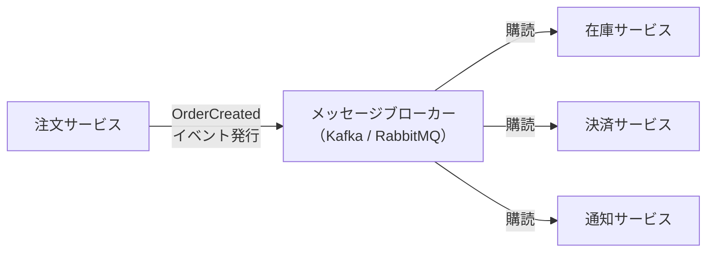

::: tip 同期 vs 非同期の選択指針
- **同期通信が適する場面**：ユーザーが即座に結果を必要とする操作（商品検索、認証、残高照会）
- **非同期通信が適する場面**：即座の応答が不要で、高いスループットや耐障害性が求められる操作（メール送信、ログ処理、在庫引当、データ同期）
- **原則**：可能な限り非同期通信を選択し、サービス間の結合度を下げる。同期通信はユーザー体験のために本当に必要な場合にのみ使用する
:::

#### コレオグラフィとオーケストレーション

複数のサービスにまたがるワークフロー（例：注文処理）を実現する方式には、**コレオグラフィ（Choreography）**と**オーケストレーション（Orchestration）**の二つがある。

**コレオグラフィ**では、各サービスがイベントに反応して自律的に動作する。中央のコーディネーターは存在しない。サービス間の結合度は低いが、ワークフロー全体の把握が困難になる。

**オーケストレーション**では、中央のオーケストレーター（Saga オーケストレーター）がワークフローの各ステップを指示する。全体の流れが明確になるが、オーケストレーターへの依存が生まれる。

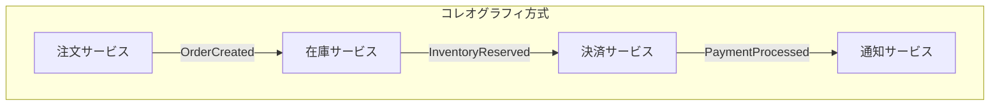

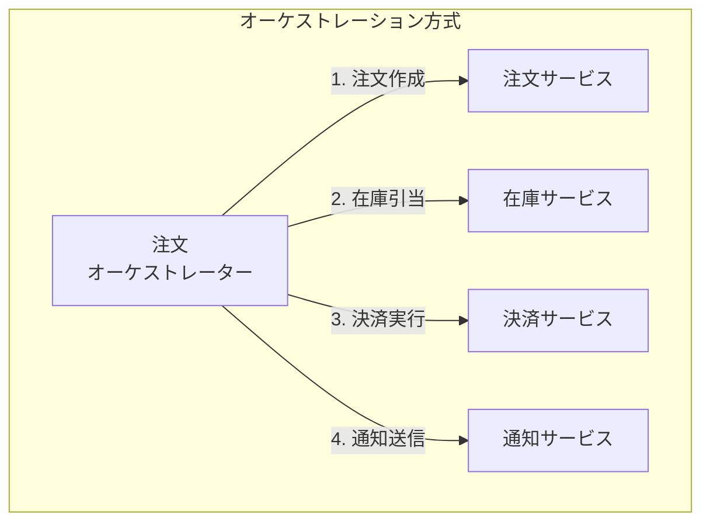

## 4. データ管理

### 4.1 Database per Service パターン

マイクロサービスにおいて最も重要かつ最も困難な設計判断の一つが、データ管理の方針である。**Database per Service**パターンでは、各サービスが自身専用のデータベースを持ち、他のサービスはそのデータベースに直接アクセスできない。

このパターンを採用する理由は以下の通りである。

- **疎結合の確保**：データベーススキーマの変更が他のサービスに影響しない
- **技術的自由度**：サービスごとに最適なデータベースを選択できる（PostgreSQL、MongoDB、Redis、Elasticsearch等）
- **独立したスケーリング**：データ量やアクセスパターンに応じて、サービスごとにデータベースをスケールできる
- **障害の分離**：一つのデータベースの障害が他のサービスに伝播しない

::: danger 共有データベースのアンチパターン
複数のサービスが同じデータベースを共有する「Shared Database」パターンは、マイクロサービスのアンチパターンである。共有データベースは以下の問題を引き起こす。
- スキーマ変更が複数のサービスに影響し、独立したデプロイが不可能になる
- サービス間のデータ境界が曖昧になり、意図しないデータ依存が生まれる
- データベースが単一障害点となる
- サービスの技術的独立性が失われる

ただし、マイクロサービスへの移行過程では、暫定的に共有データベースを許容する場合もある。重要なのは、それが最終的な目標ではなく、移行途中の妥協であることを認識することである。
:::

### 4.2 Saga パターン

Database per Serviceパターンを採用すると、複数のサービスにまたがるトランザクション（分散トランザクション）をどのように実現するかという課題が生じる。従来のモノリスでは、単一データベースのACIDトランザクションで整合性を保証できたが、マイクロサービスではそれが不可能である。

**二相コミット（Two-Phase Commit, 2PC）**は分散トランザクションの古典的なプロトコルだが、マイクロサービスでは避けるべきとされる。2PCは参加者全員のロックが必要であり、コーディネーターの障害で全体がブロックされるリスクがある。可用性と性能の観点で、マイクロサービスの要件に合わない。

その代替として広く採用されるのが**Saga パターン**である。Sagaは、ビジネストランザクションを一連のローカルトランザクションとして実行し、途中で失敗した場合は**補償トランザクション（Compensating Transaction）**によって先行するトランザクションの結果を取り消す。

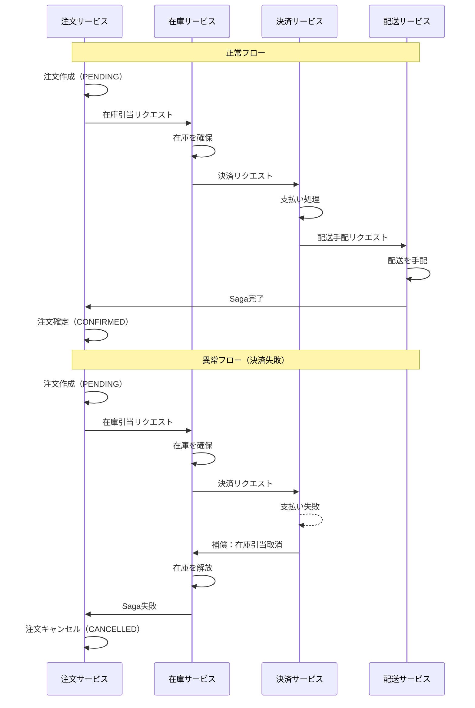

Sagaパターンの設計で特に注意すべき点は以下である。

- **べき等性（Idempotency）**：ネットワーク障害やリトライにより、同じリクエストが複数回到着する可能性がある。すべてのステップはべき等（同じ操作を何度実行しても結果が変わらない）に設計する必要がある
- **補償トランザクションの設計**：「元に戻す」操作は技術的に容易ではない場合がある。例えば、送信済みのメールを「取り消す」ことはできない。こうした場合は「訂正メールを送信する」という補償を行う
- **状態管理**：Sagaの各ステップの進行状態を永続化し、システム障害時にSagaを適切に再開または補償できるようにする

### 4.3 結果整合性（Eventual Consistency）

マイクロサービスアーキテクチャでは、CAPの定理やBASE特性の考え方に基づき、強い整合性（Strong Consistency）よりも**結果整合性（Eventual Consistency）**を受け入れることが基本方針となる。

結果整合性とは、ある時点ではデータの不整合が生じうるが、十分な時間が経過すれば（かつ新たな更新がなければ）、最終的にすべてのレプリカが一致する状態に収束するという保証である。

::: warning 結果整合性がもたらす設計上の課題
- **ユーザー体験への影響**：商品を購入直後に注文履歴を確認しても、まだ反映されていない可能性がある。「自分の書き込みの読み取り保証（Read-your-writes consistency）」のような追加の保証が必要になることがある
- **クエリの複雑さ**：複数のサービスにまたがるデータを結合して表示する必要がある場合、CQRS（Command Query Responsibility Segregation）パターンの導入を検討する
- **障害発生時のデータ復旧**：非同期イベント処理の途中で障害が発生した場合、データの整合性をどう回復するかを事前に設計しておく必要がある
:::

### 4.4 CQRS パターン

**CQRS（Command Query Responsibility Segregation）**は、データの書き込み（Command）と読み取り（Query）の責務を分離するパターンである。マイクロサービスにおいて、複数のサービスのデータを結合した複雑なクエリを実現するために活用される。

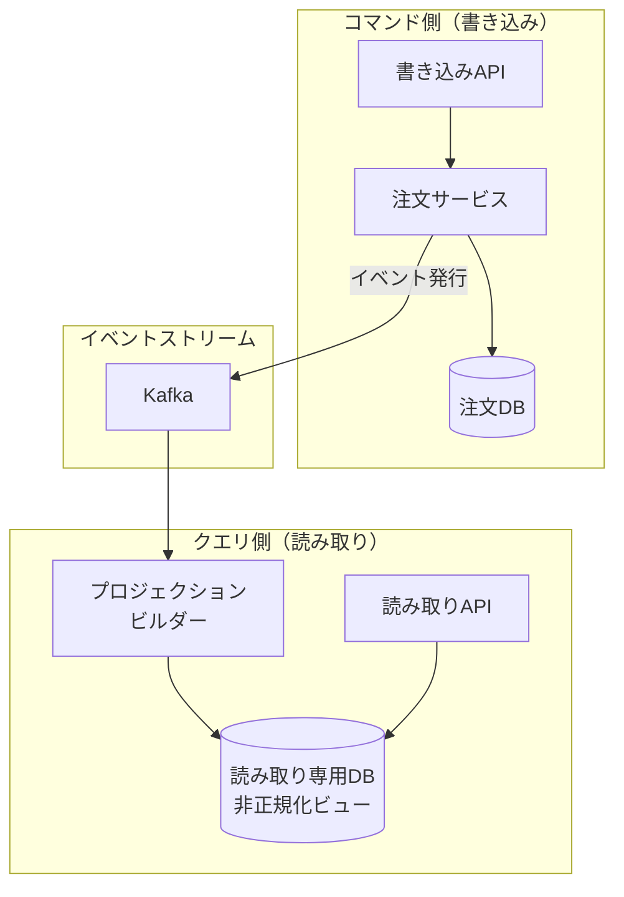

CQRSを導入することで、書き込みモデルと読み取りモデルをそれぞれ最適化できる。例えば、書き込み側は正規化されたリレーショナルデータベースを使い、読み取り側は検索に最適化されたElasticsearchや非正規化されたビューを持つことができる。ただし、CQRSはシステムの複雑性を大幅に増大させるため、本当に必要な場合にのみ導入すべきである。

## 5. デプロイとインフラ

### 5.1 コンテナ技術

マイクロサービスの普及とコンテナ技術（特にDocker）の普及は、相互に強く影響し合ってきた。コンテナは、マイクロサービスの「独立してデプロイ可能」という特性を実現するための理想的な実行環境を提供する。

コンテナがマイクロサービスに適している理由は以下の通りである。

- **環境の一貫性**：開発、テスト、本番環境で同一のコンテナイメージを使用できる。「自分の環境では動いた」問題を排除する
- **軽量な隔離**：仮想マシンと比較してオーバーヘッドが小さく、起動が高速である。一台のホスト上で多数のサービスインスタンスを実行できる
- **イミュータブルインフラストラクチャ**：一度ビルドされたコンテナイメージは変更されない。デプロイの再現性と信頼性が向上する
- **ポリグロット対応**：各サービスが異なる言語・ランタイムを使用しても、コンテナとして統一的にデプロイできる

```dockerfile
# Example: Dockerfile for a Go microservice
FROM golang:1.22 AS builder
WORKDIR /app
COPY go.mod go.sum ./
RUN go mod download
COPY . .
RUN CGO_ENABLED=0 GOOS=linux go build -o /service ./cmd/server

FROM gcr.io/distroless/static-debian12
COPY --from=builder /service /service
EXPOSE 8080
ENTRYPOINT ["/service"]
```

### 5.2 Kubernetes によるオーケストレーション

数個のコンテナであれば手動管理も可能だが、数十から数百のマイクロサービスを本番環境で運用するためには、**コンテナオーケストレーション**が必要不可欠である。事実上の標準となっているのが**Kubernetes**である。

Kubernetesがマイクロサービスに提供する主要な機能は以下の通りである。

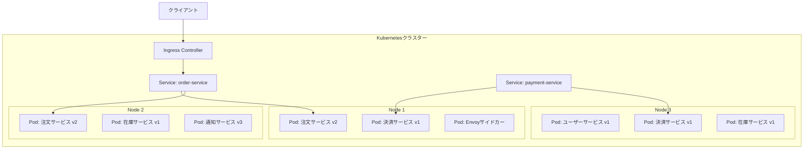

- **サービスディスカバリとロードバランシング**：KubernetesのServiceリソースが内部DNSと負荷分散を自動的に提供する
- **自動スケーリング**：Horizontal Pod Autoscaler（HPA）により、CPU/メモリ使用率やカスタムメトリクスに基づいてPod数を自動調整する
- **セルフヒーリング**：コンテナの異常終了を検知し、自動的に再起動する。ヘルスチェック（Liveness ProbeとReadiness Probe）により、応答できないインスタンスを自動的にトラフィックから除外する
- **ローリングアップデート**：ダウンタイムなしでサービスを新しいバージョンに更新する。問題が発生した場合は自動ロールバックも可能
- **設定管理とシークレット管理**：ConfigMapとSecretリソースにより、環境固有の設定をコードから分離する

### 5.3 サービスメッシュ

マイクロサービスの数が増加すると、サービス間通信における**横断的関心事**（セキュリティ、可観測性、トラフィック制御）の管理が複雑化する。これらのロジックを各サービスのアプリケーションコードに組み込むと、コードの肥大化と重複が生じる。

**サービスメッシュ（Service Mesh）**は、サービス間通信のインフラ層を専用のプロキシ（サイドカープロキシ）に委譲するアーキテクチャパターンである。代表的な実装にIstio、Linkerdがある。

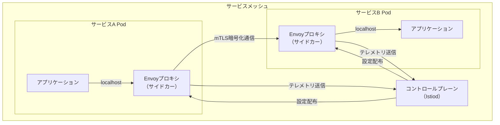

サービスメッシュが提供する主要な機能は以下の通りである。

- **mTLS（相互TLS）**：サービス間通信を自動的に暗号化し、相互認証を行う
- **トラフィック制御**：カナリアリリース、A/Bテスト、サーキットブレーカーの設定をインフラレベルで実現
- **可観測性**：分散トレーシング、メトリクス収集、アクセスログを自動的に取得
- **リトライとタイムアウト**：アプリケーションコードを変更せずに、通信のリトライポリシーやタイムアウトを設定

::: warning サービスメッシュの導入判断
サービスメッシュは強力だが、運用の複雑性とリソースオーバーヘッドを伴う。サイドカープロキシは各Podにデプロイされるため、メモリとCPUの追加消費がある。サービス数が少ない（10未満程度の）段階では、サービスメッシュの導入コストに見合わないことが多い。アプリケーションレベルのライブラリ（例：gRPCの組み込みリトライ機能）で十分対応できる場合もある。
:::

### 5.4 CI/CD パイプライン

マイクロサービスの核心的な利点である「独立したデプロイ」を実現するためには、各サービスが独立したCI/CDパイプラインを持つ必要がある。

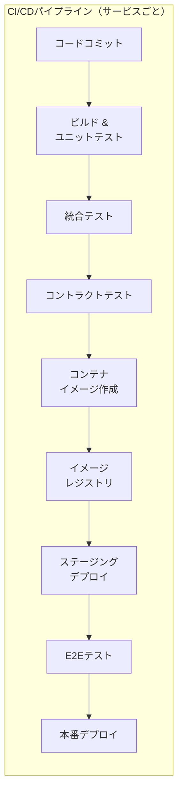

ここで重要なのは**コントラクトテスト（Contract Test）**の存在である。マイクロサービスでは、サービス間のインターフェース（API仕様）が暗黙の契約（コントラクト）として機能する。コントラクトテストは、サービスの変更が他のサービスとのコントラクトを破壊しないことを検証する。Pactが代表的なツールである。

## 6. 運用上の課題

### 6.1 可観測性（Observability）

モノリスでは一つのプロセスのログを追えばよかったが、マイクロサービスでは一つのリクエストが複数のサービスをまたいで処理される。問題が発生した際に「どのサービスで何が起きたか」を追跡するために、**可観測性の三本柱**が必要となる。

**ログ（Logs）**：各サービスが構造化ログ（JSON形式など）を出力し、Fluentd/FluentBitなどのログ収集エージェントを通じてElasticsearchやLokiに集約する。**相関ID（Correlation ID）**をリクエストの先頭で生成し、すべてのサービスに伝播させることで、一連の処理を横断的に追跡できるようにする。

**メトリクス（Metrics）**：各サービスのレイテンシ、エラー率、スループット、CPU/メモリ使用率などの時系列データを収集する。Prometheusが事実上の標準であり、Grafanaでダッシュボード化することが一般的である。特に重要なメトリクスとして、Google SREが提唱した**四つのゴールデンシグナル**（レイテンシ、トラフィック、エラー率、飽和度）がある。

**分散トレーシング（Distributed Tracing）**：リクエストが複数のサービスを横断する際の処理の流れを、スパン（Span）とトレース（Trace）として可視化する。OpenTelemetryがベンダー中立の標準ライブラリとして広く採用されており、バックエンドにはJaeger、Zipkin、Grafana Tempoなどが使用される。

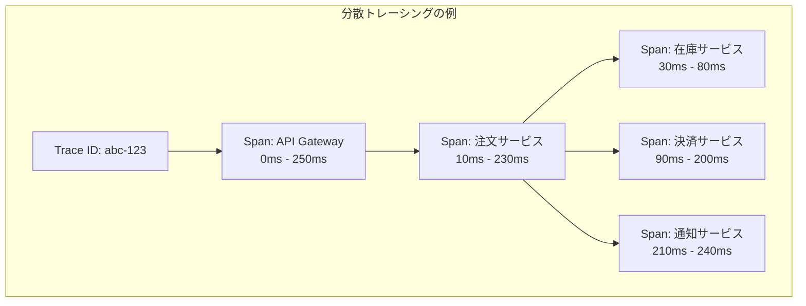

### 6.2 サーキットブレーカーパターン

分散システムにおいて、あるサービスの障害が他のサービスに連鎖的に伝播する**障害の連鎖（Cascading Failure）**は、最も危険な故障モードの一つである。

例えば、決済サービスが応答不能になった場合、注文サービスは決済サービスへのリクエストがタイムアウトするまでスレッドを占有し続ける。やがて注文サービスのスレッドプールが枯渇し、注文サービス自体も応答不能に陥る。そしてこの連鎖が上流に伝播していく。

**サーキットブレーカーパターン**は、電気回路のブレーカーにヒントを得た障害伝播防止メカニズムである。

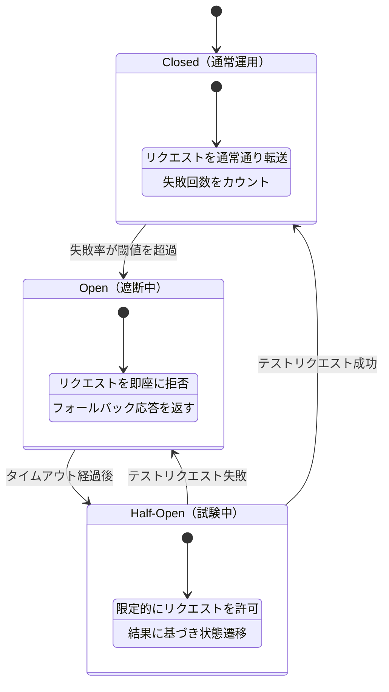

サーキットブレーカーの三つの状態は以下の通りである。

1. **Closed（閉）**：通常の状態。リクエストはそのまま転送される。失敗率を監視し、閾値を超えたらOpen状態に遷移する
2. **Open（開）**：障害を検知した状態。リクエストは即座に拒否され、フォールバック応答（キャッシュされた値、デフォルト値、エラーメッセージなど）が返される。一定時間経過後、Half-Open状態に遷移する
3. **Half-Open（半開）**：回復を試験する状態。限定的な数のリクエストを転送し、成功すればClosed状態に戻る。失敗すれば再びOpen状態に遷移する

代表的な実装としては、Resilience4j（Java）、Hystrix（Netflix、現在はメンテナンスモード）、Polly（.NET）がある。また、Istioのようなサービスメッシュはインフラレベルでサーキットブレーカーを提供する。

### 6.3 その他の耐障害性パターン

サーキットブレーカー以外にも、マイクロサービスの耐障害性を高めるためのパターンが数多く存在する。

**バルクヘッド（Bulkhead）パターン**：船舶の隔壁に由来するパターン。サービス内のリソース（スレッドプール、コネクションプールなど）を呼び出し先ごとに分離する。あるサービスへの呼び出しがリソースを使い切っても、他のサービスへの呼び出しには影響しない。

**リトライとバックオフ**：一時的な障害に対してリクエストを再試行する。ただし、単純なリトライは障害中のサービスに負荷をかけ続ける可能性があるため、**エクスポネンシャルバックオフ（Exponential Backoff）**（リトライ間隔を指数的に増加させる）と**ジッター（Jitter）**（ランダムな遅延を追加する）を組み合わせるのが定石である。

**タイムアウト**：すべてのリモート呼び出しには適切なタイムアウトを設定する。タイムアウトが設定されていないリモート呼び出しは、依存先の障害時にスレッドを無期限に占有するリスクがある。

**フォールバック**：依存先サービスが応答できない場合に返す代替レスポンスを用意する。例えば、レコメンデーションサービスが応答できない場合は、パーソナライズされていない汎用のおすすめ商品リストを返す。

### 6.4 分散システム特有の課題

マイクロサービスは本質的に分散システムであり、以下の分散システム固有の課題に直面する。

**ネットワークの信頼性**：ネットワークは常に信頼できるわけではない。これは「分散コンピューティングの八つの誤謬（Fallacies of Distributed Computing）」の第一項目である。パケットロス、レイテンシの変動、ネットワーク分断はいつでも発生し得る。

**クロック同期**：分散システムでは各ノードのクロックが完全に同期していることを前提にできない。イベントの順序を決定するためには、論理クロック（Lamport Timestamp、Vector Clock）やハイブリッド論理クロック（HLC）の利用を検討する必要がある。

**部分障害（Partial Failure）**：システム全体ではなく一部のコンポーネントだけが障害を起こす状態は、分散システム特有の課題である。障害を起こしたコンポーネントが正常なのか異常なのか判断できない状況（グレー障害）も発生し得る。

## 7. モノリスからの移行戦略

### 7.1 Strangler Fig Pattern

既存のモノリシックアプリケーションをマイクロサービスに移行する際、最も推奨される戦略が**Strangler Fig Pattern（絞め殺しの木パターン）**である。この名前は、宿主の木に巻き付きながら成長し、最終的に宿主を覆い尽くす絞め殺しの木（イチジクの一種）に由来する。

このパターンでは、モノリスの機能を段階的にマイクロサービスに抽出していく。新しいリクエストは新たに構築されたマイクロサービスにルーティングされ、モノリスの対応する部分は徐々に不要になっていく。

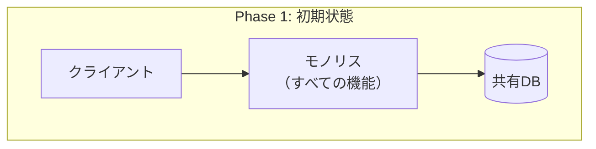

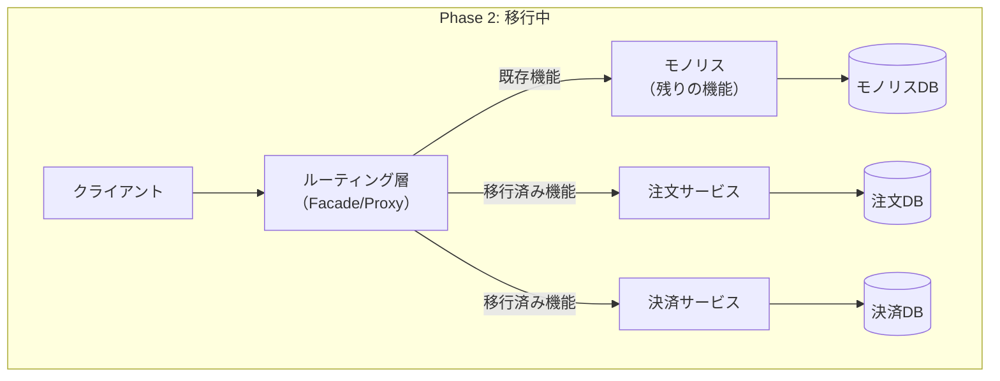

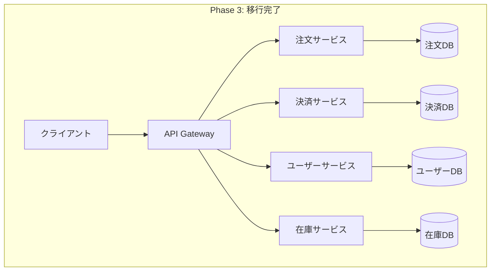

### 7.2 移行の実践的指針

Strangler Fig Patternを実践する上で、以下の指針が重要である。

**1. ビジネス価値に基づいて移行対象を選定する**

すべての機能を一度に移行しようとしてはならない。最も効果の高い箇所、例えば頻繁に変更される機能、独立したスケーリングが必要な機能、技術的な刷新が求められる機能から着手する。

**2. データの移行を慎重に計画する**

データの分離はマイクロサービス移行において最も困難な部分である。以下のアプローチが一般的である。

- **共有データベースからの段階的分離**：最初はマイクロサービスがモノリスのデータベースを直接参照することを許容し、段階的にデータを新しいデータベースに移行する
- **Change Data Capture（CDC）**：Debeziumなどのツールを用いて、データベースの変更を検知し、新しいサービスのデータストアにリアルタイムで同期する
- **データの二重書き込み（Dual Write）**は避ける。二重書き込みは部分障害時にデータ不整合を引き起こすリスクがある

**3. Anti-Corruption Layer（腐敗防止層）の導入**

DDDの概念であるAnti-Corruption Layerを、モノリスと新しいマイクロサービスの間に設ける。モノリスの古いデータモデルやインターフェースが新しいサービスのドメインモデルを汚染することを防ぐ。

**4. ビッグバンリライトを避ける**

モノリスを一気に書き換える「ビッグバンリライト」は、ほぼ確実に失敗する。段階的な移行を行い、各ステップでビジネス価値を提供し続けることが重要である。

::: tip モノリスファーストアプローチ
Martin Fowlerは「MonolithFirst」（モノリスファースト）アプローチを提唱している。新しいプロジェクトではまずモノリスとして開発を始め、ドメインの理解が十分に深まり、サービス境界が明確になった段階でマイクロサービスに分解するのが賢明であるという考え方である。ドメインの理解が不十分な段階でサービスを分割すると、不適切な境界設定に苦しむことになる。
:::

## 8. メリット・デメリットの正直な評価

### 8.1 マイクロサービスのメリット

**技術的メリット**

| メリット | 詳細 |
|---|---|
| 独立したデプロイ | 各サービスを個別にデプロイでき、リリースサイクルが短縮される |
| 技術的多様性 | サービスごとに最適な言語、フレームワーク、データベースを選択可能 |
| 独立したスケーリング | 負荷の高いサービスだけを選択的にスケールアウトできる |
| 障害の分離 | 一つのサービスの障害がシステム全体に波及しにくい（適切に設計された場合） |
| 置換可能性 | サービスを個別に書き換えたり、技術スタックを変更したりできる |

**組織的メリット**

| メリット | 詳細 |
|---|---|
| チームの自律性 | 各チームが自身のサービスに対して完全な責任と権限を持つ |
| スケーラブルな開発 | 多数のチームが互いの足を踏まずに並行して開発できる |
| オーナーシップの明確さ | サービスの所有者が明確で、責任の所在が曖昧にならない |

### 8.2 マイクロサービスのデメリット

マイクロサービスの利点は広く喧伝されているが、そのコストについて正直に評価することが極めて重要である。

::: danger マイクロサービスの「隠れたコスト」
マイクロサービスの導入を検討する際、多くのチームはメリットを過大評価し、コストを過小評価する傾向がある。以下のデメリットは「マイクロサービスに移行したら自動的に解決される」問題ではなく、マイクロサービスが**新たに生み出す**問題である。
:::

**技術的デメリット**

| デメリット | 詳細 |
|---|---|
| 分散システムの複雑性 | ネットワーク障害、部分障害、結果整合性、分散トレーシングなど、モノリスには存在しなかった問題が発生する |
| データ整合性の困難さ | ACIDトランザクションに代えてSagaパターンや結果整合性を採用する必要があり、設計と実装の複雑性が大幅に増す |
| テストの複雑さ | サービス間の統合テスト、コントラクトテスト、エンドツーエンドテストの設計と実行が困難になる |
| 運用負荷 | 監視、ログ集約、分散トレーシング、サービスメッシュなど、高度な運用インフラが必要 |
| レイテンシの増大 | プロセス内関数呼び出しがネットワーク越しの通信に変わるため、レイテンシが増加する |
| デバッグの困難さ | リクエストが複数のサービスを横断するため、問題の特定と再現が難しい |

**組織的デメリット**

| デメリット | 詳細 |
|---|---|
| 高い技術的ハードル | 分散システム、コンテナ、Kubernetes、CI/CD、可観測性などの幅広い技術力が求められる |
| 認知負荷 | 開発者はサービス間の依存関係、非同期通信、結果整合性など、多くの概念を理解する必要がある |
| オーバーヘッドの初期コスト | 適切なインフラ（CI/CDパイプライン、監視、ロギング、サービスメッシュ）の構築に多大な初期投資が必要 |

### 8.3 マイクロサービスプレミアム

Martin Fowlerは、マイクロサービスの運用には**「マイクロサービスプレミアム（Microservice Premium）」**と呼ぶべきコストが存在すると指摘している。分散システムの複雑性、運用の負荷、テストの困難さなど、マイクロサービスが本質的にもたらすオーバーヘッドである。

このプレミアムは、システムが十分に大きく複雑になった段階で初めてペイする。小規模なシステムでは、マイクロサービスプレミアムがメリットを上回り、結果的にモノリスより生産性が低下する。

```mermaid
graph LR
    subgraph "システム規模と生産性の関係"
        direction LR
    end
```

概念的には、以下のような関係がある。

- **小規模システム**：モノリスの方が生産性が高い。マイクロサービスのオーバーヘッドがメリットを上回る
- **中規模システム**：モジュラーモノリス（明確なモジュール境界を持つモノリス）が最もバランスが良い可能性がある
- **大規模システム**：マイクロサービスのメリットがコストを上回り始める。チームの並行開発と独立したデプロイが真に効果を発揮する

## 9. いつマイクロサービスを使うべきか、使わないべきか

### 9.1 マイクロサービスが適する状況

以下の条件が複数当てはまる場合、マイクロサービスアーキテクチャの採用を検討する価値がある。

**1. 組織が十分に大きい**：複数の独立したチーム（各チーム5-9名程度）がそれぞれのサービスを所有できる規模がある。1チームですべてを管理するのであれば、マイクロサービスのメリットは限定的である。

**2. ドメインの理解が成熟している**：ビジネスドメインが十分に理解されており、適切なサービス境界を引ける確信がある。不確実性が高い新規プロジェクトでは、モノリスから始める方が安全である。

**3. 独立したデプロイが必要**：異なる機能を異なるリリースサイクルでデプロイする必要がある。全機能が同じリリースサイクルで十分なら、マイクロサービスの最大のメリットが活きない。

**4. 異なるスケーリング要件がある**：特定の機能だけに極端な負荷がかかり、機能ごとに異なるスケーリング戦略が必要である。

**5. 技術的多様性が求められる**：異なる問題に対して異なる技術スタックが最適であり、単一の技術スタックでは対応が困難である。

**6. 運用の成熟度が高い**：CI/CD、コンテナ化、監視、ログ集約、分散トレーシングなどの運用基盤が整備されている、あるいは整備する能力とリソースがある。

### 9.2 マイクロサービスが適さない状況

以下の状況では、マイクロサービスの採用を避けるべきである。

**1. チームが小さい**：10名以下の小規模チームでは、マイクロサービスの運用負荷が開発の生産性を圧迫する。少人数で数十のサービスを管理することは持続可能ではない。

**2. 新規プロダクトの初期段階**：ドメインの理解が不十分な段階でサービス境界を決定すると、不適切な分割に苦しむことになる。リファクタリングはモノリス内の方が圧倒的に容易である。

**3. 運用基盤が未整備**：CI/CDパイプライン、コンテナオーケストレーション、監視インフラが整っていない状態でマイクロサービスに移行するのは無謀である。

**4. 結合度の高いドメイン**：ビジネスロジックが密に結合しており、サービス間で頻繁にデータを交換する必要がある場合、マイクロサービスに分割するメリットは少なく、分散システムの複雑性だけが増す。

**5. パフォーマンスが最優先**：超低レイテンシが要求されるシステムでは、サービス間通信のオーバーヘッドが許容できない場合がある。

::: tip モジュラーモノリスという選択肢
マイクロサービスのメリットの多くは、モノリス内でも適切なモジュール設計を行うことで享受できる。明確なモジュール境界、定義されたインターフェース、独立したデータストア（スキーマレベルの分離）を持つ**モジュラーモノリス（Modular Monolith）**は、マイクロサービスの複雑性を伴わずに、多くの設計上の利点を得られる中間的な選択肢である。

ShopifyはRuby on Railsの巨大なモノリスを、マイクロサービスではなくモジュラーモノリスに進化させるアプローチを選択した。これは、マイクロサービスが唯一の正解ではないことを示す好例である。
:::

### 9.3 意思決定のフレームワーク

マイクロサービス採用の意思決定を構造化するために、以下の問いに答えることを推奨する。

1. **組織は十分に大きいか？**（複数の独立チームを編成できるか）
2. **ドメインは十分に理解されているか？**（サービス境界を自信を持って引けるか）
3. **独立したデプロイが真に必要か？**（現在のリリースプロセスのどこがボトルネックか）
4. **運用基盤は整備されているか？**（CI/CD、監視、ログ、コンテナ化）
5. **チームは分散システムのスキルを持っているか？**
6. **マイクロサービスのコストを受け入れる覚悟があるか？**

これらの問いの大半に「はい」と答えられない場合、マイクロサービスの採用は時期尚早である可能性が高い。

## 10. まとめ

マイクロサービスアーキテクチャは、大規模なソフトウェアシステムにおける開発と運用の課題を解決するための強力なアーキテクチャスタイルである。独立したデプロイ、技術的多様性、チームの自律性といったメリットは、適切な条件の下で真に大きな価値を生む。

しかし、マイクロサービスは「銀の弾丸」ではない。分散システムの本質的な複雑性、データ整合性の課題、運用負荷の増大といったコストは無視できない。これらのコストは、技術的な問題であると同時に、組織的な問題でもある。マイクロサービスの成功は、技術的な卓越性だけでなく、チーム構成、コミュニケーション構造、運用文化の成熟度に大きく依存する。

以下の原則を心に留めておくことが重要である。

1. **モノリスから始めよ**。ドメインの理解が十分に成熟するまで、マイクロサービスへの移行を急がない
2. **サービスの境界はビジネスに従え**。技術的な都合ではなく、ビジネス能力と境界づけられたコンテキストに基づいてサービスを分割する
3. **独立したデプロイ可能性を最優先せよ**。これがマイクロサービスの最も本質的な特性であり、この特性が確保されていなければ、分散モノリス（Distributed Monolith）という最悪の結果を招く
4. **障害は必ず起きるものとして設計せよ**。サーキットブレーカー、タイムアウト、リトライ、フォールバックなどの耐障害性パターンを最初から組み込む
5. **可観測性はオプションではない**。ログ、メトリクス、分散トレーシングの三本柱なくして、マイクロサービスの運用は成り立たない
6. **自動化を前提とせよ**。CI/CD、コンテナオーケストレーション、Infrastructure as Codeなしにマイクロサービスを運用するのは無謀である
7. **トレードオフを正直に評価せよ**。マイクロサービスのメリットだけを見て意思決定するのではなく、コストと組織の現実に向き合った上で判断する

最終的に重要なのは、アーキテクチャが目的ではなく手段であるという認識である。マイクロサービスアーキテクチャを採用するかどうかは、「流行しているから」ではなく、「自分たちの組織とプロダクトにとって、このアーキテクチャが解決する問題は、導入するコストに見合うか」という問いに対する誠実な回答に基づくべきである。
