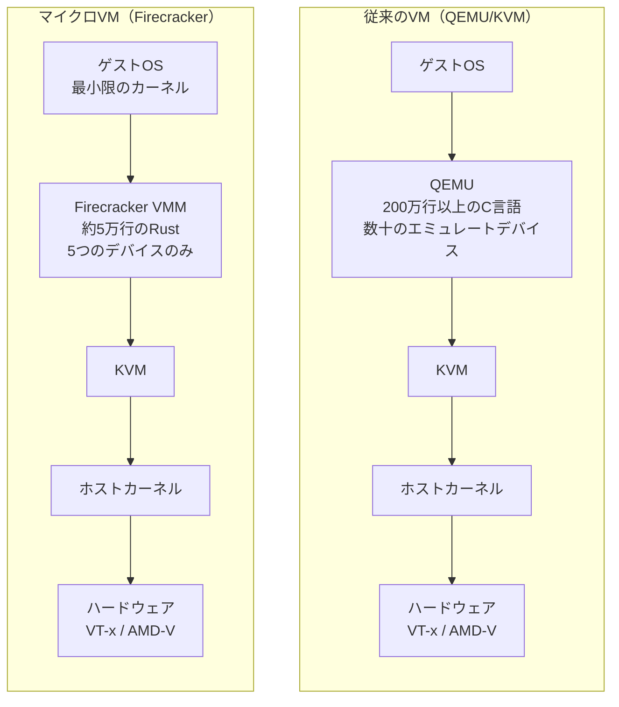
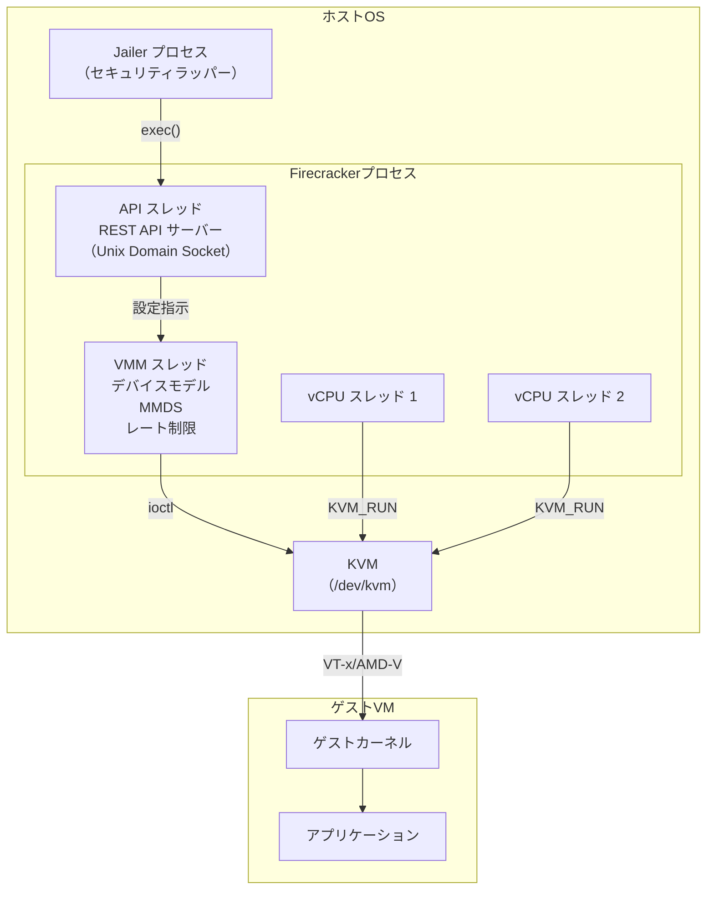
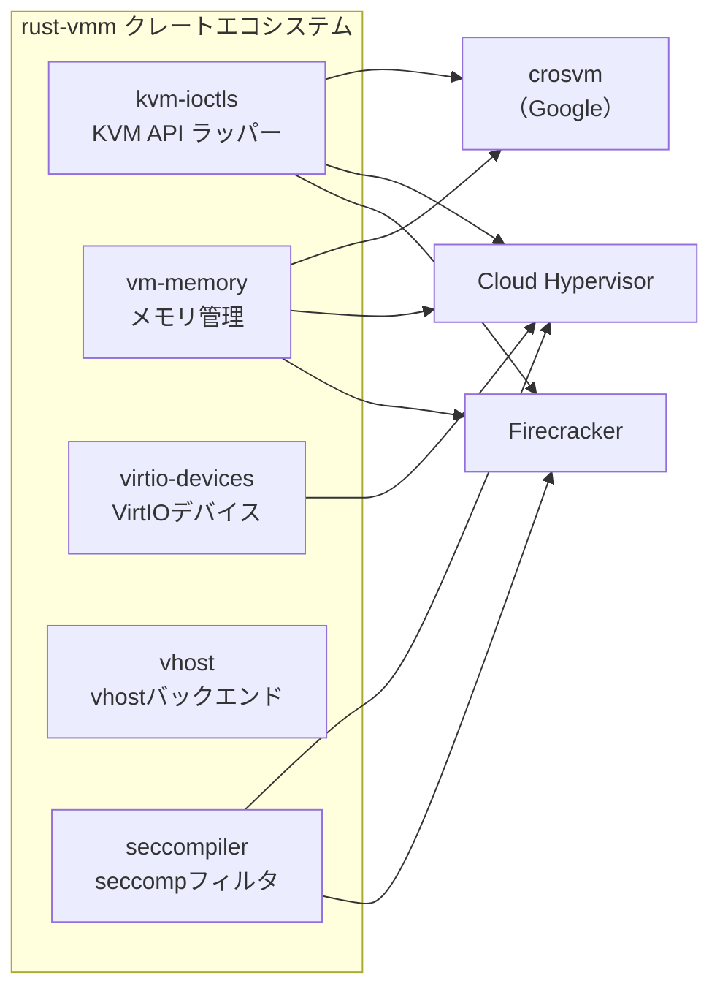
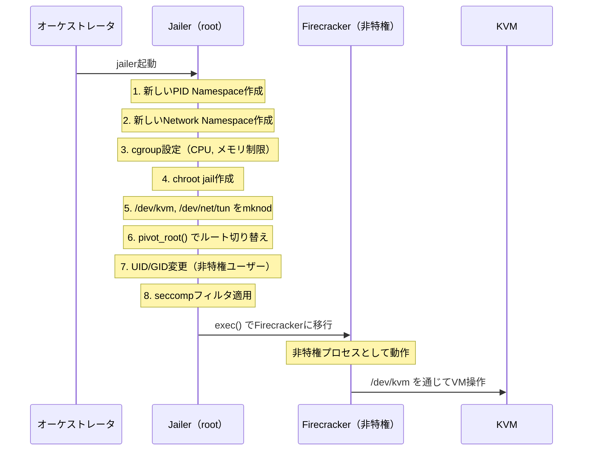
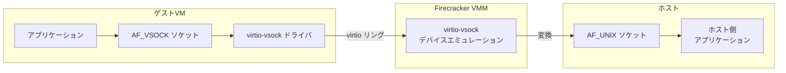
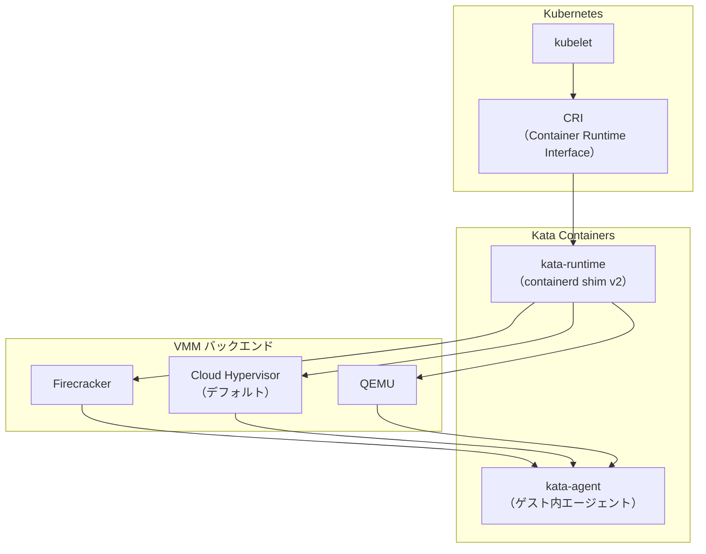

# マイクロVM（Firecracker, Cloud Hypervisor）

## 1. 背景と動機 — なぜマイクロVMが必要になったのか

### 1.1 コンテナの分離レベルの限界

Linuxコンテナは、Namespace と cgroups によってプロセスレベルの隔離を実現する。Docker の登場以降、コンテナはアプリケーションのパッケージングとデプロイの標準手段となり、仮想マシンに比べて圧倒的に軽量で高速な起動を可能にした。しかし、コンテナにはアーキテクチャ上の本質的な弱点が存在する。

コンテナは**ホストカーネルを共有する**。すべてのコンテナプロセスは同一のLinuxカーネル上で動作し、Namespace によって「見え方」が隔離されているに過ぎない。これは、カーネルの脆弱性がそのまま全コンテナに波及するリスクを意味する。実際、カーネルのシステムコールインターフェースは300を超える広大な攻撃面（attack surface）であり、コンテナエスケープの脆弱性は継続的に発見されている。

```
コンテナの隔離モデル:

  コンテナA        コンテナB        コンテナC
+------------+  +------------+  +------------+
| アプリ     |  | アプリ     |  | アプリ     |
| ライブラリ |  | ライブラリ |  | ライブラリ |
+------------+  +------------+  +------------+
|           共有Linuxカーネル                 |
+--------------------------------------------+
|           ホストハードウェア                 |
+--------------------------------------------+

問題: カーネルの脆弱性 → 全コンテナに影響
      300+ のシステムコールが攻撃面に
```

マルチテナント環境、つまり異なるユーザーや組織のワークロードが同一ホスト上で動作する状況では、この共有カーネルモデルは深刻なセキュリティ上の懸念となる。クラウドプロバイダーが顧客のコードを実行する場合、一つの顧客のコードが他の顧客のデータにアクセスできてはならない。コンテナの Namespace 隔離だけでは、この要件を満たすには不十分である。

### 1.2 サーバーレスとFaaSの要件

2014年にAWSがLambdaを発表して以降、サーバーレスコンピューティング（Function as a Service, FaaS）は急速に普及した。FaaSのワークロードには、従来のVMやコンテナとは異なる特殊な要件がある。

1. **超高速起動**: 関数の呼び出しごとに実行環境を用意する必要があり、ミリ秒単位の起動時間が求められる
2. **高密度**: 1台の物理ホスト上で数千の実行環境を同時に稼働させる必要がある
3. **強力な隔離**: 異なるテナントのコードが同一ホスト上で動作するため、VM レベルのセキュリティ境界が必須
4. **最小リソース消費**: 個々の関数はごくわずかなCPUとメモリしか必要としない

従来の仮想マシンはセキュリティ要件を満たすが、起動に数秒〜数十秒かかり、最低でも数百MBのメモリを消費する。一方、コンテナは軽量で高速だが、マルチテナント環境でのセキュリティが不十分である。

```
FaaSの要件マトリクス:

              起動速度    メモリ効率   隔離強度   密度
従来のVM       ✗ (秒)     ✗ (100MB+)   ✓ (強)    ✗ (低)
コンテナ       ✓ (ms)     ✓ (数MB)     ✗ (弱)    ✓ (高)
マイクロVM     ✓ (ms)     ✓ (数MB)     ✓ (強)    ✓ (高)
```

### 1.3 マイクロVMという解決策

マイクロVMは、仮想マシンのセキュリティ境界をコンテナ並みの軽量さで実現するという、両者の「いいとこ取り」を目指す技術である。KVM（Kernel-based Virtual Machine）が提供するハードウェアレベルの仮想化による強力な隔離を維持しつつ、VMM（Virtual Machine Monitor）を極限まで軽量化することで、高速起動と高密度配置を可能にする。

この発想は単純だが強力である。従来のVMが重いのは、QEMUのような汎用VMMが膨大なデバイスエミュレーションコードを含むためであり、仮想化メカニズム自体が重いわけではない。KVMが提供するハードウェア仮想化は極めて効率的であり、VMMを最小限に絞れば、起動時間もメモリ消費も劇的に削減できる。

## 2. 従来のVMとマイクロVMの根本的な違い

### 2.1 アーキテクチャの比較

従来のVM（QEMU/KVM）とマイクロVMの最も大きな違いは、VMMの設計哲学にある。



QEMUは、あらゆるハードウェアをエミュレートする汎用的なVMMとして設計されている。IDE/AHCI コントローラ、USB デバイス、サウンドカード、ネットワークカード、VGA ディスプレイなど、数十のデバイスをエミュレートし、そのコードベースは200万行以上のCコードに達する。この巨大なコードベースは、機能の豊富さと引き換えに、メモリ消費の増大と攻撃面の拡大をもたらす。

一方、マイクロVMのVMMは目的を極限まで絞り込む。Firecrackerは5つのデバイスしかエミュレートしない。

| デバイス | 用途 |
|---------|------|
| virtio-net | ネットワーク通信 |
| virtio-block | ブロックストレージ |
| virtio-vsock | ホスト-ゲスト間通信 |
| serial console | デバッグ出力 |
| i8042（キーボードコントローラ） | VM停止シグナルのみ |

### 2.2 数値で見る違い

以下の比較は、マイクロVMが従来のVMと比較してどれほど軽量であるかを示す。

| 指標 | QEMU/KVM | Firecracker | 備考 |
|------|----------|-------------|------|
| コードベース | 約200万行（C） | 約5万行（Rust） | 攻撃面の大幅な縮小 |
| 起動時間 | 数秒〜数十秒 | < 125ms | ユーザー空間コード開始まで |
| メモリオーバーヘッド | 数百MB | < 5MB | VMM自体のメモリ消費 |
| エミュレートデバイス数 | 数十 | 5 | 必要最小限 |
| 1ホストあたりの密度 | 数十〜数百 | 数千 | 同一ハードウェア上 |
| microVM作成レート | — | 最大150 VM/秒/ホスト | API経由での生成速度 |

起動時間が125ms未満ということは、HTTP リクエストの処理と同程度の遅延でVMを起動できることを意味する。これにより、リクエストごとに新しいVMを起動するような、従来は考えられなかったアーキテクチャが実現可能になる。

### 2.3 言語選択の意味

マイクロVMのVMMがRustで実装されていることは、単なる技術的嗜好以上の意味を持つ。QEMUのCコードベースでは、バッファオーバーフロー、use-after-free、NULLポインタ参照といったメモリ安全性の問題が継続的にCVE（Common Vulnerabilities and Exposures）として報告されてきた。VMM はセキュリティ境界そのものであり、VMMの脆弱性はゲストからホストへのエスケープを意味する。

Rustのメモリ安全性保証は、これらの脆弱性クラスをコンパイル時に排除する。所有権システムと借用チェッカーにより、ダングリングポインタやデータ競合がコンパイルエラーとなる。セキュリティクリティカルなコンポーネントにRustを採用することで、VMMの攻撃面はコード量の削減に加えて、脆弱性の種類そのものが縮小される。

## 3. Firecracker — AWS Lambda を支えるマイクロVM

### 3.1 誕生の経緯

Firecrackerは、Amazon Web Servicesが2018年にオープンソースとして公開したマイクロVMMである。AWS Lambda と AWS Fargate の内部基盤として開発され、Apache 2.0ライセンスで提供されている。

AWS Lambda は当初、コンテナベースの隔離を採用していたが、マルチテナント環境でのセキュリティ要件を満たすため、VM ベースの隔離への移行を検討した。しかし、QEMUベースの従来のVMでは、Lambdaの要求するスケールと起動速度を実現できなかった。この課題を解決するために、Firecrackerの開発が始まった。

Firecrackerの名前は「花火」に由来する。花火のように素早く点火し、短時間で燃え尽きるというマイクロVMのライフサイクルを象徴している。

### 3.2 設計思想

Firecrackerの設計は、以下の3つの原則に基づいている。

1. **最小限のデバイスモデル**: 汎用性を犠牲にして、サーバーレスとコンテナワークロードに必要最低限のデバイスのみを実装する
2. **単一プロセスモデル**: 1つのFirecrackerプロセスが1つのマイクロVMを管理する。複数VMの管理機能は持たない
3. **API駆動**: すべての操作はREST APIを通じて行う。CLIは提供しない

この「引き算の設計」は、QEMUのような「何でもできる」VMM とは対照的である。機能を増やすのではなく削ることで、セキュリティ、パフォーマンス、メンテナンス性のすべてを向上させる。

### 3.3 アーキテクチャ

Firecrackerプロセスの内部構造を見てみよう。



Firecrackerプロセスは主に3種類のスレッドで構成される。

**APIスレッド**は、Unix Domain Socket上でREST APIを提供する。microVMの設定（vCPU数、メモリサイズ、ブロックデバイス、ネットワークインターフェースの割り当てなど）をJSON形式で受け付け、VMMスレッドに指示を伝達する。

**VMMスレッド**は、マシンモデルとデバイスエミュレーションを担う。virtio デバイスのI/O処理、MMDS（MicroVM Metadata Service）の提供、I/Oレート制限の適用を行う。MMDS はAWS EC2のインスタンスメタデータサービスに相当するもので、ゲストVMにメタデータを安全に配信する仕組みである。

**vCPUスレッド**は、ゲストの仮想CPUに対応する。各vCPUスレッドは `KVM_RUN` ioctl を通じてゲストコードを実行し、VMExitが発生した際にデバイスエミュレーションのためにユーザー空間に制御を返す。

### 3.4 REST API による操作

Firecrackerの操作はすべてREST API経由で行う。以下は典型的なmicroVMの起動シーケンスである。

```bash
# 1. Start the Firecracker process
./firecracker --api-sock /tmp/firecracker.socket

# 2. Set the guest kernel
curl --unix-socket /tmp/firecracker.socket -X PUT \
  http://localhost/boot-source \
  -H 'Content-Type: application/json' \
  -d '{
    "kernel_image_path": "/path/to/vmlinux",
    "boot_args": "console=ttyS0 reboot=k panic=1 pci=off"
  }'

# 3. Set the root filesystem
curl --unix-socket /tmp/firecracker.socket -X PUT \
  http://localhost/drives/rootfs \
  -H 'Content-Type: application/json' \
  -d '{
    "drive_id": "rootfs",
    "path_on_host": "/path/to/rootfs.ext4",
    "is_root_device": true,
    "is_read_only": false
  }'

# 4. Set machine configuration
curl --unix-socket /tmp/firecracker.socket -X PUT \
  http://localhost/machine-config \
  -H 'Content-Type: application/json' \
  -d '{
    "vcpu_count": 2,
    "mem_size_mib": 256
  }'

# 5. Start the microVM
curl --unix-socket /tmp/firecracker.socket -X PUT \
  http://localhost/actions \
  -H 'Content-Type: application/json' \
  -d '{"action_type": "InstanceStart"}'
```

CLIツールを介さず API で制御する設計は、プログラマティックな操作を前提としている。Lambda のような自動化基盤から数千のmicroVMを管理する場合、APIファーストの設計は自然な選択である。

### 3.5 I/Oレート制限

FirecrackerはvirtioデバイスにI/Oレート制限（Rate Limiter）機構を内蔵している。ネットワークとブロックデバイスの帯域幅およびIOPSを、API経由でmicroVMごとに制御できる。

これは「ノイジーネイバー問題」への対策として重要である。同一ホスト上の数千のmicroVMのうち1つが大量のI/Oを発生させても、他のmicroVMのパフォーマンスに影響を与えないようにする必要がある。レート制限はトークンバケットアルゴリズムで実装されており、バースト許容量と持続帯域幅の両方を設定できる。

### 3.6 スナップショットと高速復元

Firecrackerはスナップショット機能をサポートしており、microVMの完全な状態（メモリ、デバイス状態、vCPU状態）をファイルに保存し、後から復元できる。この機能は AWS Lambda の「SnapStart」を支える基盤技術である。

スナップショットからの復元は、カーネルの起動やアプリケーションの初期化を完全にスキップするため、起動時間をさらに短縮できる。あらかじめ初期化済みのVMスナップショットを用意しておき、リクエスト到着時に即座に復元するというアプローチは、コールドスタート問題への強力な解決策となる。

## 4. Cloud Hypervisor — rust-vmmエコシステムの旗艦

### 4.1 概要と位置づけ

Cloud Hypervisorは、Intel が主導して開発を始めたオープンソースのVMMである。Firecrackerと同様にKVMベースでRust実装だが、よりクラウドワークロード全般を対象としており、Firecrackerよりも多機能な設計となっている。



Cloud HypervisorはFirecrackerと共通の基盤であるrust-vmmプロジェクトのクレート群を活用している。rust-vmmは、KVM APIラッパー（kvm-ioctls）、メモリ管理（vm-memory）、VirtIOデバイスモデルなどの再利用可能なRustクレートを提供するプロジェクトであり、Amazon、Intel、Google などが共同で開発している。これにより、各VMM は共通コンポーネントを共有しつつ、独自の設計判断を維持できる。

### 4.2 Firecrackerとの差異

Cloud HypervisorはFirecrackerと同じ哲学的出発点を持つが、対象とするユースケースが異なる。

| 機能 | Firecracker | Cloud Hypervisor |
|------|-------------|------------------|
| CPU ホットプラグ | ✗ | ✓ |
| メモリホットプラグ | ✗ | ✓ |
| デバイスホットプラグ | ✗ | ✓ |
| vhost-user デバイス | ✗ | ✓ |
| ファイルシステム共有（virtio-fs） | ✗ | ✓ |
| PCI パススルー（VFIO） | ✗ | ✓ |
| Windows ゲスト | ✗ | ✓ |
| MSHV（Microsoft Hypervisor）対応 | ✗ | ✓ |
| 起動時間 | < 125ms | 約200ms |
| 主な用途 | FaaS、サーバーレス | クラウドVM全般 |

Firecrackerが「サーバーレスに特化した最小限のVMM」であるのに対し、Cloud Hypervisorは「モダンなクラウドワークロード向けの軽量VMM」である。ホットプラグのサポートは、実行中のVMに対してCPUやメモリを動的に追加・削除できることを意味し、従来型のクラウドVMに近い柔軟性を提供する。

vhost-user デバイスのサポートも重要な差別化要素である。vhost-user は、デバイスエミュレーションをVMMプロセスの外部に分離するメカニズムであり、ストレージやネットワークの処理を専用のユーザー空間プロセスに委譲できる。これにより、VMMの攻撃面をさらに縮小しつつ、パフォーマンスを向上させることが可能になる。

### 4.3 virtio-fs によるファイルシステム共有

Cloud Hypervisorがサポートする virtio-fs は、ホストとゲスト間でファイルシステムを効率的に共有するための仕組みである。FUSE（Filesystem in Userspace）プロトコルに基づき、DAX（Direct Access）ウィンドウを通じてホストのページキャッシュをゲストから直接参照できる。

この機能は、Kata Containers のようなコンテナランタイムとの統合で特に重要になる。コンテナイメージのレイヤーをブロックデバイスとしてではなく、共有ファイルシステムとしてゲストに提供することで、イメージの取り扱いが大幅に簡素化される。

## 5. QEMUとの詳細比較

### 5.1 なぜQEMUは「重い」のか

QEMUの「重さ」を理解するには、その設計目標を知る必要がある。QEMUは元来、プロセッサのエミュレータとして開発され、異なるアーキテクチャ間のバイナリ変換を行う汎用ツールであった。その後、KVMとの統合によりハードウェア仮想化を活用するVMMとしての機能が追加されたが、広範なデバイスエミュレーション機能は維持された。

QEMUがエミュレートするデバイスには以下のようなものがある。

- IDE/AHCI/NVMe ストレージコントローラ
- Intel e1000、Realtek RTL8139 などのNICエミュレーション
- VGAディスプレイアダプタ
- USB 1.1/2.0/3.0 コントローラ
- サウンドカード（AC97, Intel HDA）
- シリアルポート、パラレルポート
- TPM（Trusted Platform Module）
- ウォッチドッグタイマー
- その他数十のデバイス

これらのデバイスの多くは、クラウドワークロードでは一切使用されない。にもかかわらず、QEMUプロセスのメモリ空間にはこれらのエミュレーションコードがロードされ、潜在的な攻撃面となり続ける。

### 5.2 攻撃面の定量的比較

QEMUのCVE（Common Vulnerabilities and Exposures）の歴史は、コードベースの大きさがセキュリティに直結することを示している。

```
攻撃面の比較:

QEMU:
  コード量:    ████████████████████████████████████  約200万行 (C)
  デバイス数:  ████████████████████████████████████  数十
  CVE累計:    ████████████████████                   数百件

Firecracker:
  コード量:    ██                                     約5万行 (Rust)
  デバイス数:  █                                      5
  CVE累計:    ▏                                      数件

Cloud Hypervisor:
  コード量:    ███                                    約10万行 (Rust)
  デバイス数:  ██                                     約16
  CVE累計:    ▏                                      数件
```

QEMUのCVEの多くは、デバイスエミュレーションコード内のバッファオーバーフロー、整数オーバーフロー、use-after-freeに起因する。Rustで書かれたFirecrackerやCloud Hypervisorでは、これらの脆弱性クラスがコンパイル時に防止される。

### 5.3 QEMU microvm マシンタイプ

QEMUもマイクロVMの潮流を受けて、`microvm` マシンタイプを導入している。これは最小限のデバイスモデルでVMを起動するモードであり、従来のQEMUに比べて起動時間とメモリ消費を削減する。しかし、Firecrackerの約3倍の起動時間、約2倍のメモリ消費とされており、依然としてRust実装のマイクロVMMには及ばない。QEMUのCコードベースに起因する攻撃面の大きさも変わらない。

QEMU microvm は、既存のQEMUエコシステムとの互換性を維持しつつ軽量化を図るという意味で価値があるが、セキュリティと軽量性を最優先するユースケースでは、専用のマイクロVMMに軍配が上がる。

## 6. セキュリティモデル — 多層防御

マイクロVMのセキュリティは、KVMによるハードウェア仮想化だけに依存しない。複数の防御レイヤーを組み合わせる「多層防御（Defense in Depth）」のアプローチを採用している。

### 6.1 Jailer — Firecrackerのセキュリティラッパー

Jailerは、Firecrackerプロセスの起動前にセキュリティ制約を適用する専用プロセスである。root権限で起動し、以下の制約を設定した後、権限を落としてFirecrackerバイナリを `exec()` する。



各セキュリティ機構の役割は以下の通りである。

**Namespace隔離**: PID NamespaceとNetwork Namespaceにより、Firecrackerプロセスは他のプロセスやネットワークインターフェースを見ることができない。ホスト上の他のmicroVMプロセスとも完全に分離される。

**chroot jail**: Firecrackerプロセスのファイルシステムビューを、必要最小限のファイル（カーネルイメージ、ルートファイルシステム、デバイスノード）のみに制限する。`pivot_root()` を使用することで、元のルートファイルシステムへの参照を完全に切り離す。

**cgroups**: CPUとメモリの使用量を制限する。マイクロVMがホストのリソースを枯渇させることを防ぐ。

**権限の放棄**: Jailerがroot権限で必要なセットアップを完了した後、非特権ユーザーとして Firecracker を起動する。`/dev/kvm` へのアクセスは事前に作成されたデバイスノードを通じて行われる。

### 6.2 seccomp — システムコールフィルタリング

seccomp（Secure Computing Mode）BPF フィルタは、Firecrackerプロセスが発行できるシステムコールを厳密に制限する。Firecrackerはデフォルトで最も制限的なseccompプロファイルを適用し、許可されるシステムコールを最小限に絞り込んでいる。

```
seccomp フィルタの構造:

Firecrackerのスレッドごとのseccomp制限:

  APIスレッド:     許可syscall: accept4, read, write, epoll_ctl, ...
  VMMスレッド:     許可syscall: read, write, ioctl(KVM), mmap, ...
  vCPUスレッド:    許可syscall: ioctl(KVM_RUN), read, write, ...

  合計: 約35のシステムコール（うち5つはパラメータレベルでフィルタ）
  Linux全体: 300+ のシステムコール

  → 攻撃面を約90%削減
```

重要な点は、seccompフィルタがスレッドごとに異なることである。vCPUスレッドには `KVM_RUN` に必要なioctlのみが許可され、APIスレッドにはソケット操作に必要なシステムコールのみが許可される。これにより、仮にあるスレッドが侵害されても、利用可能なシステムコールが極めて限定される。

パラメータレベルのフィルタリングも行われる。例えば `ioctl` システムコールは許可されるが、引数として許可されるのはKVM関連のioctl番号のみであり、任意のioctlコマンドは拒否される。

### 6.3 cgroups によるリソース制限

cgroups（Control Groups）は、Linuxカーネルのリソース管理機構であり、マイクロVMごとにCPU時間、メモリ使用量、I/O帯域幅などの上限を設定する。

```bash
# Jailer sets cgroup limits for each microVM
# Example cgroup configuration:
/sys/fs/cgroup/cpu/firecracker/<vm-id>/cpu.cfs_quota_us   # CPU time limit
/sys/fs/cgroup/memory/firecracker/<vm-id>/memory.limit_in_bytes  # Memory limit
```

cgroups の制限は、マイクロVM内のゲストOSがどれだけリソースを消費しようとしても、ホストレベルで強制的に上限が適用されるため、「ノイジーネイバー」問題やリソース枯渇攻撃からホストを保護する。

### 6.4 多層防御の全体像

これらのセキュリティ機構は、いずれか1つが破られても他の層で攻撃を阻止できるよう設計されている。

```
多層防御モデル:

    攻撃者（ゲストVM内）
         │
         ▼
   ┌─────────────────┐
   │  KVM 仮想化境界   │  ← ハードウェア支援（VT-x/AMD-V）
   │  (Ring -1)       │     ゲストコードはハイパーバイザ制御下で実行
   └────────┬─────────┘
            │ VMexit（デバイスアクセス等）
            ▼
   ┌─────────────────┐
   │  seccomp BPF     │  ← 35個のシステムコールのみ許可
   │  フィルタ        │     パラメータレベルのフィルタリング
   └────────┬─────────┘
            │
            ▼
   ┌─────────────────┐
   │  chroot jail     │  ← ファイルシステムアクセスを制限
   │                  │     必要最小限のファイルのみ可視
   └────────┬─────────┘
            │
            ▼
   ┌─────────────────┐
   │  Namespace隔離   │  ← PID, Network の分離
   │                  │     他のVMプロセスは不可視
   └────────┬─────────┘
            │
            ▼
   ┌─────────────────┐
   │  cgroups         │  ← リソース使用量の上限
   │  リソース制限    │     CPU, メモリ, I/O
   └─────────────────┘
```

## 7. VSock — ホストとゲスト間の通信チャネル

### 7.1 VSockとは

VSock（Virtual Socket）は、ハイパーバイザを介してホストとゲストVM間、またはゲストVM同士で通信するためのソケットファミリーである。従来、ホスト-ゲスト間の通信にはネットワークスタック（TCP/IP）を経由する必要があったが、VSockは仮想化環境に特化した軽量な通信パスを提供する。



Firecrackerの VSock 実装は、ゲスト側の `AF_VSOCK` ソケットをホスト側の `AF_UNIX` ソケットに変換する。これにより、ネットワーク設定なしにホスト-ゲスト間の通信が可能になる。

### 7.2 VSockの利点

VSockには、ネットワーク経由の通信と比較して以下の利点がある。

1. **セキュリティ**: ネットワークスタックを経由しないため、ネットワークレベルの攻撃面がない
2. **簡潔さ**: IPアドレスの割り当てやルーティングの設定が不要
3. **パフォーマンス**: TCP/IPスタックのオーバーヘッドを回避できる
4. **管理性**: ゲストのネットワーク設定とは独立した通信チャネルを確保できる

AWS Lambdaでは、VSockがLambda実行環境とFirecrackerのMMDS（MicroVM Metadata Service）間の通信に使われている。環境変数、IAMクレデンシャル、イベントペイロードなどのメタデータ配信にVSockを利用することで、ネットワーク設定の複雑さを排除しつつ、安全な通信を実現している。

### 7.3 VSockのアドレッシング

VSockは、CID（Context ID）とポート番号のペアでアドレッシングを行う。CID はVM の識別子であり、特別な値として以下が定義されている。

- CID 0: ハイパーバイザ
- CID 1: ローカルでの使用（loopbackに相当）
- CID 2: ホスト
- CID 3以降: ゲストVM

```python
# Guest-side code (inside microVM)
import socket

# Create a VSOCK socket
sock = socket.socket(socket.AF_VSOCK, socket.SOCK_STREAM)
# Connect to host (CID=2) on port 1234
sock.connect((2, 1234))
sock.send(b"Hello from guest")
```

## 8. ネスト仮想化

### 8.1 クラウド環境でのマイクロVM

マイクロVMの典型的なデプロイ先は、クラウドプロバイダーの仮想マシンの内部である。AWS EC2インスタンス上でFirecrackerを動作させる場合、EC2自体がハードウェア仮想化で動作しているため、マイクロVMは「VMの中のVM」、すなわちネスト仮想化（Nested Virtualization）の構成になる。

```
ネスト仮想化の構成:

+-------------------------------------------+
|  マイクロVM（ゲスト L2）                    |
|  +------+ +------+ +------+               |
|  | App  | | App  | | App  |               |
|  +------+ +------+ +------+               |
|  Firecracker VMM                          |
+-------------------------------------------+
|  EC2 インスタンス（ゲスト L1）              |
|  KVM                                      |
+-------------------------------------------+
|  EC2 ハイパーバイザ（L0）                   |
|  Nitro Hypervisor (KVM ベース)             |
+-------------------------------------------+
|  物理ハードウェア                           |
|  Intel VT-x / AMD-V                       |
+-------------------------------------------+
```

### 8.2 ネスト仮想化のオーバーヘッド

ネスト仮想化はパフォーマンス上のオーバーヘッドを伴う。L2ゲスト（マイクロVM）がVMExitを引き起こすと、L1のKVMがそれを処理するためにさらにVMExitを行い、最終的にL0ハイパーバイザが処理するという多段のトラップが発生する。

ただし、Intel VT-xのVMCS Shadowing やAMD-VのNested Page Tablesのハードウェアサポートにより、このオーバーヘッドは近年大幅に軽減されている。AWSのNitroハイパーバイザは、ネスト仮想化を効率的にサポートするよう最適化されており、マイクロVMのワークロードにおいて実用的なパフォーマンスを達成している。

ネスト仮想化が利用できない環境では、`/dev/kvm` へのアクセスがないため、FirecrackerはKVMを使用できない。この場合の代替として、gVisor のようなユーザー空間カーネルアプローチが選択肢となる。

## 9. Kata Containers との関係

### 9.1 Kata Containersの役割

Kata Containersは、マイクロVMをKubernetesのエコシステムに統合するための**オーケストレーションフレームワーク**である。それ自体は隔離技術ではなく、FirecrackerやCloud Hypervisorといった既存のVMMをバックエンドとして利用し、コンテナ互換のインターフェースを提供する。



Kata Containers の主要コンポーネントは2つある。

**kata-runtime（containerd shim v2）**: ホスト側で動作し、Kubernetesの CRI（Container Runtime Interface）を通じて containerd と連携する。Podの作成要求を受けると、選択されたVMMを起動してマイクロVMを作成する。

**kata-agent**: ゲストVM内で動作するエージェントプロセスで、コンテナのライフサイクル管理（作成、開始、停止、削除）を行う。ホスト側のkata-runtimeとは、VSockまたはvirtio-serialを通じて通信する。

### 9.2 VMMバックエンドの選択

Kata Containersは複数のVMMバックエンドをサポートしており、ユースケースに応じて選択できる。

**Cloud Hypervisor（デフォルト推奨）**: 最もバランスの取れた選択肢。virtio-fsによるファイルシステム共有をサポートし、コンテナイメージのマウントが効率的に行える。CPU/メモリのホットプラグにも対応。

**Firecracker**: 最も軽量だが、機能面での制限がある。ファイルシステム共有をサポートしないため、ブロックデバイスベースのストレージドライバのみが利用可能。CRI APIの一部がサポートされない。FaaS的なユースケースに最適。

**QEMU**: 最も広範なハードウェアサポート。デバイスパススルーや特殊なデバイスエミュレーションが必要な場合に選択されるが、攻撃面が最も大きい。

### 9.3 Podの隔離

Kata Containersでは、Kubernetes の Pod がマイクロVMに対応する。同一Pod内の複数コンテナは同じマイクロVM内で動作するが、異なるPodは異なるマイクロVM内で動作するため、Pod間のセキュリティ境界がハードウェア仮想化によって強化される。

```
通常のコンテナランタイム（runc）:
  Pod A (コンテナ1, 2)  Pod B (コンテナ3)  Pod C (コンテナ4)
  ─────────────── 共有カーネル ───────────────

Kata Containers:
  ┌─── VM 1 ───┐  ┌─── VM 2 ───┐  ┌─── VM 3 ───┐
  │ Pod A       │  │ Pod B       │  │ Pod C       │
  │ (コンテナ1,2) │  │ (コンテナ3)  │  │ (コンテナ4)  │
  │ ゲストカーネル │  │ ゲストカーネル │  │ ゲストカーネル │
  └─────────────┘  └─────────────┘  └─────────────┘
        KVM              KVM              KVM
  ─────────────── ホストカーネル ───────────────
```

これにより、マルチテナント環境でもKubernetesの標準的なワークフローを維持しつつ、Pod間の強力な隔離を実現できる。

## 10. 実世界での採用事例

### 10.1 AWS Lambda

AWS Lambdaは、マイクロVMの最大規模の採用事例である。2018年にFirecrackerを導入して以来、Lambda関数の実行環境としてFirecrackerマイクロVMを使用している。

Lambda の実行モデルでは、関数の初回呼び出し時に新しいマイクロVMが起動される（コールドスタート）。以降の呼び出しは同じマイクロVM上で処理され（ウォームスタート）、一定時間アイドルが続くとマイクロVMは破棄される。Firecrackerの125ms未満の起動時間は、コールドスタートのレイテンシを最小限に抑える。

2022年に発表されたLambda SnapStartは、Firecrackerのスナップショット機能を活用し、初期化済みのVM状態を復元することで、Java のような起動が遅いランタイムでもコールドスタートを劇的に短縮する機能である。

### 10.2 AWS Fargate

AWS Fargateも、コンテナの実行基盤としてFirecrackerを使用している。ECS（Elastic Container Service）やEKS（Elastic Kubernetes Service）のFargateモードでは、各タスクまたはPodが個別のFirecrackerマイクロVM上で動作する。これにより、顧客間のワークロードがハードウェアレベルで隔離される。

### 10.3 Fly.io

Fly.ioは、エッジコンピューティングプラットフォームとしてFirecrackerを採用している。世界中のデータセンターにFirecrackerベースの実行環境を配置し、ユーザーのアプリケーションをマイクロVMとして稼働させる。

Fly.io のアーキテクチャでは、各サーバーにRust製のプロキシ（fly-proxy）が動作し、クライアント接続を受け付け、TLSを終端した後、適切なデータセンターのマイクロVMにトラフィックをルーティングする。データセンター間の通信にはWireGuardトンネルが使用される。

Fly Machinesと呼ばれるFirecrackerマイクロVMは、サブ秒での起動・停止が可能であり、ユーザーのアプリケーションに対してAPIベースのVM制御を提供している。

### 10.4 Koyeb, Weave, Northflank

Firecrackerの成功に触発され、多くのクラウドプラットフォームがマイクロVMを採用している。KoyebはサーバーレスプラットフォームとしてFirecrackerを、NorthflankはKata Containers + Cloud Hypervisorの組み合わせでマイクロVM隔離を実現している。

これらの事例は、マイクロVMがAWSの内部技術にとどまらず、クラウドインフラストラクチャの汎用的な構成要素として定着しつつあることを示している。

## 11. 実装上の考慮事項

### 11.1 ゲストカーネルの最適化

マイクロVMの高速起動を実現するためには、ゲストカーネルの設定も重要である。汎用的なLinuxディストリビューションのカーネルには、マイクロVM環境では不要な多数のドライバやサブシステムが含まれている。

Firecrackerでは、最小限のカーネル設定が推奨される。

```
推奨カーネル設定の例:

有効にするもの:
  CONFIG_VIRTIO_BLK=y        # virtio block device
  CONFIG_VIRTIO_NET=y        # virtio network device
  CONFIG_VIRTIO_VSOCK=y      # virtio vsock device
  CONFIG_EXT4_FS=y           # ext4 filesystem
  CONFIG_KVM_GUEST=y         # KVM guest optimizations

無効にするもの:
  CONFIG_USB_SUPPORT=n       # USB support
  CONFIG_SOUND=n             # Sound support
  CONFIG_DRM=n               # Display/GPU support
  CONFIG_WIRELESS=n          # Wireless networking
  CONFIG_BLUETOOTH=n         # Bluetooth support
  CONFIG_INPUT_JOYSTICK=n    # Joystick support
```

カーネルを最小限に設定することで、起動時間の短縮（初期化処理の削減）、メモリ消費の削減（不要なドライバのロード回避）、攻撃面の縮小（カーネル内の不要なコードパスの排除）が達成される。

### 11.2 ネットワーク設定

マイクロVMのネットワーク接続は、典型的にはホスト上のTAPデバイスを通じて行われる。

```
ネットワーク構成:

  マイクロVM                    ホスト
+------------------+     +---------------------------+
| eth0             |     | tapX        bridge/NAT    |
| (virtio-net)     |<--->| (TAPデバイス)             |
| 172.16.0.2/24    |     | 172.16.0.1/24    eth0     |
+------------------+     +---------------------------+
                                              |
                                         物理ネットワーク
```

大量のマイクロVMを運用する場合、TAPデバイスの管理、IPアドレスの割り当て、ファイアウォールルールの設定を自動化する必要がある。AWSのLambdaでは、各マイクロVMのネットワーク設定はオーケストレーション層が自動的に管理し、VPCとの接続もENI（Elastic Network Interface）を通じて透過的に行われる。

### 11.3 ストレージ戦略

マイクロVMのルートファイルシステムには、主に2つのアプローチがある。

**ブロックデバイス方式**: ext4やsquashfsのイメージファイルをvirtio-blockデバイスとしてゲストに提供する。Firecrackerではこれが唯一のストレージ方式である。読み取り専用のベースイメージとCopy-on-Write（CoW）レイヤーを組み合わせることで、多数のマイクロVMでベースイメージを共有できる。

**ファイルシステム共有方式**: Cloud Hypervisorがサポートするvirtio-fsを使い、ホストのディレクトリをゲストにマウントする。コンテナイメージのレイヤーをそのまま共有できるため、ストレージ効率が高い。ただし、VMMの攻撃面が若干増加する。

## 12. マイクロVMの限界と今後

### 12.1 現在の限界

マイクロVMは万能ではない。以下のような限界が存在する。

**GPUパススルーの制限**: Firecrackerは GPU デバイスのパススルーをサポートしない。機械学習推論のような GPU を必要とするワークロードには、QEMU/KVM や専用のGPU仮想化ソリューションが必要になる。Cloud Hypervisor は VFIO によるデバイスパススルーをサポートするが、GPUのマルチテナント共有は依然として課題である。

**ネスト仮想化への依存**: クラウド環境でマイクロVMを動作させるにはネスト仮想化が必要であり、すべてのクラウドインスタンスタイプがこれをサポートしているわけではない。

**エコシステムの成熟度**: QEMUに比べると、ツールチェーンやデバッグ環境はまだ発展途上にある。

### 12.2 今後の展望

マイクロVM技術は以下の方向に進化を続けている。

**機密コンピューティングとの統合**: Intel TDX（Trust Domain Extensions）、AMD SEV-SNP（Secure Encrypted Virtualization - Secure Nested Paging）といった機密コンピューティング技術との統合が進んでいる。これにより、マイクロVMのメモリをハードウェアレベルで暗号化し、ホストOSやハイパーバイザからも保護することが可能になる。Cloud Hypervisorは既にTDXとSEV-SNPのサポートを実装している。

**WebAssembly（Wasm）との融合**: WasmランタイムをマイクロVM内で動作させる、あるいはWasmランタイム自体をマイクロVMの代替として使用するアプローチが模索されている。WasmはマイクロVM以上に軽量な隔離を提供できる可能性があるが、セキュリティ境界の強度はハードウェア仮想化には及ばない。

**Unikernelとの組み合わせ**: マイクロVM内で汎用Linuxカーネルの代わりにUnikernelを動作させることで、さらなる軽量化と攻撃面の縮小が可能になる。Unikernelはアプリケーションに必要なカーネル機能のみを含む単一アドレス空間のイメージであり、マイクロVMのコンセプトと自然に親和する。

## 13. まとめ

マイクロVMは、コンテナのセキュリティ限界とVMのリソース効率の課題を同時に解決する技術として、クラウドインフラストラクチャの重要な構成要素となった。

| 側面 | 要点 |
|------|------|
| 動機 | マルチテナント環境でのコンテナの隔離不足と、FaaSの高速起動要件 |
| 核心技術 | KVMによるハードウェア仮想化 + 最小限のVMM |
| Firecracker | AWS製、5デバイス、5万行のRust、<125ms起動、FaaS特化 |
| Cloud Hypervisor | Intel主導、ホットプラグ対応、virtio-fs対応、クラウドVM汎用 |
| セキュリティ | KVM + Jailer + seccomp + cgroups + Namespaceの多層防御 |
| Kata Containers | マイクロVMをKubernetesに統合するオーケストレーション層 |
| 採用事例 | AWS Lambda/Fargate, Fly.io, Koyeb, Northflank 他 |

「VMのセキュリティをコンテナの速度で」というマイクロVMの約束は、実世界の大規模プロダクション環境で実証されている。機密コンピューティングや Unikernel との統合など、今後のさらなる進化により、マイクロVMはクラウドネイティブコンピューティングの基盤技術としての地位をますます強固なものにしていくだろう。
