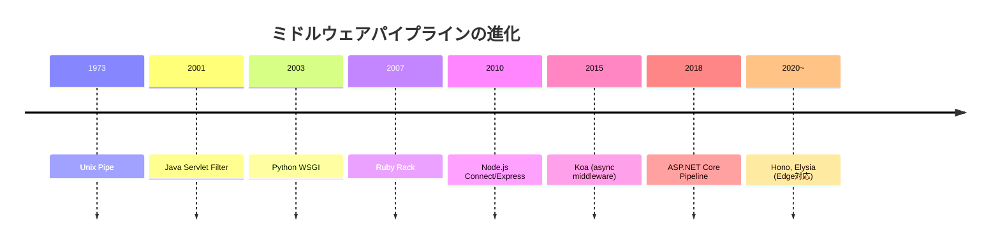
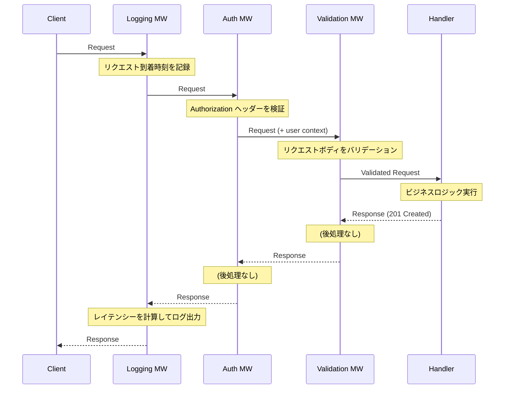
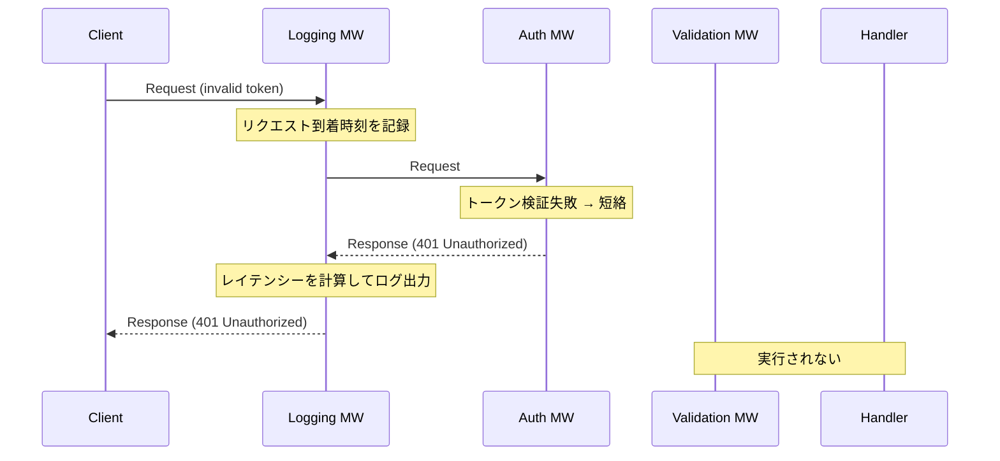
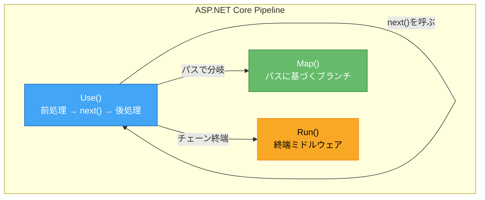
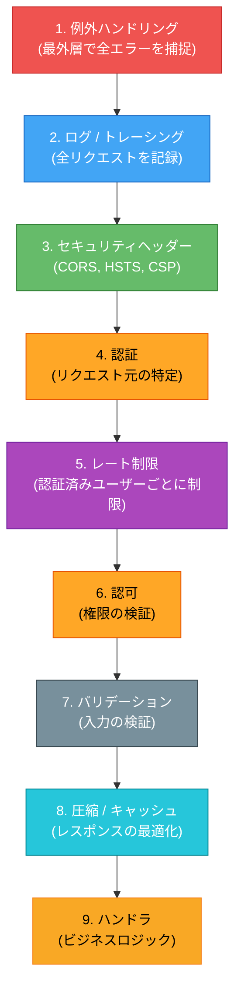
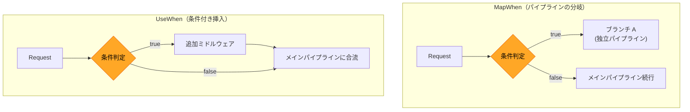
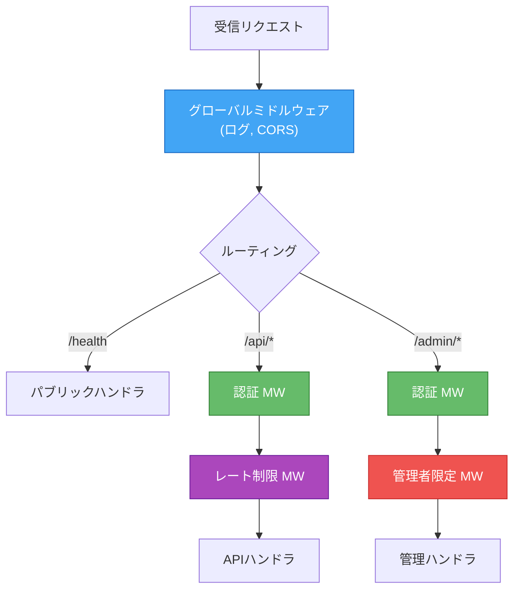
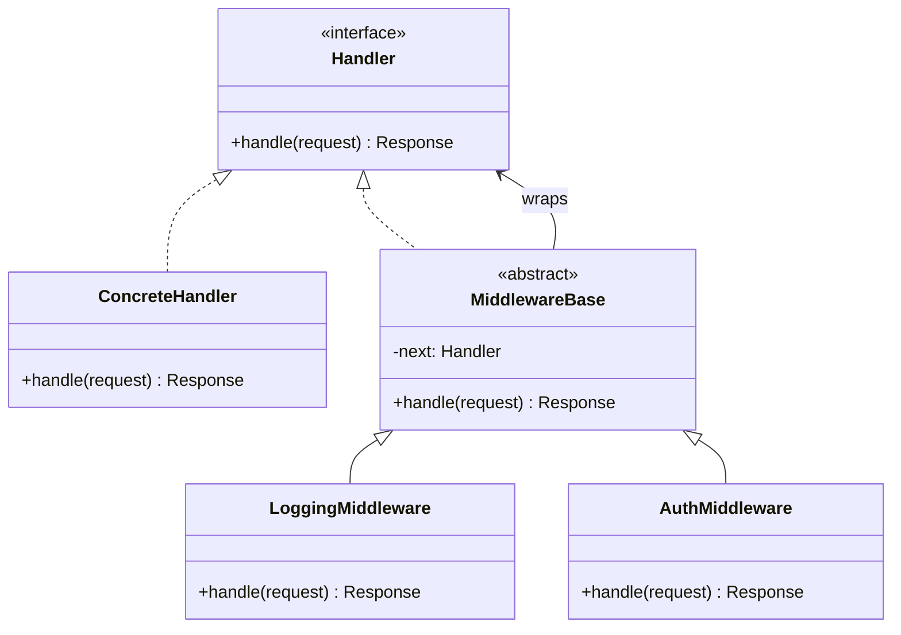
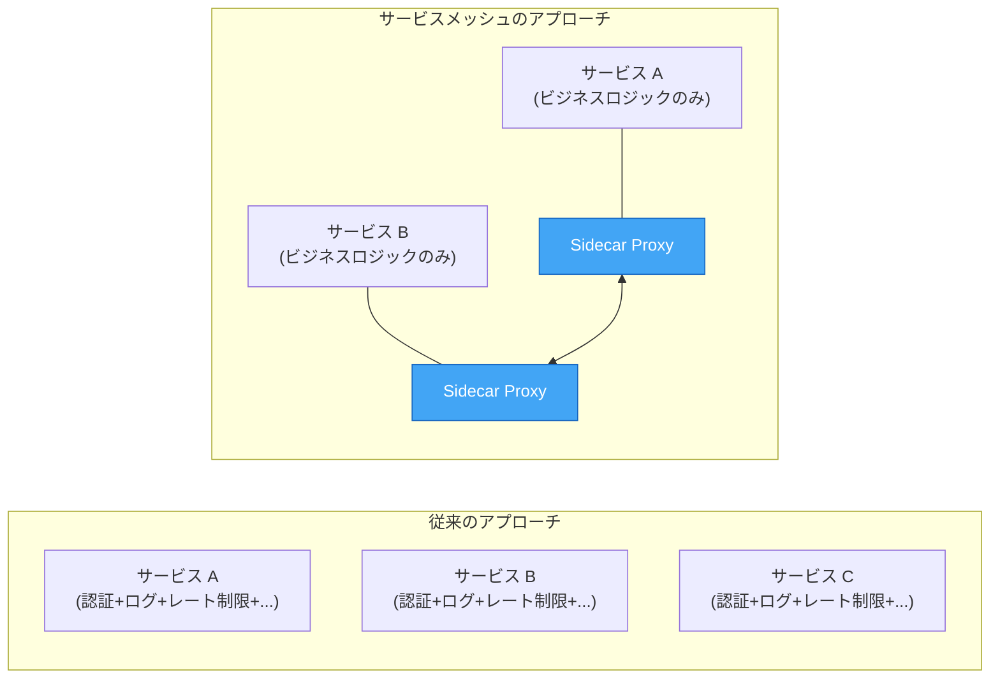
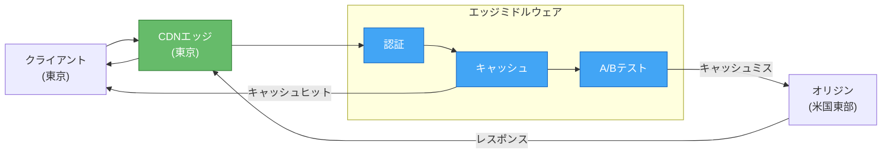

# ミドルウェアパイプライン設計

## 1. 背景と動機：横断的関心事の分離

### 1.1 Webアプリケーションにおける共通処理

Webアプリケーションを構築するとき、リクエストを受け取ってからレスポンスを返すまでの間に、ビジネスロジックとは直接関係のない「横断的関心事（Cross-Cutting Concerns）」が数多く存在する。認証・認可、ログ出力、リクエストのバリデーション、レート制限、CORS ヘッダーの付与、圧縮、エラーハンドリング、トレーシングなどがその代表例である。

これらの処理をすべてハンドラ（コントローラ）の中に書いてしまうと、以下の問題が発生する。

| 問題 | 説明 |
|---|---|
| **コードの重複** | 同じ認証チェックやログ出力がすべてのエンドポイントに散在する |
| **関心事の混在** | ビジネスロジックとインフラ的な処理が混ざり、コードの可読性が低下する |
| **変更への脆弱さ** | 認証方式の変更時に全エンドポイントを修正しなければならない |
| **テストの困難さ** | 横断的関心事を個別にテストしにくい |

```python
# Anti-pattern: all cross-cutting concerns mixed in handler
def create_order(request):
    # Authentication
    token = request.headers.get("Authorization")
    if not token:
        return Response(status=401)
    user = verify_token(token)
    if not user:
        return Response(status=401)

    # Logging
    logger.info(f"create_order called by user={user.id}")

    # Rate limiting
    if is_rate_limited(user.id):
        return Response(status=429)

    # Validation
    if not validate_order(request.body):
        return Response(status=400)

    # Actual business logic (finally!)
    order = OrderService.create(user, request.body)

    # More logging
    logger.info(f"order created: {order.id}")

    return Response(status=201, body=order.to_json())
```

この問題に対する解決策が**ミドルウェアパイプライン（Middleware Pipeline）** である。ミドルウェアパイプラインは、リクエスト処理の前後に共通処理を「層」として積み重ねることで、関心事の分離を実現するアーキテクチャパターンである。

### 1.2 パイプラインの歴史的背景

ミドルウェアパイプラインの概念は、Unix のパイプ（`|`）の思想に遡る。1973年に Ken Thompson が実装したパイプは「小さなプログラムを組み合わせて大きな仕事をする」という Unix 哲学の体現であった。

```bash
# Unix pipe: each program transforms data and passes to the next
cat access.log | grep "POST" | awk '{print $1}' | sort | uniq -c | sort -rn
```

この「データを変換しながらリレーする」という考え方が、Web フレームワークにおけるリクエスト/レスポンス処理に応用されたのがミドルウェアパイプラインである。

Web の世界では、CGI（Common Gateway Interface）の時代にはそもそもフレームワークの概念自体が希薄であり、共通処理は Web サーバー（Apache）の設定や CGI スクリプトの先頭に書くしかなかった。2000年代に入り、Java の Servlet Filter（2001年、Servlet 2.3 仕様）が登場し、「フィルタチェーン」という形でミドルウェアパイプラインの原型が確立された。

その後、Python の WSGI（Web Server Gateway Interface、PEP 3333、2003年）がミドルウェアの概念を仕様レベルで定義し、Ruby の Rack（2007年）、Node.js の Connect/Express（2010年）、Go の net/http（標準ライブラリのハンドラチェーン）へと受け継がれていった。



### 1.3 ミドルウェアの定義

ミドルウェアとは、リクエストとレスポンスの間に挿入される処理単位であり、以下の責務を持つ。

1. **リクエストの前処理**：リクエストを検査・変換してから次のミドルウェアに渡す
2. **リクエストの後処理**：次のミドルウェア（またはハンドラ）が返したレスポンスを検査・変換する
3. **短絡（Short-circuit）**：条件によって後続の処理をスキップし、即座にレスポンスを返す

この「前処理 → 委譲 → 後処理」というパターンは、デザインパターンにおける**Chain of Responsibility（責任の連鎖）** パターンと、**Decorator（デコレータ）** パターンの特徴を兼ね備えている。

## 2. アーキテクチャ：パイプラインの構造

### 2.1 基本モデル

ミドルウェアパイプラインの最も基本的なモデルは「タマネギモデル（Onion Model）」と呼ばれる。リクエストは外側の層から順に内側に向かって処理され、最も内側のハンドラでレスポンスが生成されると、今度は内側から外側に向かってレスポンスが処理される。


これをタマネギの断面図として表現すると、以下のようになる。

```
┌──────────────────────────────────────────────────────┐
│  Middleware 1 (Logging)                              │
│  ┌──────────────────────────────────────────────┐    │
│  │  Middleware 2 (Authentication)                │    │
│  │  ┌──────────────────────────────────────┐    │    │
│  │  │  Middleware 3 (Validation)            │    │    │
│  │  │  ┌──────────────────────────────┐    │    │    │
│  │  │  │  Handler (Business Logic)     │    │    │    │
│  │  │  └──────────────────────────────┘    │    │    │
│  │  └──────────────────────────────────────┘    │    │
│  └──────────────────────────────────────────────┘    │
└──────────────────────────────────────────────────────┘

Request  → → → → → → → → → →
                              ↓
Response ← ← ← ← ← ← ← ← ← ←
```

このモデルでは、各ミドルウェアが「入り」と「出」の両方のタイミングで処理を行える。たとえばログミドルウェアは、リクエストの受信時にタイムスタンプを記録し、レスポンスの返却時にレイテンシーを計算してログに出力する。

### 2.2 関数合成としてのミドルウェア

ミドルウェアパイプラインは、数学的には**関数合成（Function Composition）** として理解できる。各ミドルウェアを、次のミドルウェア（または最終ハンドラ）を引数に取り、新しいハンドラを返す高階関数と見なすのである。

```
Handler = Request → Response
Middleware = Handler → Handler
```

ミドルウェアが `m1`, `m2`, `m3` の3つあり、最終ハンドラが `h` であるとき、パイプラインは次のように合成される。

```
pipeline = m1(m2(m3(h)))
```

これは関数合成演算子 `∘` を使って次のようにも表現できる。

```
pipeline = (m1 ∘ m2 ∘ m3)(h)
```

この関数合成の視点は、ミドルウェアパイプラインの本質を理解する上で極めて重要である。各ミドルウェアは「ハンドラを受け取ってハンドラを返す」という共通のインターフェースを持つため、順序の入れ替え、追加、削除が容易である。

### 2.3 実行フローの詳細

ミドルウェアパイプラインの実行フローをより詳細に見てみる。



ここで注目すべきは、認証ミドルウェアがリクエストを検証した結果「認証失敗」と判断した場合、後続のミドルウェアやハンドラには処理が渡らず、即座にエラーレスポンスが返される（短絡）という点である。



## 3. 実装パターン

### 3.1 シンプルな関数合成パターン

最もシンプルなミドルウェアの実装は、関数合成を直接的にコードで表現するパターンである。

```python
from typing import Callable
from dataclasses import dataclass
from time import time

@dataclass
class Request:
    method: str
    path: str
    headers: dict
    body: str = ""

@dataclass
class Response:
    status: int
    headers: dict
    body: str = ""

# Type aliases
Handler = Callable[[Request], Response]
Middleware = Callable[[Handler], Handler]

def logging_middleware(next_handler: Handler) -> Handler:
    """Log request method, path, and response latency."""
    def handler(request: Request) -> Response:
        start = time()
        print(f"--> {request.method} {request.path}")
        response = next_handler(request)
        elapsed = (time() - start) * 1000
        print(f"<-- {response.status} ({elapsed:.1f}ms)")
        return response
    return handler

def auth_middleware(next_handler: Handler) -> Handler:
    """Verify the Authorization header; short-circuit on failure."""
    def handler(request: Request) -> Response:
        token = request.headers.get("Authorization", "")
        if not token.startswith("Bearer "):
            return Response(status=401, headers={}, body="Unauthorized")
        # Attach user info to request headers for downstream use
        request.headers["X-User-Id"] = "user-123"
        return next_handler(request)
    return handler

def compose(*middlewares: Middleware) -> Middleware:
    """Compose multiple middlewares into a single middleware."""
    def composed(handler: Handler) -> Handler:
        for mw in reversed(middlewares):
            handler = mw(handler)
        return handler
    return composed

# Application handler
def create_order(request: Request) -> Response:
    user_id = request.headers.get("X-User-Id", "unknown")
    return Response(
        status=201,
        headers={"Content-Type": "application/json"},
        body=f'{{"order_id": "ord-1", "user": "{user_id}"}}'
    )

# Build the pipeline
pipeline = compose(logging_middleware, auth_middleware)
app = pipeline(create_order)
```

この実装は非常にシンプルだが、ミドルウェアパイプラインの本質を正確に表現している。`compose` 関数がミドルウェアを逆順に適用することで、定義した順序どおりにリクエストが処理される。

### 3.2 next() コールバックパターン（Express スタイル）

Node.js の Express で広く普及したパターンでは、各ミドルウェアが `next` というコールバック関数を受け取り、次のミドルウェアへの制御の移譲を明示的に行う。

```javascript
// Express-style middleware
function loggingMiddleware(req, res, next) {
  const start = Date.now();
  console.log(`--> ${req.method} ${req.url}`);

  // Hook into response finish event for post-processing
  res.on("finish", () => {
    const elapsed = Date.now() - start;
    console.log(`<-- ${res.statusCode} (${elapsed}ms)`);
  });

  next(); // pass control to the next middleware
}

function authMiddleware(req, res, next) {
  const token = req.headers["authorization"];
  if (!token || !token.startsWith("Bearer ")) {
    res.status(401).json({ error: "Unauthorized" });
    return; // short-circuit: do NOT call next()
  }
  req.userId = "user-123"; // attach context
  next();
}

function rateLimitMiddleware(req, res, next) {
  if (isRateLimited(req.userId)) {
    res.status(429).json({ error: "Too Many Requests" });
    return;
  }
  next();
}

// Register middlewares in order
app.use(loggingMiddleware);
app.use(authMiddleware);
app.use(rateLimitMiddleware);

app.post("/orders", (req, res) => {
  // Only business logic here
  const order = createOrder(req.userId, req.body);
  res.status(201).json(order);
});
```

::: warning Express の next() の注意点
Express の `next()` は呼び出しても関数の実行が停止するわけではない。`next()` の後に書かれたコードも実行される。意図しない二重レスポンスを防ぐために、`return next()` と書くか、`next()` の後に処理を書かないように注意する必要がある。
:::

### 3.3 async/await パターン（Koa スタイル）

Koa は Express の後継として設計されたフレームワークで、`async/await` を活用した「真のタマネギモデル」を実現した。各ミドルウェアが `await next()` で次のミドルウェアの完了を待つことで、前処理と後処理を自然に記述できる。

```javascript
// Koa-style async middleware
const Koa = require("koa");
const app = new Koa();

// Middleware 1: Logging (outermost layer)
app.use(async (ctx, next) => {
  const start = Date.now();
  console.log(`--> ${ctx.method} ${ctx.url}`);

  await next(); // wait for all inner middlewares to complete

  // Post-processing: runs AFTER handler returns
  const elapsed = Date.now() - start;
  console.log(`<-- ${ctx.status} (${elapsed}ms)`);
});

// Middleware 2: Error handling
app.use(async (ctx, next) => {
  try {
    await next();
  } catch (err) {
    ctx.status = err.status || 500;
    ctx.body = { error: err.message };
    ctx.app.emit("error", err, ctx);
  }
});

// Middleware 3: Authentication
app.use(async (ctx, next) => {
  const token = ctx.headers["authorization"];
  if (!token || !token.startsWith("Bearer ")) {
    ctx.throw(401, "Unauthorized");
  }
  ctx.state.userId = "user-123";
  await next();
});

// Handler
app.use(async (ctx) => {
  ctx.status = 201;
  ctx.body = { orderId: "ord-1", user: ctx.state.userId };
});
```

Koa のパイプラインは `koa-compose` というライブラリで実現されており、そのコアロジックは驚くほどシンプルである。

```javascript
// Simplified version of koa-compose
function compose(middlewares) {
  return function (ctx) {
    let index = -1;

    function dispatch(i) {
      if (i <= index) {
        return Promise.reject(new Error("next() called multiple times"));
      }
      index = i;
      const fn = middlewares[i];
      if (!fn) return Promise.resolve();

      return Promise.resolve(fn(ctx, () => dispatch(i + 1)));
    }

    return dispatch(0);
  };
}
```

この実装のポイントは以下のとおりである。

- `dispatch(i)` が再帰的に呼び出されることで、ミドルウェアチェーンが構成される
- `next()` が `dispatch(i + 1)` に対応し、次のミドルウェアの実行をトリガーする
- `index` の追跡により、同一ミドルウェア内で `next()` が複数回呼ばれることを防止する

### 3.4 型安全なミドルウェア（Go スタイル）

Go の標準ライブラリ `net/http` では、ミドルウェアは `http.Handler` インターフェースを受け取り `http.Handler` を返す関数として表現される。型システムによりミドルウェアのインターフェースが保証される。

```go
package main

import (
	"log"
	"net/http"
	"time"
)

// Middleware is a function that wraps an http.Handler.
type Middleware func(http.Handler) http.Handler

// LoggingMiddleware records request latency and status.
func LoggingMiddleware(next http.Handler) http.Handler {
	return http.HandlerFunc(func(w http.ResponseWriter, r *http.Request) {
		start := time.Now()
		log.Printf("--> %s %s", r.Method, r.URL.Path)

		// Wrap ResponseWriter to capture status code
		ww := &statusWriter{ResponseWriter: w, status: http.StatusOK}
		next.ServeHTTP(ww, r)

		elapsed := time.Since(start)
		log.Printf("<-- %d (%v)", ww.status, elapsed)
	})
}

type statusWriter struct {
	http.ResponseWriter
	status int
}

func (w *statusWriter) WriteHeader(code int) {
	w.status = code
	w.ResponseWriter.WriteHeader(code)
}

// AuthMiddleware verifies the Authorization header.
func AuthMiddleware(next http.Handler) http.Handler {
	return http.HandlerFunc(func(w http.ResponseWriter, r *http.Request) {
		token := r.Header.Get("Authorization")
		if token == "" {
			http.Error(w, "Unauthorized", http.StatusUnauthorized)
			return // short-circuit
		}
		// Pass user context downstream
		r.Header.Set("X-User-Id", "user-123")
		next.ServeHTTP(w, r)
	})
}

// Chain composes multiple middlewares.
func Chain(middlewares ...Middleware) Middleware {
	return func(final http.Handler) http.Handler {
		for i := len(middlewares) - 1; i >= 0; i-- {
			final = middlewares[i](final)
		}
		return final
	}
}

func main() {
	handler := http.HandlerFunc(func(w http.ResponseWriter, r *http.Request) {
		w.WriteHeader(http.StatusCreated)
		w.Write([]byte(`{"order_id": "ord-1"}`))
	})

	chain := Chain(LoggingMiddleware, AuthMiddleware)
	http.Handle("/orders", chain(handler))
	log.Fatal(http.ListenAndServe(":8080", nil))
}
```

Go のアプローチは、インターフェースが明確で型安全であるという利点がある。`http.Handler` という単一のインターフェースを中心にすべてが構成されるため、ミドルウェア同士の組み合わせが保証される。

### 3.5 ASP.NET Core のパイプラインモデル

ASP.NET Core は、ミドルウェアパイプラインを設計の中心に据えた、最も体系的なフレームワークの一つである。`RequestDelegate` という型がパイプラインの基本単位であり、`IApplicationBuilder` がパイプラインの構築を担う。

```csharp
// ASP.NET Core middleware pipeline configuration
var builder = WebApplication.CreateBuilder(args);
var app = builder.Build();

// Middleware registration order matters!
app.UseExceptionHandler("/error");  // outermost: catches all exceptions
app.UseHttpsRedirection();
app.UseStaticFiles();
app.UseRouting();
app.UseAuthentication();            // must come before Authorization
app.UseAuthorization();
app.UseCors("AllowAll");
app.UseRateLimiter();

app.MapPost("/orders", async (HttpContext ctx) => {
    // Business logic only
    ctx.Response.StatusCode = 201;
    await ctx.Response.WriteAsJsonAsync(new { orderId = "ord-1" });
});

app.Run();
```

ASP.NET Core では、`Use`、`Map`、`Run` という3種類のメソッドでパイプラインを構成する。



- **`Use`**：前処理と後処理の両方を行うミドルウェアを追加する。`next()` を呼ぶことで後続のミドルウェアに処理を委譲する
- **`Map`**：リクエストパスに基づいてパイプラインを分岐させる。特定のパスに対してのみ適用されるミドルウェアチェーンを構成できる
- **`Run`**：パイプラインの終端となるミドルウェアを追加する。`next()` パラメータを持たず、これ以降のミドルウェアは実行されない

## 4. 設計上の重要な考慮事項

### 4.1 ミドルウェアの順序

ミドルウェアの登録順序はパイプラインの動作に直接的な影響を与える。順序を誤ると、セキュリティホールやパフォーマンス問題が発生する可能性がある。

::: danger ミドルウェアの順序は安全性に直結する
認証ミドルウェアをレート制限ミドルウェアの後に配置すると、未認証のリクエストがレート制限のリソースを消費してしまう。逆に、ログミドルウェアを認証の後に配置すると、認証失敗のリクエストがログに残らない。
:::

一般的な推奨順序は以下のとおりである。



### 4.2 コンテキストの受け渡し

ミドルウェアパイプラインでは、あるミドルウェアで取得・生成した情報を後続のミドルウェアやハンドラに渡す必要がある。たとえば認証ミドルウェアで特定されたユーザー情報を、ハンドラが利用するケースである。

これを実現する方法はフレームワークによって異なる。

| フレームワーク | コンテキスト渡しの方法 |
|---|---|
| Express | `req` オブジェクトにプロパティを追加（`req.user = ...`） |
| Koa | `ctx.state` オブジェクトを使用 |
| Go (net/http) | `context.WithValue` でリクエストコンテキストに埋め込む |
| ASP.NET Core | `HttpContext.Items` ディクショナリまたは DI コンテナ |
| Hono | `c.set()` / `c.get()` メソッド |

Go の `context.Context` を使った例を示す。

```go
type contextKey string

const userIDKey contextKey = "userID"

// AuthMiddleware stores user info in request context.
func AuthMiddleware(next http.Handler) http.Handler {
	return http.HandlerFunc(func(w http.ResponseWriter, r *http.Request) {
		token := r.Header.Get("Authorization")
		userID, err := validateToken(token)
		if err != nil {
			http.Error(w, "Unauthorized", 401)
			return
		}
		// Store in context (immutable, type-safe)
		ctx := context.WithValue(r.Context(), userIDKey, userID)
		next.ServeHTTP(w, r.WithContext(ctx))
	})
}

// Handler retrieves user info from context.
func createOrderHandler(w http.ResponseWriter, r *http.Request) {
	userID, ok := r.Context().Value(userIDKey).(string)
	if !ok {
		http.Error(w, "Internal Error", 500)
		return
	}
	// Use userID in business logic
	_ = userID
}
```

::: tip コンテキスト受け渡しのベストプラクティス
- **型安全なキーを使う**：Go では `string` ではなく独自型をキーにすることで衝突を防ぐ
- **コンテキストに入れすぎない**：リクエストスコープに限定された最小限の情報だけを格納する
- **不変性を保つ**：コンテキストオブジェクトは不変にし、変更が必要な場合は新しいコンテキストを作成する
:::

### 4.3 エラーハンドリング

ミドルウェアパイプラインにおけるエラーハンドリングは、パイプラインの最外層に配置される専用のミドルウェアで行うのが一般的である。これにより、パイプラインのどの段階で発生したエラーも統一的に処理できる。

```javascript
// Koa: centralized error handling as outermost middleware
app.use(async (ctx, next) => {
  try {
    await next();
  } catch (err) {
    // Distinguish between operational and programmer errors
    if (err.isOperational) {
      ctx.status = err.statusCode;
      ctx.body = {
        error: err.message,
        code: err.errorCode,
      };
    } else {
      // Programmer error: log and return generic 500
      console.error("Unhandled error:", err);
      ctx.status = 500;
      ctx.body = { error: "Internal Server Error" };
    }
  }
});
```

Express では、エラーハンドリングミドルウェアは引数が4つ（`err, req, res, next`）のシグネチャで定義され、通常のミドルウェアとは区別される。

```javascript
// Express: error-handling middleware (4 arguments)
app.use((err, req, res, next) => {
  console.error(err.stack);
  res.status(err.status || 500).json({
    error: err.message || "Internal Server Error",
  });
});
```

### 4.4 条件付きミドルウェア

すべてのリクエストに対してすべてのミドルウェアを適用するのではなく、特定の条件（パス、メソッド、ヘッダーなど）に基づいてミドルウェアを選択的に適用する必要がある場合がある。

```javascript
// Apply middleware only to specific paths
app.use("/api", authMiddleware); // only for /api/* routes
app.use("/admin", adminAuthMiddleware); // only for /admin/* routes

// Conditional middleware based on custom logic
function conditionalMiddleware(conditionFn, middleware) {
  return (req, res, next) => {
    if (conditionFn(req)) {
      middleware(req, res, next);
    } else {
      next(); // skip this middleware
    }
  };
}

// Only apply rate limiting to POST requests
app.use(
  conditionalMiddleware(
    (req) => req.method === "POST",
    rateLimitMiddleware
  )
);
```

ASP.NET Core では `MapWhen` と `UseWhen` を使って条件分岐を表現できる。

```csharp
// Branch the pipeline based on request path
app.MapWhen(
    context => context.Request.Path.StartsWithSegments("/api"),
    apiApp => {
        apiApp.UseAuthentication();
        apiApp.UseAuthorization();
    }
);

// Conditionally add middleware without branching
app.UseWhen(
    context => context.Request.Headers.ContainsKey("X-Custom-Header"),
    appBuilder => appBuilder.UseMiddleware<CustomMiddleware>()
);
```

`MapWhen` はパイプラインを分岐させ、条件に合致したリクエストは分岐先のパイプラインのみを通過する。一方 `UseWhen` は、条件に合致したリクエストに追加のミドルウェアを挿入した後、元のパイプラインに戻る。



## 5. フレームワーク比較

### 5.1 主要フレームワークのミドルウェアモデル

各 Web フレームワークがどのようにミドルウェアパイプラインを実装しているかを比較する。

| フレームワーク | 言語 | モデル | 非同期 | 型安全 | 特徴 |
|---|---|---|---|---|---|
| Express | JavaScript | next() callback | 部分的 | なし | 最も広く普及、エコシステムが豊富 |
| Koa | JavaScript | async/await | 完全 | なし | 真のタマネギモデル |
| Hono | TypeScript | async/await | 完全 | あり | Edge 対応、軽量 |
| Gin | Go | HandlerChain | Goroutine | あり | 高速、`c.Next()` で制御 |
| Actix Web | Rust | Transform trait | async | あり | コンパイル時安全性 |
| ASP.NET Core | C# | RequestDelegate | async | あり | 最も体系的なパイプライン設計 |
| Rack | Ruby | call(env) | なし | なし | WSGI のRuby版、仕様が明確 |
| WSGI/ASGI | Python | callable | ASGI のみ | なし | 仕様レベルでミドルウェアを定義 |

### 5.2 Hono の型安全なミドルウェア

近年のフレームワークの中でも Hono は、TypeScript の型システムを活用して、ミドルウェアが設定したコンテキスト変数を型安全に利用できる設計が特徴的である。

```typescript
import { Hono } from "hono";
import { createMiddleware } from "hono/factory";

// Typed middleware: declares what it adds to context
const authMiddleware = createMiddleware<{
  Variables: {
    userId: string;
    role: "admin" | "user";
  };
}>(async (c, next) => {
  const token = c.req.header("Authorization");
  if (!token) {
    return c.json({ error: "Unauthorized" }, 401);
  }
  // Set typed variables
  c.set("userId", "user-123");
  c.set("role", "admin");
  await next();
});

const app = new Hono();

app.use("/api/*", authMiddleware);

app.get("/api/orders", (c) => {
  // TypeScript knows userId is string, role is "admin" | "user"
  const userId = c.get("userId"); // type: string
  const role = c.get("role"); // type: "admin" | "user"
  return c.json({ userId, role });
});
```

この型安全なアプローチにより、ミドルウェアが設定したはずのコンテキスト変数が実行時に `undefined` になるというバグをコンパイル時に検出できる。

### 5.3 ASGI と Python の非同期ミドルウェア

Python の ASGI（Asynchronous Server Gateway Interface）は、WSGI の非同期版として 2016 年に提案され、Django 3.0（2019年）以降で公式サポートされた。ASGI は WebSocket やHTTP/2のサーバープッシュなど、長寿命の接続を扱えるように設計されている。

```python
# Starlette-style ASGI middleware
from starlette.middleware.base import BaseHTTPMiddleware
from starlette.requests import Request
from starlette.responses import Response
import time

class TimingMiddleware(BaseHTTPMiddleware):
    """Measure and log request processing time."""
    async def dispatch(self, request: Request, call_next):
        start = time.monotonic()
        response = await call_next(request)
        elapsed = (time.monotonic() - start) * 1000
        response.headers["X-Process-Time"] = f"{elapsed:.1f}ms"
        return response

# Pure ASGI middleware (lower level, more control)
class PureASGIAuthMiddleware:
    """ASGI middleware implemented as a callable class."""
    def __init__(self, app):
        self.app = app

    async def __call__(self, scope, receive, send):
        if scope["type"] == "http":
            headers = dict(scope.get("headers", []))
            auth = headers.get(b"authorization", b"").decode()
            if not auth.startswith("Bearer "):
                await send({
                    "type": "http.response.start",
                    "status": 401,
                    "headers": [(b"content-type", b"application/json")],
                })
                await send({
                    "type": "http.response.body",
                    "body": b'{"error": "Unauthorized"}',
                })
                return
        await self.app(scope, receive, send)
```

ASGI ミドルウェアは `scope`（接続メタデータ）、`receive`（受信チャネル）、`send`（送信チャネル）という3つのインターフェースで動作する。この低レベルな設計は柔軟だが、HTTP以外のプロトコル（WebSocket など）にも同じインターフェースで対応できるという利点がある。

## 6. 実践的なミドルウェアの実装例

### 6.1 リクエスト ID ミドルウェア

分散システムにおけるリクエストトレーシングの基盤となるミドルウェアである。受信リクエストに一意の ID を割り当て、レスポンスヘッダーにも含めることで、ログの追跡を容易にする。

```go
import (
	"context"
	"net/http"
	"github.com/google/uuid"
)

const RequestIDHeader = "X-Request-Id"

func RequestIDMiddleware(next http.Handler) http.Handler {
	return http.HandlerFunc(func(w http.ResponseWriter, r *http.Request) {
		// Reuse existing request ID or generate a new one
		requestID := r.Header.Get(RequestIDHeader)
		if requestID == "" {
			requestID = uuid.New().String()
		}

		// Set in response header
		w.Header().Set(RequestIDHeader, requestID)

		// Propagate via context
		ctx := context.WithValue(r.Context(), requestIDKey, requestID)
		next.ServeHTTP(w, r.WithContext(ctx))
	})
}
```

### 6.2 レート制限ミドルウェア

Token Bucket アルゴリズムに基づくレート制限ミドルウェアの実装例を示す。

```go
import (
	"net/http"
	"sync"
	"time"
)

type RateLimiter struct {
	mu       sync.Mutex
	tokens   map[string]float64
	lastTime map[string]time.Time
	rate     float64 // tokens per second
	burst    float64 // max tokens
}

func NewRateLimiter(rate, burst float64) *RateLimiter {
	return &RateLimiter{
		tokens:   make(map[string]float64),
		lastTime: make(map[string]time.Time),
		rate:     rate,
		burst:    burst,
	}
}

func (rl *RateLimiter) Allow(key string) bool {
	rl.mu.Lock()
	defer rl.mu.Unlock()

	now := time.Now()
	last, exists := rl.lastTime[key]
	if !exists {
		rl.tokens[key] = rl.burst - 1
		rl.lastTime[key] = now
		return true
	}

	// Refill tokens based on elapsed time
	elapsed := now.Sub(last).Seconds()
	rl.tokens[key] = min(rl.burst, rl.tokens[key]+elapsed*rl.rate)
	rl.lastTime[key] = now

	if rl.tokens[key] >= 1 {
		rl.tokens[key]--
		return true
	}
	return false
}

func RateLimitMiddleware(limiter *RateLimiter) func(http.Handler) http.Handler {
	return func(next http.Handler) http.Handler {
		return http.HandlerFunc(func(w http.ResponseWriter, r *http.Request) {
			key := r.RemoteAddr // or extract user ID from context
			if !limiter.Allow(key) {
				http.Error(w, "Too Many Requests", http.StatusTooManyRequests)
				return
			}
			next.ServeHTTP(w, r)
		})
	}
}
```

### 6.3 レスポンス圧縮ミドルウェア

レスポンスボディを gzip で圧縮するミドルウェアの実装例を示す。ResponseWriter をラップすることで、ハンドラ側の変更を一切必要とせずに圧縮を適用できる。

```go
import (
	"compress/gzip"
	"net/http"
	"strings"
)

type gzipResponseWriter struct {
	http.ResponseWriter
	writer *gzip.Writer
}

func (w *gzipResponseWriter) Write(b []byte) (int, error) {
	return w.writer.Write(b)
}

func GzipMiddleware(next http.Handler) http.Handler {
	return http.HandlerFunc(func(w http.ResponseWriter, r *http.Request) {
		// Check if client accepts gzip
		if !strings.Contains(r.Header.Get("Accept-Encoding"), "gzip") {
			next.ServeHTTP(w, r)
			return
		}

		gz := gzip.NewWriter(w)
		defer gz.Close()

		w.Header().Set("Content-Encoding", "gzip")
		w.Header().Del("Content-Length") // length changes after compression

		gzw := &gzipResponseWriter{ResponseWriter: w, writer: gz}
		next.ServeHTTP(gzw, r)
	})
}
```

## 7. パイプラインのテスト

### 7.1 ミドルウェアの単体テスト

ミドルウェアは、入力（リクエスト）と出力（レスポンス）が明確であるため、単体テストが書きやすいという利点がある。

```go
func TestAuthMiddleware_ValidToken(t *testing.T) {
	// Arrange: inner handler that records whether it was called
	called := false
	inner := http.HandlerFunc(func(w http.ResponseWriter, r *http.Request) {
		called = true
		w.WriteHeader(http.StatusOK)
	})

	handler := AuthMiddleware(inner)

	req := httptest.NewRequest("GET", "/", nil)
	req.Header.Set("Authorization", "Bearer valid-token")
	rec := httptest.NewRecorder()

	// Act
	handler.ServeHTTP(rec, req)

	// Assert
	if !called {
		t.Error("expected inner handler to be called")
	}
	if rec.Code != http.StatusOK {
		t.Errorf("expected 200, got %d", rec.Code)
	}
}

func TestAuthMiddleware_MissingToken(t *testing.T) {
	called := false
	inner := http.HandlerFunc(func(w http.ResponseWriter, r *http.Request) {
		called = true
	})

	handler := AuthMiddleware(inner)

	req := httptest.NewRequest("GET", "/", nil)
	// No Authorization header
	rec := httptest.NewRecorder()

	handler.ServeHTTP(rec, req)

	if called {
		t.Error("expected inner handler NOT to be called (short-circuit)")
	}
	if rec.Code != http.StatusUnauthorized {
		t.Errorf("expected 401, got %d", rec.Code)
	}
}
```

### 7.2 パイプライン全体の統合テスト

パイプライン全体の動作を検証するために、すべてのミドルウェアを組み合わせた統合テストも重要である。

```go
func TestPipeline_Integration(t *testing.T) {
	limiter := NewRateLimiter(10, 10)

	handler := http.HandlerFunc(func(w http.ResponseWriter, r *http.Request) {
		w.WriteHeader(http.StatusCreated)
		w.Write([]byte(`{"ok": true}`))
	})

	// Build the full pipeline
	pipeline := Chain(
		LoggingMiddleware,
		RequestIDMiddleware,
		AuthMiddleware,
		RateLimitMiddleware(limiter),
	)(handler)

	req := httptest.NewRequest("POST", "/orders", nil)
	req.Header.Set("Authorization", "Bearer valid-token")
	rec := httptest.NewRecorder()

	pipeline.ServeHTTP(rec, req)

	// Verify response
	if rec.Code != http.StatusCreated {
		t.Errorf("expected 201, got %d", rec.Code)
	}

	// Verify request ID was set
	if rec.Header().Get("X-Request-Id") == "" {
		t.Error("expected X-Request-Id header to be set")
	}
}
```

### 7.3 ミドルウェア順序のテスト

ミドルウェアが正しい順序で実行されることを検証するテストも有用である。

```go
func TestMiddlewareOrdering(t *testing.T) {
	var executionOrder []string

	makeTracer := func(name string) Middleware {
		return func(next http.Handler) http.Handler {
			return http.HandlerFunc(func(w http.ResponseWriter, r *http.Request) {
				executionOrder = append(executionOrder, name+":before")
				next.ServeHTTP(w, r)
				executionOrder = append(executionOrder, name+":after")
			})
		}
	}

	handler := http.HandlerFunc(func(w http.ResponseWriter, r *http.Request) {
		executionOrder = append(executionOrder, "handler")
		w.WriteHeader(http.StatusOK)
	})

	pipeline := Chain(
		makeTracer("logging"),
		makeTracer("auth"),
		makeTracer("validation"),
	)(handler)

	req := httptest.NewRequest("GET", "/", nil)
	rec := httptest.NewRecorder()
	pipeline.ServeHTTP(rec, req)

	expected := []string{
		"logging:before",
		"auth:before",
		"validation:before",
		"handler",
		"validation:after",
		"auth:after",
		"logging:after",
	}

	for i, v := range expected {
		if executionOrder[i] != v {
			t.Errorf("position %d: expected %q, got %q", i, v, executionOrder[i])
		}
	}
}
```

## 8. パフォーマンスとトレードオフ

### 8.1 パイプラインのオーバーヘッド

ミドルウェアパイプラインには、各ミドルウェアの関数呼び出しに伴うオーバーヘッドが存在する。10個のミドルウェアを持つパイプラインでは、1リクエストあたり少なくとも20回（前処理10回＋後処理10回）の関数呼び出しが発生する。

しかし、実際のWebアプリケーションにおいては、この関数呼び出しのオーバーヘッドはデータベースクエリやネットワークI/Oの待ち時間と比較して無視できるほど小さい。

```
典型的なリクエスト処理時間の内訳（概算）:

ミドルウェアパイプラインのオーバーヘッド: ~0.01ms
リクエストパース:                         ~0.1ms
認証トークンの検証:                       ~0.5ms
データベースクエリ:                       ~5-50ms
レスポンスのシリアライゼーション:           ~0.1ms
ネットワーク転送:                         ~1-100ms
───────────────────────────────────────────────
合計:                                   ~7-151ms
```

パイプラインのオーバーヘッドは全体の 0.01% 以下であり、最適化の対象としての優先度は極めて低い。

### 8.2 メモリアロケーション

ミドルウェアがリクエストごとにオブジェクトを生成する場合（たとえば gzip.Writer のインスタンス化）、GC の負荷が増大する可能性がある。高スループットが求められるシステムでは、`sync.Pool` を使ったオブジェクトプーリングが有効である。

```go
var gzipWriterPool = sync.Pool{
	New: func() interface{} {
		return gzip.NewWriter(nil)
	},
}

func GzipMiddlewarePooled(next http.Handler) http.Handler {
	return http.HandlerFunc(func(w http.ResponseWriter, r *http.Request) {
		if !strings.Contains(r.Header.Get("Accept-Encoding"), "gzip") {
			next.ServeHTTP(w, r)
			return
		}

		gz := gzipWriterPool.Get().(*gzip.Writer)
		gz.Reset(w)
		defer func() {
			gz.Close()
			gzipWriterPool.Put(gz)
		}()

		w.Header().Set("Content-Encoding", "gzip")
		w.Header().Del("Content-Length")

		gzw := &gzipResponseWriter{ResponseWriter: w, writer: gz}
		next.ServeHTTP(gzw, r)
	})
}
```

### 8.3 ミドルウェアの粒度に関するトレードオフ

ミドルウェアの粒度をどの程度細かくするかは、設計上の重要な判断である。

| 粒度 | 利点 | 欠点 |
|---|---|---|
| **細粒度**（認証、認可、ログを別々のミドルウェアに） | 再利用性が高い、単体テストが容易 | パイプラインが長くなる、コンテキスト受け渡しが増える |
| **粗粒度**（セキュリティ関連をひとまとめに） | パイプラインがシンプル、コンテキスト共有が容易 | 再利用性が低下、テストの粒度が粗くなる |

一般的には、**単一責任原則（Single Responsibility Principle）** に従い、1つのミドルウェアが1つの関心事のみを担当するように設計するのがベストプラクティスである。ただし、認証と認可のように密接に関連する処理は、1つのミドルウェアにまとめた方が自然な場合もある。

## 9. 発展的なパターン

### 9.1 ルートレベルのミドルウェア

グローバルに適用されるミドルウェアだけでなく、特定のルートグループにのみ適用されるミドルウェアを定義するパターンは、多くのフレームワークでサポートされている。

```javascript
// Hono: route-group middleware
const app = new Hono();

// Public routes: no auth required
app.get("/health", (c) => c.json({ status: "ok" }));

// API routes: auth required
const api = new Hono();
api.use("*", authMiddleware);
api.use("*", rateLimitMiddleware);
api.get("/orders", listOrders);
api.post("/orders", createOrder);

// Admin routes: additional admin auth
const admin = new Hono();
admin.use("*", authMiddleware);
admin.use("*", adminOnlyMiddleware);
admin.get("/users", listUsers);
admin.delete("/users/:id", deleteUser);

app.route("/api", api);
app.route("/admin", admin);
```



### 9.2 依存性注入とミドルウェア

ASP.NET Core では、ミドルウェアが DI（Dependency Injection）コンテナからサービスを取得できる。これにより、ミドルウェアとアプリケーションサービスの疎結合が実現される。

```csharp
public class AuditMiddleware : IMiddleware
{
    private readonly IAuditService _auditService;
    private readonly ILogger<AuditMiddleware> _logger;

    // Dependencies injected via DI container
    public AuditMiddleware(
        IAuditService auditService,
        ILogger<AuditMiddleware> logger)
    {
        _auditService = auditService;
        _logger = logger;
    }

    public async Task InvokeAsync(HttpContext context, RequestDelegate next)
    {
        var startTime = DateTime.UtcNow;
        await next(context);
        var elapsed = DateTime.UtcNow - startTime;

        await _auditService.LogAsync(new AuditEntry
        {
            Path = context.Request.Path,
            Method = context.Request.Method,
            StatusCode = context.Response.StatusCode,
            Duration = elapsed,
            UserId = context.User?.Identity?.Name
        });
    }
}

// Registration
builder.Services.AddScoped<AuditMiddleware>();
builder.Services.AddScoped<IAuditService, AuditService>();

app.UseMiddleware<AuditMiddleware>();
```

### 9.3 ミドルウェアとデコレータパターンの関係

ミドルウェアパイプラインは、GoF デザインパターンにおけるデコレータパターンの一種と見なすことができる。デコレータパターンは「オブジェクトに対して動的に責務を追加する」パターンであり、ミドルウェアは「ハンドラに対して動的に前後処理を追加する」パターンである。



Chain of Responsibility パターンとの違いは、ミドルウェアパイプラインでは**すべてのミドルウェアがリクエストを処理する機会を持つ**（短絡しない限り）のに対し、典型的な Chain of Responsibility では最初に処理可能なハンドラがリクエストを処理して終了するという点である。

## 10. 実世界の採用と課題

### 10.1 大規模システムにおけるミドルウェアの課題

ミドルウェアパイプラインは強力なパターンだが、大規模システムでは以下の課題が発生することがある。

**ミドルウェアの爆発的増加**

マイクロサービスアーキテクチャでは、各サービスが独自のミドルウェアスタックを持つ。サービス数が増えると、ミドルウェアの管理・更新が困難になる。この問題に対して、サービスメッシュ（Istio, Linkerd）は、ミドルウェアの一部（認証、レート制限、トレーシングなど）をサイドカープロキシに委譲することで解決を図っている。



**暗黙的な依存関係**

ミドルウェア間の依存関係が暗黙的になりやすい。たとえば、認可ミドルウェアは認証ミドルウェアがコンテキストにユーザー情報を設定していることを前提としているが、この依存関係はコード上で明示されない。順序を変更するとランタイムエラーが発生する。

> [!CAUTION]
> ミドルウェアの順序に関する暗黙的な依存関係は、リファクタリング時のバグの主要な原因となる。依存関係が存在する場合は、コメントやドキュメントで明示的に記録すること。

**デバッグの困難さ**

リクエストが多数のミドルウェアを通過するため、問題が発生した場合にどのミドルウェアが原因かを特定しにくい。分散トレーシング（OpenTelemetry）を導入し、各ミドルウェアの処理時間をスパンとして記録することが有効である。

### 10.2 Edge Computing とミドルウェア

Cloudflare Workers や AWS Lambda@Edge の登場により、ミドルウェアの実行場所がオリジンサーバーから CDN エッジノードに移動する傾向がある。認証、キャッシュ、A/B テスト、地理ベースのルーティングなどのミドルウェアをエッジで実行することで、レイテンシーの大幅な削減が可能になる。



Hono フレームワークは、Cloudflare Workers、Deno Deploy、Bun などの Edge Runtime をターゲットとしたフレームワークであり、軽量なミドルウェアパイプラインを提供している。従来のサーバーサイドフレームワークのミドルウェアがプロセス内で完結するのに対し、Edge ミドルウェアはリクエストのたびにコールドスタートされる可能性があるため、初期化コストの最小化が重要である。

## 11. まとめ

ミドルウェアパイプラインは、Web アプリケーションにおける横断的関心事を分離し、再利用可能な処理層として構造化するためのアーキテクチャパターンである。

本記事で解説した主要なポイントを整理する。

1. **本質**：ミドルウェアパイプラインは「ハンドラを受け取ってハンドラを返す高階関数の合成」であり、タマネギモデルとして視覚化される
2. **実装パターン**：関数合成、next() コールバック、async/await の3つの主要な実装パターンがあり、フレームワークによってアプローチが異なる
3. **設計の要点**：ミドルウェアの順序、コンテキストの受け渡し、エラーハンドリング、条件付き適用が設計上の重要な考慮事項である
4. **テスト容易性**：各ミドルウェアは入出力が明確であるため、単体テストと統合テストの両方が書きやすい
5. **パフォーマンス**：パイプラインのオーバーヘッドは実用上無視できるレベルであり、ボトルネックは通常 I/O にある
6. **進化**：サービスメッシュによるミドルウェアの外部化、Edge Computing によるミドルウェアの地理的分散が進んでいる

ミドルウェアパイプラインが解決する根本的な問題 -- 横断的関心事の分離とリクエスト処理の構造化 -- は、Web アプリケーション開発において普遍的な課題であり、この設計パターンの重要性は今後も変わらないだろう。フレームワークやランタイムが変わっても、「小さな処理単位を組み合わせて大きな処理を構成する」という Unix パイプの精神は、ミドルウェアパイプラインの中に脈々と受け継がれている。
