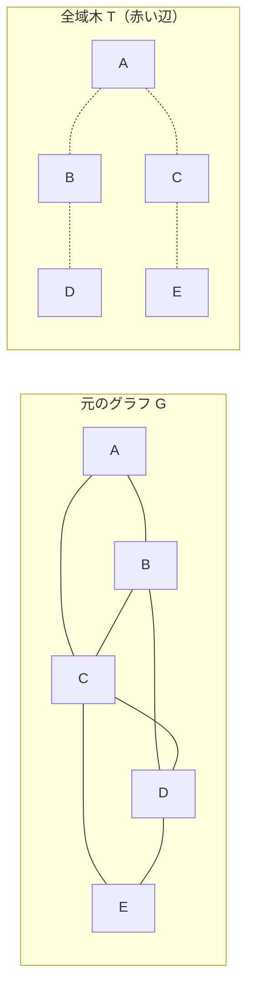
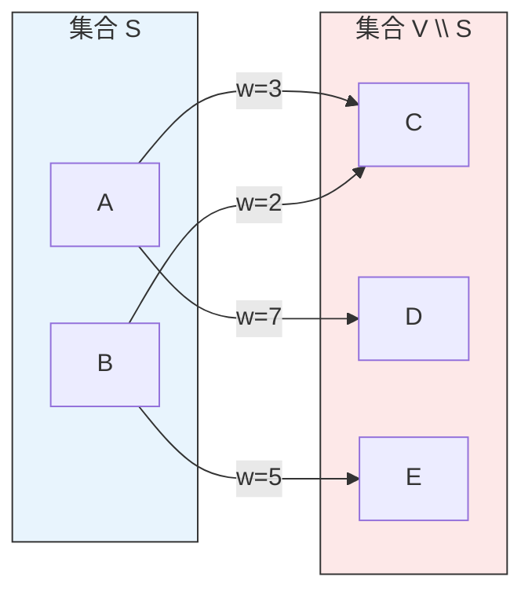
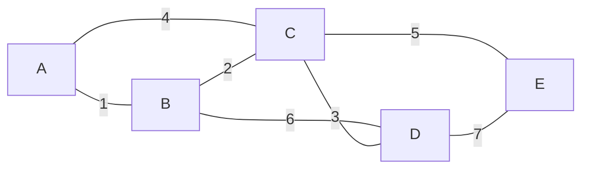
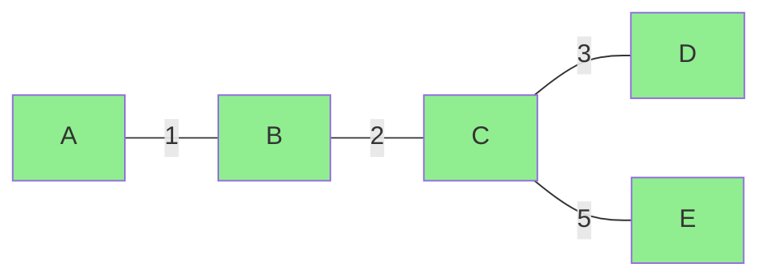
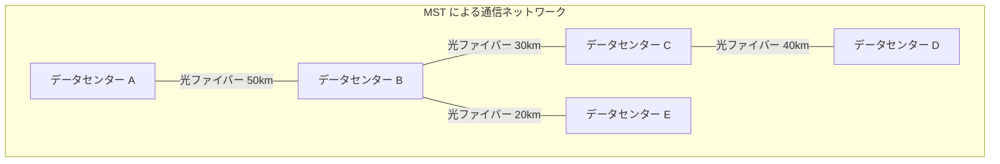
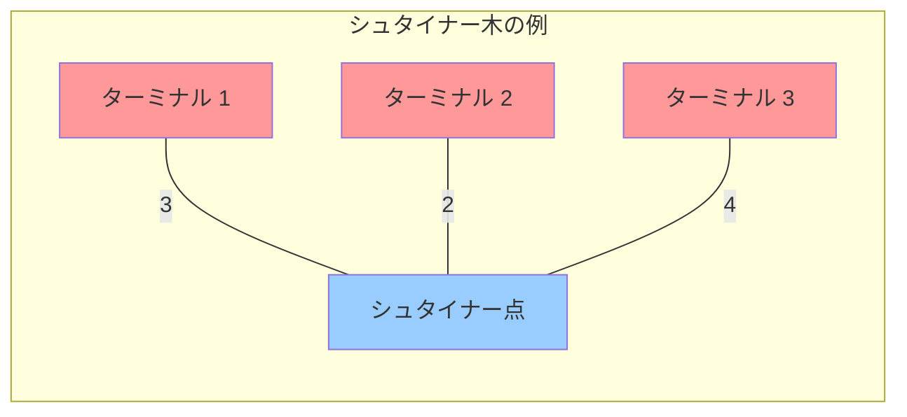

# 最小全域木 — Kruskal, Prim, Borůvka のアルゴリズムと理論的基盤

## 1. 全域木の定義と基本概念

### 1.1 グラフの基礎

最小全域木（Minimum Spanning Tree, MST）を理解するために、まずグラフ理論の基本的な概念を整理する。

**無向グラフ** $G = (V, E)$ は、頂点集合 $V$ と辺集合 $E \subseteq \binom{V}{2}$ からなる。各辺 $e = \{u, v\}$ は2つの頂点 $u, v \in V$ を結ぶ。**重み付きグラフ**とは、各辺 $e$ に実数値の重み $w(e)$ が割り当てられたグラフである。

グラフ $G$ が**連結**（connected）であるとは、任意の2頂点 $u, v \in V$ の間にパスが存在することをいう。**閉路**（cycle）とは、始点と終点が同じである長さ2以上のパスで、同じ辺を2度通らないものをいう。**木**（tree）とは、連結かつ閉路を含まないグラフである。

### 1.2 全域木の定義

連結グラフ $G = (V, E)$ の**全域木**（spanning tree）$T = (V, E_T)$ とは、以下の条件を満たす $G$ の部分グラフである。

1. $T$ は $G$ のすべての頂点を含む（$T$ の頂点集合は $V$）
2. $T$ は木である（連結かつ閉路を含まない）
3. $E_T \subseteq E$（$T$ の辺はすべて $G$ の辺）

木の基本的な性質として、$|V| = n$ 個の頂点を持つ木は、ちょうど $|E_T| = n - 1$ 本の辺を持つ。これは帰納法で容易に証明できる。葉（次数1の頂点）を1つ除くと、残りは $n - 1$ 頂点の木であり、辺は1本減る。基底ケースとして、1頂点の木は0本の辺を持つ。



上の例では、5頂点のグラフ $G$ に対して、4本の辺からなる全域木 $T$ が示されている。全域木は一般に複数存在し、辺の選び方によって異なる形状の木が得られる。

### 1.3 最小全域木の定義

重み付き連結グラフ $G = (V, E, w)$ の**最小全域木**とは、すべての全域木の中で辺の重みの総和が最小であるものをいう。すなわち、全域木 $T = (V, E_T)$ に対して、

$$
w(T) = \sum_{e \in E_T} w(e)
$$

を定義し、$w(T)$ を最小化する全域木 $T^*$ が最小全域木である。

すべての辺の重みが異なる場合、最小全域木は一意に定まる（後述のカットの定理から証明できる）。辺の重みに重複がある場合は、複数の最小全域木が存在しうるが、いずれも同じ総重みを持つ。

### 1.4 最小全域木の存在意義

最小全域木は、以下のような本質的な問題を解決する。

> **すべてのノードを最小のコストで接続したい。**

この問題は、通信ネットワークの構築、道路の敷設、パイプラインの設計、電力網の構築など、あらゆるインフラストラクチャの設計で現れる。1920年代にチェコの数学者 Otakar Borůvka が、モラヴィア地方の電力網を最小コストで構築する問題に取り組んだことが、最小全域木アルゴリズムの歴史的起源である。

## 2. カットの定理 — 貪欲法の正当性を保証する定理

最小全域木のアルゴリズムはいずれも貪欲法（greedy algorithm）に基づいている。その正当性を保証する理論的基盤が**カットの定理**（Cut Property）と**閉路の定理**（Cycle Property）である。

### 2.1 カットの定義

グラフ $G = (V, E)$ の**カット**（cut）とは、頂点集合 $V$ を2つの空でない部分集合 $S$ と $V \setminus S$ に分割することである。カット $(S, V \setminus S)$ に対して、一方の端点が $S$ に、もう一方の端点が $V \setminus S$ に属する辺の集合を**カット辺集合**（cut-set）という。



上の例では、$S = \{A, B\}$、$V \setminus S = \{C, D, E\}$ としたとき、カット辺集合は $\{(A,C), (A,D), (B,C), (B,E)\}$ である。

### 2.2 カットの定理（Cut Property）

::: tip カットの定理
任意のカット $(S, V \setminus S)$ において、そのカット辺集合の中で重みが最小の辺 $e$（最小カット辺）が一意に定まるならば、$e$ はすべての最小全域木に含まれる。
:::

**証明（交換論法による）：**

最小全域木 $T^*$ が最小カット辺 $e = \{u, v\}$ を含まないと仮定する（$u \in S$, $v \in V \setminus S$）。$T^*$ は全域木であるから、$u$ と $v$ を結ぶパス $P$ が $T^*$ 上に存在する。このパス $P$ は $S$ から $V \setminus S$ へ少なくとも1回は越境するため、カット辺集合に属する別の辺 $e' \neq e$ を含む。

ここで $T^* \cup \{e\}$ を考えると、パス $P$ と辺 $e$ で閉路が形成される。この閉路から $e'$ を除くと、新しい全域木 $T' = T^* \cup \{e\} \setminus \{e'\}$ が得られる。$e$ が最小カット辺で $w(e) < w(e')$ であるから、

$$
w(T') = w(T^*) - w(e') + w(e) < w(T^*)
$$

これは $T^*$ が最小全域木であることに矛盾する。よって $e$ は $T^*$ に含まれる。$\square$

### 2.3 閉路の定理（Cycle Property）

::: tip 閉路の定理
グラフ $G$ の任意の閉路 $C$ において、重みが最大の辺 $e$（最大閉路辺）が一意に定まるならば、$e$ はいかなる最小全域木にも含まれない。
:::

**証明：** 最小全域木 $T^*$ が閉路 $C$ 上の最大辺 $e = \{u, v\}$ を含むと仮定する。$T^*$ から $e$ を除くと、$T^*$ は2つの連結成分 $S$ と $V \setminus S$ に分かれる。閉路 $C$ は $e$ のほかに $S$ から $V \setminus S$ へ渡る辺 $e'$ を含み、$w(e') < w(e)$ である。$T' = T^* \setminus \{e\} \cup \{e'\}$ は全域木であり、$w(T') < w(T^*)$ となるため矛盾。$\square$

### 2.4 安全辺の概念

Kruskal、Prim、Borůvka のいずれのアルゴリズムも、以下の一般的なフレームワークに従う。

1. 辺の集合 $A = \emptyset$ から開始する
2. ある不変条件「$A$ はある最小全域木の部分集合である」を維持する
3. 各ステップで、$A$ に追加しても不変条件を保つ辺（**安全辺**）を1本見つけて $A$ に追加する
4. $|A| = n - 1$ になったら終了

カットの定理は、$A$ の辺で形成される連結成分の間のカットにおける最小辺が安全辺であることを保証する。

## 3. Kruskal のアルゴリズム

### 3.1 アルゴリズムの着想

Joseph Kruskal が1956年に発表したアルゴリズムは、最も直観的な MST アルゴリズムの一つである。基本的な考え方は極めてシンプルである。

> **辺を重みの昇順に並べ、閉路を作らない辺を順に追加していく。**

これは辺に注目した貪欲法であり、カットの定理に基づく正当性を持つ。辺 $e = \{u, v\}$ を追加するとき、$u$ と $v$ が異なる連結成分に属していれば、その2つの連結成分を分けるカットにおいて $e$ は最小辺（ソート順で最初に到達した辺）であるから、安全辺である。

### 3.2 アルゴリズムの手順

```
KRUSKAL(G, w):
  A ← ∅
  すべての辺をソートし、重みの昇順に e₁, e₂, ..., eₘ とする
  for i = 1 to m:
    eᵢ = {u, v} とする
    if u と v が異なる連結成分に属する:
      A ← A ∪ {eᵢ}
  return A
```

### 3.3 実行例

以下の重み付きグラフに対して Kruskal のアルゴリズムを実行する。



辺をソートすると: $(A,B):1$、$(B,C):2$、$(C,D):3$、$(A,C):4$、$(C,E):5$、$(B,D):6$、$(D,E):7$

| ステップ | 辺 | 重み | 操作 | 理由 |
|---|---|---|---|---|
| 1 | $(A,B)$ | 1 | 追加 | $A$ と $B$ は別の成分 |
| 2 | $(B,C)$ | 2 | 追加 | $\{A,B\}$ と $\{C\}$ は別の成分 |
| 3 | $(C,D)$ | 3 | 追加 | $\{A,B,C\}$ と $\{D\}$ は別の成分 |
| 4 | $(A,C)$ | 4 | 棄却 | $A$ と $C$ は同じ成分（閉路形成） |
| 5 | $(C,E)$ | 5 | 追加 | $\{A,B,C,D\}$ と $\{E\}$ は別の成分 |

4本の辺が追加された時点で $n - 1 = 4$ 本に達し、最小全域木が完成する。総重み $= 1 + 2 + 3 + 5 = 11$。



### 3.4 計算量の分析

Kruskal のアルゴリズムの計算量は、2つの主要な操作に依存する。

1. **辺のソート**: $O(m \log m)$（$m = |E|$）
2. **連結成分の管理**: 各辺に対して「2頂点が同じ成分か？」の判定と「2つの成分の合併」を行う

辺のソートは比較ソートの下限から $\Omega(m \log m)$ が必要である。連結成分の管理を効率的に行うデータ構造が **Union-Find**（素集合データ構造）である。

## 4. Union-Find（素集合データ構造）

### 4.1 問題設定

Union-Find は、互いに素な集合（disjoint sets）の族を管理するデータ構造であり、以下の3つの操作をサポートする。

- **MakeSet($x$)**: 要素 $x$ のみからなる新しい集合を作る
- **Find($x$)**: 要素 $x$ が属する集合の代表元（representative）を返す
- **Union($x, y$)**: 要素 $x$ が属する集合と要素 $y$ が属する集合を合併する

Kruskal のアルゴリズムでは、各頂点を初期状態で独立した集合とし、辺 $\{u, v\}$ を処理するたびに `Find(u) ≠ Find(v)` で閉路判定を行い、辺を追加する場合は `Union(u, v)` で成分を合併する。

### 4.2 素朴な実装

最も単純な実装は、各要素の親へのポインタを持つ森（forest）で表現する方法である。

```python
class NaiveUnionFind:
    def __init__(self, n):
        # Each element is its own parent initially
        self.parent = list(range(n))

    def find(self, x):
        # Walk up the tree to find the root
        while self.parent[x] != x:
            x = self.parent[x]
        return x

    def union(self, x, y):
        # Attach one root to the other
        root_x = self.find(x)
        root_y = self.find(y)
        if root_x != root_y:
            self.parent[root_x] = root_y
```

この素朴な実装では、木が偏った形状（退化して線形リストになる）になると、`Find` に $O(n)$ かかる。$n$ 回の `Union` と $m$ 回の `Find` に対して、最悪 $O(mn)$ の計算量となる。

### 4.3 2つの最適化

Union-Find を実用的に高速にする2つの最適化がある。

#### Union by Rank（ランクによる合併）

2つの木を合併するとき、**ランク**（木の高さの上界）が小さい方を大きい方の子にする。これにより、木の高さが $O(\log n)$ に抑えられる。

```python
class UnionFind:
    def __init__(self, n):
        self.parent = list(range(n))
        self.rank = [0] * n

    def find(self, x):
        # Path compression: make every node point directly to root
        if self.parent[x] != x:
            self.parent[x] = self.find(self.parent[x])
        return self.parent[x]

    def union(self, x, y):
        root_x = self.find(x)
        root_y = self.find(y)
        if root_x == root_y:
            return False

        # Union by rank: attach smaller tree under root of larger tree
        if self.rank[root_x] < self.rank[root_y]:
            self.parent[root_x] = root_y
        elif self.rank[root_x] > self.rank[root_y]:
            self.parent[root_y] = root_x
        else:
            self.parent[root_y] = root_x
            self.rank[root_x] += 1

        return True
```

#### 経路圧縮（Path Compression）

`Find` を実行するとき、探索したノードをすべて直接ルートに付け替える。これにより、後続の `Find` が高速になる。上のコードでは再帰的に `self.parent[x] = self.find(self.parent[x])` とすることで経路圧縮を実現している。

```
経路圧縮の効果:

  圧縮前:          圧縮後:
    R                 R
    |               / | \
    A              A  B  C
    |
    B
    |
    C

  Find(C) を呼ぶと、C→B→A→R と辿り、
  C, B, A をすべて R の直接の子にする
```

### 4.4 計算量：逆アッカーマン関数

Union by Rank と経路圧縮を組み合わせると、$m$ 回の操作（`MakeSet`, `Find`, `Union` を含む）に対して $O(m \cdot \alpha(n))$ の計算量となる。ここで $\alpha(n)$ は**逆アッカーマン関数**（inverse Ackermann function）である。

アッカーマン関数 $A(k, j)$ は以下で定義される。

$$
A(k, j) = \begin{cases}
j + 1 & \text{if } k = 0 \\
A(k-1, 1) & \text{if } k \geq 1, j = 0 \\
A(k-1, A(k, j-1)) & \text{if } k \geq 1, j \geq 1
\end{cases}
$$

この関数は極めて急速に増大する。例えば：

- $A(1, j) = j + 2$
- $A(2, j) = 2j + 3$
- $A(3, j) \approx 2^{j+3} - 3$
- $A(4, 1) = 2^{2^{2^{2^{2}}}} - 3 = 2^{65536} - 3$（宇宙の原子数よりはるかに大きい）

逆アッカーマン関数 $\alpha(n) = \min\{k : A(k, 1) \geq n\}$ は、実用上のあらゆる入力に対して $\alpha(n) \leq 4$ である。したがって、Union-Find の操作は**事実上定数時間**と見なせる。

この驚異的な計算量の解析は、1975年に Robert Tarjan によって与えられた。

### 4.5 Kruskal のアルゴリズムの計算量（Union-Find 使用時）

Union-Find を用いた Kruskal のアルゴリズムの計算量は以下となる。

$$
O(m \log m + m \cdot \alpha(n)) = O(m \log m)
$$

$m \leq \binom{n}{2} = O(n^2)$ であるから $\log m = O(\log n)$ であり、

$$
O(m \log m) = O(m \log n)
$$

と書くこともできる。辺のソートが支配的な項であり、Union-Find の操作は事実上線形時間に吸収される。

## 5. Prim のアルゴリズム

### 5.1 アルゴリズムの着想

Robert C. Prim が1957年に発表した（実際には Vojtěch Jarník が1930年に先に発見していた）アルゴリズムは、Kruskal とは異なるアプローチをとる。

> **1つの頂点から始めて、木を1辺ずつ成長させていく。各ステップで、現在の木と残りの頂点を分けるカットの最小辺を追加する。**

これは頂点に注目した貪欲法であり、カットの定理から直接正当性が保証される。Dijkstra の最短経路アルゴリズムと構造が似ており、実際に Edsger Dijkstra も1959年に独立にこのアルゴリズムを再発見している。

### 5.2 アルゴリズムの手順

```
PRIM(G, w, r):
  // r は開始頂点
  すべての頂点 v に対して key[v] ← ∞, parent[v] ← NIL
  key[r] ← 0
  Q ← V を key 値をキーとする優先度付きキューに挿入
  while Q ≠ ∅:
    u ← Extract-Min(Q)
    for 各辺 {u, v} ∈ E:
      if v ∈ Q かつ w(u, v) < key[v]:
        parent[v] ← u
        key[v] ← w(u, v)    // Decrease-Key
  return {(v, parent[v]) : v ∈ V \ {r}}
```

ここで、`key[v]` は「現在の木から頂点 $v$ へ接続するための最小コスト」を表す。各ステップで `key` 値が最小の頂点を木に加え、その頂点に隣接する頂点の `key` 値を更新する。

### 5.3 実行例

先ほどと同じグラフに対して、頂点 $A$ から開始する。


| ステップ | 木の頂点 | Extract-Min | 更新される key 値 |
|---|---|---|---|
| 初期 | $\emptyset$ | - | $\text{key}[A]=0$ |
| 1 | $\{A\}$ | $A$ (key=0) | $\text{key}[B]=1, \text{key}[C]=4$ |
| 2 | $\{A,B\}$ | $B$ (key=1) | $\text{key}[C]=\min(4,2)=2, \text{key}[D]=6$ |
| 3 | $\{A,B,C\}$ | $C$ (key=2) | $\text{key}[D]=\min(6,3)=3, \text{key}[E]=5$ |
| 4 | $\{A,B,C,D\}$ | $D$ (key=3) | $\text{key}[E]=\min(5,7)=5$ |
| 5 | $\{A,B,C,D,E\}$ | $E$ (key=5) | - |

選ばれた辺: $(A,B):1$、$(B,C):2$、$(C,D):3$、$(C,E):5$。総重み $= 11$。Kruskal と同じ最小全域木が得られた。

### 5.4 優先度付きキューの選択と計算量

Prim のアルゴリズムの計算量は、優先度付きキューの実装に大きく依存する。

| 優先度付きキュー | Extract-Min | Decrease-Key | Prim の計算量 |
|---|---|---|---|
| 配列（線形探索） | $O(n)$ | $O(1)$ | $O(n^2)$ |
| 二分ヒープ | $O(\log n)$ | $O(\log n)$ | $O((n + m) \log n)$ |
| フィボナッチヒープ | $O(\log n)$（償却） | $O(1)$（償却） | $O(m + n \log n)$ |

Prim のアルゴリズムでは、`Extract-Min` が $n$ 回、`Decrease-Key` が最大 $m$ 回呼ばれる。

- **配列実装**: `Extract-Min` が $O(n)$、$n$ 回で $O(n^2)$。`Decrease-Key` は $O(1)$。全体 $O(n^2)$。
- **二分ヒープ実装**: 各操作が $O(\log n)$。全体 $O((n + m) \log n) = O(m \log n)$。
- **フィボナッチヒープ実装**: `Decrease-Key` が償却 $O(1)$。全体 $O(m + n \log n)$。

密グラフ（$m = \Theta(n^2)$）では配列実装の $O(n^2)$ が最適であり、フィボナッチヒープの $O(n^2 + n \log n) = O(n^2)$ と同じオーダーになる。疎グラフ（$m = O(n)$）ではフィボナッチヒープの $O(n \log n)$ が最適であり、Kruskal の $O(m \log n) = O(n \log n)$ と同等になる。

### 5.5 Prim と Dijkstra の違い

Prim のアルゴリズムと Dijkstra の最短経路アルゴリズムは構造が酷似しているが、本質的な違いがある。

| | Prim | Dijkstra |
|---|---|---|
| 目的 | 最小全域木の構築 | 単一始点最短経路 |
| `key[v]` の意味 | 木から $v$ への最小辺重み | 始点から $v$ への最短距離 |
| 更新規則 | $\text{key}[v] = w(u, v)$ | $\text{key}[v] = \text{key}[u] + w(u, v)$ |
| 負の辺重み | 対応可能 | 対応不可 |

Prim では辺の重み単体が比較され、Dijkstra では始点からの累積距離が比較される。この違いにより、Prim は負の辺重みを含むグラフでも正しく動作するが、Dijkstra は負の辺重みがあると正しく動作しない。

## 6. Borůvka のアルゴリズム

### 6.1 歴史的背景

Otakar Borůvka は1926年にこのアルゴリズムを発表した。MST の文脈で最も古いアルゴリズムであり、電力網の最適設計という実務的な問題から生まれた。このアルゴリズムは並列計算に適した構造を持つため、現代においても重要性を保っている。

### 6.2 アルゴリズムの着想

> **各フェーズで、すべての連結成分が同時に自分から出る最小辺を選ぶ。選ばれた辺をすべて追加し、成分を合併する。これを1つの成分になるまで繰り返す。**

カットの定理により、各成分から出る最小辺は安全辺であるため、すべて同時に追加しても正しい。

### 6.3 アルゴリズムの手順

```
BORŮVKA(G, w):
  A ← ∅
  各頂点を独立な連結成分とする
  while 連結成分が2つ以上:
    各連結成分 C に対して:
      C から出る辺の中で最小重みの辺 cheapest[C] を見つける
    すべての cheapest[C] を A に追加し、対応する成分を合併
  return A
```

### 6.4 実行例

同じグラフで実行する。

**フェーズ 1**: 各頂点（初期成分）から出る最小辺を選ぶ。

| 成分 | 最小辺 | 重み |
|---|---|---|
| $\{A\}$ | $(A,B)$ | 1 |
| $\{B\}$ | $(A,B)$ | 1 |
| $\{C\}$ | $(B,C)$ | 2 |
| $\{D\}$ | $(C,D)$ | 3 |
| $\{E\}$ | $(C,E)$ | 5 |

追加される辺: $(A,B):1$、$(B,C):2$、$(C,D):3$、$(C,E):5$（重複は除く）。

合併後、すべての頂点が1つの成分にまとまる。1フェーズで完了し、総重み $= 11$。

### 6.5 計算量の分析

各フェーズで、すべての連結成分は少なくとも1つの他の成分と合併するため、成分数は少なくとも半分になる。したがって、フェーズ数は高々 $\lceil \log_2 n \rceil$ である。

各フェーズでは、すべての辺を1回ずつ調べて各成分の最小辺を見つける必要があるため、1フェーズあたり $O(m)$ 時間がかかる。

$$
\text{全体の計算量} = O(m \log n)
$$

### 6.6 並列化の適性

Borůvka のアルゴリズムの特筆すべき利点は、各フェーズ内で**全成分が独立に**最小辺を選べるため、並列計算に自然に適合することである。$p$ 個のプロセッサが利用可能な場合、各フェーズの計算を $O(m/p)$ に分散でき、全体 $O((m \log n) / p)$ が期待できる。

実際に、PRAM（Parallel Random Access Machine）モデルでは、$O(n)$ 台のプロセッサを用いて $O(\log^2 n)$ 時間の並列 MST アルゴリズムが構成できることが知られており、Borůvka のアルゴリズムはその基盤となっている。

## 7. 計算量の比較と使い分け

### 7.1 3つのアルゴリズムの比較

| アルゴリズム | 計算量 | 特徴 | 最適な場面 |
|---|---|---|---|
| Kruskal | $O(m \log m)$ | 辺ベース、Union-Find 使用 | 疎グラフ、辺リスト入力 |
| Prim（配列） | $O(n^2)$ | 頂点ベース、線形探索 | 密グラフ、隣接行列入力 |
| Prim（Fib. ヒープ） | $O(m + n \log n)$ | 頂点ベース、高度なヒープ | 理論的最適、疎〜中密 |
| Borůvka | $O(m \log n)$ | フェーズベース、並列向き | 並列環境、大規模グラフ |

### 7.2 グラフの密度と選択指針

グラフの密度 $d = m / n$ に応じた選択指針を示す。

- **極めて疎** ($m = O(n)$): Kruskal と Prim（Fib. ヒープ）はともに $O(n \log n)$。実装の簡潔さから Kruskal が好まれることが多い。
- **中程度** ($m = \Theta(n \sqrt{n})$): Prim（Fib. ヒープ）の $O(m + n \log n)$ が理論的に最良。
- **密** ($m = \Theta(n^2)$): 配列ベースの Prim が $O(n^2)$ で最適。Kruskal は $O(n^2 \log n)$ で劣る。

### 7.3 理論的な下界と最適アルゴリズム

MST 問題の計算量の下界については、比較ベースのモデルでは $\Omega(m)$（すべての辺を少なくとも1回は見る必要がある）が自明な下界である。

1995年に Bernard Chazelle は計算量 $O(m \cdot \alpha(m, n))$ のアルゴリズムを提示し、2002年に Seth Pettie と Vijaya Ramachandran は**最適な決定木ベースの MST アルゴリズム**を提示した。このアルゴリズムの正確な計算量は未知だが、既知の下界と一致することが証明されている。

ランダム化アルゴリズムとしては、1995年に David Karger、Philip Klein、Robert Tarjan が期待計算量 $O(m)$ の線形時間ランダム化アルゴリズムを発表している。このアルゴリズムは Borůvka のフェーズとランダムサンプリングを組み合わせたものである。

決定性アルゴリズムで $O(m)$ が達成可能かどうかは、計算機科学の未解決問題の一つである。

## 8. ネットワーク設計への応用

### 8.1 通信ネットワークの設計

最小全域木の最も直接的な応用は、通信ネットワークのトポロジ設計である。$n$ 個のノード（データセンター、基地局、ルーターなど）を最小の敷設コストで接続するとき、MST は最適なネットワーク構造を与える。



ただし、現実のネットワーク設計では、MST だけでは不十分な場合が多い。MST は冗長性を持たない（任意の辺を除去するとネットワークが分断される）ため、耐障害性の観点から追加の辺が必要になる。

### 8.2 クラスタリング

MST は、データ点のクラスタリングにも応用される。**単連結法**（single-linkage clustering）は、MST と密接に関連する階層的クラスタリング手法である。

具体的には、$n$ 個のデータ点間のすべてのペアの距離を辺の重みとしたグラフの MST を構築し、最も重い $k - 1$ 本の辺を除去すると、$k$ 個のクラスタが得られる。

```
MST に基づくクラスタリング (k=3):

  MST の辺を重みの降順に並べ、上位 k-1 = 2 本を除去

  除去前:  A --2-- B --8-- C --1-- D --7-- E --3-- F

  除去辺:  (B,C):8 と (D,E):7

  結果:    クラスタ1: {A, B}
           クラスタ2: {C, D}
           クラスタ3: {E, F}
```

この手法の利点は、クラスタの形状に制約がないことである（k-means のように球状のクラスタを仮定しない）。一方で、ノイズに敏感であるという欠点がある。

### 8.3 近似アルゴリズムの基盤

MST は、NP 困難な問題に対する近似アルゴリズムの構成要素として広く利用されている。

#### メトリック巡回セールスマン問題（TSP）の2近似

三角不等式を満たす完全グラフにおける TSP に対して、MST を用いた2近似アルゴリズムが知られている。

1. MST $T$ を構築する
2. $T$ のオイラー回路（各辺を2回ずつ通る閉路）を求める
3. ショートカット（重複頂点を飛ばす）でハミルトン閉路にする

三角不等式より、ショートカットは経路を短くするため、得られるハミルトン閉路の長さは $2 \cdot w(T)$ 以下である。最適な TSP ツアーは全域木（ツアーから辺を1本除いたもの）よりもコストが大きいため、$w(T) \leq \text{OPT}$ であり、

$$
\text{近似解} \leq 2 \cdot w(T) \leq 2 \cdot \text{OPT}
$$

つまり、近似比2の近似アルゴリズムが得られる。

#### シュタイナー木問題の2近似

シュタイナー木問題（指定された頂点部分集合を接続する最小コストの木を求める問題）に対しても、MST を用いた2近似アルゴリズムが構成できる。指定頂点間の最短距離を辺の重みとした完全グラフの MST を求め、元のグラフ上のパスに展開し、不要な辺を除去する。

### 8.4 画像処理

MST は画像のセグメンテーション（領域分割）にも応用される。ピクセルを頂点、隣接ピクセル間の色差を辺の重みとしたグラフの MST を構築し、重みの大きい辺を除去することで画像を意味のある領域に分割できる。Felzenszwalb と Huttenlocher（2004年）の効率的なグラフベース画像セグメンテーションアルゴリズムは、Kruskal のアルゴリズムの変種に基づいている。

## 9. 最小全域木の変種

### 9.1 最大全域木（Maximum Spanning Tree）

すべての辺の重みの符号を反転させて MST を求めれば、元のグラフの**最大全域木**が得られる。あるいは、Kruskal のアルゴリズムで辺を重みの降順にソートし、Prim のアルゴリズムで `Extract-Max` を用いればよい。

最大全域木は、ボトルネック最短経路問題（2頂点間のパス上の最小辺重みを最大化する問題）と関連する。最大全域木上の2頂点間のパスが、そのボトルネック最短経路を与える。

### 9.2 最小ボトルネック全域木（Minimum Bottleneck Spanning Tree）

全域木 $T$ の**ボトルネック**を $\max_{e \in T} w(e)$（最大辺重み）と定義する。最小ボトルネック全域木は、ボトルネックを最小化する全域木である。

最小全域木は常に最小ボトルネック全域木でもある（逆は必ずしも成り立たない）。これはカットの定理から導かれる。最小全域木のすべてのカットにおいて、選ばれた辺は最小辺であるから、不必要に重い辺が含まれることはない。

### 9.3 $k$ 番目に小さい全域木

最小全域木だけでなく、2番目、3番目、... と小さい全域木を求めたい場合がある。辺の入れ替え操作を効率的に管理することで、$k$ 番目に小さい全域木を $O(m \log n + kn)$ で列挙するアルゴリズムが知られている。

### 9.4 シュタイナー木（Steiner Tree）

シュタイナー木問題は、MST の一般化である。グラフ内の**指定された頂点部分集合**（ターミナル）を接続する最小コストの木を求める問題であり、ターミナルでない頂点（シュタイナー点）を経由してもよい。

MST がすべての頂点を含む全域木を求めるのに対し、シュタイナー木は一部の頂点だけを接続すればよい。この追加の自由度により問題は大幅に難しくなり、シュタイナー木問題は NP 困難であることが知られている。



### 9.5 方向付き最小全域木（Minimum Spanning Arborescence）

有向グラフにおける MST の対応物は、**最小全域有向木**（minimum spanning arborescence）または**最小コスト根付き有向木**である。指定されたルート $r$ から他のすべての頂点に到達可能な、最小重みの有向木を求める問題である。

この問題は、Yoeng-Jin Chu と Tseng-Hong Liu（1965年）、および Jack Edmonds（1967年）による独立した研究から **Chu-Liu/Edmonds のアルゴリズム**として知られる $O(mn)$ のアルゴリズムで解ける。Robert Tarjan による改良で $O(m + n \log n)$ に高速化されている。

### 9.6 動的 MST

辺の追加・削除に対して MST を動的に更新する問題も研究されている。

- **辺の追加**: 新しい辺 $e = \{u, v\}$ を追加するとき、$u$ と $v$ を結ぶ MST 上のパスで最大辺 $e'$ を見つける。$w(e) < w(e')$ ならば $e'$ を $e$ に置き換える。
- **辺の削除**: MST の辺 $e$ を削除すると、木が2つの成分に分かれる。2成分間のカットで最小辺を見つけて追加する。

ナイーブには辺の追加・削除ごとに $O(n)$ かかるが、Euler Tour Tree やリンク・カット木（Link-Cut Tree）を用いることで、1操作あたり $O(\log^2 n)$ 程度まで高速化できる。Holm らによる2001年の研究では、償却 $O(\log^4 n)$ の完全動的 MST アルゴリズムが提案されている。

### 9.7 ユークリッド MST

$d$ 次元ユークリッド空間内の $n$ 個の点に対して、ユークリッド距離を辺の重みとした完全グラフの MST（**ユークリッド MST**）を求める問題がある。

ナイーブには $\binom{n}{2} = O(n^2)$ 本の辺を持つ完全グラフに対して MST アルゴリズムを適用するため $O(n^2 \log n)$ かかるが、2次元の場合、ユークリッド MST は**ドロネー三角形分割**（Delaunay triangulation）の部分グラフであることが知られている。ドロネー三角形分割は $O(n \log n)$ で構築でき、辺の数は $O(n)$ であるから、その上で MST を求めれば全体 $O(n \log n)$ で計算できる。

## 10. まとめ

最小全域木は、グラフ理論とアルゴリズム設計の交差点に位置する基本的な問題であり、理論と実践の両面で深い意義を持つ。

**理論的側面**として、カットの定理と閉路の定理が貪欲アルゴリズムの正当性を美しく保証し、Union-Find の逆アッカーマン関数による計算量解析はデータ構造理論の金字塔である。MST の最適な決定性アルゴリズムの計算量が依然として未解決であることは、この問題の理論的深さを物語っている。

**実践的側面**として、ネットワーク設計、クラスタリング、画像処理、近似アルゴリズムの基盤など、応用範囲は極めて広い。3つのアルゴリズム（Kruskal、Prim、Borůvka）はそれぞれ異なるトレードオフを持ち、問題の特性（グラフの密度、実行環境の並列度、入力形式）に応じた使い分けが求められる。

1920年代の Borůvka に始まり、1950年代の Kruskal と Prim を経て、1970年代の Tarjan による精緻な計算量解析、そして現代の線形時間ランダム化アルゴリズムに至るまで、MST の研究はアルゴリズム理論の発展そのものを映し出している。シンプルな問いかけ——「すべてのノードを最小コストで接続せよ」——の背後に、これほど豊かな理論的構造が隠されていることは、計算機科学の魅力を端的に示している。
