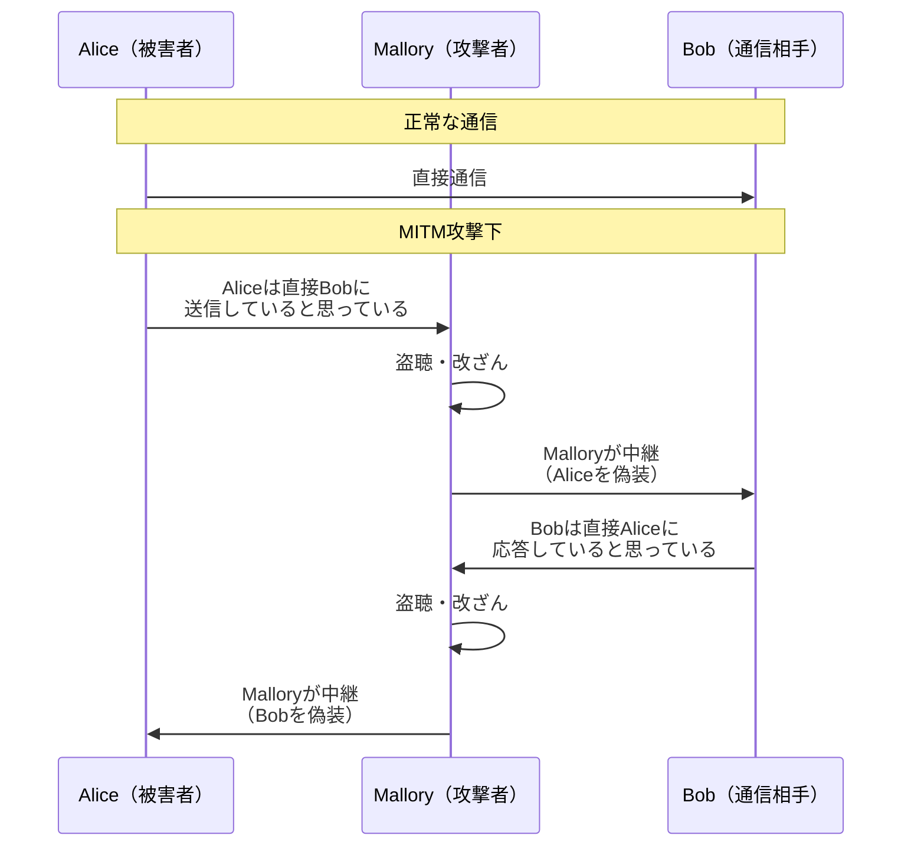
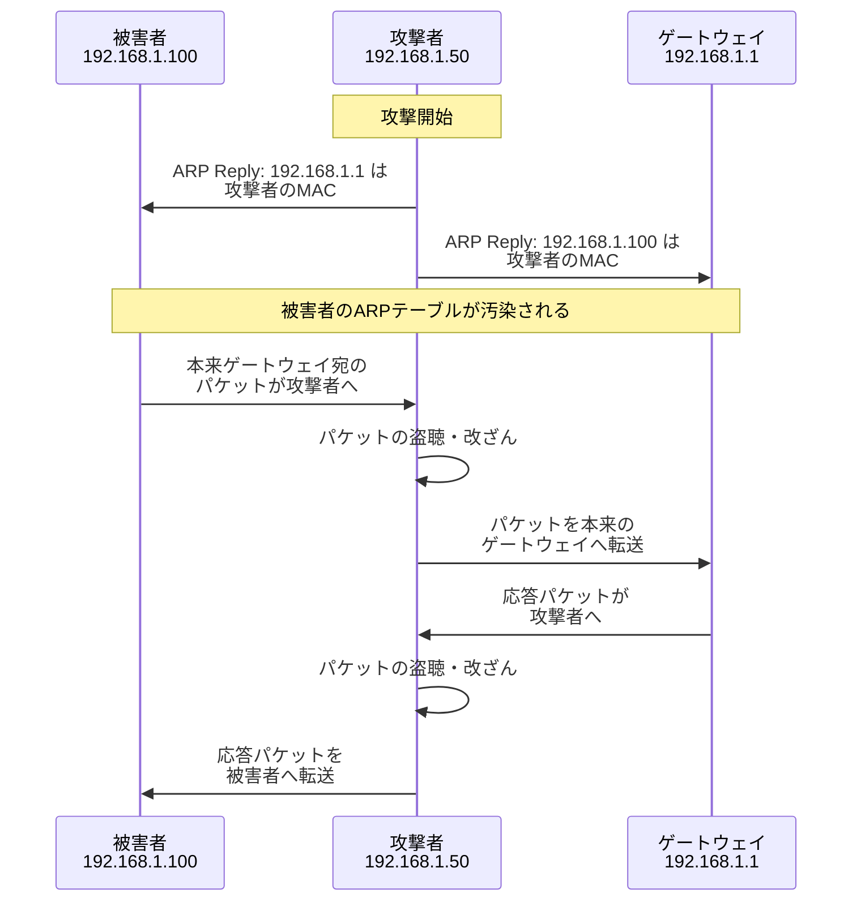
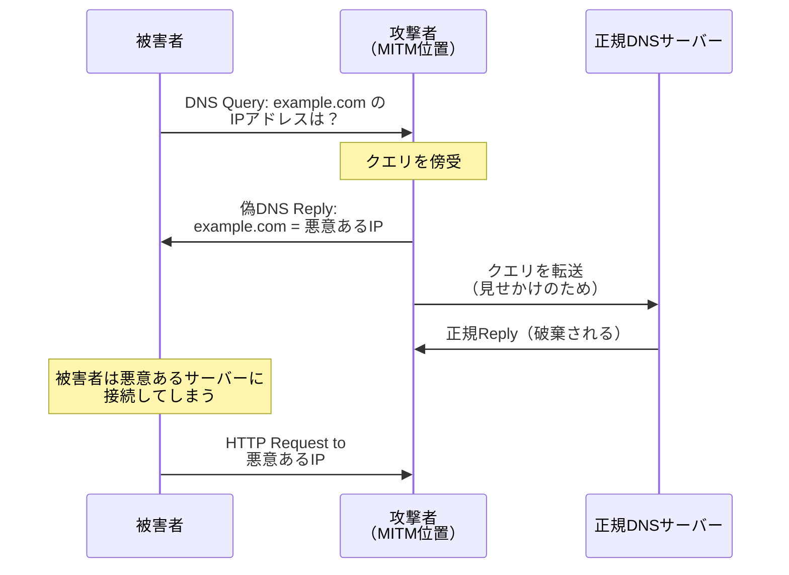
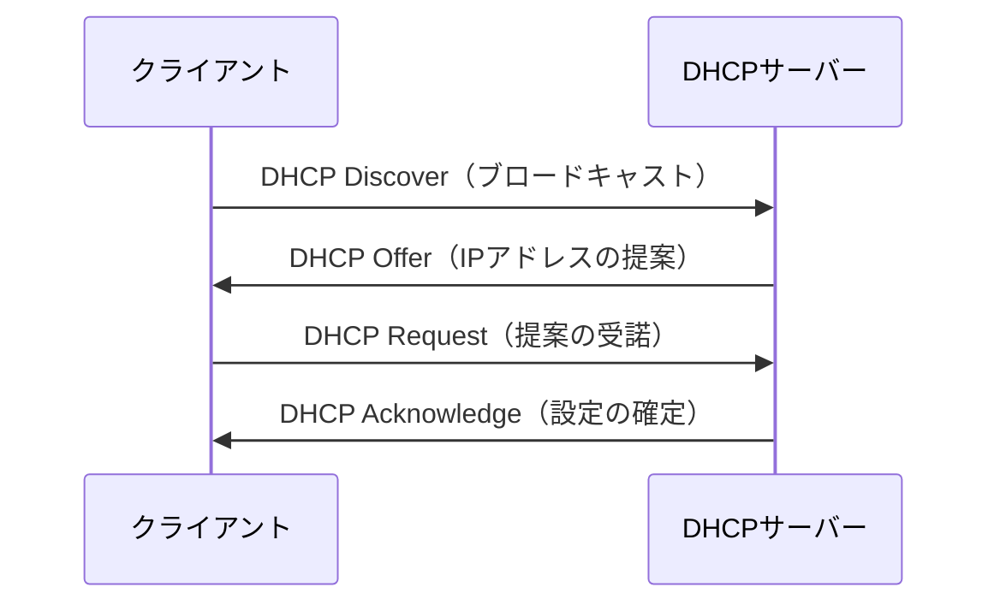
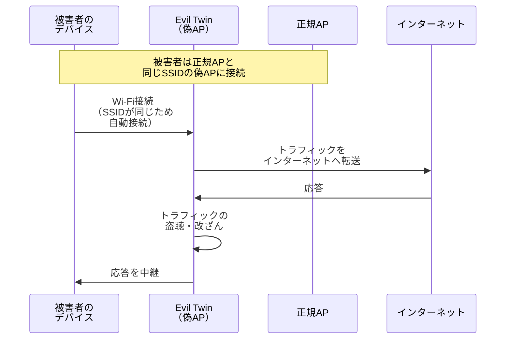
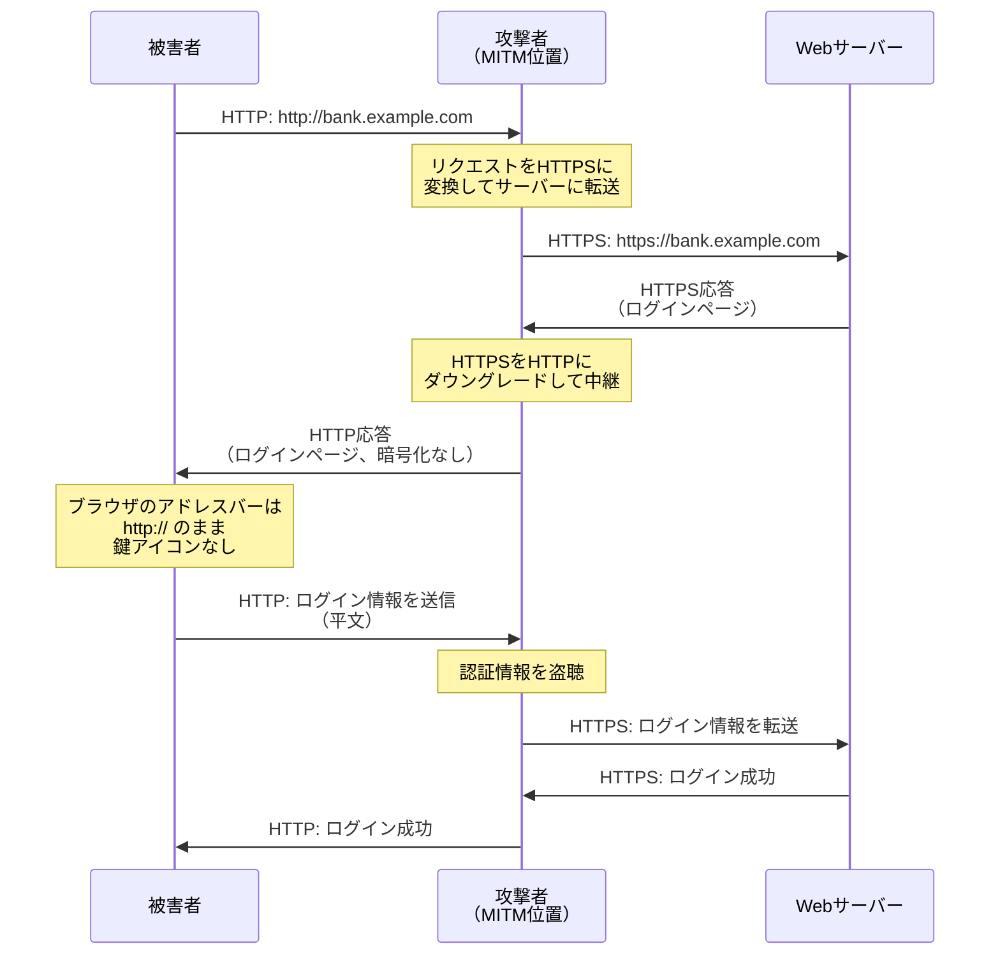
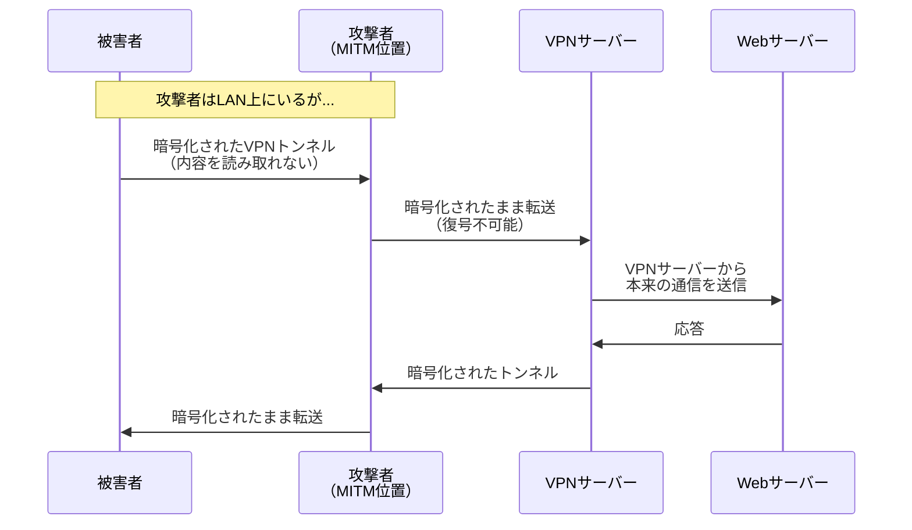

# 中間者攻撃（MITM）— 盗聴・改ざんの原理、攻撃手法、そして防御策

## 1. はじめに：中間者攻撃とは何か

**中間者攻撃（Man-in-the-Middle Attack、MITM攻撃）**とは、通信を行う二者の間に攻撃者が密かに介入し、通信内容の**盗聴**や**改ざん**を行う攻撃手法の総称である。攻撃者は通信の両端に対して正当な通信相手を装い、双方がお互いに直接通信していると信じている状態を作り出す。

この攻撃は情報セキュリティにおける最も根本的な脅威の一つであり、その歴史は現代のコンピュータネットワークよりも遥かに古い。暗号学の文脈では、AliceとBobの間にMalloryが介在するという古典的なシナリオとして知られ、公開鍵暗号の安全性を議論する際に必ず登場する。

### 1.1 なぜMITM攻撃が可能なのか

MITM攻撃が成立する根本的な理由は、多くのネットワークプロトコルが**認証メカニズムを欠いている**ことにある。TCP/IPプロトコルスタックは1970年代に設計されたものであり、当時は軍事・学術ネットワーク内の相互信頼を前提としていた。そのため、以下の基本的なプロトコルには通信相手を検証する仕組みが組み込まれていない：

- **ARP（Address Resolution Protocol）**：認証なしにIPアドレスとMACアドレスの対応を通知できる
- **DNS（Domain Name System）**：応答の真正性を検証する手段がない（DNSSECを除く）
- **DHCP（Dynamic Host Configuration Protocol）**：任意のサーバーがネットワーク設定を配布できる
- **BGP（Border Gateway Protocol）**：経路情報の正当性を暗号学的に検証しない（RPKIを除く）
- **HTTP**：通信が平文であり、盗聴も改ざんも自由にできる

インターネットのインフラストラクチャを構成するこれらのプロトコルが認証を持たないことが、MITM攻撃が現代においてもなお深刻な脅威であり続ける根本原因である。

### 1.2 MITM攻撃の基本構造

MITM攻撃は、一般に以下の二つのフェーズで構成される。

**フェーズ1：インターセプション（通信の傍受）**
攻撃者が通信経路上に自身を配置し、データが攻撃者を経由するように仕向ける。ARP spoofing、DNS spoofing、不正Wi-Fiアクセスポイントの設置などがこのフェーズに該当する。

**フェーズ2：デクリプション / マニピュレーション（復号・操作）**
傍受した通信が暗号化されている場合、攻撃者はSSL strippingやダウングレード攻撃などの手法で暗号化を無力化し、通信内容を読み取り、あるいは改ざんする。



## 2. 攻撃手法の詳細

### 2.1 ARP Spoofing（ARP偽装）

#### 2.1.1 ARPの仕組み

ARP（Address Resolution Protocol）は、IPアドレスからMACアドレス（イーサネットフレームの宛先に必要な物理アドレス）を解決するためのプロトコルである。同一LAN内のホストが通信する際、送信元はまず宛先IPアドレスに対応するMACアドレスをARPテーブル（キャッシュ）で検索し、見つからなければARPリクエストをブロードキャストする。

```
ARP Request（ブロードキャスト）:
  "IPアドレス 192.168.1.1 のMACアドレスは？"

ARP Reply（ユニキャスト）:
  "192.168.1.1 のMACアドレスは AA:BB:CC:DD:EE:FF です"
```

ARPには**認証機構が一切ない**。任意のホストが「自分はこのIPアドレスの持ち主だ」と主張するARP応答を送信でき、受信側はそれを無条件に信頼してARPテーブルを更新する。さらに、ARP応答は**リクエストなしに送信可能**（Gratuitous ARP）であり、攻撃者はARPリクエストを待たずに偽の情報を配布できる。

#### 2.1.2 攻撃の手順

ARP spoofingでは、攻撃者は被害者とデフォルトゲートウェイの双方に対して偽のARP応答を送り続ける。



攻撃者は自身のマシンでIPフォワーディングを有効にしておくことで、被害者の通信を途切れさせずに中継する。被害者から見れば通信は正常に行われているように見えるため、攻撃に気づきにくい。

#### 2.1.3 影響範囲と限界

ARP spoofingは**同一ブロードキャストドメイン（同一LAN）内**でのみ有効であるという制約がある。インターネットを跨いだリモート攻撃には利用できない。しかし、企業の内部ネットワーク、カフェやホテルの公衆Wi-Fiなど、同一LANに接続する環境では非常に現実的な脅威となる。

### 2.2 DNS Spoofing / DNS Cache Poisoning

#### 2.2.1 DNSの仕組みと脆弱性

DNS（Domain Name System）は、ドメイン名をIPアドレスに変換する階層的な分散データベースである。ユーザーが `example.com` にアクセスする際、まずDNSリゾルバ（通常はISPや組織が運営するキャッシュDNSサーバー）に問い合わせ、そこから権威DNSサーバーに再帰的に問い合わせが行われる。

従来のDNSプロトコル（RFC 1035）にはいくつかの構造的な弱点がある：

- **UDPベース**：DNSクエリは通常UDPで行われ、送信元IPの偽装が容易
- **トランザクションID**：16ビットのIDでクエリと応答を対応づけるが、$2^{16} = 65536$ 通りしかなく予測可能
- **認証なし**：応答の真正性を暗号学的に検証する仕組みがない

#### 2.2.2 ローカルDNS Spoofing

攻撃者がARP spoofingなどで既にLAN上の通信を傍受している場合、被害者からのDNSクエリを検出し、正規のDNSサーバーよりも先に偽の応答を返すことができる。



#### 2.2.3 DNS Cache Poisoning（Kaminsky攻撃）

2008年にDan Kaminskyが発表したDNS cache poisoning攻撃は、リモートからDNSキャッシュサーバーのキャッシュを汚染できるという点で、それまでのDNS spoofingとは一線を画す深刻なものだった。

攻撃の概要は以下の通りである：

1. 攻撃者は、対象ドメイン（例：`example.com`）に存在しないサブドメイン（例：`random123.example.com`）を問い合わせる
2. この問い合わせによって、DNSキャッシュサーバーは `example.com` の権威サーバーに再帰問い合わせを行う
3. 攻撃者は、権威サーバーの応答が到着する前に、大量の偽応答パケットを送信する
4. 偽応答には「`example.com` の権威サーバー（NSレコード）は攻撃者のサーバーである」という委任情報を含める
5. トランザクションIDとポート番号が一致すれば、キャッシュサーバーは偽応答を受け入れる
6. 以降、`example.com` 以下のすべてのドメインに対する問い合わせが攻撃者のサーバーに誘導される

Kaminsky攻撃の発見は、DNSの根本的な設計上の問題を浮き彫りにし、ソースポートランダム化やDNSSECの普及を加速させる契機となった。

### 2.3 DHCP Spoofing

#### 2.3.1 DHCPの仕組み

DHCP（Dynamic Host Configuration Protocol）は、ネットワークに新たに接続したデバイスにIPアドレス、サブネットマスク、デフォルトゲートウェイ、DNSサーバーなどのネットワーク構成情報を自動的に割り当てるプロトコルである。DHCPの動作はDORA（Discover, Offer, Request, Acknowledge）プロセスとして知られる。



#### 2.3.2 攻撃の手法

DHCP spoofingでは、攻撃者が不正なDHCPサーバーをネットワーク上に設置する。DHCPプロトコルには認証機構がないため、クライアントは最も早く応答したDHCPサーバーの設定を受け入れる。攻撃者の不正DHCPサーバーが正規のサーバーよりも早く応答すれば、被害者のネットワーク構成を攻撃者が制御できる。

攻撃者が被害者に配布する典型的な設定は以下の通りである：

- **デフォルトゲートウェイ**を攻撃者のIPに設定：すべてのトラフィックが攻撃者を経由する
- **DNSサーバー**を攻撃者のIPに設定：名前解決を攻撃者が制御する
- あるいは両方を組み合わせる

この攻撃は、ARP spoofingよりもさらに発見が困難な場合がある。被害者のデバイスは正規のDHCPプロセスを経て設定を受け取っており、異常な状態であることを検出する仕組みが標準では存在しないためである。

#### 2.3.3 対策：DHCP Snooping

企業向けのネットワークスイッチには**DHCP Snooping**という機能が実装されている。DHCP Snoopingを有効にすると、スイッチは「信頼できるポート」と「信頼できないポート」を区別し、信頼できないポートからのDHCP Offer / Acknowledgeパケットをドロップする。これにより、管理者が許可したDHCPサーバー以外からの応答がクライアントに到達することを防ぐ。

### 2.4 BGP Hijacking

#### 2.4.1 BGPの役割

BGP（Border Gateway Protocol）はインターネットのルーティングの根幹を担うプロトコルであり、**AS（Autonomous System、自律システム）**間でIP接頭辞の到達性情報を交換する。インターネット上のすべてのIPアドレスブロックは特定のASに属しており、BGPを通じてそのブロックへの経路が全世界に広告される。

#### 2.4.2 攻撃の手法

BGP hijackingでは、攻撃者が自身のAS（または乗っ取ったAS）から、本来は自身に属していないIPプレフィックスの経路広告を行う。BGPにはその経路広告の正当性を暗号学的に検証する仕組みが標準では存在しないため（RPKIの導入は進行中だがまだ完全ではない）、他のルーターはこの偽の経路広告を受け入れ、トラフィックを攻撃者のネットワークに送信してしまう。

より詳細（more specific）なプレフィックスを広告することで、BGPの最長一致（longest prefix match）ルールにより、攻撃者の経路が優先される。例えば、正規ASが `/16` のプレフィックスを広告している場合、攻撃者がその範囲内のより具体的な `/24` を広告すれば、世界中のルーターが `/24` に一致するトラフィックを攻撃者に送信する。

#### 2.4.3 実際の事例

- **2008年 パキスタンによるYouTubeの遮断**：パキスタンの通信会社が自国内でYouTubeをブロックするために行ったBGP広告が国外に漏洩し、約2時間にわたって世界中のYouTubeへのアクセスが遮断された
- **2018年 暗号通貨の窃取**：攻撃者がAmazon Route 53のDNSサーバーに向かうトラフィックをBGP hijackingで奪取し、MyEtherWallet.comのDNS解決を改ざんして暗号通貨を窃取した
- **2019年 中国テレコムの経路漏洩**：欧州向けのトラフィックの一部が中国テレコムのネットワークを経由するよう誘導された

BGP hijackingは国家レベルの攻撃や大規模な通信傍受に利用されうる、インターネットインフラストラクチャに対する最も深刻な脅威の一つである。

### 2.5 不正Wi-Fiアクセスポイント（Rogue Access Point / Evil Twin）

#### 2.5.1 攻撃の概要

不正Wi-Fiアクセスポイント攻撃は、最も直感的で実行が容易なMITM手法の一つである。攻撃者は正規のWi-Fiアクセスポイントと同じSSID（ネットワーク名）を持つ偽のアクセスポイントを設置し、被害者のデバイスをそこに接続させる。

多くのデバイスは、過去に接続したSSIDと同じ名前のアクセスポイントを発見すると、自動的に接続する。この挙動を悪用し、攻撃者は以下のような環境で偽のアクセスポイントを設置する：

- カフェ、空港、ホテルなどの公衆Wi-Fi環境
- 企業オフィスの近く
- カンファレンスや展示会の会場



#### 2.5.2 Captive Portal攻撃との組み合わせ

攻撃者は偽のアクセスポイントにCaptive Portal（接続時のログインページ）を設置し、被害者に認証情報を入力させることもできる。例えば、ホテルのWi-Fiを模したCaptive Portalで宿泊者の部屋番号とパスワードを詐取し、その情報を使って正規のWi-Fiに対するさらなる攻撃を行うといったシナリオが考えられる。

#### 2.5.3 対策

- **WPA3-Enterprise**など強力な認証機構を使用する
- **802.1X認証**（RADIUS）によりアクセスポイントの正当性を検証する
- VPNを使用して、アクセスポイントが不正であっても通信内容を保護する
- 公衆Wi-Fiでは、接続先のSSIDを慎重に確認し、自動接続を無効にする

### 2.6 SSL Stripping（SSLstrip攻撃）

#### 2.6.1 攻撃の背景

2009年にMoxie Marlinspike氏が発表したSSL stripping（SSLstrip）は、HTTPS通信をHTTPにダウングレードすることでTLS/SSLの保護を無力化するMITM攻撃手法である。

多くのWebサイトはHTTPSを使用しているが、ユーザーがURLを直接入力する際は `http://` で始めることが多く、サーバー側は `301` や `302` リダイレクトでHTTPSに誘導する。SSL strippingはこの**リダイレクトの瞬間**を攻撃する。

#### 2.6.2 攻撃の仕組み



この攻撃の巧妙な点は以下にある：

1. **被害者のブラウザはエラーを表示しない**：HTTPでの通信はプロトコル上は正常であるため、証明書エラーのような警告は一切出ない
2. **サーバー側も異常を検知しない**：サーバーはHTTPSで正常に通信しているため、攻撃を検知できない
3. **被害者は気づきにくい**：ユーザーがアドレスバーの `http://` や鍵アイコンの有無を確認しなければ、攻撃に気づくことは難しい

#### 2.6.3 SSLstripの拡張

Marlinspike氏の当初の実装に加え、後の研究者たちにより以下の拡張が行われた：

- **ファビコン偽装**：ブラウザのタブに鍵アイコンのファビコンを表示して、ユーザーにHTTPSであると錯覚させる
- **URL改ざん**：`https://` を `http://` に変えるだけでなく、見た目上は `https://` に見える別のドメイン（例：`https-bank.example.com`）にリダイレクトする
- **WebSocket通信の乗っ取り**：初期接続がHTTPであることを利用し、WebSocket通信も傍受する

## 3. TLSによる防御

### 3.1 TLSが提供する保護

TLS（Transport Layer Security）は、MITM攻撃に対する最も基本的かつ効果的な防御策である。TLSは以下の三つのセキュリティ特性を提供する：

1. **機密性（Confidentiality）**：通信内容の暗号化により、盗聴を防止する
2. **完全性（Integrity）**：メッセージ認証コード（MAC）により、改ざんを検出する
3. **認証（Authentication）**：デジタル証明書により、通信相手が本物であることを検証する

特に重要なのは**認証**の側面である。暗号化だけであれば、攻撃者は被害者との間で一つのTLSセッションを、サーバーとの間でもう一つのTLSセッションを確立する「二重プロキシ」型のMITM攻撃が可能となる。TLSの証明書検証により、クライアントはサーバーの身元を暗号学的に確認でき、正規のサーバー以外とのTLSセッション確立を拒否できる。

### 3.2 TLSハンドシェイクにおけるMITM防止

TLS 1.3のハンドシェイクでは、サーバーは自身の秘密鍵でCertificateVerifyメッセージに署名する。攻撃者がMITMとして振る舞おうとしても、正規サーバーの秘密鍵を持っていないため、有効な署名を生成できない。クライアントは以下のステップで検証を行う：

1. サーバーが提示した証明書が、信頼できるCA（Certificate Authority）によって署名されていることを確認
2. 証明書のコモンネーム（CN）またはSAN（Subject Alternative Name）が、接続先のドメイン名と一致することを確認
3. 証明書が有効期限内であり、失効（revoke）されていないことを確認
4. サーバーがCertificateVerifyで正当な署名を提示したことを確認

これらの検証のいずれかが失敗した場合、ブラウザはユーザーに警告を表示し、接続を中断する。

### 3.3 TLSの限界

TLSは強力な防御策であるが、万能ではない。以下の状況ではTLSの保護が無力化される可能性がある：

- **初回接続がHTTPの場合**：SSL strippingにより、TLS接続への昇格が阻止される
- **ユーザーが証明書警告を無視した場合**：ブラウザの警告を「例外として追加」すれば、不正な証明書を受け入れることができる
- **信頼されたCAが侵害された場合**：攻撃者がCAの秘密鍵を入手すれば、任意のドメインの有効な証明書を発行できる
- **クライアントのルートストアが改ざんされた場合**：企業のプロキシや国家によるTLSインターセプション

## 4. HSTS（HTTP Strict Transport Security）

### 4.1 HSTSの目的

HSTS（HTTP Strict Transport Security、RFC 6797）は、SSL stripping攻撃に対する決定的な防御策として設計された。HSTSにより、ブラウザは特定のドメインに対して**常にHTTPSで接続する**ことを強制され、HTTPへのダウングレードが不可能になる。

### 4.2 動作の仕組み

サーバーはHTTPSの応答ヘッダーに `Strict-Transport-Security` ヘッダーを含めることで、HSTSを有効にする。

```
Strict-Transport-Security: max-age=31536000; includeSubDomains; preload
```

- **`max-age`**：HSTSポリシーの有効期間（秒）。この例では1年間
- **`includeSubDomains`**：すべてのサブドメインにもHSTSを適用する
- **`preload`**：ブラウザのHSTSプリロードリストへの登録を希望する

一度HSTSヘッダーを受信したブラウザは、指定された期間中、以下の挙動を行う：

1. `http://` でのアクセスを自動的に `https://` に変換する（**サーバーにリダイレクトを要求することなく、ブラウザ内部で変換する**）
2. 証明書エラーが発生した場合、ユーザーが例外を追加して接続を続行することを**禁止**する
3. セキュアでないリソースの読み込みをブロックする

### 4.3 HSTSプリロードリスト

HSTSには「初回訪問問題（TOFU: Trust On First Use）」がある。ユーザーが初めてそのサイトを訪問する際はHSTSヘッダーをまだ受信していないため、SSL strippingの対象となり得る。

この問題を解決するのが**HSTSプリロードリスト**である。これはブラウザにハードコードされたHSTS対応ドメインのリストであり、Chrome、Firefox、Safari、Edgeなど主要ブラウザで共有されている。プリロードリストに登録されたドメインは、ユーザーが一度もそのサイトを訪問したことがなくても、最初からHTTPS接続が強制される。

Google、Facebook、Twitter（現X）、各種銀行サイトなど、主要なWebサービスの多くがHSTSプリロードリストに登録されている。

### 4.4 HSTSの効果

HSTSが有効に機能している場合、SSL stripping攻撃は完全に無力化される。攻撃者がHTTPSのレスポンスをHTTPにダウングレードしようとしても、被害者のブラウザはHSTSポリシーに従い、HTTP接続を拒否してHTTPSでの接続を試みる。この時、攻撃者は有効なTLS証明書を提示できないため、接続は失敗し、被害者は攻撃に気づくことができる。

## 5. Certificate Pinning（証明書ピニング）

### 5.1 CAシステムの弱点

PKI（Public Key Infrastructure）に基づく現在の証明書システムでは、**数百のCA**がブラウザのルートストアに信頼されている。これは「信頼の連鎖」を広範に構築できるという利点がある一方で、いずれか一つのCAが侵害されれば、任意のドメインに対して有効な証明書を発行できるという構造的なリスクを抱えている。

実際にCAの侵害は繰り返し発生している：

- **2011年 DigiNotar**：オランダのCAが侵害され、`*.google.com` を含む500以上のドメインの偽証明書が発行された。イランのユーザーに対するGmailの監視に使用されたとされる
- **2011年 Comodo**：複数のドメイン（google.com、yahoo.com、mozilla.org等）の偽証明書が発行された
- **2015年 CNNIC**：中国のCAの中間CA証明書が不正に使用され、Googleドメインの偽証明書が発行された

### 5.2 ピニングの概念

Certificate Pinning（証明書ピニング）は、特定のドメインに対して使用されるべき証明書（または公開鍵）をクライアント側で固定（pin）する技術である。ピニングにより、信頼されたCAが発行した証明書であっても、事前に登録されたものと異なれば拒否される。

ピニングには二つの主要なアプローチがある：

**公開鍵ピニング（Public Key Pinning）**：証明書全体ではなく、公開鍵のハッシュ値をピニングする。これにより、証明書の更新（同じ鍵ペアを使用した再発行）時にもピニングが有効であり続ける。

**証明書ピニング（Certificate Pinning）**：証明書全体のハッシュ値をピニングする。証明書の更新時にピニング情報も更新する必要がある。

### 5.3 実装方法

#### モバイルアプリケーションでのピニング

モバイルアプリケーションでは、アプリのバイナリ内にサーバーの公開鍵ハッシュを埋め込むことでピニングを実装する。

```java
// Android - OkHttp example
CertificatePinner pinner = new CertificatePinner.Builder()
    .add("api.example.com",
         "sha256/AAAAAAAAAAAAAAAAAAAAAAAAAAAAAAAAAAAAAAAAAAA=")
    .add("api.example.com",
         "sha256/BBBBBBBBBBBBBBBBBBBBBBBBBBBBBBBBBBBBBBBBBBB=") // backup pin
    .build();

OkHttpClient client = new OkHttpClient.Builder()
    .certificatePinner(pinner)
    .build();
```

#### HTTP Public Key Pinning（HPKP）の廃止

かつてはブラウザ向けにHTTP Public Key Pinning（HPKP、RFC 7469）が標準化されていたが、以下の深刻な運用上の問題から2018年にChromeで廃止された：

- **ピン設定の誤りによるサイト停止**：誤ったピンを設定すると、証明書の更新後にサイトが完全にアクセス不能になり、回復が困難
- **ピン設定の悪用（HPKP攻撃）**：攻撃者がサイトを一時的に乗っ取ってHPKPヘッダーを設定し、自身のピンを登録することで、正規の管理者がサイトを回復できなくする「ランサム攻撃」
- **Certificate Transparency（CT）による代替**：CT ログにより、不正な証明書の発行を検出できるようになった

現在のブラウザでの標準的なアプローチは、HSTSとCertificate Transparencyの組み合わせであり、モバイルアプリでの証明書ピニングは引き続き広く使用されている。

## 6. MITM攻撃の検出

### 6.1 ネットワークレベルの検出

#### ARPテーブルの監視

ARP spoofingを検出する最も直接的な方法は、ARPテーブルの異常を監視することである。同一のMACアドレスが複数のIPアドレスに対応している場合、ARP spoofingが行われている可能性がある。

```bash
# ARP table inspection
arp -a

# Check for duplicate MAC addresses
arp -a | awk '{print $4}' | sort | uniq -d
```

#### ネットワーク監視ツール

- **arpwatch**：ARPテーブルの変更を監視し、新しいMACアドレスの出現やIPとMACの対応変更を通知する
- **Snort / Suricata**：ネットワーク侵入検知システム（NIDS）としてARP spoofingのシグネチャを検出する
- **Wireshark**：パケットキャプチャにより、不審なARP応答やDNS応答を手動で分析する

### 6.2 TLS証明書の検証

#### Certificate Transparency（CT）

Certificate Transparency は、CAが発行するすべての証明書を公開ログに記録する仕組みである。ドメインの管理者はCTログを監視することで、自身のドメインに対して不正な証明書が発行された場合に迅速に検出できる。

主要なCTログ監視サービス：
- **crt.sh**：Comodoが運営する証明書検索エンジン
- **Google Certificate Transparency**：Googleが運営するCTログ
- **Facebook Certificate Transparency Monitoring**：自身が管理するドメインのCT監視

#### 証明書フィンガープリントの変化

同一のサイトに対して、接続のたびに異なる証明書フィンガープリントが提示される場合、MITM攻撃が行われている可能性がある。ブラウザ拡張機能やコマンドラインツールを使って証明書のフィンガープリントを確認できる。

```bash
# Check certificate fingerprint
openssl s_client -connect example.com:443 < /dev/null 2>/dev/null | \
  openssl x509 -fingerprint -noout -sha256
```

### 6.3 アプリケーションレベルの検出

一部のアプリケーションは、MITM攻撃の検出機能を組み込んでいる。例えば、Signal メッセンジャーでは**Safety Number**機能により、通信相手との間でエンドツーエンド暗号化の鍵が変更されていないかを帯域外で検証できる。WhatsAppにも同様のセキュリティコード検証機能がある。

## 7. VPNによる防御

### 7.1 VPNがMITM攻撃を防ぐ仕組み

VPN（Virtual Private Network）は、クライアントとVPNサーバーの間に暗号化されたトンネルを構築する。これにより、たとえ攻撃者がLAN上でMITM位置にいたとしても、以下の理由から通信内容を読み取ることができない：

1. **すべてのトラフィックが暗号化される**：DNS クエリ、HTTP通信、その他すべてのプロトコルがVPNトンネルを通過するため、個々のプロトコルの脆弱性に関わらず保護される
2. **ローカルネットワークの設定が無視される**：VPN接続時は、ローカルのDNSサーバーやゲートウェイの設定がVPNの設定で上書きされるため、DHCP spoofingやDNS spoofingの影響を受けない
3. **VPNサーバーとの認証**：VPNプロトコル（IPsec、WireGuard、OpenVPNなど）は暗号学的な認証を行うため、攻撃者がVPNサーバーを偽装することは困難



### 7.2 VPNの限界と注意点

VPNは強力な防御策であるが、以下の点に注意が必要である：

- **VPNプロバイダー自体がMITM位置にある**：VPNサーバーの運営者は、復号されたトラフィックにアクセスできる。信頼できないVPNプロバイダーを使用することは、MITM攻撃のリスクを排除するのではなく、移転しているに過ぎない
- **DNSリーク**：VPNの設定に不備がある場合、DNSクエリがVPNトンネルの外に漏洩し、ISPや攻撃者に訪問先のドメインが露出する可能性がある
- **VPN接続前の通信**：VPNが確立される前に行われた通信はMITMの対象となる。「キルスイッチ」機能を持つVPNクライアントを使用することで、VPN切断時のトラフィック漏洩を防げる
- **WebRTCリーク**：ブラウザのWebRTC機能がVPNトンネルを迂回して実際のIPアドレスを露出させる場合がある

## 8. 実際のインシデントと国家レベルの攻撃

### 8.1 NSA QUANTUMプログラム

2013年にEdward Snowdenにより暴露された文書により、NSA（米国国家安全保障局）が**QUANTUMプログラム**と呼ばれる大規模なMITMインフラストラクチャを運用していたことが明らかになった。

#### QUANTUM INSERT

QUANTUMプログラムの中核は**QUANTUM INSERT**と呼ばれる攻撃手法である。これは、ターゲットがアクセスしようとしているWebサイトの応答よりも先に、NSAのサーバーから偽の応答パケットを送り込む技術である。

NSAはインターネットバックボーン上の複数の地点に**TURMOIL**と呼ばれるパッシブ監視センサーと、**FOXACID**と呼ばれるエクスプロイト配信サーバーを配置していた。ターゲットの通信がTURMOILセンサーを通過すると、FOXACID サーバーがターゲットに対してエクスプロイトを含むHTTPレスポンスを「正規サーバーの応答より先に」送り返す。TCPの仕様上、先に到着した応答が受け入れられるため、正規サーバーの応答は無視される。

この攻撃は、ベルギーの通信事業者Belgacom（現BICS/Proximus）やOPECのネットワークへの侵入に使用されたとされる。

#### QUANTUM theoryの限界

QUANTUMプログラムはHTTPS通信に対しては直接的には無力である。TLS/SSLで暗号化された通信に対しては、QUANTUM INSERTの手法で偽のTLSレスポンスを送り込んでも、TLSハンドシェイクの認証により拒否される。このことは、**広範なHTTPS/TLSの導入がこの種の国家レベル攻撃への最も効果的な対策**であることを示している。

### 8.2 国家による大規模TLSインターセプション

いくつかの国家は、国内の通信を監視するために体系的なTLSインターセプションを実施している、あるいは実施していたとされる。

#### カザフスタンの「国家安全証明書」

2019年、カザフスタン政府は国民に対して、政府が管理するルートCA証明書をデバイスにインストールすることを要求した。この証明書がインストールされると、政府はTLS通信をインターセプトし、独自の証明書を提示してMITM攻撃を行うことが可能になる。

この試みに対して、Google Chrome、Mozilla Firefox、Apple Safariは協力してこの証明書をブロックリストに追加し、たとえユーザーが手動でインストールしても信頼されないようにした。これは、ブラウザベンダーが国家レベルのMITM攻撃に対して技術的対抗措置を講じた重要な前例となった。

#### 中国のGreat Firewall

中国のGreat Firewall（金盾）は、国際的なインターネット通信を検閲・監視するシステムである。DNS汚染、IPブロッキング、DPI（Deep Packet Inspection）などの手法に加え、特定の標的に対してTLS通信のインターセプトが行われていた事例も報告されている（例：2015年のGitHub DDoS攻撃に関連する通信操作）。

### 8.3 企業内TLSインターセプション

企業のネットワークセキュリティにおいて、**TLSインターセプションプロキシ**はしばしば正当な目的で使用される。企業のセキュリティポリシーを適用するため、従業員のHTTPS通信をプロキシで復号・検査し、マルウェアの検出やデータ漏洩防止（DLP）を行う。

この場合、企業は自社のルートCA証明書を従業員のデバイスにインストールし、プロキシはこのCAを使用して各サイトの証明書をオンザフライで生成する。技術的にはMITMと同じ構造であるが、正当な管理権限に基づいて行われる点が異なる。

ただし、企業のTLSインターセプションには以下のセキュリティ上の懸念がある：

- プロキシの実装が不完全な場合、元のサーバーの証明書検証が不十分になる可能性がある
- プロキシ自体が侵害された場合、すべての暗号化通信が露出する
- プライバシーの観点から、従業員の個人的な通信（銀行サイトへのアクセスなど）も復号される

## 9. ペネトレーションテストにおけるMITMツール

**注意：以下のツールは、正当な権限を持つセキュリティ評価（ペネトレーションテスト）の目的でのみ使用されるべきである。許可なく他者の通信を傍受・改ざんすることは、ほぼすべての法域で違法行為である。**

### 9.1 mitmproxy

**mitmproxy**は、Pythonで実装されたオープンソースのHTTP/HTTPSプロキシツールである。セキュリティテスト、APIのデバッグ、通信の分析に広く使用されている。

#### 主な機能

- **HTTP/HTTPS通信のインターセプト**：リアルタイムでリクエスト・レスポンスの表示、変更、リプレイが可能
- **スクリプティング**：Pythonスクリプトで通信の自動的な操作が可能
- **Web UI（mitmweb）**：ブラウザベースのインタフェースで通信を視覚的に分析
- **コマンドライン（mitmdump）**：スクリプトベースの自動化に適したコマンドラインツール

#### 動作原理

mitmproxyはHTTPSの通信をインターセプトするために、以下の手順を踏む：

1. mitmproxyが独自のCA証明書を生成する
2. テスト対象のデバイスに、このCA証明書を信頼済みルート証明書としてインストールする
3. デバイスのプロキシ設定をmitmproxyに向ける
4. デバイスがHTTPSサイトにアクセスすると、mitmproxyはオンザフライでそのドメインの証明書を独自CAで署名して発行する
5. デバイスはこの証明書を信頼し、mitmproxyとのTLSセッションを確立する
6. 同時に、mitmproxyは本物のサーバーとの間で正規のTLSセッションを確立する
7. 結果として、mitmproxyは復号された通信内容にフルアクセスできる

#### 使用例

```bash
# Start mitmproxy with web interface
mitmweb --listen-port 8080

# Dump all traffic to a file
mitmdump -w traffic.flow --listen-port 8080

# Modify responses using a script
mitmdump -s modify_response.py --listen-port 8080
```

```python
# modify_response.py - example addon script
from mitmproxy import http

def response(flow: http.HTTPFlow) -> None:
    # Log all cookies being set
    for name, value in flow.response.cookies.items():
        print(f"Cookie: {name}={value}")

    # Check for missing security headers
    headers = flow.response.headers
    if "Strict-Transport-Security" not in headers:
        print(f"WARNING: {flow.request.url} missing HSTS header")
    if "X-Content-Type-Options" not in headers:
        print(f"WARNING: {flow.request.url} missing X-Content-Type-Options")
```

### 9.2 Bettercap

**Bettercap**は、Go言語で実装された包括的なネットワーク攻撃・監視フレームワークである。Ettercapの後継として開発され、ネットワークセキュリティの評価において広く使用されている。

#### 主な機能

- **ARP spoofing**：LAN上のトラフィックを傍受するためのARP spoofing
- **DNS spoofing**：DNSクエリに対する偽応答の注入
- **SSL stripping**：HTTPS通信のHTTPへのダウングレード
- **Wi-Fiネットワークの監視・攻撃**：Wi-Fiデバイスの検出、認証解除攻撃
- **BLE（Bluetooth Low Energy）の監視**
- **プロキシモジュール**：HTTP/HTTPS通信のインターセプトと変更

#### ペネトレーションテストでの使用

Bettercapは、企業のネットワークセキュリティ評価において、以下のようなシナリオのテストに使用される：

1. **ARP spoofing耐性の評価**：ネットワーク機器がARP spoofingを検出・防止できるか
2. **SSL stripping耐性の評価**：Webアプリケーションが適切にHSTSを設定しているか
3. **DNS spoofing耐性の評価**：DNSの改ざんに対する防御が適切か
4. **認証情報の平文送信の検出**：暗号化されていない経路で認証情報が送信されていないか

### 9.3 その他のツール

- **Wireshark**：パケットキャプチャと分析の標準ツール。直接的なMITM機能はないが、ネットワーク通信の詳細な分析に不可欠
- **Ettercap**：古典的なMITMツール。ARP spoofingとパケットフィルタリングが主な機能
- **Responder**：Windows環境でのLLMNR/NBT-NS/mDNSのpoisoningに特化したツール
- **SSLsplit**：TLS通信のインターセプトに特化したツール

## 10. 防御策のまとめと今後の展望

### 10.1 多層防御の原則

MITM攻撃に対する効果的な防御は、単一の対策ではなく、複数の層での防御（Defense in Depth）が不可欠である。

| 層 | 対策 | 対抗する攻撃手法 |
|---|---|---|
| ネットワーク層 | Dynamic ARP Inspection、DHCP Snooping、802.1X | ARP spoofing、DHCP spoofing、不正AP |
| DNS層 | DNSSEC、DoH（DNS over HTTPS）、DoT（DNS over TLS） | DNS spoofing/poisoning |
| トランスポート層 | TLS 1.3の強制 | 通信の盗聴・改ざん全般 |
| アプリケーション層 | HSTS（preload含む）、Certificate Pinning、CT | SSL stripping、偽証明書 |
| ルーティング層 | RPKI（Resource Public Key Infrastructure） | BGP hijacking |
| エンドユーザー層 | VPN、セキュリティ教育 | 公衆Wi-Fi攻撃全般 |

### 10.2 暗号化の普及とその効果

Let's Encryptの登場（2015年）以降、HTTPS の普及は劇的に加速した。Google Chromeの統計によれば、2015年には約40%だったHTTPSのページロード比率は、2025年時点で95%以上に達している。この暗号化の普及は、多くのMITM攻撃手法を事実上無力化した。

特に、HTTPSの普及は以下の攻撃を大幅に困難にした：

- **パッシブな盗聴**：暗号化された通信を復号することは計算量的に不可能
- **SSL stripping**：HSTSとプリロードリストの普及により、主要サイトへのHTTPダウングレードは阻止される
- **QUANTUM INSERT型攻撃**：TLSの認証により、偽の応答は検証で拒否される

### 10.3 残存する脅威と今後の課題

暗号化の普及にもかかわらず、以下の領域ではMITM攻撃の脅威が残存している：

**IoTデバイス**：多くのIoTデバイスは適切なTLS実装を持たず、証明書の検証を行わないものも多い。スマートホームデバイス、産業制御システム、医療機器などが潜在的な標的となる。

**モバイルアプリケーション**：適切な証明書ピニングを実装していないモバイルアプリは、TLSインターセプションに対して脆弱である可能性がある。

**レガシーシステム**：古いプロトコル（SMTP、FTP、Telnetなど）を使用するシステムは依然として存在し、これらは暗号化を持たないかオプショナルである。

**サプライチェーン攻撃**：ソフトウェアの更新メカニズムがMITM攻撃に対して脆弱な場合、攻撃者は改ざんされたソフトウェアアップデートを配信できる。コードサイニングと安全な配信メカニズムの重要性はますます高まっている。

**量子コンピュータの脅威**：将来的に量子コンピュータが実用化されれば、現在のTLSで使用されている公開鍵暗号（RSA、ECDH）が破られる可能性がある。ポスト量子暗号への移行（TLSにおけるML-KEMの採用など）は、この長期的な脅威への対応として進められている。

### 10.4 結論

中間者攻撃は、コンピュータネットワークの歴史と同じくらい古い脅威であり、その基本的な概念は変わらない——「通信経路上に介入し、盗聴・改ざんを行う」というものである。しかし、具体的な攻撃手法は常に進化しており、ARP spoofingのようなローカルネットワーク攻撃から、BGP hijackingのようなインターネットインフラへの攻撃、そしてNSA QUANTUMのような国家規模の攻撃まで、その範囲は広大である。

TLS/HTTPSの普及は、この脅威に対する最も効果的な対策であり続けている。しかし、TLS単独では十分ではなく、HSTSによるダウングレード攻撃の防止、Certificate Transparencyによる不正証明書の検出、VPNによるネットワークレベルの保護、そして各ネットワーク層でのセキュリティ機構（DNSSEC、RPKI、Dynamic ARP Inspection等）を組み合わせた多層防御が不可欠である。

セキュリティは終着点のない継続的なプロセスであり、新たな攻撃手法の出現に備えて、防御策も絶えず進化させていく必要がある。
