# MLOps（実験管理, モデルサービング, A/Bテスト）

## 背景と動機

機械学習（ML）は研究段階を超え、ビジネスの中核的な意思決定を担うようになった。しかし、モデルを Jupyter Notebook で訓練し精度を確認するだけでは、ビジネス価値は生まれない。モデルを本番環境にデプロイし、継続的にモニタリングし、データの変化に追従して再訓練するという**ライフサイクル全体を管理する工学的規律**が必要になる。この規律こそが **MLOps（Machine Learning Operations）** である。

### 従来のソフトウェア開発と ML の違い

従来のソフトウェアエンジニアリングでは、コードの変更がシステムの挙動を決定する。テストが通れば、デプロイ後の振る舞いは予測可能である。一方、ML システムでは**コード、データ、モデル**の三要素が絡み合い、システムの振る舞いを決定する。

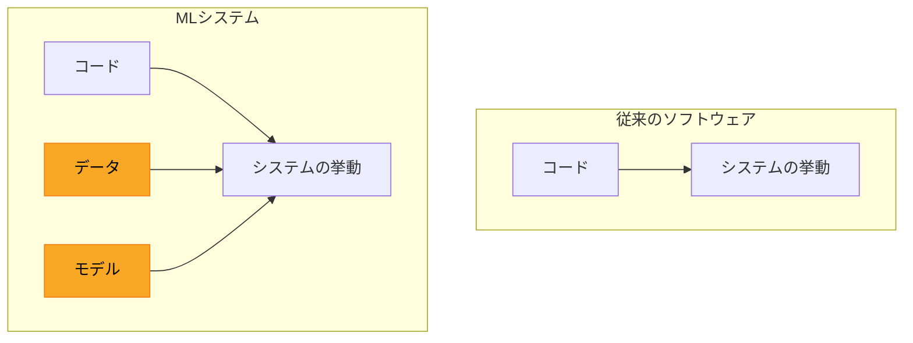

この複雑さが、ML 特有の課題を生み出す。

- **再現性の欠如**: 同じコードでも、訓練データやハイパーパラメータが異なれば、まったく異なるモデルが生成される
- **テストの困難さ**: 単体テストだけではモデルの品質を保証できない。データの分布変化（Data Drift）に対する継続的なモニタリングが必要
- **技術的負債の蓄積**: Google が 2015 年に発表した論文 "Hidden Technical Debt in Machine Learning Systems" が指摘するように、ML システムのコードは全体のごく一部であり、周辺のデータ収集・検証・特徴量抽出・モニタリング・インフラが膨大な技術的負債を生む

### MLOps の目的

MLOps は、これらの課題に対する体系的なアプローチを提供する。その目的は以下に集約される。

1. **再現性の確保**: 実験の条件（データ、コード、ハイパーパラメータ、環境）を完全に記録し、任意の時点のモデルを再現可能にする
2. **自動化**: データの取り込みからモデルの訓練、評価、デプロイまでのパイプラインを自動化し、人的ミスを排除する
3. **継続的改善**: モデルの本番パフォーマンスを監視し、劣化を検知し、再訓練のトリガーを自動化する
4. **ガバナンス**: モデルの系譜（lineage）を追跡し、規制要件やコンプライアンスに対応する

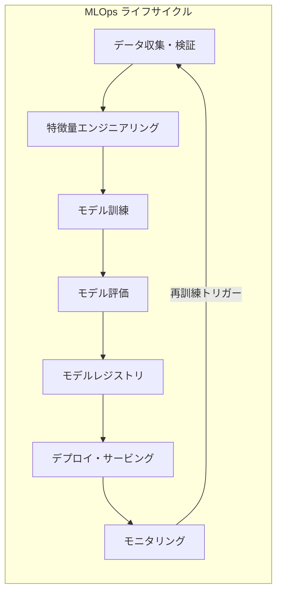

---

## 実験管理

ML の開発は本質的に**実験的**である。データサイエンティストは、異なるアルゴリズム、ハイパーパラメータ、特徴量の組み合わせを試し、最適なモデルを見つけ出す。この過程で数十から数百の実験が行われるが、これらを体系的に管理しなければ、「あのとき良い精度が出たモデルはどの設定だったか」という根本的な問いに答えられなくなる。

### Experiment Tracking の基本概念

実験管理（Experiment Tracking）は、各実験の以下の情報を自動的に記録する仕組みである。

| 記録対象 | 具体例 |
|---|---|
| パラメータ | 学習率、バッチサイズ、エポック数、モデルアーキテクチャ |
| メトリクス | 精度、損失、F1スコア、AUC |
| アーティファクト | 訓練済みモデル、混同行列の画像、特徴量重要度 |
| ソースコード | Git のコミットハッシュ、差分 |
| 環境 | Python バージョン、ライブラリバージョン、GPU 情報 |
| データ | データセットのバージョン、前処理パイプライン |

### MLflow

MLflow は Databricks 社が開発した、オープンソースの ML ライフサイクル管理プラットフォームである。以下の 4 つのコンポーネントで構成される。

**MLflow Tracking** は実験管理の中核であり、パラメータ・メトリクス・アーティファクトを記録する。

```python
import mlflow

with mlflow.start_run():
    mlflow.log_param("learning_rate", 0.01)
    mlflow.log_param("batch_size", 64)
    mlflow.log_param("epochs", 100)

    # Training loop
    for epoch in range(100):
        loss, accuracy = train_one_epoch(model, dataloader)
        mlflow.log_metric("loss", loss, step=epoch)
        mlflow.log_metric("accuracy", accuracy, step=epoch)

    # Log the trained model
    mlflow.sklearn.log_model(model, "model")
```

**MLflow Projects** は、ML コードのパッケージング形式を標準化する。`MLproject` ファイルにエントリーポイントと依存関係を宣言することで、任意の環境で再現実行が可能になる。

**MLflow Models** は、モデルのパッケージング形式を標準化する。Python 関数、REST API、Docker コンテナなど、複数の推論形式にデプロイできる汎用フォーマットを提供する。

**MLflow Model Registry** は後述するモデルレジストリ機能を提供する。

### Weights & Biases（W&B）

Weights & Biases は、実験管理に特化した SaaS プラットフォームである。MLflow と比較して、以下の点で差別化されている。

- **リアルタイムダッシュボード**: 訓練中のメトリクスをリアルタイムに可視化し、チームメンバーと共有できる
- **ハイパーパラメータスイープ**: ベイズ最適化やランダムサーチを統合的にサポートし、最適なハイパーパラメータ探索を自動化する
- **Artifacts**: データセットやモデルのバージョン管理を行い、系譜を追跡する
- **Reports**: 実験結果を共有可能なレポートとしてまとめ、チームのコラボレーションを支援する

```python
import wandb

wandb.init(project="my-ml-project", config={
    "learning_rate": 0.01,
    "batch_size": 64,
    "architecture": "ResNet-50"
})

for epoch in range(100):
    loss, accuracy = train_one_epoch(model, dataloader)
    wandb.log({"loss": loss, "accuracy": accuracy})

wandb.finish()
```

### ツールの選定基準

実験管理ツールの選定にあたっては、以下の観点を考慮する。

- **セルフホスト vs SaaS**: MLflow はセルフホストが基本（Databricks の Managed MLflow もある）、W&B は SaaS が中心（セルフホスト版も提供）
- **チーム規模**: 少人数なら MLflow のシンプルさが有利、大規模チームなら W&B のコラボレーション機能が有効
- **エコシステム連携**: MLflow は Databricks/Spark エコシステムとの統合が強力、W&B は PyTorch/Hugging Face との統合が充実
- **コスト**: MLflow はオープンソースで無料、W&B は個人利用は無料だがチーム利用は有料

---

## データバージョニング

ML における再現性を確保するには、コードだけでなく**データのバージョン管理**も不可欠である。Git は大容量のバイナリファイル（画像データセット、CSV ファイルなど）の管理には適していない。この課題に対応するのがデータバージョニングツールである。

### DVC（Data Version Control）

DVC は Git の拡張として設計されたデータバージョニングツールである。データファイル自体は S3 や GCS などのリモートストレージに保管し、Git リポジトリにはメタデータ（`.dvc` ファイル）のみを格納する。

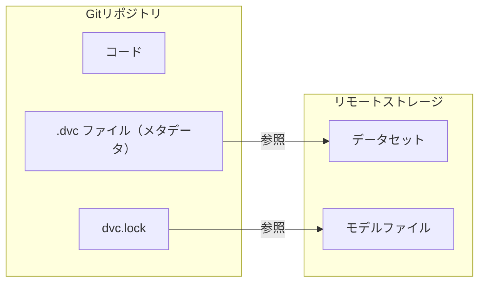

DVC の主要な機能は以下の通りである。

- **データのバージョン管理**: `dvc add` でデータファイルを追跡し、Git コミットと対応させる
- **パイプライン定義**: `dvc.yaml` に前処理・訓練・評価のパイプラインを宣言的に記述する
- **再現実行**: `dvc repro` でパイプラインを再実行し、変更があったステージのみを再計算する
- **メトリクス比較**: `dvc metrics diff` で異なるバージョン間のメトリクスを比較する

```yaml
# dvc.yaml
stages:
  preprocess:
    cmd: python preprocess.py
    deps:
      - data/raw/
      - preprocess.py
    outs:
      - data/processed/

  train:
    cmd: python train.py
    deps:
      - data/processed/
      - train.py
    params:
      - learning_rate
      - batch_size
    outs:
      - models/model.pkl
    metrics:
      - metrics.json:
          cache: false
```

### lakeFS

lakeFS はデータレイクに Git ライクなバージョン管理を提供するオープンソースプラットフォームである。DVC がファイル単位のバージョン管理であるのに対し、lakeFS はデータレイク全体を対象とする。

lakeFS の特徴は以下の通りである。

- **ブランチ**: データレイクにブランチを作成し、実験的な変更を分離できる
- **コミット**: データの状態をスナップショットとして不変に記録する
- **マージ**: 実験が成功した場合、変更をメインブランチにマージできる
- **S3 互換 API**: 既存の S3 クライアントやツール（Spark、Presto など）からそのまま利用できる

DVC と lakeFS の使い分けは、プロジェクトの規模と要件に依存する。小〜中規模のプロジェクトで Git ワークフローとの統合を重視するなら DVC が適しており、大規模なデータレイクをチーム横断で管理するなら lakeFS が有力な選択肢となる。

---

## モデルレジストリとアーティファクト管理

実験の結果として生まれたモデルを、本番環境にデプロイするまでの管理体制がモデルレジストリである。

### モデルレジストリの役割

モデルレジストリは、訓練済みモデルの**ライフサイクルを一元管理**するシステムであり、以下の機能を提供する。

- **バージョン管理**: 同一モデルの複数バージョンを追跡する
- **ステージ管理**: モデルの状態を `Staging → Production → Archived` のように管理する
- **アクセス制御**: 誰がモデルを本番昇格できるかを制御する
- **系譜追跡**: モデルがどのデータ・コード・実験から生まれたかを記録する
- **メタデータ管理**: モデルの精度指標、入出力スキーマ、依存ライブラリなどを記録する

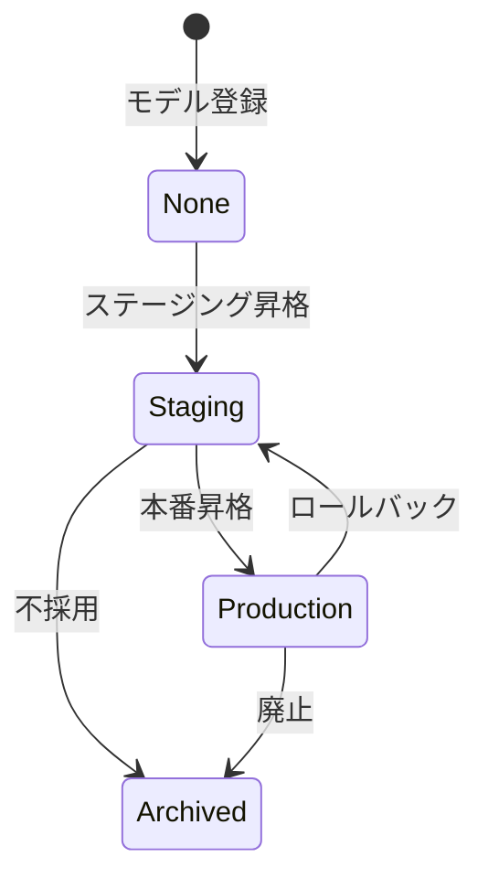

### MLflow Model Registry

MLflow Model Registry は、MLflow エコシステムの中核コンポーネントである。

```python
import mlflow

# Register a model from an experiment run
result = mlflow.register_model(
    model_uri=f"runs:/{run_id}/model",
    name="fraud-detection-model"
)

# Transition model to production
client = mlflow.tracking.MlflowClient()
client.transition_model_version_stage(
    name="fraud-detection-model",
    version=result.version,
    stage="Production"
)
```

MLflow Model Registry は REST API を備えており、CI/CD パイプラインからプログラム的にモデルのステージ遷移を制御できる。これにより、自動テストの通過を条件とした本番昇格ワークフローを構築できる。

### アーティファクト管理のベストプラクティス

モデルのアーティファクト管理において、以下の原則を守ることが重要である。

1. **不変性（Immutability）**: 一度登録されたモデルバージョンは変更不可にする。修正が必要なら新バージョンを作成する
2. **入出力スキーマの明示**: モデルが期待する入力の形式と出力の形式を明示的に記録する
3. **依存関係の固定**: モデルが依存するライブラリのバージョンを固定し、推論環境の再現性を保証する
4. **メタデータの充実**: 訓練データのバージョン、訓練パラメータ、評価メトリクスを必ず関連付ける

---

## モデルサービング

訓練したモデルを実際のアプリケーションで利用するためには、モデルを推論サービスとして公開する必要がある。モデルサービングのアプローチは、大きく**バッチ推論**と**リアルタイム推論**に分類される。

### バッチ推論 vs リアルタイム推論

| 観点 | バッチ推論 | リアルタイム推論 |
|---|---|---|
| レイテンシ要件 | 数分〜数時間 | 数ミリ秒〜数百ミリ秒 |
| スループット | 高い（大量データを一括処理） | 個別リクエストを逐次処理 |
| インフラ | Spark、Airflow などのバッチ処理基盤 | REST API、gRPC サーバー |
| ユースケース | レコメンド候補の事前計算、レポート生成、不正検知の日次スキャン | リアルタイム不正検知、チャットボット、画像認識 |
| コスト | 必要なときだけ計算リソースを起動（スポットインスタンス活用可） | 常時稼働が必要（ただしオートスケーリングで最適化可能） |

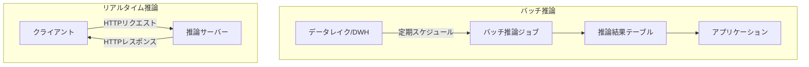

実務では、両者を組み合わせるケースも多い。例えば、レコメンデーションシステムではバッチ推論で候補を事前計算し、リアルタイム推論でユーザーの直近の行動に基づいてリランキングを行うアーキテクチャがよく採用される。

### TensorFlow Serving

TensorFlow Serving は、Google が開発した本番環境向けの ML モデルサービングシステムである。TensorFlow の SavedModel 形式に最適化されており、以下の特徴を持つ。

- **モデルのホットスワップ**: 新しいモデルバージョンを無停止で切り替えられる
- **バージョニング**: 複数のモデルバージョンを同時にホストし、リクエストごとにバージョンを指定できる
- **バッチ処理の自動化**: 個別のリクエストを内部的にバッチ化し、GPU の利用効率を最大化する
- **gRPC / REST API**: 高性能な gRPC インターフェースと、使いやすい REST API の両方を提供する

```bash
# Start TensorFlow Serving with Docker
docker run -p 8501:8501 \
  --mount type=bind,source=/models/my_model,target=/models/my_model \
  -e MODEL_NAME=my_model \
  tensorflow/serving
```

```bash
# Send a prediction request
curl -d '{"instances": [[1.0, 2.0, 5.0]]}' \
  -X POST http://localhost:8501/v1/models/my_model:predict
```

### NVIDIA Triton Inference Server

Triton は NVIDIA が開発した汎用的な推論サーバーであり、TensorFlow、PyTorch、ONNX、TensorRT など複数のフレームワークのモデルを同時にホストできる。

Triton の主要な機能は以下の通りである。

- **マルチフレームワーク対応**: 異なるフレームワークで訓練されたモデルを統一的にサービングできる
- **動的バッチング**: リクエストを自動的にバッチ化し、GPU 利用率を最大化する
- **モデルアンサンブル**: 複数のモデルをパイプラインとして連結し、一つのエンドポイントとして公開できる
- **同時実行制御**: モデルのインスタンス数を制御し、GPU メモリの効率的な割り当てを行う
- **メトリクス公開**: Prometheus 互換のメトリクスエンドポイントを提供し、モニタリングを容易にする

```
# Triton model repository structure
model_repository/
├── text_classifier/
│   ├── config.pbtxt
│   ├── 1/
│   │   └── model.onnx
│   └── 2/
│       └── model.onnx
└── image_detector/
    ├── config.pbtxt
    └── 1/
        └── model.plan
```

### BentoML

BentoML は、ML モデルのサービング・パッケージング・デプロイを簡素化するオープンソースフレームワークである。Python ファーストの設計で、データサイエンティストにとって親しみやすいインターフェースを提供する。

```python
import bentoml
from bentoml.io import JSON, NumpyNdarray

# Save model to BentoML model store
saved_model = bentoml.sklearn.save_model("iris_classifier", model)

# Define a service
runner = bentoml.sklearn.get("iris_classifier:latest").to_runner()
svc = bentoml.Service("iris_classifier_service", runners=[runner])

@svc.api(input=NumpyNdarray(), output=JSON())
async def predict(input_data):
    result = await runner.predict.async_run(input_data)
    return {"predictions": result.tolist()}
```

BentoML の特徴は以下の通りである。

- **Bento**: モデル、コード、依存関係を一つのパッケージ（Bento）にまとめ、Docker イメージとしてビルドできる
- **適応的バッチング**: リクエストの到着パターンに応じてバッチサイズを動的に調整する
- **マルチモデル推論**: 複数のモデルを一つのサービスで統合し、複雑な推論パイプラインを構築できる
- **BentoCloud**: BentoML のマネージドサービスとして、スケーリングやインフラ管理を自動化する

### サービングツールの比較と選定

| 観点 | TF Serving | Triton | BentoML |
|---|---|---|---|
| フレームワーク | TensorFlow 専用 | マルチフレームワーク | マルチフレームワーク |
| GPU 最適化 | 高い | 非常に高い | 中程度 |
| 学習コスト | 中程度 | 高い | 低い |
| カスタマイズ性 | 低い | 中程度 | 高い |
| 前後処理の統合 | 制限あり | アンサンブル機能 | Python で自由に記述 |

---

## A/B テストとカナリアリリース

モデルの品質をオフライン評価（テストデータでの精度測定）だけで判断するのは危険である。オフラインで優れた精度を示したモデルが、本番環境では期待通りの成果を上げないケースは珍しくない。これは、オフラインのテストデータが本番のトラフィック分布を完全には再現できないこと、ビジネス KPI とモデルの精度指標が必ずしも一致しないことに起因する。

### A/B テストの基本

A/B テストは、トラフィックの一部を新しいモデル（バリアント）に振り分け、既存モデル（コントロール）との間でビジネス指標を比較する手法である。

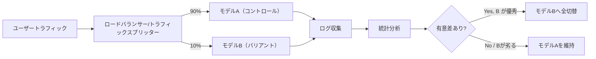

A/B テストの実施において、以下の点に注意が必要である。

- **サンプルサイズ**: 統計的に有意な結果を得るために十分なサンプル数を確保する。事前に検出力分析（power analysis）を行い、必要な期間とトラフィック量を見積もる
- **指標の選定**: 単にモデルの精度だけでなく、クリック率、コンバージョン率、収益といったビジネス KPI を主要指標とする
- **ランダム化**: ユーザーの割り当てはランダムかつ一貫性が必要。同じユーザーが異なるセッションで異なるモデルに振り分けられると、結果の解釈が困難になる
- **交絡因子の制御**: 時間帯、曜日、ユーザーセグメントなどの交絡因子を考慮した分析設計が必要

### カナリアリリース

カナリアリリースは、新モデルへのトラフィックを段階的に増やしていくデプロイ手法である。A/B テストが「どちらのモデルが優れているか」を検証する手法であるのに対し、カナリアリリースは「新モデルが問題を起こさないか」を確認する安全なデプロイ手法である。

```mermaid
gantt
    title カナリアリリースのトラフィック遷移
    dateFormat X
    axisFormat %s%%

    section モデルv1
    100%    :a1, 0, 1
    95%     :a2, 1, 2
    80%     :a3, 2, 3
    50%     :a4, 3, 4
    0%      :a5, 4, 5

    section モデルv2（カナリア）
    0%      :b1, 0, 1
    5%      :b2, 1, 2
    20%     :b3, 2, 3
    50%     :b4, 3, 4
    100%    :b5, 4, 5
```

カナリアリリースの典型的な手順は以下の通りである。

1. **初期デプロイ**: 新モデルをデプロイし、1〜5% のトラフィックを振り分ける
2. **モニタリング**: エラーレート、レイテンシ、ビジネス KPI を監視する
3. **段階的増加**: 問題がなければトラフィック比率を段階的に増やす（5% → 20% → 50% → 100%）
4. **自動ロールバック**: 異常を検知した場合、即座にトラフィックを旧モデルに戻す

Kubernetes 環境では、Istio や Argo Rollouts を使用してカナリアリリースを実装するのが一般的である。

```yaml
# Argo Rollouts example
apiVersion: argoproj.io/v1alpha1
kind: Rollout
metadata:
  name: ml-model-rollout
spec:
  strategy:
    canary:
      steps:
        - setWeight: 5
        - pause: {duration: 1h}
        - setWeight: 20
        - pause: {duration: 1h}
        - setWeight: 50
        - pause: {duration: 1h}
      canaryMetadata:
        labels:
          model-version: v2
```

### シャドーデプロイ

シャドーデプロイ（Shadow Deployment）は、新モデルにトラフィックのコピーを送信し、実際のレスポンスは旧モデルから返す手法である。新モデルの予測結果は記録されるが、ユーザーには影響しない。これにより、本番トラフィックでの性能を安全に評価できる。

シャドーデプロイは、特に以下のケースで有効である。

- 新モデルのレイテンシが本番要件を満たすか確認したい場合
- 新モデルの予測結果の分布が妥当か検証したい場合
- A/B テストの前段階として、まず安全に動作確認したい場合

---

## モデル監視

モデルをデプロイした後も、その性能が継続的に維持されている保証はない。現実世界のデータは常に変化しており、モデルの予測品質は時間とともに劣化する可能性がある。

### Data Drift（データドリフト）

Data Drift は、モデルへの入力データの分布が、訓練時のデータ分布から乖離する現象である。

例えば、EC サイトのレコメンデーションモデルを考えよう。コロナ禍では購買パターンが急激に変化し、外出関連商品の購入が激減する一方、在宅関連商品の購入が急増した。このような分布の変化は、訓練時のデータには反映されていないため、モデルの予測精度が低下する。

Data Drift の検出手法には以下がある。

- **統計的検定**: Kolmogorov-Smirnov 検定、chi-squared 検定、Population Stability Index（PSI）
- **分布間距離**: KL ダイバージェンス、Jensen-Shannon ダイバージェンス、Wasserstein 距離
- **ウィンドウベースの比較**: 直近のデータウィンドウと訓練データの統計量を比較する

### Concept Drift（コンセプトドリフト）

Concept Drift は、入力データと正解ラベルの関係（概念）自体が変化する現象である。Data Drift が入力の分布変化であるのに対し、Concept Drift は入力と出力の対応関係の変化である。

例えば、スパムフィルタを考えよう。スパマーは常に手法を進化させるため、以前はスパムでなかった文面パターンが新たにスパムとして使われるようになる。これは入力データの分布変化ではなく、「何がスパムか」という概念自体の変化である。

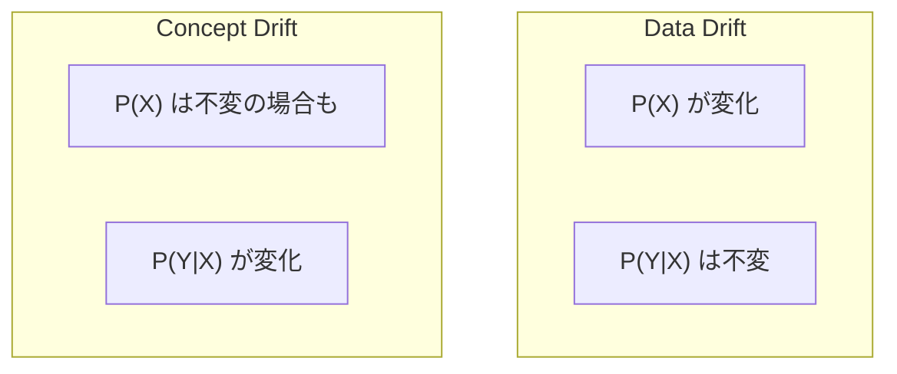

### Performance Degradation（性能劣化）

Data Drift や Concept Drift の結果として、モデルの予測性能が劣化する。これを検出するためには、以下のモニタリング体制が必要である。

- **予測品質メトリクス**: 正解ラベルが得られる場合（遅延はあるが最終的に判明する場合）、精度・再現率・F1 スコアなどを継続的に計測する
- **プロキシメトリクス**: 正解ラベルがすぐに得られない場合、予測の確信度分布やクリック率などの代理指標を監視する
- **ビジネス KPI**: コンバージョン率、収益、ユーザー満足度などのビジネス指標の変動を監視する

### モニタリングツール

ML モデルの監視に特化したツールとして、以下のようなものがある。

- **Evidently AI**: Data Drift、Concept Drift、モデル性能の監視をダッシュボードで可視化するオープンソースツール
- **NannyML**: 正解ラベルなしでモデル性能の劣化を推定する CBPE（Confidence-Based Performance Estimation）アルゴリズムを実装
- **Prometheus + Grafana**: 汎用のメトリクス基盤を ML メトリクスの収集・可視化に活用する
- **Amazon SageMaker Model Monitor**: AWS のマネージドサービスとして、Data Drift の自動検出とアラートを提供

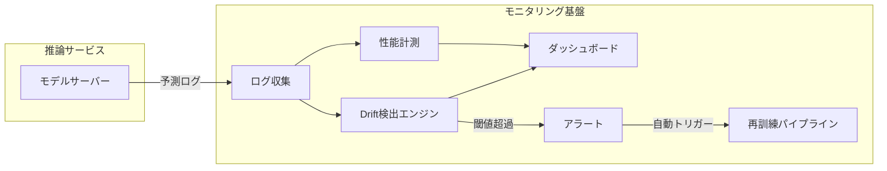

### モニタリングのベストプラクティス

1. **ベースラインの設定**: デプロイ時のモデル性能と入力データの分布をベースラインとして記録する
2. **多層的な監視**: インフラレベル（レイテンシ、エラーレート）、データレベル（特徴量の分布）、モデルレベル（予測品質）の 3 層で監視する
3. **アラートの段階化**: 軽微なドリフトは通知のみ、重大な劣化は自動的に再訓練パイプラインをトリガーする
4. **根本原因分析**: ドリフトを検出したら、どの特徴量が最も変化しているかを分析し、対処方法を判断する

---

## 特徴量ストアとの連携

MLOps パイプラインにおいて、特徴量ストアは訓練とサービングの間の**一貫性を保証する**重要なコンポーネントである。

### Training-Serving Skew の問題

ML システムにおける最も深刻な問題の一つが **Training-Serving Skew**（訓練時と推論時の不整合）である。訓練時に Python のスクリプトで特徴量を計算し、推論時には Java のマイクロサービスで同じ計算を再実装するケースを考えよう。二つの実装の間に微妙な不整合が生じると、モデルの予測品質が著しく劣化する。

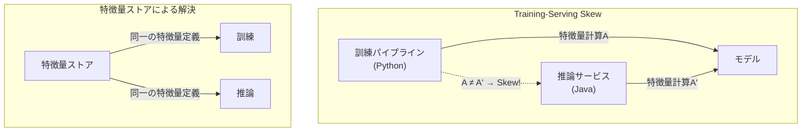

### 特徴量ストアの MLOps パイプラインへの統合

特徴量ストアは以下のように MLOps パイプラインに統合される。

1. **特徴量の定義と登録**: 特徴量の計算ロジックをコードとして定義し、特徴量ストアに登録する
2. **オフラインストア**: バッチ処理で計算された特徴量を保管し、訓練データの作成に使用する
3. **オンラインストア**: リアルタイム推論に必要な最新の特徴量値を低レイテンシで提供する
4. **特徴量サービング**: 推論リクエスト時に、モデルが必要とする特徴量をオンラインストアから取得する

代表的な特徴量ストアとして、Feast（オープンソース）、Tecton（マネージドサービス）、Amazon SageMaker Feature Store、Vertex AI Feature Store などがある。

---

## CI/CD パイプラインと ML パイプラインの統合

従来のソフトウェア開発における CI/CD（Continuous Integration / Continuous Delivery）を ML に適用するには、データとモデルの特性を考慮した拡張が必要である。

### ML における CI/CD の拡張

ML の CI/CD は、従来の CI/CD に加えて以下の要素を含む。

- **CT（Continuous Training）**: データの変化やスケジュールに基づいて、モデルの再訓練を自動的にトリガーする
- **CD（Continuous Delivery）**: 訓練されたモデルを自動的に推論サービスにデプロイする
- **CM（Continuous Monitoring）**: デプロイ後のモデルの性能を継続的に監視する

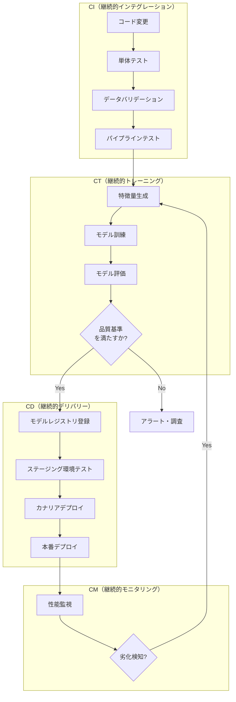

### ML パイプラインオーケストレーション

ML パイプラインを構築・実行するためのオーケストレーションツールとして、以下のようなものがある。

**Kubeflow Pipelines** は、Kubernetes 上で ML パイプラインを構築・実行するためのプラットフォームである。各ステップをコンテナとして実行し、パイプライン全体を DAG（有向非巡回グラフ）として管理する。

**Vertex AI Pipelines / SageMaker Pipelines** は、各クラウドベンダーが提供するマネージドな ML パイプラインサービスである。インフラの管理を最小限に抑えながら、エンドツーエンドの ML パイプラインを構築できる。

**ZenML** は、ML パイプラインを Python で宣言的に記述し、任意のインフラ（ローカル、Kubernetes、クラウドサービス）にデプロイできるフレームワークである。

### テスト戦略

ML パイプラインにおけるテストは、以下の階層で構成する。

1. **データテスト**: 入力データのスキーマ・分布・品質を検証する（Great Expectations、Pandera など）
2. **特徴量テスト**: 特徴量の計算ロジックの正しさと、欠損値・異常値の処理を検証する
3. **モデルテスト**: モデルの精度がベースラインを上回るか、特定のスライス（サブグループ）で性能が極端に低下していないかを検証する
4. **インフラテスト**: 推論サーバーのレイテンシ、スループット、エラーレートを負荷テストで検証する
5. **統合テスト**: パイプライン全体をエンドツーエンドで実行し、各ステップ間のデータの受け渡しが正しく行われるかを検証する

---

## 組織と成熟度モデル

MLOps の導入は技術的な取り組みであると同時に、組織的な変革でもある。Google は MLOps の成熟度を 3 段階で定義しており、これは組織がどの段階にいるかを把握し、次のステップを計画するための有用なフレームワークである。

### Google MLOps Maturity Levels

**Level 0: 手動プロセス**

すべてが手動で行われる段階である。

- データサイエンティストが手動でデータを準備し、モデルを訓練する
- 実験管理は個人のノートやスプレッドシートに依存する
- モデルのデプロイは手動でサーバーにコピーするか、エンジニアに依頼する
- モデルの監視は行われない
- 訓練と推論のコードが分離している

この段階は、ML の PoC（概念実証）やプロトタイプ開発には十分であるが、本番運用には適さない。

**Level 1: ML パイプライン自動化**

訓練パイプラインが自動化される段階である。

- CT（Continuous Training）が実現される：新しいデータが到着すると、自動的にモデルが再訓練される
- パイプラインのコンポーネントがモジュール化され、再利用可能になる
- 特徴量ストアを活用し、Training-Serving Skew を防止する
- モデルのパフォーマンスが監視され、再訓練のトリガーが自動化される
- 訓練と推論で同じコード（パイプライン）を共有する

**Level 2: CI/CD パイプライン自動化**

パイプライン自体の開発・デプロイが自動化される段階である。

- パイプラインのコードに対する CI（自動テスト、静的解析）が実施される
- パイプラインの新バージョンが自動的にデプロイされる
- A/B テストやカナリアリリースにより、モデルの段階的なロールアウトが行われる
- モデルの系譜が完全に追跡可能で、監査対応が容易
- すべてのプロセスがバージョン管理下にあり、完全に再現可能

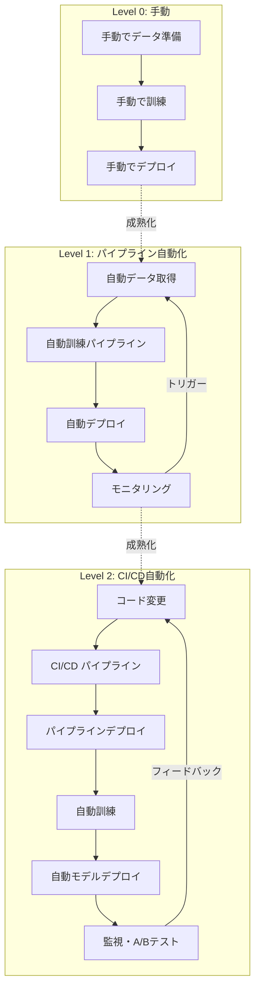

### 組織構造とチームトポロジー

MLOps の成熟度を高めるには、適切な組織構造も重要である。

- **フルスタック ML チーム**: データサイエンティスト、ML エンジニア、データエンジニアが一つのチームに所属し、エンドツーエンドで ML システムを運用する。小〜中規模の組織に適している
- **プラットフォーム + ドメインチーム**: ML プラットフォームチームが共通基盤（実験管理、モデルレジストリ、サービング基盤）を提供し、ドメインチームがビジネス固有のモデルを開発する。大規模組織に適している
- **センターオブエクセレンス（CoE）**: MLOps のベストプラクティスやツールチェーンを標準化し、各チームに横断的にサポートを提供する

---

## MLOps プラットフォームの全体像

ここまで個別のコンポーネントを解説してきたが、最後にこれらがどのように統合されるかを全体像として示す。

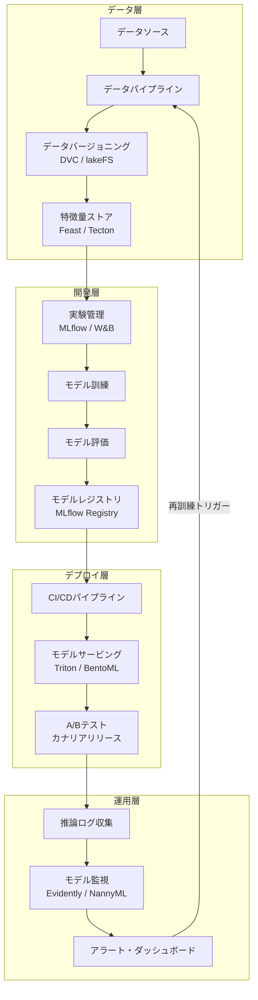

### ツールの組み合わせ例

組織の規模や成熟度に応じて、以下のような組み合わせが現実的である。

**スタートアップ / 小規模チーム向け**:
- 実験管理: W&B（SaaS で運用負荷ゼロ）
- データバージョニング: DVC
- モデルサービング: BentoML + Cloud Run
- 監視: Evidently AI + Grafana

**中規模チーム向け**:
- 実験管理: MLflow（セルフホスト）
- データバージョニング: DVC + S3
- モデルサービング: Triton + Kubernetes
- モデルレジストリ: MLflow Model Registry
- 監視: Prometheus + Grafana + カスタムダッシュボード

**大規模組織 / エンタープライズ向け**:
- クラウドマネージドプラットフォーム: Vertex AI / SageMaker
- 特徴量ストア: Tecton / Vertex AI Feature Store
- モデルサービング: Triton + Kubernetes + Istio
- CI/CD: Kubeflow Pipelines
- 監視: フルスタックオブザーバビリティ基盤

---

## 実践上の課題と教訓

MLOps を導入する上で、現場で頻繁に直面する課題と、それに対する実践的な教訓を述べる。

### 過度なツール導入の罠

MLOps エコシステムは急速に拡大しており、毎年多数のツールが登場している。しかし、すべてのツールを導入しようとするのは逆効果である。重要なのは、**現在の成熟度に適したツール**を選択し、段階的に拡張していくことである。Level 0 の組織がいきなり Level 2 のツールスタックを導入しても、運用できずに形骸化する。

### モデルの再訓練頻度

「どの程度の頻度でモデルを再訓練すべきか」は、ドメインとデータの特性に依存する。金融不正検知のように環境が急速に変化するドメインでは日次〜週次の再訓練が必要になる場合がある一方、画像分類のようにドメインが比較的安定している場合は月次〜四半期ごとで十分なこともある。モニタリングの結果に基づいてデータドリブンに再訓練頻度を決定するのが理想的である。

### ガバナンスとコンプライアンス

金融、医療、法律など規制の厳しい業界では、モデルの説明可能性（Explainability）と監査可能性（Auditability）が求められる。MLOps 基盤は以下を提供する必要がある。

- モデルの系譜（どのデータ・コード・パラメータから生まれたか）の完全な追跡
- モデルの判断根拠の説明（SHAP、LIME などの説明可能性ツールとの統合）
- アクセス制御と変更履歴の記録
- モデルカードやデータシートによる文書化

### GPU リソースの効率的な活用

ML ワークロードはしばしば GPU を必要とするが、GPU リソースは高価である。MLOps 基盤では、以下のようなリソース効率化が重要になる。

- **スポットインスタンスの活用**: 訓練ジョブはチェックポイントを適切に保存し、中断からの再開を可能にする
- **GPU 共有**: Triton の動的バッチングや、Kubernetes の GPU タイムスライシングにより、GPU の利用率を高める
- **自動スケーリング**: 推論トラフィックに応じて GPU インスタンスを自動的にスケールイン/スケールアウトする

---

## まとめ

MLOps は、ML モデルの開発から本番運用までのライフサイクルを体系的に管理するための工学的規律である。その範囲は広く、実験管理、データバージョニング、モデルレジストリ、モデルサービング、A/B テスト、モニタリング、CI/CD パイプラインなど多岐にわたる。

重要なのは、MLOps を「ツールの導入」として捉えるのではなく、「ML システムの信頼性と生産性を向上させるための継続的なプロセス改善」として捉えることである。Google の成熟度モデルが示すように、手動プロセスから始めて段階的に自動化を進めていくアプローチが現実的であり、最終的には ML パイプラインの開発・デプロイ・運用がシームレスに統合された状態を目指す。

ML がビジネスの中核を担う領域がますます拡大する中で、MLOps の重要性は今後さらに高まっていくだろう。モデルの精度を追求するだけでなく、そのモデルを安定的かつ継続的に運用できる基盤を構築することが、ML プロジェクトの成功にとって不可欠である。
