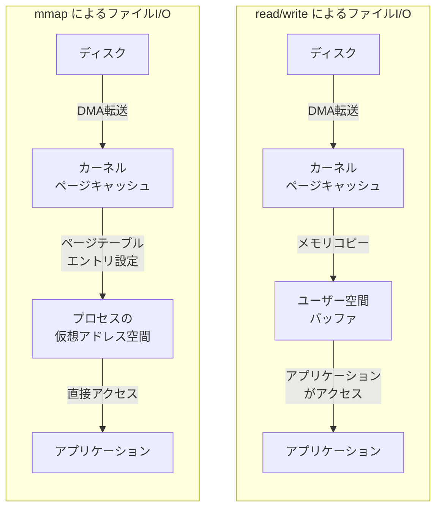
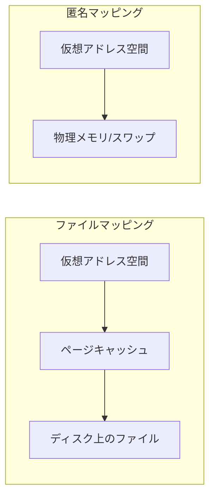
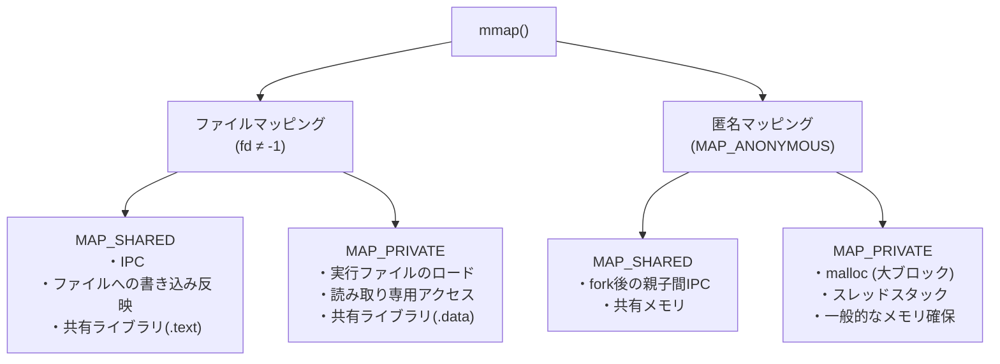
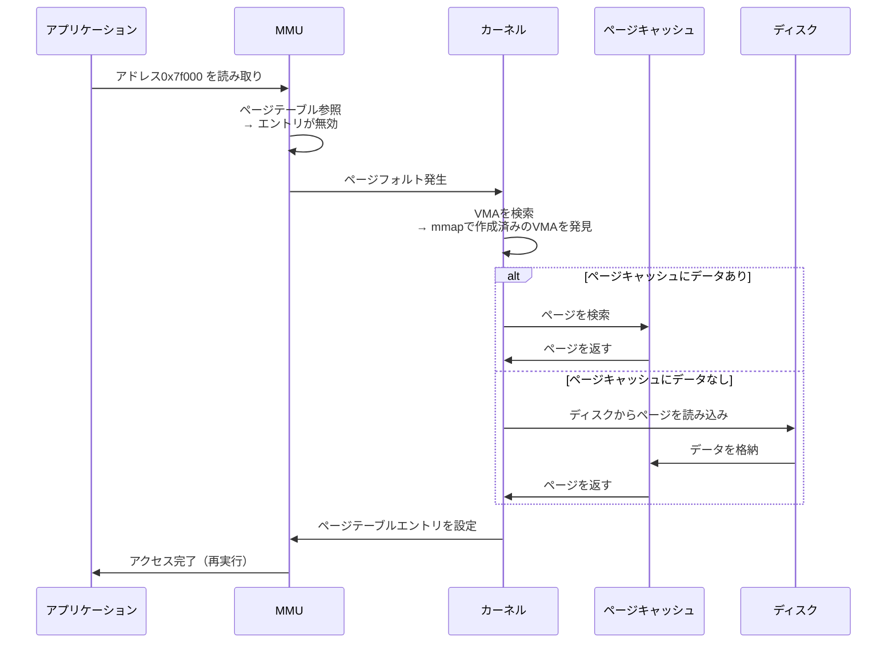
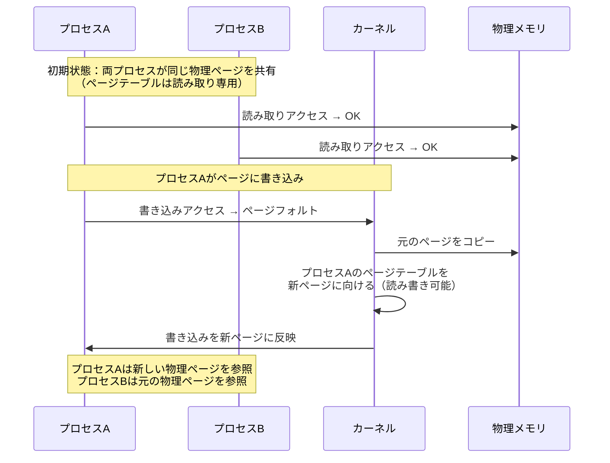
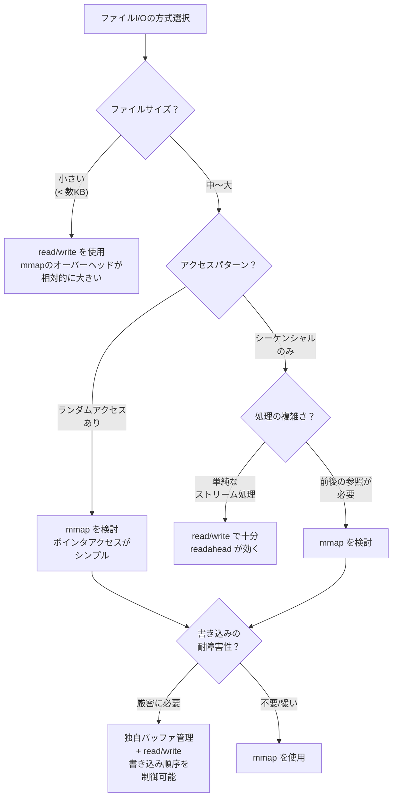

# mmap — メモリマップドI/Oの仕組みと応用

## 1. mmapの基本概念

### 1.1 mmapとは何か

`mmap`（memory-mapped I/O）は、ファイルやデバイスの内容をプロセスの仮想アドレス空間に直接マッピングするシステムコールである。通常のファイルI/O（`read`/`write`）がカーネルバッファとユーザー空間バッファの間でデータをコピーするのに対し、`mmap`はファイルの内容をあたかもメモリ上の配列であるかのようにアクセスできるようにする。

この仕組みが解決する根本的な問題は、**ファイルI/Oにおけるデータコピーのオーバーヘッド**と**プログラミングモデルの複雑さ**である。従来の`read`/`write`によるI/Oでは、カーネルのページキャッシュからユーザー空間バッファへのメモリコピーが必ず発生し、大きなファイルを扱う場合にこのコピーコストが無視できなくなる。`mmap`を使えば、ページキャッシュをプロセスのアドレス空間に直接マッピングするため、このコピーを省略できる。

### 1.2 mmapの歴史的背景

`mmap`の概念は1970年代の仮想メモリ研究に遡る。初期のUnixシステムでは`read`/`write`がファイルアクセスの唯一の手段だったが、1983年にリリースされた**4.2BSD**が`mmap`のプロトタイプを導入し、その後**SunOS 4.0**（1988年）で本格的に実装された。POSIX標準にも取り込まれ、現在ではLinux、macOS、FreeBSD、Windowsなど主要なOSすべてが`mmap`（Windowsでは`CreateFileMapping`/`MapViewOfFile`）をサポートしている。

`mmap`の設計思想の背景には、Unixの「すべてはファイルである」という哲学がある。ファイルの内容をメモリとして扱えるようにすることで、プログラマはポインタ演算だけでファイルの任意の位置にアクセスでき、明示的な`seek`/`read`の組み合わせから解放される。

### 1.3 mmapのシステムコールインターフェース

POSIX準拠のシステムにおける`mmap`のシステムコールのプロトタイプは以下の通りである。

```c
#include <sys/mman.h>

void *mmap(
    void *addr,    // desired mapping address (usually NULL)
    size_t length, // length of the mapping
    int prot,      // memory protection flags
    int flags,     // mapping type and options
    int fd,        // file descriptor
    off_t offset   // offset in the file
);

int munmap(void *addr, size_t length); // unmap a region
```

各引数の役割を整理する。

| 引数 | 説明 |
|------|------|
| `addr` | マッピングの配置先アドレスのヒント。通常は`NULL`を指定し、カーネルに最適なアドレスを選択させる |
| `length` | マッピングするサイズ（バイト単位）。ページサイズの倍数に切り上げられる |
| `prot` | アクセス保護。`PROT_READ`、`PROT_WRITE`、`PROT_EXEC`、`PROT_NONE`の組み合わせ |
| `flags` | マッピングの種類。`MAP_SHARED`、`MAP_PRIVATE`、`MAP_ANONYMOUS`など |
| `fd` | マッピングするファイルのファイルディスクリプタ。匿名マッピングの場合は`-1` |
| `offset` | ファイル内のオフセット。ページサイズの倍数でなければならない |

成功すると、マッピングされた領域の先頭アドレスが返される。失敗すると`MAP_FAILED`（`(void *)-1`）が返される。

### 1.4 従来のread/writeとmmapの比較

従来のファイルI/Oと`mmap`のデータフローの違いを図示する。



`read`/`write`では、カーネルのページキャッシュからユーザー空間バッファへのメモリコピーが1回（`write`の場合は逆方向にもう1回）必要となる。一方、`mmap`ではページキャッシュのページをプロセスの仮想アドレス空間に直接マッピングするため、このコピーが不要となる。

以下に、両方のアプローチでファイルを読み込む簡単なコード例を示す。

::: code-group

```c [read/write]
#include <fcntl.h>
#include <unistd.h>
#include <stdlib.h>
#include <stdio.h>

int main() {
    int fd = open("data.bin", O_RDONLY);
    if (fd < 0) { perror("open"); return 1; }

    // Allocate a user-space buffer
    char *buf = malloc(4096);
    if (!buf) { perror("malloc"); return 1; }

    // Copy data from kernel page cache to user buffer
    ssize_t n = read(fd, buf, 4096);
    if (n < 0) { perror("read"); return 1; }

    // Access data through the buffer
    printf("First byte: 0x%02x\n", (unsigned char)buf[0]);

    free(buf);
    close(fd);
    return 0;
}
```

```c [mmap]
#include <fcntl.h>
#include <sys/mman.h>
#include <sys/stat.h>
#include <stdio.h>
#include <unistd.h>

int main() {
    int fd = open("data.bin", O_RDONLY);
    if (fd < 0) { perror("open"); return 1; }

    struct stat st;
    fstat(fd, &st);

    // Map the file directly into the process address space
    char *mapped = mmap(NULL, st.st_size, PROT_READ, MAP_PRIVATE, fd, 0);
    if (mapped == MAP_FAILED) { perror("mmap"); return 1; }

    // Access data directly — no copy needed
    printf("First byte: 0x%02x\n", (unsigned char)mapped[0]);

    munmap(mapped, st.st_size);
    close(fd);
    return 0;
}
```

:::

## 2. ファイルマッピングと匿名マッピング

`mmap`のマッピングは、バックエンドのストレージに基づいて**ファイルマッピング**と**匿名マッピング**の2種類に大別される。

### 2.1 ファイルマッピング（file-backed mapping）

ファイルマッピングは、ディスク上のファイルをメモリにマッピングする方式である。ファイルディスクリプタ`fd`とオフセット`offset`を指定し、ファイルの内容をプロセスのアドレス空間にマッピングする。

```c
// Map the first 1MB of a file
int fd = open("largefile.dat", O_RDWR);
void *ptr = mmap(NULL, 1024 * 1024, PROT_READ | PROT_WRITE, MAP_SHARED, fd, 0);
```

ファイルマッピングの特徴は以下の通りである。

- マッピングされた領域へのアクセスは、カーネルのページキャッシュを通じてファイルの内容を読み書きする
- `MAP_SHARED`の場合、マッピングへの書き込みはファイルに反映される（後述）
- ファイルの内容はデマンドページングにより必要になった時点で読み込まれる
- `mmap`呼び出し後に`close(fd)`を呼んでもマッピングは有効なまま保持される。ファイルディスクリプタはマッピング確立時にのみ必要であり、それ以降はカーネル内部でファイルへの参照が保持される

### 2.2 匿名マッピング（anonymous mapping）

匿名マッピングは、ファイルに裏付けられないメモリ領域を確保する方式である。`MAP_ANONYMOUS`（Linuxでは`MAP_ANON`も同義）フラグを使用し、`fd`には`-1`を渡す。

```c
// Allocate 64KB of anonymous memory
void *ptr = mmap(NULL, 64 * 1024, PROT_READ | PROT_WRITE,
                 MAP_PRIVATE | MAP_ANONYMOUS, -1, 0);
```

匿名マッピングの主な用途は以下の通りである。

- **ヒープメモリの割り当て**: `malloc`の内部実装で、大きなブロックの割り当てに`mmap`が使われる。glibcでは通常128KB以上の`malloc`要求に対して`mmap`が使用される（`M_MMAP_THRESHOLD`で閾値を調整可能）
- **スタック領域の確保**: スレッドのスタック領域の確保にも使われる
- **プロセス間のゼロ初期化された共有メモリ**: `MAP_SHARED | MAP_ANONYMOUS`で確保すると、`fork`で生成された子プロセスとメモリを共有できる



### 2.3 ファイルマッピングと匿名マッピングの比較

| 特性 | ファイルマッピング | 匿名マッピング |
|------|-------------------|----------------|
| バックストア | ディスク上のファイル | スワップ領域（またはなし） |
| `fd`引数 | 有効なファイルディスクリプタ | `-1` |
| `flags` | `MAP_SHARED`または`MAP_PRIVATE` | `MAP_ANONYMOUS`と組み合わせ |
| 初期内容 | ファイルの内容 | ゼロで初期化 |
| 永続化 | `MAP_SHARED`の場合ファイルに反映 | プロセス終了で消失 |
| 主な用途 | ファイルの読み書き、共有ライブラリ | メモリ割り当て、IPC |

## 3. 共有マッピングとプライベートマッピング

`mmap`のもう1つの重要な分類軸が、**共有マッピング**（`MAP_SHARED`）と**プライベートマッピング**（`MAP_PRIVATE`）の区別である。

### 3.1 共有マッピング（MAP_SHARED）

共有マッピングでは、マッピングされた領域への書き込みが**他のプロセスからも見える**ようになる。ファイルマッピングの場合、書き込みはファイルにも反映される。

```c
// Process A
void *ptr_a = mmap(NULL, 4096, PROT_READ | PROT_WRITE, MAP_SHARED, fd, 0);

// Process B (same file, same offset)
void *ptr_b = mmap(NULL, 4096, PROT_READ | PROT_WRITE, MAP_SHARED, fd, 0);

// Write in Process A
((char *)ptr_a)[0] = 'X';

// Process B can see the change
// ((char *)ptr_b)[0] == 'X'  -> true
```

共有マッピングの典型的な用途を挙げる。

- **プロセス間通信（IPC）**: 複数のプロセスが同じファイルを`MAP_SHARED`でマッピングすることで、高速なプロセス間通信を実現できる。ソケットやパイプと異なり、データコピーが一切発生しない
- **共有ライブラリのコード領域**: `.so`ファイル（共有ライブラリ）のコードセクションは`MAP_SHARED`でマッピングされる。これにより、同じライブラリを使用する複数のプロセスがコードの物理ページを共有し、メモリ使用量を大幅に削減できる
- **データベースのバッファ管理**: 一部のデータベースシステム（SQLiteなど）がファイルアクセスに使用する

ファイルバックの共有マッピングにおいて、書き込みがファイルに反映されるタイミングはカーネルの実装に依存する。即座に反映されるとは限らず、ページキャッシュのダーティページとしてマークされ、カーネルのフラッシュ機構（`pdflush`/`writeback`スレッド）が後からディスクに書き出す。`msync`システムコールで明示的にディスクへの同期を強制できる。

```c
// Force dirty pages to be written to disk
msync(ptr, length, MS_SYNC);  // synchronous flush
msync(ptr, length, MS_ASYNC); // asynchronous flush (schedule writeback)
```

### 3.2 プライベートマッピング（MAP_PRIVATE）

プライベートマッピングでは、マッピングされた領域への書き込みが**そのプロセスだけに見える**ようになる。ファイルマッピングの場合でも、書き込みはファイルには反映されない。これは**Copy-on-Write（CoW）**メカニズムによって実現される（詳細は第5章で解説する）。

```c
// MAP_PRIVATE: writes are private to this process
void *ptr = mmap(NULL, 4096, PROT_READ | PROT_WRITE, MAP_PRIVATE, fd, 0);

// This modification does NOT affect the underlying file
((char *)ptr)[0] = 'Z';
```

プライベートマッピングの典型的な用途を挙げる。

- **実行ファイルのロード**: プログラムのコードセクションとデータセクションは`MAP_PRIVATE`でマッピングされる。データセクション（グローバル変数など）は実行中に書き換えられるが、元のファイルには影響しない
- **共有ライブラリのデータ領域**: `.so`ファイルのデータセクション（`.data`、`.bss`）は`MAP_PRIVATE`でマッピングされる。各プロセスが独自のコピーを持つ
- **ファイルの読み取り専用アクセス**: 書き込みをしない前提でファイルを読む場合、`MAP_PRIVATE`でも`MAP_SHARED`でも動作に違いはないが、誤って書き込んだ場合のセーフティネットとして`MAP_PRIVATE`が使われることがある

### 3.3 マッピング種別の全体像



4つの組み合わせそれぞれに明確なユースケースがある。特に重要なのは、`MAP_PRIVATE`でファイルをマッピングしても、読み取りのみであれば物理ページは他のプロセスと共有される点である。書き込みが発生して初めてCoWによるコピーが行われる。

## 4. ページフォルトとデマンドページング

### 4.1 mmapとページフォルトの関係

`mmap`を呼び出した直後には、物理メモリの割り当てもファイルからのデータの読み込みも行われない。カーネルは仮想メモリ領域（VMA: Virtual Memory Area）のメタデータを作成するだけである。実際のデータの読み込みは、プロセスがマッピングされた領域にアクセスした時に発生する**ページフォルト**によって駆動される。

これが**デマンドページング**の仕組みであり、`mmap`の効率性の根幹を成す。

### 4.2 ページフォルトの処理フロー

プロセスがマッピングされた領域の特定のアドレスにアクセスしたときの処理フローを示す。



この流れを詳細に説明する。

1. **MMUによるアドレス変換の試行**: プロセスがマッピング領域内のアドレスにアクセスすると、CPU内のMMU（Memory Management Unit）がページテーブルを参照する。`mmap`直後はページテーブルエントリが存在しない（あるいはPresentビットが0）ため、ページフォルト例外が発生する

2. **カーネルのページフォルトハンドラ**: カーネルはフォルトが発生したアドレスを基に、プロセスのVMAリスト（Linuxでは`mm_struct`内の`vm_area_struct`のリスト/ツリー）を検索する。対応するVMAが見つかれば正当なアクセスであり、見つからなければ`SIGSEGV`（セグメンテーションフォルト）が送信される

3. **ページの取得**: ファイルマッピングの場合、カーネルはまずページキャッシュを検索する。該当ページがページキャッシュに存在すれば（他のプロセスが既に読み込んでいた場合など）、ディスクI/Oは発生しない。存在しない場合のみ、ファイルシステムを通じてディスクから読み込まれる

4. **ページテーブルの更新**: 取得したページの物理アドレスをページテーブルエントリに設定し、適切なアクセス権限（読み取り専用、読み書き可能など）を設定する

5. **命令の再実行**: ページフォルトを引き起こした命令が再実行され、今度はページテーブルの変換が成功してアクセスが完了する

### 4.3 マイナーフォルトとメジャーフォルト

ページフォルトは、ディスクI/Oの発生有無によって2種類に分類される。

- **マイナーフォルト（minor fault / soft fault）**: ページキャッシュに既にデータが存在する場合に発生する。ページテーブルエントリの設定だけで完了するため、高速に処理される（数マイクロ秒）
- **メジャーフォルト（major fault / hard fault）**: ページキャッシュにデータが存在せず、ディスクからの読み込みが必要な場合に発生する。ディスクI/Oを伴うため、処理に数ミリ秒〜数十ミリ秒かかる

`mmap`のパフォーマンスはメジャーフォルトの発生頻度に大きく左右される。ランダムアクセスパターンが多い場合、ページキャッシュのミスが頻発し、パフォーマンスが大幅に低下する可能性がある。

### 4.4 先読み（readahead）

カーネルはシーケンシャルなアクセスパターンを検出すると、**先読み（readahead）**を行う。現在アクセスされたページの後続のページを事前にディスクから読み込んでページキャッシュに格納する。これにより、次のアクセス時にはマイナーフォルトで済むようになる。

Linuxでは、`madvise`システムコールでアクセスパターンのヒントをカーネルに伝えることができる。

```c
// Hint: sequential access pattern
madvise(ptr, length, MADV_SEQUENTIAL);

// Hint: random access pattern
madvise(ptr, length, MADV_RANDOM);

// Hint: will need this data soon
madvise(ptr, length, MADV_WILLNEED);

// Hint: will not need this data anymore
madvise(ptr, length, MADV_DONTNEED);
```

`MADV_SEQUENTIAL`を指定すると、カーネルは積極的な先読みを行い、読み終わったページをすぐに解放する。`MADV_RANDOM`を指定すると、先読みを無効化する。これらのヒントを適切に設定することで、`mmap`のパフォーマンスを大幅に改善できる。

## 5. Copy-on-Write（CoW）

### 5.1 CoWの基本原理

Copy-on-Write（CoW）は、`MAP_PRIVATE`マッピングやプロセスの`fork`で使用される最適化技術である。複数のプロセスが同じ物理ページを共有しつつ、書き込みが発生した時に初めてページのコピーを作成する。

CoWの動作原理は以下の通りである。

1. `MAP_PRIVATE`でファイルをマッピングする（あるいは`fork`でプロセスを複製する）
2. 対象のページテーブルエントリは**読み取り専用**に設定される
3. 読み取りアクセスは通常通り処理される（全プロセスが同じ物理ページを共有）
4. 書き込みアクセスが発生すると、ページフォルトが発生する（読み取り専用のページに書き込もうとしたため）
5. カーネルのフォルトハンドラがCoWフォルトであることを判定し、元のページのコピーを作成する
6. コピーされた新しいページに書き込み内容を反映し、ページテーブルを更新する
7. 元のページは他のプロセスから引き続き共有されたままである

### 5.2 CoWの処理フロー



### 5.3 CoWの応用場面

CoWは以下の場面で活用される。

**fork()の高速化**: `fork`は親プロセスのアドレス空間をすべてコピーする必要があるが、CoWにより実際のメモリコピーは書き込みが発生するまで遅延される。`fork`直後に`exec`を呼ぶ典型的なパターンでは、ほとんどのページが実際にはコピーされずに済む。

**共有ライブラリのデータセクション**: 複数のプロセスが同じ共有ライブラリを使用する場合、そのデータセクション（`.data`）は`MAP_PRIVATE`でマッピングされる。各プロセスがグローバル変数に書き込むまで、データセクションの物理ページは共有されたままである。

**スナップショット機能**: 一部のファイルシステム（Btrfs、ZFS）やデータベース（Redisの`BGSAVE`）は、CoWの原理を利用してスナップショットを効率的に作成する。

### 5.4 CoWの注意点

CoWは効率的な仕組みだが、注意すべき点もある。

- **書き込みのレイテンシの不均一性**: CoWフォルトが発生する最初の書き込みは、通常の書き込みよりも遅い。リアルタイム性が求められるシステムでは、この不均一性が問題になりうる
- **メモリの過剰コミット**: CoWにより、`fork`直後の見かけ上のメモリ使用量は少ないが、子プロセスが親プロセスのデータに書き込みを始めると、物理メモリの使用量が急増する。Linuxのovercommit設定（`/proc/sys/vm/overcommit_memory`）との相互作用に注意が必要である

## 6. mmapのメリットとデメリット

### 6.1 メリット

**1. データコピーの削減**

`read`/`write`で必要なカーネル空間からユーザー空間へのデータコピーを省略できる。特に大きなファイルを扱う場合、この差は大きい。

**2. ランダムアクセスの効率性**

`mmap`でマッピングすれば、ファイルの任意の位置にポインタ演算でアクセスできる。`lseek` + `read`の組み合わせが不要になり、コードがシンプルになる。

**3. メモリの自動管理**

ページの読み込みと解放はカーネルが自動的に行う。アプリケーション側で明示的なバッファ管理を実装する必要がない。物理メモリが不足すれば、カーネルがマッピングされたページを自動的にページアウトする。

**4. プロセス間のメモリ共有**

`MAP_SHARED`によるプロセス間通信は、ソケットやパイプよりも高速である。データのコピーが一切発生しないため、大量のデータを共有する場合に特に有効である。

**5. 共有ライブラリによるメモリ効率**

同じ共有ライブラリを使用する複数のプロセスがコードの物理ページを共有できる。デスクトップ環境のように多数のプロセスが同じライブラリ（glibc、GTK、Qtなど）を使用する場合、メモリの節約効果は非常に大きい。

### 6.2 デメリット

**1. ページサイズの粒度**

`mmap`はページ単位（通常4KB）でしか操作できない。小さなファイルをマッピングしても最低4KBの仮想アドレス空間が消費される。多数の小さなファイルをマッピングすると、アドレス空間の断片化やVMAのオーバーヘッドが問題になりうる。

**2. エラーハンドリングの困難さ**

`read`/`write`ではI/Oエラーが戻り値として返されるため、エラーハンドリングが直感的である。一方、`mmap`ではI/Oエラー（ディスク障害、ネットワークファイルシステムの切断など）がページフォルト時に`SIGBUS`シグナルとして通知されるため、適切なハンドリングが難しい。

```c
#include <signal.h>
#include <setjmp.h>

static sigjmp_buf jmpbuf;

void sigbus_handler(int sig) {
    // Cannot easily determine which mmap region caused the fault
    siglongjmp(jmpbuf, 1);
}

void safe_mmap_access(void *ptr, size_t len) {
    struct sigaction sa = { .sa_handler = sigbus_handler };
    sigaction(SIGBUS, &sa, NULL);

    if (sigsetjmp(jmpbuf, 1) == 0) {
        // Access the mapped region
        volatile char c = ((char *)ptr)[0];
    } else {
        // Handle SIGBUS — I/O error occurred
        fprintf(stderr, "I/O error accessing mapped region\n");
    }
}
```

**3. 32ビット環境でのアドレス空間制限**

32ビットプロセスのアドレス空間は最大4GB（ユーザー空間は通常3GB）であるため、大きなファイルをマッピングするとアドレス空間が枯渇する。64ビット環境ではこの制約はほぼ解消されている（理論上128TBまでのアドレス空間が使用可能）。

**4. TLBの圧迫**

大規模な`mmap`マッピングは多数のページテーブルエントリを必要とし、TLB（Translation Lookaside Buffer）のミスが増加する可能性がある。この問題はHuge Pages（2MB/1GBページ）の使用で軽減できる。

```c
// Use huge pages (Linux-specific)
void *ptr = mmap(NULL, 2 * 1024 * 1024, PROT_READ | PROT_WRITE,
                 MAP_PRIVATE | MAP_ANONYMOUS | MAP_HUGETLB, -1, 0);
```

**5. アクセスパターンによるパフォーマンスの不確実性**

`mmap`のパフォーマンスはページフォルトの発生パターンに依存する。ランダムアクセスが多い場合、メジャーフォルトが多発し、`read`による明示的なI/Oよりも遅くなることがある。ページフォルトの処理には割り込みコンテキストの切り替えが伴うため、1回あたりのオーバーヘッドは`read`の1回のシステムコールよりも大きい場合がある。

## 7. データベースでの活用

`mmap`はデータベースシステムにおいて重要な役割を果たしているが、その採用については活発な議論がある。

### 7.1 mmapを活用するデータベース

いくつかの著名なデータベースシステムが`mmap`を活用している。

**SQLite**: デフォルトでは`read`/`write`を使用するが、`PRAGMA mmap_size`を設定することで`mmap`を有効化できる。`mmap`モードでは読み取り操作のパフォーマンスが向上する。

**MongoDB（旧MMAPv1ストレージエンジン）**: MongoDB 3.x以前のデフォルトストレージエンジンであるMMAPv1は、データファイルを`mmap`で直接マッピングしていた。しかし、後述する様々な問題により、MongoDB 4.0以降ではWiredTigerが唯一のストレージエンジンとなっている。

**LMDB（Lightning Memory-Mapped Database）**: `mmap`を全面的に活用した組み込みデータベースである。読み取り操作でメモリコピーを行わないゼロコピー設計により、非常に高い読み取りパフォーマンスを実現する。LMDBはCoWのB+木を使用し、`mmap`の特性を最大限に活かした設計となっている。

### 7.2 mmapを採用しないデータベースとその理由

一方で、多くの高性能データベースシステムは意図的に`mmap`を避けている。PostgreSQL、MySQL/InnoDB、Oracle Databaseなどはいずれも独自のバッファプールを実装している。

2022年に発表された論文「Are You Sure You Want to Use MMAP in Your Database Management System?」（Andrew Crotty, Viktor Leis, Andrew Pavlo著）は、`mmap`をデータベースで使用する際の問題点を体系的に整理した。以下にその主要な論点を紹介する。

**問題1: ページ退避の制御不能**

`mmap`を使用すると、ページの退避（eviction）はカーネルのページ置換アルゴリズム（LRU系）に委ねられる。データベースはワークロードに応じた最適な置換ポリシーを知っているが（例えば、フルスキャンで読み込まれたページは一度しか使わないので早く退避すべきなど）、`mmap`ではこれを制御できない。

```
データベース独自バッファプール:
┌─────────────────────────────────────┐
│  アプリケーション                      │
│     ↓ アクセス要求                    │
│  バッファプールマネージャ                │
│     ├─ 置換ポリシー: LRU-K, CLOCK等  │
│     ├─ ピンニング（退避禁止）           │
│     ├─ プリフェッチ                    │
│     └─ ダーティページのフラッシュ制御    │
│     ↓                                │
│  ファイルI/O (read/write/pread)       │
└─────────────────────────────────────┘

mmap方式:
┌─────────────────────────────────────┐
│  アプリケーション                      │
│     ↓ ポインタアクセス                 │
│  カーネル (制御不能)                    │
│     ├─ 置換ポリシー: カーネルのLRU     │
│     ├─ ピンニング: 不可               │
│     ├─ プリフェッチ: madvise のみ     │
│     └─ フラッシュ: msync のみ          │
│     ↓                                │
│  ページキャッシュ → ディスク            │
└─────────────────────────────────────┘
```

**問題2: I/O停止の不可視性**

`mmap`ではページフォルト時にI/Oが発生するが、このI/Oは呼び出し元のスレッドから透過的に発生するため、データベースのクエリ実行エンジンはI/Oの発生を検知できない。これにより、スレッドプールの管理が困難になる。あるスレッドがページフォルトで長時間ブロックされていても、データベースからはそのスレッドが「実行中」に見える。

**問題3: 書き込みの順序制御**

データベースの耐障害性は、Write-Ahead Logging（WAL）による書き込みの順序保証に依存する。データページをディスクに書き込む前に、対応するWALレコードがディスクに永続化されていなければならない。しかし、`mmap`ではカーネルがダーティページを任意のタイミングでフラッシュするため、WALの書き込み順序を保証できない。

**問題4: SIGBUSによるエラーハンドリング**

前述の通り、`mmap`ではI/Oエラーが`SIGBUS`シグナルとして通知される。データベースシステムはこのエラーを適切にハンドリングし、トランザクションをロールバックする必要があるが、シグナルハンドラの制約（async-signal-safe関数しか呼べない）により、これは極めて困難である。

### 7.3 mmapとデータベース：使い分けの指針

| 特性 | mmapが適する場合 | 独自バッファプールが適する場合 |
|------|----------------|--------------------------|
| ワークロード | 読み取り主体 | 読み書き混在 |
| データサイズ | メモリに収まる | メモリより大きい |
| 耐障害性要件 | 低い（組み込み用途） | 高い（ACID準拠） |
| 同時実行性 | 低〜中 | 高 |
| チューニング | 不要（シンプル重視） | 精密な制御が必要 |

## 8. mmapの落とし穴

### 8.1 ファイルのトランケートとSIGBUS

`mmap`でマッピングしたファイルが、別のプロセスによってトランケート（サイズ縮小）されると、マッピングの範囲外となった領域へのアクセスで`SIGBUS`シグナルが発生する。

```c
// Process A
int fd = open("data.bin", O_RDONLY);
// data.bin is 1MB
void *ptr = mmap(NULL, 1024 * 1024, PROT_READ, MAP_SHARED, fd, 0);

// Process B truncates the file
// ftruncate(fd_b, 4096);  // now only 4KB

// Process A tries to access beyond the new file size
char c = ((char *)ptr)[8192]; // -> SIGBUS!
```

この問題への対策として、以下のアプローチがある。

- ファイルのアクセス前に`fstat`でファイルサイズを確認する（ただしTOCTOU問題がある）
- `SIGBUS`のシグナルハンドラを設定する
- ファイルロック（`flock`、`fcntl`ロック）で排他制御を行う
- ファイルのトランケートを行わない設計にする

### 8.2 MAP_SHAREDとfork()の危険な組み合わせ

`MAP_SHARED`でマッピングされた領域は、`fork`後に親子プロセス間で共有される。これは意図的に利用される場合もあるが、意図しない共有は深刻なバグの原因になる。

```c
void *shared = mmap(NULL, 4096, PROT_READ | PROT_WRITE,
                    MAP_SHARED | MAP_ANONYMOUS, -1, 0);

pid_t pid = fork();
if (pid == 0) {
    // Child: writes are visible to parent
    ((char *)shared)[0] = 'C';
} else {
    sleep(1);
    // Parent: can see child's write
    printf("shared[0] = %c\n", ((char *)shared)[0]); // prints 'C'
}
```

`MAP_PRIVATE`の場合は`fork`後もCoWにより安全に分離されるが、`MAP_SHARED`の場合は明示的な同期機構（mutex、セマフォなど）が必要である。

### 8.3 メモリの過剰消費とOOM Killer

`mmap`で大きなファイルをマッピングし、`MAP_PRIVATE`で書き込みを行うと、CoWによりページのコピーが作成され、物理メモリを消費する。Linuxのovercommitが有効（デフォルト）の場合、`mmap`自体は成功しても、実際にページにアクセスした時点でメモリが不足し、OOM Killerがプロセスを強制終了させる可能性がある。

```c
// This may succeed even if there's not enough memory
void *huge = mmap(NULL, 100UL * 1024 * 1024 * 1024, // 100GB
                  PROT_READ | PROT_WRITE,
                  MAP_PRIVATE | MAP_ANONYMOUS, -1, 0);
// mmap returns success (overcommit)

// But writing to all pages will eventually trigger OOM killer
for (size_t i = 0; i < 100UL * 1024 * 1024 * 1024; i += 4096) {
    ((char *)huge)[i] = 1; // OOM killer may strike here
}
```

`/proc/sys/vm/overcommit_memory`の設定により、overcommitの動作を変更できる。

| 値 | 動作 |
|----|------|
| `0`（デフォルト） | ヒューリスティックに基づくovercommit。通常は許可される |
| `1` | 常にovercommitを許可 |
| `2` | overcommitを禁止。物理メモリ + スワップの合計を超える割り当てを拒否 |

### 8.4 msyncの落とし穴

`MAP_SHARED`でファイルをマッピングし、データを書き込んだ後、`msync`を呼ばずにプロセスが終了した場合でも、カーネルはダーティページを最終的にディスクに書き出す。ただし、システムがクラッシュ（電源断、カーネルパニック）した場合は、フラッシュされていないダーティページのデータは失われる。

さらに、`msync`の`MS_SYNC`フラグは「ディスクへの書き出しが完了するまでブロックする」ことを保証するが、実際にはストレージデバイスの揮発性キャッシュ（ディスクの書き込みキャッシュ）まで到達したかどうかは保証されない場合がある。完全な永続化にはストレージデバイスのキャッシュフラッシュ（`fsync`相当）も必要となる。

### 8.5 NUMAとmmapの相互作用

NUMA（Non-Uniform Memory Access）アーキテクチャのシステムでは、`mmap`で確保されたメモリがどのNUMAノードに配置されるかがパフォーマンスに影響する。Linuxのデフォルトメモリ配置ポリシーはfirst-touch（最初にアクセスしたスレッドが実行されているNUMAノードにページを配置）であるため、初期化時のスレッド配置が重要になる。

`mbind`や`set_mempolicy`で明示的にNUMAポリシーを設定できる。

```c
#include <numaif.h>

// Bind mapped memory to NUMA node 0
unsigned long nodemask = 1; // node 0
mbind(ptr, length, MPOL_BIND, &nodemask, sizeof(nodemask) * 8, 0);
```

## 9. 実務でのベストプラクティス

### 9.1 madviseを積極的に活用する

`mmap`のパフォーマンスを引き出すうえで、`madvise`は最も重要なツールである。

```c
// Sequential scan: enable aggressive readahead
madvise(ptr, file_size, MADV_SEQUENTIAL);

// Random access: disable readahead
madvise(ptr, file_size, MADV_RANDOM);

// Pre-fault pages before access
madvise(ptr, file_size, MADV_WILLNEED);

// Release pages after processing
madvise(ptr, processed_size, MADV_DONTNEED);
```

特に注目すべきは`MADV_DONTNEED`で、処理済みのページをカーネルに返却することで、メモリプレッシャーを軽減できる。ストリーミング処理では、処理済みの領域に対して`MADV_DONTNEED`を呼ぶことで、物理メモリの使用量を抑制できる。

### 9.2 MAP_POPULATEによるページフォルトの回避

Linuxでは`MAP_POPULATE`フラグを使用して、`mmap`の呼び出し時にすべてのページを事前にフォルトさせることができる。これにより、実際のアクセス時のページフォルトを回避できる。

```c
// Pre-populate all pages at mmap time
void *ptr = mmap(NULL, file_size, PROT_READ, MAP_PRIVATE | MAP_POPULATE, fd, 0);
```

ただし、ファイルサイズが大きい場合は`mmap`の呼び出し自体に時間がかかるため、レイテンシが許容される場面でのみ使用すべきである。

### 9.3 Huge Pagesの活用

大きなマッピング領域では、Huge Pages（Linuxでは2MBまたは1GB）を使用してTLBミスを削減できる。

```c
// Explicit huge pages (requires hugetlbfs configuration)
void *ptr = mmap(NULL, size, PROT_READ | PROT_WRITE,
                 MAP_PRIVATE | MAP_ANONYMOUS | MAP_HUGETLB, -1, 0);

// Transparent Huge Pages (THP) — hint to the kernel
madvise(ptr, size, MADV_HUGEPAGE);
```

Transparent Huge Pages（THP）はカーネルが自動的にHuge Pagesを使用する仕組みであるが、ページのコンパクション（defragmentation）によるレイテンシスパイクが問題になることがある。データベースシステムでは明示的なHuge Pages（hugetlbfs）が推奨される場合が多い。

### 9.4 mmapとマルチスレッドの注意点

`mmap`を使ったメモリ領域はマルチスレッド環境でも安全にアクセスできるが、以下の点に注意が必要である。

- **`mmap`/`munmap`自体のスレッドセーフ性**: `mmap`と`munmap`はスレッドセーフである。カーネル内で`mm_struct`のロックが取得される
- **データ競合**: マッピング領域のデータに対する並行アクセスは、通常のメモリと同様にデータ競合の問題がある。適切な同期が必要である
- **`munmap`のタイミング**: あるスレッドが`munmap`した領域に別のスレッドがアクセスすると`SIGSEGV`が発生する。参照カウンタなどで安全なアンマッピングを保証する必要がある

### 9.5 mmapの性能測定と診断

`mmap`のパフォーマンスを診断するためのツールと手法を紹介する。

**ページフォルトの統計**:

```bash
# Check page fault statistics for a process
cat /proc/<pid>/stat | awk '{print "minor faults:", $10, "major faults:", $12}'

# Monitor page faults in real time
perf stat -e page-faults,minor-faults,major-faults -p <pid>
```

**mmapの使用状況の確認**:

```bash
# Show memory mappings of a process
cat /proc/<pid>/maps

# Detailed memory map information
cat /proc/<pid>/smaps

# Summary of memory usage
cat /proc/<pid>/smaps_rollup
```

**`/proc/<pid>/smaps`の出力例**:

```
7f1234560000-7f1234960000 r--s 00000000 08:01 1234567  /path/to/file.dat
Size:               4096 kB
Rss:                2048 kB    ← 物理メモリに存在するページ
Pss:                1024 kB    ← 共有ページを按分した値
Shared_Clean:       1024 kB    ← 他プロセスと共有している未変更ページ
Shared_Dirty:          0 kB    ← 他プロセスと共有している変更済みページ
Private_Clean:      1024 kB    ← このプロセス専有の未変更ページ
Private_Dirty:         0 kB    ← このプロセス専有の変更済みページ
Referenced:         2048 kB    ← 最近アクセスされたページ
```

### 9.6 いつmmapを使い、いつ避けるべきか

以下に、`mmap`の使用が適切な場面と、避けるべき場面をまとめる。



**mmapが適する場面**:

- 読み取り主体のワークロード（設定ファイル、辞書データ、インデックスの参照）
- ランダムアクセスが多い大きなファイル
- 複数プロセスでデータを共有する場合
- 共有ライブラリやプログラムのロード
- メモリに収まる程度のデータベースファイル

**mmapを避けるべき場面**:

- 書き込みの順序や永続化の保証が必要な場合（WALを使うデータベースなど）
- 非常に多数の小さなファイルを扱う場合
- I/Oエラーの精密なハンドリングが必要な場合
- ネットワークファイルシステム上のファイル（NFS、CIFS。レイテンシの不確実性が高く、エラーハンドリングも複雑）
- メモリに収まらない巨大なファイルへのランダムアクセス（メジャーフォルトが多発する）

## 10. まとめ

`mmap`は、仮想メモリの仕組みを巧みに利用して、ファイルI/Oのプログラミングモデルを大幅に簡素化する強力なシステムコールである。デマンドページングにより必要なデータだけが物理メモリに読み込まれ、Copy-on-Writeにより効率的なメモリ共有が実現される。

しかし、`mmap`は万能ではない。エラーハンドリングの困難さ、書き込み順序の制御不能、ページ退避ポリシーの制御不能といった構造的な制約がある。特にデータベースシステムのように厳密なI/O制御が必要な場面では、これらの制約が深刻な問題となる。

実務では、`mmap`の特性を正しく理解し、ワークロードに応じて適切な場面で使い分けることが重要である。`madvise`によるアクセスパターンのヒント、Huge Pagesによるtlbミス削減、`/proc`ファイルシステムによるモニタリングといったツールを活用し、`mmap`のパフォーマンスを最大限に引き出すことが求められる。
