# モジュールシステム（CommonJS, ESM, Import Maps）

## なぜモジュールシステムが必要なのか

JavaScript は元来、ブラウザ上で短いスクリプトを実行するための言語として設計された。初期の Web ページでは `<script>` タグにインラインで数十行のコードを書く程度であり、モジュールという概念は不要だった。しかし、アプリケーションの規模が拡大するにつれ、次のような問題が顕在化した。

1. **名前空間の衝突**: すべてのスクリプトがグローバルスコープを共有するため、変数名や関数名が容易に衝突する
2. **依存関係の管理**: スクリプトの読み込み順序を手動で制御する必要があり、依存関係が増えると管理が困難になる
3. **コードの再利用性**: 他のプロジェクトでコードを再利用する標準的な方法が存在しない
4. **カプセル化の欠如**: 内部実装を隠蔽する仕組みがなく、意図しない外部アクセスを防げない

```html
<!-- order matters: utils.js must be loaded before app.js -->
<script src="utils.js"></script>
<script src="lib.js"></script>
<script src="app.js"></script>
<!-- all three scripts share the global scope -->
```

このコードでは、`utils.js` が定義した変数を `lib.js` が上書きしてしまう可能性がある。読み込み順序を間違えれば、未定義エラーが発生する。こうした問題を体系的に解決するために、JavaScript のモジュールシステムが発展してきた。

## モジュールシステムの歴史的変遷

JavaScript のモジュールシステムは、コミュニティ主導のパターンから始まり、複数の仕様を経て、最終的に言語仕様として標準化されるに至った。以下に主要なマイルストーンを示す。

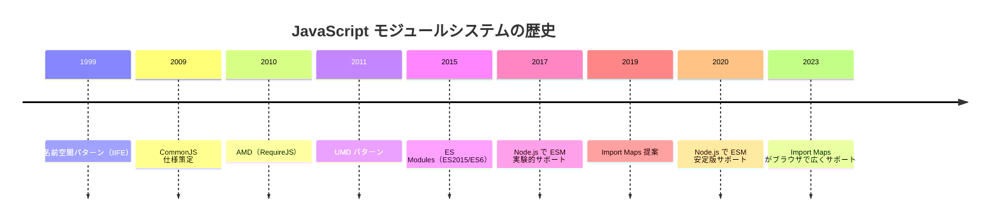

### IIFE パターン — モジュールシステム以前

モジュールシステムが存在しなかった時代、開発者は **IIFE（Immediately Invoked Function Expression）** を用いてスコープを分離していた。

```javascript
// IIFE pattern: create a private scope
var MyModule = (function () {
  // private variable
  var count = 0;

  // public API
  return {
    increment: function () {
      count++;
    },
    getCount: function () {
      return count;
    },
  };
})();

MyModule.increment();
console.log(MyModule.getCount()); // 1
```

IIFE パターンは関数スコープを利用してカプセル化を実現するが、依存関係の管理や非同期読み込みの仕組みは持たない。これは「パターン」であって「システム」ではなく、プロジェクトが大規模化すれば限界を迎える。

### AMD（Asynchronous Module Definition）

AMD は主にブラウザ環境での非同期モジュール読み込みを目的として設計された仕様である。代表的な実装として **RequireJS** がある。

```javascript
// AMD style: define a module with dependencies
define(["jquery", "lodash"], function ($, _) {
  // module body
  return {
    greet: function (name) {
      return _.capitalize("hello, " + name);
    },
  };
});
```

AMD はブラウザでの非同期読み込みに適していたが、構文が冗長であり、Node.js エコシステムとの互換性に欠けていた。後に CommonJS と ESM の普及に伴い、その役割を終えた。

### UMD（Universal Module Definition）

UMD は CommonJS と AMD の両方の環境で動作するモジュールを定義するためのパターンである。ライブラリ作者が広い互換性を確保するために用いた。

```javascript
// UMD pattern: works in both CommonJS and AMD environments
(function (root, factory) {
  if (typeof define === "function" && define.amd) {
    // AMD
    define(["dependency"], factory);
  } else if (typeof module === "object" && module.exports) {
    // CommonJS
    module.exports = factory(require("dependency"));
  } else {
    // browser global
    root.MyModule = factory(root.Dependency);
  }
})(typeof self !== "undefined" ? self : this, function (Dependency) {
  // module implementation
  return {};
});
```

UMD は互換性の問題を解決したが、ボイラープレートが非常に多く、本質的に「複数システムの橋渡し」に過ぎなかった。ESM の標準化により、新規プロジェクトで UMD を採用する理由はほぼなくなっている。

## CommonJS — Node.js のモジュールシステム

### 背景と設計思想

CommonJS は 2009 年、Kevin Dangoor によって提唱されたプロジェクトで、JavaScript をサーバーサイドで利用するための標準的な API セットを定義することを目的としていた。モジュールシステムはその中核をなす仕様であり、Node.js がこれを採用したことで事実上の標準となった。

CommonJS のモジュールシステムは以下の設計原則に基づいている。

- **同期的な読み込み**: ファイルシステムからの読み込みは高速であるという前提に基づき、`require()` は同期的にモジュールを返す
- **単一のエクスポートオブジェクト**: 各モジュールは `module.exports` を通じて単一のオブジェクト（または値）をエクスポートする
- **ファイル単位のスコープ**: 各ファイルが独立したモジュールスコープを持つ
- **キャッシュ**: 一度読み込まれたモジュールはキャッシュされ、再度 `require()` しても同じオブジェクトが返される

### 基本的な使い方

::: code-group

```javascript [math.js]
// named exports via module.exports
function add(a, b) {
  return a + b;
}

function multiply(a, b) {
  return a * b;
}

module.exports = { add, multiply };
```

```javascript [app.js]
// require returns the exported object
const { add, multiply } = require("./math");

console.log(add(2, 3)); // 5
console.log(multiply(4, 5)); // 20
```

:::

### モジュール解決アルゴリズム

CommonJS の `require()` は、引数として渡されたモジュール識別子（module specifier）に基づいて、以下のアルゴリズムでモジュールファイルを解決する。

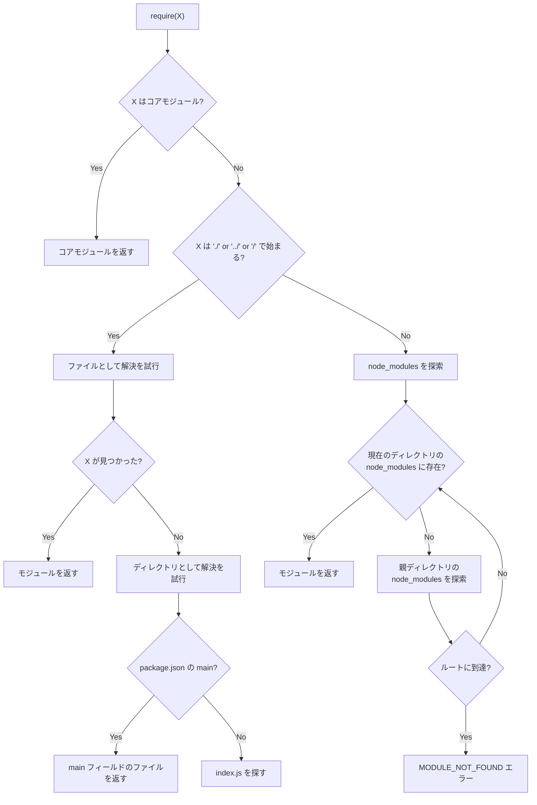

ファイルとして解決を試みる際には、以下の拡張子が順に試される。

1. `X` そのもの
2. `X.js`
3. `X.json`
4. `X.node`（C++ アドオン）

::: tip モジュール解決の実際
Node.js の `require.resolve()` 関数を使うと、実際にどのファイルパスに解決されるかを確認できる。デバッグ時に有用である。

```javascript
console.log(require.resolve("express"));
// => /path/to/project/node_modules/express/index.js
```

:::

### キャッシュの仕組み

CommonJS はモジュールを初回読み込み時にキャッシュし、2 回目以降の `require()` ではキャッシュされたオブジェクトを返す。これはパフォーマンスの最適化であると同時に、**モジュールがシングルトンとして振る舞う**ことを意味する。

```javascript
// counter.js
let count = 0;

module.exports = {
  increment() {
    count++;
  },
  getCount() {
    return count;
  },
};
```

```javascript
// a.js
const counter = require("./counter");
counter.increment();
console.log(counter.getCount()); // 1

// b.js — same cached instance
const counter = require("./counter");
console.log(counter.getCount()); // 1 (not 0)
```

キャッシュは `require.cache` オブジェクトに保持されており、意図的にキャッシュを無効化することも可能だが、一般的には推奨されない。

### 循環依存の処理

CommonJS は循環依存（circular dependency）を許容するが、その挙動は直感的ではない。モジュール A がモジュール B を `require` し、モジュール B がモジュール A を `require` した場合、**未完成のエクスポートオブジェクト**が返される。

```javascript
// a.js
console.log("a.js: start loading");
exports.loaded = false;
const b = require("./b");
console.log("a.js: b.loaded =", b.loaded);
exports.loaded = true;
console.log("a.js: done loading");
```

```javascript
// b.js
console.log("b.js: start loading");
exports.loaded = false;
const a = require("./a");
console.log("b.js: a.loaded =", a.loaded); // false (incomplete export)
exports.loaded = true;
console.log("b.js: done loading");
```

実行結果は以下のようになる。

```
a.js: start loading
b.js: start loading
b.js: a.loaded = false    ← incomplete export
b.js: done loading
a.js: b.loaded = true
a.js: done loading
```

この挙動は、CommonJS がモジュールを**逐次的に実行**し、実行中のモジュールのエクスポートオブジェクトを「その時点の状態」で返すために生じる。循環依存は設計上の問題を示すことが多く、可能な限り避けるべきである。

### CommonJS の制限

CommonJS は Node.js エコシステムで長年にわたり使われてきたが、以下のような本質的な制限がある。

| 制限 | 詳細 |
|---|---|
| **静的解析が不可能** | `require()` は動的関数呼び出しであり、条件分岐の中でも使用できるため、ビルドツールが依存グラフを静的に解析できない |
| **Tree Shaking 非対応** | エクスポートがオブジェクトのプロパティとして表現されるため、未使用のエクスポートを安全に除去できない |
| **同期読み込みのみ** | ブラウザ環境では同期的なネットワーク読み込みは実用的でない |
| **トップレベル await 非対応** | モジュール実行が同期的であるため、トップレベルでの `await` は使用できない |

これらの制限を根本的に解決するために、ECMAScript の言語仕様として ESM（ES Modules）が策定された。

## ES Modules（ESM） — 言語標準のモジュールシステム

### 設計原則

ES Modules は ECMAScript 2015（ES6）で導入された、JavaScript 言語仕様に組み込まれたモジュールシステムである。CommonJS の制限を克服し、以下の設計原則に基づいている。

- **静的な構造**: `import` / `export` 文は静的に解析可能であり、実行前に依存グラフを構築できる
- **非同期読み込み**: ネットワーク経由でのモジュール読み込みを前提とし、非同期的に処理される
- **ライブバインディング**: エクスポートは値のコピーではなく、元の変数への参照（ライブバインディング）である
- **Strict mode**: ES Modules は常に strict mode で実行される
- **トップレベル `this` が `undefined`**: グローバルオブジェクトを直接参照しない

### 基本構文

#### Named Exports と Default Export

::: code-group

```javascript [math.js — Named exports]
// named exports: each binding is individually importable
export function add(a, b) {
  return a + b;
}

export function multiply(a, b) {
  return a * b;
}

export const PI = 3.14159;
```

```javascript [logger.js — Default export]
// default export: one per module
export default class Logger {
  constructor(prefix) {
    this.prefix = prefix;
  }

  log(message) {
    console.log(`[${this.prefix}] ${message}`);
  }
}
```

```javascript [app.js — Import]
// named imports: use curly braces
import { add, multiply, PI } from "./math.js";

// default import: no curly braces
import Logger from "./logger.js";

// namespace import: import all named exports
import * as math from "./math.js";

// renaming imports
import { add as sum } from "./math.js";
```

:::

::: warning Named Export と Default Export の選択
Default Export は便利だが、import 側で任意の名前を付けられるため、プロジェクト全体での命名の一貫性が失われやすい。大規模プロジェクトでは Named Export を推奨する声が多い。TypeScript の公式スタイルガイドや Google の JavaScript スタイルガイドでも Named Export が推奨されている。
:::

### ESM のモジュール解決と実行フェーズ

ESM のモジュール読み込みは、CommonJS の逐次実行とは根本的に異なり、**3 つのフェーズ**に分離されている。

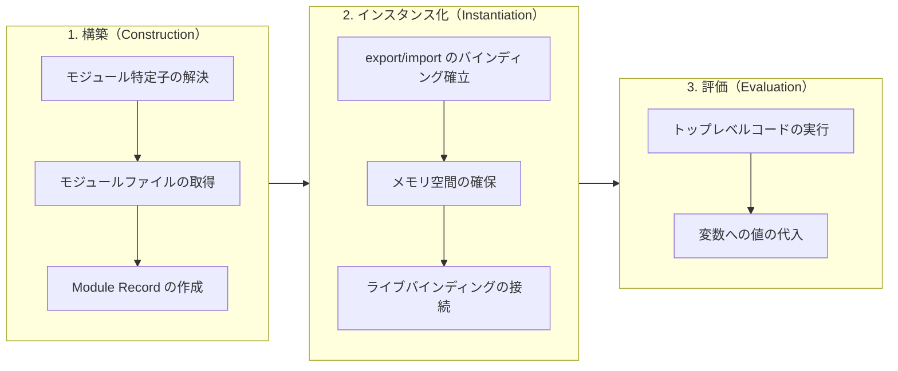

#### 1. 構築フェーズ（Construction）

このフェーズでは、エントリポイントから始まるすべてのモジュールファイルを探索し、依存グラフを構築する。各モジュールに対して Module Record（モジュールレコード）が作成される。

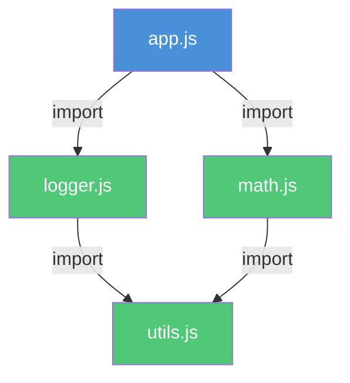

重要な点として、この段階ではコードは一切実行されない。静的な `import` / `export` 文の解析のみが行われる。

#### 2. インスタンス化フェーズ（Instantiation）

各モジュールのエクスポートとインポートのバインディングがメモリ上に確立される。ESM のバインディングは**ライブバインディング**であり、エクスポート側の変数とインポート側の参照が同じメモリ領域を指す。

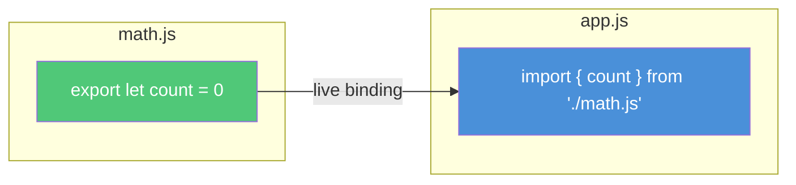

#### 3. 評価フェーズ（Evaluation）

依存グラフの末端（依存先のないモジュール）から順にトップレベルコードが実行され、変数に実際の値が代入される。各モジュールは**一度だけ**評価される。

### ライブバインディング — CommonJS との根本的な違い

ESM と CommonJS の最も重要な違いの一つが、**ライブバインディング**である。CommonJS では `module.exports` の値がコピーされるのに対し、ESM ではエクスポートされた変数への「生きた参照」が共有される。

::: code-group

```javascript [ESM — ライブバインディング]
// counter.mjs
export let count = 0;

export function increment() {
  count++;
}
```

```javascript [ESM — import 側]
// app.mjs
import { count, increment } from "./counter.mjs";

console.log(count); // 0
increment();
console.log(count); // 1 — live binding reflects the change
```

:::

::: code-group

```javascript [CommonJS — 値のコピー]
// counter.js
let count = 0;

module.exports = {
  get count() {
    return count;
  }, // getter needed to reflect changes
  increment() {
    count++;
  },
};
```

```javascript [CommonJS — require 側]
// app.js
const { count, increment } = require("./counter");

console.log(count); // 0
increment();
console.log(count); // 0 — value was copied at destructure time
```

:::

CommonJS で変化を反映させるには、getter を使うか、エクスポートオブジェクト全体を保持してプロパティアクセスする必要がある。ESM のライブバインディングはこの問題を言語レベルで解決している。

### ESM における循環依存

ESM の 3 フェーズ方式は、循環依存をより堅牢に処理できる。インスタンス化フェーズでバインディングが確立されるため、評価フェーズでは「未完成のエクスポート」ではなく「未初期化のバインディング」として扱われる。

```javascript
// a.mjs
import { b } from "./b.mjs";
export const a = "a";
console.log("a.mjs:", b);

// b.mjs
import { a } from "./a.mjs";
export const b = "b";
console.log("b.mjs:", a); // TDZ error if accessed before initialization
```

ESM では、循環依存で未初期化のバインディングにアクセスすると **TDZ（Temporal Dead Zone）エラー** が発生する。これは CommonJS の「何も言わずに `undefined` を返す」挙動よりも、問題の早期発見に有利である。

### Node.js における ESM

Node.js は v12 から ESM を実験的にサポートし、v14 以降で安定版として提供している。しかし、CommonJS との共存のために、いくつかの規則がある。

#### ESM として認識される条件

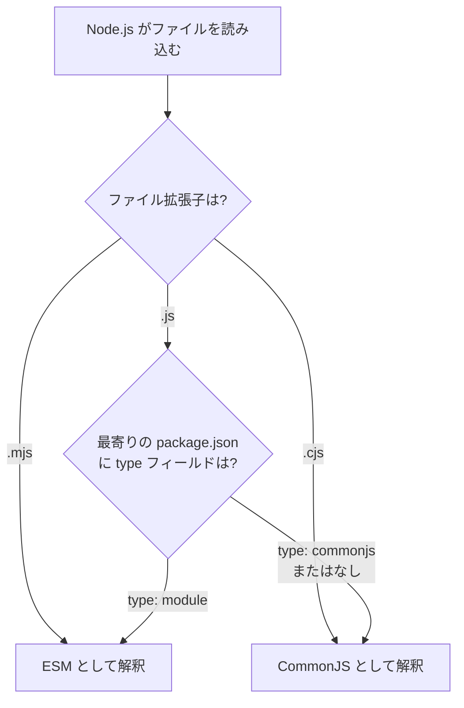

#### package.json の設定

```json
{
  "name": "my-package",
  "type": "module",
  "exports": {
    ".": {
      "import": "./dist/index.mjs",
      "require": "./dist/index.cjs"
    },
    "./utils": {
      "import": "./dist/utils.mjs",
      "require": "./dist/utils.cjs"
    }
  }
}
```

`exports` フィールド（Conditional Exports）は Node.js v12.11.0 で導入され、**Dual Package** パターンを実現する。これにより、ESM と CommonJS の両方の利用者に対して適切なエントリポイントを提供できる。

::: details ESM と CommonJS の相互運用
ESM から CommonJS モジュールを `import` することは可能だが、CommonJS から ESM を `require()` することは基本的にできない（Node.js v22 以降で実験的にサポートが始まっている）。

```javascript
// ESM can import CommonJS
import cjsModule from "./legacy.cjs"; // default import works

// CommonJS cannot require ESM (traditionally)
// const esmModule = require('./modern.mjs'); // ERR_REQUIRE_ESM

// workaround: use dynamic import in CommonJS
async function loadESM() {
  const esmModule = await import("./modern.mjs");
  return esmModule;
}
```

:::

### ブラウザにおける ESM

モダンブラウザは ESM をネイティブにサポートしている。`<script type="module">` を使用することで、ブラウザが直接 ESM を解釈・実行する。

```html
<!-- ESM in the browser -->
<script type="module">
  import { greet } from "./greet.js";
  greet("World");
</script>

<!-- nomodule fallback for older browsers -->
<script nomodule src="fallback-bundle.js"></script>
```

ブラウザ ESM の特徴は以下の通りである。

| 特徴 | 説明 |
|---|---|
| **defer 相当** | `type="module"` のスクリプトは自動的に defer される |
| **CORS 必須** | モジュールの取得には CORS ヘッダが必要 |
| **Strict mode** | 自動的に strict mode で実行される |
| **スコープの分離** | 各モジュールは独自のスコープを持ち、グローバルを汚染しない |
| **一度だけ実行** | 同じモジュールが複数回参照されても、一度だけ取得・実行される |

::: warning ブラウザ ESM のパフォーマンス課題
ブラウザで ESM を直接使用する場合、モジュール間の依存関係がネットワークリクエストのウォーターフォールを引き起こす。例えば、`app.js` が `math.js` を import し、`math.js` が `utils.js` を import する場合、3 回の逐次的なネットワークリクエストが必要になる。HTTP/2 のサーバープッシュや `<link rel="modulepreload">` で緩和できるが、大規模アプリケーションではバンドラーの使用が依然として推奨される。
:::

### 動的 import

ESM は静的な `import` 文に加えて、**動的 import** (`import()`) もサポートしている。これは Promise を返す関数のように動作し、条件付きのモジュール読み込みやコード分割に利用される。

```javascript
// dynamic import: returns a Promise
async function loadFeature(featureName) {
  try {
    const module = await import(`./features/${featureName}.js`);
    module.init();
  } catch (err) {
    console.error(`Failed to load feature: ${featureName}`, err);
  }
}

// conditional loading
if (user.isAdmin) {
  const { AdminPanel } = await import("./admin-panel.js");
  AdminPanel.render();
}
```

動的 import は CommonJS の `require()` と異なり、**常に非同期**である。また、ESM・CommonJS のどちらの環境でも利用可能である。

### import.meta

ESM は `import.meta` オブジェクトを通じて、モジュール自身に関するメタ情報を提供する。

```javascript
// import.meta.url: the URL of the current module
console.log(import.meta.url);
// Node.js: file:///path/to/module.mjs
// Browser: https://example.com/js/module.js

// use import.meta.url to resolve relative paths (Node.js)
import { readFileSync } from "fs";
import { fileURLToPath } from "url";
import { dirname, join } from "path";

const __filename = fileURLToPath(import.meta.url);
const __dirname = dirname(__filename);
const data = readFileSync(join(__dirname, "data.json"), "utf-8");
```

::: tip CommonJS にはあるが ESM にはないもの
ESM では CommonJS で利用可能だった以下の変数が使えない。

- `__filename` — `import.meta.url` + `fileURLToPath()` で代替
- `__dirname` — 上記に加えて `dirname()` で代替
- `require` — `import` 文 または `import()` で代替
- `require.resolve` — `import.meta.resolve()` で代替（Node.js v20.6+）
- `module` — 不要（ESM は `export` 文を使用）
:::

## CommonJS と ESM の比較

以下に、CommonJS と ESM の主要な違いをまとめる。

| 観点 | CommonJS | ESM |
|---|---|---|
| **仕様** | コミュニティ仕様 | ECMAScript 言語仕様 |
| **構文** | `require()` / `module.exports` | `import` / `export` |
| **読み込み** | 同期 | 非同期 |
| **バインディング** | 値のコピー | ライブバインディング |
| **静的解析** | 不可能（動的関数呼び出し） | 可能（宣言的構文） |
| **Tree Shaking** | 困難 | 可能 |
| **トップレベル await** | 非対応 | 対応 |
| **実行モード** | non-strict（デフォルト） | strict mode（常に） |
| **循環依存** | 未完成のエクスポートを返す | TDZ エラーで早期検出 |
| **ブラウザ対応** | バンドラー経由のみ | ネイティブ対応 |
| **ファイル拡張子** | `.js`（デフォルト）/ `.cjs` | `.mjs` / `.js`（type: module） |
| **this の値** | `module.exports` | `undefined` |

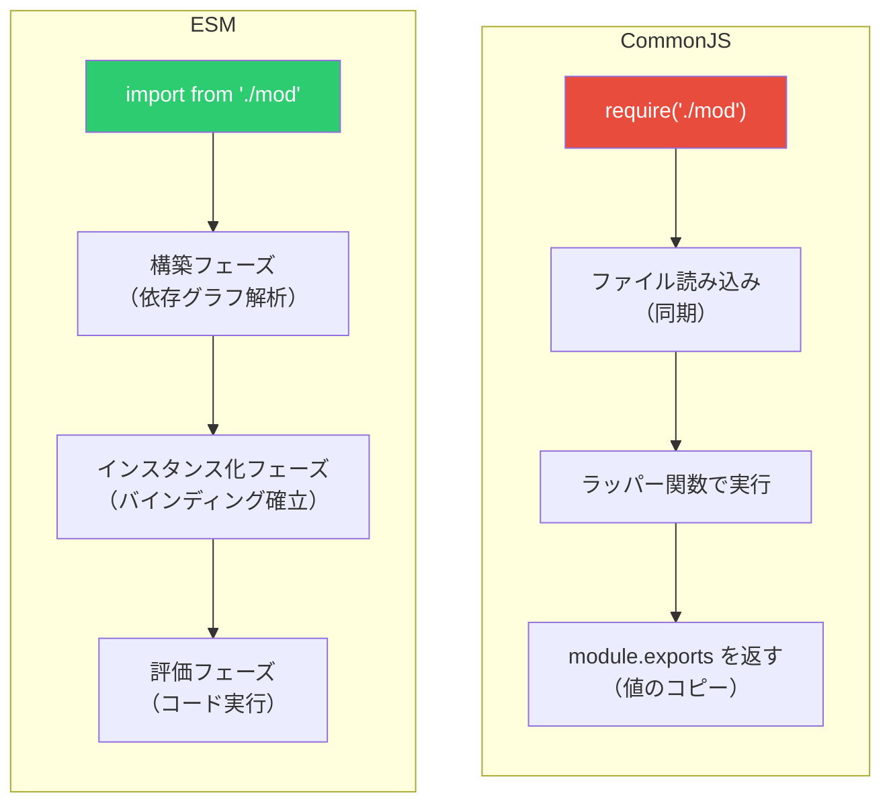

## Import Maps — ブラウザでのモジュール解決の革新

### 問題の背景

ブラウザで ESM を使用する際、モジュール特定子（module specifier）は**完全な URL** または **相対パス**でなければならない。Node.js のように `import lodash from "lodash"` のようなベアスペシファイア（bare specifier）を使うことはできない。

```javascript
// works in Node.js, but NOT in the browser
import lodash from "lodash"; // Error: bare specifier

// browser requires full path
import lodash from "https://cdn.example.com/lodash/4.17.21/lodash.esm.js";
// or relative path
import { utils } from "./node_modules/lodash/lodash.esm.js";
```

これは以下の問題を引き起こす。

1. **ベアスペシファイアが使えない**: `import React from "react"` のような、Node.js エコシステムで一般的な書き方ができない
2. **URL の冗長性**: 長い CDN URL をコード中に繰り返し記述する必要がある
3. **バージョン管理の困難**: URL を変更するにはすべての import 文を書き換える必要がある
4. **バンドラー依存**: ベアスペシファイアを解決するために Webpack や Vite などのバンドラーが必須になる

### Import Maps とは

Import Maps は、ブラウザにおけるモジュール特定子の解決方法をカスタマイズするための仕組みである。HTML の `<script type="importmap">` タグで JSON 形式のマッピングを定義し、ベアスペシファイアを実際の URL に変換する。

```html
<script type="importmap">
  {
    "imports": {
      "lodash": "https://cdn.skypack.dev/lodash-es@4.17.21",
      "react": "https://esm.sh/react@18.2.0",
      "react-dom": "https://esm.sh/react-dom@18.2.0",
      "./utils/": "./src/utils/"
    }
  }
</script>

<script type="module">
  // bare specifiers now work in the browser
  import _ from "lodash";
  import React from "react";
  import { formatDate } from "./utils/date.js";
</script>
```

### Import Maps の構造

Import Maps の JSON 構造は、`imports` と `scopes` の 2 つの主要なフィールドから構成される。

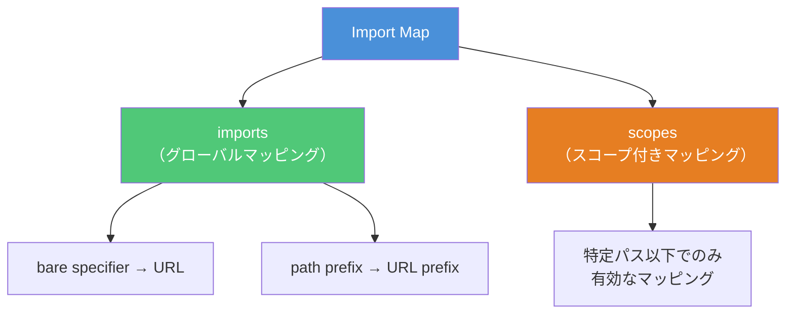

#### imports フィールド

`imports` フィールドは、モジュール特定子からURL へのグローバルなマッピングを定義する。

```html
<script type="importmap">
  {
    "imports": {
      "moment": "/node_modules/moment/src/moment.js",
      "moment/": "/node_modules/moment/src/",
      "lodash": "/node_modules/lodash-es/lodash.js",
      "lodash/": "/node_modules/lodash-es/",
      "@myorg/utils": "/src/shared/utils.js"
    }
  }
</script>
```

末尾にスラッシュを付けたマッピング（例: `"moment/"` → `"/node_modules/moment/src/"`）は**パスプレフィックスマッピング**と呼ばれ、サブモジュールのインポートを可能にする。

```javascript
// resolves to /node_modules/moment/src/moment.js
import moment from "moment";

// resolves to /node_modules/moment/src/locale/ja.js
import "moment/locale/ja.js";

// resolves to /node_modules/lodash-es/debounce.js
import debounce from "lodash/debounce.js";
```

#### scopes フィールド

`scopes` フィールドは、特定のパス以下でのみ有効なマッピングを定義する。これにより、**異なるバージョンの同じパッケージ**を異なるコンテキストで使用できる。

```html
<script type="importmap">
  {
    "imports": {
      "lodash": "/node_modules/lodash-es@4.17.21/lodash.js"
    },
    "scopes": {
      "/legacy-app/": {
        "lodash": "/node_modules/lodash-es@3.10.1/lodash.js"
      }
    }
  }
</script>
```

この設定では、`/legacy-app/` 以下のモジュールが `lodash` をインポートした場合はバージョン 3.10.1 が、それ以外のモジュールでは 4.17.21 が使用される。

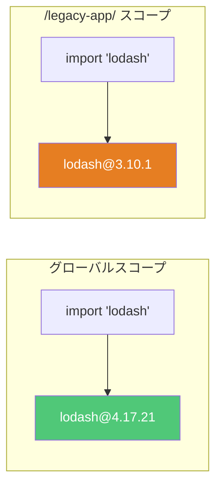

### Import Maps の実用的なパターン

#### CDN ベースの依存管理

バンドラーを使用せずに、CDN から直接モジュールを読み込むパターンである。プロトタイピングや小規模プロジェクトで有用である。

```html
<script type="importmap">
  {
    "imports": {
      "preact": "https://esm.sh/preact@10.19.3",
      "preact/hooks": "https://esm.sh/preact@10.19.3/hooks",
      "htm": "https://esm.sh/htm@3.1.1",
      "htm/preact": "https://esm.sh/htm@3.1.1/preact"
    }
  }
</script>

<script type="module">
  import { html, render } from "htm/preact";
  import { useState } from "preact/hooks";

  function App() {
    const [count, setCount] = useState(0);
    return html`
      <div>
        <h1>Count: ${count}</h1>
        <button onClick=${() => setCount(count + 1)}>Increment</button>
      </div>
    `;
  }

  render(html`<${App} />`, document.getElementById("app"));
</script>
```

#### 開発環境と本番環境の切り替え

Import Maps を動的に生成することで、環境に応じたモジュールの切り替えが可能である。

```html
<script>
  // dynamically inject import map based on environment
  const isDev = location.hostname === "localhost";
  const importMap = {
    imports: {
      "my-framework": isDev
        ? "/src/framework/index.js"
        : "https://cdn.example.com/framework@1.0.0/index.min.js",
    },
  };

  const script = document.createElement("script");
  script.type = "importmap";
  script.textContent = JSON.stringify(importMap);
  document.head.appendChild(script);
</script>
```

::: danger Import Maps の制約
Import Maps にはいくつかの重要な制約がある。

1. **モジュール読み込み前に定義が必要**: Import Map は、`type="module"` スクリプトの前に配置しなければならない。最初のモジュールが読み込まれた後に Import Map を追加しても無効である
2. **1 ページ 1 つ**: 1 つの HTML ドキュメントには 1 つの Import Map しか定義できない（ただし、提案段階の仕様で複数 Import Map のサポートが検討されている）
3. **Worker 内**: Web Worker 内で Import Map を使用するためには、Worker のコンストラクタオプションで指定する必要がある
:::

### ブラウザサポート状況

Import Maps は 2023 年以降、主要なモダンブラウザで広くサポートされている。

| ブラウザ | サポートバージョン |
|---|---|
| Chrome | 89+ |
| Edge | 89+ |
| Firefox | 108+ |
| Safari | 16.4+ |
| Opera | 76+ |

未サポートのブラウザ向けには、`es-module-shims` などのポリフィルが利用可能である。

```html
<!-- polyfill for older browsers -->
<script
  async
  src="https://ga.jspm.io/npm:es-module-shims@1.8.0/dist/es-module-shims.js"
></script>

<script type="importmap">
  {
    "imports": {
      "lodash": "https://cdn.skypack.dev/lodash-es"
    }
  }
</script>
```

## モジュールシステムの相互運用と移行戦略

### CommonJS から ESM への移行

多くの Node.js プロジェクトが CommonJS で書かれており、ESM への移行は段階的に行われることが多い。以下に主要な移行パターンを示す。

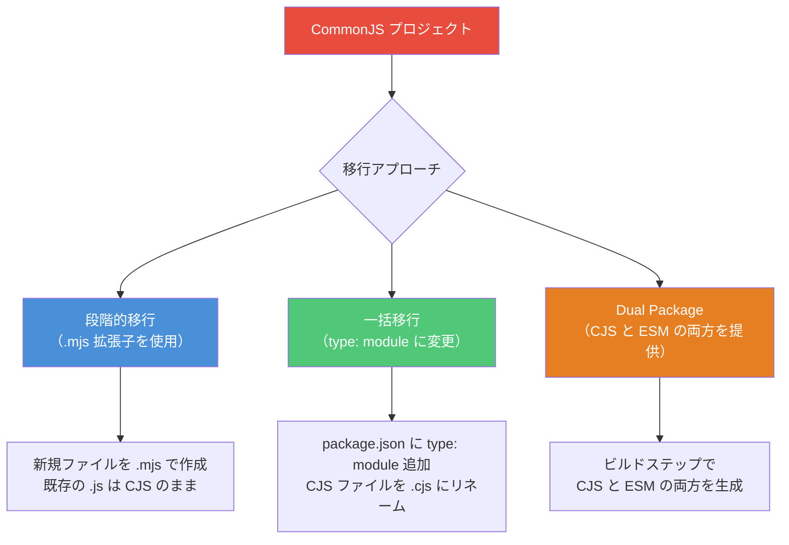

#### パターン 1: 段階的移行

```
project/
├── package.json          # type field is NOT set (default: commonjs)
├── src/
│   ├── legacy.js         # CommonJS (unchanged)
│   ├── legacy2.js        # CommonJS (unchanged)
│   └── new-feature.mjs   # ESM (new file)
```

#### パターン 2: 一括移行

```json
// package.json
{
  "type": "module"
}
```

この設定で、すべての `.js` ファイルが ESM として解釈される。CommonJS として残すファイルは `.cjs` にリネームする。

#### パターン 3: Dual Package（ライブラリ向け）

```json
// package.json
{
  "name": "my-library",
  "type": "module",
  "main": "./dist/cjs/index.cjs",
  "module": "./dist/esm/index.js",
  "exports": {
    ".": {
      "import": {
        "types": "./dist/esm/index.d.ts",
        "default": "./dist/esm/index.js"
      },
      "require": {
        "types": "./dist/cjs/index.d.cts",
        "default": "./dist/cjs/index.cjs"
      }
    }
  }
}
```

::: tip 移行時の一般的な落とし穴
1. **拡張子の省略**: CommonJS では `require('./utils')` のように拡張子を省略できるが、ESM では `import './utils.js'` のように拡張子が必須（Node.js の場合）
2. **JSON のインポート**: ESM で JSON ファイルをインポートするには Import Attributes（旧 Import Assertions）が必要

```javascript
// ESM: import JSON with import attributes
import data from "./data.json" with { type: "json" };
```

3. **`__dirname` の不在**: 前述の通り、`import.meta.url` で代替する
4. **動的 require**: 条件分岐内の `require()` は `import()` に置き換える
:::

### package.json の exports フィールド詳解

`exports` フィールドは Node.js v12.11.0 で導入された、パッケージのエントリポイントを制御する強力な仕組みである。

```json
{
  "name": "my-package",
  "exports": {
    ".": {
      "import": "./dist/esm/index.js",
      "require": "./dist/cjs/index.cjs",
      "default": "./dist/esm/index.js"
    },
    "./utils": {
      "import": "./dist/esm/utils.js",
      "require": "./dist/cjs/utils.cjs"
    },
    "./package.json": "./package.json"
  }
}
```

`exports` フィールドの重要な特徴は、**エンクロージャ**（enclosure）として機能することである。`exports` に明示的に記載されていないパスは外部からアクセスできなくなり、パッケージの内部実装を隠蔽できる。

```javascript
// allowed: explicitly exported
import { helper } from "my-package/utils";

// blocked: not in exports map
import { internal } from "my-package/dist/esm/internal.js";
// Error: Package subpath './dist/esm/internal.js' is not defined by "exports"
```

### Conditional Exports の条件キー

`exports` フィールドでは、さまざまな条件キーを使用して実行環境に応じたエントリポイントを指定できる。

| 条件キー | 説明 |
|---|---|
| `import` | ESM（`import` 文 / `import()`）で読み込まれた場合 |
| `require` | CommonJS（`require()`）で読み込まれた場合 |
| `default` | フォールバック |
| `node` | Node.js 環境 |
| `browser` | ブラウザ環境（バンドラーが解釈） |
| `types` | TypeScript の型定義 |
| `development` | 開発環境（バンドラーが解釈） |
| `production` | 本番環境（バンドラーが解釈） |

## モジュールシステムとビルドツールの関係

### バンドラーの役割

モダンなフロントエンド開発では、モジュールシステムとバンドラーは密接に関連している。バンドラーは以下の役割を果たす。

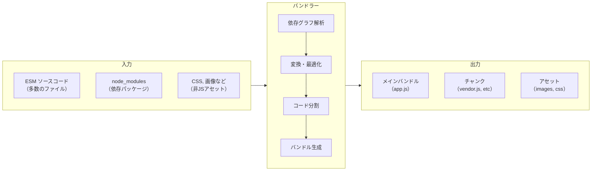

### Tree Shaking と ESM

Tree Shaking は、ESM の静的構造を活用して未使用のエクスポートを検出・除去する最適化手法である。CommonJS では構造が動的であるため、この最適化は原理的に困難である。

```javascript
// math.js
export function add(a, b) {
  return a + b;
}

export function subtract(a, b) {
  return a - b;
}

export function multiply(a, b) {
  return a * b;
}

// unused - complex internal function
export function complexCalculation(data) {
  // ... hundreds of lines
  return result;
}
```

```javascript
// app.js — only uses add
import { add } from "./math.js";
console.log(add(1, 2));
```

Tree Shaking により、`subtract`、`multiply`、`complexCalculation` はバンドルから除去される。これは ESM の `import` / `export` が静的に解析可能であるからこそ実現できる最適化である。

::: warning Tree Shaking の限界
Tree Shaking は万能ではない。以下の場合、未使用コードが正しく除去されないことがある。

1. **副作用のあるモジュール**: モジュールのトップレベルに副作用（グローバル変数の変更、DOM操作など）がある場合、バンドラーは安全のためにそのモジュールを保持する
2. **動的プロパティアクセス**: `obj[dynamicKey]` のようなアクセスがある場合、どのプロパティが使用されるか静的に判断できない
3. **CommonJS の re-export**: CommonJS モジュールを ESM で re-export する場合、Tree Shaking の効果が低下する

`package.json` の `sideEffects` フィールドを設定することで、バンドラーに副作用の有無を明示的に伝えられる。

```json
{
  "sideEffects": false
}
```

または、特定のファイルのみ副作用があると宣言できる。

```json
{
  "sideEffects": ["*.css", "./src/polyfills.js"]
}
```

:::

### 開発サーバーと ESM（Vite のアプローチ）

Vite に代表される次世代ビルドツールは、開発時にブラウザのネイティブ ESM サポートを活用する。

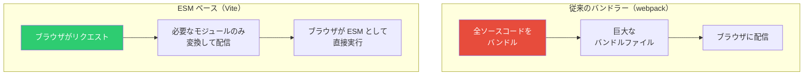

Vite の開発サーバーは以下のように動作する。

1. **依存パッケージの事前バンドル**: `node_modules` 内のパッケージ（多くが CommonJS）を ESM に変換し、キャッシュする（esbuild を使用）
2. **ソースコードのオンデマンド変換**: ブラウザからのリクエストに応じて、個々のソースファイルを変換して配信する
3. **HMR（Hot Module Replacement）**: ESM の依存グラフを活用し、変更されたモジュールのみを効率的に更新する

このアプローチにより、プロジェクトの規模に関係なく、開発サーバーの起動が高速になる。

## モジュールシステムの全体像

最後に、JavaScript のモジュールシステムの全体像を俯瞰する。

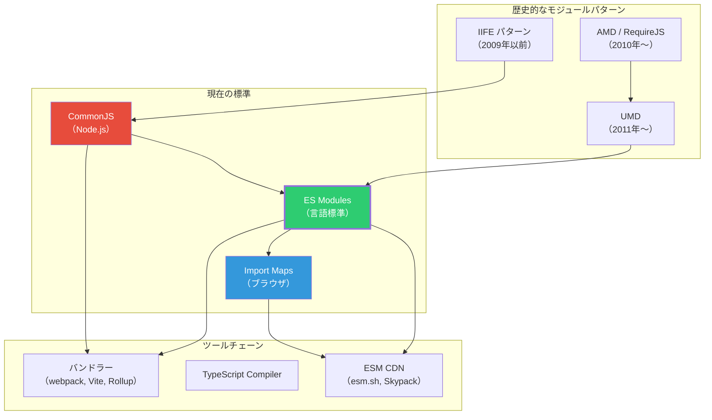

### 使い分けのガイドライン

| シナリオ | 推奨 |
|---|---|
| **新規 Node.js プロジェクト** | ESM (`"type": "module"`) |
| **既存の Node.js プロジェクト** | 段階的に ESM へ移行 |
| **npm パッケージの公開** | Dual Package（ESM + CJS） |
| **フロントエンド開発** | ESM + バンドラー（Vite 推奨） |
| **プロトタイピング** | ESM + Import Maps + CDN |
| **レガシーブラウザ対応** | ESM + バンドラー + ポリフィル |

### 今後の展望

JavaScript のモジュールシステムは、ESM への統一が進みつつある。以下のトレンドが今後の方向性を示している。

1. **Node.js の ESM ファースト化**: Node.js コミュニティは ESM を推奨する方向に進んでおり、CommonJS のみのパッケージは減少傾向にある
2. **Import Maps の普及**: バンドラーを使わない軽量な開発ワークフローが、Import Maps によって現実的になりつつある
3. **Module Federation**: Webpack 5 の Module Federation や、Vite のモジュール連携など、マイクロフロントエンド向けの動的モジュール共有が進化している
4. **Import Attributes の標準化**: JSON モジュールや CSS モジュールなど、JavaScript 以外のリソースを型安全にインポートする仕組みが標準化されつつある
5. **Source Phase Imports**: WebAssembly モジュールなどを段階的にインスタンス化するための新しい import 構文が提案されている

```javascript
// Import Attributes (Stage 4)
import data from "./config.json" with { type: "json" };
import styles from "./app.css" with { type: "css" };

// Source Phase Imports (Stage 3)
import source wasmModule from "./compute.wasm";
const instance = await WebAssembly.instantiate(wasmModule);
```

## まとめ

JavaScript のモジュールシステムは、グローバルスコープの汚染という素朴な問題から出発し、CommonJS、AMD、UMD を経て、ES Modules という言語標準に収束しつつある。

CommonJS は Node.js エコシステムを支えた偉大な仕組みだが、同期読み込みや静的解析の不可能性といった本質的な制限がある。ESM はこれらを克服し、ライブバインディング、静的構造、非同期読み込みという優れた特性を持つ。そして Import Maps は、バンドラーなしでもブラウザで ESM を実用的に利用できる基盤を提供する。

現代の JavaScript 開発者にとって重要なのは、これらのモジュールシステムの**設計上のトレードオフ**を理解し、プロジェクトの要件に応じて適切な選択を行うことである。新規プロジェクトでは ESM を第一選択とし、既存プロジェクトでは段階的な移行を計画し、ライブラリ提供者は Dual Package パターンで幅広い互換性を確保する — これが現時点でのベストプラクティスである。
