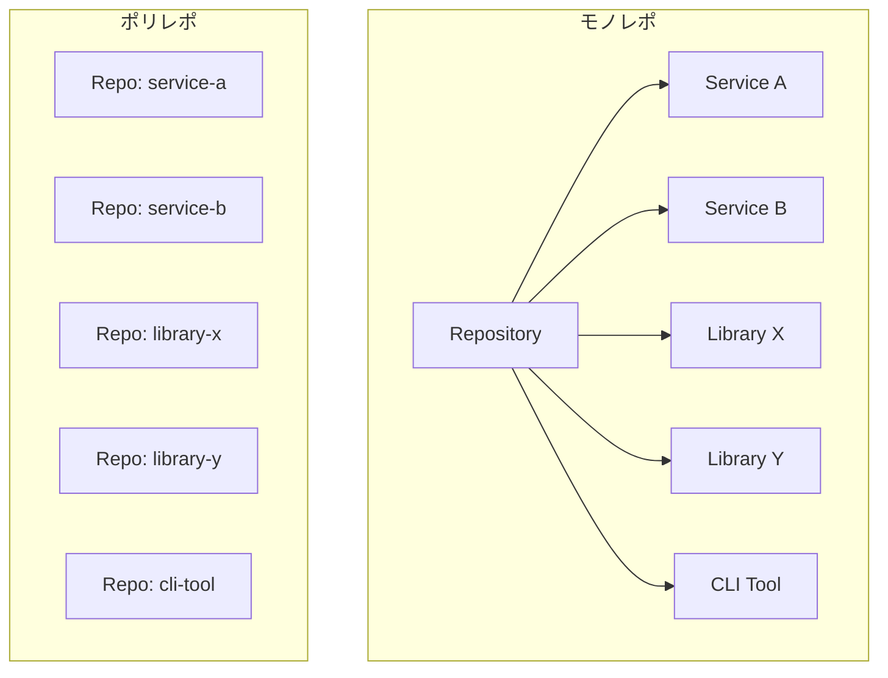
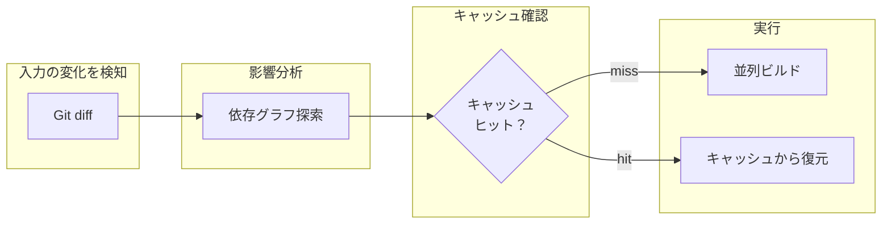
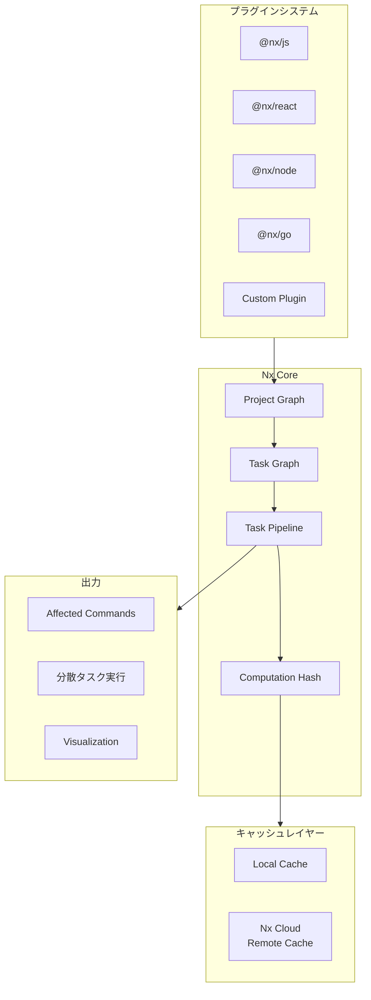
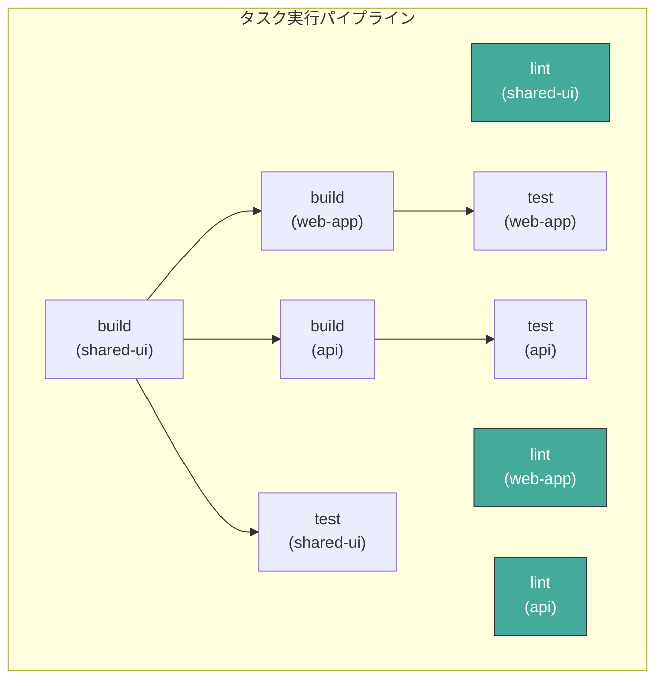
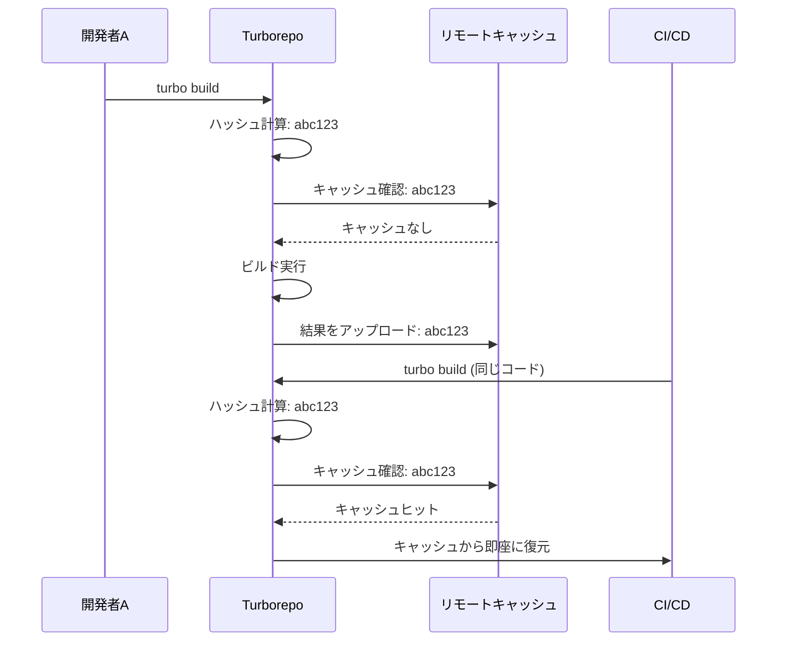
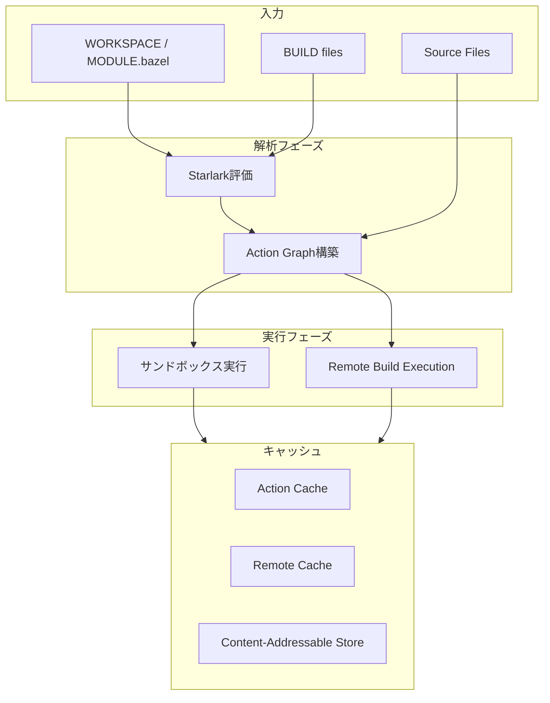
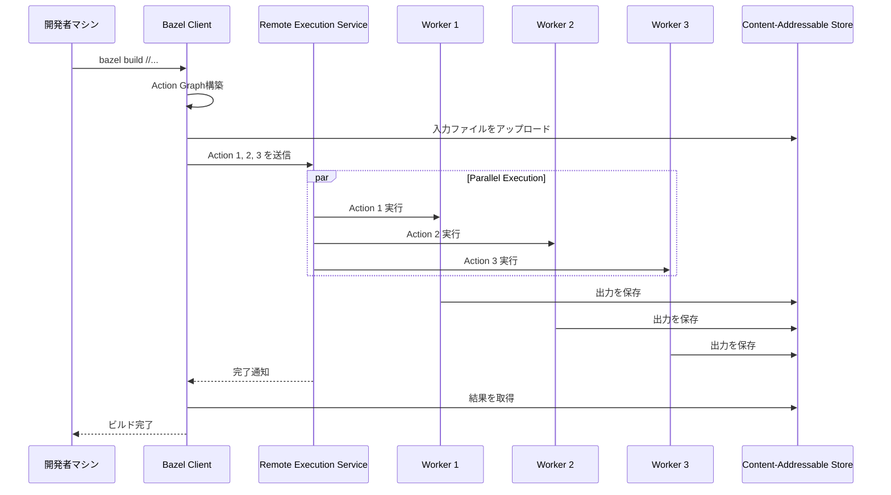
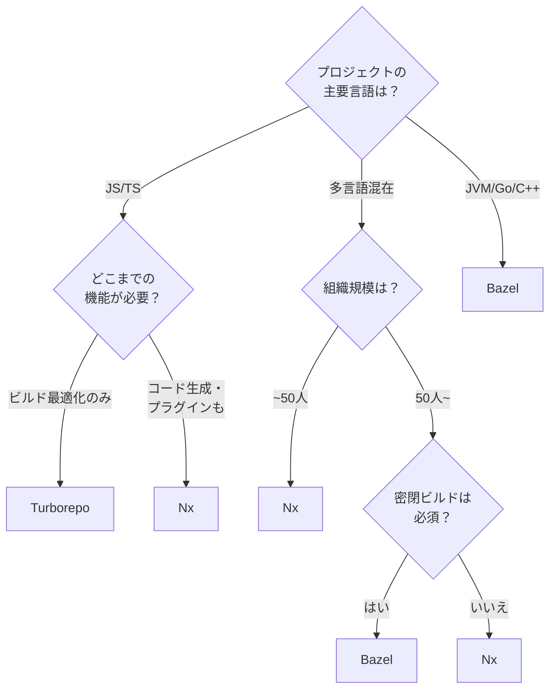
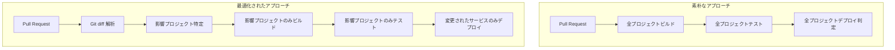

# モノレポ管理（Nx, Turborepo, Bazel）

## 1. 背景と動機

### 1.1 モノレポとは何か

モノレポ（monorepo）とは、複数のプロジェクト、ライブラリ、サービスのソースコードを単一のバージョン管理リポジトリに格納するソフトウェア開発手法である。「monolithic repository」を略した用語であり、単一のリポジトリ内に組織全体あるいは複数チームのコードベースを統合的に管理する。

ここで重要な区別がある。モノレポは「モノリシックなアプリケーション」とは根本的に異なる。モノリスはアーキテクチャの問題であり、すべての機能が単一のデプロイ単位に結合されたシステムを指す。一方、モノレポはコード管理の戦略であり、リポジトリ内の各プロジェクトは独立したデプロイ単位として設計できる。つまり、モノレポ内にマイクロサービスを配置することも、独立したライブラリ群を管理することも可能である。

### 1.2 歴史的背景 — なぜ巨大企業がモノレポを選んだのか

モノレポの歴史は、ソフトウェア産業の黎明期にまで遡る。かつてはバージョン管理システム自体が未成熟であり、一つのリポジトリですべてを管理するのが自然であった。しかし、プロジェクト規模が拡大するにつれ、リポジトリの分割が進み、「ポリレポ（polyrepo）」が主流となった時期がある。

その流れに逆行するかのように、世界最大規模のテック企業がモノレポを採用してきた。

**Google**: Googleは2015年の論文 "Why Google Stores Billions of Lines of Code in a Single Repository" で、数十億行のコードを単一リポジトリ（Piper）で管理していることを公表した。25,000人以上の開発者が毎日このリポジトリに対してコミットを行っている。Googleがモノレポを選択した最大の理由は、コードの再利用性と依存関係の透明性である。すべてのコードが一箇所にあることで、ライブラリの変更が影響するプロジェクトを即座に特定でき、APIの破壊的変更を安全に行うことが可能になる。

**Meta（旧Facebook）**: Metaは、すべてのコードを単一のMercurialリポジトリで管理している。数百万のファイルと数百万のコミットを含むこのリポジトリは、専用の仮想ファイルシステム（EdenFS）によって、開発者が必要なファイルのみを効率的にチェックアウトできるよう設計されている。

**Microsoft**: Microsoftは、Windowsのコードベースを単一のGitリポジトリで管理するために、VFS for Git（旧GVFS）を開発した。300GBを超えるリポジトリを通常のGitで扱うことは不可能であったため、仮想ファイルシステムレイヤーを導入し、必要なファイルのみをオンデマンドでダウンロードする仕組みを構築した。

**Twitter**: Twitterは、Pantsビルドシステムを中心としたモノレポ体制を採用し、数千人の開発者が単一リポジトリで協働していた。

これらの企業がモノレポを選択した共通の理由は、**コードの一貫性の保証**と**大規模な変更の効率化**にある。特に、数百のサービスが共有ライブラリに依存する環境において、ライブラリのバージョンアップを全サービスに対して一括で行えるメリットは計り知れない。

### 1.3 モノレポが解決する根本的な問題

モノレポが登場した背景には、ポリレポ体制で顕在化する以下の問題がある。

**ダイアモンド依存問題**: サービスAとサービスBが共有ライブラリLに依存しているとき、Aがバージョン1.0を、Bがバージョン2.0を使用していると、AとBを統合するシステムで矛盾が生じる。モノレポでは、Lは常に単一バージョンであり、この問題は構造的に排除される。

**アトミックな横断的変更**: API仕様の変更時、ポリレポでは複数リポジトリにまたがるPull Requestを順序正しくマージする必要がある。モノレポでは、単一のコミットで全プロジェクトの整合性を保ったまま変更を反映できる。

**コードの発見可能性**: 「この問題を解決するコードは組織内に既に存在するか？」という問いに対して、モノレポでは単一リポジトリ内の検索で回答できる。ポリレポでは、数百のリポジトリを横断して検索する必要がある。

## 2. モノレポ vs ポリレポ — トレードオフの本質

### 2.1 構造の比較



### 2.2 モノレポの利点

**コードの共有と再利用が容易**: ライブラリの作成・公開・バージョン管理の煩雑なプロセスを省略し、直接importするだけで共有コードを利用できる。npmやMavenなどのパッケージレジストリに公開する手間が不要となる。

**一貫したツールチェーン**: リンター、フォーマッター、テストフレームワーク、CI/CD設定を全プロジェクトで統一できる。ESLintのルール変更やTypeScriptのバージョンアップを一度に適用できるため、コード品質の均質化が実現する。

**アトミックなコミット**: 複数プロジェクトにまたがる変更を単一のコミットで行えるため、中間状態（片方だけ変更された状態）が存在しない。これにより、「デプロイ順序」の問題が大幅に軽減される。

**リファクタリングの容易さ**: 共有ライブラリの関数シグネチャを変更する際、影響するすべてのコードを同時に修正できる。IDEの「すべての参照を検索」機能も、リポジトリ全体で動作する。

**コードレビューの透明性**: 変更の全体像が一つのPull Requestで確認できるため、レビュアーは変更の整合性をより正確に評価できる。

### 2.3 モノレポの課題

**ビルド時間の増大**: 素朴なアプローチでは、一文字の変更に対してもリポジトリ全体のビルドとテストが走る。数百のプロジェクトがある場合、CI/CDパイプラインの実行時間は容易に数時間に達する。

**バージョン管理システムへの負荷**: リポジトリのサイズが増大するにつれ、`git clone`、`git status`、`git log` などの基本操作が遅くなる。Gitはもともと単一プロジェクトのために設計されており、数百万ファイルのリポジトリは想定外である。

**コードオーナーシップの曖昧化**: 全員がすべてのコードにアクセスできることは利点でもあるが、「誰がこのコードに責任を持つのか」が不明確になるリスクがある。意図しないコードの変更や、レビューの見落としが発生しやすい。

**CI/CDの複雑化**: 変更の影響範囲を正確に特定し、必要なプロジェクトのみをビルド・テスト・デプロイする仕組みが不可欠となる。これは技術的に非自明な問題であり、専用のツールチェーンが必要となる。

**権限管理の難しさ**: ポリレポでは、リポジトリ単位でアクセス権限を制御できる。モノレポでは、ディレクトリ単位のきめ細かい権限管理が必要となるが、GitHubやGitLabの標準機能ではこれが十分にサポートされていない。

### 2.4 判断基準

モノレポが適しているのは、以下のような組織・プロジェクトである。

- チーム間でコードの共有が頻繁に発生する
- 複数プロジェクトが共通のライブラリに依存している
- APIの破壊的変更が定期的に必要となる
- 統一されたツールチェーンと品質基準を強制したい
- チーム規模が中〜大規模（10人〜数百人）

一方、ポリレポが適しているのは以下の場合である。

- プロジェクト間の結合が疎である
- チームが高度に自律的で、独自のツールチェーンを選択したい
- セキュリティ上、リポジトリ間のアクセス制御が厳密に必要
- 組織が非常に小規模で、モノレポツールの導入コストが見合わない

## 3. モノレポの技術的課題

モノレポを実運用するにあたり、解決しなければならない技術的課題は多い。以下では、主要な課題とその解決アプローチを整理する。

### 3.1 ビルドパフォーマンス

モノレポ最大の課題は、ビルドパフォーマンスである。100個のプロジェクトを含むモノレポで、一つのライブラリに変更を加えたとき、そのライブラリに依存する20個のプロジェクトだけを再ビルドすればよい。しかし、残りの80個のプロジェクトまでビルドしてしまえば、計算資源と時間の無駄である。

この課題に対するアプローチは主に3つある。

**影響分析（Affected Analysis）**: 変更されたファイルから依存グラフを辿り、影響を受けるプロジェクトのみを特定する。Nxの `affected` コマンドやTurborepoのフィルタリング機能がこれに該当する。

**キャッシング**: ビルド結果をハッシュベースでキャッシュし、入力が同一であれば再ビルドをスキップする。ローカルキャッシュに加え、リモートキャッシュによってCI/CD間やチームメンバー間でキャッシュを共有できる。

**並列実行**: 依存関係に矛盾しない範囲で、複数のタスクを並列に実行する。タスクグラフのトポロジカルソートに基づき、依存関係のないタスクを同時に処理する。



### 3.2 依存関係管理

モノレポにおける依存関係は、2つの軸で考える必要がある。

**内部依存関係**: モノレポ内のプロジェクト間の依存関係。ライブラリAがライブラリBに依存するという関係は、ビルド順序とテスト範囲に直接影響する。

**外部依存関係**: npm、Maven、pip などの外部パッケージへの依存関係。モノレポでは、同一パッケージの異なるバージョンが複数プロジェクトで使用されるリスクがある。これを「シングルバージョンポリシー」で統制するか、プロジェクトごとの独立性を認めるかは設計判断である。

Googleは徹底した「シングルバージョンポリシー」を採用し、リポジトリ全体で外部ライブラリのバージョンを一つに統一している。これにより、セキュリティパッチの適用漏れやバージョン不整合のリスクを排除している。一方、この方式ではバージョンアップの影響範囲が非常に大きくなるため、大規模な自動テストとリファクタリングツールが不可欠となる。

### 3.3 コードオーナーシップ

モノレポではCODEOWNERSファイル（GitHub）やカスタムのオーナーシップ定義により、ディレクトリ単位で責任者を明示的に設定する。これにより、Pull Requestの自動レビュアー割り当てや、変更権限の制御が可能となる。

```
# CODEOWNERS example
/packages/auth/**       @team-auth
/packages/payment/**    @team-payment
/libs/shared-ui/**      @team-frontend
/services/api-gateway/**  @team-platform
```

Nxでは `project.json` 内でオーナーを宣言でき、Bazelでは `OWNERS` ファイルによるきめ細かなアクセス制御が可能である。

## 4. Nx — プロジェクトグラフによるスマートな管理

### 4.1 Nxの設計思想

Nxは、Narwhal Technologies（Nrwl）によって開発されたモノレポ管理ツールである。元Angular CLIの中心的開発者であったVictor Savkin氏とJeff Cross氏が創設し、当初はAngularエコシステム向けのツールとして出発したが、現在ではReact、Node.js、Go、Rust、Javaなど、言語やフレームワークを問わず利用可能な汎用モノレポツールへと進化している。

Nxの中核的な設計思想は、**プロジェクトグラフ（Project Graph）とタスクグラフ（Task Graph）による構造の可視化と最適化**にある。Nxはモノレポ内のすべてのプロジェクトとその依存関係を自動的に解析し、有向非巡回グラフ（DAG）として表現する。このグラフが、影響分析、並列実行、キャッシュ管理のすべての基盤となる。

### 4.2 アーキテクチャ



Nxのアーキテクチャは以下の要素で構成される。

**Project Graph**: ソースコードの `import` 文、`package.json` の依存関係、プラグインが提供するメタデータを解析し、プロジェクト間の依存関係グラフを自動構築する。TypeScriptの場合、`import { foo } from '@myorg/shared-lib'` のようなインポートパスを解析して依存関係を推定する。

**Task Graph**: 「service-aをビルドする」「shared-libをテストする」といったタスク間の実行順序を依存関係に基づいて決定する。ビルドタスクは依存先のビルドが完了してから実行し、テストタスクは当該プロジェクトのビルドが完了してから実行する、といった制約をグラフで表現する。

**Computation Hashing**: タスクの入力（ソースファイル、依存関係のハッシュ、環境変数、コマンドラインオプション）を統合したハッシュ値を計算し、キャッシュのキーとする。入力が同一であれば、出力も同一であるという前提に基づいてキャッシュを活用する。

### 4.3 Affected コマンド

Nxの最も強力な機能の一つが `nx affected` コマンドである。Git のdiffを解析し、変更されたファイルからProject Graphを辿って影響を受けるプロジェクトを自動特定する。

```bash
# List affected projects
nx affected --target=build

# Run tests only for affected projects
nx affected --target=test

# Compare against a specific base branch
nx affected --target=lint --base=main --head=HEAD
```

例えば、`libs/shared-utils` に変更を加えた場合、`shared-utils` に依存する `app-frontend`、`app-backend`、`service-auth` のみがビルド・テスト対象となり、無関係な `service-analytics` はスキップされる。

### 4.4 プラグインシステム

Nxは豊富なプラグインエコシステムを持つ。公式プラグインは `@nx/react`、`@nx/angular`、`@nx/node`、`@nx/nest`、`@nx/next` など主要フレームワークをカバーし、コード生成（Generator）とタスク実行（Executor）を提供する。

```bash
# Generate a new React library
nx generate @nx/react:library shared-ui --directory=libs/shared-ui

# Generate a new Node.js application
nx generate @nx/node:application api-server --directory=apps/api-server
```

プラグインシステムにより、Nxは単なるビルドツールを超え、プロジェクトの足場構築（scaffolding）、コード生成、マイグレーション支援を統合的に提供する開発プラットフォームとなっている。

### 4.5 Nx のワークスペース構成

典型的なNxワークスペースの構造は以下の通りである。

```
my-workspace/
├── nx.json                  # Nx global configuration
├── package.json
├── tsconfig.base.json
├── apps/
│   ├── web-app/
│   │   ├── project.json     # Project-specific config
│   │   ├── src/
│   │   └── tsconfig.json
│   └── api-server/
│       ├── project.json
│       ├── src/
│       └── tsconfig.json
├── libs/
│   ├── shared-ui/
│   │   ├── project.json
│   │   ├── src/
│   │   └── tsconfig.json
│   └── shared-utils/
│       ├── project.json
│       ├── src/
│       └── tsconfig.json
└── tools/
    └── scripts/
```

`nx.json` でグローバルなキャッシュ設定やタスクパイプラインを定義し、各プロジェクトの `project.json` で個別のターゲット（build、test、lintなど）を設定する。

```json
// nx.json (excerpt)
{
  "targetDefaults": {
    "build": {
      "dependsOn": ["^build"],
      "cache": true
    },
    "test": {
      "cache": true
    },
    "lint": {
      "cache": true
    }
  }
}
```

`"dependsOn": ["^build"]` は、「このプロジェクトをビルドする前に、依存先プロジェクトのビルドを完了させる」ことを意味する。`^` プレフィックスは依存先（上流）のタスクを参照する構文である。

## 5. Turborepo — パイプラインベースの高速ビルド

### 5.1 Turborepoの設計思想

Turborepoは、Jared Palmer氏によって2021年に開発され、2021年末にVercelに買収された。Turborepoの設計思想は明快で、「**既存のパッケージマネージャーの仕組みをそのまま活用しつつ、タスク実行を最適化する**」ことにある。

Nxがプラグインシステムやコード生成まで含む包括的なプラットフォームであるのに対し、Turborepoは意図的にスコープを絞り、「タスクのオーケストレーション」と「キャッシング」に特化している。npm workspaces、Yarn workspaces、pnpm workspacesといった既存のワークスペース機能をそのまま利用し、Turborepoは純粋にビルドパイプラインの最適化レイヤーとして機能する。

### 5.2 パイプライン定義

Turborepoの中核概念は `turbo.json` で定義するタスクパイプラインである。

```json
// turbo.json
{
  "$schema": "https://turbo.build/schema.json",
  "tasks": {
    "build": {
      "dependsOn": ["^build"],
      "outputs": ["dist/**", ".next/**"]
    },
    "test": {
      "dependsOn": ["build"],
      "outputs": []
    },
    "lint": {
      "outputs": []
    },
    "dev": {
      "cache": false,
      "persistent": true
    }
  }
}
```

この定義は以下を意味する。

- `build`: 依存先パッケージのビルドが完了してから実行する。出力は `dist/` と `.next/` ディレクトリ。
- `test`: 同一パッケージのビルドが完了してから実行する。テスト結果はキャッシュされるが、出力ファイルはない。
- `lint`: 他のタスクに依存しない。独立して並列実行可能。
- `dev`: 開発サーバーはキャッシュせず、プロセスを永続化する。

### 5.3 タスク実行の最適化

Turborepoは、パイプライン定義からタスクの依存グラフを構築し、以下の最適化を自動的に適用する。



上図において、`lint` タスクは他のタスクに依存しないため、すべて即座に並列実行される。`build` タスクは `shared-ui` のビルドが完了してから `web-app` と `api` のビルドが並列実行される。`test` は各パッケージの `build` 完了後に実行される。

### 5.4 リモートキャッシュ

Turborepoの大きな特徴の一つがリモートキャッシュである。ローカルキャッシュだけでは、CI/CDの各ジョブや他の開発者のマシンとキャッシュを共有できない。リモートキャッシュにより、チーム全体でビルド結果を共有し、重複するビルドを組織レベルで排除する。

Vercelが提供するマネージドサービスを利用する場合、設定は極めて簡単である。

```bash
# Link to Vercel remote cache
npx turbo login
npx turbo link
```

自前でリモートキャッシュサーバーを運用することも可能であり、Turborepo Remote Cache APIに準拠したカスタムサーバーを構築するオープンソースプロジェクトも存在する。

キャッシュの仕組みは以下の通りである。Turborepoはタスクの入力（ソースファイルの内容、依存関係、環境変数、タスク定義）からハッシュ値を計算する。このハッシュがリモートキャッシュに存在すれば、ビルドを実行せず、キャッシュからアーティファクト（ビルド成果物とログ出力）を復元する。



### 5.5 フィルタリング

Turborepoは、ワークスペース内の特定のパッケージに対してのみタスクを実行するフィルタリング機能を提供する。

```bash
# Run build only for web-app and its dependencies
turbo build --filter=web-app...

# Run test for packages that changed since main branch
turbo test --filter=...[main]

# Run lint only for packages in the apps/ directory
turbo lint --filter='./apps/*'
```

`...` はトランジティブな依存関係を含むことを示し、`[main]` はGitのdiffに基づくフィルタリングを示す。これにより、Nxの `affected` コマンドと同等の機能を実現している。

## 6. Bazel — 密閉性と再現性の追求

### 6.1 Bazelの設計思想

Bazelは、Googleの社内ビルドシステム「Blaze」をオープンソース化したものであり、2015年に公開された。Bazelの設計思想は、他の2つのツールとは根本的に異なり、**ビルドの密閉性（hermeticity）と再現性（reproducibility）** を最優先事項とする。

密閉ビルドとは、ビルドの結果がビルドの入力のみによって決定され、ホストマシンの環境（OS、インストール済みツール、環境変数）に依存しないことを意味する。同じ入力に対して、いつ、どこで、誰がビルドを実行しても、バイト単位で同一の出力が得られることを目指す。

この設計思想は、Google内部の要求から生まれたものである。数万人の開発者が数十億行のコードを共有するリポジトリにおいて、「自分のマシンでは動くがCIでは動かない」という問題は許容できない。ビルドの再現性は、大規模開発における信頼性の基盤である。

### 6.2 Starlark言語とBUILDファイル

Bazelでは、ビルドルールをStarlark（旧Skylark）という言語で記述する。StarlarkはPythonのサブセットに基づいた設定記述言語であり、意図的に以下の制約が設けられている。

- I/O操作（ファイル読み書き、ネットワークアクセス）が禁止されている
- グローバル変数の変更が禁止されている
- 無限ループが発生しない（`while` 文がない）

これらの制約により、Starlarkで記述されたビルドルールは必ず終了し、外部環境に依存しない。

```python
# BUILD file example
load("@rules_java//java:defs.bzl", "java_library", "java_binary")

java_library(
    name = "user-service-lib",
    srcs = glob(["src/main/java/**/*.java"]),
    deps = [
        "//libs/common:common-lib",
        "//libs/auth:auth-lib",
        "@maven//:com_google_guava_guava",
    ],
    visibility = ["//services:__subpackages__"],
)

java_binary(
    name = "user-service",
    main_class = "com.example.UserService",
    runtime_deps = [":user-service-lib"],
)
```

この例では、`user-service-lib` というJavaライブラリが、モノレポ内の `common-lib` と `auth-lib`、外部のGuavaライブラリに依存していることを宣言している。`visibility` 属性により、このライブラリは `services/` 以下のパッケージからのみ参照可能であるというアクセス制御も定義されている。

### 6.3 Bazelのアーキテクチャ



Bazelのビルドプロセスは、明確に「解析フェーズ」と「実行フェーズ」に分離されている。

**解析フェーズ**: すべてのBUILDファイルを評価し、ターゲット間の依存関係からAction Graph（アクショングラフ）を構築する。このフェーズではファイルI/Oは発生しない。

**実行フェーズ**: Action Graphに基づいて、各アクション（コンパイル、リンク、テスト実行など）をサンドボックス内で実行する。サンドボックスにより、アクションは宣言された入力のみにアクセスでき、未宣言の依存関係を利用することが物理的に不可能となる。

### 6.4 リモート実行（Remote Build Execution）

Bazelの最も先進的な機能が、Remote Build Execution（RBE）である。ビルドのアクションを、開発者のローカルマシンではなく、リモートのビルドファームで分散実行する。



RBEにより、ローカルマシンのスペックに制限されることなく、数百のCPUコアで並列ビルドを実行できる。Googleの社内ではこの仕組みにより、数百万行のコードベースを数分でビルドすることが可能となっている。

ただし、RBEの構築・運用は容易ではない。RBEサービス（BuildBarn、BuildBuddy、EngFlowなどが提供）のデプロイ、ワーカー環境の管理、ネットワークレイテンシの最適化など、運用上の課題が多い。

### 6.5 多言語対応

Bazelは、ビルドルールが言語から独立した抽象レイヤーとして設計されているため、同一のモノレポ内でJava、Go、Python、C++、TypeScript、Rust、Swiftなど多数の言語を統一的に管理できる。

各言語のサポートは `rules_*` として提供される。

- `rules_java`: Java / Kotlin
- `rules_go`: Go
- `rules_python`: Python
- `rules_nodejs`: Node.js / TypeScript
- `rules_rust`: Rust
- `rules_cc`: C / C++

言語横断的な依存関係も表現可能であり、「Goで書かれたgRPCサーバーが、Protobufから生成されたPythonクライアントスタブに依存する」といった複雑な関係を単一のビルドシステムで管理できる。

## 7. 3ツールの比較

### 7.1 設計哲学の違い

| 観点 | Nx | Turborepo | Bazel |
|------|------|-----------|-------|
| 設計思想 | 統合開発プラットフォーム | タスクオーケストレーター | 密閉ビルドシステム |
| 対象規模 | 小〜大規模 | 小〜中規模 | 中〜超大規模 |
| 学習コスト | 中程度 | 低い | 高い |
| 言語サポート | JS/TSが中心、他言語も可 | JS/TSエコシステム | 言語非依存 |
| エコシステム | プラグイン・Generator | npm/pnpm/yarn連携 | Rules・Starlark |
| キャッシュ | ローカル + Nx Cloud | ローカル + Vercel Remote Cache | ローカル + Remote Cache/RBE |
| 設定ファイル | nx.json + project.json | turbo.json | BUILD + WORKSPACE |
| CI/CD最適化 | Affected + DTE | フィルタリング + キャッシュ | Remote Execution |

### 7.2 適材適所



**Turborepoが適するケース**:
- JavaScript/TypeScriptのプロジェクトが中心である
- 既存のnpm/pnpm/yarn workspacesを活用したい
- 設定の複雑さを最小限に抑えたい
- 迅速に導入して効果を実感したい

**Nxが適するケース**:
- フロントエンド・バックエンドを統合的に管理したい
- コード生成やマイグレーション支援が必要
- 依存関係の可視化や分析を重視する
- プラグインエコシステムを活用したい

**Bazelが適するケース**:
- 多言語のプロジェクトが混在する大規模モノレポ
- ビルドの再現性と密閉性が厳密に求められる
- Remote Build Executionによる大規模並列ビルドが必要
- Google規模のリポジトリを運用する、または目指している

### 7.3 組み合わせの可能性

これらのツールは必ずしも排他的ではない。例えば、Nxのプロジェクトグラフと影響分析の機能を利用しつつ、実際のビルド実行にはBazelを使用するという組み合わせが可能である。Nxは公式にBazelとの統合をサポートしており、`@nx/bazel` プラグインを通じて両者の強みを組み合わせることができる。

同様に、Turborepoでタスクオーケストレーションを行いつつ、個々のパッケージのビルドには各言語のネイティブツール（Webpack、esbuild、tscなど）を使用するのが一般的な構成である。

## 8. モノレポにおける依存関係管理の実践

### 8.1 ワークスペースプロトコル

JavaScriptエコシステムにおけるモノレポでは、パッケージマネージャーのワークスペース機能が依存関係管理の基盤となる。

```json
// root package.json (pnpm example)
{
  "name": "my-monorepo",
  "private": true,
  "packageManager": "pnpm@9.0.0"
}
```

```yaml
# pnpm-workspace.yaml
packages:
  - "apps/*"
  - "packages/*"
  - "libs/*"
```

各パッケージの `package.json` では、モノレポ内の他パッケージへの依存を `workspace:*` プロトコルで宣言する。

```json
// apps/web/package.json
{
  "name": "@myorg/web",
  "dependencies": {
    "@myorg/shared-ui": "workspace:*",
    "@myorg/utils": "workspace:*",
    "react": "^18.3.0"
  }
}
```

`workspace:*` は、パッケージレジストリではなくモノレポ内のパッケージを参照することを明示する。パッケージを外部に公開する際には、パッケージマネージャーが自動的に実際のバージョン番号に置換する。

### 8.2 外部依存関係の統一管理

モノレポ内で外部パッケージのバージョンが不統一になると、バンドルサイズの肥大化、予期しない動作の不整合、セキュリティパッチの適用漏れが発生する。これを防ぐためのアプローチが複数存在する。

**syncpack**: `package.json` 間でバージョンの不整合を検出し、統一を強制するツール。

```bash
# Check for version mismatches
npx syncpack list-mismatches

# Fix mismatches
npx syncpack fix-mismatches
```

**pnpm の `overrides`**: ルートの `package.json` で特定パッケージのバージョンをモノレポ全体で強制する。

```json
{
  "pnpm": {
    "overrides": {
      "lodash": "^4.17.21",
      "axios": "^1.7.0"
    }
  }
}
```

**Nx の `enforce-module-boundaries`**: ESLintルールとして、モノレポ内のプロジェクト間の依存関係に制約を設ける。例えば、「featureライブラリはutilライブラリに依存できるが、appに依存してはならない」といったアーキテクチャ上の制約を強制できる。

```json
// .eslintrc.json
{
  "rules": {
    "@nx/enforce-module-boundaries": [
      "error",
      {
        "depConstraints": [
          {
            "sourceTag": "type:feature",
            "onlyDependOnLibsWithTags": ["type:util", "type:data-access"]
          },
          {
            "sourceTag": "type:util",
            "onlyDependOnLibsWithTags": ["type:util"]
          }
        ]
      }
    ]
  }
}
```

### 8.3 Bazelにおける外部依存管理

Bazelでは、外部依存関係は`MODULE.bazel`（Bzlmodシステム）で宣言的に管理される。

```python
# MODULE.bazel
module(
    name = "my_monorepo",
    version = "0.0.0",
)

bazel_dep(name = "rules_java", version = "7.4.0")
bazel_dep(name = "rules_go", version = "0.46.0")

# Maven dependencies
bazel_dep(name = "rules_jvm_external", version = "6.0")

maven = use_extension("@rules_jvm_external//:extensions.bzl", "maven")
maven.install(
    artifacts = [
        "com.google.guava:guava:33.0.0-jre",
        "io.grpc:grpc-core:1.62.0",
    ],
    repositories = [
        "https://repo1.maven.org/maven2",
    ],
)
use_repo(maven, "maven")
```

Bazelは外部依存関係のハッシュを検証し、ダウンロード時点でのバイト単位の一致を保証する。これにより、サプライチェーン攻撃に対する耐性が高い。

## 9. CI/CDにおけるモノレポの運用

### 9.1 CI/CDパイプラインの課題

モノレポにおけるCI/CDの最大の課題は、**変更の影響範囲を正確に特定し、必要最小限のパイプラインのみを実行すること**である。すべてのPull Requestに対してモノレポ全体のビルド・テストを実行する素朴なアプローチでは、パイプラインの実行時間が長大となり、開発者の生産性を著しく損なう。



### 9.2 GitHub Actionsにおける実装例

Nxを使用したGitHub Actionsワークフローの典型的な構成を示す。

```yaml
# .github/workflows/ci.yml
name: CI

on:
  pull_request:
    branches: [main]

jobs:
  affected:
    runs-on: ubuntu-latest
    outputs:
      matrix: ${{ steps.set-matrix.outputs.matrix }}
    steps:
      - uses: actions/checkout@v4
        with:
          fetch-depth: 0

      - uses: pnpm/action-setup@v4
      - uses: actions/setup-node@v4
        with:
          node-version: 22
          cache: "pnpm"

      - run: pnpm install --frozen-lockfile

      - id: set-matrix
        run: |
          AFFECTED=$(npx nx show projects --affected --base=origin/main)
          echo "matrix=$(echo $AFFECTED | jq -R -s -c 'split("\n") | map(select(. != ""))')" >> $GITHUB_OUTPUT

  build-and-test:
    needs: affected
    if: needs.affected.outputs.matrix != '[]'
    runs-on: ubuntu-latest
    strategy:
      matrix:
        project: ${{ fromJson(needs.affected.outputs.matrix) }}
    steps:
      - uses: actions/checkout@v4
        with:
          fetch-depth: 0

      - uses: pnpm/action-setup@v4
      - uses: actions/setup-node@v4
        with:
          node-version: 22
          cache: "pnpm"

      - run: pnpm install --frozen-lockfile
      - run: npx nx build ${{ matrix.project }}
      - run: npx nx test ${{ matrix.project }}
```

このワークフローでは、まず影響を受けるプロジェクトのリストを取得し、各プロジェクトを並列にビルド・テストするマトリクスジョブを生成している。

### 9.3 リモートキャッシュによるCI高速化

CI/CDにおけるリモートキャッシュの効果は劇的である。以下のシナリオを考える。

1. 開発者AがライブラリXを変更し、Pull Requestを作成する
2. CIがライブラリXと、Xに依存するサービスA・B・Cをビルドする
3. コードレビュー後、開発者Aがコメントに対応して別ファイルを修正する
4. CIが再度実行されるが、ライブラリXとサービスA・B・Cのビルド結果はリモートキャッシュから復元される

リモートキャッシュがない場合、ステップ4では前回と同一のビルドをすべてやり直すことになる。プロジェクト数が増えるほど、この差は拡大する。

### 9.4 デプロイ戦略

モノレポにおけるデプロイは、「何が変わったか」に基づいて「何をデプロイすべきか」を決定する必要がある。

**パスベースのデプロイトリガー**: 変更されたファイルのパスに基づいて、デプロイ対象を決定する最もシンプルな方法。

```yaml
# Deploy only when specific service changes
on:
  push:
    branches: [main]
    paths:
      - "services/user-service/**"
      - "libs/shared/**"
```

**タグベースのリリース**: 各サービスに独立したバージョンタグを付与し、タグの作成をトリガーとしてデプロイする。

```bash
# Tag format: <service-name>@<version>
git tag user-service@1.2.3
git push origin user-service@1.2.3
```

**Nx のプロジェクトターゲット**: Nxではデプロイをプロジェクトのターゲットとして定義し、`affected` コマンドと組み合わせることで、変更の影響を受けるサービスのみを自動デプロイできる。

## 10. 実運用のパターンと教訓

### 10.1 モノレポ移行の現実

既存のポリレポからモノレポへの移行は、技術的にも組織的にも大きな挑戦である。成功した移行から得られた教訓を整理する。

**段階的移行**: すべてのリポジトリを一度にモノレポに統合するのではなく、関連性の高いプロジェクトグループから段階的に移行する。各段階でCI/CDパイプラインの安定性を確認し、開発者の習熟度を高めてから次のグループに進む。

**Gitヒストリーの保持**: `git subtree` や専用ツール（例: `git-filter-repo`）を使用して、各リポジトリのコミット履歴をモノレポに統合する。`git blame` や `git log` が引き続き有用であるためには、履歴の保持が重要である。

**ツールチェーンの先行整備**: モノレポ管理ツール（Nx、Turborepoなど）の導入と設定、CI/CDパイプラインの構築を、プロジェクトの統合前に完了させる。ツールなしでモノレポを運用しようとすると、即座にビルド時間とCI/CDの問題に直面する。

### 10.2 スケーリングの壁

モノレポの規模が拡大するにつれ、以下の問題が顕在化する。

**Gitのパフォーマンス劣化**: ファイル数が数万を超えると、`git status` の実行に数秒かかるようになる。`git clone` は数分から数十分に達する。対策として、Gitのsparse-checkout機能（必要なディレクトリのみをチェックアウト）や、partial clone（Blobのオンデマンドダウンロード）を活用する。

```bash
# Sparse checkout - only checkout specific directories
git clone --filter=blob:none --sparse https://github.com/org/monorepo.git
cd monorepo
git sparse-checkout set apps/my-app libs/shared
```

**CI/CDの実行時間**: リモートキャッシュと影響分析を導入しても、キャッシュミス時やリリースブランチでのフルビルドでは長時間の実行が避けられない。Bazelのリモート実行を導入するか、CI/CDワーカーのスペックを上げるか、パイプラインの分割を検討する必要がある。

**コードレビューの負荷**: モノレポではPull Requestが複数プロジェクトにまたがることがあり、レビュアーに広範な知識が要求される。CODEOWNERSによる自動割り当てと、プロジェクト単位のレビュールールの設定が不可欠となる。

### 10.3 組織とモノレポの関係

モノレポの成功は、技術的な要素だけでなく、組織的な要素にも大きく依存する。

**Conwayの法則**: 「システムの設計は、それを設計する組織のコミュニケーション構造を反映する」というConwayの法則は、モノレポにも当てはまる。モノレポはチーム間のコミュニケーションを促進するが、同時に依存関係の増大によりチーム間の調整コストが増加するリスクがある。

**Inner Source**: モノレポはInner Source（社内オープンソース）の実践を自然に促進する。すべてのコードが可視であるため、他チームのコードを参照・改善する文化が醸成されやすい。ただし、これにはコードレビューのプロセスとオーナーシップの明確化が前提条件となる。

**専任のプラットフォームチーム**: モノレポの規模が一定以上になると、ビルドシステム、CI/CDパイプライン、開発者ツールを専門的に管理するプラットフォームチーム（Developer Experience Team）の設置が必要となる。Google、Meta、Microsoftなどの大企業では、数十人から数百人規模のチームがビルドインフラストラクチャの開発・運用に従事している。

### 10.4 モノレポの未来

モノレポ管理ツールの進化は著しく、以下のトレンドが見られる。

**Rustベースのツールチェーン**: Turborepoのコア実装がGoからRustに書き換えられたように、パフォーマンスが重視される領域でRustの採用が進んでいる。Nxも一部のコア機能をRustで実装しており、ビルドツール全般でネイティブ実装への移行が加速している。

**AIとの統合**: コード変更の影響範囲予測、テスト対象の自動選定、ビルドグラフの最適化など、AIを活用したスマートなモノレポ管理が研究・開発されている。

**リモート開発環境**: GitHub Codespaces、Gitpod、Devboxなどのクラウド開発環境と組み合わせることで、モノレポの巨大なコードベースをローカルマシンにクローンする必要がなくなる。開発者はブラウザ上から、必要な部分のみを効率的に編集・ビルド・テストできる。

**標準化の進行**: パッケージマネージャー（npm、pnpm、yarn）のワークスペース機能が標準化されつつあり、ツール間の互換性が向上している。また、Bazel互換のビルドシステム（Buck2、Pants）も活発に開発されており、選択肢が広がっている。

## 11. まとめ

モノレポは、ソフトウェア開発における「コードの管理単位をどう設計するか」という根本的な問いに対する一つの回答である。その本質は、**コードの一貫性と変更の原子性を保証することで、大規模な開発組織における生産性と品質を向上させること**にある。

Nx、Turborepo、Bazelはそれぞれ異なる設計哲学を持つが、解決しようとしている問題は共通している。すなわち、「モノレポ内の膨大なコードベースに対して、変更の影響範囲を正確に特定し、ビルド・テスト・デプロイを効率的に実行すること」である。

Turborepoは、既存のJavaScript/TypeScriptエコシステムに最小限の追加で導入でき、迅速に効果を実感できる。Nxは、プロジェクトグラフの可視化からコード生成まで統合的な開発体験を提供する。Bazelは、密閉性と再現性を極限まで追求し、言語横断的な大規模ビルドを可能にする。

モノレポの採用を検討する際に最も重要なのは、自組織の課題を正確に把握することである。「大企業が使っているから」という理由でモノレポを採用しても、その企業とは異なる課題を抱える組織では期待した効果が得られない。コードの共有頻度、チーム間の結合度、ビルドシステムの現状、CI/CDの成熟度——これらを冷静に評価した上で、モノレポという選択肢が自組織にとって最適であるかを判断すべきである。

そして、モノレポを選択した場合には、適切なツールの導入が不可欠である。素朴なモノレポ（ツールなしの単一リポジトリ）は、ポリレポよりも悪い開発者体験を生む。影響分析、キャッシング、並列実行——これらの仕組みを備えたツールを導入して初めて、モノレポは真価を発揮する。
