# マルチアカウント戦略 — AWS Organizations, Landing Zoneによるクラウドガバナンスの設計

## 1. 歴史的背景：単一アカウント運用の限界

### 1.1 クラウド初期の「1アカウントで全部やる」時代

クラウドコンピューティングの黎明期、多くの組織はAWSやGCP、Azureにおいて**単一のアカウント（プロジェクト、サブスクリプション）**ですべてのワークロードを運用していた。小規模な開発チームがプロトタイプを構築し、数台のEC2インスタンスでWebアプリケーションを動かす程度であれば、この運用で特に問題は生じなかった。

しかし、クラウドの利用が拡大するにつれて、単一アカウント運用は深刻な課題に直面することとなった。

### 1.2 単一アカウント運用の構造的問題

単一アカウントで運用を続けた場合に顕在化する問題を整理する。

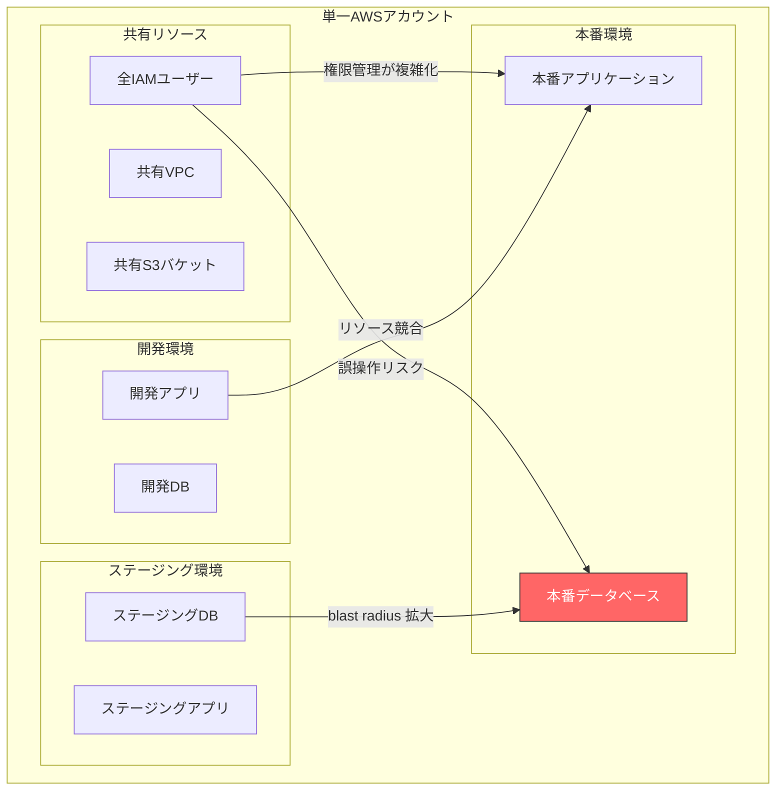

**環境分離の欠如**

開発・ステージング・本番のリソースが同一アカウントに混在すると、開発者が誤って本番データベースを操作してしまうリスクが生じる。IAMポリシーで制御しようとしても、同一アカウント内では完全な隔離は困難である。AWSではアカウントがセキュリティとリソースの**最も強力な境界**であり、IAMポリシーだけでこの境界を代替することはできない。

**爆発半径（Blast Radius）の拡大**

あるワークロードのセキュリティインシデントや設定ミスが、同一アカウント内の他のすべてのリソースに波及する。例えば、開発環境のアクセスキーが漏洩した場合、そのキーの権限次第では本番環境のデータにもアクセスできてしまう。

**IAMの限界**

単一アカウントではIAMユーザー数やポリシー数に上限がある。数百人規模の組織になると、きめ細かい権限管理が実質的に不可能になる。また、IAMポリシーの相互作用が複雑化し、意図しない権限昇格の温床となる。

**サービスクォータの共有**

AWSの各サービスにはアカウント単位のクォータ（リソース上限）が設定されている。本番ワークロードと開発実験が同じクォータを共有すると、開発者のリソース大量作成が本番環境のスケーリングを阻害する可能性がある。

**コスト配分の困難**

単一アカウントでは、どのチーム・プロジェクト・環境がどれだけのコストを消費しているのかを正確に把握するのが困難になる。タグベースのコスト配分は可能だが、タグ付け忘れや不統一が起きやすく、正確性に欠ける。

**コンプライアンスと監査の複雑化**

規制対象のワークロードと非対象のワークロードが混在すると、コンプライアンス監査の範囲が不必要に広がり、監査コストが増大する。PCI DSS、HIPAA、SOC 2などの準拠対象範囲を最小化するためには、ワークロードの分離が不可欠である。

### 1.3 マルチアカウント戦略の台頭

こうした課題を解決するため、AWSは2016年に**AWS Organizations**をリリースし、複数アカウントの一元管理を可能にした。さらに2018年には**AWS Control Tower**をリリースし、ベストプラクティスに基づくマルチアカウント環境のセットアップを自動化するランディングゾーンの概念を導入した。

マルチアカウント戦略の基本思想は、**アカウントをリソースの「コンテナ」として使い、セキュリティ・コスト・運用の境界を明確にする**ことである。これはOSにおけるプロセス分離やコンテナ技術における名前空間の分離と同じ発想であり、**アカウント＝最も強い分離境界**という原則に基づいている。

::: tip マルチアカウント戦略の本質
マルチアカウント戦略は「たくさんのアカウントを作ること」自体が目的ではない。その本質は、**最小権限の原則（Least Privilege）**と**爆発半径の最小化（Blast Radius Minimization）**を実現するためにクラウドの最も強固な境界であるアカウントを活用することにある。
:::

## 2. アーキテクチャ：各クラウドプロバイダのリソース階層

### 2.1 AWS Organizations

AWS Organizationsは、複数のAWSアカウントを階層的に管理するためのサービスである。

#### 基本概念

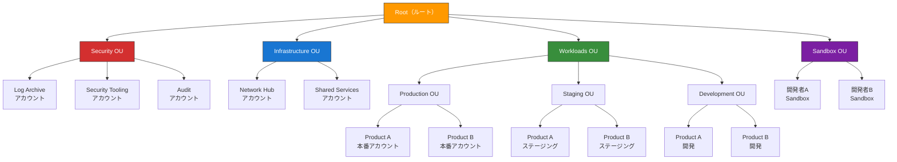

**管理アカウント（Management Account）**

Organizations全体の最上位に位置するアカウントで、組織の作成・管理、アカウントの招待・作成、OU構造の変更、SCP（Service Control Policy）の適用を行う。このアカウントにはワークロードを配置せず、組織管理に特化させるのが鉄則である。管理アカウントはSCPの影響を受けないため、このアカウントが侵害されると組織全体が危険にさらされる。

**組織単位（OU: Organizational Unit）**

アカウントを論理的にグループ化する単位である。OUは最大5階層までネストでき、**SCP（Service Control Policy）**をOUに適用することで、配下のすべてのアカウントに対してガードレールを設定できる。OUにSCPを適用すると、そのOU内のアカウントおよび子OUに再帰的に継承される。

**SCP（Service Control Policy）**

SCPはOrganizationsにおける**予防的ガードレール**の中核メカニズムである。SCPは権限を付与するものではなく、**IAMポリシーが許可できる操作の上限（Permission Boundary）**を定義する。つまり、SCPで許可されていない操作は、たとえIAMポリシーで明示的に許可していても実行できない。

> [!WARNING]
> SCPは管理アカウントのユーザーやロールには適用されない。このため、管理アカウントのアクセスは厳しく制限し、日常的な管理作業には委任管理者（Delegated Administrator）機能を使って他のアカウントに権限を委任するべきである。

SCPの動作を理解するには、IAMポリシーとの関係を整理する必要がある。

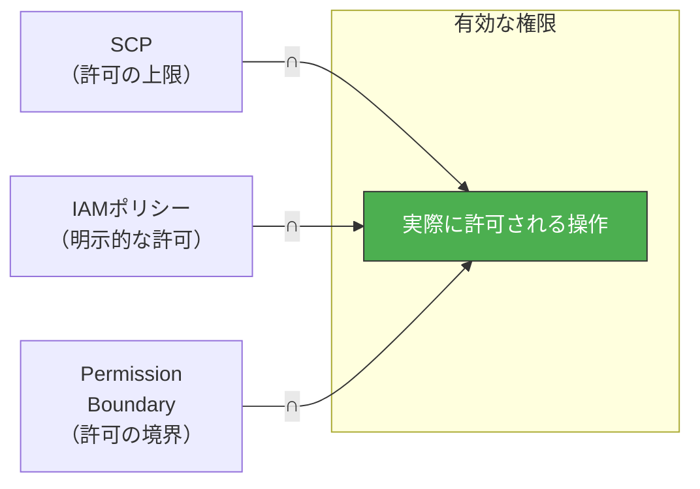

有効な権限は、SCP、IAMポリシー、Permission Boundary（設定されている場合）の**共通部分（論理積）**である。SCPが許可していない操作は、IAMポリシーでどれだけ広い権限を付与しても実行できない。

#### SCPの設計パターン

SCPの設計には大きく2つのアプローチがある。

**許可リスト（Allowlist）方式**

デフォルトですべてのアクションを拒否し、許可するアクションを明示的にリストアップする。最も制限が厳しいが、新しいサービスやアクションを利用するたびにSCPの更新が必要になる。

```json
{
  "Version": "2012-10-17",
  "Statement": [
    {
      "Sid": "AllowSpecificServices",
      "Effect": "Allow",
      "Action": [
        "ec2:*",
        "s3:*",
        "rds:*",
        "lambda:*",
        "iam:*",
        "cloudwatch:*",
        "logs:*"
      ],
      "Resource": "*"
    }
  ]
}
```

**拒否リスト（Denylist）方式**

デフォルトの `FullAWSAccess` ポリシーを維持しつつ、明示的に禁止する操作を追加する。運用の柔軟性が高く、AWSが推奨するアプローチである。

```json
{
  "Version": "2012-10-17",
  "Statement": [
    {
      "Sid": "DenyLeaveOrganization",
      "Effect": "Deny",
      "Action": "organizations:LeaveOrganization",
      "Resource": "*"
    },
    {
      "Sid": "DenyDisableSecurityServices",
      "Effect": "Deny",
      "Action": [
        "guardduty:DeleteDetector",
        "guardduty:DisassociateFromMasterAccount",
        "securityhub:DisableSecurityHub",
        "config:StopConfigurationRecorder",
        "config:DeleteConfigurationRecorder",
        "cloudtrail:StopLogging",
        "cloudtrail:DeleteTrail"
      ],
      "Resource": "*"
    },
    {
      "Sid": "DenyRootUser",
      "Effect": "Deny",
      "Action": "*",
      "Resource": "*",
      "Condition": {
        "StringLike": {
          "aws:PrincipalArn": "arn:aws:iam::*:root"
        }
      }
    }
  ]
}
```

::: details SCPの一般的なガードレール例
- **リージョン制限**：許可されたリージョン以外でのリソース作成を拒否
- **ルートユーザー使用禁止**：メンバーアカウントのルートユーザーの操作を拒否
- **組織離脱の禁止**：`organizations:LeaveOrganization` を拒否
- **セキュリティサービスの無効化禁止**：CloudTrail、GuardDuty、Security Hub、AWS Configの停止・削除を拒否
- **暗号化の強制**：暗号化されていないS3バケットやEBSボリュームの作成を拒否
- **パブリックアクセスの制限**：S3バケットのパブリックアクセス設定変更を拒否
:::

### 2.2 AWS Control Tower

AWS Control Towerは、AWS Organizationsの上に構築された**マルチアカウント環境のセットアップ・ガバナンス自動化サービス**である。ベストプラクティスに基づくランディングゾーン（Landing Zone）を自動的に構築し、継続的なガバナンスを提供する。

#### Landing Zone（ランディングゾーン）とは

ランディングゾーンは、**クラウド環境の「基盤」**である。飛行機が安全に着陸するための滑走路のように、ワークロードをクラウドに安全に展開するための基盤環境を指す。具体的には以下の要素で構成される。

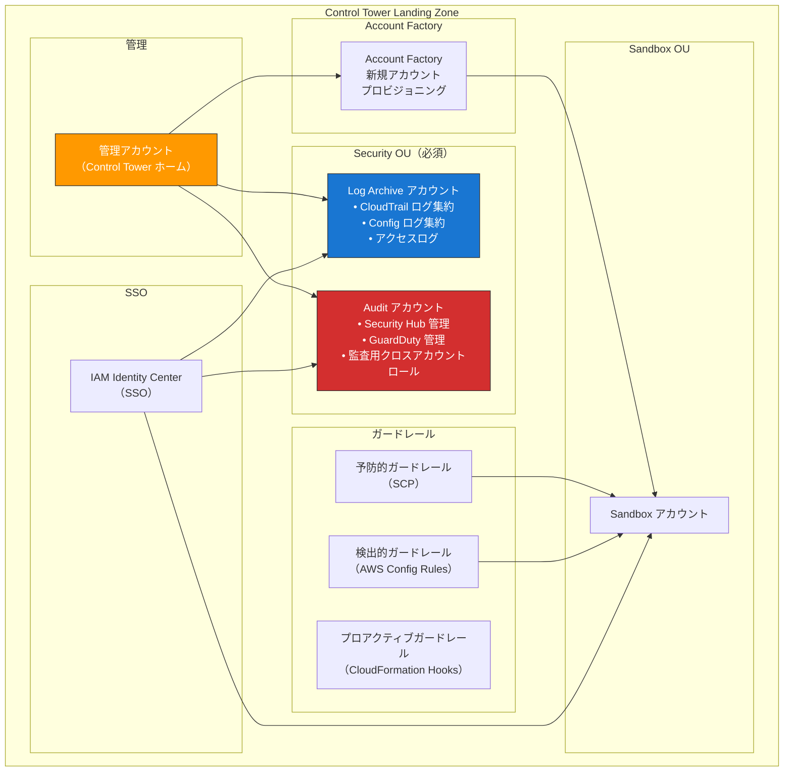

#### ガードレールの3種類

Control Towerは3種類のガードレールを提供する。

| 種類 | メカニズム | 特徴 | 例 |
|------|-----------|------|-----|
| **予防的（Preventive）** | SCP | 禁止された操作を未然に防ぐ | CloudTrailの無効化を禁止 |
| **検出的（Detective）** | AWS Config Rules | 非準拠リソースを検出して通知 | 暗号化されていないS3バケットの検出 |
| **プロアクティブ（Proactive）** | CloudFormation Hooks | デプロイ前に非準拠リソースの作成を阻止 | タグが未設定のリソースのデプロイを拒否 |

ガードレールにはさらに、**必須（Mandatory）**、**強く推奨（Strongly Recommended）**、**選択的（Elective）**の3段階の適用レベルが設定されている。

::: tip 予防的ガードレール vs 検出的ガードレール
予防的ガードレールは操作を「できなくする」ことで問題を未然に防ぐが、あらゆるケースを事前に想定する必要がある。検出的ガードレールは問題が発生した後に「検出して通知する」ため、柔軟性が高い反面、対応が事後的になる。実際の運用ではこの両方を組み合わせ、**多層防御（Defense in Depth）**を実現する。
:::

#### Account Factory

Account Factoryは、Control Towerが提供するアカウントプロビジョニングの仕組みである。新しいアカウントの作成時に、以下を自動的に設定する。

- 組織内の適切なOUへの配置
- ガードレール（SCP・Config Rules）の自動適用
- IAM Identity Center（SSO）の設定
- CloudTrailの有効化とLog Archiveアカウントへのログ送信
- AWS Configの有効化とルールの適用
- VPCのプロビジョニング（オプション）

### 2.3 GCPのリソース階層

Google Cloud Platform（GCP）は、AWSとは異なるリソース階層を持つが、マルチアカウント（マルチプロジェクト）管理の思想は共通している。

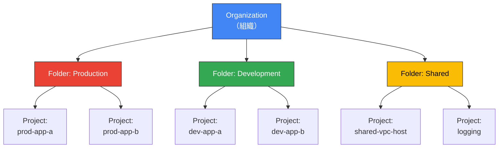

| GCP | AWS対応 | 説明 |
|-----|---------|------|
| **Organization** | Organization（管理アカウント） | Google Workspaceまたは Cloud Identityに紐付く最上位エンティティ |
| **Folder** | OU | プロジェクトを論理的にグループ化。最大10階層のネスト |
| **Project** | AWSアカウント | リソースの最小管理単位。課金・IAM・APIの境界 |
| **Organization Policy** | SCP | 組織/フォルダ/プロジェクトレベルで制約を設定 |

GCPの特徴的な概念として**Shared VPC**がある。これはホストプロジェクトがVPCを所有し、サービスプロジェクトがそのVPCのサブネットを共有利用する仕組みで、ネットワーク管理の集中化とワークロードの分離を両立させる。

### 2.4 Azure Management Groups

Microsoft Azureも同様の階層構造を持つ。

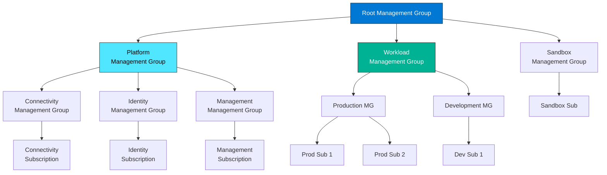

| Azure | AWS対応 | 説明 |
|-------|---------|------|
| **Management Group** | OU | サブスクリプションを論理的にグループ化。最大6階層 |
| **Subscription** | AWSアカウント | 課金とリソース管理の境界 |
| **Azure Policy** | SCP + Config Rules | 予防的・検出的ガードレールの両方の機能を持つ |
| **Azure Blueprints** | Control Tower | ランディングゾーンの構成をテンプレート化 |

Azureでは**Cloud Adoption Framework（CAF）**がマルチアカウント（マルチサブスクリプション）設計のリファレンスアーキテクチャとして提供されており、**Azure Landing Zone**がその実装である。

### 2.5 クラウドプロバイダ間の比較

3大クラウドのマルチアカウント管理機能を横断的に比較する。

| 機能 | AWS | GCP | Azure |
|------|-----|-----|-------|
| 最上位の組織概念 | Organization | Organization | Tenant / Root MG |
| グループ化の単位 | OU（5階層） | Folder（10階層） | Management Group（6階層） |
| アカウント/プロジェクト | AWSアカウント | Project | Subscription |
| 予防的ポリシー | SCP | Organization Policy | Azure Policy (deny effect) |
| 検出的ポリシー | AWS Config Rules | Security Command Center | Azure Policy (audit effect) |
| ランディングゾーン | Control Tower | Cloud Foundation Toolkit | Azure Landing Zone |
| SSO | IAM Identity Center | Cloud Identity | Entra ID |
| アカウント一括作成 | Account Factory | Project Factory | Subscription Vending |

## 3. 実装手法

### 3.1 OU設計パターン

OU構造の設計は、マルチアカウント戦略の成否を決める最も重要な設計判断の一つである。AWSのベストプラクティスとしては、以下のような推奨OU構造がある。

#### 推奨OU構造（AWS Best Practice）

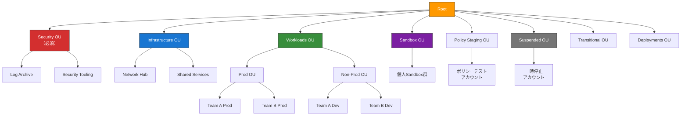

各OUの役割を詳述する。

**Security OU（必須）**

セキュリティとコンプライアンスのための基盤OUである。ここに含まれるアカウントへのアクセスは厳しく制限され、セキュリティチームのみがアクセスできるようにする。

- **Log Archive**：CloudTrail、AWS Config、VPCフローログ、ALBアクセスログなど、全アカウントからのログを集約する。ログの改ざん防止のためS3 Object Lockを有効にし、このアカウントへの書き込みアクセスは最小限に制限する
- **Security Tooling**（Audit）：GuardDuty、Security Hub、Detective、IAM Access Analyzerなどのセキュリティサービスの管理者アカウントとして機能する。セキュリティチームが各アカウントの状態を一元的に監視するためのハブとなる

**Infrastructure OU**

共有インフラを管理するOUである。

- **Network Hub**：Transit Gateway、Direct Connect、VPN接続、Route 53のホストゾーンなど、組織全体のネットワーク基盤を集中管理する
- **Shared Services**：Active Directory、共有CI/CDパイプライン、共通のコンテナレジストリ（ECR）、社内ツールなどを管理する

**Workloads OU**

実際のビジネスアプリケーションを配置するOUである。環境別（Production / Non-Production）にサブOUを作り、さらにチームや製品単位でアカウントを分離する。本番環境のOUには厳しいSCPを適用し、非本番環境にはより緩やかなポリシーを設定する。

**Sandbox OU**

開発者が自由に実験するための個人用アカウントを格納するOUである。コスト上限を設定し、本番環境への接続は完全に遮断する。定期的にリソースを自動削除するポリシーを適用することもある。

**Policy Staging OU**

新しいSCPやガードレールを本番適用前にテストするためのOUである。SCPの変更は影響範囲が大きいため、まずこのOUで動作を検証してからWorkloads OUに適用する。

**Suspended OU**

不要になったアカウントを移動する「ゴミ箱」的なOUである。最も制限的なSCP（すべてのアクションを拒否）を適用して実質的にアカウントを無効化し、一定期間後にアカウントを閉鎖する。

#### OU設計のアンチパターン

::: danger 避けるべきOU設計
1. **チーム組織をそのままOUに反映する**：組織変更のたびにOU構造の再編が必要になる。OUはガバナンスポリシーの適用単位であり、組織図のコピーではない
2. **OU階層が深すぎる**：OUのネストが深いとSCPの継承関係が複雑になり、意図しないポリシーの衝突が発生する。3階層以内に抑えるのが望ましい
3. **管理アカウントにワークロードを配置する**：管理アカウントはSCPの影響を受けないため、セキュリティ上の最大のリスクとなる
4. **環境（Dev/Stg/Prod）をタグだけで区別する**：アカウントレベルの分離なしに環境をタグで区別しても、爆発半径の縮小にはならない
:::

### 3.2 アカウントファクトリーとInfrastructure as Code

大規模な組織では数十から数百のアカウントを管理する必要があり、手動でのアカウント作成・設定は現実的ではない。**アカウントファクトリー**は、アカウントのプロビジョニングを自動化・標準化する仕組みである。

#### Account Factory for Terraform（AFT）

AWSが提供するTerraformベースのアカウントファクトリーで、Control Towerと統合されている。

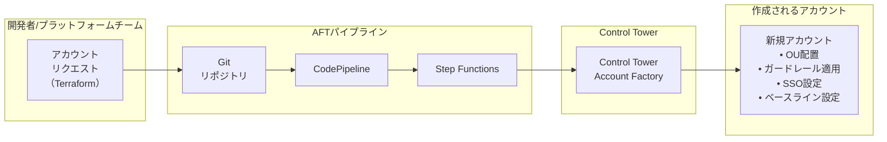

AFTを使用したアカウント定義の例を示す。

```hcl
# account-request.tf
module "new_account" {
  source = "./modules/aft-account-request"

  control_tower_parameters = {
    AccountEmail              = "prod-app-a@example.com"
    AccountName               = "prod-app-a"
    ManagedOrganizationalUnit = "Workloads/Production"
    SSOUserEmail              = "admin@example.com"
    SSOUserFirstName          = "Platform"
    SSOUserLastName           = "Admin"
  }

  account_tags = {
    Environment = "production"
    Team        = "platform"
    CostCenter  = "CC-1234"
  }

  # Account-level customization
  account_customizations_name = "production-baseline"
}
```

#### アカウントベースラインのカスタマイズ

アカウント作成後に適用するベースライン設定（カスタマイズ）として、以下のような構成を自動化する。

```hcl
# account-customizations/production-baseline/main.tf

# Enable GuardDuty
resource "aws_guardduty_detector" "main" {
  enable = true

  datasources {
    s3_logs {
      enable = true
    }
    kubernetes {
      audit_logs {
        enable = true
      }
    }
  }
}

# Enable S3 Block Public Access (account-level)
resource "aws_s3_account_public_access_block" "main" {
  block_public_acls       = true
  block_public_policy     = true
  ignore_public_acls      = true
  restrict_public_buckets = true
}

# Default EBS encryption
resource "aws_ebs_encryption_by_default" "main" {
  enabled = true
}

# IAM password policy
resource "aws_iam_account_password_policy" "strict" {
  minimum_password_length        = 14
  require_lowercase_characters   = true
  require_numbers                = true
  require_uppercase_characters   = true
  require_symbols                = true
  allow_users_to_change_password = true
  max_password_age               = 90
  password_reuse_prevention      = 24
}
```

### 3.3 SSO統合（IAM Identity Center）

マルチアカウント環境では、開発者やオペレーターが複数のアカウントに対してシームレスにアクセスできる仕組みが不可欠である。**IAM Identity Center**（旧 AWS SSO）は、この要件を満たすAWSのネイティブSSOサービスである。

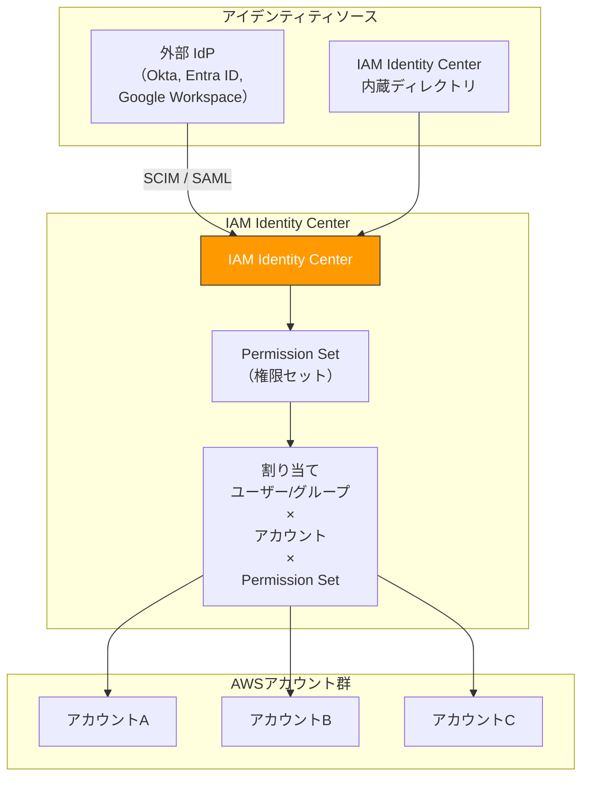

#### Permission Set（権限セット）

Permission Setは、IAM Identity Centerにおける権限の定義単位である。実体としては、対象アカウントにIAMロールとして展開される。

```json
{
  "PermissionSetName": "DeveloperAccess",
  "Description": "Developer access for non-production accounts",
  "SessionDuration": "PT4H",
  "ManagedPolicies": [
    "arn:aws:iam::aws:policy/PowerUserAccess"
  ],
  "InlinePolicy": {
    "Version": "2012-10-17",
    "Statement": [
      {
        "Sid": "DenyIAMUserCreation",
        "Effect": "Deny",
        "Action": [
          "iam:CreateUser",
          "iam:CreateAccessKey"
        ],
        "Resource": "*"
      }
    ]
  }
}
```

#### 典型的なPermission Setの設計

| Permission Set名 | 用途 | 適用先アカウント |
|-------------------|------|-----------------|
| `AdministratorAccess` | 緊急時の管理者アクセス | すべて（セキュリティチーム限定） |
| `PlatformEngineer` | インフラ管理 | Infrastructure OUのアカウント |
| `DeveloperAccess` | アプリケーション開発 | Non-Prod OUのアカウント |
| `ReadOnlyAccess` | 監査・調査用の読み取り専用 | すべて |
| `DatabaseAdmin` | データベース管理 | 特定のワークロードアカウント |
| `BillingAccess` | コスト確認 | 管理アカウント |

> [!NOTE]
> IAM Identity Centerは、短期間の一時的な認証情報（STS トークン）を自動的に発行する。従来のIAMユーザーとアクセスキーの利用を排除し、**長期間有効な認証情報（Long-lived Credentials）を一切使わない運用**を実現できる。これはセキュリティ上のベストプラクティスである。

### 3.4 ネットワーク設計との統合

マルチアカウント環境では、各アカウントのVPCをどのように接続するかが重要な設計判断となる。

#### Transit Gatewayによるハブ・アンド・スポーク型接続

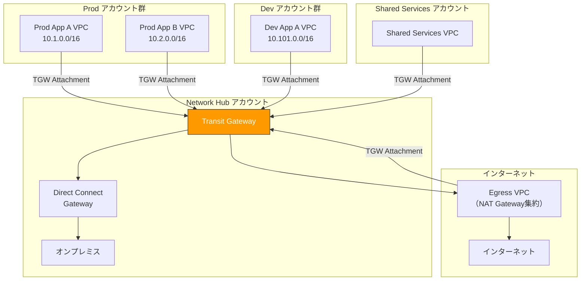

ネットワーク設計の主要な選択肢を整理する。

| パターン | 説明 | 適したケース |
|----------|------|-------------|
| **VPC Peering** | 2つのVPCを1対1で接続 | 少数アカウントの直接接続 |
| **Transit Gateway** | ハブ・アンド・スポーク型で多数のVPCを接続 | 大規模組織の標準的な構成 |
| **PrivateLink** | サービス単位の接続（IPアドレス空間の重複が可能） | マイクロサービス間の接続 |
| **Shared VPC（GCP）** | ホストプロジェクトからサービスプロジェクトへのVPC共有 | GCPにおける標準的なネットワーク設計 |

::: warning CIDR設計に注意
マルチアカウント環境でTransit Gatewayを使う場合、各VPCのCIDRブロックが重複しないように**IPアドレス管理（IPAM）**を計画的に行う必要がある。AWS VPC IPAMを使用すると、CIDRの割り当てを組織全体で一元管理でき、重複を自動的に防止できる。
:::

## 4. 運用の実際

### 4.1 ログ集約

マルチアカウント環境において、すべてのアカウントのアクティビティを可視化するためのログ集約は、セキュリティとコンプライアンスの基盤である。

#### CloudTrail組織トレイル

AWS CloudTrailの**組織トレイル（Organization Trail）**を使用すると、Organizations内のすべてのアカウント・すべてのリージョンのAPI呼び出しを自動的に単一のS3バケットに集約できる。

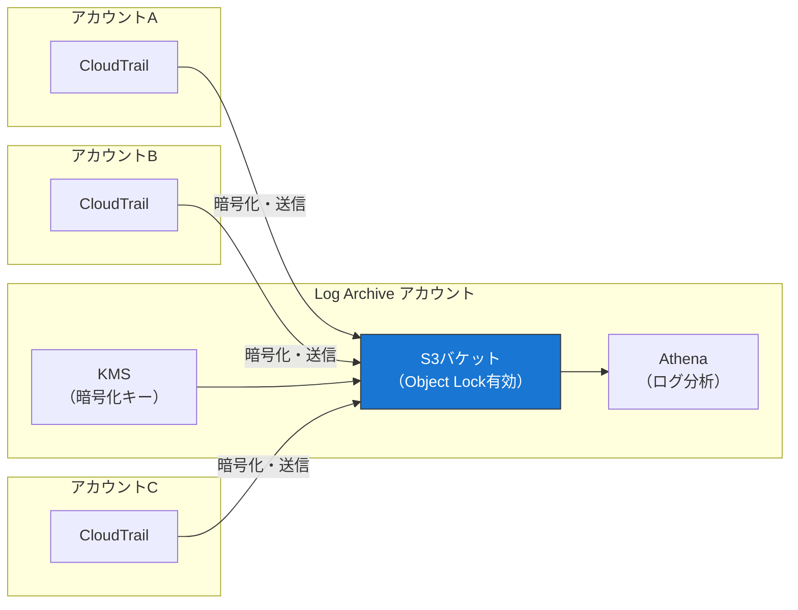

ログの保全性を確保するために、以下の対策を講じる。

- **S3 Object Lock（Compliance モード）**：ログの削除・上書きを技術的に不可能にする（ルートユーザーでも無効化できない）
- **KMSによる暗号化**：クロスアカウントのKMSキーを使用してログを暗号化する
- **SCPによる保護**：すべてのアカウントでCloudTrailの停止・削除を禁止するSCPを適用する
- **CloudTrail Insights**：異常なAPI呼び出しパターンを自動検出する

#### 集約すべきログの種類

| ログの種類 | サービス | 目的 |
|-----------|---------|------|
| API呼び出し | CloudTrail | 操作の監査証跡 |
| リソース構成変更 | AWS Config | 構成変更の追跡 |
| VPCフローログ | VPC Flow Logs | ネットワークトラフィックの分析 |
| DNSクエリ | Route 53 Query Logging | DNS関連のセキュリティ分析 |
| ALBアクセスログ | ALB Access Logs | Webアクセスパターンの分析 |
| S3アクセスログ | S3 Server Access Logging | データアクセスの監査 |
| WAFログ | AWS WAF | 悪意あるリクエストの検出 |

### 4.2 セキュリティの一元管理

#### AWS Security Hub

Security Hubは、複数のアカウントにまたがるセキュリティの状態を一元的に可視化するサービスである。Organizations統合により、すべてのメンバーアカウントを自動的にSecurity Hubに登録できる。

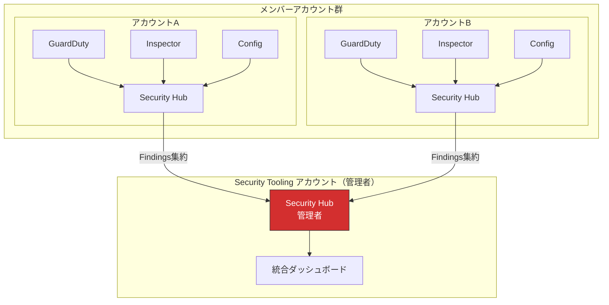

Security Hubが集約するのは**Finding（検出結果）**であり、以下のソースからの情報を統合する。

- **Amazon GuardDuty**：脅威検出（不審なAPIコール、暗号通貨マイニング、データ漏洩の兆候）
- **Amazon Inspector**：脆弱性スキャン（EC2インスタンス、ECRコンテナイメージ、Lambda関数）
- **AWS Config**：コンプライアンスルールへの非準拠検出
- **IAM Access Analyzer**：外部からのアクセスが可能なリソースの検出
- **AWS Firewall Manager**：WAFルールの適用状態の検出

Security Hubは**AWS Foundational Security Best Practices（FSBP）**、**CIS AWS Foundations Benchmark**、**PCI DSS**などのセキュリティ標準に基づいた自動評価を実行し、各アカウントのセキュリティスコアを算出する。

#### Amazon GuardDuty

GuardDutyの組織統合では、Security ToolingアカウントをGuardDutyの委任管理者として設定する。これにより、新しくOrganizationsに参加したアカウントでもGuardDutyが自動的に有効化される。

GuardDutyは以下のデータソースを分析する。

- CloudTrailの管理イベントとデータイベント
- VPCフローログ
- DNSクエリログ
- S3データイベント
- EKS監査ログ
- RDSログインアクティビティ
- Lambda関数のネットワークアクティビティ

::: tip 委任管理者（Delegated Administrator）パターン
Security Hub、GuardDuty、AWS Config、IAM Access Analyzerなどのセキュリティサービスは、管理アカウントで直接運用するのではなく、Security ToolingアカウントをOrganizationsの**委任管理者**として設定する。これにより、管理アカウントへのアクセスを最小化しつつ、セキュリティの一元管理を実現できる。
:::

### 4.3 コストの一元管理

#### AWS Organizationsの一括請求（Consolidated Billing）

Organizations内のすべてのアカウントの利用料金は、管理アカウントに一括で請求される。これにより以下のメリットがある。

**ボリュームディスカウントの共有**

S3やData Transferなど、利用量に応じて単価が下がるサービスでは、すべてのアカウントの利用量が合算されるため、個別アカウントよりも有利な単価が適用される。

**Reserved Instances / Savings Plansの共有**

あるアカウントで購入したReserved InstancesやSavings Plansの割引は、Organizations全体で自動的に共有される（設定で無効化も可能）。

#### コスト配分と可視化

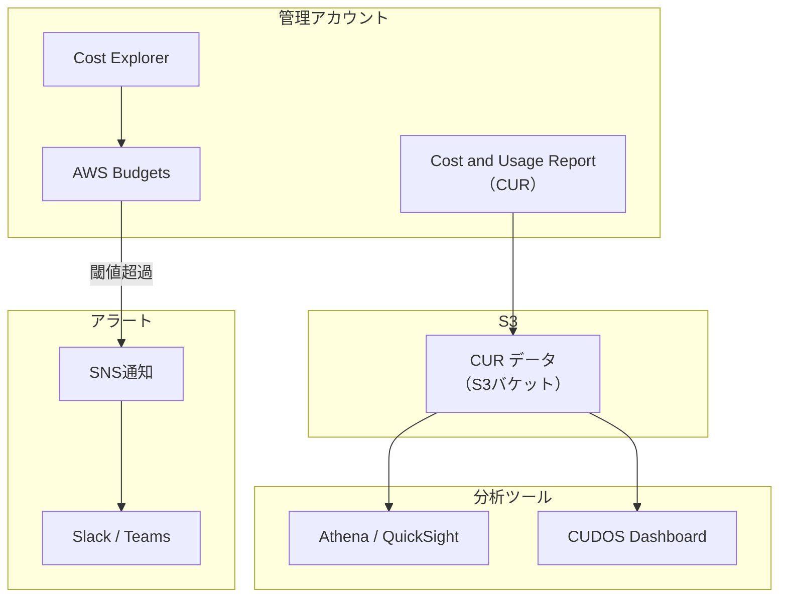

**コスト管理のベストプラクティス**

- **アカウントレベルのコスト配分**：アカウントが環境やチームに対応しているため、アカウント単位のコスト集計だけで自然とコスト配分が可能になる
- **タグベースのコスト配分**：`CostCenter`、`Project`、`Environment` などのタグを活用した詳細なコスト配分を行う
- **AWS Budgets**：アカウントごと、OUごとに予算を設定し、閾値を超えた場合にアラートを送信する
- **異常検出（Cost Anomaly Detection）**：機械学習ベースのコスト異常検出を有効にし、予期しないコスト急増を早期に検知する

::: warning Sandbox アカウントのコスト制御
Sandboxアカウントでは、開発者が自由に実験する代わりに、コストが制御不能になるリスクがある。以下の対策を講じる。
- **AWS Budgets によるアカウント単位の月次予算**：例えば月額100 USDの予算を設定
- **Budget Action**：予算超過時に自動的にIAMポリシーをアタッチしてリソース作成を制限する
- **SCPによるインスタンスタイプ制限**：高額なインスタンスタイプの使用をSCPで制限する
- **nuke ツール**：aws-nuke や cloud-nuke などのツールで定期的にリソースを自動削除する
:::

### 4.4 実際のマルチアカウント構成の例

ここまでの内容を統合した、中〜大規模組織の実践的なマルチアカウント構成例を示す。

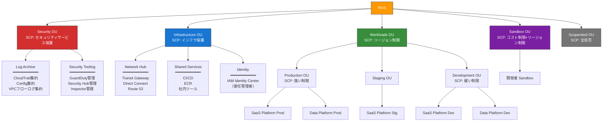

この構成では、以下の設計判断がなされている。

1. **セキュリティの分離**：セキュリティ関連のサービスは専用アカウントに集約し、ワークロードアカウントから独立して管理する
2. **ネットワークの集中管理**：Transit GatewayをNetwork Hubアカウントに配置し、すべてのVPC間通信をハブ・アンド・スポーク型で管理する
3. **環境の分離**：Production / Staging / Developmentを別アカウントに分離し、本番環境には最も厳しいSCPを適用する
4. **コスト可視性**：アカウントレベルで環境とプロダクトが分離されているため、Cost Explorerでアカウント別にコストを即座に確認できる

## 5. 将来展望

### 5.1 Infrastructure as Codeとの深い統合

マルチアカウント戦略はInfrastructure as Code（IaC）との統合が不可欠であり、この方向はさらに深化している。

**GitOpsベースのアカウントライフサイクル管理**

アカウントの作成・設定・廃止のすべてをGitリポジトリで管理し、Pull Requestベースのワークフローで変更を適用する。Crossplane、Terraform Cloud / Enterprise、Pulumiなどのツールが、クラウドリソースとアカウント構成の宣言的管理を実現している。

```
git push → Pull Request → レビュー → マージ → CI/CDパイプライン → アカウント作成/設定変更
```

**Policy as Code**

SCPやOrganization Policy、Azure Policyを、HashiCorp Sentinelや Open Policy Agent（OPA）といったポリシーエンジンで管理する動きが進んでいる。ポリシーをコードとして記述し、テスト・バージョン管理・CI/CDパイプラインでの検証を行うことで、ポリシーの品質と変更管理の信頼性が向上する。

### 5.2 ポリシーの自動最適化

現在のSCP設計は、セキュリティチームが手動でポリシーを策定する「静的な」アプローチが主流である。しかし、以下の方向に進化しつつある。

**IAM Access Analyzerによる最小権限の自動推定**

AWS IAM Access Analyzerは、CloudTrailのログを分析して、実際に使用されたアクションに基づいた**最小権限のIAMポリシーを自動生成**する機能を提供している。この考え方をSCPやOrganization Policyにも適用し、実際の利用パターンに基づいてポリシーを最適化する方向が期待される。

**異常検知ベースのポリシー提案**

機械学習を用いて、通常のアクセスパターンから逸脱する行動を検出し、それを防止するためのポリシーを自動的に提案する仕組みが開発されつつある。

### 5.3 マルチクラウドガバナンス

多くの企業がAWS、GCP、Azureの複数のクラウドを利用する**マルチクラウド環境**を運用している。現時点では各クラウドのガバナンスツールは独自の体系を持っており、統一的な管理は困難である。

この課題に対して、以下のアプローチが進められている。

**クラウド横断のガバナンスプラットフォーム**

Terraform Cloudのようなマルチクラウド対応のIaCプラットフォームを中心に、クラウドごとのアカウント（プロジェクト/サブスクリプション）管理を統一的に行う取り組みがある。また、HashiCorp Vaultのような統一的な秘密管理や、Open Policy Agentのようなクラウド非依存のポリシーエンジンが、マルチクラウドガバナンスの基盤となりつつある。

**CSPM（Cloud Security Posture Management）**

Prisma Cloud、Wiz、Orca Securityなどのサードパーティツールは、AWS、GCP、Azureのリソースを横断的にスキャンし、セキュリティポスチャの評価と是正を一元的に管理する機能を提供している。これらのツールは各クラウドネイティブのセキュリティサービス（Security Hub、Security Command Center、Microsoft Defender for Cloud）を補完する存在として広く採用されている。

### 5.4 アカウント単位からワークロード単位へ

従来のマルチアカウント戦略は「1ワークロード＝1アカウント」が基本単位であったが、マイクロサービスアーキテクチャの普及により、アカウント数が爆発的に増加する課題が生じている。

これに対して、以下のような進化が見られる。

- **サービスごとのアカウント分割の見直し**：過度な分割はオーバーヘッドを増大させるため、関連性の高いサービスを同一アカウントにまとめる「Right-sizing」の考え方
- **コンテナやサーバーレスによるアカウント内分離の強化**：ECSタスクロールやLambda関数ロールによるワークロード単位の権限分離で、アカウント分割を減らしつつセキュリティを維持する
- **VPC Lattice**のような新しいネットワークサービスが、アカウント境界を意識せずにサービス間通信を管理する方向を示している

## 6. まとめ

マルチアカウント戦略は、クラウド環境のセキュリティ・ガバナンス・コスト管理を支える根幹的な設計パターンである。その核心は以下の3つの原則に集約される。

1. **アカウントは最も強い分離境界である**：IAMポリシーやタグだけでは実現できないレベルの分離を、アカウント分割によって達成する
2. **ガードレールで予防と検出を両立する**：SCPによる予防的制御とConfig Rulesによる検出的制御を組み合わせ、多層防御を実現する
3. **自動化がスケーラビリティの鍵である**：Account Factory、IaC、GitOpsにより、数十から数百のアカウントを一貫したポリシーで管理する

単一アカウントの限界を認識し、組織の規模と成熟度に合わせた段階的なマルチアカウント戦略の導入が、クラウドネイティブな組織への成長を支える重要な基盤となる。

> [!NOTE]
> マルチアカウント戦略は「一度構築して終わり」ではない。組織の成長、新しいワークロードの追加、規制要件の変化に応じて、OU構造、SCP、アカウント設計を継続的に見直し、進化させていく必要がある。この点で、Infrastructure as Codeによる宣言的な管理と、変更管理プロセスの確立が長期的な成功の鍵となる。
