# マルチテナンシーの設計——SaaS を支えるテナント分離・ルーティング・運用戦略

## 1. マルチテナンシーとは

### 1.1 問題の出発点

ソフトウェアをサービスとして提供する SaaS モデルでは、多数の顧客（テナント）が同一のアプリケーションを利用する。もっとも素朴な方法は、テナントごとに独立した環境（サーバー、データベース、ネットワーク）を用意することだが、この方式はテナント数が増えるにつれてインフラコストと運用負荷が線形に増大する。

**マルチテナンシー（Multi-Tenancy）** とは、単一のソフトウェアインスタンスやインフラを複数のテナントで共有しつつ、各テナントのデータや設定を論理的に分離するアーキテクチャパターンである。目的は明確で、**コスト効率と運用効率を高めながら、テナント間の分離を適切に担保すること** だ。

### 1.2 シングルテナンシーとの対比

マルチテナンシーの意味をより明確にするために、シングルテナンシーと並べて比較する。

| 特性 | シングルテナンシー | マルチテナンシー |
|------|-------------------|-----------------|
| **インフラ共有** | テナントごとに専用 | 複数テナントで共有 |
| **コスト効率** | テナント数に比例して増大 | テナント数が増えても限定的 |
| **カスタマイズ性** | テナントごとに自由 | 共通基盤の範囲内で設定可能 |
| **分離レベル** | 物理的に完全分離 | 論理的分離（設計次第で強弱あり） |
| **運用複雑性** | 環境数が増え管理困難 | 単一環境だが分離ロジックが複雑 |
| **デプロイ** | テナントごとに個別可能 | 全テナントに一括適用が基本 |

### 1.3 マルチテナンシーが解決する課題

マルチテナンシーは次のような課題を解決する。

1. **インフラコストの最適化**: リソースを共有することで、アイドル状態のリソースを削減する
2. **運用負荷の集約**: 単一のコードベースとインフラを運用すればよい
3. **スケーリングの柔軟性**: テナント追加がインフラ追加を必要としない
4. **デプロイの一元化**: バグ修正や機能追加を全テナントに同時に展開できる

ただし、マルチテナンシーは万能薬ではない。テナント間のデータ漏洩リスク、ノイジーネイバー問題、コンプライアンス要件への対応など、シングルテナンシーでは発生しない課題が生まれる。これらのトレードオフを適切に管理することが、マルチテナンシー設計の本質である。

### 1.4 マルチテナンシーの全体像

マルチテナンシーを構成する主要な設計要素を俯瞰する。

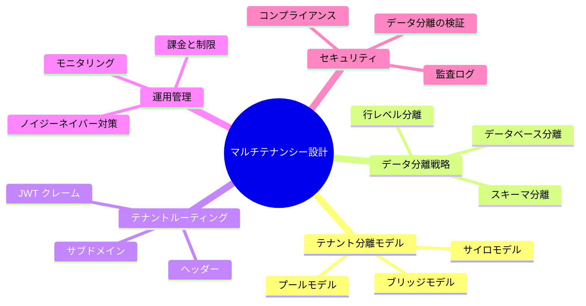

以降のセクションで、これらの設計要素を順に深掘りしていく。

## 2. テナント分離モデル

テナント分離モデルは、マルチテナンシー設計の最も根本的な選択であり、コスト・分離性・運用性のバランスを決定づける。代表的なモデルは **サイロ（Silo）**、**プール（Pool）**、**ブリッジ（Bridge）** の 3 つである。

### 2.1 サイロモデル（Silo Model）

サイロモデルでは、テナントごとに専用のリソース（コンピュート、ストレージ、ネットワーク）を割り当てる。マルチテナンシーの管理レイヤーは共有されるが、ワークロードの実行環境はテナント単位で分離される。

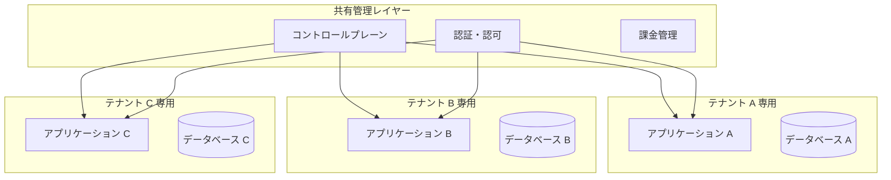

**メリット**:
- テナント間の分離が最も強い
- 障害の影響範囲がテナント単位に限定される
- コンプライアンス要件（データの地理的配置など）への対応が容易
- テナントごとのパフォーマンスチューニングが可能

**デメリット**:
- テナント数に比例してインフラコストが増大する
- デプロイやアップデートをテナント単位で実施する必要がある
- オンボーディングにリソースプロビジョニングが必要

サイロモデルは、金融機関や医療機関など、厳格なデータ分離が求められるシナリオに適している。

### 2.2 プールモデル（Pool Model）

プールモデルでは、すべてのテナントが同一のリソースを共有する。アプリケーション、データベース、コンピュートリソースは共有され、テナントの識別と分離はソフトウェアのロジックで実現する。

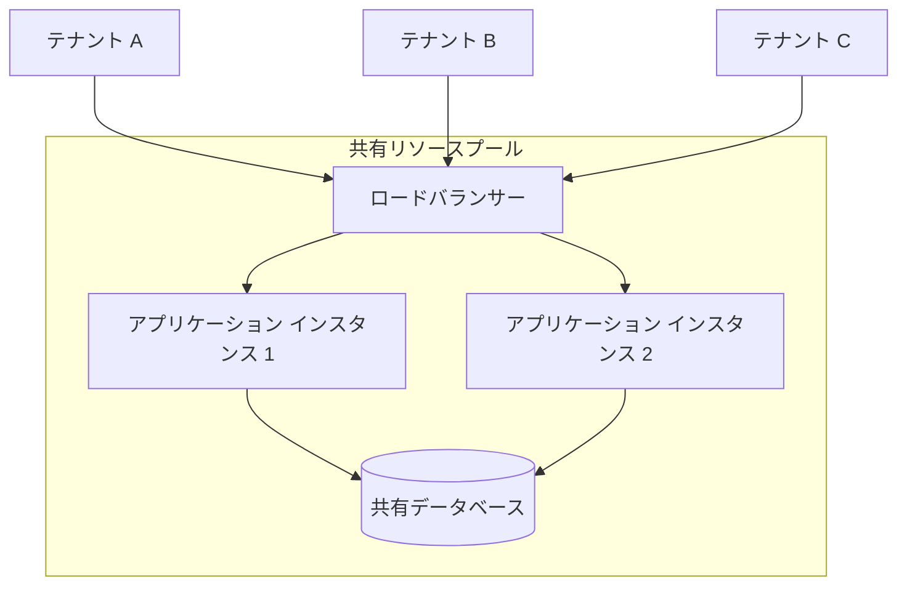

**メリット**:
- インフラコストが最も低い（リソースを最大限共有）
- テナント追加のオーバーヘッドがほぼゼロ
- デプロイが一度で全テナントに反映される
- リソース利用効率が高い

**デメリット**:
- テナント間の分離がソフトウェアロジックに依存する（バグがデータ漏洩に直結する）
- ノイジーネイバー問題が発生しやすい
- テナントごとのカスタマイズが制限される
- コンプライアンス要件への対応が複雑になる

プールモデルは、テナント数が非常に多く、各テナントの利用量が比較的小さい SaaS サービスに適している。

### 2.3 ブリッジモデル（Bridge Model）

ブリッジモデルは、サイロとプールの中間に位置するハイブリッドモデルである。一部のレイヤーは共有し、一部はテナント単位で分離する。

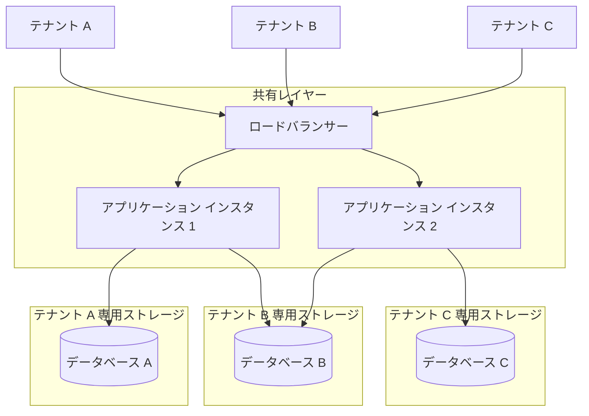

このモデルの典型的なパターンは、**コンピュートは共有し、データストレージはテナント単位で分離する** というものだ。データの分離を物理的に担保しつつ、アプリケーション層のコストを抑えることができる。

**メリット**:
- サイロとプールのバランスが取れる
- データ分離を物理的に担保しつつコストを抑えられる
- テナントの要件に応じて分離レベルを段階的に調整可能

**デメリット**:
- 設計と運用の複雑性が最も高い
- テナントごとに異なる構成を管理する仕組みが必要
- テナントの分類やティアリング（階層化）の設計が求められる

### 2.4 モデル選択の判断軸

3 つのモデルの選択は、以下の軸で判断する。

| 判断軸 | サイロ | プール | ブリッジ |
|--------|--------|--------|----------|
| コスト効率 | 低い | 高い | 中間 |
| 分離レベル | 最高 | 最低（論理的） | 中間（選択可能） |
| 運用複雑性 | 中（環境数多） | 低（単一環境） | 高（混在管理） |
| スケーラビリティ | テナント追加にコスト | テナント追加が容易 | 中間 |
| コンプライアンス対応 | 容易 | 困難 | 柔軟 |

実際の SaaS プロダクトでは、全テナントに単一モデルを適用するのではなく、テナントのティア（Free / Pro / Enterprise）に応じてモデルを使い分けることが一般的である。たとえば、Enterprise テナントにはサイロモデル、Free テナントにはプールモデルを適用するといった設計だ。

## 3. データ分離戦略

マルチテナンシーにおいて、データの分離はセキュリティ上最も重要な設計領域である。テナント A のデータがテナント B から見えてしまう事故は、サービスの信頼を根本から破壊する。

### 3.1 データベースレベルの分離

テナントごとに独立したデータベースインスタンスを用意する方式である。

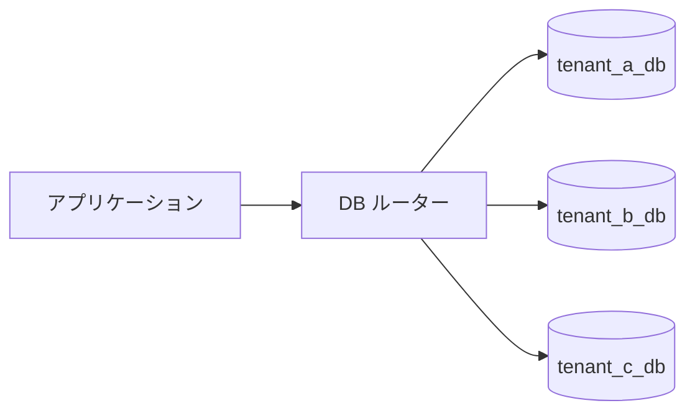

```python
class DatabaseRouter:
    def __init__(self):
        # Mapping from tenant ID to database connection
        self._connections: dict[str, Connection] = {}

    def get_connection(self, tenant_id: str) -> Connection:
        if tenant_id not in self._connections:
            config = self._load_tenant_db_config(tenant_id)
            self._connections[tenant_id] = create_connection(
                host=config.host,
                port=config.port,
                database=config.database,
                user=config.user,
                password=config.password,
            )
        return self._connections[tenant_id]

    def _load_tenant_db_config(self, tenant_id: str) -> DBConfig:
        # Fetch database configuration for the tenant
        # from a central configuration store
        return config_store.get_db_config(tenant_id)
```

**特徴**:
- 物理的な分離により、データ漏洩のリスクが最小化される
- テナントごとにバックアップ、リストア、スケーリングが独立して実施可能
- データベース管理の運用負荷が高い（テナント数 × 管理タスク）
- コネクションプールの管理が複雑になる

### 3.2 スキーマレベルの分離

単一のデータベースインスタンス内で、テナントごとに別のスキーマ（PostgreSQL のスキーマ、MySQL のデータベース）を用いる方式である。

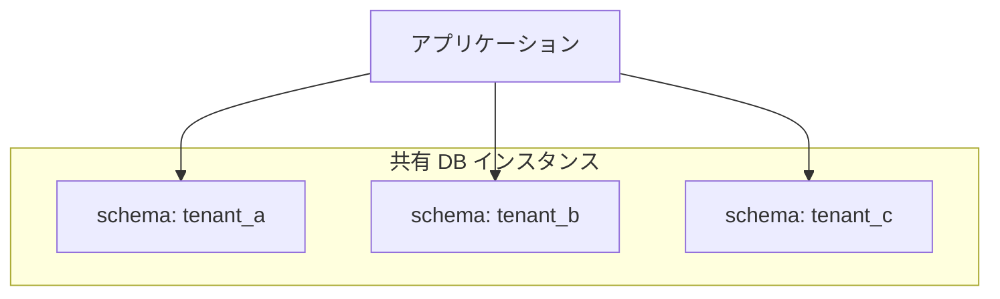

```sql
-- Create schema per tenant
CREATE SCHEMA tenant_a;
CREATE SCHEMA tenant_b;

-- Access tenant data by setting search path
SET search_path TO tenant_a;
SELECT * FROM orders;

-- Or use fully qualified names
SELECT * FROM tenant_b.orders;
```

**特徴**:
- データベースインスタンスの共有によりコストを抑えつつ、テーブル構造レベルの分離を確保
- スキーマのマイグレーションをテナントごとに管理する必要がある
- データベースインスタンスの障害が全テナントに影響する
- PostgreSQL の場合、スキーマ数が非常に多くなるとカタログテーブルの肥大化が問題になりうる

### 3.3 行レベルの分離（Row-Level Isolation）

すべてのテナントのデータを同一テーブルに格納し、`tenant_id` カラムでフィルタリングする方式である。

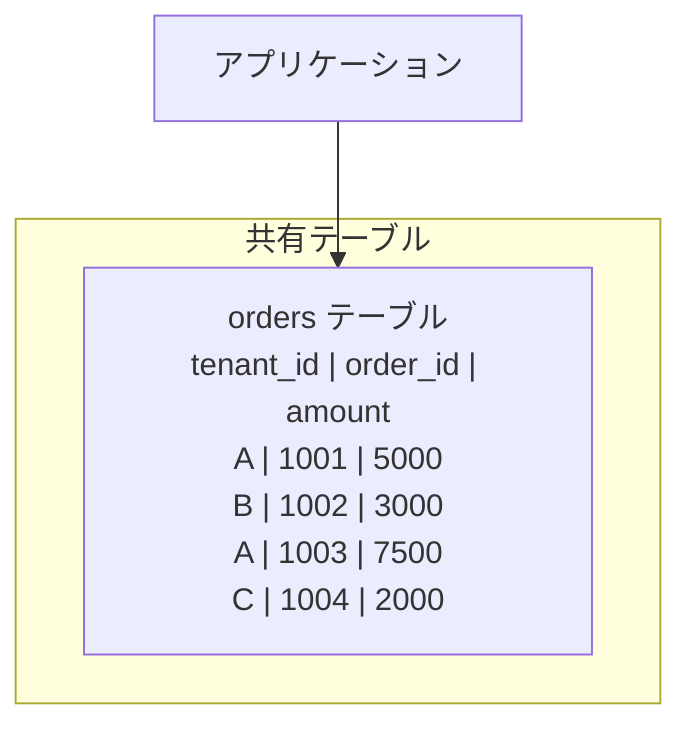

```sql
-- Table with tenant_id column
CREATE TABLE orders (
    tenant_id VARCHAR(64) NOT NULL,
    order_id BIGINT PRIMARY KEY,
    amount DECIMAL(10, 2) NOT NULL,
    created_at TIMESTAMP DEFAULT CURRENT_TIMESTAMP
);

-- Index for efficient tenant-scoped queries
CREATE INDEX idx_orders_tenant ON orders (tenant_id);

-- All queries MUST include tenant_id filter
SELECT * FROM orders WHERE tenant_id = 'tenant_a';
```

行レベル分離を安全に運用するためには、アプリケーションの全クエリに `tenant_id` フィルタが含まれることを保証する仕組みが不可欠である。PostgreSQL の Row-Level Security（RLS）はこの保証をデータベースレベルで実現する強力な機構だ。

```sql
-- Enable Row-Level Security
ALTER TABLE orders ENABLE ROW LEVEL SECURITY;

-- Create policy: users can only see rows for their tenant
CREATE POLICY tenant_isolation ON orders
    USING (tenant_id = current_setting('app.current_tenant'));

-- Set tenant context before queries
SET app.current_tenant = 'tenant_a';
SELECT * FROM orders;  -- Only returns tenant_a's rows
```

**特徴**:
- コスト効率が最も高い
- テナント横断の分析（管理者向けダッシュボードなど）が容易
- `tenant_id` フィルタの漏れがデータ漏洩に直結する
- テナント間のインデックス競合やテーブル肥大化に注意が必要
- RLS を使うことでデータベースレベルでの分離を強制できる

### 3.4 分離戦略の比較

| 観点 | データベース分離 | スキーマ分離 | 行レベル分離 |
|------|-----------------|-------------|-------------|
| 分離の強度 | 最強（物理的） | 中（論理的） | 最弱（アプリ依存） |
| コスト | 高い | 中間 | 低い |
| 運用負荷 | 高い | 中間 | 低い |
| マイグレーション | テナント単位 | テナント単位（自動化可） | 一括適用 |
| バックアップ粒度 | テナント単位 | テナント単位（やや複雑） | テナント単位は困難 |
| スケーラビリティ | テナント数上限あり | 中程度 | 非常に高い |

> [!TIP]
> 行レベル分離を採用する場合、**テナントコンテキストの注入を自動化する** ことが極めて重要である。ORM のミドルウェアやクエリビルダーのグローバルスコープで `tenant_id` フィルタを自動付与し、開発者が個別に指定する必要がない仕組みを構築すべきだ。

## 4. テナントルーティング

テナントルーティングとは、受信したリクエストがどのテナントに属するかを判定し、適切なリソースへ振り分ける仕組みである。テナント識別（Tenant Resolution）とも呼ばれる。

### 4.1 テナント識別の方法

テナントを識別する主な方法は以下の通りである。

#### サブドメインによる識別

```
https://tenant-a.example.com/api/orders
https://tenant-b.example.com/api/orders
```

リクエストの `Host` ヘッダーからサブドメイン部分を抽出し、テナント ID として使用する。

```python
def resolve_tenant_from_subdomain(request) -> str:
    host = request.headers.get("Host", "")
    # Extract subdomain: "tenant-a.example.com" -> "tenant-a"
    parts = host.split(".")
    if len(parts) >= 3:
        return parts[0]
    raise TenantResolutionError(f"Cannot resolve tenant from host: {host}")
```

**メリット**: URL から直感的にテナントが判別できる、DNS ワイルドカードで拡張が容易
**デメリット**: SSL ワイルドカード証明書が必要、DNS の管理が必要

#### パスプレフィックスによる識別

```
https://api.example.com/tenant-a/orders
https://api.example.com/tenant-b/orders
```

URL パスの先頭部分をテナント識別子として使用する。

**メリット**: DNS の追加設定が不要、単一のドメインで運用可能
**デメリット**: URL 設計がテナント識別と結合する、ルーティングロジックが複雑になりがち

#### カスタムヘッダーによる識別

```http
GET /api/orders HTTP/1.1
Host: api.example.com
X-Tenant-ID: tenant-a
```

API リクエストにカスタムヘッダーを含めてテナントを識別する。

**メリット**: URL 設計がテナントに依存しない、柔軟性が高い
**デメリット**: ブラウザから直接アクセスする場合にヘッダー設定が困難、CORS のプリフライトで追加設定が必要

#### JWT クレームによる識別

認証トークン（JWT）にテナント ID を埋め込む方式である。

```json
{
  "sub": "user-123",
  "tenant_id": "tenant-a",
  "roles": ["admin"],
  "exp": 1741132800
}
```

```python
def resolve_tenant_from_jwt(request) -> str:
    token = request.headers.get("Authorization", "").replace("Bearer ", "")
    payload = jwt.decode(token, SECRET_KEY, algorithms=["HS256"])
    tenant_id = payload.get("tenant_id")
    if not tenant_id:
        raise TenantResolutionError("No tenant_id in JWT claims")
    return tenant_id
```

**メリット**: 認証と同時にテナント識別が完了する、改ざんが困難
**デメリット**: トークン発行時にテナント ID を正しく設定する責務がある、マルチテナントユーザー（複数テナントに所属するユーザー）の扱いが複雑

### 4.2 テナントルーティングのアーキテクチャ

テナント識別からリソースへのルーティングまでの全体フローを示す。

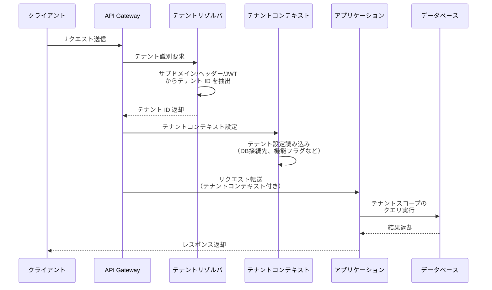

### 4.3 テナントコンテキストの伝搬

テナント ID が識別されたら、リクエストの処理全体を通じてテナントコンテキストを維持する必要がある。Web フレームワークにおけるミドルウェアパターンが一般的だ。

```python
from contextvars import ContextVar

# Thread/async-safe tenant context
_current_tenant: ContextVar[str] = ContextVar("current_tenant")


def get_current_tenant() -> str:
    try:
        return _current_tenant.get()
    except LookupError:
        raise RuntimeError("Tenant context not set")


class TenantMiddleware:
    """Middleware to resolve and set tenant context for each request."""

    def __init__(self, app, resolver: TenantResolver):
        self.app = app
        self.resolver = resolver

    async def __call__(self, scope, receive, send):
        if scope["type"] == "http":
            tenant_id = self.resolver.resolve(scope)
            token = _current_tenant.set(tenant_id)
            try:
                await self.app(scope, receive, send)
            finally:
                _current_tenant.reset(token)
        else:
            await self.app(scope, receive, send)
```

> [!WARNING]
> テナントコンテキストの伝搬は、非同期処理やバックグラウンドジョブにおいても確実に行われなければならない。キューにジョブを投入する際にテナント ID をペイロードに含め、ワーカー側でテナントコンテキストを復元する設計が必要だ。

## 5. ノイジーネイバー問題

### 5.1 ノイジーネイバーとは

**ノイジーネイバー（Noisy Neighbor）** とは、共有リソース上の特定のテナントが過剰にリソースを消費し、他のテナントのパフォーマンスを劣化させる現象である。マルチテナンシー固有の課題であり、プールモデルやブリッジモデルで特に顕在化する。

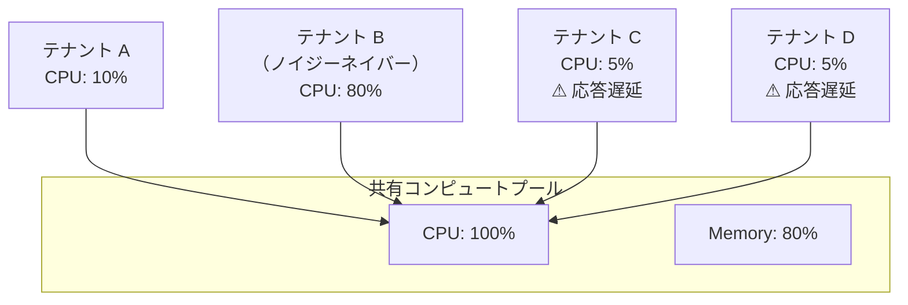

### 5.2 ノイジーネイバーの発生パターン

ノイジーネイバーは様々なレイヤーで発生する。

| レイヤー | 発生例 |
|---------|--------|
| **CPU** | 大量のバッチ処理、複雑な演算 |
| **メモリ** | 巨大なデータセットのインメモリ処理 |
| **ディスク I/O** | 大量のデータ書き込み、全件スキャンクエリ |
| **ネットワーク** | 大容量ファイルのアップロード/ダウンロード |
| **データベース** | ロック競合、大量の同時接続、重いクエリ |
| **キャッシュ** | キャッシュの大量使用によるエビクション |

### 5.3 対策手法

#### レートリミッティング

テナントごとに API 呼び出しの頻度を制限する。

```python
import time
from collections import defaultdict


class TenantRateLimiter:
    """Token bucket rate limiter per tenant."""

    def __init__(self, rate: float, capacity: int):
        self._rate = rate          # Tokens per second
        self._capacity = capacity  # Max burst size
        self._tokens: dict[str, float] = defaultdict(lambda: float(capacity))
        self._last_refill: dict[str, float] = defaultdict(time.monotonic)

    def allow(self, tenant_id: str) -> bool:
        now = time.monotonic()
        elapsed = now - self._last_refill[tenant_id]
        self._last_refill[tenant_id] = now

        # Refill tokens
        self._tokens[tenant_id] = min(
            self._capacity,
            self._tokens[tenant_id] + elapsed * self._rate,
        )

        if self._tokens[tenant_id] >= 1.0:
            self._tokens[tenant_id] -= 1.0
            return True
        return False
```

#### リソースクォータ

テナントごとに使用可能なリソース量の上限を設定する。

```yaml
# Tenant resource quotas configuration
tenants:
  tenant-a:
    tier: enterprise
    quotas:
      max_api_requests_per_minute: 10000
      max_storage_gb: 500
      max_concurrent_connections: 100
      max_query_execution_time_seconds: 30
  tenant-b:
    tier: free
    quotas:
      max_api_requests_per_minute: 100
      max_storage_gb: 5
      max_concurrent_connections: 5
      max_query_execution_time_seconds: 5
```

#### フェアスケジューリング

共有リソースの割り当てを公平に行うスケジューリングアルゴリズムを適用する。データベースのコネクションプールやワーカースレッドをテナント間で公平に配分する。

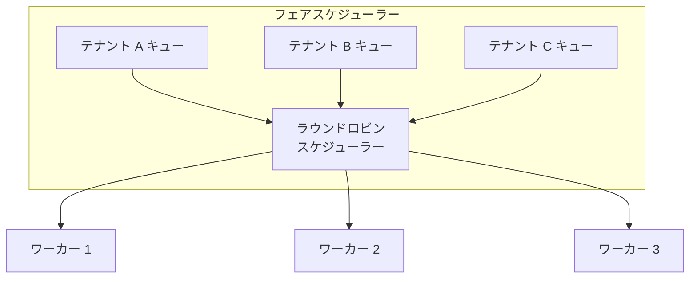

#### サーキットブレーカー

特定のテナントがエラーやタイムアウトを多発している場合、一時的にリクエストを遮断してシステム全体を保護する。

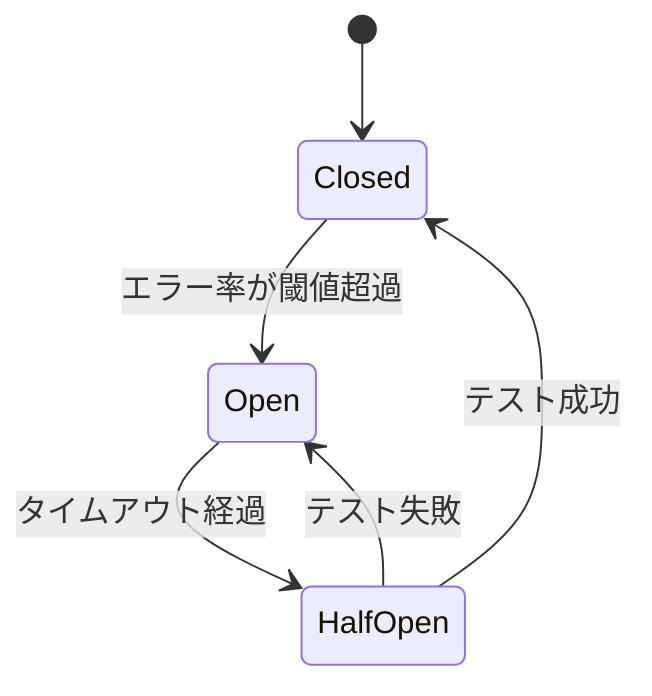

#### テナント分離の動的昇格

ノイジーネイバーを検知した場合、そのテナントを動的にプールモデルからサイロモデルへ昇格させる（専用リソースに移行する）仕組みも有効である。これはブリッジモデルの応用と言える。

## 6. テナント別の課金・制限

### 6.1 ティアリング（階層化）

SaaS サービスでは、テナントをティア（プラン）に分類し、ティアごとに機能や制限を設定するのが一般的である。

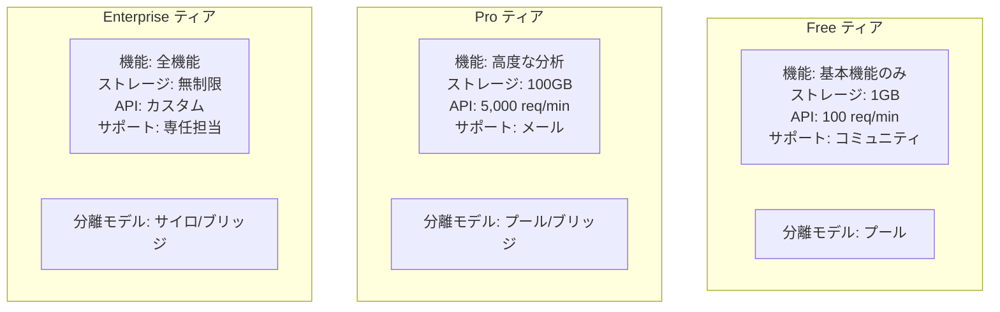

### 6.2 使用量の計測（メータリング）

課金の基礎となるのは、テナントごとの使用量の正確な計測である。

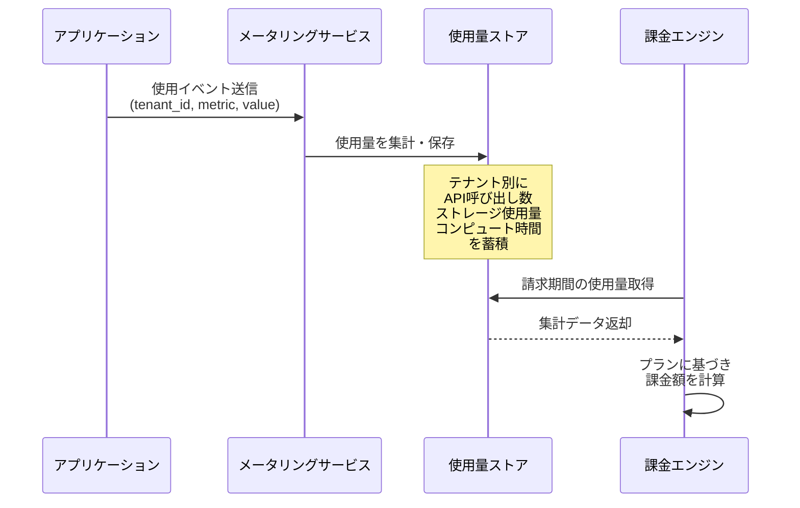

メータリングの設計で注意すべきポイント:

1. **非同期で計測する**: リクエスト処理のクリティカルパスにメータリングを組み込まない
2. **べき等性を確保する**: 同一イベントの重複送信に対して正確な計測を維持する
3. **バッファリングとバッチ処理**: 大量のイベントを効率的に処理するために、ローカルバッファリングとバッチ書き込みを用いる

```python
class UsageMeter:
    """Async usage metering with local buffering."""

    def __init__(self, flush_interval: int = 60, batch_size: int = 1000):
        self._buffer: list[UsageEvent] = []
        self._flush_interval = flush_interval
        self._batch_size = batch_size

    async def record(self, tenant_id: str, metric: str, value: float):
        event = UsageEvent(
            tenant_id=tenant_id,
            metric=metric,
            value=value,
            timestamp=time.time(),
            idempotency_key=generate_idempotency_key(),
        )
        self._buffer.append(event)

        if len(self._buffer) >= self._batch_size:
            await self._flush()

    async def _flush(self):
        if not self._buffer:
            return
        events = self._buffer[:]
        self._buffer.clear()
        # Batch write to usage store
        await self._usage_store.batch_insert(events)
```

### 6.3 制限の実施（Enforcement）

使用量の計測だけでなく、制限の実施も重要である。制限を超過したテナントに対して、適切なアクションを取る必要がある。

| 制限種別 | 実施方法 | 例 |
|---------|---------|-----|
| **ハードリミット** | 制限超過時にリクエストを拒否 | API レートリミット超過で 429 を返す |
| **ソフトリミット** | 警告を出しつつ処理は継続 | ストレージ容量の 80% で通知 |
| **従量課金** | 制限なしで使用量に応じて課金 | API 呼び出し 1,000 回あたり $X |
| **スロットリング** | 制限超過時に処理速度を低下 | バックグラウンドジョブの優先度を下げる |

> [!NOTE]
> 制限の実施においては、テナントに対して明確なフィードバックを提供することが重要である。HTTP レスポンスヘッダーに残りクォータ情報を含めることが一般的だ。
> ```http
> HTTP/1.1 200 OK
> X-RateLimit-Limit: 1000
> X-RateLimit-Remaining: 742
> X-RateLimit-Reset: 1741132860
> ```

## 7. セキュリティとコンプライアンス

### 7.1 テナント間のデータ分離の検証

マルチテナンシーにおける最も深刻なセキュリティリスクは、テナント間のデータ漏洩である。これを防ぐためには、複数のレイヤーで防御を行う「多層防御（Defense in Depth）」の考え方が必須だ。

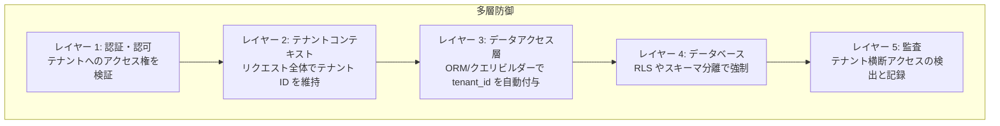

各レイヤーの具体的な実装指針を示す。

**レイヤー 1: 認証・認可**
- テナント ID はユーザーの認証情報（JWT クレーム等）から取得し、リクエストパラメータからは受け付けない
- あるテナントのユーザーが別テナントのリソースにアクセスしようとした場合、403 Forbidden を返す

**レイヤー 2: テナントコンテキスト**
- ミドルウェアでテナントコンテキストを設定し、処理全体で一貫して維持する
- テナントコンテキストが未設定の状態でデータアクセスが行われた場合、エラーとして扱う

**レイヤー 3: データアクセス層**
- ORM のグローバルスコープやクエリビルダーのインターセプターで、`tenant_id` フィルタを自動付与する
- 開発者が明示的にフィルタを指定する必要がない仕組みにする

**レイヤー 4: データベース**
- PostgreSQL の RLS など、データベースレベルでの分離を最終防衛ラインとして設定する
- アプリケーション層のバグがあっても、データベースレベルで漏洩を防止する

**レイヤー 5: 監査**
- テナント横断のアクセスパターンを検出するログ分析を実施する
- 異常なアクセスパターン（普段アクセスしないテナントのデータへのクエリなど）をアラートとして通知する

### 7.2 暗号化

テナントデータの暗号化は、保存時（at-rest）と転送時（in-transit）の両面で実施する。

| 暗号化の種類 | 説明 | 実装例 |
|-------------|------|--------|
| **転送時暗号化** | ネットワーク通信の暗号化 | TLS 1.3 の適用 |
| **保存時暗号化** | ストレージ上のデータの暗号化 | AES-256 による暗号化 |
| **テナント別暗号鍵** | テナントごとに異なる暗号鍵を使用 | AWS KMS のカスタマーマネージドキー |

テナント別の暗号鍵（Tenant-Specific Encryption Keys）を導入すると、特定テナントのデータ漏洩が発生しても影響を当該テナントに限定できる。また、テナントの退会時に暗号鍵を破棄することで、暗号学的にデータを消去（Crypto Shredding）できる。

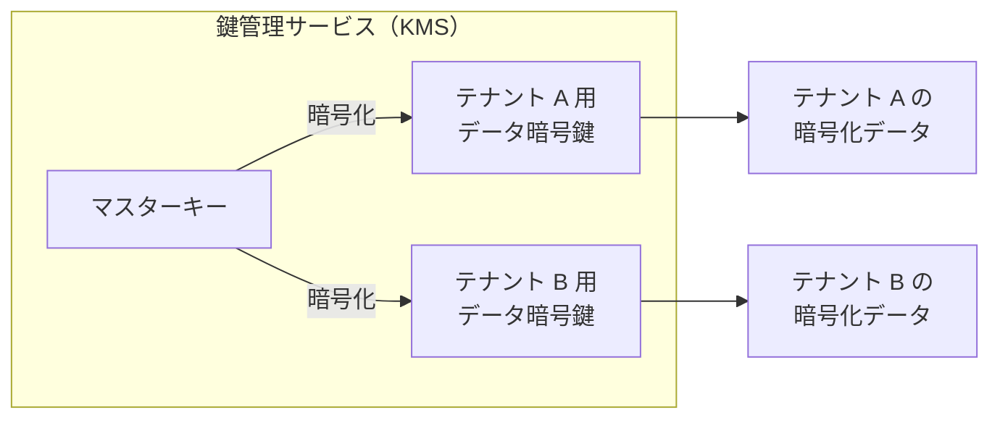

### 7.3 コンプライアンス要件

マルチテナント環境では、テナントが属する業界や地域によって異なるコンプライアンス要件を満たす必要がある。

| 規制・基準 | 主な要件 | マルチテナンシーへの影響 |
|-----------|---------|----------------------|
| **GDPR** | EU 市民のデータ保護、データの地理的配置 | テナントのデータが EU リージョンに保存されることの保証 |
| **HIPAA** | 医療情報の保護 | テナント間の厳格なデータ分離、監査ログの必須化 |
| **SOC 2** | セキュリティ、可用性、機密性の統制 | アクセス制御の証跡、定期的な脆弱性評価 |
| **PCI DSS** | クレジットカード情報の保護 | カード情報を扱うテナントの追加分離 |

コンプライアンス要件に応じて、テナントの分離レベルを動的に調整することが重要である。たとえば、HIPAA 準拠が求められるテナントにはサイロモデルを適用し、標準的なテナントにはプールモデルを適用するといった運用が考えられる。

### 7.4 監査ログ

マルチテナント環境での監査ログは、以下の情報を含む必要がある。

```json
{
  "timestamp": "2026-03-05T12:34:56.789Z",
  "tenant_id": "tenant-a",
  "user_id": "user-123",
  "action": "orders.read",
  "resource": "/api/orders/1001",
  "source_ip": "203.0.113.42",
  "result": "success",
  "request_id": "req-abc-123"
}
```

重要なのは、監査ログ自体もテナント間で分離される必要があるという点だ。テナント A の管理者がテナント B の監査ログを閲覧できてはならない。ただし、プラットフォーム管理者はすべてのテナントのログを横断的に検索できる必要がある。

## 8. Kubernetes でのマルチテナンシー

コンテナオーケストレーションプラットフォームである Kubernetes は、マルチテナント環境の構築に広く使われている。Kubernetes でのマルチテナンシーには複数のアプローチがあり、それぞれ分離レベルと運用コストが異なる。

### 8.1 Namespace ベースの分離

最も一般的なアプローチは、テナントごとに Kubernetes Namespace を割り当てる方式である。

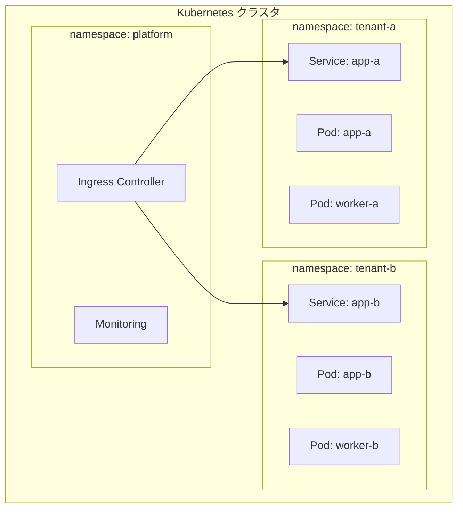

Namespace による分離を強化するために、以下のリソースを組み合わせる。

**ResourceQuota**: テナント（Namespace）ごとのリソース使用量を制限する。

```yaml
apiVersion: v1
kind: ResourceQuota
metadata:
  name: tenant-a-quota
  namespace: tenant-a
spec:
  hard:
    requests.cpu: "4"
    requests.memory: 8Gi
    limits.cpu: "8"
    limits.memory: 16Gi
    pods: "20"
    services: "10"
    persistentvolumeclaims: "5"
```

**NetworkPolicy**: テナント間のネットワーク通信を制限する。

```yaml
apiVersion: networking.k8s.io/v1
kind: NetworkPolicy
metadata:
  name: tenant-isolation
  namespace: tenant-a
spec:
  podSelector: {}
  policyTypes:
    - Ingress
    - Egress
  ingress:
    # Allow traffic only from the same namespace
    - from:
        - podSelector: {}
    # Allow traffic from ingress controller
    - from:
        - namespaceSelector:
            matchLabels:
              name: platform
  egress:
    # Allow DNS resolution
    - to:
        - namespaceSelector: {}
      ports:
        - protocol: UDP
          port: 53
    # Allow traffic within the same namespace
    - to:
        - podSelector: {}
```

**RBAC**: テナントのユーザーが自分の Namespace 内のリソースのみ操作できるようにする。

```yaml
apiVersion: rbac.authorization.k8s.io/v1
kind: RoleBinding
metadata:
  name: tenant-a-admin
  namespace: tenant-a
subjects:
  - kind: User
    name: tenant-a-admin@example.com
roleRef:
  kind: ClusterRole
  name: admin
  apiGroup: rbac.authorization.k8s.io
```

### 8.2 クラスタベースの分離

テナントごとに独立した Kubernetes クラスタを割り当てる、サイロモデルのアプローチである。

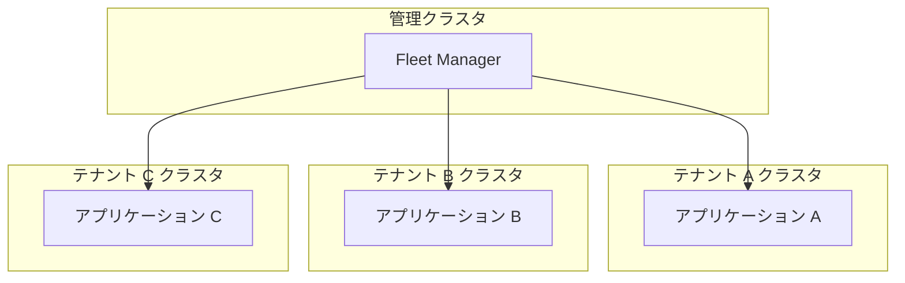

**メリット**:
- 最も強い分離（カーネル、ネットワーク、ストレージのすべてが独立）
- テナントごとのクラスタバージョンやアドオンのカスタマイズが可能
- 障害の影響範囲がクラスタ単位に限定

**デメリット**:
- クラスタ管理のオーバーヘッドが非常に大きい
- コスト効率が低い（コントロールプレーンのコストがクラスタ数分発生）
- テナント追加にクラスタプロビジョニングが必要

### 8.3 仮想クラスタ（vCluster）

近年注目されているアプローチとして、仮想クラスタがある。ホストクラスタ内に軽量な仮想 Kubernetes クラスタを作成し、テナントごとに割り当てる。

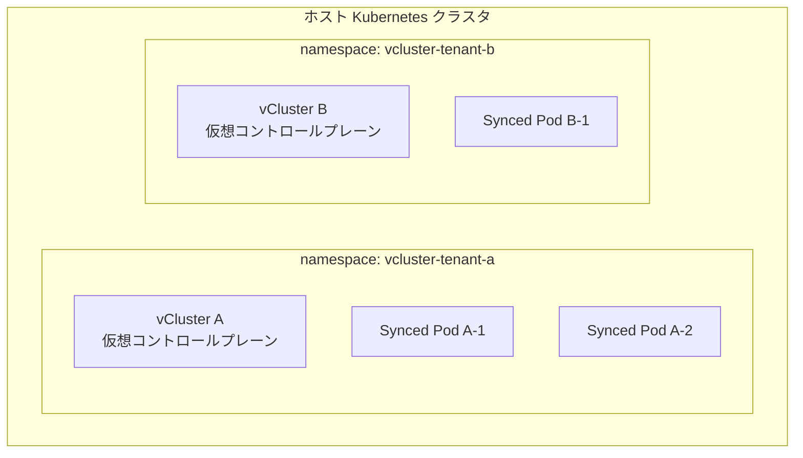

vCluster はテナントに対して独立した Kubernetes API を提供しつつ、実際のワークロードはホストクラスタ上で動作する。Namespace ベースの分離よりも強い分離を提供しつつ、クラスタベースの分離よりもコスト効率が高い。

### 8.4 Kubernetes マルチテナンシーの比較

| 観点 | Namespace 分離 | 仮想クラスタ | クラスタ分離 |
|------|---------------|-------------|-------------|
| 分離レベル | 中（論理的） | 高（仮想 API） | 最高（物理的） |
| コスト | 低い | 中間 | 高い |
| テナント API アクセス | 制限付き | フル K8s API | フル K8s API |
| テナント追加速度 | 秒単位 | 分単位 | 分〜時間単位 |
| 管理複雑性 | 低い | 中間 | 高い |
| カスタマイズ性 | 制限的 | 高い | 最高 |

## 9. 設計のベストプラクティス

### 9.1 テナント識別を最初に設計する

テナントの識別と分離は、アプリケーションのあらゆる層に影響を与える横断的関心事（Cross-Cutting Concern）である。後付けで導入するのは極めて困難であり、設計の初期段階でテナント識別の戦略を確定させるべきだ。

具体的には、以下の問いに答えを出す。

1. テナント ID はどこから取得するか（サブドメイン、JWT、ヘッダー）
2. テナントコンテキストはどのように伝搬するか
3. データ分離はどのレベルで行うか
4. テナントの設定やカスタマイズはどの範囲で許可するか

### 9.2 テナント対応を透過的にする

テナント対応のロジックをビジネスロジックに混在させてはならない。ミドルウェア、ORM のグローバルスコープ、データベースの RLS といった仕組みで、テナント分離をインフラレベルで強制する。

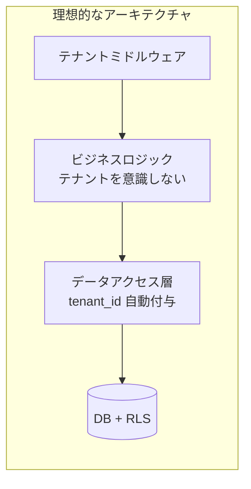

こうすることで、ビジネスロジックの開発者はテナントの存在を意識する必要がなく、フィルタの付け忘れによるデータ漏洩を防止できる。

### 9.3 テナント分離のテストを自動化する

テナント間のデータ漏洩は、最も重大なセキュリティインシデントの一つである。自動テストでテナント分離が正しく機能していることを継続的に検証する。

```python
class TestTenantIsolation:
    """Automated tests to verify tenant data isolation."""

    def test_tenant_cannot_read_other_tenant_data(self):
        # Create data for tenant A
        with tenant_context("tenant-a"):
            create_order(amount=1000)

        # Verify tenant B cannot see tenant A's data
        with tenant_context("tenant-b"):
            orders = list_orders()
            assert len(orders) == 0

    def test_tenant_cannot_update_other_tenant_data(self):
        # Create data for tenant A
        with tenant_context("tenant-a"):
            order = create_order(amount=1000)

        # Verify tenant B cannot update tenant A's order
        with tenant_context("tenant-b"):
            with pytest.raises(PermissionError):
                update_order(order.id, amount=2000)

    def test_missing_tenant_context_raises_error(self):
        # Without tenant context, data access should fail
        with pytest.raises(RuntimeError, match="Tenant context not set"):
            list_orders()
```

### 9.4 オンボーディングとオフボーディングを自動化する

テナントの追加（オンボーディング）と削除（オフボーディング）は、手動で行うとミスが発生しやすく、スケーラブルでもない。自動化されたパイプラインを構築する。

**オンボーディングのフロー**:

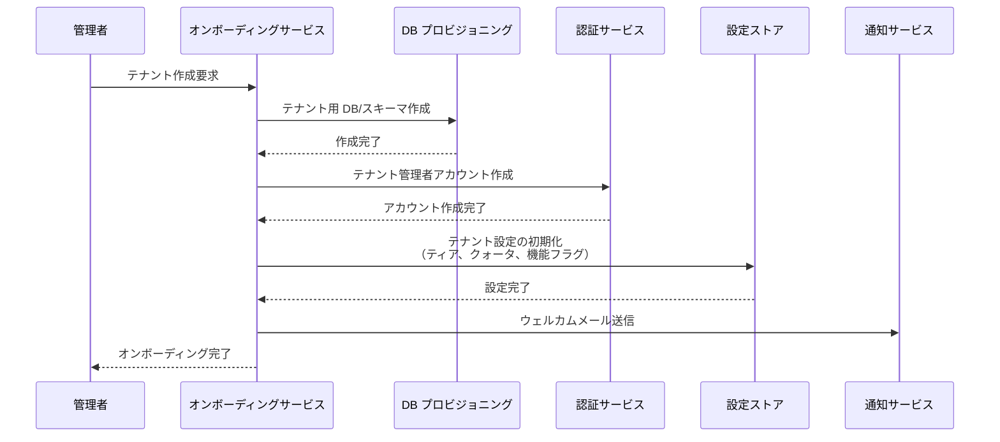

**オフボーディングの注意点**:
- テナントデータの完全削除（GDPR の「忘れられる権利」への対応）
- Crypto Shredding によるデータの暗号学的消去
- テナントに関連するすべてのリソース（DB、ストレージ、キャッシュ、キュー）の確実なクリーンアップ
- データ保持期間中のアーカイブ対応

### 9.5 テナントごとのモニタリングとオブザーバビリティ

テナント単位でシステムの状態を把握できるモニタリング基盤が必要である。

```yaml
# Prometheus metrics with tenant label
- name: http_requests_total
  type: counter
  labels:
    - tenant_id
    - method
    - status
    - endpoint

- name: http_request_duration_seconds
  type: histogram
  labels:
    - tenant_id
    - method
    - endpoint

- name: tenant_storage_usage_bytes
  type: gauge
  labels:
    - tenant_id
    - storage_type
```

テナント ID をメトリクスやログのラベルに含めることで、以下が可能になる。

- テナントごとのリソース使用状況の可視化
- ノイジーネイバーの早期検出
- テナントごとの SLA 準拠状況の確認
- 課金用の使用量データの収集

> [!WARNING]
> テナント数が非常に多い場合（数万〜数十万テナント）、テナント ID をメトリクスのラベルとして使用するとカーディナリティの爆発を引き起こし、Prometheus などの監視システムに過大な負荷がかかる。この場合は、テナントごとのメトリクスをログベースの集計やストリーミング処理で代替する、あるいはティア別にサンプリングレートを変えるといった対策が必要になる。

### 9.6 段階的なマルチテナンシー移行

既存のシングルテナントアプリケーションをマルチテナント化する場合、一度にすべてを変更するのではなく、段階的に移行することが推奨される。

```mermaid
graph LR
    STEP1["Step 1<br/>テナント識別の導入<br/>（全リクエストに tenant_id を付与）"]
    STEP2["Step 2<br/>データ層の分離<br/>（tenant_id カラム追加 + RLS）"]
    STEP3["Step 3<br/>認証・認可の統合<br/>（テナント対応の認証基盤）"]
    STEP4["Step 4<br/>リソース制限の導入<br/>（クォータ + レートリミット）"]
    STEP5["Step 5<br/>テナント管理の<br/>セルフサービス化"]

    STEP1 --> STEP2
    STEP2 --> STEP3
    STEP3 --> STEP4
    STEP4 --> STEP5
```

各ステップの間に十分なテスト期間を設け、テナント分離が正しく機能していることを検証する。

### 9.7 設計判断のまとめ

マルチテナンシーの設計判断を以下のディシジョンツリーにまとめる。

```mermaid
graph TD
    START{テナント数は?}
    START -->|少数（〜10）| FEW{厳格なコンプライアンス<br/>要件がある?}
    START -->|中規模（10〜1000）| MED{テナントごとの<br/>利用量の差は?}
    START -->|大量（1000〜）| MANY[プールモデル<br/>行レベル分離]

    FEW -->|はい| SILO[サイロモデル<br/>DB 分離]
    FEW -->|いいえ| BRIDGE1[ブリッジモデル<br/>スキーマ分離]

    MED -->|大きい| BRIDGE2[ブリッジモデル<br/>ティア別に分離レベルを変更]
    MED -->|均一| POOL[プールモデル<br/>スキーマ or 行レベル分離]
```

このディシジョンツリーはあくまで出発点であり、実際のプロダクトでは、セキュリティ要件、コスト制約、チームの技術力、ターゲット市場の特性など、多くの要素を総合的に判断する必要がある。

## まとめ

マルチテナンシーは、SaaS プロダクトのスケーラビリティとコスト効率を実現する上で不可欠なアーキテクチャパターンである。しかし、その設計は単なる技術的な選択ではなく、ビジネスモデル、コンプライアンス要件、運用体制を含む総合的な判断を要する。

本記事で扱った設計要素を振り返る。

1. **テナント分離モデル**: サイロ・プール・ブリッジの 3 モデルから、要件に応じて選択する。多くのプロダクトではティア別に使い分ける
2. **データ分離戦略**: データベース分離、スキーマ分離、行レベル分離から選択し、多層防御で安全性を担保する
3. **テナントルーティング**: サブドメイン、パス、ヘッダー、JWT クレームなどの方式でテナントを識別し、コンテキストを伝搬する
4. **ノイジーネイバー対策**: レートリミッティング、リソースクォータ、フェアスケジューリング、サーキットブレーカーを組み合わせて対処する
5. **課金と制限**: ティアリング、メータリング、制限の実施を一貫して設計する
6. **セキュリティとコンプライアンス**: 多層防御、テナント別暗号鍵、監査ログで安全性を確保する
7. **Kubernetes でのマルチテナンシー**: Namespace 分離、仮想クラスタ、クラスタ分離から分離レベルに応じて選択する

マルチテナンシーの設計で最も重要なのは、**テナント分離を「あとから追加する機能」としてではなく、「アーキテクチャの基盤」として最初に設計すること** である。テナントコンテキストの伝搬、データアクセスのフィルタリング、リソースの制限——これらはアプリケーションの隅々に影響する横断的関心事であり、設計初期に方針を固めることが成功の鍵となる。
