# マルチテナントデータベース設計 — テナント分離戦略とRow-Level Security

## 1. マルチテナントの必要性とSaaSアーキテクチャ

### 1.1 SaaSとマルチテナンシーの関係

Software as a Service（SaaS）は、ソフトウェアをサービスとして提供するモデルである。利用者はソフトウェアをインストールするのではなく、プロバイダーが運用するインフラストラクチャ上のアプリケーションにネットワーク経由でアクセスする。Salesforce、Slack、GitHub、Notion――これらのサービスはすべてSaaSモデルで提供されている。

SaaSプロバイダーにとって最も重要な経済的要請は「**単一のアプリケーション基盤で、多数の顧客（テナント）にサービスを提供する**」ことである。テナントごとに独立したインフラストラクチャを構築すれば、テナント数に比例してインフラコストと運用負荷が増大する。これはSaaSの経済モデルを破綻させる。

**マルチテナンシー（Multi-tenancy）**とは、単一のアプリケーションインスタンスが複数のテナントにサービスを提供するアーキテクチャパターンである。各テナントのデータとコンフィグレーションは論理的に分離されながら、物理的なインフラストラクチャは共有される。

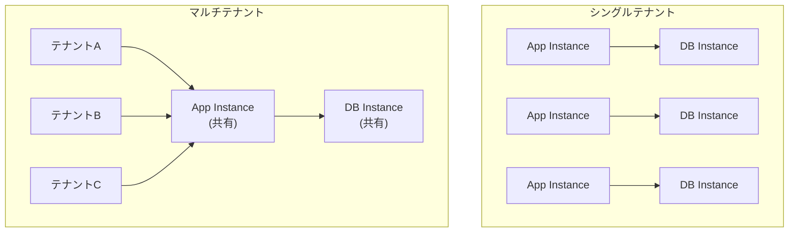

### 1.2 マルチテナンシーが解決する問題

マルチテナンシーが解決する根本的な問題は、**規模の経済**の実現である。

**インフラコストの効率化**: データベースサーバーは起動しているだけでメモリやCPUリソースを消費する。テナントごとに独立したデータベースインスタンスを立てると、テナント数が1,000を超えた時点でインフラコストが線形に増大する。共有インフラストラクチャであれば、リソースの利用効率が飛躍的に向上する。

**運用負荷の集約**: スキーマ変更、バックアップ、監視、パッチ適用――これらの運用タスクは、管理対象のインスタンス数に比例して増加する。マルチテナントアーキテクチャでは、これらを一元的に管理できる。

**デプロイの統一性**: アプリケーションのバージョンアップを行う際、シングルテナントでは各テナントのインスタンスを個別にアップデートする必要がある。マルチテナントでは一度のデプロイで全テナントに変更が反映される。

### 1.3 マルチテナントデータベース設計の核心的な課題

マルチテナントアーキテクチャにおけるデータベース設計は、以下の相反する要件を同時に満たす必要がある。

| 要件 | 説明 |
|------|------|
| **テナント分離** | あるテナントのデータが別のテナントから参照・変更されないことの保証 |
| **コスト効率** | インフラリソースの共有によるコスト最適化 |
| **スケーラビリティ** | テナント数やデータ量の増加に対するスケール |
| **運用性** | スキーマ変更、バックアップ、障害復旧の容易さ |
| **性能の公平性** | 一つのテナントの負荷が他のテナントに影響しない（Noisy Neighbor問題の回避） |
| **コンプライアンス** | 地域ごとのデータ居住要件や業界規制への対応 |

これらの要件のバランスをどう取るかが、マルチテナントデータベース設計の本質である。そして、その最初の選択肢がテナント分離戦略の決定である。

## 2. テナント分離戦略

マルチテナントデータベースのテナント分離には、大きく3つの戦略がある。それぞれ、分離の粒度とリソース共有の度合いが異なる。

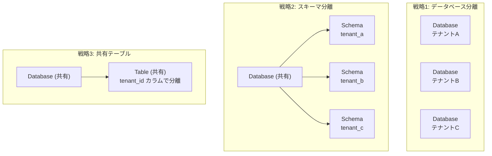

### 2.1 戦略1: データベース分離（Database-per-Tenant）

テナントごとに独立したデータベース（またはデータベースインスタンス）を割り当てる戦略である。

#### アーキテクチャ

各テナントは完全に独立したデータベースを持つ。アプリケーション層は、テナントの識別情報に基づいて接続先のデータベースを切り替える。

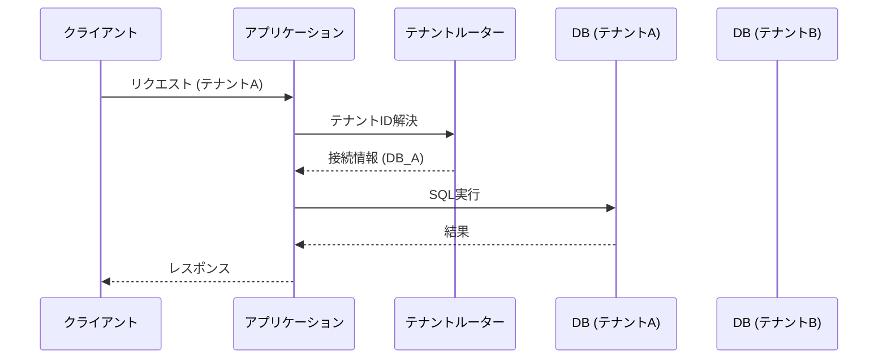

#### 利点

- **最強のデータ分離**: テナント間のデータ漏洩リスクが物理的に排除される。SQLインジェクション等の攻撃を受けても、被害は単一テナントに限定される。
- **テナント単位のカスタマイズ**: テナントごとにスキーマ拡張やインデックス追加が可能。大口顧客の要件に柔軟に対応できる。
- **テナント単位のバックアップ/リストア**: 特定テナントのデータだけをリストアすることが容易。
- **Noisy Neighbor問題の回避**: テナント間でリソースが物理的に分離されるため、負荷の干渉が発生しない。
- **コンプライアンス対応**: テナントごとに異なるリージョンにデータベースを配置できるため、データ居住要件への対応が容易。

#### 欠点

- **コストが最も高い**: テナント数に比例してデータベースインスタンスが必要。小規模テナントでもフルインスタンスのコストが発生する。
- **運用負荷が最も大きい**: スキーママイグレーション、監視、バックアップをテナント数分だけ実行する必要がある。
- **コネクション管理の複雑さ**: テナント数 × コネクションプールサイズ分のコネクションが必要。
- **テナント横断クエリが困難**: 全テナントを跨いだ分析クエリを実行するには、各データベースに個別にアクセスして結果を集約する必要がある。

#### 適するケース

- 金融、医療など厳格なデータ分離要件がある業界
- テナント数が少なく、各テナントのデータ量が大きいエンタープライズSaaS
- テナントごとにカスタマイズが求められる場合

### 2.2 戦略2: スキーマ分離（Schema-per-Tenant）

単一のデータベースインスタンス内で、テナントごとに独立したスキーマ（名前空間）を割り当てる戦略である。PostgreSQLでは `CREATE SCHEMA` で作成できるスキーマがこれに相当する。

#### アーキテクチャ

すべてのテナントが同一のデータベースインスタンスを共有するが、各テナントのテーブルは専用のスキーマ内に作成される。

```sql
-- create schema for each tenant
CREATE SCHEMA tenant_acme;
CREATE SCHEMA tenant_globex;

-- create tables within tenant schema
CREATE TABLE tenant_acme.users (
    id BIGSERIAL PRIMARY KEY,
    name TEXT NOT NULL,
    email TEXT NOT NULL UNIQUE
);

CREATE TABLE tenant_globex.users (
    id BIGSERIAL PRIMARY KEY,
    name TEXT NOT NULL,
    email TEXT NOT NULL UNIQUE
);
```

アプリケーションは、テナントに対応するスキーマを `search_path` で指定するか、テーブル名にスキーマ名をプレフィックスとして付けてアクセスする。

```sql
-- option 1: set search_path
SET search_path TO tenant_acme, public;
SELECT * FROM users;  -- resolves to tenant_acme.users

-- option 2: fully qualified table name
SELECT * FROM tenant_acme.users;
```

#### 利点

- **論理的なデータ分離**: スキーマレベルでデータが分離されるため、単純なクエリミスによるテナント間データ漏洩を防げる。
- **テナント単位のスキーマ管理**: テナントごとにテーブルやインデックスを追加できる柔軟性がある。
- **インフラコストの抑制**: 単一のデータベースインスタンスを共有するため、データベース分離に比べてコストが低い。
- **テナント単位のバックアップ**: `pg_dump` でスキーマ単位のバックアップが可能（ただしリストアにはやや手間がかかる）。

#### 欠点

- **スキーマ数の爆発**: テナント数が数千を超えると、データベースのメタデータ管理に負荷がかかる。PostgreSQLでは数千スキーマ程度から `pg_catalog` の肥大化によるプランニング性能の低下が報告されている。
- **マイグレーションの複雑さ**: スキーマ変更を全テナントに適用するには、テナント数分のDDL文を実行する必要がある。失敗時のロールバックも複雑。
- **コネクション管理**: `search_path` の切り替えを確実に行わないと、テナント間でデータが混在するリスクがある。
- **リソース共有**: データベースインスタンスのCPU、メモリ、I/Oは共有されるため、Noisy Neighbor問題が発生しうる。

#### 適するケース

- テナント数が数十から数百程度の中規模SaaS
- テナントごとに若干のスキーマカスタマイズが必要な場合
- データベース分離ほどのコストをかけられないが、一定の分離レベルが求められる場合

### 2.3 戦略3: 共有テーブル（Shared Table / Row-based Isolation）

全テナントのデータを同一のテーブルに格納し、`tenant_id` カラムで論理的に分離する戦略である。最もリソース効率が高く、最も広く採用されているアプローチでもある。

#### アーキテクチャ

すべてのテーブルに `tenant_id` カラムを追加し、すべてのクエリに `WHERE tenant_id = ?` 条件を付与する。

```sql
-- shared table with tenant_id column
CREATE TABLE users (
    id BIGSERIAL PRIMARY KEY,
    tenant_id UUID NOT NULL,
    name TEXT NOT NULL,
    email TEXT NOT NULL,
    created_at TIMESTAMPTZ NOT NULL DEFAULT NOW(),
    UNIQUE (tenant_id, email)
);

-- index for efficient tenant-scoped queries
CREATE INDEX idx_users_tenant_id ON users (tenant_id);

-- every query must include tenant_id
SELECT * FROM users WHERE tenant_id = 'a1b2c3d4-...' AND email = 'user@example.com';
```

#### 利点

- **最もコスト効率が高い**: 単一のデータベースインスタンス、単一のテーブルセットを全テナントが共有する。
- **マイグレーションが単純**: スキーマ変更は一度のDDL実行で全テナントに反映される。
- **テナント横断クエリが容易**: テナント横断の分析クエリは `tenant_id` の条件を外すだけで実行できる。
- **コネクション管理がシンプル**: すべてのテナントが同じスキーマにアクセスするため、コネクションプールの設計が単純。
- **スケーラビリティ**: テナント数が数万、数十万に達しても、データベースのメタデータは増加しない。

#### 欠点

- **データ漏洩リスク**: `WHERE tenant_id = ?` の付与を忘れると、他テナントのデータが参照される。アプリケーションコードのバグが直接的にセキュリティインシデントにつながる。
- **カスタマイズの制約**: テナント固有のスキーマ拡張ができない。すべてのテナントが同一のスキーマ構造を共有する。
- **Noisy Neighbor問題**: テーブルとインデックスが共有されるため、一つのテナントの大量データ投入や重いクエリが他テナントに影響する。
- **テナント単位のバックアップが困難**: 特定テナントのデータだけをバックアップ/リストアするには、テナントデータの抽出と再投入が必要。

#### 適するケース

- テナント数が多い（数千以上）B2B/B2C SaaS
- すべてのテナントが同一のスキーマ構造を使う場合
- コスト効率が最優先の場合
- 後述するRow-Level Securityによるデータ保護を組み合わせる場合

## 3. テナント分離戦略の比較

3つの戦略を主要な評価軸で比較する。

| 評価軸 | データベース分離 | スキーマ分離 | 共有テーブル |
|--------|-----------------|-------------|-------------|
| **データ分離の強度** | 物理的分離（最強） | 論理的分離（中） | 行レベル分離（弱） |
| **インフラコスト** | 高（テナント数に比例） | 中 | 低（最小） |
| **運用の複雑さ** | 高（個別管理） | 中（スキーマ管理） | 低（単一管理） |
| **マイグレーション容易性** | 低（個別適用） | 低（テナント数分適用） | 高（一括適用） |
| **スケーラビリティ上限** | テナント100程度 | テナント1,000程度 | テナント100,000以上 |
| **テナント横断クエリ** | 困難 | やや困難 | 容易 |
| **カスタマイズ柔軟性** | 高 | 中 | 低 |
| **Noisy Neighbor耐性** | 高 | 低 | 低 |
| **コンプライアンス対応** | 容易 | やや困難 | 困難 |
| **テナント単位バックアップ** | 容易 | 可能 | 困難 |

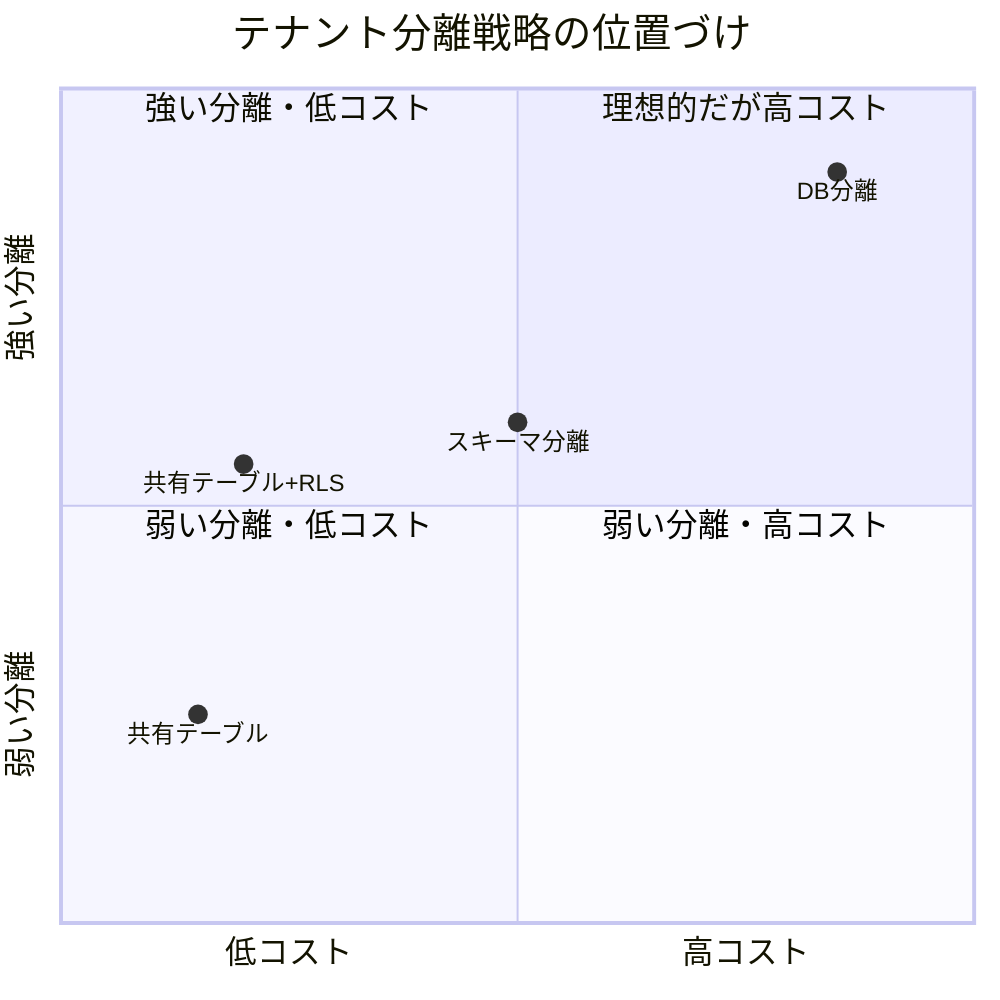

上の図に示したように、共有テーブル戦略にRow-Level Security（RLS）を組み合わせることで、コストを抑えながら分離レベルを引き上げることが可能である。次章では、このRLSについて詳しく解説する。

## 4. Row-Level Security（PostgreSQL RLS）

### 4.1 RLSとは何か

**Row-Level Security（RLS）**は、テーブル内の行へのアクセスを、行の内容に基づいて制御するデータベース機能である。通常のGRANT/REVOKEによる権限管理がテーブル単位やカラム単位の制御であるのに対し、RLSは**行単位**のアクセス制御を実現する。

PostgreSQLは9.5（2016年リリース）でRLSを正式サポートした。SQL Serverでは同様の機能がSQL Server 2016で導入されている。

RLSの本質は、すべてのクエリに対して**暗黙的なWHERE句を自動付与する**ことである。アプリケーションが `SELECT * FROM users` を実行しても、データベースが自動的に `WHERE tenant_id = current_setting('app.tenant_id')` を追加する。これにより、アプリケーションコードのバグによるテナント間データ漏洩を防ぐ「安全網」が実現される。

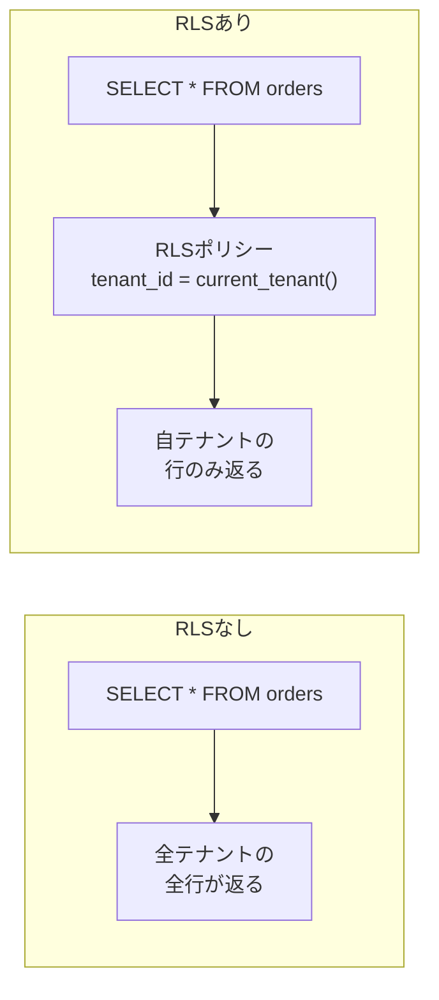

### 4.2 PostgreSQL RLSの基本設定

PostgreSQLでRLSを設定する手順を、具体的なSQL文とともに解説する。

#### ステップ1: テーブルの作成

```sql
-- create a shared orders table
CREATE TABLE orders (
    id BIGSERIAL PRIMARY KEY,
    tenant_id UUID NOT NULL,
    customer_name TEXT NOT NULL,
    amount NUMERIC(10, 2) NOT NULL,
    status TEXT NOT NULL DEFAULT 'pending',
    created_at TIMESTAMPTZ NOT NULL DEFAULT NOW()
);

CREATE INDEX idx_orders_tenant_id ON orders (tenant_id);
```

#### ステップ2: RLSの有効化

```sql
-- enable RLS on the table
ALTER TABLE orders ENABLE ROW LEVEL SECURITY;
```

この時点で、テーブルオーナー以外のロールは `orders` テーブルの行に一切アクセスできなくなる。ポリシーを定義するまで、すべてのクエリが空の結果を返す。

> [!WARNING]
> テーブルオーナー（通常は `CREATE TABLE` を実行したロール）にはRLSポリシーが**適用されない**。これは意図的な設計であり、管理者がRLSに制約されないようにするためである。オーナーにもRLSを強制したい場合は `ALTER TABLE orders FORCE ROW LEVEL SECURITY;` を実行する。

#### ステップ3: アプリケーション用ロールの作成

```sql
-- create a role for the application
CREATE ROLE app_user LOGIN PASSWORD 'secure_password';

-- grant necessary privileges
GRANT USAGE ON SCHEMA public TO app_user;
GRANT SELECT, INSERT, UPDATE, DELETE ON orders TO app_user;
GRANT USAGE, SELECT ON ALL SEQUENCES IN SCHEMA public TO app_user;
```

#### ステップ4: RLSポリシーの定義

```sql
-- create a policy that restricts access based on tenant_id
CREATE POLICY tenant_isolation ON orders
    FOR ALL
    TO app_user
    USING (tenant_id = current_setting('app.tenant_id')::UUID)
    WITH CHECK (tenant_id = current_setting('app.tenant_id')::UUID);
```

このポリシーの各要素の意味は以下の通りである。

- `FOR ALL`: SELECT、INSERT、UPDATE、DELETEのすべての操作に適用
- `TO app_user`: `app_user` ロールに適用
- `USING (...)`: 既存の行を読み取る際の条件（SELECT、UPDATE、DELETEに影響）
- `WITH CHECK (...)`: 新しい行を書き込む際の条件（INSERTとUPDATEの新しい値に影響）

> [!TIP]
> `USING` と `WITH CHECK` を分けて定義することで、「読み取りは許可するが書き込みは制限する」といった非対称なポリシーを構成できる。例えば、テナントは自社のデータを読み取れるが、特定のステータスの行だけ更新可能にする、といった設計が可能である。

#### ステップ5: テナントコンテキストの設定

```sql
-- set the tenant context for the current session/transaction
SET app.tenant_id = 'a1b2c3d4-e5f6-7890-abcd-ef1234567890';

-- now queries are automatically filtered
SELECT * FROM orders;
-- equivalent to: SELECT * FROM orders WHERE tenant_id = 'a1b2c3d4-...'

-- insert also enforces tenant_id
INSERT INTO orders (tenant_id, customer_name, amount)
VALUES ('a1b2c3d4-e5f6-7890-abcd-ef1234567890', 'Alice', 100.00);
-- succeeds because tenant_id matches app.tenant_id

INSERT INTO orders (tenant_id, customer_name, amount)
VALUES ('ffffffff-ffff-ffff-ffff-ffffffffffff', 'Mallory', 999.99);
-- fails with policy violation because tenant_id does not match
```

### 4.3 RLSポリシーの詳細設計

#### 操作別ポリシー

実務では、操作の種類ごとに異なるポリシーを定義することが多い。

```sql
-- SELECT: tenant can only see their own data
CREATE POLICY tenant_select ON orders
    FOR SELECT
    TO app_user
    USING (tenant_id = current_setting('app.tenant_id')::UUID);

-- INSERT: tenant can only insert rows with their own tenant_id
CREATE POLICY tenant_insert ON orders
    FOR INSERT
    TO app_user
    WITH CHECK (tenant_id = current_setting('app.tenant_id')::UUID);

-- UPDATE: tenant can only update their own data, and cannot change tenant_id
CREATE POLICY tenant_update ON orders
    FOR UPDATE
    TO app_user
    USING (tenant_id = current_setting('app.tenant_id')::UUID)
    WITH CHECK (tenant_id = current_setting('app.tenant_id')::UUID);

-- DELETE: tenant can only delete their own data
CREATE POLICY tenant_delete ON orders
    FOR DELETE
    TO app_user
    USING (tenant_id = current_setting('app.tenant_id')::UUID);
```

#### 管理者ポリシー

システム管理者やバッチ処理向けに、テナント制約なしでアクセスできるポリシーを定義することもある。

```sql
-- create an admin role
CREATE ROLE admin_user LOGIN PASSWORD 'admin_secure_password';
GRANT ALL ON orders TO admin_user;

-- admin can access all rows
CREATE POLICY admin_full_access ON orders
    FOR ALL
    TO admin_user
    USING (true)
    WITH CHECK (true);
```

### 4.4 RLSの実行計画への影響

RLSが有効な場合、PostgreSQLのクエリプランナーはRLSポリシーの条件をクエリに統合する。`EXPLAIN` でこの動作を確認できる。

```sql
SET app.tenant_id = 'a1b2c3d4-e5f6-7890-abcd-ef1234567890';

EXPLAIN SELECT * FROM orders WHERE status = 'pending';
```

出力例:

```
Bitmap Heap Scan on orders
  Recheck Cond: (tenant_id = 'a1b2c3d4-...'::uuid)
  Filter: (status = 'pending'::text)
  ->  Bitmap Index Scan on idx_orders_tenant_id
        Index Cond: (tenant_id = 'a1b2c3d4-...'::uuid)
```

RLSの条件 `tenant_id = current_setting('app.tenant_id')::UUID` がインデックススキャンの条件として統合されていることがわかる。つまり、RLSは単に結果のフィルタリングとして後付けで適用されるのではなく、クエリプランナーの最適化に統合される。`tenant_id` カラムに適切なインデックスが存在する限り、RLSによる性能劣化は最小限に抑えられる。

> [!NOTE]
> 複合インデックスを設計する際は、`tenant_id` を先頭に配置するのが一般的なベストプラクティスである。例えば `CREATE INDEX idx_orders_tenant_status ON orders (tenant_id, status)` のようにすることで、テナントスコープ内での検索がインデックスのみで完結する。

### 4.5 RLSの限界と注意点

RLSは強力な安全機構だが、万能ではない。以下の限界を認識しておく必要がある。

**テーブルオーナーへの非適用**: 前述の通り、テーブルオーナーにはRLSポリシーが適用されない。`FORCE ROW LEVEL SECURITY` を設定するか、アプリケーション接続にはオーナーとは異なるロールを使用する必要がある。

**セッション変数の信頼性**: `current_setting('app.tenant_id')` の値はセッション単位で設定されるが、この値が正しく設定されていなければRLSは機能しない。コネクションプールを使用する場合、前のリクエストで設定されたテナントIDが残っていると、データ漏洩が発生する。

**スーパーユーザーへの非適用**: PostgreSQLのスーパーユーザーにはRLSが適用されない。本番環境ではスーパーユーザーでのアプリケーション接続を避けるべきである。

**パフォーマンスへの影響**: ポリシーの条件式が複雑な場合（サブクエリやファンクション呼び出しを含む場合）、クエリプランナーの最適化が困難になり性能が劣化する可能性がある。

## 5. テナントIDの設計とクエリパターン

### 5.1 テナントIDの型選択

テナントIDの型は、システムの運用に大きな影響を与える。主要な選択肢を比較する。

| 型 | 例 | 利点 | 欠点 |
|------|------|------|------|
| `UUID` | `a1b2c3d4-e5f6-...` | 外部漏洩しても推測不能、分散生成が容易 | 128bit、インデックスサイズが大きい |
| `BIGINT` | `1001` | 小さい、インデックス効率が高い | 連番は推測可能、分散生成にはSnowflake IDなどが必要 |
| `TEXT` | `acme-corp` | 人間が読みやすい | 可変長、インデックス効率がやや低い |

実務ではUUIDv4またはUUIDv7が最も一般的な選択肢である。UUIDv7はタイムスタンプ順にソートされるため、B-Treeインデックスのページスプリットを抑制でき、書き込み性能が向上する。

```sql
-- using UUIDv7 for tenant_id (PostgreSQL 17+)
CREATE TABLE tenants (
    id UUID PRIMARY KEY DEFAULT gen_random_uuid(),
    name TEXT NOT NULL UNIQUE,
    plan TEXT NOT NULL DEFAULT 'free',
    created_at TIMESTAMPTZ NOT NULL DEFAULT NOW()
);
```

### 5.2 テナントIDの伝播パターン

アプリケーションからデータベースへテナントIDをどのように伝播するかは、RLSの信頼性に直結する重要な設計判断である。

#### パターン1: セッション変数（推奨）

PostgreSQLのセッション変数（GUC: Grand Unified Configuration）を使用する方法。RLSポリシーから `current_setting()` で参照できる。

```python
# Python example using psycopg2
def execute_query(conn, tenant_id, query, params=None):
    with conn.cursor() as cur:
        # set tenant context at the beginning of each request
        cur.execute("SET app.tenant_id = %s", (str(tenant_id),))
        cur.execute(query, params)
        return cur.fetchall()
```

#### パターン2: トランザクションスコープのセッション変数

`SET LOCAL` を使用すると、セッション変数のスコープを現在のトランザクション内に限定できる。トランザクション終了後に自動的にリセットされるため、コネクションプール環境でのテナントID漏洩リスクを低減できる。

```python
# using SET LOCAL for transaction-scoped tenant context
def execute_in_transaction(conn, tenant_id, operations):
    with conn.cursor() as cur:
        cur.execute("BEGIN")
        # SET LOCAL limits scope to current transaction
        cur.execute("SET LOCAL app.tenant_id = %s", (str(tenant_id),))
        for op in operations:
            cur.execute(op['query'], op.get('params'))
        cur.execute("COMMIT")
```

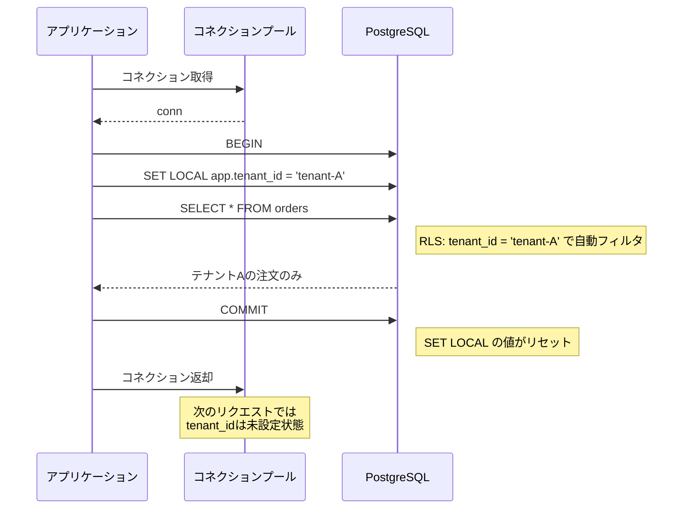

#### パターン3: データベースロールによるテナント識別

テナントごとにデータベースロールを作成し、`current_user` で識別する方法。強い分離が得られるが、テナント数が多いと管理が困難。

```sql
-- policy using database role
CREATE POLICY tenant_by_role ON orders
    FOR ALL
    USING (tenant_id = (
        SELECT id FROM tenants WHERE db_role = current_user
    ));
```

### 5.3 クエリパターンとインデックス設計

共有テーブル戦略では、すべてのクエリがテナントスコープで実行される。インデックスの設計はこの前提に最適化する必要がある。

#### プライマリキー設計

```sql
-- option 1: surrogate key + tenant_id index
CREATE TABLE orders (
    id BIGSERIAL PRIMARY KEY,
    tenant_id UUID NOT NULL,
    ...
);
CREATE INDEX idx_orders_tenant ON orders (tenant_id);

-- option 2: composite primary key
CREATE TABLE orders (
    tenant_id UUID NOT NULL,
    id BIGSERIAL NOT NULL,
    ...
    PRIMARY KEY (tenant_id, id)
);
```

オプション2（複合主キー）を選択すると、テナントスコープ内のクエリがクラスタインデックス（主キーのB-Tree）上で物理的に連続するため、I/O効率が大幅に向上する。一方で、外部キー参照が複合キーになるため設計の複雑さが増す。

#### 複合インデックスの設計原則

```sql
-- tenant_id FIRST, then the query-specific columns
CREATE INDEX idx_orders_tenant_status ON orders (tenant_id, status);
CREATE INDEX idx_orders_tenant_created ON orders (tenant_id, created_at DESC);
CREATE INDEX idx_orders_tenant_customer ON orders (tenant_id, customer_name);
```

テナントスコープ内での検索を最適化するために、すべてのインデックスの先頭に `tenant_id` を配置する。これにより、テナント内のデータに対するインデックススキャンが連続したリーフページの読み取りとなり、ランダムI/Oが削減される。

#### パーティショニングの活用

テナント数は少ないがデータ量が多い場合、テナントIDによるテーブルパーティショニングを検討する。

```sql
-- range partitioning by tenant_id
CREATE TABLE orders (
    id BIGSERIAL,
    tenant_id UUID NOT NULL,
    customer_name TEXT NOT NULL,
    amount NUMERIC(10, 2) NOT NULL,
    created_at TIMESTAMPTZ NOT NULL DEFAULT NOW()
) PARTITION BY HASH (tenant_id);

-- create partitions
CREATE TABLE orders_p0 PARTITION OF orders FOR VALUES WITH (MODULUS 16, REMAINDER 0);
CREATE TABLE orders_p1 PARTITION OF orders FOR VALUES WITH (MODULUS 16, REMAINDER 1);
-- ... partitions p2 through p15
```

パーティショニングにより、テナントスコープのクエリはパーティションプルーニングの恩恵を受けてスキャン対象のデータ量が削減される。また、VACUUM処理もパーティション単位で実行されるため、大規模テーブルのメンテナンスが効率化される。

## 6. マイグレーションの考慮事項

### 6.1 戦略別のマイグレーション特性

テナント分離戦略の選択は、マイグレーションの運用に大きな影響を与える。

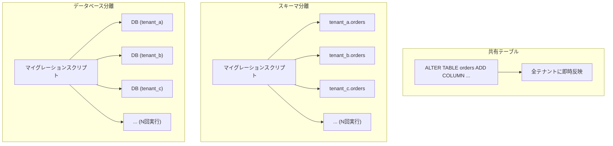

#### 共有テーブル戦略のマイグレーション

共有テーブル戦略では、単一のDDL文で全テナントに変更が反映される。これは最大の利点であると同時に、最大のリスクでもある。

```sql
-- single migration affects all tenants
ALTER TABLE orders ADD COLUMN priority INTEGER DEFAULT 0;
```

**利点**: マイグレーションの実行が一度で済む。テナント間のスキーマ不整合が原理的に発生しない。

**リスク**: マイグレーションの失敗が全テナントに影響する。大規模テーブルへのALTER TABLEはロック競合やダウンタイムを引き起こしうる。

::: warning 大規模テーブルへの安全なマイグレーション
PostgreSQLでは、`ALTER TABLE ... ADD COLUMN` にDEFAULT値を指定しても、PostgreSQL 11以降はテーブルの書き換えが発生しない（メタデータのみの変更）。しかし、`NOT NULL` 制約の追加やカラム型の変更はテーブル全体のロックが必要になる。大規模テーブルでは `pg_repack` や `CREATE INDEX CONCURRENTLY` のような非ロック手法を活用すべきである。
:::

#### スキーマ分離・データベース分離のマイグレーション

テナント数分のマイグレーションを実行する必要があるため、以下の考慮が必要になる。

**部分的失敗への対処**: 100テナント中50テナントでマイグレーションが成功し、残り50で失敗した場合、テナント間でスキーマバージョンが不整合になる。テナントごとのスキーマバージョン管理と、不整合検出の仕組みが必要になる。

**並列実行とレート制限**: マイグレーションを全テナント同時に実行するとデータベースに過大な負荷がかかる。適切な並列度とレート制限を設けてバッチ実行する必要がある。

```python
# migration orchestrator for schema-per-tenant
import asyncio

async def migrate_tenant(tenant_schema, migration_sql):
    """Apply migration to a single tenant schema."""
    conn = await get_connection()
    try:
        await conn.execute(f"SET search_path TO {tenant_schema}")
        await conn.execute(migration_sql)
        await record_migration_success(tenant_schema)
    except Exception as e:
        await record_migration_failure(tenant_schema, str(e))
        raise

async def migrate_all_tenants(migration_sql, concurrency=10):
    """Apply migration to all tenants with controlled concurrency."""
    tenants = await get_all_tenant_schemas()
    semaphore = asyncio.Semaphore(concurrency)

    async def limited_migrate(schema):
        async with semaphore:
            await migrate_tenant(schema, migration_sql)

    results = await asyncio.gather(
        *[limited_migrate(s) for s in tenants],
        return_exceptions=True
    )
    # report migration status
    succeeded = sum(1 for r in results if not isinstance(r, Exception))
    failed = len(results) - succeeded
    return {"succeeded": succeeded, "failed": failed}
```

### 6.2 ゼロダウンタイムマイグレーション

SaaSではサービスの継続性が求められるため、ダウンタイムを伴うマイグレーションは避けたい。共有テーブル戦略におけるゼロダウンタイムマイグレーションの一般的なパターンを示す。

**カラム追加**: PostgreSQL 11以降、DEFAULT値付きのNULL許容カラムの追加はメタデータのみの変更で瞬時に完了する。

**カラムのリネームやドロップ**: 直接的な `ALTER TABLE` ではなく、Expand-Contract パターンを使用する。

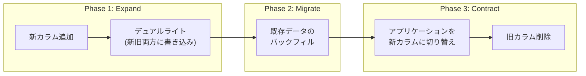

1. **Expand**: 新しいカラム/テーブルを追加する。アプリケーションは新旧両方に書き込む。
2. **Migrate**: 既存データを新カラム/テーブルにバックフィルする。
3. **Contract**: アプリケーションを新カラム/テーブルのみ使用するように切り替え、旧カラム/テーブルを削除する。

## 7. コネクションプール設計

### 7.1 マルチテナント環境でのコネクション管理の課題

データベースコネクションはコストの高いリソースである。PostgreSQLはプロセスベースのアーキテクチャを採用しており、各コネクションが独立したOSプロセスとして動作する。コネクション数の増加は、メモリ消費の増大とコンテキストスイッチのオーバーヘッドに直結する。

PostgreSQLの推奨最大コネクション数は、一般的にCPUコア数の2〜4倍程度（例: 8コアなら16〜32コネクション）とされている。しかし、マルチテナント環境では以下の理由でコネクション数が膨張しやすい。

- **テナント数 × アプリケーションインスタンス数**のコネクションが必要（データベース分離の場合）
- テナントごとに `search_path` やセッション変数の切り替えが必要

### 7.2 コネクションプールの構成パターン

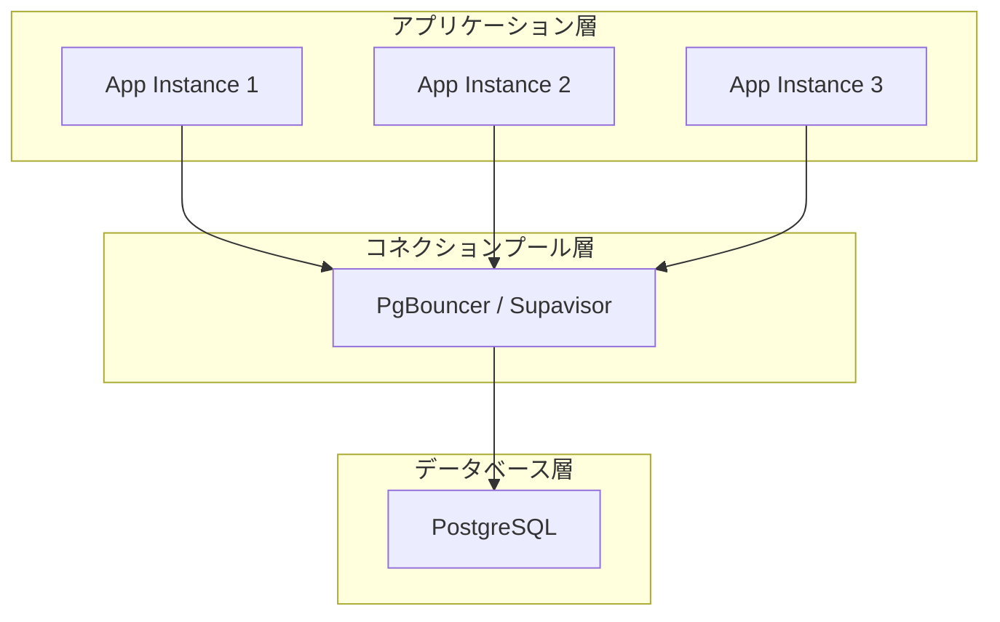

#### PgBouncer

PostgreSQL向けの軽量なコネクションプーラーとして最も広く使われている。3つのプーリングモードを提供する。

| モード | 説明 | マルチテナント適合性 |
|--------|------|---------------------|
| **Session** | セッション終了までコネクションを保持 | 低（コネクション節約効果が小さい） |
| **Transaction** | トランザクション終了後にコネクションを返却 | 高（`SET LOCAL` との組み合わせが有効） |
| **Statement** | 各SQL文ごとにコネクションを切り替え | テナントコンテキスト維持不可 |

マルチテナント環境では **Transaction モード** が最も適している。`SET LOCAL` でテナントコンテキストをトランザクションスコープに限定することで、コネクション返却時にテナントIDが自動的にリセットされる。

```python
# connection pool with PgBouncer (transaction mode)
async def handle_request(tenant_id, query):
    async with pool.acquire() as conn:
        async with conn.transaction():
            # SET LOCAL ensures tenant context is transaction-scoped
            await conn.execute(
                "SET LOCAL app.tenant_id = $1", str(tenant_id)
            )
            result = await conn.fetch(query)
    # connection returned to pool; SET LOCAL values are gone
    return result
```

### 7.3 テナント分離戦略別のコネクションプール設計

#### 共有テーブル + RLS

全テナントが同一のデータベースに接続するため、単一のコネクションプールで運用できる。テナントの切り替えは `SET LOCAL` で行う。

```
App (全テナント) → PgBouncer (1 pool) → PostgreSQL (1 database)
```

#### スキーマ分離

コネクション取得後に `SET search_path` でスキーマを切り替える。PgBouncer Transaction モードと `SET LOCAL search_path` の組み合わせが有効。

```
App (全テナント) → PgBouncer (1 pool) → PostgreSQL (1 database, N schemas)
```

#### データベース分離

テナントごとに異なるデータベースに接続する必要がある。PgBouncerではデータベースごとにプールが作成されるため、テナント数が多いとプール数が膨張する。

```
App (テナントA) → PgBouncer → PostgreSQL (DB_A)
App (テナントB) → PgBouncer → PostgreSQL (DB_B)
...
```

この場合、アプリケーション層でテナントIDに基づいてコネクションプールを選択するルーティングロジックが必要になる。

### 7.4 Noisy Neighbor対策としてのリソース制御

共有テーブル戦略やスキーマ分離戦略では、一つのテナントの重いクエリが他テナントに影響を与えるNoisy Neighbor問題が発生しうる。以下の対策を検討する。

**ステートメントタイムアウト**: テナントごとにクエリのタイムアウトを設定する。

```sql
-- set per-tenant statement timeout
SET LOCAL statement_timeout = '5s';
```

**リソースグループ（PostgreSQL 16+ cgroup integration）**: PostgreSQLのリソース管理機能や外部ツール（pgbouncer のリミッタなど）を活用して、テナントごとのリソース使用量を制限する。

**レートリミット**: アプリケーション層で、テナントごとのクエリレートやコネクション数を制限する。

## 8. テナント横断のクエリと分析

### 8.1 テナント横断クエリの必要性

SaaSプロバイダーは、テナントのデータに対してテナント横断の集計や分析を行う必要がある。典型的なユースケースは以下の通りである。

- **利用状況の集計**: テナントごとのアクティブユーザー数、ストレージ使用量、API呼び出し回数
- **課金計算**: 従量課金のための使用量集計
- **障害影響分析**: あるインシデントが影響したテナントの特定
- **プロダクト分析**: 機能の利用率、テナント間の行動パターン比較

### 8.2 戦略別のテナント横断クエリ手法

#### 共有テーブル戦略

テナント横断クエリが最も容易な戦略である。RLSの制約を受けない管理者ロールで接続すれば、すべてのテナントのデータにアクセスできる。

```sql
-- connect as admin_user (RLS policy allows full access)
-- aggregate orders by tenant
SELECT
    t.name AS tenant_name,
    COUNT(o.id) AS order_count,
    SUM(o.amount) AS total_amount
FROM orders o
JOIN tenants t ON o.tenant_id = t.id
GROUP BY t.name
ORDER BY total_amount DESC;
```

#### スキーマ分離戦略

テナント横断クエリには、各スキーマのテーブルをUNION ALLで結合する必要がある。テナント数が多い場合、この方法は実用的でない。

```sql
-- cross-tenant query across schemas (cumbersome)
SELECT 'acme' AS tenant, COUNT(*) AS order_count FROM tenant_acme.orders
UNION ALL
SELECT 'globex' AS tenant, COUNT(*) AS order_count FROM tenant_globex.orders
UNION ALL
...
```

動的SQLやPL/pgSQL関数で自動化できるが、性能と保守性の面で課題が残る。

#### データベース分離戦略

データベース間のクエリは、PostgreSQLでは `postgres_fdw`（Foreign Data Wrapper）を使って実現できるが、パフォーマンスは限定的である。

```sql
-- using postgres_fdw for cross-database queries
CREATE EXTENSION postgres_fdw;

CREATE SERVER tenant_a_server
    FOREIGN DATA WRAPPER postgres_fdw
    OPTIONS (host 'db-a.example.com', dbname 'tenant_a');

CREATE USER MAPPING FOR admin_user
    SERVER tenant_a_server
    OPTIONS (user 'readonly', password 'secret');

CREATE FOREIGN TABLE tenant_a_orders (
    id BIGINT,
    customer_name TEXT,
    amount NUMERIC(10, 2)
) SERVER tenant_a_server OPTIONS (table_name 'orders');
```

### 8.3 分析用データパイプライン

いずれの戦略でも、テナント横断の大規模分析にはOLTPデータベースに直接クエリを投げるべきではない。本番DBへの負荷を避けるため、分析用のデータパイプラインを構築するのが一般的である。

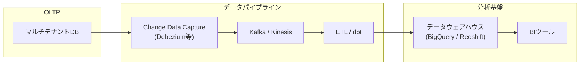

**Change Data Capture（CDC）**: Debeziumなどのツールを用いて、OLTPデータベースの変更をリアルタイムにストリーミングする。WAL（Write-Ahead Log）を読み取るため、OLTPデータベースへの負荷が最小限に抑えられる。

**データウェアハウスへの集約**: テナント横断の分析クエリは、BigQueryやRedshiftなどの分析特化型データベースで実行する。カラムナストレージと大規模並列処理（MPP）の恩恵を受けて、大量データの集計が高速に行える。

## 9. 実務での選択指針

### 9.1 判断フレームワーク

テナント分離戦略の選択は、以下のフレームワークに基づいて判断する。

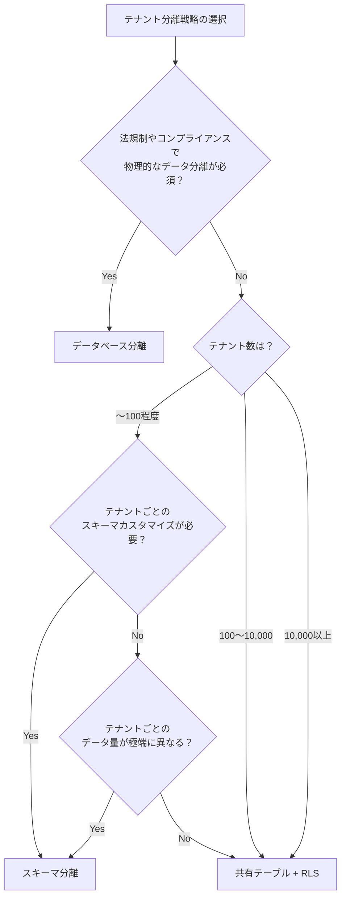

### 9.2 段階的な移行パス

実務では、サービスの成長に伴って分離戦略を変更することがある。一般的には、共有テーブルから始めて、必要に応じて分離レベルを引き上げる方向に進む。

**Phase 1（スタートアップ初期）**: 共有テーブル + RLSで始める。コスト効率が最も高く、マイグレーションが容易。

**Phase 2（エンタープライズ顧客の獲得）**: エンタープライズ顧客向けに、データベース分離のオプションを提供する。既存のSMBテナントは共有テーブルのまま維持する。

**Phase 3（大規模化）**: テナント数の増加に伴い、共有テーブルのテーブルパーティショニングやリードレプリカの導入を行う。

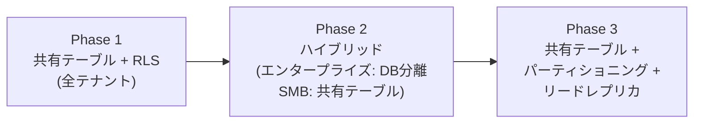

### 9.3 ハイブリッド戦略の実装

実務で最も現実的なアプローチは、テナントのプランやセキュリティ要件に応じて異なる分離レベルを提供する**ハイブリッド戦略**である。

```python
# tenant routing based on isolation level
class TenantRouter:
    def get_connection(self, tenant_id):
        tenant = self.tenant_registry.get(tenant_id)

        if tenant.isolation_level == 'dedicated':
            # dedicated database for enterprise tenants
            return self.get_dedicated_connection(tenant.db_host)
        elif tenant.isolation_level == 'schema':
            # schema isolation for premium tenants
            conn = self.get_shared_connection()
            conn.execute(
                f"SET search_path TO {tenant.schema_name}, public"
            )
            return conn
        else:
            # shared table with RLS for standard tenants
            conn = self.get_shared_connection()
            conn.execute(
                "SET LOCAL app.tenant_id = %s", (str(tenant_id),)
            )
            return conn
```

### 9.4 よくある落とし穴と対策

#### 落とし穴1: RLSの設定忘れ

新しいテーブルを作成したときにRLSを有効化し忘れるケースは頻繁に発生する。マイグレーションのCIチェックにRLS有効化の検証を組み込むべきである。

```sql
-- CI check: verify all tables with tenant_id have RLS enabled
SELECT
    schemaname,
    tablename,
    rowsecurity
FROM pg_tables
WHERE schemaname = 'public'
AND tablename IN (
    SELECT table_name
    FROM information_schema.columns
    WHERE column_name = 'tenant_id'
)
AND NOT rowsecurity;

-- if this query returns any rows, the migration should fail
```

#### 落とし穴2: コネクション返却時のテナントID漏洩

PgBouncerのTransaction モードを使用しない場合、コネクション返却時にセッション変数がリセットされず、次のリクエストで前のテナントのIDが残る可能性がある。`SET LOCAL` の使用を徹底するか、コネクション返却時に `RESET ALL` を実行する。

```sql
-- reset all session variables when returning connection to pool
RESET ALL;
-- or specifically
RESET app.tenant_id;
```

#### 落とし穴3: マイグレーション時のRLSの干渉

マイグレーションスクリプトがアプリケーションロールで実行されると、RLSによってデータ操作が制限される。マイグレーションはテーブルオーナーまたはスーパーユーザーで実行し、RLSの影響を受けないようにする。

#### 落とし穴4: 外部キー制約とテナント境界

共有テーブル戦略では、外部キー制約だけではテナント境界を越えた参照を防げない。

```sql
-- this foreign key does NOT enforce tenant boundary!
CREATE TABLE order_items (
    id BIGSERIAL PRIMARY KEY,
    tenant_id UUID NOT NULL,
    order_id BIGINT REFERENCES orders(id),  -- cross-tenant reference possible
    product_name TEXT NOT NULL,
    quantity INTEGER NOT NULL
);

-- correct: composite foreign key that includes tenant_id
CREATE TABLE order_items (
    id BIGSERIAL PRIMARY KEY,
    tenant_id UUID NOT NULL,
    order_id BIGINT NOT NULL,
    product_name TEXT NOT NULL,
    quantity INTEGER NOT NULL,
    FOREIGN KEY (tenant_id, order_id)
        REFERENCES orders(tenant_id, id)
);
```

`tenant_id` を含む複合外部キーを使用することで、テナント境界を越えた参照をデータベースレベルで防止できる。これには `orders` テーブルに `(tenant_id, id)` のユニーク制約が必要になる。

### 9.5 監視とオブザーバビリティ

マルチテナント環境では、テナント単位の性能監視が不可欠である。

**テナント別クエリ性能**: `pg_stat_statements` と `app.tenant_id` を組み合わせて、テナントごとのクエリ性能を追跡する。

**テナント別リソース使用量**: テナントごとのデータサイズ、インデックスサイズ、クエリ実行時間を定期的に集計し、異常な使用パターンを検知する。

```sql
-- estimate data size per tenant
SELECT
    tenant_id,
    pg_size_pretty(SUM(pg_column_size(t.*))) AS estimated_size,
    COUNT(*) AS row_count
FROM orders t
GROUP BY tenant_id
ORDER BY SUM(pg_column_size(t.*)) DESC
LIMIT 20;
```

**アラート設計**: 特定テナントのクエリが突出して遅い、データ量が急増している、コネクション数が閾値を超えているなどの異常を検知するアラートを設定する。

## 10. まとめ

マルチテナントデータベース設計は、SaaSアーキテクチャの根幹を成す設計判断である。本記事で解説した3つのテナント分離戦略を改めて整理する。

**データベース分離**は最も強い分離を提供するが、コストと運用負荷が最も高い。法規制やエンタープライズ要件で物理的分離が求められる場合に選択する。

**スキーマ分離**はデータベース分離と共有テーブルの中間に位置する。テナントごとのスキーマカスタマイズが必要で、テナント数が数百程度の場合に適する。

**共有テーブル + Row-Level Security**は最もコスト効率が高く、スケーラブルなアプローチである。テナント数が多いSaaSでは第一の選択肢となる。RLSによるデータベースレベルの分離保証と、`SET LOCAL` によるコネクションプール安全性の確保を組み合わせることで、アプリケーションバグによるデータ漏洩リスクを大幅に低減できる。

実際のSaaS開発では、単一の戦略に固執するのではなく、テナントのセキュリティ要件とプランに応じてハイブリッド戦略を採用するのが現実的である。小規模テナントには共有テーブル + RLSを、エンタープライズテナントにはデータベース分離をオプションとして提供する。このように、テナント分離戦略は「技術的な正解」を追求するものではなく、ビジネス要件・コスト・セキュリティ・運用性のバランスを取る設計判断である。
