# MVCC（Multi-Version Concurrency Control）— 読み取りと書き込みを両立する同時実行制御

## 1. はじめに：ロックベース制御の限界とMVCCの動機

### 1.1 データベースにおける同時実行制御の必要性

データベースシステムにおいて、複数のトランザクションが同時にデータにアクセスすることは日常的な光景である。Webアプリケーションがリクエストを受け取るたびにトランザクションが開始され、数百から数千の同時接続が一つのデータベースに対して読み書きを行う。

同時実行制御（Concurrency Control）の役割は、これらのトランザクションが互いに干渉しないように制御しつつ、データの整合性を保証することにある。ACID特性のうち、**Isolation（分離性）**を実現するための機構がまさにこの同時実行制御である。

### 1.2 ロックベース制御の原理と限界

同時実行制御の最も直感的なアプローチは**ロック**である。データを読み取るときには**共有ロック（S-Lock）**を取得し、書き込むときには**排他ロック（X-Lock）**を取得する。共有ロック同士は共存できるが、排他ロックは他のあらゆるロックと競合する。

この仕組みを**2-Phase Locking（2PL）**と呼ぶ。2PLでは、トランザクションの実行を**成長相（Growing Phase）**と**縮退相（Shrinking Phase）**の2つのフェーズに分ける。成長相ではロックを取得するのみで解放しない。縮退相ではロックを解放するのみで取得しない。この規則に従うことで、直列化可能性（Serializability）が保証される。

```
トランザクション T1: SELECT * FROM accounts WHERE id = 1;  (S-Lock取得)
トランザクション T2: UPDATE accounts SET balance = 500 WHERE id = 1;  (X-Lock要求 → ブロック)
```

上の例では、T1がid=1の行に共有ロックを保持している間、T2はその行に排他ロックを取得できず、T1がロックを解放するまで待機しなければならない。これが**Read-Write Conflict（読み取りと書き込みの競合）**である。

2PLには以下の根本的な問題がある。

**読み取りと書き込みが互いにブロックする**: 最も深刻な問題である。現実のワークロードでは読み取り操作が圧倒的に多いが、2PLでは書き込みトランザクションが一つでも存在すると、関連する行への読み取りがすべてブロックされる。OLTP系のアプリケーションでは、読み取りの大半が最新の一貫したデータを必要としているだけであり、書き込みの途中結果を見なければよいだけである。それにもかかわらず、2PLはロックによって物理的にアクセスを排他する。

**デッドロック**: 複数のトランザクションが互いのロックを待ち合う状況が発生しうる。デッドロック検出器やタイムアウトで対処可能だが、アボートされたトランザクションの再実行はコストがかかる。

**ロックのオーバーヘッド**: ロックマネージャの維持、ロックテーブルのメモリ消費、ロック取得・解放の処理コストがすべてのトランザクションに上乗せされる。

### 1.3 MVCCという解決策

**MVCC（Multi-Version Concurrency Control）**は、「読み取りと書き込みが互いにブロックしない」という性質を実現する同時実行制御方式である。核となるアイデアは驚くほど単純だ。

> データを更新するとき、既存のバージョンを上書きするのではなく、**新しいバージョンを作成する**。読み取りトランザクションは、自身の開始時点で有効だったバージョンを参照する。

この方式により、以下が実現される。

- **読み取りトランザクションは書き込みトランザクションをブロックしない**
- **書き込みトランザクションは読み取りトランザクションをブロックしない**
- 読み取りトランザクションは常に一貫したスナップショットを参照できる

MVCCの概念は1978年にDavid P. Reedの博士論文「Naming and Synchronization in a Decentralized Computer System」で提案された。その後、1981年にBernsteinとGoodmanがMVCCの理論的なフレームワークを整備した。現在では、PostgreSQL、MySQL（InnoDB）、Oracle、SQL Server、CockroachDB、TiDBなど、主要なデータベースのほぼすべてがMVCCを採用している。

## 2. MVCCの基本原理

### 2.1 バージョンチェーン

MVCCの中心的なデータ構造が**バージョンチェーン（Version Chain）**である。一つの論理的なタプル（行）に対して、複数の物理的なバージョンが存在し、それらがリンクリストのようにつながっている。

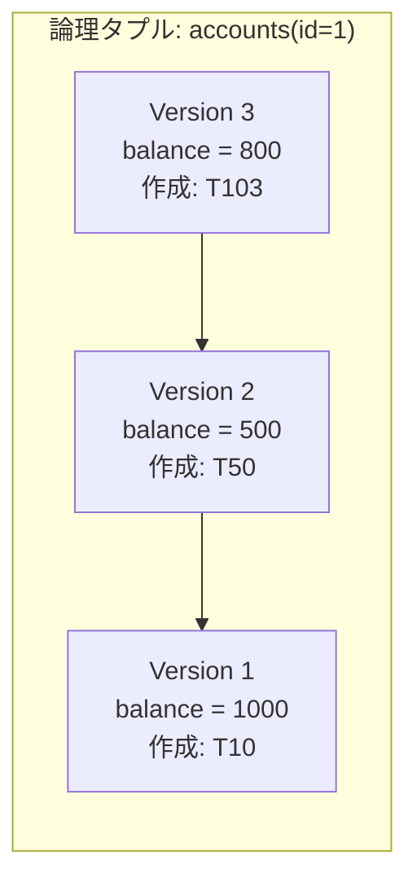

上の図では、`accounts` テーブルの `id=1` の行に3つのバージョンが存在する。トランザクションT10が最初にbalance=1000で行を挿入し、トランザクションT50がbalance=500に更新し、トランザクションT103がbalance=800に更新した。各バージョンは前のバージョンへのポインタを持ち、チェーンを構成する。

### 2.2 スナップショットと一貫性読み取り

MVCCにおける**スナップショット（Snapshot）**とは、ある時点でのデータベースの一貫した状態を表す論理的な概念である。各読み取りトランザクションは開始時にスナップショットを取得し、そのスナップショットに基づいてデータを読み取る。

スナップショットの実体は「どのトランザクションのバージョンが見えるか」を判定するための情報セットである。典型的には以下の情報で構成される。

- スナップショット取得時点で**コミット済み**のトランザクションIDの集合（またはそれを表現する効率的なデータ構造）
- スナップショット取得時点で**アクティブ**（実行中）のトランザクションIDのリスト

この情報を使って、バージョンチェーン上の各バージョンが「このスナップショットから見えるか？」を判定する。この判定プロセスを**可視性判定（Visibility Check）**と呼ぶ。

### 2.3 読み取りと書き込みの非競合

MVCCの最大の利点を具体例で示す。

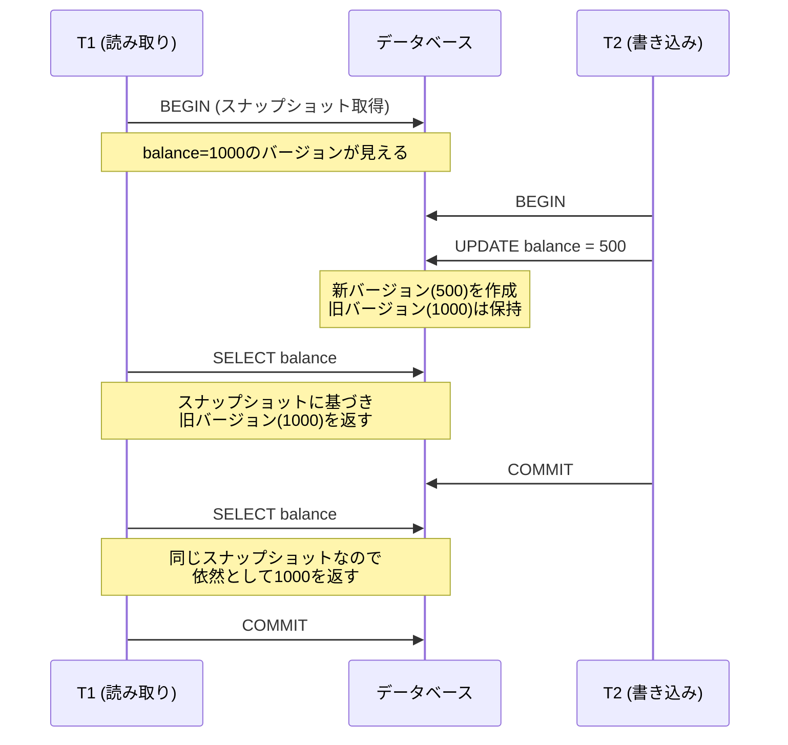

この例では、T1とT2は一切ブロックすることなく並行して実行されている。T1はスナップショットに基づいて一貫したデータを読み取り、T2はT1の存在を気にせず更新を行える。ロックベースの制御では、T2のUPDATE文がT1のSELECTをブロックするか、またはT1のSELECTがT2のUPDATE完了を待つことになる。MVCCではこの待機が完全に排除される。

## 3. トランザクションIDと可視性判定

### 3.1 トランザクションID（TxID）

MVCCにおいて、すべてのトランザクションは一意の**トランザクションID（TxID）**を持つ。TxIDは通常、単調増加する64ビットの整数であり、トランザクションの開始順序を反映する。

各バージョンには以下の情報が付与される。

| フィールド | 意味 |
|:---|:---|
| `begin_txid` | このバージョンを**作成した**トランザクションのID |
| `end_txid` | このバージョンを**無効化した**トランザクションのID（削除または更新によって新バージョンが作られた場合） |

`end_txid` が未設定（∞）であれば、そのバージョンは「まだ無効化されていない」、すなわち最新のバージョンであることを意味する。

### 3.2 可視性判定のアルゴリズム

あるトランザクション $T$ のスナップショットから、バージョン $V$ が見えるかどうかは、以下のルールで判定される。

**バージョン $V$ が $T$ から可視であるための条件**:

1. $V$ を作成したトランザクション $T_{begin}$ が**コミット済み**である
2. $T_{begin}$ が $T$ のスナップショット取得**より前に**コミットしている
3. $V$ を無効化したトランザクション $T_{end}$ が**存在しない**、または $T_{end}$ が $T$ のスナップショット取得時点で**まだコミットしていない**

これを擬似コードで表現すると以下のようになる。

```python
def is_visible(version, snapshot):
    # Check if the creating transaction has committed
    # and was committed before the snapshot was taken
    if version.begin_txid not in snapshot.committed_txids:
        return False

    # Check if the version has been invalidated
    if version.end_txid is None:
        return True  # still the latest version

    # If invalidated, check if the invalidating transaction
    # had committed before the snapshot
    if version.end_txid in snapshot.committed_txids:
        return False  # already superseded

    return True  # invalidating transaction not yet visible
```

### 3.3 可視性判定の具体例

以下の状況を考える。

| トランザクション | 開始TxID | 状態 |
|:---|:---|:---|
| T10 | 10 | コミット済み |
| T50 | 50 | コミット済み |
| T80 | 80 | アクティブ |
| T100 | 100 | スナップショット取得（読み取り対象） |

`accounts(id=1)` のバージョンチェーン:

| バージョン | balance | begin_txid | end_txid |
|:---|:---|:---|:---|
| V1 | 1000 | 10 | 50 |
| V2 | 500 | 50 | 80 |
| V3 | 800 | 80 | ∞ |

T100のスナップショットから各バージョンの可視性を判定する。

- **V3** (begin=80): T80はアクティブであり、まだコミットしていない。したがって**不可視**。
- **V2** (begin=50, end=80): T50はコミット済み。end_txidの80はアクティブでコミットしていないため、「まだ無効化されていない」とみなされる。したがって**可視**。
- **V1** (begin=10, end=50): T50はコミット済みであり、V1を無効化したT50もコミット済み。したがって**不可視**（すでにV2に取って代わられている）。

結果として、T100はV2（balance=500）を読み取る。

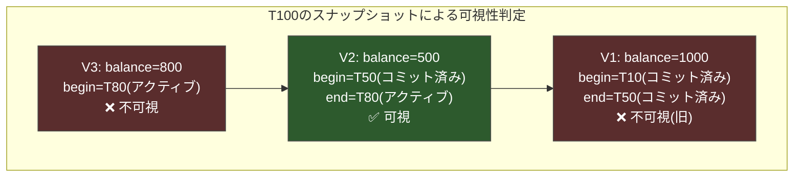

## 4. MVCCの実装方式

MVCCの実装には大きく分けて2つのアプローチがある。どちらも論理的には同じ結果を生むが、物理的なストレージの使い方と性能特性が異なる。

### 4.1 Append-Only方式（新バージョンを追加）

Append-Only方式では、UPDATEの際に新しいバージョンをテーブルの空き領域に**追加**する。旧バージョンはそのまま残り、新旧のバージョンがポインタでつながれる。

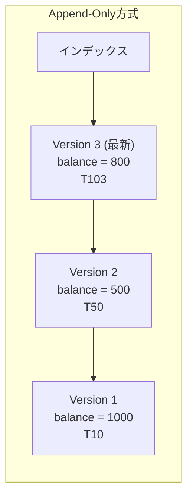

**チェーンの方向**には2つの選択肢がある。

**Oldest-to-Newest（O2N）**: 最も古いバージョンがチェーンの先頭にあり、新しいバージョンが末尾に追加される。インデックスは最も古いバージョンを指す。最新バージョンを読むには、チェーンを末尾まで辿る必要がある。更新は末尾への追加だけで済み、インデックスの更新が不要。しかし、読み取りのたびにチェーン全体を走査しなければならないため、チェーンが長くなると性能が劣化する。

**Newest-to-Oldest（N2O）**: 最も新しいバージョンがチェーンの先頭にあり、インデックスは常に最新バージョンを指す。最新バージョンの読み取りは即座に完了する。しかし更新のたびにインデックスを更新する必要があり、書き込みコストが高くなる。

**Append-Only方式の利点**:
- 旧バージョンがそのまま残るため、実装がシンプル
- Undo Logが不要
- クラッシュリカバリが比較的容易

**Append-Only方式の欠点**:
- テーブル自体が肥大化する（PostgreSQLのテーブル膨張問題）
- シーケンシャルスキャンで不要な旧バージョンも走査してしまう
- インデックスの管理が複雑になる（N2Oの場合）

### 4.2 In-Place Update方式（Undo Logで旧バージョンを保持）

In-Place Update方式では、テーブル上のデータを**直接上書き**し、上書きされた旧バージョンを別の領域（**Undo Log**）に退避する。

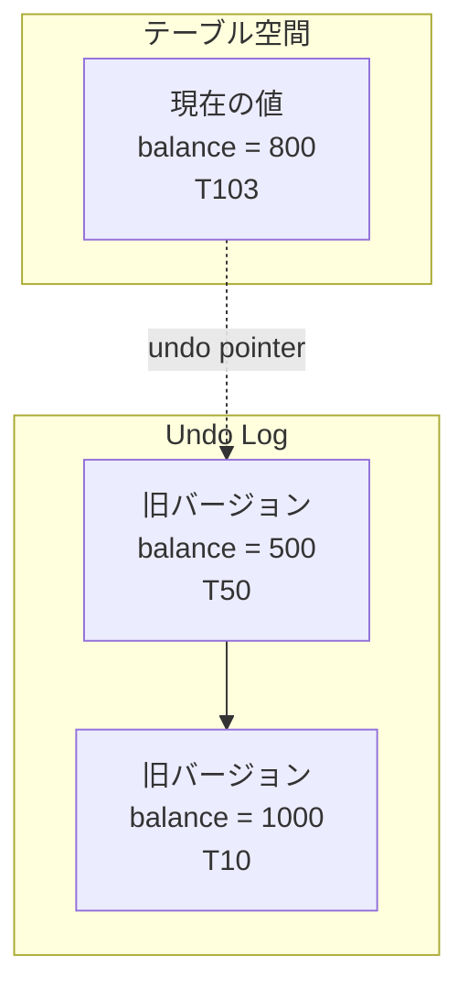

読み取りトランザクションが古いバージョンを必要とする場合、現在の値からUndo Logを辿って適切なバージョンを再構築する。

**In-Place Update方式の利点**:
- テーブル本体は常に最新のデータだけを持つため、コンパクトに保たれる
- シーケンシャルスキャンが効率的（不要バージョンを走査しない）
- 最新バージョンの読み取りがインデックス経由で即座に完了する

**In-Place Update方式の欠点**:
- Undo Logの管理が必要で、実装が複雑
- 古いバージョンの読み取りはUndo Logを辿るため遅い
- クラッシュリカバリ時にUndo Logの適用が必要

### 4.3 方式の比較

| 特性 | Append-Only | In-Place Update |
|:---|:---|:---|
| 更新操作 | 新バージョンを追加 | 現在値を上書き + Undo Log |
| テーブルサイズ | 膨張する | コンパクト |
| 最新バージョン読み取り | N2Oなら高速 | 常に高速 |
| 旧バージョン読み取り | チェーン走査 | Undo Log走査 |
| 代表的な実装 | PostgreSQL | MySQL InnoDB, Oracle |
| ガベージコレクション | VACUUM | Purge |

## 5. PostgreSQLのMVCC

### 5.1 PostgreSQLのタプル構造

PostgreSQLはAppend-Only方式のMVCCを採用しており、そのバージョン管理の中核を担うのが**xmin**と**xmax**という2つのシステムカラムである。

| カラム | 意味 |
|:---|:---|
| `xmin` | このタプルを**INSERTした**トランザクションのXID |
| `xmax` | このタプルを**DELETEまたはUPDATEで無効化した**トランザクションのXID（0なら未無効化） |

PostgreSQLにおいて、UPDATEは「旧タプルのDELETE + 新タプルのINSERT」として実装されている。つまり、UPDATEが行われると以下のことが起こる。

1. 旧タプルの `xmax` に現在のトランザクションIDが設定される
2. 新しいタプルが同じテーブルに挿入され、`xmin` に現在のトランザクションIDが設定される
3. 旧タプルから新タプルへの**ctid**（Heap Tuple ID）ポインタが設定される

```sql
-- xmin/xmax を確認する例
CREATE TABLE demo (id int, value text);
INSERT INTO demo VALUES (1, 'original');

-- xmin, xmax を確認
SELECT xmin, xmax, ctid, * FROM demo;
--  xmin | xmax | ctid  | id |  value
-- ------+------+-------+----+----------
--   100 |    0 | (0,1) |  1 | original

UPDATE demo SET value = 'updated' WHERE id = 1;

-- 内部的には2タプル存在する
-- 旧タプル: xmin=100, xmax=101, ctid=(0,2) → 新タプルを指す
-- 新タプル: xmin=101, xmax=0,   ctid=(0,2)
```

### 5.2 PostgreSQLの可視性判定

PostgreSQLの可視性判定は、`HeapTupleSatisfiesMVCC` 関数（ソースコード: `src/backend/access/heap/heapam_visibility.c`）で実装されている。簡略化すると以下のロジックである。

```
タプルが可視であるための条件:
1. xmin がコミット済み AND xmin がスナップショットのアクティブリストに含まれない
2. xmax が 0（未削除）OR xmax がまだコミットしていない OR xmax がスナップショット取得後
```

PostgreSQLはこの判定を高速化するために、タプルヘッダに**ヒントビット（Hint Bits）**を設けている。ヒントビットは `HEAP_XMIN_COMMITTED`、`HEAP_XMIN_INVALID`、`HEAP_XMAX_COMMITTED`、`HEAP_XMAX_INVALID` などのフラグで構成され、一度確定した可視性の結果をキャッシュする。これにより、同じタプルの可視性を繰り返し判定する際のオーバーヘッドが削減される。

### 5.3 VACUUM — 不要タプルの回収

PostgreSQLのAppend-Only方式は、更新が繰り返されるとテーブルが際限なく膨張するという問題を抱えている。すべてのアクティブなトランザクションのスナップショットから不可視になった旧タプル（**Dead Tuple**）は、もはや誰からも参照されることがない。これらを回収するプロセスが**VACUUM**である。

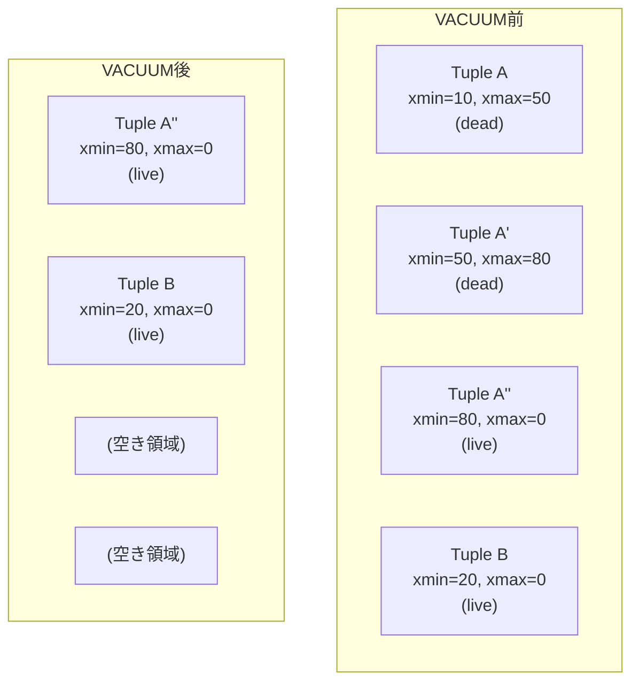

VACUUMには2種類がある。

**通常のVACUUM（Lazy VACUUM）**: Dead Tupleを回収し、その領域を「再利用可能」としてマークするが、テーブルファイル自体は縮小しない。空き領域は後続のINSERTやUPDATEで再利用される。テーブルへの通常のアクセスと並行して実行できる。

**VACUUM FULL**: テーブル全体を新しいファイルに書き換え、物理的にファイルサイズを縮小する。ただし、テーブルに対する排他ロック（AccessExclusiveLock）を取得するため、実行中はテーブルへのあらゆるアクセスがブロックされる。本番環境では極力避けるべきである。

### 5.4 Autovacuum

PostgreSQLには**autovacuum**デーモンが組み込まれており、テーブルの更新量に応じて自動的にVACUUMとANALYZEを実行する。autovacuumの起動条件は以下のパラメータで制御される。

```
autovacuum_vacuum_threshold = 50         -- minimum number of dead tuples
autovacuum_vacuum_scale_factor = 0.2     -- fraction of table size
-- Trigger when: dead_tuples > threshold + scale_factor * total_tuples
```

autovacuumを無効化することは一般に推奨されない。無効化すると、Dead Tupleの蓄積によるテーブル膨張と、後述する**Transaction ID Wraparound**問題が発生するリスクがある。

### 5.5 可視性マップ（Visibility Map）

VACUUMの効率を向上させるために、PostgreSQLは**可視性マップ（Visibility Map, VM）**を維持している。可視性マップはテーブルの各ページ（8KB）ごとに2ビットを持つ。

| ビット | 意味 |
|:---|:---|
| `all-visible` | このページのすべてのタプルが、すべてのアクティブなトランザクションから可視 |
| `all-frozen` | このページのすべてのタプルが「凍結済み」でTransaction ID Wraparoundの影響を受けない |

`all-visible` ビットが設定されたページに対しては、VACUUMがスキップできるだけでなく、**Index-Only Scan**の際にヒープへのアクセスを省略できるため、クエリ性能にも直接的な影響がある。

### 5.6 Transaction ID Wraparound問題

PostgreSQLのトランザクションIDは32ビットの符号なし整数（約42億）であり、比較は**モジュラー演算**で行われる。あるXIDからみて、約21億先のXIDは「未来」、約21億前のXIDは「過去」と解釈される。

しかし、XIDは有限であるため、いずれ一周する。一周するとモジュラー演算の解釈が逆転し、過去にコミットされたデータが「未来のトランザクションによって作成された」と誤判定され、**データが突然見えなくなる**という壊滅的な問題が発生する。

この問題を防ぐために、PostgreSQLはVACUUM時に古いタプルのXIDを特殊な値 `FrozenTransactionId` に書き換える処理（**Freeze**）を行う。FrozenTransactionIdは「すべてのトランザクションから過去のものと見なされる」特殊なIDであり、モジュラー演算の影響を受けない。

autovacuumを長期間にわたって停止すると、Freeze処理が行われず、Transaction ID Wraparound問題に到達する可能性がある。PostgreSQLはこの危険が迫ると、新規トランザクションの開始を拒否し、強制的にVACUUMを要求する安全機構を備えている。

## 6. MySQL InnoDBのMVCC

### 6.1 InnoDBのアーキテクチャ

MySQL InnoDBはIn-Place Update方式のMVCCを採用している。テーブルの主キーインデックス（**Clustered Index**）上のレコードは常に最新の値を持ち、過去のバージョンは**Undo Log**に保持される。

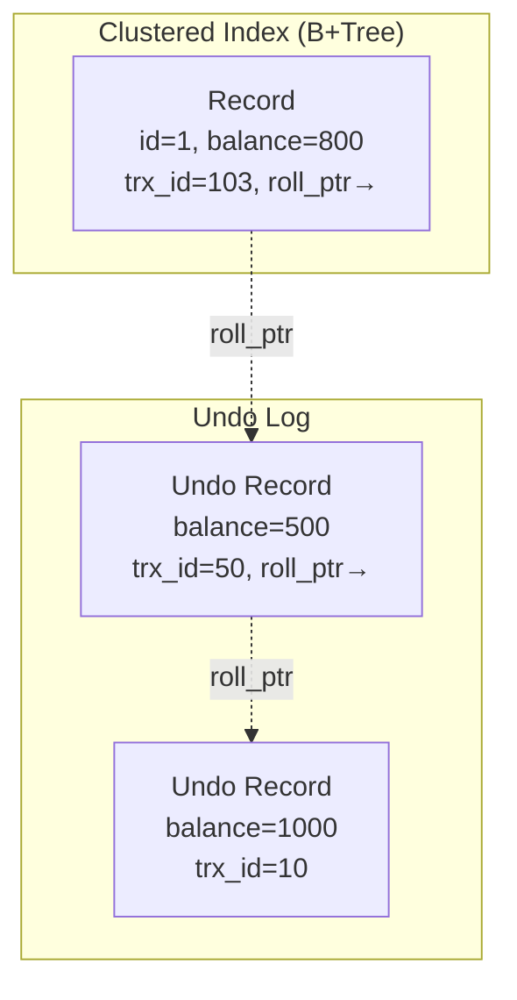

各レコードには以下の隠しカラムが存在する。

| カラム | サイズ | 意味 |
|:---|:---|:---|
| `DB_TRX_ID` | 6バイト | 最後にこのレコードを更新したトランザクションID |
| `DB_ROLL_PTR` | 7バイト | Undo Logへのポインタ（ロールバックポインタ） |
| `DB_ROW_ID` | 6バイト | 行ID（主キーがない場合に自動生成） |

### 6.2 Undo Logの構造

InnoDBのUndo Logは**Undo Tablespace**に格納される。Undo Logには2種類ある。

**INSERT Undo Log**: INSERT操作に対応するUndo Log。トランザクションがコミットされると即座に破棄できる（ロールバック時にDELETEするだけでよいため、他のトランザクションのMVCC読み取りで参照される必要がない）。

**UPDATE Undo Log**: UPDATEおよびDELETE操作に対応するUndo Log。コミット後も、このバージョンを参照する可能性のあるアクティブなトランザクションが存在する間は保持しなければならない。

UPDATE時の処理フロー:

1. 現在のレコードの値をUndo Logに書き出す
2. レコードを直接上書きする
3. レコードの `DB_TRX_ID` を現在のトランザクションIDに更新する
4. レコードの `DB_ROLL_PTR` を新しいUndo Logレコードを指すように更新する

### 6.3 Read View

InnoDBにおけるスナップショットの実装が**Read View**である。Read Viewは以下の情報を保持する。

| フィールド | 意味 |
|:---|:---|
| `m_ids` | Read View作成時にアクティブだったトランザクションIDのリスト |
| `m_low_limit_id` | Read View作成時の「次に発行されるトランザクションID」（これ以上のIDはすべて不可視） |
| `m_up_limit_id` | `m_ids` の中の最小値（これより小さいIDはすべてコミット済みで可視） |
| `m_creator_trx_id` | このRead Viewを作成したトランザクション自身のID |

Read Viewに基づく可視性判定は以下のアルゴリズムで行われる。

```python
def is_visible_innodb(record_trx_id, read_view):
    # The record was created by this transaction itself
    if record_trx_id == read_view.m_creator_trx_id:
        return True

    # The transaction ID is less than the smallest active ID
    # → it must have committed before the Read View was created
    if record_trx_id < read_view.m_up_limit_id:
        return True

    # The transaction ID is >= the next-to-be-assigned ID
    # → it started after the Read View was created
    if record_trx_id >= read_view.m_low_limit_id:
        return False

    # The transaction ID falls in the range [m_up_limit_id, m_low_limit_id)
    # → check if it was active at the time of the Read View
    if record_trx_id in read_view.m_ids:
        return False  # still active → not visible

    return True  # committed before Read View → visible
```

### 6.4 Read ViewとUndo Logの連携

具体的な読み取りの流れを追う。

1. トランザクションがSELECTを実行する
2. Clustered Index上のレコードの `DB_TRX_ID` をRead Viewで判定する
3. 可視であれば、そのレコードを返す
4. 不可視であれば、`DB_ROLL_PTR` を辿ってUndo Log上の旧バージョンを取得する
5. 旧バージョンの `DB_TRX_ID` を再びRead Viewで判定する
6. 可視なバージョンが見つかるまで繰り返す

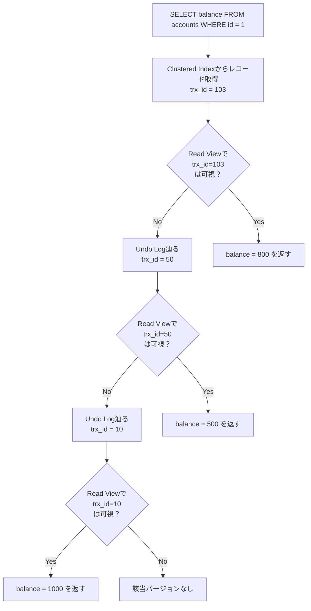

### 6.5 Purge — InnoDBのガベージコレクション

InnoDBでは、不要になったUndo Logレコードを回収するプロセスを**Purge**と呼ぶ。Purgeスレッドはバックグラウンドで動作し、すべてのアクティブなRead Viewから参照される可能性がなくなったUndo Logレコードを削除する。

Purgeが遅延すると、Undo Tablespaceが肥大化し、ディスク使用量が増加する。また、長時間実行トランザクションが一つでも存在すると、そのトランザクションのRead Viewが参照する可能性のあるすべてのUndo Logが保持されるため、Purgeの進行が阻害される。

InnoDBでは `innodb_purge_threads` パラメータでPurgeスレッドの数を制御でき、`innodb_max_purge_lag` でPurgeが追いつかない場合にDMLの実行を遅延させるしきい値を設定できる。

## 7. ガベージコレクション

### 7.1 不要バージョンの判定

MVCCにおけるガベージコレクションの核心は、「どのバージョンが不要か」を正確に判定することにある。あるバージョンが不要になるための条件は以下のとおりである。

> そのバージョンを参照する可能性のあるアクティブなトランザクション（またはスナップショット）が一つも存在しない

この判定のために、データベースは**最も古いアクティブなスナップショット**を追跡する。このスナップショットよりも古い時点で無効化されたバージョンは、もはや誰からも参照されることがなく、安全に回収できる。

### 7.2 ガベージコレクション戦略

ガベージコレクションの実行方法には複数の戦略がある。

**バックグラウンドGC**: 専用のスレッドがバックグラウンドで定期的に不要バージョンを走査し回収する。PostgreSQLのautovacuumやInnoDBのPurgeスレッドがこれに該当する。メリットはトランザクションの応答時間に影響を与えないこと。デメリットは回収が遅延する可能性があること。

**トランザクション連携型GC（Cooperative GC）**: 各トランザクションが読み取り時に遭遇した不要バージョンを回収する。追加のバックグラウンドプロセスが不要で、回収がトランザクションの処理と同時に行われる。デメリットはトランザクションの応答時間が予測しにくくなること。

**エポックベースGC**: グローバルなエポックカウンタを維持し、各トランザクションが開始時に現在のエポックを記録する。あるエポックのすべてのトランザクションが終了したら、それ以前のバージョンを一括して回収する。実装がシンプルで効率的だが、長時間実行トランザクションが存在するとエポックが進行せず、メモリが解放されない。

### 7.3 ガベージコレクションの課題

ガベージコレクションに共通する課題は**長時間実行トランザクション**の存在である。あるトランザクションが長時間アクティブなままスナップショットを保持していると、そのスナップショット以降のすべてのバージョンが回収対象から除外される。これにより以下の問題が連鎖的に発生する。

1. **ストレージ使用量の増大**: 不要バージョンが蓄積し、テーブルやUndo Logが肥大化する
2. **読み取り性能の劣化**: バージョンチェーンやUndo Logの走査コストが増大する
3. **インデックスの肥大化**: PostgreSQLでは不要タプルを指すインデックスエントリも蓄積する

PostgreSQLの `idle_in_transaction_session_timeout` やMySQL InnoDBの `innodb_max_purge_lag` は、こうした問題に対する運用上の対策である。

## 8. MVCCとトランザクション分離レベルの関係

### 8.1 SQL標準の分離レベル

SQL標準は4つのトランザクション分離レベルを定義している。MVCCは各分離レベルの実装方式に深く関わっている。

| 分離レベル | Dirty Read | Non-Repeatable Read | Phantom Read |
|:---|:---|:---|:---|
| Read Uncommitted | 発生しうる | 発生しうる | 発生しうる |
| Read Committed | 防止 | 発生しうる | 発生しうる |
| Repeatable Read | 防止 | 防止 | 発生しうる |
| Serializable | 防止 | 防止 | 防止 |

### 8.2 MVCCによる分離レベルの実現

MVCCにおいて、分離レベルの違いは**スナップショットの取得タイミング**で制御される。

**Read Committed**: 各SQL文の実行ごとに新しいスナップショット（Read View）を取得する。同一トランザクション内でも、後続のSELECTはその時点の最新のコミット済みデータを見る。PostgreSQLのデフォルトの分離レベルである。

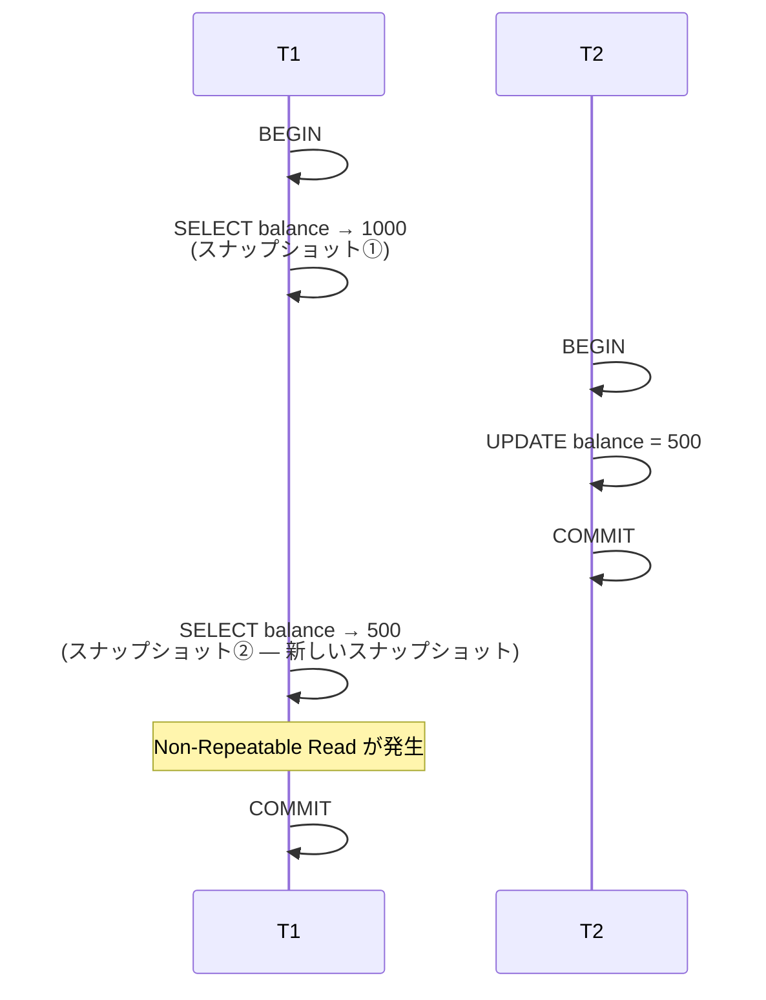

**Repeatable Read**: トランザクションの最初のSQL文実行時にスナップショットを取得し、トランザクション全体でそのスナップショットを使い続ける。MySQL InnoDBのデフォルトの分離レベルである。

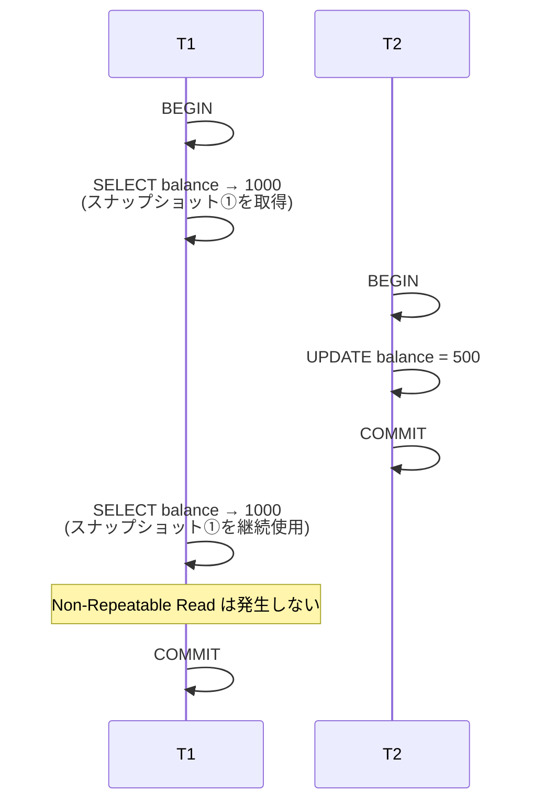

**Serializable**: MVCCだけでは完全な直列化可能性を保証できない。追加のメカニズムが必要となる。PostgreSQLでは**SSI（Serializable Snapshot Isolation）**を使用し、依存関係グラフを追跡してサイクルを検出することで直列化可能性を保証する。MySQL InnoDBではSerializable分離レベルにおいてすべてのSELECTを `SELECT ... FOR SHARE`（旧称: `LOCK IN SHARE MODE`）として実行し、ロックベースの制御にフォールバックする。

### 8.3 Snapshot Isolation（SI）とSerializabilityの違い

MVCCが自然に提供する分離レベルは**Snapshot Isolation（SI）**と呼ばれ、SQL標準のどの分離レベルとも正確には一致しない。SIは以下の性質を持つ。

- 各トランザクションはコミット済みの一貫したスナップショットを読む
- 2つのトランザクションが同じデータを同時に書き込もうとした場合、**First-Committer-Wins**ルールにより後者がアボートされる

SIはSerializableよりも弱い分離レベルである。SIでは許容されるが、Serializableでは許容されない異常の代表例が**Write Skew**である（次章で詳述する）。

## 9. MVCCの課題

### 9.1 Write Skew異常

Write Skewは、Snapshot Isolationにおいて発生しうる異常（anomaly）の一つであり、MVCCの最も重要な課題である。

**具体例**: 病院の当直医師スケジュールを管理するシステムで、「常に少なくとも1人の医師が当直していなければならない」という制約がある。

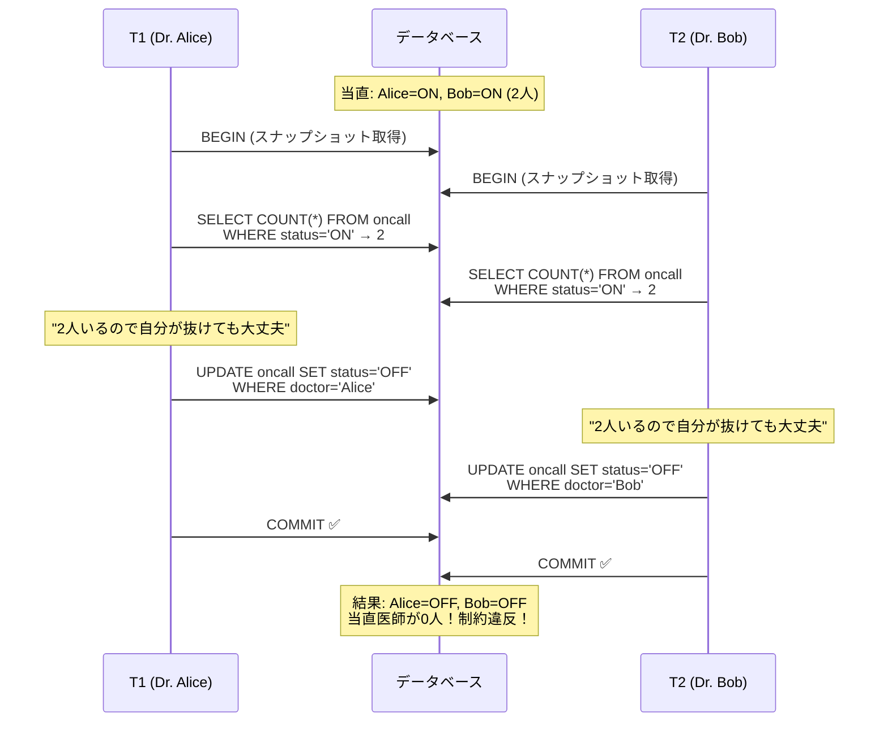

T1とT2は**異なる行**を更新しているため、Write-Write Conflictは発生せず、First-Committer-Winsルールでも検出されない。それぞれのトランザクションは、スナップショット時点では制約が満たされていることを確認しているが、両方がコミットされた結果として制約が破られる。

Write Skewへの対策:

1. **Serializable分離レベルの使用**: PostgreSQLのSSIはWrite Skewを検出してアボートさせる
2. **明示的なロック**: `SELECT ... FOR UPDATE` で読み取り時に排他ロックを取得し、関連行へのアクセスを直列化する
3. **アプリケーションレベルの制約チェック**: マテリアライズドコンフリクトの手法を使用する

### 9.2 長時間実行トランザクションの問題

前述のとおり、長時間実行トランザクションはガベージコレクションの進行を阻害する。これに加えて、以下の問題がある。

**バージョンチェーンの長大化**: 長時間トランザクションのスナップショットから見える必要があるバージョンがすべて保持されるため、チェーンが長くなる。これにより、新しいトランザクションでも対象行のバージョンチェーンを走査する際に性能が劣化する。

**ロックとの組み合わせ**: MVCCは読み取りのロックを不要にするが、書き込み同士の競合にはロックが依然として必要である（例: 同じ行へのUPDATE）。長時間実行トランザクションが行ロックを保持し続けると、他の書き込みトランザクションがブロックされる。

### 9.3 ストレージオーバーヘッド

MVCCは本質的に、同一データの複数バージョンを保持するため、ストレージ使用量がシングルバージョンの制御方式よりも大きくなる。特にOLTP環境で頻繁に更新される行（ホットスポット）では、バージョンの蓄積が顕著になる。

PostgreSQLでは、更新頻度が高いテーブルのテーブルサイズが実データ量の数倍に膨張することがある。この**テーブル膨張（Table Bloat）**はPostgreSQLの運用における代表的な課題であり、`pg_stat_user_tables` ビューの `n_dead_tup` カラムやサードパーティツール（`pgstattuple`、`pg_repack` など）を使って監視・対処する必要がある。

### 9.4 Write Amplification

InnoDBのIn-Place Update方式では、1回の論理的な更新に対して以下の書き込みが発生する。

1. Undo Logへの旧バージョンの書き出し
2. Clustered Index上のレコードの上書き
3. Redo Log（WAL）への変更の書き出し
4. Secondary Indexの更新（変更された列にセカンダリインデックスが存在する場合）

この**Write Amplification**は、SSDベースのストレージでは特に問題となる。SSD自体がガベージコレクション（Flash Translation Layer内部のGC）を行っており、データベースのWrite Amplificationとストレージ層のWrite Amplificationが乗算的に作用する。

## 10. まとめ

### 10.1 MVCCの本質

MVCCの本質は「時間軸を空間に変換する」ことにある。データの過去の状態を物理的に保持することで、読み取りトランザクションは特定の時点のデータに「タイムトラベル」できる。この結果、読み取りと書き込みが論理的に独立し、互いをブロックすることなく並行して実行できる。

ロックベースの同時実行制御が「一つの現在を奪い合う」アプローチだとすれば、MVCCは「それぞれのトランザクションが自分専用の過去を持つ」アプローチである。この根本的な設計思想の転換により、現代のデータベースは高いスループットと一貫性を両立させている。

### 10.2 実装方式の選択

Append-Only方式（PostgreSQL）とIn-Place Update方式（MySQL InnoDB）は、それぞれ異なるトレードオフを持つ。

Append-Only方式は実装がシンプルで、クラッシュリカバリが容易だが、テーブル膨張という運用上の課題を抱える。VACUUMのチューニングと監視は、PostgreSQLの運用において不可欠なスキルである。

In-Place Update方式はテーブル本体をコンパクトに保てるが、Undo Logの管理が複雑であり、古いバージョンの読み取りにはUndo Logの走査が必要となる。PurgeスレッドとUndo Tablespaceの監視が運用上のポイントとなる。

### 10.3 理解すべきこと

MVCCは「ロックが不要になる」魔法ではない。以下の点を正確に理解しておく必要がある。

1. **読み取りと書き込みの非競合**はMVCCの最大の恩恵だが、**書き込み同士の競合**は依然としてロック（または楽観的制御）で解決する必要がある
2. **Snapshot Isolation**はSerializableではない。Write Skewなどの異常が発生しうるため、アプリケーション設計時に分離レベルの意味を正確に把握する必要がある
3. MVCCは**ガベージコレクション**を必然的に伴う。不要バージョンの回収が追いつかなければ、性能劣化とストレージ膨張が発生する
4. **長時間実行トランザクション**はMVCCの天敵である。不要なトランザクションの即時コミットと、`idle_in_transaction_session_timeout` などの安全策の設定は運用上の必須事項である

MVCCは1978年の提案以来、半世紀近くにわたってデータベースの中核技術であり続けている。現代のNewSQL系データベース（CockroachDB、TiDB、YugabyteDB）やインメモリデータベース（HyPer、Hekaton）もMVCCを基盤としつつ、より精緻な実装を追求している。データベースの内部動作を理解するうえで、MVCCの原理と課題を正確に把握することは極めて重要である。
