# NAT とポートフォワーディング

## 1. 歴史的背景：IPv4アドレス枯渇問題

### 1.1 IPv4アドレス空間の限界

インターネットの基盤となる **IPv4（Internet Protocol version 4）** は、1981年に RFC 791 として標準化された。IPv4 アドレスは 32 ビットで表現されるため、理論上のアドレス数は約 43 億（$2^{32} = 4,294,967,296$）である。

インターネット黎明期の 1980 年代には、この数量は「将来にわたって十分すぎる」と考えられていた。しかし現実は異なった。インターネットが爆発的に普及した 1990 年代に入ると、IP アドレスの消費ペースは当初の予測を大幅に上回り始めた。

### 1.2 枯渇の進行

1992 年、当時の IANA（Internet Assigned Numbers Authority）はアドレス枯渇が現実の問題になりつつあることを警告した。当初の割り当て方式であるクラスフルアドレッシング（Class A/B/C）は非効率が大きく、膨大なアドレスブロックが使われないまま割り当て済みになっていた。

::: warning アドレス割り当ての非効率性
クラス A（/8 ブロック）は単一組織に 1,677 万 IP アドレスを付与する。MIT やスタンフォード大学などの初期インターネット参加者がクラス A ブロックを保有しており、そのほとんどは実際には使用されなかった。
:::

CIDR（Classless Inter-Domain Routing）の導入（1993年）によって割り当て効率は改善されたが、根本的なアドレス不足は解消されなかった。

IANA は 2011 年 2 月に最後のアドレスブロックを各地域インターネットレジストリ（RIR）に割り当てた。アジア太平洋地域の APNIC は同年 4 月に枯渇を宣言した。

### 1.3 NATの登場

こうした状況への短期的な解決策として提案されたのが **NAT（Network Address Translation：ネットワークアドレス変換）** である。

RFC 1631（1994年）として最初に文書化された NAT は、複数のホストが単一のグローバル IP アドレスを共有してインターネットに接続する仕組みを提供した。これにより、家庭やオフィス内のすべてのデバイスがプライベート IP アドレス空間（RFC 1918 で定義）を使用しながら、NAT デバイス（一般的にはルーター）が持つ 1 つのグローバル IP アドレスでインターネットと通信できるようになった。

**RFC 1918 で定義されたプライベートアドレス空間：**

| クラス | アドレス範囲 | CIDR 表記 | ホスト数 |
|--------|------------|-----------|---------|
| A | 10.0.0.0 〜 10.255.255.255 | 10.0.0.0/8 | 約 1,677 万 |
| B | 172.16.0.0 〜 172.31.255.255 | 172.16.0.0/12 | 約 104 万 |
| C | 192.168.0.0 〜 192.168.255.255 | 192.168.0.0/16 | 約 6.5 万 |

NAT は「IPv6 移行が完了するまでの一時的な措置」として導入されたが、今日に至るまでインターネットインフラの不可欠な構成要素であり続けている。

---

## 2. NATの基本原理

### 2.1 アドレス変換の概念

NAT の基本的な考え方は単純である。内部ネットワーク（ローカル）と外部ネットワーク（インターネット）の境界に位置する NAT デバイスが、通過するパケットの IP アドレスを書き換える。

```
[内部ネットワーク]          [NATルーター]          [インターネット]
192.168.1.10         →    203.0.113.1         →    8.8.8.8
(プライベートIP)           (グローバルIP)             (外部サーバー)
```

アウトバウンド通信（内部 → 外部）では、送信元 IP アドレスをプライベートアドレスからグローバルアドレスに書き換える。インバウンド通信（外部 → 内部）では逆変換を行い、宛先 IP アドレスをグローバルアドレスからプライベートアドレスに戻す。

### 2.2 NATテーブル

NAT デバイスがアドレス変換を管理するために維持するデータ構造が **NAT テーブル**（変換テーブル、セッションテーブルとも呼ばれる）である。

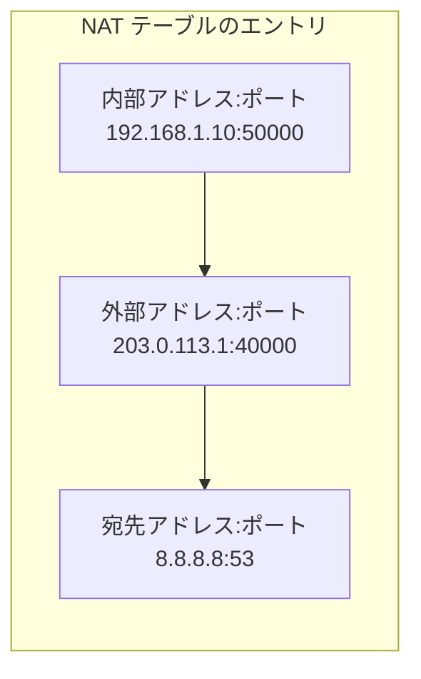

NAT テーブルの各エントリは通常、以下の情報を保持する：

- **内部ローカルアドレス（Inside Local）**: プライベートネットワーク側の送信元 IP とポート
- **内部グローバルアドレス（Inside Global）**: 外部から見た送信元 IP とポート
- **外部アドレス**: 通信相手の IP とポート
- **プロトコル**: TCP、UDP、ICMP など
- **タイムスタンプ**: セッションのタイムアウト管理用

### 2.3 パケット変換フロー

具体的なパケット変換の流れを追ってみよう。内部ホスト（192.168.1.10）が Google の DNS サーバー（8.8.8.8:53）に UDP クエリを送信する場合：

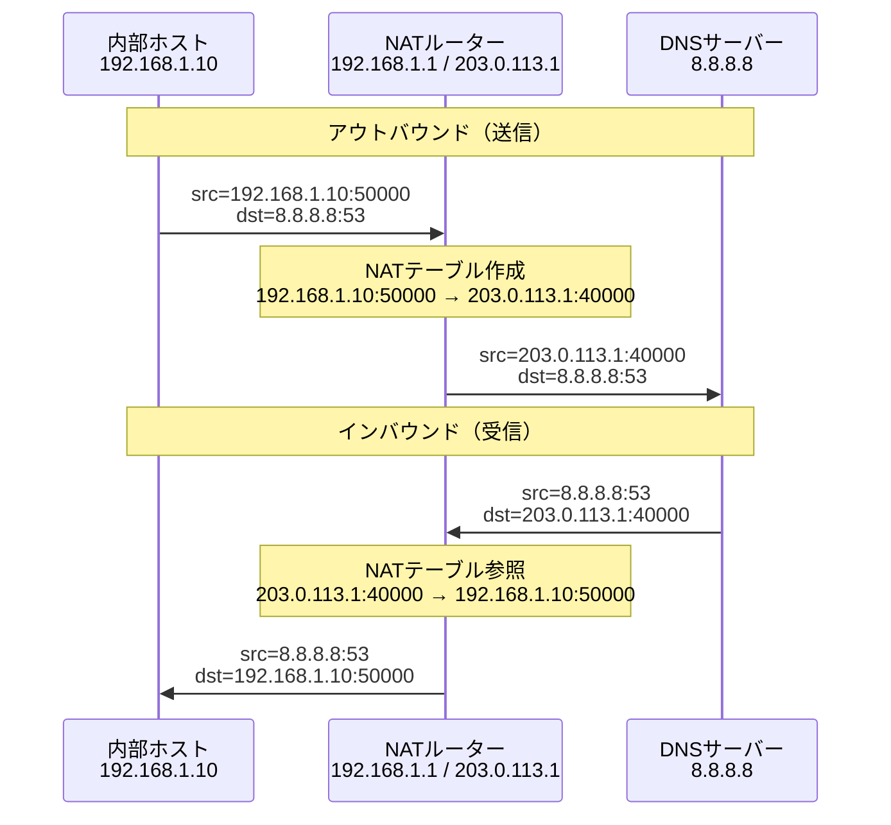

このプロセスはアプリケーション層には透過的である。送受信するアプリケーションは NAT の存在を意識しない。

---

## 3. NATの種類

### 3.1 Static NAT（静的NAT）

**Static NAT** は、1 つのグローバル IP アドレスと 1 つのプライベート IP アドレスを固定的に 1 対 1 でマッピングする方式である。

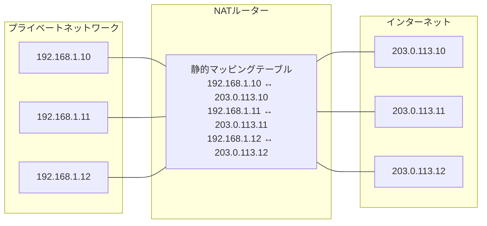

**特徴：**
- アドレス節約効果がない（1 対 1 マッピング）
- 内部から外部、外部から内部の双方向通信が可能
- Web サーバーやメールサーバーなど、インターネットから到達可能にする必要があるサーバーに使用

Static NAT はアドレス変換の双方向性を持つため、外部からの接続を受け付けたい固定サーバーに適している。ただし、グローバル IP アドレスの節約にはならない。

### 3.2 Dynamic NAT（動的NAT）

**Dynamic NAT** は、プライベート IP アドレスをグローバル IP アドレスのプールから動的に割り当てる方式である。

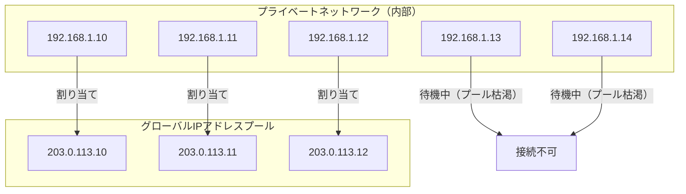

**特徴：**
- 複数の内部ホストがグローバルアドレスプールを共有
- 同時にインターネット接続できるホスト数はプールサイズに限られる
- 接続が閉じると、グローバルアドレスはプールに返却される

Dynamic NAT は Static NAT よりも効率的だが、同時接続数がプールサイズによって制限されるため、大規模なネットワークでは依然として非効率である。

### 3.3 NAPT/PAT（ポートアドレス変換）

現実のインターネット環境で最も広く使われているのが **NAPT（Network Address Port Translation）** である。ベンダーによっては **PAT（Port Address Translation）**、あるいは単に **NAT オーバーロード**とも呼ばれる。

NAPT の核心的なアイデアは、IP アドレスだけでなく **TCP/UDP のポート番号** も変換対象に含めることで、1 つのグローバル IP アドレスを多数の内部ホストで共有する点にある。

TCP/UDP のポート番号は 16 ビットで、理論上最大 65,535 ポートが利用可能である（実際は 1023 以下はウェルノウンポートとして予約）。これにより、理論上は 1 つのグローバル IP で数万の同時セッションを処理できる。

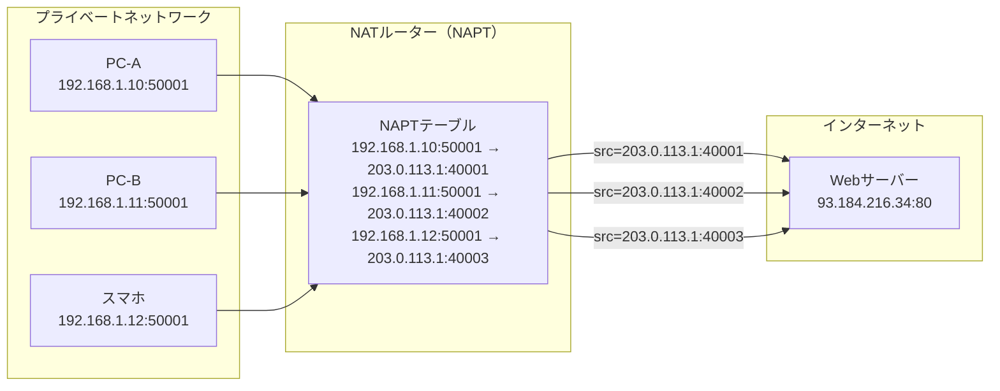

**NAPTテーブルの具体例：**

| プロトコル | 内部アドレス:ポート | グローバルアドレス:ポート | 宛先アドレス:ポート |
|-----------|------------------|----------------------|------------------|
| TCP | 192.168.1.10:50001 | 203.0.113.1:40001 | 93.184.216.34:80 |
| TCP | 192.168.1.11:50001 | 203.0.113.1:40002 | 93.184.216.34:80 |
| TCP | 192.168.1.12:50001 | 203.0.113.1:40003 | 93.184.216.34:80 |
| UDP | 192.168.1.10:50500 | 203.0.113.1:41000 | 8.8.8.8:53 |

3 つの内部ホストが同じ宛先の同じポートに接続していても、NAT ルーターは異なるポート番号（40001、40002、40003）を割り当てることで識別可能にしている。

---

## 4. NATの分類（コーンタイプ）

NAT デバイスの振る舞いは一様ではなく、外部からの接続をどこまで許可するかによってさまざまな種類に分類される。この分類は **STUN（Session Traversal Utilities for NAT）** の RFC 3489 で提案されたものである。

### 4.1 Full Cone NAT（フルコーンNAT）

**Full Cone NAT** は最も「寛容」な NAT 実装である。

内部ホストが外部と通信すると、NAT テーブルにマッピングが作成される。一度マッピングが作成されると、**任意の外部ホストの任意のポートから**、そのマッピングのグローバルポートに向けた通信が内部ホストに転送される。

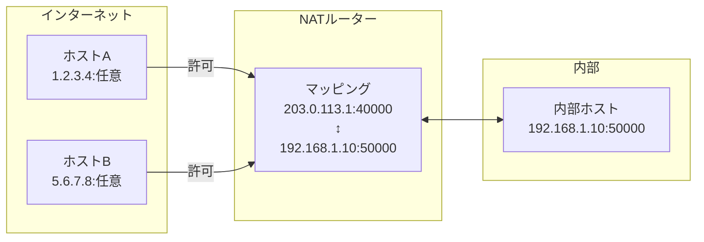

**特性：**
- 最も透過性が高く、P2P 通信に最も有利
- セキュリティ上のリスクが最も高い（誰でも内部に到達できる）
- 現在の実装では少数派

### 4.2 Address Restricted Cone NAT（アドレス制限コーンNAT）

**Address Restricted Cone NAT** では、内部ホストが過去に通信したことのある **IP アドレス**からの着信のみを許可する。

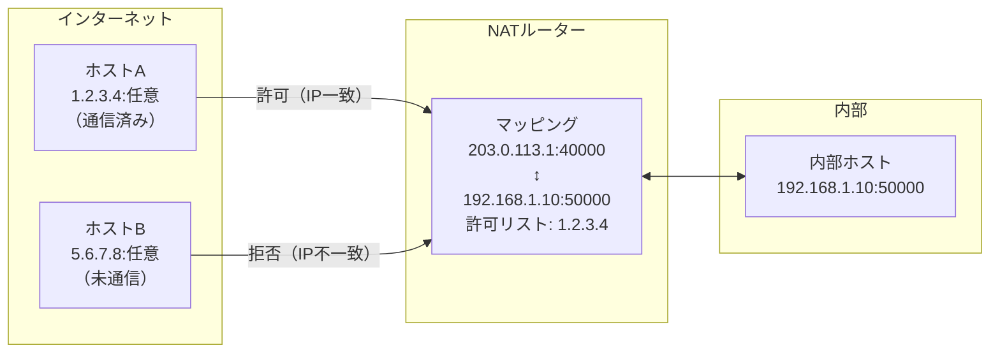

**特性：**
- 一度接続した相手の IP からは任意のポートで着信可能
- Full Cone より安全だが、P2P でのホールパンチングは可能
- 過去の通信の記録（ホワイトリスト）を NAT が保持する

### 4.3 Port Restricted Cone NAT（ポート制限コーンNAT）

**Port Restricted Cone NAT** では、内部ホストが過去に通信したことのある **IP アドレスとポートの組み合わせ**からの着信のみを許可する。

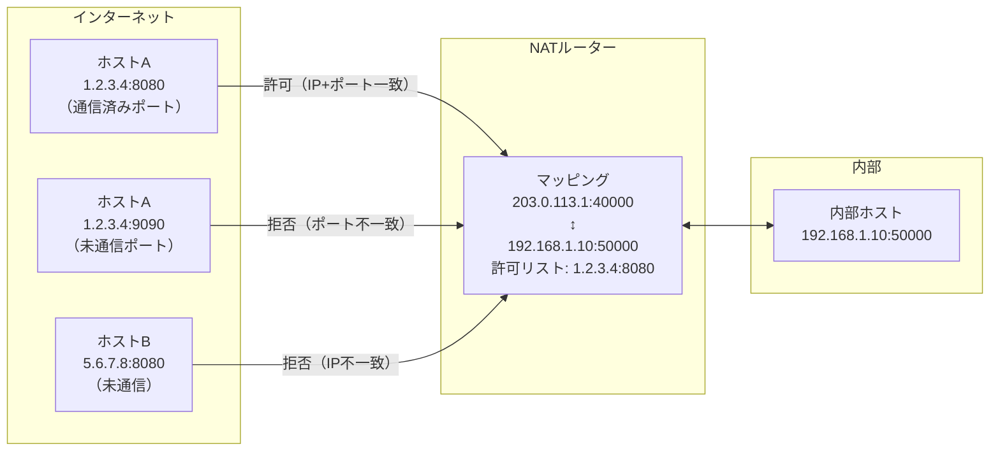

**特性：**
- IP とポートの両方が一致する場合のみ転送
- Address Restricted より制限が厳しい
- 多くの家庭用ルーターがこの実装に近い

### 4.4 Symmetric NAT（シンメトリックNAT）

**Symmetric NAT** は上記 3 種のコーン型と根本的に異なる。コーン型では同じ内部アドレス:ポートに対して 1 つのグローバルポートを割り当てるが、Symmetric NAT では **通信相手ごとに異なるグローバルポートを割り当てる**。

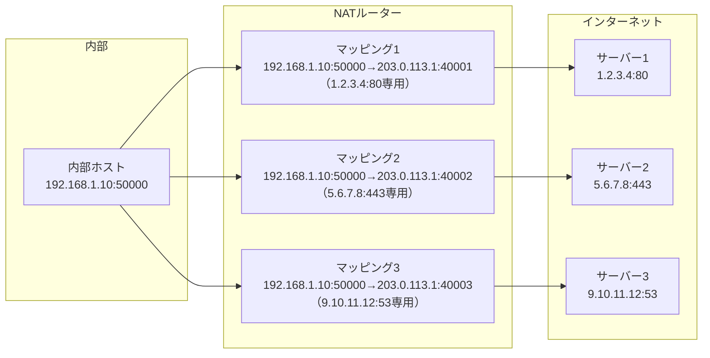

**特性：**
- 各通信セッションに固有のグローバルポートが割り当てられる
- 後述するホールパンチングが困難
- セキュリティは最も高い
- エンタープライズ環境やキャリアグレード NAT で多く採用

**4種類のNATの比較まとめ：**

| 種類 | 着信フィルタリング | P2P容易性 | セキュリティ |
|------|-----------------|-----------|------------|
| Full Cone | なし | 最高 | 最低 |
| Address Restricted Cone | 送信先IPのみ | 高 | 中 |
| Port Restricted Cone | 送信先IP+ポート | 中 | 中高 |
| Symmetric | 送信先IP+ポート（セッション固有） | 最低 | 最高 |

---

## 5. ポートフォワーディングの仕組み

### 5.1 なぜポートフォワーディングが必要か

NAT 環境では、デフォルトで外部からの接続要求を内部ホストに届けることができない。外部から接続が来ても、NAT テーブルに対応するエントリが存在しないためである。

これは家庭内の Web サーバー、ゲームサーバー、監視カメラなどへの外部アクセスを実現したい場合に問題となる。

```
[外部ユーザー] → 203.0.113.1:8080 → [NATルーター] → ???
                                      NATテーブルに該当エントリなし
                                      → パケット破棄
```

### 5.2 ポートフォワーディングの設定

**ポートフォワーディング**（ポートマッピングとも呼ばれる）は、NATルーターの特定のグローバルポートへの着信を、指定した内部ホストの指定したポートに転送する静的な設定である。

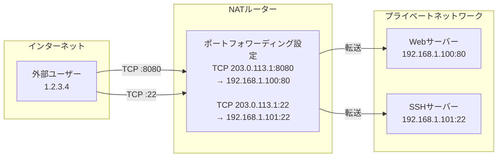

ルーターの設定には一般に以下のパラメータが必要である：

- **プロトコル**: TCP または UDP（またはその両方）
- **外部ポート**: グローバル IP で待ち受けるポート番号
- **内部 IP アドレス**: 転送先の内部ホストの IP アドレス
- **内部ポート**: 転送先のポート番号

### 5.3 ポートフォワーディングの実装詳細

NAT ルーターはポートフォワーディングの設定を受け取ると、NATテーブルに**静的エントリ**を事前に作成する。このエントリはタイムアウトせず、設定が変更されるまで有効である。

通常の動的 NAT エントリとの違いは次の通りである：

| 項目 | 動的NATエントリ | ポートフォワーディングエントリ |
|------|--------------|--------------------------|
| 作成タイミング | 内部からの接続時 | 管理者設定時（事前）|
| 削除タイミング | タイムアウト後 | 設定削除まで永続 |
| 方向 | 内部→外部の通信後に外部→内部も可 | 外部→内部への接続を開始可 |
| 宛先 IP | 任意（動的 NAT の場合）| 固定 |

### 5.4 ポートフォワーディングの具体例

```
設定：TCP ポート 443 を 192.168.1.100:443 に転送

外部からの接続：
src=5.6.7.8:55000, dst=203.0.113.1:443

NATルーターの処理：
1. dst が 203.0.113.1:443 に一致するポートフォワーディングルールを検索
2. 一致するルール発見
3. パケットのdstを 192.168.1.100:443 に書き換え
4. 動的NATエントリを作成（応答パケットの逆変換のため）
5. パケットを内部ネットワークに転送

内部サーバーへ到達：
src=5.6.7.8:55000, dst=192.168.1.100:443
```

### 5.5 UPnP によるポートフォワーディングの自動化

手動設定の煩雑さを解消するため、多くの家庭用ルーターは **UPnP（Universal Plug and Play）** をサポートしている。これにより、アプリケーションがポートフォワーディングをプログラム的に要求できる。

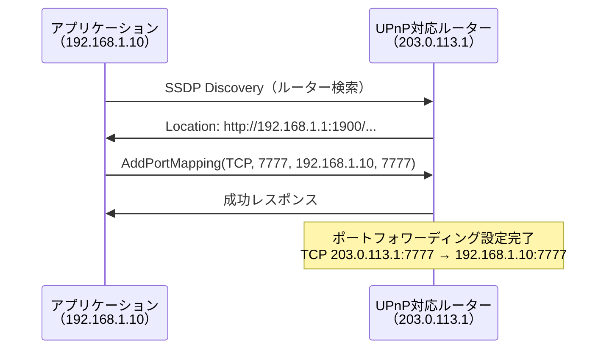

しかし UPnP はセキュリティ上のリスクを伴う。悪意あるソフトウェアが勝手にポートフォワーディングを設定できるためである。エンタープライズ環境では UPnP を無効にすることが推奨される。

---

## 6. NATトラバーサル技術

NAT 環境下では、2 つのプライベートネットワーク内のホストが直接通信することが困難になる。この問題を解決するための技術群が **NATトラバーサル**である。WebRTC、VoIP、P2P ファイル共有、オンラインゲームなどで広く活用されている。

### 6.1 STUN（Session Traversal Utilities for NAT）

**STUN** は RFC 5389 で定義されたプロトコルである。STUN の基本機能は、クライアントが自分のグローバル IP アドレスとポートを知るための仕組みを提供することである。

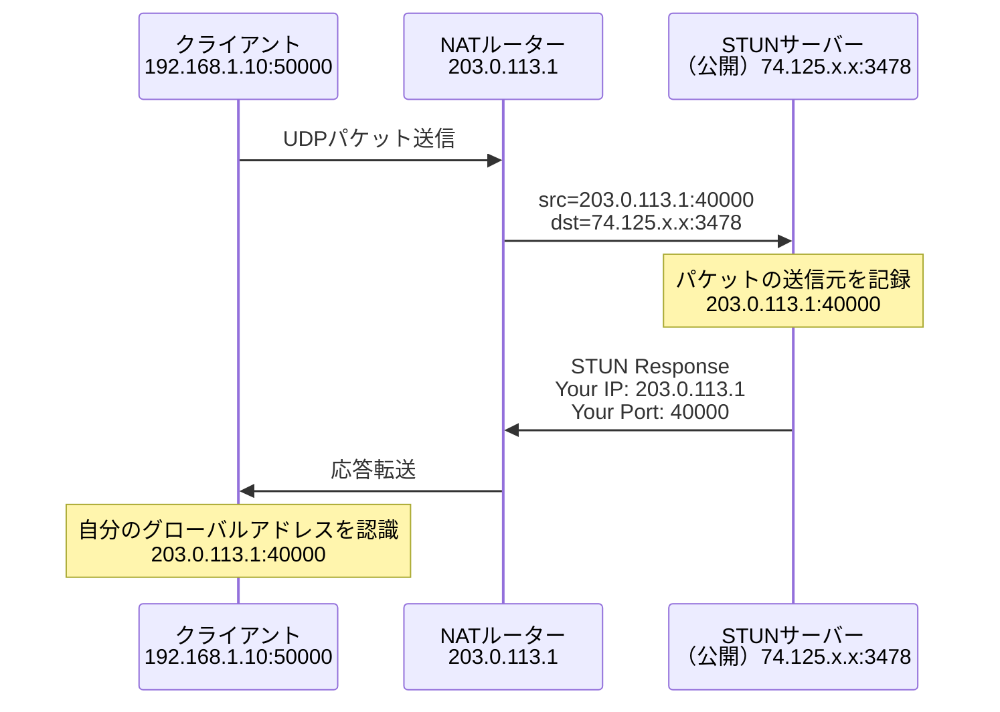

STUN による自己アドレス発見は NAT トラバーサルの第一歩である。次にこの情報をシグナリングサーバー経由で通信相手に伝えることで、直接通信のセッションを確立できる。

#### ホールパンチング

STUN を利用した P2P 接続確立技術が **ホールパンチング（Hole Punching）**である。UDP ホールパンチングの手順を示す。

```mermaid
sequenceDiagram
    participant A as クライアントA<br/>192.168.1.10<br/>NAT-A: 203.0.113.1:40001
    participant Sig as シグナリングサーバー
    participant B as クライアントB<br/>10.0.0.5<br/>NAT-B: 198.51.100.1:50001

    A->>Sig: 自分のアドレス通知<br/>203.0.113.1:40001
    B->>Sig: 自分のアドレス通知<br/>198.51.100.1:50001
    Sig->>A: Bのアドレス: 198.51.100.1:50001
    Sig->>B: Aのアドレス: 203.0.113.1:40001

    Note over A,B: 同時にお互いに向けてUDP送信（ホールパンチング）
    A->>B: UDP → 198.51.100.1:50001<br/>（NAT-AにNAT-B向けのホールを開ける）
    B->>A: UDP → 203.0.113.1:40001<br/>（NAT-BにNAT-A向けのホールを開ける）

    Note over A,B: 最初のパケットは破棄されるが<br/>ホールが開いたため2往目から通過
    A<->>B: P2P通信確立
```

ホールパンチングは Full Cone、Address Restricted Cone、Port Restricted Cone NAT では機能するが、**Symmetric NAT では原則として機能しない**。Symmetric NAT では通信相手ごとに異なるグローバルポートが割り当てられるため、STUNで得たポート情報が実際の通信先ポートと一致しない。

### 6.2 TURN（Traversal Using Relays around NAT）

Symmetric NAT など、ホールパンチングが機能しない場合に用いるのが **TURN**（RFC 5766）である。TURN は中継サーバーを介して通信を行う。

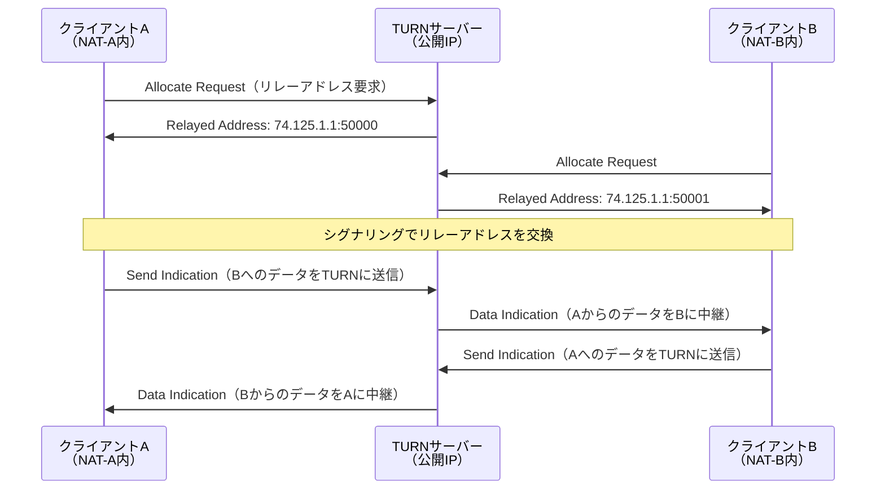

TURN はすべての NAT タイプに対して機能するが、すべての通信が中継サーバーを経由するため：
- 帯域幅コストが高い
- レイテンシが増加する
- サーバーがボトルネックになる

このため TURN は最終手段として使用する。

### 6.3 ICE（Interactive Connectivity Establishment）

**ICE**（RFC 8445）は STUN と TURN を統合した包括的な NAT トラバーサルフレームワークである。WebRTC の接続確立に使用されている。

ICE は複数の接続経路（**候補：Candidate**）を収集し、最適なものを選択する。

**ICE候補の種類：**

1. **Host Candidate**: ローカルネットワークインターフェースのアドレス（例：192.168.1.10:50000）
2. **Server Reflexive Candidate**: STUN で発見したグローバルアドレス（例：203.0.113.1:40000）
3. **Relayed Candidate**: TURN サーバーが割り当てたリレーアドレス（例：74.125.1.1:50000）

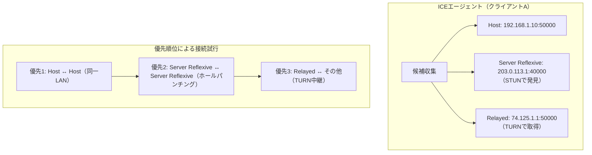

ICE のプロセスは以下の流れで進む：

1. **候補収集（Gathering）**: 各タイプの候補を収集する
2. **シグナリング**: 候補リストを SDP（Session Description Protocol）で相手に送る
3. **接続チェック（Connectivity Checks）**: STUN Binding Request で各候補ペアの接続性を確認する
4. **候補選択**: 接続可能な候補の中から最適なものを選ぶ
5. **通信確立**: 選ばれた候補ペアで実際のデータ転送を開始する

---

## 7. NATの問題点

NAT は IPv4 アドレス枯渇への応急処置として機能したが、インターネットの設計思想に根本的な矛盾を引き起こした。

### 7.1 End-to-End 原則の破壊

インターネットは **End-to-End 原則** に基づいて設計された。この原則は「ネットワークの中間ノードは、エンドポイント（端末）が必要とする知識・状態を持つべきでない」というものである。

NAT はこの原則を根底から崩している：

- **アドレスの意味の変質**: プライベートアドレスはインターネット上で一意でなくなり、同じアドレスが世界中の無数の NAT 内で重複して使われる
- **中間ノードによる状態管理**: NAT ルーターは各セッションの状態（NATテーブル）を保持しなければならない。これは「ステートレスな中間ノード」というインターネット設計思想への違反である
- **プロトコルへの介入**: IP ヘッダーを書き換えることで、IPsec の AH（Authentication Header）など整合性確認を行うプロトコルが機能しなくなる

### 7.2 P2P通信の困難さ

NAT 環境では、2 つのプライベートネットワーク内のホストが直接通信することが構造的に困難である。

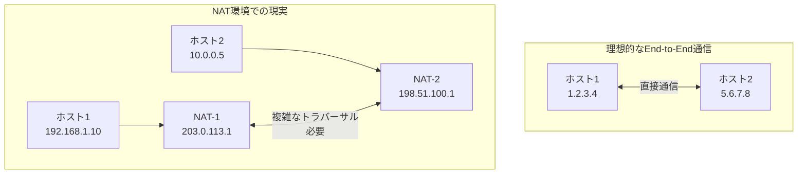

この問題によって以下のアプリケーションが影響を受ける：

- **VoIP**: 双方が NAT 内にある場合の音声通話確立が複雑になる
- **P2P ファイル共有**: 直接接続が困難になりサーバー経由のトラフィックが増大する
- **オンラインゲーム**: ホスト機能を持つゲームが NAT 越しに参加者を受け付けられない場合がある
- **IoT デバイス**: センサーやカメラへの外部からのアクセスに手動設定が必要になる

### 7.3 プロトコルの複雑化

NAT の存在を前提としたプロトコルの設計が必要になり、本来不要な複雑さが生じている：

**FTP のパッシブモード問題：** FTP はコントロール接続とデータ接続を別々に確立する。データ接続の IP アドレスとポートをペイロード内に埋め込む古典的な設計（アクティブモード）は NAT 環境では機能しない。このため、NAT 対応の FTP では：
- パッシブモード（PASV）が標準化された
- NAT ルーターは FTP の Application Layer Gateway（ALG）機能でペイロードを解釈・書き換えする場合がある

**SIP（VoIP シグナリング）の問題：** SIP は IP アドレスをプロトコルのボディ（SDP）内で交換する。NAT 環境ではこのアドレスがプライベートアドレスになり機能しない。解決策として SIP プロキシ、STUN、ICE などの複雑な仕組みが必要になる。

### 7.4 セキュリティに関する誤解

NAT はしばしばファイアウォールの代替として誤解される。確かに NAT は外部からの直接接続を遮断する副作用があるが、これはセキュリティ機能ではなく「動作上の副産物」である。

NAT に依存したセキュリティの問題点：
- NAT テーブルに一致するパケットはすべて内部に転送される（セキュリティチェックなし）
- 内部から確立されたセッション経由の攻撃（マルウェア等）は防げない
- NAT の「隠蔽効果」は専用ファイアウォールの代替にならない

### 7.5 タイムアウトによる問題

NAT テーブルのエントリはタイムアウトで削除される。長期間通信がないセッション（アイドル接続）は NAT テーブルから削除され、再接続が必要になる。

典型的なタイムアウト値：
- TCP セッション: 一般的に 24 時間〜数時間（実装依存）
- UDP セッション: 一般的に 30 秒〜5 分
- ICMP: 数十秒

これにより、長い間隔のデータ送信（監視、長時間セッション）が突然切断されるといった問題が発生する。この対策として **Keep-Alive パケット**（TCP Keep-Alive、あるいはアプリケーションレベルの定期送信）が使用される。

### 7.6 キャリアグレードNAT（CGN/LSN）

インターネットサービスプロバイダー（ISP）が IPv4 アドレス不足に対応するため、顧客に割り当てるアドレス自体をプライベートアドレス化する手法が **キャリアグレードNAT（Carrier-Grade NAT: CGN）**、または **Large-Scale NAT（LSN）** である（RFC 6598）。

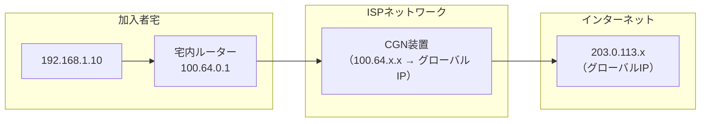

CGN では「二重 NAT（Double NAT）」が発生し、問題がさらに深刻化する：
- NATトラバーサルが二重に必要になる
- ポートフォワーディングが不可能になる
- ゲームやVoIPの品質劣化が著しくなる
- 各加入者が共有グローバル IP を使うため、ログ管理やセキュリティ調査が困難になる

---

## 8. IPv6とNATの将来

### 8.1 IPv6によるアドレス問題の解決

**IPv6** は 128 ビットアドレスを採用し、$2^{128} \approx 3.4 \times 10^{38}$ という天文学的な数のアドレスを提供する。地球上のすべての砂粒にアドレスを割り当てても余りあるほどである。

IPv6 が普及すれば、理論的には NAT は不要になる。すべてのデバイスがグローバルに一意な IP アドレスを持ち、End-to-End 原則が回復する。

**IPv6での通信の理想形：**

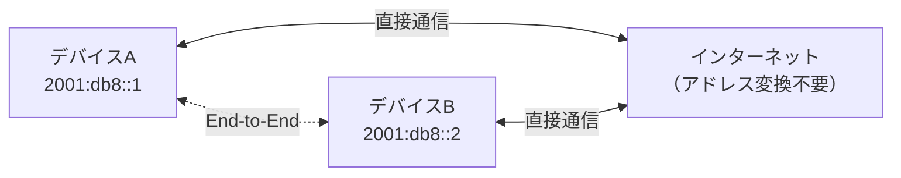

### 8.2 NPTv6（IPv6 Prefix Translation）

しかし現実には、IPv6 環境でも NAT に類似した機能への需要が存在する。プレフィックスを変換するだけの **NPTv6（Network Prefix Translation）**（RFC 6296）が定義されているのはこのためである。

NPTv6 の主な用途：

- **マルチホーミング**: 複数の ISP を使用する際のアドレス変換
- **プロバイダー非依存性**: ISP を変更してもアドレスを維持する
- **プライバシー**: 内部の実際のアドレス構造を隠蔽する

ただし IETF はセキュリティ目的での IPv6 NAT 使用を推奨せず、代わりにファイアウォールによるパケットフィルタリングを推奨している。

### 8.3 IPv4/IPv6移行技術

IPv4 から IPv6 への移行期間中（現在進行中）は、両プロトコルの共存技術が重要である：

**デュアルスタック（Dual-Stack）**:
- デバイスが IPv4 と IPv6 の両方を同時にサポート
- 最もシンプルだが、IPv4 アドレスが引き続き必要

**6to4/6rd（IPv6 Rapid Deployment）**:
- IPv4 ネットワーク上で IPv6 パケットをカプセル化してトンネリング
- IPv6 プレフィックスが IPv4 アドレスから自動生成される

**DS-Lite（Dual-Stack Lite）**:
- ISP の IPv6 インフラ上で顧客の IPv4 トラフィックを処理
- 顧客宅内でプライベート IPv4 を使用し、CGN でグローバル IPv4 に変換

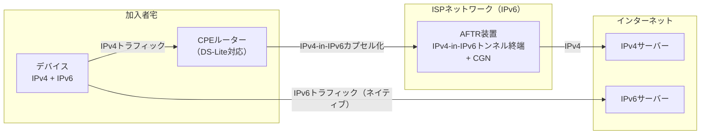

### 8.4 現状と展望

2026年時点でのインターネット統計では、IPv6 対応率は主要 ISP や大手サービスで 40〜60% 程度に達している（地域差がある）。しかし NAT を前提とした既存インフラ、デバイス、ソフトウェアの置き換えには多大なコストと時間がかかるため、IPv4/NAT 環境は当面継続する見込みである。

::: tip 実用的な観点
現代のエンジニアにとって NAT を「廃止すべき過渡技術」として軽視するのは誤りである。家庭用ルーター、クラウド VPC、コンテナネットワーキング（Docker の NAT、Kubernetes の NodePort）など、NAT は様々な文脈で積極的に活用されている。NAT の原理を深く理解することは、ネットワーキングの根幹を理解することに等しい。
:::

---

## 9. まとめ

NAT とポートフォワーディングは、IPv4 アドレス枯渇という工学的問題への実用的解決策として生まれ、30 年以上にわたってインターネットを支えてきた。

**主要な学習ポイントの整理：**

| 概念 | 要点 |
|------|------|
| Static NAT | 1 対 1 の固定マッピング。外部公開サーバー向け |
| Dynamic NAT | アドレスプールから動的割り当て。同時接続数はプール上限 |
| NAPT/PAT | ポート番号も変換。1 グローバル IP で多数の内部ホストを収容 |
| Full Cone | 最も寛容。任意の外部からの着信を許可 |
| Symmetric | 最も厳格。相手ごとに異なるポート。P2P 困難 |
| ポートフォワーディング | 外部からのアクセスのための静的ルール |
| STUN | 自己グローバルアドレス発見。ホールパンチングに使用 |
| TURN | 中継サーバー経由の通信。最終手段 |
| ICE | STUN + TURN の統合フレームワーク。WebRTC で採用 |

NAT は「一時的な措置」として設計されたにもかかわらず、その影響はインターネットの設計思想（End-to-End 原則）を根本から変えてしまった。IPv6 による解決は着実に進んでいるが、NAT とそのトラバーサル技術の知識は今後も長きにわたって現代エンジニアに求められ続けるだろう。

---

## 参考文献・関連 RFC

- RFC 791 — Internet Protocol (IPv4)
- RFC 1631 — The IP Network Address Translator (NAT)
- RFC 1918 — Address Allocation for Private Internets
- RFC 2663 — IP Network Address Translator (NAT) Terminology and Considerations
- RFC 3489 — STUN - Simple Traversal of User Datagram Protocol (UDP) Through NAT
- RFC 4787 — Network Address Translation (NAT) Behavioral Requirements for Unicast UDP
- RFC 5245 — Interactive Connectivity Establishment (ICE)
- RFC 5389 — Session Traversal Utilities for NAT (STUN)
- RFC 5766 — Traversal Using Relays around NAT (TURN)
- RFC 6296 — IPv6-to-IPv6 Network Prefix Translation (NPTv6)
- RFC 6598 — IANA-Reserved IPv4 Prefix for Shared Address Space (CGN)
- RFC 8445 — Interactive Connectivity Establishment (ICE): A Protocol for NAT Traversal
