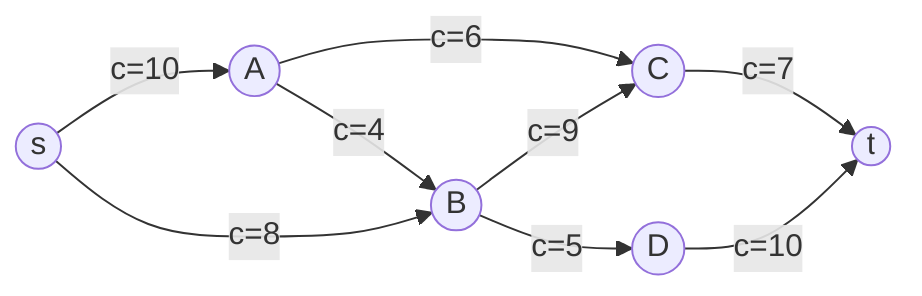
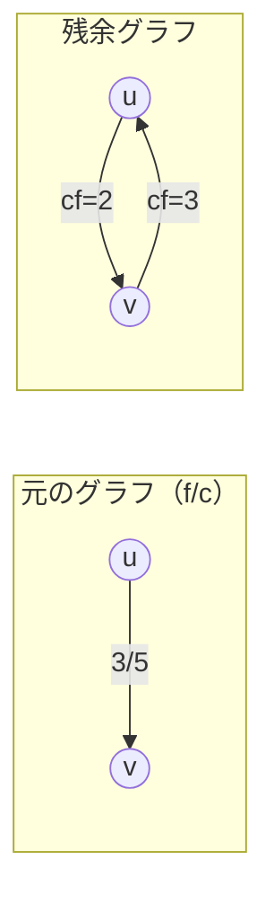
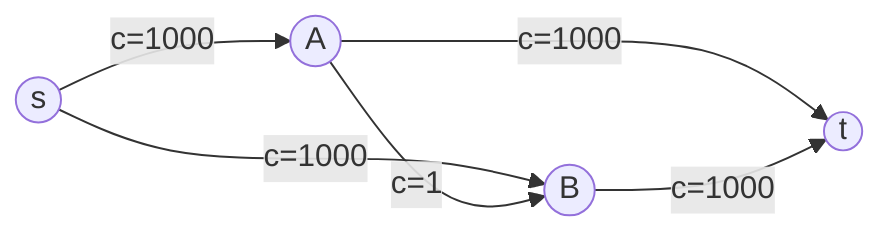
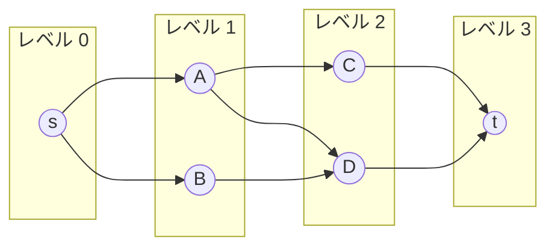
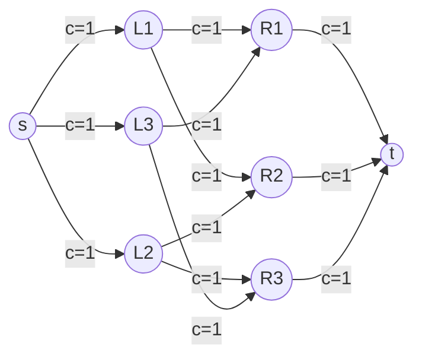
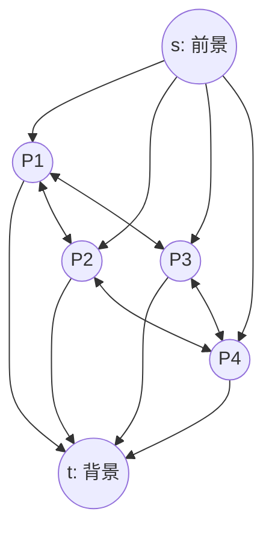

# ネットワークフロー — 最大フロー・最小カットの理論と実践

## 1. フローネットワークの定義と動機

### 1.1 なぜネットワークフローを学ぶのか

現実世界には「何かを、ある場所から別の場所へ、制約のもとで最大限に流す」という問題が至るところに存在する。水道管を流れる水、通信ネットワークを流れるデータパケット、道路網を走る車両、工場の生産ラインを流れる部品――これらはすべて、ネットワークフローとして統一的にモデル化できる。

ネットワークフロー理論の強力さは、その汎用性にある。一見フローとは無関係に見える問題――たとえば二部マッチング、画像のセグメンテーション、プロジェクトのスケジューリング――が、フロー問題への帰着によって効率的に解けるようになる。この章では、フローネットワークの数学的定義から始め、最大フロー最小カット定理、主要なアルゴリズム群、そして実世界の応用までを体系的に解説する。

### 1.2 フローネットワークの形式的定義

**フローネットワーク**（flow network）は、有向グラフ $G = (V, E)$ に以下の要素を加えたものである。

- **容量関数** $c: E \to \mathbb{R}_{\geq 0}$：各辺 $e = (u, v) \in E$ に対して、その辺を通過できるフローの上限 $c(u, v) \geq 0$ を定める
- **ソース** $s \in V$：フローの湧き出し点。入ってくるフローを持たない（あるいは、入る分以上に出る）
- **シンク** $t \in V$：フローの吸い込み点。出ていくフローを持たない（あるいは、出る分以上に入る）



このグラフにおいて、各辺のラベルは容量 $c$ を表している。ソース $s$ からシンク $t$ へ、容量制約を守りながらできるだけ多くのフローを流すことが、最大フロー問題の目標である。

### 1.3 フローの定義と制約

フローネットワーク $G = (V, E)$ 上の**フロー**（flow）とは、関数 $f: V \times V \to \mathbb{R}$ であって、以下の3つの制約を満たすものである。

**容量制約（Capacity constraint）**：

$$0 \leq f(u, v) \leq c(u, v) \quad \forall (u, v) \in E$$

各辺を流れるフローは、0以上かつ容量以下でなければならない。

**フロー保存則（Flow conservation）**：

$$\sum_{(u, v) \in E} f(u, v) = \sum_{(v, w) \in E} f(v, w) \quad \forall v \in V \setminus \{s, t\}$$

ソースとシンクを除くすべての頂点において、流入するフローの総量と流出するフローの総量は等しい。これは物理的な直観と一致する――中間ノードではフローが生まれたり消えたりしない。

**フローの値**（value of a flow）は、ソースから流出するフローの純量として定義される。

$$|f| = \sum_{(s, v) \in E} f(s, v) - \sum_{(v, s) \in E} f(v, s)$$

フロー保存則により、これはシンクに流入するフローの純量とも一致する。

### 1.4 反対称性を用いた等価な定式化

フローの扱いを簡潔にするために、**反対称性**（skew symmetry）を導入することが多い。各辺 $(u, v)$ に対して $f(u, v) = -f(v, u)$ と定義する。この場合、フロー保存則は次のように簡潔に書ける。

$$\sum_{v \in V} f(u, v) = 0 \quad \forall u \in V \setminus \{s, t\}$$

この定式化では「正のフロー」が順方向、「負のフロー」が逆方向を意味し、残余グラフの定義がより自然になる。

## 2. 最大フロー最小カット定理

### 2.1 カットの定義

フローネットワーク $G = (V, E)$ の **$s$-$t$ カット**（$s$-$t$ cut）とは、頂点集合 $V$ を2つの部分集合 $S$ と $T = V \setminus S$ に分割するものであって、$s \in S$ かつ $t \in T$ を満たすものである。

カットの**容量**（capacity）は、$S$ から $T$ へ向かう辺の容量の総和として定義される。

$$c(S, T) = \sum_{\substack{u \in S,\, v \in T \\ (u, v) \in E}} c(u, v)$$

::: tip カットの直観的理解
カットとは、ネットワークを「ソース側」と「シンク側」に分断する仕切りである。カットの容量は、この仕切りを越えてフローが流れうる最大量を表す。すべてのフローはソースからシンクへ到達するためにこの仕切りを越えなければならないため、任意のカットの容量はフローの値の上界になる。
:::

### 2.2 弱双対性：フローの値 $\leq$ カットの容量

任意のフロー $f$ と任意の $s$-$t$ カット $(S, T)$ に対して、以下が成り立つ。

$$|f| \leq c(S, T)$$

**証明の概略**：フロー保存則を $S$ 内の全頂点（$s$ 以外）について合計すると、$S$ 内部の辺のフローは相殺され、$|f|$ は $S$ から $T$ への正味のフローに等しいことが示される。容量制約から、この正味フローは $c(S, T)$ を超えない。

$$|f| = \sum_{\substack{u \in S,\, v \in T}} f(u, v) - \sum_{\substack{u \in T,\, v \in S}} f(u, v) \leq \sum_{\substack{u \in S,\, v \in T}} c(u, v) = c(S, T)$$

### 2.3 残余グラフと増加路

**残余グラフ**（residual graph）$G_f = (V, E_f)$ は、現在のフロー $f$ に対して、まだフローを追加で流せる余地を表すグラフである。辺の集合 $E_f$ は以下のように定義される。

- **順方向の残余辺**：$(u, v) \in E$ かつ $f(u, v) < c(u, v)$ のとき、残余容量 $c_f(u, v) = c(u, v) - f(u, v)$ の辺を $E_f$ に加える
- **逆方向の残余辺**：$(u, v) \in E$ かつ $f(u, v) > 0$ のとき、残余容量 $c_f(v, u) = f(u, v)$ の辺を $E_f$ に加える



逆方向の残余辺は極めて重要な概念である。これは、すでに流したフローを「取り消す」操作を可能にする。一度フローを流した判断が最適でなかった場合に、それを修正できるのである。

**増加路**（augmenting path）とは、残余グラフ $G_f$ 上でソース $s$ からシンク $t$ へ至るパスである。増加路上の辺の残余容量の最小値をボトルネック容量と呼び、この量だけ追加でフローを流すことができる。

### 2.4 最大フロー最小カット定理

以下の3つの命題は同値である。

1. $f$ は最大フローである
2. 残余グラフ $G_f$ に増加路が存在しない
3. ある $s$-$t$ カット $(S, T)$ が存在して $|f| = c(S, T)$ が成り立つ

**定理（Max-Flow Min-Cut Theorem）**：

$$\max_{f} |f| = \min_{(S,T)} c(S, T)$$

すなわち、最大フローの値は最小カットの容量に等しい。

::: details 証明の概略
$(1 \Rightarrow 2)$：対偶を示す。増加路が存在すれば、その路に沿ってフローを増やせるため、$f$ は最大フローではない。

$(2 \Rightarrow 3)$：増加路が存在しないとき、残余グラフにおいて $s$ から到達可能な頂点の集合を $S$、それ以外を $T$ とする。$s \in S$（自明）かつ $t \in T$（$s$ から $t$ へのパスが存在しないため）。$S$ から $T$ への元のグラフの辺 $(u, v)$ では $f(u, v) = c(u, v)$（さもなければ順方向の残余辺が存在して $v \in S$ となり矛盾）。$T$ から $S$ への辺 $(v, u)$ では $f(v, u) = 0$（さもなければ逆方向の残余辺が存在して矛盾）。よって $|f| = c(S, T)$。

$(3 \Rightarrow 1)$：弱双対性 $|f| \leq c(S, T)$ と $|f| = c(S, T)$ より、$f$ より大きなフローは存在しない。
:::

この定理は、1956年に L. R. Ford Jr. と D. R. Fulkerson によって証明された。線形計画法の双対定理の特殊ケースとしても理解できるが、グラフ理論的な証明のほうがアルゴリズムへの直接的な洞察を与える。

## 3. Ford-Fulkerson 法

### 3.1 基本的な考え方

Ford-Fulkerson 法は、最大フロー最小カット定理の証明に直結するアルゴリズムである。その基本方針は極めてシンプルである。

1. フローを $f = 0$（すべての辺のフローが0）で初期化する
2. 残余グラフ $G_f$ 上で増加路 $P$ を見つける
3. $P$ のボトルネック容量 $\Delta = \min_{(u,v) \in P} c_f(u, v)$ だけフローを増やす
4. 増加路が見つからなくなるまで 2--3 を繰り返す

```
Ford-Fulkerson(G, s, t):
    Initialize f(u, v) = 0 for all (u, v)
    while there exists an augmenting path P in G_f:
        Δ = min residual capacity along P
        for each edge (u, v) in P:
            if (u, v) is a forward edge:
                f(u, v) += Δ
            else:  // (u, v) is a backward edge
                f(v, u) -= Δ
    return f
```

### 3.2 正当性

Ford-Fulkerson 法が正しく最大フローを求めることは、最大フロー最小カット定理から直ちに従う。アルゴリズムが停止するとき、残余グラフに増加路は存在しない。定理の同値条件 $(2 \Rightarrow 1)$ により、このときのフローは最大フローである。

### 3.3 計算量の分析と問題点

Ford-Fulkerson 法の計算量は、増加路の選び方に依存する。容量がすべて整数のとき、各反復でフローの値は少なくとも1増加するため、アルゴリズムは最大で $|f^*|$（最大フローの値）回の反復で停止する。各反復での増加路探索は $O(|E|)$ で行えるため、全体の計算量は $O(|E| \cdot |f^*|)$ となる。

しかし、この計算量には深刻な問題がある。$|f^*|$ がグラフのサイズに対して指数的に大きくなりうるのである。



この例で、もしアルゴリズムが毎回 $s \to A \to B \to t$ と $s \to B \to A \to t$ を交互に増加路として選んでしまうと、各反復でフローは1しか増えず、2000回の反復が必要になる。容量の値がもっと大きければ、反復回数はそれに比例して増大する。

さらに深刻なのは、容量が無理数の場合である。Ford と Fulkerson 自身が示した例では、増加路の選び方によってはアルゴリズムが収束しない（最大フローに到達しない）ことがある。

### 3.4 Ford-Fulkerson 法の実装例

以下に Python による基本的な実装を示す。増加路の探索に DFS を用いる。

```python
from collections import defaultdict

def ford_fulkerson(graph, source, sink, n):
    """
    Find max flow using Ford-Fulkerson with DFS.

    graph: adjacency list where graph[u] contains (v, capacity_index) pairs
    source: source node
    sink: sink node
    n: number of nodes
    """
    # Adjacency list with capacity stored separately
    capacity = defaultdict(lambda: defaultdict(int))
    adj = defaultdict(list)

    def add_edge(u, v, cap):
        capacity[u][v] += cap
        # Add reverse edge with 0 capacity if not exists
        if u not in adj[v]:
            capacity[v][u] += 0
        adj[u].append(v)
        adj[v].append(u)

    # Build graph
    for u, v, cap in graph:
        add_edge(u, v, cap)

    def dfs(u, t, visited, bottleneck):
        """Find augmenting path using DFS."""
        if u == t:
            return bottleneck
        visited.add(u)
        for v in adj[u]:
            residual = capacity[u][v]
            if v not in visited and residual > 0:
                aug = dfs(v, t, visited, min(bottleneck, residual))
                if aug > 0:
                    capacity[u][v] -= aug
                    capacity[v][u] += aug
                    return aug
        return 0

    max_flow = 0
    while True:
        visited = set()
        aug = dfs(source, sink, visited, float('inf'))
        if aug == 0:
            break
        max_flow += aug

    return max_flow
```

## 4. Edmonds-Karp アルゴリズム

### 4.1 BFS による増加路選択

Ford-Fulkerson 法の計算量問題を解決する最も直接的な方法は、**増加路の選び方を固定する**ことである。1972年に Jack Edmonds と Richard Karp が提案した Edmonds-Karp アルゴリズムは、増加路として常に**最短の増加路**（辺数が最小のもの）を BFS で見つける。

```python
from collections import deque

def edmonds_karp(n, adj, capacity, source, sink):
    """
    Find max flow using Edmonds-Karp (BFS-based Ford-Fulkerson).

    n: number of nodes
    adj: adjacency list
    capacity: 2D array where capacity[u][v] is the residual capacity
    source: source node
    sink: sink node
    """
    max_flow = 0

    while True:
        # BFS to find shortest augmenting path
        parent = [-1] * n
        parent[source] = source
        queue = deque([source])

        while queue and parent[sink] == -1:
            u = queue.popleft()
            for v in adj[u]:
                if parent[v] == -1 and capacity[u][v] > 0:
                    parent[v] = u
                    queue.append(v)

        if parent[sink] == -1:
            break  # No augmenting path found

        # Find bottleneck capacity
        bottleneck = float('inf')
        v = sink
        while v != source:
            u = parent[v]
            bottleneck = min(bottleneck, capacity[u][v])
            v = u

        # Update residual capacities
        v = sink
        while v != source:
            u = parent[v]
            capacity[u][v] -= bottleneck
            capacity[v][u] += bottleneck
            v = u

        max_flow += bottleneck

    return max_flow
```

### 4.2 計算量の証明

Edmonds-Karp アルゴリズムの計算量は $O(|V| \cdot |E|^2)$ である。この上界は容量の値に依存しないため、**強多項式時間**（strongly polynomial time）アルゴリズムである。

証明の鍵となるのは、以下の2つの補題である。

**補題1（単調性）**：BFS による最短増加路を用いた場合、各頂点 $v$ のソースからの最短距離 $d_f(s, v)$（残余グラフ上）は、フローの更新を通じて単調非減少である。

**補題2（反復回数の上界）**：各辺 $(u, v)$ がボトルネック（増加路上の最小残余容量の辺）になる回数は高々 $O(|V|/2)$ 回である。

補題1と補題2を合わせると、ボトルネックとなるイベントの総数は $O(|V| \cdot |E|)$ 回であり、各反復の BFS は $O(|E|)$ で実行できるため、全体の計算量は $O(|V| \cdot |E|^2)$ となる。

::: details 補題1の証明スケッチ
フロー $f$ を $f'$ に更新した後の残余グラフ上での最短距離を $d_{f'}(s, v)$ とする。ある頂点 $v$ で $d_{f'}(s, v) < d_f(s, v)$ と仮定して矛盾を導く。

$d_{f'}(s, v)$ が最小のそのような頂点 $v$ を考え、$f'$ の残余グラフ上での $s$ から $v$ への最短パス上で $v$ の直前の頂点を $u$ とする。$d_{f'}(s, u) \geq d_f(s, u)$（$v$ の最小性から）、かつ $d_{f'}(s, v) = d_{f'}(s, u) + 1$。

辺 $(u, v)$ が $f$ の残余グラフに存在する場合、$d_f(s, v) \leq d_f(s, u) + 1 \leq d_{f'}(s, u) + 1 = d_{f'}(s, v)$ となり、$d_{f'}(s, v) < d_f(s, v)$ に矛盾する。

辺 $(u, v)$ が $f$ の残余グラフに存在しない場合、$f$ から $f'$ への更新で $(u, v)$ が生まれたことになる。これは増加路が $(v, u)$ を通ったことを意味し、$d_f(s, u) = d_f(s, v) + 1$ が成り立つ。よって $d_{f'}(s, v) = d_{f'}(s, u) + 1 \geq d_f(s, u) + 1 = d_f(s, v) + 2 > d_f(s, v)$ となり矛盾。
:::

### 4.3 Edmonds-Karp の意義

Edmonds-Karp は、単に「BFS を使う」という小さな変更により、Ford-Fulkerson 法の最悪計算量を容量非依存にした点で歴史的に重要である。しかし、大規模なグラフでは $O(|V| \cdot |E|^2)$ は依然として遅い。より高速なアルゴリズムが求められ、それが Dinic のアルゴリズムにつながる。

## 5. Dinic のアルゴリズム

### 5.1 ブロッキングフローの着想

1970年に Yefim Dinitz（Dinic とも表記）が提案したこのアルゴリズムは、Edmonds-Karp と同じく最短増加路に着目するが、**1回の BFS で複数の増加路をまとめて処理する**という点で根本的に異なる。

Dinic のアルゴリズムの核心は、**レベルグラフ**（level graph）と**ブロッキングフロー**（blocking flow）の概念にある。

**レベルグラフ**：残余グラフ $G_f$ に対して BFS を実行し、各頂点のソースからの距離（レベル）$d(v)$ を計算する。レベルグラフ $G_L$ は、$G_f$ の辺のうち $d(v) = d(u) + 1$ を満たす辺 $(u, v)$ のみを残したグラフである。



**ブロッキングフロー**：レベルグラフ $G_L$ 上のフロー $f'$ であって、$G_L$ 上の $s$ から $t$ へのすべてのパスが少なくとも1つの飽和辺（残余容量が0の辺）を含むもの。ブロッキングフローは最大フローとは異なることに注意されたい。あくまでレベルグラフ上の「道を塞ぐ」フローである。

### 5.2 アルゴリズムの手順

```
Dinic(G, s, t):
    Initialize f = 0
    while True:
        Build level graph G_L by BFS on G_f
        if t is not reachable from s in G_f:
            return f
        Find a blocking flow f' in G_L
        f = f + f'  // Update flow
```

### 5.3 ブロッキングフローの効率的な計算

ブロッキングフローの計算には、DFS を用いる。ポイントは、**行き詰まった辺を削除する**（advance and retreat 戦略、あるいは「ポインタの巻き戻しをしない」手法）ことである。

具体的には、各頂点 $v$ に対して、隣接リストの現在の探索位置を表すポインタ $\text{iter}[v]$ を管理する。DFS が行き詰まったとき、その辺を再び探索しないようにポインタを進める。一度進めたポインタは巻き戻さない。

```python
def dinic(n, source, sink, edges):
    """
    Find max flow using Dinic's algorithm.

    n: number of nodes
    source: source node
    sink: sink node
    edges: list of (u, v, capacity) tuples
    """
    # Build adjacency list with forward/backward edge pairs
    graph = [[] for _ in range(n)]

    def add_edge(u, v, cap):
        graph[u].append([v, cap, len(graph[v])])      # forward edge
        graph[v].append([u, 0, len(graph[u]) - 1])    # backward edge

    for u, v, cap in edges:
        add_edge(u, v, cap)

    def bfs():
        """Build level graph using BFS. Returns True if sink is reachable."""
        nonlocal level
        level = [-1] * n
        level[source] = 0
        queue = deque([source])
        while queue:
            u = queue.popleft()
            for v, cap, _ in graph[u]:
                if cap > 0 and level[v] == -1:
                    level[v] = level[u] + 1
                    queue.append(v)
        return level[sink] != -1

    def dfs(u, pushed):
        """Find blocking flow using DFS with pointer optimization."""
        if u == sink:
            return pushed
        while it[u] < len(graph[u]):
            v, cap, rev = graph[u][it[u]]
            if cap > 0 and level[v] == level[u] + 1:
                d = dfs(v, min(pushed, cap))
                if d > 0:
                    graph[u][it[u]][1] -= d   # decrease forward capacity
                    graph[v][rev][1] += d     # increase backward capacity
                    return d
            it[u] += 1
        return 0

    level = []
    max_flow = 0

    while bfs():
        it = [0] * n  # reset pointers for each phase
        while True:
            f = dfs(source, float('inf'))
            if f == 0:
                break
            max_flow += f

    return max_flow
```

### 5.4 計算量の分析

**定理**：Dinic のアルゴリズムの計算量は $O(|V|^2 \cdot |E|)$ である。

この上界は、以下の2つの事実から導かれる。

1. **フェーズ数の上界**：各フェーズ（BFS + ブロッキングフロー）の後、$s$ から $t$ への最短路長は少なくとも1増加する。最短路長は高々 $|V| - 1$ であるため、フェーズ数は $O(|V|)$ である。

2. **各フェーズの計算量**：ポインタ最適化を用いた DFS によるブロッキングフロー計算は $O(|V| \cdot |E|)$ で実行できる（各 DFS パスは $O(|V|)$、パスが見つからない場合は少なくとも1つの辺ポインタが進むため、行き詰まりの総回数は $O(|E|)$）。

これらを合わせて $O(|V|^2 \cdot |E|)$ が得られる。

::: tip 単位容量グラフでの高速化
すべての辺の容量が1の場合（単位容量グラフ）、Dinic のアルゴリズムは $O(|E| \sqrt{|V|})$ で動作する。これは二部マッチングへの応用で特に重要である。フェーズ数が $O(\sqrt{|V|})$ で抑えられることから導かれる。
:::

### 5.5 各アルゴリズムの比較

| アルゴリズム | 計算量 | 特徴 |
|:---|:---|:---|
| Ford-Fulkerson (DFS) | $O(\|E\| \cdot \|f^*\|)$ | 容量依存、無理数で非停止の可能性 |
| Edmonds-Karp (BFS) | $O(\|V\| \cdot \|E\|^2)$ | 強多項式、実装容易 |
| Dinic | $O(\|V\|^2 \cdot \|E\|)$ | 実用的に高速、単位容量で $O(\|E\|\sqrt{\|V\|})$ |
| Push-Relabel | $O(\|V\|^2 \cdot \|E\|)$, 改良版 $O(\|V\|^3)$ | 大規模グラフに有効 |

## 6. 最小費用流

### 6.1 問題の定式化

最大フロー問題では「できるだけ多く流す」ことが目標であったが、実世界では「コストを考慮しながらフローを流す」問題のほうがより一般的である。**最小費用流**（Minimum Cost Flow）問題は、各辺にコスト（単位フローあたりの費用）を追加した拡張である。

フローネットワーク $G = (V, E)$ において、各辺 $(u, v)$ に容量 $c(u, v)$ に加えて**コスト** $w(u, v)$ が定義されているとする。フロー $f$ の**総コスト**は以下で定義される。

$$\text{cost}(f) = \sum_{(u, v) \in E} f(u, v) \cdot w(u, v)$$

**最小費用最大フロー問題**（Minimum Cost Maximum Flow, MCMF）：最大フローを達成するフローのうち、総コストが最小のものを求める。

**最小費用流問題（一般形）**：指定されたフロー値 $F$ を達成するフローのうち、総コストが最小のものを求める（あるいは、そのようなフローが存在しないことを判定する）。

### 6.2 逐次最短路法

最小費用流問題を解く最も直観的なアルゴリズムは、**逐次最短路法**（Successive Shortest Paths Algorithm）である。

基本方針：Ford-Fulkerson 法の増加路を、残余グラフ上での**最短路**（コストが最小の路）で選ぶ。

```
MCMF(G, s, t):
    Initialize f = 0
    while there exists an s-t path in G_f:
        Find shortest path P from s to t in G_f (by cost)
        Δ = min residual capacity along P
        Augment flow along P by Δ
        Update residual graph
    return f
```

ここで「最短路」は辺のコストを距離とした最短路である。逆方向の残余辺のコストは $-w(u, v)$ とする（フローを取り消すとコストも取り消される）。

負のコストの辺が存在するため、Dijkstra 法は直接使えない。Bellman-Ford 法を用いるか、**ポテンシャル関数**（Johnson のアルゴリズムに類似）を導入して辺のコストを非負に変換する手法を用いる。

### 6.3 ポテンシャルと Dijkstra の組合せ

ポテンシャル $h: V \to \mathbb{R}$ を導入し、各辺のコストを以下のように変換する。

$$w_h(u, v) = w(u, v) + h(u) - h(v)$$

初期ポテンシャルを $s$ からの最短距離（Bellman-Ford で計算）とすると、$w_h(u, v) \geq 0$ が保証される。フローの更新後、ポテンシャルを更新することで、毎回 Dijkstra 法を使えるようになる。

計算量は、Dijkstra にフィボナッチヒープを使った場合 $O(F \cdot (|E| + |V| \log |V|))$ となる（$F$ は最大フロー値）。

### 6.4 Primal-Dual 法

Primal-Dual 法は逐次最短路法の一般化であり、線形計画法の双対理論に基づく。最短路で増加路を選ぶことで、双対変数（ポテンシャル）の実行可能性を維持しながらフローを増やしていく。理論的には最適性条件（相補性条件）を満たしていることが保証される。

## 7. 二部マッチング

### 7.1 最大マッチング問題

ネットワークフロー理論の最も美しい応用の一つが、**二部マッチング**（bipartite matching）である。

二部グラフ $G = (L \cup R, E)$ において、$L$ は左側の頂点集合、$R$ は右側の頂点集合であり、辺は $L$ と $R$ の間にのみ存在する。**マッチング**（matching）とは、辺の部分集合 $M \subseteq E$ であって、$M$ に含まれるどの2辺も端点を共有しないもの（つまり、各頂点は高々1本の辺にしか属さない）をいう。**最大マッチング**は、$|M|$ が最大となるマッチングである。

### 7.2 最大フローへの帰着

二部マッチング問題は、以下の構成により最大フロー問題に帰着できる。

1. 超ソース $s$ を追加し、$L$ の各頂点に容量1の辺を張る
2. 超シンク $t$ を追加し、$R$ の各頂点から $t$ に容量1の辺を張る
3. 元の辺 $(u, v) \in E$（$u \in L, v \in R$）に容量1を設定する



このフローネットワークにおける最大フローの値が、最大マッチングのサイズに等しい。容量がすべて1であるため、整数フローにおいて各辺のフローは0か1となり、フローが1の辺がマッチングに対応する。

### 7.3 Hopcroft-Karp アルゴリズム

二部マッチング問題に特化したアルゴリズムとして、Hopcroft-Karp アルゴリズム（1973年）がある。これは本質的に Dinic のアルゴリズムを二部グラフに適用したものであり、計算量は $O(|E| \sqrt{|V|})$ である。

アルゴリズムの各フェーズでは：

1. BFS で最短増加路の長さを決定する
2. その長さの増加路をすべて DFS で見つけ、互いに素なパスに沿ってマッチングを更新する

フェーズ数が $O(\sqrt{|V|})$ で抑えられることが証明されており、各フェーズは $O(|E|)$ で実行できるため、全体で $O(|E| \sqrt{|V|})$ となる。

### 7.4 König の定理

二部グラフにおいて、最大マッチングと最小頂点被覆（すべての辺を覆う最小の頂点集合）の間には美しい双対関係がある。

**König の定理**：二部グラフにおいて、最大マッチングのサイズは最小頂点被覆のサイズに等しい。

$$\text{最大マッチング} = \text{最小頂点被覆}$$

これは最大フロー最小カット定理の系として証明できる。上で構成したフローネットワークにおいて、最小カットが最小頂点被覆に対応するのである。

一般のグラフでは König の定理は成り立たない（一般のグラフの最大マッチングは Edmonds の花アルゴリズムなどで解く必要がある）。

### 7.5 応用例

二部マッチングの実世界での応用は非常に広い。

- **ジョブスケジューリング**：$n$ 個のタスクを $n$ 台のマシンに割り当てる（各タスクは特定のマシンでのみ実行可能）
- **安定マッチング**：研修医の病院配属（Gale-Shapley アルゴリズムは安定性を加えた拡張）
- **割当問題**（Assignment Problem）：コスト付きの割り当てを最適化する問題は、最小費用流の特殊ケース

## 8. 実世界の応用

### 8.1 通信ネットワーク

ネットワークフロー理論は、その名が示す通り通信ネットワークの設計と解析に直接的に応用される。

**帯域割り当て**：通信ネットワークにおいて、各リンクの帯域幅を容量としたフローネットワークを構成する。送信元ノードから受信先ノードへの最大フローは、そのペア間で達成可能な最大スループットを表す。

**ネットワークの冗長性評価**：最小カットは、ネットワークのボトルネックを特定する。最小カットの容量が小さいということは、わずかなリンクの障害でネットワークが分断される脆弱性を意味する。

**Menger の定理**は、最大フロー最小カット定理のグラフ理論版である。

$$\text{辺連結度}(s, t) = s\text{-}t\text{ 間の辺素パスの最大数}$$

これは容量がすべて1のフローネットワークにおける最大フロー最小カット定理に他ならない。

### 8.2 画像セグメンテーション

コンピュータビジョンにおける**画像セグメンテーション**（image segmentation）は、最小カット問題の重要な応用である。

画像の各ピクセルを頂点とし、隣接するピクセル間に辺を張る。各ピクセルには「前景に属する確率」と「背景に属する確率」が与えられる。これを以下のフローネットワークとして定式化する。

- ソース $s$：前景を表す
- シンク $t$：背景を表す
- 各ピクセル $i$ からソースへの辺：$i$ が背景に属する場合のコスト（エネルギー）
- 各ピクセルからシンクへの辺：$i$ が前景に属する場合のコスト
- 隣接ピクセル間の辺：異なるラベル（前景/背景）を割り当てるコスト（境界の滑らかさを促進）



最小カット $(S, T)$ において、$S$ に含まれるピクセルを前景、$T$ に含まれるピクセルを背景として分類する。最小カットの容量は、この分類のエネルギー関数（尤度項 + 境界滑らかさ項）の最小値に対応する。

この手法は **graph cuts** として知られ、Boykov と Kolmogorov による実装（2004年）は、画像処理分野で広く用いられている。

### 8.3 プロジェクト選択問題

**プロジェクト選択問題**（Project Selection Problem）は、依存関係のあるプロジェクト群から、利益を最大化するようにプロジェクトの部分集合を選ぶ問題である。

各プロジェクト $i$ には利益 $p_i$（正なら利益、負ならコスト）が与えられ、プロジェクト $i$ を実行するにはプロジェクト $j$ が前提条件として必要（$i \to j$ の依存関係）という制約がある。

これは最小カット問題に帰着できる。

- ソース $s$：各プロジェクト $i$（$p_i > 0$）に容量 $p_i$ の辺を張る
- シンク $t$：各プロジェクト $j$（$p_j < 0$）から容量 $|p_j|$ の辺を張る
- 依存関係 $i \to j$：容量 $\infty$ の辺を張る

最大利益 $= \sum_{p_i > 0} p_i - \text{最小カット}$ で計算できる。

### 8.4 野球の順位確定問題

ある時点で、特定のチームが優勝の可能性を残しているかどうかを判定する問題も、最大フロー問題に帰着できる。これは Schwartz（1966年）が最初に定式化した問題であり、Ford-Fulkerson 法の応用例としてよく知られている。

残り試合の結果によって各チームの最終勝利数が変わるが、ある特定のチーム $x$ が他のどのチームよりも多く勝てるかどうかを、フローネットワークとして判定する。

## 9. 発展的なアルゴリズム

### 9.1 Push-Relabel アルゴリズム

Goldberg と Tarjan（1988年）が提案した **Push-Relabel**（プッシュ・リラベル）アルゴリズムは、増加路ベースのアルゴリズムとは根本的に異なるアプローチを取る。

Ford-Fulkerson 系のアルゴリズムでは、常にソースからシンクへの完全なパスに沿ってフローを流す。Push-Relabel では、各頂点で**局所的な操作**（push と relabel）を繰り返すことでフローを構成する。

**プレフロー**（preflow）：フロー保存則を緩和し、各頂点（$s$, $t$ を除く）への流入が流出以上であることを許す。各頂点 $v$ の**超過量**（excess）は $e(v) = \sum_{u} f(u, v) - \sum_{w} f(v, w) \geq 0$ である。

**高さ関数**（height function）$h: V \to \mathbb{Z}_{\geq 0}$：$h(s) = |V|$、$h(t) = 0$ とし、残余辺 $(u, v) \in E_f$ に対して $h(u) \leq h(v) + 1$ を満たすもの。

2つの基本操作：

- **Push$(u, v)$**：$e(u) > 0$ かつ $h(u) = h(v) + 1$ かつ $c_f(u, v) > 0$ のとき、$\min(e(u), c_f(u, v))$ だけフローを $(u, v)$ に沿って流す
- **Relabel$(u)$**：$e(u) > 0$ かつすべての残余辺 $(u, v)$ に対して $h(u) \leq h(v)$ のとき、$h(u) = \min_{(u,v) \in E_f} h(v) + 1$ と更新する

基本的な Push-Relabel の計算量は $O(|V|^2 \cdot |E|)$ であるが、**FIFO 選択規則**や**最高ラベル選択規則**（highest-label selection）を用いると $O(|V|^3)$ に改善される。実用的には、最も高速な最大フローアルゴリズムの一つである。

### 9.2 Link-Cut Tree を用いた高速化

Sleator と Tarjan による Link-Cut Tree データ構造を Dinic のアルゴリズムと組み合わせることで、$O(|V| \cdot |E| \log |V|)$ が達成される。これは理論的に最良のアルゴリズムの一つであるが、実装の複雑さから実用場面では Push-Relabel が好まれることが多い。

### 9.3 理論的な下界と未解決問題

最大フロー問題に対する現在の最良の計算量は、2022年に Chen, Kyng, Liu, Peng, Gutenberg, Sachdeva らが示した $\tilde{O}(|E|^{1+o(1)})$（ほぼ線形時間）のアルゴリズムである。これは内点法と動的グラフデータ構造を組み合わせた高度な結果であり、実用的な実装は困難である。

## 10. 実装上の注意

### 10.1 グラフの表現

最大フロー問題の実装において、グラフの表現方法は性能に大きな影響を与える。

**隣接リスト＋辺オブジェクト方式**が最も一般的である。各辺を順方向と逆方向のペアとして管理し、一方を更新したときに他方も即座に更新できるようにする。

```python
class Edge:
    """Represents a directed edge in the flow network."""
    __slots__ = ['to', 'cap', 'rev']

    def __init__(self, to, cap, rev):
        self.to = to      # destination node
        self.cap = cap     # residual capacity
        self.rev = rev     # index of reverse edge in adj[to]
```

この方式では、辺 $(u, v)$ のフローを $\Delta$ だけ増やすとき、`graph[u][i].cap -= Δ` と `graph[v][graph[u][i].rev].cap += Δ` を同時に行う。

### 10.2 数値的な注意

**整数容量**：容量がすべて整数であれば、Ford-Fulkerson 系のアルゴリズムは整数フローを出力する（整数性定理）。浮動小数点演算を避けられるため、可能な限り整数で表現すべきである。

**浮動小数点容量**：やむを得ず浮動小数点数を使う場合、残余容量の比較に適切なイプシロン（$\epsilon \approx 10^{-9}$）を用いる必要がある。$c_f(u, v) > \epsilon$ であればまだフローを流せると判定する。

**オーバーフロー**：容量の総和や中間計算でオーバーフローが発生しないよう、適切なデータ型を選択する。C++ では `long long`（64ビット整数）を使うのが一般的である。

### 10.3 多重辺と自己ループ

**多重辺**（同じ頂点ペア間に複数の辺が存在する場合）は、隣接リスト方式であれば自然に扱える。各辺を独立に管理し、それぞれに逆辺を対応させればよい。

**自己ループ**（$u = v$ の辺）はフローの値に寄与しないため、無視してよい。

### 10.4 無向グラフの扱い

無向辺 $\{u, v\}$（容量 $c$）は、2本の有向辺 $(u, v)$ と $(v, u)$（それぞれ容量 $c$）に分解する。ただし、実装上は注意が必要である。通常の有向グラフでの逆辺（容量0）に加えて、双方向にもともと容量を持つ辺が存在するため、辺のペアリングを正しく行う必要がある。

実装上の一つのアプローチは、無向辺 $\{u, v\}$（容量 $c$）に対して、$(u, v)$ に容量 $c$ の辺と $(v, u)$ に容量 $c$ の辺を追加し、互いを逆辺として設定する方法である。

### 10.5 実装のデバッグ

フローアルゴリズムのデバッグは難しい。以下のチェックが有効である。

1. **容量制約の確認**：すべての辺で $0 \leq f(u, v) \leq c(u, v)$ が成り立つか
2. **フロー保存則の確認**：$s$, $t$ 以外のすべての頂点で、流入 $=$ 流出が成り立つか
3. **フローの値の確認**：$s$ からの流出量 $=$ $t$ への流入量が成り立つか
4. **最適性の確認**：残余グラフに $s$-$t$ パスが存在しないか（BFS/DFS で確認）

### 10.6 競技プログラミングでの Tips

競技プログラミングでは、Dinic のアルゴリズムが最もよく使われる。理由は以下の通りである。

- $O(|V|^2 \cdot |E|)$ の計算量は多くの問題で十分
- 単位容量グラフで $O(|E| \sqrt{|V|})$ に高速化される（二部マッチングなど）
- 実装が比較的簡潔
- 定数倍が小さい

テンプレートとして Dinic の実装を用意しておき、問題をフローネットワークにモデル化する能力を磨くことが重要である。

## 11. まとめ

ネットワークフロー理論は、グラフ理論、線形計画法、組合せ最適化が交差する豊かな分野である。

**理論的な美しさ**：最大フロー最小カット定理は、最大化問題（最大フロー）と最小化問題（最小カット）が同じ値を持つという強い双対性を表す。この双対性は線形計画法の双対定理の特殊ケースであり、数学的に深い構造を持つ。

**アルゴリズムの進化**：Ford-Fulkerson 法（1956年）から始まり、Edmonds-Karp（1972年）、Dinic（1970年）、Push-Relabel（1988年）、そして近年のほぼ線形時間アルゴリズム（2022年）へと、60年以上にわたる研究の蓄積がある。各アルゴリズムは、前のアルゴリズムの弱点を克服するために生まれた。

**応用の広がり**：二部マッチング、画像セグメンテーション、プロジェクト選択、ネットワーク信頼性評価など、一見無関係な問題がフロー問題への帰着によって統一的に解ける。問題をフローネットワークとしてモデル化する能力は、アルゴリズム設計における強力な武器である。

**実装の現実**：理論的に最速のアルゴリズムが実用的に最善とは限らない。ほぼ線形時間のアルゴリズムは理論的なブレークスルーであるが、実装の複雑さから実用場面では Dinic や Push-Relabel が依然として主流である。問題の特性（グラフの密度、容量の範囲、特殊構造の有無）に応じて適切なアルゴリズムを選択する判断力が重要である。

ネットワークフロー理論を学ぶことは、単にアルゴリズムを覚えることではない。問題を抽象化し、既知の構造に帰着させるという、計算機科学の核心的な思考法を身につけることである。
