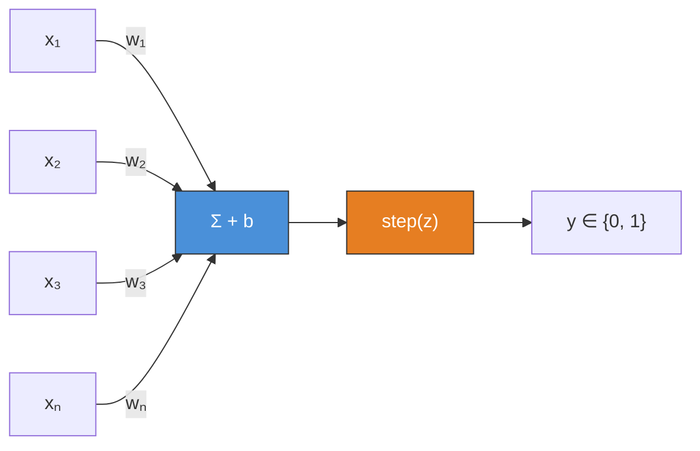
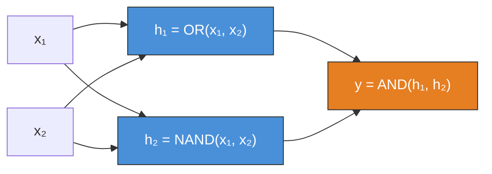
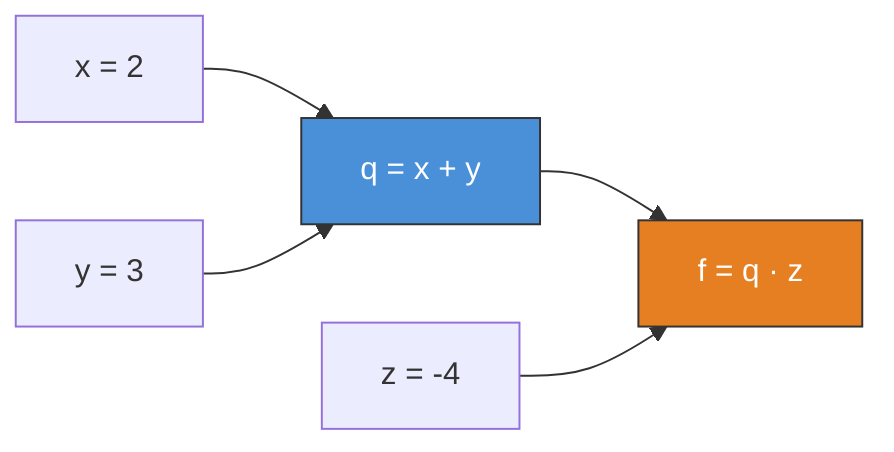
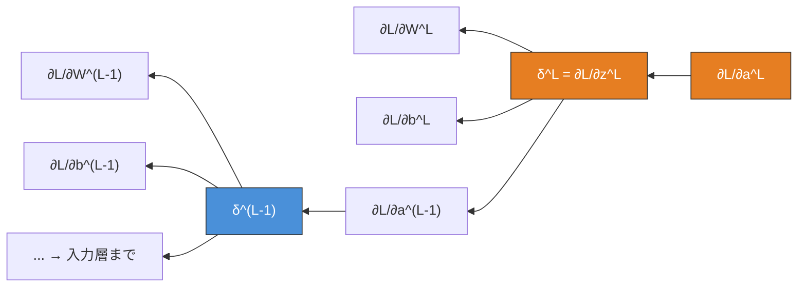
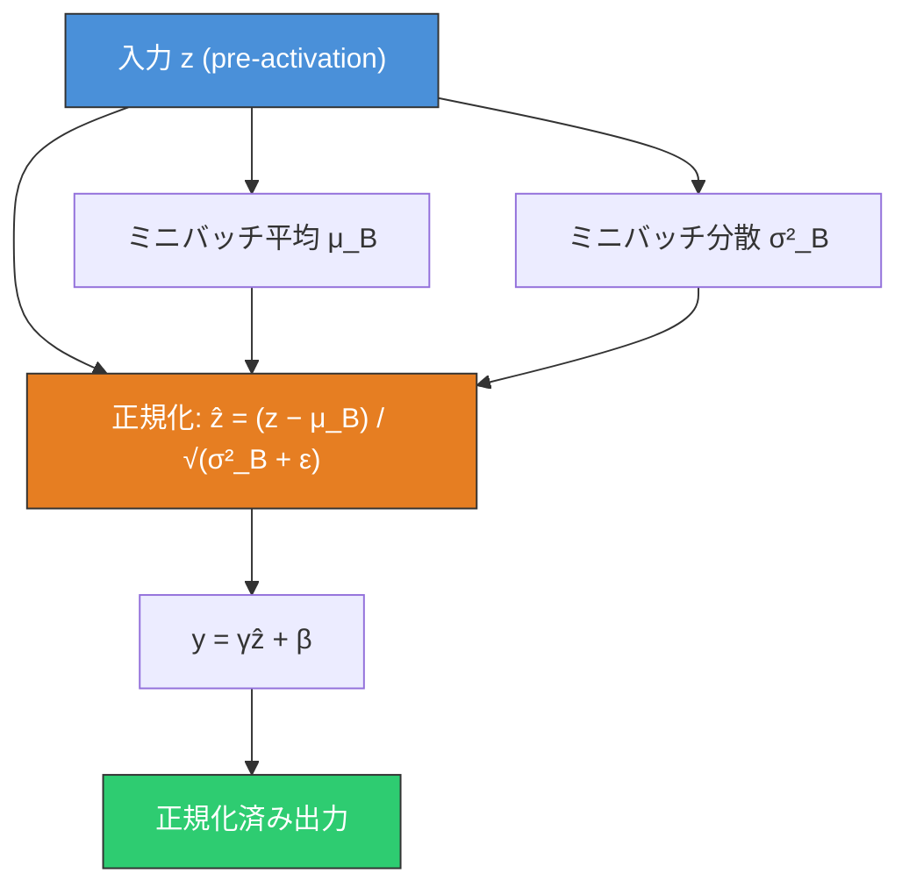
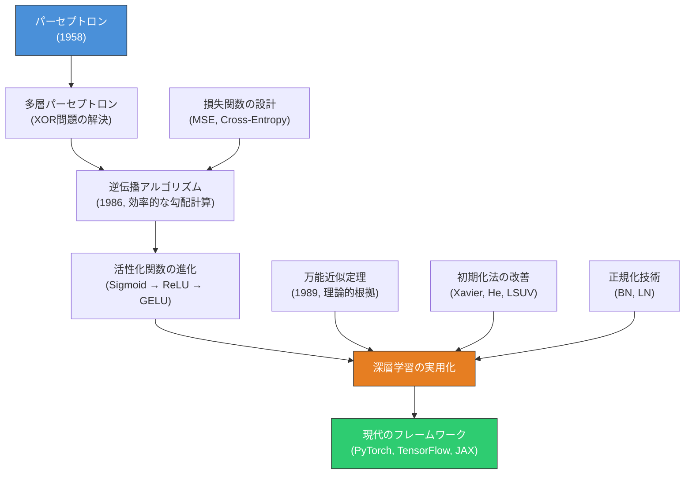

# ニューラルネットワーク基礎 — パーセプトロンから多層ネットワークへ

## 1. 背景と動機：生物のニューロンからの着想

ニューラルネットワーク（Neural Network）は、生物の神経系を抽象的にモデル化した計算モデルである。その歴史は1943年、Warren McCulloch と Walter Pitts による「A Logical Calculus of the Ideas Immanent in Nervous Activity」という論文にまで遡る。彼らは生物のニューロンの挙動を、入力の重み付き和が閾値を超えたかどうかで出力を決定する単純な論理素子としてモデル化した。

### 生物のニューロン

生物の神経系において、ニューロン（神経細胞）は以下の基本構造を持つ。

```
Biological Neuron (simplified)

                     Dendrites (input)
                        |  |  |
                        v  v  v
                   +-----------+
   Signal from --> | Cell Body | --> Axon --> Signal to
   other neurons  | (Soma)    |             next neuron
                   +-----------+
                        ^
                    Threshold:
                  If total input > threshold,
                  neuron "fires" (action potential)
```

- **樹状突起**（Dendrites）：他のニューロンからの信号を受け取る入力端子
- **細胞体**（Soma）：受け取った信号を統合する
- **軸索**（Axon）：統合された信号が閾値を超えると、電気的パルス（活動電位）を発火させ、次のニューロンへ信号を伝達する
- **シナプス**（Synapse）：ニューロン間の接続部。シナプスの強度が信号の伝達効率を決め、学習とはこのシナプスの強度が変化するプロセスである

この生物学的メカニズムを数学的に抽象化した初期のモデルが、McCulloch-Pitts ニューロンであり、これを学習可能にしたものが **パーセプトロン** である。

### なぜニューラルネットワークなのか

従来の機械学習手法（決定木、SVM、ロジスティック回帰など）は、人間がドメイン知識に基づいて**特徴量エンジニアリング**を行い、適切な入力表現を設計する必要があった。これは画像認識や自然言語処理といった、生データが高次元かつ非構造的な問題において大きなボトルネックとなる。

ニューラルネットワーク、特に深層ニューラルネットワーク（Deep Neural Network, DNN）は、**表現学習**（Representation Learning）を自動化する。多層構造を通じて、生データから段階的に抽象度の高い特徴を自動抽出し、最終的な予測に必要な表現を学習する。

```
Traditional ML:          Deep Learning:

Raw Data                 Raw Data
    |                        |
    v                        v
Feature Engineering      Layer 1: Low-level features
(manual, domain expert)      |
    |                        v
    v                    Layer 2: Mid-level features
ML Model                     |
    |                        v
    v                    Layer N: High-level features
Prediction                   |
                             v
                         Prediction
```

この「特徴量の自動学習」こそが、ニューラルネットワークの最も根源的な価値であり、2012年の AlexNet 以降の深層学習革命を牽引した原動力である。

## 2. パーセプトロン（Rosenblatt, 1958）と線形分離可能性

### パーセプトロンの定義

1958年、Frank Rosenblatt は McCulloch-Pitts ニューロンを拡張し、**パーセプトロン**（Perceptron）を提案した。パーセプトロンは、入力ベクトル $\boldsymbol{x} = (x_1, x_2, \ldots, x_n)$ に対して重みベクトル $\boldsymbol{w} = (w_1, w_2, \ldots, w_n)$ との内積を計算し、バイアス $b$ を加えた値にステップ関数を適用する。

$$y = \text{step}\left(\sum_{i=1}^{n} w_i x_i + b\right) = \text{step}(\boldsymbol{w}^T \boldsymbol{x} + b)$$

ここで、ステップ関数は以下のように定義される。

$$\text{step}(z) = \begin{cases} 1 & \text{if } z \geq 0 \\ 0 & \text{if } z < 0 \end{cases}$$



### パーセプトロンの学習規則

パーセプトロンの学習アルゴリズムは驚くほど単純である。訓練データ $(\boldsymbol{x}_i, t_i)$（$t_i \in \{0, 1\}$ は目標出力）に対して、以下の更新規則を繰り返す。

1. 入力 $\boldsymbol{x}_i$ を与え、出力 $y_i$ を計算する
2. 誤差 $e_i = t_i - y_i$ を求める
3. 重みとバイアスを更新する：

$$w_j \leftarrow w_j + \eta \cdot e_i \cdot x_{i,j}$$
$$b \leftarrow b + \eta \cdot e_i$$

ここで $\eta$ は学習率である。この規則の直感は明快で、出力が正しい（$e_i = 0$）場合は重みを変更せず、出力が間違っている場合にのみ、誤差の方向に重みを修正する。

### パーセプトロン収束定理

パーセプトロンの理論的な裏付けとして、**パーセプトロン収束定理**がある。

> 訓練データが**線形分離可能**（linearly separable）であるならば、パーセプトロンの学習アルゴリズムは有限回のイテレーションで収束する。

線形分離可能とは、$n$ 次元空間において、正例と負例を完全に分離する超平面 $\boldsymbol{w}^T \boldsymbol{x} + b = 0$ が存在することを意味する。2次元の場合、これは直線で2つのクラスを分けられるということである。

```
Linearly Separable (AND):       NOT Linearly Separable (XOR):

  x₂                              x₂
  1 | ○         ●                 1 | ●         ○
    |       /                       |
    |     /                         |
    |   /                           |
  0 | ○     ○                    0 | ○         ●
    +----------→ x₁                 +----------→ x₁
    0           1                   0           1

  ○ = 0, ● = 1                   ○ = 0, ● = 1
  Can separate with a line        No single line can separate
```

AND 関数や OR 関数は線形分離可能であり、単一のパーセプトロンで学習できる。しかし、XOR 関数は線形分離可能でない。

### 論理関数の実現

パーセプトロンが実現できる論理関数を具体的に確認する。

**AND関数**: $w_1 = 1, w_2 = 1, b = -1.5$ とすれば、

| $x_1$ | $x_2$ | $w_1 x_1 + w_2 x_2 + b$ | $y$ |
|--------|--------|---------------------------|------|
| 0      | 0      | $-1.5$                    | 0    |
| 0      | 1      | $-0.5$                    | 0    |
| 1      | 0      | $-0.5$                    | 0    |
| 1      | 1      | $0.5$                     | 1    |

**OR関数**: $w_1 = 1, w_2 = 1, b = -0.5$ とすれば実現できる。

これらは単一の超平面で分離可能であるため、パーセプトロンで正しく学習できる。

## 3. XOR問題と多層パーセプトロン

### Minsky-Papert の限界指摘

1969年、Marvin Minsky と Seymour Papert は著書『Perceptrons』で、単一層パーセプトロンの根本的な限界を厳密に示した。その最も象徴的な例が **XOR問題** である。

XOR関数の真理値表は以下の通りである。

| $x_1$ | $x_2$ | XOR |
|--------|--------|------|
| 0      | 0      | 0    |
| 0      | 1      | 1    |
| 1      | 0      | 1    |
| 1      | 1      | 0    |

この4点を2次元平面にプロットすると、(0,0) と (1,1) が 0、(0,1) と (1,0) が 1 であり、これらを1本の直線で分離することは不可能である。数学的に表現すれば、任意の $w_1, w_2, b$ に対して、すべての XOR 入出力対を同時に満たす解が存在しない。

この指摘は当時のニューラルネットワーク研究に大きな打撃を与え、いわゆる「AIの冬」の一因となった。しかし、この限界は**単一層**に固有の問題であり、**多層構造**を導入すれば解決できる。

### 多層パーセプトロン（MLP）によるXOR解決

XOR は以下のように分解できる。

$$\text{XOR}(x_1, x_2) = \text{AND}(\text{OR}(x_1, x_2), \text{NAND}(x_1, x_2))$$

つまり、第1層で OR と NAND を計算し、第2層で AND を計算すれば、XOR を実現できる。



この構造が**多層パーセプトロン**（MLP: Multi-Layer Perceptron）の原型である。中間層（隠れ層）を導入することで、入力空間を非線形に変換し、線形分離不可能な問題を解決できる。

### 隠れ層の幾何学的解釈

隠れ層が行っていることを幾何学的に解釈すると、**入力空間の非線形変換**である。XOR の場合、2次元入力空間を隠れ層で新しい2次元空間に写像する。

```
Input Space:                  Hidden Space:
                              (after nonlinear transform)
  x₂                           h₂
  1 | ●(0,1)    ○(1,1)        1 | ○(1,1)    ●(1,0)
    |                            |
    |                            |
    |                            |          Decision
  0 | ○(0,0)    ●(1,0)        0 | ○(1,1)   boundary
    +----------→ x₁              +----------→ h₁
    0           1                0           1

  Not linearly separable       NOW linearly separable!
```

隠れ層の変換後の空間では、クラスが線形分離可能になっている。これが多層ネットワークの力の本質である。層を重ねるほど、より複雑な非線形変換を表現でき、より入り組んだ決定境界を学習できる。

## 4. 活性化関数

パーセプトロンのステップ関数は微分不可能であり、勾配ベースの学習が困難である。多層ネットワークの学習を可能にするためには、**微分可能な活性化関数**（Activation Function）が不可欠である。活性化関数は各ニューロンの出力に非線形性を導入し、ネットワーク全体の表現力を決定づける。

### なぜ非線形活性化関数が必要か

もし活性化関数が恒等関数 $f(z) = z$（線形関数）であるならば、多層ネットワークは単なる線形変換の合成となる。

$$\boldsymbol{y} = W_3(W_2(W_1 \boldsymbol{x} + \boldsymbol{b}_1) + \boldsymbol{b}_2) + \boldsymbol{b}_3 = W' \boldsymbol{x} + \boldsymbol{b}'$$

線形変換の合成は再び線形変換であるため、何層重ねても単一層と等価な表現力しか持たない。非線形活性化関数を導入して初めて、層を重ねることに意味が生まれる。

### Sigmoid 関数

$$\sigma(z) = \frac{1}{1 + e^{-z}}$$

導関数は $\sigma'(z) = \sigma(z)(1 - \sigma(z))$ と自身で表現できる。出力範囲は $(0, 1)$ であり、確率として解釈しやすい。

```
Sigmoid:                          Sigmoid derivative:

  1.0 |          --------          0.25 |       *
      |        /                        |      / \
      |       /                         |     /   \
  0.5 |------*                    0.125 |    /     \
      |     /                           |   /       \
      |    /                            |  /         \
  0.0 |---                         0.0  |--           --
      +-----------→ z                   +-----------→ z
     -6    0    6                       -6    0    6
```

**問題点**:
- **勾配消失**（Vanishing Gradient）：$|z|$ が大きくなると $\sigma'(z) \to 0$ となり、逆伝播で深い層に勾配がほとんど伝わらない
- **非ゼロ中心**：出力が常に正であるため、後続層の重み更新が非効率になる（zig-zag 問題）
- **指数計算のコスト**：$e^{-z}$ の計算は ReLU に比べて重い

### tanh 関数

$$\tanh(z) = \frac{e^z - e^{-z}}{e^z + e^{-z}} = 2\sigma(2z) - 1$$

導関数は $\tanh'(z) = 1 - \tanh^2(z)$ である。出力範囲は $(-1, 1)$ で、ゼロ中心という利点がある。

Sigmoid よりも勾配消失は緩和されるが、$|z|$ が大きい領域では依然として勾配が飽和する。

### ReLU（Rectified Linear Unit）

$$\text{ReLU}(z) = \max(0, z)$$

$$\text{ReLU}'(z) = \begin{cases} 1 & \text{if } z > 0 \\ 0 & \text{if } z < 0 \end{cases}$$

```
ReLU:                          ReLU derivative:

  y |        /                   1.0 |          ------
    |       /                        |
    |      /                         |
    |     /                          |
    |    /                           |
    |---*                        0.0 |------
    +----------→ z                   +----------→ z
   -3    0    3                     -3    0    3
```

2012年の AlexNet 以降、ReLU は深層学習における事実上の標準となった。その利点は以下の通りである。

- **計算効率**: 閾値処理のみで指数計算が不要
- **勾配消失の緩和**: $z > 0$ の領域で勾配が常に 1
- **スパース活性化**: 入力の約50%が0になるため、表現がスパースになり汎化性能に寄与する

**問題点**:
- **Dying ReLU**: $z < 0$ の領域で勾配が完全にゼロとなり、一度不活性化されたニューロンは二度と活性化されない

### ReLU の派生形

**Leaky ReLU**: $z < 0$ の領域にも小さな勾配 $\alpha$（通常 $\alpha = 0.01$）を許す。

$$\text{LeakyReLU}(z) = \begin{cases} z & \text{if } z > 0 \\ \alpha z & \text{if } z \leq 0 \end{cases}$$

**Parametric ReLU (PReLU)**: $\alpha$ を学習可能なパラメータとする。

### GELU（Gaussian Error Linear Unit）

$$\text{GELU}(z) = z \cdot \Phi(z) = z \cdot \frac{1}{2}\left[1 + \text{erf}\left(\frac{z}{\sqrt{2}}\right)\right]$$

ここで $\Phi(z)$ は標準正規分布の累積分布関数である。近似的には以下の式がよく使われる。

$$\text{GELU}(z) \approx 0.5z\left(1 + \tanh\left[\sqrt{\frac{2}{\pi}}\left(z + 0.044715z^3\right)\right]\right)$$

GELU は ReLU とは異なり、$z$ が負の領域でも完全にゼロにはならない。入力の値に基づいて**確率的に**ゲートする挙動を持ち、これがネットワークの正則化に寄与する。BERT や GPT をはじめとする Transformer ベースのモデルで標準的に採用されている。

### SiLU（Sigmoid Linear Unit / Swish）

$$\text{SiLU}(z) = z \cdot \sigma(z) = \frac{z}{1 + e^{-z}}$$

Google Brain が2017年に発表した Swish 関数と同一であり、自動探索によって発見された活性化関数である。GELU と類似した挙動を示し、滑らかな非線形性を持つ。EfficientNet や多くの Vision モデルで採用されている。

### 活性化関数の比較

| 活性化関数 | 出力範囲 | ゼロ中心 | 計算コスト | 勾配消失 | 主な用途 |
|-----------|---------|---------|-----------|---------|---------|
| Sigmoid | $(0, 1)$ | No | 高 | 深刻 | 出力層（二値分類） |
| tanh | $(-1, 1)$ | Yes | 高 | あり | RNN（歴史的） |
| ReLU | $[0, \infty)$ | No | 低 | 部分的 | CNN、一般的な隠れ層 |
| GELU | $\approx(-0.17, \infty)$ | No | 中 | 緩和 | Transformer |
| SiLU | $\approx(-0.28, \infty)$ | No | 中 | 緩和 | Vision モデル |

## 5. 順伝播（Forward Propagation）

### ネットワークの数学的記述

多層ニューラルネットワークの構造を数学的に記述する。$L$ 層のネットワークにおいて、第 $l$ 層（$l = 1, 2, \ldots, L$）は以下の2ステップで計算される。

**1. 線形変換（アフィン変換）**:

$$\boldsymbol{z}^{(l)} = W^{(l)} \boldsymbol{a}^{(l-1)} + \boldsymbol{b}^{(l)}$$

ここで $W^{(l)} \in \mathbb{R}^{n_l \times n_{l-1}}$ は第 $l$ 層の重み行列、$\boldsymbol{b}^{(l)} \in \mathbb{R}^{n_l}$ はバイアスベクトル、$\boldsymbol{a}^{(l-1)}$ は前層の活性化出力（$\boldsymbol{a}^{(0)} = \boldsymbol{x}$ は入力）である。

**2. 非線形活性化**:

$$\boldsymbol{a}^{(l)} = f^{(l)}(\boldsymbol{z}^{(l)})$$

ここで $f^{(l)}$ は第 $l$ 層の活性化関数であり、要素ごと（element-wise）に適用される。

### 順伝播の流れ

入力 $\boldsymbol{x}$ が与えられたとき、出力 $\hat{\boldsymbol{y}}$ は以下のように計算される。


### ミニバッチ処理の行列表現

実際の実装では、1サンプルずつ処理するのではなく、**ミニバッチ**（$m$ 個のサンプル）をまとめて行列演算で処理する。入力行列 $X \in \mathbb{R}^{n_0 \times m}$（各列が1サンプル）に対して、

$$Z^{(l)} = W^{(l)} A^{(l-1)} + \boldsymbol{b}^{(l)} \mathbf{1}^T$$

$$A^{(l)} = f^{(l)}(Z^{(l)})$$

ここで $A^{(l)} \in \mathbb{R}^{n_l \times m}$ の各列は、各サンプルに対する第 $l$ 層の活性化出力である。バイアスは**ブロードキャスト**によって各サンプルに適用される。

この行列表現により、GPU の並列演算能力を最大限に活用できる。深層学習の学習速度が GPU によって劇的に改善された理由の一つが、この行列演算への帰着である。

### 具体例：2層ネットワークの順伝播

2層ネットワーク（入力層 → 隠れ層 → 出力層）による二値分類を考える。

```python
import numpy as np

def forward_pass(X, W1, b1, W2, b2):
    """
    Two-layer neural network forward pass.
    X: input matrix (n_features, m_samples)
    """
    # Layer 1: hidden layer with ReLU
    Z1 = W1 @ X + b1        # linear transform
    A1 = np.maximum(0, Z1)  # ReLU activation

    # Layer 2: output layer with sigmoid
    Z2 = W2 @ A1 + b2       # linear transform
    A2 = 1 / (1 + np.exp(-Z2))  # sigmoid activation

    cache = (X, Z1, A1, Z2, A2)
    return A2, cache
```

## 6. 逆伝播（Backpropagation）と計算グラフ

### 逆伝播の歴史と意義

逆伝播（Backpropagation）アルゴリズムは、ニューラルネットワークの学習を実用的に可能にした最も重要な技術的ブレークスルーである。1986年、David Rumelhart、Geoffrey Hinton、Ronald Williams が Nature 誌に発表した論文「Learning representations by back-propagating errors」で広く知られるようになった（ただし、独立した発見は複数回なされている）。

逆伝播の本質は、**連鎖律**（Chain Rule）を体系的に適用して、損失関数の勾配を出力層から入力層に向かって効率的に計算することにある。

### 連鎖律

関数の合成に対する微分の連鎖律は、逆伝播の数学的基盤である。

$$\frac{\partial \mathcal{L}}{\partial w} = \frac{\partial \mathcal{L}}{\partial z} \cdot \frac{\partial z}{\partial w}$$

多変数の場合、以下のように拡張される。

$$\frac{\partial \mathcal{L}}{\partial x} = \sum_{i} \frac{\partial \mathcal{L}}{\partial z_i} \cdot \frac{\partial z_i}{\partial x}$$

### 計算グラフ

逆伝播を理解する最も直感的な方法は、**計算グラフ**（Computational Graph）を用いることである。計算グラフは、数式を基本演算のノードと、値が流れるエッジで表現する有向グラフである。

簡単な例として、$f(x, y, z) = (x + y) \cdot z$ を考える。



**順伝播**（Forward Pass）：

- $q = x + y = 2 + 3 = 5$
- $f = q \cdot z = 5 \cdot (-4) = -20$

**逆伝播**（Backward Pass）：出力から入力に向かって偏微分を伝播する。

- $\frac{\partial f}{\partial f} = 1$（自明）
- $\frac{\partial f}{\partial q} = z = -4$
- $\frac{\partial f}{\partial z} = q = 5$
- $\frac{\partial f}{\partial x} = \frac{\partial f}{\partial q} \cdot \frac{\partial q}{\partial x} = (-4) \cdot 1 = -4$
- $\frac{\partial f}{\partial y} = \frac{\partial f}{\partial q} \cdot \frac{\partial q}{\partial y} = (-4) \cdot 1 = -4$

### 多層ネットワークにおける逆伝播

$L$ 層ネットワークにおいて、損失 $\mathcal{L}$ に関する各層のパラメータの勾配を導出する。出力層から逆向きに計算していく。

**出力層（第 $L$ 層）のデルタ**:

$$\boldsymbol{\delta}^{(L)} = \frac{\partial \mathcal{L}}{\partial \boldsymbol{z}^{(L)}} = \frac{\partial \mathcal{L}}{\partial \boldsymbol{a}^{(L)}} \odot f'^{(L)}(\boldsymbol{z}^{(L)})$$

ここで $\odot$ は要素ごとの積（Hadamard積）、$f'^{(L)}$ は活性化関数の導関数である。

**隠れ層（第 $l$ 層、$l = L-1, L-2, \ldots, 1$）のデルタ**:

$$\boldsymbol{\delta}^{(l)} = \left(W^{(l+1)}\right)^T \boldsymbol{\delta}^{(l+1)} \odot f'^{(l)}(\boldsymbol{z}^{(l)})$$

**パラメータの勾配**:

$$\frac{\partial \mathcal{L}}{\partial W^{(l)}} = \boldsymbol{\delta}^{(l)} \left(\boldsymbol{a}^{(l-1)}\right)^T$$

$$\frac{\partial \mathcal{L}}{\partial \boldsymbol{b}^{(l)}} = \boldsymbol{\delta}^{(l)}$$



### 逆伝播の計算量

逆伝播の計算量は順伝播とほぼ同じオーダーである。$n$ 層ネットワークに対して、順伝播が $O(n)$ の行列乗算を必要とするならば、逆伝播も $O(n)$ の行列乗算で完了する。

これは数値微分（各パラメータを微小量 $\epsilon$ だけ変動させて勾配を近似する方法）と比較して劇的に効率的である。$d$ 個のパラメータに対して数値微分は $O(d \cdot n)$ の計算を必要とするが、逆伝播は $O(n)$ で全パラメータの勾配を同時に計算する。

### 具体的な実装例

```python
def backward_pass(Y, cache, W2):
    """
    Two-layer neural network backward pass.
    Y: true labels (1, m_samples)
    """
    X, Z1, A1, Z2, A2 = cache
    m = Y.shape[1]

    # Output layer gradients
    dZ2 = A2 - Y                      # sigmoid + cross-entropy shortcut
    dW2 = (1 / m) * dZ2 @ A1.T       # gradient of W2
    db2 = (1 / m) * np.sum(dZ2, axis=1, keepdims=True)  # gradient of b2

    # Hidden layer gradients
    dA1 = W2.T @ dZ2                  # backpropagate to hidden layer
    dZ1 = dA1 * (Z1 > 0)             # ReLU derivative
    dW1 = (1 / m) * dZ1 @ X.T        # gradient of W1
    db1 = (1 / m) * np.sum(dZ1, axis=1, keepdims=True)  # gradient of b1

    return dW1, db1, dW2, db2
```

### 勾配検証（Gradient Checking）

逆伝播の実装は微妙なバグが入りやすい。実装の正しさを検証するために、**数値微分**との比較を行う。

$$\frac{\partial \mathcal{L}}{\partial \theta_i} \approx \frac{\mathcal{L}(\theta_i + \epsilon) - \mathcal{L}(\theta_i - \epsilon)}{2\epsilon}$$

逆伝播で計算した勾配と数値微分の相対誤差が $10^{-7}$ 以下であれば、実装は正しいと判断できる。

$$\text{relative error} = \frac{\|\nabla_{\text{backprop}} - \nabla_{\text{numerical}}\|_2}{\|\nabla_{\text{backprop}}\|_2 + \|\nabla_{\text{numerical}}\|_2}$$

## 7. 損失関数（Loss Function）

損失関数はモデルの予測 $\hat{\boldsymbol{y}}$ と真のラベル $\boldsymbol{y}$ の間の乖離を定量化する。損失関数の選択はタスクの種類に依存し、ネットワークの学習挙動に大きな影響を与える。

### 平均二乗誤差（MSE: Mean Squared Error）

回帰問題で標準的に用いられる損失関数である。

$$\mathcal{L}_{\text{MSE}} = \frac{1}{N} \sum_{i=1}^{N} \|\boldsymbol{y}_i - \hat{\boldsymbol{y}}_i\|^2 = \frac{1}{N} \sum_{i=1}^{N} \sum_{j=1}^{d} (y_{i,j} - \hat{y}_{i,j})^2$$

MSE の勾配は予測値と真の値の差に比例するため、直感的で扱いやすい。

$$\frac{\partial \mathcal{L}_{\text{MSE}}}{\partial \hat{y}_{i,j}} = \frac{2}{N}(\hat{y}_{i,j} - y_{i,j})$$

しかし、分類問題では MSE は最適ではない。分類の出力層で Sigmoid を活性化関数として使った場合、MSE の勾配には $\sigma'(z)$ の項が含まれ、予測が大きく間違っている場合でも勾配が小さくなるという問題（学習の停滞）が生じる。

### 交差エントロピー（Cross-Entropy）

分類問題では交差エントロピーが標準的に用いられる。

**二値分類の場合（Binary Cross-Entropy）**:

$$\mathcal{L}_{\text{BCE}} = -\frac{1}{N} \sum_{i=1}^{N} \left[y_i \log \hat{y}_i + (1 - y_i) \log(1 - \hat{y}_i)\right]$$

**多クラス分類の場合（Categorical Cross-Entropy）**:

出力層に Softmax 関数を適用し、確率分布を得る。

$$\text{Softmax}(z_j) = \frac{e^{z_j}}{\sum_{k=1}^{C} e^{z_k}} \quad (j = 1, 2, \ldots, C)$$

$$\mathcal{L}_{\text{CE}} = -\frac{1}{N} \sum_{i=1}^{N} \sum_{c=1}^{C} y_{i,c} \log \hat{y}_{i,c}$$

ここで $C$ はクラス数、$y_{i,c}$ は one-hot エンコードされた真のラベルである。

### 交差エントロピーの利点

交差エントロピーと Softmax（または Sigmoid）を組み合わせた場合、出力層のデルタは以下の非常に簡潔な形になる。

$$\boldsymbol{\delta}^{(L)} = \hat{\boldsymbol{y}} - \boldsymbol{y}$$

この結果、予測が大きく間違っているほど勾配が大きくなり、効率的な学習が可能となる。MSE ではこのような性質を持たないため、分類タスクでは交差エントロピーが圧倒的に優れている。

### 損失関数の情報理論的解釈

交差エントロピー損失は、情報理論の観点から自然な解釈を持つ。真の分布 $p$ とモデルの予測分布 $q$ の間の交差エントロピーは、

$$H(p, q) = -\sum_x p(x) \log q(x)$$

であり、これは KL ダイバージェンス $D_{\text{KL}}(p \| q) = H(p, q) - H(p)$ とエントロピーの和として分解される。真の分布のエントロピー $H(p)$ はパラメータに依存しないため、交差エントロピーの最小化は KL ダイバージェンスの最小化と等価である。すなわち、モデルの予測分布を真の分布にできるだけ近づけることに相当する。

## 8. 重み初期化（Weight Initialization）

ニューラルネットワークの重みの初期値は、学習の収束速度と最終的な性能に決定的な影響を与える。不適切な初期化は、勾配消失（Vanishing Gradient）や勾配爆発（Exploding Gradient）を引き起こし、学習を破壊する。

### なぜ全て同じ値で初期化してはいけないか

すべての重みを同じ値（例えば全てゼロ）で初期化すると、同じ層のすべてのニューロンが同じ出力を生成し、逆伝播でも同じ勾配を受け取る。結果として、すべてのニューロンが永久に同一の挙動をとり、多数のニューロンを持つ意味が失われる。この問題は**対称性の破壊**（Symmetry Breaking）が必要であることを意味する。

### 分散に基づく初期化の理論

目標は、順伝播と逆伝播の両方において、各層の活性化値と勾配の分散が一定に保たれるようにすることである。

第 $l$ 層の線形変換 $z_j^{(l)} = \sum_{i=1}^{n_{l-1}} w_{ji}^{(l)} a_i^{(l-1)}$ を考える。重み $w_{ji}$ が平均0、分散 $\text{Var}(w)$ の独立な確率変数であり、入力 $a_i$ も平均0、分散 $\text{Var}(a)$ で独立と仮定すると、

$$\text{Var}(z_j) = n_{l-1} \cdot \text{Var}(w) \cdot \text{Var}(a)$$

$\text{Var}(z_j) = \text{Var}(a)$ とするためには、$\text{Var}(w) = \frac{1}{n_{l-1}}$ と設定すればよい。

### Xavier 初期化（Glorot Initialization, 2010）

Xavier Glorot と Yoshua Bengio が提案した初期化法で、Sigmoid や tanh のような飽和する活性化関数を前提とする。順伝播と逆伝播の両方で分散を保つために、fan-in（入力ユニット数 $n_{\text{in}}$）と fan-out（出力ユニット数 $n_{\text{out}}$）の平均を用いる。

$$W \sim \mathcal{N}\left(0, \frac{2}{n_{\text{in}} + n_{\text{out}}}\right)$$

一様分布版は以下の通りである。

$$W \sim \mathcal{U}\left(-\sqrt{\frac{6}{n_{\text{in}} + n_{\text{out}}}}, \sqrt{\frac{6}{n_{\text{in}} + n_{\text{out}}}}\right)$$

### He 初期化（Kaiming Initialization, 2015）

Kaiming He らが ReLU 活性化関数のために提案した初期化法である。ReLU は負の入力を0にするため、出力の分散が半分になる。これを補正するために分散を2倍に設定する。

$$W \sim \mathcal{N}\left(0, \frac{2}{n_{\text{in}}}\right)$$

ReLU を使う現代のネットワークでは、He 初期化が事実上の標準である。

### LSUV（Layer-Sequential Unit-Variance, 2015）

Dmytro Mishkin と Jiri Matas が提案したデータ駆動型の初期化法である。理論的な前提に基づく閉形式の初期化ではなく、実際のデータのミニバッチを使って各層の出力分散を調整する。

**アルゴリズム**:

1. すべての重みを直交行列で初期化する
2. 各層 $l$ について（順番に）:
   a. ミニバッチを順伝播して、第 $l$ 層の出力 $\boldsymbol{a}^{(l)}$ を計算する
   b. $\text{Var}(\boldsymbol{a}^{(l)})$ が目標値（通常1）になるまで $W^{(l)}$ をスケーリングする

$$W^{(l)} \leftarrow \frac{W^{(l)}}{\sqrt{\text{Var}(\boldsymbol{a}^{(l)})}}$$

LSUV は特定の活性化関数に依存しないため、非標準的なアーキテクチャでも安定した初期化を実現できる。

### 初期化法の比較

| 初期化法 | 対象活性化関数 | 分散 | 特徴 |
|---------|-------------|------|------|
| Xavier | Sigmoid, tanh | $\frac{2}{n_{\text{in}} + n_{\text{out}}}$ | 線形領域を前提 |
| He | ReLU, Leaky ReLU | $\frac{2}{n_{\text{in}}}$ | ReLU のゼロ化を補正 |
| LSUV | 任意 | データ駆動 | 汎用性が高い |

## 9. 正規化技術（Normalization）

深層ネットワークの学習を安定化させるために、**内部共変量シフト**（Internal Covariate Shift）と呼ばれる現象への対策が必要となる。これは、学習の過程で各層への入力の分布が絶えず変化し、各層が常に変動する分布に適応しなければならないという問題である。

### Batch Normalization（BN, 2015）

Sergey Ioffe と Christian Szegedy が提案した Batch Normalization（BN）は、ミニバッチ内の統計量を用いて、各層の入力を正規化する。

**学習時のアルゴリズム**:

ミニバッチ $\mathcal{B} = \{z_1, z_2, \ldots, z_m\}$ に対して、

1. ミニバッチの平均を計算: $\mu_{\mathcal{B}} = \frac{1}{m} \sum_{i=1}^{m} z_i$
2. ミニバッチの分散を計算: $\sigma^2_{\mathcal{B}} = \frac{1}{m} \sum_{i=1}^{m} (z_i - \mu_{\mathcal{B}})^2$
3. 正規化: $\hat{z}_i = \frac{z_i - \mu_{\mathcal{B}}}{\sqrt{\sigma^2_{\mathcal{B}} + \epsilon}}$
4. スケーリングとシフト: $y_i = \gamma \hat{z}_i + \beta$

ここで $\gamma$（スケール）と $\beta$（シフト）は学習可能なパラメータであり、正規化によって失われた表現力を回復するために導入される。$\epsilon$ は数値安定性のための微小値（通常 $10^{-5}$）である。

**推論時の動作**:

推論時にはミニバッチの統計量を使えないため、学習時に指数移動平均（EMA）で蓄積した全体統計量（$\mu_{\text{running}}, \sigma^2_{\text{running}}$）を使用する。

$$\hat{z} = \frac{z - \mu_{\text{running}}}{\sqrt{\sigma^2_{\text{running}} + \epsilon}}$$



**BN の効果**:
- 学習率を大きくしても安定して学習できる
- 初期値への感度が低下する
- 正則化効果（ミニバッチの統計量にノイズが含まれるため）

**BN の限界**:
- ミニバッチサイズに依存する（バッチサイズが小さいと統計量の推定が不安定になる）
- 系列長が可変の RNN には適用しにくい
- 学習時と推論時で挙動が異なる

### Layer Normalization（LN, 2016）

Jimmy Lei Ba らが提案した Layer Normalization は、ミニバッチではなく**各サンプル内の特徴量次元方向**で正規化を行う。

1サンプル $\boldsymbol{z} = (z_1, z_2, \ldots, z_H)$（$H$ は隠れユニット数）に対して、

$$\mu = \frac{1}{H} \sum_{j=1}^{H} z_j \quad, \quad \sigma^2 = \frac{1}{H} \sum_{j=1}^{H} (z_j - \mu)^2$$

$$\hat{z}_j = \frac{z_j - \mu}{\sqrt{\sigma^2 + \epsilon}} \quad, \quad y_j = \gamma_j \hat{z}_j + \beta_j$$

**LN の利点**:
- バッチサイズに依存しない
- 学習時と推論時の挙動が一致する
- RNN や Transformer に適する

Transformer アーキテクチャでは Layer Normalization が標準であり、BERT や GPT をはじめとする大規模言語モデルで採用されている。

### BN と LN の正規化方向の比較

```
Input tensor shape: (Batch, Features)

Batch Normalization:          Layer Normalization:
Normalize along batch dim     Normalize along feature dim

  Feature →                     Feature →
B |  ↑  ↑  ↑  ↑               B |  ← ← ← ←
a |  ↑  ↑  ↑  ↑               a |  ← ← ← ←
t |  ↑  ↑  ↑  ↑               t |  ← ← ← ←
c |  ↑  ↑  ↑  ↑               c |  ← ← ← ←
h |  ↑  ↑  ↑  ↑               h |  ← ← ← ←
↓                              ↓

Each feature has mean=0,       Each sample has mean=0,
var=1 across the batch         var=1 across features
```

### その他の正規化手法

**RMSNorm（Root Mean Square Normalization）**: Layer Normalization から平均の減算を省略し、RMS のみで正規化する。LLaMA をはじめとする最近の大規模言語モデルで採用されている。

$$\hat{z}_j = \frac{z_j}{\text{RMS}(\boldsymbol{z})} \cdot \gamma_j \quad, \quad \text{RMS}(\boldsymbol{z}) = \sqrt{\frac{1}{H}\sum_{j=1}^{H} z_j^2}$$

**Group Normalization**: チャネルをグループに分割し、グループ内で正規化する。バッチサイズが小さい場合（物体検出など）に有効である。

## 10. 万能近似定理（Universal Approximation Theorem）

### 定理の内容

1989年、George Cybenko は以下の定理を証明した（Kurt Hornik らも独立に一般化した）。

> **万能近似定理**: Sigmoid のような連続で非定数な活性化関数 $\sigma$ を持つ、1つの隠れ層を含むニューラルネットワークは、$\mathbb{R}^n$ のコンパクト部分集合上で定義された任意の連続関数を、任意の精度 $\epsilon > 0$ で近似できる。

数学的に述べると、コンパクト集合 $K \subset \mathbb{R}^n$ 上の連続関数 $f: K \to \mathbb{R}$ と任意の $\epsilon > 0$ に対して、以下を満たす $N$、$w_{ij}$、$c_i$、$\theta_i$ が存在する。

$$\left| f(\boldsymbol{x}) - \sum_{i=1}^{N} c_i \cdot \sigma\left(\sum_{j=1}^{n} w_{ij} x_j + \theta_i\right) \right| < \epsilon \quad \forall \boldsymbol{x} \in K$$

### 定理の意義と限界

この定理は、ニューラルネットワークの**表現力の理論的保証**を与える。十分に広い1層の隠れ層があれば、原理的にはどんな連続関数も表現可能である。

しかし、この定理には重要な限界がある。

1. **存在定理であって構成定理ではない**: 近似可能であることは保証するが、どのように重みを見つけるか（学習アルゴリズム）については何も語らない
2. **必要なニューロン数の保証がない**: 近似精度 $\epsilon$ を達成するために必要なニューロン数 $N$ は、対象関数によっては指数的に大きくなりうる
3. **汎化については沈黙している**: 訓練データ上での近似能力と、未知のデータへの汎化性能は別の問題である

### 深さの利点：なぜ深層が有効か

万能近似定理は1層で十分であることを主張するが、実際には**深い**（多層の）ネットワークのほうが効率的であることが経験的にも理論的にも示されている。

**効率性の議論**: ある関数クラスに対して、深さ $d$ のネットワークが $O(n)$ 個のニューロンで表現できるものを、深さ2のネットワークで表現するには $O(2^n)$ 個のニューロンが必要になる場合がある。

直感的には、深層ネットワークは**階層的な特徴抽出**を行う。画像認識の例では、

- 第1層: エッジ、テクスチャなどの低レベル特徴
- 第2層: コーナー、パターンなどの中レベル特徴
- 第3層: 物体の部位などの高レベル特徴
- 最終層: 物体カテゴリの識別

この階層構造は、自然界のデータが持つ**合成的構造**（compositional structure）を効率的に反映している。

```
Depth vs Width trade-off:

Shallow & Wide:                Deep & Narrow:
(1 hidden layer, many units)   (many hidden layers, fewer units)

Input ──→ [████████████] ──→ Output    Input ──→ [████] ──→ [████] ──→ [████] ──→ Output

 - Exponentially many units needed    - Polynomially many units sufficient
   for some function classes            for hierarchical features
 - Hard to optimize in practice        - Effective with modern techniques
 - Theoretically sufficient             (BN, residual connections, etc.)
```

## 11. 実装フレームワーク：PyTorch と TensorFlow

現代の深層学習は、手動で逆伝播を実装することなく、**自動微分**（Automatic Differentiation）を提供するフレームワークを使って開発される。

### 自動微分の仕組み

自動微分は、計算グラフを構築し、連鎖律を自動的に適用して勾配を計算する技術である。前述の計算グラフの考え方を、プログラム全体に拡張したものと理解できる。

2つの主要なアプローチがある。

- **Define-and-Run**（静的グラフ）: 計算グラフを先に定義し、後からデータを流す。TensorFlow 1.x が採用していた方式
- **Define-by-Run**（動的グラフ）: 実行時に計算グラフを動的に構築する。PyTorch が先導し、現在は TensorFlow 2.x（Eager mode）でも標準となった

### PyTorch

Meta（旧 Facebook）が開発する PyTorch は、2024年時点で研究・産業の両方で最も広く使われている深層学習フレームワークである。

**特徴**:
- Python ネイティブな書き味（Define-by-Run）
- 強力なデバッグ支援（通常の Python デバッガが使える）
- `torch.autograd` による自動微分
- 豊富なエコシステム（torchvision, torchaudio, torchtext, HuggingFace Transformers）

**基本的なネットワーク定義と学習ループ**:

```python
import torch
import torch.nn as nn
import torch.optim as optim

# Define a 3-layer MLP
class MLP(nn.Module):
    def __init__(self, input_dim, hidden_dim, output_dim):
        super().__init__()
        self.layers = nn.Sequential(
            nn.Linear(input_dim, hidden_dim),
            nn.ReLU(),
            nn.Linear(hidden_dim, hidden_dim),
            nn.ReLU(),
            nn.Linear(hidden_dim, output_dim),
        )

    def forward(self, x):
        return self.layers(x)

# Instantiate model, loss, optimizer
model = MLP(input_dim=784, hidden_dim=256, output_dim=10)
criterion = nn.CrossEntropyLoss()
optimizer = optim.Adam(model.parameters(), lr=1e-3)

# Training loop
for epoch in range(num_epochs):
    for X_batch, y_batch in dataloader:
        # Forward pass
        logits = model(X_batch)
        loss = criterion(logits, y_batch)

        # Backward pass
        optimizer.zero_grad()  # clear previous gradients
        loss.backward()        # compute gradients via backprop
        optimizer.step()       # update parameters
```

このコードにおいて、`loss.backward()` が逆伝播を実行し、各パラメータの `.grad` 属性に勾配を格納する。`optimizer.step()` がその勾配を用いてパラメータを更新する。

### TensorFlow / Keras

Google が開発する TensorFlow は、Keras を高レベル API として統合している。

**特徴**:
- Keras API による簡潔なモデル定義
- `tf.GradientTape` による Eager mode の自動微分
- TensorFlow Serving、TFLite による本番デプロイの充実
- TPU との深い統合

```python
import tensorflow as tf

# Define model with Keras Sequential API
model = tf.keras.Sequential([
    tf.keras.layers.Dense(256, activation='relu', input_shape=(784,)),
    tf.keras.layers.Dense(256, activation='relu'),
    tf.keras.layers.Dense(10),
])

# Compile and train
model.compile(
    optimizer='adam',
    loss=tf.keras.losses.SparseCategoricalCrossentropy(from_logits=True),
    metrics=['accuracy'],
)

model.fit(X_train, y_train, epochs=10, batch_size=32, validation_split=0.1)
```

### フレームワーク選択の観点

| 観点 | PyTorch | TensorFlow |
|------|---------|------------|
| 研究での採用 | 圧倒的多数 | 減少傾向 |
| 産業での採用 | 急増中 | 依然として広い |
| デバッグ容易性 | 高い | Eager mode で改善 |
| 本番デプロイ | TorchServe, ONNX | TF Serving, TFLite |
| TPU 対応 | PyTorch/XLA | ネイティブ |
| エコシステム | HuggingFace 中心 | TFHub, TFX |

2024年以降、研究論文の大多数が PyTorch で実装されており、HuggingFace Transformers エコシステムとの統合により、実用面でも PyTorch が主流となりつつある。ただし、モバイルデバイスやエッジデバイスへのデプロイでは TFLite の成熟度が高く、用途に応じた選択が重要である。

### JAX: 第3の選択肢

Google DeepMind が開発する JAX は、NumPy に自動微分と XLA コンパイルを組み合わせた低レベルフレームワークである。関数型プログラミングのアプローチを取り、`jax.grad` で勾配計算、`jax.jit` で JIT コンパイル、`jax.vmap` でベクトル化を宣言的に適用できる。Google の Gemini モデルなど、大規模モデルの学習で採用が広がっている。

## まとめ

ニューラルネットワークの基礎は、以下の要素の有機的な組み合わせとして理解できる。



McCulloch-Pitts のニューロンモデルから始まった旅は、パーセプトロンの提案、XOR問題による挫折と多層構造による克服、逆伝播アルゴリズムによる学習の実現、そして活性化関数・初期化・正規化といった基盤技術の成熟を経て、現代の深層学習革命へと至った。

これらの基礎の上に、CNN（畳み込みニューラルネットワーク）、RNN（再帰型ニューラルネットワーク）、Transformer といったアーキテクチャが構築され、画像認識・自然言語処理・音声認識など、かつては人間にしかできなかった知的タスクの自動化が実現されている。基礎を正しく理解することが、これらの発展的なトピックへの道を開く第一歩である。
