# NewSQL — Spanner・CockroachDB・TiDB に見る分散SQLデータベースの設計と実践

## 1. NewSQL の背景と定義

### 1.1 なぜ NewSQL が必要になったのか

2000年代後半、Web サービスの急成長に伴い、従来の単一ノード RDBMS ではスケーラビリティの限界が顕著になった。MySQL や PostgreSQL を垂直スケーリング（スケールアップ）で拡張するには、CPU・メモリ・ストレージの物理的上限が壁となる。結果として、多くの企業がシャーディングによる水平分割を手動で行ったが、これは運用・開発の両面で多大なコストを生んだ。

一方で NoSQL データベース（Cassandra、MongoDB、DynamoDB など）は水平スケーラビリティを提供したが、その代償として ACID トランザクションや SQL インターフェースを犠牲にした。NoSQL の「結果整合性（Eventual Consistency）」モデルは、金融・EC・在庫管理など強い整合性が求められるワークロードには不十分だった。

```
従来の RDBMS の課題               NoSQL の課題
┌────────────────────┐         ┌────────────────────┐
│ ✓ ACID トランザクション │         │ ✗ ACID 保証が弱い     │
│ ✓ SQL インターフェース  │         │ ✗ SQL 非対応が多い     │
│ ✓ 強い整合性          │         │ ✗ 結果整合性           │
│ ✗ 水平スケール困難     │         │ ✓ 水平スケール容易     │
│ ✗ 単一障害点          │         │ ✓ 高可用性             │
└────────────────────┘         └────────────────────┘
              │                          │
              └─────────┬────────────────┘
                        ▼
               NewSQL が両方を統合
         ┌─────────────────────────┐
         │ ✓ ACID トランザクション    │
         │ ✓ SQL インターフェース     │
         │ ✓ 強い整合性             │
         │ ✓ 水平スケール           │
         │ ✓ 高可用性               │
         └─────────────────────────┘
```

### 1.2 NewSQL の定義

「NewSQL」という用語は 2011 年に 451 Research のアナリスト Matthew Aslett が命名したもので、以下の特性を兼ね備えるデータベースシステムを指す。

1. **SQL インターフェース**: 既存のアプリケーションコードとの互換性を維持
2. **ACID トランザクション**: 分散環境でもシリアライザビリティないし外部整合性を保証
3. **水平スケーラビリティ**: ノード追加だけでスループットと容量を線形に拡張
4. **高可用性**: ノード障害時にも自動フェイルオーバーでサービスを継続

NewSQL は単なるマーケティング用語ではなく、「分散合意アルゴリズム + 分散トランザクションプロトコル + SQL エンジン」を統合したアーキテクチャ上の革新を指す概念である。

### 1.3 NewSQL の分類

NewSQL データベースは大まかに以下の 3 カテゴリに分けられる。

| カテゴリ | 特徴 | 代表例 |
|---------|------|--------|
| 完全新規設計 | ゼロからスケーラブルな分散 SQL を構築 | Google Spanner, CockroachDB, TiDB |
| 既存エンジンのラッパー | MySQL/PostgreSQL の上に分散レイヤーを追加 | Vitess, Citus |
| クラウドネイティブ | クラウド基盤と密結合した専用設計 | Amazon Aurora, Azure Cosmos DB |

本稿では、完全新規設計の代表例である **Google Spanner**、**CockroachDB**、**TiDB** に焦点を当て、それぞれのアーキテクチャ・分散トランザクション・クエリ実行の設計思想を比較する。

## 2. Google Spanner と TrueTime

### 2.1 Spanner の誕生と設計目標

Google Spanner は 2012 年に発表された、Google 社内で開発・運用されている地球規模の分散データベースである。2017 年に Cloud Spanner としてパブリッククラウド上でも利用可能になった。

Spanner の設計目標は明確だった。Google 社内で広く使われていた Bigtable は水平スケーラビリティと高可用性を提供していたが、複数行・複数テーブルにまたがるトランザクションや SQL クエリをサポートしていなかった。一方、社内の MySQL シャーディングクラスタは運用負荷が膨大だった。Spanner はこれらの課題をすべて解決するデータベースとして設計された。

### 2.2 アーキテクチャ概要

Spanner のアーキテクチャは、以下の階層で構成される。

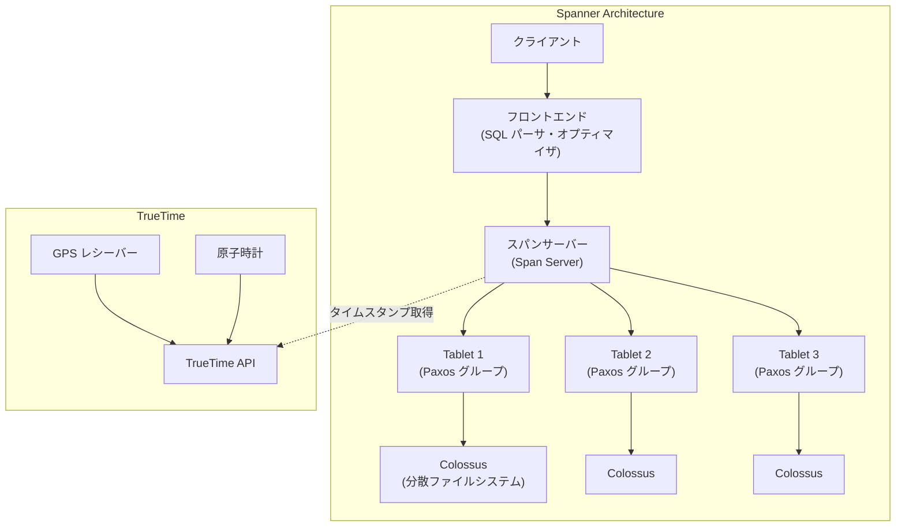

**Zone**: Spanner のデプロイ単位であり、物理的に独立したデータセンター（またはその区画）に対応する。各ゾーンには 1 つの zonemaster と数百〜数千のスパンサーバーが存在する。

**スパンサーバー**: データの実体を管理するサーバー。各スパンサーバーは複数の **Tablet**（キー範囲で分割されたデータの断片）を担当する。

**Paxos グループ**: 各 Tablet は Paxos 合意プロトコルによって複数のゾーンにまたがるレプリカ群で管理される。リーダーレプリカがトランザクション処理を担当し、フォロワーレプリカがデータの冗長性を保証する。

### 2.3 TrueTime：分散時刻同期の革新

Spanner の最も革新的な要素は **TrueTime API** である。従来の分散システムでは、ノード間の時刻同期は NTP（Network Time Protocol）に依存しており、数十ミリ秒の誤差は避けられなかった。この誤差が分散トランザクションにおけるイベント順序付けを困難にしていた。

TrueTime は時刻を「点」ではなく「区間」として返す。

```
TT.now() → TTinterval [earliest, latest]
TT.after(t) → true if t has definitely passed
TT.before(t) → true if t has definitely not arrived
```

Google のデータセンターには GPS レシーバーと原子時計が配備されており、これらを組み合わせることで、TrueTime の不確実性区間（epsilon）は通常 **1〜7 ミリ秒**程度に抑えられている。NTP の誤差が 100 ミリ秒を超えることもあるのに対し、桁違いの精度である。

### 2.4 外部整合性の実現メカニズム

TrueTime を用いた外部整合性（External Consistency）の保証は、以下のプロトコルによって実現される。外部整合性とは、トランザクション $T_1$ が $T_2$ より前にコミットされたなら、$T_1$ のコミットタイムスタンプは必ず $T_2$ のコミットタイムスタンプより小さい、という保証である。これはシリアライザビリティよりも強い保証であり、リニアライザビリティに近い。

**コミットウェイト（Commit Wait）**: リーダーはコミットタイムスタンプ $s$ を選択した後、$TT.after(s)$ が `true` を返すまで待機する。これにより、コミットタイムスタンプが「確実に過去のもの」と見なされるまでトランザクションの結果が外部に見えないことが保証される。

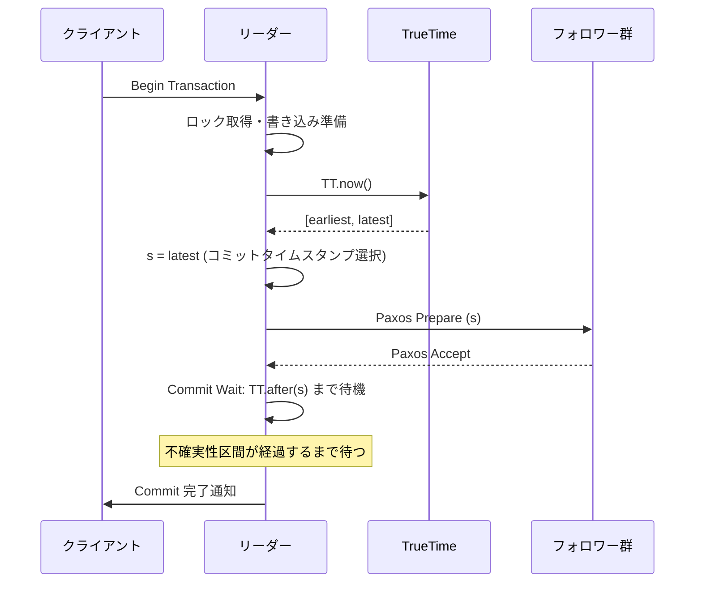

このコミットウェイトは通常数ミリ秒程度だが、Spanner が地球規模で外部整合性を保証するための核心的なメカニズムである。

### 2.5 Spanner の読み取りモデル

Spanner は 2 種類の読み取りモードを提供する。

**強い読み取り（Strong Read）**: 最新のデータを読み取る。リーダーに問い合わせて最新のコミットタイムスタンプを確認するため、レイテンシが若干高い。

**ステイル読み取り（Stale Read）**: 過去のある時点のスナップショットを読み取る。任意のレプリカから読み取り可能であり、レイテンシが低い。10 秒前のスナップショットでよければ、最寄りのレプリカから即座に応答できる。

この柔軟な読み取りモデルにより、ワークロードの特性に応じてレイテンシと整合性のトレードオフを制御できる。

## 3. CockroachDB

### 3.1 設計思想と目標

CockroachDB は、元 Google エンジニアである Spencer Kimball らが 2015 年に設立した Cockroach Labs によって開発されたオープンソースの分散 SQL データベースである。名前の由来はゴキブリ（Cockroach）の生存能力であり、ノード障害やデータセンター障害があっても生き残り続けるデータベースを目指している。

CockroachDB の主要な設計目標は以下の通りである。

1. **PostgreSQL 互換の SQL**: 既存の PostgreSQL エコシステムとの互換性
2. **シリアライザブルなトランザクション**: デフォルトで SERIALIZABLE 分離レベル
3. **水平スケーラビリティ**: ノード追加で自動的にデータが再分散
4. **地理的分散**: 複数リージョンへのデータ配置とレイテンシ最適化
5. **運用の簡素化**: 自動リバランシング、自動レプリケーション、ローリングアップグレード

### 3.2 レイヤードアーキテクチャ

CockroachDB は 5 つのレイヤーからなるアーキテクチャを持つ。各レイヤーは明確な責務を持ち、関心の分離を実現している。

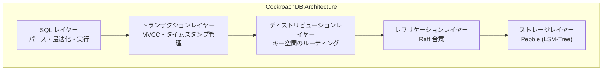

**SQL レイヤー**: クライアントからの SQL を解析し、論理的・物理的クエリプランに変換する。PostgreSQL 互換のワイヤープロトコルを実装しており、`psql` や既存の PostgreSQL ドライバからそのまま接続できる。

**トランザクションレイヤー**: MVCC（Multi-Version Concurrency Control）によるトランザクション管理を行う。CockroachDB は HLC（Hybrid Logical Clock）を使用してタイムスタンプを生成し、トランザクションの順序付けを行う。

**ディストリビューションレイヤー**: 論理的なキー空間を **Range**（デフォルト 512 MiB）に分割し、各 Range がどのノードに配置されているかを管理する。クライアントからのリクエストを適切なノードにルーティングする。

**レプリケーションレイヤー**: 各 Range を Raft 合意プロトコルで 3 つ以上のレプリカに複製する。リーダー選出・ログ複製・メンバーシップ変更を管理する。

**ストレージレイヤー**: 各ノードのローカルストレージを管理する。以前は RocksDB を使用していたが、現在は Go で書かれた LSM-Tree ベースの **Pebble** エンジンを採用している。

### 3.3 Range とデータ分散

CockroachDB の全データは、ソートされた単一のキー空間（monolithic sorted key space）として論理的に管理される。SQL テーブルの各行は、テーブル ID とプライマリキーをエンコードした KV ペアとして格納される。

```
/Table/<table_id>/<index_id>/<primary_key> → <row_data>
```

このキー空間は **Range** と呼ばれる連続した区間に分割される。各 Range はデフォルトで 512 MiB を上限とし、それを超えると自動的にスプリットされる。

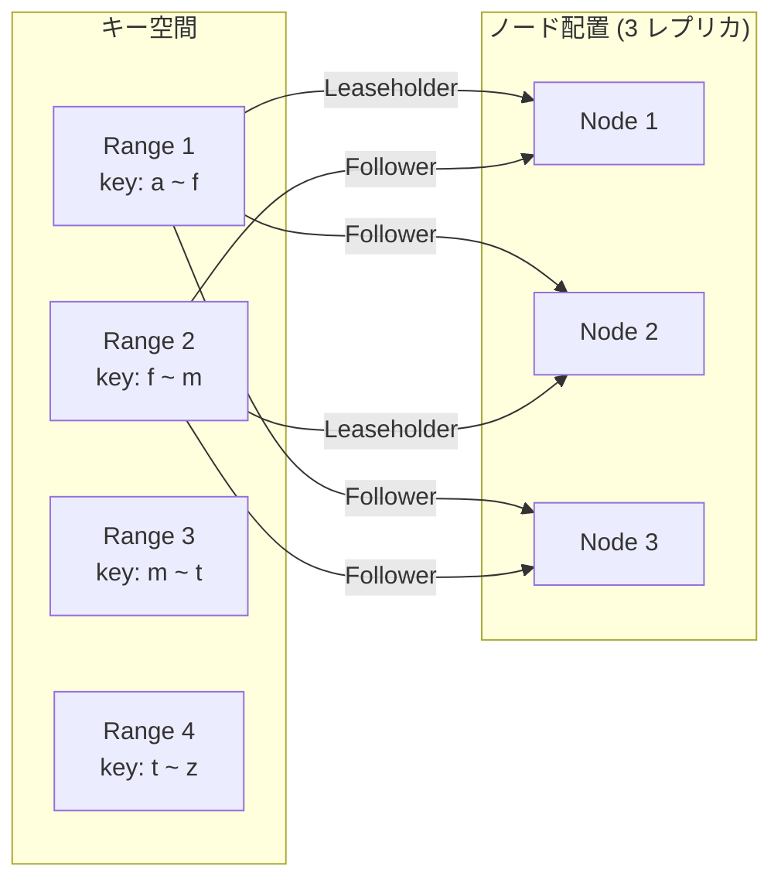

**Leaseholder**: 各 Range には 1 つの Leaseholder レプリカが存在する。Leaseholder は読み取りリクエストに直接応答でき、書き込みリクエストでは Raft リーダーとして合意プロセスを駆動する。Leaseholder と Raft リーダーは通常同じレプリカに配置される。

### 3.4 Hybrid Logical Clock (HLC)

CockroachDB は Google の TrueTime のようなハードウェアベースの時刻同期を使わず、**Hybrid Logical Clock（HLC）**を採用している。HLC は物理時計と論理カウンターを組み合わせたタイムスタンプであり、以下の特性を持つ。

```
HLC = (physical_time, logical_counter)
```

- **physical_time**: NTP で同期されたウォールクロック時刻
- **logical_counter**: 同じ physical_time 内でのイベント順序付け用カウンター

HLC は Lamport Clock の特性（因果関係の保存）と物理時計の特性（実時間への近似）を兼ね備える。ただし、TrueTime と異なり、因果関係のない並行イベント間の順序は保証されない。

CockroachDB はこの制約に対処するため、**クロックスキュー検出**メカニズムを実装している。ノード間の時刻差が設定された最大クロックオフセット（デフォルト 500 ms）を超えると、ノードは自動的にクラスタから離脱する。また、読み取り時にタイムスタンプの不確実性区間内にコミットされた値を検出した場合は、トランザクションをリスタートする。

### 3.5 地理的パーティショニング

CockroachDB の大きな特徴は、テーブルやインデックスのデータ配置を地理的に制御できることである。

```sql
-- Pin data to specific regions based on column value
ALTER TABLE users SET LOCALITY REGIONAL BY ROW;

-- Example: users in Japan stay in ap-northeast-1
ALTER TABLE users
  ALTER COLUMN region SET DEFAULT 'ap-northeast-1';
```

主な地理的分散パターンは以下の通りである。

| パターン | 説明 | ユースケース |
|---------|------|------------|
| REGIONAL BY TABLE | テーブル全体を特定リージョンに配置 | リージョナルなマスタデータ |
| REGIONAL BY ROW | 行ごとにリージョンを指定 | ユーザーデータの地域分散 |
| GLOBAL | 全リージョンに読み取りレプリカを配置 | 参照テーブル（国コードなど） |

## 4. TiDB

### 4.1 設計思想と MySQL 互換性

TiDB は PingCAP 社が 2015 年に開発を開始したオープンソースの分散 SQL データベースである。MySQL プロトコル互換を掲げており、既存の MySQL アプリケーションからの移行障壁を最小化することを目指している。

TiDB の最大の特徴は **HTAP（Hybrid Transactional/Analytical Processing）**への対応である。OLTP と OLAP の両方のワークロードを単一のシステムで処理するアーキテクチャを持つ。

### 4.2 コンポーネントアーキテクチャ

TiDB は複数の独立したコンポーネントから構成され、それぞれが独立してスケールできるマイクロサービス的なアーキテクチャを持つ。

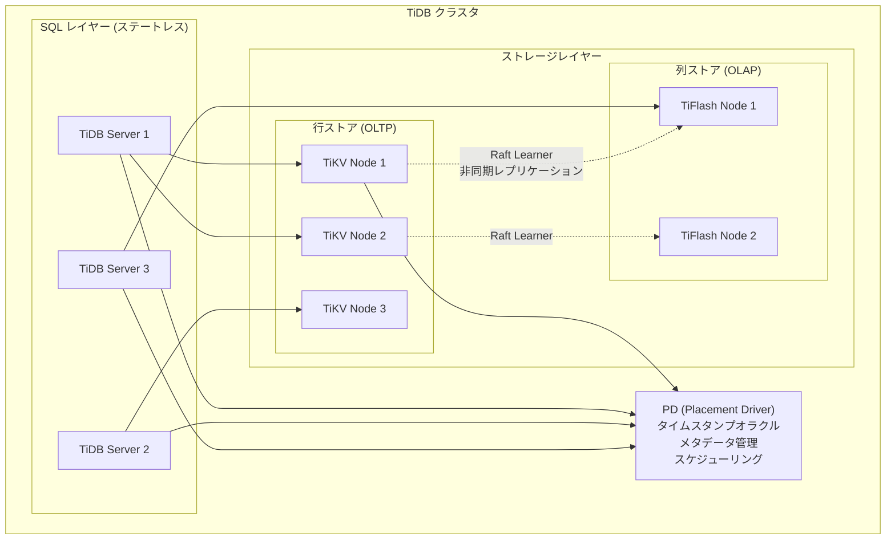

**TiDB Server**: ステートレスな SQL エンジン。MySQL プロトコルを受け付け、SQL の解析・最適化・実行を担当する。ステートレスであるため、ロードバランサーの背後で容易にスケールアウトできる。

**TiKV**: Rust で実装された分散 Key-Value ストア。行指向のストレージエンジンであり、RocksDB をローカルストレージとして使用する。データは **Region**（デフォルト 96 MiB）に分割され、Raft 合意プロトコルで 3 レプリカに複製される。

**TiFlash**: 列指向のストレージエンジン。TiKV から Raft Learner メカニズムを通じてリアルタイムにデータを受信し、列形式で格納する。OLAP クエリの高速化に特化しており、MPP（Massively Parallel Processing）エンジンを搭載している。

**PD（Placement Driver）**: クラスタ全体のメタデータ管理とスケジューリングを担当するコントロールプレーン。**Timestamp Oracle（TSO）**としてグローバルに単調増加するタイムスタンプを発行する役割も担う。

### 4.3 HTAP アーキテクチャの詳細

TiDB の HTAP アーキテクチャの核心は、TiKV（行ストア）と TiFlash（列ストア）の間のリアルタイムデータ同期にある。

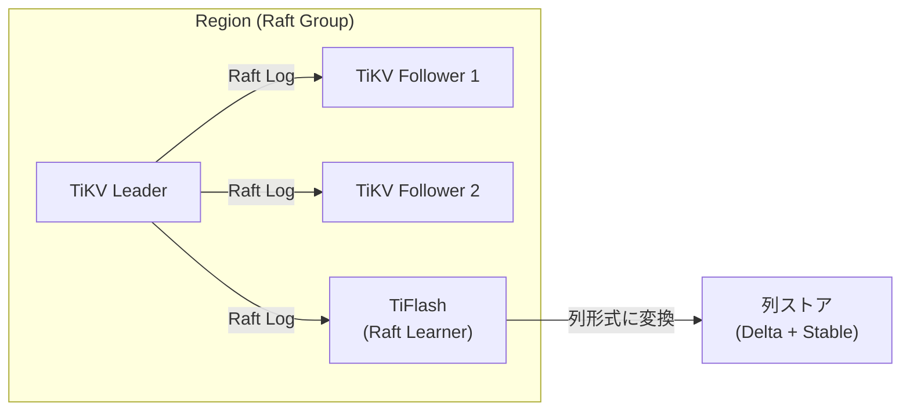

TiFlash は Raft の **Learner** ロールとしてデータを受信する。Learner は投票権を持たないため、Raft の合意プロセスに影響を与えず、OLTP のパフォーマンスを低下させない。データの同期レイテンシはサブ秒レベルであり、ほぼリアルタイムの分析が可能になる。

TiDB のオプティマイザは、クエリの特性に応じて TiKV と TiFlash のどちらからデータを読み取るかを自動的に判断する。ポイントルックアップや小範囲スキャンは TiKV に、テーブルフルスキャンや集約クエリは TiFlash にルーティングされる。

### 4.4 TiDB と MySQL の互換性と差異

TiDB は MySQL 互換を掲げているが、分散データベースの性質上、完全な互換性は実現できない。主な差異は以下の通りである。

| 項目 | MySQL | TiDB |
|------|-------|------|
| AUTO_INCREMENT | 単調増加を保証 | ノード間で一意だが単調増加は非保証 |
| 外部キー制約 | 完全サポート | v6.6 以降で実験的サポート |
| ストアドプロシージャ | 完全サポート | 非サポート |
| トランザクション分離 | デフォルト REPEATABLE READ | Snapshot Isolation（RC/SI） |
| テンポラリテーブル | ローカル/グローバル | ローカルのみサポート |

これらの差異は「バグ」ではなく、分散環境での設計上の意図的な選択であることが重要である。たとえば AUTO_INCREMENT の単調増加を保証するには、全ノードがグローバルカウンタに問い合わせる必要があり、ホットスポットの原因となる。

## 5. 分散トランザクション

### 5.1 分散トランザクションの本質的な難しさ

分散トランザクションが困難である根本的な理由は、**部分障害（Partial Failure）**の存在にある。単一ノードのデータベースでは、トランザクションは完全にコミットされるか完全にアボートされるかのどちらかである。しかし分散システムでは、トランザクションに参加する一部のノードが障害を起こし、残りのノードが正常に動作し続けるという状況が生じうる。

この部分障害の下でアトミシティ（全体のコミットか全体のアボートか）を保証するのが、分散トランザクションプロトコルの役割である。

### 5.2 Two-Phase Commit (2PC) の基本

分散トランザクションの基盤となるのが **Two-Phase Commit（2PC）**プロトコルである。

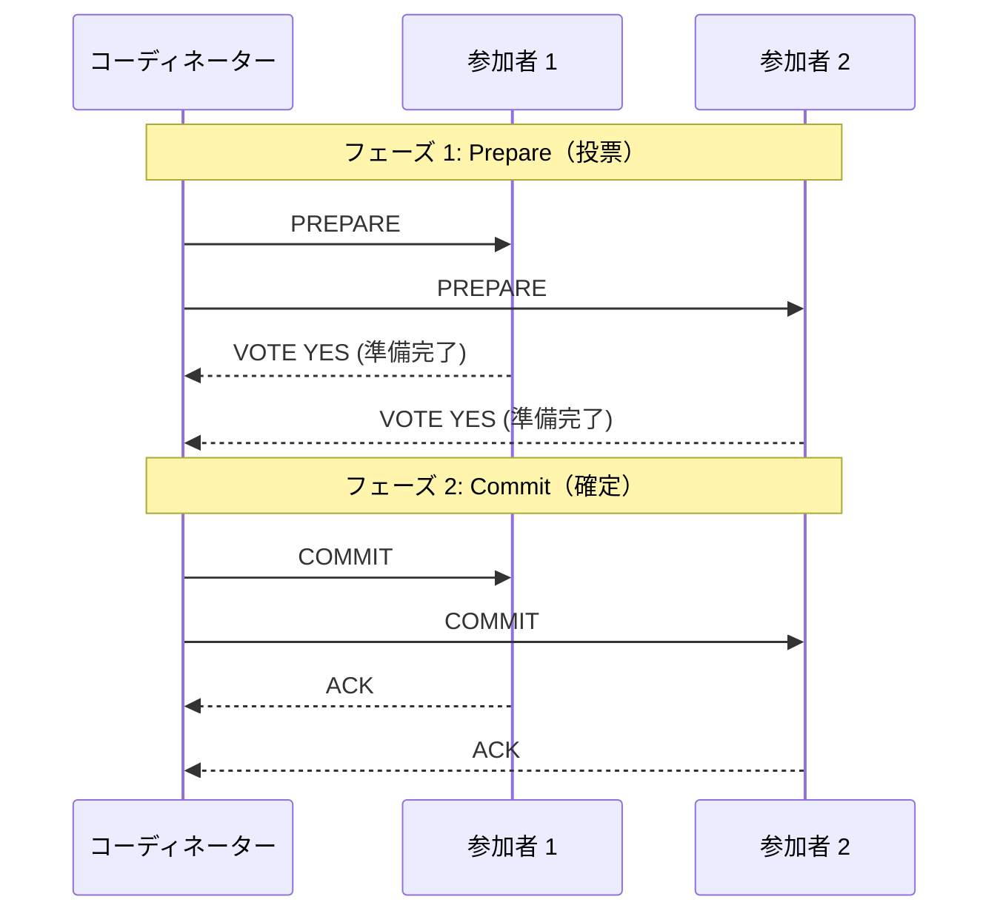

2PC の問題点は **ブロッキング**である。コーディネーターが Prepare を送信した後に障害を起こすと、参加者はコミットすべきかアボートすべきか判断できず、ロックを保持したまま待ち続ける。これは可用性の低下に直結する。

### 5.3 Spanner のトランザクションプロトコル

Spanner は 2PC を Paxos と組み合わせることで、コーディネーター障害によるブロッキング問題を解決した。

- **Paxos グループ**: 各パーティションが Paxos で複製されているため、個々の参加者ノードが障害を起こしても、そのパーティションの Paxos グループ内の他のレプリカが引き継ぐ
- **Paxos で保護されたコーディネーター**: コーディネーター自身も Paxos グループによって複製されるため、コーディネーター障害もフェイルオーバーで対処可能

読み取り専用トランザクションはロック不要で、スナップショット読み取りとして最適化される。これにより、分析クエリが書き込みトランザクションをブロックしない。

### 5.4 CockroachDB の Write Intent と並行 Commit

CockroachDB は Spanner と同様に 2PC を使用するが、独自の最適化を加えている。

**Write Intent（書き込みインテント）**: CockroachDB はトランザクションの途中で書き込むデータを「Intent」としてマークする。他のトランザクションが Intent を発見した場合、そのトランザクションの状態を **Transaction Record** で確認し、コミット済みならば Intent をクリーンアップ、アボート済みならば無視、進行中ならば待機する。

```
通常の KV エントリ:  key → value (committed)
Write Intent:        key → value (intent, txn_id=xxx)
Transaction Record:  txn_id=xxx → {status: PENDING|COMMITTED|ABORTED}
```

**Parallel Commit**: CockroachDB v19.2 で導入された最適化。従来の 2PC ではフェーズ 1（Prepare）とフェーズ 2（Commit）の間に 1 RTT（ラウンドトリップ）が追加されていたが、Parallel Commit では Prepare メッセージにコミット条件を含めることで、参加者全員が YES と応答した時点でトランザクションが暗黙的にコミットされたと見なす。これにより、書き込みトランザクションのレイテンシが 1 RTT 分削減される。

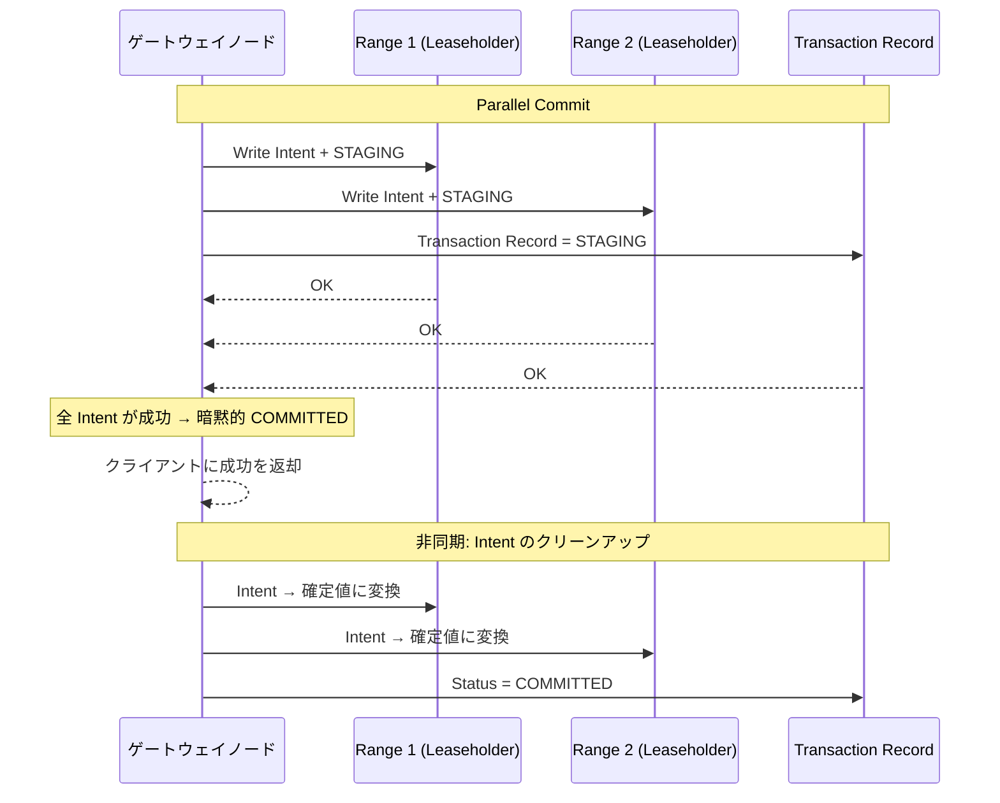

### 5.5 TiDB の Percolator ベーストランザクション

TiDB のトランザクションモデルは、Google の **Percolator** 論文に基づいている。Percolator は Bigtable 上での大規模インクリメンタル処理のために設計されたトランザクションプロトコルであり、TiDB はこれを TiKV 上に実装した。

Percolator の核心は **Timestamp Oracle（TSO）**と **2 段階書き込み**にある。

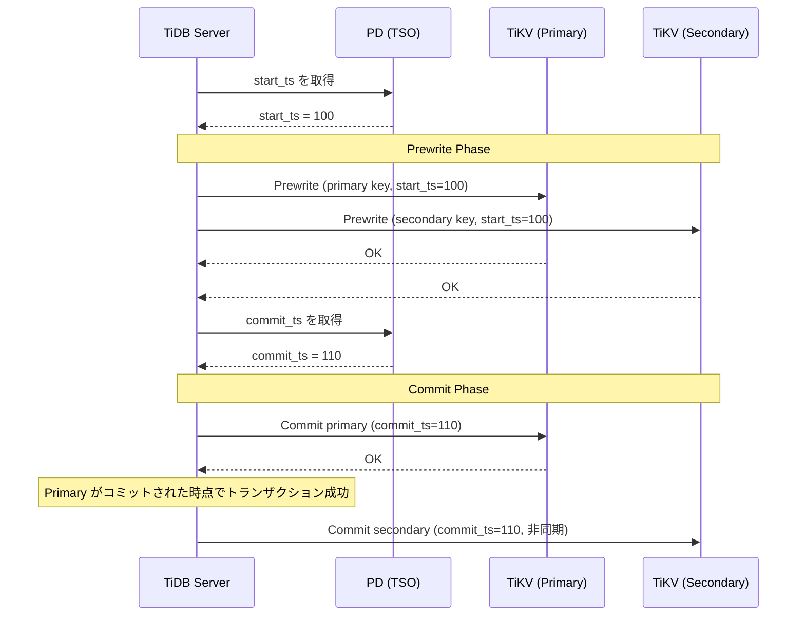

**Prewrite フェーズ**: 全キーにロックを書き込む。1 つのキーを **Primary** として選び、残りを **Secondary** とする。他のトランザクションのロックが存在する場合は、競合解決（ロールバックまたは待機）を行う。

**Commit フェーズ**: まず Primary キーのロックを解除してコミットレコードを書き込む。Primary のコミットが成功した時点で、トランザクション全体のコミットが確定する。Secondary キーのコミットは非同期に行われる。

この設計の利点は、コーディネーターの状態をデータと同じストレージ（TiKV）に永続化するため、コーディネーター障害からの回復が容易であることだ。Primary キーのコミット状態を確認すれば、トランザクション全体の結果が判明する。

### 5.6 楽観的ロックと悲観的ロック

TiDB は 2 つのトランザクションモードを提供する。

**楽観的トランザクション（Optimistic）**: Prewrite フェーズまで競合チェックを遅延させる。競合が少ないワークロードでは効率的だが、競合が多い場合はリトライが頻発してスループットが低下する。

**悲観的トランザクション（Pessimistic）**: v3.0 以降でデフォルトとなった。MySQL と同様に、`SELECT FOR UPDATE` の時点でロックを取得する。これにより、コミット時の競合リトライが減少し、MySQL からの移行互換性が向上する。

## 6. 分散 SQL クエリ実行

### 6.1 分散クエリの課題

分散データベースにおける SQL クエリ実行は、単一ノードとは本質的に異なる課題を持つ。データが複数のノードに分散しているため、クエリプランナーは「どのデータがどのノードにあるか」を考慮した上で、ネットワーク転送を最小化する実行計画を生成しなければならない。

```sql
-- Example: a join query across distributed data
SELECT o.order_id, c.name, o.total
FROM orders o
JOIN customers c ON o.customer_id = c.id
WHERE c.region = 'JP'
ORDER BY o.total DESC
LIMIT 100;
```

このクエリが分散環境で効率的に実行されるためには、以下の判断が必要である。

1. `customers` テーブルのフィルタリング（`region = 'JP'`）をデータのあるノードで行う（**プッシュダウン**）
2. `orders` と `customers` の JOIN をどこで行うか（**コロケーション JOIN** vs **ブロードキャスト JOIN** vs **シャッフル JOIN**）
3. `ORDER BY` と `LIMIT` をどのタイミングで適用するか

### 6.2 CockroachDB の DistSQL

CockroachDB は **DistSQL** というフレームワークを使い、クエリ実行をクラスタ全体に分散させる。

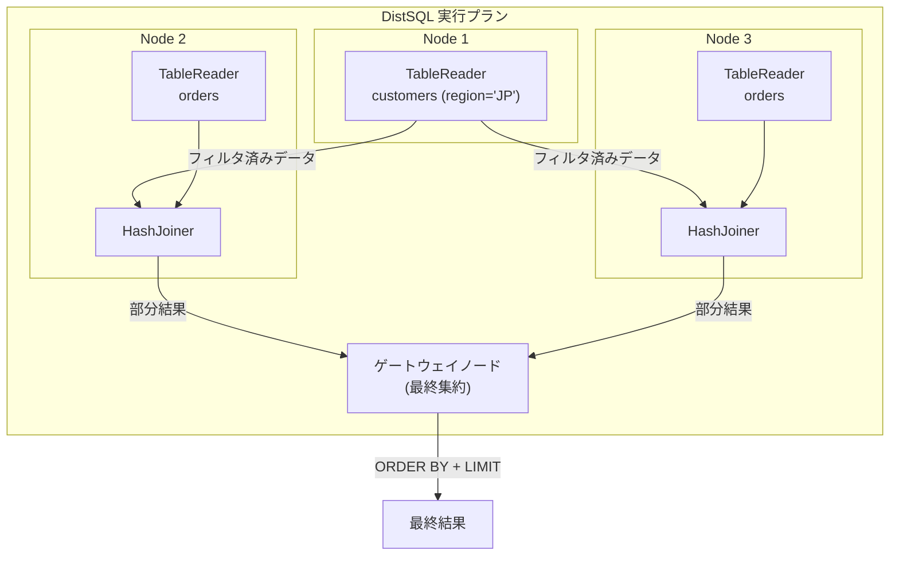

DistSQL の特徴は以下の通りである。

- **プロセッサーベースの実行**: クエリプランを TableReader、JoinReader、Aggregator、Sorter などのプロセッサーに分解し、各プロセッサーをデータのあるノードに配置する
- **フロー制御**: プロセッサー間のデータフローをストリーミングで処理し、メモリ使用量を制御する
- **フォールバック**: 分散実行が効率的でないと判断される場合（小さなテーブルの JOIN など）、ゲートウェイノードでのローカル実行にフォールバックする

### 6.3 TiDB のコプロセッサーと MPP

TiDB は 2 つの分散クエリ実行メカニズムを持つ。

**コプロセッサー（Coprocessor）**: TiKV ノード上でフィルタリングや集約の一部を実行する。SQL レイヤーから TiKV に対して「このキー範囲のデータを、この条件でフィルタして、この列だけ返して」という要求を送ることで、不要なデータのネットワーク転送を削減する。

**MPP（Massively Parallel Processing）**: TiFlash ノード上での大規模並列処理。TiFlash ノード間でデータをシャッフル（Exchange）しながら、JOIN・GROUP BY・ウィンドウ関数などを分散実行する。

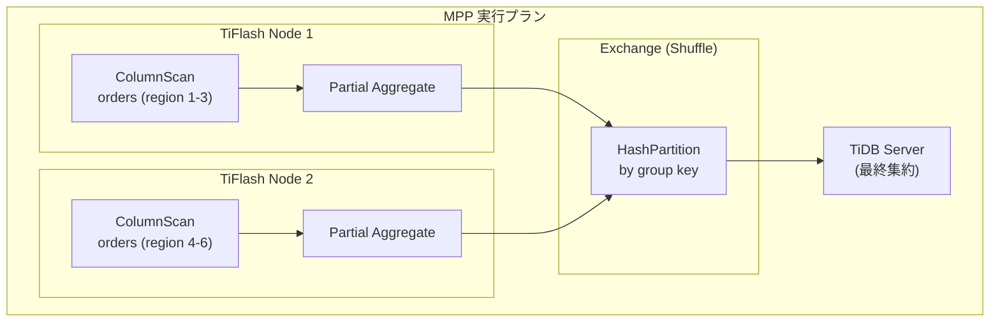

TiDB のオプティマイザは、コストベースの判断により、以下のような使い分けを行う。

- **ポイントクエリ**: TiKV に直接アクセス
- **範囲スキャン + フィルタ**: TiKV コプロセッサーで処理
- **分析クエリ（集約・JOIN）**: TiFlash MPP で処理

この自動判断により、OLTP と OLAP のワークロードを単一のクエリインターフェースで透過的に処理できる。

### 6.4 Spanner のクエリ実行

Spanner も同様に分散クエリ実行を行うが、Google の内部インフラストラクチャとの密結合により、いくつかの独自最適化がある。

- **インターリーブテーブル**: 親子関係にあるテーブルを物理的に同じスプリットに配置することで、JOIN のローカリティを保証する
- **分散 JOIN**: ハッシュ JOIN やソートマージ JOIN を複数スプリットにまたがって実行
- **読み取り専用トランザクションの最適化**: ステイル読み取りを活用し、最寄りのレプリカから読み取ることでレイテンシを最小化

```sql
-- Spanner interleaved table: child rows are co-located with parent
CREATE TABLE Orders (
  CustomerId INT64 NOT NULL,
  OrderId    INT64 NOT NULL,
  Total      FLOAT64,
) PRIMARY KEY (CustomerId, OrderId),
  INTERLEAVE IN PARENT Customers ON DELETE CASCADE;
```

インターリーブテーブルは Spanner 固有の機能であり、親テーブルと子テーブルの行を物理的に近接配置することで、`Customers JOIN Orders` のようなクエリを単一スプリット内で完結させる。これにより、分散 JOIN のオーバーヘッドを回避できる。

## 7. RDBMS からの移行

### 7.1 移行の動機と現実

NewSQL への移行を検討する主な動機は以下の通りである。

1. **スケーラビリティの限界**: 単一ノードの RDBMS では処理しきれないデータ量・トラフィック
2. **手動シャーディングの運用負荷**: アプリケーションレベルでのシャーディングの複雑さ
3. **高可用性の要求**: ゼロダウンタイムでのフェイルオーバー
4. **グローバル展開**: 複数リージョンでの低レイテンシアクセス

しかし、移行は決して「ドロップインリプレースメント」ではない。互換性の高い TiDB（MySQL 互換）や CockroachDB（PostgreSQL 互換）であっても、分散システム固有の差異が存在する。

### 7.2 移行時に注意すべき技術的差異

**オートインクリメント**: 分散環境では、グローバルに単調増加する ID の生成は性能ボトルネックとなる。UUID や分散 ID 生成器（Snowflake ID など）への移行が推奨される。

```sql
-- Anti-pattern in distributed SQL: sequential auto-increment
CREATE TABLE users (
  id BIGINT AUTO_INCREMENT PRIMARY KEY,  -- hotspot risk
  name VARCHAR(255)
);

-- Recommended: UUID or distributed ID
CREATE TABLE users (
  id UUID PRIMARY KEY DEFAULT gen_random_uuid(),
  name VARCHAR(255)
);
```

**暗黙のソート順**: 単一ノードの RDBMS では `SELECT * FROM users` が挿入順に近い順序で結果を返すことが多いが、分散データベースではデータが複数ノードに分散しているため、`ORDER BY` なしの結果順序は非決定的である。

**トランザクションサイズ**: 分散トランザクションは、参加ノードが増えるほどロック競合やコーディネーションのオーバーヘッドが増大する。大量行の一括更新は、バッチサイズを制限して複数トランザクションに分割するのが望ましい。

**外部キー制約**: CockroachDB は外部キーをサポートするが、リージョンをまたぐ外部キーチェックはレイテンシが増加する。TiDB は v6.6 で実験的にサポートを開始したが、パフォーマンスへの影響を考慮する必要がある。

### 7.3 段階的移行戦略

大規模システムの移行では、ビッグバン方式（一括切り替え）ではなく、段階的なアプローチが推奨される。

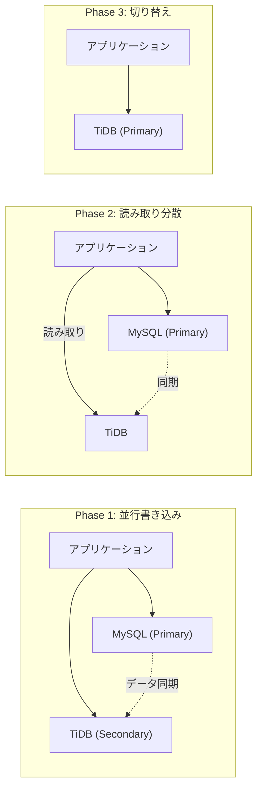

**Phase 1**: 既存の RDBMS と NewSQL の両方にデータを書き込み、整合性を検証する。TiDB の場合は DM（Data Migration）ツールを使って MySQL のバイナリログをリアルタイムに同期できる。

**Phase 2**: 読み取りトラフィックの一部を NewSQL に向ける。パフォーマンスと結果の正確性を検証する。

**Phase 3**: 書き込みトラフィックを NewSQL に切り替える。問題発生時のロールバック手順を事前に確認しておく。

## 8. パフォーマンス特性

### 8.1 レイテンシプロファイル

NewSQL データベースのレイテンシは、単一ノード RDBMS と比較して構造的に高くなる。これは分散合意のオーバーヘッドに起因する。

| 操作 | 単一ノード RDBMS | NewSQL (同一リージョン) | NewSQL (クロスリージョン) |
|------|-----------------|----------------------|------------------------|
| ポイント読み取り | < 1 ms | 1 ~ 5 ms | 50 ~ 200 ms |
| ポイント書き込み | < 1 ms | 5 ~ 15 ms | 100 ~ 500 ms |
| 範囲スキャン (1000行) | 5 ~ 10 ms | 10 ~ 50 ms | 100 ~ 500 ms |
| 分散トランザクション | N/A | 10 ~ 50 ms | 200 ~ 1000 ms |

::: warning レイテンシに関する注意
上記の数値は一般的な目安であり、ハードウェア構成、ネットワーク遅延、ワークロード特性によって大きく変動する。本番環境では必ずベンチマークを実施すること。
:::

同一リージョン内でのポイント読み取りでも、Raft の Leaseholder を経由する必要があるため、ローカルメモリアクセスで完結する単一ノード RDBMS よりは遅い。しかし、この差は多くのアプリケーションにとって許容範囲内である。

### 8.2 スループットのスケーリング

NewSQL の真価はスループットのスケーリング特性にある。ノードを追加すれば、理想的にはスループットが線形にスケールする。

```
スループット ↑
    │
    │                    ・ NewSQL (理想的な線形スケール)
    │                ・
    │            ・
    │        ・
    │    ・                    ─── 単一ノード RDBMS の上限
    │・─────────────────────────
    │
    └──────────────────────→ ノード数
```

ただし、線形スケーリングは「ホットスポットがない」場合に限る。以下のパターンはスケーリングを阻害する。

- **単調増加キーへの書き込み集中**: AUTO_INCREMENT の ID やタイムスタンプ順のデータは、常に最新の Range に書き込みが集中する
- **グローバルカウンター**: `UPDATE counters SET value = value + 1` のような操作は、特定の Range に競合が集中する
- **大規模トランザクション**: 多数の Range にまたがるトランザクションは、ロック競合と調整オーバーヘッドが増大する

### 8.3 各システムのパフォーマンス特性比較

| 特性 | Spanner | CockroachDB | TiDB |
|------|---------|-------------|------|
| 書き込みレイテンシの主要因 | Commit Wait (TrueTime) | Raft 合意 + HLC | Raft 合意 + TSO 通信 |
| 読み取り最適化 | ステイル読み取り | Follower Read | Stale Read / TiFlash |
| OLAP 性能 | 中程度 | 中程度 | 高い (TiFlash MPP) |
| マルチリージョン最適化 | インターリーブテーブル | 地理的パーティショニング | 主に単一クラスタ |
| TSO ボトルネック | なし (TrueTime 分散) | なし (HLC 分散) | あり (PD が単一障害点) |

TiDB の TSO（Timestamp Oracle）は PD コンポーネントに集中しており、毎秒数百万のタイムスタンプを発行できるものの、地理的に分散したクラスタではネットワークレイテンシが TSO 通信のボトルネックとなりうる。PingCAP はこの課題に対して、PD のマイクロサービス化や TSO のリージョン分散化を進めている。

### 8.4 ベンチマークの注意点

NewSQL データベースのベンチマークにおいて、以下の点に注意が必要である。

**TPC-C / TPC-H の限界**: TPC-C は OLTP、TPC-H は OLAP のベンチマークとして広く使われるが、分散データベースの特性（マルチリージョン、障害耐性、スケーリング特性）を十分に評価できない。

**ワークロード依存性**: 同じデータベースでも、キー分布（一様 vs 偏り）やトランザクションサイズ、読み取り/書き込み比率によって性能が大きく異なる。実際のワークロードに近い条件でのベンチマークが不可欠である。

**レプリケーション係数の影響**: レプリカ数を増やすと可用性は向上するが、書き込みレイテンシは増加する（より多くのノードが合意に参加するため）。ベンチマーク時はレプリカ数を明示する必要がある。

## 9. 選定指針とトレードオフ

### 9.1 どの NewSQL を選ぶべきか

NewSQL データベースの選定は、技術的要件・組織的要件・運用的要件の総合的な判断である。

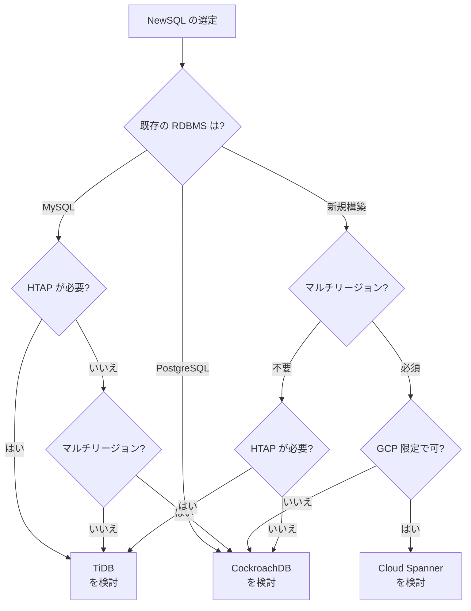

### 9.2 各システムの適性

**Google Cloud Spanner が適するケース**:
- Google Cloud を主要インフラとして使用している
- 地球規模のデータ分散と外部整合性が必須
- 運用負荷を最小化したい（フルマネージド）
- コスト面での制約が比較的少ない

**CockroachDB が適するケース**:
- PostgreSQL 互換が重要
- マルチリージョン・マルチクラウドでの展開が必要
- SERIALIZABLE 分離レベルがデフォルトで必要
- セルフホスト or マネージドサービスの選択肢が欲しい

**TiDB が適するケース**:
- MySQL 互換が重要
- OLTP と OLAP の両方を単一システムで処理したい（HTAP）
- 主に単一リージョン（ないし近接リージョン）での運用
- オープンソースのエコシステムを活用したい

### 9.3 NewSQL を選ぶべきでないケース

NewSQL は万能薬ではない。以下のケースでは従来の RDBMS や NoSQL の方が適切な場合がある。

**データ量が小さく、スケーラビリティが不要な場合**: 単一ノードの PostgreSQL や MySQL で十分に対応できるなら、分散データベースの複雑さとオーバーヘッドは不要である。分散合意のレイテンシコストを払う理由がない。

**極低レイテンシが必須の場合**: ミリ秒以下の応答時間が求められるワークロード（高頻度トレーディングなど）では、Raft 合意のオーバーヘッドが許容できない場合がある。

**スキーマレスなデータモデルが適する場合**: ドキュメント指向やグラフ指向のデータモデルが自然なワークロードでは、MongoDB や Neo4j の方が適切である。

**結果整合性で十分な場合**: SNS のタイムラインや「いいね」カウンターなど、強い整合性が不要なワークロードでは、Cassandra や DynamoDB の方がシンプルかつ高スループットである。

### 9.4 根本的なトレードオフ

NewSQL データベースは CAP 定理の制約から逃れることはできない。ネットワークパーティション（P）は避けられない現実であるため、実質的には一貫性（C）と可用性（A）のトレードオフとなる。

Spanner、CockroachDB、TiDB のいずれも **CP 系**のシステムである。ネットワークパーティションが発生した場合、可用性を犠牲にして一貫性を優先する。具体的には、Raft の過半数（Quorum）が通信できなくなった Range は、読み書き不能になる。

> [!NOTE]
> Spanner の論文で Eric Brewer（CAP 定理の提唱者）自身が述べているように、Spanner は実質的に「CA」として振る舞う。これは CAP 定理を破っているのではなく、Google のネットワークインフラが極めて信頼性が高く、ネットワークパーティションの発生確率が実用上無視できるほど低いためである。一般的なクラウド環境では、パーティションはより現実的なリスクとして考慮する必要がある。

もう一つの根本的なトレードオフは、**レイテンシ vs 整合性**である。

- 強い整合性を求めるほど、合意のための通信ラウンドトリップが増え、レイテンシが増加する
- 読み取りの鮮度を妥協する（ステイル読み取り）ことで、レイテンシを大幅に削減できる
- 地理的に離れたリージョン間での強い整合性は、光速の制約により不可避的に高レイテンシとなる

```
整合性の強さ     レイテンシ       可用性
    ↑               ↑              ↓
    │ External       │ 高い         │ 低い（パーティション時）
    │ Consistency    │              │
    │               │              │
    │ Serializable   │              │
    │               │              │
    │ Snapshot       │              │
    │ Isolation     │              │
    │               │              │
    │ Read           │ 低い         │ 高い
    │ Committed     │              │
    ↓               ↓              ↑
```

### 9.5 未来の展望

NewSQL の分野は急速に進化し続けている。

**サーバーレス化**: CockroachDB Serverless や TiDB Serverless のように、使用量に応じた課金とゼロからのスケーリングを実現するサーバーレスモデルが普及しつつある。

**AI/ML ワークロードとの統合**: ベクトル検索やエンベディングストレージのサポートにより、AI アプリケーションのバックエンドとしての役割が拡大している。

**エッジコンピューティング**: データをエッジロケーションに配置し、ユーザーに最も近い場所で処理する需要が高まっている。CockroachDB の地理的パーティショニングはこのトレンドに対応している。

**ハードウェアの進化**: RDMA（Remote Direct Memory Access）やプログラマブルスイッチなどの新しいネットワーク技術が、分散合意のレイテンシを劇的に削減する可能性がある。CXL（Compute Express Link）によるメモリプーリングも、分散データベースのアーキテクチャに影響を与えうる。

## まとめ

NewSQL は「RDBMS の使いやすさと NoSQL のスケーラビリティを両立する」という命題に対する、現時点で最も包括的な回答である。しかし、その実現には分散合意・分散トランザクション・分散クエリ実行という三重の複雑さが伴う。

Google Spanner は TrueTime という独自ハードウェアにより外部整合性を実現した先駆者であり、CockroachDB は HLC と Parallel Commit により特殊ハードウェアなしで同等の保証に近づいた。TiDB は Percolator ベースのトランザクションと TiFlash による HTAP 機能で、分析と更新の統合処理という独自のポジションを確立した。

どの NewSQL を選ぶかは、技術的要件だけでなく、既存のエコシステム（MySQL vs PostgreSQL）、運用体制、コスト、そして「本当に分散データベースが必要なのか」という根本的な問いへの回答に依存する。分散システムの複雑さは、必要でない限り避けるべきものであり、NewSQL の導入は慎重な評価の上で行うべきである。
