# Nginx のアーキテクチャ（master-worker, イベント駆動I/O, 設定解析）

## 1. 歴史的背景と C10K 問題

### 1.1 Apache の時代とプロセスモデルの限界

1990年代後半から2000年代初頭にかけて、World Wide Webの爆発的な成長はWebサーバーに未曾有のスケーラビリティ要求を突きつけた。当時のWebサーバー市場を支配していたのは Apache HTTP Server である。Apacheは1995年にNCSA httpdの派生として誕生し、モジュール式の柔軟なアーキテクチャで急速に普及した。

Apacheが採用していたのは **prefork MPM（Multi-Processing Module）** と呼ばれるプロセスモデルである。このモデルでは、クライアントからの接続1つに対して1つのプロセス（またはスレッド）を割り当てる。

```
Apache prefork モデル:

[クライアントA] → [プロセス1] → レスポンス
[クライアントB] → [プロセス2] → レスポンス
[クライアントC] → [プロセス3] → レスポンス
     ...            ...
[クライアントN] → [プロセスN] → レスポンス
```

このモデルには本質的な問題がある。同時接続数が増えるとプロセス数も線形に増加し、以下のリソース消費が深刻化する。

- **メモリ消費**: 各プロセスは独自のメモリ空間を持つ。1プロセスあたり数MBのメモリを消費するため、1万接続では数十GBのメモリが必要になる
- **コンテキストスイッチ**: OSのスケジューラが数千のプロセスを切り替える際のオーバーヘッドが無視できなくなる
- **プロセス生成コスト**: `fork()` によるプロセス生成は重い操作であり、リクエストの度に行うと大きな遅延を生む

後にApacheは worker MPM（マルチスレッドモデル）や event MPM（イベント駆動モデル）を導入したが、基本的なアーキテクチャの制約から、根本的な解決には至らなかった。

### 1.2 C10K 問題

1999年、Dan Kegel が「The C10K Problem」という論文を発表し、1台のサーバーで1万（10K）の同時接続をどう処理するかという問題を明確に提起した。この論文はWebサーバー設計の転換点となった。

C10K問題の本質は、「接続ごとにスレッド/プロセスを割り当てる」というモデルのスケーラビリティ限界にある。当時のハードウェアスペック（1GHz程度のCPU、数百MBのRAM）では、1万のスレッドを同時に動作させることは事実上不可能だった。

::: tip C10K からC10M へ
2010年代にはC10K問題は解決済みとされ、次の目標として「C10M問題」（1台で1000万同時接続）が議論されるようになった。これにはカーネルバイパス（DPDK、io_uring）やユーザースペースネットワークスタックなどのより先進的な技術が必要とされる。
:::

Dan Kegel は論文の中で、この問題を解決するために以下のアプローチを整理した。

| アプローチ | 説明 | 代表的な実装 |
|---|---|---|
| `select` / `poll` | ファイルディスクリプタの配列をカーネルに渡して準備完了を確認 | 古いUnixアプリケーション |
| `epoll`（Linux） | カーネルがイベント発生時にアプリケーションに通知 | Nginx, Node.js |
| `kqueue`（BSD） | BSDカーネルのイベント通知機構 | Nginx (FreeBSD) |
| IOCP（Windows） | Windows の非同期I/O完了ポート | IIS |
| シグナル駆動I/O | `SIGIO` でI/O準備完了を通知 | 実用例は少ない |

### 1.3 Nginx の誕生

この文脈の中で、ロシアのエンジニア **Igor Sysoev** は2002年にNginxの開発を開始した。彼はロシアの大手ポータルサイト Rambler で働いており、Apacheでは処理しきれないトラフィック量に日々直面していた。

Nginxの設計目標は明確だった。

1. **1万以上の同時接続を少ないメモリで処理する**
2. **イベント駆動・非同期・ノンブロッキングI/Oの徹底**
3. **高いモジュール性による拡張可能なアーキテクチャ**
4. **設定のリロードを無停止で行える運用性**

2004年に最初のパブリックリリースが行われ、その後Nginxは急速に普及した。2024年現在、Netcraft の調査によればNginxは世界のWebサイトの約3割以上で使用されており、高トラフィックサイトでの採用率はさらに高い。

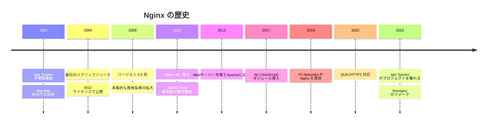

---

## 2. Master-Worker プロセスモデル

### 2.1 プロセス構成の全体像

Nginxのプロセスアーキテクチャは、Unixの伝統的なデーモン設計に基づきながら、独自の最適化が施されている。起動すると、以下のプロセス群が形成される。

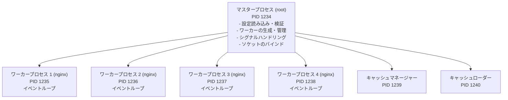

`ps` コマンドで確認すると、以下のような出力が得られる。

```bash
$ ps aux | grep nginx
# master process runs as root for privileged port binding
root     1234  0.0  0.1  nginx: master process /usr/sbin/nginx
# worker processes run as unprivileged user
nginx    1235  0.2  0.5  nginx: worker process
nginx    1236  0.2  0.5  nginx: worker process
nginx    1237  0.1  0.5  nginx: worker process
nginx    1238  0.1  0.5  nginx: worker process
nginx    1239  0.0  0.1  nginx: cache manager process
nginx    1240  0.0  0.1  nginx: cache loader process
```

### 2.2 マスタープロセスの責務

マスタープロセスは特権プロセス（通常はroot）として動作し、以下の責務を担う。

**設定ファイルの読み込みと検証**: 起動時に `nginx.conf` とそこから `include` されるすべてのファイルを読み込み、構文解析と意味検証を行う。設定にエラーがあれば起動を中止する。

**特権操作の実行**: ポート80（HTTP）や443（HTTPS）へのバインドにはroot権限が必要である。マスタープロセスがソケットを作成・バインドした上で、`fork()` によって生成されたワーカープロセスがそのソケットを継承する。こうすることで、ワーカーは非特権ユーザー（`nginx` や `www-data`）として安全に動作できる。

**ワーカープロセスのライフサイクル管理**: マスタープロセスはワーカーの起動・停止・再起動を管理する。ワーカーが予期せずクラッシュした場合は自動的に新しいワーカーを生成する。

**シグナルハンドリング**: Unixシグナルを受け取って各種操作を実行する。

| シグナル | Nginx コマンド | 動作 |
|---|---|---|
| `SIGHUP` | `nginx -s reload` | 設定の再読み込み（グレースフルリロード） |
| `SIGUSR1` | `nginx -s reopen` | ログファイルの再オープン（ローテーション） |
| `SIGUSR2` | — | 実行ファイルのアップグレード |
| `SIGQUIT` | `nginx -s quit` | グレースフルシャットダウン |
| `SIGTERM` | `nginx -s stop` | 即座に停止 |
| `SIGWINCH` | — | ワーカーのグレースフルシャットダウン |

### 2.3 ワーカープロセスの設計

ワーカープロセスはNginxの実際の仕事を行うプロセスであり、クライアントからの接続を受け付け、リクエストを処理し、レスポンスを返す。

最も重要な設計判断は、**各ワーカーがシングルスレッドで動作する**という点である。ワーカー内にはスレッドが1つしかなく、そのスレッドがイベントループを回してすべてのI/Oイベントを処理する。マルチスレッドに伴うロック競合やデッドロックの問題を根本的に回避できる。

```nginx
# /etc/nginx/nginx.conf

# Set number of worker processes
# "auto" detects the number of CPU cores
worker_processes auto;

# Each worker can handle this many simultaneous connections
events {
    worker_connections 1024;
}
```

`worker_processes auto` の設定により、Nginxは利用可能なCPUコア数と同じ数のワーカーを起動する。これは各ワーカーが1つのCPUコアにバインドされることを意図している。

::: warning worker_connections の意味
`worker_connections 1024` は、1つのワーカーが同時に保持できるコネクション数の上限を意味する。リバースプロキシとして使用する場合、クライアントとの接続とアップストリームとの接続の**両方**がカウントされるため、実効的な同時処理リクエスト数はこの値の約半分になる。4ワーカー×1024接続の場合、理論上の同時接続上限は4096だが、リバースプロキシでの実効値は約2048となる。
:::

### 2.4 ワーカープロセスのCPUアフィニティ

OSのスケジューラがワーカープロセスを異なるCPUコアに移動させると、CPUキャッシュ（L1/L2）が無駄になり性能が低下する。これを防ぐため、Nginxは `worker_cpu_affinity` ディレクティブでプロセスを特定のCPUコアに固定できる。

```nginx
# Bind each worker to a specific CPU core (4-core example)
worker_processes 4;
worker_cpu_affinity 0001 0010 0100 1000;

# Automatic affinity binding (recommended)
worker_processes auto;
worker_cpu_affinity auto;
```

CPUアフィニティの設定により、以下のメリットが得られる。

- CPUキャッシュのヒット率が向上する
- コンテキストスイッチのコストが低減する
- NUMA（Non-Uniform Memory Access）環境でローカルメモリへのアクセスが保証される

### 2.5 プロセス間通信

マスタープロセスとワーカープロセスの間の通信は、主にUnixシグナルとソケットペアで行われる。ワーカー間では、共有メモリ（`ngx_slab_pool_t`）を用いてデータの共有を行う。

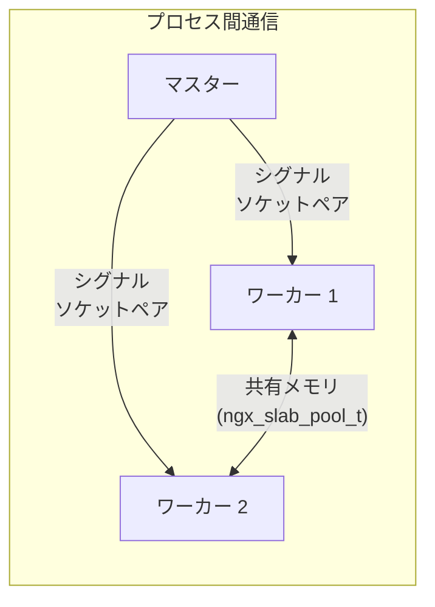

共有メモリはNginxの重要な機構であり、以下の用途に使われる。

- **レート制限の状態**: `limit_req_zone` で定義されたレート制限カウンタは全ワーカー間で共有される
- **キャッシュのメタデータ**: ディスクキャッシュのキー・エントリ情報は共有メモリ上の赤黒木で管理される
- **セッションキャッシュ**: SSL/TLSセッションの再利用情報を全ワーカーが参照できる
- **upstream の状態**: ロードバランシングのラウンドロビンカウンタや接続数カウンタ

---

## 3. イベント駆動I/Oモデル

### 3.1 ブロッキングI/Oの問題

伝統的なサーバープログラムでは、I/O操作（ネットワーク読み書き、ディスク読み書き）は**ブロッキング**で行われる。つまり、`read()` システムコールを呼ぶとデータが到着するまでスレッドが停止する。

```
ブロッキングI/O:

スレッド1: [接続受付] → [リクエスト読み取り ....待機....] → [処理] → [レスポンス書き込み ....待機....]
スレッド2: [接続受付] → [リクエスト読み取り ....待機....] → [処理] → [レスポンス書き込み ....待機....]
スレッド3: [接続受付] → [リクエスト読み取り ....待機....] → [処理] → [レスポンス書き込み ....待機....]
```

この「待機」の間、スレッドは何もしていないにもかかわらずOSのリソース（スタックメモリ、カーネルのスケジューリングコスト）を消費し続ける。ネットワークI/Oでは、データの到着を待つ時間がCPU処理時間に比べて圧倒的に長い。この非効率性こそがC10K問題の根本原因である。

### 3.2 イベント駆動モデルの仕組み

Nginxのワーカープロセスは、ブロッキングI/Oを一切使わない。代わりに、**ノンブロッキングI/O + I/O多重化**の組み合わせで、単一スレッドから数千の接続を同時に処理する。

その流れは以下の通りである。

1. すべてのソケットをノンブロッキングモードに設定する
2. I/O多重化機構（Linux では `epoll`）に監視対象のファイルディスクリプタを登録する
3. イベントループで `epoll_wait()` を呼び、準備完了のイベントをまとめて取得する
4. 準備完了の各イベントに対して、対応するハンドラ（コールバック）を実行する
5. 手順3に戻る

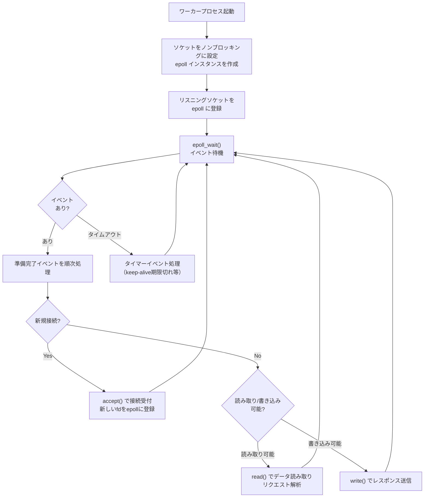

この設計の核心は、**I/Oの完了を待たない**ことにある。データがまだ届いていなければ、`read()` は即座に `EAGAIN` を返す。Nginxはその接続の処理を中断し、他の準備完了の接続を先に処理する。後でデータが届けば `epoll` がそれを通知し、中断していた処理を再開する。

### 3.3 epoll の詳細

Linuxにおけるイベント駆動I/Oの中核を担うのが `epoll` である。`select` や `poll` の欠点を克服するために、Linux 2.5.44（2002年）で導入された。

`select` / `poll` には以下の根本的な問題がある。

- 毎回の呼び出しで監視対象の全ファイルディスクリプタ（fd）をカーネルに渡す必要がある（O(n)のコピーコスト）
- カーネル側も全fdを走査して準備完了を確認する（O(n)の走査コスト）
- `select` にはfdの上限（FD_SETSIZE = 1024）がある

`epoll` はこれらの問題を以下のように解決する。

**epoll のAPIと動作**:

```c
// 1. Create an epoll instance
int epfd = epoll_create1(0);

// 2. Register a file descriptor for monitoring
struct epoll_event ev;
ev.events = EPOLLIN | EPOLLET;  // edge-triggered read event
ev.data.fd = listen_fd;
epoll_ctl(epfd, EPOLL_CTL_ADD, listen_fd, &ev);

// 3. Wait for events (the core of the event loop)
struct epoll_event events[MAX_EVENTS];
int nfds = epoll_wait(epfd, events, MAX_EVENTS, timeout_ms);

// 4. Process ready events
for (int i = 0; i < nfds; i++) {
    if (events[i].data.fd == listen_fd) {
        // New connection
        int conn_fd = accept(listen_fd, ...);
        // Register the new connection fd with epoll
        epoll_ctl(epfd, EPOLL_CTL_ADD, conn_fd, &new_ev);
    } else {
        // Data ready on existing connection
        handle_request(events[i].data.fd);
    }
}
```

`epoll` の性能上の優位性は以下の通りである。

| 操作 | `select` / `poll` | `epoll` |
|---|---|---|
| fdの登録 | 毎回全fdを渡す（O(n)） | 最初に1度登録するだけ（O(1)） |
| イベント検出 | 全fdを走査（O(n)） | コールバックで通知（O(1)） |
| fd数上限 | `select`: 1024、`poll`: 制限なし | 制限なし |
| メモリ効率 | fdセット全体をコピー | 変更のあったfdだけ通知 |

### 3.4 エッジトリガとレベルトリガ

`epoll` には2つの動作モードがある。

**レベルトリガ（Level-Triggered, LT）**: fdが読み取り/書き込み可能な「状態」にある限り、`epoll_wait()` は毎回そのfdを報告する。直感的で使いやすいが、同じfdが毎回報告されるため効率がやや劣る。

**エッジトリガ（Edge-Triggered, ET）**: fdの「状態が変化した」タイミングでのみ報告する。一度報告されたら、再び状態が変化するまで報告されない。Nginxはこのモードを使用する。

```nginx
events {
    # Use epoll on Linux
    use epoll;
    worker_connections 4096;
    # Enable multi_accept for accepting multiple connections at once
    multi_accept on;
}
```

::: danger エッジトリガの注意点
エッジトリガモードでは、`read()` や `write()` を `EAGAIN` が返るまで繰り返し呼び出す必要がある。途中でやめると、カーネルは「状態変化なし」と判断してそのfdを再度報告しない。結果としてデータの読み残しが発生し、接続がハングする。Nginxのコードベースではこの点が非常に注意深く実装されている。
:::

### 3.5 各OSのイベント機構

Nginxは移植性が高く、各OSに最適なイベント機構を自動選択する。

| OS | イベント機構 | 特徴 |
|---|---|---|
| Linux 2.6+ | `epoll` | 最も広く使用される。エッジトリガ対応 |
| FreeBSD / macOS | `kqueue` | `epoll` と同等の機能。FreeBSDでは最も効率的 |
| Solaris | `eventport` | Solaris固有のイベント通知 |
| Windows | IOCP | 非同期I/O完了ポート。Nginxの Windows 対応は限定的 |
| 汎用 | `select` / `poll` | フォールバック。性能は劣るが最大の互換性 |

### 3.6 スレッドプールによるブロッキング操作の回避

イベント駆動モデルの最大の弱点は、**ブロッキング操作がイベントループ全体を止めてしまう**ことである。ネットワークI/OはノンブロッキングにできるがLinuxのディスクI/OはAIO（Asynchronous I/O）のサポートが歴史的に不完全であり、`read()` がブロックする場合がある。

Nginx 1.7.11以降では、この問題に対処するため**スレッドプール**が導入された。

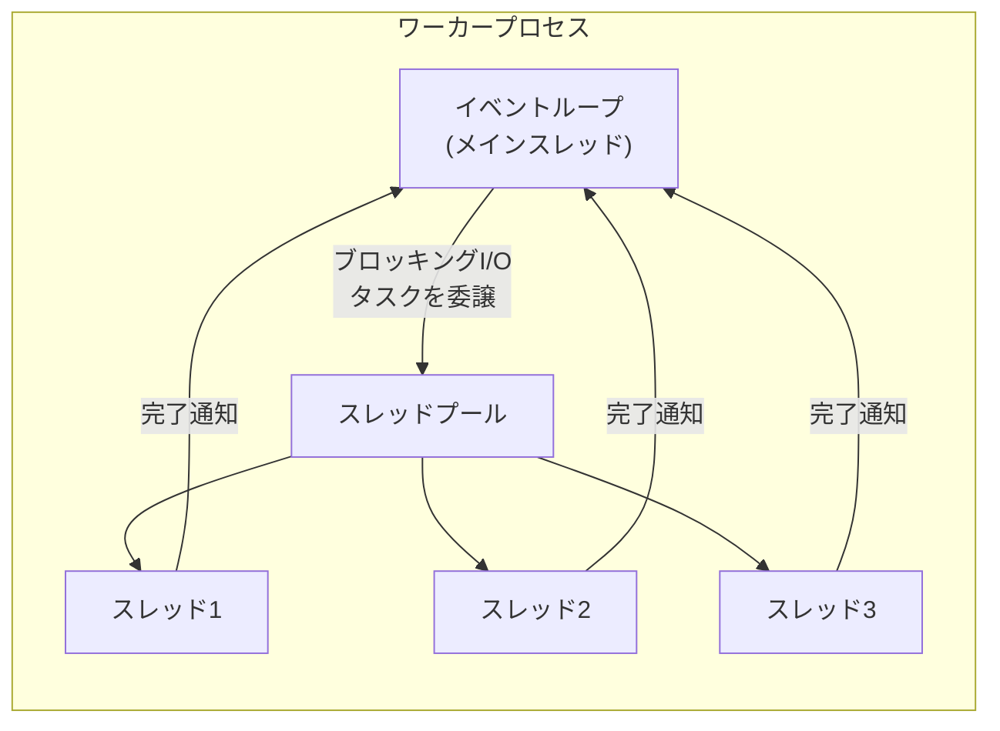

```nginx
# Enable thread pool for static file serving
aio threads;
# Custom thread pool definition
thread_pool default threads=32 max_queue=65536;
```

ディスクからの静的ファイルの読み込みや、`sendfile()` がブロックし得る大きなファイルの転送など、時間のかかるI/O操作をスレッドプールに委譲する。メインのイベントループはブロックされず、他のリクエストの処理を続行できる。

::: tip io_uring の登場
Linux 5.1 で導入された `io_uring` は、非同期I/Oの新たなインターフェースであり、ディスクI/Oを含むほぼすべてのシステムコールを非同期で実行できる。将来的にNginxがスレッドプールに代えて `io_uring` を全面的に採用する可能性がある。
:::

---

## 4. リクエスト処理パイプライン（フェーズ）

### 4.1 HTTPリクエスト処理の全体像

Nginxにおけるリクエスト処理は、固定された順序の**フェーズ（Phase）**を通過するパイプラインとして設計されている。このフェーズ構造がNginxのモジュールシステムの根幹をなす。

各フェーズにはモジュールが登録したハンドラが配置され、リクエストはこれらのハンドラを順次通過していく。あるハンドラが処理を完了（レスポンスを生成）すれば、残りのフェーズはスキップされる。

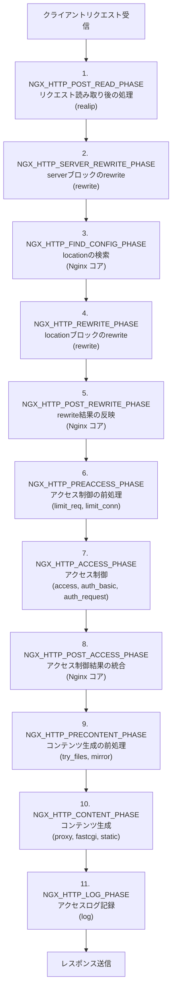

### 4.2 主要フェーズの詳細

**POST_READ_PHASE**: リクエストヘッダの読み取り直後に実行される。`ngx_http_realip_module` がここで動作し、プロキシの背後にある場合にクライアントの本当のIPアドレスを `X-Real-IP` や `X-Forwarded-For` ヘッダから復元する。

**SERVER_REWRITE_PHASE / REWRITE_PHASE**: `rewrite` ディレクティブによるURIの書き換えが行われる。`server` ブロック内と `location` ブロック内のrewriteがそれぞれ別フェーズで処理される。rewriteの結果、locationの再検索が必要になった場合は `POST_REWRITE_PHASE` からlocationの検索をやり直す（最大10回のループ制限あり）。

**FIND_CONFIG_PHASE**: リクエストURIに基づいて最適な `location` ブロックを選択する。このフェーズはNginxコアが処理し、外部モジュールは登録できない。locationのマッチングルールは後述する。

**PREACCESS_PHASE**: アクセス制御の前処理を行う。`limit_req`（リクエストレート制限）や `limit_conn`（同時接続数制限）がここで動作する。

**ACCESS_PHASE**: IPアドレスベースのアクセス制御（`allow` / `deny`）、Basic認証（`auth_basic`）、サブリクエストによる認証（`auth_request`）が行われる。`satisfy` ディレクティブにより、複数の認証モジュールの結果をAND（すべて許可）またはOR（いずれか許可）で統合できる。

**CONTENT_PHASE**: 実際のレスポンスを生成するフェーズ。リバースプロキシ（`proxy_pass`）、FastCGI転送（`fastcgi_pass`）、静的ファイル配信などがここで動作する。

**LOG_PHASE**: レスポンスの送信後にアクセスログを記録する。

### 4.3 Location のマッチングルール

`FIND_CONFIG_PHASE` で行われるlocationのマッチングは、Nginxの設定で最も重要かつ混乱しやすい仕組みの一つである。

```nginx
# Exact match (highest priority)
location = /api/health {
    return 200 "OK";
}

# Preferential prefix match (stops further regex search)
location ^~ /static/ {
    root /var/www;
}

# Regular expression match (case-sensitive, evaluated in order)
location ~ \.php$ {
    fastcgi_pass unix:/run/php/php-fpm.sock;
}

# Regular expression match (case-insensitive)
location ~* \.(jpg|jpeg|png|gif)$ {
    expires 30d;
}

# Prefix match (lowest priority)
location /api/ {
    proxy_pass http://backend;
}

# Default fallback
location / {
    root /var/www/html;
}
```

マッチングの優先順位は以下の通りである。

| 優先度 | 修飾子 | 名称 | マッチング方法 |
|---|---|---|---|
| 1（最高） | `=` | 完全一致 | URIが完全に一致した場合のみ |
| 2 | `^~` | 優先プレフィックス | 前方一致。一致したら正規表現を評価しない |
| 3 | `~` / `~*` | 正規表現 | 設定ファイルでの出現順に評価。最初の一致を採用 |
| 4（最低） | なし | プレフィックス | 前方一致。最も長く一致したものを候補とする |

### 4.4 フィルターチェーン

CONTENT_PHASEでレスポンスが生成された後、そのレスポンスは**フィルターチェーン**を通過する。フィルターはレスポンスのヘッダやボディを加工する処理であり、連結リスト状に構成される。

```
レスポンス生成
    → ヘッダフィルター1 (gzip)
    → ヘッダフィルター2 (headers)
    → ヘッダフィルター3 (not_modified)
    → ボディフィルター1 (gzip: 圧縮)
    → ボディフィルター2 (chunked: チャンク転送エンコーディング)
    → ボディフィルター3 (write: 実際のネットワーク書き込み)
```

主要なフィルターモジュールには以下がある。

- **gzip フィルター**: レスポンスボディをgzip圧縮する
- **headers フィルター**: `add_header` や `expires` で指定したHTTPヘッダを追加する
- **sub フィルター**: レスポンスボディ内の文字列置換を行う（`sub_filter`）
- **image フィルター**: 画像のリサイズやフォーマット変換を行う

---

## 5. 設定解析と動的リロード

### 5.1 設定ファイルの構造

Nginxの設定ファイルは、独自の宣言的言語で記述される。C言語のような構造を持つが、実際にはカスタムパーサーで解析される。

```nginx
# Main context: global settings
user nginx;
worker_processes auto;
error_log /var/log/nginx/error.log warn;
pid /run/nginx.pid;

# Events context: connection handling
events {
    worker_connections 4096;
    use epoll;
    multi_accept on;
}

# HTTP context: HTTP server settings
http {
    include /etc/nginx/mime.types;
    default_type application/octet-stream;
    sendfile on;
    tcp_nopush on;
    keepalive_timeout 65;

    # Upstream block: backend server pool
    upstream backend {
        server 192.168.1.10:8080 weight=3;
        server 192.168.1.11:8080 weight=2;
        server 192.168.1.12:8080 backup;
    }

    # Server block: virtual host
    server {
        listen 80;
        server_name example.com;

        # Location block: URL-based routing
        location / {
            proxy_pass http://backend;
            proxy_set_header Host $host;
            proxy_set_header X-Real-IP $remote_addr;
        }

        location /static/ {
            root /var/www;
            expires 30d;
        }
    }
}
```

設定は以下の階層構造を持つ。

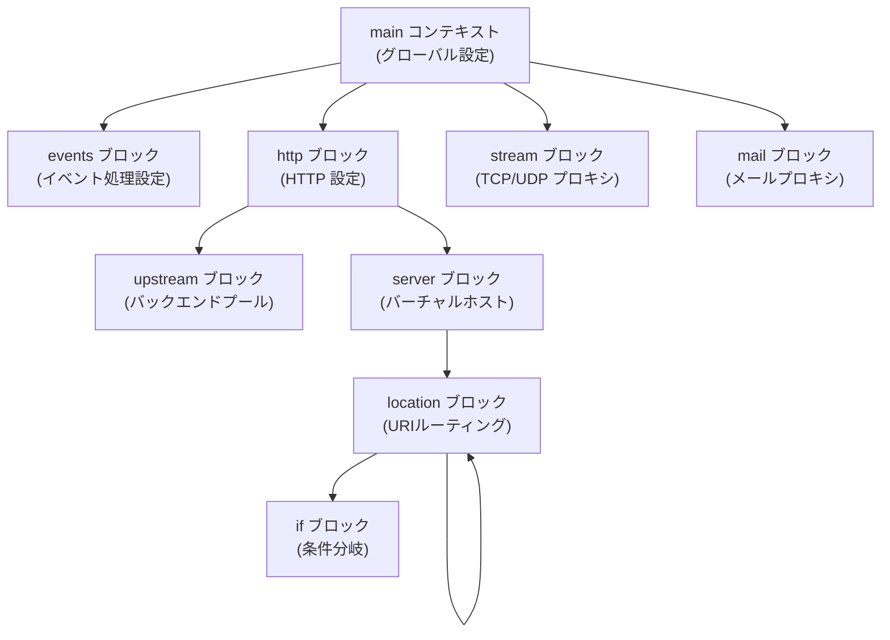

### 5.2 設定のパース処理

Nginxの設定パーサーは `ngx_conf_parse()` 関数を中心に構成されている。パースは以下の手順で行われる。

1. **字句解析（トークン化）**: 設定ファイルをトークン（ディレクティブ名、引数、ブロック開始/終了）に分解する
2. **構文解析**: トークン列を解釈し、各ディレクティブのハンドラ関数を呼び出す
3. **コンテキスト管理**: ブロックの入れ子構造に応じて適切なコンテキスト（main、http、server、location）を管理する
4. **マージ処理**: 親コンテキストの設定値を子コンテキストに継承（マージ）する

設定値のマージは、Nginxのモジュールシステムの重要な概念である。たとえば、`http` ブロックで設定した値は `server` ブロックに、`server` ブロックの値は `location` ブロックに継承される。子ブロックで明示的に設定された値は、親からの継承値を上書きする。

```nginx
http {
    # Inherited by all server/location blocks
    gzip on;
    gzip_min_length 1000;

    server {
        # Inherits gzip settings from http block
        server_name example.com;

        location /api/ {
            # Override: disable gzip for API responses
            gzip off;
        }

        location /static/ {
            # Inherits gzip on from http block
        }
    }
}
```

### 5.3 変数システム

Nginxの設定には強力な変数システムが組み込まれている。変数は `$` プレフィックスで参照され、リクエストのコンテキストに応じて動的に評価される。

主要な組み込み変数は以下の通りである。

| 変数 | 説明 |
|---|---|
| `$request_uri` | クエリ文字列を含む元のリクエストURI |
| `$uri` | 正規化後のリクエストURI（rewrite後） |
| `$args` | クエリ文字列 |
| `$host` | リクエストのHostヘッダ |
| `$remote_addr` | クライアントのIPアドレス |
| `$scheme` | リクエストスキーム（http または https） |
| `$request_method` | HTTPメソッド |
| `$upstream_response_time` | アップストリームの応答時間 |
| `$status` | レスポンスのステータスコード |

変数は**遅延評価**される。つまり、変数が実際に参照されるまでその値は計算されない。これにより、使われない変数のための不要な計算を回避できる。

### 5.4 グレースフルリロードの仕組み

Nginxの最も重要な運用機能の一つが、**無停止での設定リロード**（グレースフルリロード）である。この機能により、設定を変更してもクライアントのリクエストが中断されない。

`nginx -s reload`（または `kill -SIGHUP <master_pid>`）を実行すると、以下のプロセスが開始される。

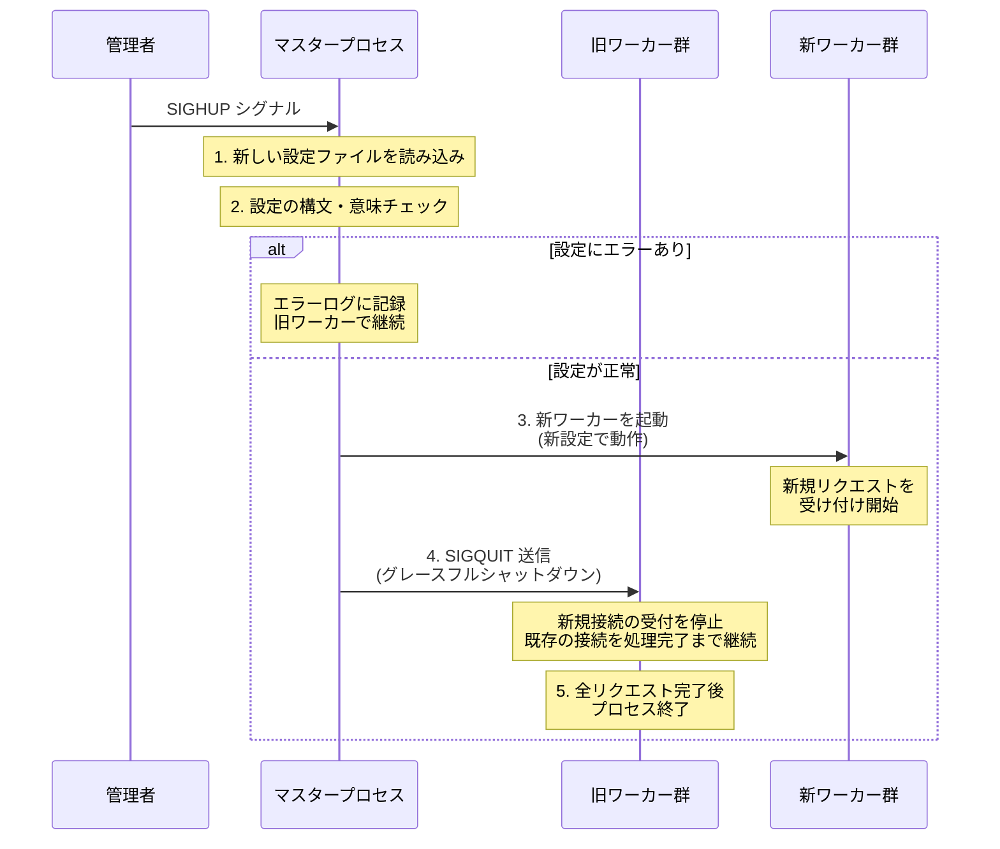

このプロセスにおける重要なポイントは以下の通りである。

1. **設定検証の先行実行**: 新しい設定がパースされ検証に通ってから初めて新ワーカーが起動される。設定にエラーがあっても旧ワーカーは影響を受けない
2. **新旧ワーカーの共存**: 一時的に新旧のワーカーが同時に存在する。リスニングソケットは `SO_REUSEPORT` を通じて新旧両方のワーカーで共有される
3. **既存接続の保証**: 旧ワーカーは新規接続の受け付けを停止するが、現在処理中のリクエストは最後まで完了する。WebSocketのようなlong-lived connectionも同様に扱われる
4. **タイムアウト**: 旧ワーカーが `worker_shutdown_timeout` で指定された時間内に終了しない場合は強制終了される

::: warning リロードのコスト
グレースフルリロードは無停止だが、コストがゼロではない。新ワーカー群の起動にはメモリと時間が必要であり、SSL/TLSセッションキャッシュやプロキシキャッシュのメタデータは新ワーカーで再構築される。頻繁なリロード（秒単位）は避けるべきである。
:::

### 5.5 バイナリアップグレード

設定リロードとは別に、Nginx自体の実行ファイルを更新する場合は**バイナリアップグレード**の手順が用意されている。

```bash
# 1. Build and install the new binary
# 2. Send SIGUSR2 to the running master process
kill -USR2 $(cat /run/nginx.pid)
# A new master starts with the new binary
# Old PID is saved to /run/nginx.pid.oldbin

# 3. Gracefully stop old workers
kill -WINCH $(cat /run/nginx.pid.oldbin)

# 4. Verify the new master works correctly
# 5. Stop the old master
kill -QUIT $(cat /run/nginx.pid.oldbin)
```

この手順では、旧マスタープロセスと新マスタープロセスが一時的に共存する。旧マスターはリスニングソケットを新マスターに引き継ぎ、自身はワーカーの終了を待って停止する。問題が発生した場合は旧マスターを復帰させることでロールバックが可能である。

---

## 6. ロードバランシングアルゴリズム

### 6.1 upstream ブロックとバックエンドの定義

Nginxのロードバランシングは `upstream` ブロックで定義されたバックエンドサーバー群に対して行われる。

```nginx
upstream backend_pool {
    # Load balancing method (default: round-robin)

    server 10.0.0.1:8080 weight=5 max_fails=3 fail_timeout=30s;
    server 10.0.0.2:8080 weight=3 max_fails=3 fail_timeout=30s;
    server 10.0.0.3:8080 weight=2 max_fails=3 fail_timeout=30s;
    server 10.0.0.4:8080 backup;         # standby server
    server 10.0.0.5:8080 down;           # temporarily disabled

    keepalive 32;  # persistent connections to upstream
}
```

各 `server` ディレクティブにはパラメータを付与できる。

| パラメータ | 説明 |
|---|---|
| `weight=N` | 重み。デフォルトは1。大きいほど多くリクエストが振られる |
| `max_fails=N` | この回数連続して失敗したらサーバーを一時的に除外 |
| `fail_timeout=T` | `max_fails` に達した後、このサーバーを除外する期間 |
| `backup` | 通常サーバーがすべてダウンした場合のみ使用 |
| `down` | サーバーを永続的にオフラインにする |
| `max_conns=N` | このサーバーへの同時接続数の上限 |

### 6.2 ラウンドロビン（デフォルト）

特にアルゴリズムを指定しない場合、Nginxは**加重ラウンドロビン**を使用する。各サーバーの `weight` に応じて順番にリクエストを振り分ける。

Nginxの実装は単純なラウンドロビンではなく、**Smooth Weighted Round-Robin（SWRR）** アルゴリズムを採用している。これにより、重みの偏りがあっても均等にリクエストが分散される。

たとえば、A(weight=5), B(weight=1), C(weight=1) の3サーバーがある場合、単純なラウンドロビンでは `AAAAA B C` のような連続的な偏りが生じる。SWRRでは `A B A C A A A` のように分散される。

```
SWRR の動作例 (A:5, B:1, C:1):

ラウンド | current_weight  | selected | 選択後の current_weight
   1    |  [5, 1, 1]      |    A     |  [5-7, 1, 1] = [-2, 1, 1]
   2    |  [3, 2, 2]      |    A     |  [3-7, 2, 2] = [-4, 2, 2]
   3    |  [1, 3, 3]      |    B     |  [1, 3-7, 3] = [1, -4, 3]
   4    |  [6, -3, 4]     |    A     |  [6-7,-3, 4] = [-1, -3, 4]
   5    |  [4, -2, 5]     |    C     |  [4,-2, 5-7] = [4, -2, -2]
   6    |  [9, -1, -1]    |    A     |  [9-7,-1,-1] = [2, -1, -1]
   7    |  [7, 0, 0]      |    A     |  [7-7, 0, 0] = [0, 0, 0]

結果: A, A, B, A, C, A, A → 均等に分散
```

### 6.3 IP Hash

```nginx
upstream backend_pool {
    ip_hash;
    server 10.0.0.1:8080;
    server 10.0.0.2:8080;
    server 10.0.0.3:8080;
}
```

クライアントのIPアドレスのハッシュ値に基づいてサーバーを選択する。同じIPアドレスからのリクエストは常に同じサーバーに送られるため、**セッションの永続化**（スティッキーセッション）が実現できる。

IPv4の場合は上位3オクテット（/24のネットワーク部）をハッシュキーとして使用する。これは同一サブネットのクライアントを同じサーバーに集約するためである。

::: warning ip_hash の制約
`ip_hash` はNATの背後にいる大量のクライアントが同一IPアドレスに見える場合、特定のサーバーに負荷が集中するリスクがある。CDNやプロキシ経由のアクセスでも同様の問題が生じる。こうした場合は後述の `hash` ディレクティブでCookieやヘッダの値をキーにする方が適切である。
:::

### 6.4 Least Connections

```nginx
upstream backend_pool {
    least_conn;
    server 10.0.0.1:8080 weight=3;
    server 10.0.0.2:8080 weight=1;
}
```

現在のアクティブ接続数が最も少ないサーバーにリクエストを振り分ける。重み付きの場合は `接続数 / weight` が最小のサーバーが選ばれる。

処理時間が均一でないリクエスト（たとえばAPIの処理時間がエンドポイントごとに大きく異なる場合）に適している。長時間かかるリクエストを処理しているサーバーへの追加のリクエスト送信を抑制し、結果として全体のレイテンシが改善される。

### 6.5 Generic Hash

```nginx
upstream backend_pool {
    # Hash based on request URI (consistent hashing)
    hash $request_uri consistent;
    server 10.0.0.1:8080;
    server 10.0.0.2:8080;
    server 10.0.0.3:8080;
}
```

任意の変数の組み合わせをハッシュキーとして使用できる、最も汎用的なアルゴリズムである。`consistent` パラメータを付けると**コンシステントハッシュ**が有効になる。

コンシステントハッシュでは、サーバーの追加・削除時に再マッピングされるキーの割合を最小化できる。通常のハッシュでは1台の追加・削除で大部分のマッピングが変わってしまうが、コンシステントハッシュでは影響を受けるのは隣接するノード分のキーのみである。これはキャッシュサーバーとして使用する場合に特に重要である。

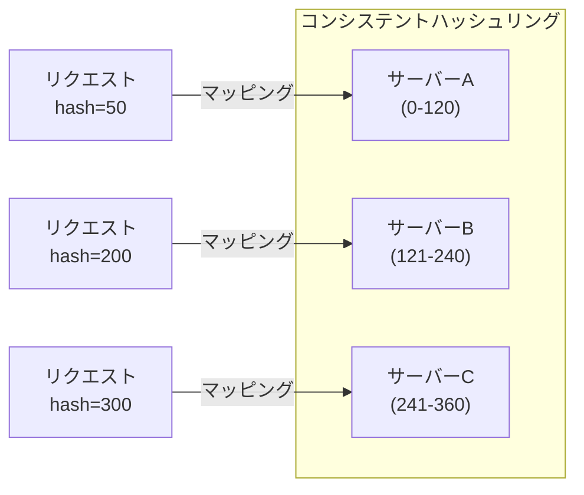

### 6.6 Random with Two Choices

```nginx
upstream backend_pool {
    random two least_conn;
    server 10.0.0.1:8080;
    server 10.0.0.2:8080;
    server 10.0.0.3:8080;
}
```

**Power of Two Random Choices** として知られるアルゴリズムの実装である。2つのサーバーをランダムに選び、指定された基準（`least_conn`、`least_time` など）でより良い方を選択する。

このアルゴリズムの利点は、完全なランダムよりも遥かに負荷分散が均等になりながら、`least_conn` のように全サーバーの状態を同期する必要がないことである。分散環境（複数のNginxインスタンスが同じバックエンドプールを参照する場合）で特に有効である。

### 6.7 ヘルスチェック

Nginx（オープンソース版）はパッシブヘルスチェックをサポートしている。バックエンドとの通信が `max_fails` で指定された回数連続して失敗すると、そのサーバーを `fail_timeout` の間ルーティング対象から除外する。

```nginx
upstream backend_pool {
    server 10.0.0.1:8080 max_fails=3 fail_timeout=30s;
    server 10.0.0.2:8080 max_fails=3 fail_timeout=30s;

    # Define what constitutes a "failure"
    proxy_next_upstream error timeout http_500 http_502 http_503;
}
```

::: tip NGINX Plus のアクティブヘルスチェック
NGINX Plus（商用版）では、定期的にバックエンドにヘルスチェックリクエストを送信する**アクティブヘルスチェック**が利用できる。オープンソース版でこの機能が必要な場合は、`ngx_http_upstream_check_module`（サードパーティモジュール）やOpenRestyの `lua-resty-upstream-healthcheck` を使用する方法がある。
:::

---

## 7. キャッシュ機能

### 7.1 プロキシキャッシュの仕組み

Nginxはリバースプロキシとして動作する際、アップストリームからのレスポンスをローカルディスクにキャッシュし、同一リクエストが再度来た場合にアップストリームへの転送をスキップしてキャッシュから直接応答できる。

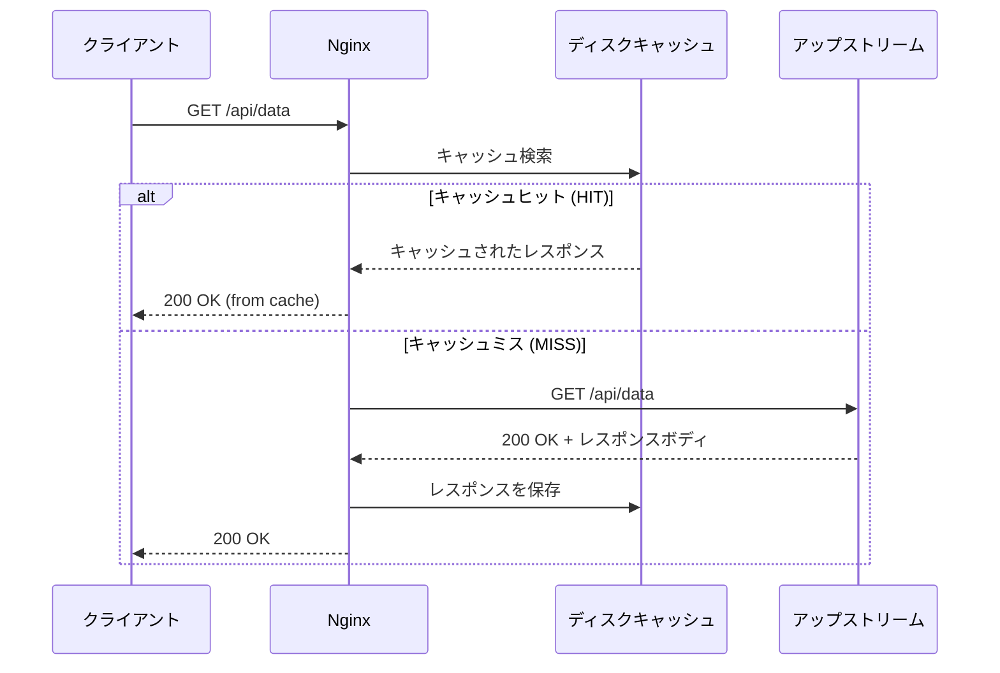

### 7.2 キャッシュの設定

```nginx
# Define cache storage in http block
http {
    # path: disk location
    # levels: subdirectory structure (1:2 = 1 char + 2 char dirs)
    # keys_zone: shared memory zone name and size for metadata
    # max_size: maximum disk usage
    # inactive: remove cached items not accessed within this period
    proxy_cache_path /var/cache/nginx/proxy
        levels=1:2
        keys_zone=proxy_cache:10m
        max_size=10g
        inactive=60m
        use_temp_path=off;

    server {
        location /api/ {
            proxy_pass http://backend;
            proxy_cache proxy_cache;

            # Cache successful responses for 10 minutes
            proxy_cache_valid 200 10m;
            # Cache 404 responses for 1 minute
            proxy_cache_valid 404 1m;
            # Cache any other status for 5 minutes
            proxy_cache_valid any 5m;

            # Cache key definition
            proxy_cache_key "$scheme$request_method$host$request_uri";

            # Add header to indicate cache status
            add_header X-Cache-Status $upstream_cache_status;

            # Serve stale content while revalidating
            proxy_cache_use_stale error timeout updating
                                  http_500 http_502 http_503 http_504;

            # Only one request populates the cache (prevents thundering herd)
            proxy_cache_lock on;
            proxy_cache_lock_timeout 5s;
        }
    }
}
```

### 7.3 キャッシュのストレージ構造

キャッシュされたレスポンスはディスク上にファイルとして保存される。`levels=1:2` の場合、キャッシュキーのMD5ハッシュに基づくディレクトリ構造が構築される。

```
/var/cache/nginx/proxy/
├── a/
│   ├── 3b/
│   │   └── f1d2e3a4b5c6d7e8f9a0b1c2d3e4f53b  # cached response
│   └── 7c/
│       └── a1b2c3d4e5f6a7b8c9d0e1f2a3b4c57c
├── b/
│   └── 1a/
│       └── ...
```

キャッシュファイルの内容は、レスポンスヘッダとボディがそのままバイナリ形式で保存されている。ヘッダ部分にはキャッシュキー、有効期限、アップストリームの情報などのメタデータが含まれる。

メタデータ（キー、有効期限、ファイルパス）は**共有メモリ上の赤黒木**で管理されており、全ワーカープロセスが高速に参照できる。`keys_zone=proxy_cache:10m` の `10m` は、このメタデータ用の共有メモリサイズを指定している。1MBあたり約8000エントリを格納できる。

### 7.4 キャッシュの高度な制御

**条件付きキャッシュバイパス**:

```nginx
# Do not use cache when bypass conditions are met
map $cookie_nocache $bypass_cache {
    "true" 1;
    default 0;
}

location /api/ {
    proxy_cache proxy_cache;
    # Skip cache when $bypass_cache is non-zero
    proxy_cache_bypass $bypass_cache;
    # Do not store response in cache when $bypass_cache is non-zero
    proxy_no_cache $bypass_cache;
}
```

**Stale-While-Revalidate パターン**:

```nginx
location /api/ {
    proxy_cache proxy_cache;
    proxy_cache_valid 200 60s;

    # Serve stale content while fetching fresh content in background
    proxy_cache_use_stale updating;
    proxy_cache_background_update on;

    # Stale content is usable for up to 1 hour
    proxy_cache_valid 200 1h;
}
```

このパターンでは、キャッシュが期限切れになっても、バックグラウンドで新しいレスポンスを取得している間は古いキャッシュを返す。クライアントは常に即座にレスポンスを受け取れるため、ユーザー体験が向上する。

**サンダリングハード（Thundering Herd）問題の回避**:

人気のあるコンテンツのキャッシュが期限切れになると、大量のリクエストが同時にアップストリームに殺到する（サンダリングハード問題）。`proxy_cache_lock on` を設定すると、キャッシュミス時に1つのリクエストだけがアップストリームに転送され、他のリクエストはそのレスポンスがキャッシュされるまで待機する。

---

## 8. OpenResty と Lua 拡張

### 8.1 Nginxモジュールの限界

Nginxはモジュール方式で機能を拡張できるが、C言語でモジュールを開発するのは容易ではない。Nginxの内部APIへの深い理解が必要であり、開発サイクルが長くなる。加えて、新しいモジュールを追加するにはNginxの再コンパイルが必要である。

この問題を解決するために登場したのが **OpenResty** と `lua-nginx-module` である。

### 8.2 OpenResty の概要

OpenRestyは、Nginx にLuaJIT（Just-In-Time コンパイラ付きLua実行環境）を組み込んだディストリビューションである。中国のエンジニア **章亦春（Yichun Zhang）** が2009年に開発を開始した。

OpenRestyの設計思想は「NginxをWebアプリケーションサーバーに変える」ことにある。Nginxのイベント駆動アーキテクチャの上にLuaのコルーチンを載せることで、**ノンブロッキングI/Oを同期的なコードスタイルで記述**できる。

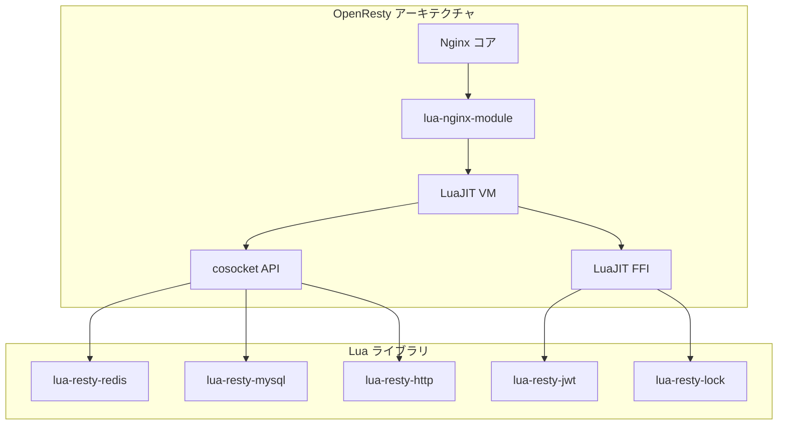

### 8.3 Lua ディレクティブとリクエストフェーズ

OpenRestyは、Nginxのリクエスト処理フェーズの各段階にLuaコードを挿入できる。

| ディレクティブ | 実行タイミング | 主な用途 |
|---|---|---|
| `init_by_lua_block` | マスター起動時 | グローバル初期化、Luaモジュール読み込み |
| `init_worker_by_lua_block` | ワーカー起動時 | タイマー設定、共有データ初期化 |
| `ssl_certificate_by_lua_block` | SSL/TLSハンドシェイク時 | 動的証明書選択 |
| `set_by_lua_block` | rewriteフェーズ | Nginx変数の動的設定 |
| `rewrite_by_lua_block` | rewriteフェーズ | URLの書き換え、リダイレクト |
| `access_by_lua_block` | accessフェーズ | 認証・認可 |
| `content_by_lua_block` | contentフェーズ | レスポンス生成 |
| `header_filter_by_lua_block` | ヘッダフィルター | レスポンスヘッダの加工 |
| `body_filter_by_lua_block` | ボディフィルター | レスポンスボディの加工 |
| `log_by_lua_block` | logフェーズ | カスタムログ処理 |
| `balancer_by_lua_block` | upstreamフェーズ | 動的ロードバランシング |

### 8.4 実践的な使用例

**動的なレート制限の実装**:

```nginx
http {
    # Shared memory for rate limiting counters
    lua_shared_dict rate_limit 10m;

    server {
        location /api/ {
            access_by_lua_block {
                local limit = require "resty.limit.req"

                -- Create limiter: 100 requests/sec, burst of 50
                local lim, err = limit.new("rate_limit", 100, 50)
                if not lim then
                    ngx.log(ngx.ERR, "failed to create limiter: ", err)
                    return ngx.exit(500)
                end

                -- Use API key as the rate limiting key
                local key = ngx.var.http_x_api_key or ngx.var.remote_addr
                local delay, err = lim:incoming(key, true)

                if not delay then
                    if err == "rejected" then
                        ngx.header["Retry-After"] = "1"
                        return ngx.exit(429)
                    end
                    ngx.log(ngx.ERR, "limit error: ", err)
                    return ngx.exit(500)
                end

                -- If delay > 0, the request is within burst range
                if delay > 0 then
                    ngx.sleep(delay)
                end
            }

            proxy_pass http://backend;
        }
    }
}
```

**JWTベースの認証ゲートウェイ**:

```nginx
server {
    location /api/ {
        access_by_lua_block {
            local jwt = require "resty.jwt"

            -- Extract token from Authorization header
            local auth_header = ngx.var.http_authorization
            if not auth_header then
                ngx.status = 401
                ngx.say('{"error": "missing authorization header"}')
                return ngx.exit(401)
            end

            local token = auth_header:match("Bearer%s+(.+)")
            if not token then
                return ngx.exit(401)
            end

            -- Verify the JWT
            local jwt_obj = jwt:verify("my-secret-key", token)
            if not jwt_obj.verified then
                ngx.status = 403
                ngx.say('{"error": "invalid token"}')
                return ngx.exit(403)
            end

            -- Pass claims to upstream via headers
            ngx.req.set_header("X-User-ID", jwt_obj.payload.sub)
            ngx.req.set_header("X-User-Role", jwt_obj.payload.role)
        }

        proxy_pass http://backend;
    }
}
```

**cosocket によるノンブロッキングRedisアクセス**:

```nginx
location /user {
    content_by_lua_block {
        local redis = require "resty.redis"
        local red = redis:new()
        red:set_timeout(1000)  -- 1 second

        -- Non-blocking connect (uses cosocket internally)
        local ok, err = red:connect("127.0.0.1", 6379)
        if not ok then
            ngx.log(ngx.ERR, "Redis connect failed: ", err)
            return ngx.exit(500)
        end

        local user_id = ngx.var.arg_id
        local user_data, err = red:get("user:" .. user_id)
        if user_data == ngx.null then
            ngx.status = 404
            ngx.say('{"error": "user not found"}')
            return
        end

        -- Return connection to the connection pool
        red:set_keepalive(10000, 100)

        ngx.header.content_type = "application/json"
        ngx.say(user_data)
    }
}
```

### 8.5 cosocket とコルーチン

OpenRestyの最も革新的な部分は **cosocket**（coroutine socket）である。cosocketはNginxのイベント駆動I/Oの上にLuaのコルーチンを組み合わせ、ノンブロッキングI/Oを同期的なコードで記述できるようにする。

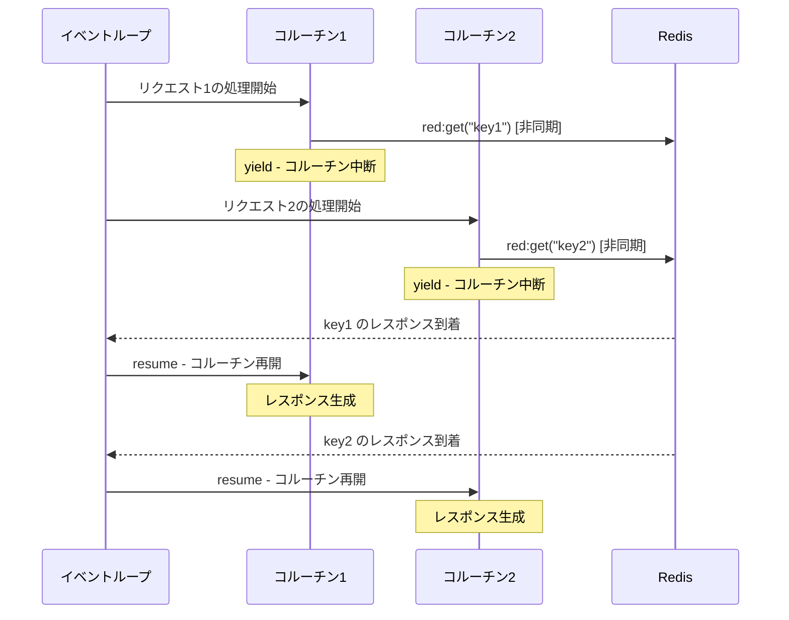

内部的には、cosocketの `connect()` や `send()` / `receive()` は即座にコルーチンを `yield` する。Nginxのイベントループがネットワークイベントを検出すると、対応するコルーチンを `resume` して処理を再開する。開発者はコールバック地獄を書く必要がなく、直線的なコードでノンブロッキングI/Oを実現できる。

### 8.6 lua_shared_dict と共有メモリ

OpenRestyは `lua_shared_dict` を通じて、ワーカープロセス間で安全にデータを共有する仕組みを提供する。

```nginx
http {
    # Allocate 10MB of shared memory
    lua_shared_dict my_cache 10m;

    server {
        location /cached {
            content_by_lua_block {
                local cache = ngx.shared.my_cache
                local key = ngx.var.request_uri

                -- Try to get cached value
                local value, flags = cache:get(key)
                if value then
                    ngx.say(value)
                    return
                end

                -- Cache miss: fetch from upstream and store
                local res = ngx.location.capture("/backend" .. key)
                if res.status == 200 then
                    -- Store with 60-second TTL
                    cache:set(key, res.body, 60)
                    ngx.say(res.body)
                else
                    ngx.exit(res.status)
                end
            }
        }
    }
}
```

`lua_shared_dict` はNginxの共有メモリスラブアロケータ上に構築されており、以下の特徴を持つ。

- 全ワーカープロセスから読み書き可能
- アトミックな操作（`incr`、`add`、`safe_add`）をサポート
- LRU（Least Recently Used）エビクションにより、メモリが満杯になると最も古いエントリが自動削除される
- ロックフリーの設計で高い並行性を実現

---

## 9. 現代のNginx — 運用の実際と将来展望

### 9.1 本番環境のチューニング

本番環境でのNginxのチューニングは、OSカーネルパラメータとNginx自体の設定の両面から行う。

**OSカーネルパラメータ**:

```bash
# /etc/sysctl.conf

# Maximum number of file descriptors per process
fs.file-max = 1000000

# TCP connection backlog
net.core.somaxconn = 65535

# Reuse TIME_WAIT sockets for new connections
net.ipv4.tcp_tw_reuse = 1

# Enable TCP Fast Open
net.ipv4.tcp_fastopen = 3

# Increase TCP buffer sizes
net.core.rmem_max = 16777216
net.core.wmem_max = 16777216
net.ipv4.tcp_rmem = 4096 87380 16777216
net.ipv4.tcp_wmem = 4096 65536 16777216
```

**Nginx 設定**:

```nginx
worker_processes auto;
worker_cpu_affinity auto;
worker_rlimit_nofile 65535;

events {
    worker_connections 16384;
    use epoll;
    multi_accept on;
}

http {
    sendfile on;
    tcp_nopush on;
    tcp_nodelay on;
    keepalive_timeout 65;
    keepalive_requests 1000;

    # Buffer settings for upstream responses
    proxy_buffering on;
    proxy_buffer_size 4k;
    proxy_buffers 8 16k;
    proxy_busy_buffers_size 32k;

    # Gzip compression
    gzip on;
    gzip_comp_level 5;
    gzip_min_length 256;
    gzip_types text/plain text/css application/json application/javascript
               text/xml application/xml application/xml+rss text/javascript;

    # Open file cache
    open_file_cache max=10000 inactive=60s;
    open_file_cache_valid 30s;
    open_file_cache_min_uses 2;
}
```

::: details sendfile, tcp_nopush, tcp_nodelay の関係
`sendfile` はカーネル空間内でファイルデータをソケットに直接転送し、ユーザースペースへのコピーを回避する。`tcp_nopush`（`TCP_CORK`）は完全なTCPセグメントが形成されるまでデータの送信を遅延させ、小さなパケットの送信を防ぐ。`tcp_nodelay`（Nagleアルゴリズムの無効化）は小さなパケットも即座に送信する。一見矛盾するが、Nginxはレスポンスの最後のチャンクを送る際に `tcp_nopush` を解除して `tcp_nodelay` を有効にし、最後のデータを即座に送信する。この組み合わせにより、大きなレスポンスはフルサイズのパケットで効率良く送信されつつ、最後のデータは遅延なく送信される。
:::

### 9.2 可観測性

Nginxの運用には適切な可観測性が不可欠である。

**アクセスログのカスタマイズ**:

```nginx
# Structured JSON log format
log_format json_log escape=json
    '{"time": "$time_iso8601", '
     '"remote_addr": "$remote_addr", '
     '"request": "$request", '
     '"status": $status, '
     '"body_bytes_sent": $body_bytes_sent, '
     '"request_time": $request_time, '
     '"upstream_response_time": "$upstream_response_time", '
     '"upstream_addr": "$upstream_addr", '
     '"http_user_agent": "$http_user_agent", '
     '"cache_status": "$upstream_cache_status"}';

access_log /var/log/nginx/access.log json_log;
```

**stub_status による基本メトリクス**:

```nginx
# Expose basic metrics (restrict access appropriately)
server {
    listen 8080;
    location /nginx_status {
        stub_status;
        allow 127.0.0.1;
        deny all;
    }
}
```

このエンドポイントは以下の情報を返す。

```
Active connections: 291
server accepts handled requests
 16630948 16630948 31070465
Reading: 6 Writing: 179 Waiting: 106
```

これらのメトリクスをPrometheus exporterで収集し、Grafanaでダッシュボードを構築するのが一般的なモニタリングパターンである。

### 9.3 Nginx と競合ソフトウェアの比較

| 項目 | Nginx | Envoy | HAProxy | Caddy |
|---|---|---|---|---|
| 言語 | C | C++ | C | Go |
| アーキテクチャ | master-worker | シングルプロセスマルチスレッド | シングルプロセスイベント駆動 | シングルプロセスgoroutine |
| 設定変更 | リロード（新旧ワーカー交代） | xDS APIで動的更新 | リロード | 自動リロード |
| L7プロトコル | HTTP/1.1, HTTP/2, gRPC, WebSocket | HTTP/1.1, HTTP/2, HTTP/3, gRPC | HTTP/1.1, HTTP/2 | HTTP/1.1, HTTP/2, HTTP/3 |
| サービスメッシュ | 非標準 | Istio標準 | 非標準 | 非標準 |
| TLS自動化 | 手動/スクリプト | 外部連携 | 手動 | Let's Encrypt自動 |
| 拡張性 | Cモジュール / Lua (OpenResty) | C++フィルター / Wasm | Lua / SPOE | Go プラグイン |

### 9.4 Nginx の将来と課題

Nginxは20年以上にわたってWebインフラの基盤として機能してきたが、いくつかの課題と将来の方向性がある。

**設定の動的性**: Envoyがgolang APIで設定を動的に更新できるのに対し、Nginxはファイルベースの設定とリロードが基本である。NGINX Plusはpartial configurationの動的更新をサポートするが、オープンソース版では制限がある。OpenRestyによるLuaスクリプティングがこのギャップを部分的に埋めている。

**HTTP/3 と QUIC**: NginxはHTTP/3（QUIC）のサポートを進めているが、QUICはUDPベースのプロトコルであり、TCPを前提としたNginxのイベント駆動モデルとの統合には設計上の調整が必要だった。

**freenginx のフォーク**: 2024年、Igor Sysoevの退任とF5の方針変更を受け、長年のNginxコア開発者であるMaxim Dounin がfreenginxプロジェクトを立ち上げた。これはNginxの開発コミュニティの分裂を示すイベントであり、今後のオープンソースNginxのガバナンスに影響を及ぼす可能性がある。

**WebAssembly（Wasm）拡張**: Envoyが先行してWasmベースのプラグインシステムを導入した。NginxでもWasmランタイムを組み込む試みがあり（ngx_wasm_module など）、Lua以外の言語でプラグインを書ける将来が見えている。

---

## 10. まとめ

Nginxのアーキテクチャは、C10K問題という明確な技術課題に対する回答として設計された。その中核をなすのは以下の3つの要素である。

1. **Master-Worker プロセスモデル**: 特権操作と実際のリクエスト処理を分離し、マスターがワーカーのライフサイクルを管理する。ワーカーはシングルスレッドで動作し、マルチスレッドに伴う複雑さを排除する

2. **イベント駆動I/O**: `epoll` を中核としたノンブロッキングI/Oにより、1つのワーカープロセスで数千の同時接続を処理する。接続ごとにスレッドを割り当てる必要がなく、メモリ効率とスケーラビリティに優れる

3. **フェーズベースのパイプライン**: リクエスト処理を11のフェーズに分割し、各フェーズにモジュールを挿入できる設計により、高い拡張性を実現する。フィルターチェーンによるレスポンスの加工もこの延長線上にある

グレースフルリロードによる無停止の設定変更、コンシステントハッシュを含む多彩なロードバランシングアルゴリズム、高度なプロキシキャッシュ機能、そしてOpenResty/Luaによるプログラマブルな拡張性——これらの機能が組み合わさることで、Nginxは単なるWebサーバーを超え、現代のWebインフラにおける多機能なミドルウェアプラットフォームとして機能している。

Nginxの設計判断は、Webサーバーだけでなく、Node.js、Go、Rust のネットワークランタイムなど、後続の多くのソフトウェアに影響を与えた。イベント駆動・ノンブロッキングI/Oというパラダイムは、もはやWebサーバー固有のものではなく、高並行ネットワークアプリケーション設計の基本原則として広く定着している。
