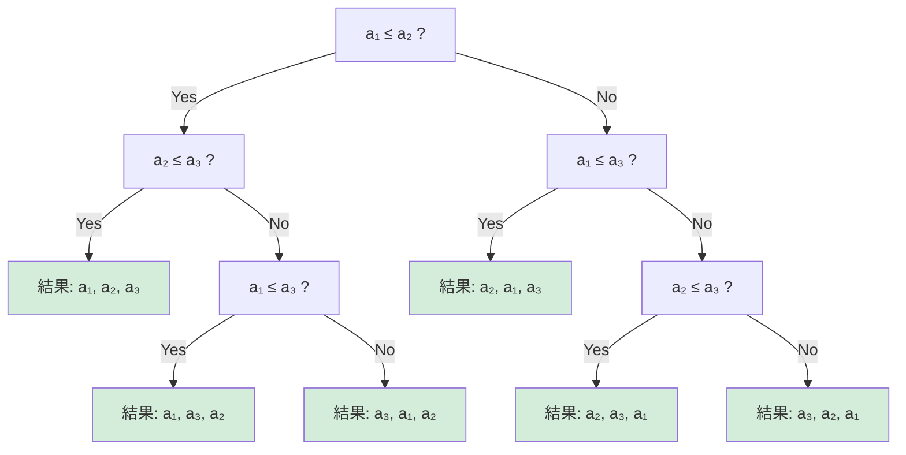
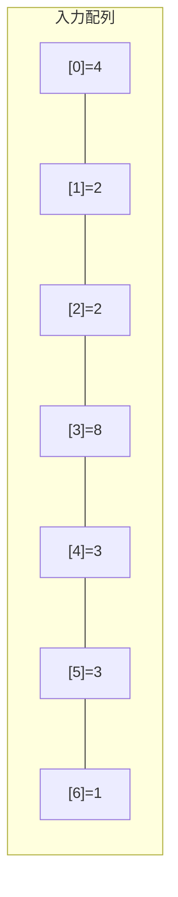
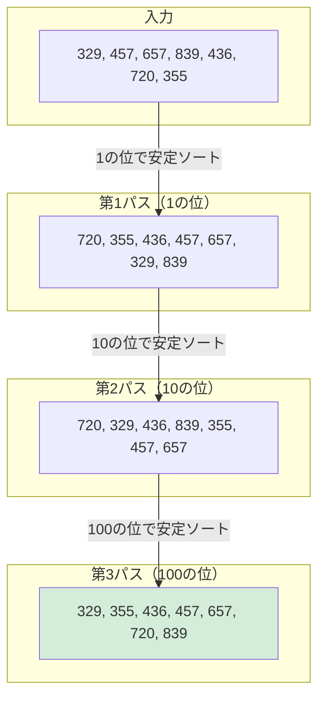
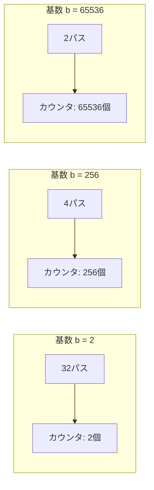
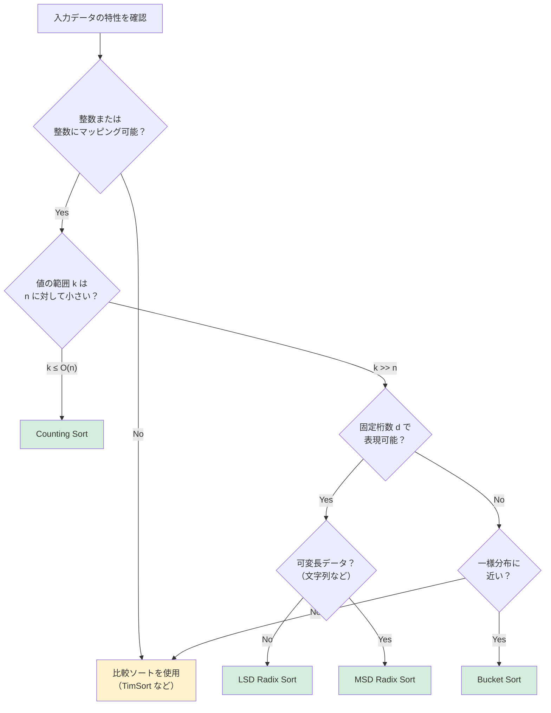
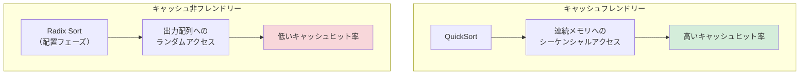

# 非比較ソート（Radix Sort, Counting Sort）

## 1. 比較ソートの限界と非比較ソートの動機

### 1.1 比較ソートの下界 $\Omega(n \log n)$

ソートアルゴリズムは大きく**比較ソート（comparison-based sort）**と**非比較ソート（non-comparison sort）**に分類される。比較ソートとは、要素間の大小関係を比較する操作のみでソートを行うアルゴリズムの総称であり、QuickSort、MergeSort、HeapSort、TimSort などが該当する。

比較ソートの理論的な限界は、**決定木モデル（decision tree model）**によって厳密に証明されている。$n$ 個の要素を比較のみでソートするアルゴリズムの実行過程は、二分決定木として表現できる。各内部ノードは2要素の比較を表し、各葉ノードは入力の順列に対応する。$n$ 個の要素の順列は $n!$ 通りあり、正しいソートアルゴリズムはこれらすべてを区別する必要がある。高さ $h$ の二分木の葉の最大数は $2^h$ であるから、

$$
2^h \ge n!
$$

が成立しなければならない。両辺の対数をとると、

$$
h \ge \log_2(n!)
$$

Stirling の近似 $n! \approx \sqrt{2\pi n}(n/e)^n$ を用いると、

$$
\log_2(n!) = n \log_2 n - n \log_2 e + O(\log n) = \Theta(n \log n)
$$

となる。つまり、**比較ソートは最悪の場合 $\Omega(n \log n)$ 回の比較を必要とする**。これはアルゴリズムの巧妙さに依存しない、本質的な下界である。



上図は $n=3$ の場合の決定木である。3つの要素のソートには $3! = 6$ 通りの葉が必要であり、木の高さは最低 $\lceil\log_2 6\rceil = 3$ となる。

### 1.2 $\Omega(n \log n)$ を破る方法

比較ソートの下界は「比較のみを使う」という前提のもとで成り立つ。言い換えれば、**要素の値そのものに直接アクセスし、値の構造や分布を利用する**ことで、この下界を迂回できる。これが非比較ソートの基本的な発想である。

非比較ソートが成り立つための条件は次の通りである。

1. **要素が整数、あるいは有限のアルファベットで構成される**: 値の構造（桁、範囲）を直接利用するため、任意の順序集合に対しては適用できない。
2. **値の範囲が既知である、あるいは制限されている**: 値の範囲 $k$ が $n$ に対して大きすぎる場合、非比較ソートの利点は失われる。

代表的な非比較ソートアルゴリズムには以下のものがある。

| アルゴリズム | 時間計算量 | 空間計算量 | 安定性 | 適用条件 |
|---|---|---|---|---|
| Counting Sort | $O(n + k)$ | $O(n + k)$ | 安定 | 整数、範囲 $k$ が小さい |
| Radix Sort | $O(d(n + k))$ | $O(n + k)$ | 安定 | 固定長の桁で表現可能 |
| Bucket Sort | $O(n + k)$（平均） | $O(n + k)$ | 安定（実装依存） | 一様分布 |

ここで $n$ は要素数、$k$ は値の範囲（またはバケット数）、$d$ は桁数である。

### 1.3 歴史的背景

非比較ソートの歴史は古い。Radix Sort の原型はパンチカードの時代にまで遡る。1887年、Herman Hollerith はアメリカ合衆国の国勢調査を処理するために、パンチカードソーターを設計した。このソーターは、カードの各列（桁）を順にソートする仕組みであり、LSD（Least Significant Digit）Radix Sort の物理的な実装そのものである。

Counting Sort は1954年に Harold H. Seward が MIT の修士論文で提案した。この手法は、Radix Sort の安定なサブルーチンとして使われることで、Radix Sort の実用性を飛躍的に高めた。

## 2. Counting Sort

### 2.1 基本的な考え方

Counting Sort は、**各値の出現回数を数え上げ、その累積度数をもとに各要素の最終位置を決定する**アルゴリズムである。比較操作を一切使わず、配列のインデックスアクセスのみでソートを完了する。

前提として、入力配列の要素は $0$ から $k-1$ の範囲の非負整数であるとする。

### 2.2 アルゴリズムの手順

Counting Sort は以下の3つのフェーズで構成される。

#### フェーズ1: カウント

入力配列を走査し、各値の出現回数を記録する。

```python
def counting_sort(arr, k):
    n = len(arr)
    # Phase 1: Count occurrences
    count = [0] * k
    for x in arr:
        count[x] += 1
```

#### フェーズ2: 累積和（プレフィックスサム）

カウント配列の累積和を計算する。`count[i]` は値 $i$ 以下の要素がいくつあるかを示す。つまり、`count[i] - 1` が値 $i$ の最後の要素が配置されるべきインデックスである。

```python
    # Phase 2: Compute prefix sums
    for i in range(1, k):
        count[i] += count[i - 1]
```

#### フェーズ3: 配置

入力配列を**末尾から先頭に向かって**走査し、各要素を出力配列の正しい位置に配置する。配置するたびにカウントをデクリメントする。末尾から走査する理由は、同じ値を持つ要素の相対的な順序（安定性）を保つためである。

```python
    # Phase 3: Place elements (traverse from right to left for stability)
    output = [0] * n
    for i in range(n - 1, -1, -1):
        x = arr[i]
        count[x] -= 1
        output[count[x]] = x
    return output
```

### 2.3 具体例による動作の追跡

入力配列 `[4, 2, 2, 8, 3, 3, 1]`（$k = 9$、値の範囲は $0$ から $8$）を例に、各フェーズを追跡する。

**フェーズ1: カウント**

```
値:    0  1  2  3  4  5  6  7  8
count: 0  1  2  2  1  0  0  0  1
```

**フェーズ2: 累積和**

```
値:    0  1  2  3  4  5  6  7  8
count: 0  1  3  5  6  6  6  6  7
```

この累積和の意味は、「値 $i$ 以下の要素は `count[i]` 個ある」ということである。例えば、値 $3$ 以下の要素は $5$ 個なので、値 $3$ の要素は出力配列のインデックス $4$ 以前に配置される。

**フェーズ3: 配置（右から左へ走査）**



| ステップ | 処理要素 | count変化 | 出力配列 |
|---|---|---|---|
| 1 | arr[6]=1 | count[1]: 1→0 | `[_, 1, _, _, _, _, _]` |
| 2 | arr[5]=3 | count[3]: 5→4 | `[_, 1, _, _, 3, _, _]` |
| 3 | arr[4]=3 | count[3]: 4→3 | `[_, 1, _, 3, 3, _, _]` |
| 4 | arr[3]=8 | count[8]: 7→6 | `[_, 1, _, 3, 3, _, 8]` |
| 5 | arr[2]=2 | count[2]: 3→2 | `[_, 1, 2, 3, 3, _, 8]` |
| 6 | arr[1]=2 | count[2]: 2→1 | `[_, 2, 2, 3, 3, _, 8]` |
| 7 | arr[0]=4 | count[4]: 6→5 | `[_, 2, 2, 3, 3, 4, 8]` |

> [!NOTE]
> ステップ5と6で2つの `2` が処理される際、元の配列で後ろにあった `arr[2]=2` が先に出力配列のインデックス2に配置され、`arr[1]=2` がインデックス1に配置される。元の相対順序が維持されており、これが**安定ソート**の性質である。

最終結果: `[1, 2, 2, 3, 3, 4, 8]`

### 2.4 安定性の重要性

Counting Sort が安定ソートであること（同じ値を持つ要素の相対順序が保たれること）は、単独で使う場合には大きな意味を持たないように見える。しかし、**Radix Sort のサブルーチンとして使う場合には不可欠な性質**である。

Radix Sort は各桁ごとにソートを行うが、低い桁でソートした結果が高い桁のソートで崩されないためには、各桁のソートが安定でなければならない。この点については、Radix Sort のセクションで詳しく説明する。

### 2.5 計算量の分析

#### 時間計算量

- フェーズ1（カウント）: $O(n)$ — 入力配列を1回走査
- フェーズ2（累積和）: $O(k)$ — カウント配列を1回走査
- フェーズ3（配置）: $O(n)$ — 入力配列を1回走査

合計: $O(n + k)$

$k = O(n)$ の場合、すなわち値の範囲が要素数に比例する場合は、$O(n)$ の線形時間ソートとなる。

#### 空間計算量

- カウント配列: $O(k)$
- 出力配列: $O(n)$

合計: $O(n + k)$

Counting Sort はインプレース（in-place）ではない。出力用の別配列が必要である。

#### 計算量が比較ソートの下界を破る理由

Counting Sort は比較操作を一切行わない。代わりに、要素の値を配列のインデックスとして直接使用する。これは、値の範囲が有限かつ既知であるという**追加の仮定**のもとで成り立つ。決定木モデルの下界は「比較のみを使う」ことを前提としているため、この仮定を外すことで下界の制約から解放される。

### 2.6 制限事項

Counting Sort には以下の制限がある。

1. **値の範囲 $k$ が大きい場合に非効率**: $k$ が $n$ よりはるかに大きいと、カウント配列のサイズが膨大になり、空間・時間ともに非効率になる。例えば、$n = 100$ 個の要素をソートするが、値の範囲が $k = 10^9$ の場合、カウント配列だけで数GBのメモリを消費する。
2. **整数（または整数にマッピング可能な値）に限定**: 浮動小数点数や文字列を直接扱えない。
3. **インプレースではない**: 出力配列とカウント配列のために追加メモリが必要。

## 3. Radix Sort

### 3.1 基本的な考え方

Radix Sort は、**要素を桁（digit）ごとに分解し、各桁について安定ソートを繰り返す**ことで全体をソートするアルゴリズムである。各桁のソートには通常 Counting Sort を使用する。

「Radix」とは基数（数の表現における底）を意味する。例えば、10進数なら基数は10、2進数なら基数は2である。Radix Sort は、この基数に基づいて各桁を独立にソートする。

Radix Sort には2つの主要な変種がある。

- **LSD（Least Significant Digit）Radix Sort**: 最下位桁から最上位桁に向かってソートする。
- **MSD（Most Significant Digit）Radix Sort**: 最上位桁から最下位桁に向かってソートする。

### 3.2 LSD Radix Sort

LSD Radix Sort は最も一般的な Radix Sort の形態であり、パンチカードソーターの動作に直接対応する。

#### アルゴリズム

1. 最下位桁（ones place）から順に、各桁について安定ソートを実行する。
2. すべての桁を処理し終わると、全体がソートされている。

```python
def radix_sort_lsd(arr, base=10):
    if not arr:
        return arr

    max_val = max(arr)
    exp = 1  # current digit position (1, base, base^2, ...)

    while max_val // exp > 0:
        # Stable sort by current digit using counting sort
        arr = counting_sort_by_digit(arr, exp, base)
        exp *= base

    return arr


def counting_sort_by_digit(arr, exp, base):
    n = len(arr)
    output = [0] * n
    count = [0] * base

    # Count occurrences of each digit
    for x in arr:
        digit = (x // exp) % base
        count[digit] += 1

    # Compute prefix sums
    for i in range(1, base):
        count[i] += count[i - 1]

    # Place elements (right to left for stability)
    for i in range(n - 1, -1, -1):
        digit = (arr[i] // exp) % base
        count[digit] -= 1
        output[count[digit]] = arr[i]

    return output
```

#### なぜ LSD（下位桁から）なのか

直感的には「上位桁から処理するのが自然」と感じるかもしれない。しかし、LSD 方式には決定的な利点がある。**全要素を常にまとめて処理できるため、再帰やグループ分けの管理が不要**であり、実装がシンプルかつ効率的である。

LSD 方式の正しさは、**安定ソートの性質**によって保証される。下位桁のソートで確立された順序は、上位桁のソートにおいて同じ上位桁を持つ要素の間で維持される。形式的には、帰納法で証明できる。

**定理**: LSD Radix Sort で $i$ 桁目まで処理した時点で、下位 $i$ 桁に関してソートされている。

**証明**（帰納法）:
- **基底**: $i=1$ のとき、最下位桁について安定ソートを行うので、最下位桁に関してソートされている。
- **帰納ステップ**: $i-1$ 桁目まで処理した時点で、下位 $i-1$ 桁に関してソートされていると仮定する。$i$ 桁目の安定ソートを実行すると、$i$ 桁目の値が異なる要素は $i$ 桁目の値の順に正しく並ぶ。$i$ 桁目の値が同じ要素は、安定ソートの性質により、入力時の順序（つまり下位 $i-1$ 桁でソート済みの順序）が維持される。したがって、下位 $i$ 桁に関してソートされている。$\square$

### 3.3 具体例による LSD Radix Sort の追跡

入力配列 `[329, 457, 657, 839, 436, 720, 355]` を LSD Radix Sort（基数10）でソートする。

#### 第1パス: 1の位でソート

```
329 → 1の位: 9
457 → 1の位: 7
657 → 1の位: 7
839 → 1の位: 9
436 → 1の位: 6
720 → 1の位: 0
355 → 1の位: 5
```

1の位で安定ソートした結果:

```
720, 355, 436, 457, 657, 329, 839
 0    5    6    7    7    9    9
```

#### 第2パス: 10の位でソート

```
720 → 10の位: 2
355 → 10の位: 5
436 → 10の位: 3
457 → 10の位: 5
657 → 10の位: 5
329 → 10の位: 2
839 → 10の位: 3
```

10の位で安定ソートした結果:

```
720, 329, 436, 839, 355, 457, 657
 2    2    3    3    5    5    5
```

> [!TIP]
> 10の位が同じ `2` である `720` と `329` に注目しよう。前のパスでの順序（`720` が `329` の前）が維持されている。これが安定ソートの効果であり、1の位の情報が保存されている。

#### 第3パス: 100の位でソート

```
720 → 100の位: 7
329 → 100の位: 3
436 → 100の位: 4
839 → 100の位: 8
355 → 100の位: 3
457 → 100の位: 4
657 → 100の位: 6
```

100の位で安定ソートした結果:

```
329, 355, 436, 457, 657, 720, 839
 3    3    4    4    6    7    8
```

最終結果: `[329, 355, 436, 457, 657, 720, 839]`



### 3.4 MSD Radix Sort

MSD（Most Significant Digit）Radix Sort は、最上位桁からソートを開始する。

#### アルゴリズム

1. 最上位桁でソートし、同じ桁の値を持つ要素をグループ（バケット）に分ける。
2. 各グループ内で次の桁について再帰的にソートする。
3. すべての桁を処理し終わるか、グループのサイズが1以下になれば終了する。

```python
def radix_sort_msd(arr, base=10):
    if not arr:
        return arr

    max_val = max(arr)
    # Find the number of digits in the maximum value
    max_digits = 0
    temp = max_val
    while temp > 0:
        max_digits += 1
        temp //= base
    max_digits = max(max_digits, 1)

    return _msd_sort(arr, max_digits - 1, base)


def _msd_sort(arr, digit_pos, base):
    if len(arr) <= 1 or digit_pos < 0:
        return arr

    # Distribute into buckets based on current digit
    buckets = [[] for _ in range(base)]
    exp = base ** digit_pos
    for x in arr:
        d = (x // exp) % base
        buckets[d].append(x)

    # Recursively sort each bucket on the next digit
    result = []
    for bucket in buckets:
        result.extend(_msd_sort(bucket, digit_pos - 1, base))
    return result
```

#### LSD vs MSD の比較

| 特性 | LSD Radix Sort | MSD Radix Sort |
|---|---|---|
| 処理方向 | 最下位桁 → 最上位桁 | 最上位桁 → 最下位桁 |
| 実装の複雑さ | シンプル（ループ1つ） | 再帰またはスタック管理が必要 |
| 安定性の要件 | 各桁のソートが安定であること | 各バケット内ソートが安定であること |
| 可変長の扱い | 全桁を処理する必要あり | 早期終了が可能 |
| 並列化 | 各パスは全要素を処理 | バケット間は独立に処理可能 |
| 文字列ソート | 不向き | 適している |

MSD Radix Sort の最大の利点は、**可変長データ（文字列など）への適用**と**早期終了**である。上位桁だけでソート結果が決まる場合、下位桁の処理をスキップできる。

一方、LSD Radix Sort は実装がシンプルで、固定長整数のソートにおいてはアクセスパターンが予測可能なため、キャッシュ効率が良い傾向がある。

### 3.5 計算量の分析

#### 時間計算量

$n$ 個の要素、各要素が $d$ 桁、基数 $b$ の場合を考える。

- 各桁の Counting Sort: $O(n + b)$
- $d$ 桁分繰り返す: $O(d(n + b))$

$w$ ビットの整数を基数 $b = 2^r$ で表現する場合、桁数は $d = \lceil w/r \rceil$ である。この場合の時間計算量は、

$$
O\left(\frac{w}{r} \cdot (n + 2^r)\right)
$$

$r$ を選ぶ際のトレードオフがある。$r$ を大きくすると桁数 $d$ は減るが、各桁の Counting Sort のコスト $O(2^r)$ が増える。$2^r = \Theta(n)$、すなわち $r = \Theta(\log n)$ を選ぶと、

$$
O\left(\frac{w}{\log n} \cdot n\right)
$$

$w$ が定数（例: 32ビット整数）であれば $O(n)$、$w = O(\log n)$（値の範囲が多項式サイズ）であれば $O(n)$ である。

#### 空間計算量

Counting Sort をサブルーチンとして使う場合、追加空間は $O(n + b)$ である。

### 3.6 基数の選択

基数 $b$ の選択は Radix Sort の性能に大きく影響する。

**基数が小さすぎる場合（例: $b = 2$）**: 桁数 $d$ が大きくなり、パス回数が増える。32ビット整数なら32パスが必要。

**基数が大きすぎる場合（例: $b = 2^{16}$）**: 各パスの Counting Sort で $2^{16} = 65536$ 個のカウンターが必要となり、キャッシュに収まらなくなる可能性がある。

**実用上の経験則**:

- 32ビット整数: $b = 256$（8ビット単位）で4パスが一般的。カウンター配列が256要素でL1キャッシュに収まる。
- 64ビット整数: $b = 256$ で8パス、または $b = 2^{11}$ で6パスなど。



## 4. Bucket Sort

### 4.1 基本的な考え方

Bucket Sort は、**入力データの値の範囲をいくつかの区間（バケット）に分割し、各要素を対応するバケットに振り分けた後、各バケットを個別にソートして連結する**アルゴリズムである。

Bucket Sort は非比較ソートの中でも特に**入力の分布に関する仮定**を強く利用するアルゴリズムである。入力が一様分布に従う場合に最も効率的に動作する。

### 4.2 アルゴリズム

```python
def bucket_sort(arr, num_buckets=None):
    n = len(arr)
    if n <= 1:
        return arr

    if num_buckets is None:
        num_buckets = n

    min_val = min(arr)
    max_val = max(arr)
    range_val = max_val - min_val + 1

    # Create buckets
    buckets = [[] for _ in range(num_buckets)]

    # Distribute elements into buckets
    for x in arr:
        idx = (x - min_val) * num_buckets // range_val
        idx = min(idx, num_buckets - 1)  # handle edge case
        buckets[idx].append(x)

    # Sort each bucket (using insertion sort for small buckets)
    result = []
    for bucket in buckets:
        insertion_sort(bucket)
        result.extend(bucket)

    return result


def insertion_sort(arr):
    for i in range(1, len(arr)):
        key = arr[i]
        j = i - 1
        while j >= 0 and arr[j] > key:
            arr[j + 1] = arr[j]
            j -= 1
        arr[j + 1] = key
```

### 4.3 計算量の分析

#### 平均時間計算量（一様分布の仮定）

$n$ 個の要素を $n$ 個のバケットに振り分ける場合を考える。入力が $[0, 1)$ の範囲の一様分布に従うと仮定すると、各バケットに入る要素数の期待値は $O(1)$ である。

各バケットのサイズを $n_i$ とすると、バケット $i$ のソートにかかる時間は $O(n_i^2)$（Insertion Sort を使う場合）である。全体の期待時間計算量は、

$$
E\left[\sum_{i=0}^{n-1} O(n_i^2)\right] = \sum_{i=0}^{n-1} O(E[n_i^2])
$$

$n_i$ は二項分布 $B(n, 1/n)$ に従うので、

$$
E[n_i^2] = \text{Var}(n_i) + (E[n_i])^2 = n \cdot \frac{1}{n} \cdot \left(1 - \frac{1}{n}\right) + 1^2 = 2 - \frac{1}{n}
$$

したがって、

$$
\sum_{i=0}^{n-1} O(E[n_i^2]) = n \cdot O(1) = O(n)
$$

#### 最悪時間計算量

すべての要素が同一のバケットに入る場合（入力が偏っている場合）、$O(n^2)$ となる（Insertion Sort のため）。バケット内のソートに $O(n \log n)$ のアルゴリズムを使えば、最悪でも $O(n \log n)$ に抑えられる。

### 4.4 Counting Sort との関係

Counting Sort は、**値の範囲がちょうどバケット数と等しく、各バケットに入る要素が同じ値のみ**という特殊なケースの Bucket Sort とみなせる。言い換えれば、Counting Sort は「バケットサイズ1の Bucket Sort」であり、バケット内のソートが不要なため、常に $O(n + k)$ で動作する。

### 4.5 Bucket Sort の変種と応用

**Proxmap Sort**: バケットへの振り分けにハッシュ関数的なマッピングを使い、インプレースに近い動作を実現する変種。

**外部ソートでの応用**: データがメモリに収まらない場合、Bucket Sort の考え方を使ってデータを複数のファイル（バケット）に分割し、各ファイルをメモリ内でソートして連結する手法がよく使われる。

## 5. 各アルゴリズムの比較

### 5.1 計算量の比較

| アルゴリズム | 最良 | 平均 | 最悪 | 空間 | 安定 | インプレース |
|---|---|---|---|---|---|---|
| Counting Sort | $O(n+k)$ | $O(n+k)$ | $O(n+k)$ | $O(n+k)$ | Yes | No |
| LSD Radix Sort | $O(dn)$ | $O(d(n+b))$ | $O(d(n+b))$ | $O(n+b)$ | Yes | No |
| MSD Radix Sort | $O(dn)$ | $O(d(n+b))$ | $O(d(n+b))$ | $O(n+b+d)$ | Yes | No |
| Bucket Sort | $O(n+k)$ | $O(n+k)$ | $O(n^2)$ | $O(n+k)$ | Yes* | No |
| QuickSort | $O(n\log n)$ | $O(n\log n)$ | $O(n^2)$ | $O(\log n)$ | No | Yes |
| MergeSort | $O(n\log n)$ | $O(n\log n)$ | $O(n\log n)$ | $O(n)$ | Yes | No |

*Bucket Sort の安定性はバケット内のソートアルゴリズムに依存する。

ここで $k$ は値の範囲、$d$ は桁数、$b$ は基数、$n$ は要素数である。

### 5.2 適用場面の判断フロー



### 5.3 比較ソート vs 非比較ソートのトレードオフ

非比較ソートは理論的に線形時間を達成できるが、万能ではない。以下に主要なトレードオフをまとめる。

**非比較ソートが有利な場面**:
- 要素が整数で、値の範囲が限定されている（IPアドレス、郵便番号、年齢など）
- データ量が大きく、$O(n \log n)$ と $O(n)$ の差が無視できない
- 並列処理が可能な環境

**比較ソートが有利な場面**:
- 任意の型に対して汎用的に使いたい
- メモリ使用量を最小限にしたい（QuickSort のインプレース性）
- 値の範囲が要素数に対して非常に大きい
- キャッシュ効率が重要（QuickSort は局所性が高い）

## 6. 実装上の注意点

### 6.1 メモリ使用量

非比較ソートの最大の弱点はメモリ使用量である。

**Counting Sort** は値の範囲 $k$ に比例するカウント配列が必要である。32ビット整数の全範囲 $k = 2^{32}$ をカバーしようとすると、カウント配列だけで16GBのメモリが必要になる。

**Radix Sort** は出力配列（$O(n)$）とカウント配列（$O(b)$、$b$ は基数）が必要である。基数を適切に選べばカウント配列は小さく保てるが、出力配列のオーバーヘッドは避けられない。

**実用上の対策**:
- Counting Sort は値の範囲が小さい場合にのみ使用する
- Radix Sort では基数を L1 キャッシュに収まる程度に選ぶ
- 大規模データでは外部ソートと組み合わせる

### 6.2 キャッシュ効率

現代のCPUにおいて、アルゴリズムの実行速度はキャッシュヒット率に大きく左右される。

**Radix Sort のキャッシュ効率問題**:

Counting Sort のフェーズ3（配置フェーズ）では、要素を出力配列のランダムな位置に書き込む。このアクセスパターンは局所性が低く、キャッシュミスを多発させる可能性がある。特にデータ量が L2/L3 キャッシュサイズを超える場合、パフォーマンスが急激に低下する。



**対策: キャッシュを意識した Radix Sort**:

1. **マルチパス手法**: まず各桁のカウントのみを全パス分まとめて行い（読み出しはシーケンシャル）、その後配置を行う。
2. **ブロック分割**: 入力をキャッシュサイズに収まるブロックに分割し、ブロック単位で処理する。
3. **基数の調整**: L1 キャッシュに収まるサイズの基数を選択する（例: $b = 256$ ならカウンタ配列は約1KB）。

### 6.3 負の整数の扱い

Counting Sort と Radix Sort は本来、非負整数を対象とする。負の整数を扱うには以下の方法がある。

**方法1: オフセット変換**

最小値を0にシフトしてからソートし、後で元に戻す。

```python
def counting_sort_with_negatives(arr):
    min_val = min(arr)
    # Shift all values to non-negative range
    shifted = [x - min_val for x in arr]
    k = max(shifted) + 1
    sorted_shifted = counting_sort(shifted, k)
    # Shift back
    return [x + min_val for x in sorted_shifted]
```

**方法2: 符号ビットの反転（Radix Sort 用）**

2の補数表現では最上位ビット（符号ビット）が0なら正、1なら負である。Radix Sort で正しくソートするには、符号ビットを反転してからソートし、後で戻す。

```python
def flip_sign_bit(x):
    # For 32-bit integers: flip the sign bit
    return x ^ (1 << 31)
```

**方法3: 正負分離**

負の数と非負の数を分け、それぞれソートして連結する。負の数は絶対値でソートした後に逆順にする。

### 6.4 浮動小数点数のソート

IEEE 754 浮動小数点数には、Radix Sort を適用できるという興味深い性質がある。

正の IEEE 754 浮動小数点数をビットパターンとして整数に再解釈すると、浮動小数点の大小関係と整数の大小関係が一致する。これは、IEEE 754 の形式が符号ビット、指数部、仮数部の順に並んでおり、辞書順比較が数値的な比較に対応するためである。

```python
import struct

def float_to_sortable_int(f):
    # Reinterpret float bits as integer
    bits = struct.unpack('!I', struct.pack('!f', f))[0]
    # If negative, flip all bits; if positive, flip only sign bit
    if bits & 0x80000000:
        bits = bits ^ 0xFFFFFFFF  # flip all bits for negative
    else:
        bits = bits ^ 0x80000000  # flip sign bit for positive
    return bits
```

この変換を施した後、通常の整数 Radix Sort を適用し、逆変換すれば浮動小数点数のソートが完成する。

### 6.5 文字列のソート

文字列のソートには MSD Radix Sort が適している。文字列は可変長であるため、LSD 方式では最大長に合わせてパディングする必要があるが、MSD 方式では先頭から処理するため自然に可変長を扱える。

文字列用 MSD Radix Sort は、各文字位置でバケットに分配し、各バケット内で次の文字位置について再帰する。文字列の末尾に達した要素は、それ以上の再帰が不要である。

この手法は**MSD String Sort** や **American Flag Sort** とも呼ばれる。C言語の標準ライブラリの `qsort` の代替として、文字列配列のソートに使われることがある。

### 6.6 並列化

Radix Sort は並列処理に比較的適している。

**LSD Radix Sort の並列化**:

1. **カウントフェーズの並列化**: 入力配列を複数のチャンクに分割し、各チャンクのカウントを並列に計算する。その後、カウントをマージする。
2. **配置フェーズの並列化**: プレフィックスサムの計算後、各要素の出力位置は独立に決定できるため、書き込みを並列に行える。ただし、同じ出力位置への競合に注意が必要。

**MSD Radix Sort の並列化**:

最上位桁で分割したバケットは互いに独立であるため、各バケットの処理を完全に並列に実行できる。バケットサイズの偏りによる負荷の不均衡に注意が必要。

## 7. 実用例

### 7.1 データベースにおける整数カラムのソート

データベースエンジンでは、整数型のカラムに対するソート処理において、Radix Sort が活用されることがある。例えば、年齢、郵便番号、タイムスタンプ（UNIX時間）などの整数カラムは、値の範囲が限定されているため Radix Sort の恩恵を受けやすい。

**DuckDB**（列指向の組み込みデータベース）は、内部で Radix Sort を採用している。列指向ストレージでは同一型のデータが連続して格納されるため、Radix Sort のキャッシュ効率が比較ソートに匹敵する場合がある。

### 7.2 サフィックス配列の構築

文字列のサフィックス配列（suffix array）を構築する代表的なアルゴリズムの一つである **DC3/Skew アルゴリズム** は、Radix Sort をサブルーチンとして使用する。サフィックスの先頭数文字をキーとしたソートを繰り返し行うことで、$O(n)$ 時間でサフィックス配列を構築する。

### 7.3 コンピュータグラフィックスにおける深度ソート

半透明オブジェクトのレンダリングでは、カメラからの距離（深度）に基づいてオブジェクトをソートする必要がある。深度値を固定小数点数として表現し、Radix Sort で高速にソートする手法が使われることがある。GPUベースの Radix Sort は、大量のプリミティブの深度ソートにおいて比較ソートを凌駕する。

### 7.4 ネットワークパケット処理

ネットワークルーターやスイッチでは、パケットをIPアドレスや優先度に基づいて分類・ソートする必要がある。IPv4アドレスは32ビット整数であるため、Radix Sort の適用に理想的である。

### 7.5 基数ソートの実装例: C言語の標準ライブラリ

多くの高性能ソートライブラリは、入力の型やサイズに応じて比較ソートと非比較ソートを動的に切り替える。

例えば、**Go言語の `sort` パッケージ**（バージョン1.19以降）は `pdqsort`（Pattern-Defeating Quicksort）を採用しているが、**Rust の `sort_unstable`** の内部実装では、小さな整数型に対して Radix Sort を検討する最適化が議論されてきた。

**Intel の IPP（Integrated Performance Primitives）**ライブラリは、整数配列のソートに Radix Sort を提供しており、SIMD命令を活用した高度に最適化された実装となっている。

### 7.6 MapReduce におけるシャッフルフェーズ

Hadoop などの MapReduce フレームワークでは、Map タスクの出力をキーでソートしてから Reduce タスクに送る「シャッフル」フェーズがある。キーが整数の場合、各ノード内のソートに Radix Sort を使うことで、大規模データ処理のスループットを向上させることができる。

## 8. 高度なトピック

### 8.1 最適な基数の理論的分析

$w$ ビットの整数 $n$ 個を Radix Sort でソートする場合の計算量を厳密に分析する。基数 $b = 2^r$ を使うと、桁数は $d = \lceil w/r \rceil$ で、各桁の Counting Sort は $O(n + 2^r)$ である。

総計算量は、

$$
T(n, w, r) = O\left(\frac{w}{r} \cdot (n + 2^r)\right)
$$

$r$ で微分して最小値を求める。$2^r \le n$ の条件下で $r = \lfloor \log_2 n \rfloor$ が最適であり、

$$
T^* = O\left(\frac{wn}{\log n}\right)
$$

$w = O(\log n)$（値が $n$ の多項式範囲）なら $T^* = O(n)$ となる。

$w = c \log n$ とすると、

$$
T^* = O\left(\frac{cn \log n}{\log n}\right) = O(cn) = O(n)
$$

### 8.2 RAM モデルにおける整数ソートの下界

非比較ソートにも下界は存在するのだろうか。Word RAM モデル（ワードサイズ $w$ の演算を定数時間で行えるモデル）において、$n$ 個の $w$ ビット整数のソートの計算量について、いくつかの重要な結果がある。

- **Han のアルゴリズム（2004年）**: 期待時間 $O(n \log \log n)$ で整数ソートが可能。
- **Andersson, Hagerup, Nilsson, Raman（1998年）**: 期待時間 $O(n\sqrt{\log \log n})$ のランダム化アルゴリズム。
- **下界**: Word RAM モデルでは、整数ソートの下界は $\Omega(n)$（明らかに全要素を読む必要がある）であるが、$\Omega(n \log n)$ の下界は証明されていない。$O(n)$ の決定性アルゴリズムの存在は未解決問題である。

### 8.3 外部メモリモデルでの Radix Sort

データがメインメモリに収まらない場合、外部メモリ（ディスク）へのI/Oを最小化することが重要になる。外部メモリモデル（ブロックサイズ $B$、メモリサイズ $M$）において、$n$ 個の要素のソートに必要なI/O回数の下界は、

$$
\Omega\left(\frac{n}{B} \cdot \log_{M/B} \frac{n}{B}\right)
$$

これは比較ソートの下界を外部メモリモデルに翻訳したものであるが、非比較ソートでも本質的に同じ下界が成り立つことが知られている（要素の値の範囲が十分大きい場合）。

### 8.4 GPU における Radix Sort

GPUは大量のスレッドを並列に実行できるため、Radix Sort との相性が良い。GPUベースの Radix Sort は、以下の特徴を持つ。

1. **ブロック単位のローカルソート**: 各スレッドブロック内で共有メモリを使ったローカルな Radix Sort を実行する。
2. **グローバルプレフィックスサム**: ブロック間のオフセットを計算するためにグローバルなプレフィックスサムを実行する。
3. **グローバルスキャッタ**: 最終的な配置を全スレッドで並列に行う。

NVIDIA の **CUB** ライブラリや **Thrust** ライブラリは、GPUベースの高効率な Radix Sort を提供している。これらの実装は、数億要素のソートにおいて CPUベースの QuickSort を一桁以上上回る性能を発揮する。

## 9. まとめ

### 9.1 本記事のポイント

本記事では、非比較ソートの3つの代表的アルゴリズム — Counting Sort、Radix Sort、Bucket Sort — について、その仕組みと理論的な背景を解説した。

1. **比較ソートの限界**: 比較のみを用いるソートには $\Omega(n \log n)$ の下界がある。非比較ソートは、値の構造に関する事前知識を活用することでこの下界を回避する。

2. **Counting Sort**: 各値の出現回数を数え上げ、累積和から最終位置を決定する。$O(n + k)$ の時間・空間計算量で、安定ソートである。Radix Sort の基本ブロックとして重要。

3. **Radix Sort**: 要素を桁ごとに分解し、各桁で安定ソートを繰り返す。LSD 方式はシンプルで固定長整数に適し、MSD 方式は可変長データ（文字列）に適する。$O(d(n + b))$ の計算量で、適切な基数選択により実質的に線形時間を達成できる。

4. **Bucket Sort**: 値の範囲を区間に分割し、各バケットを個別にソートする。一様分布の仮定下で $O(n)$ の平均計算量を持つが、最悪ケースは入力の偏りに大きく依存する。

5. **実用上の考慮事項**: メモリ使用量、キャッシュ効率、負の整数の扱い、並列化など、理論と実践の間には重要なギャップがある。

### 9.2 使い分けの指針

非比較ソートは「銀の弾丸」ではない。以下の指針に基づいて、比較ソートと非比較ソートを使い分けることが重要である。

- **値の範囲が狭く、要素数が多い** → Counting Sort
- **固定長整数の大規模ソート** → LSD Radix Sort
- **文字列のソート** → MSD Radix Sort
- **一様分布のデータ** → Bucket Sort
- **上記に当てはまらない、または汎用性が必要** → 比較ソート（TimSort、QuickSort）

最終的には、実際のデータと実行環境でベンチマークを行い、最適なアルゴリズムを選択するのが確実である。理論的な計算量の優位性が、キャッシュ効率やメモリアクセスパターンなどの定数因子によって打ち消される場合も少なくない。

### 9.3 さらに学ぶために

非比較ソートは、アルゴリズムの理論と実装の両面において深い話題を提供する。以下のトピックは、より深い理解のための出発点である。

- **整数ソートの理論**: $O(n \sqrt{\log \log n})$ のランダム化アルゴリズムや、線形時間決定性ソートの未解決問題。
- **並列ソート**: GPU上の Radix Sort や、分散環境でのサンプルソート。
- **外部メモリソート**: ディスクI/Oを最小化するための External Merge Sort と Distribution Sort。
- **実装の最適化**: SIMD命令の活用、キャッシュを意識したアルゴリズム設計、ハードウェア固有の最適化。
