# 正規化と非正規化の実践的トレードオフ

リレーショナルデータベースにおけるスキーマ設計は、アプリケーションの性能・保守性・拡張性を左右する最も重要な技術的意思決定の一つである。正規化はデータの冗長性を排除し整合性を保つための理論的基盤であり、非正規化は読み取り性能を向上させるための実践的手法である。本記事では、正規化の理論的背景から非正規化の具体的なパターン、そして実務での判断基準までを体系的に解説する。

## 1. 正規化の理論

### 1.1 正規化とは何か

正規化（Normalization）とは、リレーショナルデータベースのスキーマを段階的に分解し、データの冗長性と更新時の異常（Anomaly）を排除するプロセスである。1970年代に E. F. Codd がリレーショナルモデルを提唱した際に、その理論的基礎が築かれた。

正規化が解決する主な問題は以下の3つの異常である。

- **挿入異常（Insertion Anomaly）**: データを挿入する際に、本来不要な情報まで一緒に挿入しなければならない問題
- **更新異常（Update Anomaly）**: 冗長に格納されたデータの一部だけを更新してしまい、データ間の不整合が生じる問題
- **削除異常（Deletion Anomaly）**: あるデータを削除する際に、本来保持すべき別の情報まで一緒に失われてしまう問題

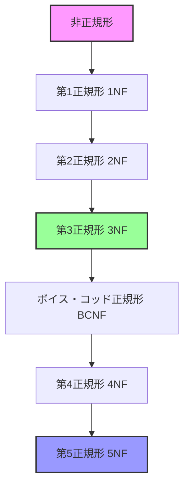

### 1.2 第1正規形（1NF）

第1正規形は、リレーションの最も基本的な要件を定める。テーブルのすべての属性がアトミック（不可分）な値を持つことを要求する。

**違反例：**

| 注文ID | 商品名          | 数量   |
|--------|-----------------|--------|
| 1      | りんご, みかん  | 3, 5   |

この例では `商品名` と `数量` が複数の値を含んでおり、1NF に違反している。

**1NF に正規化した結果：**

| 注文ID | 商品名   | 数量 |
|--------|----------|------|
| 1      | りんご   | 3    |
| 1      | みかん   | 5    |

1NF の本質は「各セルに一つの値だけを格納する」というシンプルな原則だが、これによりSQL での検索・集計が正しく機能する基盤が整う。

### 1.3 第2正規形（2NF）

第2正規形は、1NF を満たした上で、**部分関数従属**（Partial Dependency）を排除することを要求する。部分関数従属とは、複合主キーの一部だけで非キー属性が決定される関係を指す。

**違反例：**

| 学生ID | 科目ID | 学生名   | 成績 |
|--------|--------|----------|------|
| S001   | C001   | 田中太郎 | A    |
| S001   | C002   | 田中太郎 | B    |
| S002   | C001   | 鈴木花子 | A    |

ここで主キーは `{学生ID, 科目ID}` だが、`学生名` は `学生ID` だけで決定される。これは部分関数従属であり、2NF に違反している。

**2NF に正規化した結果：**

学生テーブル:

| 学生ID | 学生名   |
|--------|----------|
| S001   | 田中太郎 |
| S002   | 鈴木花子 |

成績テーブル:

| 学生ID | 科目ID | 成績 |
|--------|--------|------|
| S001   | C001   | A    |
| S001   | C002   | B    |
| S002   | C001   | A    |

### 1.4 第3正規形（3NF）

第3正規形は、2NF を満たした上で、**推移的関数従属**（Transitive Dependency）を排除することを要求する。推移的関数従属とは、非キー属性が別の非キー属性を通じて間接的にキーに依存する関係を指す。

**違反例：**

| 社員ID | 部署ID | 部署名     | 部署所在地 |
|--------|--------|------------|------------|
| E001   | D01    | 開発部     | 東京       |
| E002   | D01    | 開発部     | 東京       |
| E003   | D02    | 営業部     | 大阪       |

`社員ID → 部署ID → 部署名, 部署所在地` という推移的関数従属が存在する。

**3NF に正規化した結果：**

社員テーブル:

| 社員ID | 部署ID |
|--------|--------|
| E001   | D01    |
| E002   | D01    |
| E003   | D02    |

部署テーブル:

| 部署ID | 部署名 | 部署所在地 |
|--------|--------|------------|
| D01    | 開発部 | 東京       |
| D02    | 営業部 | 大阪       |

実務において、3NF は「十分な正規化」の基準として最も広く採用されている。多くのシステムでは、3NF を達成すれば実用上の更新異常はほぼ解消される。

### 1.5 ボイス・コッド正規形（BCNF）

BCNF は 3NF の強化版であり、すべての関数従属の決定項が候補キーであることを要求する。3NF では許容される一部のケース、すなわち候補キーでない属性が候補キーの一部を決定する場合を排除する。

**違反例：**

ある大学で、教員は一つの科目しか教えず、一つの科目は複数の教員が教えうるとする。

| 学生ID | 科目名 | 教員名 |
|--------|--------|--------|
| S001   | 数学   | 佐藤   |
| S002   | 数学   | 山田   |
| S001   | 物理   | 鈴木   |

候補キーは `{学生ID, 科目名}` と `{学生ID, 教員名}` の2つ。`教員名 → 科目名` という関数従属が存在するが、`教員名` は候補キーではない。3NF は満たすが BCNF には違反する。

BCNF への分解では、無損失分解を保証しつつ、すべての非自明な関数従属の決定項が候補キーとなるようにテーブルを分割する。

### 1.6 第4正規形（4NF）

第4正規形は BCNF を満たした上で、**多値従属性**（Multi-valued Dependency）を排除する。多値従属性とは、ある属性の値が別の属性の値の集合を独立に決定する関係を指す。

**例：**

ある社員が複数のスキルを持ち、かつ複数の言語を話せるとする。

| 社員ID | スキル    | 言語   |
|--------|-----------|--------|
| E001   | Java      | 日本語 |
| E001   | Java      | 英語   |
| E001   | Python    | 日本語 |
| E001   | Python    | 英語   |

`社員ID` が `スキル` の集合と `言語` の集合を独立に決定している。このテーブルはすべてのスキルと言語の組み合わせを保持しなければならず、冗長性が生じる。

**4NF に正規化した結果：**

社員スキルテーブル:

| 社員ID | スキル |
|--------|--------|
| E001   | Java   |
| E001   | Python |

社員言語テーブル:

| 社員ID | 言語   |
|--------|--------|
| E001   | 日本語 |
| E001   | 英語   |

### 1.7 第5正規形（5NF）

第5正規形（射影結合正規形、PJ/NF）は、**結合従属性**（Join Dependency）を排除する。これは、テーブルを3つ以上のテーブルに分解したときにのみ冗長性が排除できるケースに対応する。

5NF は理論的には重要だが、実務で 5NF 違反に遭遇することは稀である。4NF まで正規化すれば、ほとんどの実用的なケースではデータの冗長性と更新異常は十分に解消される。

### 1.8 各正規形の関係のまとめ

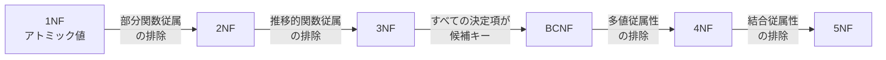

## 2. 正規化のメリット

正規化がもたらす利点を改めて整理する。

### 2.1 データ整合性の保証

正規化により、同一の事実は一箇所にのみ格納される。これにより、更新時にすべての箇所を同期させる必要がなくなり、データの不整合が構造的に防止される。

例えば、顧客の住所が1つのテーブルにのみ存在すれば、住所変更は1行の `UPDATE` で完結する。非正規化されたスキーマでは、複数のテーブルに散在する住所データをすべて更新しなければならない。

### 2.2 ストレージ効率

冗長なデータを排除するため、ディスク使用量が削減される。これは大量データを扱うシステムでは無視できないコスト要因となる。ただし、現代のストレージコストの低下により、この利点の相対的な重要性は低下している。

### 2.3 書き込み性能の向上

正規化されたスキーマでは、1回の書き込み操作で影響を受ける行数が少ない。`INSERT`、`UPDATE`、`DELETE` のいずれも、対象テーブルがコンパクトであるため高速に実行できる。ロックの競合も減少する。

### 2.4 スキーマの柔軟性

正規化されたスキーマは、新しい要件への対応が容易である。新しいエンティティや関係を追加する際、既存のテーブルへの影響が最小限に抑えられる。

### 2.5 クエリの予測可能性

正規化されたスキーマでは、各テーブルが明確な意味を持つため、クエリの設計が論理的に行いやすい。JOIN を使って必要なデータを組み合わせるアプローチは、宣言的であり理解しやすい。

## 3. 非正規化の必要性

### 3.1 なぜ正規化だけでは不十分なのか

正規化が理論的に優れていることは疑いない。しかし、現実のシステムでは以下のような状況で正規化の限界に直面する。

**JOIN のコスト**: 正規化されたスキーマでは、一つのビジネスエンティティの情報を取得するために複数のテーブルを JOIN する必要がある。テーブル数が増えると JOIN のコストは指数的に増大しうる。

**読み取り頻度の偏り**: 多くの Web アプリケーションでは、読み取りと書き込みの比率が 10:1 から 100:1 に達する。このような場合、書き込み整合性よりも読み取り性能を優先する方が合理的なことがある。

**レイテンシ要件**: ユーザー向けの API では数十ミリ秒以内のレスポンスが求められることがある。複数テーブルの JOIN を含むクエリでは、この要件を満たせない場合がある。

**集計クエリの性能**: レポートやダッシュボードで使用される集計クエリは、正規化されたスキーマに対して実行すると非常に遅くなることがある。

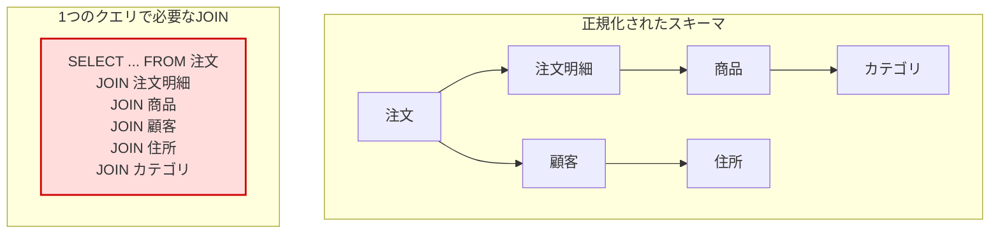

### 3.2 非正規化の定義

非正規化（Denormalization）とは、意図的に正規化のルールを破り、冗長なデータを導入することで読み取り性能を向上させる手法である。重要なのは「意図的」という点であり、そもそも正規化を行わなかったスキーマと、正規化した上で意図的に非正規化したスキーマは本質的に異なる。

後者は、どのデータが冗長であり、どのような整合性リスクがあるかを設計者が明確に理解した上での設計判断である。

## 4. 非正規化のパターン

### 4.1 冗長カラムの追加

最もシンプルな非正規化パターン。JOIN を避けるために、関連テーブルの情報を直接カラムとして保持する。

**例：注文テーブルに顧客名を追加**

```sql
-- Normalized schema
CREATE TABLE customers (
    customer_id BIGINT PRIMARY KEY,
    name VARCHAR(100) NOT NULL,
    email VARCHAR(255) NOT NULL
);

CREATE TABLE orders (
    order_id BIGINT PRIMARY KEY,
    customer_id BIGINT NOT NULL REFERENCES customers(customer_id),
    order_date DATE NOT NULL,
    total_amount DECIMAL(10, 2) NOT NULL
);

-- Denormalized: add customer_name to orders
ALTER TABLE orders ADD COLUMN customer_name VARCHAR(100);
```

このパターンでは、顧客名が変更された場合に `orders` テーブルの該当行もすべて更新する必要がある。トリガーやアプリケーション層での同期処理が必要になる。

### 4.2 導出カラムの事前計算

集計結果をあらかじめカラムとして保持するパターン。COUNT、SUM、AVG などの計算結果をリアルタイムに算出する代わりに、事前に計算して格納する。

```sql
-- Add pre-computed columns
ALTER TABLE products ADD COLUMN review_count INT DEFAULT 0;
ALTER TABLE products ADD COLUMN average_rating DECIMAL(3, 2) DEFAULT 0.00;

-- Update on new review insertion (via trigger or application logic)
UPDATE products
SET review_count = review_count + 1,
    average_rating = (
        SELECT AVG(rating) FROM reviews WHERE product_id = :product_id
    )
WHERE product_id = :product_id;
```

### 4.3 マテリアライズドビュー

マテリアライズドビュー（Materialized View）は、クエリの結果を物理的なテーブルとして保存する仕組みである。通常のビューが実行時にクエリを評価するのに対し、マテリアライズドビューは結果を永続化するため、読み取りが高速である。

```sql
-- PostgreSQL materialized view example
CREATE MATERIALIZED VIEW monthly_sales_summary AS
SELECT
    DATE_TRUNC('month', o.order_date) AS month,
    p.category_id,
    c.name AS category_name,
    COUNT(DISTINCT o.order_id) AS order_count,
    SUM(oi.quantity) AS total_quantity,
    SUM(oi.quantity * oi.unit_price) AS total_revenue
FROM orders o
JOIN order_items oi ON o.order_id = oi.order_id
JOIN products p ON oi.product_id = p.product_id
JOIN categories c ON p.category_id = c.category_id
GROUP BY DATE_TRUNC('month', o.order_date), p.category_id, c.name;

-- Create index for fast access
CREATE INDEX idx_monthly_sales_month ON monthly_sales_summary(month);

-- Refresh the materialized view (full refresh)
REFRESH MATERIALIZED VIEW monthly_sales_summary;

-- Concurrent refresh (allows reads during refresh)
REFRESH MATERIALIZED VIEW CONCURRENTLY monthly_sales_summary;
```

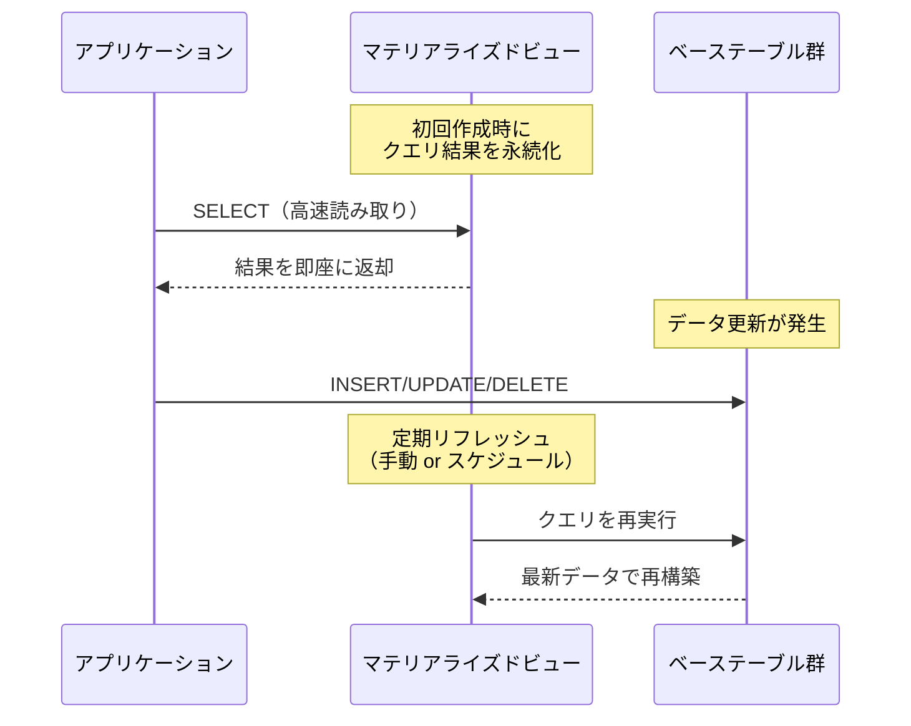

マテリアライズドビューの利点は、元のテーブル構造を変更する必要がないことである。デメリットは、リフレッシュのタイミングによってデータが古くなる可能性があることと、リフレッシュ処理自体にコストがかかることである。

PostgreSQL では `REFRESH MATERIALIZED VIEW CONCURRENTLY` を使うことで、リフレッシュ中も読み取りが可能になるが、ユニークインデックスが必要になるなどの制約がある。

### 4.4 キャッシュテーブル（サマリーテーブル）

キャッシュテーブルは、頻繁に使用される集計結果や計算結果を専用のテーブルに格納するパターンである。マテリアライズドビューとは異なり、アプリケーション層が明示的に管理する。

```sql
-- Summary table for daily statistics
CREATE TABLE daily_product_stats (
    stat_date DATE NOT NULL,
    product_id BIGINT NOT NULL,
    view_count INT DEFAULT 0,
    purchase_count INT DEFAULT 0,
    revenue DECIMAL(12, 2) DEFAULT 0.00,
    PRIMARY KEY (stat_date, product_id)
);

-- Batch update (typically run nightly)
INSERT INTO daily_product_stats (stat_date, product_id, purchase_count, revenue)
SELECT
    CURRENT_DATE - INTERVAL '1 day',
    oi.product_id,
    COUNT(*),
    SUM(oi.quantity * oi.unit_price)
FROM order_items oi
JOIN orders o ON oi.order_id = o.order_id
WHERE o.order_date = CURRENT_DATE - INTERVAL '1 day'
GROUP BY oi.product_id
ON CONFLICT (stat_date, product_id)
DO UPDATE SET
    purchase_count = EXCLUDED.purchase_count,
    revenue = EXCLUDED.revenue;
```

キャッシュテーブルの強みは、更新タイミングとスキーマを完全にコントロールできることである。リアルタイム性が不要な集計処理では非常に有効な手法だ。

### 4.5 ネストされたデータの埋め込み

JSON カラムを使って、関連データをネストした形で一つのカラムに格納するパターン。PostgreSQL の `jsonb` 型や MySQL の `JSON` 型を活用する。

```sql
-- Store order with embedded items as JSON
CREATE TABLE orders_denormalized (
    order_id BIGINT PRIMARY KEY,
    customer_id BIGINT NOT NULL,
    order_date DATE NOT NULL,
    items JSONB NOT NULL,
    -- Example: [{"product_id": 1, "name": "Widget", "qty": 3, "price": 9.99}, ...]
    total_amount DECIMAL(10, 2) NOT NULL
);

-- Query with JSON operators
SELECT
    order_id,
    order_date,
    jsonb_array_length(items) AS item_count,
    total_amount
FROM orders_denormalized
WHERE items @> '[{"product_id": 42}]';
```

このパターンは、注文履歴のように作成後に変更されることが少ないデータに適している。一方で、JSON 内のデータに対する更新や検索は通常のカラムに比べて制約が多い。

### 4.6 テーブルの統合（非正規化結合）

頻繁に JOIN されるテーブルを一つに統合するパターン。1対1または1対少数の関係にあるテーブルに対して有効である。

```sql
-- Before: two separate tables
CREATE TABLE users (
    user_id BIGINT PRIMARY KEY,
    username VARCHAR(50) NOT NULL,
    email VARCHAR(255) NOT NULL
);

CREATE TABLE user_profiles (
    user_id BIGINT PRIMARY KEY REFERENCES users(user_id),
    display_name VARCHAR(100),
    bio TEXT,
    avatar_url VARCHAR(500)
);

-- After: merged into one table
CREATE TABLE users (
    user_id BIGINT PRIMARY KEY,
    username VARCHAR(50) NOT NULL,
    email VARCHAR(255) NOT NULL,
    display_name VARCHAR(100),
    bio TEXT,
    avatar_url VARCHAR(500)
);
```

## 5. 読み取りパフォーマンス vs 書き込み整合性

### 5.1 トレードオフの構造

正規化と非正規化のトレードオフは、本質的に読み取り性能と書き込み整合性の間のバランスである。

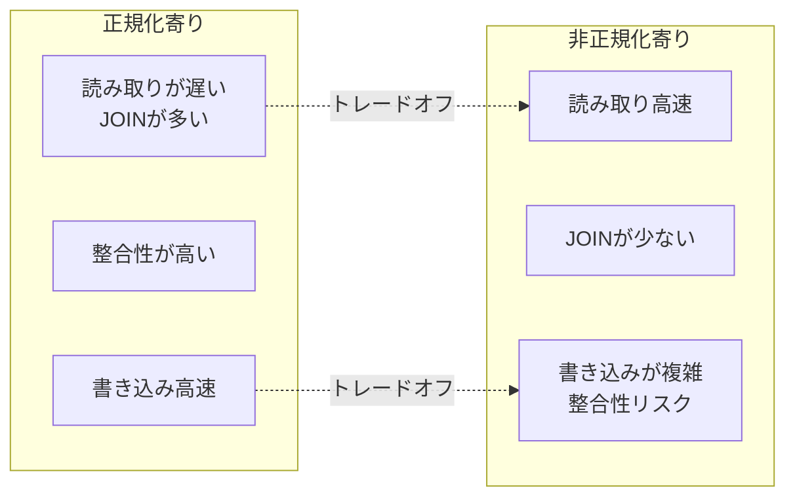

| 観点             | 正規化             | 非正規化             |
|------------------|--------------------|----------------------|
| 読み取り性能     | JOIN が多く低下     | 事前計算で高速       |
| 書き込み性能     | 単一更新で高速     | 複数箇所の同期が必要 |
| データ整合性     | 構造的に保証       | アプリケーション責任 |
| ストレージ       | 効率的             | 冗長で増加           |
| スキーマの柔軟性 | 変更が容易         | 変更の影響範囲が大きい |
| 開発の複雑性     | クエリが複雑       | 同期ロジックが複雑   |

### 5.2 整合性を維持する手法

非正規化を採用する場合、データの整合性を維持するための仕組みが不可欠である。

**データベーストリガー**

```sql
-- Trigger to sync customer_name in orders table
CREATE OR REPLACE FUNCTION sync_customer_name()
RETURNS TRIGGER AS $$
BEGIN
    IF NEW.name <> OLD.name THEN
        UPDATE orders
        SET customer_name = NEW.name
        WHERE customer_id = NEW.customer_id;
    END IF;
    RETURN NEW;
END;
$$ LANGUAGE plpgsql;

CREATE TRIGGER trg_sync_customer_name
    AFTER UPDATE OF name ON customers
    FOR EACH ROW
    EXECUTE FUNCTION sync_customer_name();
```

トリガーは確実にデータを同期できるが、デバッグが困難になりやすく、パフォーマンスへの影響も把握しにくい。大規模なシステムでは、トリガーの連鎖が予期しない性能劣化を引き起こすことがある。

**アプリケーション層での同期**

アプリケーションコードで明示的にデータを同期する方法。トランザクション内で複数のテーブルを更新する。

```python
# Application-level sync example
async def update_customer_name(customer_id: int, new_name: str):
    async with db.transaction():
        # Update the source of truth
        await db.execute(
            "UPDATE customers SET name = $1 WHERE customer_id = $2",
            new_name, customer_id
        )
        # Sync denormalized data
        await db.execute(
            "UPDATE orders SET customer_name = $1 WHERE customer_id = $2",
            new_name, customer_id
        )
```

**イベント駆動型の非同期同期**

即時の整合性が不要な場合、メッセージキューやChange Data Capture（CDC）を使った非同期同期が有効である。

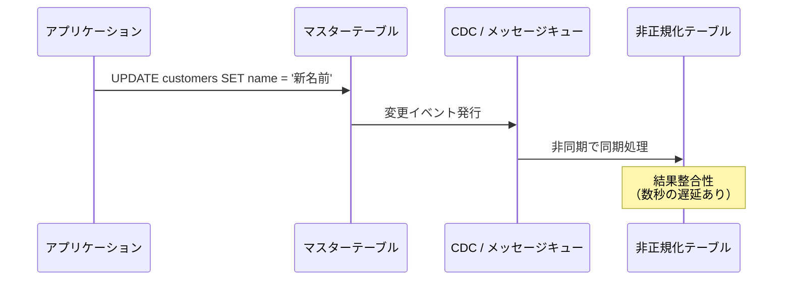

このアプローチは、分散システムにおいて特に有効である。結果整合性（Eventual Consistency）を許容できるユースケースで採用される。

## 6. OLTP vs OLAP での使い分け

### 6.1 OLTP（オンライントランザクション処理）

OLTP システムは、多数の短いトランザクションを高速に処理することを目的とする。EC サイトの注文処理、銀行の送金処理、チケット予約システムなどが典型例である。

**OLTP における設計指針：**

- **原則として 3NF まで正規化する**
- 書き込みの整合性が最優先
- 行レベルのロック競合を最小化するため、テーブルは小さく保つ
- 非正規化は、明確なボトルネックが計測された場合にのみ限定的に適用する

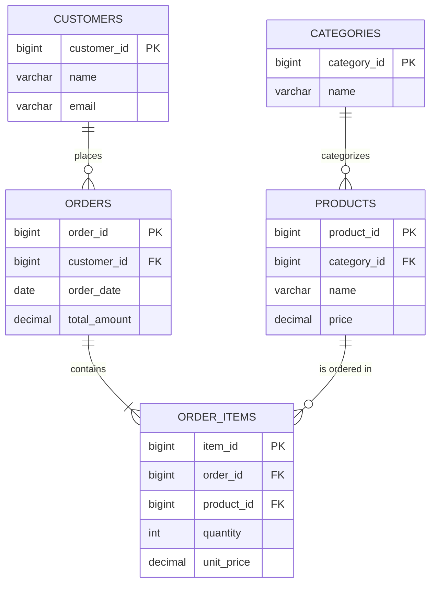

### 6.2 OLAP（オンライン分析処理）

OLAP システムは、大量のデータに対する複雑な分析クエリを効率的に処理することを目的とする。BI ダッシュボード、レポーティング、データマイニングなどが典型例である。

**OLAP における設計指針：**

- **積極的に非正規化する**
- スタースキーマやスノーフレークスキーマを採用する
- 読み取り性能が最優先
- バッチ処理での更新が一般的であり、リアルタイムの書き込み整合性は不要

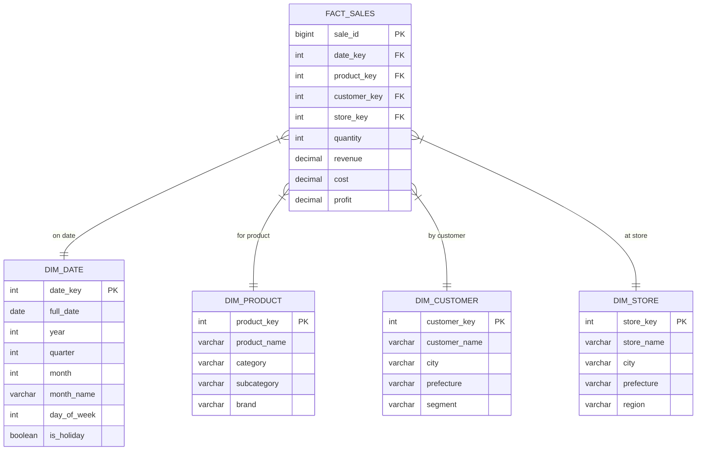

スタースキーマでは、ファクトテーブル（事実テーブル）を中心に、ディメンションテーブル（次元テーブル）が放射状に配置される。ディメンションテーブルは意図的に非正規化されており、例えば `DIM_PRODUCT` には `category` と `subcategory` が直接格納されている（正規化すればカテゴリテーブルとサブカテゴリテーブルに分離される）。

この設計により、分析クエリは少ない JOIN 回数で実行でき、集計処理が効率化される。

### 6.3 HTAP（Hybrid Transactional/Analytical Processing）

近年では、OLTP と OLAP の両方を一つのシステムで処理する HTAP アーキテクチャも注目されている。TiDB、CockroachDB、SingleStore などのデータベースがこのアプローチを採用している。

HTAP 環境では、トランザクション処理用の行指向ストレージと分析処理用の列指向ストレージを内部で使い分けることで、スキーマ設計の複雑さを軽減しようとしている。ただし、完全に設計の問題が解消されるわけではなく、アクセスパターンに応じたインデックス戦略やパーティショニングの検討は依然として必要である。

## 7. NoSQL での非正規化

### 7.1 非正規化がデフォルトの世界

NoSQL データベース、特にドキュメント型データベース（MongoDB、DynamoDB、Firestore など）では、非正規化がデフォルトの設計アプローチとなる。これは JOIN 操作がサポートされていない、または非常に制限されているためである。

リレーショナルデータベースが「正規化してから必要に応じて非正規化する」というアプローチを取るのに対し、ドキュメント型データベースは「アクセスパターンに基づいて非正規化する」ことを前提とする。

### 7.2 ドキュメント型データベースでの設計

MongoDB を例にとると、EC サイトの注文データは以下のように設計される。

```javascript
// MongoDB document: denormalized order
{
  _id: ObjectId("..."),
  order_date: ISODate("2026-03-05"),
  customer: {
    // Embedded (denormalized) customer info at time of order
    customer_id: "C001",
    name: "田中太郎",
    email: "tanaka@example.com",
    shipping_address: {
      prefecture: "東京都",
      city: "渋谷区",
      line1: "神宮前1-2-3"
    }
  },
  items: [
    {
      product_id: "P001",
      name: "ワイヤレスイヤホン",   // Snapshot at order time
      quantity: 1,
      unit_price: 12800
    },
    {
      product_id: "P042",
      name: "USBケーブル",          // Snapshot at order time
      quantity: 2,
      unit_price: 980
    }
  ],
  total_amount: 14760,
  status: "shipped"
}
```

この設計のポイントは、注文時点の顧客情報や商品情報をスナップショットとして埋め込むことである。顧客の住所が後で変わっても、注文時の配送先は正しく保持される。これは非正規化の一種だが、ビジネス要件として「注文時点の情報を記録する」必要があるため、むしろ正しい設計ともいえる。

### 7.3 DynamoDB のシングルテーブル設計

Amazon DynamoDB では、単一テーブルに複数のエンティティを格納するシングルテーブル設計（Single Table Design）が推奨されている。パーティションキーとソートキーの組み合わせで異なるエンティティを表現する。

```
| PK (Partition Key) | SK (Sort Key)       | Attributes              |
|--------------------|---------------------|-------------------------|
| CUST#C001          | PROFILE             | name, email, ...        |
| CUST#C001          | ORDER#O001          | date, total, status     |
| CUST#C001          | ORDER#O002          | date, total, status     |
| ORDER#O001         | ITEM#1              | product_name, qty, ...  |
| ORDER#O001         | ITEM#2              | product_name, qty, ...  |
| PROD#P001          | METADATA            | name, price, category   |
```

この設計では、`PK = CUST#C001` でクエリすれば、顧客プロフィールとその全注文を一度の読み取りで取得できる。アクセスパターンを最優先に設計するため、非正規化は必然的に発生する。

### 7.4 NoSQL での整合性管理

NoSQL で非正規化されたデータの整合性を管理する手法には以下がある。

- **アプリケーション層でのトランザクション管理**: MongoDB 4.0 以降はマルチドキュメントトランザクションをサポートしているが、パフォーマンスへの影響があるため限定的に使用する
- **結果整合性の受容**: 非同期での同期を前提とし、短時間の不整合を許容する
- **スナップショットパターン**: 注文時の商品情報のように、ある時点のデータを不変として保存する
- **Change Streams**: MongoDB の Change Streams や DynamoDB Streams を使って、データ変更をトリガーに同期処理を実行する

## 8. スキーマ設計の実践ガイドライン

### 8.1 段階的アプローチ

スキーマ設計において、最も信頼できるアプローチは以下のステップを段階的に踏むことである。

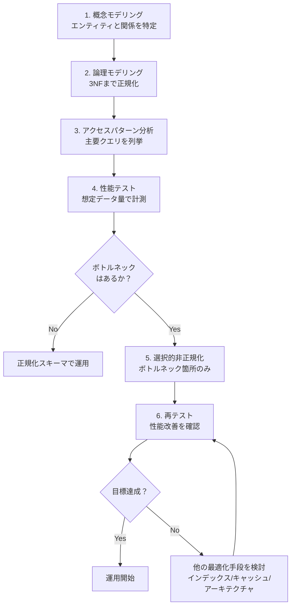

重要なのは、非正規化は **最初の選択肢ではない** ということである。正規化したスキーマで性能問題が計測され、インデックスの最適化やクエリの改善では解決できない場合にのみ、非正規化を検討すべきである。

### 8.2 非正規化の前に検討すべきこと

非正規化に踏み切る前に、以下の代替手段を検討する。

1. **インデックスの最適化**: 複合インデックス、カバリングインデックス、部分インデックスなどが適切に設定されているか
2. **クエリの最適化**: 実行計画を分析し、不要な処理がないか確認する
3. **接続プーリング**: データベース接続の管理が適切か
4. **アプリケーションキャッシュ**: Redis や Memcached などを使ったキャッシュ層の導入
5. **読み取りレプリカ**: 読み取り負荷をレプリカに分散する
6. **パーティショニング**: 大きなテーブルをパーティション分割する

これらの手段を検討・実施した上で、なお性能要件を満たせない場合に非正規化を採用する。

### 8.3 非正規化を適用する際のチェックリスト

非正規化を実施する場合、以下の点を確認する。

::: warning 非正規化チェックリスト
- [ ] **計測に基づく判断か？** 推測ではなく、実データに基づくベンチマークで性能問題が確認されているか
- [ ] **整合性の維持方法は明確か？** トリガー、アプリケーション層同期、非同期同期のいずれかの手段が設計されているか
- [ ] **冗長データの更新頻度は許容範囲か？** 頻繁に更新されるデータを冗長化すると、同期コストが高くなる
- [ ] **ドキュメント化されているか？** どのカラムが冗長であり、どこがマスターデータかが記録されているか
- [ ] **ロールバック計画はあるか？** 非正規化が期待通りの効果をもたらさなかった場合の復旧手順があるか
:::

### 8.4 一般的な設計パターンと適用場面

| パターン | 適用場面 | 注意点 |
|----------|----------|--------|
| 冗長カラム | 頻繁に JOIN される少数の属性 | 更新頻度が低い属性に限定 |
| 導出カラム | カウントや合計の表示が頻繁 | 厳密な正確性が不要な場面 |
| マテリアライズドビュー | 複雑な集計クエリの高速化 | リフレッシュ戦略の設計が必要 |
| キャッシュテーブル | 日次/週次レポート | バッチ処理の運用設計が必要 |
| JSON 埋め込み | 履歴データ、不変のスナップショット | 検索・更新が困難 |
| テーブル統合 | 1対1関係のテーブル | NULL が多くなる可能性 |

## 9. 実務での判断基準

### 9.1 判断のフレームワーク

実務での正規化・非正規化の判断は、以下の軸で評価する。

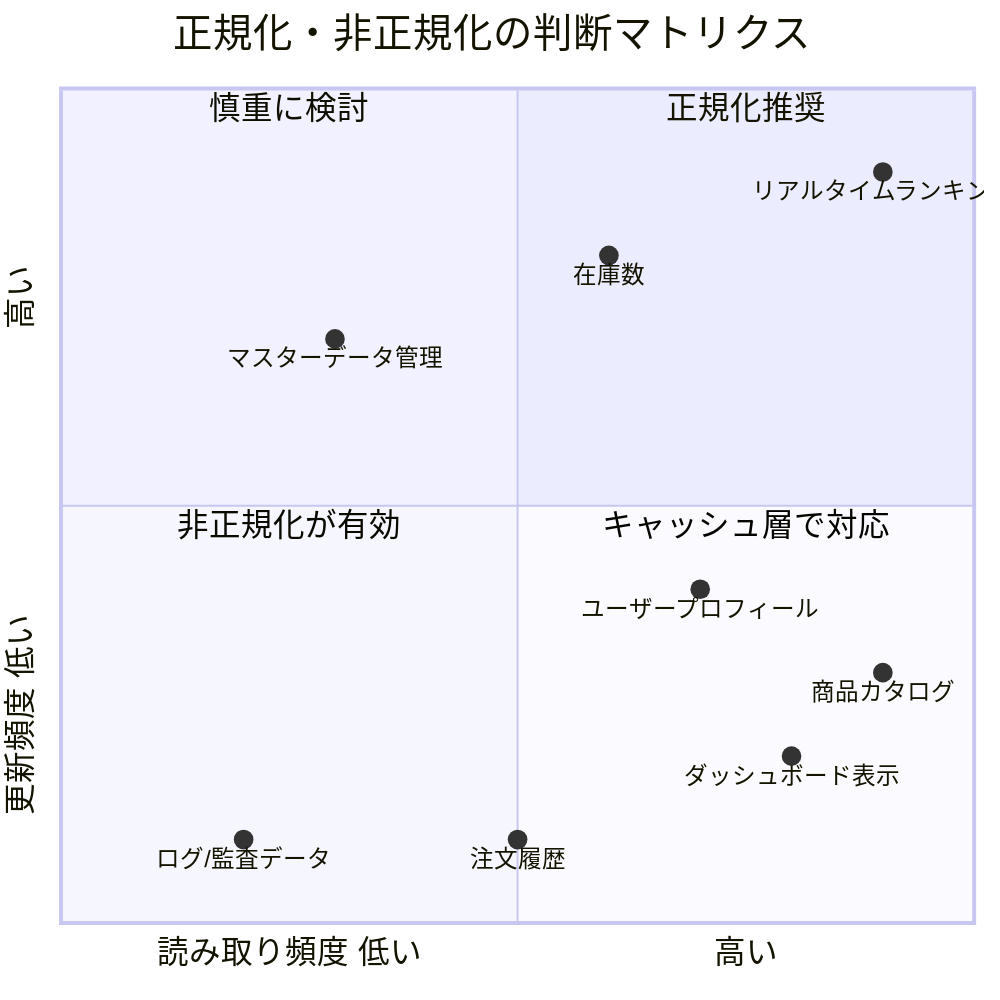

**読み取り頻度が高く、更新頻度が低い** データは非正規化の恩恵を最も受ける。商品カタログ、記事コンテンツ、ダッシュボード表示などがこれに該当する。

**更新頻度が高い** データは、非正規化のコスト（同期処理）が大きくなるため、正規化を維持するか、アプリケーションキャッシュで対応する方が良い。

### 9.2 データのライフサイクルに注目する

データには「活性期」と「安定期」がある。

- **活性期**: データが頻繁に更新される期間。注文のステータス変更、在庫の増減など
- **安定期**: データがほぼ変更されなくなった期間。完了した注文、過去の取引記録など

安定期に入ったデータは、非正規化してアーカイブテーブルに移動する戦略が有効である。スナップショットとして保持することで、JOIN なしでの高速な読み取りが可能になる。

```sql
-- Archive completed orders with denormalized data
CREATE TABLE archived_orders (
    order_id BIGINT PRIMARY KEY,
    order_date DATE NOT NULL,
    completion_date DATE NOT NULL,
    -- Denormalized customer info (snapshot)
    customer_id BIGINT NOT NULL,
    customer_name VARCHAR(100) NOT NULL,
    customer_email VARCHAR(255) NOT NULL,
    shipping_address JSONB NOT NULL,
    -- Denormalized items (snapshot)
    items JSONB NOT NULL,
    total_amount DECIMAL(10, 2) NOT NULL,
    status VARCHAR(20) NOT NULL DEFAULT 'completed'
);
```

### 9.3 チームとプロジェクトの文脈

技術的な要因だけでなく、チームやプロジェクトの文脈も判断に影響する。

- **チームの経験**: 非正規化されたスキーマの管理には、データ整合性への深い理解が求められる。経験の浅いチームでは、正規化を維持する方がリスクが低い
- **プロジェクトのフェーズ**: 初期段階では正規化を維持し、ユーザー数の増加に伴って計測に基づく非正規化を段階的に導入する
- **運用体制**: 非正規化されたデータの同期が失敗した場合のアラート・復旧体制が整っているか
- **データベースの選択**: 使用するデータベースの特性（PostgreSQL のマテリアライズドビュー、MySQL の生成カラムなど）を活かした設計を検討する

### 9.4 よくあるアンチパターン

::: danger 避けるべきアンチパターン

**1. 早すぎる非正規化**
「JOINは遅い」という先入観で、計測せずに非正規化するケース。現代の RDBMS は適切なインデックスがあれば、数テーブルの JOIN を効率的に処理できる。

**2. すべてを一つのテーブルに詰め込む**
God Table アンチパターン。数百のカラムを持つ巨大テーブルは、ロック競合、キャッシュ効率の低下、スキーマ変更の困難さを引き起こす。

**3. 同期メカニズムなしの冗長化**
冗長データを追加したが、同期の仕組みを用意しないケース。時間が経つにつれてデータの不整合が蓄積し、最終的に信頼性を失う。

**4. 正規化への過度なこだわり**
理論的な美しさにこだわり、明らかな性能問題を放置するケース。正規化は目的ではなく手段である。
:::

### 9.5 実践的な意思決定フロー

最後に、実務で使える意思決定フローをまとめる。

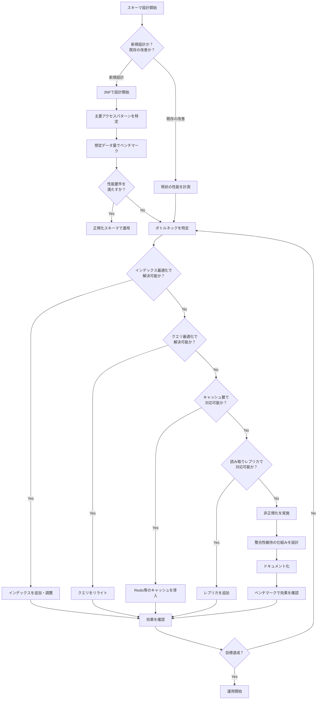

## まとめ

正規化と非正規化は対立する概念ではなく、スキーマ設計における相補的なツールである。

- **正規化**は、データの整合性を構造的に保証し、保守性の高いスキーマを実現する。特に OLTP システムでは、正規化を基本とすべきである
- **非正規化**は、読み取り性能の向上が必要な場面で、計測に基づいて選択的に適用する。OLAP システムや NoSQL データベースでは、非正規化が設計の中心となる
- 重要なのは**計測に基づく判断**である。推測ではなく、実データに基づくベンチマークでボトルネックを特定し、非正規化の効果を検証する
- 非正規化を採用する場合は、**整合性維持の仕組み**を必ず設計し、ドキュメント化する

最終的に、スキーマ設計は技術的な判断であると同時にビジネス上の判断でもある。システムの要件、チームの能力、運用体制を総合的に考慮して、適切なバランスを見つけることが求められる。
