# 通知システムの設計（Push, Email, In-App, Fan-out）

## 1. 背景 — なぜ通知システムは難しいのか

### 1.1 通知の本質的な役割

現代のアプリケーションにおいて、通知システムはユーザーとサービスをつなぐ重要な橋渡し役である。ユーザーが能動的にアプリを開かなくても、サービス側から「あなたに関係のある出来事が起きた」という情報を届けることができる。

Facebookの「いいね！」通知、Twitterのメンション通知、Gmailの新着メール通知、Slackのメッセージ通知など、私たちは日々無数の通知を受け取っている。これらは単なる「お知らせ」ではなく、ユーザーをアプリに引き戻し、エンゲージメントを維持するための重要なメカニズムである。

しかし通知システムを正しく設計することは、見た目の単純さに反して非常に難しい。複数の配信チャネル（Push通知、Email、SMS、In-App通知、Webhook）を統一的に扱いつつ、数百万〜数十億のユーザーに対してリアルタイムかつ確実に配信し、ユーザーの好みや状況に応じてパーソナライズされたメッセージを届けなければならない。

### 1.2 通知システムが抱える課題

通知システムが難しい理由は複数ある。

**スケールの問題**: SNSのようなサービスでは、1つの投稿に対して数百万人のフォロワーに通知を送る必要がある。これを素朴に実装するとO(n)のデータベースクエリとO(n)の送信処理が発生し、システムが溢れる。

**配信保証の問題**: 通知は「少なくとも1回は届く」必要がある。しかし重複配信はユーザー体験を著しく損なう。at-least-once配信と冪等性の両立が求められる。

**多様なチャネルの統一**: iOSのAPNs、AndroidのFCM、各Emailプロバイダ（SendGrid, SESなど）、SMS（Twilio）、Webhookなど、それぞれ異なるプロトコル・制約・レート制限を持つチャネルを統一的に扱う必要がある。

**ユーザー体験の維持**: 過剰な通知はユーザーが通知を無効にしたり、最悪の場合アプリをアンインストールする原因になる。「通知疲れ」を防ぐためのレート制限、バッチング、優先度管理が必要である。

**テンプレートとパーソナライズ**: 「山田さんが投稿にいいねしました」のような動的なメッセージを多言語・多フォーマットで生成する必要がある。

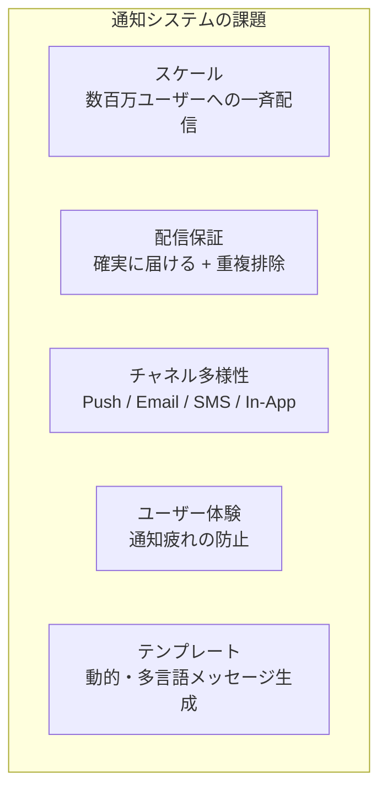

---

## 2. 通知チャネルの種類と特性

通知システムが扱うチャネルは大きく5種類に分類できる。それぞれ適したユースケースと技術的制約が異なる。

### 2.1 Push通知（モバイル）

スマートフォンのホーム画面やロック画面に表示される通知である。ユーザーがアプリを起動していなくても届けられるため、時間的緊急性の高い情報に最適である。

**APNs（Apple Push Notification Service）**: iOSデバイスへの通知を担う。HTTPSベースのAPIを使用し、JWT（ES256署名）またはP8証明書で認証する。ペイロードサイズは4KBまで。通知には`aps`ペイロードに`alert`、`badge`、`sound`などを含める。

**FCM（Firebase Cloud Messaging）**: AndroidデバイスとiOSデバイス（Firebase SDK経由）への通知を担う。HTTPSまたはgRPC（v1 API）を使用。AndroidのペイロードサイズはData payload 4KB、Notification payload 4KB。

```json
// FCM v1 API payload example
{
  "message": {
    "token": "device-registration-token",
    "notification": {
      "title": "新しいメッセージ",
      "body": "山田さんからメッセージが届きました"
    },
    "android": {
      "priority": "high",
      "notification": {
        "channel_id": "messages",
        "click_action": "OPEN_CHAT"
      }
    },
    "apns": {
      "payload": {
        "aps": {
          "alert": {
            "title": "新しいメッセージ",
            "body": "山田さんからメッセージが届きました"
          },
          "badge": 1,
          "sound": "default"
        }
      }
    },
    "data": {
      "chat_id": "12345",
      "sender_id": "67890"
    }
  }
}
```

Push通知の特性と制約:

| 項目 | APNs | FCM |
|------|------|-----|
| 配信速度 | 数秒〜数十秒 | 数秒〜数十秒 |
| ペイロードサイズ | 4KB | 4KB |
| 配信保証 | best-effort（TTL設定可） | best-effort（TTL設定可） |
| レート制限 | デバイスあたり制限あり | プロジェクトあたり制限あり |
| ユーザーのオプトイン | iOS: 明示的許可が必要 | Android 13以降: 明示的許可が必要 |

::: warning Push通知の配信保証
APNsとFCMはどちらも**best-effort**配信であり、配信を保証しない。デバイスがオフラインの場合、TTL（Time To Live）内に再配信を試みるが、TTLを超えると通知は破棄される。重要な情報は別途アプリ起動時にサーバーから取得する仕組みと組み合わせる必要がある。
:::

### 2.2 Email

最も古くから使われる通知チャネルであり、長文のコンテンツやHTMLリッチコンテンツを届けられる。緊急性は低いがリーチが高く、全ユーザーが持つ連絡先として機能する。

主なEmailプロバイダ:
- **Amazon SES**: AWS統合が容易。大量配信に強い。バウンス・コンプレイント管理が必要。
- **SendGrid**: 豊富なテンプレート機能。分析ダッシュボードが充実。
- **Mailgun**: 開発者フレンドリー。ルーティング機能が強力。
- **Postmark**: トランザクショナルメールに特化。高い到達率。

Emailの特性:
- **配信速度**: 秒〜分単位（受信側のメールサーバーに依存）
- **コンテンツ**: HTMLリッチメール、テキストメール
- **スパムフィルター**: SPF、DKIM、DMARCの設定が到達率に直結する
- **バウンス管理**: 無効なアドレスへの送信を継続するとドメインの評判が下がる
- **到達保証**: SMTPプロトコルレベルでは再試行あり、しかし最終的に届くかは不確実

### 2.3 In-App通知（アプリ内通知）

アプリを起動している間にのみ表示される通知である。ベルアイコンの未読バッジや、画面内の通知センターで確認できる形式が一般的。Push通知と異なりOS側の許可が不要なため、100%のユーザーに届けられる。

特性:
- **リアルタイム性**: WebSocketやSSE（Server-Sent Events）を使ったリアルタイム配信が可能
- **永続性**: サーバーに保存されるため、後から確認できる
- **インタラクション**: 「既読」「削除」「アクション実行」などの操作が可能
- **フォールバック先**: Push通知を許可していないユーザーへの代替手段

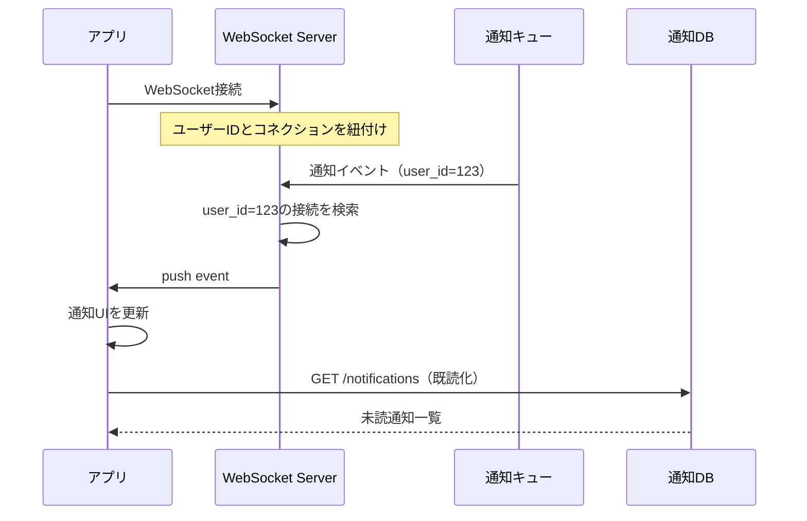

### 2.4 SMS

テキストメッセージによる通知。Push通知を許可していないユーザーや、重要なアクション確認（2段階認証、パスワードリセット）に適している。

- **Twilio**: 最も広く使われるSMSプロバイダ。190カ国以上をカバー。
- **AWS SNS**: AWSエコシステムとの統合が容易。
- **コスト**: Emailより高コスト（1通あたり数円〜十数円）

SMS固有の制約:
- 文字数制限（160文字/セグメント、日本語は70文字/セグメント）
- 国際配信の規制（国ごとに送信元番号の要件が異なる）
- スパム規制への対応（オプトアウト管理が必要）

### 2.5 Webhook

サービス間連携のためのチャネル。ユーザーではなく外部サービスやシステムへの通知である。B2B連携、CI/CDパイプライン、Slackへの投稿などに使われる。

特性:
- **プロトコル**: HTTP POSTリクエスト
- **ペイロード**: 任意のJSONデータ
- **再試行**: 受信側の障害に対して指数バックオフで再試行
- **署名検証**: HMAC-SHA256などで送信元の正当性を保証

```
POST https://example.com/webhook
Content-Type: application/json
X-Notification-Signature: sha256=<HMAC-SHA256>
X-Notification-Timestamp: 1709302400

{
  "event": "order.completed",
  "data": { "order_id": "ORD-12345", "amount": 5000 },
  "timestamp": "2026-03-02T10:00:00Z"
}
```

### 2.6 チャネルの選択基準

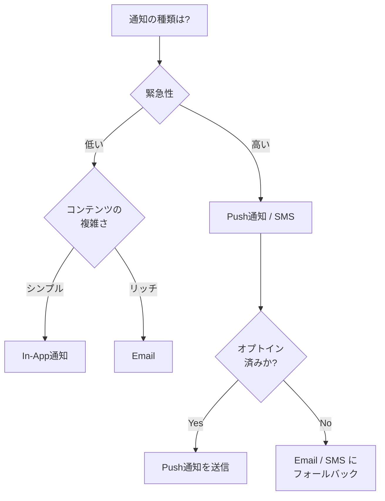

---

## 3. 全体アーキテクチャ

通知システムの全体アーキテクチャを俯瞰する。

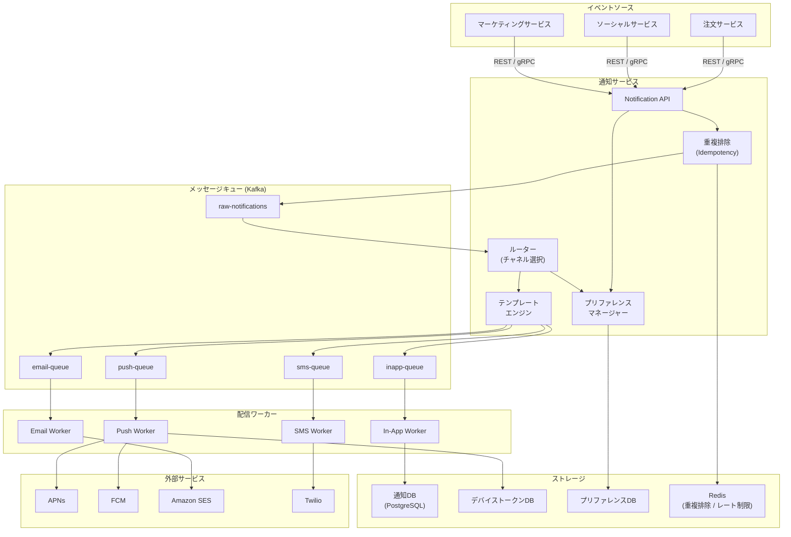

この構成の核心は、通知の**生成**と**配信**を分離することにある。

1. **イベントソース（上流サービス）** が通知APIに通知リクエストを送る
2. **通知サービス** がプリファレンス確認・テンプレート展開・重複排除を行い、Kafkaに積む
3. **配信ワーカー** がKafkaからメッセージを消費し、各チャネルに配信する

この非同期設計により、上流サービスはレスポンスを待たずに処理を続けられ、配信の失敗が上流サービスに影響を与えない。

---

## 4. Fan-outの設計

Fan-outは「1つのイベントを多数のユーザーに配信する」処理パターンである。通知システムにおいて最も設計が難しい部分の一つである。

### 4.1 Fan-out on Write（書き込み時Fan-out）

イベントが発生した時点で、すべての配信先ユーザーの通知を生成・保存する方式である。

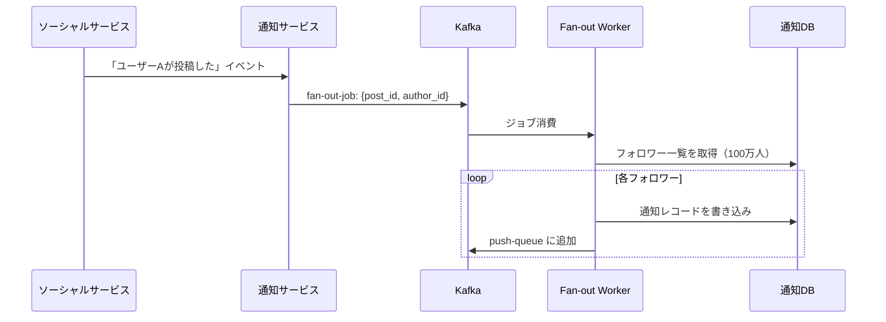

**メリット**:
- 読み取り時のレイテンシが低い（通知一覧はすでに書き込まれている）
- クエリが単純（`WHERE user_id = ? AND read = false`）

**デメリット**:
- 書き込み量が膨大（100万フォロワー × 1イベント = 100万レコード）
- 有名人（Celebrity Problem）の投稿でストレージとキューが急増する
- フォロワーがアクティブでなくても書き込みが発生する

Fan-out on Writeが適するケース:
- フォロワー数が少ないサービス
- 読み取り頻度が高い（通知一覧を頻繁に開く）サービス

### 4.2 Fan-out on Read（読み取り時Fan-out）

ユーザーが通知一覧を開いた時点で、そのユーザーに関係するイベントを動的に取得する方式である。

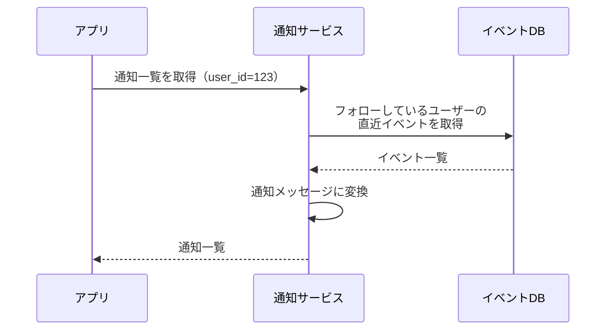

**メリット**:
- 書き込み量が少ない（イベントは1レコードだけ書く）
- ストレージ効率が良い

**デメリット**:
- 読み取り時のレイテンシが高い（フォロー数 × クエリ）
- クエリが複雑
- キャッシュ戦略が重要になる

Fan-out on Readが適するケース:
- フォロワー数が非常に多い（有名人アカウント）
- 通知一覧の確認頻度が低い

### 4.3 ハイブリッドアプローチ

実際のシステムでは、両方の手法を組み合わせるハイブリッドアプローチが有効である。Twitterが採用していたことで知られる手法である。

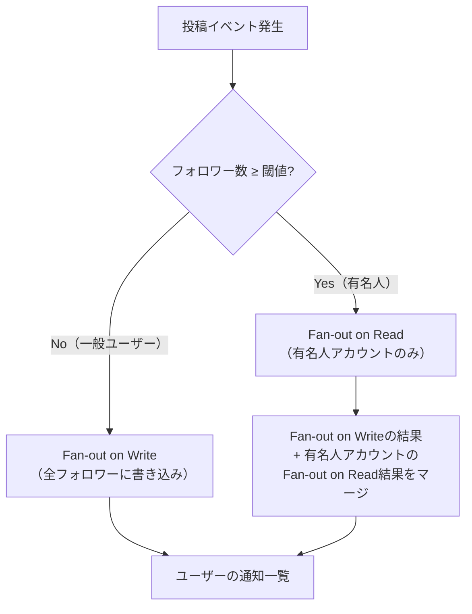

閾値（例えばフォロワー10万人）以上のアカウントには Fan-out on Read を、それ以下のアカウントには Fan-out on Write を適用する。ユーザーが通知一覧を取得する際は、Fan-out on Write で事前生成された通知と、Fan-out on Read で動的取得した有名人の投稿通知をマージして返す。

::: tip Kafkaを使ったFan-out on Writeの実装
Fan-out on Writeの書き込み処理をKafkaのConsumer Groupで並列化することで、スループットを大幅に改善できる。例えば100万フォロワーへの書き込みをパーティションごとに分割し、複数のワーカーが並行して処理する。1ワーカーが1秒に1,000レコードを書き込めるとすると、10ワーカーで100万件の書き込みが約100秒で完了する。
:::

---

## 5. APNsとFCMの仕組み

### 5.1 APNsの仕組み

APNs（Apple Push Notification Service）はAppleが運営するプッシュ通知インフラである。

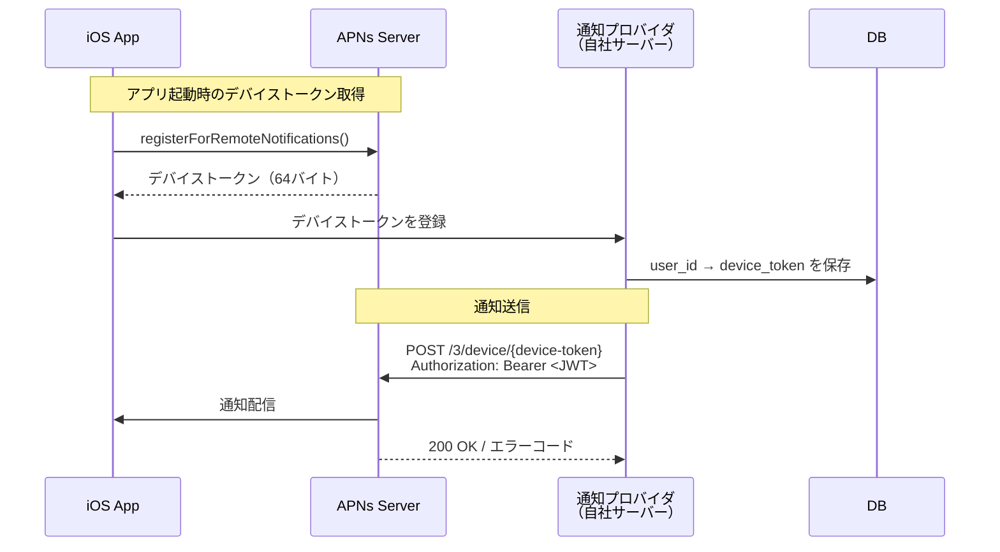

**認証方式**:
- **トークンベース（推奨）**: ES256署名のJWTを使用。1つの秘密鍵で複数アプリに対応可能。有効期限1時間のJWTを定期的に更新する。
- **証明書ベース（旧方式）**: P12証明書を使用。アプリごと、環境（本番/開発）ごとに証明書が必要。

**重要なエラーコード**:
- `BadDeviceToken (400)`: デバイストークンが無効。DBから削除すべき。
- `Unregistered (410)`: アプリがアンインストールされた。トークンを無効化すべき。
- `TooManyRequests (429)`: レート制限超過。バックオフして再試行。

```python
# APNs token-based authentication example using httpx
import httpx
import jwt
import time

def send_apns_notification(device_token: str, payload: dict) -> None:
    # Generate JWT for APNs authentication
    auth_token = jwt.encode(
        {
            "iss": TEAM_ID,        # Apple Developer Team ID
            "iat": int(time.time()),
        },
        PRIVATE_KEY,               # ES256 private key (.p8 file)
        algorithm="ES256",
        headers={"kid": KEY_ID},   # Key ID from Apple Developer
    )

    url = f"https://api.push.apple.com/3/device/{device_token}"
    headers = {
        "Authorization": f"Bearer {auth_token}",
        "apns-topic": BUNDLE_ID,   # App bundle ID
        "apns-push-type": "alert",
        "apns-priority": "10",     # 10=immediate, 5=conserve power
        "apns-expiration": str(int(time.time()) + 86400),  # TTL: 24h
    }

    response = httpx.post(url, json=payload, headers=headers, http2=True)

    if response.status_code == 410:
        # Device token is no longer valid — remove from DB
        invalidate_device_token(device_token)
    elif response.status_code == 400:
        error = response.json().get("reason", "")
        if error == "BadDeviceToken":
            invalidate_device_token(device_token)
```

### 5.2 FCMの仕組み

FCM（Firebase Cloud Messaging）は、AndroidとiOSへの通知配信をGoogleが提供するサービスである。

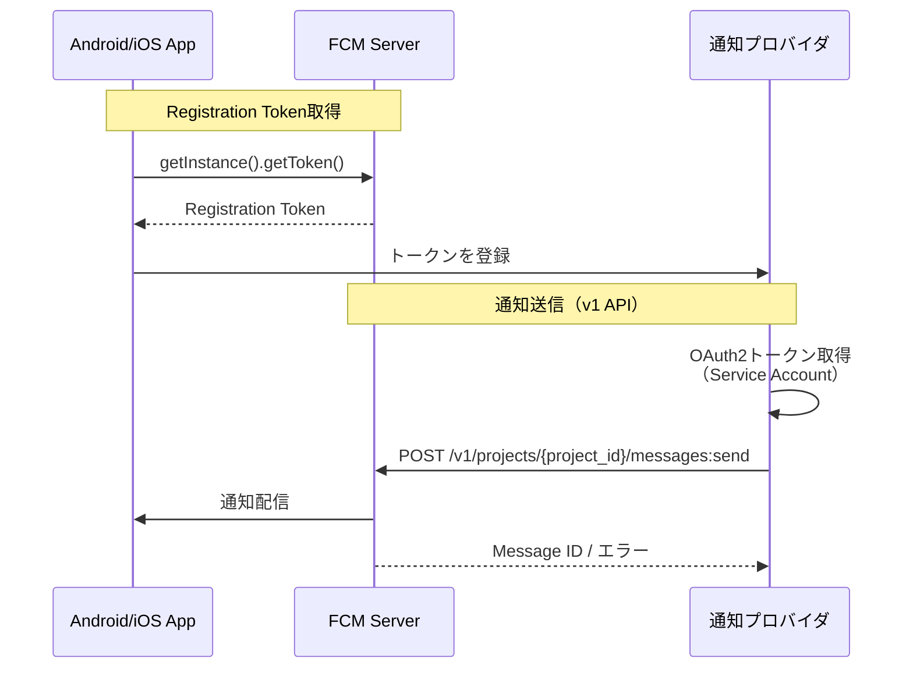

**FCM v1 APIの特徴**:
- OAuth2認証（Service Account JWT）を使用
- プラットフォーム固有のパラメータを1リクエストに集約できる（iOS/Androidの差異を吸収）
- 詳細なエラーコードによるトークン管理が容易

**トークンの鮮度管理**:

FCMのRegistration Tokenは定期的に変更される場合がある（アプリの再インストール、データクリアなど）。アプリ側で`onTokenRefresh`イベントを監視し、新しいトークンをサーバーに通知する実装が必要である。

```kotlin
// Android: FCM token refresh handling
class MyFirebaseMessagingService : FirebaseMessagingService() {
    override fun onNewToken(token: String) {
        // Send new token to notification server
        sendTokenToServer(token)
    }

    override fun onMessageReceived(message: RemoteMessage) {
        // Handle foreground notification
        message.notification?.let { notification ->
            showLocalNotification(notification.title, notification.body)
        }
    }
}
```

### 5.3 デバイストークンのライフサイクル管理

デバイストークン（APNs）とRegistration Token（FCM）は静的ではなく、以下の状況で無効になる。

| 状況 | APNs | FCM |
|------|------|-----|
| アプリアンインストール | 即時無効化 | 即時無効化 |
| アプリの再インストール | 新トークン発行 | 新トークン発行 |
| OS再インストール | 新トークン発行 | 新トークン発行 |
| Push通知の無効化（iOS） | トークン継続（配信失敗） | 配信失敗 |
| 長期間未使用 | 無効化の可能性 | 定期更新 |

トークン管理のベストプラクティス:
1. Push通知の送信失敗時（特に`Unregistered`や`BadDeviceToken`）には即座にトークンをDBから削除する
2. アプリ起動のたびに最新のトークンをサーバーに送信する
3. 一定期間（例：60日）以上使われていないトークンは定期的にクリーンアップする

---

## 6. 配信保証と重複排除

### 6.1 at-least-once配信

通知システムにおいて「少なくとも1回は届ける」は基本要件である。ネットワーク障害や外部サービスの一時的な障害に対して、再試行（リトライ）による回復が必要である。

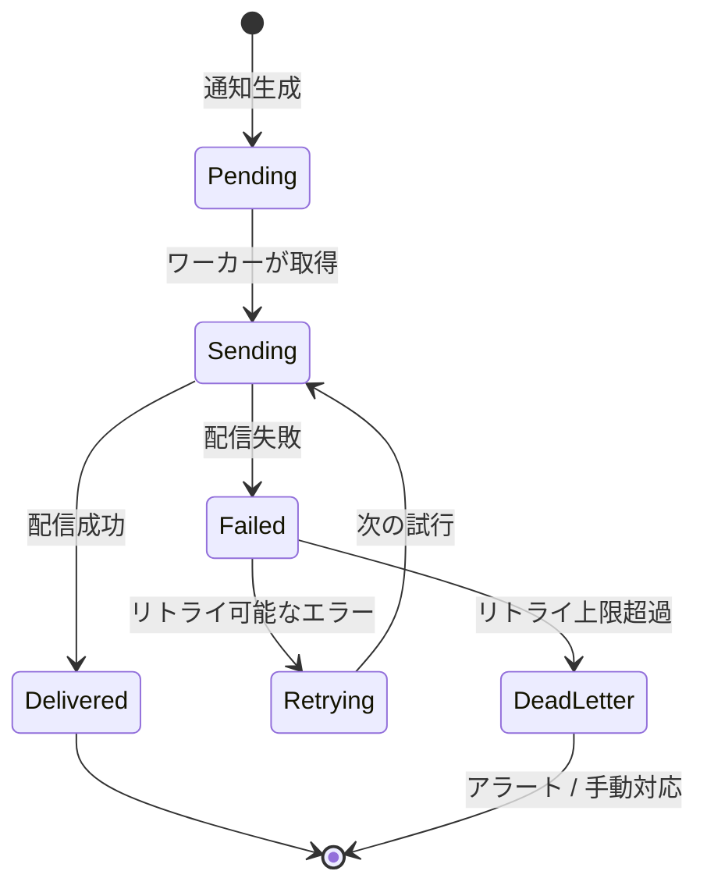

**指数バックオフによるリトライ**:

```python
# Exponential backoff retry strategy
import time
import random

def send_with_retry(notification: dict, max_retries: int = 5) -> bool:
    for attempt in range(max_retries):
        try:
            result = send_notification(notification)
            return True
        except RetryableError as e:
            if attempt == max_retries - 1:
                # Send to dead-letter queue for manual inspection
                send_to_dead_letter_queue(notification, str(e))
                return False

            # Exponential backoff: 1s, 2s, 4s, 8s, 16s with jitter
            wait_seconds = (2 ** attempt) + random.uniform(0, 1)
            time.sleep(wait_seconds)

        except NonRetryableError as e:
            # E.g., invalid device token — do not retry
            handle_permanent_failure(notification, str(e))
            return False
```

**リトライ可能エラーとリトライ不可エラーの分類**:

| エラー種別 | 例 | リトライ |
|-----------|-----|--------|
| 一時的な障害 | 503 Service Unavailable, タイムアウト | Yes |
| レート制限 | 429 Too Many Requests | Yes（バックオフ） |
| 無効なトークン | BadDeviceToken, Unregistered | No（トークン削除） |
| 認証エラー | 401 Unauthorized | No（証明書確認） |
| ペイロードエラー | 400 Bad Request | No（コード修正） |

### 6.2 重複排除（Idempotency）

at-least-once配信を実装すると、必ず重複配信が発生しうる。特にKafkaのConsumerがメッセージ処理後にオフセットのコミット前にクラッシュした場合、同じメッセージが再処理される。

重複排除の実装パターン:

**べき等なメッセージID**:

```python
# Deduplication using Redis
import hashlib
import redis

redis_client = redis.Redis(host="localhost", port=6379)

def process_notification_idempotently(notification: dict) -> bool:
    # Generate idempotency key from notification content
    key_source = f"{notification['user_id']}:{notification['event_id']}:{notification['channel']}"
    idempotency_key = f"notif:dedup:{hashlib.sha256(key_source.encode()).hexdigest()}"

    # Use Redis SET NX (set if not exists) for atomic check-and-set
    was_set = redis_client.set(
        idempotency_key,
        "processed",
        nx=True,        # Only set if key does not exist
        ex=86400,       # Expire after 24 hours
    )

    if not was_set:
        # Already processed — skip
        return False

    # Process the notification
    return send_notification(notification)
```

**データベースによる冪等性保証**:

```sql
-- Idempotent notification insert using ON CONFLICT DO NOTHING
INSERT INTO notifications (
    id,           -- UUID generated from event_id + user_id + channel
    user_id,
    event_id,
    channel,
    content,
    status,
    created_at
) VALUES (
    $1, $2, $3, $4, $5, 'pending', NOW()
)
ON CONFLICT (id) DO NOTHING;
```

::: tip ウィンドウサイズの選択
Redisで重複排除ウィンドウを設定する場合、ウィンドウが短すぎると重複を検出できず、長すぎるとRedisのメモリを圧迫する。通常は24時間〜7日が妥当な範囲である。Kafkaのリトライは通常数時間以内に完了するため、24時間ウィンドウで大部分の重複を防ぐことができる。
:::

---

## 7. 通知の優先度とバッチング

### 7.1 優先度の設計

すべての通知が等しく重要なわけではない。緊急度に応じて優先度を設定し、処理順序とリソース配分を最適化する。

```python
from enum import IntEnum

class NotificationPriority(IntEnum):
    CRITICAL = 1    # Security alerts, payment failures
    HIGH     = 2    # Direct messages, mentions
    NORMAL   = 3    # Likes, comments on own posts
    LOW      = 4    # Weekly digests, promotional

# Priority-based Kafka topic routing
PRIORITY_TOPIC_MAP = {
    NotificationPriority.CRITICAL: "notifications-critical",
    NotificationPriority.HIGH:     "notifications-high",
    NotificationPriority.NORMAL:   "notifications-normal",
    NotificationPriority.LOW:      "notifications-low",
}
```

Kafkaでは優先度ごとに別トピックを用意し、各トピックに対するワーカー数（Consumer Group のパーティション割り当て）を調整することで、高優先度の通知を優先的に処理できる。

### 7.2 バッチング

類似する複数の通知をまとめて1つの通知として配信することで、通知の量を減らし、ユーザー体験を改善する。

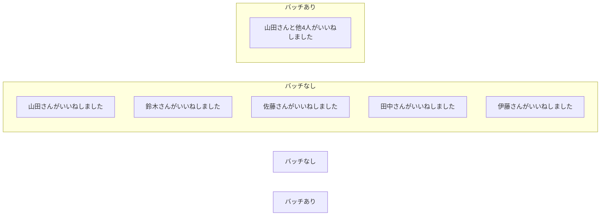

バッチングの実装方針:
1. 短いウィンドウ（例：30秒〜5分）内に同一ユーザーへの同種の通知を集める
2. ウィンドウが満了したときか、バッチサイズが閾値に達したときに配信する
3. 高優先度の通知はバッチングしない

```python
# Batching implementation using sliding window
from datetime import datetime, timedelta

class NotificationBatcher:
    def __init__(self, redis_client, window_seconds: int = 300):
        self.redis = redis_client
        self.window = window_seconds

    def add_to_batch(self, user_id: str, event_type: str, actor_id: str) -> None:
        batch_key = f"notif:batch:{user_id}:{event_type}"
        # Add actor to sorted set with timestamp as score
        score = datetime.utcnow().timestamp()
        self.redis.zadd(batch_key, {actor_id: score})
        self.redis.expire(batch_key, self.window * 2)

    def flush_batch(self, user_id: str, event_type: str) -> list[str]:
        batch_key = f"notif:batch:{user_id}:{event_type}"
        cutoff = (datetime.utcnow() - timedelta(seconds=self.window)).timestamp()

        # Get all actors within the window
        actors = self.redis.zrangebyscore(batch_key, cutoff, "+inf")
        self.redis.delete(batch_key)
        return [a.decode() for a in actors]

    def build_batch_message(self, actors: list[str], event_type: str) -> str:
        if len(actors) == 1:
            return f"{actors[0]}さんが{event_type}しました"
        elif len(actors) <= 3:
            names = "、".join(actors)
            return f"{names}さんが{event_type}しました"
        else:
            return f"{actors[0]}さんと他{len(actors)-1}人が{event_type}しました"
```

---

## 8. ユーザープリファレンス管理

### 8.1 プリファレンスの設計

ユーザーが通知の受け取り方を細かく制御できる仕組みは、通知疲れを防ぐために不可欠である。

プリファレンスのデータモデル:

```sql
-- User notification preferences table
CREATE TABLE notification_preferences (
    user_id         UUID NOT NULL,
    category        VARCHAR(50) NOT NULL,  -- e.g., 'likes', 'comments', 'news'
    channel         VARCHAR(20) NOT NULL,  -- 'push', 'email', 'sms', 'in_app'
    enabled         BOOLEAN NOT NULL DEFAULT TRUE,
    quiet_hours_start TIME,                -- e.g., '22:00'
    quiet_hours_end   TIME,                -- e.g., '08:00'
    frequency       VARCHAR(20) DEFAULT 'realtime',  -- 'realtime', 'hourly', 'daily', 'off'
    PRIMARY KEY (user_id, category, channel)
);

-- Global mute settings (e.g., Do Not Disturb)
CREATE TABLE notification_global_settings (
    user_id         UUID PRIMARY KEY,
    dnd_enabled     BOOLEAN DEFAULT FALSE,
    dnd_start       TIME,
    dnd_end         TIME,
    timezone        VARCHAR(50) DEFAULT 'UTC',
    unsubscribed_all BOOLEAN DEFAULT FALSE
);
```

### 8.2 プリファレンスのチェックフロー

通知を送信する前に、ユーザーのプリファレンスを必ず確認する。

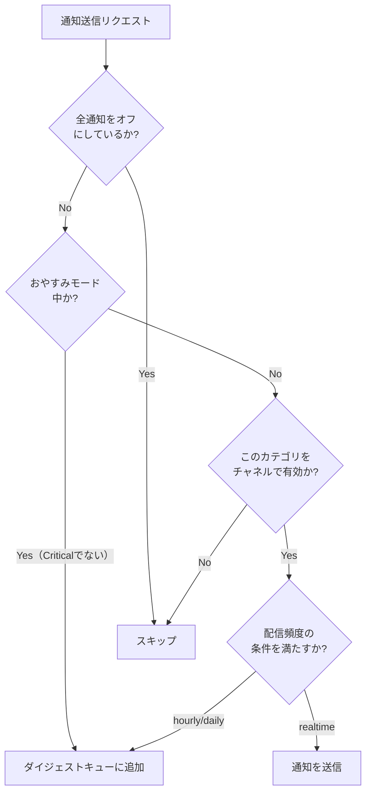

```python
# Preference check service
class PreferenceManager:
    def __init__(self, db, redis_client):
        self.db = db
        self.cache = redis_client

    def should_notify(
        self,
        user_id: str,
        category: str,
        channel: str,
        priority: NotificationPriority,
    ) -> bool:
        # Critical notifications bypass most preference checks
        if priority == NotificationPriority.CRITICAL:
            return not self._is_globally_unsubscribed(user_id)

        # Check global unsubscribe
        if self._is_globally_unsubscribed(user_id):
            return False

        # Check DND (Do Not Disturb)
        if self._is_in_quiet_hours(user_id):
            return False

        # Check per-category per-channel preference
        pref = self._get_preference(user_id, category, channel)
        if pref is None:
            return True  # Default: enabled
        return pref.enabled

    def _is_in_quiet_hours(self, user_id: str) -> bool:
        settings = self._get_global_settings(user_id)
        if not settings or not settings.dnd_enabled:
            return False

        user_tz = pytz.timezone(settings.timezone)
        now_local = datetime.now(user_tz).time()

        start = settings.dnd_start
        end = settings.dnd_end

        if start <= end:
            return start <= now_local <= end
        else:
            # Overnight (e.g., 22:00 - 08:00)
            return now_local >= start or now_local <= end
```

### 8.3 一括配信停止（Unsubscribe）

メール通知においては法的要件（CAN-SPAM法、GDPRなど）として、配信停止の仕組みが必須である。

- **ワンクリックアンサブスクライブ**: RFC 8058準拠の`List-Unsubscribe-Post`ヘッダーをメールに含める
- **プリファレンスセンター**: ユーザーがカテゴリ別・チャネル別に細かく設定できる画面
- **一括停止**: 「すべての通知を停止する」オプション

---

## 9. テンプレートエンジンとパーソナライズ

### 9.1 テンプレートの設計

通知メッセージはハードコードではなく、テンプレートエンジンを通じて動的に生成する。

```
# Template example (Handlebars-like syntax)
title: "{{actor_name}}さんが{{#if count > 1}}と他{{minus count 1}}人が{{/if}}いいねしました"
body:  "あなたの投稿「{{post_title}}」に{{actor_name}}{{#if count > 1}}さんと他{{minus count 1}}人{{else}}さん{{/if}}がいいねしました"

# Rendered result (single actor)
title: "山田さんがいいねしました"
body:  "あなたの投稿「今日の夕食」に山田さんがいいねしました"

# Rendered result (multiple actors)
title: "山田さんと他2人がいいねしました"
body:  "あなたの投稿「今日の夕食」に山田さんと他2人がいいねしました"
```

テンプレートのデータモデル:

```sql
CREATE TABLE notification_templates (
    template_id     UUID PRIMARY KEY,
    category        VARCHAR(50) NOT NULL,
    channel         VARCHAR(20) NOT NULL,
    locale          VARCHAR(10) NOT NULL DEFAULT 'ja',
    title_template  TEXT NOT NULL,
    body_template   TEXT NOT NULL,
    version         INTEGER NOT NULL DEFAULT 1,
    created_at      TIMESTAMP NOT NULL DEFAULT NOW(),
    UNIQUE (category, channel, locale, version)
);
```

### 9.2 多言語対応（i18n）

通知は受信者の言語設定に合わせたテンプレートを使用する。

```python
# Template engine with i18n support
class NotificationTemplateEngine:
    def __init__(self, db):
        self.db = db
        self.templates_cache = {}

    def render(
        self,
        category: str,
        channel: str,
        variables: dict,
        locale: str = "ja",
    ) -> dict:
        template = self._get_template(category, channel, locale)
        if template is None and locale != "ja":
            # Fallback to Japanese
            template = self._get_template(category, channel, "ja")

        return {
            "title": self._render_template(template.title_template, variables),
            "body":  self._render_template(template.body_template, variables),
        }

    def _render_template(self, template_str: str, variables: dict) -> str:
        # Simple Jinja2-based template rendering
        from jinja2 import Environment
        env = Environment()
        tmpl = env.from_string(template_str)
        return tmpl.render(**variables)
```

### 9.3 パーソナライズ

通知はユーザーの行動履歴や属性に基づいてパーソナライズすることで、クリック率（CTR）を大幅に改善できる。

- **名前の挿入**: 「〇〇さん、あなたにおすすめの商品があります」
- **行動ベースのタイミング**: ユーザーがアプリを最もよく開く時間帯に送信する
- **コンテンツのパーソナライズ**: 過去の閲覧・購入履歴に基づいたレコメンデーション
- **チャネルの最適化**: ユーザーがよく反応するチャネル（Push vs Email）を機械学習で選択する

---

## 10. スケーラビリティ — Kafkaの活用

### 10.1 なぜKafkaか

通知システムにKafkaを採用する理由は複数ある。

**高スループット**: Kafkaは1秒あたり数百万メッセージを処理できる。Push通知の一斉配信（例：10万人同時）のような大量書き込みに対応できる。

**耐久性**: メッセージはディスクに永続化される。ワーカーがクラッシュしても、再起動後に中断したところから処理を再開できる。

**Consumer Group**: 複数のワーカーが協調して同一トピックを消費できる。ワーカーを追加するだけで処理能力を線形にスケールアウトできる。

**再生（Replay）**: オフセット管理により、過去のメッセージを再処理できる。バグ修正後の再配信や、新しいチャネルへの後付け配信に活用できる。

### 10.2 Kafkaのトポロジー設計

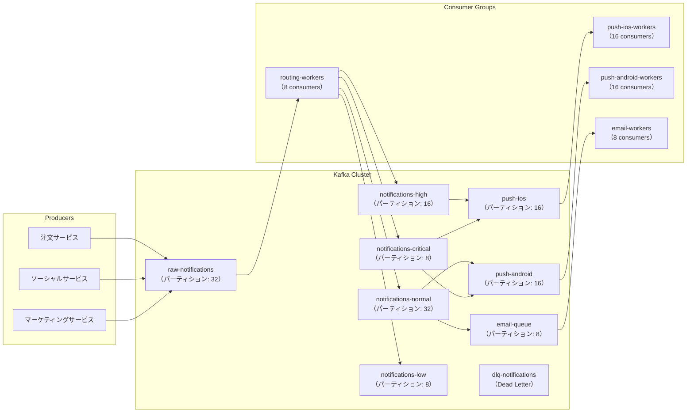

**パーティションキーの選択**:

Kafkaのパーティションキーは処理の並列性と順序保証に影響する。通知システムでは通常、`user_id` をパーティションキーとする。これにより、同一ユーザーへの通知は同じパーティション（同じワーカー）で処理され、順序保証と重複排除が容易になる。

```python
# Kafka producer with user_id as partition key
from confluent_kafka import Producer

producer = Producer({"bootstrap.servers": KAFKA_BROKERS})

def publish_notification(notification: dict) -> None:
    producer.produce(
        topic="raw-notifications",
        key=notification["user_id"].encode(),   # Partition by user_id
        value=json.dumps(notification).encode(),
        on_delivery=delivery_callback,
    )
    producer.poll(0)  # Trigger delivery reports
```

### 10.3 バックプレッシャーの管理

急激なトラフィックスパイク（例：大規模なマーケティングキャンペーン）に対応するため、バックプレッシャーの管理が重要である。

- **Kafkaがバッファとして機能**: 上流サービスがKafkaに書き込んだ時点で処理は完了とみなし、ワーカーは自分のペースで消費する
- **Consumer Lagの監視**: Kafkaのコンシューマーラグ（未処理メッセージ数）を監視し、ラグが大きくなったらワーカーをスケールアウトする
- **レート制限**: 外部サービス（APNs、FCM、SES）のレート制限に応じて、ワーカー側で送信速度を制御する

---

## 11. 通知疲れ対策

### 11.1 通知疲れとは何か

「通知疲れ」（Notification Fatigue）は、ユーザーが過多の通知に慣れてしまい、重要な通知まで無視するようになる現象である。最悪のケースでは、アプリのPush通知を完全に無効化したり、アンインストールに至る。

Appleのデータによると、ユーザーはアプリの通知を無効化する主な理由として「通知が多すぎる」「関連性のない通知が多い」を挙げている。

### 11.2 頻度キャップ

一定時間内に同一ユーザーへ送れる通知の上限を設定する。

```python
# Frequency capping using Redis sliding window
class FrequencyCapper:
    def __init__(self, redis_client):
        self.redis = redis_client

    def check_and_increment(
        self,
        user_id: str,
        channel: str,
        limits: dict,  # e.g., {"per_hour": 3, "per_day": 10}
    ) -> bool:
        now = time.time()

        for period, max_count in limits.items():
            window_seconds = {"per_hour": 3600, "per_day": 86400}[period]
            key = f"freq:{user_id}:{channel}:{period}"

            # Sliding window: remove entries outside the window
            self.redis.zremrangebyscore(key, 0, now - window_seconds)

            # Count current entries in window
            count = self.redis.zcard(key)

            if count >= max_count:
                return False  # Frequency limit exceeded

        # Increment all counters
        for period in limits:
            window_seconds = {"per_hour": 3600, "per_day": 86400}[period]
            key = f"freq:{user_id}:{channel}:{period}"
            self.redis.zadd(key, {str(now): now})
            self.redis.expire(key, window_seconds * 2)

        return True  # Within frequency limits
```

### 11.3 インテリジェントな通知のグルーピングとサマリー

同種の通知を一定時間まとめてから1つのサマリー通知として送る。

```
（個別配信の場合）
- 山田さんがいいねしました
- 鈴木さんがいいねしました
- 佐藤さんがいいねしました
  → Push通知 × 3回

（サマリー配信の場合）
- 山田さんと他2人があなたの投稿にいいねしました
  → Push通知 × 1回
```

### 11.4 機械学習によるスマートスケジューリング

ユーザーがアプリを最もよく開く時間帯、通知に反応しやすい時間帯を学習し、その時間帯に通知を配信することでエンゲージメントを最大化する。

```python
# Smart scheduling: defer non-urgent notifications to optimal time
class SmartScheduler:
    def __init__(self, ml_model, redis_client):
        self.model = ml_model
        self.redis = redis_client

    def get_optimal_send_time(self, user_id: str) -> datetime:
        # Predict the next time the user is likely to be active
        features = self._get_user_features(user_id)
        predicted_active_time = self.model.predict(features)
        return predicted_active_time

    def schedule_if_low_priority(
        self,
        notification: dict,
        priority: NotificationPriority,
    ) -> None:
        if priority in (NotificationPriority.NORMAL, NotificationPriority.LOW):
            optimal_time = self.get_optimal_send_time(notification["user_id"])
            delay = max(0, (optimal_time - datetime.utcnow()).total_seconds())

            if delay > 0 and delay < 3600:  # Defer up to 1 hour
                # Add to scheduled queue with delay
                self.redis.zadd(
                    "scheduled-notifications",
                    {json.dumps(notification): time.time() + delay},
                )
                return

        # Send immediately
        send_notification(notification)
```

### 11.5 チャネル最適化

ユーザーが各チャネルにどれだけ反応するかを追跡し、反応率の高いチャネルを優先する。

```python
# Channel engagement tracking
class ChannelEngagementTracker:
    def record_delivery(self, user_id: str, channel: str, notification_id: str) -> None:
        key = f"engagement:{user_id}:{channel}:delivered"
        self.redis.incr(key)
        self.redis.expire(key, 30 * 86400)  # 30-day window

    def record_open(self, user_id: str, channel: str, notification_id: str) -> None:
        key = f"engagement:{user_id}:{channel}:opened"
        self.redis.incr(key)
        self.redis.expire(key, 30 * 86400)

    def get_engagement_rate(self, user_id: str, channel: str) -> float:
        delivered = int(self.redis.get(f"engagement:{user_id}:{channel}:delivered") or 0)
        opened    = int(self.redis.get(f"engagement:{user_id}:{channel}:opened") or 0)
        if delivered == 0:
            return 0.5  # Default when no data
        return opened / delivered

    def select_best_channel(self, user_id: str, available_channels: list[str]) -> str:
        rates = {ch: self.get_engagement_rate(user_id, ch) for ch in available_channels}
        return max(rates, key=rates.get)
```

---

## 12. 実装における考慮事項

### 12.1 データベース設計

通知データは大量に蓄積するため、パーティショニングとアーカイブ戦略が重要である。

```sql
-- Notifications table with range partitioning by created_at
CREATE TABLE notifications (
    id              UUID NOT NULL DEFAULT gen_random_uuid(),
    user_id         UUID NOT NULL,
    category        VARCHAR(50) NOT NULL,
    channel         VARCHAR(20) NOT NULL,
    title           TEXT,
    body            TEXT NOT NULL,
    metadata        JSONB DEFAULT '{}',
    status          VARCHAR(20) NOT NULL DEFAULT 'pending',
    priority        SMALLINT NOT NULL DEFAULT 3,
    idempotency_key VARCHAR(64) UNIQUE,
    read_at         TIMESTAMP,
    delivered_at    TIMESTAMP,
    created_at      TIMESTAMP NOT NULL DEFAULT NOW(),
    PRIMARY KEY (id, created_at)
) PARTITION BY RANGE (created_at);

-- Monthly partitions
CREATE TABLE notifications_2026_03
    PARTITION OF notifications
    FOR VALUES FROM ('2026-03-01') TO ('2026-04-01');

CREATE TABLE notifications_2026_04
    PARTITION OF notifications
    FOR VALUES FROM ('2026-04-01') TO ('2026-05-01');

-- Indexes for common query patterns
CREATE INDEX idx_notifications_user_unread
    ON notifications (user_id, created_at DESC)
    WHERE read_at IS NULL;

CREATE INDEX idx_notifications_status
    ON notifications (status, created_at)
    WHERE status = 'pending';
```

### 12.2 デバイストークン管理

デバイストークンのストレージ設計:

```sql
CREATE TABLE device_tokens (
    id          UUID PRIMARY KEY DEFAULT gen_random_uuid(),
    user_id     UUID NOT NULL,
    platform    VARCHAR(10) NOT NULL,  -- 'ios', 'android'
    token       TEXT NOT NULL,
    app_version VARCHAR(20),
    os_version  VARCHAR(20),
    is_active   BOOLEAN NOT NULL DEFAULT TRUE,
    last_used_at TIMESTAMP,
    created_at  TIMESTAMP NOT NULL DEFAULT NOW(),
    UNIQUE (user_id, token)
);

CREATE INDEX idx_device_tokens_user_active
    ON device_tokens (user_id, platform)
    WHERE is_active = TRUE;
```

### 12.3 監視とアラート

通知システムの健全性を監視する主要メトリクス:

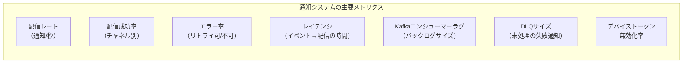

アラートのしきい値例:
- 配信成功率が95%を下回る → PagerDuty通知
- Kafkaコンシューマーラグが10万件を超える → スケールアウトトリガー
- DLQに1時間で100件以上積まれる → Slack通知
- APNs/FCMのレート制限エラーが急増 → バックオフ設定の見直し

---

## 13. まとめ

通知システムは、単純に見えて多くの複雑さを秘めたシステムである。本記事で解説した要点を整理する。

**チャネルの多様性への対処**: Push（APNs/FCM）、Email、In-App、SMS、Webhookはそれぞれ異なる技術的制約を持つ。統一的なインターフェースでラップし、チャネル固有の詳細を隠蔽するアーキテクチャが有効である。

**Fan-outの設計は要件次第**: Fan-out on Writeは読み取りレイテンシを下げるが書き込みコストが高い。Fan-out on Readはその逆。大規模サービスではフォロワー数に応じたハイブリッドアプローチが現実的な選択肢である。

**Kafkaは通知システムのバックボーン**: 高スループット、耐久性、Consumer Groupによるスケールアウト、メッセージの再生可能性など、通知システムの要件とKafkaの特性は非常に相性が良い。

**配信保証は複雑なトレードオフ**: at-least-once配信を実現するには指数バックオフとDLQが必要であり、その副作用である重複配信を防ぐためには冪等なメッセージIDとRedisベースの重複排除が有効である。

**ユーザー体験が最終的なKPI**: 技術的に完璧な通知システムも、ユーザーが通知を無効化してしまえば意味がない。プリファレンス管理、頻度キャップ、インテリジェントなバッチング、スマートスケジューリングなど、通知疲れ防止の仕組みを最初から設計に組み込むことが重要である。

::: tip 段階的な設計のすすめ
通知システムを一から構築する場合、最初からKafkaやFan-out on Write/Readの複雑な組み合わせを実装する必要はない。まずはシンプルなRDBMSベースのキューと1チャネル（例：Email）から始め、スケールの課題が現れてから段階的に複雑さを追加するアプローチが現実的である。過度な先行最適化は開発コストを増大させるだけである。
:::
