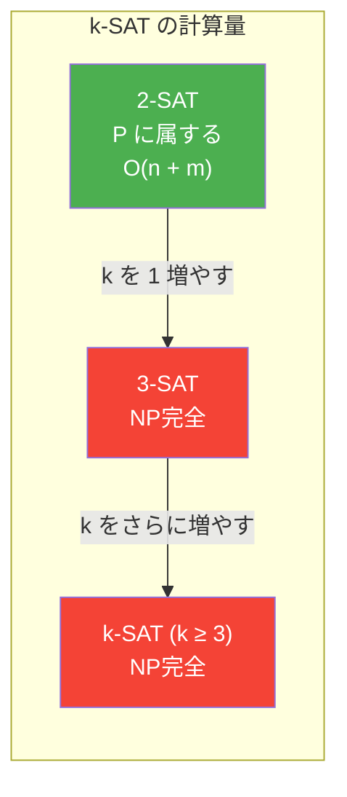
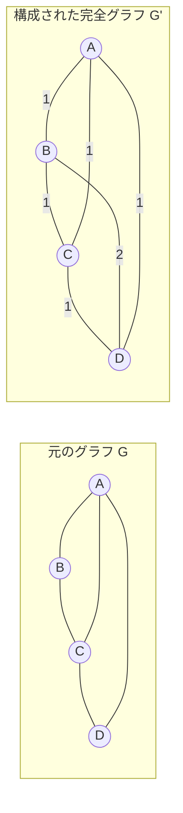
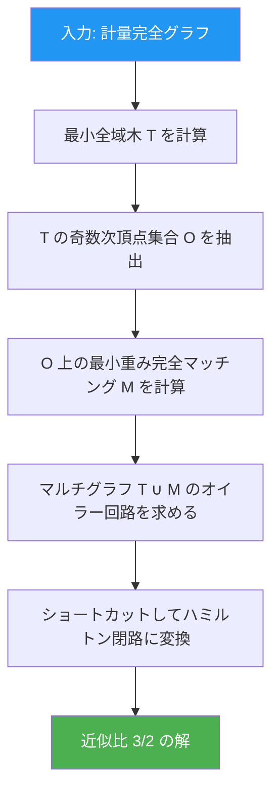
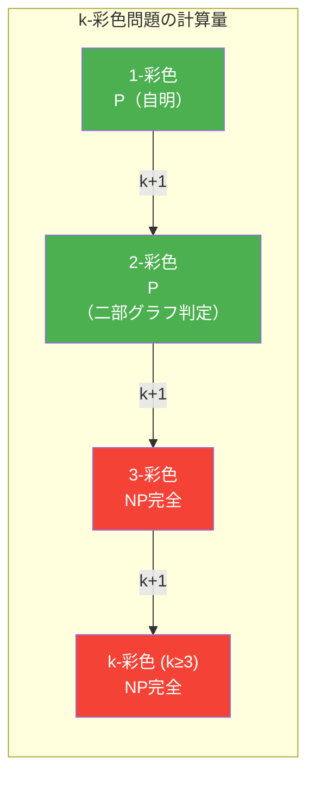
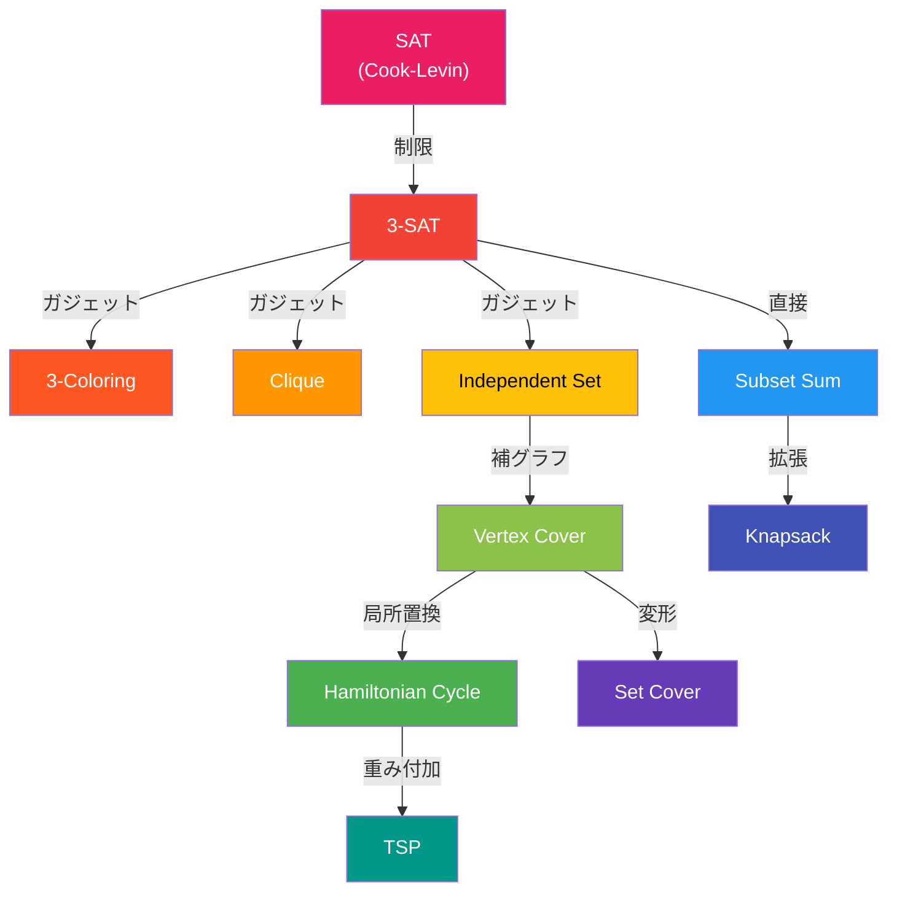
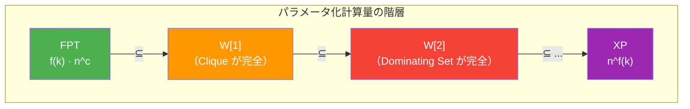
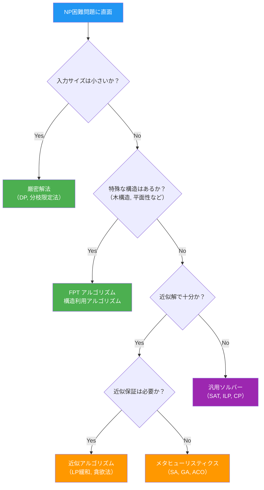

# NP困難問題と代表例（TSP, SAT, Graph Coloring）

## 1. 計算量理論の背景と本記事の位置づけ

計算量理論は、問題を解くために必要な計算資源（時間・空間）の**本質的な量**を研究する分野である。ある問題が「難しい」と言うとき、単に「良いアルゴリズムがまだ見つかっていない」のか、それとも「原理的に効率的なアルゴリズムが存在しえない」のかを区別することが、この理論の根幹的な問いとなる。

本記事の前提となる概念――クラス P、NP、NP完全の定義や P $\neq$ NP 予想――については、姉妹記事「[P, NP, NP完全](/p-np)」で詳しく解説している。本記事では、その知識を前提として、**NP困難（NP-hard）** という概念をより掘り下げ、代表的な NP困難問題である SAT、TSP、グラフ彩色問題を中心に、以下の論点を深く議論する。

- NP困難・NP完全の厳密な定義と両者の関係
- 多項式時間還元と完全性証明の技法
- 各問題の構造、変種、応用
- 近似アルゴリズム、ヒューリスティクス、固定パラメータ容易性などの「NP困難問題への対処法」

### 1.1 なぜ NP困難問題を学ぶのか

実務においてアルゴリズムの設計者が最初に行うべきことは、対象の問題がどの計算量クラスに属するかを見極めることである。もし問題が NP困難であると判明すれば、多項式時間の厳密解アルゴリズムを求めて無駄に時間を費やすことを避けられる。代わりに、近似アルゴリズム、ヒューリスティクス、あるいは問題の構造を利用した固定パラメータアルゴリズムなど、現実的な戦略へと方針を切り替えることができる。

NP困難性の証明は、計算量理論の単なる学術的演習ではなく、**実務的な意思決定を支える道具**である。

## 2. P, NP, NP完全, NP困難の定義と関係

### 2.1 各クラスの簡潔な定義

計算量クラスの議論では、問題を**決定問題**（答えが YES/NO のいずれか）として定式化するのが標準的である。

| クラス | 定義 |
|-------|------|
| **P** | 決定性チューリングマシンで多項式時間に決定可能な言語の集合 |
| **NP** | 非決定性チューリングマシンで多項式時間に決定可能な言語の集合。同等の定義として、YES インスタンスに対して多項式サイズの**証拠（certificate）**が存在し、それを多項式時間で**検証**できる言語の集合 |
| **NP完全** | NP に属し、かつ NP 中のすべての問題から多項式時間還元可能な言語の集合 |
| **NP困難** | NP 中のすべての問題から多項式時間還元可能な問題の集合（NP に属するとは限らない） |

### 2.2 NP完全と NP困難の決定的な違い

NP完全と NP困難はしばしば混同されるが、その関係は明確である。

$$
\text{NP完全} = \text{NP困難} \cap \text{NP}
$$

すなわち、NP完全問題は「NP困難であり、かつ NP に属する」問題である。一方、NP困難問題は NP に属する必要がない。この区別は重要である。たとえば、**停止問題（Halting Problem）** は NP困難であるが、そもそも決定不能であるため NP には属さない。


::: tip Ladnerの定理
もし $\text{P} \neq \text{NP}$ であれば、NP に属するが P にも NP完全にも属さない問題（**NP中間問題**）が存在する。これは Ladner (1975) によって証明された。グラフ同型問題や素因数分解の決定版は、NP中間問題の候補とされている。
:::

### 2.3 最適化問題と NP困難

決定問題に限定される NP完全とは異なり、NP困難は最適化問題や関数問題など、あらゆる種類の問題を含みうる。たとえば、

- 巡回セールスマン問題の**最適化版**（最短巡回路を求めよ）は NP困難だが、決定問題ではないため NP完全ではない
- 停止問題は NP困難だが、決定不能であるため NP にすら属さない
- $\text{PSPACE}$完全問題（例：QBF — 量化ブール式の充足可能性）は NP困難であり、NP を包含するクラスに属する

### 2.4 多項式時間還元

問題 $A$ から問題 $B$ への**多項式時間多対一還元（Karp reduction）**とは、多項式時間で計算可能な関数 $f$ が存在して、

$$
x \in A \iff f(x) \in B
$$

が任意の入力 $x$ について成り立つことをいう。これを $A \leq_p B$ と書く。直感的には、「$B$ が解ければ $A$ も解ける」ことを意味する。したがって、$B$ は少なくとも $A$ と同程度に難しい。

**Cook還元（Turing reduction）** はより強力な還元であり、問題 $B$ のオラクル（サブルーチン）を多項式回呼び出すことで問題 $A$ を解く。NP完全性の議論では通常 Karp 還元を用いるが、NP困難性の議論では Cook 還元を用いることもある。

## 3. SAT問題（充足可能性問題）とCook-Levinの定理

### 3.1 SAT の定義

**SAT（Boolean Satisfiability Problem）** は、命題論理の式が与えられたとき、変数への真偽値の割り当てによってその式全体を真にできるかどうかを判定する問題である。

形式的に述べる。ブール変数 $x_1, x_2, \ldots, x_n$ の上に構築された命題論理式 $\varphi$ が与えられたとき、

$$
\exists\ (a_1, a_2, \ldots, a_n) \in \{0, 1\}^n \text{ s.t. } \varphi(a_1, a_2, \ldots, a_n) = 1
$$

を満たす割り当てが存在するかどうかを判定するのが SAT 問題である。

### 3.2 連言標準形と k-SAT

SAT の重要な変種として、論理式を**連言標準形（CNF: Conjunctive Normal Form）** で表現したものがある。CNF 式は**節（clause）**の連言（AND）であり、各節はリテラル（変数またはその否定）の選言（OR）である。

$$
\varphi = (x_1 \lor \neg x_3 \lor x_5) \land (\neg x_1 \lor x_2 \lor x_4) \land (\neg x_2 \lor \neg x_4 \lor x_3)
$$

各節に含まれるリテラルの数が最大 $k$ 個に制限された SAT を **$k$-SAT** と呼ぶ。

- **2-SAT** は P に属する（含意グラフ上の強連結成分分解で線形時間に解ける）
- **3-SAT** は NP完全である
- $k \geq 3$ のすべての $k$-SAT は NP完全である

この「$k = 2$ と $k = 3$ の間の断崖」は、計算量理論における最も劇的な閾値現象の一つである。



### 3.3 Cook-Levin の定理

**Cook-Levin の定理**（Cook 1971, Levin 1973 が独立に証明）は、計算量理論の金字塔であり、SAT が NP完全であることを示す。

> **定理（Cook-Levin）**. SAT は NP完全である。

**証明の概略：**

1. **SAT $\in$ NP** であることは明らか。充足する割り当てが証拠として与えられれば、それを多項式時間で検証できる。

2. **NP困難性の証明**が本質的に難しい部分である。任意の NP 問題 $L$ に対して $L \leq_p \text{SAT}$ を示す必要がある。
   - $L \in \text{NP}$ であるから、$L$ を多項式時間 $p(n)$ で受理する非決定性チューリングマシン $M$ が存在する
   - 入力 $w$ に対する $M$ の計算過程全体（$p(|w|)$ ステップ分のテープ内容、ヘッド位置、状態遷移）をブール変数で符号化する
   - $M$ が $w$ を受理するための必要十分条件を、これらの変数に関する CNF 式 $\varphi_w$ として多項式時間で構成する
   - $w \in L \iff \varphi_w \in \text{SAT}$ が成り立つ

この証明は、あらゆる NP 問題を SAT へと体系的に還元する方法を提供しており、SAT が NP のすべての問題の「少なくとも同じくらい難しい」ことを保証する。

### 3.4 SAT ソルバーの実用的成功

理論的には NP完全であるにもかかわらず、現代の SAT ソルバーは実用上非常に強力である。最先端の CDCL（Conflict-Driven Clause Learning）ベースのソルバーは、数百万の変数と節を持つ実問題を解くことができる。

SAT ソルバーの主要な技術は以下の通りである。

| 技法 | 概要 |
|-----|------|
| **DPLL** | Davis-Putnam-Logemann-Loveland アルゴリズム。バックトラッキング探索に単位伝播と純リテラル除去を組み合わせる |
| **CDCL** | 矛盾（conflict）から学習節を生成し、非時系列バックトラッキングを行う。現代 SAT ソルバーの基盤 |
| **VSIDS** | Variable State Independent Decaying Sum。最近の矛盾に関与した変数を優先的に選択する分岐ヒューリスティクス |
| **Watched Literals** | 各節について 2 つのリテラルのみを監視し、単位伝播の効率を劇的に改善する |

```python
def dpll(formula, assignment):
    """
    Basic DPLL algorithm for SAT solving.
    Returns a satisfying assignment or None if unsatisfiable.
    """
    # Unit propagation
    formula, assignment = unit_propagate(formula, assignment)

    # Check if formula is satisfied
    if formula == []:
        return assignment  # All clauses satisfied
    if [] in formula:
        return None  # Empty clause found -> conflict

    # Choose an unassigned variable
    var = choose_variable(formula)

    # Try assigning True
    result = dpll(
        simplify(formula, var, True),
        assignment | {var: True}
    )
    if result is not None:
        return result

    # Try assigning False (backtrack)
    return dpll(
        simplify(formula, var, False),
        assignment | {var: False}
    )
```

::: details SAT が使われている領域
SAT ソルバーは、ハードウェア検証（回路の等価性チェック）、ソフトウェア検証（BMC: Bounded Model Checking）、パッケージ依存解決、自動計画、暗号解析、組合せ設計など、極めて広範な領域で利用されている。「NP完全だから実用的には使えない」という素朴な直感は、SAT に関しては大きく覆されている。
:::

### 3.5 SAT の変種と拡張

SAT には多数の変種が存在し、それぞれ異なる計算量をもつ。

- **MAX-SAT**：充足可能な節の数を最大化する。NP困難（最適化問題）
- **#SAT**：充足する割り当ての数を数える。#P完全であり、NP困難より厳密に難しいと考えられている
- **QBF（Quantified Boolean Formula）**：全称量化子と存在量化子を許す。PSPACE完全
- **Horn-SAT**：各節に正リテラルが最大 1 つ。P に属する（線形時間で解ける）
- **XOR-SAT**：節が XOR で結合される。P に属する（ガウスの消去法で解ける）

## 4. TSP（巡回セールスマン問題）

### 4.1 問題の定義

**巡回セールスマン問題（Travelling Salesman Problem, TSP）** は、組合せ最適化の最も象徴的な問題の一つである。

> $n$ 個の都市と、すべての都市間の距離が与えられたとき、各都市をちょうど一度ずつ訪問して出発地に戻る巡回路のうち、総距離が最小のものを求めよ。

形式的には、完全重み付きグラフ $G = (V, E, w)$ が与えられたとき、すべての頂点を一度ずつ訪れるハミルトン閉路のうち、辺の重みの総和が最小のものを求める。

**決定問題版**は以下のように定式化される。

$$
\text{TSP-Decision} = \{ \langle G, k \rangle \mid G \text{ に総コスト } \leq k \text{ のハミルトン閉路が存在する} \}
$$

### 4.2 TSP の NP困難性

TSP の決定問題版は NP完全であることが証明されている。NP 属性は明らかである（ハミルトン閉路が証拠として与えられれば、多項式時間でその総コストが $k$ 以下かを検証できる）。NP困難性は、ハミルトン閉路問題（HAMCYCLE）からの還元で示される。

**還元の構成**（HAMCYCLE $\leq_p$ TSP-Decision）：

グラフ $G = (V, E)$ が与えられたとき、以下の完全重み付きグラフ $G' = (V, E', w)$ を構成する。

$$
w(u, v) = \begin{cases}
1 & \text{if } (u, v) \in E \\
2 & \text{if } (u, v) \notin E
\end{cases}
$$

このとき、$G$ にハミルトン閉路が存在する $\iff$ $G'$ に総コスト $|V|$ 以下のハミルトン閉路が存在する。



### 4.3 TSP の変種

TSP にはさまざまな制約を加えた変種があり、それぞれ異なる計算量と近似可能性をもつ。

**距離の性質による分類：**

| 変種 | 制約 | 計算量 | 近似可能性 |
|-----|------|--------|-----------|
| **一般 TSP** | なし | NP困難 | 定数近似不可（P $\neq$ NP の下） |
| **計量 TSP** | 三角不等式を満たす | NP困難 | $\frac{3}{2}$-近似（Christofides） |
| **ユークリッド TSP** | ユークリッド距離 | NP困難 | PTAS が存在（Arora, Mitchell） |
| **非対称 TSP (ATSP)** | $d(i,j) \neq d(j,i)$ を許す | NP困難 | $O(\log n / \log \log n)$-近似 |

### 4.4 TSP の厳密解法

素朴な全探索は $(n-1)!/2$ 通りの巡回路を列挙するため、$n = 20$ 程度で既に実用不能になる。しかし、いくつかの厳密解法が知られている。

**Held-Karp アルゴリズム（動的計画法）：**

集合 $S \subseteq V$ と終端頂点 $v \in S$ について、出発頂点を $1$ として $S$ 内の全頂点を訪問して $v$ で終わる最短パスの長さを $\text{dp}[S][v]$ とする。

$$
\text{dp}[S][v] = \min_{u \in S \setminus \{v\}} \left( \text{dp}[S \setminus \{v\}][u] + d(u, v) \right)
$$

初期条件：$\text{dp}[\{1\}][1] = 0$

最適解：$\min_{v \neq 1} \left( \text{dp}[V][v] + d(v, 1) \right)$

時間計算量は $O(2^n \cdot n^2)$、空間計算量は $O(2^n \cdot n)$ である。素朴な $O(n!)$ と比べて大幅な改善だが、依然として指数時間である。

```python
def held_karp(dist):
    """
    Held-Karp algorithm for TSP using dynamic programming.
    dist: n x n distance matrix
    Returns: minimum tour cost
    """
    n = len(dist)
    # dp[(visited_set, current_vertex)] = min cost
    dp = {}

    # Base case: start at vertex 0
    for k in range(1, n):
        dp[(1 << k, k)] = dist[0][k]

    # Iterate over subsets of increasing size
    for size in range(2, n):
        for subset in combinations(range(1, n), size):
            bits = sum(1 << b for b in subset)
            for last in subset:
                prev_bits = bits & ~(1 << last)
                dp[(bits, last)] = min(
                    dp[(prev_bits, prev)] + dist[prev][last]
                    for prev in subset if prev != last
                )

    # Complete the tour by returning to vertex 0
    full = (1 << n) - 2  # All vertices except 0
    return min(dp[(full, k)] + dist[k][0] for k in range(1, n))
```

**分枝限定法（Branch and Bound）：**

実際の TSP ソルバーでは、分枝限定法が広く用いられる。各部分問題に対して下界（たとえば 1-tree 緩和や線形計画緩和）を計算し、最良解の上界を超える部分木を枝刈りする。Concorde ソルバーは、この手法を高度に最適化しており、数万都市規模の問題を厳密に解くことができる。

### 4.5 TSP の近似アルゴリズム

計量 TSP（三角不等式を満たす場合）に対しては、多項式時間の近似アルゴリズムが知られている。

**最近傍法（Nearest Neighbor Heuristic）：**

最も単純なヒューリスティクスであり、未訪問の最近隣の都市に逐次移動する。近似比は $O(\log n)$ であり、最悪ケースでは良い保証を与えないが、実用上は高速かつそこそこ良い解を返す。

**Christofides のアルゴリズム（1976）：**

1. 最小全域木 $T$ を構成する
2. $T$ の奇数次頂点の集合に対して最小重みの完全マッチング $M$ を求める
3. $T \cup M$ からオイラー回路を構成する
4. ショートカットによりハミルトン閉路に変換する

このアルゴリズムの近似比は $\frac{3}{2}$ であり、計量 TSP に対する多項式時間近似アルゴリズムとしては約50年にわたって最良であった。2020年、Karlin, Klein, Oveis Gharan が近似比を $\frac{3}{2} - \epsilon$ に改善した（$\epsilon \approx 10^{-36}$ と極めて小さいが、理論的なブレイクスルーである）。



## 5. グラフ彩色問題

### 5.1 問題の定義

**グラフ彩色問題（Graph Coloring Problem）** とは、無向グラフ $G = (V, E)$ の各頂点に色を割り当てる際に、隣接する頂点には異なる色を使うという制約の下で、必要な色数を最小化する問題である。

グラフ $G$ を $k$ 色で正しく彩色できるかどうかを判定する決定問題を **$k$-彩色問題（$k$-Coloring）** と呼ぶ。$G$ を正しく彩色するために必要な最小の色数を $G$ の**彩色数（chromatic number）**と呼び、$\chi(G)$ と書く。

$$
\text{$k$-Coloring} = \{ \langle G \rangle \mid \chi(G) \leq k \}
$$

### 5.2 計算量の分類

$k$ の値によって計算量が劇的に変化する。

- **$1$-彩色問題**：グラフに辺がないかどうかの判定。$O(|E|)$ で解ける
- **$2$-彩色問題**：グラフが二部グラフかどうかの判定。BFS/DFS で $O(|V| + |E|)$ で解ける
- **$3$-彩色問題**：NP完全
- **$k$-彩色問題（$k \geq 3$）**：NP完全

ここでも、SAT と同様に $k = 2$ と $k = 3$ の間に計算量の断崖が存在する。



### 5.3 3-彩色問題の NP完全性

3-彩色問題が NP完全であることは、3-SAT からの還元で証明される。

**還元の概略**（3-SAT $\leq_p$ 3-Coloring）：

3-SAT の式 $\varphi$ が $n$ 個の変数 $x_1, \ldots, x_n$ と $m$ 個の節 $C_1, \ldots, C_m$ を持つとする。以下のグラフ $G$ を構成する。

1. **基本構造**：3つの特別な頂点 $T$（真）、$F$（偽）、$B$（ベース）を互いに接続する（三角形を形成）
2. **変数ガジェット**：各変数 $x_i$ に対して、頂点 $x_i$ と $\overline{x_i}$ を作り、互いに辺で結び、さらに両方を $B$ と辺で結ぶ。これにより、3-彩色では $x_i$ は $T$ の色か $F$ の色のどちらかを取ることが強制される
3. **節ガジェット**：各節 $C_j$ に対して、その 3 つのリテラルの少なくとも 1 つが $T$ の色でなければならないことを強制する小グラフを構成する

この還元は多項式時間で行え、$\varphi$ が充足可能 $\iff$ $G$ が 3-彩色可能であることが示される。

### 5.4 彩色多項式

グラフ $G$ に対する**彩色多項式（chromatic polynomial）** $P(G, k)$ は、$G$ を $k$ 色で正しく彩色する方法の数を与える多項式である。

**削除-縮約の漸化式：**

任意の辺 $e = (u, v)$ に対して、

$$
P(G, k) = P(G - e, k) - P(G / e, k)
$$

ここで $G - e$ は辺 $e$ を削除したグラフ、$G / e$ は辺 $e$ を縮約したグラフである。

完全グラフ $K_n$ では $P(K_n, k) = k(k-1)(k-2)\cdots(k-n+1) = k^{(n)}$（下降階乗）であり、空グラフ $\overline{K_n}$ では $P(\overline{K_n}, k) = k^n$ となる。

### 5.5 応用

グラフ彩色は、以下のような多くの実用問題にモデル化される。

- **レジスタ割り当て**：コンパイラの最適化フェーズにおいて、変数を物理レジスタに割り当てる問題。干渉グラフの頂点彩色に帰着される
- **スケジューリング**：資源の競合を辺で表現し、タイムスロットを色で表現する
- **周波数割り当て**：無線通信において、干渉するセル間で異なる周波数を割り当てる
- **地図の彩色**：4色定理は平面グラフが常に4色で彩色可能であることを保証するが、一般グラフの彩色は NP困難

## 6. その他の代表的な NP困難問題

NP困難問題の世界は広大であり、SAT、TSP、グラフ彩色の他にも多数の重要な問題が存在する。ここでは、特に実用上重要な問題をいくつか取り上げる。

### 6.1 ナップサック問題

> $n$ 個のアイテムがあり、各アイテム $i$ は重さ $w_i$ と価値 $v_i$ をもつ。容量 $W$ のナップサックに入れるアイテムの組合せのうち、価値の合計を最大化するものを求めよ。

0/1ナップサック問題の決定問題版は NP完全である。ただし、この問題は**擬多項式時間（pseudo-polynomial time）** アルゴリズムを持つ。動的計画法により $O(nW)$ で解けるが、$W$ が入力サイズ（$\log W$ ビット）に対して指数的に大きくなる場合は多項式時間にならない。

$$
\text{dp}[i][j] = \max(\text{dp}[i-1][j],\ \text{dp}[i-1][j - w_i] + v_i)
$$

ナップサック問題は FPTAS（完全多項式時間近似スキーム）を持ち、任意の $\epsilon > 0$ に対して $(1 - \epsilon)$ 倍の近似解を $O(n^2 / \epsilon)$ 時間で求められる。

### 6.2 集合被覆問題

> 全体集合 $U = \{1, 2, \ldots, n\}$ と、その部分集合の族 $\mathcal{S} = \{S_1, S_2, \ldots, S_m\}$ が与えられる。$U$ 全体を被覆する最小個数の部分集合を選べ。

集合被覆問題は NP困難であり、かつ $\ln n$ より良い近似比を多項式時間で達成することは（P $\neq$ NP の下で）不可能であることが証明されている。一方、貪欲法（最も多くの未被覆要素をカバーする集合を逐次選ぶ）は $H_n = \ln n + O(1)$ の近似比を達成し、これは本質的に最良である。

### 6.3 ハミルトン閉路問題

> グラフ $G$ にすべての頂点をちょうど一度ずつ通る閉路（ハミルトン閉路）は存在するか？

ハミルトン閉路問題は NP完全である。オイラー閉路（すべての**辺**をちょうど一度ずつ通る閉路）の存在判定が P に属する（各頂点の次数がすべて偶数かどうかを確認するだけ）のとは好対照である。この対比は、「頂点」と「辺」という一見些細な違いが計算量に劇的な差をもたらす例として、しばしば引用される。

### 6.4 クリーク問題

> グラフ $G$ にサイズ $k$ 以上のクリーク（完全部分グラフ）は存在するか？

クリーク問題は NP完全であり、近似困難性の観点でも際立っている。Hastad (1996) の結果により、$n^{1-\epsilon}$ 倍より良い近似は NP $\neq$ ZPP でない限り不可能である。これは、NP困難問題の中でも最も近似が難しい問題の一つである。

### 6.5 整数線形計画問題

> $A\mathbf{x} \leq \mathbf{b}$, $\mathbf{x} \in \mathbb{Z}^n$ の下で $\mathbf{c}^T\mathbf{x}$ を最大化せよ。

通常の線形計画（LP）は P に属する（楕円体法、内点法）が、変数が整数に制約されると NP困難になる。多くの組合せ最適化問題は整数線形計画（ILP）として定式化でき、LP 緩和は有力な下界を提供する。

## 7. 多項式時間還元と完全性証明の技法

### 7.1 NP完全性証明のレシピ

問題 $X$ が NP完全であることを証明するには、以下の 2 つのステップを踏む。

1. **$X \in \text{NP}$ を示す**：YES インスタンスに対する多項式サイズの証拠を定義し、それを多項式時間で検証できることを示す
2. **既知の NP完全問題 $Y$ から $X$ への多項式時間還元 $Y \leq_p X$ を示す**：
   - 問題 $Y$ の任意のインスタンス $I_Y$ を、$X$ のインスタンス $I_X$ に多項式時間で変換する関数 $f$ を構成する
   - $I_Y$ が YES $\iff$ $f(I_Y)$ が YES であることを証明する

### 7.2 還元の設計パターン

NP完全性の証明で用いられる還元には、いくつかの典型的なパターンがある。

**ガジェットによる還元：**

3-SAT から別の問題への還元で最も頻繁に用いられる手法。変数ガジェットと節ガジェットを設計し、「変数の真偽値の選択」と「節の充足」を目標問題の構造で模倣する。グラフ彩色問題への還元（前述）が代表例である。

**制限による還元：**

問題の入力を特殊な形に制限しても NP困難であることを示す手法。たとえば、3-SAT は SAT の特殊ケース（各節のリテラル数が 3）だが NP完全であり、これは SAT の NP困難性を「制限」によって継承している。

**局所的な置き換えによる還元：**

入力のローカルな構造を別の構造で置き換える手法。たとえば、3-SAT を 3-Coloring に還元する際に、各変数と各節を独立なガジェットで表現するのがこの手法の一例である。



上図は、主要な NP完全問題間の還元の連鎖を示している。Cook-Levin の定理で SAT が NP完全であることが証明され、そこから多項式時間還元の連鎖を通じて、多くの問題の NP完全性が証明されてきた。

### 7.3 Karp の 21 問題

Richard Karp (1972) は、Cook-Levin の定理の直後に、SAT からの多項式時間還元の連鎖を用いて **21 の NP完全問題**を一気に示した。これは計算量理論の歴史において画期的な論文であり、NP完全性が特定の 1 問題に限られた現象ではなく、極めて広範な組合せ問題に共通する性質であることを明らかにした。

Karp の 21 問題には、CLIQUE、VERTEX COVER、SET COVER、HAMILTONIAN CYCLE、KNAPSACK、3-SAT、CHROMATIC NUMBER などが含まれる。

## 8. 近似アルゴリズムとヒューリスティクス

NP困難問題に対して厳密な最適解を多項式時間で求めることは（P $\neq$ NP の下で）不可能であるから、現実的な対処法が必要になる。ここでは、主要なアプローチを概観する。

### 8.1 近似アルゴリズム

**近似比**の定義：最大化問題に対して、アルゴリズムの出力値を $A(I)$、最適値を $\text{OPT}(I)$ とするとき、すべてのインスタンス $I$ に対して

$$
\frac{\text{OPT}(I)}{A(I)} \leq \alpha
$$

が成り立つとき、このアルゴリズムは近似比 $\alpha$ を持つという（$\alpha \geq 1$）。最小化問題の場合は $A(I) / \text{OPT}(I) \leq \alpha$ とする。

**近似アルゴリズムの階層：**

| 近似クラス | 定義 | 例 |
|-----------|------|-----|
| **PTAS** | 任意の $\epsilon > 0$ に対し $(1+\epsilon)$-近似を多項式時間で達成 | ユークリッド TSP |
| **FPTAS** | PTAS かつ実行時間が $1/\epsilon$ の多項式 | ナップサック |
| **定数近似** | 固定の定数 $\alpha$ の近似比 | 計量 TSP (3/2), Vertex Cover (2) |
| **対数近似** | 近似比が $O(\log n)$ | 集合被覆 |
| **近似不能** | 定数近似が不可能（P $\neq$ NP の下） | 一般 TSP, Clique |

::: warning 近似困難性
すべての NP困難問題が良い近似アルゴリズムを持つわけではない。PCP 定理（Arora et al., 1998）は、多くの NP困難問題の近似困難性を証明するための強力なツールを提供した。たとえば、MAX-3-SAT を $7/8 + \epsilon$ よりも良く近似することは NP困難であり、一般 TSP に対して任意の定数近似を達成することも NP困難である。
:::

### 8.2 メタヒューリスティクス

理論的な近似保証はないが、実用上は非常に良い解を返すことが多い汎用的な探索手法群がメタヒューリスティクスである。

**焼きなまし法（Simulated Annealing）：**

物理学における焼きなまし過程に着想を得た確率的探索手法。高温（温度パラメータ $T$ が高い）のときは劣化する解への移動を高確率で受け入れ、温度を徐々に下げることで局所最適解からの脱出を図る。

$$
P(\text{accept}) = \begin{cases}
1 & \text{if } \Delta E \leq 0 \\
e^{-\Delta E / T} & \text{if } \Delta E > 0
\end{cases}
$$

**遺伝的アルゴリズム（Genetic Algorithm）：**

生物の進化に着想を得た手法。解の集団（個体群）に対して、選択・交叉・突然変異の操作を繰り返し適用し、適応度の高い解を進化的に探索する。TSP では、順序交叉（OX）や 2-opt 局所探索と組み合わせることが一般的である。

**タブー探索（Tabu Search）：**

局所探索に「タブーリスト」（最近訪問した解の記録）を組み合わせ、同じ解の再訪を禁止することで局所最適解からの脱出を図る。

**蟻コロニー最適化（Ant Colony Optimization）：**

蟻のフェロモン分泌行動に着想を得た手法。各エージェント（蟻）が解を構成し、良い解に対応する経路にフェロモンを多く付与することで、集団全体の探索を誘導する。TSP に対して特に効果的であることが知られている。

### 8.3 LP 緩和と丸め

多くの NP困難な組合せ最適化問題は、整数線形計画（ILP）として定式化できる。その LP 緩和（整数制約を $0 \leq x_i \leq 1$ に緩める）を解いて得られる非整数解を、なんらかの手法で整数解に「丸め（rounding）」ることで近似解を得る。

たとえば、頂点被覆問題の LP 緩和による 2-近似アルゴリズム：

1. $\min \sum_{v \in V} x_v$ subject to $x_u + x_v \geq 1\ \forall (u,v) \in E$, $0 \leq x_v \leq 1$ を解く
2. $x_v \geq 1/2$ である頂点を被覆集合に加える

この丸め操作は 2-近似を保証する。LP の最適解 $\sum x_v^*$ は ILP の最適解（= 最小頂点被覆のサイズ）以下であり、丸め後の被覆集合のサイズは $\sum x_v^*$ の高々 2 倍であるため。

## 9. 固定パラメータ容易性（FPT）

### 9.1 パラメータ化計算量

NP困難問題の多くは、入力全体のサイズ $n$ に対しては指数時間を要するが、ある**パラメータ** $k$ に対して $f(k) \cdot n^{O(1)}$ の時間で解けることがある。このとき、問題は**固定パラメータ容易（Fixed-Parameter Tractable, FPT）** であるという。

$$
\text{FPT}: O(f(k) \cdot n^c) \quad (c \text{ は } k \text{ に依存しない定数})
$$

ここで $f$ は $k$ のみに依存する任意の計算可能関数であり、$c$ はパラメータ $k$ に依存しない定数である。重要な点は、指数的な爆発が $k$ の部分にのみ閉じ込められ、入力サイズ $n$ に対しては多項式であるということである。

### 9.2 FPT アルゴリズムの例

**パラメータ $k$ の頂点被覆問題：**

「グラフ $G$ にサイズ $k$ 以下の頂点被覆は存在するか？」に対する FPT アルゴリズムは非常に洗練されている。

最も単純な分枝限定法では、任意の辺 $(u, v)$ を選び、「$u$ を被覆に入れる」か「$v$ を被覆に入れる」かで分岐する。各分岐でパラメータ $k$ が 1 減るため、深さは $k$ で、各ノードで $O(n)$ の処理を行うとすると、全体の計算量は $O(2^k \cdot n)$ となる。$k$ が小さければ（たとえば $k = 30$ でも $2^{30} \approx 10^9$ であり現実的）、$n$ が大きくても高速に解ける。

**パラメータ $k$ のクリーク問題：**

一方、クリーク問題はパラメータ $k$ に対して FPT ではない（W[1]完全であり、$\text{FPT} \neq \text{W}[1]$ を仮定すると FPT アルゴリズムは存在しない）と広く信じられている。素朴なアルゴリズムは $O(n^k)$ であり、指数的な部分が $n$ の肩にかかるため、$k$ を固定してもなお困難である。

### 9.3 木幅とグラフの構造パラメータ

多くのグラフ上の NP困難問題は、**木幅（treewidth）** $tw$ をパラメータとして FPT になる。

木幅は、グラフがどの程度「木に近い」かを測る構造的パラメータである。木のグラフでは $tw = 1$ であり、完全グラフ $K_n$ では $tw = n - 1$ である。

**Courcelle の定理**：MSO2（二階単項論理）で表現可能な任意のグラフ性質は、木幅 $tw$ のグラフに対して $O(f(tw) \cdot n)$ の線形時間で判定できる。

これは非常に強力な結果であり、3-彩色、ハミルトン閉路、独立集合などの NP完全問題が、木幅が制限されたグラフに対してはすべて FPT であることを一挙に示す。



## 10. 実務での対処法とまとめ

### 10.1 NP困難問題に直面したときの実務的アプローチ

実務で NP困難問題に遭遇した場合、以下のような戦略を段階的に検討する。

**ステップ 1：問題の構造を分析する**

- 入力サイズが小さい場合は、厳密解法（動的計画法、分枝限定法）で十分な場合がある
- 問題に特殊な構造（木構造、平面性、疎グラフなど）がある場合は、その構造を利用した効率的なアルゴリズムが存在する可能性がある
- パラメータが小さい場合は、FPT アルゴリズムが適用できるかもしれない

**ステップ 2：近似の許容度を確認する**

- 最適解からの乖離がどの程度許容されるかによって、使える手法が変わる
- 近似保証付きのアルゴリズムが存在するなら、まずそれを検討する
- 厳密な近似保証が不要であれば、メタヒューリスティクスが実用的な選択肢となる

**ステップ 3：ソルバーの活用を検討する**

- SAT ソルバー（MiniSat, CaDiCaL）、ILP ソルバー（Gurobi, CPLEX）、CP ソルバー（OR-Tools）などの汎用ソルバーは、実用的な多くの問題を効率的に解ける
- TSP には専用ソルバー（Concorde, LKH）が存在する
- 問題を既存のソルバーの入力形式にエンコードすることは、独自のアルゴリズム開発よりも実用的な場合が多い



### 10.2 NP困難性証明の実務的な意義

「この問題は NP困難である」という結果は、一見すると悲観的に聞こえるが、実務においては極めて有用な情報である。

1. **無駄な努力の回避**：多項式時間の厳密アルゴリズムを探す必要がないと分かる
2. **適切な戦略選択の根拠**：近似、ヒューリスティクス、パラメータ化計算量など、現実的な対処法に早期に切り替えられる
3. **計算資源の見積もり**：問題サイズに対してどの程度の計算時間が必要かの目安を与える
4. **問題の再定式化の動機**：NP困難な問題でも、制約を加えたり緩和したりすることで、扱いやすい問題に変形できる可能性がある

### 10.3 未解決問題と今後の展望

NP困難問題に関する研究は、依然として活発に続けられている。

**P $\neq$ NP 予想**：計算量理論最大の未解決問題。証明されれば NP困難問題に対する効率的な万能アルゴリズムが原理的に存在しないことが確定する。否定されれば（P = NP が証明されれば）、暗号を含む情報技術の根幹が覆されることになる。

**微細な計算量理論（Fine-Grained Complexity）**：個々の NP困難問題に対して、指数時間アルゴリズムの最適な指数部を特定しようとする研究分野。たとえば、$k$-SAT の最良アルゴリズムの計算量は Strong Exponential Time Hypothesis (SETH) と密接に関連する。SETH は $n$ 変数の $k$-SAT を $O(2^{(1-\epsilon)n})$（ある $\epsilon > 0$）で解くアルゴリズムは存在しないと予想している。

**量子コンピューティングとの関係**：量子コンピュータは NP困難問題を効率的に解けるのか？現時点では、量子コンピュータが NP完全問題を多項式時間で解けるとは考えられていない。Grover のアルゴリズムは二次的な高速化（$O(2^{n/2})$）を達成するが、指数的な改善ではない。しかし、量子近似最適化アルゴリズム（QAOA）などの量子ヒューリスティクスは活発に研究されている。

### 10.4 まとめ

NP困難問題は、計算量理論の中核を成す概念であると同時に、現実世界のさまざまな問題に深く根ざしている。本記事では以下の要点を議論した。

- **NP困難は NP完全のスーパーセット**であり、NP に属さない問題（最適化問題、決定不能問題など）も含む
- **SAT** は Cook-Levin の定理により最初に NP完全性が証明された問題であり、現代の SAT ソルバーは理論的な最悪ケースを大幅に上回る実用的性能を持つ
- **TSP** は組合せ最適化の象徴であり、計量 TSP に対する Christofides の 3/2-近似や、ユークリッド TSP に対する PTAS など、構造に応じた近似可能性が詳しく研究されている
- **グラフ彩色問題**は、レジスタ割り当てやスケジューリングなど多くの実用問題にモデル化され、$k = 2$ と $k = 3$ の間の計算量の断崖は理論的に深い
- **近似アルゴリズム**、**メタヒューリスティクス**、**FPT アルゴリズム**、**汎用ソルバー**は、NP困難問題に対する実務的な対処法の柱である
- NP困難性の証明は「悲観的な結果」ではなく、**適切な戦略を選ぶための積極的な指針**である

計算量理論は、「何が効率的に計算できるか」という問いに対する、人類が持つ最も精密な枠組みであり続けている。
