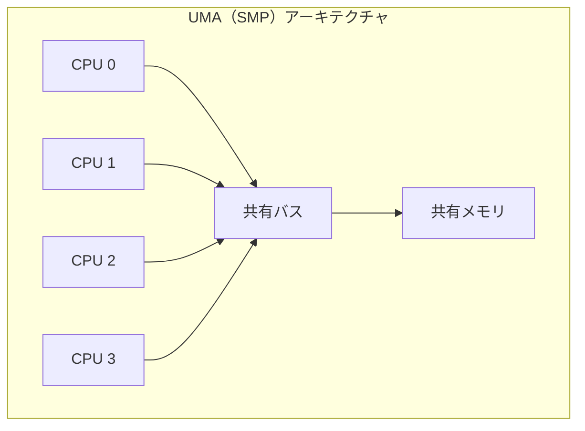
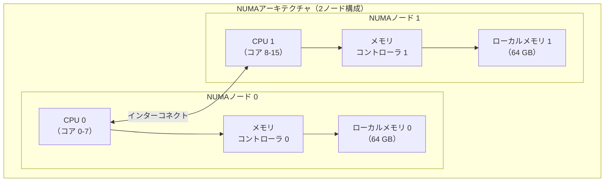
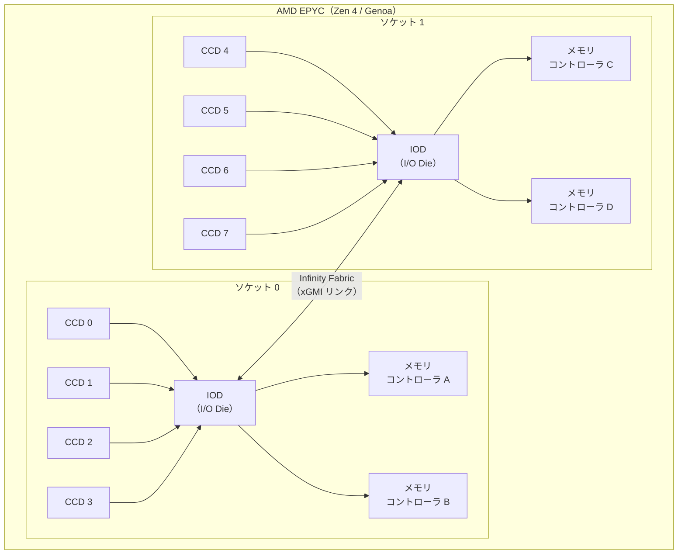
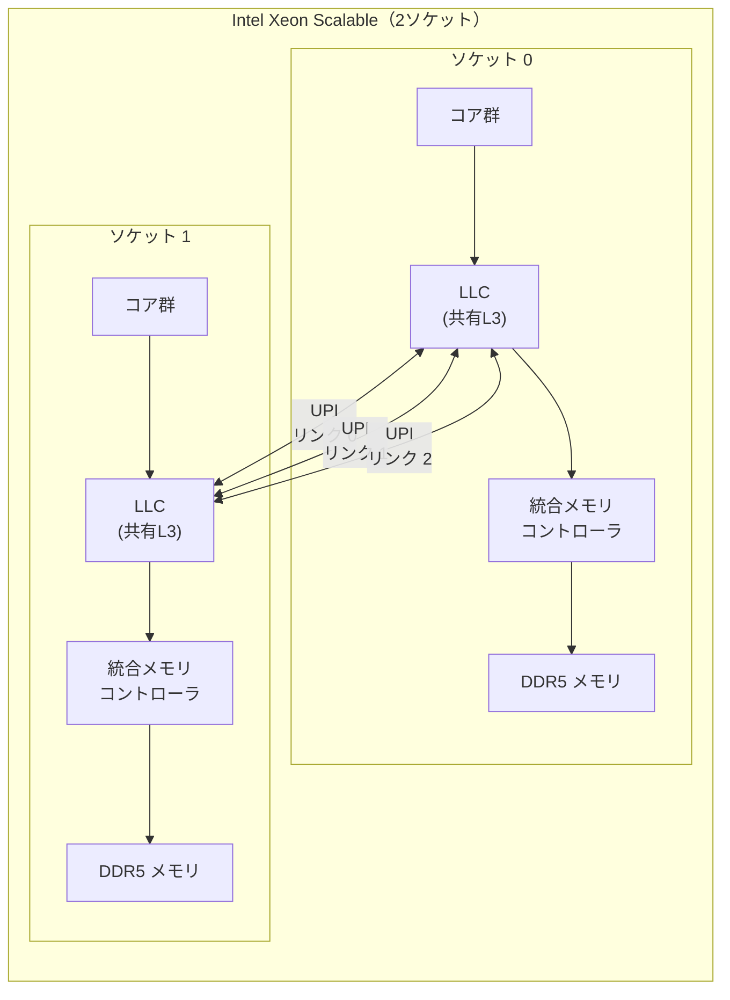
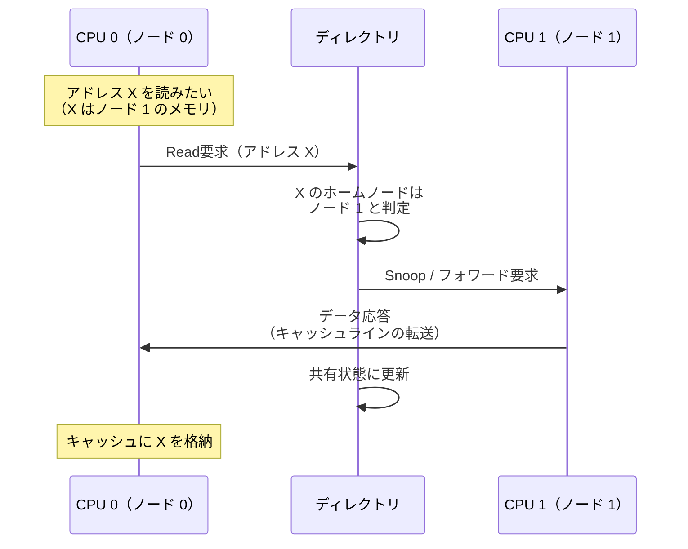
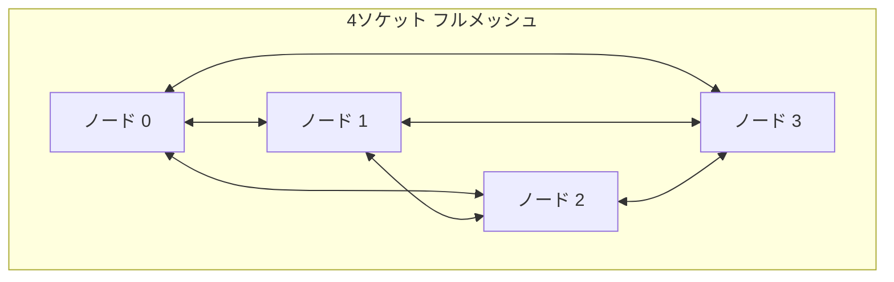
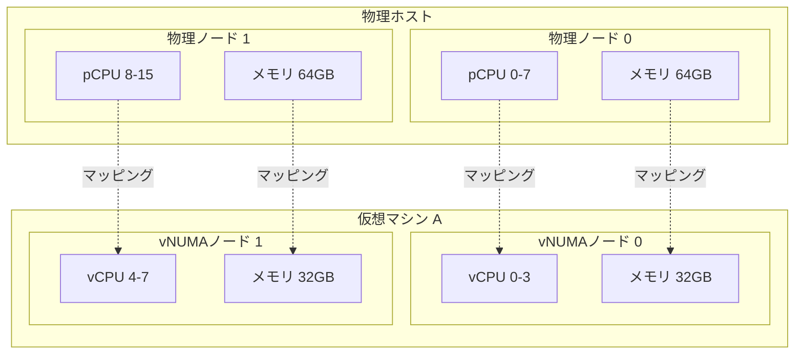

# NUMAアーキテクチャ

## 1. 歴史的背景 — SMP（UMA）の限界とNUMAの登場

### 1.1 対称型マルチプロセッサ（SMP）の時代

1990年代、マルチプロセッサシステムの主流は**SMP（Symmetric Multi-Processing）** と呼ばれるアーキテクチャであった。SMPでは、すべてのプロセッサが単一の共有バスを通じてメインメモリにアクセスする。どのプロセッサからどのメモリアドレスにアクセスしても、レイテンシは均一（Uniform）であるため、このメモリアクセスモデルは **UMA（Uniform Memory Access）** と呼ばれる。



SMPモデルはプログラミングの観点からは非常にシンプルである。すべてのプロセッサが対等にメモリにアクセスできるため、OSやアプリケーションはメモリの物理的な配置を意識する必要がない。しかし、プロセッサ数が増加するにつれて、SMPには深刻なスケーラビリティの問題が顕在化した。

### 1.2 共有バスのボトルネック

SMPの根本的な制約は、**共有バスの帯域幅**にある。すべてのプロセッサが同一のバスを通じてメモリにアクセスするため、プロセッサ数が増えるとバス上のトラフィックが増大し、競合が激化する。この問題は**バスコンテンション（bus contention）** と呼ばれる。

具体的な数値で考えてみよう。1つのプロセッサが毎秒10GBのメモリ帯域を必要とする場合、共有バスの帯域が40GB/sであれば、4プロセッサまでは理論上対応できる。しかし8プロセッサになると、各プロセッサが利用できる実効帯域は5GB/sに低下し、プロセッサは大半の時間をメモリアクセスの待機に費やすことになる。

$$
\text{プロセッサあたりの実効帯域} = \frac{\text{バス帯域}}{\text{プロセッサ数}} \times \eta
$$

ここで $\eta$ はバス調停のオーバーヘッドを考慮した効率係数であり、プロセッサ数の増加とともに低下する。実測では、FSB（Front-Side Bus）ベースのSMPシステムは4〜8プロセッサを超えるとスケーラビリティが著しく劣化することが知られていた。

### 1.3 NUMAの着想

このスケーラビリティの壁を打破するために考案されたのが、**NUMA（Non-Uniform Memory Access）** アーキテクチャである。NUMAの基本的な着想は単純明快だ。

> **各プロセッサに専用のローカルメモリを持たせ、メモリコントローラをプロセッサに統合する。**

これにより、プロセッサが自身のローカルメモリにアクセスする場合は高速に処理でき、他のプロセッサのメモリ（リモートメモリ）にアクセスする場合はインターコネクトを経由するため追加のレイテンシが発生する。メモリアクセスの速度がアドレスの物理的な位置に依存する——すなわち「非均一（Non-Uniform）」である——ことが、この名称の由来である。

NUMAの概念自体は1990年代初頭から存在し、SGI（Silicon Graphics）のOriginシリーズやSequent Computer Systemsのマシンで採用されていた。しかしNUMAが真に主流となったのは、2003年にAMDが**Opteron**プロセッサで統合メモリコントローラと**HyperTransport**を導入し、さらに2007年にIntelが**Nehalem**アーキテクチャで**QPI（QuickPath Interconnect）** を採用してからである。現在では、マルチソケットのサーバシステムは事実上すべてNUMAアーキテクチャを採用している。

## 2. NUMAの基本概念

### 2.1 NUMAノード

NUMAアーキテクチャにおける基本単位は**NUMAノード（NUMA node）** である。1つのNUMAノードは、通常以下の要素で構成される。

- 1つ以上のCPUソケット（プロセッサ）
- そのプロセッサに直接接続されたメモリ（ローカルメモリ）
- メモリコントローラ（プロセッサに統合されている）
- 他のノードとの接続を担うインターコネクトのポート



現代の典型的なサーバでは、1つのCPUソケットが1つのNUMAノードに対応する場合が多い。ただし、AMDのEPYCプロセッサのように、1つのソケット内に複数のNUMAノードを持つ構成も存在する（後述の「NPS（NUMA Per Socket）」設定）。

### 2.2 ローカルメモリとリモートメモリ

NUMAにおいて最も重要な概念は、**ローカルメモリ**と**リモートメモリ**の区別である。

- **ローカルメモリ（Local Memory）**：あるCPUに直接接続されたメモリコントローラが管理するメモリ領域。アクセスレイテンシが最小であり、帯域幅も最大である。
- **リモートメモリ（Remote Memory）**：他のNUMAノードに属するメモリ領域。アクセスにはインターコネクトを経由する必要があるため、追加のレイテンシと帯域幅の制約が発生する。

重要な点として、NUMAアーキテクチャではすべてのメモリが**共有アドレス空間（shared address space）** を形成する。つまり、どのCPUからでもすべてのメモリアドレスにアクセスできる。分散メモリシステム（MPP: Massively Parallel Processing）とは異なり、NUMAはプログラマにとって透過的な共有メモリモデルを提供する。ただし、アクセス先の物理的な位置によってレイテンシが異なるという非対称性があるため、性能を最大化するにはこの非対称性を意識した設計が必要になる。

### 2.3 メモリアクセスの非対称性

NUMAにおけるメモリアクセスのレイテンシは、一般に以下のような関係にある。

$$
T_{\text{local}} < T_{\text{remote\_1hop}} < T_{\text{remote\_2hop}} < \cdots
$$

具体的な数値は世代やプラットフォームによって異なるが、代表的な値を示す。

| アクセス種別 | レイテンシ（概算） | 帯域幅への影響 |
|---|---|---|
| ローカルメモリ | 約80-100 ns | 最大帯域 |
| リモートメモリ（1ホップ） | 約130-180 ns | 約60-80% |
| リモートメモリ（2ホップ） | 約200-250 ns | 約40-60% |

この非対称性の度合いを表す指標として、**NUMAレシオ（NUMA ratio）** が用いられる。

$$
\text{NUMA ratio} = \frac{T_{\text{remote}}}{T_{\text{local}}}
$$

一般的なサーバシステムでは、NUMAレシオは1.3〜2.0程度である。この値が1.0に近いほどNUMAの影響は小さく（UMAに近い）、大きいほどメモリ配置の最適化が重要になる。

::: warning NUMAの影響は帯域幅にも及ぶ
レイテンシの差異だけでなく、リモートアクセスはインターコネクトの帯域を消費するため、帯域集約型のワークロードではさらに大きな性能差が生じる。ストリーミングアクセスパターンでは、ローカルメモリとリモートメモリで2倍以上の帯域差が出ることもある。
:::

## 3. インターコネクト技術

NUMAノード間の通信を担うインターコネクト技術は、NUMAアーキテクチャの性能を決定づける重要な要素である。

### 3.1 AMD: HyperTransport から Infinity Fabric へ

AMDは2003年のOpteron/Athlon 64で**HyperTransport（HT）** を導入した。HyperTransportはポイントツーポイントのシリアルリンクであり、従来のFSB（Front-Side Bus）の共有バスモデルを置き換えた。

- **HyperTransport 1.0**（2003年）：最大6.4 GB/s（双方向）
- **HyperTransport 2.0**（2004年）：最大8.0 GB/s
- **HyperTransport 3.0**（2008年）：最大20.8 GB/s

2017年のZenアーキテクチャ（EPYC/Ryzen）以降、AMDは**Infinity Fabric（IF）** へと移行した。Infinity Fabricはチップ間（ソケット間）だけでなく、単一パッケージ内のチップレット（CCD: Core Complex Die）間の接続にも使用される統合インターコネクトである。



AMD EPYCでは、**NPS（NUMA Per Socket）** 設定によって、1ソケット内のNUMAノード数を制御できる。

- **NPS1**：ソケット全体が1つのNUMAノード（デフォルト）
- **NPS2**：ソケットを2つのNUMAノードに分割
- **NPS4**：ソケットを4つのNUMAノードに分割

NPSの値を大きくするとローカルメモリアクセスの割合が増えるが、各ノードの利用可能メモリ量は減少する。ワークロードの特性に応じた設定が求められる。

### 3.2 Intel: FSB から QPI、そして UPI へ

Intelは長らくFSB（Front-Side Bus）を使用していたが、2008年の**Nehalem**アーキテクチャでメモリコントローラをCPUに統合し、同時にプロセッサ間インターコネクトとして**QPI（QuickPath Interconnect）** を導入した。これにより、IntelプラットフォームもNUMAアーキテクチャとなった。

- **QPI**（2008年〜）：最大25.6 GB/s（双方向）
- **UPI（Ultra Path Interconnect）**（2017年〜、Skylake-SP以降）：最大41.6 GB/s（UPI 2.0）



IntelのXeon Scalableプロセッサ（第4世代Sapphire Rapids以降）では、1ソケットあたり最大4本のUPIリンクを持ち、4ソケット以上の構成も可能である。また、Intel側でも**SNC（Sub-NUMA Clustering）** という機能により、1ソケット内を複数のNUMAドメインに分割できる。SNSはAMDのNPSに相当する機能である。

### 3.3 ccNUMA（Cache-Coherent NUMA）

現代のNUMAシステムは、ほぼすべて**ccNUMA（Cache-Coherent NUMA）** である。ccNUMAとは、NUMAのメモリアクセス非対称性を持ちながら、ハードウェアレベルで**キャッシュコヒーレンス（cache coherence）** を保証するアーキテクチャである。

キャッシュコヒーレンスとは、複数のプロセッサがそれぞれのキャッシュに同一メモリアドレスのコピーを保持している場合に、すべてのプロセッサが常に一貫したデータを観測できることを保証する仕組みである。NUMAシステムでは、ノードをまたがるキャッシュコヒーレンスの維持が特に重要であり、かつコストが高い。

ccNUMAで一般的に使用されるコヒーレンスプロトコルは、**ディレクトリベース（directory-based）** のプロトコルである。各メモリ行（キャッシュライン）に対して、どのノードがそのコピーを保持しているかを追跡するディレクトリを維持する。



ccNUMAでないNUMAシステム（nccNUMA）も理論的には存在するが、プログラミングの難易度が極めて高いため、商用システムではほぼ採用されていない。以降、本記事では特に断りがない限り「NUMA」はccNUMAを指すものとする。

::: tip キャッシュコヒーレンスのコスト
ccNUMAにおけるキャッシュコヒーレンスの維持は「無料」ではない。あるノードのプロセッサが別のノードのキャッシュラインを無効化（invalidation）する必要がある場合、インターコネクトを介したラウンドトリップが発生する。これは「false sharing」と呼ばれる問題を引き起こすことがあり、異なるプロセッサが同一キャッシュラインの異なるデータを頻繁に更新する場合、キャッシュラインが両ノード間を往復する「ping-pong」現象が発生し、性能が著しく劣化する。
:::

## 4. NUMAトポロジとレイテンシ

### 4.1 トポロジの種類

プロセッサ（ソケット）の数が増えると、NUMAノード間の接続トポロジが性能に大きな影響を与える。

**2ソケット構成**は最もシンプルであり、2つのノードが直接接続される。すべてのリモートアクセスは1ホップで到達できる。


**4ソケット構成**では、一般にリング型またはフルメッシュ型のトポロジが使用される。



フルメッシュでは、すべてのノード間が1ホップであるため、NUMAレイテンシの非対称性が最小化される。一方、リンク数がノード数の二乗に比例して増加するため、大規模構成ではコストが問題となる。

**8ソケット以上の構成**では、すべてのノード間を直接接続することが物理的に困難になるため、一部のリモートアクセスが2ホップ以上を必要とする。この場合、NUMAの距離（ホップ数）に応じてレイテンシが段階的に増加する。

### 4.2 SLIT（System Locality Information Table）

ACPIの**SLIT（System Locality Information Table）** は、各NUMAノード間の相対的な距離を定義するテーブルである。OSはこのテーブルを参照して、NUMAトポロジを認識する。

SLITの値は10を基準（ローカルアクセス = 10）とした相対値であり、値が大きいほど遠い（レイテンシが高い）ことを意味する。

```
      Node 0  Node 1  Node 2  Node 3
Node 0   10      12      20      22
Node 1   12      10      22      20
Node 2   20      22      10      12
Node 3   22      20      12      10
```

上記の例では、ノード0とノード1は比較的近い（距離12）が、ノード0とノード2は遠い（距離20）ことがわかる。これは、ノード0-1およびノード2-3がそれぞれ同じインターコネクトグループ内にあり、グループ間のアクセスには追加のホップが必要であることを示している。

Linuxでは以下のコマンドでSLITを確認できる。

```bash
# Show NUMA distance table
numactl --hardware
```

出力例：

```
available: 4 nodes (0-3)
node 0 cpus: 0 1 2 3 4 5 6 7
node 0 size: 32768 MB
node 0 free: 28456 MB
node 1 cpus: 8 9 10 11 12 13 14 15
node 1 size: 32768 MB
node 1 free: 29012 MB
node 2 cpus: 16 17 18 19 20 21 22 23
node 2 size: 32768 MB
node 2 free: 30124 MB
node 3 cpus: 24 25 26 27 28 29 30 31
node 3 size: 32768 MB
node 3 free: 29876 MB
node distances:
node   0   1   2   3
  0:  10  12  20  22
  1:  12  10  22  20
  2:  20  22  10  12
  3:  22  20  12  10
```

### 4.3 NUMAレイテンシの実測

NUMAのレイテンシを実際に測定するには、**Intel Memory Latency Checker（MLC）** や **lmbench** といったツールが有用である。

Intel MLCによる典型的な測定結果（2ソケットXeon Platinum環境）の例を示す。

```
Measuring idle latencies (in ns)...
                Numa node
Numa node            0       1
       0          89.2   139.5
       1         139.7    89.1
```

この例では、ローカルアクセスが約89 ns、リモートアクセスが約140 nsであり、NUMAレシオは約1.57となる。リモートアクセスにはローカルの約1.6倍のレイテンシがかかることを意味する。

## 5. OSのNUMA対応

### 5.1 NUMAポリシー

LinuxカーネルはNUMAを認識し、メモリ割り当てやプロセススケジューリングにおいてNUMAトポロジを考慮する。メモリ割り当てに関しては、以下の主要なポリシーが存在する。

#### First-Touch ポリシー（デフォルト）

**First-Touch** は、Linuxのデフォルトのメモリ割り当てポリシーである。メモリページが最初にアクセス（タッチ）されたとき、そのアクセスを実行したCPUが属するNUMAノードに物理メモリが割り当てられる。

```c
// First-touch example:
// Physical page is allocated on the node where
// the first access occurs
void *buf = malloc(SIZE);  // virtual address allocated, no physical page yet
memset(buf, 0, SIZE);      // first touch: pages allocated on current CPU's node
```

First-Touchポリシーは、データを初期化したスレッドとデータを使用するスレッドが同一のNUMAノードで動作する場合には最適である。しかし、初期化と使用が異なるノードで行われる場合（例：メインスレッドがメモリを初期化した後、ワーカースレッドが別のノードで処理する場合）、リモートアクセスが多発して性能が低下する。

#### Interleave ポリシー

**Interleave** ポリシーは、メモリページを複数のNUMAノードにラウンドロビンで分散配置する。個々のアクセスでローカルメモリになる確率は低下するが、メモリ帯域の利用が均等化されるため、ランダムアクセスパターンのワークロードではスループットが安定する。

```bash
# Run a process with interleaved memory allocation
numactl --interleave=all ./my_application
```

データベースのバッファプールのように、広大なメモリ領域をランダムにアクセスするワークロードでは、Interleaveが効果的なことが多い。

#### Bind ポリシー

**Bind** ポリシーは、メモリ割り当てを特定のNUMAノードに限定する。厳密なメモリ配置制御が必要な場合に使用する。

```bash
# Allocate memory only on node 0
numactl --membind=0 ./my_application
```

Bindポリシーでは、指定したノードのメモリが枯渇した場合にOOM（Out of Memory）が発生する可能性があるため、慎重な容量計画が必要である。

#### Preferred ポリシー

**Preferred** ポリシーは、指定したノードからの割り当てを優先するが、そのノードのメモリが不足した場合は他のノードにフォールバックする。Bindよりも柔軟な制御を提供する。

```bash
# Prefer node 0 but allow fallback to other nodes
numactl --preferred=0 ./my_application
```

### 5.2 numactl と libnuma

**numactl** は、NUMAポリシーを制御するためのコマンドラインツールである。プロセスのメモリ配置ポリシーやCPUアフィニティをコマンドラインから設定できる。

```bash
# Show NUMA hardware topology
numactl --hardware

# Show current NUMA policy
numactl --show

# Run on specific CPUs and memory nodes
numactl --cpunodebind=0 --membind=0 ./my_application

# Run with interleaved memory across all nodes
numactl --interleave=all ./my_application
```

プログラムからNUMAポリシーを制御するには、**libnuma** ライブラリを使用する。

```c
#include <numa.h>
#include <numaif.h>
#include <stdio.h>
#include <stdlib.h>

int main() {
    // Check if NUMA is available
    if (numa_available() < 0) {
        fprintf(stderr, "NUMA is not available\n");
        return 1;
    }

    // Get number of NUMA nodes
    int num_nodes = numa_max_node() + 1;
    printf("Number of NUMA nodes: %d\n", num_nodes);

    // Allocate memory on a specific node
    size_t size = 1024 * 1024 * 64;  // 64 MB
    void *ptr = numa_alloc_onnode(size, 0);  // allocate on node 0
    if (ptr == NULL) {
        perror("numa_alloc_onnode");
        return 1;
    }

    // Allocate interleaved memory
    void *interleaved = numa_alloc_interleaved(size);

    // Move pages to a specific node
    // (requires that pages are already faulted in)
    int target_node = 1;
    int status;
    numa_move_pages(0, 1, &ptr, &target_node, &status, MPOL_MF_MOVE);

    // Free NUMA-allocated memory
    numa_free(ptr, size);
    numa_free(interleaved, size);

    return 0;
}
```

また、`mbind()` や `set_mempolicy()` システムコールを直接使用することで、より細粒度な制御も可能である。

```c
#include <numaif.h>
#include <sys/mman.h>

// Bind a specific memory region to node 1
unsigned long nodemask = 1UL << 1;  // node 1
mbind(addr, length, MPOL_BIND, &nodemask, sizeof(nodemask) * 8,
      MPOL_MF_MOVE | MPOL_MF_STRICT);
```

### 5.3 NUMA統計の監視

LinuxではNUMAに関する統計情報を `/proc` や `/sys` ファイルシステムから取得できる。

```bash
# Per-node memory statistics
cat /sys/devices/system/node/node0/meminfo

# NUMA hit/miss statistics
cat /sys/devices/system/node/node0/numastat
```

`numastat` コマンドは、各ノードのメモリ割り当て統計を表示する。

```bash
# Show per-node memory statistics
numastat

# Show per-process NUMA statistics
numastat -p <pid>
```

出力例：

```
                           node0           node1
numa_hit                12456789         9876543
numa_miss                  23456          345678
numa_foreign              345678           23456
interleave_hit             12345           12340
local_node             12400000         9800000
other_node                56789           76543
```

- **numa_hit**: ポリシーに従ってローカルノードから割り当てられた回数
- **numa_miss**: ローカルノードにメモリが不足し、リモートノードから割り当てられた回数
- **local_node**: ローカルノードから割り当てに成功した回数
- **other_node**: リモートノードから割り当てた回数

`numa_miss` や `other_node` の値が大きい場合、NUMAの最適化に改善の余地があることを示している。

### 5.4 Linuxカーネルのスケジューリング

LinuxのCFS（Completely Fair Scheduler）は、NUMAトポロジを認識したスケジューリングを行う。カーネル3.8以降では、**NUMA balancing（Automatic NUMA Balancing）** と呼ばれる機能が導入された。

NUMA balancingは以下の仕組みで動作する。

1. **ページテーブルのスキャン**: カーネルは定期的にプロセスのページテーブルエントリをスキャンし、NUMAヒント（PROT_NONE）フラグを設定する。
2. **NUMA fault の発生**: スキャンされたページへのアクセスはページフォルトを引き起こす。カーネルはこのフォルトを利用して、どのCPUがどのページを頻繁にアクセスしているかの統計を収集する。
3. **ページマイグレーション**: 統計に基づいて、頻繁にリモートアクセスされているページをアクセス元のノードに移動する。
4. **タスクマイグレーション**: タスクをそのメモリに近いノードに移動することもある。

```bash
# Enable/disable automatic NUMA balancing
echo 1 > /proc/sys/kernel/numa_balancing  # enable
echo 0 > /proc/sys/kernel/numa_balancing  # disable

# Check current status
cat /proc/sys/kernel/numa_balancing
```

::: warning NUMA balancing のオーバーヘッド
NUMA balancingは多くのワークロードで性能を改善するが、オーバーヘッドも伴う。ページフォルトの発生とページマイグレーションにはCPUコストがかかり、ページマイグレーション中はそのページへのアクセスが一時的にブロックされる。データベースのようなメモリ集約型のアプリケーションでは、アプリケーション側で明示的にNUMA配置を制御し、NUMA balancingを無効化する方が良い場合もある。
:::

### 5.5 cgroups v2 とNUMA

Linux の cgroups v2 では、`cpuset` コントローラを通じてコンテナやプロセスグループのNUMAノード割り当てを制御できる。

```bash
# Assign cgroup to specific NUMA nodes
echo "0-1" > /sys/fs/cgroup/my_group/cpuset.mems

# Assign cgroup to specific CPUs
echo "0-15" > /sys/fs/cgroup/my_group/cpuset.cpus
```

Kubernetesでは、**Topology Manager** がPodのNUMAアフィニティを管理し、CPUとメモリのNUMA配置を一致させる機能を提供する。

## 6. NUMAを意識したプログラミング

### 6.1 メモリ配置の最適化

NUMAアウェアなプログラミングの基本原則は、**「データはそれを使用するスレッドのローカルノードに配置する」** ことである。

```c
#include <pthread.h>
#include <numa.h>
#include <string.h>

#define NUM_THREADS 4
#define DATA_SIZE (64 * 1024 * 1024)  // 64 MB per thread

typedef struct {
    int thread_id;
    int numa_node;
    char *data;
    size_t size;
} thread_arg_t;

void *worker(void *arg) {
    thread_arg_t *targ = (thread_arg_t *)arg;

    // Bind this thread to the designated NUMA node
    struct bitmask *mask = numa_allocate_cpumask();
    numa_node_to_cpus(targ->numa_node, mask);
    numa_sched_setaffinity(0, mask);
    numa_free_cpumask(mask);

    // Allocate data on this thread's local NUMA node
    targ->data = (char *)numa_alloc_onnode(targ->size, targ->numa_node);

    // Initialize data (first-touch on local node)
    memset(targ->data, 0, targ->size);

    // Process data locally
    // ...

    return NULL;
}

int main() {
    pthread_t threads[NUM_THREADS];
    thread_arg_t args[NUM_THREADS];

    int num_nodes = numa_max_node() + 1;

    for (int i = 0; i < NUM_THREADS; i++) {
        args[i].thread_id = i;
        args[i].numa_node = i % num_nodes;
        args[i].size = DATA_SIZE;
        pthread_create(&threads[i], NULL, worker, &args[i]);
    }

    for (int i = 0; i < NUM_THREADS; i++) {
        pthread_join(threads[i], NULL);
        numa_free(args[i].data, args[i].size);
    }

    return 0;
}
```

### 6.2 スレッドのアフィニティ設定

NUMAの恩恵を最大化するには、スレッドのCPUアフィニティを適切に設定し、スレッドが意図したNUMAノード上で実行されるようにすることが重要である。

```c
#define _GNU_SOURCE
#include <sched.h>
#include <pthread.h>

// Pin thread to a specific CPU
void pin_to_cpu(int cpu_id) {
    cpu_set_t cpuset;
    CPU_ZERO(&cpuset);
    CPU_SET(cpu_id, &cpuset);
    pthread_setaffinity_np(pthread_self(), sizeof(cpu_set_t), &cpuset);
}

// Pin thread to all CPUs on a specific NUMA node
void pin_to_node(int node) {
    struct bitmask *cpumask = numa_allocate_cpumask();
    numa_node_to_cpus(node, cpumask);

    cpu_set_t cpuset;
    CPU_ZERO(&cpuset);
    for (int i = 0; i < numa_num_configured_cpus(); i++) {
        if (numa_bitmask_isbitset(cpumask, i)) {
            CPU_SET(i, &cpuset);
        }
    }
    pthread_setaffinity_np(pthread_self(), sizeof(cpu_set_t), &cpuset);
    numa_free_cpumask(cpumask);
}
```

::: danger アフィニティ設定の落とし穴
スレッドを特定のCPUに固定（pinning）すると、OSのスケジューラがロードバランシングを行えなくなる。すべてのスレッドを適切に固定しないと、一部のCPUが過負荷になり、他のCPUがアイドルになるという不均衡が生じる。アフィニティ設定は、ワークロードの特性を十分に理解した上で行うべきである。
:::

### 6.3 NUMAアウェアなデータ構造

大規模なデータ構造をNUMA環境で効率的に利用するには、データ構造自体をNUMAを意識して設計する必要がある。

**パーティション型アプローチ**: データ構造をNUMAノードごとに分割し、各ノードが自身の担当範囲をローカルメモリで処理する。

```c
// NUMA-aware hash table: each node owns a partition
typedef struct {
    void **buckets;
    size_t num_buckets;
    int numa_node;
} numa_partition_t;

typedef struct {
    numa_partition_t *partitions;
    int num_partitions;  // = number of NUMA nodes
} numa_hash_table_t;

numa_hash_table_t *create_numa_hash_table(size_t total_buckets) {
    int num_nodes = numa_max_node() + 1;
    size_t buckets_per_node = total_buckets / num_nodes;

    numa_hash_table_t *ht = malloc(sizeof(numa_hash_table_t));
    ht->num_partitions = num_nodes;
    ht->partitions = malloc(sizeof(numa_partition_t) * num_nodes);

    for (int i = 0; i < num_nodes; i++) {
        ht->partitions[i].numa_node = i;
        ht->partitions[i].num_buckets = buckets_per_node;
        // Allocate bucket array on the appropriate NUMA node
        ht->partitions[i].buckets =
            numa_alloc_onnode(sizeof(void *) * buckets_per_node, i);
        memset(ht->partitions[i].buckets, 0,
               sizeof(void *) * buckets_per_node);
    }

    return ht;
}

// Route lookup to the appropriate partition
int get_partition(numa_hash_table_t *ht, uint64_t key) {
    return key % ht->num_partitions;
}
```

**レプリケーション型アプローチ**: 読み取り主体のデータ構造では、各NUMAノードにデータのコピーを配置して、すべてのアクセスをローカルにする手法も有効である。

```c
// NUMA-replicated read-mostly data: each node has its own copy
typedef struct {
    void **per_node_copies;
    int num_nodes;
    size_t data_size;
} numa_replicated_t;

numa_replicated_t *create_replicated(void *src_data, size_t size) {
    int num_nodes = numa_max_node() + 1;
    numa_replicated_t *rep = malloc(sizeof(numa_replicated_t));
    rep->num_nodes = num_nodes;
    rep->data_size = size;
    rep->per_node_copies = malloc(sizeof(void *) * num_nodes);

    for (int i = 0; i < num_nodes; i++) {
        rep->per_node_copies[i] = numa_alloc_onnode(size, i);
        memcpy(rep->per_node_copies[i], src_data, size);
    }

    return rep;
}

// Get local copy for current thread's NUMA node
void *get_local_copy(numa_replicated_t *rep) {
    int current_node = numa_node_of_cpu(sched_getcpu());
    return rep->per_node_copies[current_node];
}
```

### 6.4 False Sharing の回避

NUMAシステムにおけるFalse Sharingの影響はUMAシステムよりもさらに深刻である。異なるNUMAノード上のCPUが同一のキャッシュラインを競合的に更新すると、キャッシュラインがインターコネクトを介して往復するため、レイテンシが大幅に増大する。

```c
// Bad: false sharing between threads on different NUMA nodes
struct shared_counters_bad {
    volatile long counter_0;  // cache line shared!
    volatile long counter_1;
    volatile long counter_2;
    volatile long counter_3;
};

// Good: pad each counter to its own cache line
#define CACHE_LINE_SIZE 64
struct shared_counters_good {
    volatile long counter_0;
    char pad0[CACHE_LINE_SIZE - sizeof(long)];
    volatile long counter_1;
    char pad1[CACHE_LINE_SIZE - sizeof(long)];
    volatile long counter_2;
    char pad2[CACHE_LINE_SIZE - sizeof(long)];
    volatile long counter_3;
    char pad3[CACHE_LINE_SIZE - sizeof(long)];
} __attribute__((aligned(CACHE_LINE_SIZE)));
```

C++11以降では `alignas` を使用してアライメントを明示できる。

```cpp
struct alignas(64) padded_counter {
    std::atomic<long> value;
};
```

## 7. データベースとNUMA

データベース管理システム（DBMS）は、大量のメモリを使用し、複数のコアで並列にクエリを処理するため、NUMAの影響を特に強く受けるソフトウェアである。

### 7.1 PostgreSQL と NUMA

PostgreSQLは共有メモリ（shared buffers）を使用するマルチプロセスアーキテクチャを採用している。デフォルトでは、PostgreSQLのポストマスタープロセスが起動時に共有メモリを確保し、ワーカープロセスがそれをマップする。

First-Touchポリシーのデフォルトでは、共有メモリがポストマスタープロセスのノードに偏って配置されがちである。これはワーカープロセスが複数のノードに分散して動作する場合にリモートアクセスを引き起こす。

対策としては、以下のアプローチが一般的である。

```bash
# Start PostgreSQL with interleaved memory allocation
numactl --interleave=all pg_ctl start -D /var/lib/postgresql/data
```

Interleaveポリシーを適用することで、共有メモリが全ノードに均等に分散される。個々のアクセスでのローカルヒット率は低下するが、メモリ帯域の利用が均等化されるため、全体的なスループットが安定する。

PostgreSQLのコミュニティでは、バッファプールのNUMAアウェアな配置や、バックエンドプロセスのNUMAアフィニティ設定など、より高度なNUMA最適化が議論されている。

::: tip PostgreSQLのhuge_pagesとNUMA
PostgreSQLの `huge_pages` 設定（Linux のHugePages/Transparent Huge Pages）とNUMAの組み合わせには注意が必要である。HugePagesは2MBまたは1GBの大きなページを使用するため、ページマイグレーションのコストが増大する。NUMAノードごとにHugePagesの予約量を適切に設定することが重要である。
:::

### 7.2 MySQL（InnoDB）と NUMA

MySQLのInnoDBストレージエンジンは、バッファプール（`innodb_buffer_pool_size`）として大量のメモリを使用する。MySQL 5.6.27以降では、`innodb_numa_interleave` オプションが導入された。

```ini
# my.cnf
[mysqld]
innodb_numa_interleave = ON
```

このオプションを有効にすると、InnoDBのバッファプール割り当て時に `MPOL_INTERLEAVE` ポリシーが使用される。内部的には、`set_mempolicy(MPOL_INTERLEAVE, ...)` を呼び出してから `malloc()` でバッファプールを確保し、その後ポリシーをデフォルトに戻す。

MySQLのNUMA対応に関する注意点を以下に示す。

1. **バッファプールインスタンスの分割**: `innodb_buffer_pool_instances` を使用してバッファプールを分割することで、NUMAノード間のロック競合を軽減できる。
2. **スレッドプールとNUMA**: MySQL Enterprise のスレッドプールやPerconaのスレッドプールは、NUMAアフィニティを考慮したスレッド配置をサポートしている。

### 7.3 NUMAアウェアなDBMS設計の研究

学術的には、NUMAを前提として一から設計されたDBMSの研究も進んでいる。代表的なものを紹介する。

- **SAP HANA**: インメモリデータベースとして設計されたSAP HANAは、NUMAトポロジを認識したクエリ実行エンジンを持つ。テーブルのパーティションをNUMAノードに分散配置し、各ノードがローカルデータに対してクエリを実行する。
- **HyPer / Umbra**（ミュンヘン工科大学）: Morsel-Driven Parallelismと呼ばれるNUMAアウェアなクエリ実行モデルを提案した。ワークをmorsel（小さなチャンク）に分割し、各NUMAノードがローカルのmorselを処理する。
- **FOEDUS**（HP Labs）: NUMAトポロジを明示的にモデル化し、データのNUMA配置を最適化するストレージエンジンを提案した。

## 8. 問題点と課題

### 8.1 プログラミングの複雑さ

NUMAの最大の課題は、**プログラミングの複雑さが大幅に増大する**ことである。UMAシステムでは、プログラマはメモリの物理的な配置を意識する必要がない。しかしNUMAシステムでは、データの配置とスレッドの配置を慎重に設計しなければ、性能が大幅に低下する可能性がある。

この複雑さは、以下のレベルで顕在化する。

1. **アプリケーション開発者**: データ構造の設計、メモリ割り当て、スレッドアフィニティの設定において、NUMAトポロジを考慮する必要がある。
2. **ミドルウェア開発者**: データベース、Webサーバ、メッセージキューなどのミドルウェアは、NUMAアウェアなメモリ管理とスケジューリングを実装する必要がある。
3. **OS開発者**: NUMAトポロジの検出、メモリ割り当てポリシーの実装、スケジューラのNUMA対応など、低レベルの最適化が求められる。

### 8.2 動的なワークロードへの対応

静的なワークロード（データの配置パターンが事前に予測可能）であれば、NUMAの最適化は比較的容易である。しかし、動的に変化するワークロード——たとえば、クラウド環境における仮想マシンのライブマイグレーションや、コンテナのスケーリング——では、最適なNUMA配置を維持することが難しい。

ページマイグレーション（ページを別のNUMAノードに移動する操作）は可能だが、大きなコストを伴う。典型的には、1つの4KBページのマイグレーションに数マイクロ秒から数十マイクロ秒を要し、マイグレーション中はそのページへのアクセスがブロックされる。大量のページを移動する場合、アプリケーションのレイテンシに顕著な影響を及ぼす。

### 8.3 NUMAノード間のメモリ不均衡

実際の運用環境では、NUMAノード間でメモリ使用量が不均衡になることがある。特定のノードのメモリが枯渇し、カーネルがリモートノードからメモリを割り当てる（NUMA miss）状況が発生すると、性能が予測不能に劣化する。

この問題は、LinuxのAutomatic NUMA Balancingや、アプリケーション側でのNUMAポリシーの適切な設定によって緩和できるが、完全な解決は困難である。

### 8.4 仮想化環境でのNUMA

仮想化環境では、NUMAの問題がさらに複雑化する。ハイパーバイザは、物理NUMAトポロジをゲストOSに適切に伝達（パススルー）する必要がある。

**vNUMA（Virtual NUMA）** は、物理NUMAトポロジをゲストOSに公開する技術である。VMware vSphereやKVMは、仮想マシンに対してvNUMAトポロジを提示する機能を持つ。しかし、仮想マシンのCPUやメモリが物理的に複数のNUMAノードにまたがって配置されている場合、vNUMAトポロジと物理NUMAトポロジの不一致が性能低下を引き起こす。



### 8.5 NUMAとCXLの融合

**CXL（Compute Express Link）** は、PCIe 5.0以降をベースとしたインターコネクト規格であり、CPUとアクセラレータ、メモリエクスパンダ、他のCPUとの間でキャッシュコヒーレントなメモリ共有を可能にする。CXLの普及に伴い、NUMAのトポロジはさらに複雑化すると予想される。

CXL接続されたメモリ（CXL Memory）は、ローカルDRAMよりもレイテンシが高いが、リモートNUMAノードよりは近い場合がある。これにより、メモリ階層は従来の2層（ローカル/リモート）から多層構造へと発展する。

$$
T_{\text{L1 cache}} \ll T_{\text{L3 cache}} \ll T_{\text{local DRAM}} < T_{\text{CXL memory}} < T_{\text{remote DRAM}}
$$

Linuxカーネルでは、CXL接続されたメモリをNUMAノードとして認識し、既存のNUMAフレームワークで管理するアプローチが採用されつつある。

## 9. まとめと展望

### 9.1 NUMAの本質的な意義

NUMAアーキテクチャは、共有バスの帯域がプロセッサの増加に追いつかないという物理的な制約への解答として登場した。その本質は「物理的近接性に基づくメモリアクセスの最適化」であり、この原理は今後も変わらない。光の速度が有限である以上、データとそれを処理する計算資源の距離は常に性能に影響を与える。

### 9.2 現在の状況

2026年現在、NUMAはサーバアーキテクチャの標準であり、以下の状況にある。

- **ハードウェア**: AMDのEPYC（Zen 5世代）とIntelのXeon Scalable（第6世代Sierra Forest/Granite Rapids）が、それぞれInfinity FabricとUPIをベースとしたNUMAアーキテクチャを提供している。1ソケットあたりのコア数は100を超え、ソケット内NUMAの重要性が増している。
- **OS**: LinuxカーネルのNUMA対応は成熟しており、Automatic NUMA Balancing、NUMA-aware memory compaction、CXLメモリのNUMA統合などの機能が利用可能である。
- **アプリケーション**: 主要なデータベース、仮想化基盤、コンテナオーケストレーションシステムはNUMAを意識した設計を取り入れている。

### 9.3 今後の展望

NUMAの概念は今後さらに拡張されていくと考えられる。

1. **CXLによるメモリ階層の多層化**: CXL 3.0では、メモリプーリングとメモリ共有が可能になり、複数のホストが共有メモリプールにアクセスする構成が実現する。これは従来のNUMAの枠を超えた「ラック規模のNUMA」とも言える構造である。

2. **チップレットアーキテクチャの進化**: AMDのEPYCに代表されるチップレット設計では、1パッケージ内に複数のダイが存在し、ダイ間のメモリアクセスレイテンシが異なる。プロセッサ内部のNUMA性がさらに顕著になるだろう。

3. **異種メモリの統合**: DRAM、HBM（High Bandwidth Memory）、CXLメモリ、永続メモリなど、特性の異なるメモリを統合的に管理する需要が高まっている。Linuxの**tiered memory management**（メモリの階層化管理）機能は、このニーズに応えるものである。

4. **ソフトウェアの適応**: コンパイラやランタイムによるNUMAの自動最適化、NUMAトポロジを考慮した自動データ配置、ハードウェアカウンタに基づくプロファイルガイド最適化など、NUMAの複雑さをソフトウェアで隠蔽する試みが進んでいる。

NUMAは一見するとハードウェアの実装詳細に過ぎないように見えるが、実際には「物理的な距離とデータの局所性」という、コンピューティングの根本的な問題を反映している。プロセッサの性能が向上し、コア数が増加するにつれて、NUMAの理解と最適化の重要性は増す一方である。高性能なシステムを設計・運用するエンジニアにとって、NUMAの理解は避けて通れない基礎知識である。
