# NVMe とストレージインターフェース

## はじめに

コンピュータシステムにおいて、ストレージは CPU やメモリと並ぶ最も重要な構成要素のひとつである。長年にわたり、ストレージデバイスとホストシステムを接続するインターフェースは、デバイスの進化に合わせて変遷してきた。HDD（Hard Disk Drive）の時代には、デバイスの機械的な速度がボトルネックであり、インターフェースの帯域幅が問題になることはほとんどなかった。しかし、NAND フラッシュベースの SSD（Solid State Drive）が登場し、デバイスの I/O 性能が飛躍的に向上すると、従来のインターフェースやプロトコルが性能のボトルネックとなる状況が顕在化した。

NVMe（Non-Volatile Memory Express）は、こうした課題を根本から解決するために設計されたストレージプロトコルである。PCIe バスに直接接続し、フラッシュストレージの並列性を最大限に引き出すことを目的として、2011 年に最初の仕様が策定された。本記事では、ストレージインターフェースの歴史的変遷を振り返ったうえで、NVMe プロトコルの設計思想、キューの仕組み、NVMe over Fabrics（NVMe-oF）、ZNS（Zoned Namespaces）、そして Linux における io_uring との連携まで、幅広く解説する。

## 1. ストレージインターフェースの歴史

### 1.1 ATA / SATA の時代

ATA（Advanced Technology Attachment）は、1986 年に登場したパラレルインターフェースであり、IDE（Integrated Drive Electronics）とも呼ばれた。HDD を PC に接続するための標準的なインターフェースとして広く普及し、パラレル ATA（PATA）は最大 133 MB/s の転送速度を提供した。

2003 年に登場した SATA（Serial ATA）は、パラレル伝送からシリアル伝送に移行することで、ケーブルの取り回しの改善と高速化を実現した。SATA の世代ごとの帯域幅は以下の通りである。

| 世代 | 理論帯域幅 | 実効帯域幅 |
|------|-----------|-----------|
| SATA I (1.5 Gbps) | 150 MB/s | ~150 MB/s |
| SATA II (3 Gbps) | 300 MB/s | ~300 MB/s |
| SATA III (6 Gbps) | 600 MB/s | ~550 MB/s |

SATA インターフェースの背後にあるプロトコルは AHCI（Advanced Host Controller Interface）である。AHCI は HDD のために設計されたプロトコルであり、以下の特徴を持つ。

- **単一のコマンドキュー**: AHCI はデバイスあたり 1 つのコマンドキューしかサポートしない
- **キュー深度 32**: 同時に発行できるコマンドは最大 32 個に制限される
- **CPU コアとの非対称性**: マルチコア環境でも、すべての I/O 要求が 1 つのキューに集約されるため、ロック競合が発生する

HDD の時代には、シーク時間（数ミリ秒）がボトルネックであったため、AHCI のキュー制限が問題になることはなかった。しかし、SSD の登場によりレイテンシがマイクロ秒オーダーに短縮されると、AHCI のオーバーヘッドが無視できなくなった。

### 1.2 SAS（Serial Attached SCSI）

SAS（Serial Attached SCSI）は、エンタープライズ市場向けのストレージインターフェースとして 2004 年に登場した。SCSI プロトコルをシリアル伝送に適応させたものであり、以下の特徴を持つ。

- **フルデュプレックス通信**: 送受信を同時に行える
- **マルチイニシエータ対応**: 複数のホストから同一デバイスにアクセス可能
- **高い信頼性**: エラー検出・訂正機能が充実
- **SAS-4 で 22.5 Gbps** の帯域幅を実現

SAS は SATA との後方互換性（SAS コネクタに SATA デバイスを接続可能）を備えていたが、プロトコルの複雑さとコストの高さから、コンシューマ市場には広がらなかった。

### 1.3 PCIe の台頭

PCIe（Peripheral Component Interconnect Express）は、元来 GPU やネットワークカードなどの高帯域デバイス向けに設計された汎用バスである。SSD の性能が SATA の帯域幅を超えるようになると、PCIe バスに SSD を直接接続するアプローチが注目された。

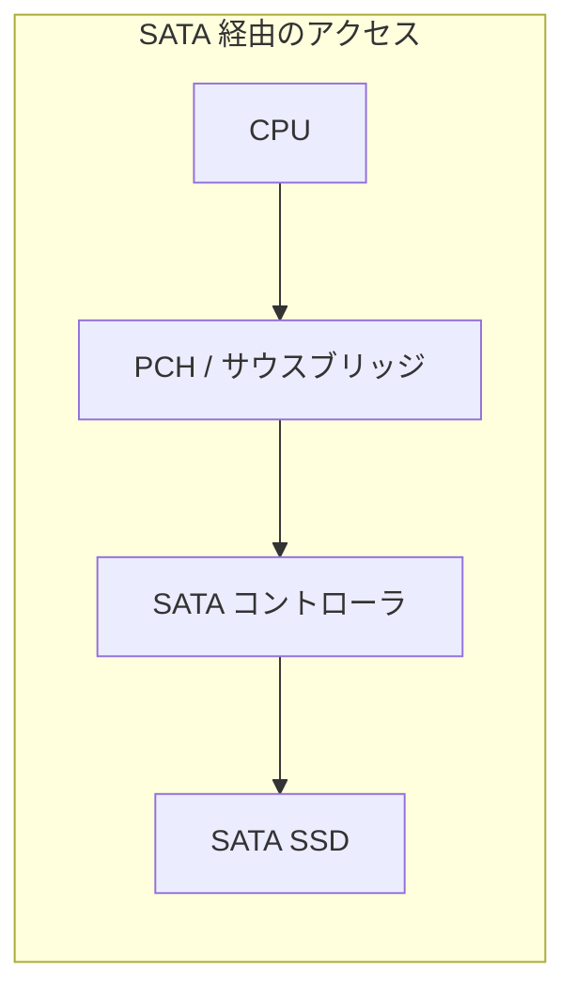

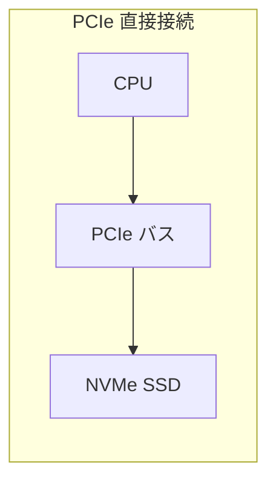

PCIe は世代ごとに帯域幅が倍増してきた。

| 世代 | レーンあたり帯域幅 | x4 帯域幅 |
|------|------------------|-----------|
| PCIe 3.0 | ~1 GB/s | ~4 GB/s |
| PCIe 4.0 | ~2 GB/s | ~8 GB/s |
| PCIe 5.0 | ~4 GB/s | ~16 GB/s |
| PCIe 6.0 | ~8 GB/s | ~32 GB/s |

初期には PCIe 接続の SSD でも AHCI プロトコルを使用するものがあったが、AHCI のキュー制限やプロトコルオーバーヘッドが PCIe の潜在的な帯域幅を活かしきれないことが明らかになった。これが NVMe プロトコル策定の直接的な動機となった。

### 1.4 インターフェース進化の全体像

以下の図は、ストレージインターフェースの進化を時系列でまとめたものである。

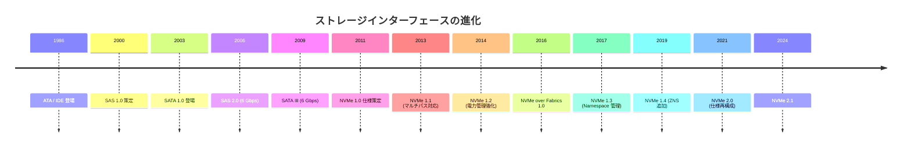

## 2. NVMe プロトコルの設計

### 2.1 設計思想

NVMe は「NAND フラッシュの並列性を最大限に活かす」という明確な目標のもとに設計された。AHCI が HDD の制約に合わせて設計されたのとは対照的に、NVMe はフラッシュストレージのアーキテクチャを前提としている。

NVMe の設計における主要な原則は以下の通りである。

1. **低レイテンシ**: コマンド発行からデバイスへの到達までのソフトウェアオーバーヘッドを最小化する
2. **高並列性**: マルチコア CPU 環境で、各コアが独立してデバイスにコマンドを発行できる
3. **シンプルなコマンドセット**: プロトコル処理のオーバーヘッドを最小限に抑える
4. **スケーラビリティ**: 単一デバイスからデータセンター規模まで対応可能

### 2.2 AHCI との比較

NVMe と AHCI の主な違いをまとめると以下の通りである。

| 項目 | AHCI (SATA) | NVMe |
|------|-------------|------|
| キュー数 | 1 | 最大 65,535 |
| キュー深度 | 32 | 最大 65,536 |
| コマンドサイズ | 可変 | 64 バイト固定 |
| 完了通知サイズ | 可変 | 16 バイト固定 |
| MSI-X 割り込み | 1 | 最大 2,048 |
| 必須レジスタアクセス | コマンドごとに複数回 | ドアベル 1 回 |
| CPU コアへの分散 | 不可 | 可能（キューごとに割り当て） |

特に重要なのは、AHCI ではコマンド発行時に複数回のレジスタアクセス（MMIO）が必要であるのに対し、NVMe ではコマンドをメモリ上のキューに書き込んだ後、ドアベルレジスタに 1 回書き込むだけでよい点である。MMIO はキャッシュ不可能なメモリアクセスであり、1 回あたり数百ナノ秒から数マイクロ秒のコストがかかるため、この差は高 IOPS 環境で大きな影響を及ぼす。

### 2.3 NVMe のレジスタ空間

NVMe デバイスは、PCIe の BAR（Base Address Register）0 にマッピングされたレジスタ空間を通じてホストと通信する。主要なレジスタは以下の通りである。

| オフセット | レジスタ名 | 説明 |
|-----------|-----------|------|
| 0x00 | CAP | デバイスの機能（キュー深度上限、対応コマンドセットなど） |
| 0x08 | VS | NVMe バージョン |
| 0x0C | INTMS | 割り込みマスク設定 |
| 0x10 | INTMC | 割り込みマスククリア |
| 0x14 | CC | コントローラ設定（有効化・無効化など） |
| 0x1C | CSTS | コントローラステータス |
| 0x24 | AQA | Admin Queue 属性（キューサイズ） |
| 0x28 | ASQ | Admin Submission Queue ベースアドレス |
| 0x30 | ACQ | Admin Completion Queue ベースアドレス |
| 0x1000+ | SQnTDBL | Submission Queue n Tail Doorbell |
| 0x1000+ | CQnHDBL | Completion Queue n Head Doorbell |

ドアベルレジスタは各キューペア（Submission Queue と Completion Queue）に対して存在し、ホストが新しいコマンドをキューに追加したこと（SQ Tail Doorbell）、または完了エントリを処理したこと（CQ Head Doorbell）をデバイスに通知するために使用される。

## 3. Submission / Completion Queue

### 3.1 キューペアの基本構造

NVMe の I/O モデルの中核は、Submission Queue（SQ）と Completion Queue（CQ）のペアによるコマンド発行・完了の仕組みである。

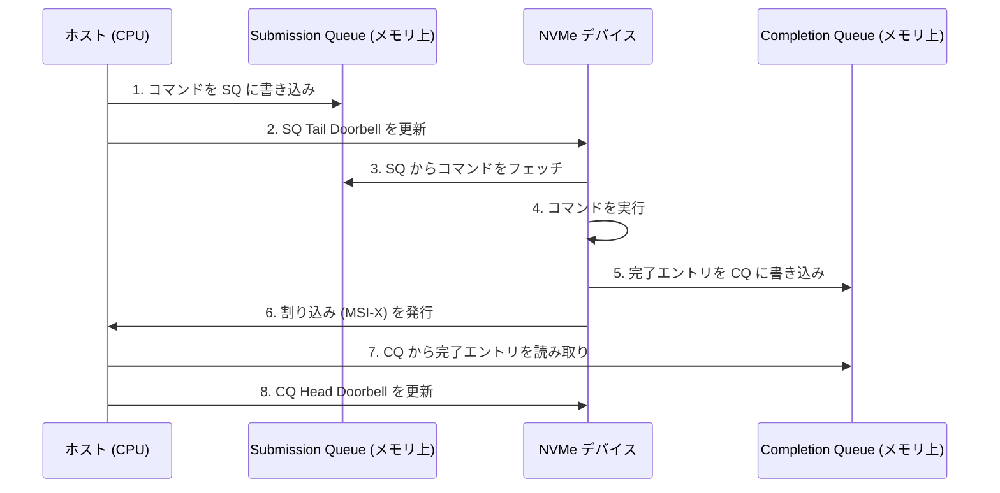

この一連の流れをより詳細に説明する。

**ステップ 1 - コマンド書き込み**: ホストは、64 バイト固定長の NVMe コマンドを SQ の末尾に書き込む。SQ はリングバッファとして実装されており、ホストは Tail ポインタをローカルで管理する。

**ステップ 2 - ドアベル通知**: ホストは SQ Tail Doorbell レジスタ（デバイスの MMIO 空間）に新しい Tail ポインタの値を書き込む。これにより、デバイスは新しいコマンドが到着したことを認識する。複数のコマンドをバッチで書き込んでから 1 回だけドアベルを鳴らすことで、MMIO の回数を削減できる。

**ステップ 3 - コマンドフェッチ**: デバイスは DMA（Direct Memory Access）を使用してホストメモリ上の SQ からコマンドを読み取る。デバイスは Head ポインタを管理し、どこまでフェッチしたかを追跡する。

**ステップ 4 - コマンド実行**: デバイスはフェッチしたコマンドを実行する。NVMe ではコマンドの実行順序は保証されない。デバイスは内部の並列性を活かして、複数のコマンドを同時に処理できる。

**ステップ 5 - 完了通知**: デバイスは 16 バイトの完了エントリを CQ に書き込む。完了エントリには、コマンド ID、ステータスコード、および Phase Tag（後述）が含まれる。

**ステップ 6 - 割り込み**: デバイスは MSI-X 割り込みを発行してホストに完了を通知する。割り込みの集約（Interrupt Coalescing）により、複数の完了を 1 つの割り込みで通知することも可能である。

**ステップ 7 - 完了処理**: ホストは CQ から完了エントリを読み取り、対応するコマンドの後処理を行う。

**ステップ 8 - ドアベル更新**: ホストは CQ Head Doorbell を更新して、デバイスに CQ のスペースが解放されたことを通知する。

### 3.2 コマンド構造

NVMe のコマンドは 64 バイトの固定長構造を持つ。これは、可変長のコマンド構造を持つ SCSI や AHCI と比較して、パース処理が単純であり、ハードウェア実装が容易である。

```
+--------+--------+--------+--------+
|  CDW0  |  NSID  |  CDW2  |  CDW3  |  (DW 0-3)
+--------+--------+--------+--------+
|        MPTR (Metadata Pointer)     |  (DW 4-5)
+--------+--------+--------+--------+
|          PRP1 / SGL1               |  (DW 6-7)
+--------+--------+--------+--------+
|          PRP2 / SGL2               |  (DW 8-9)
+--------+--------+--------+--------+
|  CDW10 |  CDW11 |  CDW12 |  CDW13 |  (DW 10-13)
+--------+--------+--------+--------+
|  CDW14 |  CDW15 |                     (DW 14-15)
+--------+--------+
```

CDW0（Command Dword 0）には、オペコード（Read, Write, Flush など）とコマンド ID が格納される。コマンド ID はホストが割り当て、完了エントリでどのコマンドが完了したかを識別するために使用される。

### 3.3 Phase Tag による完了検出

NVMe の CQ は、Phase Tag というビットフィールドを使って、新しい完了エントリが書き込まれたかどうかをホストが判定できるように設計されている。

CQ もリングバッファであるため、デバイスが書き込んだエントリとまだ処理されていない古いエントリを区別する必要がある。Phase Tag は、CQ が一周するたびに反転する 1 ビットのフラグである。

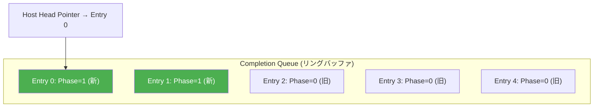

ホストは、現在期待する Phase Tag の値を保持しておき、CQ エントリの Phase Tag がその値と一致するかを確認することで、新しい完了エントリが到着したかを判断する。これにより、ホストは割り込みを待たずにポーリングで完了を検出できる。高 IOPS 環境では、このポーリングモードが割り込みモードよりも効率的であることが多い。

### 3.4 Admin Queue と I/O Queue

NVMe は 2 種類のキューを定義している。

- **Admin Queue**: デバイスの管理操作（キューの作成・削除、ファームウェア管理、ログ取得など）に使用される。Admin SQ と Admin CQ のペアはデバイス初期化時に 1 つだけ作成される。
- **I/O Queue**: 実際のデータ読み書きに使用される。ホストは Admin Queue を通じて I/O キューペアを動的に作成・削除できる。

## 4. 多キュー対応と並列性

### 4.1 マルチキューアーキテクチャ

NVMe の最大の革新は、最大 65,535 個の I/O キューペアをサポートすることで、マルチコア CPU の並列性を直接活かせるようにした点である。

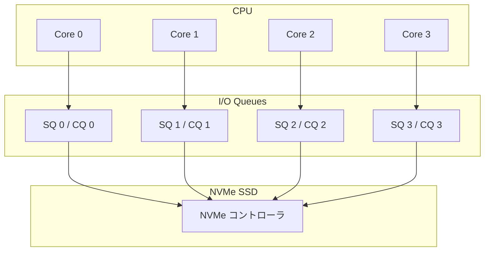

典型的な構成では、CPU コアごとに 1 つの SQ/CQ ペアを割り当てる。これにより、以下のメリットが得られる。

1. **ロックフリーな I/O 発行**: 各コアが自分専用のキューにアクセスするため、キューへのアクセスにロックが不要になる
2. **キャッシュライン競合の排除**: 異なるコアが異なるメモリ領域（キュー）を操作するため、キャッシュラインのバウンシングが発生しない
3. **割り込みの分散**: MSI-X 割り込みベクタをコアごとに割り当てることで、完了処理の負荷を分散できる
4. **NUMA 最適化**: NUMA（Non-Uniform Memory Access）環境では、キューをコアに近いメモリノードに配置することで、メモリアクセスのレイテンシを最小化できる

### 4.2 Linux カーネルにおける NVMe ドライバ

Linux カーネルの NVMe ドライバは、マルチキューブロックレイヤー（blk-mq）と密接に統合されている。blk-mq は、NVMe のマルチキューアーキテクチャを活かすために設計されたカーネルのブロック I/O サブシステムである。

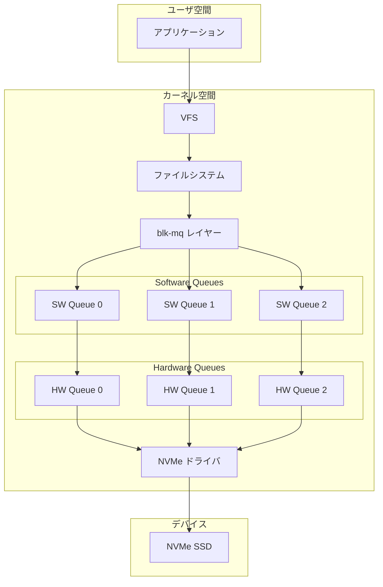

blk-mq は、CPU コアごとにソフトウェアキュー（Software Queue）を持ち、それぞれがハードウェアキュー（Hardware Queue = NVMe の SQ/CQ ペア）にマッピングされる。ドライバの初期化時に、NVMe ドライバは CPU コア数に応じたキューペアを作成し、blk-mq に登録する。

### 4.3 I/O スケジューリングとの関係

NVMe の高いランダム I/O 性能と低レイテンシにより、従来の I/O スケジューラの役割は大きく変わった。HDD 向けのスケジューラ（CFQ、deadline など）は、シーク時間を最小化するためにリクエストの並べ替えを行っていたが、SSD ではシークが存在しないため、この最適化は不要である。

Linux では、NVMe デバイスに対してデフォルトで `none`（no-op スケジューラ）が使用されることが多い。これは、リクエストの並べ替えを行わず、可能な限り速くリクエストをデバイスに発行するシンプルなスケジューラである。一方で、`mq-deadline` スケジューラは、リクエストの公平性やレイテンシ保証が必要な場合に使用されることもある。

```bash
# Check the current I/O scheduler for an NVMe device
cat /sys/block/nvme0n1/queue/scheduler

# Output example: [none] mq-deadline kyber
```

## 5. NVMe over Fabrics（NVMe-oF）

### 5.1 NVMe-oF の動機

NVMe が提供する低レイテンシ・高 IOPS の恩恵は、当初はサーバ内のローカル SSD に限定されていた。しかし、データセンターでは以下の要求がある。

- **ストレージの共有**: 複数のサーバが同一のストレージプールにアクセスしたい
- **ストレージの分離**: コンピュートノードとストレージノードを独立にスケーリングしたい
- **障害分離**: ストレージデバイスの障害がコンピュートノードに影響しないようにしたい

従来は iSCSI（SCSI over TCP/IP）や Fibre Channel が使用されていたが、これらは SCSI プロトコルをベースとしており、NVMe の利点を活かしきれない。NVMe over Fabrics（NVMe-oF）は、NVMe プロトコルをネットワーク越しに拡張することで、ローカル NVMe に近い性能をリモートストレージでも実現することを目指している。

### 5.2 NVMe-oF のアーキテクチャ

NVMe-oF は、NVMe のコマンドセットをそのまま使用しつつ、トランスポート層を抽象化するアーキテクチャを採用している。

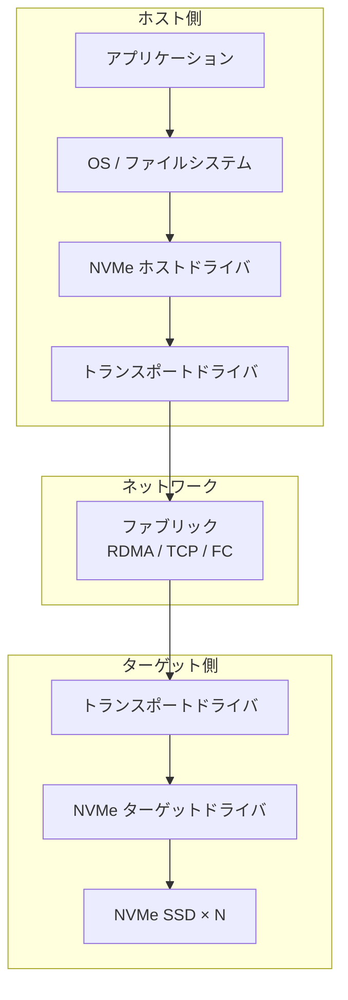

NVMe-oF は以下のトランスポートをサポートしている。

#### RDMA（Remote Direct Memory Access）

RDMA は、リモートマシンのメモリに対して CPU を介さずにデータを読み書きできる技術である。InfiniBand や RoCE（RDMA over Converged Ethernet）上で NVMe-oF を動作させることで、極めて低いレイテンシ（数十マイクロ秒）でリモートストレージにアクセスできる。

RDMA ベースの NVMe-oF の利点:
- カーネルバイパスによる低レイテンシ
- CPU 負荷の低減（ゼロコピー転送）
- ローカル NVMe に近い性能

#### TCP

NVMe/TCP は、標準的な TCP/IP ネットワーク上で NVMe-oF を実現するトランスポートである。特別なハードウェア（RDMA NIC）を必要としないため、既存のネットワークインフラをそのまま活用できる。

レイテンシは RDMA と比較して高くなるが、導入の容易さから広く採用されている。Linux カーネル 5.0 以降で NVMe/TCP のサポートが追加された。

#### Fibre Channel

Fibre Channel（FC）は、ストレージエリアネットワーク（SAN）で広く使用されているプロトコルである。FC-NVMe は、既存の Fibre Channel インフラ上で NVMe-oF を動作させるためのトランスポートマッピングを定義している。

### 5.3 NVMe-oF の性能特性

| トランスポート | 典型的なレイテンシ | スループット | 導入コスト |
|--------------|-----------------|------------|----------|
| ローカル NVMe | ~10 μs | ~7 GB/s | - |
| NVMe/RDMA | ~30-50 μs | ~6 GB/s | 高（RDMA NIC 必要） |
| NVMe/TCP | ~100-200 μs | ~4 GB/s | 低（標準 NIC で可） |
| NVMe/FC | ~50-100 μs | ~5 GB/s | 高（FC インフラ必要） |

::: tip
NVMe/TCP のレイテンシは iSCSI と比較すると大幅に低い。iSCSI では SCSI プロトコル変換のオーバーヘッドが加わるため、同一ネットワーク条件でも NVMe/TCP のほうが有利である。
:::

### 5.4 ディスカバリサービス

NVMe-oF は、ホストがターゲットを動的に発見するためのディスカバリサービスを定義している。ホストはディスカバリコントローラに接続し、利用可能なサブシステムの一覧を取得できる。これは、大規模なストレージファブリック環境で、ホストが自動的にストレージリソースを発見・接続するために不可欠な機能である。

## 6. ZNS（Zoned Namespaces）

### 6.1 従来の SSD の課題

NAND フラッシュは、その物理特性上、書き込み前に消去（erase）が必要であり、消去はブロック単位（通常数百 KB 〜 数 MB）でしか行えない。一方、ホストからの書き込みはページ単位（通常 4-16 KB）で行われる。この粒度の不一致により、SSD コントローラ内部で FTL（Flash Translation Layer）がアドレス変換とガベージコレクション（GC）を行う必要がある。

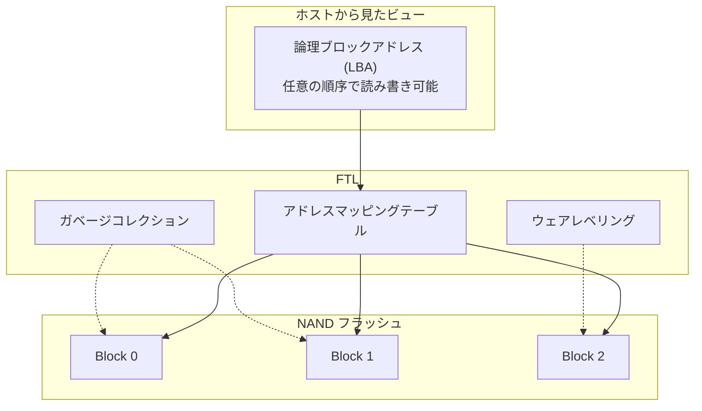

FTL のガベージコレクションは以下の問題を引き起こす。

- **書き込み増幅（Write Amplification）**: GC により、ホストが書き込んだデータ量よりも多くの物理書き込みが発生する
- **テールレイテンシの悪化**: GC が発生すると、I/O レイテンシが予測不能に増大する
- **オーバープロビジョニング**: GC の効率を確保するために、物理容量の一部（通常 7-28%）をユーザに公開しない
- **DRAM 消費**: アドレスマッピングテーブルの維持に大量の DRAM が必要（1TB あたり約 1GB）

### 6.2 ZNS の概念

ZNS（Zoned Namespaces）は、SSD の名前空間をゾーンに分割し、各ゾーン内ではシーケンシャル書き込みのみを許可する NVMe の拡張仕様である。

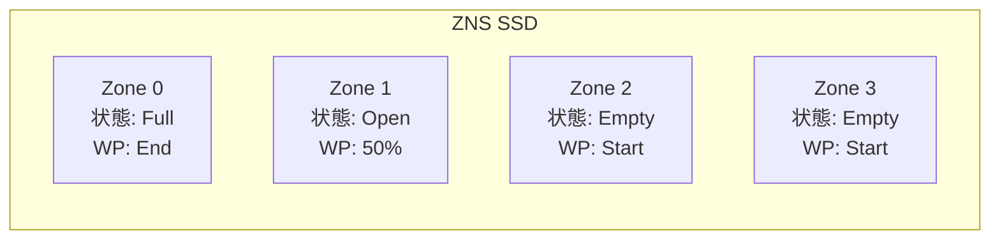

各ゾーンは以下の状態を持つ。

- **Empty**: ゾーンが空で、書き込み可能
- **Open**: ゾーンが開かれており、Write Pointer の位置からシーケンシャルに書き込み可能
- **Closed**: ゾーンが閉じられているが、まだ Full ではない
- **Full**: ゾーンがすべて書き込み済み
- **Read Only**: 読み取り専用
- **Offline**: アクセス不能

ゾーン内ではシーケンシャル書き込みが強制されるため、以下のメリットが生まれる。

1. **FTL の簡素化**: ゾーン内のアドレスマッピングは自明（LBA = 物理アドレス + オフセット）であるため、マッピングテーブルの DRAM 消費を大幅に削減できる
2. **GC の排除**: ホスト側でゾーン単位のデータ配置を管理するため、SSD 内部の GC が不要になる
3. **書き込み増幅の削減**: GC が不要になるため、書き込み増幅比が理想的には 1.0 に近づく
4. **オーバープロビジョニングの削減**: GC 用の予備領域が不要になり、より多くの容量をユーザに公開できる
5. **性能の予測可能性**: GC によるテールレイテンシの悪化がなくなる

### 6.3 ZNS の主要コマンド

ZNS は以下の追加コマンドを定義している。

| コマンド | 説明 |
|---------|------|
| Zone Append | ゾーンの Write Pointer 位置に追記（LBA はデバイスが決定） |
| Zone Management Send | ゾーンの状態遷移（Open, Close, Finish, Reset） |
| Zone Management Receive | ゾーンの状態・属性の取得 |

特に Zone Append は重要なコマンドである。通常の Write コマンドでは、ホストが書き込み先の LBA を指定する必要があるが、Zone Append ではゾーン ID のみを指定すれば、デバイスが Write Pointer の位置に自動的に書き込み、実際の LBA を完了エントリで返す。これにより、複数のホスト（またはスレッド）が同一ゾーンに対して安全に並行書き込みを行えるようになる。

### 6.4 ZNS の活用事例

ZNS は以下のようなワークロードで特に効果を発揮する。

- **ログ構造化ストレージエンジン**: RocksDB や LevelDB のような LSM-Tree ベースのストレージエンジンは、元来シーケンシャル書き込みを中心としたアーキテクチャであり、ZNS との相性が非常に良い
- **ファイルシステム**: F2FS（Flash-Friendly File System）は ZNS サポートを備えており、ゾーンの管理をファイルシステムレベルで行う。Btrfs も ZNS 対応を進めている
- **データベース**: 書き込みが集中するワークロードにおいて、予測可能なレイテンシと高い書き込み効率を提供する

::: warning
ZNS はホスト側にデータ配置の責任を移すため、アプリケーションやファイルシステムの対応が必要である。既存のアプリケーションをそのまま ZNS SSD 上で使用することはできない。
:::

## 7. NVMe と io_uring の連携

### 7.1 io_uring の概要

io_uring は、Linux カーネル 5.1（2019 年）で導入された非同期 I/O インターフェースである。従来の Linux の非同期 I/O メカニズム（POSIX AIO、libaio）の課題を解決するために設計された。

従来のシステムコールベースの I/O では、I/O リクエストの発行と完了確認のたびにシステムコールが必要であり、ユーザ空間とカーネル空間のコンテキストスイッチが発生する。高 IOPS 環境では、このシステムコールオーバーヘッドが無視できない。

io_uring は、NVMe と同様に Submission Queue と Completion Queue のペアを使用するリングバッファ構造を採用しており、両者の設計思想には共通点が多い。

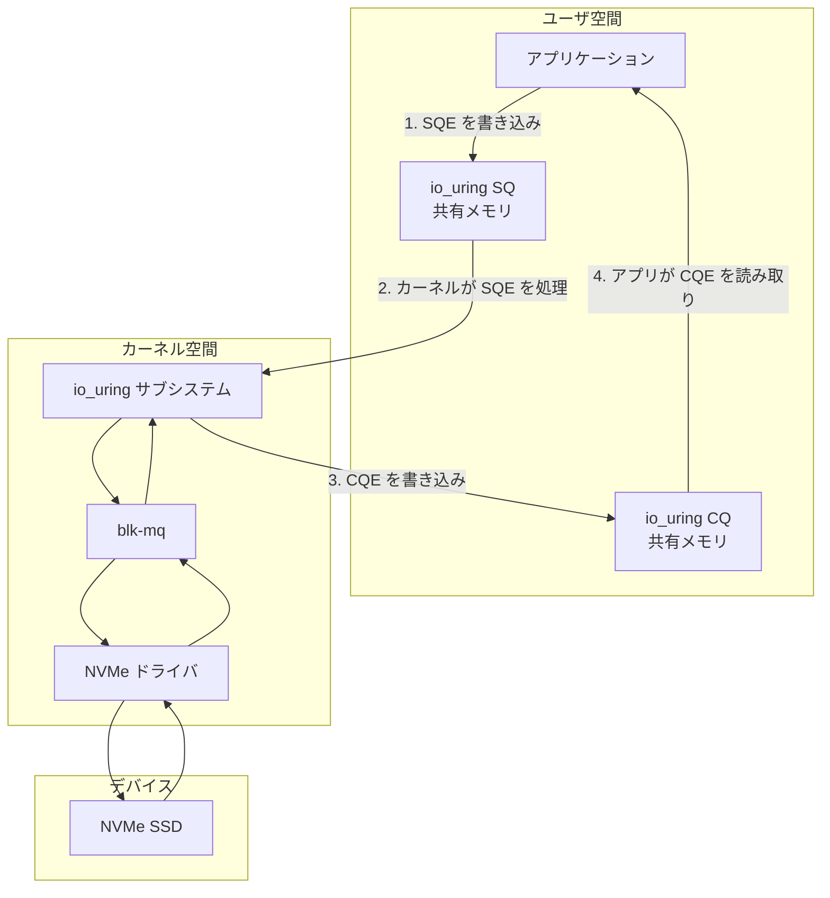

io_uring の主な特徴は以下の通りである。

- **共有メモリによるゼロコピー**: SQ と CQ はユーザ空間とカーネル空間で共有されたメモリ領域に配置される
- **バッチ処理**: 複数の I/O リクエストを 1 回のシステムコール（`io_uring_enter`）でまとめて発行できる
- **カーネルポーリング（SQPOLL）**: カーネルスレッドが SQ をポーリングし、アプリケーションがシステムコールを発行せずに I/O を発行できる

### 7.2 io_uring passthrough（NVMe コマンドパススルー）

Linux カーネル 5.19 以降では、io_uring から NVMe コマンドを直接発行する「io_uring passthrough」機能が利用可能である。これにより、ファイルシステムやブロックレイヤーを完全にバイパスして、ユーザ空間から NVMe コマンドをデバイスに直接送信できる。

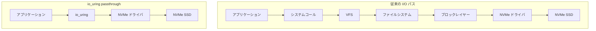

パススルーモードでは、アプリケーションが NVMe の SQE（Submission Queue Entry）を直接構築し、io_uring を通じてデバイスに送信する。これにより、ファイルシステムやブロックレイヤーのオーバーヘッド（I/O スケジューリング、ページキャッシュ管理、ブロックマージなど）を完全に排除できる。

以下に io_uring passthrough の基本的な使用例を示す。

```c
#include <linux/io_uring.h>
#include <linux/nvme_ioctl.h>

struct nvme_uring_cmd {
    __u8    opcode;       // NVMe opcode (e.g., nvme_cmd_read)
    __u8    flags;
    __u16   rsvd1;
    __u32   nsid;         // Namespace ID
    __u32   cdw2;
    __u32   cdw3;
    __u64   metadata;
    __u64   addr;         // Data buffer address
    __u32   metadata_len;
    __u32   data_len;     // Data buffer length
    __u32   cdw10;        // Starting LBA (lower 32 bits)
    __u32   cdw11;        // Starting LBA (upper 32 bits)
    __u32   cdw12;        // Number of logical blocks - 1
    __u32   cdw13;
    __u32   cdw14;
    __u32   cdw15;
    __u32   timeout_ms;
    __u32   rsvd2;
};
```

::: details io_uring passthrough の利点と制約
**利点:**
- ファイルシステムとブロックレイヤーのオーバーヘッドを排除
- NVMe 固有の機能（Zone Append、Vendor Specific コマンドなど）に直接アクセス可能
- 高 IOPS 環境（数百万 IOPS）での性能向上

**制約:**
- アプリケーションが NVMe プロトコルを直接扱う必要があり、開発の複雑さが増す
- ファイルシステムのキャッシュやジャーナリングなどの恩恵を受けられない
- デバイス固有の実装に依存する可能性がある
:::

### 7.3 SQPOLL モードとの組み合わせ

io_uring の SQPOLL モードでは、カーネルスレッドが SQ をポーリングするため、アプリケーションは `io_uring_enter` システムコールすら不要になる。NVMe の高 IOPS 性能を最大限に引き出すには、この SQPOLL モードと NVMe パススルーを組み合わせることで、ユーザ空間からシステムコールなしでデバイスに I/O を発行できる。

この組み合わせにより、理論上はシステムコールのオーバーヘッドがゼロになり、NVMe のハードウェア性能に限りなく近い I/O レイテンシを実現できる。ただし、SQPOLL モードでは専用のカーネルスレッドが常にポーリングするため、CPU リソースを消費する点に注意が必要である。

## 8. NVMe のパフォーマンス特性

### 8.1 主要な性能指標

NVMe SSD の性能は、以下の指標で評価される。

- **シーケンシャル読み取り / 書き込み**: 連続したアドレスに対する大きなブロック転送の速度。PCIe の帯域幅に依存する
- **ランダム読み取り / 書き込み（IOPS）**: 小さなブロック（通常 4KB）のランダムアクセス性能。NVMe のマルチキュー設計が最も効果を発揮する指標
- **レイテンシ**: 個々の I/O リクエストの応答時間。平均値だけでなく、99 パーセンタイルや 99.9 パーセンタイルのテールレイテンシが重要

### 8.2 典型的な性能値

現代のハイエンド NVMe SSD（PCIe Gen5 x4）の典型的な性能値は以下の通りである。

| 指標 | 値 |
|------|-----|
| シーケンシャル読み取り | ~12 GB/s |
| シーケンシャル書き込み | ~10 GB/s |
| ランダム読み取り (4KB, QD=256) | ~2,000,000 IOPS |
| ランダム書き込み (4KB, QD=256) | ~400,000 IOPS |
| 読み取りレイテンシ (4KB, QD=1) | ~30-50 μs |
| 書き込みレイテンシ (4KB, QD=1) | ~10-20 μs |

::: tip
IOPS の値はキュー深度（QD）に大きく依存する。QD=1 の場合、デバイスは常に 1 つのコマンドしか処理できないため、レイテンシの逆数が IOPS の上限となる。例えば、レイテンシが 50 μs の場合、QD=1 での IOPS は最大 20,000 に制限される。QD を増やすことで、デバイス内部の並列性が活かされ、IOPS は劇的に向上する。
:::

### 8.3 性能に影響する要因

NVMe SSD の実際の性能は、スペックシート上の最大値とは大きく異なることがある。以下の要因が性能に影響する。

**NAND フラッシュの構造的要因:**
- **セルタイプ（SLC / MLC / TLC / QLC）**: セルあたりのビット数が増えるほど、書き込み速度とレイテンシが悪化する
- **SLC キャッシュ**: 多くの SSD は高速な SLC モード領域をキャッシュとして使用し、キャッシュが枯渇すると書き込み速度が大幅に低下する
- **サーマルスロットリング**: 温度上昇により、コントローラが自動的に性能を制限する

**ソフトウェア的要因:**
- **キュー深度**: 前述の通り、QD が低いと並列性を活かせない
- **ブロックサイズ**: 小さすぎるブロックサイズでは、コマンド処理のオーバーヘッドが支配的になる
- **ソフトウェアスタックのオーバーヘッド**: ファイルシステム、ブロックレイヤー、ドライバのオーバーヘッドがデバイスのレイテンシに上乗せされる

### 8.4 ベンチマーク手法

NVMe SSD のベンチマークには、fio（Flexible I/O Tester）が広く使用されている。以下に典型的な設定例を示す。

```ini
[global]
ioengine=io_uring
direct=1
bs=4k
runtime=60
time_based=1
group_reporting=1
numjobs=4

[randread]
rw=randread
iodepth=64
filename=/dev/nvme0n1

[randwrite]
rw=randwrite
iodepth=64
filename=/dev/nvme0n1
```

```bash
# Run fio benchmark with io_uring engine
fio nvme_benchmark.fio

# Quick random read test
fio --name=randread --ioengine=io_uring --direct=1 \
    --bs=4k --iodepth=256 --numjobs=4 \
    --rw=randread --runtime=30 --filename=/dev/nvme0n1
```

ベンチマークの際は以下の点に注意が必要である。

1. **十分なウォームアップ**: SSD 内部の状態（SLC キャッシュ、GC の状態など）を安定させるために、十分なウォームアップ時間を確保する
2. **Steady State の測定**: ベンチマーク結果は、デバイスが定常状態（Steady State）に達した後の値で評価する
3. **テールレイテンシの記録**: 平均レイテンシだけでなく、p99、p99.9 のレイテンシを記録する

## 9. 次世代ストレージの展望

### 9.1 CXL（Compute Express Link）との融合

CXL は、CPU とデバイス間のメモリセマンティクスを持つ高速インターコネクトであり、PCIe をベースとしている。CXL 3.0 では、メモリプーリングやメモリ共有の機能が強化されており、NVMe SSD が CXL メモリデバイスと連携する将来像が検討されている。

CXL.mem プロトコルにより、NVMe SSD の一部をバイトアドレッサブルなメモリとして CPU に公開することが可能になれば、ストレージとメモリの境界がさらに曖昧になる。これは、DRAM とストレージの間のギャップを埋める新しいメモリ階層の実現につながる可能性がある。

### 9.2 Computational Storage

Computational Storage は、ストレージデバイス内にコンピュート機能（FPGA、ARM コアなど）を搭載し、データの近くで計算を行うアプローチである。NVMe 仕様には Computational Programs コマンドセットの検討が進んでおり、ホストからデバイス内のコンピュートリソースに処理をオフロードできるようになる。

典型的なユースケースとして以下が挙げられる。

- **データ圧縮・展開**: デバイス内で圧縮を行い、PCIe バスの帯域幅を節約
- **データフィルタリング**: 大規模なテーブルスキャンで、条件に合致するデータのみをホストに転送
- **暗号化・ハッシュ計算**: セキュリティ関連の処理をデバイスにオフロード

### 9.3 FDP（Flexible Data Placement）

FDP は、NVMe 2.0 で導入されたデータ配置制御機能であり、ZNS のコンセプトを後方互換性を保ちながら実現するアプローチである。

ZNS はシーケンシャル書き込みの制約をホストに課すため、既存のアプリケーションやファイルシステムとの互換性に課題があった。FDP は、ホストがデータのプレースメントヒント（Reclaim Unit Handle）を提供することで、SSD コントローラが関連するデータを同じ消去ブロックにグルーピングする仕組みを提供する。

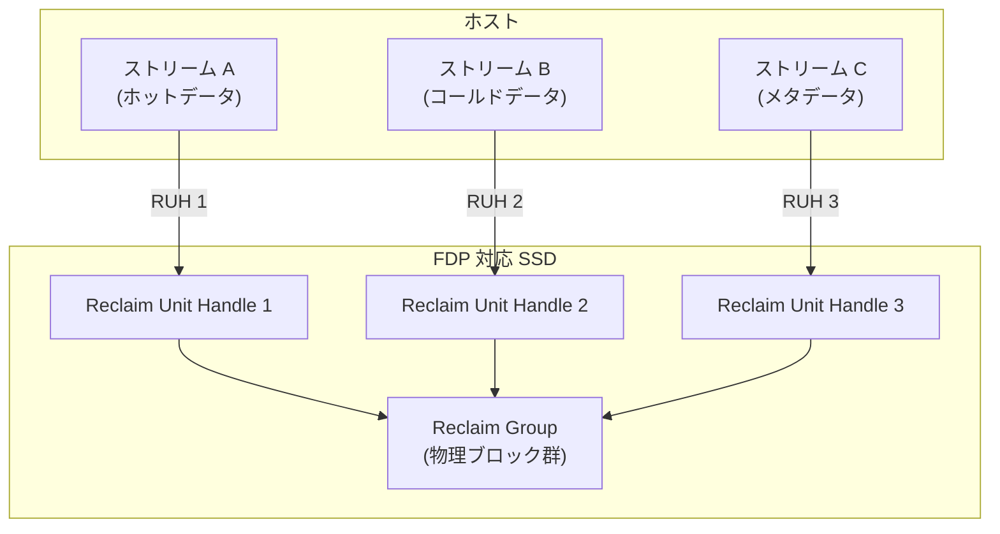

FDP の利点は以下の通りである。

- **後方互換性**: 通常の NVMe Write コマンドがそのまま使用でき、追加のプレースメントヒントはオプション
- **GC 効率の向上**: 同一ライフタイムのデータがグルーピングされるため、GC 時の有効データコピーが減少
- **導入の容易さ**: ZNS と比較して、アプリケーションの変更が最小限で済む

### 9.4 PCIe Gen6 と将来の帯域幅

PCIe Gen6 は、PAM4（4-level Pulse Amplitude Modulation）変調方式を採用し、1 レーンあたり 64 GT/s（約 8 GB/s）の帯域幅を提供する。x4 構成で約 32 GB/s の帯域幅が利用可能になり、これは現行の PCIe Gen5 の 2 倍に相当する。

しかし、帯域幅の増加に伴い、以下の新たな課題が浮上している。

- **CPU 処理のボトルネック**: I/O パスのソフトウェアオーバーヘッドが、デバイスの帯域幅を使い切る上での制約になる可能性がある
- **電力消費**: 高帯域幅を維持するための電力消費が増大する
- **信号完全性**: PAM4 変調はノイズに弱く、基板設計やケーブル品質の要求が高くなる

### 9.5 NVMe の標準化の方向性

NVMe 仕様は、NVM Express Inc. という業界コンソーシアムによって管理されており、継続的に進化している。今後の主な方向性として以下が挙げられる。

1. **Key-Value コマンドセット**: NVMe デバイスが直接 Key-Value ストアとして機能するコマンドセット
2. **エンデュランスグループの管理**: デバイスの寿命管理をより細粒度で行うための機能
3. **セキュリティの強化**: TCG（Trusted Computing Group）との連携による暗号化と認証の標準化
4. **サステナビリティ**: エネルギー効率と環境負荷に配慮した機能（電力管理の高度化など）

## まとめ

NVMe は、HDD 時代の遺産である AHCI/SATA の制約を根本から取り払い、フラッシュストレージの並列性を最大限に引き出すために設計されたプロトコルである。その核心は、マルチキューアーキテクチャによるロックフリーな並列 I/O 発行と、PCIe バスへの直接接続による低レイテンシの実現にある。

NVMe over Fabrics はこの恩恵をネットワーク越しに拡張し、ZNS はホストとデバイスの協調によりフラッシュメディアの物理特性に即した効率的なデータ配置を可能にした。さらに、io_uring との連携により、ソフトウェアスタック全体でのオーバーヘッド削減が進み、ハードウェア性能に限りなく近い I/O 処理が実現されつつある。

次世代のストレージは、CXL による新しいメモリ階層、Computational Storage によるデータ近傍処理、FDP による柔軟なデータ配置など、多方面にわたって進化を続けている。NVMe はこれらの技術の中核的なプロトコルとして、今後もストレージ技術の発展を牽引していくであろう。
